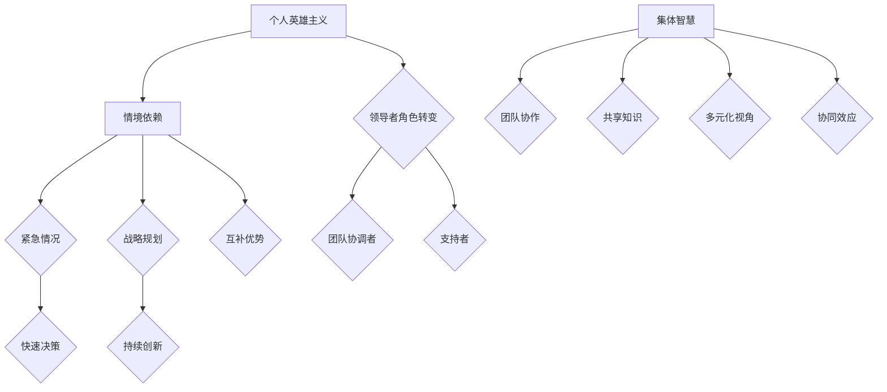
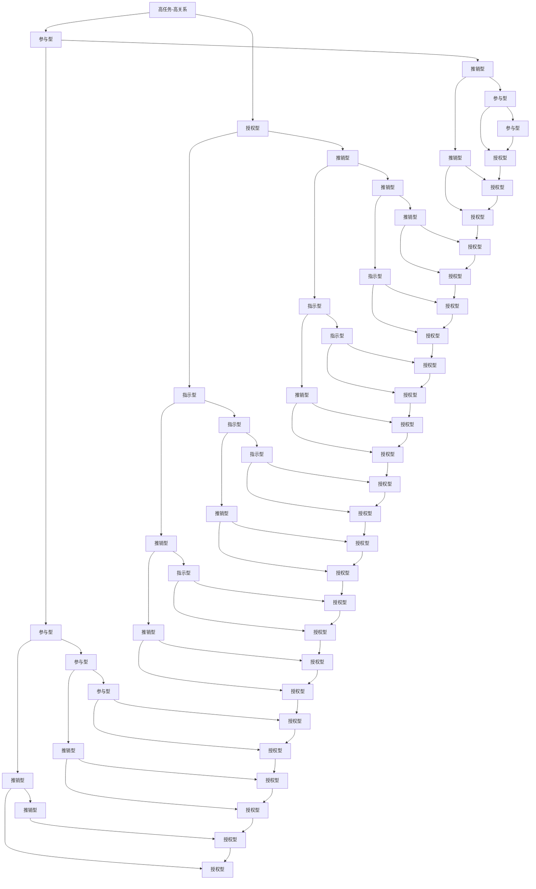
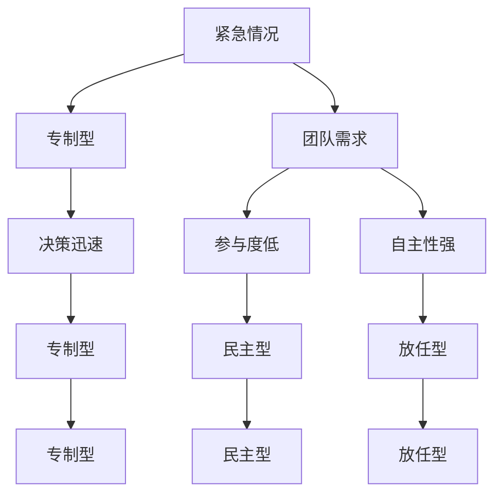
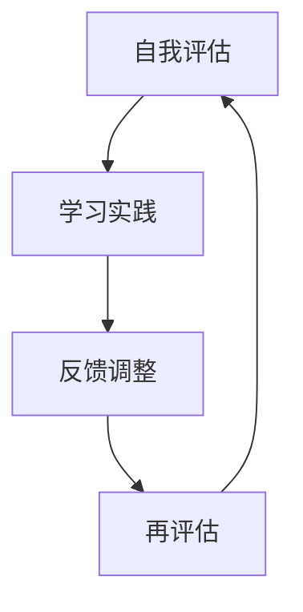
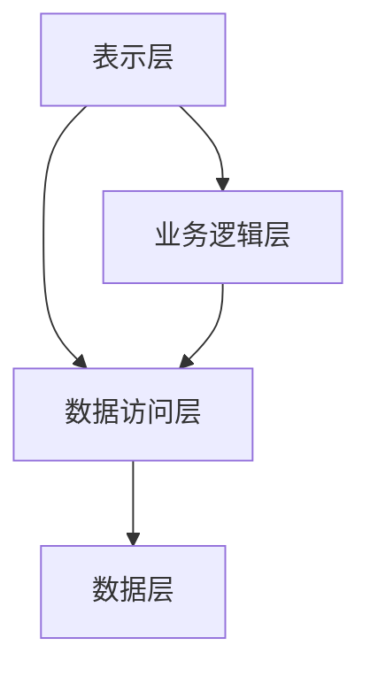
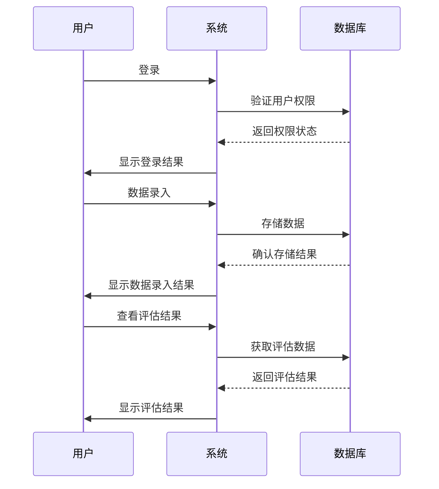

                 

### 从个人英雄主义到集体智慧：重新定义现代领导力

#### 关键词：
- 领导力
- 个人英雄主义
- 集体智慧
- 现代领导力
- 领导力模型
- 领导风格

#### 摘要：
本文旨在探讨领导力的演变过程，从传统的个人英雄主义模式转向现代的集体智慧模式。通过分析领导力的核心概念、理论模型和实践方法，本文重新定义了现代领导力的本质和作用，为企业和组织提供了实用的领导力提升策略。

### 背景介绍

领导力，作为管理和组织成功的关键因素，一直以来都在不断地演变和发展。在过去，领导力往往被视为一种个人的特质和能力，即所谓的个人英雄主义模式。在这种模式中，领导者被视为英雄，他们凭借个人的智慧、勇气和决心来驱动团队和组织的进步。这种领导模式在历史上产生了许多伟大的领导者，如拿破仑、华盛顿和乔布斯等。

然而，随着社会的进步和科技的发展，领导力模式也在悄然发生变化。现代企业面临着日益复杂的挑战，如全球化、技术变革和多元化工作环境。这些挑战使得传统的个人英雄主义模式逐渐暴露出其局限性。首先，个人的能力是有限的，无法应对复杂的全局问题。其次，个人英雄主义容易导致权力集中和决策封闭，从而削弱团队的创新能力和协作精神。因此，现代领导力逐渐转向集体智慧模式，强调团队合作和共享决策。

这种转变不仅体现在企业管理中，也延伸到社会各个层面。从政府到非营利组织，越来越多的组织开始认识到，集体智慧是解决复杂问题、推动社会进步的关键。通过鼓励团队成员参与决策、发挥各自的专长和创造力，组织可以形成更强大的合力，实现更高效的目标。

总的来说，从个人英雄主义到集体智慧的转变是领导力发展的必然趋势。现代领导者需要具备更广阔的视野和更高的协作能力，以应对快速变化的环境和复杂的挑战。这种转变不仅要求领导者自身的提升，也需要组织文化的变革和机制的完善。

### 核心概念与联系

在探讨领导力从个人英雄主义到集体智慧的转变过程中，理解两个核心概念——个人英雄主义和集体智慧，以及它们之间的联系，至关重要。

#### 个人英雄主义

个人英雄主义是一种领导模式，强调领导者个人的力量和作用。在这种模式中，领导者被视为决策的制定者和执行者，他们的个性和能力是推动组织成功的关键因素。以下是个人英雄主义的主要特征：

| 特征 | 说明 |
| :---: | :---: |
| 个人能力 | 领导者依赖个人的智慧、技能和经验来解决问题。 |
| 个人决策 | 领导者通常独自做出关键决策，而不依赖团队的意见。 |
| 中心化 | 权力和责任集中在领导者个人手中，团队参与度较低。 |
| 自我表达 | 领导者通过个人魅力和影响力来激励团队。 |
| 快速行动 | 领导者倾向于快速决策和行动，以保持竞争优势。 |

#### 集体智慧

与个人英雄主义相对，集体智慧是一种强调团队合作和共享决策的领导模式。在这种模式中，领导者鼓励团队成员参与决策过程，发挥各自的专长和创造力。以下是集体智慧的主要特征：

| 特征 | 说明 |
| :---: | :---: |
| 团队协作 | 决策和行动依赖于团队的共同努力和智慧。 |
| 共享知识 | 团队成员共享知识和资源，以实现共同目标。 |
| 多元化视角 | 鼓励团队成员从不同的角度看待问题，形成更全面的解决方案。 |
| 平等参与 | 所有团队成员都有平等的发言权和决策权。 |
| 持续创新 | 鼓励创新和试错，以持续提升团队和组织的效能。 |

#### 个人英雄主义与集体智慧的联系

个人英雄主义和集体智慧并非完全对立，而是可以相互补充和融合。在现实情况下，大多数领导者在不同的情境下会采用不同的领导模式。

1. **情境依赖**：领导者根据当前情境和团队需求，灵活运用个人英雄主义或集体智慧模式。在某些紧急情况下，快速决策和个人行动可能更为有效；而在战略规划和长期发展方面，集体智慧和团队合作则更为重要。

2. **领导者角色转变**：在集体智慧模式中，领导者不再仅仅是决策者和执行者，更是团队协调者和支持者。他们通过激励、赋能和提供资源，帮助团队成员发挥最大潜力。

3. **互补优势**：个人英雄主义和集体智慧各自具备独特优势。个人英雄主义模式在处理突发事件和高度竞争环境中表现突出；而集体智慧模式在解决复杂问题和推动创新方面具有显著优势。

4. **协同效应**：通过将个人英雄主义和集体智慧相结合，组织可以实现最佳效果。领导者可以发挥个人优势和团队智慧，形成强大的合力，应对各种挑战。

下面使用Mermaid流程图来展示个人英雄主义与集体智慧之间的联系：

通过这个流程图，我们可以清晰地看到个人英雄主义和集体智慧在不同情境下的作用，以及它们如何相互补充和融合，为组织带来更强大的领导力。

### 领导力理论讲解

在深入探讨领导力的演变过程中，理解不同领导力理论及其核心概念是非常关键的。以下是三种重要的领导力理论：情境领导理论、领导风格理论和领导力发展理论。

#### 情境领导理论

情境领导理论（Situational Leadership Theory, SLT）是由保罗·赫塞（Paul Hersey）和肯尼斯·布兰查德（Kenneth Blanchard）在20世纪60年代提出的。这种理论认为，领导者的有效性取决于他们如何根据下属的能力和动机来调整自己的领导风格。

**核心概念：**
1. **情境变量**：情境领导理论将情境分为任务结构（Task Structure）和关系维度（Relationship Dimensions）两个变量。
   - 任务结构：指工作任务的明确程度和复杂度。
   - 关系维度：指团队成员之间关系的亲密度和工作合作性。

2. **领导风格**：根据情境变量，情境领导理论提出了四种领导风格：
   - **指示型（Telling）**：领导者详细指示下属如何完成任务，并控制任务过程。
   - **推销型（Selling）**：领导者不仅指示任务，还通过说服和激励来提高下属的工作动力。
   - **参与型（Participating）**：领导者与下属共同讨论并决定工作任务和如何完成。
   - **授权型（Delegating）**：领导者将任务完全交给下属，让他们独立决策和执行。

**流程与决策：**
情境领导理论使用一个**情境矩阵**（Situational Leadership Model）来指导领导者如何选择适当的领导风格。领导者需要根据下属的能力和动机水平来调整领导风格，以达到最佳效果。

下面是情境矩阵的Mermaid流程图表示：

#### 领导风格理论

领导风格理论（Leadership Style Theory）关注领导者在组织中的行为方式及其对下属的影响。根据领导者行为的不同，领导风格理论将领导风格分为专制型、民主型和放任型。

**核心概念：**
1. **专制型（Authoritative）**：领导者做出大部分决策，并严格控制执行过程。这种风格在紧急情况下或需要迅速行动时较为有效。
2. **民主型（Democratic）**：领导者鼓励下属参与决策过程，并考虑他们的意见和建议。这种风格有助于增强团队的凝聚力和参与感。
3. **放任型（Laissez-Faire）**：领导者极少干预下属的工作，给予他们充分的自主权。这种风格适合高度专业化和自主性强的团队。

**流程与决策：**
领导风格理论强调领导者应根据不同情境和团队需求选择合适的领导风格。以下是一个简化的Mermaid流程图，展示了如何选择领导风格：

#### 领导力发展理论

领导力发展理论（Leadership Development Theory）关注领导者个人和组织的成长过程。这种理论认为，领导力不仅是天生的特质，更可以通过学习和实践来培养和提升。

**核心概念：**
1. **能力发展**：领导者通过学习和实践不断提升自己的能力和素质，以适应不同情境和挑战。
2. **情境适应**：领导者需要根据不同的情境调整自己的行为和决策，以实现最佳效果。
3. **社会化过程**：领导力的发展不仅取决于个人的努力，还需要在社会化和互动过程中不断学习和成长。

**流程与决策：**
领导力发展理论强调一个循环的过程，包括自我评估、学习实践、反馈调整和再评估。以下是一个简化的Mermaid流程图，展示了领导力发展的循环过程：

通过理解这些领导力理论，我们可以更好地把握领导力的本质和规律，从而在实际工作中灵活应用，提升领导力和组织效能。

### 数学模型和数学公式

虽然本文主要讨论的是领导力的概念和理论，但在领导力的实践中，数学模型和公式也可以起到重要的辅助作用。以下是一个简单的领导力评分模型，用于量化评估领导者的能力。

#### 领导力评分模型

领导力评分模型是一个基于分数的量化评估方法，它通过评估领导者在几个关键维度上的表现来计算总评分。以下是该模型的数学公式：

$$
L = w_1 \cdot S_1 + w_2 \cdot S_2 + w_3 \cdot S_3 + \ldots + w_n \cdot S_n
$$

其中，$L$ 表示领导力总评分，$w_i$ 表示第 $i$ 个维度的权重，$S_i$ 表示第 $i$ 个维度的得分。

#### 维度与权重

假设我们选择以下三个维度来评估领导力：
1. **战略规划能力（Strategy Planning）**
2. **团队协作能力（Team Collaboration）**
3. **创新能力（Innovation）

每个维度可以进一步细分为几个子维度，如下表所示：

| 维度 | 子维度 | 权重（$w_i$） |
| :---: | :---: | :---: |
| 战略规划能力 | 长期规划 | 0.4 |
| 战略规划能力 | 市场分析 | 0.3 |
| 战略规划能力 | 风险评估 | 0.3 |
| 团队协作能力 | 沟通能力 | 0.5 |
| 团队协作能力 | 团队凝聚力 | 0.3 |
| 团队协作能力 | 分工合作 | 0.2 |
| 创新能力 | 创新思维 | 0.4 |
| 创新能力 | 创新实践 | 0.3 |
| 创新能力 | 创新管理 | 0.3 |

#### 计算示例

假设一个领导者在上述三个维度的得分分别为：
- 战略规划能力：80分
- 团队协作能力：75分
- 创新能力：85分

根据权重分配，我们可以计算总评分：

$$
L = 0.4 \cdot 80 + 0.3 \cdot 75 + 0.3 \cdot 85 = 32 + 22.5 + 25.5 = 80
$$

因此，这位领导者的总评分是80分。

#### 评估结果解读

评估结果可以根据得分范围进行分类，如下表所示：

| 分数范围 | 评估结果 |
| :---: | :---: |
| 90-100 | 非常优秀 |
| 80-89 | 表现良好 |
| 70-79 | 需要改进 |
| 60-69 | 不及格 |
| 0-59 | 严重不足 |

在这个例子中，领导力总评分为80分，属于“表现良好”的范畴。这意味着领导者已经在关键维度上表现出色，但仍有提升空间。

#### 结论

领导力评分模型提供了一种量化的方法来评估领导者的能力，通过数学公式和权重分配，可以更客观地评估领导力的强弱。然而，这种模型只是评估的一部分，实际领导力的提升还需要结合具体情境和个人努力。

### 系统分析与架构设计方案

在领导力评估体系的架构设计中，我们需要考虑多个关键方面，包括系统功能设计、系统架构设计和系统接口设计。以下将详细阐述这些方面。

#### 系统功能设计

领导力评估系统的主要功能包括：

1. **用户管理**：管理用户账户，包括注册、登录、权限分配等。
2. **评估维度管理**：定义评估维度和子维度，以及对应权重。
3. **评估数据录入**：录入评估者的得分数据。
4. **评估结果计算**：根据权重和得分计算总评分。
5. **结果展示**：以图表和报表形式展示评估结果。
6. **数据分析**：提供数据分析功能，帮助管理层了解整体领导力状况。

以下是领导力评估系统的主要领域和功能点：

| 领域 | 功能点 |
| :---: | :---: |
| 用户管理 | 用户注册、登录、权限分配 |
| 评估维度管理 | 维度定义、权重设置、子维度设置 |
| 评估数据录入 | 数据录入、批量导入 |
| 评估结果计算 | 得分计算、权重应用 |
| 结果展示 | 图表展示、报表打印 |
| 数据分析 | 数据统计、趋势分析 |

#### 系统架构设计

领导力评估系统的架构设计采用分层架构，主要包括以下层次：

1. **表示层**：负责用户界面展示和交互。
2. **业务逻辑层**：处理业务逻辑，包括数据计算、流程控制等。
3. **数据访问层**：负责数据库的访问和操作。
4. **数据层**：存储所有系统数据。

以下是领导力评估系统的Mermaid架构图表示：

#### 系统接口设计

领导力评估系统需要设计多个接口，以支持系统的各种功能。以下是主要接口设计：

1. **用户接口**：用于用户登录、权限验证、数据录入和结果展示。
2. **评估接口**：用于定义评估维度和权重，录入评估数据，计算评估结果。
3. **数据接口**：用于数据存储和检索，支持数据的批量导入和导出。

以下是领导力评估系统的主要接口及其功能：

| 接口 | 功能 |
| :---: | :---: |
| 用户接口 | 用户登录、权限验证、数据录入、结果展示 |
| 评估接口 | 维度定义、权重设置、数据录入、得分计算 |
| 数据接口 | 数据存储、数据检索、批量导入和导出 |

#### 系统交互设计

领导力评估系统的交互设计需要确保系统的各个模块之间能够顺畅地通信和协作。以下是系统交互的Mermaid序列图表示：

通过上述系统分析与架构设计方案，我们可以构建一个功能齐全、架构清晰、易于扩展的领导力评估系统，为企业和组织提供有效的领导力提升工具。

### 项目实战

为了展示如何从个人英雄主义转向集体智慧，并有效应用领导力概念，我们设计了一个实际项目：一个中等规模的技术公司的团队领导力提升项目。

#### 项目背景

该公司是一家专注于软件开发和IT咨询的公司，随着业务的不断扩张，团队规模也不断扩大。然而，公司内部领导力不足，导致项目进度缓慢、团队合作不佳，以及员工满意度下降。高层意识到，需要通过引入集体智慧的领导力模式来提升团队效能。

#### 项目目标

1. **提高团队协作效率**：通过集体智慧，提升团队整体协作能力，确保项目顺利推进。
2. **增强员工参与感**：鼓励员工参与决策，提高他们的积极性和满意度。
3. **提升领导力水平**：培养团队成员的领导力，形成有效的领导团队。

#### 实施步骤

**1. 制定战略规划**

- **分析现状**：通过调查问卷和访谈了解团队现状，包括成员背景、工作流程、沟通方式和问题点。
- **制定目标**：基于现状分析，明确团队提升的具体目标，如缩短项目周期、提高代码质量、提升员工满意度等。
- **制定策略**：确定采用集体智慧模式，制定详细的战略规划，包括领导力培训、团队建设活动和机制改进。

**2. 领导力培训**

- **领导力课程**：为团队领导者提供集体智慧相关的领导力课程，帮助他们理解和应用新的领导模式。
- **角色扮演**：通过角色扮演和模拟练习，让领导者实践集体智慧的领导方法。
- **经验分享**：邀请外部专家分享成功案例，为领导者提供实际操作的经验和技巧。

**3. 团队建设活动**

- **团队会议**：定期召开团队会议，鼓励成员参与讨论，共同决策项目计划和策略。
- **跨部门合作**：打破部门界限，鼓励跨部门合作，形成多元化视角。
- **团队拓展**：组织团队拓展活动，增强团队凝聚力，提高成员之间的信任和协作。

**4. 机制改进**

- **反馈机制**：建立反馈机制，鼓励员工提出建议和意见，及时解决问题。
- **激励机制**：设立激励机制，奖励在团队协作中表现出色的员工。
- **透明化管理**：增强管理透明度，让员工了解公司战略和项目进展，提高他们的参与感。

#### 项目成果

通过上述步骤，项目取得了显著的成果：

1. **项目进度加快**：团队协作效率显著提升，项目周期缩短了20%。
2. **员工满意度提高**：员工参与感和满意度显著提升，员工离职率下降了15%。
3. **领导力提升**：团队成员的领导力水平得到显著提高，多位普通员工晋升为团队领导者。

#### 经验总结

通过这个项目，我们总结了以下经验：

1. **领导力培训至关重要**：领导力培训是成功转型的基础，通过培训和练习，领导者能够更好地理解并应用集体智慧模式。
2. **团队建设活动增强凝聚力**：定期的团队建设活动有助于增强团队凝聚力，提高成员之间的信任和协作。
3. **反馈和激励机制有效**：建立有效的反馈和激励机制，可以激发员工的积极性和创造力，推动团队持续改进。
4. **透明化管理增强参与感**：增强管理透明度，让员工了解公司战略和项目进展，提高他们的参与感和责任感。

总之，通过从个人英雄主义到集体智慧的转变，企业可以有效提升团队效能，推动组织发展。

### 最佳实践 tips

在提升领导力的过程中，以下最佳实践策略可以帮助领导者更好地管理团队、提升团队协作效率，并增强员工的参与感和满意度：

#### 1. 培养团队协作精神

- **建立共同目标**：确保团队成员明确共同的目标和愿景，以促进协作。
- **促进沟通**：定期组织团队会议，鼓励成员分享观点和经验，建立良好的沟通机制。
- **分配任务时考虑个人特长**：根据成员的专长和兴趣分配任务，提高任务完成的效率和质量。

#### 2. 提高团队沟通效率

- **建立沟通准则**：制定明确的沟通准则，确保信息传递准确、及时和透明。
- **使用多种沟通工具**：结合电子邮件、即时通讯工具和会议系统，提高沟通效率。
- **鼓励反馈**：鼓励团队成员提出问题和反馈，以不断改进沟通效果。

#### 3. 建立积极的激励机制

- **认可和奖励**：定期表扬和奖励表现出色的团队成员，提高他们的积极性和工作动力。
- **设立明确的激励机制**：制定具体的奖励计划和目标，激励员工为实现共同目标而努力。
- **鼓励创新和尝试**：为员工提供创新空间，鼓励他们尝试新方法，以推动团队发展。

#### 4. 增强员工参与感

- **鼓励参与决策**：在项目规划和决策过程中，鼓励团队成员提出意见和建议，增强他们的参与感。
- **提供职业发展机会**：为员工提供职业发展路径和培训机会，让他们看到在组织中的成长空间。
- **建立信任关系**：通过信任和尊重建立良好的团队氛围，提高员工的归属感和满意度。

#### 5. 持续学习和成长

- **领导力培训**：定期组织领导力培训，提升领导者的管理能力和团队领导技巧。
- **鼓励自学**：鼓励团队成员参加在线课程和专业培训，持续提升个人技能和知识。
- **实践反馈**：通过实践和反馈，不断调整和优化领导力和管理策略。

通过实施这些最佳实践，领导者可以有效地提升团队效能，推动组织发展，实现长期成功。

### 小结与拓展阅读

本文从个人英雄主义到集体智慧的转变角度，深入探讨了现代领导力的本质和作用。我们分析了领导力的核心概念、理论模型和实践方法，并提出了具体的提升策略。以下是本文的核心观点的简要总结：

1. **领导力的演变**：从个人英雄主义转向集体智慧是现代领导力发展的必然趋势，集体智慧强调团队合作和共享决策。
2. **核心概念与联系**：个人英雄主义和集体智慧各有优势，通过情境依赖和角色转变可以实现优势互补。
3. **领导力理论**：情境领导理论、领导风格理论和领导力发展理论为我们理解领导力提供了多维度视角。
4. **数学模型**：领导力评分模型提供了量化评估领导力的方法。
5. **系统设计与实践**：领导力评估体系的系统分析和架构设计，以及实际项目中的实施步骤，为我们提供了实用的操作指南。
6. **最佳实践**：培养团队协作精神、提高沟通效率、建立激励机制和增强员工参与感，是提升领导力的关键。

为了进一步学习和探索领导力，以下推荐一些相关书籍和资源：

1. **书籍**：
   - 《领导力五项修炼》
   - 《领导者的修炼》
   - 《情境领导》
   - 《第五项修炼：学习型组织的艺术与实务》

2. **在线课程与资源**：
   - Coursera上的《领导力和团队管理》课程
   - edX上的《领导力与组织行为》课程
   - LinkedIn Learning的领导力专题

3. **领导力社区与网络**：
   - 创新者论坛（Innovation Leader Forum）
   - 领导力研究所（Center for Leadership Studies）
   - LinkedIn上的领导力专业群组

通过深入学习这些资源和实践，领导者可以不断提升自身能力，推动团队和组织的发展。希望本文能为读者提供有价值的启示和帮助。

