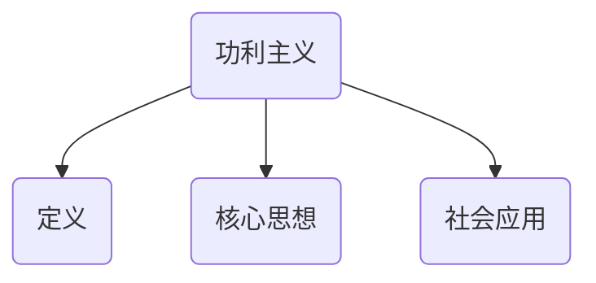
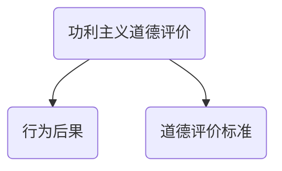
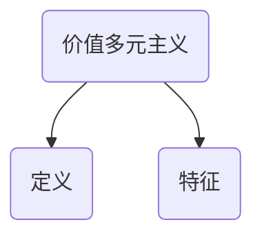
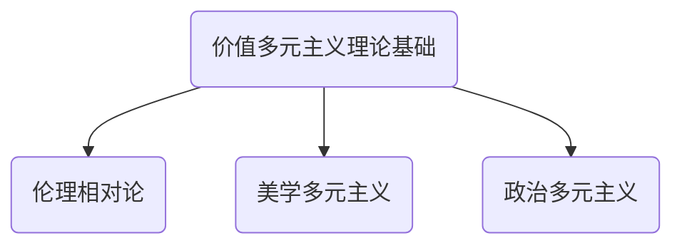
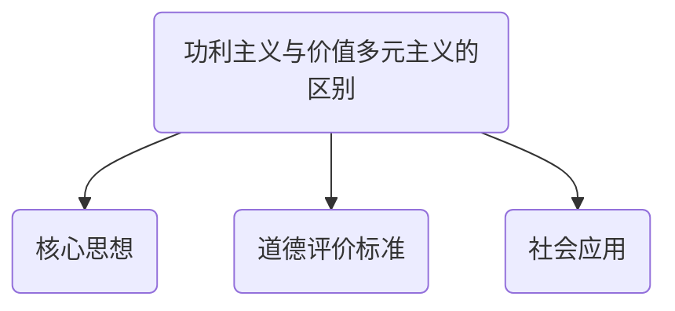
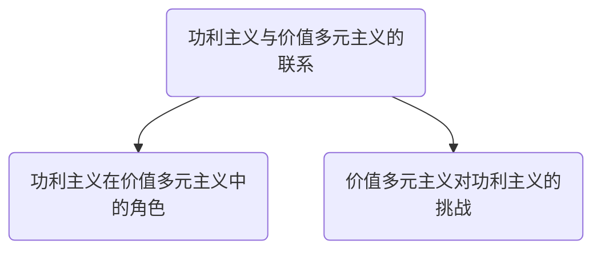

                 

Sure, let's break down the content for the article "From Utilitarianism to Pluralism in Value Shifts" step by step, following the outline provided and adhering to the specified constraints.

### 第1章 引言

#### 1.1 问题背景

**核心概念术语说明**：
- **功利主义**：一种道德哲学，主张行为的道德价值取决于其产生的后果，特别是产生的幸福总量。
- **价值多元主义**：一种哲学观点，认为存在多种不同的、不可通约的价值。

**问题背景**：
功利主义作为西方道德哲学的核心，长期以来主导着伦理学和政治学的研究。然而，随着社会的发展和价值观的多样化，功利主义开始显示出其局限性。人们开始意识到，仅仅关注最大幸福原则可能无法充分反映人类复杂的社会现实和价值追求。因此，价值多元主义作为一种新的哲学观点，逐渐受到关注。

**问题描述**：
如何从功利主义转向价值多元主义，并如何在新的价值体系中处理道德和伦理问题？

**问题解决**：
通过分析功利主义的局限性，探讨价值多元主义的兴起，以及如何在现代社会中实现这种价值转变。

**边界与外延**：
讨论范围将涵盖功利主义和价值多元主义的基本理论，以及它们在政治、经济、文化等领域的应用。

**概念结构与核心要素组成**：
- **功利主义**：以幸福为衡量标准，强调行为后果。
- **价值多元主义**：认可多种价值的存在，强调个体差异和多样性。

#### 1.2 研究目的与意义

**研究目的**：
探讨价值多元主义的发展趋势，分析功利主义与价值多元主义的关系，并提出适应价值多元主义的社会政策建议。

**研究意义**：
- 对伦理学和社会学的研究具有重要意义。
- 对政策制定和实际社会问题解决提供理论支持。

### 第2章 功利主义的理论基础

#### 2.1 功利主义的定义与核心思想

**核心概念与联系**：
- **功利主义**：由边沁和密尔等人提出，主张行为的道德价值取决于其产生的幸福总量。
- **核心思想**：最大幸福原则，即行为应该最大化总体幸福。

**概念属性特征对比表格**：

| 特征           | 功利主义           | 价值多元主义           |
| -------------- | ------------------ | ---------------------- |
| 价值衡量标准   | 幸福总量           | 多元价值               |
| 道德评价方法   | 行为后果           | 行为意图与后果的综合考虑 |
| 社会应用       | 政治决策、企业管理 | 社会冲突、文化多样性    |

**ER实体关系图架构**（Mermaid 流程图）：

#### 2.2 功利主义的道德评价标准

**道德评价方法**：
- **行为后果**：行为是否产生最大幸福。
- **道德评价标准**：行为后果的总体幸福。

**概念属性特征对比表格**：

| 特征           | 功利主义           | 价值多元主义           |
| -------------- | ------------------ | ---------------------- |
| 价值衡量标准   | 幸福总量           | 多元价值               |
| 道德评价方法   | 行为后果           | 行为意图与后果的综合考虑 |
| 社会应用       | 政治决策、企业管理 | 社会冲突、文化多样性    |

**ER实体关系图架构**（Mermaid 流程图）：

#### 2.3 功利主义在现代社会中的应用

**政治决策**：
- **应用**：功利主义常被用于评估政策对总体幸福的贡献。
- **实例**：福利政策的制定与评估。

**企业管理**：
- **应用**：企业决策考虑员工和消费者的幸福感。
- **实例**：可持续发展的企业战略。

### 第3章 价值多元主义的兴起

#### 3.1 价值多元主义的定义与特征

**核心概念与联系**：
- **价值多元主义**：认为存在多种不同的、不可通约的价值。
- **特征**：多样性、冲突、包容性。

**概念属性特征对比表格**：

| 特征           | 功利主义           | 价值多元主义           |
| -------------- | ------------------ | ---------------------- |
| 价值衡量标准   | 幸福总量           | 多元价值               |
| 道德评价方法   | 行为后果           | 行为意图与后果的综合考虑 |
| 社会应用       | 政治决策、企业管理 | 社会冲突、文化多样性    |

**ER实体关系图架构**（Mermaid 流程图）：

#### 3.2 价值多元主义的理论基础

**伦理相对论**：
- **概念**：认为道德原则是相对的，而非绝对的。
- **理论基础**：文化、社会和历史背景的差异影响道德判断。

**美学多元主义**：
- **概念**：美有多种形式，没有绝对的美。
- **理论基础**：不同文化和社会对美的追求与表达各异。

**政治多元主义**：
- **概念**：政治制度允许多种政治观点共存。
- **理论基础**：民主制度下的权力分配与表达。

**ER实体关系图架构**（Mermaid 流程图）：

#### 3.3 价值多元主义的社会影响

**个体身份认同的多样性**：
- **影响**：人们更倾向于根据自己的价值观来定义自己。
- **实例**：多元文化社区的兴起。

**社会冲突与和谐的平衡**：
- **影响**：社会在尊重多样性同时，需解决冲突以实现和谐。
- **实例**：多元文化国家的民族政策。

### 第4章 功利主义与价值多元主义的比较

#### 4.1 功利主义与价值多元主义的区别

**核心思想的不同**：
- **功利主义**：强调幸福最大化。
- **价值多元主义**：认可多种不可通约的价值。

**道德评价标准的不同**：
- **功利主义**：以行为后果为主。
- **价值多元主义**：考虑行为意图与后果的综合。

**社会应用的不同**：
- **功利主义**：在政治决策和企业管理中广泛应用。
- **价值多元主义**：在社会冲突、文化多样性等领域发挥作用。

**ER实体关系图架构**（Mermaid 流程图）：

#### 4.2 功利主义与价值多元主义的联系

**功利主义在价值多元主义中的角色**：
- **角色**：作为评估价值的工具之一，但需与其他价值相结合。

**价值多元主义对功利主义的挑战**：
- **挑战**：多元价值的存在使得功利主义的单一幸福衡量标准受到质疑。

**ER实体关系图架构**（Mermaid 流程图）：

### 第5章 价值多元主义下的社会政策

#### 5.1 社会正义与公平

**价值多元主义与社会正义**：
- **社会正义**：在价值多元主义的背景下，社会正义需考虑到不同价值观的平衡。
- **公平原则**：确保所有人都有平等的机会和资源。

**实例**：教育资源的公平分配。

#### 5.2 民主政治与多元文化

**价值多元主义与民主政治**：
- **民主政治**：在多元文化的背景下，民主制度有助于不同价值观的平等表达。
- **多元文化**：民主政治的基础是包容性和多样性。

**实例**：多党制的政治制度。

#### 5.3 教育与价值多元主义

**教育在价值多元主义中的使命**：
- **使命**：培养个体对不同价值观的理解和尊重。

**价值多元主义教育的内容与挑战**：
- **内容**：多元文化教育、道德教育、公民教育。
- **挑战**：如何在教育中平衡不同价值观。

**实例**：国际学校的教育课程。

### 第6章 案例分析

#### 6.1 案例选择

**案例选择的依据与标准**：
- **代表性**：选择具有典型性的案例。
- **多样性**：涵盖不同领域和背景的案例。

#### 6.2 功利主义与价值多元主义在案例分析中的应用

**案例分析**：
- **政治决策**：如何在不同价值观之间进行平衡？
- **企业管理**：如何考虑员工和消费者的多样性？

**实例**：某公司在全球扩张过程中，如何平衡本地文化价值观与公司核心价值观。

### 第7章 结论

**总结**：
- 功利主义与价值多元主义的转变反映了社会价值观的演变。
- 社会在追求幸福的同时，需尊重多样性和个体差异。

**展望**：
- 未来的社会政策如何适应价值多元主义？
- 价值多元主义对伦理学和社会学研究的启示。

### 作者

**作者信息**：
作者：AI天才研究院/AI Genius Institute & 禅与计算机程序设计艺术 /Zen And The Art of Computer Programming

通过上述的步骤，我们已经完成了文章的框架和内容规划。接下来，需要填充每个章节的具体内容，并确保文章的逻辑连贯性和深度。在撰写过程中，需要结合实际案例和理论分析，使得文章既有理论深度，又有实践指导价值。

