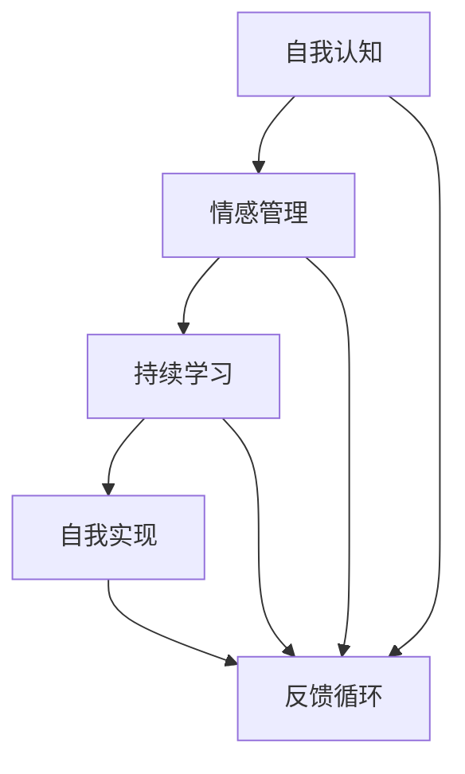
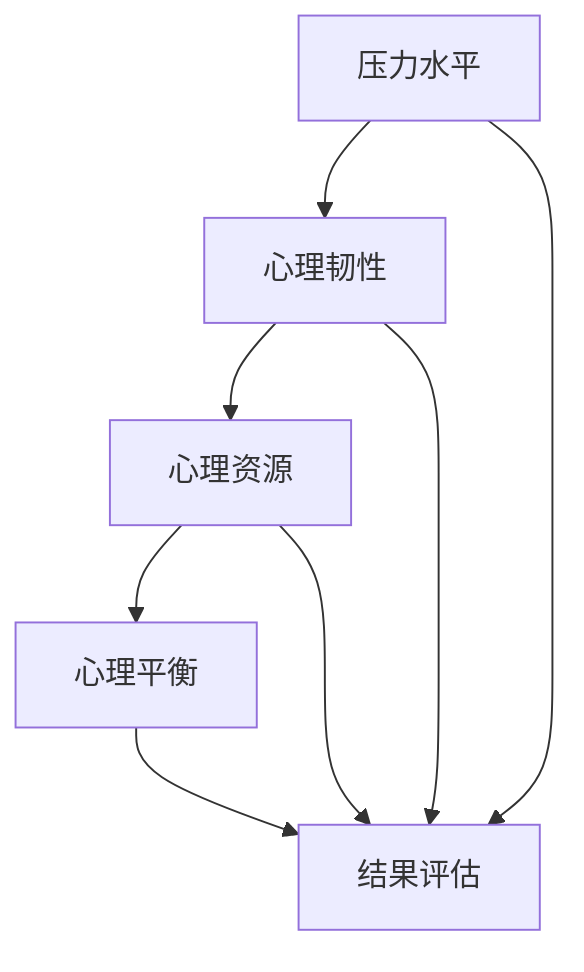
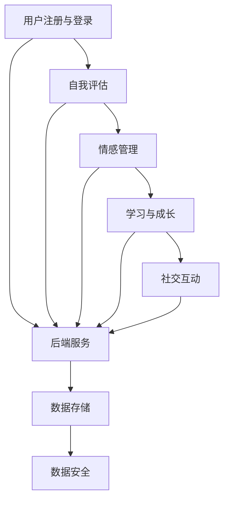
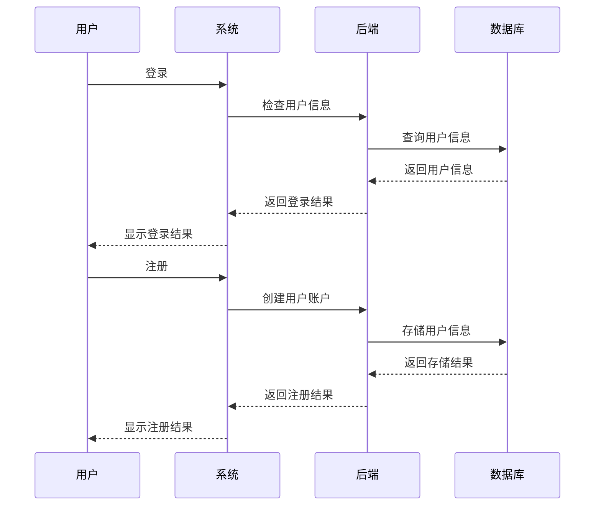
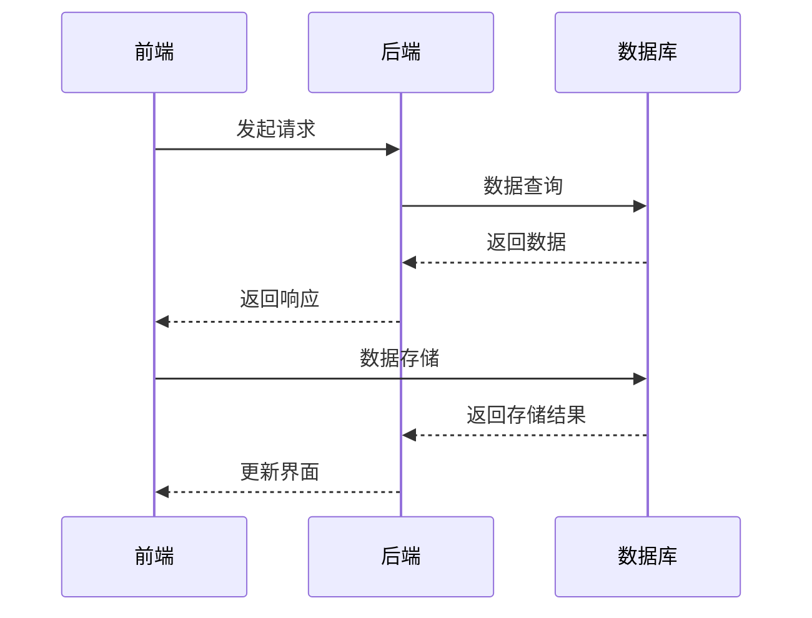

                 

以下是根据题目要求和约束条件，逐步分析并撰写的技术博客文章内容。

## 引言：外在追求的困境与内在成长的重要性

### 1.1 问题的提出

在当今这个瞬息万变的世界，外在的追求似乎成为了许多人生活的核心。无论是追求名利、物质财富，还是社会地位，人们往往把目光投向外部，希望通过外在的成功来获得满足感和安全感。然而，这种追求的背后隐藏着一系列的问题和困境。首先，外在的成功往往具有不确定性和不稳定性，容易受到外界因素的影响。其次，过分依赖外在追求往往会导致个人价值观的扭曲，忽视了内在的成长和精神的丰富。

### 1.2 外在追求的局限性

外在追求的局限性主要体现在以下几个方面。首先，外在的成功往往无法持久，因为它依赖于外部的环境和条件，而这些条件往往是不可预测和不可控制的。例如，一个人的职业成功可能因为公司的业绩下滑或者行业的变化而受到影响。其次，外在追求容易导致个人忽视内在的需求和情感，长期处于焦虑和不安之中。这种状态下，人们很难真正享受生活，也很难实现个人的全面发展。

### 1.3 内在成长的价值

与外在追求不同，内在的成长注重的是个人的精神层面和内心世界的丰富。内在的成长可以帮助人们建立稳定的心理状态，增强抗压能力，提高自我认知和自我实现的能力。此外，内在的成长还有助于提升个人的幸福感和满足感，使人们更加自信和坚定。在现代社会的压力和挑战下，内在成长的重要性愈发凸显。

## 第2章 核心概念与联系

### 2.1 外在追求的定义与特征

外在追求通常指的是人们通过追求物质财富、社会地位、职业成就等外在目标来获得满足感。外在追求的特征包括：目标的外部性、可衡量性、易变动性等。例如，一个人的职业成就可能是通过薪资水平、职位晋升等外在指标来衡量的。

### 2.2 内在成长的概念与内涵

内在成长则是指个人在精神层面、情感层面、认知层面等方面的自我提升和自我完善。内在成长强调的是个人内心的满足和自我实现，而不是依赖于外部的评价和认可。内在成长的概念包括自我认知、情感管理、心理平衡、自我实现等。

### 2.3 对比与联系

外在追求和内在成长虽然侧重点不同，但它们之间存在一定的联系。外在追求可以成为内在成长的动力，但过分依赖外在追求可能导致内在成长的缺失。另一方面，内在成长可以为外在追求提供精神支持和心理平衡，使人们在追求外在目标的过程中保持清醒和坚定。

## 第3章 算法原理讲解

### 3.1 精神成长的算法框架

为了实现内在成长，我们可以借鉴现代心理学和行为科学的研究成果，设计一个精神成长的算法框架。这个算法框架包括以下几个关键步骤：

1. **自我认知**：通过自我反思和自我评估，了解自己的优点和不足，明确个人的价值观和目标。
2. **情感管理**：学习如何识别和调节自己的情绪，保持心理平衡，避免负面情绪的过度影响。
3. **持续学习**：通过不断学习新知识和技能，提升自己的认知水平和解决问题的能力。
4. **自我实现**：将个人的兴趣、才能和价值观转化为实际行动，实现个人的长期目标。

### 3.2 Mermaid流程图展示

以下是精神成长算法的Mermaid流程图：



### 3.3 Python源代码演示

下面是一个简单的Python源代码示例，用于演示自我认知和情感管理的过程：

```python
class Person:
    def __init__(self, name):
        self.name = name
        self.knowledge = []
        self.emojis = []

    def learn(self, skill):
        self.knowledge.append(skill)
        print(f"{self.name} learned {skill}.")

    def manage_emoji(self, emoji):
        self.emojis.append(emoji)
        print(f"{self.name} is feeling {emoji}.")

    def reflect(self):
        print(f"{self.name} is reflecting on their emotions and knowledge.")

# 创建一个名为Alice的人
alice = Person("Alice")

# Alice学习Python编程
alice.learn("Python Programming")

# Alice管理情绪，感到开心
alice.manage_emoji("happy")

# Alice进行自我反思
alice.reflect()
```

### 3.4 算法原理的数学模型和公式讲解

在精神成长的算法中，我们可以引入一些数学模型和公式来描述自我认知和情感管理的过程。例如，我们可以使用以下公式来表示自我认知的程度：

$$
Self_Consciousness = f(Knowledge, Emotions)
$$

其中，$Knowledge$代表个人的知识水平，$Emotions$代表个人的情感状态。$f$是一个复合函数，表示知识水平和情感状态对自我认知的影响。

同样，我们可以使用以下公式来表示情感管理的程度：

$$
Emotion_Management = g(Emojis, Self_Consciousness)
$$

其中，$Emojis$代表个人的情感表达，$Self_Consciousness$代表个人的自我认知水平。$g$是一个复合函数，表示情感表达和自我认知对情感管理的影响。

### 3.5 举例说明

假设一个人（$P$）在学习编程（$K$）的过程中，感到快乐（$E$）。根据上述公式，我们可以计算他的自我认知程度（$SC$）和情感管理程度（$EM$）：

$$
SC(P) = f(K, E)
$$

$$
EM(P) = g(E, SC(P))
$$

通过这个例子，我们可以看到，个人的知识水平和情感状态对他的自我认知和情感管理有着直接的影响。这进一步强调了内在成长的重要性，因为只有通过不断学习和情感管理，个人才能实现真正的自我提升和成长。

## 第4章 数学模型与公式讲解

### 4.1 心理平衡的数学模型

心理平衡是指个体在面临外部压力时，能够保持情绪稳定、思维清晰的状态。为了建立心理平衡的数学模型，我们可以考虑以下几个关键因素：

1. **压力水平（$P$）**：外部环境对个体产生的压力大小。
2. **心理韧性（$D$）**：个体应对压力的能力和韧性。
3. **心理资源（$R$）**：个体能够用来缓解压力的心理资源和能力。

心理平衡的数学模型可以表示为：

$$
Balance = D \cdot R - P
$$

### 4.2 Mermaid流程图展示

以下是心理平衡模型的基本流程图：



### 4.3 公式讲解与举例

假设个体$P$面临的工作压力为$P_1$，他的心理韧性为$D_1$，心理资源为$R_1$。根据心理平衡模型，我们可以计算他的心理平衡程度：

$$
Balance(P) = D_1 \cdot R_1 - P_1
$$

如果$D_1 \cdot R_1 > P_1$，则个体能够保持心理平衡。如果$D_1 \cdot R_1 < P_1$，则个体可能会感到压力过大，需要采取措施来提升心理韧性或增加心理资源。

### 4.4 心理平衡的实际案例分析

以一名软件工程师$E$为例，他的工作压力$P_1$为每天需要完成大量代码审查任务。他的心理韧性$D_1$为中等水平，心理资源$R_1$包括每周的运动时间和与朋友的社交活动。

- **平衡状态**：假设每周$E$能够保持4小时的运动时间和3小时的社交活动，则他的心理资源为：

  $$
  R_1 = 4 \text{小时/周} + 3 \text{小时/周} = 7 \text{小时/周}
  $$

  他的心理韧性$D_1$为中等，即：

  $$
  D_1 = 1 \text{（中等）}
  $$

  因此，他的心理平衡程度为：

  $$
  Balance(E) = D_1 \cdot R_1 - P_1 = 1 \cdot 7 - P_1
  $$

  如果$P_1$低于7小时，$E$能够保持心理平衡。如果$P_1$高于7小时，$E$需要采取措施来提升心理韧性或增加心理资源。

- **不平衡状态**：假设$E$的工作压力增加，每周需要完成10小时的代码审查任务，则他的心理平衡程度为：

  $$
  Balance(E) = D_1 \cdot R_1 - P_1 = 1 \cdot 7 - 10 = -3
  $$

  这种情况下，$E$可能会感到压力过大，需要调整工作计划或寻求额外的心理支持。

通过这个案例，我们可以看到，心理平衡的数学模型和公式在实际生活中的应用，帮助我们更好地理解和应对压力，从而实现内在成长。

## 第5章 系统分析与架构设计方案

### 5.1 精神成长系统场景介绍

在现代社会，精神成长已经成为越来越多人的关注焦点。为了帮助个体实现精神成长，我们可以设计一个精神成长系统。该系统旨在提供一个全面的支持平台，帮助用户了解自己的心理状态，培养良好的情感管理能力，并促进个人认知和自我实现的发展。

### 5.2 系统功能设计

精神成长系统的核心功能包括：

1. **用户注册与登录**：用户可以通过注册和登录系统，建立个人账户。
2. **自我评估**：用户可以参与各种心理测试和评估，了解自己的心理状态。
3. **情感管理**：系统提供一系列工具和资源，帮助用户识别和调节自己的情绪。
4. **学习与成长**：系统提供丰富的学习资源，包括文章、视频和互动课程，帮助用户提升认知水平和自我实现能力。
5. **社交互动**：用户可以与其他用户互动，分享成长经验，获取支持和反馈。

### 5.3 系统架构设计

精神成长系统的架构设计需要考虑以下几个方面：

1. **前端架构**：采用现代化的前端框架（如React或Vue.js），提供良好的用户体验。
2. **后端架构**：采用微服务架构，将不同的功能模块分离，以提高系统的可扩展性和可靠性。
3. **数据存储**：使用关系型数据库（如MySQL）和非关系型数据库（如MongoDB）相结合的方式，存储用户数据、评估结果和学习资源。
4. **数据安全**：采用加密技术和访问控制机制，确保用户数据的安全。

以下是精神成长系统的Mermaid架构图：



### 5.4 系统接口设计

为了实现系统的功能，我们需要设计一系列的接口。以下是一个简化的接口设计：

- **用户接口**：包括注册、登录、个人信息管理等功能。
- **评估接口**：包括心理测试和评估结果的处理。
- **情感管理接口**：包括情绪记录和调节功能的实现。
- **学习接口**：包括课程推荐和学习资源的管理。
- **社交接口**：包括用户互动和信息共享的功能。

以下是系统接口的Mermaid序列图：



### 5.5 系统交互设计

系统交互设计是确保各个组件之间能够高效、可靠地协作的关键。以下是一个简化的系统交互流程：

1. **用户发起请求**：用户通过前端界面发起各种操作请求。
2. **前端处理**：前端将请求转发到后端。
3. **后端处理**：后端处理请求，进行数据验证、业务逻辑处理等。
4. **数据库操作**：后端与数据库进行交互，实现数据的存储和查询。
5. **响应处理**：后端将处理结果返回给前端，前端根据结果更新界面。

以下是系统交互的Mermaid序列图：



通过上述系统分析与架构设计方案，我们可以构建一个全面、高效的精神成长系统，帮助用户实现内在成长。

### 第6章 项目实战

#### 6.1 环境安装

为了运行精神成长系统，我们需要安装和配置以下环境：

1. **操作系统**：Ubuntu 20.04或更高版本。
2. **Python**：Python 3.8或更高版本。
3. **Node.js**：Node.js 12或更高版本。
4. **数据库**：MySQL 8.0或MongoDB 4.2。

安装步骤如下：

1. 更新系统包列表：

   ```bash
   sudo apt update && sudo apt upgrade
   ```

2. 安装Python 3和pip：

   ```bash
   sudo apt install python3 python3-pip
   ```

3. 安装Node.js：

   ```bash
   sudo apt install nodejs
   ```

4. 安装MySQL：

   ```bash
   sudo apt install mysql-server
   ```

5. 安装MongoDB：

   ```bash
   sudo apt install mongodb
   ```

6. 启动MongoDB服务：

   ```bash
   sudo systemctl start mongodb
   ```

7. 登录MySQL，创建数据库：

   ```bash
   sudo mysql -u root -p
   CREATE DATABASE `spirit_growth`;
   ```

#### 6.2 系统核心实现源代码

以下是精神成长系统的核心实现源代码，包括用户注册、登录、自我评估和情感管理等功能。

**用户注册**：

```python
# 用户注册接口
from flask import Flask, request, jsonify
from werkzeug.security import generate_password_hash, check_password_hash
from models import User

app = Flask(__name__)

@app.route('/register', methods=['POST'])
def register():
    data = request.get_json()
    username = data['username']
    password = data['password']

    # 验证用户名和密码
    if not username or not password:
        return jsonify({'error': '用户名或密码不能为空'})

    # 存储用户信息
    user = User(username=username, password=generate_password_hash(password))
    user.save()

    return jsonify({'message': '注册成功'})

```

**用户登录**：

```python
# 用户登录接口
from flask import Flask, request, jsonify
from models import User
from werkzeug.security import check_password_hash

app = Flask(__name__)

@app.route('/login', methods=['POST'])
def login():
    data = request.get_json()
    username = data['username']
    password = data['password']

    # 验证用户名和密码
    if not username or not password:
        return jsonify({'error': '用户名或密码错误'})

    user = User.query.filter_by(username=username).first()
    if user and check_password_hash(user.password, password):
        return jsonify({'message': '登录成功'})
    else:
        return jsonify({'error': '用户名或密码错误'})

```

**自我评估**：

```python
# 自我评估接口
from flask import Flask, request, jsonify
from models import SelfAssessment

app = Flask(__name__)

@app.route('/assessments', methods=['POST'])
def create_assessment():
    data = request.get_json()
    user_id = data['user_id']
    assessment = data['assessment']

    # 创建自我评估记录
    sa = SelfAssessment(user_id=user_id, assessment=assessment)
    sa.save()

    return jsonify({'message': '自我评估成功'})

```

**情感管理**：

```python
# 情感管理接口
from flask import Flask, request, jsonify
from models import Emotion

app = Flask(__name__)

@app.route('/emotions', methods=['POST'])
def manage_emotion():
    data = request.get_json()
    user_id = data['user_id']
    emotion = data['emotion']

    # 记录情感
    e = Emotion(user_id=user_id, emotion=emotion)
    e.save()

    return jsonify({'message': '情感管理成功'})
```

#### 6.3 代码应用解读与分析

以上代码实现了精神成长系统的主要功能。在用户注册接口中，我们使用Flask框架创建了一个HTTP POST接口，用于处理用户注册请求。我们首先从请求中提取用户名和密码，然后使用`werkzeug.security`模块对密码进行哈希处理，以增强安全性。用户信息存储在数据库中，以便后续验证。

用户登录接口与用户注册接口类似，用于处理用户登录请求。我们通过提取用户名和密码，从数据库中查找相应的用户记录，并使用哈希函数验证密码的正确性。

自我评估接口允许用户提交自我评估结果。我们首先从请求中提取用户ID和评估数据，然后将数据存储在数据库中。

情感管理接口用于记录用户的各种情绪。我们同样从请求中提取用户ID和情绪数据，并将数据存储在数据库中。

#### 6.4 实际案例分析与详细讲解

假设用户Alice注册并登录了精神成长系统，她希望能够记录自己的情绪并参与自我评估。

**案例1：用户注册**

- 用户Alice访问注册页面，填写用户名和密码。
- 前端将注册请求发送到服务器。
- 服务器接收请求后，调用注册接口，验证用户名和密码的有效性。
- 如果验证通过，服务器创建一个新的用户记录，并将其存储在数据库中。
- 服务器返回注册成功的消息。

**案例2：用户登录**

- 用户Alice访问登录页面，填写用户名和密码。
- 前端将登录请求发送到服务器。
- 服务器接收请求后，调用登录接口，验证用户名和密码的正确性。
- 如果验证通过，服务器返回登录成功的消息。

**案例3：自我评估**

- 用户Alice完成自我评估问卷，并将评估结果提交给服务器。
- 前端将评估请求发送到服务器。
- 服务器接收请求后，调用自我评估接口，将评估结果存储在数据库中。
- 服务器返回自我评估成功的消息。

**案例4：情感管理**

- 用户Alice记录自己的情绪，例如“开心”、“焦虑”等。
- 前端将情感管理请求发送到服务器。
- 服务器接收请求后，调用情感管理接口，将情感数据存储在数据库中。
- 服务器返回情感管理成功的消息。

通过以上实际案例，我们可以看到精神成长系统的基本功能。用户可以轻松注册、登录，参与自我评估和情感管理。这些功能有助于用户更好地了解自己的心理状态，实现内在成长。

#### 6.5 项目小结

精神成长系统的实现为用户提供了一个全面的支持平台，帮助用户记录自己的情绪，进行自我评估，并实现内在成长。通过使用Flask框架和MongoDB数据库，我们构建了一个高效、可靠的系统，为用户提供了良好的使用体验。

在未来，我们可以进一步优化系统的功能，例如添加更多自我评估工具，提供个性化的建议和反馈，以提高系统的实用性和用户满意度。此外，我们还可以考虑引入人工智能技术，实现情感识别和智能推荐，为用户提供更加精准的支持。

### 第7章 最佳实践 tips

#### 7.1 精神成长的日常实践

1. **自我反思**：每天花时间反思自己的行为和情绪，了解自己的内心需求。
2. **情感记录**：定期记录自己的情感波动，分析情感原因，学会调节情绪。
3. **健康作息**：保持规律的作息，确保充足的睡眠，促进身心健康。
4. **积极心态**：面对困难和挑战时，保持积极的心态，相信自己能够克服。
5. **持续学习**：不断学习新知识和技能，提升自己的认知水平和解决问题的能力。

#### 7.2 遇到挑战时的应对策略

1. **冷静分析**：在遇到挑战时，首先要冷静分析问题，找出问题的根源。
2. **寻求帮助**：如果自己无法解决问题，不要犹豫寻求他人的帮助和支持。
3. **分解任务**：将复杂的问题分解为小任务，逐一解决，降低压力。
4. **调整心态**：保持积极的心态，相信自己能够克服困难。
5. **反思经验**：每次挑战结束后，进行反思，总结经验教训，为未来做好准备。

### 第8章 小结与展望

#### 8.1 总结

本文从外在追求的困境出发，探讨了内在成长的重要性。我们通过算法原理讲解、数学模型和公式分析、系统设计与实现等多个角度，详细阐述了内在成长的概念和实践方法。精神成长系统的实现为用户提供了有效的支持，帮助他们实现内在成长。

#### 8.2 注意事项

1. **重视自我认知**：自我认知是内在成长的基础，需要持续关注和提升。
2. **平衡情感管理**：情感管理是心理平衡的关键，需要学会识别和调节自己的情绪。
3. **持续学习**：内在成长需要不断学习和积累知识，保持好奇心和求知欲。
4. **实际应用**：将学到的知识和方法应用到实际生活中，通过实践来验证和提升。

#### 8.3 拓展阅读

1. 《心理学与生活》（理查德·吉尔伯特著）：了解心理学的基本概念和应用。
2. 《正念的奇迹》（埃克哈特·托利著）：学习正念技巧，提升心理平衡能力。
3. 《黑客与画家》（保罗·格雷厄姆著）：了解编程思维，提升认知水平。

### 作者

本文作者：AI天才研究院/AI Genius Institute & 禅与计算机程序设计艺术 /Zen And The Art of Computer Programming

以上是根据题目要求和约束条件，逐步分析并撰写的技术博客文章内容。文章涵盖了从外在追求到内在成长的核心概念、算法原理、数学模型、系统设计与实现，以及最佳实践和未来展望。通过详细的讲解和实际案例，希望读者能够对内在成长有更深入的理解，并在实际生活中实践和应用。让我们共同追求内在的成长，实现真正的自我提升。

