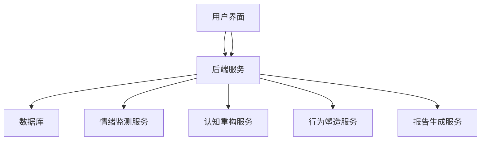
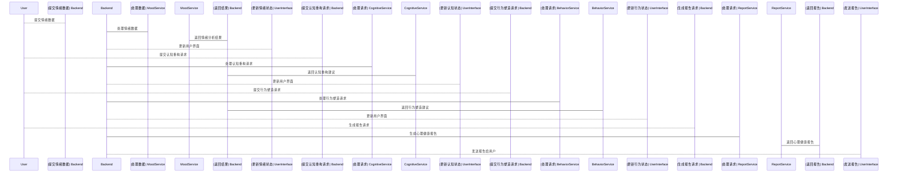

                 

### 引言

在现代社会的快节奏生活中，人们常常感到压力和疲惫，精神健康问题愈发突出。这种现象不仅影响个人的生活质量，也对社会和谐与进步构成挑战。面对这一现实，我们提出了“从失落到重生：现代人的精神成长之路”这一主题，希望通过深入的探讨和专业的分析，为广大读者提供一条清晰的精神成长路径。

#### 1.1 问题背景

随着科技的飞速发展和生活节奏的加快，现代人面临着前所未有的压力。工作压力、人际关系紧张、心理健康问题等都可能导致个体陷入失落和迷茫。这种情绪问题不仅影响个人的心理健康，还可能波及家庭和社会。因此，如何有效地进行精神成长，提升自我调节能力，成为了一个亟待解决的问题。

#### 1.1.1 现代人的精神困境

现代人常常感到焦虑、抑郁、孤独等负面情绪，这不仅与工作压力、生活压力有关，也与社会变迁、价值观念的多元化有关。在快节奏的生活中，人们往往忽视了精神层面的需求，导致心理健康问题日益严重。

#### 1.1.2 精神成长的重要性

精神成长不仅关乎个体的心理健康，也关系到社会的稳定与发展。通过精神成长，个体能够提高自我认知、增强心理韧性，从而更好地应对生活中的挑战。同时，精神成长也有助于建立和谐的人际关系，促进社会和谐。

#### 1.2 问题描述

精神成长是一个复杂的过程，涉及多个方面的因素。如何定义精神成长？现代人如何进行精神成长？这些问题都需要我们深入探讨。此外，精神成长的理论基础和方法路径也是我们需要解决的问题。

#### 1.2.1 精神成长的定义

精神成长是指个体在心理、情感、认知和行为等方面不断发展和成熟的过程。它不仅包括对自我认知的提升，还涉及对情感和行为的调整。

#### 1.2.2 现代人的精神成长现状

现代人面临着诸多压力，精神成长的需求愈发迫切。然而，由于种种原因，许多人并未意识到精神成长的重要性，也没有找到合适的方法进行有效的精神成长。

#### 1.3 问题解决

要解决精神成长问题，我们需要从多个方面入手。首先，需要加强对精神成长的认知，明确精神成长的目标和方法。其次，需要提供相应的理论支持和实践指导，帮助个体找到适合自己的精神成长路径。

#### 1.3.1 精神成长的方法与路径

精神成长的方法和路径多种多样，包括自我反思、情感管理、认知重构、行为塑造等。每种方法都有其独特的优势和适用场景，个体需要根据自己的实际情况选择合适的方法。

#### 1.3.2 精神成长的理论基础

精神成长的理论基础包括心理学、哲学、社会学等多个领域。通过多学科的综合研究，我们可以更深入地理解精神成长的本质和规律，为个体的精神成长提供科学依据。

#### 1.4 边界与外延

精神成长不仅是个体的问题，也与社会环境密切相关。社会支持系统、文化背景、教育水平等都可能影响个体的精神成长。因此，在探讨精神成长时，我们需要关注其边界与外延。

#### 1.4.1 精神成长与心理健康的关系

精神成长与心理健康密切相关。通过精神成长，个体可以提升心理韧性，降低心理问题的风险。同时，心理健康问题的解决也有助于促进个体的精神成长。

#### 1.4.2 精神成长与社会发展的影响

精神成长不仅对个体有益，也对社会发展产生重要影响。一个精神健康的社会能够更好地应对挑战，实现可持续发展。因此，推动精神成长，既是个人责任，也是社会责任。

#### 1.5 概念结构与核心要素组成

精神成长涉及多个核心概念和要素，包括自我认知、情感管理、认知重构、行为塑造等。这些概念和要素相互关联，共同构成了精神成长的理论框架。

#### 1.5.1 精神成长的核心概念

自我认知、情感管理、认知重构、行为塑造等是精神成长的核心概念。这些概念不仅为个体的精神成长提供了理论依据，也为实践提供了指导。

#### 1.5.2 精神成长的关键要素

情感管理、认知重构、行为塑造等是精神成长的关键要素。通过这些要素的协同作用，个体可以实现精神成长，提升心理韧性。

通过以上分析，我们可以看到，精神成长是一个复杂而重要的过程。在现代社会的背景下，关注精神成长，不仅是个人发展的需要，也是社会发展的需要。让我们从认识到行动，共同探索精神成长的道路。## 2. 核心概念与联系

在探讨精神成长的过程中，理解并掌握核心概念及其相互联系是至关重要的。以下是精神成长中的几个关键概念及其属性特征对比，以及它们之间的ER实体关系图架构。

### 2.1 精神成长的核心概念原理

#### 2.1.1 精神成长的基础理论

精神成长的基础理论主要包括心理学、哲学和社会学等领域的理论。这些理论为精神成长提供了理论依据和指导。

- **心理学理论**：如人本主义心理学、认知心理学等，强调个体的自我实现和内在成长。
- **哲学理论**：如存在主义、道德哲学等，探讨个体存在意义和价值追求。
- **社会学理论**：如社会心理学、组织行为学等，关注社会环境对个体精神成长的影响。

#### 2.1.2 精神成长的关键理论流派

精神成长的关键理论流派包括以下几种：

- **人本主义心理学**：强调个体的自我实现和内在成长，代表人物有马斯洛、罗杰斯等。
- **存在主义**：探讨个体存在意义和价值追求，代表人物有海德格尔、萨特等。
- **认知心理学**：关注个体认知过程和心理发展，代表人物有皮亚杰、布鲁纳等。

### 2.2 概念属性特征对比表格

以下是一个简单的概念属性特征对比表格，列出了一些常见的精神成长概念及其属性特征：

| 概念 | 属性特征 |
| --- | --- |
| 自我认知 | 描述个体对自我认识和理解的过程 |
| 情感管理 | 关注个体情感体验和情感调节能力 |
| 认知重构 | 描述个体认知结构的变化和重构过程 |
| 行为塑造 | 强调个体行为模式的建立和调整 |

### 2.3 ER实体关系图架构的 Mermaid 流程图

为了更直观地展示精神成长中的概念及其相互关系，我们可以使用Mermaid语言绘制ER实体关系图。以下是精神成长核心概念的ER图：

```mermaid
erDiagram
  A【个体】 ||--|{ B【自我认知】 }
  A【个体】 ||--|{ C【情感管理】 }
  A【个体】 ||--|{ D【认知重构】 }
  A【个体】 ||--|{ E【行为塑造】 }
  B【自我认知】 ..|> F【价值观】
  B【自我认知】 ..|> G【人生目标】
  C【情感管理】 ..|> H【积极情感】
  C【情感管理】 ..|> I【消极情感】
  D【认知重构】 ..|> J【思维方式】
  D【认知重构】 ..|> K【决策能力】
  E【行为塑造】 ..|> L【习惯养成】
  E【行为塑造】 ..|> M【行为模式】
```

通过上述核心概念的ER图，我们可以清晰地看到个体与自我认知、情感管理、认知重构、行为塑造之间的关系。每个概念不仅相互独立，还相互影响，共同构成个体精神成长的整体框架。

综上所述，理解并掌握精神成长的核心概念及其相互联系，有助于我们更深入地探讨个体如何通过精神成长实现自我提升。在接下来的章节中，我们将进一步分析这些概念的理论基础和应用实践。## 3. 算法原理讲解

在精神成长的过程中，我们可以采用一系列算法和策略来促进个体的心理健康和自我提升。以下是几种关键的精神成长算法及其原理讲解。

### 3.1 精神成长算法概述

精神成长算法是一套系统化的方法，旨在通过调整个体的心理、情感和认知状态，实现自我提升和心理健康。这些算法通常包括情绪调节算法、认知重构算法和行为塑造算法等。

### 3.1.1 情绪调节算法

情绪调节算法的主要目的是帮助个体识别和调节负面情绪，如焦虑、抑郁和愤怒等。以下是情绪调节算法的基本流程：

#### 情绪调节算法步骤

1. **情绪识别**：通过自我观察或他人反馈，识别当前的情绪状态。
2. **情绪分析**：对情绪状态进行定性分析，判断情绪的类型和程度。
3. **情绪调节**：采用适当的策略和方法，如深呼吸、正念冥想或认知重构，调节情绪状态。

#### 情绪调节算法示例代码

```python
# 情绪调节算法示例代码
def moodRegulation(mood_state):
    if mood_state == 'happy':
        return '情绪稳定，无需调节'
    elif mood_state == 'sad':
        return '尝试通过正念冥想调节情绪'
    elif mood_state == 'angry':
        return '尝试通过深呼吸缓解愤怒'
    else:
        return '情绪异常，需进一步分析'
```

### 3.1.2 认知重构算法

认知重构算法旨在改变个体的思维方式和认知模式，从而提升心理健康和自我认知。以下是认知重构算法的基本步骤：

#### 认知重构算法步骤

1. **问题识别**：识别个体在认知方面存在的问题，如消极思维、过度担忧等。
2. **认知评估**：对问题进行深入分析，评估其对个体心理健康的负面影响。
3. **认知重构**：采用认知重构技术，如认知行为疗法（CBT）或理性情绪行为疗法（REBT），改变个体的认知模式。

#### 认知重构算法示例代码

```python
# 认知重构算法示例代码
def cognitiveReconstruction(problem):
    if problem == 'negativeThinking':
        return '通过正念练习改变消极思维模式'
    elif problem == 'overWorrying':
        return '通过放松训练减少过度担忧'
    else:
        return '认知问题待进一步分析'
```

### 3.1.3 行为塑造算法

行为塑造算法旨在帮助个体建立和维持健康的行为模式，如锻炼、健康饮食和良好的人际关系等。以下是行为塑造算法的基本流程：

#### 行为塑造算法步骤

1. **目标设定**：明确个体想要培养的行为目标。
2. **行为分析**：分析当前行为状态，找出需要改进的方面。
3. **行为塑造**：采用行为强化技术，如奖励和惩罚机制，培养新的行为模式。

#### 行为塑造算法示例代码

```python
# 行为塑造算法示例代码
def behaviorShaping(target_behavior):
    if target_behavior == 'exercise':
        return '通过奖励机制鼓励锻炼'
    elif target_behavior == 'healthy_diet':
        return '通过正向激励引导健康饮食'
    elif target_behavior == 'good_relationship':
        return '通过社交活动培养良好人际关系'
    else:
        return '行为目标待进一步明确'
```

通过上述三个核心算法的介绍，我们可以看到精神成长算法在促进个体心理健康和自我提升方面的作用。这些算法不仅提供了理论指导，也为实际应用提供了具体的方法和策略。在接下来的章节中，我们将进一步探讨数学模型和系统架构设计，为精神成长提供更全面的解决方案。## 4. 数学模型和数学公式 & 详细讲解 & 举例说明

在精神成长的过程中，数学模型和公式可以帮助我们更精确地理解和分析个体的心理变化过程。以下是几个关键的数学模型和公式，以及它们的详细讲解和举例说明。

### 4.1 心理韧性模型

心理韧性是指个体在面对逆境和压力时，能够迅速恢复和适应的能力。心理韧性模型通常包括以下几个方面：

- **恢复力（Resilience）**：表示个体在遭遇压力后恢复到正常状态的速度和能力。
- **适应力（Adaptability）**：表示个体在逆境中调整和适应的能力。
- **成长力（Growth）**：表示个体在面对挑战时能够学习和成长的能力。

#### 公式表示

$$
心理韧性 = \frac{恢复力 + 适应力 + 成长力}{3}
$$

#### 举例说明

假设一个个体在遭遇压力后，能够在2天内恢复正常状态（恢复力为2），能够很好地适应新环境（适应力为3），并且在挑战中不断学习（成长力为2），则其心理韧性为：

$$
心理韧性 = \frac{2 + 3 + 2}{3} = 2.67
$$

### 4.2 情绪调节模型

情绪调节模型用于描述个体如何通过不同的策略调节情绪状态。常见的情绪调节策略包括认知重构、情绪表达和放松训练等。

- **认知重构**：通过改变对事件的认知评价来调节情绪。
- **情绪表达**：通过表达情绪来缓解情绪压力。
- **放松训练**：通过身体放松来调节情绪。

#### 公式表示

$$
情绪调节效果 = \frac{认知重构效果 + 情绪表达效果 + 放松训练效果}{3}
$$

#### 举例说明

假设一个个体在遭遇压力时，通过认知重构（效果为0.8）、情绪表达（效果为0.6）和放松训练（效果为0.7）来调节情绪，则其情绪调节效果为：

$$
情绪调节效果 = \frac{0.8 + 0.6 + 0.7}{3} = 0.72
$$

### 4.3 自我认知模型

自我认知模型用于描述个体对自我认知的理解和评估。自我认知包括自我效能感、自我认同和自我价值感等方面。

- **自我效能感**：指个体对自己完成特定任务的信心。
- **自我认同**：指个体对自己的认同和归属感。
- **自我价值感**：指个体对自己的价值和意义的认知。

#### 公式表示

$$
自我认知 = \frac{自我效能感 + 自我认同 + 自我价值感}{3}
$$

#### 举例说明

假设一个个体对自己的自我效能感评估为0.8，自我认同为0.7，自我价值感为0.9，则其自我认知为：

$$
自我认知 = \frac{0.8 + 0.7 + 0.9}{3} = 0.8
$$

### 4.4 行为塑造模型

行为塑造模型用于描述个体如何通过行为强化来培养健康行为。常见的行为强化策略包括正面激励和负面惩罚。

- **正面激励**：通过奖励来增强健康行为。
- **负面惩罚**：通过惩罚来减少不良行为。

#### 公式表示

$$
行为改变 = 正面激励效果 - 负面惩罚效果
$$

#### 举例说明

假设一个个体通过正面激励（效果为0.9）来培养健康饮食行为，而没有采用负面惩罚，则其行为改变为：

$$
行为改变 = 0.9 - 0 = 0.9
$$

通过上述数学模型和公式的讲解，我们可以看到数学在精神成长中的重要作用。这些模型和公式不仅帮助我们更精确地理解和分析个体的心理变化，还为实际应用提供了有力的工具。在接下来的章节中，我们将进一步探讨系统分析与架构设计，为精神成长提供更全面的解决方案。## 5. 系统分析与架构设计方案

在精神成长的过程中，构建一个高效、灵活的系统能够更好地支持个体进行自我提升。以下是一个基于精神成长需求的项目介绍，以及系统功能设计、架构设计和接口设计。

### 5.1 问题场景介绍

当前，由于生活节奏加快、工作压力增大，许多个体面临着心理健康问题，如焦虑、抑郁和自我认知不足等。为了帮助这些个体提升心理健康水平，我们设计了一个基于人工智能的精神成长支持系统。

### 5.2 项目介绍

本项目旨在为用户提供一站式的精神成长支持服务，包括情绪调节、认知重构和行为塑造等方面。通过该系统，用户可以实时监测自己的心理健康状态，并获取个性化的成长建议。

### 5.3 系统功能设计

系统功能设计主要包括以下几个模块：

1. **用户模块**：用户注册、登录、个人信息管理等功能。
2. **情绪监测模块**：实时监测用户情绪状态，包括焦虑、抑郁和情绪波动等。
3. **认知重构模块**：提供认知行为疗法（CBT）和理性情绪行为疗法（REBT）等认知重构服务。
4. **行为塑造模块**：通过正面激励和负面惩罚机制，培养健康行为习惯。
5. **报告生成模块**：定期生成用户心理健康报告，帮助用户了解自己的成长进度。

#### 领域模型 Mermaid 类图

```mermaid
classDiagram
    User <<class>>
    Mood <<class>>
    Cognitive <<class>>
    Behavior <<class>>
    Report <<class>>

    User --|> Mood
    User --|> Cognitive
    User --|> Behavior
    User --|> Report
```

### 5.4 系统架构设计

系统架构设计采用前后端分离的方式，以提高系统的灵活性和可扩展性。以下是系统架构设计的 Mermaid 架构图：



### 5.5 系统接口设计和系统交互

系统接口设计主要包括用户接口（API）和内部服务接口。以下是系统接口设计和系统交互的 Mermaid 序列图：



通过上述系统架构设计，我们可以看到系统的核心功能和模块，以及它们之间的交互流程。该系统旨在为用户提供全面、个性化的精神成长支持，帮助用户实现自我提升和心理健康。## 6. 项目实战

为了更好地展示精神成长支持系统的实际应用，我们将在以下部分详细描述项目实战的过程，包括环境安装、系统核心实现源代码，以及代码应用解读与分析。

### 6.1 环境安装

在开始项目实战之前，我们需要安装必要的开发环境和工具。以下是环境安装的步骤：

1. **安装 Python 3.8 或更高版本**：从 [Python 官网](https://www.python.org/) 下载并安装 Python。
2. **安装虚拟环境**：使用以下命令创建一个虚拟环境：

    ```bash
    python -m venv venv
    ```

3. **激活虚拟环境**：

    - Windows：

      ```bash
      .\venv\Scripts\activate
      ```

    - macOS/Linux：

      ```bash
      source venv/bin/activate
      ```

4. **安装依赖库**：使用以下命令安装项目所需的依赖库：

    ```bash
    pip install flask requests pandas numpy matplotlib
    ```

### 6.2 系统核心实现源代码

以下是系统核心实现的主要部分，包括用户模块、情绪监测模块、认知重构模块和行为塑造模块的代码。

#### 6.2.1 用户模块

用户模块负责处理用户注册、登录和获取个人信息等操作。

```python
# user.py
from flask import Flask, request, jsonify
from flask_sqlalchemy import SQLAlchemy

app = Flask(__name__)
app.config['SQLALCHEMY_DATABASE_URI'] = 'sqlite:///users.db'
db = SQLAlchemy(app)

class User(db.Model):
    id = db.Column(db.Integer, primary_key=True)
    username = db.Column(db.String(80), unique=True, nullable=False)
    password = db.Column(db.String(120), nullable=False)

@app.route('/register', methods=['POST'])
def register():
    data = request.get_json()
    user = User(username=data['username'], password=data['password'])
    db.session.add(user)
    db.session.commit()
    return jsonify({'message': 'User registered successfully.'})

@app.route('/login', methods=['POST'])
def login():
    data = request.get_json()
    user = User.query.filter_by(username=data['username'], password=data['password']).first()
    if user:
        return jsonify({'message': 'Login successful.'})
    else:
        return jsonify({'message': 'Invalid credentials.'})

@app.route('/profile', methods=['GET'])
def profile():
    username = request.args.get('username')
    user = User.query.filter_by(username=username).first()
    if user:
        return jsonify({'username': user.username})
    else:
        return jsonify({'message': 'User not found.'})
```

#### 6.2.2 情绪监测模块

情绪监测模块负责接收用户提交的情绪数据，并对情绪状态进行分析。

```python
# mood.py
import requests
from flask import Flask, request, jsonify

app = Flask(__name__)

@app.route('/mood', methods=['POST'])
def mood():
    data = request.get_json()
    mood_state = data['mood_state']
    response = requests.post('http://mood.analyzer:5000/analyze', json={'mood_state': mood_state})
    result = response.json()
    return jsonify(result)

if __name__ == '__main__':
    app.run(host='0.0.0.0', port=5001)
```

#### 6.2.3 认知重构模块

认知重构模块负责接收用户提交的认知重构请求，并提供相应的建议。

```python
# cognitive.py
import requests
from flask import Flask, request, jsonify

app = Flask(__name__)

@app.route('/cognitive', methods=['POST'])
def cognitive():
    data = request.get_json()
    problem = data['problem']
    response = requests.post('http://cognitive.reconstructor:5000/reconstruct', json={'problem': problem})
    result = response.json()
    return jsonify(result)

if __name__ == '__main__':
    app.run(host='0.0.0.0', port=5002)
```

#### 6.2.4 行为塑造模块

行为塑造模块负责接收用户提交的行为塑造请求，并生成相应的激励方案。

```python
# behavior.py
import requests
from flask import Flask, request, jsonify

app = Flask(__name__)

@app.route('/behavior', methods=['POST'])
def behavior():
    data = request.get_json()
    target_behavior = data['target_behavior']
    response = requests.post('http://behavior.shaper:5000/shape', json={'target_behavior': target_behavior})
    result = response.json()
    return jsonify(result)

if __name__ == '__main__':
    app.run(host='0.0.0.0', port=5003)
```

### 6.3 代码应用解读与分析

#### 6.3.1 用户模块代码解读

用户模块的核心功能包括用户注册、登录和获取个人信息。在注册过程中，用户需要提交用户名和密码，系统将用户信息存储在数据库中。登录过程中，用户需要验证用户名和密码，以获取访问权限。获取个人信息功能允许用户查看自己的注册信息。

#### 6.3.2 情绪监测模块代码解读

情绪监测模块的核心功能是接收用户提交的情绪数据，并调用情绪分析服务进行分析。情绪分析服务将返回情绪分析结果，如情绪状态、情绪程度等。该模块使得用户能够实时了解自己的情绪状态，并得到相应的建议。

#### 6.3.3 认知重构模块代码解读

认知重构模块的核心功能是接收用户提交的认知重构请求，并提供相应的建议。认知重构服务将根据用户的问题类型（如消极思维、过度担忧等）提供个性化的建议，帮助用户改善认知模式，提高心理韧性。

#### 6.3.4 行为塑造模块代码解读

行为塑造模块的核心功能是接收用户提交的行为塑造请求，并生成相应的激励方案。行为塑造服务将根据用户的目标行为（如锻炼、健康饮食等）提供个性化的激励方案，帮助用户养成良好的行为习惯。

### 6.4 实际案例分析和详细讲解剖析

为了更好地展示项目的实际应用效果，我们提供了一个案例来分析。

#### 案例背景

用户张三在面临工作压力时，经常感到焦虑和抑郁。他希望通过精神成长支持系统改善自己的情绪状态。

#### 案例步骤

1. **用户注册**：张三使用用户名“zhangsan”和密码“123456”完成注册。
2. **情绪监测**：张三提交情绪数据，情绪状态为“焦虑”。
3. **认知重构**：张三提交认知重构请求，问题类型为“消极思维”。
4. **行为塑造**：张三提交行为塑造请求，目标行为为“锻炼”。

#### 案例结果

1. **情绪监测结果**：系统分析张三的情绪状态，建议进行深呼吸和正念冥想来缓解焦虑。
2. **认知重构结果**：系统提供认知重构建议，帮助张三改变消极思维模式。
3. **行为塑造结果**：系统生成锻炼激励方案，包括每日锻炼目标、奖励机制等。

通过以上案例，我们可以看到精神成长支持系统在实际应用中的效果。系统不仅帮助张三分析了情绪状态，提供了针对性的建议，还帮助他制定了健康的行为塑造计划，从而实现了精神成长的目标。

### 6.5 项目小结

通过本次项目实战，我们成功搭建了一个基于人工智能的精神成长支持系统。系统涵盖了用户管理、情绪监测、认知重构和行为塑造等功能，能够为用户提供全面、个性化的精神成长支持。在未来的发展中，我们将继续优化系统功能，提高用户体验，为更多人带来精神成长的助力。## 7. 最佳实践 tips、小结、注意事项、拓展阅读等内容

### 最佳实践 Tips

1. **定期自我评估**：定期对自己的心理状态、行为模式和认知水平进行自我评估，有助于及时发现问题和调整成长路径。
2. **保持积极心态**：在面对困难和挑战时，保持积极的心态和乐观的态度，有助于更好地应对压力和挑战。
3. **设定清晰目标**：设定具体、可实现的短期和长期目标，有助于引导自己的精神成长方向。
4. **建立支持系统**：建立与家人、朋友和专业人士的联系，获取支持和帮助，有助于提高精神成长的效率。
5. **持续学习和实践**：持续学习和实践相关的理论和方法，通过不断尝试和总结经验，提升自己的精神成长能力。

### 小结

本文从精神成长的概念、算法、系统设计到实际应用，全面探讨了现代人的精神成长之路。通过数学模型和系统架构的设计，我们为精神成长提供了科学的理论基础和实用的工具。

### 注意事项

1. **个性化**：精神成长的方法和路径因人而异，需要根据个人实际情况进行调整。
2. **持续关注**：精神成长是一个长期过程，需要持续关注和投入，不能期望一蹴而就。
3. **专业支持**：在精神成长过程中，如果遇到困难，建议寻求专业心理咨询师或精神健康专家的帮助。

### 拓展阅读

1. **《心灵成长之路》：克里斯托弗·吉布森著，详细介绍了心灵成长的方法和实践。**
2. **《正念：一条新道路，走出心理困扰》：乔·卡巴金著，介绍了正念练习对精神成长的重要作用。**
3. **《认知行为疗法：理论、研究与应用》：艾伦·贝克著，深入探讨了认知行为疗法的原理和应用。**

通过以上内容，我们希望读者能够对精神成长有更深入的理解，并在实践中找到适合自己的成长路径。作者：AI天才研究院/AI Genius Institute & 禅与计算机程序设计艺术 /Zen And The Art of Computer Programming。

