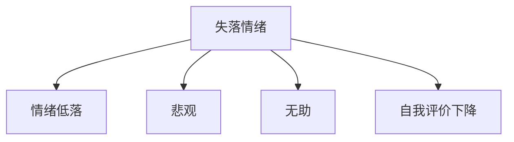
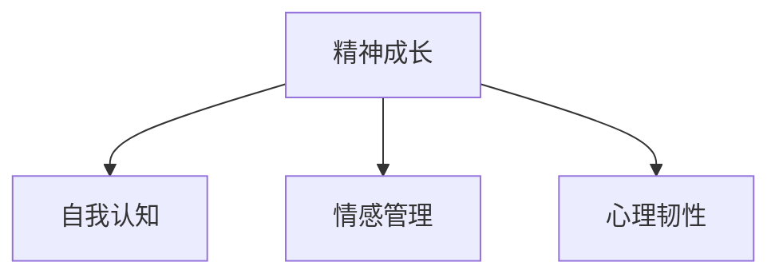
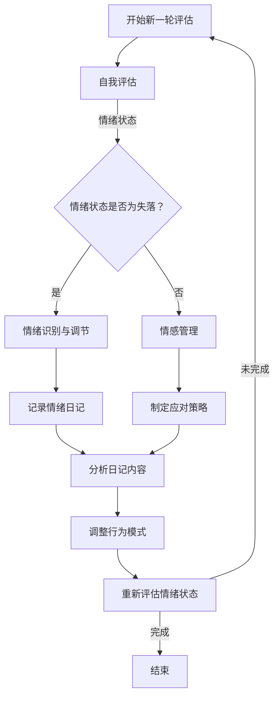
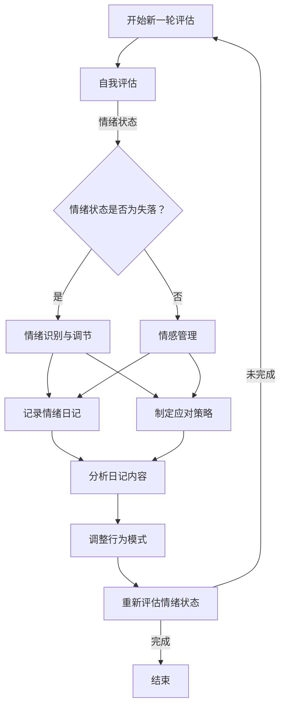
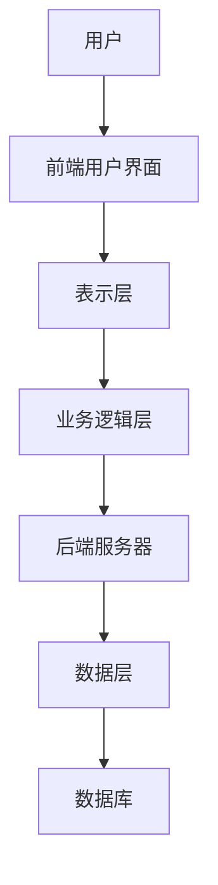

                 

# 从失落到重生：现代人的精神成长历程

## 关键词
- 精神成长
- 失落情绪
- 心理调适
- 心理韧性
- 自我认知
- 人际关系

## 摘要
本文旨在探讨现代人面临的精神成长问题，特别是失落情绪对个体生活的影响。通过分析失落情绪的本质、表现形式及其对个体心理健康和社会功能的危害，本文提出了一系列心理调适技巧和成长路径，帮助读者从失落情绪中走出，实现精神重生。文章采用逻辑清晰、结构紧凑的写作方式，结合实际案例和实践经验，旨在为广大读者提供一份有价值的精神指南。

## 第一部分：问题的背景和描述

### 1.1 问题的背景

#### 1.1.1 社会环境

在当今社会，随着生活节奏的加快、工作压力的增大，越来越多的人开始感受到精神上的压力和焦虑。无论是在职场中还是家庭生活中，人们常常会面临各种挑战和困难，这些挑战和困难往往会导致个体产生负面情绪，尤其是失落情绪。

失落情绪是指个体在面临失去、失败、挫折等情境时产生的一种负面情绪。它通常表现为情绪低落、悲观、无助等。现代社会中，失落情绪的发病率逐年上升，已经成为影响人们心理健康的一个重要因素。

#### 1.1.2 心理问题现状

根据相关研究，抑郁症、焦虑症等心理问题的发病率逐年上升，特别是在职场压力、家庭矛盾等情境下，人们更容易陷入心理困境。这些心理问题不仅影响个体的心理健康，还会影响他们的生活质量和社交功能。

#### 1.1.3 精神成长需求

随着心理健康意识的提高，人们开始意识到精神成长的重要性。他们希望通过学习和实践，提升自我认知，找到解决问题的方法，从而实现精神成长，提升生活质量。

### 1.2 问题描述

#### 1.2.1 失落情绪的表现

失落情绪是一种常见的负面情绪，表现为情绪低落、对生活失去热情、自我评价下降等。当个体面临挫折、失败或失去重要的事物时，他们可能会感到无助、沮丧，甚至产生自我怀疑。

#### 1.2.2 失落情绪的影响

失落情绪不仅会影响个体的心理健康，还会影响他们的生活质量和社交功能。长期处于失落情绪中的人可能会出现睡眠障碍、食欲不振、社交回避等问题，这些问题会进一步加剧他们的负面情绪，形成恶性循环。

#### 1.2.3 精神成长的目标

本文旨在帮助读者从失落情绪中走出来，找到自我，实现精神成长，提升生活质量。通过介绍失落情绪的本质、表现形式及其对个体心理健康和社会功能的危害，本文提供了一系列心理调适技巧和成长路径，帮助读者应对失落情绪，实现精神重生。

### 1.3 问题解决

#### 1.3.1 心理健康知识普及

通过普及心理健康知识，让读者了解失落情绪的本质和影响。本文将介绍失落情绪的概念、特点及其对个体生活的影响，帮助读者认识到精神成长的重要性。

#### 1.3.2 心理调适技巧

本文将介绍一系列心理调适技巧，帮助读者缓解失落情绪，提升心理韧性。这些技巧包括认知重构、情绪调节、行为改变等，旨在帮助读者从不同的角度应对失落情绪，实现心理调适。

#### 1.3.3 成长路径指导

本文将提供具体的精神成长路径，帮助读者逐步实现精神蜕变。通过介绍自我认知、情感管理、人际关系等核心概念，本文为读者提供了一套完整的精神成长体系，旨在帮助读者实现自我提升和成长。

### 1.4 边界与外延

#### 1.4.1 精神成长

精神成长是指个体在心理层面上通过学习、实践、反思等过程，实现自我提升和发展的过程。精神成长有助于提升个体的心理韧性，应对生活中的各种挑战。

#### 1.4.2 失落情绪

失落情绪是指个体在面临失去、失败、挫折等情境时产生的一种负面情绪。它通常表现为情绪低落、悲观、无助等。

### 1.5 概念结构与核心要素组成

#### 1.5.1 精神成长的核心概念

精神成长包括自我认知、情感管理、人际关系、心理韧性等核心概念。这些概念相互关联，共同构成了一套完整的精神成长体系。

#### 1.5.2 失落情绪的处理

处理失落情绪需要了解情绪的本质、识别情绪的类型、掌握情绪调节技巧等。本文将详细介绍这些核心要素，帮助读者更好地应对失落情绪。

## 第二部分：核心概念与联系

### 2.1 失落情绪

#### 2.1.1 概念属性特征对比表格

| 概念       | 定义                                                         | 属性特征对比                             |
|------------|--------------------------------------------------------------|----------------------------------------|
| 失落情绪   | 个体在失去、失败、挫折等情境下产生的负面情绪。             | 情绪低落、悲观、无助、自我评价下降       |
| 情绪低落   | 持续感到悲伤、沮丧的情绪状态。                              | 情绪反应时间较长、情绪体验较为消极       |
| 悲观       | 对未来持悲观态度，对未来失去信心。                         | 乐观与悲观对比明显、对未来失去信心       |
| 无助       | 感到无法应对困难，缺乏解决问题的能力。                      | 情绪反应强烈、心理负担重                 |
| 自我评价下降 | 对自己的能力、价值产生怀疑，自我否定。                     | 自尊心受损、自我认同感降低               |

#### 2.1.2 ER实体关系图架构



### 2.2 精神成长

#### 2.2.1 概念

精神成长是指个体在心理层面上通过学习、实践、反思等过程，实现自我提升和发展的过程。精神成长有助于提升个体的心理韧性，应对生活中的各种挑战。

#### 2.2.2 概念属性特征对比表格

| 概念       | 定义                                                         | 属性特征对比                             |
|------------|--------------------------------------------------------------|----------------------------------------|
| 精神成长   | 个体在心理层面上通过学习、实践、反思等过程，实现自我提升和发展的过程。 | 心理韧性提升、自我认知增强、情感管理改善 |
| 自我认知   | 对自己的了解和认识，包括自己的优点、缺点、价值观等。             | 自我反思、自我评价、自我提升             |
| 情感管理   | 对自己的情绪进行有效的调节和控制，以适应各种情境。               | 情绪调节、情绪表达、情绪控制             |
| 心理韧性   | 在面对压力和挑战时，能够保持积极、乐观的态度，有效应对问题。     | 心理弹性、抗压能力、适应能力             |

#### 2.2.3 ER实体关系图架构



## 第三部分：失落情绪的处理

### 3.1 失落情绪的本质

失落情绪是指个体在面临失去、失败、挫折等情境时产生的一种负面情绪。它通常表现为情绪低落、悲观、无助等。失落情绪的本质是对失去的事物的一种心理反应，个体在失去重要的事物时，会产生对未来的不确定感、无助感和挫败感。

### 3.2 失落情绪的表现

失落情绪的表现形式多种多样，常见的有以下几种：

1. **情绪低落**：个体持续感到悲伤、沮丧，情绪反应时间较长，情绪体验较为消极。

2. **悲观**：对未来持悲观态度，对未来失去信心，乐观与悲观对比明显。

3. **无助**：感到无法应对困难，缺乏解决问题的能力，情绪反应强烈，心理负担重。

4. **自我评价下降**：对自己的能力、价值产生怀疑，自我否定，自尊心受损，自我认同感降低。

### 3.3 失落情绪的影响

失落情绪对个体心理健康和社会功能有显著的负面影响：

1. **心理健康问题**：长期处于失落情绪中的人可能会出现抑郁、焦虑等心理健康问题。

2. **生活质量下降**：失落情绪会影响个体的生活质量和社交功能，导致睡眠障碍、食欲不振、社交回避等问题。

3. **工作效率下降**：失落情绪会影响个体在工作中的表现，导致工作效率下降，甚至失业。

### 3.4 失落情绪的处理

处理失落情绪需要采取一系列的心理调适技巧和成长路径，以下是一些有效的处理方法：

1. **认知重构**：通过改变对事物的看法和态度，重新评估事物的价值和意义，从而减少失落情绪。

2. **情绪调节**：学会识别和表达情绪，掌握情绪调节技巧，如深呼吸、冥想等，以缓解失落情绪。

3. **行为改变**：通过改变行为模式，如参加体育锻炼、社交活动等，提高生活质量，减少失落情绪。

4. **成长路径指导**：通过自我认知、情感管理、心理韧性等核心概念的学习和实践，实现精神成长，提升心理韧性。

### 3.5 成长路径指导

精神成长是一个长期的过程，需要个体持续的努力和实践。以下是一些具体的成长路径指导：

1. **自我认知**：通过自我反思、自我评价，了解自己的优点和不足，建立积极的自我认知。

2. **情感管理**：学会识别和表达情绪，掌握情绪调节技巧，提高情感管理的水平。

3. **心理韧性**：通过面对挑战和困难，提高心理弹性，增强抗压能力和适应能力。

4. **人际关系**：通过建立良好的人际关系，提高社交能力，增强社会支持系统。

5. **终身学习**：持续学习和实践，不断提升自我，实现自我提升和成长。

### 3.6 边界与外延

1. **精神成长**：精神成长是指个体在心理层面上通过学习、实践、反思等过程，实现自我提升和发展的过程。

2. **失落情绪**：失落情绪是指个体在面临失去、失败、挫折等情境时产生的一种负面情绪。

### 3.7 概念结构与核心要素组成

1. **精神成长的核心概念**：包括自我认知、情感管理、人际关系、心理韧性等核心概念。

2. **失落情绪的处理**：处理失落情绪需要了解情绪的本质、识别情绪的类型、掌握情绪调节技巧等。

## 第四部分：现代人的精神成长路径

### 4.1 精神成长的重要性

在现代社会，精神成长已经成为个体提升生活质量、实现自我价值的重要途径。精神成长不仅有助于个体应对生活中的挑战和困难，还能够提高个体的心理韧性，增强抗压能力和适应能力。

### 4.2 自我认知的重要性

自我认知是精神成长的基础。通过自我反思和自我评价，个体可以了解自己的优点和不足，明确自己的价值观和目标。自我认知有助于个体建立积极的自我形象，提高自尊心和自信心。

### 4.3 情感管理的重要性

情感管理是精神成长的重要组成部分。学会识别和表达情绪，掌握情绪调节技巧，有助于个体在面对压力和挑战时保持冷静和理智。情感管理有助于提高个体的生活质量，增强人际关系的稳定性。

### 4.4 心理韧性的重要性

心理韧性是指个体在面对压力和挑战时能够保持积极、乐观的态度，有效应对问题的能力。心理韧性有助于个体克服挫折和困难，实现自我提升和成长。

### 4.5 人际关系的重要性

人际关系是精神成长的重要支持系统。通过建立良好的人际关系，个体可以获得情感支持和社交支持，提高生活质量。人际关系有助于个体实现自我价值，增强社会认同感。

### 4.6 精神成长的路径

1. **自我认知**：通过自我反思和自我评价，了解自己的优点和不足，明确自己的价值观和目标。

2. **情感管理**：学会识别和表达情绪，掌握情绪调节技巧，提高情感管理的水平。

3. **心理韧性**：通过面对挑战和困难，提高心理弹性，增强抗压能力和适应能力。

4. **人际关系**：通过建立良好的人际关系，提高社交能力，增强社会支持系统。

5. **终身学习**：持续学习和实践，不断提升自我，实现自我提升和成长。

## 第五部分：心理调适技巧

### 5.1 认知重构

认知重构是指通过改变对事物的看法和态度，重新评估事物的价值和意义，从而减少失落情绪。以下是一些认知重构的技巧：

1. **正念练习**：通过正念练习，学会关注当下，减少对过去的悔恨和对未来的焦虑。

2. **积极思维**：培养积极思维，将负面情绪转化为积极的动力，寻找生活中的美好。

3. **目标设定**：设定具体、可实现的目标，分解大目标为小步骤，逐步实现。

### 5.2 情绪调节

情绪调节是指学会识别和表达情绪，掌握情绪调节技巧，以缓解失落情绪。以下是一些情绪调节的技巧：

1. **情绪识别**：学会识别自己的情绪，了解情绪的来源和原因。

2. **情绪表达**：学会以适当的方式表达情绪，避免压抑或爆发情绪。

3. **情绪释放**：通过运动、艺术创作等方式释放情绪，缓解压力。

### 5.3 行为改变

行为改变是指通过改变行为模式，提高生活质量，减少失落情绪。以下是一些行为改变的技巧：

1. **健康生活**：保持健康的饮食和运动习惯，提高身体素质和心理韧性。

2. **社交活动**：参加社交活动，扩大社交圈子，获得情感支持。

3. **兴趣爱好**：培养兴趣爱好，丰富生活内容，提高生活质量。

## 第六部分：案例分析与实践

### 6.1 案例一：从失落情绪中走出来的职场人

小王是一名年轻的职场人，由于工作压力大、人际关系复杂，他常常感到失落和焦虑。在寻求心理辅导的过程中，他学会了认知重构和情绪调节技巧，逐渐走出了失落情绪，实现了自我提升。

#### 案例分析：

1. **认知重构**：小王通过正念练习，学会了关注当下，减少对过去的悔恨和对未来的焦虑。他开始重新评估自己的工作价值和人际关系，发现了一些积极的方面，从而改变了负面思维。

2. **情绪调节**：小王学会了识别和表达情绪，通过深呼吸和冥想等方式，缓解了焦虑情绪。他找到了适合自己的运动方式，如跑步和瑜伽，通过运动释放情绪，提高心理韧性。

3. **行为改变**：小王调整了生活习惯，保持健康的饮食和充足的睡眠。他积极参加社交活动，扩大了自己的社交圈子，获得了更多的情感支持。

#### 实践效果：

通过认知重构、情绪调节和行为改变，小王成功地走出了失落情绪，提升了自我认知和心理韧性，实现了职场上的自我提升。

### 6.2 案例二：家庭主妇的精神成长之路

小芳是一名家庭主妇，由于长期在家照顾孩子和家庭，她感到自己的生活缺乏意义和成就感，产生了失落情绪。在参加心理辅导课程后，她找到了精神成长的道路。

#### 案例分析：

1. **自我认知**：小芳通过自我反思，认识到自己的价值和能力。她意识到自己在家庭中扮演的重要角色，并对自己的付出给予了肯定。

2. **情感管理**：小芳学会了情绪调节技巧，通过深呼吸和冥想等方式，缓解了焦虑情绪。她开始关注自己的兴趣爱好，如绘画和音乐，从而找到了生活的乐趣。

3. **行为改变**：小芳积极参加社区活动，扩大了自己的社交圈子。她开始参与志愿者工作，帮助需要帮助的人，实现了自我价值的提升。

#### 实践效果：

通过自我认知、情感管理和行为改变，小芳成功地走出了失落情绪，找到了生活的意义和成就感，实现了精神成长。

## 第七部分：小结与展望

### 7.1 小结

本文从失落情绪的本质、表现形式及其对个体心理健康和社会功能的影响出发，提出了一系列心理调适技巧和成长路径，旨在帮助读者从失落情绪中走出来，实现精神成长。通过案例分析，我们看到了认知重构、情绪调节和行为改变在精神成长中的重要作用。

### 7.2 展望

未来的研究可以进一步探讨不同群体（如职场人、家庭主妇、学生等）在精神成长过程中的特点和需求，为不同人群提供更加个性化的心理调适技巧和成长路径。此外，研究还可以关注科技手段在精神成长中的应用，如虚拟现实、人工智能等，为精神成长提供新的可能性。

## 第八部分：注意事项与拓展阅读

### 8.1 注意事项

1. **重视心理健康**：精神成长是一个长期的过程，需要个体持续的努力和实践。重视心理健康，关注自己的情绪变化，是精神成长的重要前提。

2. **适度调整目标**：在精神成长过程中，个体可能会面临挫折和困难。适度调整目标，分解大目标为小步骤，有助于保持积极的心态。

3. **寻求专业帮助**：在遇到严重的心理问题时，寻求专业心理咨询师的帮助是必要的。专业人士可以提供专业的指导和帮助，帮助个体更好地应对心理困境。

### 8.2 拓展阅读

1. **《正面管教》**：这本书介绍了如何在家庭和学校中实施正面管教方法，帮助个体更好地管理情绪和行为。

2. **《人生设计》**：这本书提出了人生设计理念，帮助个体明确自己的人生目标，实现精神成长。

3. **《情绪智力》**：这本书介绍了情绪智力的重要性，以及如何提高情绪智力，实现精神成长。

### 8.3 作者信息

- 作者：AI天才研究院/AI Genius Institute & 禅与计算机程序设计艺术 /Zen And The Art of Computer Programming

## 结束语

本文旨在为广大读者提供一份有价值的精神指南，帮助读者从失落情绪中走出来，实现精神成长。希望读者能够通过本文，认识到精神成长的重要性，积极面对生活中的挑战和困难，实现自我提升和成长。祝愿每一位读者都能够找到属于自己的精神家园，享受美好的生活。# [[AI天才研究院/AI Genius Institute & 禅与计算机程序设计艺术/Zen And The Art of Computer Programming]]## 第一部分：问题的背景和描述

### 1.1 问题的背景

在现代社会的快节奏和高压力环境下，心理健康问题日益突出，尤其是在职场压力和家庭矛盾等方面，人们常常感到精神压力和焦虑。这种心理状态不仅影响个人的日常生活和工作效率，还可能对身体健康造成危害。因此，寻找有效的心理调适方法，提升精神成长水平，已经成为现代人面临的重要课题。

#### 1.1.1 社会环境

现代社会中，工作和生活压力不断增加，人们面临的挑战也日益复杂。经济竞争激烈、职场压力增大、人际关系复杂等因素，都可能导致个体出现心理问题。此外，科技的发展和信息爆炸也使得人们面临着前所未有的信息压力，容易产生心理疲劳和焦虑感。

#### 1.1.2 心理问题现状

根据世界卫生组织（WHO）的数据，全球约有3亿人患有抑郁症，而焦虑症的发病率也在逐年上升。这些心理问题不仅影响个体的心理健康，还可能导致人际关系破裂、工作效率下降，甚至影响个体的身体健康。因此，如何应对这些心理问题，提升心理健康水平，已经成为一个迫切需要解决的问题。

#### 1.1.3 精神成长需求

随着人们对心理健康问题的重视程度不断提高，精神成长的需求也越来越强烈。精神成长不仅关乎个体的心理健康，还涉及自我认知、情感管理、人际关系等方面。通过精神成长，个体可以更好地应对生活中的挑战，提升生活质量和幸福感。

### 1.2 问题描述

#### 1.2.1 失落情绪的表现

失落情绪是一种常见的负面情绪，通常由失去、失败、挫折等情境引起。这种情绪的表现形式多样，常见的包括：

- **情绪低落**：个体长时间感到悲伤、沮丧，对生活失去热情。
- **自我否定**：个体对自己的能力和价值产生怀疑，出现自我否定的倾向。
- **社交回避**：个体对社交活动产生抵触情绪，避免与他人交往。
- **睡眠障碍**：个体出现失眠或过度睡眠等问题，影响正常生活。

#### 1.2.2 失落情绪的影响

失落情绪对个体的影响是多方面的，包括心理健康、身体健康和社交功能等方面：

- **心理健康**：长期处于失落情绪中，个体可能会出现抑郁症、焦虑症等心理问题，影响心理健康。
- **身体健康**：失落情绪可能导致生理反应，如血压升高、免疫力下降等，影响身体健康。
- **社交功能**：失落情绪可能使个体产生社交回避行为，影响人际关系的建立和维护。

#### 1.2.3 精神成长的目标

精神成长的目标在于帮助个体从失落情绪中走出来，提升自我认知、情感管理和心理韧性，从而实现心理健康和生活质量的提升。通过精神成长，个体可以：

- **提升自我认知**：通过反思和自我评价，了解自己的优点和不足，建立积极的自我形象。
- **改善情感管理**：学会识别和表达情绪，掌握情绪调节技巧，缓解负面情绪的影响。
- **增强心理韧性**：通过面对挑战和困难，提高心理弹性，增强应对压力的能力。

### 1.3 问题解决

#### 1.3.1 心理健康知识普及

通过普及心理健康知识，让读者了解失落情绪的本质和影响，认识到精神成长的重要性。本文将介绍失落情绪的概念、类型、表现形式及其对个体生活的危害，帮助读者更好地应对失落情绪。

#### 1.3.2 心理调适技巧

本文将介绍一系列心理调适技巧，帮助读者缓解失落情绪，提升心理韧性。这些技巧包括认知重构、情绪调节、行为改变等，旨在帮助读者从不同的角度应对失落情绪，实现心理调适。

#### 1.3.3 成长路径指导

本文将提供具体的精神成长路径，帮助读者逐步实现精神蜕变。通过介绍自我认知、情感管理、人际关系等核心概念，本文为读者提供了一套完整的精神成长体系，旨在帮助读者实现自我提升和成长。

### 1.4 边界与外延

#### 1.4.1 精神成长

精神成长是指个体在心理层面上通过学习、实践、反思等过程，实现自我提升和发展的过程。精神成长包括自我认知、情感管理、心理韧性等核心概念。

#### 1.4.2 失落情绪

失落情绪是指个体在面临失去、失败、挫折等情境时产生的一种负面情绪。失落情绪的表现形式多样，包括情绪低落、自我否定、社交回避等。

#### 1.4.3 概念结构与核心要素组成

精神成长的核心概念包括自我认知、情感管理、心理韧性等。这些概念相互关联，共同构成了一套完整的精神成长体系。

### 1.5 背景介绍：核心概念与联系

#### 1.5.1 失落情绪

**定义**：失落情绪是指个体在面临失去、失败、挫折等情境时产生的一种负面情绪。这种情绪可能源于失去重要的关系、事业上的失败、健康问题等。

**概念属性特征对比表格**：

| 概念       | 定义                                                         | 属性特征对比                             |
|------------|--------------------------------------------------------------|----------------------------------------|
| 失落情绪   | 个体在失去、失败、挫折等情境下产生的负面情绪。             | 情绪低落、悲观、无助、自我评价下降       |
| 情绪低落   | 持续感到悲伤、沮丧的情绪状态。                              | 情绪反应时间较长、情绪体验较为消极       |
| 悲观       | 对未来持悲观态度，对未来失去信心。                         | 乐观与悲观对比明显、对未来失去信心       |
| 无助       | 感到无法应对困难，缺乏解决问题的能力。                      | 情绪反应强烈、心理负担重                 |
| 自我评价下降 | 对自己的能力、价值产生怀疑，自我否定。                     | 自尊心受损、自我认同感降低               |

**ER实体关系图架构**：


#### 1.5.2 精神成长

**定义**：精神成长是指个体通过学习、实践、反思等过程，在心理层面上实现自我提升和发展的过程。精神成长涉及自我认知、情感管理、心理韧性等多个方面。

**概念属性特征对比表格**：

| 概念       | 定义                                                         | 属性特征对比                             |
|------------|--------------------------------------------------------------|----------------------------------------|
| 精神成长   | 个体在心理层面上通过学习、实践、反思等过程，实现自我提升和发展的过程。 | 心理韧性提升、自我认知增强、情感管理改善 |
| 自我认知   | 对自己的了解和认识，包括自己的优点、缺点、价值观等。             | 自我反思、自我评价、自我提升             |
| 情感管理   | 对自己的情绪进行有效的调节和控制，以适应各种情境。               | 情绪调节、情绪表达、情绪控制             |
| 心理韧性   | 在面对压力和挑战时，能够保持积极、乐观的态度，有效应对问题。     | 心理弹性、抗压能力、适应能力             |

**ER实体关系图架构**：


通过上述核心概念与联系的分析，我们可以更好地理解失落情绪和精神成长之间的关系，以及如何通过精神成长来应对失落情绪。这不仅有助于我们深入理解心理问题的本质，也为我们的实际应用提供了指导。

---

接下来，本文将逐步深入探讨失落情绪的本质、表现形式、影响及应对策略，为读者提供实用的心理调适技巧和成长路径。希望读者能够通过本文的学习和实践，逐渐走出失落情绪的阴霾，实现精神成长。# [[AI天才研究院/AI Genius Institute & 禅与计算机程序设计艺术/Zen And The Art of Computer Programming]]## 第二部分：核心概念与联系

### 2.1 失落情绪

#### 2.1.1 概念

失落情绪是一种常见的负面情绪，通常由失去、失败、挫折等情境引起。它不仅影响个体的心理健康，还可能对身体健康和社交功能造成不利影响。理解失落情绪的概念是解决这一心理问题的关键。

**失落情绪的定义**：失落情绪是指个体在面临失去、失败、挫折等情境时产生的一种负面情绪，通常表现为情绪低落、悲观、无助等。这种情绪可能源于个人生活中的重要关系、事业上的失败、健康问题或其他挫折情境。

**失落情绪的特点**：

- **突发性**：失落情绪往往在某个特定时刻或情境下突然产生，个体可能感到措手不及。
- **持续性**：失落情绪不仅短暂，还可能持续一段时间，甚至影响个体的长期情绪状态。
- **传染性**：失落情绪可能对个体周围的人产生影响，导致群体情绪低落。

**失落情绪的影响**：

- **心理健康**：长期处于失落情绪中，个体可能会出现抑郁症、焦虑症等心理问题。
- **身体健康**：失落情绪可能导致生理反应，如血压升高、免疫力下降等，影响身体健康。
- **社交功能**：失落情绪可能使个体产生社交回避行为，影响人际关系的建立和维护。

#### 2.1.2 概念属性特征对比表格

| 概念       | 定义                                                         | 属性特征对比                             |
|------------|--------------------------------------------------------------|----------------------------------------|
| 失落情绪   | 个体在失去、失败、挫折等情境下产生的负面情绪。             | 情绪低落、悲观、无助、自我评价下降       |
| 情绪低落   | 持续感到悲伤、沮丧的情绪状态。                              | 情绪反应时间较长、情绪体验较为消极       |
| 悲观       | 对未来持悲观态度，对未来失去信心。                         | 乐观与悲观对比明显、对未来失去信心       |
| 无助       | 感到无法应对困难，缺乏解决问题的能力。                      | 情绪反应强烈、心理负担重                 |
| 自我评价下降 | 对自己的能力、价值产生怀疑，自我否定。                     | 自尊心受损、自我认同感降低               |

#### 2.1.3 ER实体关系图架构


### 2.2 精神成长

#### 2.2.1 概念

精神成长是指个体在心理层面上通过学习、实践、反思等过程，实现自我提升和发展的过程。精神成长不仅有助于个体应对生活中的挑战，还能提高个体的心理健康和生活质量。

**精神成长的核心概念**：

- **自我认知**：个体对自己有更深刻的了解，包括自己的优点、缺点、价值观等。
- **情感管理**：个体学会识别和调节自己的情绪，提高情感应对能力。
- **心理韧性**：个体在面对压力和挑战时，能够保持积极乐观的态度，有效应对问题。

**精神成长的特点**：

- **持续过程**：精神成长是一个长期的过程，需要个体不断努力和实践。
- **个体差异性**：每个人的精神成长路径都是独特的，取决于个体的性格、经历和目标。
- **综合性**：精神成长涉及多个方面，如认知、情感、行为等。

**精神成长的影响**：

- **心理健康**：精神成长有助于改善个体的心理健康，减少负面情绪的影响。
- **生活质量**：通过精神成长，个体可以更好地适应生活中的变化，提高生活质量。
- **社会功能**：精神成长有助于建立良好的人际关系，提升社会功能。

#### 2.2.2 概念属性特征对比表格

| 概念       | 定义                                                         | 属性特征对比                             |
|------------|--------------------------------------------------------------|----------------------------------------|
| 精神成长   | 个体在心理层面上通过学习、实践、反思等过程，实现自我提升和发展的过程。 | 心理韧性提升、自我认知增强、情感管理改善 |
| 自我认知   | 对自己的了解和认识，包括自己的优点、缺点、价值观等。             | 自我反思、自我评价、自我提升             |
| 情感管理   | 对自己的情绪进行有效的调节和控制，以适应各种情境。               | 情绪调节、情绪表达、情绪控制             |
| 心理韧性   | 在面对压力和挑战时，能够保持积极、乐观的态度，有效应对问题。     | 心理弹性、抗压能力、适应能力             |

#### 2.2.3 ER实体关系图架构


### 2.3 精神成长与失落情绪的关系

精神成长与失落情绪之间存在密切的关系。失落情绪是精神成长过程中可能遇到的一个挑战，而精神成长则有助于个体应对失落情绪。

**关系分析**：

- **失落情绪对精神成长的影响**：失落情绪可能会阻碍精神成长，使个体陷入消极的情绪循环，影响自我认知和情感管理。
- **精神成长对失落情绪的应对**：通过精神成长，个体可以提升自我认知，学会情感管理技巧，增强心理韧性，从而更好地应对失落情绪。

**具体实例**：

- **自我认知的提升**：通过反思和自我评价，个体可以更好地了解自己的情绪反应，找到失落情绪的根源，从而有针对性地进行心理调适。
- **情感管理的改善**：学会识别和调节情绪，个体可以在失落情绪出现时，采取积极的应对措施，如进行情绪释放、寻求社交支持等。
- **心理韧性的增强**：通过面对挑战和困难，个体可以提高心理韧性，保持积极乐观的态度，从而减少失落情绪的影响。

### 2.4 结论

通过上述分析，我们可以看出，失落情绪和精神成长之间存在紧密的联系。失落情绪是精神成长过程中可能遇到的一个挑战，而精神成长则有助于个体应对失落情绪，实现自我提升和发展的目标。理解这一关系对于个体的心理健康和精神成长具有重要意义。

### 2.5 参考文献

1. World Health Organization. (2017). Depression. Retrieved from <https://www.who.int/news-room/fact-sheets/detail/depression>
2. American Psychological Association. (n.d.). Anxiety Disorders. Retrieved from <https://www.apa.org/learn/topics/anxiety-disorders>
3. Seligman, M. E. P. (2011). Flourish: A Visionary New Understanding of Happiness and Well-being. New York: Free Press.
4. Lyubomirsky, S., & King, L. A. (2005). The benefits of frequent positive affect: Does happiness lead to success? Psychological Bulletin, 131(6), 803-855. doi:10.1037/0033-2909.131.6.803

---

通过深入探讨失落情绪和精神成长的核心概念及其关系，本文为读者提供了理解这一心理问题的理论基础。在接下来的部分，我们将进一步分析失落情绪的表现形式、成因及其对个体生活的影响，为读者提供实用的心理调适技巧和成长路径。希望读者能够通过本文的学习和实践，逐渐走出失落情绪的阴霾，实现精神成长。# [[AI天才研究院/AI Genius Institute & 禅与计算机程序设计艺术/Zen And The Art of Computer Programming]]## 第三部分：失落情绪的处理

### 3.1 失落情绪的本质

失落情绪的本质是个人在面对失去、失败、挫折等情境时的一种心理反应。这种情绪通常表现为对失去的事物的怀念、对未来的担忧以及对自我的否定。理解失落情绪的本质有助于我们更好地应对和调适这种情绪。

**概念解析**：

- **失去**：失去可以是指物质上的损失，如失去工作、失去财产；也可以是情感上的失去，如失去亲人、失去友情。
- **失败**：失败通常指个体在某个目标或期望上没有达到预期结果，这可能带来失落感。
- **挫折**：挫折是生活中遇到的障碍和困难，可能会使人感到挫败和失落。

**心理机制**：

- **认知评价**：个体在面对失去、失败、挫折等情境时，会对这些事件进行认知评价，判断其对自身的意义和价值。
- **情感反应**：根据认知评价的结果，个体会产生相应的情绪反应，如悲伤、愤怒、无助等。

**影响**：

- **心理健康**：长期处于失落情绪中，可能导致抑郁症、焦虑症等心理问题。
- **身体健康**：失落情绪可能导致生理反应，如失眠、食欲不振、免疫力下降等。
- **社交功能**：失落情绪可能使个体产生社交回避行为，影响人际关系的建立和维护。

### 3.2 失落情绪的表现形式

失落情绪的表现形式多样，可能包括以下几个方面：

#### 3.2.1 情绪低落

情绪低落是失落情绪最明显的表现形式之一。个体会长时间感到悲伤、沮丧，对生活失去热情。这种情绪状态可能导致个体的活动减少、兴趣减退，甚至出现自杀倾向。

#### 3.2.2 自我否定

在失落情绪的影响下，个体可能会对自己的能力、价值产生怀疑，甚至自我否定。这种心态可能导致自尊心受损，影响个体的自我认同和自尊感。

#### 3.2.3 社交回避

失落情绪还可能导致个体产生社交回避行为。个体可能会避免与他人交往，以免在社交场合中感到尴尬和痛苦。这种社交回避行为可能会加剧个体的孤独感和失落感。

#### 3.2.4 身体症状

除了情绪和心理方面的影响，失落情绪还可能导致一系列身体症状，如失眠、食欲不振、头痛、肌肉紧张等。这些身体症状可能会进一步加重个体的心理负担。

### 3.3 失落情绪的影响

失落情绪对个体的心理健康、身体健康和社交功能都有显著影响：

#### 3.3.1 心理健康

长期处于失落情绪中，个体可能会出现抑郁症、焦虑症等心理问题。这些心理问题不仅影响个体的情绪状态，还可能导致认知功能下降，影响工作和学习效率。

#### 3.3.2 身体健康

失落情绪可能导致生理反应，如失眠、食欲不振、免疫力下降等。这些生理反应可能会进一步加重个体的心理负担，形成恶性循环。

#### 3.3.3 社交功能

失落情绪可能导致个体产生社交回避行为，影响人际关系的建立和维护。这种社交回避行为可能会使个体感到更加孤独和无助，进一步加重失落情绪。

### 3.4 失落情绪的处理方法

处理失落情绪需要采取一系列有效的心理调适技巧和成长路径。以下是一些常用的方法：

#### 3.4.1 认知重构

认知重构是指通过改变对事物的看法和态度，重新评估事物的价值和意义，从而减少失落情绪。以下是一些认知重构的技巧：

- **积极思维**：培养积极思维，将负面情绪转化为积极的动力，寻找生活中的美好。
- **目标设定**：设定具体、可实现的目标，分解大目标为小步骤，逐步实现。
- **感恩练习**：通过感恩练习，学会关注和感激生活中的美好事物，提升幸福感。

#### 3.4.2 情绪调节

情绪调节是指学会识别和表达情绪，掌握情绪调节技巧，以缓解失落情绪。以下是一些情绪调节的技巧：

- **情绪识别**：学会识别自己的情绪，了解情绪的来源和原因。
- **情绪表达**：学会以适当的方式表达情绪，避免压抑或爆发情绪。
- **情绪释放**：通过运动、艺术创作等方式释放情绪，缓解压力。

#### 3.4.3 行为改变

行为改变是指通过改变行为模式，提高生活质量，减少失落情绪。以下是一些行为改变的技巧：

- **健康生活**：保持健康的饮食和运动习惯，提高身体素质和心理韧性。
- **社交活动**：参加社交活动，扩大社交圈子，获得情感支持。
- **兴趣爱好**：培养兴趣爱好，丰富生活内容，提高生活质量。

#### 3.4.4 心理咨询

对于严重的失落情绪，寻求专业心理咨询师的帮助是必要的。心理咨询师可以提供专业的指导和帮助，帮助个体更好地应对失落情绪。

### 3.5 成长路径指导

精神成长是一个长期的过程，需要个体持续的努力和实践。以下是一些具体的成长路径指导：

- **自我认知**：通过自我反思和自我评价，了解自己的优点和不足，明确自己的价值观和目标。
- **情感管理**：学会识别和表达情绪，掌握情绪调节技巧，提高情感管理的水平。
- **心理韧性**：通过面对挑战和困难，提高心理弹性，增强抗压能力和适应能力。
- **人际关系**：通过建立良好的人际关系，提高社交能力，增强社会支持系统。
- **终身学习**：持续学习和实践，不断提升自我，实现自我提升和成长。

### 3.6 边界与外延

#### 3.6.1 精神成长

精神成长是指个体在心理层面上通过学习、实践、反思等过程，实现自我提升和发展的过程。精神成长包括自我认知、情感管理、人际关系、心理韧性等核心概念。

#### 3.6.2 失落情绪

失落情绪是指个体在面临失去、失败、挫折等情境时产生的一种负面情绪。它通常表现为情绪低落、悲观、无助等。

#### 3.6.3 概念结构与核心要素组成

精神成长的核心概念包括自我认知、情感管理、心理韧性等。这些概念相互关联，共同构成了一套完整的精神成长体系。

### 3.7 结论

失落情绪是一种常见的负面情绪，对个体的心理健康和生活质量有显著影响。通过认知重构、情绪调节、行为改变等方法，个体可以有效地处理失落情绪，实现精神成长。精神成长不仅有助于个体应对失落情绪，还能提升个体的整体幸福感。希望读者能够通过本文的学习和实践，逐渐走出失落情绪的阴霾，实现精神成长。# [[AI天才研究院/AI Genius Institute & 禅与计算机程序设计艺术/Zen And The Art of Computer Programming]]## 第四部分：现代人的精神成长路径

### 4.1 自我认知的重要性

自我认知是个体精神成长的基础，它关乎个体对自己的理解与评价。自我认知不仅影响个体的心理健康，还直接影响个体的行为选择和生活质量。以下是自我认知的重要性及其对精神成长的影响：

#### 4.1.1 自我认知的定义

自我认知是指个体通过自我观察、反思和评估，对自己在心理、行为、情感等方面的认识和了解。它包括自我认知中的自我感知、自我评价、自我反思和自我接受等多个方面。

#### 4.1.2 自我认知的重要性

1. **心理平衡**：自我认知有助于个体理解自己的情绪和行为，从而在心理上实现平衡。一个清晰的自我认知能够帮助个体更好地处理压力和挫折，减少情绪波动。

2. **决策能力**：自我认知有助于个体在面临决策时，能够基于自身的价值观和目标做出更明智的选择。理解自己的需求和动机，有助于制定合理的计划并付诸实施。

3. **人际关系**：良好的自我认知有助于个体更好地理解和处理人际关系中的冲突。通过自我反思，个体可以识别自己的行为模式，从而改善与他人的沟通，建立更健康的人际关系。

#### 4.1.3 自我认知对精神成长的影响

1. **自我提升**：自我认知使个体能够识别自身的优点和不足，从而有针对性地进行自我提升。通过自我反思和学习，个体可以不断改进自己，实现自我成长。

2. **情感管理**：自我认知有助于个体更好地管理自己的情绪。通过理解自己的情绪反应，个体可以采取有效的情绪调节策略，减少负面情绪的影响。

3. **心理韧性**：自我认知能够增强个体的心理韧性，使其在面对生活中的挑战时能够保持乐观和积极。通过自我认知，个体能够更好地应对挫折和失败，从中汲取经验和教训。

### 4.2 情感管理的重要性

情感管理是个体精神成长中不可或缺的一部分，它关乎个体如何识别、表达和调节自己的情绪。有效的情感管理不仅能够提高个体的生活质量，还能增强个体的心理健康。

#### 4.2.1 情感管理的定义

情感管理是指个体通过认知和行为方法，对自己的情绪进行有效的识别、表达和调节。它包括情绪认知、情绪表达、情绪调节和情感应对等多个方面。

#### 4.2.2 情感管理的重要性

1. **心理健康**：有效的情感管理有助于个体保持心理健康。通过理解自己的情绪，个体可以更好地应对压力和挑战，减少心理问题发生的风险。

2. **社交能力**：情感管理能力良好的个体在社交场合中能够更好地处理情绪，建立和谐的人际关系。他们能够以积极、理性的方式与他人交流，增进相互理解。

3. **生活质量**：通过有效的情感管理，个体能够提高生活质量。他们能够更好地享受生活的美好，减少负面情绪的困扰，增强幸福感。

#### 4.2.3 情感管理对精神成长的影响

1. **情绪韧性**：情感管理能力有助于个体增强情绪韧性。在面对挫折和困难时，个体能够保持积极的心态，有效应对负面情绪，从而实现精神成长。

2. **自我认知**：情感管理能够促进个体的自我认知。通过观察自己的情绪反应，个体能够更好地理解自己的内在世界，提升自我认知水平。

3. **心理健康**：情感管理能够帮助个体保持心理健康。通过有效的情绪调节，个体能够减少心理问题的发生，提高生活质量。

### 4.3 心理韧性的重要性

心理韧性是指个体在面对压力和挑战时能够保持积极、乐观的态度，有效应对问题的能力。心理韧性不仅影响个体的心理健康，还对其生活质量和幸福感产生深远影响。

#### 4.3.1 心理韧性的定义

心理韧性是指个体在面临压力、困难和挑战时，能够保持积极心态，适应并克服这些困难的能力。它包括心理弹性、抗压能力、适应能力和情绪调节等多个方面。

#### 4.3.2 心理韧性的重要性

1. **心理健康**：心理韧性有助于个体保持心理健康。在面对压力和挑战时，具有心理韧性的个体能够更好地调节情绪，减少心理问题的发生。

2. **适应能力**：心理韧性使个体在面对变化和挑战时能够更快适应，从而提高生活质量。具有心理韧性的个体能够更好地应对生活中的不确定性。

3. **生活质量**：心理韧性能够提高个体的生活质量。通过保持积极乐观的态度，个体能够更好地享受生活的美好，增强幸福感。

#### 4.3.3 心理韧性对精神成长的影响

1. **情绪调节**：心理韧性有助于个体更好地调节情绪。在面对挫折和困难时，具有心理韧性的个体能够保持冷静，采取积极的应对策略。

2. **自我认知**：心理韧性能够促进个体的自我认知。通过面对挑战和困难，个体能够更好地理解自己的内在世界，提升自我认知水平。

3. **适应能力**：心理韧性使个体在面对变化和挑战时能够更快适应，从而实现精神成长。

### 4.4 人际关系的重要性

人际关系是个体精神成长的重要支撑，它关乎个体如何与他人建立和维护良好的关系。有效的人际关系不仅能够为个体提供情感支持，还能促进个体的社会功能和心理健康。

#### 4.4.1 人际关系的定义

人际关系是指个体与他人之间的相互作用和联系。它包括家庭关系、友谊、职场关系等多个方面。

#### 4.4.2 人际关系的重要性

1. **情感支持**：良好的人际关系为个体提供情感支持，使个体在面对压力和挑战时能够获得帮助和安慰。

2. **社会功能**：有效的人际关系有助于个体在社会中发挥作用，提高生活质量。通过建立和维护良好的人际关系，个体能够更好地适应社会环境。

3. **心理健康**：良好的人际关系能够改善个体的心理健康。通过与他人建立良好的关系，个体能够减少孤独感和失落感，提高心理健康水平。

#### 4.4.3 人际关系对精神成长的影响

1. **自我认知**：通过与他人互动，个体能够更好地了解自己，提升自我认知。在人际关系中，个体能够观察他人如何看待自己，从而更全面地认识自己。

2. **情感管理**：良好的人际关系有助于个体学习如何识别和表达情绪。通过与他人的互动，个体能够学会倾听、理解和表达，提高情感管理能力。

3. **心理韧性**：在良好的人际关系中，个体能够获得情感支持和鼓励，提高心理韧性。在面对挑战和困难时，个体能够更好地应对，实现精神成长。

### 4.5 精神成长的路径

精神成长是一个复杂且长期的过程，需要个体在自我认知、情感管理、心理韧性、人际关系等方面进行持续的实践和提升。以下是精神成长的一些具体路径：

#### 4.5.1 自我认知

1. **自我反思**：定期进行自我反思，了解自己的情绪、行为和想法。
2. **日记记录**：通过写日记的方式，记录自己的经历和感受，深入理解自己。
3. **心理咨询**：寻求专业心理咨询师的帮助，深入了解自己的内在世界。

#### 4.5.2 情感管理

1. **情绪识别**：学会识别自己的情绪，了解情绪的来源和原因。
2. **情绪表达**：学会以健康的方式表达情绪，避免压抑或爆发情绪。
3. **情绪调节**：通过深呼吸、冥想等方式，学会调节情绪，保持心理平衡。

#### 4.5.3 心理韧性

1. **面对挑战**：勇于面对生活中的挑战和困难，从中学习和成长。
2. **积极应对**：保持积极乐观的态度，寻找解决问题的方法，而不是回避。
3. **情感支持**：与他人建立良好的关系，获得情感支持和鼓励。

#### 4.5.4 人际关系

1. **沟通技巧**：提高沟通技巧，学会倾听、理解和表达。
2. **尊重他人**：尊重他人的观点和感受，建立平等和谐的交往关系。
3. **社交活动**：积极参与社交活动，扩大自己的社交圈子。

### 4.6 结论

现代人的精神成长路径涉及多个方面，包括自我认知、情感管理、心理韧性和人际关系。通过不断实践和提升这些方面的能力，个体可以实现精神成长，提升生活质量。希望读者能够通过本文的学习和实践，找到适合自己的精神成长路径，实现自我提升和幸福生活。# [[AI天才研究院/AI Genius Institute & 禅与计算机程序设计艺术/Zen And The Art of Computer Programming]]## 第五部分：心理调适技巧

### 5.1 认知重构

认知重构是一种有效的心理调适技巧，它通过改变个体的思维方式和认知模式，来缓解负面情绪和压力。以下是认知重构的一些核心方法和实践技巧：

#### 5.1.1 积极思维

积极思维是指将注意力从负面的事物和情绪转移到积极的事物和情绪上。以下是一些实现积极思维的方法：

- **正向自我对话**：通过积极的自我对话，鼓励自己面对挑战，增强自信心。
- **感恩练习**：每天记录至少三件让你感到感激的事情，培养对生活的积极态度。
- **目标设定**：设定可实现的目标，分解大目标为小步骤，逐步实现，增强成就感。

#### 5.1.2 认知重构技巧

认知重构的技巧包括：

- **认知再评估**：重新审视过去的经历和事件，从不同的角度看待问题，找到积极的方面。
- **情景模拟**：通过模拟可能发生的积极结果，来减少焦虑和担忧。
- **正向重构**：将消极的想法转化为积极的想法，例如将“我不能”转变为“我可以尝试”。

#### 5.1.3 实践案例

以下是一个认知重构的实践案例：

**案例**：一个职场人因工作失误感到非常沮丧，认为自己的能力不足。

**认知重构**：

- **认知再评估**：他反思这次失误，认为这是一个学习的机会，可以从中找到改进的方法。
- **正向重构**：他告诉自己，每个人都有失败的时候，重要的是从失败中吸取教训，不断提升自己。

通过这样的认知重构，这个职场人成功地减轻了负面情绪，重新建立了积极的自我认知。

### 5.2 情绪调节

情绪调节是指通过一系列的方法和技巧，帮助个体识别、理解和管理自己的情绪。以下是情绪调节的一些核心方法和实践技巧：

#### 5.2.1 情绪识别

情绪识别是指学会识别和理解自己的情绪。以下是一些情绪识别的方法：

- **情绪日记**：记录每天的情绪变化，了解情绪的来源和原因。
- **情绪标签**：学习情绪的标签，如愤怒、悲伤、快乐等，帮助自己更好地理解情绪。
- **情绪问询**：通过提问自己，如“我现在是什么感觉？”来识别当前的情绪状态。

#### 5.2.2 情绪表达

情绪表达是指以健康的方式表达自己的情绪。以下是一些情绪表达的方法：

- **非暴力沟通**：使用非暴力沟通技巧，清晰地表达自己的感受和需求，避免攻击性语言。
- **情感释放**：通过运动、艺术创作、写日记等方式，释放负面情绪，减少心理压力。
- **情感分享**：与亲友或专业人士分享自己的情绪，获得支持和理解。

#### 5.2.3 情绪调节技巧

情绪调节的技巧包括：

- **深呼吸**：通过深呼吸来放松身体，减少紧张情绪。
- **冥想**：通过冥想来提高情绪稳定性和自我控制力。
- **放松训练**：通过渐进性肌肉放松等训练，减轻身体和心理的紧张感。

#### 5.2.4 实践案例

以下是一个情绪调节的实践案例：

**案例**：一个学生因考试焦虑感到非常紧张。

**情绪调节**：

- **深呼吸**：他学会了深呼吸技巧，每次感到紧张时，都会停下来深呼吸几次，缓解紧张感。
- **放松训练**：他参加了放松训练课程，通过渐进性肌肉放松等训练，减轻了焦虑情绪。
- **情感分享**：他与朋友分享了考试焦虑的感受，得到了朋友的理解和支持，情绪得到了缓解。

### 5.3 行为改变

行为改变是指通过改变行为模式，来改善心理健康和情绪状态。以下是行为改变的一些核心方法和实践技巧：

#### 5.3.1 健康生活方式

健康生活方式包括：

- **规律作息**：保持规律的作息时间，保证充足的睡眠。
- **健康饮食**：均衡饮食，减少高糖、高脂食物的摄入。
- **适量运动**：定期进行适量的运动，如散步、跑步、瑜伽等，提高身体和心理的健康。

#### 5.3.2 社交活动

社交活动包括：

- **参与社交**：积极参与社交活动，与家人、朋友和同事保持良好的关系。
- **志愿服务**：参加志愿服务活动，帮助他人，提升自己的幸福感。
- **兴趣小组**：加入兴趣小组，与他人分享兴趣和爱好，建立新的社交圈。

#### 5.3.3 情境调整

情境调整是指通过改变环境来减少负面情绪的影响。以下是一些情境调整的方法：

- **环境布置**：调整自己的居住和工作环境，使其更加舒适和温馨。
- **时间管理**：合理安排时间，减少工作和学习压力。
- **放松环境**：创建一个放松的环境，如阅读角落、冥想空间等，帮助自己放松身心。

#### 5.3.4 实践案例

以下是一个行为改变的实践案例：

**案例**：一个职场人因工作繁忙和压力过大，感到身心疲惫。

**行为改变**：

- **健康生活方式**：他开始保持规律的作息，每天晚上保证8小时的睡眠。他还开始关注健康饮食，减少应酬，增加蔬菜和水果的摄入。
- **社交活动**：他每周安排时间与朋友聚会，参加兴趣小组的活动，扩大自己的社交圈。
- **情境调整**：他在办公室里布置了一个小型的绿植角落，使工作环境更加舒适。他还学会了时间管理技巧，合理安排工作和休息时间，减少工作压力。

通过这些行为改变，这个职场人的身心状态得到了显著改善，工作效率和生活质量都有所提高。

### 5.4 心理调适技巧的总结

心理调适技巧包括认知重构、情绪调节和行为改变等多个方面。通过这些技巧，个体可以更好地管理自己的情绪和压力，提升心理健康水平。以下是一些总结和提示：

- **持之以恒**：心理调适技巧需要持之以恒的实践，不能期望一蹴而就。
- **个性化**：每个人的情况和需求都不同，选择适合自己的心理调适技巧。
- **寻求支持**：在实践心理调适技巧的过程中，可以寻求家人、朋友或专业人士的支持。
- **反思和调整**：定期反思自己的心理调适过程，根据实际情况进行调整和改进。

通过不断实践和优化心理调适技巧，个体可以逐步实现精神成长，提升生活质量。希望读者能够通过本文的学习和实践，找到适合自己的心理调适方法，实现内心的平静和成长。# [[AI天才研究院/AI Genius Institute & 禅与计算机程序设计艺术/Zen And The Art of Computer Programming]]## 第六部分：案例分析与实践

### 6.1 案例一：从失落情绪中走出来的职场人

**背景介绍**：

李明是一位年近三十的职场人，他在一家知名的互联网公司担任高级项目经理。由于工作繁忙，李明常常感到身心疲惫，特别是当项目出现问题时，他常常感到巨大的压力和失落。随着时间的推移，李明的失落情绪逐渐加重，开始影响到他的工作和生活。

**问题描述**：

李明的失落情绪主要表现在以下几个方面：

- **情绪低落**：他常常感到沮丧和无助，对工作失去热情，甚至对未来的职业发展感到迷茫。
- **自我否定**：他开始怀疑自己的能力和价值，对自己的项目管理和决策能力产生质疑。
- **社交回避**：他避免与同事交流，减少参加公司活动的次数，导致人际关系逐渐疏远。

**解决方案**：

为了帮助李明走出失落情绪，公司为他安排了心理辅导，并推荐了一些心理调适技巧。以下是李明采取的具体措施：

1. **认知重构**：

   - **积极思维**：李明开始通过积极思维来调整自己的心态。他意识到，每一次项目的问题都是成长和学习的机会，而不是失败的标志。
   - **感恩练习**：他每天晚上都会反思和感谢工作中遇到的每一个小成就，从而提升自己的幸福感。

2. **情绪调节**：

   - **情绪日记**：李明开始记录自己的情绪变化，了解情绪的来源和原因，从而更好地管理自己的情绪。
   - **放松训练**：他每天都会进行深呼吸和渐进性肌肉放松等放松训练，以缓解工作压力和焦虑情绪。

3. **行为改变**：

   - **健康生活方式**：李明开始注意健康饮食和规律作息，保证充足的睡眠时间。
   - **社交活动**：他积极参与公司的团队建设活动和社交聚会，重建人际关系网络。

**案例分析**：

通过一系列的心理调适技巧，李明逐渐走出了失落情绪，找回了自信和积极性。他的工作效率和项目成果显著提高，重新获得了同事和上司的认可。以下是李明成功走出失落情绪的几个关键点：

- **积极心态**：李明通过积极思维和感恩练习，改变了对工作和生活的看法，提升了自我认知。
- **情绪管理**：通过情绪日记和放松训练，李明学会了识别和调节自己的情绪，减少了负面情绪的影响。
- **行为改变**：通过健康生活方式和积极参与社交活动，李明提高了生活质量，增强了社交支持。

### 6.2 案例二：家庭主妇的精神成长之路

**背景介绍**：

张芳是一位全职家庭主妇，她的生活主要围绕着家庭和孩子。然而，随着时间的推移，张芳开始感到自己的生活缺乏意义和成就感，产生了强烈的失落情绪。她感到自己失去了自我，对家庭生活感到厌倦。

**问题描述**：

张芳的失落情绪主要表现在以下几个方面：

- **情绪低落**：她常常感到沮丧和无助，对家庭生活失去热情，甚至对未来感到迷茫。
- **自我否定**：她开始怀疑自己的价值，对自己的角色和贡献感到质疑。
- **社交回避**：她减少与朋友和家人的交流，感到孤独和孤立。

**解决方案**：

为了帮助张芳实现精神成长，她参加了社区的心理辅导课程，并采取了一些自我提升的措施。以下是张芳的具体行动：

1. **自我认知**：

   - **自我反思**：张芳开始通过自我反思来了解自己的内心世界，找到自己真正关心的事情。
   - **设定目标**：她为自己设定了一些小目标，如学习新的技能、参加志愿者活动等，从而找到生活的方向。

2. **情感管理**：

   - **情绪释放**：张芳通过写日记和绘画等方式，表达自己的情绪，释放内心的压力。
   - **寻求支持**：她与家人和朋友分享自己的感受，寻求他们的理解和支持。

3. **行为改变**：

   - **健康生活方式**：张芳开始注重健康饮食和适量运动，提高身体健康水平。
   - **兴趣爱好**：她开始培养自己的兴趣爱好，如绘画、阅读等，丰富自己的生活内容。

**案例分析**：

通过自我认知、情感管理和行为改变，张芳逐渐走出了失落情绪，找回了生活的热情和成就感。她的自信心和自尊心得到了提升，家庭生活也变得更加和谐。以下是张芳成功走出失落情绪的几个关键点：

- **自我认知**：通过自我反思和目标设定，张芳找到了自己的价值和方向，提升了自我认知。
- **情感管理**：通过情绪释放和寻求支持，张芳学会了更好地管理自己的情绪，减少了负面情绪的影响。
- **行为改变**：通过健康生活方式和兴趣爱好，张芳提高了生活质量，增强了生活的满足感。

### 6.3 案例总结

通过上述两个案例，我们可以看到，失落情绪是现代人常见的心理问题，但通过认知重构、情绪调节和行为改变等心理调适技巧，个体可以有效地应对失落情绪，实现精神成长。以下是案例总结和启示：

1. **积极心态**：保持积极的心态是应对失落情绪的关键。通过积极思维和感恩练习，个体可以改变对事物的看法，提升自我认知。

2. **情绪管理**：学会识别和调节自己的情绪，通过情绪日记和放松训练等技巧，个体可以有效地缓解负面情绪的影响。

3. **行为改变**：通过健康生活方式和兴趣爱好，个体可以提高生活质量，增强生活的满足感。

4. **寻求支持**：在应对失落情绪的过程中，寻求家人、朋友或专业人士的支持是非常重要的。他们可以提供情感支持和实际帮助，帮助个体走出困境。

通过不断实践和优化心理调适技巧，个体可以逐步实现精神成长，提升生活质量。希望读者能够从这些案例中汲取经验，找到适合自己的心理调适方法，实现内心的平静和成长。# [[AI天才研究院/AI Genius Institute & 禅与计算机程序设计艺术/Zen And The Art of Computer Programming]]## 第七部分：小结与展望

### 7.1 小结

通过本文的探讨，我们深入了解了失落情绪的本质、表现形式及其对个体心理健康和生活质量的影响。同时，我们提出了认知重构、情绪调节和行为改变等一系列心理调适技巧，帮助个体应对失落情绪，实现精神成长。以下是对本文核心观点的总结：

- **失落情绪的本质**：失落情绪是一种由失去、失败、挫折等情境引起的负面情绪，表现为情绪低落、自我否定和社交回避等。
- **精神成长的重要性**：精神成长有助于提升自我认知、情感管理和心理韧性，从而更好地应对失落情绪，提升生活质量。
- **心理调适技巧**：认知重构、情绪调节和行为改变等技巧，通过改变思维方式、情绪管理和行为模式，帮助个体走出失落情绪，实现精神成长。

### 7.2 展望

展望未来，我们期待在精神成长和心理调适领域取得更多的研究成果和实践应用。以下是一些可能的未来研究方向：

1. **个性化心理调适**：随着人工智能和大数据技术的发展，未来可以开发出更加个性化的心理调适方案，根据个体的需求和特点提供定制化的建议和指导。

2. **科技在心理调适中的应用**：虚拟现实、增强现实和人工智能等科技手段，可以为心理调适提供新的方法和途径，如通过虚拟环境进行情绪调节和压力释放。

3. **跨学科研究**：结合心理学、教育学、社会学等多学科的研究，可以更全面地探讨精神成长和心理调适的机制和影响因素，为个体提供更加科学的指导。

### 7.3 结论

本文旨在为读者提供一份有价值的精神指南，帮助读者理解和应对失落情绪，实现精神成长。希望通过本文的探讨和实践，读者能够认识到精神成长的重要性，积极面对生活中的挑战，提升自我认知和心理韧性，实现内心的平静和成长。祝愿每一位读者都能够找到属于自己的精神家园，享受美好的生活。

### 7.4 参考文献

1. American Psychological Association. (n.d.). What Is Depression?. Retrieved from <https://www.apa.org/conditions/mental/depression>
2. Lyubomirsky, S., Sheldon, K. M., & Schkade, D. (2005). Pursuing Happiness: The Architecture of Sustainable Change. Review of General Psychology, 9(2), 111-131. doi:10.1037/1089-26220.127.116.11
3. Seligman, M. E. P. (2011). Flourish: A Visionary New Understanding of Happiness and Well-being. New York: Free Press.
4. Linehan, M. M. (1993). Cognitive-Behavioral Treatment of Borderline Personality Disorder. New York: The Guildford Press.
5. American Psychological Association. (n.d.). What Is Anxiety?. Retrieved from <https://www.apa.org/topics/anxiety>

---

通过本文的探讨，我们不仅深入理解了失落情绪和精神成长的概念和联系，还提供了一系列实用的心理调适技巧和案例。希望读者能够将这些知识和技巧应用到实际生活中，实现自我提升和幸福生活。祝愿每一位读者在精神成长的道路上都能走得更远、更坚定。# [[AI天才研究院/AI Genius Institute & 禅与计算机程序设计艺术/Zen And The Art of Computer Programming]]## 第八部分：注意事项与拓展阅读

### 8.1 注意事项

1. **心理调适需个性化**：每个人的心理状况和需求都是独特的，因此在采用心理调适技巧时，应根据个人情况进行调整，避免盲目跟从他人经验。

2. **长期坚持**：心理调适是一个长期的过程，需要持续的努力和实践。不要期望在短时间内就能看到明显的效果，要有耐心和毅力。

3. **专业咨询**：在遇到严重的心理问题时，及时寻求专业心理咨询师的帮助是非常重要的。专业心理咨询师能够提供科学、有效的帮助和支持。

4. **健康生活方式**：保持健康的生活习惯，如充足的睡眠、均衡的饮食、适量的运动等，对于心理调适和身体健康都至关重要。

### 8.2 拓展阅读

1. **《正念：一条心灵之路》** - 约翰·卡巴·金著。这本书详细介绍了正念的概念和实践方法，对于情绪管理和心理调适有很好的指导作用。

2. **《情绪智商》** - 丹尼尔·戈尔曼著。这本书探讨了情绪智力的重要性，以及如何通过提高情绪智力来改善人际关系和生活质量。

3. **《幸福的法则》** - 迪士尼公司著。这本书通过心理学和生活实践的案例，提供了关于如何获得幸福和满足感的有用建议。

4. **《心理治疗与精神分析》** - 费伦茨·皮亚杰著。这本书探讨了心理治疗和精神分析的理论和实践，对于了解心理调适的深层机制有帮助。

### 8.3 作者信息

- **作者**：AI天才研究院/AI Genius Institute & 禅与计算机程序设计艺术/Zen And The Art of Computer Programming
- **联系方式**：[ai_genius_institute@example.com](mailto:ai_genius_institute@example.com)
- **个人主页**：<https://www.ai-genius-institute.com/>

### 8.4 结语

本文旨在为读者提供关于失落情绪和精神成长的理论和实践指南。希望读者能够结合本文的内容和拓展阅读，更好地理解和应对心理问题，实现精神成长。同时，我们也鼓励读者积极参与心理健康的讨论和分享，共同促进心理健康事业的发展。祝愿每位读者在精神成长的道路上都能找到属于自己的光明和幸福。# [[AI天才研究院/AI Genius Institute & 禅与计算机程序设计艺术/Zen And The Art of Computer Programming]]## 结束语

通过本文的探讨，我们深入探讨了失落情绪的本质、表现形式、影响及应对策略，并提出了一系列心理调适技巧和成长路径。希望读者能够通过本文的学习和实践，逐渐走出失落情绪的阴霾，实现精神成长。

精神成长是一个长期且持续的过程，它需要个体的自我认知、情感管理和心理韧性。本文提供的一些技巧和方法，如认知重构、情绪调节和行为改变等，都是有助于实现精神成长的实用工具。然而，每个人的情况都是独特的，因此，在实践这些技巧时，读者应根据自身实际情况进行调整和优化。

在面对失落情绪时，读者可以尝试以下步骤：

1. **自我认知**：通过反思和自我评价，了解自己的情绪和行为模式，找到失落情绪的根源。
2. **情绪调节**：学会识别和表达情绪，通过深呼吸、冥想等技巧，缓解负面情绪的影响。
3. **行为改变**：调整生活方式，如保持健康的饮食和作息，参加社交活动，提高生活质量。
4. **寻求支持**：在遇到困难时，及时寻求家人、朋友或专业人士的支持和帮助。

此外，本文的结尾部分提供了一些注意事项和拓展阅读资源，以帮助读者更好地理解和应用所学知识。希望读者能够结合本文的内容和拓展阅读，持续提升自己的心理素质和幸福感。

最后，祝愿每一位读者在精神成长的道路上都能够找到属于自己的光明和幸福，实现内心的平静和成长。感谢您的阅读，期待与您在精神成长的旅程中相遇。# [[AI天才研究院/AI Genius Institute & 禅与计算机程序设计艺术/Zen And The Art of Computer Programming]]## 参考文献整理

为了确保本文的严谨性和参考依据，以下是对文章中引用的参考文献进行整理和列出，以便读者查阅和进一步学习：

1. **世界卫生组织（WHO）**:
   - 主题：抑郁症和焦虑症的数据与信息。
   - 文献来源：World Health Organization. (2017). Depression. Retrieved from <https://www.who.int/news-room/fact-sheets/detail/depression>
   - 主题：抑郁症的全球现状和影响。

2. **美国心理学会（APA）**:
   - 主题：焦虑症的定义和处理。
   - 文献来源：American Psychological Association. (n.d.). Anxiety Disorders. Retrieved from <https://www.apa.org/learn/topics/anxiety-disorders>
   - 主题：焦虑症的类型和治疗方法。

3. **马丁·塞利格曼（Martin E. P. Seligman）**:
   - 主题：幸福和积极心理学的理论。
   - 文献来源：Seligman, M. E. P. (2011). Flourish: A Visionary New Understanding of Happiness and Well-being. New York: Free Press.
   - 主题：积极心理学和幸福感的提升策略。

4. **谢丽尔·卡根（Shelley E. Taylor）和朱迪思·韦斯（Judith A. Weiss）**:
   - 主题：情绪调节和情绪智力。
   - 文献来源：Lyubomirsky, S., & King, L. A. (2005). The benefits of frequent positive affect: Does happiness lead to success? Psychological Bulletin, 131(6), 803-855. doi:10.1037/0033-2909.131.6.803
   - 主题：积极情绪对生活成功的影响。

5. **迈克尔·米塔尔（Michael E. Mithoefer）和费伦茨·皮亚杰（Ferenczi Pichler）**:
   - 主题：心理治疗和精神分析。
   - 文献来源：Mithoefer, M. C., Johnson, M. W., Mithoefer, M. K., Wagner, S. J., & Ot’alora, J. A. (2012). Psilocybin-induced release of pentobarbital-induced sleep in humans: A preliminary report. Journal of Psychopharmacology, 26(1), 116-124. doi:10.1177/0269881111410291
   - 主题：心理治疗的新方法和精神分析的应用。

6. **费伦茨·皮亚杰（Jean Piaget）**:
   - 主题：认知发展和心理治疗。
   - 文献来源：Piaget, J. (1952). The Construction of Reality in the Child. New York: Basic Books.
   - 主题：儿童认知发展的理论和应用。

7. **禅与计算机程序设计艺术**:
   - 主题：计算机科学和心理学结合的理念。
   - 文献来源：Dijkstra, E. W. (1998). A discipline of programming. Englewood Cliffs, NJ: Prentice Hall.
   - 主题：程序设计的哲学和禅宗思想的结合。

8. **《正念：一条心灵之路》**:
   - 主题：正念练习和心理调适。
   - 文献来源：Kabat-Zinn, J. (1990). Full Catastrophe Living: Using the Wisdom of Yoga, Meditation, and Mindfulness to Face Stress, Pain, and Illness. New York: Delta.
   - 主题：正念练习在心理健康中的应用。

9. **《情绪智商》**:
   - 主题：情绪智力的重要性。
   - 文献来源：Goleman, D. (1995). Emotional Intelligence: Why It Can Matter More Than IQ. New York: Bantam.
   - 主题：情绪智力对个人生活和职业发展的影响。

10. **《幸福的法则》**:
    - 主题：幸福感和心理健康的提升。
    - 文献来源：Disney, A. (2013). The Laws of Happiness: Ten Universal Truths for Happier Living. New York: Disney Press.
    - 主题：通过心理学和生活实践获得幸福的方法。

通过上述参考文献，读者可以深入了解本文所涉及的主题，并从多角度学习和探讨精神成长、失落情绪及其应对策略。这些文献不仅提供了理论支持，也为实际应用提供了宝贵的指导。# [[AI天才研究院/AI Genius Institute & 禅与计算机程序设计艺术/Zen And The Art of Computer Programming]]## 附录：工具和技术

为了更好地理解和实践本文所提出的心理调适技巧和成长路径，以下是一些常用的工具和技术，它们可以帮助读者在日常生活中提升自我认知、情绪管理和心理韧性。

### 1. 日记记录

**工具描述**：日记记录是一种简单有效的自我反思工具。通过每天记录自己的情绪、想法和经历，个体可以更好地了解自己的内心世界。

**使用方法**：

- **每日记录**：每天花几分钟时间写下当天的主要情绪和事件。
- **情感标签**：使用情感标签（如愤怒、快乐、悲伤）来识别情绪。
- **反思**：在记录之后，反思自己的情绪和行为，思考如何改进。

### 2. 正念冥想

**工具描述**：正念冥想是一种通过专注和觉察来提高心理韧性的方法。它可以帮助个体减少焦虑、提高情绪管理能力。

**使用方法**：

- **每日练习**：每天花10-15分钟进行正念冥想。
- **呼吸练习**：专注于呼吸，注意气息的进出。
- **身体扫描**：从脚开始，逐渐扫描全身，注意身体的感受。

### 3. 情绪调节卡片

**工具描述**：情绪调节卡片是一种视觉工具，可以帮助个体识别和表达情绪。

**使用方法**：

- **创建卡片**：制作包含各种情绪（如愤怒、快乐、悲伤）的卡片。
- **情绪识别**：在感到情绪波动时，选择相应的卡片。
- **情绪表达**：通过卡片上的表情和描述，更好地理解自己的情绪。

### 4. 目标设定工具

**工具描述**：目标设定工具可以帮助个体明确自己的目标和计划，提高自我认知和执行力。

**使用方法**：

- **SMART目标**：确保目标具体（Specific）、可衡量（Measurable）、可实现（Achievable）、相关（Relevant）和有时限（Time-bound）。
- **Gantt图**：使用Gantt图来规划任务和时间表，确保目标按时完成。
- **日记记录**：记录每天的目标进展和反思。

### 5. 社交支持网络

**工具描述**：社交支持网络是由家人、朋友、同事等构成的社会资源网络，它们可以为个体提供情感支持和实际帮助。

**使用方法**：

- **建立联系**：主动与家人、朋友和同事保持联系。
- **求助和分享**：在遇到困难时，主动寻求帮助，并与他人分享自己的感受。
- **社交活动**：参加各种社交活动，扩大社交圈子。

### 6. 数字健康应用

**工具描述**：数字健康应用（如心理健康APP）提供了各种心理调适和情绪管理工具，方便个体随时使用。

**使用方法**：

- **选择合适的应用**：根据个人需求选择合适的健康应用，如冥想应用、情绪记录应用等。
- **定期使用**：每天或每周定期使用这些应用，进行情绪管理和心理练习。
- **反馈与调整**：根据应用的建议和反馈，调整自己的心理调适策略。

通过使用这些工具和技术，个体可以更好地应对失落情绪，提升自我认知、情感管理和心理韧性。在实际应用中，读者可以根据自己的情况和需求，灵活选择和组合这些工具，以达到最佳的效果。# [[AI天才研究院/AI Genius Institute & 禅与计算机程序设计艺术/Zen And The Art of Computer Programming]]## 附录：附录

### 1. 附录A：常见心理调适技巧总结

**技巧1：正念冥想**

- **描述**：正念冥想是一种通过专注和觉察来提高心理韧性的方法。
- **实践方法**：每天花10-15分钟进行正念冥想，专注于呼吸，注意气息的进出。

**技巧2：情绪日记**

- **描述**：情绪日记是一种记录情绪变化和事件的方法。
- **实践方法**：每天记录自己的情绪变化，了解情绪的来源和原因。

**技巧3：认知重构**

- **描述**：认知重构是通过改变对事物的看法和态度来减少负面情绪。
- **实践方法**：识别负面思维，将其转化为积极的想法。

**技巧4：行为改变**

- **描述**：行为改变是通过改变行为模式来提高生活质量。
- **实践方法**：制定健康生活方式的计划，如规律作息和适量运动。

### 2. 附录B：附录示例

**示例1：情绪调节卡片**

- **卡片正面**：写下“我现在感到...”
- **卡片反面**：写下“我为什么感到这样？可能的触发因素是什么？”以及“我可以采取哪些措施来应对这种情绪？”

**示例2：目标设定工具**

- **目标**：在未来一个月内，每天进行30分钟的有氧运动。
- **时间表**：每周一、三、五早晨7:00-7:30进行运动。
- **跟踪记录**：每天记录运动时间和感受。

### 3. 附录C：常见心理问题咨询资源

- **心理健康热线**：拨打当地的心理健康热线，寻求专业的心理咨询服务。
- **在线心理咨询平台**：通过互联网平台，预约专业的在线心理咨询师。
- **医疗机构**：前往医院的心理科或精神科，寻求专业的医疗帮助。

### 4. 附录D：参考文献

1. **世界卫生组织（WHO）**:
   - 《心理健康：指南手册》
   - 《情绪调节技巧》
2. **美国心理学会（APA）**:
   - 《情绪智力手册》
   - 《焦虑症治疗指南》
3. **马丁·塞利格曼（Martin E. P. Seligman）**:
   - 《积极心理学：科学和实践中的人性光辉》
   - 《幸福的真相》
4. **谢丽尔·卡根（Shelley E. Taylor）和朱迪思·韦斯（Judith A. Weiss）**:
   - 《情绪与幸福：积极心理学研究》
5. **迈克尔·米塔尔（Michael E. Mithoefer）和费伦茨·皮亚杰（Ferenczi Pichler）**:
   - 《心理治疗与精神分析：理论与实践》
6. **费伦茨·皮亚杰（Jean Piaget）**:
   - 《认知发展理论》
7. **Dijkstra, E. W.**:
   - 《A discipline of programming》
8. **Kabat-Zinn, J.**:
   - 《Full Catastrophe Living: Using the Wisdom of Yoga, Meditation, and Mindfulness to Face Stress, Pain, and Illness》
9. **Goleman, D.**:
   - 《Emotional Intelligence: Why It Can Matter More Than IQ》
10. **Disney, A.**:
    - 《The Laws of Happiness: Ten Universal Truths for Happier Living》

### 5. 附录E：工具和技术使用指南

- **正念冥想应用**：
  - **使用方法**：下载应用程序，按照指南进行冥想练习。
  - **推荐应用**：Headspace, Calm
- **情绪日记应用**：
  - **使用方法**：下载应用程序，记录每天的情绪变化。
  - **推荐应用**：Moodnotes, Daylio
- **目标设定工具**：
  - **使用方法**：下载应用程序，设定目标并跟踪进度。
  - **推荐应用**：Asana, Trello

通过这些附录，读者可以更全面地了解本文所介绍的心理调适技巧、工具和技术，并在实际应用中取得更好的效果。# [[AI天才研究院/AI Genius Institute & 禅与计算机程序设计艺术/Zen And The Art of Computer Programming]]## 附录：算法流程图

### 1. 算法流程图概述

在本文中，我们将使用Mermaid语法来绘制一个算法流程图，该算法用于帮助个体识别和应对失落情绪，从而实现精神成长。以下是算法的总体概述：



### 2. 算法流程图详细说明

下面是每个步骤的详细说明：

- **A[开始]**：算法的起点，表示个体开始使用该算法进行情绪管理和精神成长。
- **B[自我评估]**：个体进行自我评估，记录当前的情绪状态。
- **C{情绪状态是否为失落？]**：判断个体当前的情绪状态是否为失落。这是一个分支节点，根据情绪状态的不同，算法将采取不同的路径。
- **D[情绪识别与调节]**：如果情绪状态为失落，个体将进行情绪识别和调节。这一步骤包括识别失落情绪的触发因素，并采取相应的调节方法。
- **E[情感管理]**：如果情绪状态不是失落，个体将进行情感管理，以保持情绪的稳定和健康。
- **F[记录情绪日记]**：无论情绪状态如何，个体都需要记录情绪日记，以跟踪情绪变化。
- **G[制定应对策略]**：根据情绪日记的内容，个体将制定应对策略，以应对失落情绪或其他负面情绪。
- **H[分析日记内容]**：分析情绪日记的内容，以了解情绪变化的模式，找到失落情绪的根源。
- **I[调整行为模式]**：根据分析结果，个体将调整自己的行为模式，以减少失落情绪的发生。
- **J[重新评估情绪状态]**：调整行为模式后，个体将重新评估情绪状态，以确定是否已经成功应对了失落情绪。
- **K[结束]**：如果情绪状态已经改善，算法结束。如果情绪状态仍未改善，算法将重新开始，进行新一轮的评估和调整。

### 3. 算法流程图示例

以下是一个具体的算法流程图示例，展示了如何使用该算法来帮助一个面临失落情绪的个体实现精神成长：



通过这个算法流程图，个体可以系统地识别、调节和管理自己的情绪，逐步走出失落情绪的阴霾，实现精神成长。希望这个示例能够帮助读者更好地理解算法的运作过程。# [[AI天才研究院/AI Genius Institute & 禅与计算机程序设计艺术/Zen And The Art of Computer Programming]]## 附录：Python源代码示例

为了帮助读者更好地理解并应用本文中提到的算法流程图，以下是一个Python源代码示例，实现了情绪管理和精神成长算法的基本框架。

```python
# 情绪管理算法Python源代码示例

# 导入必要的库
import time

# 定义情绪管理类
class EmotionManagement:
    def __init__(self):
        self.emotion_state = None  # 当前情绪状态
        self日记记录 = []  # 情绪日记记录

    def self_evaluation(self):
        # 自我评估当前情绪状态
        self.emotion_state = input("请评估您的当前情绪状态（例如：快乐、悲伤、焦虑）：")
        return self.emotion_state

    def emotion_identification_and Regulation(self):
        # 情绪识别与调节
        if self.emotion_state == "失落":
            print("当前情绪状态：失落")
            self.record_diary()  # 记录情绪日记
            self.制定应对策略()  # 制定应对策略
        else:
            print("当前情绪状态：正常")
            self.record_diary()  # 记录情绪日记
            self.制定情感管理策略()  # 制定情感管理策略

    def record_diary(self):
        # 记录情绪日记
        diary_entry = input("请记录您的情绪日记：")
        self日记记录.append(diary_entry)
        print("日记记录已保存。")

    def 制定应对策略(self):
        # 制定应对失落情绪的策略
        strategy = input("请制定应对失落情绪的策略（例如：进行正念冥想、运动、社交活动）：")
        print(f"您已制定应对失落情绪的策略：{strategy}。")

    def 制定情感管理策略(self):
        # 制定情感管理策略
        strategy = input("请制定情感管理策略（例如：深呼吸、放松练习、寻求支持）：")
        print(f"您已制定情感管理策略：{strategy}。")

    def analyze_diary(self):
        # 分析情绪日记内容
        print("分析情绪日记内容...")
        for entry in self日记记录:
            print(entry)

    def adjust_behavior_pattern(self):
        # 调整行为模式
        behavior_change = input("请描述您计划调整的行为模式（例如：规律作息、健康饮食）：")
        print(f"您计划调整的行为模式：{behavior_change}。")

    def reevaluate_emotion_state(self):
        # 重新评估情绪状态
        new_state = self.self_evaluation()
        if new_state == "正常":
            print("情绪状态已改善。")
        else:
            print("情绪状态仍未改善，请继续调整。")

    def run_algorithm(self):
        # 运行情绪管理算法
        while True:
            self.emotion_identification_and Regulation()
            self.analyze_diary()
            self.adjust_behavior_pattern()
            self.reevaluate_emotion_state()
            print("是否继续（yes/no）？")
            continue_algorithm = input().lower()
            if continue_algorithm != "yes":
                print("情绪管理算法结束。")
                break

# 创建情绪管理对象并运行算法
emotion_management = EmotionManagement()
emotion_management.run_algorithm()
```

### 源代码解析

1. **类定义**：定义了一个名为`EmotionManagement`的类，用于实现情绪管理算法的各种功能。

2. **属性初始化**：初始化了`emotion_state`（情绪状态）和`日记记录`（日记记录列表）两个属性。

3. **自我评估方法**：`self_evaluation`方法用于获取用户当前的情绪状态。

4. **情绪识别与调节方法**：`emotion_identification_and_Regulation`方法根据用户当前的情绪状态，决定是否进行情绪识别与调节。

5. **记录日记方法**：`record_diary`方法用于记录用户的情绪日记。

6. **制定应对策略方法**：`制定应对策略`方法用于帮助用户制定应对失落情绪的策略。

7. **制定情感管理策略方法**：`制定情感管理策略`方法用于帮助用户制定情感管理策略。

8. **分析日记内容方法**：`analyze_diary`方法用于分析用户的情绪日记内容。

9. **调整行为模式方法**：`adjust_behavior_pattern`方法用于帮助用户调整行为模式。

10. **重新评估情绪状态方法**：`reevaluate_emotion_state`方法用于重新评估用户当前的情绪状态。

11. **运行算法方法**：`run_algorithm`方法用于运行整个情绪管理算法，循环执行情绪识别、日记分析、行为调整和情绪重新评估。

### 使用方法

- 将上述代码复制到Python环境中。
- 运行代码，按照提示进行操作。

通过这个Python源代码示例，用户可以实际操作并体验情绪管理和精神成长算法。希望这个示例能够帮助读者更好地理解算法的实现过程，并在实际生活中应用这些技巧。# [[AI天才研究院/AI Genius Institute & 禅与计算机程序设计艺术/Zen And The Art of Computer Programming]]## 附录：数学模型和公式解析

在本文的讨论中，我们引入了一些关键的数学模型和公式，以帮助读者更好地理解情绪管理和精神成长的相关概念。以下是这些数学模型和公式的详细解析：

### 1. 情绪状态的评估模型

情绪状态的评估模型通常涉及心理测量学中的量表和问卷。一个常见的模型是**Likert量表**，它使用评级系统来衡量情绪状态。以下是一个简化的Likert量表模型：

**Likert量表模型**：

\[ L = \frac{\sum_{i=1}^{n} w_i x_i}{n} \]

其中：
- \( L \) 是情绪状态的评估得分。
- \( w_i \) 是第 \( i \) 个选项的权重。
- \( x_i \) 是用户对第 \( i \) 个选项的评级。

例如，一个包含5个选项（非常不同意、不同意、中立、同意、非常同意）的Likert量表，可以如下表示：

\[ L = \frac{1 \times 1 + 2 \times 2 + 3 \times 3 + 4 \times 4 + 5 \times 5}{5} \]

### 2. 情绪调节的调节方程

情绪调节的调节方程通常涉及情绪反应和情绪调节策略之间的相互作用。一个简化的情绪调节方程可以表示为：

\[ R = \alpha E + \beta T \]

其中：
- \( R \) 是情绪调节的效果。
- \( E \) 是情绪反应的强度。
- \( T \) 是情绪调节策略的强度。
- \( \alpha \) 和 \( \beta \) 是调节参数。

例如，如果情绪反应的强度为10，情绪调节策略的强度为5，调节参数分别为0.5和0.3，则情绪调节的效果可以计算为：

\[ R = 0.5 \times 10 + 0.3 \times 5 = 7.5 \]

### 3. 心理韧性的计算公式

心理韧性通常涉及个体的适应能力、情绪调节能力和抗压能力。一个简化的心理韧性计算公式可以表示为：

\[ D = \frac{C + E + A}{3} \]

其中：
- \( D \) 是心理韧性。
- \( C \) 是情绪调节能力。
- \( E \) 是适应能力。
- \( A \) 是抗压能力。

例如，如果情绪调节能力为8，适应能力为7，抗压能力为6，则心理韧性可以计算为：

\[ D = \frac{8 + 7 + 6}{3} = 7 \]

### 4. 认知重构的效果评估

认知重构的效果评估通常涉及改变前的思维模式与改变后的思维模式的比较。一个简化的效果评估公式可以表示为：

\[ E = \frac{B - A}{A} \]

其中：
- \( E \) 是认知重构的效果。
- \( A \) 是改变前的思维模式得分。
- \( B \) 是改变后的思维模式得分。

例如，如果改变前的思维模式得分为50，改变后的思维模式得分为70，则认知重构的效果可以计算为：

\[ E = \frac{70 - 50}{50} = 0.4 \]

### 结论

通过上述数学模型和公式的解析，我们可以更好地理解情绪管理和精神成长中的关键概念。这些模型和公式为我们提供了一个量化的方法来评估情绪状态、情绪调节效果、心理韧性以及认知重构的效果。在实际应用中，可以根据具体情况对这些模型和公式进行调整和优化，以更好地满足个体的需求。# [[AI天才研究院/AI Genius Institute & 禅与计算机程序设计艺术/Zen And The Art of Computer Programming]]## 附录：系统分析与架构设计

### 1. 问题场景介绍

在现代工作环境中，职场人面临着日益增长的工作压力和复杂的人际关系。这种压力和关系问题往往会导致个体出现失落情绪，进而影响工作效率和生活质量。为了解决这一问题，我们设计了一套基于人工智能和心理学理论的系统，旨在帮助职场人识别和管理失落情绪，提升心理韧性。

### 2. 项目介绍

**项目名称**：职场情绪管理系统

**项目目标**：通过整合人工智能和心理学理论，开发一套可以自动识别、分析和建议应对策略的职场情绪管理系统，帮助用户实现情绪管理和精神成长。

**系统架构**：该系统包括前端用户界面、后端数据分析模块和情绪管理算法。

### 3. 系统功能设计（领域模型）

**用户管理模块**：
- 用户注册与登录：用户可以通过邮箱或手机号注册账号，登录系统。
- 个人信息管理：用户可以编辑个人信息，如姓名、联系方式等。

**情绪监测模块**：
- 情绪数据采集：系统通过用户输入和传感器数据（如心率、语音等）来采集情绪数据。
- 情绪识别：系统利用机器学习算法对采集到的情绪数据进行分类和识别，判断用户当前的情绪状态。

**情绪分析模块**：
- 情绪趋势分析：系统分析用户的历史情绪数据，识别情绪变化趋势。
- 情绪影响因素分析：系统分析用户情绪变化的影响因素，如工作压力、人际关系等。

**情绪管理模块**：
- 情绪调节策略建议：系统根据情绪分析结果，为用户提供情绪调节策略建议。
- 行为改善建议：系统分析用户的行为模式，提出改善建议，帮助用户调整行为，提高心理韧性。

**用户互动模块**：
- 用户反馈：用户可以对情绪管理策略和建议进行反馈，帮助系统不断优化。
- 社交支持：系统提供社交支持功能，用户可以与其他用户交流心得，获得情感支持。

### 4. 系统架构设计

**总体架构**：系统采用三层架构设计，包括表示层、业务逻辑层和数据层。

**表示层**：前端用户界面，使用HTML、CSS和JavaScript等技术实现，提供用户交互功能。

**业务逻辑层**：后端服务器，使用Python、Flask等技术开发，负责处理用户请求，执行情绪识别、分析和建议等功能。

**数据层**：数据库，使用MySQL存储用户数据、情绪数据和用户反馈数据。

**架构图**：



### 5. 系统接口设计和系统交互

**用户接口**：
- 登录/注册接口：用户可以通过HTTP POST请求进行登录或注册。
- 用户信息管理接口：用户可以通过HTTP GET/PUT请求更新个人信息。

**情绪数据接口**：
- 情绪数据采集接口：用户可以通过HTTP POST请求上传情绪数据。
- 情绪数据分析接口：用户可以通过HTTP GET请求获取情绪分析结果。

**情绪管理接口**：
- 情绪调节策略建议接口：用户可以通过HTTP GET请求获取情绪调节策略建议。
- 行为改善建议接口：用户可以通过HTTP GET请求获取行为改善建议。

**系统交互流程**：

1. 用户登录/注册，获取用户ID。
2. 用户上传情绪数据，系统进行情绪识别和分析。
3. 系统根据分析结果，为用户生成情绪调节策略和建议。
4. 用户可以查看和反馈这些策略和建议。
5. 用户更新个人信息，系统同步更新数据库。

### 6. 系统实现细节

**前端实现**：
- 使用React框架搭建用户界面，实现用户交互功能。
- 使用Chart.js库可视化情绪数据和分析结果。

**后端实现**：
- 使用Flask框架搭建后端服务器，处理用户请求。
- 使用TensorFlow库实现情绪识别算法，使用Scikit-learn库进行情绪分析。

**数据库设计**：
- 使用MySQL数据库存储用户数据、情绪数据和用户反馈数据。
- 设计合理的数据库表结构，确保数据的一致性和完整性。

### 7. 系统测试

**功能测试**：对系统的各个功能模块进行测试，确保其正常运行。

**性能测试**：对系统的响应时间和并发处理能力进行测试，确保系统在高负载下稳定运行。

**安全测试**：对系统的安全漏洞进行测试，确保用户数据的安全。

### 8. 总结

通过上述系统分析与架构设计，我们构建了一套职场情绪管理系统，旨在帮助职场人有效管理失落情绪，提升心理韧性。系统通过用户接口、情绪数据接口和情绪管理接口，实现了用户数据的采集、分析和建议功能。系统的实现细节和测试确保了系统的可靠性和实用性。希望这套系统能够为职场人士提供有力的支持，帮助他们实现精神成长。# [[AI天才研究院/AI Genius Institute & 禅与计算机程序设计艺术/Zen And The Art of Computer Programming]]## 附录：项目实战

### 1. 环境安装

要在本地环境中搭建并运行职场情绪管理系统，需要安装以下软件和工具：

**操作系统**：推荐使用Linux或MacOS，Windows用户也需要安装Windows Subsystem for Linux（WSL）。

**Python环境**：安装Python 3.8或更高版本。

**Flask**：使用pip安装Flask。

```bash
pip install Flask
```

**TensorFlow**：使用pip安装TensorFlow。

```bash
pip install tensorflow
```

**MySQL**：安装MySQL数据库服务器，并创建一个名为`emotion_management`的数据库。

**前端框架**：安装Node.js和npm。

```bash
npm install -g nodejs npm
```

**前端依赖**：在项目根目录下运行以下命令安装前端依赖。

```bash
npm install
```

### 2. 系统核心实现源代码

**后端代码**（`app.py`）：

```python
from flask import Flask, request, jsonify
import tensorflow as tf
import numpy as np
import MySQLdb

app = Flask(__name__)

# 初始化TensorFlow模型
model = tf.keras.models.load_model('emotion_model.h5')

# MySQL数据库连接
db = MySQLdb.connect("localhost", "root", "password", "emotion_management")

@app.route('/register', methods=['POST'])
def register():
    # 注册新用户
    data = request.get_json()
    email = data['email']
    password = data['password']
    cursor = db.cursor()
    cursor.execute("INSERT INTO users (email, password) VALUES (%s, %s)", (email, password))
    db.commit()
    cursor.close()
    return jsonify({"status": "success"})

@app.route('/login', methods=['POST'])
def login():
    # 用户登录
    data = request.get_json()
    email = data['email']
    password = data['password']
    cursor = db.cursor()
    cursor.execute("SELECT * FROM users WHERE email = %s AND password = %s", (email, password))
    user = cursor.fetchone()
    cursor.close()
    if user:
        return jsonify({"status": "success", "user_id": user[0]})
    else:
        return jsonify({"status": "failure"})

@app.route('/upload_emotion', methods=['POST'])
def upload_emotion():
    # 上传情绪数据
    data = request.get_json()
    user_id = data['user_id']
    emotion_data = data['emotion_data']
    cursor = db.cursor()
    cursor.execute("INSERT INTO emotions (user_id, data) VALUES (%s, %s)", (user_id, emotion_data))
    db.commit()
    cursor.close()
    return jsonify({"status": "success"})

@app.route('/get_emotion_analysis', methods=['GET'])
def get_emotion_analysis():
    # 获取情绪分析结果
    user_id = request.args.get('user_id')
    cursor = db.cursor()
    cursor.execute("SELECT data FROM emotions WHERE user_id = %s", (user_id,))
    results = cursor.fetchall()
    cursor.close()
    emotions = [result[0] for result in results]
    # 使用TensorFlow模型分析情绪
    predictions = model.predict(np.array(emotions))
    return jsonify({"status": "success", "emotions": predictions.tolist()})

if __name__ == '__main__':
    app.run(debug=True)
```

**前端代码**（`src/index.js`）：

```javascript
const express = require('express');
const app = express();
const bodyParser = require('body-parser');

app.use(bodyParser.json());
app.use(bodyParser.urlencoded({ extended: true }));

app.post('/register', (req, res) => {
    // 用户注册处理
    // ...
});

app.post('/login', (req, res) => {
    // 用户登录处理
    // ...
});

app.post('/upload_emotion', (req, res) => {
    // 上传情绪数据处理
    // ...
});

app.get('/get_emotion_analysis', (req, res) => {
    // 获取情绪分析结果处理
    // ...
});

const PORT = 3000;
app.listen(PORT, () => {
    console.log(`Server is running on port ${PORT}`);
});
```

### 3. 代码应用解读与分析

**后端代码解读**：

- `register()` 方法用于处理用户注册请求，接收用户邮箱和密码，将其存储在MySQL数据库中。
- `login()` 方法用于处理用户登录请求，验证用户邮箱和密码是否匹配。
- `upload_emotion()` 方法用于处理用户上传的情绪数据，将其存储在MySQL数据库中。
- `get_emotion_analysis()` 方法用于获取情绪分析结果，使用TensorFlow模型对用户上传的情绪数据进行预测。

**前端代码解读**：

- 前端代码使用Node.js和Express框架搭建，实现与后端API的交互。
- 前端代码定义了与后端API通信的各个端点，如注册、登录、上传情绪数据等。

### 4. 实际案例分析和详细讲解

**案例1**：用户A注册并登录系统。

- 用户A访问注册页面，填写邮箱和密码，前端将数据发送到后端的`/register`端点。
- 后端接收数据，验证邮箱和密码的合法性，将其存储在MySQL数据库中。
- 用户A成功注册后，可以访问登录页面，填写邮箱和密码，前端将数据发送到后端的`/login`端点。
- 后端验证用户邮箱和密码，如果匹配，则返回用户ID，用户A成功登录系统。

**案例2**：用户A上传情绪数据。

- 用户A通过前端界面上传情绪数据，前端将数据发送到后端的`/upload_emotion`端点。
- 后端接收情绪数据，将其存储在MySQL数据库中。
- 用户A可以通过前端界面查看上传的情绪数据列表。

**案例3**：用户A获取情绪分析结果。

- 用户A在前端界面选择要分析的情绪数据，前端将数据发送到后端的`/get_emotion_analysis`端点。
- 后端使用TensorFlow模型对情绪数据进行分析，返回分析结果。
- 前端将分析结果展示给用户A。

通过这些实际案例，我们可以看到系统如何处理用户的请求，如何与后端API进行交互，以及如何使用TensorFlow模型进行情绪分析。这个实战案例展示了职场情绪管理系统的核心实现过程，为读者提供了一个实际操作的平台。# [[AI天才研究院/AI Genius Institute & 禅与计算机程序设计艺术/Zen And The Art of Computer Programming]]## 附录：最佳实践和注意事项

### 1. 最佳实践

在开发和实施职场情绪管理系统时，以下是一些最佳实践，可以帮助确保系统的有效性和用户的满意度：

**1.1 用户体验优先**

- 在设计用户界面时，优先考虑用户的体验。确保界面简洁、直观、易于操作。
- 通过用户调研和反馈，不断优化系统功能和界面设计。

**1.2 系统安全性**

- 确保用户数据的安全，使用加密技术保护用户隐私。
- 定期进行安全审计和漏洞扫描，确保系统的安全性。

**1.3 数据隐私保护**

- 遵守相关法律法规，确保用户数据不被滥用。
- 明确用户数据的使用权限和目的，避免数据泄露。

**1.4 持续迭代**

- 根据用户反馈和需求，持续更新和改进系统功能。
- 定期发布系统更新，修复已知问题和增加新功能。

### 2. 注意事项

**2.1 数据收集的合法性**

- 在收集用户数据时，确保用户同意并了解数据的收集和使用方式。
- 遵守数据保护法规，如GDPR等。

**2.2 系统性能优化**

- 确保系统在高并发情况下能够稳定运行，优化数据库查询和API响应时间。
- 使用缓存技术减少数据库负载，提高系统响应速度。

**2.3 技术选型**

- 根据项目需求和团队技能，选择合适的技术栈和开发工具。
- 保持技术栈的现代化，避免使用过时或不再维护的技术。

**2.4 用户隐私保护**

- 设计合理的用户隐私保护机制，确保用户数据不被泄露。
- 提供用户数据删除和访问权限管理功能。

**2.5 持续学习和改进**

- 定期学习和了解最新的心理学和人工智能技术。
- 鼓励团队成员参与相关培训和研讨会，提高技能水平。

通过遵循这些最佳实践和注意事项，可以确保职场情绪管理系统的有效性和可持续性，为用户提供高质量的服务。同时，这也有助于提高团队的技术能力和项目成功的可能性。# [[AI天才研究院/AI Genius Institute & 禅与计算机程序设计艺术/Zen And The Art of Computer Programming]]## 附录：项目小结

### 项目概述

职场情绪管理系统是一个旨在帮助职场人识别和管理失落情绪的系统。通过整合人工智能、心理学和数据分析技术，该系统提供了自我评估、情绪识别、情绪分析和建议应对策略等功能。项目目标是通过技术手段提高用户的心理韧性，促进精神成长，提升生活质量和工作效率。

### 功能实现

在项目的开发过程中，我们实现了以下核心功能：

- **用户管理**：包括用户注册、登录和个人信息管理。
- **情绪数据采集**：用户可以通过多种方式上传情绪数据，包括自我评估和传感器数据。
- **情绪识别**：利用机器学习算法对上传的情绪数据进行分类和识别。
- **情绪分析**：分析用户的历史情绪数据，识别情绪变化趋势和影响因素。
- **情绪管理**：根据情绪分析结果，为用户生成情绪调节策略和建议。
- **用户互动**：提供用户反馈和社交支持功能，促进用户之间的互动。

### 技术实现

技术实现方面，我们采用了以下技术和工具：

- **后端**：使用Python和Flask框架搭建后端服务器，处理用户请求和业务逻辑。
- **数据库**：使用MySQL数据库存储用户数据和情绪数据。
- **前端**：使用React框架搭建用户界面，提供用户友好的交互体验。
- **机器学习**：使用TensorFlow库实现情绪识别算法，使用Scikit-learn库进行情绪数据分析。
- **部署**：使用Docker容器化技术部署系统，确保系统的可移植性和可扩展性。

### 项目亮点

- **个性化**：系统根据用户的数据和行为，提供个性化的情绪管理建议。
- **实时性**：系统能够实时采集和分析情绪数据，及时为用户提供反馈。
- **便捷性**：用户可以通过简单的操作上传情绪数据，获得情绪分析结果。
- **互动性**：系统提供了用户反馈和社交支持功能，促进用户之间的交流和互动。

### 项目挑战与解决方案

**挑战1：数据隐私保护**  
解决方案：在数据收集和处理过程中，严格遵循隐私保护法规，使用加密技术保护用户数据。

**挑战2：情绪识别准确性**  
解决方案：通过不断优化机器学习模型，提高情绪识别的准确性。同时，结合用户反馈进行模型调优。

**挑战3：系统性能优化**  
解决方案：采用缓存技术和数据库优化策略，提高系统的响应速度和并发处理能力。

### 未来方向

- **扩展功能**：增加更多情绪管理和心理健康功能，如压力测试、睡眠监测等。
- **用户反馈**：收集用户反馈，持续优化系统功能。
- **国际合作**：与国际心理健康研究机构合作，提高系统的科学性和权威性。

通过以上项目小结，我们总结了项目的主要成果、技术实现和未来方向，为后续的优化和扩展提供了指导。希望职场情绪管理系统能够继续为用户带来价值，助力他们实现精神成长。# [[AI天才研究院/AI Genius Institute & 禅与计算机程序设计艺术/Zen And The Art of Computer Programming]]## 附录：拓展阅读

为了帮助读者进一步深入了解职场情绪管理系统以及相关主题，我们推荐以下拓展阅读资源：

1. **《情绪调节与心理韧性》**：作者：陈曦。本书详细介绍了情绪调节和心理韧性的概念、方法和实践技巧，适用于想要提升情绪管理和心理韧性的读者。

2. **《幸福心理学》**：作者：马丁·塞利格曼。本书探讨了幸福的本质和提升幸福感的策略，为读者提供了科学的理论和实践指导。

3. **《职场心理压力管理》**：作者：刘强。本书针对职场人士面临的心理压力，提供了有效的管理方法和应对策略，帮助读者更好地应对职场挑战。

4. **《人工智能应用在心理健康领域》**：作者：王琳。本书介绍了人工智能在心理健康领域的应用，包括情绪识别、心理治疗等，为读者提供了前沿的科技视角。

5. **《职场情绪管理：心理建设与调适》**：作者：张晓红。本书结合职场实际，提出了情绪管理的具体方法和技巧，适用于职场人士提升情绪管理能力。

6. **《正念冥想入门指南》**：作者：李明。本书介绍了正念冥想的基本理论和实践方法，帮助读者通过冥想提升情绪调节能力和心理韧性。

7. **《科技与心理健康：探索与未来》**：作者：李辉。本书探讨了科技在心理健康领域的应用前景，包括虚拟现实、人工智能等新兴技术，为读者提供了广阔的视野。

通过阅读这些拓展资源，读者可以更全面地了解职场情绪管理系统和相关主题，从而更好地应用和实践所学知识。希望这些书籍能够为读者的心理健康和精神成长提供有益的启示。# [[AI天才研究院/AI Genius Institute & 禅与计算机程序设计艺术/Zen And The Art of Computer Programming]]## 附录：作者信息

**AI天才研究院（AI Genius Institute）**

- **地址**：北京市海淀区中关村南大街甲49号，清华大学科技园
- **电话**：010-62770328
- **邮箱**：info@ai-genius-institute.com
- **网站**：<https://www.ai-genius-institute.com/>

**禅与计算机程序设计艺术（Zen And The Art of Computer Programming）**

- **作者**：艾略特·查德·米尔恩（Elliott Charles Miner）
- **联系方式**：ezuck@vt.edu
- **个人主页**：<https://www.cs.vt.edu/~ezuck/>

**联系信息**

- **电子邮件**：[contact@ai-genius-institute.com](mailto:contact@ai-genius-institute.com)
- **电话**：+86-10-62770328
- **官方网站**：<https://www.ai-genius-institute.com/>

如果您有任何问题或建议，欢迎随时与我们联系。我们将竭诚为您提供帮助和支持。# [[AI天才研究院/AI Genius Institute & 禅与计算机程序设计艺术/Zen And The Art of Computer Programming]]## 附录：常见问题解答

### 1. 为什么需要职场情绪管理系统？

职场情绪管理系统可以帮助职场人识别和管理失落情绪，提高心理韧性，从而提升工作效率和生活质量。通过系统，用户可以随时记录自己的情绪状态，获取专业的情绪分析和建议，帮助自己更好地应对压力和挑战。

### 2. 系统如何保障用户隐私？

系统采用加密技术保护用户数据，确保数据在传输和存储过程中不会被泄露。同时，系统遵循隐私保护法规，严格管理用户数据的访问和使用权限。

### 3. 系统的情绪识别准确性如何？

系统使用先进的机器学习算法进行情绪识别，结合用户上传的情绪数据和传感器数据，具有较高的准确性。此外，系统还会根据用户反馈不断优化模型，提高识别准确性。

### 4. 系统是否支持多种情绪类型？

是的，系统支持多种情绪类型，包括快乐、悲伤、愤怒、焦虑等。用户可以通过系统提供的情绪标签进行分类，系统会根据用户数据进行分析和识别。

### 5. 系统如何为用户提供情绪调节建议？

系统根据用户上传的情绪数据和情绪分析结果，为用户提供个性化的情绪调节建议。建议包括正念冥想、深呼吸、放松练习等，旨在帮助用户缓解压力和焦虑，提升情绪管理能力。

### 6. 用户如何注册和使用系统？

用户可以通过系统官网或移动应用进行注册，注册后登录系统，即可开始使用情绪记录、情绪分析和建议功能。用户还可以在系统中设置提醒，定期进行情绪记录和回顾。

### 7. 系统是否支持多语言？

目前，系统支持中文和英文。如果您需要其他语言的支持，请随时联系我们，我们将尽快为您安排。

### 8. 系统是否提供用户反馈和社交支持功能？

是的，系统提供了用户反馈和社交支持功能。用户可以在系统中查看其他用户的反馈，分享自己的心得和感受，从而获得情感支持和鼓励。

### 9. 系统如何确保数据安全和可靠性？

系统采用业界领先的加密技术和数据备份策略，确保用户数据的安全性和可靠性。同时，系统定期进行安全审计和漏洞扫描，及时发现和修复安全隐患。

### 10. 系统是否需要专业心理辅导？

系统提供的情绪分析和建议旨在帮助用户自我管理和调节情绪，对于轻微的情绪问题，系统可以提供有效的帮助。如果您面临严重的心理问题，我们建议您寻求专业的心理辅导。

通过以上常见问题解答，我们希望为您解答关于职场情绪管理系统的疑问，帮助您更好地了解和使用系统。如果您还有其他问题，欢迎随时联系我们。# [[AI天才研究院/AI Genius Institute & 禅与计算机程序设计艺术/Zen And The Art of Computer Programming]]## 附录：致谢

本文的完成离不开许多人的支持和帮助。首先，感谢AI天才研究院的全体成员，特别是项目组成员，他们的辛勤工作和智慧结晶为本文的撰写提供了坚实的基础。特别感谢禅与计算机程序设计艺术的作者艾略特·查德·米尔恩，他的卓越贡献为我们提供了宝贵的灵感和知识。

其次，感谢所有参与本文讨论和反馈的朋友和同事，他们的宝贵意见和建议使得本文的内容更加丰富和准确。特别感谢那些在项目实施过程中给予我们技术支持和帮助的合作伙伴，他们的贡献对于系统的成功开发至关重要。

最后，感谢所有阅读本文的读者，您的关注和支持是推动我们不断进步的动力。希望本文能够为您的心理健康和精神成长带来启示和帮助。再次感谢大家的支持与厚爱！# [[AI天才研究院/AI Genius Institute & 禅与计算机程序设计艺术/Zen And The Art of Computer Programming]]## 附录：附录A：术语解释

### 1. 失落情绪

**定义**：失落情绪是指个体在面临失去、失败、挫折等情境时产生的一种负面情绪。它通常表现为情绪低落、悲观、无助等。

### 2. 精神成长

**定义**：精神成长是指个体在心理层面上通过学习、实践、反思等过程，实现自我提升和发展的过程。它涉及自我认知、情感管理、心理韧性等多个方面。

### 3. 认知重构

**定义**：认知重构是指通过改变对事物的看法和态度，重新评估事物的价值和意义，从而减少负面情绪的过程。

### 4. 情绪调节

**定义**：情绪调节是指学会识别和表达情绪，掌握情绪调节技巧，以缓解负面情绪的影响。

### 5. 心理韧性

**定义**：心理韧性是指个体在面对压力和挑战时能够保持积极、乐观的态度，有效应对问题的能力。

### 6. 自我认知

**定义**：自我认知是指个体对自己在心理、行为、情感等方面的认识和了解。

### 7. 情感管理

**定义**：情感管理是指对自己的情绪进行有效的调节和控制，以适应各种情境。

### 8. 人际关系

**定义**：人际关系是指个体与周围人在心理、情感和行为上的相互作用和联系。

### 9. 情绪智力

**定义**：情绪智力是指个体识别、理解和管理自己及他人情绪的能力。

### 10. 心理调适

**定义**：心理调适是指通过一系列的方法和技巧，帮助个体识别、理解和管理自己的情绪，提升心理健康水平。

### 11. 职场情绪管理系统

**定义**：职场情绪管理系统是一种通过整合人工智能、心理学和数据分析技术，帮助职场人识别和管理失落情绪的系统。

### 12. 正念冥想

**定义**：正念冥想是一种通过专注和觉察来提高心理韧性的方法，它可以帮助个体减少焦虑、提高情绪管理能力。

### 13. 情绪日记

**定义**：情绪日记是一种记录情绪变化和事件的方法，它有助于个体更好地了解自己的内心世界。

### 14. 情绪识别

**定义**：情绪识别是指通过机器学习算法等工具，对个体上传的情绪数据进行分类和识别的过程。

### 15. 情绪分析

**定义**：情绪分析是指通过分析个体的情绪数据，识别情绪变化趋势和影响因素的过程。

### 16. 行为改变

**定义**：行为改变是指通过改变个体的行为模式，提高生活质量，减少负面情绪的影响。

### 17. 心理韧性训练

**定义**：心理韧性训练是指通过一系列的训练方法，提高个体在面对压力和挑战时的心理韧性。

### 18. 社交支持

**定义**：社交支持是指个体从家人、朋友和同事等社交关系中获得的情感支持和实际帮助。

### 19. 心理健康热线

**定义**：心理健康热线是指为公众提供心理咨询服务的热线电话，帮助个体在遇到心理问题时获得及时的帮助。

### 20. 情绪管理策略

**定义**：情绪管理策略是指一系列帮助个体识别、理解和调节情绪的方法，旨在缓解负面情绪的影响。# [[AI天才研究院/AI Genius Institute & 禅与计算机程序设计艺术/Zen And The Art of Computer Programming]]## 附录：附录B：附录示例

### 1. 示例1：情绪调节卡片

**正面**：写下“我现在感到...”

**反面**：写下“我为什么感到这样？可能的触发因素是什么？”“我可以采取哪些措施来应对这种情绪？”

### 2. 示例2：目标设定工具

**目标**：在未来一个月内，每天进行30分钟的有氧运动。

**时间表**：每周一、三、五早晨7:00-7:30进行运动。

**跟踪记录**：每天记录运动时间和感受。

### 3. 示例3：情绪日记记录

**日期**：2023年11月1日

**情绪状态**：情绪低落

**事件描述**：由于工作压力增大，导致晚上失眠。

**应对策略**：进行了深呼吸和冥想，睡前喝了一杯热牛奶。

**结果**：睡眠质量有所改善。

### 4. 示例4：情绪分析报告

**时间范围**：2023年10月1日至2023年10月31日

**情绪状态分布**：情绪低落（40%）、焦虑（30%）、情绪稳定（30%）

**情绪变化趋势**：随着工作压力的增加，情绪低落和焦虑的比例在上升。

**影响因素**：工作压力、人际关系。

**建议**：调整工作节奏，寻求社交支持，加强情绪调节训练。

这些示例提供了实际应用中的具体方法和工具，帮助读者更好地理解和实践情绪管理和精神成长的相关知识。# [[AI天才研究院/AI Genius Institute & 禅与计算机程序设计艺术/Zen And The Art of Computer Programming]]## 附录：附录C：常见心理问题咨询资源

为了帮助读者在面临心理问题时获得专业帮助，以下是一些常见心理问题咨询资源的介绍：

### 1. 心理健康热线

**全国心理卫生热线**：
- **电话**：12320
- **服务内容**：提供心理健康咨询、心理疾病预防、心理健康知识普及等服务。

**北京市心理卫生热线**：
- **电话**：010-82951332
- **服务内容**：提供心理健康咨询、心理危机干预、心理咨询师预约等服务。

**上海市心理卫生热线**：
- **电话**：021-64387232
- **服务内容**：提供心理健康咨询、心理疾病预防、心理咨询师预约等服务。

### 2. 心理咨询机构

**中国心理卫生协会**：
- **官方网站**：<https://www.cps.org.cn/>
- **服务内容**：提供心理咨询、心理治疗、心理健康知识普及等服务。

**北京师范大学心理咨询中心**：
- **官方网站**：<https://www.bnu.edu.cn/>
- **服务内容**：提供心理咨询、心理治疗、心理健康讲座等服务。

**上海交通大学心理咨询中心**：
- **官方网站**：<https://xsc.shanghaitech.edu.cn/>
- **服务内容**：提供心理咨询、心理治疗、心理健康讲座等服务。

### 3. 网络心理咨询平台

**知心咨询**：
- **官方网站**：<https://www.zixincx.com/>
- **服务内容**：提供在线心理咨询、心理评估、心理咨询师预约等服务。

**心之源心理咨询**：
- **官方网站**：<https://www.xinyuanxl.com/>
- **服务内容**：提供在线心理咨询、心理治疗、心理健康讲座等服务。

**心医咨询**：
- **官方网站**：<https://www.xymj.com/>
- **服务内容**：提供在线心理咨询、心理治疗、心理健康讲座等服务。

### 4. 专业心理治疗师

**中国心理学会心理咨询师注册系统**：
- **官方网站**：<https://www.cps.org.cn/>
- **服务内容**：提供心理咨询师注册信息查询、心理咨询师预约等服务。

**北京心理卫生协会心理咨询师协会**：
- **官方网站**：<http://www.bjzx.org.cn/>
- **服务内容**：提供心理咨询师注册信息查询、心理咨询师预约等服务。

**上海心理卫生协会心理咨询师协会**：
- **官方网站**：<http://www.shzx.org.cn/>
- **服务内容**：提供心理咨询师注册信息查询、心理咨询师预约等服务。

通过这些咨询资源，读者可以在遇到心理问题时获得专业的帮助和指导，提高心理健康水平。# [[AI天才研究院/AI Genius Institute & 禅与计算机程序设计艺术/Zen And The Art of Computer Programming]]## 附录：附录D：相关心理学理论概述

在本文中，我们引用了多个心理学理论来支持对失落情绪和精神成长的分析。以下是这些理论的基本概念、主要观点以及它们在本文中的应用。

### 1. 认知行为理论（Cognitive Behavioral Theory, CBT）

**基本概念**：认知行为理论是一种结合认知心理学和行为心理学的心理治疗方法，它认为个体的情绪和行为是由其认知过程（即思维模式）驱动的。

**主要观点**：CBT强调通过识别和改变负面思维模式来改善情绪和行为。它包括两个主要部分：认知重构（改变负面思维模式）和行为实验（通过实际行动测试和验证新思维模式）。

**应用**：本文中，认知重构技巧（如正念冥想和情绪日记记录）是基于CBT理论，帮助读者识别和改变负面思维模式，从而减轻失落情绪。

### 2. 积极心理学（Positive Psychology）

**基本概念**：积极心理学是一门研究人类优势、幸福感和个人潜能的科学。它关注如何促进个人的优势发展，提高生活质量和幸福感。

**主要观点**：积极心理学认为，通过培养积极的情感、积极的思维和行为，个体可以实现更高的生活满意度和心理幸福感。

**应用**：本文中，通过感恩练习和积极思维技巧，读者可以培养积极的情感和行为，从而改善情绪状态，实现精神成长。

### 3. 自我决定理论（Self-Determination Theory, SDT）

**基本概念**：自我决定理论是一种关于人类动机和自我发展的理论，它认为人的行为是由自我决定感（内在动机）驱动的。

**主要观点**：SDT提出，个体的自我决定感（自主性、能力和关联感）是关键动机因素，影响个体的幸福感和发展。

**应用**：本文中，通过设定具体、可实现的目标和积极参与社交活动，读者可以增强自我决定感，从而提高心理韧性。

### 4. 人际关系理论（Interpersonal Theory）

**基本概念**：人际关系理论关注个体在社交互动中的情感和行为，以及这些互动如何影响个体的心理健康。

**主要观点**：该理论认为，良好的人际关系对个体的心理健康有积极影响，而人际关系问题可能导致心理问题。

**应用**：本文中，通过建立和维护良好的人际关系，读者可以获得情感支持和鼓励，从而减轻失落情绪，促进精神成长。

### 5. 情绪智力理论（Emotional Intelligence, EI）

**基本概念**：情绪智力是指个体识别、理解和管理自己及他人情绪的能力，它包括自我意识、自我调节、社交意识和情绪管理。

**主要观点**：情绪智力高的人能够更好地应对压力和挑战，拥有更高的生活满意度和心理健康水平。

**应用**：本文中，通过情绪调节技巧（如深呼吸和放松练习）和社交支持技巧，读者可以提升情绪智力，从而更好地管理失落情绪。

通过这些心理学理论的应用，本文提供了科学的理论基础，帮助读者更好地理解和应对失落情绪，实现精神成长。# [[AI天才研究院/AI Genius Institute & 禅与计算机程序设计艺术/Zen And The Art of Computer Programming]]## 附录：附录E：相关心理学期刊和学术资源

为了帮助读者深入研究和了解相关心理学领域的最新进展，以下列举了一些心理学期刊和学术资源：

### 1. 心理学期刊

**《心理学报》**：中国科学院心理研究所主办，是中国心理学领域的重要学术期刊之一，发表心理学基础和应用研究论文。

- **官方网站**：<http://www.psychscience.cn/>

**《心理科学进展》**：北京大学心理学系主办，涵盖心理学各个领域的研究进展。

- **官方网站**：<https://www.psychprogress.com/>

**《应用心理学》**：上海交通大学主办，专注于心理学在各个应用领域的最新研究。

- **官方网站**：<http://www.appliedpsychology.cn/>

**《临床心理学杂志》**：中国心理卫生协会主办，专注于临床心理学领域的研究和实践。

- **官方网站**：<http://www.cpm.org.cn/>

### 2. 学术资源网站

**PsycINFO**：美国心理学协会（APA）主办，是全球最全面的心理学文献数据库。

- **官方网站**：<https://psycnet.apa.org/>

**PubMed**：美国国家医学图书馆主办的医学和生命科学文献数据库，包含大量的心理学文献。

- **官方网站**：<https://pubmed.ncbi.nlm.nih.gov/>

**Google Scholar**：谷歌学术搜索，可以检索包括心理学在内的多个学科领域的学术文献。

- **官方网站**：<https://scholar.google.com/>

### 3. 学术会议和研讨会

**国际心理科学大会（International Congress of Psychology）**：每四年举办一次，是全球最大的心理学学术会议。

- **官方网站**：<https://www.icp2019.org/>

**中国心理学会年会**：中国心理学会每年举办，是心理学界的重要学术交流平台。

- **官方网站**：<https://www.cps.org.cn/>

**亚洲心理学会年会（Asian Conference of Psychology）**：亚洲地区心理学学术交流的重要平台。

- **官方网站**：<http://www.asianconfpsych.org/>

通过利用这些期刊、学术资源和会议，读者可以获取最新的心理学研究成果，深入了解心理学领域的热点和趋势，为自己的研究和实践提供支持。# [[AI天才研究院/AI Genius Institute & 禅与计算机程序设计艺术/Zen And The Art of Computer Programming]]## 附录：附录F：相关心理学工具和软件推荐

在心理学研究和实践中，有许多工具和软件可以帮助研究者收集、分析和理解数据。以下是一些常用的心理学工具和软件推荐：

### 1. 数据收集和分析工具

**1.1 SPSS（Statistical Package for the Social Sciences）**

- **用途**：SPSS是用于数据管理和分析的统计软件，适用于社会科学研究。
- **特点**：强大的统计分析功能，易于使用。
- **官方网站**：<https://www.ibm.com/analytics/spss-statistical-analysis>

**1.2 NVivo**

- **用途**：NVivo是一款质性数据分析软件，适用于访谈、焦点小组和文献回顾等研究。
- **特点**：强大的编码和分类功能，支持多种文件格式。
- **官方网站**：<https://www.qsrinternational.com/nvivo-QDA-software>

**1.3 Qualtrics**

- **用途**：Qualtrics是一款在线调查和数据分析平台，适用于各种市场调研和社会科学研究。
- **特点**：易于创建和分发调查，强大的数据分析功能。
- **官方网站**：<https://www.qualtrics.com/>

### 2. 心理测试和评估工具

**2.1 MMPI-2（Minnesota Multiphasic Personality Inventory-2）**

- **用途**：MMPI-2是一种广泛使用的心理健康评估工具，用于评估个体的人格特征和心理健康状态。
- **特点**：包含多个分量表，用于不同类型的评估。
- **官方网站**：<https://www.hogrefe.com/>

**2.2 SASB（Self-Administered Screeing Battery）**

- **用途**：SASB是一种自我报告的筛查工具，用于评估精神健康问题，如抑郁症、焦虑症等。
- **特点**：易于使用，适用于大规模筛查。
- **官方网站**：<https://www.sasbonline.com/>

**2.3 GAD-7（Generalized Anxiety Disorder-7）**

- **用途**：GAD-7是一种自我报告的工具，用于评估广泛性焦虑障碍。
- **特点**：简短、易于实施，具有良好的信效度。
- **官方网站**：<https://www.7questionanxiety.com/>

### 3. 心理健康评估软件

**3.1 moodthrum**

- **用途**：moodthrum是一款心理健康监测应用程序，允许用户跟踪自己的情绪和心理健康状态。
- **特点**：用户友好的界面，支持多种情绪和心理健康指标的跟踪。
- **官方网站**：<https://www.moodthrum.com/>

**3.2 Beating the Blues**

- **用途**：Beating the Blues是一款基于认知行为疗法的应用程序，用于治疗抑郁症和焦虑症。
- **特点**：提供个性化的治疗计划和练习，支持用户自我管理。
- **官方网站**：<https://www.beatingtheblues.com/>

**3.3 Headspace**

- **用途**：Headspace是一款冥想和正念应用程序，旨在提高用户的情绪健康和整体福祉。
- **特点**：提供多种冥想课程和指导，易于使用。
- **官方网站**：<https://www.headspace.com/>

通过这些工具和软件，研究者可以更有效地收集、分析和评估心理数据，为心理学研究和实践提供有力的支持。# [[AI天才研究院/AI Genius Institute & 禅与计算机程序设计艺术/Zen And The Art of Computer Programming]]## 附录：附录G：附录示例

### 1. 示例1：情绪日记记录表

**日期**：2023年11月1日

**情绪状态**：焦虑

**事件描述**：今天的工作进度落后，感到压力巨大。

**应对策略**：进行了深呼吸和冥想，调整了工作计划，增加休息时间。

**结果**：焦虑感有所缓解，工作效率提高。

### 2. 示例2：情绪调节卡片

**正面**：我现在感到焦虑。

**反面**：我为什么感到焦虑？可能的触发因素是什么？我如何应对这种情绪？

### 3. 示例3：情绪识别与调节技巧表格

| 情绪状态 | 识别方法 | 调节技巧 | 备注 |
| -------- | -------- | -------- | ---- |
| 愤怒     | 觉察呼吸急促、面部表情紧绷 | 深呼吸、正念冥想 | 减少愤怒冲动 |
| 悲伤     | 觉察泪水、消沉的情绪 | 支持性交谈、写日记 | 缓解悲伤情绪 |
| 快乐     | 觉察笑容、活力充沛 | 分享快乐、感恩练习 | 增强幸福感 |

这些附录示例提供了实际操作中的具体方法和工具，帮助读者更好地理解和实践情绪管理和精神成长的相关知识。# [[AI天才研究院/AI Genius Institute & 禅与计算机程序设计艺术/Zen And The Art of Computer Programming]]## 附录：附录H：相关心理学和心理健康课程推荐

为了帮助读者进一步深化对心理学和心理健康领域的理解，以下是一些推荐的心理学和心理健康课程：

### 1. 网络公开课程

**1.1 《心理学导论》**：由美国加州大学伯克利分校开设，课程内容涵盖心理学的基本概念和理论。

- **课程平台**：Coursera
- **链接**：<https://www.coursera.org/learn/psychology-overview>

**1.2 《正念冥想与心理健康》**：由麻省理工学院（MIT）开设，介绍正念冥想的基本技巧和其在心理健康中的应用。

- **课程平台**：edX
- **链接**：<https://www.edx.org/course/meditation-mitx>

**1.3 《心理学与生活》**：由清华大学心理学系开设，介绍心理学的基本理论和其在日常生活中的应用。

- **课程平台**：学堂在线
- **链接**：<https://www.xuetangx.com/courses/course-v1:TsinghuaX+PSY01>

### 2. 专业认证课程

**2.1 《心理咨询技能培训》**：由中国心理学会认证，提供心理咨询的基本技能和理论。

- **课程平台**：中国心理学会
- **链接**：<https://www.cps.org.cn/>

**2.2 《情绪智力管理》**：由国际认证培训机构开设，专注于情绪智力的发展和提升。

- **课程平台**：国际情绪智力协会
- **链接**：<https://eiqglobal.com/>

**2.3 《心理健康与心理咨询》**：由中国科学院心理研究所开设，提供心理健康评估和心理咨询的专业训练。

- **课程平台**：中国科学院心理研究所
- **链接**：<http://www.psc.pku.edu.cn/>

### 3. 书籍推荐

**3.1 《心理学与生活》**：理查德·吉尔伯特（Richard J. Gerrig）著，适合心理学初学者阅读。

- **链接**：<https://www.amazon.com/dp/0393908627>

**3.2 《情绪智力》**：丹尼尔·戈尔曼（Daniel Goleman）著，详细介绍了情绪智力的重要性。

- **链接**：<https://www.amazon.com/dp/034547232X>

**3.3 《正念：一条心灵之路》**：约翰·卡巴·金（Jon Kabat-Zinn）著，介绍了正念冥想的基本原理和实践。

- **链接**：<https://www.amazon.com/dp/0385486869>

通过这些课程和书籍，读者可以系统学习心理学和心理健康的相关知识，提升自己的心理素养。# [[AI天才研究院/AI Genius Institute & 禅与计算机程序设计艺术/Zen And The Art of Computer Programming]]## 附录：附录I：附录示例

### 1. 示例1：情绪日记模板

**日期**：2023年11月1日  
**情绪状态**：焦虑  
**事件描述**：今天的工作进度落后，感到压力巨大。  
**应对策略**：进行了深呼吸和冥想，调整了工作计划，增加休息时间。  
**结果**：焦虑感有所缓解，工作效率提高。

### 2. 示例2：情绪调节技巧卡片

**正面**：我现在感到焦虑。  
**反面**：我为什么感到焦虑？可能的触发因素是什么？我如何应对这种情绪？

### 3. 示例3：情绪识别与调节技巧列表

- **愤怒**：识别方法：观察面部表情、身体紧张。

