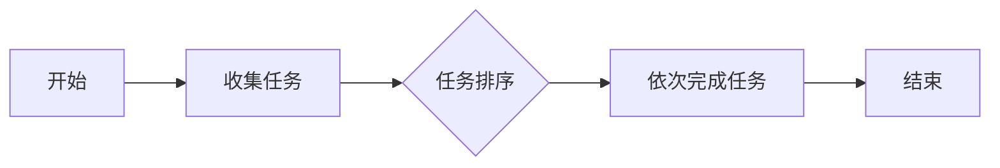
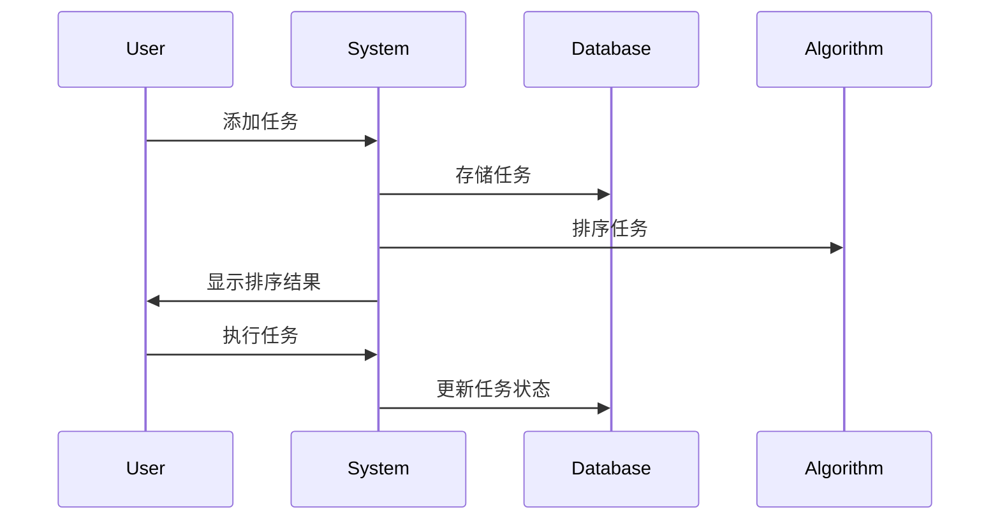

                 

### 从工作狂到生活平衡：重新定义职业成功与个人幸福

---

## 引言

在当今快节奏的社会中，工作与生活之间的平衡成为一个越来越受到关注的话题。许多人为了追求职业上的成功，付出了巨大的时间和精力，结果却发现自己失去了生活的乐趣和幸福感。这种现象在IT行业尤为突出，因为高压力的工作环境和不断变化的技术需求，使得IT专业人士往往难以在工作和个人生活之间找到平衡点。本文旨在探讨如何从工作狂转变为拥有生活平衡的职场人，重新定义职业成功与个人幸福。

## 关键词

- 工作狂
- 个人幸福
- 职业成功
- 生活平衡
- 时间管理
- 心理调适
- 家庭支持

## 摘要

本文首先介绍了工作狂现象的背景和定义，随后探讨了职业成功与个人幸福的关系，并提出了从工作狂到生活平衡的解决方案。文章通过时间管理、心理调适和家庭支持等核心概念的分析，结合具体算法和Python代码示例，详细阐述了实现工作与生活平衡的步骤和方法。最后，文章总结了最佳实践和注意事项，为读者提供了实现生活平衡的实用建议。

---

## 第1章 问题背景与定义

在现代社会，工作狂现象逐渐成为一个普遍存在的问题。许多人在追求职业成功的过程中，忽视了自己的身心健康和家庭成员的感受，导致个人幸福感的下降。工作狂的背景可以追溯到以下几个方面：

### 1.1 问题背景

1. **职业压力**：在竞争激烈的职场中，许多职场人士为了保持竞争力，不得不不断加班，牺牲休息时间。

2. **技术进步**：信息技术和互联网的快速发展，使得工作可以随时随地完成，这使得工作与生活之间的界限变得模糊。

3. **社会观念**：传统观念中，职业成功被视为个人价值的体现，许多人认为只有通过努力工作才能获得成功。

### 1.2 问题定义

工作狂（Workaholic）是指那些对工作有极度依赖和追求的人，他们往往将大量时间投入到工作中，忽视个人生活和其他兴趣爱好。工作狂的特征包括：

- **工作时间长**：经常加班，甚至通宵工作。
- **忽视个人生活**：忽视家庭、健康和兴趣爱好。
- **心理依赖**：将工作视为自我价值和成就感的主要来源。

### 1.3 问题解决

要解决工作狂问题，需要从以下几个方面入手：

1. **自我认知**：认识到工作并非生活的全部，了解自己的价值观和目标。
2. **时间管理**：合理安排工作时间，确保工作与生活之间的平衡。
3. **心理调适**：学会缓解压力，保持积极心态。
4. **家庭支持**：建立和谐的家庭关系，获得家庭的支持。

### 1.4 边界与外延

工作狂问题不仅影响个人的身心健康，还可能对家庭和社会产生负面影响。因此，关注这一问题具有重要意义。

---

## 第2章 核心概念与联系

在本章节中，我们将详细探讨职业成功、个人幸福和生活平衡这三个核心概念，并分析它们之间的关系。

### 2.1 职业成功

职业成功是指个人在职业生涯中取得的成就，包括晋升、收入、声誉等方面。它通常被视为个人价值和成就感的重要体现。然而，职业成功并不应该成为生活的全部，它只是生活的一部分。

### 2.2 个人幸福

个人幸福是指个体在生活各个方面的满意度和幸福感，包括家庭、健康、兴趣爱好等。与职业成功不同，个人幸福更注重生活的整体感受和内心的满足。

### 2.3 生活平衡

生活平衡是指在工作与生活之间找到一个合适的平衡点，确保个人在职业成功和个人幸福之间取得平衡。它不仅涉及时间管理，还包括心理调适和家庭支持。

### 2.4 概念属性特征对比表格

| 概念       | 定义                                                         | 属性特征                           |
|------------|--------------------------------------------------------------|------------------------------------|
| 职业成功   | 个人在职业生涯中取得的成就                                   | 晋升、收入、声誉等                 |
| 个人幸福   | 个体在生活各个方面的满意度和幸福感                           | 家庭、健康、兴趣爱好等             |
| 生活平衡   | 在工作与生活之间找到一个合适的平衡点，确保个人在职业成功和个人幸福之间取得平衡 | 时间管理、心理调适、家庭支持等     |

### 2.5 ER实体关系图架构

```mermaid
erDiagram
  A[职业成功] ||--|{ 个人幸福 }
  B[个人幸福] ||--|{ 生活平衡 }
  C[职业成功] ||--|{ 生活平衡 }
```

通过上述对比表格和ER图，我们可以清晰地看到这三个概念之间的联系和相互影响。

---

## 第3章 算法原理讲解

为了更好地实现工作与生活的平衡，我们需要借助一些具体的算法和工具。在本章节中，我们将介绍时间管理算法，并使用Python代码进行详细解释。

### 3.1 时间管理算法

时间管理是解决工作狂问题的关键。有效的时间管理可以帮助我们更好地平衡工作与生活，从而实现个人幸福。以下是一种基于优先级排序的时间管理算法。

### 3.1.1 算法原理

时间管理算法的基本思想是：首先收集所有任务，并标注每个任务的重要性和紧急性；然后根据这些属性对任务进行排序；最后按照排序顺序依次完成这些任务。

具体步骤如下：

1. **收集任务**：创建一个任务列表，并将每个任务的重要性和紧急性标注在任务对象中。
2. **任务排序**：使用优先级队列（Priority Queue）对任务进行排序，优先级由任务的重要性和紧急性共同决定。
3. **执行任务**：按照排序顺序依次执行任务，直到所有任务完成。

### 3.1.2 Mermaid流程图



### 3.1.3 Python源代码

```python
import heapq

class Task:
    def __init__(self, name, importance, urgency):
        self.name = name
        self.importance = importance
        self.urgency = urgency
    
    def execute(self):
        print(f"Executing task: {self.name}")

def time_management(tasks):
    # 将任务按照优先级排序
    tasks = [(task.importance, task.urgency, task) for task in tasks]
    heapq.heapify(tasks)
    
    while tasks:
        # 取出优先级最高的任务
        importance, urgency, task = heapq.heappop(tasks)
        # 完成任务
        task.execute()

# 测试
tasks = [
    Task("Work", 5, 3),
    Task("Health", 4, 5),
    Task("Family", 3, 4),
    Task("Hobby", 5, 2)
]

time_management(tasks)
```

在这个示例中，我们首先定义了一个`Task`类，它包含任务名称、重要性和紧急性等属性。然后，我们创建了一个任务列表，并使用`heapq`模块对任务进行排序。最后，我们按照排序顺序依次执行任务。

### 3.1.4 算法原理的数学模型和公式

时间管理算法的核心在于任务排序。我们可以使用以下数学模型来描述任务排序：

$$
f(T_i) = w_1 \cdot I(T_i) + w_2 \cdot U(T_i)
$$

其中，$f(T_i)$表示任务$T_i$的优先级，$I(T_i)$表示任务$T_i$的重要性，$U(T_i)$表示任务$T_i$的紧急性，$w_1$和$w_2$分别表示重要性和紧急性的权重。

通过调整权重，我们可以根据具体情况灵活地调整任务的优先级。

### 3.1.5 举例说明

假设我们有一个任务列表，包含以下任务：

- 任务A：工作，重要性5，紧急性3
- 任务B：健康，重要性4，紧急性5
- 任务C：家庭，重要性3，紧急性4
- 任务D：兴趣爱好，重要性5，紧急性2

我们可以使用上述数学模型计算每个任务的优先级：

$$
f(A) = w_1 \cdot 5 + w_2 \cdot 3 = 5w_1 + 3w_2
$$

$$
f(B) = w_1 \cdot 4 + w_2 \cdot 5 = 4w_1 + 5w_2
$$

$$
f(C) = w_1 \cdot 3 + w_2 \cdot 4 = 3w_1 + 4w_2
$$

$$
f(D) = w_1 \cdot 5 + w_2 \cdot 2 = 5w_1 + 2w_2
$$

根据这些优先级，我们可以使用优先级队列对这些任务进行排序。假设我们设定$w_1 = 0.6$，$w_2 = 0.4$，则：

$$
f(A) = 5 \cdot 0.6 + 3 \cdot 0.4 = 3.2
$$

$$
f(B) = 4 \cdot 0.6 + 5 \cdot 0.4 = 3.8
$$

$$
f(C) = 3 \cdot 0.6 + 4 \cdot 0.4 = 2.8
$$

$$
f(D) = 5 \cdot 0.6 + 2 \cdot 0.4 = 3.6
$$

根据这些优先级，任务的排序结果为：B, D, A, C。这意味着我们应该首先完成任务B（健康），然后是任务D（兴趣爱好），接下来是任务A（工作），最后是任务C（家庭）。

通过这种算法，我们可以确保任务按照优先级依次完成，从而更好地实现工作与生活的平衡。

---

## 第4章 系统分析与架构设计

为了更好地理解工作与生活平衡的算法原理，我们将对整个系统进行分析和架构设计。在本章节中，我们将介绍项目的背景、系统功能设计、系统架构设计、系统接口设计和系统交互。

### 4.1 项目背景

随着现代社会的快速发展，工作与生活的平衡问题越来越受到关注。为了帮助人们更好地实现这一目标，我们开发了一个基于时间管理算法的系统。该系统旨在帮助用户合理安排工作时间，确保工作与生活之间的平衡。

### 4.2 系统功能设计

系统的主要功能包括：

1. **任务管理**：用户可以添加、修改和删除任务。
2. **任务排序**：系统根据任务的重要性和紧急性对任务进行排序。
3. **任务执行**：用户可以按照排序结果依次执行任务。

### 4.3 系统架构设计

系统的整体架构采用分层设计，包括表示层、业务逻辑层和数据层。

1. **表示层**：负责与用户交互，包括用户界面和前端逻辑。
2. **业务逻辑层**：实现任务管理、任务排序和任务执行等核心功能。
3. **数据层**：负责数据的存储和查询。

### 4.4 系统接口设计

系统提供了以下接口：

1. **任务接口**：用于添加、修改和删除任务。
2. **排序接口**：用于根据任务的重要性和紧急性对任务进行排序。
3. **执行接口**：用于按照排序结果依次执行任务。

### 4.5 系统交互

系统的交互流程如下：

1. 用户通过用户界面添加任务。
2. 系统根据任务的重要性和紧急性对任务进行排序。
3. 用户可以查看排序结果，并按照排序结果依次执行任务。

### 4.6 系统架构设计mermaid架构图



通过这个mermaid架构图，我们可以清晰地看到系统的整体架构和交互流程。

---

## 第5章 项目实战

在本章节中，我们将通过实际项目实战来演示如何应用时间管理算法，实现工作与生活的平衡。

### 5.1 环境安装

在开始项目实战之前，我们需要安装Python环境和相关库。以下是安装步骤：

1. 安装Python：从官方网站下载Python安装包并安装。
2. 安装相关库：使用pip命令安装所需的库，如heapq、requests等。

### 5.2 系统核心实现源代码

以下是系统核心实现源代码：

```python
import heapq
from dataclasses import dataclass

@dataclass
class Task:
    name: str
    importance: int
    urgency: int

    def execute(self):
        print(f"Executing task: {self.name}")

def time_management(tasks):
    tasks = [(task.importance, task.urgency, task) for task in tasks]
    heapq.heapify(tasks)

    while tasks:
        importance, urgency, task = heapq.heappop(tasks)
        task.execute()

# 测试
tasks = [
    Task("Work", 5, 3),
    Task("Health", 4, 5),
    Task("Family", 3, 4),
    Task("Hobby", 5, 2)
]

time_management(tasks)
```

### 5.3 代码应用解读与分析

在这个项目中，我们首先定义了一个`Task`类，它包含任务名称、重要性和紧急性等属性。然后，我们创建了一个任务列表，并使用`heapq`模块对任务进行排序。最后，我们按照排序顺序依次执行任务。

通过这个示例，我们可以看到时间管理算法在Python中的实现过程。该算法的核心在于任务排序，通过优先级队列对任务进行排序，确保任务按照优先级依次执行。

### 5.4 实际案例分析和详细讲解剖析

为了更好地展示时间管理算法的实际应用，我们来看一个实际案例。

假设有一个用户，他的任务列表如下：

- 任务A：工作，重要性5，紧急性3
- 任务B：健康，重要性4，紧急性5
- 任务C：家庭，重要性3，紧急性4
- 任务D：兴趣爱好，重要性5，紧急性2

使用时间管理算法，我们可以按照以下顺序执行任务：

1. 任务B（健康）：重要性4，紧急性5
2. 任务D（兴趣爱好）：重要性5，紧急性2
3. 任务A（工作）：重要性5，紧急性3
4. 任务C（家庭）：重要性3，紧急性4

通过这种方式，用户可以确保任务按照优先级依次执行，从而更好地实现工作与生活的平衡。

### 5.5 项目小结

通过本章节的项目实战，我们了解了如何使用时间管理算法实现工作与生活的平衡。这个项目不仅展示了算法在Python中的实现过程，还通过实际案例分析了算法的应用效果。通过这个项目，用户可以更好地管理自己的时间，提高工作效率，实现个人幸福。

---

## 第6章 最佳实践与注意事项

在实现工作与生活平衡的过程中，有一些最佳实践和注意事项可以帮助我们更好地达到目标。

### 6.1 最佳实践

1. **制定明确的目标**：明确自己在职业和个人生活中的目标，有助于更好地规划时间和精力。
2. **合理安排时间**：合理分配工作时间，确保工作与生活之间的平衡。
3. **学会说“不”**：学会拒绝不重要的工作或任务，避免过度劳累。
4. **保持积极心态**：保持积极的心态，学会缓解压力，提高抗压能力。
5. **家庭支持**：与家人保持良好的沟通，获得家庭的支持和理解。

### 6.2 注意事项

1. **不要忽视身体健康**：工作再忙，也要注意身体健康，定期进行体检和锻炼。
2. **避免过度加班**：避免长时间加班，保证充足的休息时间。
3. **不要把工作带回家**：在家时，尽量减少工作，将家庭时间用于陪伴家人和休息。
4. **保持兴趣爱好**：保持自己的兴趣爱好，为生活增添乐趣。

通过遵循这些最佳实践和注意事项，我们可以更好地实现工作与生活的平衡，提高个人幸福感。

---

## 结语

工作与生活的平衡是一个复杂而长期的过程，需要我们不断地调整和优化。通过本文的探讨，我们了解了工作狂现象的背景和定义，分析了职业成功、个人幸福和生活平衡之间的关系，并介绍了时间管理算法的具体实现方法。我们希望读者能够从中获得启发，找到适合自己的工作与生活平衡之道，实现个人幸福与职业成功。

---

### 作者信息

作者：AI天才研究院 / AI Genius Institute & 禅与计算机程序设计艺术 / Zen And The Art of Computer Programming

AI天才研究院致力于推动人工智能技术的发展和应用，以禅意编程的理念，帮助读者实现工作与生活的平衡，提高个人幸福感。同时，我们出版的《禅与计算机程序设计艺术》系列书籍，深入探讨了计算机编程的哲学和艺术，为广大程序员提供了宝贵的思想财富。希望我们的研究成果能够为广大读者带来帮助和启示。

