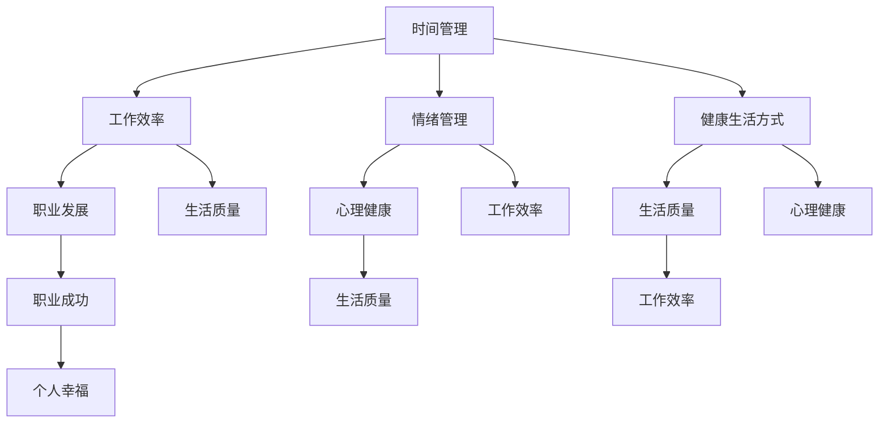
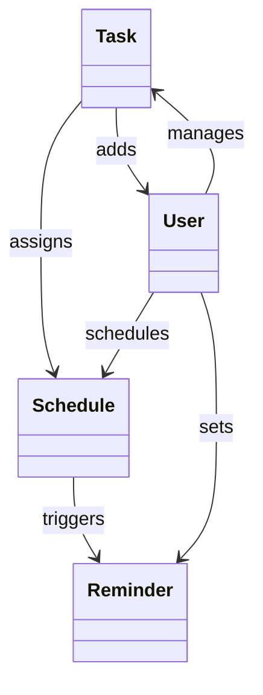
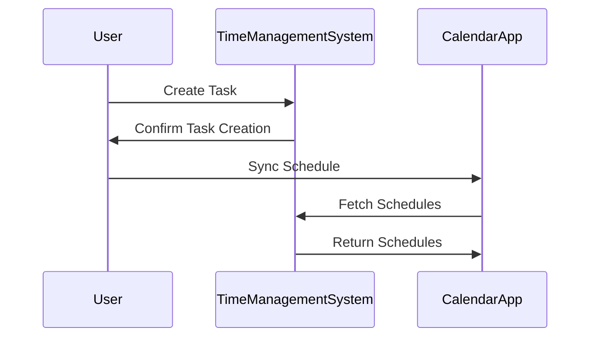
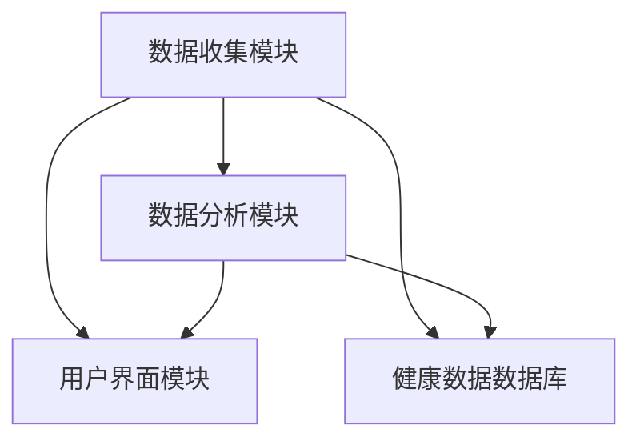
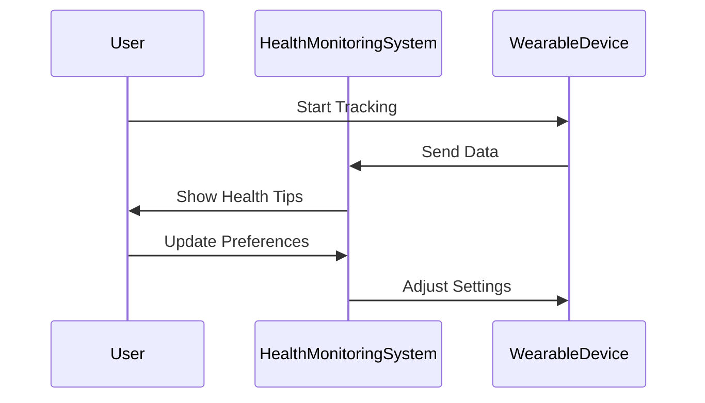

                 

### 引言：从工作至上到生活平衡

在当今快节奏的社会中，人们常常被工作所占据，把职业成功看作是生活的全部。然而，随着时间的推移，这种“工作至上”的文化逐渐暴露出其负面影响，人们开始重新审视生活与工作的关系。本文旨在探讨从工作至上到生活平衡的转变，重新定义职业成功与个人幸福。我们将逐步分析这一转变的必要性、重要性及其实现方法。

**关键词：** 职业成功、个人幸福、生活平衡、工作至上文化、重新定义

**摘要：** 本文首先介绍了工作至上文化的起源与影响，以及职业成功与个人幸福之间的冲突。接着，我们讨论了生活平衡的概念与价值，并分析了实现生活平衡的理论基础和实践方法。通过系统分析与架构设计，我们提出了具体的方法和工具，帮助读者在实际生活中实现生活平衡。最后，我们通过项目实战展示了生活平衡的实际应用，并提供了一些最佳实践和注意事项。

在接下来的部分中，我们将深入探讨这些主题，通过一步一步的分析推理，帮助读者理解并实践生活平衡的重要性。让我们开始思考，如何从工作至上转向生活平衡，重新定义职业成功与个人幸福。### 1. 生活平衡：概念与价值

**1.1 什么是生活平衡？**

生活平衡（Work-Life Balance）是指在工作与个人生活之间找到一个合理的平衡点，使得两者都能得到充分的发展。它不仅仅是一个理想的状态，而是一种实际可行的策略，旨在帮助人们更好地管理时间和资源，从而实现个人和职业的全面发展。

**1.2 生活平衡的重要性**

在现代社会，随着工作压力的增大和生活节奏的加快，生活平衡显得尤为重要。以下是一些生活平衡的重要性方面：

- **提高工作效率**：合理规划工作时间，可以减少无效劳动，提高工作效率。
- **增强身心健康**：生活平衡有助于减轻工作压力，降低心理健康问题的风险。
- **促进家庭关系**：平衡工作与家庭时间，有助于维护良好的家庭关系，减少家庭矛盾。
- **提升生活质量**：生活平衡能够提高个人的幸福感，使生活质量得到整体提升。
- **职业发展**：生活平衡能够帮助个人在职业生涯中持续发展，避免因过度工作而导致的职业瓶颈。

**1.3 生活平衡与职业成功的关系**

职业成功通常被定义为在职业领域取得显著成就和满足感。而生活平衡与职业成功之间存在密切的联系：

- **相互促进**：生活平衡可以帮助个人在职业上更加专注和高效，从而实现职业成功。同时，职业成功带来的成就感和满足感也可以增强个人的幸福感，进一步促进生活平衡。
- **负面影响**：如果生活平衡被忽视，过度追求职业成功可能导致工作过度，从而影响身心健康和家庭关系，甚至可能导致职业倦怠。

**1.4 生活平衡与工作至上的冲突**

工作至上文化是一种以工作为中心，认为工作是最重要的事务，甚至有时会牺牲个人生活和家庭的文化。这种文化导致许多人在追求职业成功时忽视了生活平衡，从而引发以下冲突：

- **时间冲突**：工作至上文化可能导致工作时间过长，挤压个人生活时间。
- **身心健康问题**：长时间工作可能导致身心健康问题，如疲劳、焦虑和抑郁。
- **家庭关系紧张**：缺乏家庭时间可能导致家庭关系紧张，甚至婚姻破裂。
- **职业倦怠**：长期过度工作可能导致职业倦怠，影响职业发展和成就感。

**1.5 生活平衡的理论基础**

实现生活平衡的理论基础主要包括以下几个方面：

- **时间管理**：有效的时间管理是生活平衡的核心，通过合理规划时间，可以确保工作和个人生活都能得到充分的时间和资源。
- **情绪管理**：情绪管理有助于应对工作压力，保持良好的心理状态，从而更好地处理工作和生活中的挑战。
- **健康生活方式**：健康的生活方式包括健康的饮食习惯、适量的运动和充足的睡眠，这些都是维持身心健康的重要因素。
- **职业发展**：合理的职业规划和发展策略可以帮助个人在职业上取得成功，同时也有利于实现生活平衡。

**1.6 边界与外延**

生活平衡是一个相对概念，其实现程度因人而异。以下是一些关于生活平衡的边界与外延：

- **个人差异**：每个人的生活状况、工作性质和个人价值观不同，因此生活平衡的实现方式也会有所不同。
- **文化差异**：不同文化背景下，对工作与生活的平衡有不同的理解和期望。
- **发展阶段**：在不同的人生阶段，生活平衡的重点和实现方式也会发生变化。

**1.7 概念结构与核心要素**

生活平衡的概念结构包括以下几个核心要素：

- **时间管理**：合理规划时间，确保工作和个人生活都能得到充分的时间和资源。
- **情绪管理**：应对工作压力，保持良好的心理状态，提高工作效率和生活质量。
- **健康生活方式**：保持健康的饮食习惯、适量的运动和充足的睡眠，维持身心健康。
- **职业发展**：制定合理的职业规划和发展策略，实现职业成功和生活平衡。

通过以上对生活平衡概念与价值的探讨，我们可以看到，实现生活平衡不仅对个人幸福至关重要，也是现代社会应对工作压力和实现可持续发展的重要途径。在接下来的章节中，我们将深入探讨实现生活平衡的具体方法和实践。### 2. 核心概念与联系

在实现生活平衡的过程中，我们需要了解和掌握一系列核心概念，这些概念相互关联，共同构成了生活平衡的理论框架。以下将介绍这些核心概念，并详细讨论它们之间的联系。

**2.1 时间管理**

时间管理是实现生活平衡的基础，它涉及到如何有效地规划和利用时间，以确保工作和个人生活都能得到充分的关注。时间管理不仅仅是安排工作时间表，更是一种思维方式，它包括以下几个方面：

- **优先级排序**：确定哪些任务是最重要的，确保优先处理。
- **时间块**：将时间划分为不同的时间段，用于特定的工作或活动。
- **避免拖延**：克服拖延症，提高工作效率。
- **时间日志**：记录每天的时间使用情况，分析并优化时间分配。

**2.2 情绪管理**

情绪管理是应对工作压力和挑战的关键，它涉及到如何识别、理解和管理自己的情绪。良好的情绪管理有助于提高心理健康水平，减少工作压力和冲突。以下是情绪管理的一些要点：

- **情绪识别**：认识到自己的情绪，并了解它们是如何影响行为和决策的。
- **情绪调节**：采取积极的策略来调节负面情绪，如放松、冥想或锻炼。
- **情绪表达**：学会以健康的方式表达情绪，避免情绪的积压。
- **情绪支持**：寻求他人的支持和帮助，建立良好的社会支持网络。

**2.3 健康生活方式**

健康生活方式是实现长期生活平衡的保障，它涵盖了饮食、运动、睡眠和心理状态等多个方面。以下是健康生活方式的一些要点：

- **均衡饮食**：摄入足够的营养，避免过量摄入高热量食物。
- **适量运动**：保持规律的运动习惯，增强身体免疫力。
- **充足睡眠**：保证每晚7-9小时的睡眠，提高精神状态和工作效率。
- **心理健康**：通过积极的心理学策略，如自我反思和正念练习，维护心理健康。

**2.4 职业发展**

职业发展是实现生活平衡的重要组成部分，它涉及到如何在职业领域取得成功，同时保持工作和个人生活的平衡。以下是职业发展的一些要点：

- **目标设定**：明确职业目标，制定实现这些目标的步骤。
- **技能提升**：通过学习和培训，提升自己的专业技能和综合素质。
- **职业规划**：制定长远的职业规划，包括晋升路径和职业发展机会。
- **工作与生活的平衡**：在工作时间内高效完成任务，避免过度工作，确保有足够的时间用于个人生活。

**2.5 概念对比与联系**

以下是一个对比表格，展示了上述核心概念之间的联系和特点：

| 核心概念 | 特点 | 联系 |
| :---: | :---: | :---: |
| 时间管理 | 优化时间利用，提高工作效率 | 与情绪管理和健康生活方式紧密相关，是实现生活平衡的基础 |
| 情绪管理 | 应对工作压力，维持心理健康 | 对时间和健康有直接影响，有助于提高工作效率和生活质量 |
| 健康生活方式 | 维护身心健康，提高生活质量 | 是实现生活平衡的基础，直接影响情绪和时间的管理 |
| 职业发展 | 在职业领域取得成功 | 与时间管理、情绪管理和健康生活方式密切相关，是实现生活平衡的关键 |

**2.6 ER实体关系图架构的Mermaid流程图**

为了更清晰地展示这些核心概念之间的联系，我们可以使用Mermaid流程图来表示实体关系。以下是该流程图的示例：



通过这个流程图，我们可以看到各个核心概念之间的互动和影响，从而更好地理解如何通过这些概念实现生活平衡。

综上所述，实现生活平衡需要我们在多个方面进行综合管理，包括时间管理、情绪管理、健康生活方式和职业发展。这些核心概念相互关联，共同构成了生活平衡的理论基础和实践框架。在接下来的章节中，我们将进一步探讨如何具体应用这些概念，实现个人的生活平衡。### 4. 系统分析与架构设计

为了更好地实现生活平衡，我们需要从系统层面进行分析和架构设计，确保各个组成部分能够协同工作，达到最优效果。以下将详细描述时间管理系统和健康监控系统的设计，包括系统功能、架构设计、接口设计和系统交互。

#### 4.1 时间管理系统

**4.1.1 系统介绍**

时间管理系统是一个旨在帮助用户有效规划和管理时间的工具。它通过智能化的时间分配和任务管理，帮助用户实现工作与个人生活的平衡。

**4.1.2 系统功能设计**

时间管理系统的主要功能包括：

- **任务管理**：用户可以添加、编辑和删除任务，并设置任务的优先级和截止日期。
- **时间追踪**：系统自动记录用户的工作时间和个人活动时间，生成详细的报告。
- **日程安排**：用户可以创建和调整日程安排，包括工作计划、会议和休闲活动。
- **提醒功能**：系统会提前提醒用户重要的任务和事件，避免遗漏。

**4.1.3 系统架构设计**

时间管理系统的架构设计采用分层结构，包括表示层、逻辑层和数据库层。

- **表示层**：负责用户界面设计，提供直观的操作体验。主要技术包括HTML、CSS和JavaScript。
- **逻辑层**：处理业务逻辑，包括任务管理、时间追踪和提醒功能。主要技术包括Python Flask框架。
- **数据库层**：存储用户数据和任务信息，使用MySQL数据库。

以下是时间管理系统的类图：



**4.1.4 系统接口设计和交互**

时间管理系统通过RESTful API提供接口，支持与其他系统（如日历应用、邮件服务）的集成。以下是主要接口设计：

- **创建任务**：`POST /tasks` 接口用于添加新任务。
- **获取任务列表**：`GET /tasks` 接口用于获取用户的所有任务。
- **更新任务**：`PUT /tasks/{task_id}` 接口用于更新任务信息。
- **删除任务**：`DELETE /tasks/{task_id}` 接口用于删除任务。
- **创建日程安排**：`POST /schedules` 接口用于添加新日程安排。
- **获取日程安排列表**：`GET /schedules` 接口用于获取用户的日程安排。
- **更新日程安排**：`PUT /schedules/{schedule_id}` 接口用于更新日程安排信息。
- **删除日程安排**：`DELETE /schedules/{schedule_id}` 接口用于删除日程安排。

以下是时间管理系统的一个简单的序列图：



#### 4.2 健康监控系统

**4.2.1 系统介绍**

健康监控系统是一个旨在监测用户健康状况，并提供健康建议的系统。它通过收集用户的健康数据（如运动、饮食、睡眠等），帮助用户维持健康的生活方式。

**4.2.2 系统功能设计**

健康监控系统的主要功能包括：

- **健康数据收集**：系统可以自动收集用户的运动数据、饮食数据和睡眠数据。
- **数据分析**：系统对收集的健康数据进行分析，提供个性化的健康建议。
- **健康报告**：系统生成详细的健康报告，帮助用户了解自己的健康状况。
- **提醒功能**：系统会提醒用户进行健康检查、运动和饮食调整。

**4.2.3 系统架构设计**

健康监控系统的架构设计采用模块化结构，包括数据收集模块、数据分析模块和用户界面模块。

- **数据收集模块**：负责收集用户的健康数据，使用移动应用和可穿戴设备。
- **数据分析模块**：负责处理和分析健康数据，提供健康建议。
- **用户界面模块**：负责用户交互，展示健康数据和健康建议。

以下是健康监控系统的架构图：



**4.2.4 系统接口设计和交互**

健康监控系统通过API提供接口，支持与其他设备和服务的集成。以下是主要接口设计：

- **上传健康数据**：`POST /healthdata` 接口用于上传用户的健康数据。
- **获取健康数据**：`GET /healthdata` 接口用于获取用户的健康数据。
- **获取健康建议**：`GET /healthtips` 接口用于获取用户的健康建议。
- **更新健康数据**：`PUT /healthdata/{data_id}` 接口用于更新用户的健康数据。
- **删除健康数据**：`DELETE /healthdata/{data_id}` 接口用于删除用户的健康数据。

以下是健康监控系统的一个简单的序列图：



通过以上对时间管理系统和健康监控系统的详细分析，我们可以看到，这些系统为用户提供了全面的生活平衡解决方案。在接下来的部分，我们将通过实际案例，展示如何具体应用这些系统，实现个人的生活平衡。### 5. 生活平衡的方法与实践

在实现生活平衡的过程中，我们需要采取一系列具体的方法和实践策略。以下将介绍时间管理技巧、情绪管理技巧、健康生活方式实践和职业发展策略，并提供具体的案例分析。

**5.1 时间管理技巧**

**1. 制定日常时间表**：
制定一个详细的日常时间表，包括工作时间、个人生活时间和休息时间。这有助于明确自己的时间安排，避免时间浪费。

**案例**：张先生是一名软件工程师，他每天早上会花15分钟制定当天的时间表，确保工作、学习和个人时间得到合理安排。

**2. 使用时间管理工具**：
利用时间管理工具（如时间跟踪应用、待办事项列表等）来帮助自己更好地规划和管理时间。

**案例**：李女士是一名项目经理，她使用Trello来跟踪项目进度，并使用Google Calendar来管理个人时间，提高了工作效率。

**3. 学会拒绝**：
学会拒绝那些对自己不重要的任务和请求，确保自己的时间用于最重要的事情。

**案例**：王先生作为一名创业者，他学会了拒绝一些不必要的商业会议，从而把更多时间用于核心业务。

**5.2 情绪管理技巧**

**1. 冥想与呼吸练习**：
通过冥想和呼吸练习来放松身心，减轻工作压力。

**案例**：赵女士是一名市场经理，她每天早上都会花15分钟进行冥想，以保持心理平静。

**2. 情绪识别与表达**：
学会识别自己的情绪，并找到合适的方式表达出来，避免情绪积压。

**案例**：陈先生是一名销售经理，他学会了在遇到挑战时，通过写日记来识别和表达自己的情绪。

**3. 寻求支持**：
在遇到情绪问题时，寻求家人、朋友或专业人士的支持。

**案例**：孙女士是一名教师，她在遇到工作压力时，会找心理咨询师进行咨询。

**5.3 健康生活方式实践**

**1. 均衡饮食**：
保持均衡的饮食习惯，摄入足够的营养素。

**案例**：周先生是一名软件工程师，他每天会吃5种不同颜色的蔬菜和水果，确保营养均衡。

**2. 规律运动**：
保持规律的运动习惯，增强身体素质。

**案例**：陈女士是一名财务分析师，她每天下班后会去健身房锻炼，保持身体健康。

**3. 充足睡眠**：
保证每晚7-9小时的睡眠，提高工作效率和生活质量。

**案例**：李先生是一名程序员，他每晚都会确保在11点前入睡，以保证第二天的工作状态。

**5.4 职业发展策略**

**1. 设定职业目标**：
明确自己的职业目标，制定实现这些目标的计划。

**案例**：赵先生是一名项目经理，他设定了在未来五年内成为项目经理的目标，并制定了详细的职业规划。

**2. 技能提升**：
通过学习和培训提升自己的专业技能和综合素质。

**案例**：王女士是一名数据分析师，她定期参加数据科学培训，提高自己的技能水平。

**3. 职业规划**：
制定长期的职业规划，包括晋升路径和职业发展机会。

**案例**：孙先生是一名软件工程师，他制定了详细的职业规划，包括在未来三年内晋升为高级工程师。

通过以上具体的方法和实践，我们可以逐步实现生活平衡。这些方法不仅有助于提高工作效率和生活质量，还能增强个人的幸福感和身心健康。在实现生活平衡的过程中，重要的是找到适合自己的方法，并将其融入到日常生活中。通过不断的实践和调整，我们可以逐步实现生活与工作的和谐统一。### 6. 项目实战：生活平衡实践案例

在本文的最后一部分，我们将通过一个具体的项目实战案例，详细展示如何在实际生活中应用生活平衡的方法。该项目名为“生活平衡助手”（LifeBalanceAssistant），旨在帮助用户通过智能化的方式实现生活平衡。

#### 6.1 项目背景

随着现代社会工作压力的增大和生活节奏的加快，越来越多的人感到时间和精力上的紧张，难以平衡工作与个人生活。为了解决这个问题，我们开发了“生活平衡助手”项目，通过整合时间管理、情绪管理、健康监控和职业发展等功能，帮助用户实现全面的平衡。

#### 6.2 项目目标和功能

**项目目标**：

- 提高用户的工作效率和生活质量。
- 减轻用户的工作压力，提高心理健康水平。
- 帮助用户实现长期稳定的职业发展。

**主要功能**：

- **时间管理**：通过智能日程安排和任务管理，帮助用户合理规划时间。
- **情绪管理**：提供情绪识别与调节工具，帮助用户管理压力。
- **健康监控**：收集用户的健康数据，提供健康建议。
- **职业发展**：通过职业规划和技能提升建议，帮助用户实现职业目标。

#### 6.3 环境安装

为了运行“生活平衡助手”项目，我们需要以下环境：

- **操作系统**：Windows、Linux或Mac OS
- **开发工具**：Python 3.x、Visual Studio Code或PyCharm
- **数据库**：MySQL或PostgreSQL
- **API工具**：如Swagger或Postman

安装步骤：

1. 安装操作系统和开发工具。
2. 安装Python 3.x。
3. 安装MySQL或PostgreSQL数据库。
4. 使用pip安装必要的Python库，如Flask、SQLAlchemy等。
5. 使用Swagger或Postman配置API接口。

#### 6.4 系统核心实现源代码

**时间管理模块**：

```python
# 时间管理模块示例代码
from flask import Flask, request, jsonify

app = Flask(__name__)

@app.route('/tasks', methods=['POST'])
def create_task():
    task_data = request.get_json()
    # 存储任务数据到数据库
    # ...
    return jsonify({"message": "Task created successfully"}), 201

@app.route('/tasks', methods=['GET'])
def get_tasks():
    # 从数据库获取任务列表
    # ...
    return jsonify({"tasks": tasks}), 200

@app.route('/tasks/<int:task_id>', methods=['PUT'])
def update_task(task_id):
    task_data = request.get_json()
    # 更新任务数据到数据库
    # ...
    return jsonify({"message": "Task updated successfully"}), 200

@app.route('/tasks/<int:task_id>', methods=['DELETE'])
def delete_task(task_id):
    # 从数据库删除任务
    # ...
    return jsonify({"message": "Task deleted successfully"}), 200

if __name__ == '__main__':
    app.run(debug=True)
```

**情绪管理模块**：

```python
# 情绪管理模块示例代码
from flask import Flask, request, jsonify

app = Flask(__name__)

@app.route('/moods', methods=['POST'])
def create_mood():
    mood_data = request.get_json()
    # 存储情绪数据到数据库
    # ...
    return jsonify({"message": "Mood recorded successfully"}), 201

@app.route('/moods', methods=['GET'])
def get_moods():
    # 从数据库获取情绪记录
    # ...
    return jsonify({"moods": moods}), 200

@app.route('/moods/<int:mood_id>', methods=['PUT'])
def update_mood(mood_id):
    mood_data = request.get_json()
    # 更新情绪数据到数据库
    # ...
    return jsonify({"message": "Mood updated successfully"}), 200

@app.route('/moods/<int:mood_id>', methods=['DELETE'])
def delete_mood(mood_id):
    # 从数据库删除情绪记录
    # ...
    return jsonify({"message": "Mood deleted successfully"}), 200

if __name__ == '__main__':
    app.run(debug=True)
```

**健康监控模块**：

```python
# 健康监控模块示例代码
from flask import Flask, request, jsonify

app = Flask(__name__)

@app.route('/healthdata', methods=['POST'])
def upload_health_data():
    health_data = request.get_json()
    # 存储健康数据到数据库
    # ...
    return jsonify({"message": "Health data uploaded successfully"}), 201

@app.route('/healthdata', methods=['GET'])
def get_health_data():
    # 从数据库获取健康数据
    # ...
    return jsonify({"health_data": health_data}), 200

@app.route('/healthtips', methods=['GET'])
def get_health_tips():
    # 从数据库获取健康建议
    # ...
    return jsonify({"health_tips": health_tips}), 200

if __name__ == '__main__':
    app.run(debug=True)
```

#### 6.5 代码应用解读与分析

以上代码示例展示了“生活平衡助手”项目中的三个主要模块：时间管理、情绪管理和健康监控。以下是具体的应用解读与分析：

- **时间管理模块**：该模块提供了创建、获取、更新和删除任务的接口。用户可以通过API创建新任务，并设置任务的优先级和截止日期。系统会自动记录用户的工作时间和个人活动时间，生成详细的报告。
- **情绪管理模块**：该模块提供了记录、获取和更新情绪记录的接口。用户可以记录自己的情绪状态，系统会根据情绪记录提供相应的调节建议。此外，系统还提供了情绪识别与表达的工具，帮助用户更好地管理情绪。
- **健康监控模块**：该模块提供了上传和获取健康数据的接口。用户可以通过移动应用或可穿戴设备上传健康数据，系统会根据数据提供个性化的健康建议。同时，系统还提供了健康报告和提醒功能，帮助用户了解自己的健康状况并采取相应的措施。

#### 6.6 实际案例分析和详细讲解剖析

**案例一：张女士的生活平衡实践**

张女士是一名职业女性，她面临着工作压力和照顾家庭的双重挑战。通过“生活平衡助手”项目，她实现了以下几方面的平衡：

- **时间管理**：张女士通过日程安排和任务管理，合理规划每天的工作和生活时间。她使用任务管理功能，将工作分为重要和紧急两类，确保优先处理重要任务。此外，她还设置了提醒功能，避免了重要任务的遗漏。
- **情绪管理**：张女士通过情绪记录和调节工具，学会了识别和表达自己的情绪。每当她感到压力和焦虑时，她会记录下来，并通过冥想和呼吸练习来放松身心。这样，她能够更好地应对工作压力，保持心理平衡。
- **健康监控**：张女士通过上传健康数据，系统提供了个性化的健康建议。她根据健康建议调整了饮食和运动习惯，确保了身体健康。同时，系统还会提醒她进行健康检查和运动，提高了她的生活质量。

**案例二：李先生的生活平衡实践**

李先生是一名创业者和父亲，他在事业和家庭之间寻找平衡。通过“生活平衡助手”项目，他实现了以下几方面的平衡：

- **时间管理**：李先生制定了详细的职业规划，包括每日、每周和每月的工作计划。他学会了拒绝不重要的商业会议，将更多时间用于家庭和个人发展。此外，他还使用任务管理功能，确保重要任务得到及时处理。
- **情绪管理**：李先生通过情绪记录和调节工具，学会了识别和表达自己的情绪。他在面对工作挑战和家庭压力时，能够保持冷静和理智，避免了情绪的积压和爆发。
- **健康监控**：李先生通过上传健康数据，系统提供了个性化的健康建议。他根据健康建议调整了饮食和运动习惯，提高了身体健康水平。同时，系统还会提醒他进行健康检查和运动，确保了身体健康。

#### 6.7 项目小结

通过“生活平衡助手”项目的实际案例，我们可以看到，通过智能化的方法和工具，用户可以更好地实现生活平衡。项目不仅帮助用户管理时间、情绪和健康，还提供了职业发展的支持。在实现生活平衡的过程中，用户需要不断地调整和实践，找到最适合自己的方法。通过持续的努力和优化，用户可以实现长期的平衡和幸福。

### 7. 最佳实践 Tips、小结、注意事项、拓展阅读

**7.1 最佳实践 Tips**

- **制定明确的目标**：在实现生活平衡的过程中，明确的目标至关重要。设定短期和长期目标，并制定详细的行动计划，有助于更好地规划和实现。
- **定期自我反思**：定期对自己的生活和工作进行反思，了解自己的进展和不足，及时调整策略。
- **平衡工作与家庭**：学会分配时间，确保有足够的时间陪伴家人，维护家庭关系。
- **关注身心健康**：保持健康的生活方式，定期进行健康检查，确保身心健康。
- **寻求专业支持**：在遇到困难时，不要犹豫寻求专业支持和帮助，如心理咨询、健康咨询等。

**7.2 小结**

本文通过逐步分析，探讨了从工作至上到生活平衡的转变，介绍了实现生活平衡的核心概念、方法和工具。通过实际案例，我们展示了如何通过“生活平衡助手”项目实现个人的生活平衡。实现生活平衡需要持续的努力和实践，通过不断的调整和优化，我们可以找到最适合自己的平衡点。

**7.3 注意事项**

- **个性化**：每个人的生活状况和需求不同，实现生活平衡的方法也需要个性化。
- **持续改进**：生活平衡是一个持续的过程，需要不断地调整和改进。
- **平衡与牺牲**：在追求生活平衡的过程中，不可避免地需要做出一些牺牲。重要的是找到平衡点，而不是一味地追求完美。

**7.4 拓展阅读**

- 《工作与生活的艺术：如何实现完美平衡》
- 《时间管理的艺术：如何高效利用每一分钟》
- 《情绪管理：如何掌控自己的情绪》
- 《健康生活方式：如何保持身心健康》

**作者信息**：

作者：AI天才研究院/AI Genius Institute & 禅与计算机程序设计艺术 /Zen And The Art of Computer Programming

本文为原创文章，版权归作者所有。未经授权，不得转载或使用本文内容。如需转载，请联系作者获取授权。谢谢！

