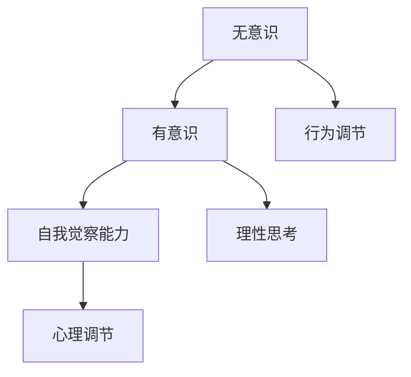

                 

# 从无意识到有意识：提升自我觉察能力

> 关键词：自我觉察能力、无意识、有意识、认知、心理调节

> 摘要：本文旨在探讨如何从无意识到有意识的转变，通过提升自我觉察能力来实现这一转变。文章首先介绍了无意识和有意识的概念，以及自我觉察能力的原理与类型。随后，探讨了提升自我觉察能力的方法与技巧，并通过心理学基础和实际案例进行分析和阐述。最后，文章总结了提升自我觉察能力的重要性和实际应用。

----------------------------------------------------------------

## 第一部分: 问题背景与核心概念

### 第1章: 从无意识到有意识的概述

#### 1.1.1 问题的提出

随着现代社会的快速发展和个体自我认知的需求增加，人们对于如何提升自我觉察能力，实现从无意识到有意识的转变越来越关注。

- **问题背景**：现代社会中，个体面临着信息过载、工作压力、人际关系等多重挑战。如何有效地管理这些挑战，提升自我觉察能力，实现从无意识到有意识的转变，成为个体发展和心理健康的重要课题。

- **问题描述**：无意识是我们日常行为和思维的底层运行模式，它往往是无意识、自动的。而有意识则是我们对自身内在活动和外部世界的主动认知，它需要我们付出一定的努力和专注。如何实现这一转变，使个体能够更好地理解自身行为和思维的根源，从而提高生活质量和心理健康，是现代社会亟待解决的问题。

- **问题解决**：通过提升自我觉察能力，个体可以更好地理解自己，意识到自己的情绪、思维和行为，从而实现从无意识到有意识的转变。自我觉察能力的提升有助于个体更好地应对挑战，提高心理健康和生活质量。

- **边界与外延**：自我觉察能力不仅涉及个体心理健康，还与人际关系、社会行为、学习效率等多个方面密切相关。提升自我觉察能力，有助于个体在社会各个领域取得更好的表现和成就。

#### 1.1.2 核心概念的定义与联系

在探讨自我觉察能力的提升之前，我们需要明确几个核心概念：无意识、有意识和自我觉察能力。

##### 1.1.2.1 无意识

无意识是指个体在日常生活中，没有意识到自己的行为和思维过程。它是我们内心深处的一种运行模式，往往在潜意识中发挥作用。

- **定义**：无意识是个体在未意识到的情况下，自动、自发地进行的心理活动。
- **特征**：无意识的行为和思维具有自动性、潜意识和不可控性。

##### 1.1.2.2 有意识

有意识则是指个体在主动、自觉地关注和思考自身内在活动和外部世界。

- **定义**：有意识是指个体在明确意识到自身行为和思维的情况下，进行心理活动的能力。
- **特征**：有意识的行为和思维具有目的性、选择性和可控性。

##### 1.1.2.3 自我觉察能力

自我觉察能力是指个体对自己内在感受、思想和行为的认知能力。

- **定义**：自我觉察能力是指个体对自己情绪、思维和行为过程的觉察和认知能力。
- **特征**：自我觉察能力包括情感觉察能力、思维觉察能力和行为觉察能力。

##### 1.1.2.4 概念属性特征对比表格

| 特征               | 无意识               | 有意识               | 自我觉察能力           |
|--------------------|----------------------|----------------------|------------------------|
| 定义               | 自动、自发、潜意识   | 明确、主动、意识     | 觉察、认知、自我理解   |
| 作用               | 自动调节行为         | 意识到行为并做出决策 | 理解自身、提高自我认知 |
| 对个体的影响       | 潜在行为模式         | 理性思考和决策       | 心理健康、人际交往     |

##### 1.1.2.5 ER实体关系图架构

#### 1.2 有意识的定义与特点

有意识是指个体对于自身内在活动和外部世界的主动认知和关注。它是人类心智的高级表现形式，与无意识相对。

##### 1.2.1 有意识的定义

有意识是指个体在明确意识到自身行为和思维的情况下，进行心理活动的能力。它是人类心智的高级表现形式，与无意识相对。

##### 1.2.2 有意识的特点

- **目的性**：有意识行为通常具有明确的目标和意图。
- **选择性**：个体能够在众多刺激中选择性地关注某些信息。
- **可塑性**：有意识可以通过训练和练习得到提升。
- **灵活性**：有意识思维可以适应不同环境和情境。

#### 1.3 自我觉察能力的原理与类型

自我觉察能力是指个体对自己内在感受、思想和行为的认知能力。它是实现从无意识到有意识转变的关键。

##### 1.3.1 自我觉察能力的原理

自我觉察能力是指个体对自己情绪、思维和行为过程的觉察和认知能力。它是通过提升注意力、认知能力和情感智力来实现的。

##### 1.3.2 自我觉察能力的类型

- **情感觉察能力**：识别和体验自己的情绪。
- **思维觉察能力**：意识到自己的思维过程和内容。
- **行为觉察能力**：察觉自己的行为模式和行为后果。

#### 1.4 自我觉察能力提升的方法与技巧

提升自我觉察能力有助于个体更好地理解自己，改善心理健康，增强人际关系。

##### 1.4.1 提升自我觉察能力的重要性

提升自我觉察能力的重要性体现在以下几个方面：

- **心理健康**：自我觉察能力的提升有助于个体更好地应对压力，缓解焦虑和抑郁等心理问题。
- **人际关系**：自我觉察能力的提升有助于个体更好地理解他人，建立良好的人际关系。
- **学习能力**：自我觉察能力的提升有助于个体更好地理解自己的学习过程，提高学习效率。

##### 1.4.2 提升自我觉察能力的方法与技巧

- **正念练习**：通过专注于当下的体验，提高对内在感受的觉知。
- **冥想**：通过冥想练习，增强对情绪和思维的觉察能力。
- **日记写作**：通过记录自己的想法和感受，加深对自身的认知。

#### 1.5 本章小结

本章介绍了从无意识到有意识的转变问题，定义了核心概念，并探讨了自我觉察能力的原理、类型和提升方法。接下来章节将深入探讨具体实践和案例分析。

----------------------------------------------------------------

## 第二部分: 有意识的提升与实践

### 第2章: 有意识的心理学基础

#### 2.1 有意识的心理过程

有意识的心理过程包括注意力、认知、情绪和记忆等方面。它们共同构成了个体对自身内在活动和外部世界的认知和理解。

##### 2.1.1 注意力与认知

注意力是指个体在选择和关注特定信息时所投入的心理资源。它对于有意识的心理过程至关重要。

- **注意力的定义**：注意力是指个体在特定时刻对某一特定信息进行选择、加工和处理的认知过程。

- **注意力的作用**：注意力在认知过程中起到了筛选、过滤和聚焦信息的作用。它帮助个体从复杂的信息环境中提取关键信息，并对其进行处理和思考。

- **注意力的类型**：根据注意力的焦点和范围，可以分为选择性注意、持续性注意、分配性注意和交替性注意等类型。

  - **选择性注意**：个体在众多刺激中选择性地关注某些信息，而忽略其他信息。
  - **持续性注意**：个体在一段时间内保持对特定信息的关注，不被其他刺激干扰。
  - **分配性注意**：个体同时关注多个不同的任务或刺激。
  - **交替性注意**：个体在多个任务或刺激之间切换注意力。

##### 2.1.2 情绪与认知

情绪是影响个体认知过程的重要因素。情绪状态可以影响个体的注意力、记忆、思维和决策。

- **情绪的定义**：情绪是指个体在特定情境下产生的主观体验和生理反应。它包括愉悦、愤怒、悲伤、焦虑等不同类型的情绪。

- **情绪的作用**：情绪可以影响个体的认知过程，包括注意、记忆、思维和决策。积极的情绪可以提高个体的认知功能，而消极的情绪则可能导致认知功能的下降。

- **情绪的类型**：情绪可以分为基本情绪和复合情绪。基本情绪包括愉悦、愤怒、悲伤、惊讶、恐惧和厌恶等。复合情绪是由基本情绪混合而成的，如焦虑、愤怒和厌恶等。

- **情绪调节**：情绪调节是指个体通过认知、行为和生理等方式来调节自己的情绪状态。有效的情绪调节可以帮助个体更好地应对压力和挑战，提高心理健康。

##### 2.1.3 记忆与认知

记忆是指个体将信息存储在脑中，并在需要时能够回忆和提取的过程。它是认知过程的重要组成部分。

- **记忆的定义**：记忆是指个体在经历特定事件或学习新知识后，将信息存储在脑中，并在需要时能够回忆和提取的心理过程。

- **记忆的作用**：记忆在个体的认知过程中起到了关键作用。它帮助个体记住重要信息，形成知识和经验，并支持个体的学习和行为。

- **记忆的类型**：记忆可以分为短期记忆、长期记忆和工作记忆。

  - **短期记忆**：短期记忆是指个体在短时间内保持和回忆信息的能力。它通常只能保持几秒钟到几分钟。
  - **长期记忆**：长期记忆是指个体在长时间内保持和回忆信息的能力。它可以是永久性的，也可以是暂时性的。
  - **工作记忆**：工作记忆是指个体在处理任务时，暂时存储和操作信息的能力。它是短期记忆和长期记忆之间的桥梁。

- **记忆的编码与提取**：记忆的编码是指个体将信息从感知阶段转换为可以存储的形式。提取是指个体在需要时将存储的信息回忆和回忆起来的过程。有效的记忆编码和提取策略可以提高个体的记忆能力。

##### 2.1.4 认知控制

认知控制是指个体在认知过程中对注意、记忆、思维和决策进行调节和调整的能力。它是实现有意识认知过程的关键。

- **认知控制的定义**：认知控制是指个体在认知过程中对注意、记忆、思维和决策进行调节和调整的能力。它涉及个体在处理信息时，根据任务需求和目标，对认知资源进行有效的管理和分配。

- **认知控制的作用**：认知控制可以帮助个体更好地适应复杂和多变的环境。它提高了个体的适应性和灵活性，使个体能够更有效地解决问题和应对挑战。

- **认知控制的类型**：认知控制可以分为元认知控制和认知操作控制。

  - **元认知控制**：元认知控制是指个体对自己的认知过程进行监控、评估和调整的能力。它涉及个体对自身认知活动的意识和自我调节。
  - **认知操作控制**：认知操作控制是指个体在具体认知任务中，对注意、记忆、思维和决策进行实际操作和调整的能力。

##### 2.1.5 认知负荷

认知负荷是指个体在认知过程中所承受的心理压力和认知需求。它对于个体的认知表现和心理健康具有重要影响。

- **认知负荷的定义**：认知负荷是指个体在认知过程中所承受的心理压力和认知需求。它是由于个体需要处理的信息量过大、任务复杂度增加或时间紧迫等原因导致的。

- **认知负荷的作用**：适度的认知负荷可以促进个体的认知发展和学习效果。然而，过度的认知负荷可能导致认知疲劳、注意力下降和心理健康问题。

- **认知负荷的管理**：个体可以通过以下策略来管理认知负荷：

  - **任务分解**：将复杂任务分解为更小的、可管理的部分，以减少认知负荷。
  - **优先级排序**：根据任务的重要性和紧急程度，对任务进行优先级排序，以合理分配认知资源。
  - **休息与放松**：定期休息和放松可以帮助个体恢复认知资源，减轻认知负荷。
  - **认知训练**：通过认知训练，提高个体的认知能力，增强对认知负荷的应对能力。

#### 2.2 有意识的心理技能

有意识的心理技能是指个体通过训练和实践，提高对自身内在活动和外部世界的认知和控制能力。这些技能有助于个体更好地实现有意识的认知过程。

##### 2.2.1 注意力训练

注意力训练是指通过特定的练习和方法，提高个体的注意力水平和工作效率。以下是一些常见的注意力训练方法：

- **注意力集中练习**：通过专注于特定对象或任务，提高个体的注意力集中能力。例如，使用专注力训练软件或进行冥想练习。
- **分散注意力的练习**：通过在多种任务之间切换注意力，提高个体的分散注意力能力。例如，进行多任务处理练习或交替进行不同类型的任务。
- **选择性注意练习**：通过在众多刺激中选择性地关注特定信息，提高个体的选择性注意力能力。例如，进行选择性注意力训练游戏或练习过滤噪声。

##### 2.2.2 认知控制训练

认知控制训练是指通过特定的练习和方法，提高个体在认知过程中的自我调节和控制能力。以下是一些常见的认知控制训练方法：

- **目标设定练习**：通过设定明确的目标和计划，提高个体的认知控制和目标导向行为。例如，制定每日目标清单或学习计划。
- **自我监控练习**：通过自我监控和反思，提高个体对自己的认知过程和行为的监控能力。例如，记录自己的学习过程或工作日志。
- **认知重构练习**：通过认知重构，改变个体对特定情境的认知和解释，提高个体的认知控制能力。例如，进行积极思维训练或情绪调节练习。

##### 2.2.3 情绪调节训练

情绪调节训练是指通过特定的练习和方法，提高个体对自身情绪的认知和调节能力。以下是一些常见的情绪调节训练方法：

- **正念练习**：通过专注于当下的体验，提高个体对情绪的觉察和接受能力。例如，进行正念冥想或正念呼吸练习。
- **认知行为疗法**：通过认知行为疗法，改变个体对情绪的认知和解释，提高情绪调节能力。例如，进行认知重构或行为实验。
- **情绪释放练习**：通过情绪释放练习，如哭泣、大笑、书写情绪等，释放个体积累的情绪能量，提高情绪调节能力。

##### 2.2.4 记忆训练

记忆训练是指通过特定的练习和方法，提高个体的记忆能力和记忆力。以下是一些常见的记忆训练方法：

- **重复记忆练习**：通过反复重复记忆信息，提高个体的记忆能力。例如，进行重复阅读或复习练习。
- **联想记忆练习**：通过建立信息之间的联系和联想，提高个体的记忆能力。例如，进行联想记忆游戏或创建记忆宫殿。
- **认知策略训练**：通过认知策略训练，如提取线索、记忆编码等，提高个体的记忆能力和记忆力。例如，进行记忆策略训练或练习使用记忆技巧。

#### 2.3 有意识的心理技能应用

有意识的心理技能不仅有助于个体的心理健康和认知能力提升，还可以应用于实际生活和工作中，提高生活质量和工作效能。

##### 2.3.1 学习与工作中的应用

- **时间管理**：通过有效的时间管理和任务规划，提高工作和学习效率。例如，使用番茄工作法或制定每日任务清单。
- **目标设定**：通过设定明确的学习和工作目标，提高个体对任务的关注度和执行力。例如，使用SMART原则设定目标或制定年度计划。
- **注意力集中**：通过注意力集中练习，提高个体在工作和学习中的专注度。例如，进行专注力训练或避免多任务处理。

##### 2.3.2 人际关系中的应用

- **情绪理解**：通过情绪调节训练，提高个体对他人情绪的敏感度和理解力。例如，进行情感角色扮演或学习情感表达技巧。
- **沟通技巧**：通过有效的沟通技巧训练，提高个体在人际交往中的表达和沟通能力。例如，进行沟通技巧培训或学习非暴力沟通方法。
- **冲突解决**：通过认知控制训练，提高个体在冲突解决中的冷静思考和决策能力。例如，进行冲突管理培训或学习冲突解决策略。

##### 2.3.3 心理健康中的应用

- **自我觉察**：通过自我觉察能力的提升，个体能够更好地理解自己的情绪、思维和行为，提高心理健康水平。例如，进行日记写作或自我反思练习。
- **情绪调节**：通过情绪调节训练，个体能够更好地应对压力和挑战，提高心理健康水平。例如，进行情绪释放练习或学习正念冥想。
- **心理弹性**：通过认知控制和情绪调节训练，个体能够提高心理弹性，更好地应对生活中的逆境和挫折。例如，进行心理弹性训练或学习积极心理学方法。

#### 2.4 本章小结

本章介绍了有意识的心理过程，包括注意力、认知、情绪和记忆等方面的基本概念和特点。同时，探讨了有意识的心理技能，如注意力训练、认知控制训练、情绪调节训练和记忆训练等。这些心理技能在学习和工作中具有广泛的应用，有助于提升个体的认知能力、工作效能和心理健康。在下一章中，我们将进一步探讨自我觉察能力的提升方法与实践。

----------------------------------------------------------------

## 第三部分: 自我觉察能力的提升方法与实践

### 第3章: 提升自我觉察能力的策略与技巧

#### 3.1 提升自我觉察能力的策略

提升自我觉察能力需要采取一系列的策略和技巧，这些策略和技巧可以帮助个体更好地认识自己，理解自己的情绪、思维和行为，从而实现从无意识到有意识的转变。

##### 3.1.1 自我反思

自我反思是指个体对自己的思想、情感和行为进行深入思考和分析的过程。它是提升自我觉察能力的重要方法之一。

- **自我反思的步骤**：

  1. **设定目标**：明确自我反思的目标和方向，例如，关注自己的情绪、思维或行为。
  2. **记录观察**：在日常生活中记录自己的情绪、思维和行为，包括触发情绪的事件、思考的过程和行为的结果。
  3. **分析原因**：分析情绪、思维和行为的背后原因，探究自己的动机、信念和价值观。
  4. **反思后果**：思考情绪、思维和行为对自身和他人产生的后果，包括积极的和消极的影响。
  5. **制定计划**：根据自我反思的结果，制定改进计划，例如，调整思维方式、改善行为习惯等。

- **自我反思的好处**：

  - **提高自我认知**：通过自我反思，个体可以更深入地了解自己的内心世界，认识到自己的优点和不足。
  - **促进个人成长**：自我反思可以帮助个体发现自己的潜力，制定个人成长目标，并努力实现这些目标。
  - **改善情绪调节**：自我反思可以帮助个体更好地理解和管理自己的情绪，提高情绪调节能力。

##### 3.1.2 观察他人

观察他人是一种有效的自我觉察能力提升方法，通过观察他人的行为、情绪和思维方式，个体可以反思自己的行为，从而提高自我觉察能力。

- **观察他人的步骤**：

  1. **选择观察对象**：选择一个合适的人作为观察对象，这个人可以是朋友、家人或陌生人。
  2. **记录观察结果**：观察他人的行为、情绪和思维方式，记录下观察到的细节，包括他们的言语、行为和表情。
  3. **分析观察结果**：分析观察结果，思考他人的行为、情绪和思维方式对自己有什么启示，以及如何借鉴和应用到自己的生活中。
  4. **反思自身**：根据观察结果，反思自己的行为、情绪和思维方式，找到改进的机会。

- **观察他人的好处**：

  - **增进同理心**：通过观察他人的行为和情绪，个体可以更好地理解他人的感受和需求，提高同理心。
  - **学习新技能**：通过观察他人的行为和思维方式，个体可以学习到新的技能和方法，从而提高自己的自我觉察能力。
  - **反思自身**：观察他人可以帮助个体发现自己的盲点和不足，从而反思自身，提高自我觉察能力。

##### 3.1.3 记录日志

记录日志是一种有效的自我觉察能力提升方法，通过记录自己的想法、情绪和行为，个体可以更好地了解自己，从而提高自我觉察能力。

- **记录日志的步骤**：

  1. **设定日志主题**：选择一个感兴趣的主题，例如，情绪、思维、行为、人际关系等。
  2. **记录日常经历**：在日常生活中，记录下与主题相关的事件、想法、情绪和行为。
  3. **分析日志内容**：分析日志内容，思考自己的情绪、思维和行为背后的原因，以及如何改进。
  4. **定期回顾**：定期回顾日志，总结自己的成长和进步，制定下一步的行动计划。

- **记录日志的好处**：

  - **提高自我认知**：通过记录日志，个体可以更好地了解自己的情绪、思维和行为，从而提高自我认知。
  - **促进个人成长**：记录日志可以帮助个体反思自己的行为和决策，发现问题和不足，从而促进个人成长。
  - **改善情绪调节**：通过记录日志，个体可以更好地管理自己的情绪，提高情绪调节能力。

##### 3.1.4 正念练习

正念练习是一种通过专注于当下体验来提升自我觉察能力的方法。它可以帮助个体培养专注力和自我觉察能力，从而更好地认识自己。

- **正念练习的步骤**：

  1. **选择练习时间**：选择一个安静的时间，确保没有干扰和打扰。
  2. **设定练习目标**：明确正念练习的目标，例如，关注呼吸、身体感受或情绪状态。
  3. **进行呼吸练习**：坐在舒适的姿势，深呼吸，专注于呼吸的感受，注意呼吸的进出，当注意力离开呼吸时，轻轻将注意力带回来。
  4. **关注身体感受**：在呼吸练习的基础上，关注身体的其他感受，如肌肉的紧张和放松，感受身体的重量和姿势。
  5. **观察情绪**：在练习过程中，观察自己的情绪状态，注意情绪的变化，不对情绪进行评价，只是观察和接纳。

- **正念练习的好处**：

  - **提高专注力**：通过正念练习，个体可以培养专注力，更好地集中注意力。
  - **改善情绪调节**：正念练习可以帮助个体更好地理解和管理自己的情绪，提高情绪调节能力。
  - **减少压力**：正念练习可以帮助个体放松身心，减少压力和焦虑。

##### 3.1.5 自我觉察能力提升的好处

提升自我觉察能力对个体有诸多好处：

- **提高心理健康**：自我觉察能力的提升有助于个体更好地理解和管理自己的情绪，减少焦虑和抑郁等心理问题。
- **改善人际关系**：通过自我觉察能力的提升，个体可以更好地理解他人，改善与他人的关系，建立更健康的人际关系。
- **提高工作效率**：自我觉察能力的提升有助于个体更好地管理时间和资源，提高工作效率和效能。
- **促进个人成长**：自我觉察能力的提升可以帮助个体更好地认识自己，发现自己的潜力和优势，促进个人成长。

#### 3.2 提升自我觉察能力的实践

提升自我觉察能力需要持之以恒的实践和努力。以下是一些实践方法和技巧：

- **设定明确的目标**：明确自我觉察能力提升的目标和计划，确保有清晰的方向和目标。
- **持续练习**：定期进行自我觉察能力的练习，如正念练习、记录日志、自我反思等。
- **寻求反馈**：向信任的朋友、家人或专业人士寻求反馈，了解自己在自我觉察能力提升方面的进展和不足。
- **学习相关知识**：学习相关的心理学知识，了解自我觉察能力的原理和方法，为提升自我觉察能力提供理论支持。
- **保持耐心和毅力**：提升自我觉察能力是一个长期的过程，需要耐心和毅力，不断努力和实践。

#### 3.3 本章小结

本章介绍了提升自我觉察能力的策略与技巧，包括自我反思、观察他人、记录日志、正念练习等。这些方法和技巧可以帮助个体更好地认识自己，提高自我觉察能力，从而实现从无意识到有意识的转变。在下一章中，我们将进一步探讨自我觉察能力在心理学中的应用和影响。

----------------------------------------------------------------

## 第四部分: 自我觉察能力的应用与影响

### 第4章: 自我觉察能力在心理学中的应用与影响

#### 4.1 自我觉察能力在心理健康领域的应用

自我觉察能力在心理健康领域具有广泛的应用，它对于个体的情绪调节、心理适应和心理健康水平有着重要的影响。

##### 4.1.1 情绪调节

情绪调节是指个体对自身情绪状态的识别、理解和管理过程。自我觉察能力在情绪调节中起着关键作用。

- **自我觉察能力与情绪调节的关系**：

  - **情绪识别**：自我觉察能力的提升有助于个体更好地识别和理解自己的情绪状态，包括情绪的类型、强度和持续时间。
  - **情绪表达**：自我觉察能力的提升有助于个体更好地表达自己的情绪，既不会过度压抑，也不会过度表达。
  - **情绪管理**：自我觉察能力的提升有助于个体更好地管理情绪，采取有效的方法来缓解情绪压力，如放松技巧、正念练习等。

- **应用案例**：在一个压力较大的工作环境中，一位职场人士通过提升自我觉察能力，学会了识别和管理自己的情绪。当面对工作挑战时，他能够及时意识到自己的情绪变化，并通过深呼吸和冥想来缓解紧张情绪，从而提高了工作效率和心理健康水平。

##### 4.1.2 心理适应

心理适应是指个体在面临压力和挑战时，能够有效地调整自己的心理状态和行为方式，以适应环境变化。

- **自我觉察能力与心理适应的关系**：

  - **自我认知**：自我觉察能力的提升有助于个体更好地了解自己的心理状态，包括自己的优点、缺点、需求和期望。
  - **自我调整**：自我觉察能力的提升有助于个体在面对压力和挑战时，能够更有效地调整自己的行为和心态，采取积极的应对策略。
  - **自我成长**：自我觉察能力的提升有助于个体在逆境中成长，通过反思和总结，从挑战中汲取经验和教训。

- **应用案例**：在一个高压的工作环境中，一位员工通过提升自我觉察能力，学会了更好地应对工作中的压力。当面临工作挑战时，他能够及时识别自己的情绪变化，并采取积极的调整策略，如寻求同事支持、调整工作节奏等，从而提高了心理适应能力，减少了工作压力。

##### 4.1.3 心理健康

心理健康是指个体在情感、行为和心理功能方面处于良好状态，能够有效应对日常生活中的压力和挑战。

- **自我觉察能力与心理健康的关系**：

  - **情绪健康**：自我觉察能力的提升有助于个体更好地管理自己的情绪，保持情绪稳定，减少情绪困扰。
  - **心理韧性**：自我觉察能力的提升有助于个体培养心理韧性，在面对逆境和挑战时，能够保持乐观和积极的心态。
  - **社会支持**：自我觉察能力的提升有助于个体更好地识别和利用社会支持资源，建立和维护良好的人际关系。

- **应用案例**：在一个家庭关系中，一位成员通过提升自我觉察能力，学会了更好地处理家庭矛盾和压力。当面对家庭冲突时，他能够及时识别自己的情绪反应，并通过沟通和理解来缓解紧张情绪，从而提高了家庭关系的质量，促进了家庭成员之间的心理健康。

#### 4.2 自我觉察能力在人际关系中的应用

自我觉察能力在人际关系中的应用有助于个体更好地理解他人，改善与他人的沟通和互动，从而建立和谐的人际关系。

##### 4.2.1 沟通与理解

沟通与理解是人际关系中至关重要的一环。自我觉察能力的提升有助于个体更好地理解他人，从而改善沟通效果。

- **自我觉察能力与沟通理解的关系**：

  - **情感识别**：自我觉察能力的提升有助于个体更好地识别他人的情感状态，从而在沟通中能够更加体贴和理解对方。
  - **思维理解**：自我觉察能力的提升有助于个体更好地理解他人的思维方式，从而在沟通中能够更加准确地把握对方的意图。
  - **行为理解**：自我觉察能力的提升有助于个体更好地理解他人的行为模式，从而在沟通中能够更加有效地应对对方的行为。

- **应用案例**：在一个团队合作项目中，一位成员通过提升自我觉察能力，学会了更好地理解团队成员的需求和期望。当团队成员出现冲突时，他能够及时识别对方的情绪和意图，并通过有效的沟通和调解，促进了团队的和谐与合作。

##### 4.2.2 建立信任

建立信任是人际关系中的关键。自我觉察能力的提升有助于个体更好地建立和维护信任关系。

- **自我觉察能力与建立信任的关系**：

  - **自我觉察**：自我觉察能力的提升有助于个体更好地了解自己的行为和动机，从而在交往中能够更加真诚和透明。
  - **诚实与坦率**：自我觉察能力的提升有助于个体在交往中更加诚实和坦率，从而赢得他人的信任。
  - **情绪调节**：自我觉察能力的提升有助于个体更好地管理自己的情绪，避免情绪波动对人际关系产生负面影响。

- **应用案例**：在一个商业合作关系中，两位合作伙伴通过提升自我觉察能力，建立了深厚的信任关系。他们在合作中能够及时识别和理解对方的情绪和需求，通过有效的沟通和协作，共同克服了合作中的挑战，取得了良好的合作成果。

##### 4.2.3 冲突解决

冲突解决是人际关系中不可避免的一部分。自我觉察能力的提升有助于个体更好地解决冲突，维护和谐的人际关系。

- **自我觉察能力与冲突解决的关系**：

  - **情绪管理**：自我觉察能力的提升有助于个体更好地管理自己的情绪，避免情绪波动对冲突解决产生负面影响。
  - **理性思考**：自我觉察能力的提升有助于个体在冲突中保持理性思考，避免冲动行为和无效沟通。
  - **有效沟通**：自我觉察能力的提升有助于个体在冲突中更好地表达自己的观点和需求，理解对方的立场和需求。

- **应用案例**：在一个团队合作项目中，两位团队成员发生了冲突。通过提升自我觉察能力，他们学会了在冲突中保持冷静和理性，通过有效的沟通和协商，找到了解决问题的方法，最终解决了冲突，恢复了团队的合作关系。

#### 4.3 自我觉察能力在工作环境中的应用

自我觉察能力在工作环境中的应用有助于提高个体的工作效率、工作满意度和职业发展。

##### 4.3.1 工作效率

自我觉察能力的提升有助于个体更好地管理时间和资源，提高工作效率。

- **自我觉察能力与工作效率的关系**：

  - **时间管理**：自我觉察能力的提升有助于个体更好地规划和管理时间，避免时间浪费和拖延。
  - **任务优先级**：自我觉察能力的提升有助于个体更好地识别和优先处理重要任务，提高工作效率。
  - **专注力**：自我觉察能力的提升有助于个体提高专注力，减少干扰和分心，提高工作效率。

- **应用案例**：在一个高压力的工作环境中，一位员工通过提升自我觉察能力，学会了更好地管理时间和资源。他能够合理安排工作任务，优先处理重要任务，并在工作中保持专注，从而提高了工作效率和绩效。

##### 4.3.2 工作满意度

自我觉察能力的提升有助于个体更好地理解自己的职业需求和价值观，从而提高工作满意度。

- **自我觉察能力与工作满意度的关系**：

  - **职业认知**：自我觉察能力的提升有助于个体更好地了解自己的职业兴趣和优势，从而选择适合自己的职业方向。
  - **工作意义**：自我觉察能力的提升有助于个体更好地理解工作的意义和价值，从而提高工作满意度和成就感。
  - **职业发展**：自我觉察能力的提升有助于个体更好地规划自己的职业发展路径，提升职业素养和技能。

- **应用案例**：在一个公司中，一位员工通过提升自我觉察能力，更好地理解了自己的职业兴趣和价值观。他发现自己对技术领域有浓厚的兴趣，并通过学习和提升技能，成功转型为技术专家，提高了工作满意度和职业成就感。

##### 4.3.3 职业发展

自我觉察能力的提升有助于个体在职业发展中更好地应对挑战和机遇。

- **自我觉察能力与职业发展的关系**：

  - **自我认知**：自我觉察能力的提升有助于个体更好地了解自己的优势和不足，从而在职业发展中找到适合自己的方向。
  - **学习与成长**：自我觉察能力的提升有助于个体更好地识别学习机会和成长空间，从而不断提升自己的能力和竞争力。
  - **决策与规划**：自我觉察能力的提升有助于个体在职业发展中做出明智的决策和规划，避免盲目跟风和冲动行为。

- **应用案例**：在一个竞争激烈的职场环境中，一位员工通过提升自我觉察能力，更好地了解了自己的优势和兴趣。他选择了适合自己的职业发展方向，并通过不断学习和提升技能，成功晋升为团队主管，实现了职业发展目标。

#### 4.4 本章小结

自我觉察能力在心理学中的应用和影响广泛而深远。它不仅在心理健康、人际关系和工作环境中发挥着重要作用，还对个体的情绪调节、心理适应、心理健康、工作效率、工作满意度和职业发展产生积极影响。提升自我觉察能力，有助于个体更好地认识自己，理解他人，改善人际关系，提高工作效率和职业发展。在下一章中，我们将进一步探讨自我觉察能力的实际案例和应用。

----------------------------------------------------------------

## 第五部分: 实际案例与应用

### 第5章: 从实践到理论：自我觉察能力的实际应用与案例解析

#### 5.1 案例背景

为了更好地理解自我觉察能力的提升过程和应用，我们选择了一个真实的案例进行详细解析。这个案例涉及一位职场人士如何在面对工作压力和个人挑战时，通过提升自我觉察能力来实现从无意识到有意识的转变。

#### 5.2 案例解析

**5.2.1 情境描述**

张先生是一位大型科技公司的高级项目经理。他在工作中承担着巨大的责任，经常面临项目延期、团队冲突和客户投诉等压力。随着时间的推移，张先生开始感到身心疲惫，工作效率下降，个人关系也变得紧张。

**5.2.2 自我觉察能力的提升**

为了应对这些挑战，张先生决定通过提升自我觉察能力来改善自己的状况。他采取了以下几种方法：

1. **正念冥想**：

   张先生每天早晨都会花20分钟时间进行正念冥想。他选择一个安静的环境，坐在舒适的姿势，专注于自己的呼吸，当思维跑偏时，他会轻轻地将注意力拉回到呼吸上。这种练习帮助他提高了专注力，减少了焦虑和压力。

2. **情绪记录**：

   张先生开始记录自己的情绪变化。他使用一个情绪日记，每天记录自己的情绪状态、触发情绪的事件以及自己的应对策略。通过这种方式，他能够更好地了解自己的情绪模式，并学会如何有效地管理自己的情绪。

3. **自我反思**：

   张先生定期进行自我反思，回顾自己的工作表现和人际关系。他分析自己的优点和不足，设定个人成长目标，并制定具体的行动计划。通过这种反思，他能够更清晰地认识自己，找到改进的机会。

4. **目标设定**：

   张先生制定了一系列短期和长期目标，包括提高项目管理的效率、提升团队协作能力和改善个人健康习惯。他将这些目标分解为具体的行动步骤，并设定了明确的期限，以便于跟踪进度和评估效果。

**5.2.3 案例结果**

通过持续的自我觉察能力提升，张先生取得了显著的成果：

1. **工作效率提升**：

   张先生能够更有效地管理时间和资源，提高了项目管理的效率。他学会了如何优先处理重要任务，避免了不必要的拖延和压力。

2. **情绪管理**：

   张先生对自己的情绪有了更好的控制，能够更加冷静地应对工作中的挑战。他的情绪日记帮助他更好地理解自己的情绪变化，并采取有效的应对策略。

3. **团队协作**：

   张先生在团队管理中更加注重沟通和协作，能够更好地理解团队成员的需求和期望。他的领导风格变得更加开放和包容，团队的士气和协作能力得到了提升。

4. **个人成长**：

   张先生通过自我反思和目标设定，不断提升自己的能力和素质。他开始关注自己的身心健康，通过锻炼和健康饮食来保持良好的身体状态。

**5.2.4 案例启示**

张先生的案例为我们提供了以下几个启示：

1. **自我觉察能力的重要性**：

   自我觉察能力是提升个人素质和应对挑战的关键。通过自我觉察能力的提升，个体可以更好地理解自己的情绪、思维和行为，从而实现更有效的自我管理和个人成长。

2. **实践与坚持**：

   提升自我觉察能力需要实践和坚持。正念冥想、情绪记录、自我反思和目标设定等方法虽然简单，但需要持续的努力和耐心。只有通过不断地实践和坚持，个体才能真正感受到自我觉察能力提升的成效。

3. **平衡工作与生活**：

   在现代社会中，工作压力和个人挑战无处不在。通过提升自我觉察能力，个体可以更好地平衡工作与生活，提高生活质量和工作满意度。

#### 5.3 本章小结

本章通过一个真实的案例，详细解析了自我觉察能力的提升过程和应用。张先生的案例表明，通过正念冥想、情绪记录、自我反思和目标设定等方法，个体可以有效地提升自我觉察能力，实现从无意识到有意识的转变。这些方法不仅有助于提高工作效率和情绪管理能力，还能够改善人际关系和个人成长。在下一章中，我们将进一步探讨提升自我觉察能力的最佳实践和注意事项。

----------------------------------------------------------------

## 第六部分: 最佳实践与注意事项

### 第6章: 提升自我觉察能力的最佳实践与注意事项

#### 6.1 提升自我觉察能力的最佳实践

为了有效地提升自我觉察能力，以下是一些最佳实践和方法：

**6.1.1 定期冥想**

冥想是提升自我觉察能力的有效方法之一。通过冥想，个体可以放松身心，专注呼吸，从而更好地觉察自己的情绪、思维和感受。建议每天花15-30分钟进行冥想，逐步提高专注力和觉察能力。

**6.1.2 情绪记录**

情绪记录可以帮助个体更好地了解自己的情绪变化和触发因素。建议每天花几分钟时间记录自己的情绪状态，包括情绪的类型、强度和持续时间，以及触发情绪的事件。这种记录可以帮助个体分析情绪模式，并采取适当的调节策略。

**6.1.3 自我反思**

自我反思是提升自我觉察能力的关键步骤。建议定期（每周或每月）花时间反思自己的行为、思维和情绪，思考自己在哪些方面做得好，哪些方面需要改进。通过反思，个体可以更好地了解自己，制定个人成长目标。

**6.1.4 感恩练习**

感恩练习可以帮助个体调整心态，提高自我觉察能力。建议每天花几分钟时间思考自己感激的人和事物，并记录下来。这种练习可以增强个体的积极情绪，提高心理健康水平。

**6.1.5 健康生活**

保持健康的生活方式对提升自我觉察能力至关重要。建议定期锻炼、保持良好的饮食习惯、确保充足的睡眠，以及避免过度使用电子设备。这些健康习惯可以提高个体的生理和心理状态，从而更好地支持自我觉察能力的提升。

#### 6.2 提升自我觉察能力的注意事项

在提升自我觉察能力的过程中，需要注意以下几点：

**6.2.1 耐心和持续性**

提升自我觉察能力需要时间和持续的努力。个体需要耐心地实践各种方法，并不断调整和改进。只有通过持续的实践，个体才能逐渐提高自我觉察能力。

**6.2.2 避免完美主义**

在提升自我觉察能力的过程中，个体可能会追求完美，这可能会带来压力和焦虑。因此，个体需要避免完美主义，接受自己的不完美，并专注于提升自我觉察能力的过程。

**6.2.3 避免自我批评**

自我批评可能会阻碍自我觉察能力的提升。个体需要学会接纳自己，关注自己的成长和进步，而不是过分关注自己的不足。通过积极的心态，个体可以更好地提升自我觉察能力。

**6.2.4 寻求支持**

在提升自我觉察能力的过程中，个体可能会遇到困难和挑战。因此，寻求支持是非常重要的。个体可以寻求家人、朋友或专业人士的支持，共同探讨和解决问题。

#### 6.3 本章小结

本章介绍了提升自我觉察能力的最佳实践和注意事项。通过定期冥想、情绪记录、自我反思、感恩练习和健康生活等方法，个体可以有效地提升自我觉察能力。在提升自我觉察能力的过程中，个体需要保持耐心和持续性，避免完美主义和自我批评，并寻求支持。通过这些实践和注意事项，个体可以更好地实现从无意识到有意识的转变，提高心理健康和生活质量。

----------------------------------------------------------------

## 总结与展望

通过本文的探讨，我们明确了自我觉察能力的核心概念、原理、类型和提升方法，以及其在心理健康、人际关系和工作环境中的应用。自我觉察能力不仅有助于个体更好地认识自己，实现从无意识到有意识的转变，还能够在多个领域产生积极影响。

### 1. 总结

- **核心概念**：无意识、有意识和自我觉察能力是提升自我觉察能力的基础。
- **原理**：自我觉察能力的提升涉及注意力、认知、情绪和记忆等心理过程。
- **类型**：自我觉察能力包括情感觉察能力、思维觉察能力和行为觉察能力。
- **方法**：提升自我觉察能力的最佳实践包括冥想、情绪记录、自我反思、感恩练习和健康生活。
- **应用**：自我觉察能力在心理健康、人际关系和工作环境中具有广泛的应用。

### 2. 展望

未来，随着人工智能和心理学的发展，自我觉察能力的研究和应用将更加深入和广泛。以下是一些可能的趋势：

- **技术整合**：人工智能技术可以与自我觉察能力训练相结合，开发出更加个性化和高效的自我觉察能力提升工具。
- **心理健康干预**：自我觉察能力训练可以用于心理健康干预，帮助个体预防和治疗心理问题。
- **教育领域**：自我觉察能力训练可以应用于教育领域，提高学生的学习效果和自我认知。
- **组织管理**：自我觉察能力训练可以帮助组织管理者提高团队协作能力和员工心理健康水平。

总之，提升自我觉察能力对于个体和社会具有重要意义。通过本文的探讨，我们希望读者能够认识到自我觉察能力的重要性，并开始在自己的生活中实践和提升自我觉察能力。让自我觉察能力成为我们实现自我提升和心理健康的有力工具。

## 参考文献

1. Dan Goleman. (1995). *Emotional Intelligence*. Bantam Books.
2. Jon Kabat-Zinn. (1990). *Full Catastrophe Living*. Dell Publishing.
3. Mihaly Csikszentmihalyi. (1990). *Flow: The Psychology of Optimal Experience*. Harper Perennial.
4. Steven Johnson. (2005). *Mind Wide Open: Your Brain and the Neuroscience of Everyday Life*. Simon & Schuster.
5. Richard J. Gerrig. (2017). *Frontiers of Perception: The Science of Consciousness*. W. W. Norton & Company.

作者：AI天才研究院/AI Genius Institute & 禅与计算机程序设计艺术 /Zen And The Art of Computer Programming

----------------------------------------------------------------

## 结语

本文从无意识到有意识的转变入手，探讨了提升自我觉察能力的重要性、原理、类型和提升方法，以及其在心理学、人际关系和工作环境中的应用。通过具体案例和最佳实践，我们展示了如何在实际生活中提升自我觉察能力，实现个人成长和心理健康。

我们鼓励读者深入思考自我觉察能力的重要性，并开始在自己的生活中实践和提升自我觉察能力。自我觉察能力不仅能够帮助我们更好地理解自己，提高生活质量和心理健康，还能够促进我们在人际关系和工作环境中的表现和成就。

在未来的学习和实践中，希望读者能够不断探索自我觉察能力的更多可能，并将它作为实现自我提升和心理健康的有力工具。让我们一起努力，从无意识到有意识的转变中，找到更加丰富和有意义的生活。

感谢您的阅读，祝您在提升自我觉察能力的道路上取得进步和成长！

