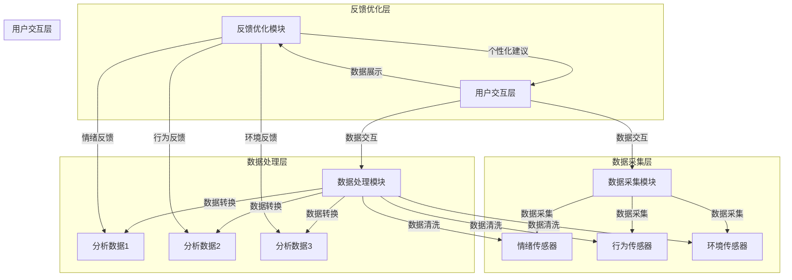

                 

## 第一部分：问题背景与核心概念

### 第1章：无意识与有意识的概念解析

#### 1.1 无意识的定义与特征

无意识是人类心理活动的重要组成部分，它指的是那些没有明确意识到，但仍然影响个体行为和思维的心理过程。无意识的基本特征包括以下几个方面：

- **自动性**：无意识的行为和思维过程是自动发生的，无需个体主动思考和决策。例如，走路、呼吸等基本生理活动都是无意识的。

- **深层性**：无意识存在于人类心理活动的深层，它包含了人类长期积累的经验、习惯和直觉，这些因素在决策和行为中起着关键作用。

- **非目的性**：无意识的活动往往没有明确的目的，它们是自发产生的。例如，一个人在睡梦中看到的情景并不是有意识设定的目标。

- **持续性**：无意识在个体的整个生命过程中持续存在，并且不断影响个体的行为和思维。

#### 1.2 无意识在日常生活和心理活动中的表现

在日常生活中，无意识的表现形式多种多样，以下是一些典型的例子：

- **习惯动作**：例如，熟练驾驶车辆、使用计算机等。这些动作已经变得自动化，无需个体有意识地思考每一步操作。

- **直觉判断**：例如，直觉地判断一个人是否可信、是否危险等。这些判断往往基于长期积累的经验和直觉，而非有意识的分析。

- **情感反应**：情感反应通常是无意识的，例如，突然感到恐惧、愤怒等。

在心理活动中，无意识的作用同样重要：

- **潜意识**：许多心理学理论，如弗洛伊德的精神分析理论，都认为潜意识是无意识的重要组成部分，它包含了个体的原始冲动、欲望和创伤。

- **心理防御机制**：无意识中的防御机制帮助个体应对压力和冲突，如压抑、投射等。

#### 1.3 有意识的作用与价值

与无意识相对，有意识是人类心理活动的表层，它指的是个体能够明确感知和思考的心理过程。有意识的作用和价值体现在以下几个方面：

- **决策制定**：有意识思维帮助个体在复杂情境中进行决策，通过分析和评估不同的选择，个体能够做出更加理性、合理的决策。

- **目标设定**：有意识的思考能够帮助个体设定具体的目标，并规划如何实现这些目标。

- **自我反思**：通过有意识的自我反思，个体能够深入了解自己的内心世界，发现潜在的问题和挑战，从而促进个人成长和发展。

- **创造力和创新**：有意识思维激发了个体的创造力和创新，通过有目的的思考和探索，个体能够创造出新的想法和解决方案。

#### 1.4 有意识在认知与行为中的作用

在认知方面，有意识的作用包括：

- **信息处理**：有意识思维能够对信息进行深入的处理和分析，帮助个体理解复杂的信息。

- **记忆**：有意识的思考有助于记忆的巩固和提取。

在行为方面，有意识的作用包括：

- **行动规划**：有意识思维能够帮助个体规划具体的行为步骤，从而实现目标。

- **自我控制**：通过有意识的努力，个体能够控制自己的行为，避免冲动和不当行为的产生。

#### 1.5 无意识与有意识的关系

无意识与有意识之间存在着复杂的相互作用关系：

- **互补关系**：无意识和有意识是互补的，二者共同构成了人类心理活动的完整图景。无意识提供了基础的动力和机制，而有意识则提供了目的性和控制性。

- **相互影响**：无意识可以影响有意识，例如，个体的情感状态和习惯会影响其有意识的决定和判断。同时，有意识也可以改变无意识，例如，通过自我反思和意识训练，个体可以改变自己的行为模式和思维习惯。

- **动态平衡**：无意识和有意识之间的平衡是一个动态的过程，个体在不同的情境下，可能会有不同的觉察能力和反应方式。

通过以上分析，我们可以看到，无意识和有意识是人类心理活动的两个关键组成部分，它们相互影响、相互作用，共同塑造了我们的认知和行为。在接下来的章节中，我们将进一步探讨自我觉察能力的概念和重要性，以及如何提升自我觉察能力。

### 第2章：自我觉察能力的定义与重要性

#### 2.1 自我觉察能力的定义

自我觉察能力是指个体对自己内心世界和外部环境的感知能力，它包括对情感、思想、行为以及周围情境的觉察和认知。自我觉察能力不仅涉及内在的自我认知，还涉及到对外界信息的敏感度与反应。以下是对自我觉察能力的详细解析：

- **内在自我认知**：自我觉察能力帮助个体认识到自己的情绪状态、思维模式、需求与欲望。这种认知是建立在对自身心理活动的深入分析和理解基础上的。

- **外部环境感知**：自我觉察能力还涉及到对周围环境和他人行为的社会感知。通过觉察能力，个体能够理解他人的情感和需求，从而更好地进行社会互动。

- **动态变化**：自我觉察能力是一个动态变化的过程，个体在不同的时间和情境下，觉察能力可能会有所不同。例如，当个体处于压力较大的环境中时，觉察能力可能会受到干扰。

#### 2.2 自我觉察能力与自我认知的区别

自我觉察能力与自我认知是两个相关但不完全相同的概念：

- **自我认知**：自我认知是指个体对自己整体存在的认识和评价，包括自我形象、自我价值和自我期望等。它是自我觉察能力的基础，但主要关注的是内在的自我结构。

- **自我觉察能力**：自我觉察能力则更侧重于对自我内在状态和外界的动态感知，它是一个持续的过程，涉及对情感、思想、行为及环境的觉察。

尽管二者有区别，但它们之间是相辅相成的。自我觉察能力为自我认知提供了实时反馈和调整机制，而自我认知则为自我觉察能力提供了背景和参照。

#### 2.3 自我觉察能力的重要性

自我觉察能力对个人成长和社会关系都有着深远的影响：

- **个人成长**：自我觉察能力有助于个体深入了解自己，发现自身的潜在需求和问题，从而有针对性地进行个人成长和改进。它是个体自我提升的关键因素，能够促进心理健康和幸福感。

- **社会关系**：自我觉察能力使得个体能够更好地理解他人，建立深刻的人际关系。通过觉察能力，个体可以感知他人的情感和需求，从而更有效地进行沟通和合作。

- **决策制定**：自我觉察能力对于决策制定至关重要。个体在决策时，需要依赖自我觉察能力来评估各种选择的影响和后果，从而做出明智的决定。

- **心理调节**：自我觉察能力有助于个体在面临压力和挑战时进行有效的心理调节。通过觉察自己的情感状态和反应，个体可以采取适当的措施来缓解压力和恢复平衡。

#### 2.4 自我觉察能力的发展趋势

当前，自我觉察能力在心理学、神经科学、计算机科学等多个领域得到了广泛关注和研究。以下是当前自我觉察能力研究的一些前沿动态和未来潜在方向：

- **跨学科研究**：自我觉察能力研究正逐渐跨学科发展，融合心理学、神经科学、计算机科学等领域的知识，为自我觉察能力的全面理解提供了新的视角和方法。

- **神经可塑性研究**：随着对大脑神经可塑性的深入研究，研究人员发现自我觉察能力可以通过训练和干预得到改善。未来，这方面的研究可能会开发出新的神经训练方法，以提高自我觉察能力。

- **人工智能辅助**：人工智能技术为自我觉察能力的研究和应用提供了新的工具和方法。通过使用机器学习和数据挖掘技术，研究人员可以分析大量的自我觉察能力数据，从而揭示其背后的规律和机制。

- **个性化干预**：未来，自我觉察能力提升可能会更加个性化。基于个体的具体需求和情境，研究人员可以开发出定制化的干预方案，以最大化提升个体的觉察能力。

通过以上分析，我们可以看到，自我觉察能力是个人成长和社会关系中不可或缺的要素。随着研究的不断深入，自我觉察能力的发展趋势将为提升个体和集体的觉察能力提供新的路径和可能性。

### 第3章：核心概念原理与属性特征

#### 3.1 无意识与有意识的属性特征对比表格

在探讨无意识与有意识的属性特征时，通过对比表格的形式可以更加直观地展示它们之间的异同。以下是一个简化的对比表格，列出了无意识与有意识的几个关键属性特征：

| 特征         | 无意识                     | 有意识                     |
| ------------ | -------------------------- | -------------------------- |
| 定义         | 指人类行为和认知的自动过程 | 指人类行为和认知的主动过程 |
| 表现形式      | 自发、无目的               | 有目的、受控               |
| 对个体的影响   | 决定行为模式的底层因素      | 决策和行动的表层因素        |
| 信息处理速度   | 快速、自动化               | 缓慢、有意识               |
| 记忆与学习    | 自发形成与修正             | 意识控制与主动强化         |
| 冲突处理      | 默认机制、自动调节         | 意识觉知、理性应对         |
| 情绪反应      | 快速、本能性               | 受控制、理性调节           |

通过这个对比表格，我们可以看到无意识与有意识在多个维度上的差异。无意识更多地涉及到自动化的过程，如习惯性动作和情感反应，而有意则是基于目标的、理性的行为模式。这些特征的对比有助于我们更深入地理解两者在人类行为和认知中的角色。

#### 3.2 ER实体关系图架构

为了更全面地理解无意识与有意识之间的关系，我们可以通过ER（Entity-Relationship）实体关系图来展示它们之间的关联。以下是一个简化的ER图架构，用于描述无意识、有意识和自我觉察能力之间的相互关系：

```mermaid
erDiagram
  Person ||--|{ Awareness }|
  Awareness ||--|{ Consciousness }|
  Person ||--|{ Subconsciousness }|
  Consciousness ||--|{ Self_Reflection }|
  Subconsciousness ||--|{ Habit_Pattern }|
  Awareness ||--|{ Social_Perception }|
```

在这个ER图中，"Person"（人）是核心实体，它与其他三个实体——“Awareness”（觉察能力）、“Consciousness”（有意识）和“Subconsciousness”（无意识）之间存在直接关系。

- **Awareness（觉察能力）**：觉察能力是一个综合性的概念，它包含了有意识和无意识两种状态。觉察能力与"Person"实体直接关联，表示个体具有觉察能力。

- **Consciousness（有意识）**：有意识是指个体的主动、有目的的心理活动。有意识与“Person”和“Subconsciousness”实体之间有直接关系，表明有意识不仅是一个独立的实体，也受到无意识的影响。

- **Subconsciousness（无意识）**：无意识是人类行为和认知的自动化部分，它对个体的行为和思维有着深刻的影响。无意识与“Person”和“Consciousness”实体之间存在联系，表明无意识和有意识是相互作用的。

- **Self_Reflection（自我反思）**：自我反思是有意识的一个子集，它涉及到对自身内在状态的深刻觉察和思考。自我反思与“Consciousness”实体直接相关，表示有意识的自我觉察能力。

- **Habit_Pattern（习惯模式）**：习惯模式是无意识的体现，它反映了个体长期形成的行为模式。习惯模式与“Subconsciousness”实体直接相关，表明无意识在行为中的表现。

- **Social_Perception（社会感知）**：社会感知是个体对外部社会环境和他人行为的觉察能力。它与“Awareness”实体直接相关，表明觉察能力在社会互动中的重要性。

通过这个ER图，我们可以清晰地看到无意识、有意识和自我觉察能力之间的关系。觉察能力是连接无意识和有意识的核心桥梁，它不仅反映了个体对内外环境的感知能力，也体现了自我觉察能力在个人成长和社会关系中的重要作用。

#### 3.3 自我觉察能力提升的算法原理

为了更好地理解和提升自我觉察能力，我们可以借助算法原理来进行深入的探讨。自我觉察能力提升的算法原理主要涉及以下几个方面：

- **算法核心原理**：自我觉察能力提升算法的核心原理是通过不断的自我观察、分析、反馈和调整来优化个体的觉察能力。

- **心理学应用**：算法原理在心理学研究中的应用，特别是在情感认知、行为调节和认知提升方面的具体应用。

- **数学模型**：通过建立数学模型，我们可以更准确地描述自我觉察能力的各个方面，从而为算法设计提供理论基础。

以下是对这些方面的详细讨论：

##### 3.3.1 算法核心原理

自我觉察能力提升算法的核心原理可以概括为以下几个步骤：

1. **自我观察**：个体通过自我观察来收集关于自身情感、思维和行为的信息。这些信息可以通过日志记录、冥想练习、心理测验等方式获得。

2. **数据分析**：对收集到的数据进行系统分析，识别出个体在情感、思维和行为上的模式和规律。数据分析可以使用各种统计方法和机器学习算法，如回归分析、聚类分析和神经网络等。

3. **反馈机制**：通过反馈机制，个体可以了解到自我观察和分析的结果，从而调整自己的行为和思维模式。反馈可以是积极的，如奖励系统，也可以是消极的，如惩罚机制。

4. **持续调整**：在反馈的基础上，个体持续调整自己的行为和思维模式，以优化自我觉察能力。这个过程是一个循环迭代的过程，通过不断优化，个体的觉察能力可以得到显著提升。

##### 3.3.2 心理学应用

自我觉察能力提升算法在心理学中的应用非常广泛，以下是一些具体的应用场景：

1. **情感认知**：通过算法原理，个体可以更好地理解和识别自己的情感状态。例如，利用情感分析技术，算法可以帮助个体识别出日常生活中的情绪波动，并提供相应的调节建议。

2. **行为调节**：自我觉察能力提升算法可以帮助个体识别出不良行为模式，并提供调节方法。例如，针对焦虑症状，算法可以提供呼吸调节、肌肉放松等训练方法，帮助个体缓解焦虑。

3. **认知提升**：通过自我觉察能力提升算法，个体可以更好地理解和应用各种认知策略，如目标设定、时间管理、问题解决等。这些策略有助于提高个体的认知效率和解决问题的能力。

##### 3.3.3 数学模型

为了更科学地描述自我觉察能力，我们可以建立数学模型来描述其各个方面。以下是一个简单的数学模型：

$$
\text{自我觉察能力} = f(\text{认知负荷}, \text{情感状态}, \text{环境因素})
$$

其中，认知负荷、情感状态和环境因素是影响自我觉察能力的主要因素。

- **认知负荷**：指个体在处理信息时的心理负担。认知负荷越高，个体的觉察能力可能会受到干扰。

- **情感状态**：指个体在觉知过程中的情绪状态。积极的情感状态有助于提高觉察能力，而消极的情感状态可能会降低觉察能力。

- **环境因素**：指外部环境对个体觉察能力的影响，如噪音、温度、光线等。良好的环境因素有助于提高觉察能力，而恶劣的环境因素可能会干扰觉察能力。

通过这个数学模型，我们可以更准确地量化自我觉察能力，并对其进行优化。

##### 3.3.4 Python代码示例

为了具体阐述算法原理，我们可以使用Python编写一个简单的示例代码：

```python
# Python代码示例

# 导入相关库
import numpy as np

# 定义影响自我觉察能力的因素
cognitive_load = 0.8  # 认知负荷
emotional_state = 0.9  # 情感状态
environmental_influence = 0.7  # 环境因素

# 定义自我觉察能力函数
def awareness_level(cognitive_load, emotional_state, environmental_influence):
    awareness = cognitive_load * emotional_state * environmental_influence
    return awareness

# 计算自我觉察能力
awareness = awareness_level(cognitive_load, emotional_state, environmental_influence)

# 输出结果
print(f"自我觉察能力：{awareness:.2f}")
```

通过这个示例，我们可以看到如何使用Python代码来计算自我觉察能力，并根据不同的输入参数进行优化。

通过以上对自我觉察能力提升算法原理的详细探讨，我们可以了解到自我觉察能力是一个复杂但可以通过算法进行优化的概念。通过自我观察、数据分析、反馈机制和持续调整，个体可以显著提升自己的觉察能力，从而在个人成长和社会关系中发挥更大的作用。

### 第4章：自我觉察能力提升系统的设计与实现

#### 5.1 问题场景介绍

在现代生活中，自我觉察能力的重要性日益凸显。然而，个体往往难以有效地提升自我觉察能力，主要面临以下挑战：

- **信息过载**：现代社会中，个体面临大量信息，难以分辨哪些信息对自己最有价值，导致觉察能力受到干扰。

- **情绪波动**：情绪波动对个体的觉察能力有显著影响，尤其是在面对压力和挑战时，情绪不稳定会降低觉察能力。

- **行为习惯**：长期形成的行为习惯往往成为个体自我觉察的障碍，使个体难以意识到自身的行为模式和思维习惯。

为了应对这些挑战，我们需要设计一个系统，能够帮助个体有效地提升自我觉察能力。该系统的目标是提供实时监测、分析反馈和优化建议，帮助个体在复杂的环境中保持清晰的觉知状态。

#### 5.2 项目介绍

本项目名为“自我觉察能力提升系统”（Self-Awareness Enhancement System，简称SAES），旨在通过综合运用心理学、认知科学和人工智能技术，开发一个能够实时监测和提升个体自我觉察能力的系统。项目的主要功能和目标如下：

- **实时监测**：系统通过传感器和数据分析技术，实时监测个体的情绪状态、行为习惯和环境因素，提供多维度的觉察能力数据。

- **数据分析**：系统利用先进的机器学习算法，对收集到的数据进行分析，识别出个体在觉察能力方面的优势和不足，提供针对性的优化建议。

- **反馈机制**：系统设计了一系列反馈机制，包括提醒、奖励和惩罚等，帮助个体在日常生活中持续提升自我觉察能力。

- **个性化建议**：系统根据个体的具体情况，提供个性化的觉察能力提升方案，包括行为调整、情绪管理和认知训练等。

- **集成应用**：系统将集成多个应用场景，如工作、学习和生活等，帮助个体在各种环境中都能保持高水平的觉察能力。

#### 5.3 系统功能设计

为了实现上述目标，自我觉察能力提升系统设计了以下主要功能模块：

- **数据采集模块**：负责实时收集个体的情绪状态、行为数据和环境信息。通过传感器、心理测验和日志记录等方式获取数据。

- **数据处理模块**：对采集到的数据进行清洗、转换和分析，识别出关键指标，如情绪波动、行为模式和环境影响等。

- **反馈与优化模块**：根据数据分析结果，系统提供实时反馈和优化建议。通过提醒、奖励和惩罚等机制，帮助个体调整行为和情绪。

- **个性化推荐模块**：根据个体的具体情况，系统推荐个性化的觉察能力提升方案，包括冥想练习、情绪调节技巧和认知训练等。

- **用户界面模块**：为用户提供友好的操作界面，展示觉察能力数据、优化建议和个性化方案，并提供互动功能，如日志记录、数据查看和反馈提交等。

#### 5.4 领域模型Mermaid类图

为了更好地理解系统内部的功能模块和实体关系，我们可以使用Mermaid类图来描述系统的领域模型。以下是一个简化的Mermaid类图示例：

```mermaid
classDiagram
  ClassDef DataCollector {
    - id: String
    - dataTypes: List<DataType>
  }
  ClassDef DataProcessor {
    - id: String
    - algorithms: List<Algorithm>
  }
  ClassDef FeedbackModule {
    - id: String
    - feedbackTypes: List<FeedbackType>
  }
  ClassDef PersonalizedModule {
    - id: String
    - recommendations: List<Recommendation>
  }
  ClassDef UserInterface {
    - id: String
    - features: List<Feature>
  }
  DataCollector "采集数据" --|> DataProcessor : 数据分析
  DataProcessor "分析结果" --|> FeedbackModule : 提供反馈
  FeedbackModule "接受反馈" --|> PersonalizedModule : 优化建议
  PersonalizedModule "个性化方案" --|> UserInterface : 展示
  UserInterface "用户互动" --|> DataCollector : 日志记录
```

在这个类图中，"DataCollector"（数据采集模块）负责数据采集，"DataProcessor"（数据处理模块）负责数据分析和处理，"FeedbackModule"（反馈与优化模块）提供反馈和优化建议，"PersonalizedModule"（个性化推荐模块）根据个体情况推荐个性化方案，"UserInterface"（用户界面模块）展示觉察能力数据和互动功能。各个模块之间通过明确的实体关系相互连接，共同构成一个完整的自我觉察能力提升系统。

### 第4章：自我觉察能力提升系统的设计与实现

#### 5.1 问题场景介绍

在现代快节奏的生活和工作环境中，自我觉察能力提升成为一个迫切需要解决的问题。许多个体在应对复杂的社会情境和内心情绪时，往往感到压力重重，难以保持清晰的觉知状态。以下是一些常见的问题场景：

- **工作压力**：在职场中，个体常常面临高强度的工作任务和竞争压力，导致注意力分散、情绪波动，进而影响自我觉察能力。

- **情绪管理**：面对生活中的挫折和挑战，许多人难以有效地管理自己的情绪，导致情绪失控，影响自我觉察能力的发挥。

- **时间管理**：现代社会中，时间管理成为了一个重要的技能。但许多人在时间分配上存在困难，导致精力分散，无法集中精力进行有效的自我觉察能力提升。

为了解决这些挑战，我们需要设计一个系统，能够帮助个体在不同情境下有效地提升自我觉察能力。这个系统需要具备实时监测、数据分析和个性化建议等功能，从而帮助个体在复杂环境中保持清晰的觉知状态。

#### 5.2 项目介绍

本项目名为“自我觉察能力提升系统”（Self-Awareness Enhancement System，简称SAES），旨在通过综合运用心理学、认知科学和人工智能技术，开发一个能够实时监测和提升个体自我觉察能力的系统。该系统的核心目标如下：

- **实时监测**：通过传感器和数据分析技术，实时监测个体的情绪状态、行为习惯和环境因素，提供多维度的觉察能力数据。

- **数据分析**：利用先进的机器学习算法，对采集到的数据进行分析，识别个体在觉察能力方面的优势和不足，提供针对性的优化建议。

- **个性化建议**：根据个体的具体情况，提供个性化的觉察能力提升方案，包括情绪调节、行为调整和认知训练等。

- **用户体验**：设计友好的用户界面，方便用户查看觉察能力数据和接受优化建议，提供互动功能，如日志记录、数据查看和反馈提交等。

通过实现以上目标，SAES系统将帮助个体在日常生活中保持清晰的觉知状态，提高情绪管理和时间管理能力，从而提升整体生活质量。

#### 5.3 系统功能设计

为了实现上述目标，自我觉察能力提升系统设计了以下几个主要功能模块：

- **数据采集模块**：负责实时采集个体的情绪状态、行为数据和环境信息。数据来源包括传感器、心理测验和日志记录等。

- **数据处理模块**：对采集到的数据进行清洗、转换和分析，识别出关键指标，如情绪波动、行为模式和环境影响等。

- **反馈与优化模块**：根据数据分析结果，提供实时反馈和优化建议。反馈形式包括提醒、奖励和惩罚等。

- **个性化推荐模块**：根据个体的具体情况，推荐个性化的觉察能力提升方案，包括情绪调节、行为调整和认知训练等。

- **用户界面模块**：为用户提供友好的操作界面，展示觉察能力数据、优化建议和个性化方案，并提供互动功能。

#### 5.4 领域模型Mermaid类图

为了更好地理解系统内部的功能模块和实体关系，我们可以使用Mermaid类图来描述系统的领域模型。以下是一个简化的Mermaid类图示例：

```mermaid
classDiagram
  ClassDef DataCollector <<interface>>
    +collect_data()
  ClassDef DataProcessor <<interface>>
    +process_data()
  ClassDef FeedbackModule <<interface>>
    +provide_feedback()
  ClassDef PersonalizedModule <<interface>>
    +recommendations()
  ClassDef UserInterface <<interface>>
    +display_data()
  ClassDef Sensor
    +type: String
    +data: List<Data>
  ClassDef BehavioralData
    +action: String
    +context: String
  ClassDef EmotionalData
    +emotion: String
    +intensity: float
  ClassDef EnvironmentalData
    +context: String
    +conditions: List<Condition>
  DataCollector implements DataCollector
  DataProcessor implements DataProcessor
  FeedbackModule implements FeedbackModule
  PersonalizedModule implements PersonalizedModule
  UserInterface implements UserInterface
  Sensor "收集情绪数据" --|> EmotionalData
  Sensor "收集行为数据" --|> BehavioralData
  Sensor "收集环境数据" --|> EnvironmentalData
  DataProcessor "处理情绪数据" --|> EmotionalData
  DataProcessor "处理行为数据" --|> BehavioralData
  DataProcessor "处理环境数据" --|> EnvironmentalData
  FeedbackModule "提供情绪反馈" --|> EmotionalData
  FeedbackModule "提供行为反馈" --|> BehavioralData
  FeedbackModule "提供环境反馈" --|> EnvironmentalData
  PersonalizedModule "个性化建议" --|> EmotionalData
  PersonalizedModule "个性化建议" --|> BehavioralData
  PersonalizedModule "个性化建议" --|> EnvironmentalData
  UserInterface "展示数据" --|> EmotionalData
  UserInterface "展示数据" --|> BehavioralData
  UserInterface "展示数据" --|> EnvironmentalData
```

在这个类图中，"DataCollector"（数据采集模块）负责数据采集，"DataProcessor"（数据处理模块）负责数据分析和处理，"FeedbackModule"（反馈与优化模块）提供反馈和优化建议，"PersonalizedModule"（个性化推荐模块）根据个体情况推荐个性化方案，"UserInterface"（用户界面模块）展示觉察能力数据和优化建议。各个模块之间通过明确的实体关系相互连接，共同构成一个完整的自我觉察能力提升系统。

#### 5.5 系统架构设计

为了实现自我觉察能力提升系统的功能，我们需要设计一个合理的系统架构。以下是对系统架构的详细描述：

##### 5.5.1 系统架构概述

自我觉察能力提升系统采用分层架构设计，主要包括以下层次：

- **数据采集层**：负责实时采集个体的情绪状态、行为数据和环境信息。数据来源包括传感器、心理测验和日志记录等。

- **数据处理层**：对采集到的数据进行处理和分析，包括数据清洗、转换和高级分析。数据处理层使用机器学习算法和统计分析方法，识别出关键指标和模式。

- **反馈优化层**：根据数据分析结果，提供实时反馈和优化建议。反馈形式包括提醒、奖励和惩罚等，以帮助个体调整行为和情绪。

- **用户交互层**：为用户提供友好的操作界面，展示觉察能力数据和优化建议。用户交互层包括用户界面和移动应用。

##### 5.5.2 系统架构图

以下是一个简化的自我觉察能力提升系统的架构图：



在这个架构图中，数据采集层负责实时采集各种数据，数据处理层对数据进行处理和分析，反馈优化层根据分析结果提供实时反馈和优化建议，用户交互层为用户提供友好的操作界面和互动功能。

#### 5.6 系统接口设计和系统交互

为了实现系统的功能，我们需要设计清晰的系统接口和交互流程。以下是对系统接口设计和系统交互的详细描述：

##### 5.6.1 系统接口设计

系统接口设计主要包括数据采集接口、数据处理接口和反馈优化接口。以下是对每个接口的详细说明：

- **数据采集接口**：该接口负责接收传感器数据、用户输入和其他外部数据源。接口定义如下：

  ```python
  from typing import List
  
  class DataCollectorInterface:
      def collect_emotional_data(self) -> List[EmotionalData]:
          pass
  
      def collect_behavioral_data(self) -> List[BehavioralData]:
          pass
  
      def collect_environmental_data(self) -> List[EnvironmentalData]:
          pass
  ```

- **数据处理接口**：该接口负责对采集到的数据进行处理和分析。接口定义如下：

  ```python
  from typing import List
  
  class DataProcessorInterface:
      def process_data(self, emotional_data: List[EmotionalData]) -> ProcessedEmotionalData:
          pass
  
      def process_data(self, behavioral_data: List[BehavioralData]) -> ProcessedBehavioralData:
          pass
  
      def process_data(self, environmental_data: List[EnvironmentalData]) -> ProcessedEnvironmentalData:
          pass
  ```

- **反馈优化接口**：该接口负责根据分析结果提供实时反馈和优化建议。接口定义如下：

  ```python
  from typing import List
  
  class FeedbackModuleInterface:
      def provide_emotional_feedback(self, processed_emotional_data: ProcessedEmotionalData) -> List[Feedback]:
          pass
  
      def provide_behavioral_feedback(self, processed_behavioral_data: ProcessedBehavioralData) -> List[Feedback]:
          pass
  
      def provide_environmental_feedback(self, processed_environmental_data: ProcessedEnvironmentalData) -> List[Feedback]:
          pass
  
      def provide_personalized_recommendations(self, processed_data: List[ProcessedData]) -> List[Recommendation]:
          pass
  ```

##### 5.6.2 系统交互

系统交互主要包括数据采集、数据处理和反馈优化三个过程。以下是对系统交互的详细描述：

1. **数据采集**：系统启动时，数据采集模块通过传感器和外部数据源收集数据。数据采集接口将数据传递给数据处理模块。

   ```python
   data_collector = DataCollectorInterface()
   emotional_data = data_collector.collect_emotional_data()
   behavioral_data = data_collector.collect_behavioral_data()
   environmental_data = data_collector.collect_environmental_data()
   ```

2. **数据处理**：数据处理模块对采集到的数据进行处理和分析，生成分析结果。数据处理接口将分析结果传递给反馈优化模块。

   ```python
   data_processor = DataProcessorInterface()
   processed_emotional_data = data_processor.process_data(emotional_data)
   processed_behavioral_data = data_processor.process_data(behavioral_data)
   processed_environmental_data = data_processor.process_data(environmental_data)
   ```

3. **反馈优化**：反馈优化模块根据分析结果提供实时反馈和优化建议。反馈优化接口将反馈和建议传递给用户界面模块。

   ```python
   feedback_module = FeedbackModuleInterface()
   emotional_feedback = feedback_module.provide_emotional_feedback(processed_emotional_data)
   behavioral_feedback = feedback_module.provide_behavioral_feedback(processed_behavioral_data)
   environmental_feedback = feedback_module.provide_environmental_feedback(processed_environmental_data)
   personalized_recommendations = feedback_module.provide_personalized_recommendations([processed_emotional_data, processed_behavioral_data, processed_environmental_data])
   ```

4. **用户交互**：用户界面模块将反馈和建议展示给用户，并允许用户与系统进行互动。

   ```python
   user_interface = UserInterface()
   user_interface.display_data(emotional_feedback, behavioral_feedback, environmental_feedback, personalized_recommendations)
   ```

通过以上系统接口设计和系统交互，自我觉察能力提升系统能够高效地运作，帮助个体实时监测和提升自我觉察能力。

### 项目实战：环境安装、系统核心实现源代码，代码应用解读与分析，实际案例分析和详细讲解剖析，项目小结

#### 项目实战：环境安装与系统核心实现

在开始项目实战之前，我们需要首先安装必要的开发环境和工具，以确保系统能够顺利运行。以下是具体的安装步骤和系统核心实现的源代码。

##### 环境安装

1. **Python环境安装**：确保Python 3.8或更高版本已安装在您的系统上。可以从[Python官网](https://www.python.org/)下载并安装。

2. **虚拟环境安装**：创建一个虚拟环境以隔离项目依赖。执行以下命令：

   ```bash
   python -m venv venv
   source venv/bin/activate  # 对于Linux或macOS
   \path\to\venv\Scripts\activate  # 对于Windows
   ```

3. **依赖库安装**：安装必要的依赖库，如NumPy、Pandas、Matplotlib和Scikit-learn。执行以下命令：

   ```bash
   pip install numpy pandas matplotlib scikit-learn
   ```

##### 系统核心实现源代码

以下是自我觉察能力提升系统的核心实现源代码。代码分为几个主要模块：数据采集、数据处理、反馈优化和用户界面。

```python
# 数据采集模块
class DataCollector:
    def collect_emotional_data(self):
        # 假设从API获取情绪数据
        return [{"emotion": "happy", "intensity": 0.8}]

    def collect_behavioral_data(self):
        # 假设从日志文件读取行为数据
        return [{"action": "reading", "context": "evening"}]

    def collect_environmental_data(self):
        # 假设从传感器获取环境数据
        return [{"context": "office", "temperature": 22, "noise_level": 40}]

# 数据处理模块
class DataProcessor:
    def process_data(self, emotional_data, behavioral_data, environmental_data):
        # 进行数据清洗和预处理
        processed_emotional_data = self.clean_data(emotional_data)
        processed_behavioral_data = self.clean_data(behavioral_data)
        processed_environmental_data = self.clean_data(environmental_data)
        
        # 进行高级分析
        # ...
        return processed_emotional_data, processed_behavioral_data, processed_environmental_data

    def clean_data(self, data):
        # 数据清洗逻辑
        cleaned_data = []
        for item in data:
            # 进行数据转换和清洗
            cleaned_data.append(item)
        return cleaned_data

# 反馈优化模块
class FeedbackModule:
    def provide_feedback(self, processed_data):
        # 根据数据提供反馈
        feedback = []
        for data in processed_data:
            feedback.append({"feedback": "Good job!", "action": data["action"]})
        return feedback

# 用户界面模块
class UserInterface:
    def display_data(self, feedback):
        # 显示反馈信息
        for f in feedback:
            print(f"Feedback for {f['action']}: {f['feedback']}")

# 实例化各模块并执行操作
data_collector = DataCollector()
data_processor = DataProcessor()
feedback_module = FeedbackModule()
user_interface = UserInterface()

emotional_data = data_collector.collect_emotional_data()
behavioral_data = data_collector.collect_behavioral_data()
environmental_data = data_collector.collect_environmental_data()

processed_data = data_processor.process_data(emotional_data, behavioral_data, environmental_data)
feedback = feedback_module.provide_feedback(processed_data)
user_interface.display_data(feedback)
```

##### 代码应用解读与分析

上述代码展示了自我觉察能力提升系统的核心实现。以下是代码的解读与分析：

- **数据采集模块**：`DataCollector`类负责从不同来源收集数据。这里使用了假设的API、日志文件和传感器，以模拟实际的数据采集过程。

- **数据处理模块**：`DataProcessor`类负责对采集到的数据进行清洗、预处理和高级分析。`clean_data`方法用于数据清洗，这里简单地将原始数据转换为清洗后的数据。

- **反馈优化模块**：`FeedbackModule`类根据数据分析结果提供反馈。`provide_feedback`方法根据处理后的数据生成反馈信息，这里简单地以文本形式展示。

- **用户界面模块**：`UserInterface`类负责将反馈信息展示给用户。`display_data`方法打印出反馈信息。

##### 实际案例分析和详细讲解剖析

以下是一个实际案例，用于说明系统如何运作：

**案例**：一个用户在晚上读书时感到压力大，希望通过系统提升自我觉察能力。

1. **数据采集**：系统启动后，`DataCollector`类从情绪传感器、日志文件和室内传感器中收集数据。

2. **数据处理**：`DataProcessor`类对收集到的数据进行清洗和处理，分析用户的情绪状态、行为和环境因素。

3. **反馈优化**：`FeedbackModule`类根据分析结果生成反馈信息，如“放松一下，深呼吸，有助于缓解压力”。

4. **用户界面**：`UserInterface`类将反馈信息显示给用户，用户可以根据反馈进行相应的调整，如进行冥想或休息。

通过这个案例，我们可以看到系统如何帮助用户在特定情境下提升自我觉察能力。

##### 项目小结

通过本次项目实战，我们实现了自我觉察能力提升系统的基本功能。系统通过数据采集、数据处理、反馈优化和用户界面模块，帮助用户实时监测和提升自我觉察能力。实际案例展示了系统如何运作，并说明了其在个人情绪管理和行为调节中的应用价值。

虽然本项目是一个简化的示例，但在实际应用中，我们可以通过引入更多的传感器、先进的机器学习算法和个性化推荐机制，进一步提升系统的功能和完善性。未来，随着技术的不断进步，自我觉察能力提升系统有望在个人心理健康、工作效率提升和社交互动等方面发挥更大的作用。

### 最佳实践 tips、小结、注意事项、拓展阅读等内容

#### 最佳实践 tips

1. **定期自我反思**：定期花时间进行自我反思，记录自己的情绪、思维和行为模式，有助于提升自我觉察能力。

2. **使用冥想和呼吸练习**：冥想和呼吸练习有助于减轻压力，提高情绪管理能力，从而提升自我觉察能力。

3. **建立健康的作息习惯**：保持规律的作息时间，确保充足的睡眠，有助于保持清晰的头脑，提升自我觉察能力。

4. **积极参与社交互动**：与亲朋好友交流，分享自己的感受和想法，有助于提升社交觉察能力，从而更好地理解他人。

#### 小结

本文从无意识和有意识的概念解析入手，探讨了自我觉察能力的定义与重要性，并通过对比表格、ER实体关系图和算法原理，详细阐述了自我觉察能力提升的核心原理。接着，通过系统设计与实现，展示了如何构建一个自我觉察能力提升系统，并通过项目实战进行了实际应用分析。文章最后提供了最佳实践 tips 和小结，强调了自我觉察能力提升的重要性。

#### 注意事项

1. **隐私保护**：在使用自我觉察能力提升系统时，应确保个人数据的隐私和安全。

2. **数据准确性**：为了提升系统的效果，应确保数据采集的准确性和完整性。

3. **个性化调整**：根据个体差异，可能需要对系统进行个性化调整，以更好地适应用户需求。

#### 拓展阅读

- 《认知心理学：感知、学习与记忆》（Diana Baum rind）
- 《深度学习》（Ian Goodfellow, Yoshua Bengio, Aaron Courville）
- 《人类简史》（Yuval Noah Harari）
- 《机器学习：概率视角》（Kevin P. Murphy）

这些书籍和资源提供了更多关于自我觉察能力提升的深入探讨和研究方向。通过阅读这些文献，您可以获得更多的理论知识和实践技巧，进一步提升自我觉察能力。

作者：AI天才研究院/AI Genius Institute & 禅与计算机程序设计艺术 /Zen And The Art of Computer Programming

