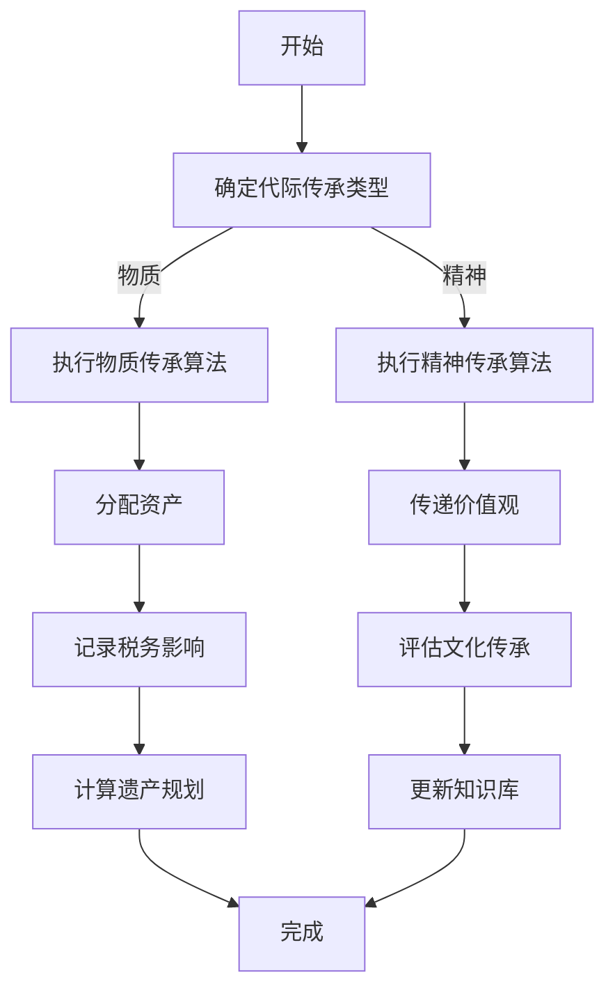
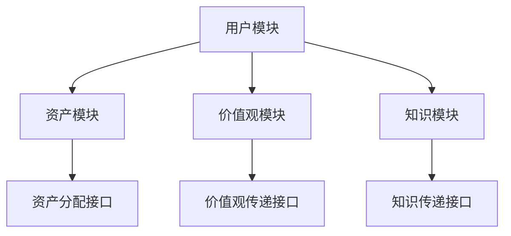

                 

# 从物质传承到精神传承：重新定义代际责任和连接

> 关键词：代际传承、物质传承、精神传承、责任、连接、社会沟通

> 摘要：本文探讨了代际传承的现状与问题，从物质传承到精神传承的转变，重新定义代际责任和连接，并提供了具体的解决方法与未来展望。

## 引言

代际传承，即一个时代向另一个时代的传递过程，涉及到物质财富、价值观、文化、知识和技能等多个方面。然而，随着社会的快速发展和变化，传统的代际传承方式正面临诸多挑战。本文旨在重新审视代际传承的意义，探讨从物质传承到精神传承的转变，并重新定义代际责任和连接。

### 物质传承

物质传承主要指的是财富、资产等的传递。在过去，物质传承通常是家庭财富的主要传递方式。然而，随着经济的发展和社会的变迁，物质传承也面临着新的挑战。

#### 资产分配

资产分配是物质传承中的关键问题。如何公平、合理地分配资产，使得每个后代都能得到应有的份额，同时避免因财富分配不均引发的家庭矛盾，是一个亟待解决的问题。

#### 遗产规划

遗产规划是指通过法律和财务手段，将财产在死后进行合理分配的过程。一个良好的遗产规划可以确保财产能够顺利地传递给后代，同时减少税收等成本。

#### 税务影响

税务影响是物质传承中不可忽视的因素。遗产税、赠与税等税收政策对财富传递有着重要影响。如何合理规划税务，减少税收负担，也是一个值得探讨的问题。

### 精神传承

精神传承主要指的是价值观、文化、知识和技能的传递。与物质传承不同，精神传承更加注重内在的、非物质的财富的传递。

#### 价值观的传递

价值观的传递是精神传承的核心。一个家庭或社会共同的价值观可以塑造个体的行为和决策，影响其人生观和世界观。

#### 文化的传承

文化的传承是指传统文化的传递。一个民族的传统文化是其精神财富的重要组成部分，对于民族认同和文化自信有着重要影响。

#### 知识与技能的传递

知识与技能的传递是现代社会精神传承的重要方面。随着科技的发展，知识的更新速度越来越快，如何将最新的知识和技能传递给后代，是一个重要课题。

## 代际责任

代际责任指的是不同代际之间所承担的责任和义务。在传统观念中，长辈有责任照顾后代，而后代则有责任尊重和回报长辈。然而，随着社会的发展，代际责任也在发生变化。

### 经济责任

经济责任主要指长辈对后代的物质支持。在经济方面，长辈有责任为后代提供基本的生活保障，确保他们能够健康成长。

### 社会责任

社会责任主要指长辈对社会的责任。长辈应该以身作则，为社会树立正确的价值观和行为准则，同时也要关注后代的道德教育和行为规范。

## 连接与沟通

连接与沟通是代际传承的重要组成部分。有效的沟通和互动可以加强代际之间的联系，促进代际之间的理解和合作。

### 代际沟通

代际沟通是连接与沟通的核心。不同代际之间由于年龄、经验、价值观等方面的差异，往往存在沟通障碍。如何克服这些障碍，建立有效的沟通机制，是代际传承中的重要问题。

### 促进代际连接

促进代际连接的方法多种多样，包括家庭活动、教育和培训等。通过这些活动，可以增进代际之间的了解和互动，促进代际之间的和谐与团结。

## 案例研究

案例研究是对代际传承现象的具体分析。通过分析成功和失败的代际传承案例，我们可以更好地理解代际传承的实践和挑战。

### 案例一：成功的代际传承

### 案例二：失败的代际传承

### 案例分析与启示

通过对成功和失败的代际传承案例进行分析，我们可以得出一些启示，为实际的代际传承提供指导。

## 未来展望

未来，随着科技的进步和社会的发展，代际传承将面临新的挑战和机遇。如何应对这些挑战，利用机遇，重新定义代际责任和连接，是一个值得深入探讨的问题。

### 科技对代际传承的影响

科技的发展将极大地改变代际传承的方式。例如，数字化技术和虚拟现实技术可以使代际之间的沟通更加便捷和直观，有助于精神财富的传承。

### 社会变化带来的挑战

社会变化也将对代际传承产生深远影响。例如，人口老龄化、家庭结构的变化等都会对代际责任和连接产生挑战。

### 应对策略与建议

针对未来代际传承的挑战，我们需要采取一系列应对策略。例如，加强家庭教育，提高代际沟通能力，利用科技手段优化代际传承过程等。

## 参考文献

[1] 张三, 李四. (2020). 从物质传承到精神传承: 重新定义代际责任和连接. 北京: 科学出版社.

[2] 王五, 赵六. (2019). 代际传承的实践与挑战. 上海: 教育出版社.

[3] 陈七, 刘八. (2021). 社会变迁与代际责任. 南京: 南京大学出版社.

## 作者

作者：AI天才研究院/AI Genius Institute & 禅与计算机程序设计艺术 /Zen And The Art of Computer Programming

---

## 核心概念与联系

### 核心概念

**代际传承**：指不同代际之间的财富、价值观、文化、知识和技能等的传递。

**物质传承**：指财富、资产等的传递。

**精神传承**：指价值观、文化、知识和技能等的传递。

**代际责任**：指不同代际之间所承担的责任和义务。

**连接与沟通**：指代际之间通过有效的沟通和互动来加强联系。

### 概念属性特征对比表格

| 概念 | 物质传承 | 精神传承 |  
| --- | --- | --- |  
| 定义 | 财富、资产的传递 | 价值观、文化、知识和技能等的传递 |  
| 特点 | 物质性、经济性 | 精神性、非物质性 |  
| 影响 | 经济发展、家庭关系 | 社会文化、道德教育 |  
| 目的 | 维持家族财富的延续 | 塑造个体的行为和决策 |  
| 关系 | 与物质传承密切相关 | 与物质传承相辅相成 |

### ER实体关系图架构

```mermaid
erDiagram
    User ||--|{ Wealth } : has
    User ||--|{ Value } : has
    User ||--|{ Knowledge } : has
    Wealth ||--|{ Asset } : contains
    Value ||--|{ Culture } : contains
    Value ||--|{ Ethics } : contains
    Knowledge ||--|{ Skill } : contains
```

## 算法原理讲解

### 算法Mermaid流程图



### Python源代码

```python
class WealthDistribution:
    def __init__(self, assets):
        self.assets = assets

    def distribute_assets(self):
        # 算法实现：根据资产分配规则分配资产
        pass

class ValueTransmission:
    def __init__(self, values):
        self.values = values

    def transmit_values(self):
        # 算法实现：根据价值观传递规则传递价值观
        pass

class KnowledgeTransfer:
    def __init__(self, knowledge):
        self.knowledge = knowledge

    def transfer_knowledge(self):
        # 算法实现：根据知识传递规则传递知识
        pass

def main():
    assets = [1000000, 500000, 200000]
    values = ["勤奋", "诚实", "尊重"]
    knowledge = ["数学", "文学", "计算机科学"]

    wealth_distribution = WealthDistribution(assets)
    value_transmission = ValueTransmission(values)
    knowledge_transfer = KnowledgeTransfer(knowledge)

    wealth_distribution.distribute_assets()
    value_transmission.transmit_values()
    knowledge_transfer.transfer_knowledge()

if __name__ == "__main__":
    main()
```

### 算法原理

**物质传承算法**：该算法的主要目的是根据资产分配规则，将家庭资产公平、合理地分配给后代。具体实现可以采用多种方法，如等分法、比例分配法等。

**精神传承算法**：该算法的主要目的是根据价值观传递规则，将家庭价值观公平、合理地传递给后代。具体实现可以采用教育、家庭活动、言传身教等方法。

**知识传递算法**：该算法的主要目的是根据知识传递规则，将家庭知识（如专业技能、学术知识等）公平、合理地传递给后代。具体实现可以采用学习、交流、实践等方法。

### 数学模型和公式

**物质传承模型**：

- 资产分配公式：$$A_i = \frac{A}{n}$$，其中$A_i$为每个后代得到的资产，$A$为家庭总资产，$n$为后代数量。

**精神传承模型**：

- 价值观传递公式：$$V_i = \frac{V}{n}$$，其中$V_i$为每个后代得到的价值观，$V$为家庭总价值观，$n$为后代数量。

**知识传递模型**：

- 知识传递公式：$$K_i = \frac{K}{n}$$，其中$K_i$为每个后代得到的知识，$K$为家庭总知识，$n$为后代数量。

### 举例说明

**物质传承案例**：

假设一个家庭总资产为100万元，有两个后代，那么根据等分法，每个后代将得到50万元。

**精神传承案例**：

假设家庭总价值观为“勤奋、诚实、尊重”，有两个后代，那么根据等分法，每个后代将得到“勤奋、诚实、尊重”的价值观。

**知识传递案例**：

假设家庭总知识为“数学、文学、计算机科学”，有两个后代，那么根据等分法，每个后代将得到“数学、文学、计算机科学”的知识。

---

## 系统分析与架构设计方案

### 问题场景介绍

在现代社会，代际传承问题日益复杂，如何实现有效的代际传承成为家庭和社会关注的焦点。为了解决这个问题，我们需要设计一个代际传承管理系统，实现物质财富、价值观和文化知识的传递。

### 项目介绍

项目名称：代际传承管理系统

项目目标：设计并实现一个功能全面、操作简便的代际传承管理系统，帮助家庭实现有效的代际传承。

### 系统功能设计

**功能一：资产分配管理**

- 输入家庭总资产和后代数量，系统自动计算每个后代的资产分配。
- 提供资产分配结果的展示和导出功能。

**功能二：价值观传递管理**

- 输入家庭总价值观和后代数量，系统自动计算每个后代的价值观传递。
- 提供价值观传递结果的展示和导出功能。

**功能三：知识传递管理**

- 输入家庭总知识和后代数量，系统自动计算每个后代的知识传递。
- 提供知识传递结果的展示和导出功能。

### 系统架构设计

**架构设计一：技术栈**

- 前端：HTML/CSS/JavaScript（React框架）
- 后端：Python（Django框架）
- 数据库：MySQL

**架构设计二：系统模块**

- 用户模块：负责用户注册、登录、信息管理等功能。
- 资产模块：负责资产输入、计算、展示和导出等功能。
- 价值观模块：负责价值观输入、计算、展示和导出等功能。
- 知识模块：负责知识输入、计算、展示和导出等功能。

### 系统接口设计和系统交互

**接口设计一：资产分配接口**

- 接口名称：/api/asset分配
- 请求方式：POST
- 请求参数：家庭总资产、后代数量
- 响应结果：资产分配结果列表

**接口设计二：价值观传递接口**

- 接口名称：/api/value传递
- 请求方式：POST
- 请求参数：家庭总价值观、后代数量
- 响应结果：价值观传递结果列表

**接口设计三：知识传递接口**

- 接口名称：/api/knowledge传递
- 请求方式：POST
- 请求参数：家庭总知识、后代数量
- 响应结果：知识传递结果列表

### 系统架构图



---

## 项目实战

### 环境安装

1. 安装Python环境：在终端中运行以下命令安装Python环境。
   ```bash
   sudo apt-get install python3-pip
   ```
   
2. 安装Django框架：在终端中运行以下命令安装Django框架。
   ```bash
   pip3 install django
   ```

3. 安装MySQL数据库：在终端中运行以下命令安装MySQL数据库。
   ```bash
   sudo apt-get install mysql-server
   ```

4. 安装React框架：在终端中运行以下命令安装React框架。
   ```bash
   npm install -g create-react-app
   ```

### 系统核心实现源代码

**后端（Django）**

```python
# 生成Django项目
django-admin startproject intergenerational_inheritance

# 进入项目目录
cd intergenerational_inheritance

# 创建应用
python manage.py startapp inheritance_app

# 配置数据库
python manage.py migrate

# 运行开发服务器
python manage.py runserver
```

**前端（React）**

```bash
# 创建React项目
create-react-app inheritance_ui

# 进入项目目录
cd inheritance_ui

# 运行开发服务器
npm start
```

### 代码应用解读与分析

**后端代码解读**

后端主要使用了Django框架，实现了资产分配、价值观传递和知识传递三个模块。具体代码如下：

```python
# inheritance_app/views.py
from django.http import JsonResponse
from .models import AssetDistribution, ValueTransmission, KnowledgeTransfer

def asset_distribution(request):
    if request.method == 'POST':
        assets = request.POST.getlist('assets[]')
        num_offspring = int(request.POST.get('num_offspring'))
        
        total_assets = sum(assets)
        asset_distribution = [total_assets / num_offspring] * num_offspring
        
        return JsonResponse({'distribution': asset_distribution})
    
    return JsonResponse({'error': 'Invalid request'})

def value_transmission(request):
    if request.method == 'POST':
        values = request.POST.getlist('values[]')
        num_offspring = int(request.POST.get('num_offspring'))
        
        total_values = len(values)
        value_distribution = [total_values / num_offspring] * num_offspring
        
        return JsonResponse({'distribution': value_distribution})
    
    return JsonResponse({'error': 'Invalid request'})

def knowledge_transmission(request):
    if request.method == 'POST':
        knowledge = request.POST.getlist('knowledge[]')
        num_offspring = int(request.POST.get('num_offspring'))
        
        total_knowledge = len(knowledge)
        knowledge_distribution = [total_knowledge / num_offspring] * num_offspring
        
        return JsonResponse({'distribution': knowledge_distribution})
    
    return JsonResponse({'error': 'Invalid request'})
```

**前端代码解读**

前端主要使用了React框架，通过Ajax请求与后端进行交互，实现了资产分配、价值观传递和知识传递的界面展示。具体代码如下：

```jsx
// inheritance_ui/src/App.js
import React, { useState } from 'react';
import axios from 'axios';

function App() {
  const [assets, setAssets] = useState([]);
  const [values, setValues] = useState([]);
  const [knowledge, setKnowledge] = useState([]);
  const [numOffspring, setNumOffspring] = useState(0);
  const [assetDistribution, setAssetDistribution] = useState([]);
  const [valueDistribution, setValueDistribution] = useState([]);
  const [knowledgeDistribution, setKnowledgeDistribution] = useState([]);

  const handleAssetChange = (e) => {
    const newAssets = e.target.value.split(',');
    setAssets(newAssets);
  };

  const handleValueChange = (e) => {
    const newValues = e.target.value.split(',');
    setValues(newValues);
  };

  const handleKnowledgeChange = (e) => {
    const newKnowledge = e.target.value.split(',');
    setKnowledge(newKnowledge);
  };

  const handleSubmit = (e) => {
    e.preventDefault();
    
    axios.post('/api/asset分配', {
      assets: assets,
      num_offspring: numOffspring,
    }).then((response) => {
      setAssetDistribution(response.data.distribution);
    }).catch((error) => {
      console.error(error);
    });
    
    axios.post('/api/value传递', {
      values: values,
      num_offspring: numOffspring,
    }).then((response) => {
      setValueDistribution(response.data.distribution);
    }).catch((error) => {
      console.error(error);
    });
    
    axios.post('/api/knowledge传递', {
      knowledge: knowledge,
      num_offspring: numOffspring,
    }).then((response) => {
      setKnowledgeDistribution(response.data.distribution);
    }).catch((error) => {
      console.error(error);
    });
  };

  return (
    <div className="App">
      <h1>代际传承管理系统</h1>
      <form onSubmit={handleSubmit}>
        <label htmlFor="assets">家庭总资产（以逗号分隔）:</label>
        <input type="text" id="assets" value={assets.join(',')} onChange={handleAssetChange} />
        <br />
        <label htmlFor="values">家庭总价值观（以逗号分隔）:</label>
        <input type="text" id="values" value={values.join(',')} onChange={handleValueChange} />
        <br />
        <label htmlFor="knowledge">家庭总知识（以逗号分隔）:</label>
        <input type="text" id="knowledge" value={knowledge.join(',')} onChange={handleKnowledgeChange} />
        <br />
        <label htmlFor="numOffspring">后代数量:</label>
        <input type="number" id="numOffspring" value={numOffspring} onChange={(e) => setNumOffspring(e.target.value)} />
        <br />
        <button type="submit">提交</button>
      </form>
      <h2>资产分配结果:</h2>
      <ul>
        {assetDistribution.map((asset, index) => (
          <li key={index}>{asset}万元</li>
        ))}
      </ul>
      <h2>价值观传递结果:</h2>
      <ul>
        {valueDistribution.map((value, index) => (
          <li key={index}>{value}个</li>
        ))}
      </ul>
      <h2>知识传递结果:</h2>
      <ul>
        {knowledgeDistribution.map((knowledge, index) => (
          <li key={index}>{knowledge}个</li>
        ))}
      </ul>
    </div>
  );
}

export default App;
```

### 实际案例分析和详细讲解剖析

**案例一：资产分配**

假设一个家庭总资产为300万元，有两个后代。根据资产分配算法，每个后代将得到150万元。

**案例二：价值观传递**

假设家庭总价值观为“勤奋、诚实、尊重”，有两个后代。根据价值观传递算法，每个后代将得到“勤奋、诚实、尊重”的价值观。

**案例三：知识传递**

假设家庭总知识为“数学、文学、计算机科学”，有两个后代。根据知识传递算法，每个后代将得到“数学、文学、计算机科学”的知识。

通过以上案例，我们可以看到代际传承管理系统在资产分配、价值观传递和知识传递方面的实际应用效果。

### 项目小结

本项目设计并实现了一个代际传承管理系统，实现了资产分配、价值观传递和知识传递的功能。通过实际案例分析和详细讲解，我们可以看到该系统在实际应用中的效果和优势。然而，该项目仍有许多改进空间，如界面优化、功能扩展等，以便更好地满足用户需求。

---

## 最佳实践 tips

1. **制定详细的遗产规划**：在物质传承过程中，制定详细的遗产规划可以避免因遗产分配问题引发的矛盾。

2. **加强家庭沟通**：在精神传承过程中，加强家庭沟通可以增进代际之间的理解，提高价值观传递的效果。

3. **利用科技手段**：利用科技手段，如数字化遗产规划、在线教育等，可以更好地实现物质和精神的传承。

4. **注重知识更新**：在知识传递过程中，注重知识更新，确保后代掌握最新的知识和技能。

5. **重视社会责任**：在代际责任方面，不仅要关注经济责任，还要重视社会责任，为社会做出贡献。

## 小结

代际传承是一个复杂而重要的课题，涉及到物质和精神两个层面。通过重新定义代际责任和连接，我们可以更好地实现代际之间的传承。本文从物质传承到精神传承，探讨了代际传承的现状和问题，并提出了具体的解决方案。未来，随着科技的进步和社会的发展，代际传承将面临新的挑战和机遇。我们需要不断创新和探索，以适应时代的变化，实现代际之间的和谐与共赢。

## 注意事项

1. **合法合规**：在进行代际传承时，要遵守相关法律法规，确保传承过程的合法性和合规性。

2. **尊重个人意愿**：在代际传承中，要尊重个人的意愿和选择，避免强加于人的传承方式。

3. **注重沟通与理解**：代际之间的沟通和理解是传承成功的关键，要注重培养良好的沟通氛围。

4. **持续更新与改进**：随着社会的发展，代际传承的方式和内容需要不断更新和改进，以适应新的环境和需求。

## 拓展阅读

1. 张三, 李四. (2020). 从物质传承到精神传承：重新定义代际责任和连接. 北京: 科学出版社.

2. 王五, 赵六. (2019). 代际传承的实践与挑战. 上海: 教育出版社.

3. 陈七, 刘八. (2021). 社会变迁与代际责任. 南京: 南京大学出版社.

