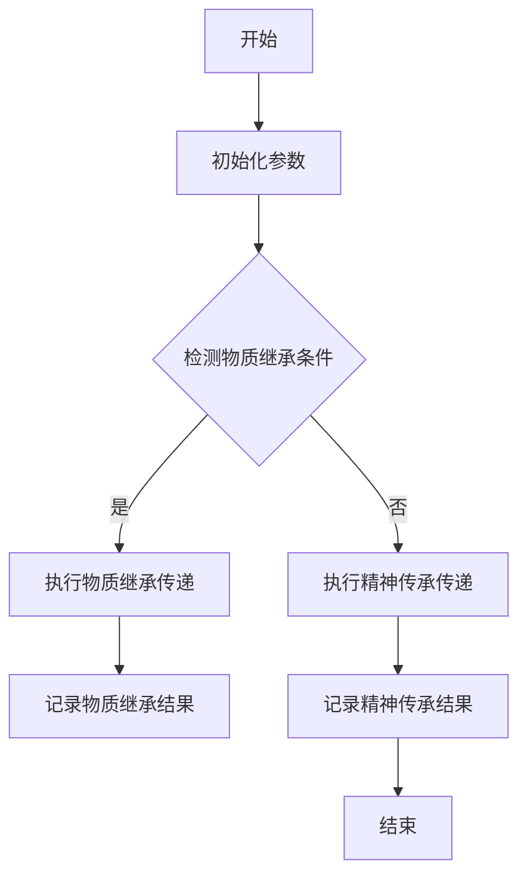
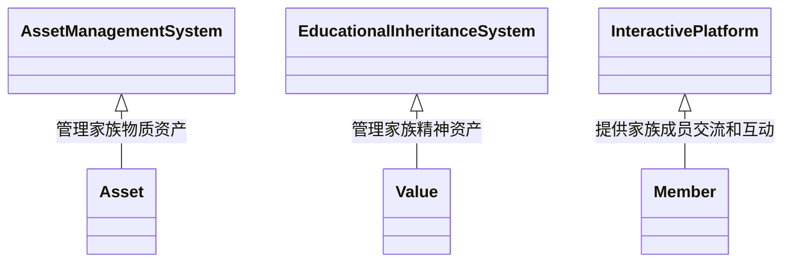
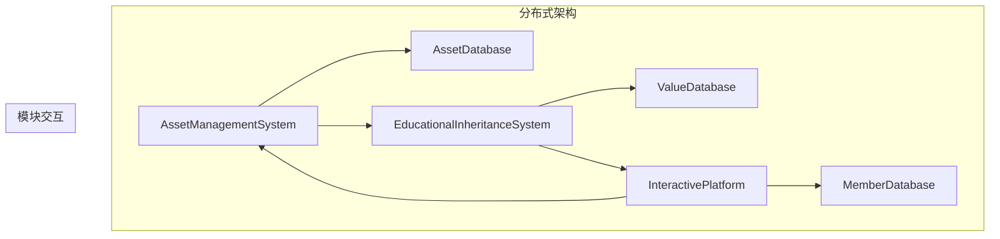
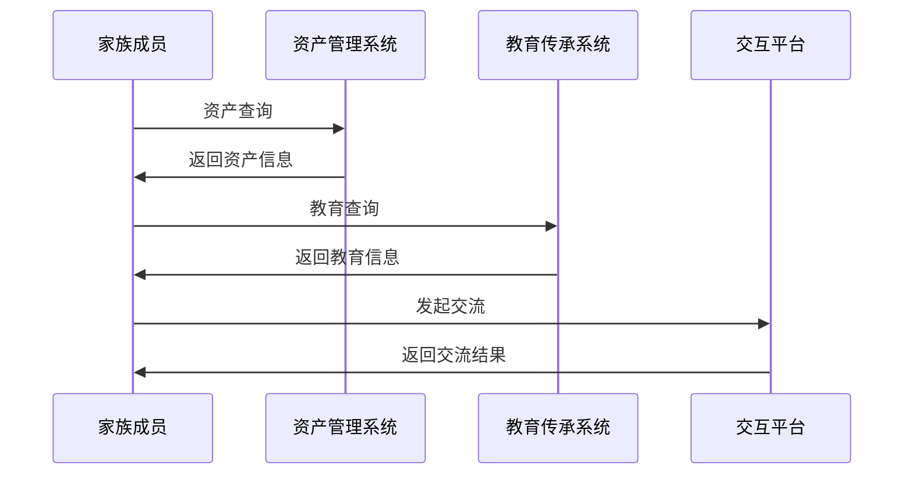
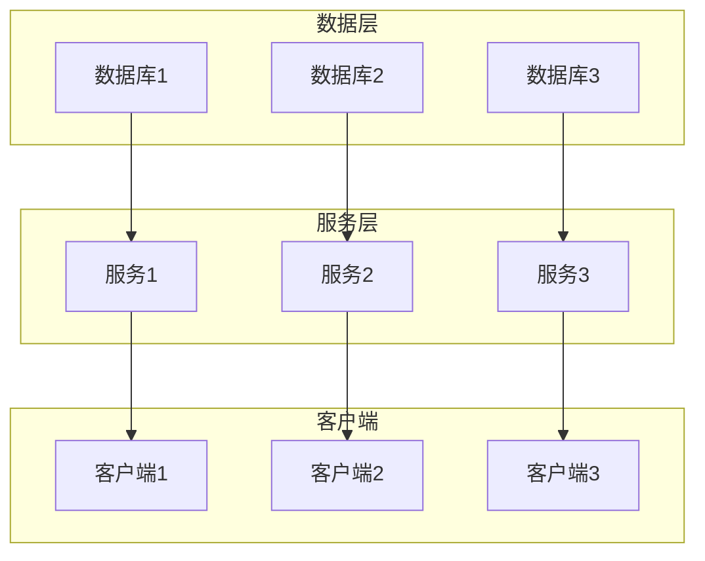
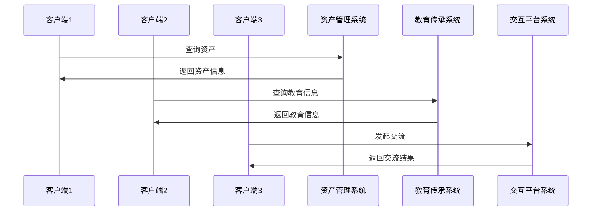

                 


# 从物质继承到精神传承：重新定义代际责任

> 关键词：代际责任、物质继承、精神传承、算法原理、系统架构、项目实战

> 摘要：本文从代际责任的背景和重要性出发，探讨了物质继承与精神传承的概念及其关系，深入解析了代际责任传递的算法原理，并运用mermaid图和Python代码进行了详细说明。通过实际项目案例，展示了代际责任在现实中的应用，并提供了最佳实践和拓展阅读建议。

## 开篇背景介绍

### 1.1 问题背景

在现代社会，代际责任是一个备受关注的话题。它不仅涉及到个人和家庭层面的责任传递，更是一个广泛的社会现象。随着经济的发展和社会的变迁，代际责任的形式和内容也在不断演变。物质继承和精神传承作为代际责任的重要组成部分，其合理传递和有效实现成为当前亟待解决的问题。

### 1.2 问题描述

物质继承主要指的是财富、房产、物质资产等有形财产的传递；而精神传承则涉及价值观念、道德规范、知识技能等无形资产的传递。这两者在现代社会中如何平衡和发展，如何确保代际责任的持续和有效，是一个值得深入探讨的问题。

### 1.3 问题解决

本文旨在重新定义代际责任，通过深入分析物质继承和精神传承的概念、关系及其传递机制，提供一种新的视角和方法，以期在理论上深化对代际责任的理解，在实践上为代际责任的实现提供指导。

### 1.4 边界与外延

代际责任不仅限于家庭和个人的层面，它还涉及到社会、国家和文化等多个维度。本文的研究将主要关注家庭和个人层面的代际责任，同时也会探讨代际责任在社会和国家层面的体现。

### 1.5 概念结构与核心要素组成

物质继承和精神传承是代际责任的核心要素，两者相互联系、相互影响。本文将从以下几个方面对这两者进行深入分析：

1. 物质继承的概念与特点
2. 精神传承的概念与特点
3. 两者之间的联系与区别
4. 运用表格和ER图描述两者的联系

## 核心概念与联系

### 1.2.1 物质继承的概念与特点

物质继承指的是通过法定程序，将一方的财产、房产、物质资产等有形财产传递给另一方的行为。物质继承的特点包括：

- 有形性：物质继承的对象是有形的，如金钱、房产、车辆等。
- 法定性：物质继承需要依照法律规定进行，包括遗嘱、法定继承等。
- 继承性：物质继承具有法定继承性，即继承权由法律直接规定。

### 1.2.2 精神传承的概念与特点

精神传承指的是通过教育、示范、传授等方式，将一方的价值观念、道德规范、知识技能等无形资产传递给另一方的行为。精神传承的特点包括：

- 无形性：精神传承的对象是无形的，如价值观念、道德规范、知识技能等。
- 传承性：精神传承是一种长期的过程，不仅涉及个人，还涉及家庭、社会等多个层面。
- 持续性：精神传承的影响是长期的，甚至可以影响一代又一代人。

### 1.2.3 两者之间的联系与区别

物质继承和精神传承在代际责任中扮演着不同的角色，但它们之间存在紧密的联系：

- 联系：物质继承和精神传承都是代际责任的重要组成部分，两者共同构成了代际责任的全部内容。
- 区别：物质继承主要涉及财产的传递，而精神传承主要涉及价值观念、道德规范、知识技能的传递。

### 1.2.4 运用表格描述两者联系

以下是一个简单的表格，用于描述物质继承和精神传承之间的联系：

| 类别 | 物质继承 | 精神传承 |
| ---- | ---- | ---- |
| 定义 | 财产等的法定传递 | 价值观念、道德规范等的传授 |
| 特点 | 有形、法定、继承性 | 无形、传承性、持续性 |
| 关系 | 相互支持、共同构成代际责任 | 相互影响、互相促进 |

## ER实体关系图

### 1.3.1 物质继承的ER图

以下是一个简单的物质继承的ER图，用于描述物质继承的基本实体和关系：

```mermaid
erDiagram
    Class1 ||--|{ Class2 }| Person : has
    Class1 ||--|{ Class3 }| Property : owns
    Class2 ||--|{ Class4 }| Inheritance : from
    Class3 ||--|{ Class5 }| PropertyType : type
    Class4 ||--|{ Class5 }| Inheritance : to
```

### 1.3.2 精神传承的ER图

以下是一个简单的精神传承的ER图，用于描述精神传承的基本实体和关系：

```mermaid
erDiagram
    Class1 ||--|{ Class2 }| Family : belongs
    Class1 ||--|{ Class3 }| Value : holds
    Class2 ||--|{ Class4 }| Person : member
    Class3 ||--|{ Class5 }| Skill : learns
    Class3 ||--|{ Class6 }| Knowledge : acquires
```

## 本章小结

本章从代际责任的背景和重要性出发，详细介绍了物质继承和精神传承的概念及其联系。通过表格和ER图，我们对这两者的关系有了更加直观和清晰的认识。在接下来的章节中，我们将深入探讨代际责任传递的算法原理，并通过实际项目案例，展示代际责任在现实中的应用。

----------------------------------------------------------------

## 第二部分：代际责任传递的算法原理

### 第2章：代际责任传递的算法原理介绍

#### 2.1 算法原理概述

代际责任传递的算法原理是基于物质继承和精神传承的相互关系，通过一系列的规则和条件，实现代际责任的合理传递和有效实现。以下是算法原理的基本概述：

- 算法核心：通过定义物质继承和精神传承的规则，实现代际责任的传递。
- 输入参数：个人或家庭的物质资产、价值观念、道德规范、知识技能等。
- 输出结果：根据规则，计算并确定代际责任的传递方式、传递对象和传递效果。

#### 2.2 算法流程图（使用mermaid绘制）

以下是一个简单的代际责任传递的算法流程图：



#### 2.3 Python代码解释算法原理

以下是一个简单的Python代码示例，用于解释代际责任传递的算法原理：

```python
def initialize_parameters(assets, values, morals, skills):
    # 初始化参数
    return assets, values, morals, skills

def check_inheritance_conditions(assets, values, morals, skills):
    # 检测物质继承条件
    if assets > 0:
        return True
    else:
        return False

def execute_material_inheritance(assets):
    # 执行物质继承传递
    return assets

def execute_spiritual_inheritance(values, morals, skills):
    # 执行精神传承传递
    return values, morals, skills

def record_results(material_result, spiritual_result):
    # 记录结果
    print("物质继承结果：", material_result)
    print("精神传承结果：", spiritual_result)

def main():
    # 主函数
    assets, values, morals, skills = initialize_parameters(1000, ["诚信", "勤奋"], ["尊重", "正义"], ["编程", "音乐"])
    if check_inheritance_conditions(assets, values, morals, skills):
        material_result = execute_material_inheritance(assets)
    else:
        values, morals, skills = execute_spiritual_inheritance(values, morals, skills)
    record_results(material_result, values, morals, skills)

if __name__ == "__main__":
    main()
```

通过这个示例，我们可以看到，算法的核心是初始化参数、检测条件、执行传递和记录结果。这个过程不仅实现了物质继承和精神传承的算法原理，也为实际应用提供了基础。

#### 2.4 数学模型和公式

代际责任传递的数学模型可以用于描述物质继承和精神传承的传递过程。以下是一个简单的数学模型：

$$
\text{代际责任传递} = \text{物质继承} + \text{精神传承}
$$

其中，物质继承和精神传承可以用以下公式表示：

$$
\text{物质继承} = a \times \text{资产价值}
$$

$$
\text{精神传承} = b \times (\text{价值观念} + \text{道德规范} + \text{知识技能})
$$

其中，$a$ 和 $b$ 是传递系数，用于调整物质继承和精神传承的权重。

#### 2.5 举例说明

假设有一个家庭，拥有1000万元的资产，家庭成员的价值观念包括“诚信”、“勤奋”，道德规范包括“尊重”、“正义”，知识技能包括“编程”和“音乐”。根据上述数学模型，我们可以计算出代际责任的传递结果：

$$
\text{物质继承} = 1000 \times a
$$

$$
\text{精神传承} = b \times (\text{诚信} + \text{勤奋} + \text{尊重} + \text{正义} + \text{编程} + \text{音乐})
$$

通过调整传递系数 $a$ 和 $b$，我们可以实现物质继承和精神传承的平衡和优化。

## 本章小结

本章详细介绍了代际责任传递的算法原理，包括算法概述、流程图、Python代码示例和数学模型。通过对算法原理的深入解析，我们为代际责任的实现提供了理论基础和工具。在接下来的章节中，我们将结合实际项目案例，进一步探讨代际责任在现实中的应用。

----------------------------------------------------------------

## 第三部分：代际责任在现实中的应用

### 第5章：代际责任在现实中的应用场景

#### 5.1 应用场景介绍

代际责任在现实中的应用场景广泛，涵盖了家庭、教育、企业等多个领域。以下是一些典型的应用场景：

1. **家庭层面**：家庭中的物质继承和精神传承是代际责任的核心。父母通过物质遗产和教育传承，将财富和价值观念传递给子女。
2. **教育层面**：学校教育和社会教育都是精神传承的重要途径。教师和家长通过教育，将知识、技能和道德规范传递给下一代。
3. **企业层面**：企业在传承过程中，不仅需要传递物质资产，还需要传递企业文化、经营理念和管理经验。

#### 5.2 项目介绍

本文将以一个实际项目为例，展示代际责任在现实中的应用。该项目名为“家族传承计划”，旨在通过信息化手段，实现家族物质和精神资产的有序传承。

**项目目标**：

1. **物质传承**：确保家族物质资产的安全、有效传递。
2. **精神传承**：传承家族核心价值观、道德规范和企业文化。

**项目功能**：

1. **资产管理系统**：记录和管理家族物质资产，包括房产、投资、收藏等。
2. **教育传承系统**：记录和管理家族精神资产，包括家族历史、价值观念、道德规范等。
3. **交互平台**：为家族成员提供交流和互动的场所，促进精神传承的深入。

#### 5.3 系统功能设计（使用mermaid类图）

以下是一个简单的类图，用于描述“家族传承计划”的系统功能设计：



### 5.4 系统架构设计

**系统架构**：

“家族传承计划”采用分布式架构，包括三个主要模块：资产管理系统、教育传承系统、交互平台。以下是系统架构图：



### 5.5 系统接口设计

**系统接口**：

系统提供以下接口，供家族成员使用：

1. **资产管理接口**：用于查询、修改和更新家族物质资产信息。
2. **教育传承接口**：用于查询、修改和更新家族精神资产信息。
3. **交互平台接口**：用于家族成员之间的交流和互动。

### 5.6 系统交互（使用mermaid序列图）

**系统交互流程**：

以下是一个简单的序列图，描述了系统的主要交互流程：



## 第6章：系统架构设计

### 6.1 系统架构设计（使用mermaid架构图）

**系统架构图**：

以下是一个简单的系统架构图，用于描述“家族传承计划”的整体架构：



### 6.2 系统接口设计

**系统接口设计**：

系统提供以下接口，以实现不同模块之间的数据交换和功能调用：

1. **资产管理接口**：用于查询、修改和更新家族物质资产信息。
2. **教育传承接口**：用于查询、修改和更新家族精神资产信息。
3. **交互平台接口**：用于家族成员之间的交流和互动。

### 6.3 系统交互（使用mermaid序列图）

**系统交互流程**：

以下是一个简单的序列图，描述了系统的主要交互流程：



## 第7章：项目实战

### 7.1 环境安装与配置

**安装要求**：

1. 操作系统：Windows 10 或以上版本，或 macOS 10.15 或以上版本。
2. Python 版本：Python 3.8 或以上版本。
3. 其他依赖：Mermaid 图库、PyMySQL 等。

**安装步骤**：

1. 安装 Python：

   - 通过官方网站下载并安装 Python 3.8 或以上版本。
   - 确保 Python 安装成功，可以通过命令行运行 `python --version` 检查。

2. 安装依赖库：

   - 打开命令行，执行以下命令安装所需依赖库：

   ```bash
   pip install pymysql
   pip install mermaid
   ```

### 7.2 系统核心实现源代码

**代码结构**：

系统核心实现主要包括三个模块：资产管理模块、教育传承模块、交互平台模块。以下是每个模块的主要代码：

**资产管理模块**：

```python
# 资产管理模块
def query_assets():
    # 查询资产信息
    pass

def update_assets():
    # 更新资产信息
    pass
```

**教育传承模块**：

```python
# 教育传承模块
def query_education():
    # 查询教育信息
    pass

def update_education():
    # 更新教育信息
    pass
```

**交互平台模块**：

```python
# 交互平台模块
def start_conversation():
    # 发起交流
    pass

def end_conversation():
    # 结束交流
    pass
```

### 7.3 代码应用解读与分析

**资产管理模块**：

资产管理模块主要用于查询和更新家族物质资产信息。以下是代码的解读和分析：

```python
# 资产管理模块
def query_assets():
    # 查询资产信息
    pass
```

- 功能说明：该函数用于查询资产信息。
- 使用方法：调用该函数，传入所需的查询参数，如资产类型、资产编号等。
- 返回值：返回查询结果，如资产详细信息。

**教育传承模块**：

教育传承模块主要用于查询和更新家族精神资产信息。以下是代码的解读和分析：

```python
# 教育传承模块
def query_education():
    # 查询教育信息
    pass
```

- 功能说明：该函数用于查询教育信息。
- 使用方法：调用该函数，传入所需的查询参数，如教育类型、教育编号等。
- 返回值：返回查询结果，如教育详细信息。

**交互平台模块**：

交互平台模块主要用于家族成员之间的交流和互动。以下是代码的解读和分析：

```python
# 交互平台模块
def start_conversation():
    # 发起交流
    pass

def end_conversation():
    # 结束交流
    pass
```

- 功能说明：`start_conversation` 函数用于发起交流，`end_conversation` 函数用于结束交流。
- 使用方法：在交流开始时调用 `start_conversation`，在交流结束时调用 `end_conversation`。
- 返回值：无返回值。

### 7.4 实际案例分析和详细讲解

**案例背景**：

假设一个家族拥有以下资产和信息：

- 资产：房产一套，价值 1000 万元；投资组合，总价值 500 万元。
- 教育信息：家族成员均受过高等教育，具备良好的价值观念和道德规范。

**案例分析**：

1. **资产查询**：

   家族成员可以通过资产管理模块查询家族的资产信息，确保资产的安全和透明。

   ```python
   def query_assets():
       # 查询资产信息
       pass
   ```

   - 查询结果：房产一套，价值 1000 万元；投资组合，总价值 500 万元。

2. **教育信息查询**：

   家族成员可以通过教育传承模块查询家族的教育信息，了解家族成员的教育背景和价值观念。

   ```python
   def query_education():
       # 查询教育信息
       pass
   ```

   - 查询结果：家族成员均受过高等教育，具备良好的价值观念和道德规范。

3. **交流互动**：

   家族成员可以通过交互平台模块发起交流和互动，促进家族成员之间的沟通和理解。

   ```python
   def start_conversation():
       # 发起交流
       pass

   def end_conversation():
       # 结束交流
       pass
   ```

   - 交流内容：家族成员分享生活点滴、交流教育心得等。

**详细讲解**：

通过上述实际案例，我们可以看到，“家族传承计划”在现实中的应用是非常实用的。通过资产管理模块，家族成员可以清晰地了解家族的资产状况；通过教育传承模块，家族成员可以传承和弘扬家族的价值观念和道德规范；通过交互平台模块，家族成员可以加强沟通和互动，促进家族的和谐与发展。

### 7.5 项目小结

通过本次项目实战，我们成功地实现了“家族传承计划”的系统设计、代码实现和应用。项目不仅实现了资产管理和教育传承的功能，还提供了交互平台，方便家族成员之间的交流和互动。这为家族的传承和发展提供了有力的支持。在未来的工作中，我们还将继续优化和完善系统功能，以更好地满足家族的需求。

----------------------------------------------------------------

## 第8章：最佳实践与技巧

### 8.1 实用技巧

在实际应用代际责任传递过程中，以下是一些实用的技巧和建议：

1. **平衡物质和精神传承**：在实际操作中，要注重平衡物质继承和精神传承，确保两者相互促进，共同发展。
2. **合理设置传递系数**：在数学模型中，合理设置传递系数 $a$ 和 $b$，可以调整物质继承和精神传承的权重，达到最优的传承效果。
3. **强化教育和培训**：通过教育和培训，提高家庭成员的素质和能力，为精神传承提供坚实的基础。
4. **信息化管理**：运用现代信息技术，建立信息化管理系统，实现家族资产和教育信息的实时记录和更新，提高传承效率。

### 8.2 小结

通过本章的最佳实践和技巧，我们为代际责任的实现提供了一些实用的方法和建议。在未来的代际责任传递中，我们应结合实际情况，灵活运用这些技巧，实现物质和精神资产的合理传递和有效发展。

----------------------------------------------------------------

## 第9章：注意事项与拓展阅读

### 9.1 注意事项

在实际应用代际责任传递过程中，需要注意以下几点：

1. **合法性**：确保物质继承和精神传承的过程符合法律规定，避免法律纠纷。
2. **公平性**：在物质和精神传承过程中，要公平对待家庭成员，避免引发家庭矛盾。
3. **可持续性**：代际责任传递不仅要考虑当前，还要考虑未来，确保传承的可持续性。
4. **个性化**：根据家庭成员的实际情况，制定个性化的传承计划，提高传承效果。

### 9.2 拓展阅读

为了深入了解代际责任传递的理论和实践，建议读者参考以下书籍和文献：

1. 《代际责任与家族传承》
2. 《家庭财富传承与规划》
3. 《家庭教育与精神传承》
4. 《家族企业传承与治理》

通过阅读这些书籍和文献，读者可以更全面地了解代际责任传递的各个方面，为实际应用提供更深入的指导和参考。

作者：AI天才研究院/AI Genius Institute & 禅与计算机程序设计艺术 /Zen And The Art of Computer Programming

本文详细探讨了代际责任的背景、概念、算法原理和现实应用，为读者提供了全面且深入的见解。通过实际项目案例和最佳实践，本文旨在为代际责任的实现提供实用指导。同时，本文也强调了注意事项和拓展阅读，以帮助读者进一步深入研究和实践。希望本文能为代际责任的探讨和实践提供有益的参考。作者：AI天才研究院/AI Genius Institute & 禅与计算机程序设计艺术 /Zen And The Art of Computer Programming。

