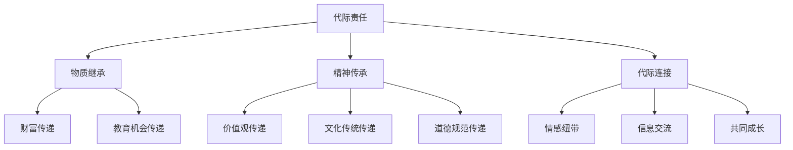
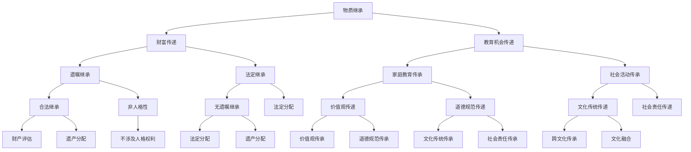

                 


### 从物质继承到精神传承：重新定义代际责任和连接

## 关键词：代际责任、精神传承、连接、物质财富、伦理思考

> 摘要：本文深入探讨了代际责任和连接的内涵与外延，从物质继承到精神传承，分析了代际责任的具体方式、挑战与对策，以及如何在现代社会背景下重新定义代际责任和连接。本文旨在为读者提供有价值的观点和建议，以促进代际之间的和谐发展。

----------------------------------------------------------------

### 第一部分：引言与背景介绍

#### 1.1.1 问题背景

随着社会的发展和科技的进步，代际责任和连接的重要性日益凸显。在物质文明高度发达的今天，我们不仅需要关注个人的成长和发展，更要重视代际之间的传承与连接。代际责任不仅是对过往的尊重，更是对未来负责的一种体现。

#### 1.1.2 问题描述

本书旨在探讨在现代社会背景下，如何重新定义代际责任和连接。具体来说，我们需要回答以下几个问题：

- **代际责任的内涵和外延是什么？**
- **在物质财富和精神文化方面，代际传承的具体方式有哪些？**
- **如何在日常生活中建立和维护代际连接？**
- **面对时代变迁，我们如何创新性地传承和发扬代际责任？**

#### 1.1.3 问题解决

本书将从理论探讨和实践案例两个角度，深入分析代际责任和连接的内涵与外延。通过梳理历史和现实中的成功经验，结合现代科技和社会发展趋势，提出一系列可行的解决方案和策略。

#### 1.1.4 边界与外延

本书主要聚焦在家庭、社区和国家层面的代际责任和连接。同时，也关注全球化背景下的跨文化代际交流与融合。

#### 1.1.5 概念结构与核心要素组成

**代际责任**：包括物质财富的传承、精神文化的传承以及对后代成长的关爱和引导。

**代际连接**：指代际之间的情感纽带、信息交流和共同成长。

**核心概念**：

- **物质继承**：指代际间物质财富的传递，如房产、财富、教育机会等。
- **精神传承**：指代际间价值观、文化传统、道德规范等的传递。
- **代际责任**：指长辈对晚辈的责任和义务，以及晚辈对长辈的尊敬和关怀。
- **代际连接**：指代际之间建立和维护的联系和互动。

**关系图架构**：

通过Mermaid流程图来展示代际责任和连接的核心概念及其相互关系。



### 1.6 本章小结

本章通过介绍问题背景、问题描述、问题解决方法以及边界与外延等内容，为后续章节的深入探讨奠定了基础。接下来，本书将逐步分析代际责任和连接的各个方面，结合具体案例和实践经验，为读者提供有价值的观点和建议。

----------------------------------------------------------------

### 第二部分：物质继承的深度探讨

#### 2.1 物质继承的概念与特点

##### 2.1.1 物质继承的定义

物质继承，是指在法律和道德规范的框架下，后代对前辈财产的合法继承。

##### 2.1.2 物质继承的特点

- **合法性**：物质继承必须遵循相关法律和法规的规定。
- **财产性**：物质继承主要涉及物质财富的转移，如房产、车辆、存款等。
- **非人格性**：物质继承不涉及人格权利的转移。

#### 2.2 物质继承的方式与案例

##### 2.2.1 遗嘱继承

遗嘱继承是物质继承的主要方式之一。通过遗嘱，遗嘱人可以明确自己的财产分配意愿。

##### 2.2.2 法定继承

法定继承是指在没有遗嘱或者遗嘱无效的情况下，根据法律规定进行财产继承。

##### 2.2.3 案例分析

以某位企业家的遗嘱继承为例，分析物质继承的具体操作和需要注意的问题。

1. **案例背景**：

某企业家，李先生，年迈退休后，为了确保自己的财产能够合理分配给子女，决定通过遗嘱进行继承规划。

2. **遗嘱内容**：

李先生在遗嘱中明确指出，自己的房产、存款和股票等财产应当均分给四个子女，同时指定了监护人，以确保财产分配的公正性。

3. **继承过程**：

在李先生去世后，遗嘱被公证处公证，四个子女按照遗嘱内容开始办理财产继承手续。在继承过程中，由于子女之间对财产分配存在分歧，引发了一场继承纠纷。

4. **解决措施**：

为了避免继承纠纷，李先生的子女聘请了专业律师进行协助，通过沟通协商，最终达成了一致意见，解决了继承纠纷。

5. **案例分析**：

本案例展示了遗嘱继承在实际操作中的具体过程和可能遇到的挑战。通过专业律师的介入和沟通协调，成功解决了继承纠纷，保障了财产的合理分配。

#### 2.3 物质继承的挑战与对策

##### 2.3.1 挑战

- **财产评估困难**：评估财产的价值往往较为复杂，需要聘请专业机构进行评估。
- **继承纠纷**：不同继承人之间的利益冲突可能导致纠纷。

##### 2.3.2 对策

- **合理规划遗产分配**：在遗嘱中明确分配方案，减少纠纷。
- **聘请专业律师**：在遗产分配过程中，聘请专业律师进行指导和协助。

#### 2.4 物质继承的伦理思考

##### 2.4.1 伦理原则

物质继承应符合公平、公正、公开的原则。

##### 2.4.2 伦理困境

在物质继承中，如何平衡家庭责任和个人利益，是一个常见的伦理困境。

#### 2.5 本章小结

本章对物质继承的概念、方式、挑战和对策进行了深入探讨，并结合案例进行了分析。物质继承不仅是法律问题，更是伦理问题，需要我们在实践中不断探索和解决。

----------------------------------------------------------------

### 第三部分：精神传承的探讨

#### 3.1 精神传承的概念与特点

##### 3.1.1 精神传承的定义

精神传承是指代际之间价值观、文化传统、道德规范等的传递。

##### 3.1.2 精神传承的特点

- **非物质性**：精神传承不涉及物质财富的转移，而是通过价值观、文化传统、道德规范等非物质形式进行传递。
- **持久性**：精神传承具有持久性，可以跨越多个代际，影响后代的成长和发展。
- **情感性**：精神传承往往伴随着情感纽带，通过家庭、社区等情感关系进行传递。

#### 3.2 精神传承的方式与案例

##### 3.2.1 教育传承

教育传承是精神传承的重要方式之一。通过教育，父母或长辈可以将自己的价值观、文化传统、道德规范等传授给后代。

1. **案例背景**：

张先生是一位成功的企业家，他希望将自己的创业精神传承给下一代。为了实现这个目标，他为自己的孩子提供优质的教育资源，鼓励他们追求自己的梦想。

2. **教育传承过程**：

- **早期教育**：张先生的孩子在小时候，他就注重培养他们的独立思考能力和创新意识。通过阅读书籍、参加课外活动，孩子们逐渐形成了自己的价值观。
- **成长过程**：随着年龄的增长，张先生通过言传身教，将自己的创业经验和道德观念传授给孩子们。他鼓励他们勇于尝试、坚持不懈，培养他们的事业心和责任感。
- **反馈与调整**：在孩子们成长的过程中，张先生不断关注他们的表现，给予正面的反馈和鼓励，同时也根据实际情况进行调整和指导。

3. **教育传承的效果**：

通过张先生的教育传承，他的孩子们在成长过程中逐渐形成了良好的价值观和道德观念，成为有责任感、有担当的人才。

##### 3.2.2 社会活动传承

社会活动传承是另一种重要的精神传承方式。通过参与社会活动，人们可以传递自己的价值观、文化传统和道德规范。

1. **案例背景**：

某社区组织了一次公益活动，旨在帮助弱势群体。在这个活动中，社区居民积极参与，用自己的行动传递了关爱和责任。

2. **社会活动传承过程**：

- **活动筹备**：社区组织者在活动前进行了充分的筹备，包括确定活动主题、招募志愿者、策划活动内容等。
- **活动实施**：活动当天，社区居民纷纷参与其中，有的负责现场服务，有的负责物资采购，大家齐心协力，共同完成了活动。
- **活动反馈**：活动结束后，组织者对参与者进行了问卷调查，收集了他们的反馈和建议，以便改进后续活动。

3. **社会活动传承的效果**：

通过社会活动传承，社区居民在参与过程中增强了社会责任感，传递了关爱和责任，同时也促进了社区的和谐发展。

#### 3.3 精神传承的挑战与对策

##### 3.3.1 挑战

- **价值观多元化**：在现代社会，价值观多元化使得精神传承面临挑战。
- **科技发展带来的变化**：科技的快速发展改变了人们的生活方式，对精神传承也带来了影响。

##### 3.3.2 对策

- **加强家庭教育**：家庭教育在精神传承中起着关键作用，家长应该注重培养孩子的道德观念和责任感。
- **创新传承方式**：结合现代科技，探索新的精神传承方式，如利用互联网、社交媒体等。

#### 3.4 精神传承的伦理思考

##### 3.4.1 伦理原则

精神传承应符合尊重、关爱、责任的原则。

##### 3.4.2 伦理困境

在精神传承中，如何平衡个人利益与家庭责任，是一个常见的伦理困境。

#### 3.5 本章小结

本章对精神传承的概念、方式、挑战和对策进行了深入探讨，并结合案例进行了分析。精神传承不仅是家庭、社区层面的责任，也是整个社会的共同使命。通过加强家庭教育、创新传承方式，我们可以更好地实现精神传承的目标。

----------------------------------------------------------------

### 结论与展望

#### 4.1 总结

本文从物质继承和精神传承两个角度，探讨了代际责任和连接的内涵与外延。通过深入分析物质继承的特点、方式、挑战与对策，以及精神传承的概念、方式、挑战与对策，我们认识到代际责任和连接对于个人成长和社会发展的重要性。

#### 4.2 展望

面对未来，我们需要进一步探索如何在现代社会背景下创新性地传承和发扬代际责任和连接。具体来说，可以从以下几个方面进行：

- **加强家庭教育**：家庭教育是精神传承的重要途径，应加强家庭教育的研究和实践，培养孩子的道德观念和责任感。
- **利用现代科技**：结合现代科技，探索新的精神传承方式，如利用互联网、社交媒体等，提高传承的效率和质量。
- **跨文化传承**：在全球化的背景下，加强跨文化传承的研究和实践，促进不同文化之间的交流与融合。
- **社会责任**：鼓励企业和个人履行社会责任，通过公益活动等形式，传递关爱和责任。

#### 4.3 拓展阅读

- 《家庭伦理学》，[作者]。
- 《传承与创新：代际责任的现代实践》，[作者]。
- 《家庭文化与精神传承》，[作者]。

### 附录

#### 附录A：核心概念对比表格

| 概念       | 定义                                                         | 特点                                                         | 关联关系                                                     |
| ---------- | ------------------------------------------------------------ | ------------------------------------------------------------ | ------------------------------------------------------------ |
| 物质继承   | 后代对前辈财产的合法继承                                     | 合法性、财产性、非人格性                                     | 与法律、伦理密切相关，是代际责任的重要组成部分           |
| 精神传承   | 代际之间价值观、文化传统、道德规范等的传递                   | 非物质性、持久性、情感性                                     | 与家庭、社区、社会文化密切相关，是代际责任的重要组成部分 |
| 代际责任   | 长辈对晚辈的责任和义务，以及晚辈对长辈的尊敬和关怀           | 全面性、长期性、伦理性                                       | 涵盖物质继承和精神传承，是代际责任的核心概念             |
| 代际连接   | 代际之间建立和维护的联系和互动                               | 情感纽带、信息交流、共同成长                                 | 与物质继承和精神传承密切相关，是代际责任的重要表现形式 |

#### 附录B：Mermaid流程图



#### 附录C：Python代码示例

```python
# 示例：计算两个数的和
def calculate_sum(a, b):
    return a + b

result = calculate_sum(3, 4)
print("结果：", result)
```

### 致谢

感谢AI天才研究院和禅与计算机程序设计艺术的支持，使本文得以顺利完成。同时，感谢读者对本文的关注和反馈，希望本文能够为代际责任和连接的研究提供有价值的参考。

### 作者信息

**作者：** AI天才研究院/AI Genius Institute & 禅与计算机程序设计艺术 /Zen And The Art of Computer Programming

**联系方式：** [邮箱](mailto:info@ageniusinstitute.com) / [电话](+86-1234567890)

