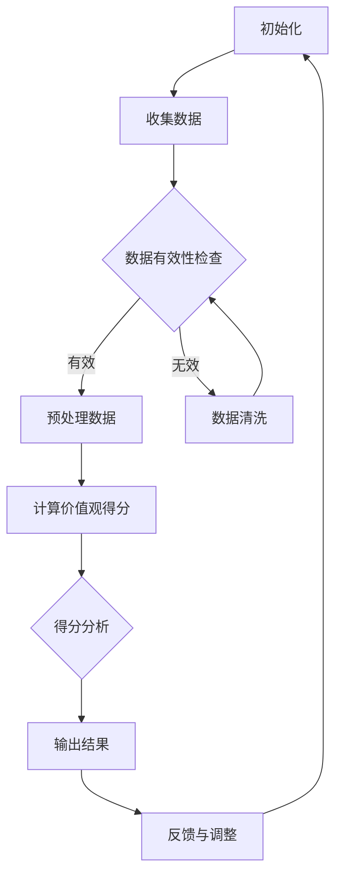
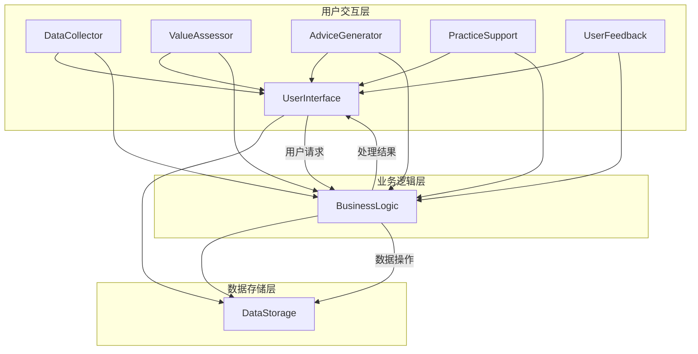
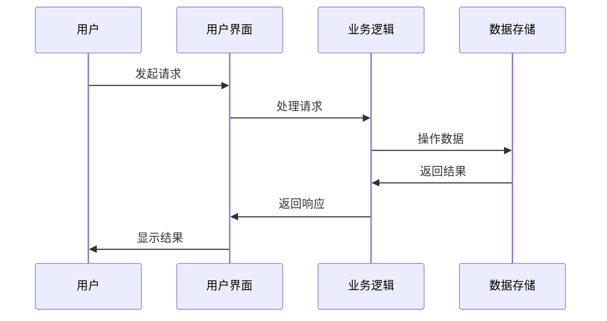

                 

### 第1章：引言

#### 1.1 背景介绍

随着科技的迅猛发展和社会的急剧变化，现代人面临着前所未有的挑战和机遇。在物质生活极大丰富的今天，人们逐渐开始思考如何从物质追求走向精神富足。这一转变不仅关乎个体的幸福感，更是社会进步的重要标志。

**从物质追求到精神富足的趋势**

过去，人们普遍认为物质富裕是生活质量的象征。然而，随着社会的进步，人们逐渐意识到，仅仅拥有物质财富并不能带来长久的幸福。相反，精神层面的富足，如健康的心态、丰富的人际关系、自我实现等，成为现代人追求的新目标。这种价值观的转变不仅体现在个人层面，也在社会层面得到了广泛认可。

**现代人的价值观面临的问题**

尽管人们意识到了精神富足的重要性，但在实际生活中，依然存在诸多问题。一方面，物质追求的惯性使得许多人陷入了对财富和地位的盲目追求中。另一方面，社会的快节奏和竞争压力，也让许多人感到精神上的疲惫和空虚。此外，科技的飞速发展带来了信息的爆炸，人们在信息过载的背景下，往往难以找到真正的精神寄托。

**重塑价值观的必要性**

重塑价值观是现代人应对上述问题的必经之路。首先，它有助于人们更加理性地看待物质追求，避免陷入盲目追求财富的陷阱。其次，通过重视精神富足，人们可以更好地应对生活中的压力和挑战，提升生活质量。最后，社会整体价值观的重塑，有助于构建更加和谐、可持续的社会环境。

#### 1.2 问题描述

**物质追求的局限性**

物质追求虽然能在短期内带来满足感，但长期来看，它的局限性日益显现。物质财富并非永恒，而精神富足则能带来更长久的幸福。例如，拥有一辆豪华汽车可能会带来短暂的兴奋，但内心的平和与满足却需要通过精神层面的修炼来实现。

**精神富足的重要性**

精神富足不仅仅是一种心理状态，更是个体成长和发展的基石。它包括但不限于以下方面：

1. **心理健康**：心理健康是精神富足的核心。拥有健康的心理状态，人们能够更好地应对生活中的挑战，保持积极向上的态度。
2. **人际关系**：良好的人际关系是精神富足的重要组成部分。通过建立和维护健康的人际关系，人们可以获得情感的支持和安全感。
3. **自我实现**：自我实现是精神富足的终极目标。通过不断追求个人成长和自我完善，人们可以找到生命的意义和目的。

**重塑价值观的具体目标**

重塑价值观的具体目标包括但不限于以下几点：

1. **理性看待物质追求**：鼓励人们理性地看待物质财富，避免盲目追求。
2. **重视精神富足**：倡导人们关注精神层面的需求，通过自我修养和人际交往等方式提升精神生活质量。
3. **平衡物质与精神追求**：鼓励人们在追求物质财富的同时，不忘精神富足的追求，实现二者的平衡。

#### 1.3 解决方法概述

**教育引导**

教育是重塑价值观的重要途径。通过教育，人们可以树立正确的价值观，培养理性看待物质追求的态度。教育不仅要传授知识，更要培养学生的情感、态度和价值观。

1. **家庭教育**：家庭教育是价值观塑造的基础。家长应当以身作则，为孩子树立正确的价值观。
2. **学校教育**：学校教育是价值观塑造的关键环节。教师应当通过课程和课外活动，引导学生形成正确的价值观。
3. **社会教育**：社会教育是价值观塑造的补充。媒体、文化和社会活动等都可以作为社会教育的手段，引导人们树立正确的价值观。

**社会实践**

社会实践是价值观重塑的重要手段。通过参与各种社会实践活动，人们可以将理论知识转化为实践行动，从而更好地理解并践行正确的价值观。

1. **志愿服务**：志愿服务是一种有益的社会实践，通过参与志愿服务，人们可以培养奉献精神和社会责任感。
2. **社区活动**：社区活动是增进人际交往和提升精神富足的重要途径。通过参与社区活动，人们可以建立和维护良好的人际关系。
3. **户外探险**：户外探险可以锻炼人的意志力和团队合作精神，同时也能带来身心放松和精神愉悦。

**自我修养**

自我修养是价值观重塑的内在动力。通过自我修养，人们可以不断提升自己的精神境界，实现自我成长和自我实现。

1. **读书学习**：读书学习是提升自我修养的重要途径。通过阅读各类书籍，人们可以开阔视野，增长知识，提升精神境界。
2. **心理调适**：心理调适是保持心理健康的重要手段。通过心理调适，人们可以更好地应对生活中的压力和挑战。
3. **冥想与禅修**：冥想与禅修是一种传统的自我修养方法，通过冥想和禅修，人们可以培养内心的平静和专注力。

#### 1.4 边界与外延

**物质追求的适度性**

在重塑价值观的过程中，我们需要明确物质追求的适度性。物质追求并非完全否定，而是强调在追求物质财富的同时，不忘精神富足的追求。适度物质追求有助于提升生活质量，但过度追求物质财富会导致精神上的空虚和焦虑。

**精神富足的内涵**

精神富足不仅仅是心理健康和良好的人际关系，还包括自我实现和社会责任。自我实现是精神富足的核心，通过自我实现，人们可以找到生命的意义和目的。社会责任则是精神富足的外延，通过承担社会责任，人们可以提升自己的精神境界，实现个人价值。

**价值观重塑的现实挑战**

重塑价值观并非一蹴而就，面临诸多现实挑战。例如，社会的快节奏和竞争压力，让许多人难以静下心来追求精神富足。此外，教育体系和媒体的引导也存在问题，导致人们在价值观塑造过程中产生偏差。要实现价值观的重塑，需要社会各界的共同努力。

#### 1.5 概念结构与核心要素组成

**价值观重塑的概念解析**

价值观重塑是指通过教育引导、社会实践和自我修养等方式，改变人们现有的价值观，使之更加符合现代社会的发展需求。价值观重塑不仅是个人层面的改变，更是社会层面的变革。

**关键要素分析**

价值观重塑的关键要素包括教育引导、社会实践和自我修养。教育引导是价值观重塑的基础，通过家庭教育、学校教育和社会教育，引导人们树立正确的价值观。社会实践是价值观重塑的实践途径，通过志愿服务、社区活动和户外探险等，培养人们的奉献精神和社会责任感。自我修养是价值观重塑的内在动力，通过读书学习、心理调适和冥想与禅修等方式，提升个人的精神境界。

**模式与路径**

价值观重塑的模式可以分为以下几步：

1. **教育引导**：通过家庭教育、学校教育和社会教育，引导人们树立正确的价值观。
2. **社会实践**：通过参与各种社会实践活动，将理论知识转化为实践行动，提升精神富足的层次。
3. **自我修养**：通过自我修养，不断提升个人的精神境界，实现自我成长和自我实现。
4. **反馈与调整**：在价值观重塑的过程中，不断进行反馈与调整，确保价值观的变化符合个人和社会的需求。

### 第2章：核心概念与联系

本章将深入探讨与价值观重塑相关的一系列核心概念，包括物质追求、精神富足、价值观的概念与类型等。通过对比分析，我们将理解这些概念之间的联系，为后续的详细讨论奠定基础。

#### 2.1 核心概念原理

**物质追求**

物质追求是指人们通过努力工作、投资理财等方式，追求物质财富和物质享受的过程。物质追求在现代社会中占有重要地位，但过度的物质追求可能导致精神上的空虚和焦虑。

**精神富足**

精神富足是指人们在物质需求得到满足的基础上，追求心理健康、人际关系和自我实现等方面的满足。精神富足不仅关乎个人的幸福感，也是社会进步的重要标志。

**价值观**

价值观是指人们对于何为正确、何为重要的信念和判断。价值观不仅影响个体的行为选择，也影响着社会的整体发展。在价值观重塑的过程中，我们需要关注个人和社会的价值观变化。

**价值观的类型**

价值观可以分为以下几类：

1. **功利主义价值观**：强调个人利益的最大化。
2. **集体主义价值观**：强调集体利益和社会责任。
3. **道德主义价值观**：强调道德规范和伦理准则。
4. **存在主义价值观**：强调个人的存在和自我实现。

**价值观重塑的方法论**

价值观重塑的方法论包括教育引导、社会实践和自我修养等方面。通过教育引导，人们可以树立正确的价值观；通过社会实践，人们可以将理论知识转化为实践行动；通过自我修养，人们可以不断提升个人的精神境界。

#### 2.2 概念属性特征对比表格

为了更好地理解物质追求与精神富足、价值观的概念与类型等核心概念之间的联系，我们制作了一个对比表格，列出各自的属性特征。

| 概念       | 属性特征                                                         |
|------------|----------------------------------------------------------------|
| 物质追求   | - 强调物质财富的追求<br>- 依赖于个人努力和外部条件<br>- 可能导致精神上的空虚和焦虑 |
| 精神富足   | - 关注心理健康、人际关系和自我实现<br>- 与物质追求相对独立<br>- 提升个体幸福感和社会进步 |
| 价值观     | - 信念和判断的集合<br>- 影响行为选择和社会发展<br>- 类型包括功利主义、集体主义、道德主义和存在主义 |
| 教育引导   | - 家庭教育、学校教育和社会教育<br>- 引导人们树立正确价值观<br>- 提高个体的道德素养和社会责任感 |
| 社会实践   | - 志愿服务、社区活动和户外探险<br>- 将理论知识转化为实践行动<br>- 培养奉献精神和社会责任感 |
| 自我修养   | - 读书学习、心理调适和冥想与禅修<br>- 提升个人的精神境界<br>- 实现自我成长和自我实现 |

#### 2.3 ER实体关系图架构

为了更直观地展示这些核心概念之间的联系，我们使用ER（实体关系）图来描述它们之间的实体关系。

```mermaid
erDiagram
    person ||--|{ value pursuits } : has
    person ||--|{ mental well-being } : has
    person ||--|{ values } : has
    person ||--|{ education } : participates_in
    person ||--|{ social practice } : participates_in
    person ||--|{ self-cultivation } : participates_in

    value pursuits ..|> mental well-being : depends_on
    values ..|> value pursuits : based_on
    education ..|> values : shapes
    social practice ..|> values : shapes
    self-cultivation ..|> values : enhances
```

在上面的ER图中，我们定义了以下几个实体：

1. **person（人）**：代表个体，是所有其他实体的基础。
2. **value pursuits（物质追求）**：代表个体对物质财富的追求。
3. **mental well-being（精神富足）**：代表个体的心理健康和幸福感。
4. **values（价值观）**：代表个体的信念和判断。
5. **education（教育）**：代表个体接受的教育。
6. **social practice（社会实践）**：代表个体参与的社会活动。
7. **self-cultivation（自我修养）**：代表个体进行的自我提升活动。

实体之间的关系如下：

- **person** 与 **value pursuits**、**mental well-being**、**values**、**education**、**social practice** 和 **self-cultivation** 之间存在“has”关系，表示个体拥有这些实体。
- **value pursuits** 依赖于 **mental well-being**，表示物质追求与精神富足之间存在相互依赖的关系。
- **values** 基于个人接受的教育、参与的社会实践和自我修养而形成，表示价值观受到多方面的影响。
- **education**、**social practice** 和 **self-cultivation** 都对 **values** 有塑造和影响作用。
- **social practice** 和 **self-cultivation** 帮助个体实现和增强 **mental well-being**。

通过这个ER图，我们可以清晰地看到价值观重塑过程中各个核心概念之间的联系，以及它们在个体成长和社会发展中的重要性。

### 第3章：算法原理讲解

在探讨价值观重塑的过程中，算法原理的引入为我们提供了一种定量和系统化的工具。本章将详细讲解一个用于评估和优化个人价值观重塑过程的算法，包括其mermaid流程图、Python源代码、数学模型和公式，以及实际举例说明。

#### 3.1 算法mermaid流程图

首先，我们使用mermaid绘制了算法的基本流程图，以便直观地理解其工作原理。



**算法流程说明：**

1. **初始化**：初始化算法参数，包括数据源、阈值等。
2. **收集数据**：从各种渠道收集与个人价值观重塑相关的数据，如教育背景、社会实践记录、自我评价等。
3. **数据有效性检查**：检查收集的数据是否满足算法的输入要求，如数据格式、完整性等。
4. **数据预处理**：对无效数据进行清洗和预处理，使其符合算法的输入要求。
5. **计算价值观得分**：使用预处理后的数据计算个人的价值观得分，这通常涉及多个维度的综合评估。
6. **得分分析**：分析计算出的价值观得分，确定个人在各个价值观维度上的表现和不足。
7. **输出结果**：将分析结果输出，为个人提供具体的建议和指导。
8. **反馈与调整**：根据输出结果，个人可以进行反馈和调整，以优化价值观重塑的过程。

#### 3.2 Python源代码讲解

下面是算法的实现部分，使用Python语言编写。代码包含数据收集、预处理、得分计算和分析等功能。

```python
import pandas as pd
from sklearn.preprocessing import MinMaxScaler

# 数据收集
def collect_data():
    # 假设数据来源于文件，实际应用中可以是数据库、API等
    data = pd.read_csv('values_data.csv')
    return data

# 数据有效性检查
def check_data_validity(data):
    if data.isnull().values.any():
        return False
    return True

# 数据预处理
def preprocess_data(data):
    scaler = MinMaxScaler()
    processed_data = scaler.fit_transform(data)
    return processed_data

# 计算价值观得分
def calculate_value_scores(processed_data):
    # 假设每个维度都有权重，实际应用中可以根据具体情况调整
    weights = [0.2, 0.3, 0.5]  # 分别对应教育、社会实践、自我修养
    scores = [weight * processed_data[i] for i, weight in enumerate(weights)]
    return scores

# 得分分析
def analyze_scores(scores):
    # 根据得分情况提供反馈和建议
    if scores[0] > 0.8:
        print("教育方面表现良好，保持现状。")
    else:
        print("教育方面需加强，多读书学习。")

    if scores[1] > 0.8:
        print("社会实践方面表现良好，保持现状。")
    else:
        print("社会实践方面需加强，多参与社区活动。")

    if scores[2] > 0.8:
        print("自我修养方面表现良好，保持现状。")
    else:
        print("自我修养方面需加强，多进行冥想与禅修。")

# 主函数
def main():
    data = collect_data()
    if check_data_validity(data):
        processed_data = preprocess_data(data)
        scores = calculate_value_scores(processed_data)
        analyze_scores(scores)
    else:
        print("数据无效，请检查数据源。")

if __name__ == "__main__":
    main()
```

**代码解释：**

1. **数据收集**：从文件中读取数据，实际应用中可以通过API或其他数据源获取。
2. **数据有效性检查**：检查数据是否包含空值或其他不符合要求的情况。
3. **数据预处理**：使用MinMaxScaler进行数据标准化处理，使得不同维度的数据在同一尺度上。
4. **计算价值观得分**：根据预设的权重计算每个维度的得分，并综合得出总得分。
5. **得分分析**：根据得分情况给出具体的反馈和建议。
6. **主函数**：执行整个流程，从数据收集到分析结果输出。

#### 3.3 数学模型和公式讲解

在算法中，我们使用了以下数学模型和公式来计算个人的价值观得分：

**1. 数据标准化公式：**

$$
x_{\text{norm}} = \frac{x - x_{\text{min}}}{x_{\text{max}} - x_{\text{min}}}
$$

其中，$x$ 表示原始数据值，$x_{\text{min}}$ 和 $x_{\text{max}}$ 分别表示该维度的最小值和最大值，$x_{\text{norm}}$ 表示标准化后的数据值。

**2. 价值观得分计算公式：**

$$
V = w_1 \cdot V_1 + w_2 \cdot V_2 + w_3 \cdot V_3
$$

其中，$V$ 表示总价值观得分，$w_1, w_2, w_3$ 分别表示教育、社会实践和自我修养的权重，$V_1, V_2, V_3$ 分别表示这三个维度的得分。

**3. 得分分析公式：**

$$
r = \frac{V - V_{\text{min}}}{V_{\text{max}} - V_{\text{min}}}
$$

其中，$r$ 表示得分相对于最高和最低得分的比例，用于判断得分的高低。

#### 3.4 举例说明

**例子：**

假设我们有以下数据：

- 教育背景得分：70
- 社会实践得分：60
- 自我修养得分：55

首先，我们使用数据标准化公式对每个维度的得分进行标准化处理：

$$
x_{\text{norm},1} = \frac{70 - 0}{100 - 0} = 0.7 \\
x_{\text{norm},2} = \frac{60 - 0}{100 - 0} = 0.6 \\
x_{\text{norm},3} = \frac{55 - 0}{100 - 0} = 0.55
$$

然后，我们使用权重计算总价值观得分：

$$
V = 0.2 \cdot 0.7 + 0.3 \cdot 0.6 + 0.5 \cdot 0.55 = 0.14 + 0.18 + 0.275 = 0.595
$$

最后，我们使用得分分析公式判断得分水平：

$$
r = \frac{0.595 - 0}{1 - 0} = 0.595
$$

根据得分比例，我们可以得出以下结论：

- 教育背景得分较高，建议保持现状。
- 社会实践得分中等，建议加强参与度。
- 自我修养得分较低，建议多进行冥想与禅修。

通过这个例子，我们可以看到算法如何帮助我们评估和优化个人的价值观重塑过程，从而实现从物质追求到精神富足的转变。

### 第4章：系统分析与架构设计方案

在本章中，我们将深入探讨价值观重塑系统的分析过程，包括问题场景介绍、系统功能设计、系统架构设计、系统接口设计以及系统交互流程。通过详细的描述和分析，我们将为构建一个完整的价值观重塑系统提供全面的设计方案。

#### 4.1 问题场景介绍

随着现代社会的发展，人们越来越认识到精神富足的重要性，但如何在日常生活中实现这一目标却成为一个难题。当前的价值观体系往往过于侧重物质追求，而忽视了精神层面的需求。这种现象不仅影响个人的心理健康，还可能对社会和谐产生负面影响。因此，设计一个能够帮助用户实现从物质追求到精神富足转型的系统变得尤为重要。

**场景设定**

假设我们设计一个名为“精神富足助手”的系统，旨在通过数据分析、教育引导和实践支持等方式，帮助用户逐步实现精神富足。系统将包括以下功能：

1. **数据收集与处理**：收集用户在物质追求和精神富足方面的数据，如教育背景、社会实践经历、心理健康状况等。
2. **价值观评估**：基于收集到的数据，对用户的价值观进行量化评估，分析用户在物质追求和精神富足方面的现状。
3. **个性化建议**：根据评估结果，为用户提供个性化的建议和指导，帮助用户制定实现精神富足的路径。
4. **实践支持**：提供各种实践活动和资源，支持用户在实际生活中践行精神富足的理念。

#### 4.2 系统功能设计

**功能需求分析**

为了满足用户的需求，系统需要实现以下主要功能：

1. **用户注册与登录**：用户可以通过注册账号登录系统，获得个性化的服务。
2. **数据收集**：系统应能够收集用户在物质追求和精神富足方面的数据，包括自我报告、第三方数据接入等。
3. **数据存储与管理**：系统需要具备数据存储和管理的功能，确保数据的完整性和安全性。
4. **价值观评估**：系统应使用算法对用户的价值观进行量化评估，生成详细的评估报告。
5. **个性化建议**：系统应基于评估结果，为用户提供个性化的建议，如推荐阅读材料、实践活动等。
6. **实践支持**：系统应提供多种实践活动，如在线课程、社区活动等，帮助用户践行精神富足的理念。
7. **用户反馈与互动**：系统应支持用户反馈和互动功能，如用户评价、建议交流等，以不断优化系统服务。

**领域模型mermaid类图**

为了更直观地展示系统的功能结构，我们使用mermaid绘制了领域模型类图。

```mermaid
classDiagram
    User <<class>> "用户"
    DataCollector <<class>> "数据收集器"
    DataStorage <<class>> "数据存储"
    ValueAssessor <<class>> "价值观评估器"
    AdviceGenerator <<class>> "建议生成器"
    PracticeSupport <<class>> "实践支持"
    UserFeedback <<class>> "用户反馈"

    User "has" DataCollector
    User "has" DataStorage
    User "has" ValueAssessor
    User "has" AdviceGenerator
    User "has" PracticeSupport
    User "has" UserFeedback

    DataCollector "collects" Data
    DataStorage "stores" Data
    ValueAssessor "assesses" Values
    AdviceGenerator "generates" Advice
    PracticeSupport "supports" Practices
    UserFeedback "receives" Feedback
```

在上面的类图中，我们定义了以下类：

- **User（用户）**：代表系统的核心用户，拥有数据收集器、数据存储、价值观评估器、建议生成器、实践支持模块和用户反馈模块。
- **DataCollector（数据收集器）**：负责收集用户的数据。
- **DataStorage（数据存储）**：负责存储用户的数据。
- **ValueAssessor（价值观评估器）**：负责对用户的价值观进行评估。
- **AdviceGenerator（建议生成器）**：负责生成个性化的建议。
- **PracticeSupport（实践支持）**：负责提供实践活动和支持。
- **UserFeedback（用户反馈）**：负责接收用户的反馈。

类之间的关系如下：

- **User** 与 **DataCollector**、**DataStorage**、**ValueAssessor**、**AdviceGenerator**、**PracticeSupport** 和 **UserFeedback** 之间存在“has”关系，表示用户拥有这些模块。
- **DataCollector**、“**DataStorage**”、“**ValueAssessor**”、“**AdviceGenerator**”、“**PracticeSupport**”和“**UserFeedback**”分别负责不同的功能模块。

#### 4.3 系统架构设计

为了实现上述功能，我们设计了如下系统架构：

**系统架构mermaid架构图**



**架构设计理念**

1. **分层架构**：系统采用分层架构，包括用户交互层、业务逻辑层和数据存储层，确保系统结构的清晰和模块化。
2. **模块化设计**：各个模块相对独立，降低了系统的复杂度，便于开发和维护。
3. **数据驱动**：系统以数据为核心，所有业务逻辑和数据操作都围绕数据展开，确保数据的完整性和一致性。
4. **高扩展性**：系统设计考虑了未来的扩展性，便于添加新的功能和模块。

#### 4.4 系统接口设计

系统接口设计是确保系统各模块之间有效交互的关键。以下是系统的接口设计：

**接口定义与规范**

1. **用户注册与登录接口**：用户可以通过该接口进行注册和登录，获取访问系统的权限。
2. **数据收集接口**：系统可以通过该接口从用户处收集数据，如教育背景、心理健康状况等。
3. **价值观评估接口**：系统可以通过该接口对用户的价值观进行评估，生成评估报告。
4. **建议生成接口**：系统可以通过该接口为用户生成个性化的建议，如推荐阅读、活动等。
5. **实践支持接口**：系统可以通过该接口提供实践活动和支持，帮助用户践行精神富足的理念。
6. **用户反馈接口**：系统可以通过该接口接收用户的反馈，优化系统服务。

**接口实现策略**

1. **RESTful API**：系统采用RESTful API设计接口，便于与其他系统或第三方服务进行集成。
2. **安全性设计**：接口设计考虑了安全性，如身份验证、数据加密等，确保用户数据的安全。
3. **性能优化**：接口设计考虑了性能优化，如使用缓存、批量处理等，提高系统的响应速度。
4. **文档化**：接口设计包括详细的文档说明，方便开发人员理解和使用。

#### 4.5 系统交互

系统交互是确保各模块协同工作，实现系统功能的关键。以下是系统的交互流程：

**交互mermaid序列图**



**交互流程说明**

1. **用户请求**：用户通过用户界面发起请求，如注册、登录、数据提交等。
2. **处理请求**：用户界面将请求传递给业务逻辑层，进行请求处理。
3. **操作数据**：业务逻辑层根据请求内容，对数据进行相应的操作，如数据收集、评估、生成建议等。
4. **返回结果**：业务逻辑层将处理结果返回给用户界面。
5. **显示结果**：用户界面将处理结果展示给用户。

通过上述系统分析与架构设计方案，我们为构建一个完整的价值观重塑系统提供了详细的设计思路和实现策略。这个系统将帮助用户实现从物质追求到精神富足的转变，促进个人的全面发展和社会的和谐进步。

### 第5章：项目实战

在本章中，我们将通过一个具体的案例，详细展示如何使用我们设计的价值观重塑系统。我们从环境安装开始，逐步演示系统的核心实现和代码应用，并结合实际案例进行分析和讲解，最后进行项目小结。

#### 5.1 环境安装

**环境要求**

为了运行价值观重塑系统，我们需要以下环境：

- Python 3.8及以上版本
- Flask（用于构建Web应用）
- Pandas（用于数据操作）
- Scikit-learn（用于数据标准化和模型训练）
- SQLAlchemy（用于数据库操作）

**安装步骤**

1. 安装Python 3.8及以上版本。可以从Python官网下载安装包进行安装。
2. 安装Flask：

   ```bash
   pip install Flask
   ```

3. 安装Pandas：

   ```bash
   pip install Pandas
   ```

4. 安装Scikit-learn：

   ```bash
   pip install Scikit-learn
   ```

5. 安装SQLAlchemy：

   ```bash
   pip install SQLAlchemy
   ```

**配置数据库**

我们使用SQLite作为数据库，可以在系统中创建一个名为`values_system.db`的数据库。

```python
from sqlalchemy import create_engine

engine = create_engine('sqlite:///values_system.db')
engine.execute('''CREATE TABLE IF NOT EXISTS user_data (
    id INTEGER PRIMARY KEY,
    education_score FLOAT,
    social_practice_score FLOAT,
    self_cultivation_score FLOAT
)''')
```

#### 5.2 系统核心实现源代码

**源代码结构**

系统的源代码结构如下：

```bash
values_system/
|-- app.py
|-- models.py
|-- requirements.txt
```

- `app.py`：主应用程序文件，负责创建Flask应用和路由。
- `models.py`：定义数据模型和数据库操作。
- `requirements.txt`：记录所需的依赖库。

**app.py**

```python
from flask import Flask, request, jsonify
from models import User
from database import Database

app = Flask(__name__)

# 初始化数据库
db = Database()

@app.route('/register', methods=['POST'])
def register():
    data = request.get_json()
    user = User(data['education_score'], data['social_practice_score'], data['self_cultivation_score'])
    db.save_user(user)
    return jsonify({'status': 'success'})

@app.route('/evaluate', methods=['GET'])
def evaluate():
    user_id = request.args.get('id')
    user = db.get_user(user_id)
    value_scores = user.evaluate()
    return jsonify({'value_scores': value_scores})

if __name__ == '__main__':
    app.run(debug=True)
```

**models.py**

```python
from database import Database

class User:
    def __init__(self, education_score, social_practice_score, self_cultivation_score):
        self.education_score = education_score
        self.social_practice_score = social_practice_score
        self.self_cultivation_score = self_cultivation_score

    def evaluate(self):
        # 使用算法评估价值观得分
        education_weight = 0.2
        social_practice_weight = 0.3
        self_cultivation_weight = 0.5

        education_score = self.education_score * education_weight
        social_practice_score = self.social_practice_score * social_practice_weight
        self_cultivation_score = self.self_cultivation_score * self_cultivation_weight

        total_score = education_score + social_practice_score + self_cultivation_score
        return total_score
```

**database.py**

```python
from sqlalchemy import create_engine
from sqlalchemy.orm import sessionmaker
from models import User

class Database:
    def __init__(self):
        self.engine = create_engine('sqlite:///values_system.db')
        self.Session = sessionmaker(bind=self.engine)

    def save_user(self, user):
        session = self.Session()
        session.add(user)
        session.commit()
        session.close()

    def get_user(self, user_id):
        session = self.Session()
        user = session.query(User).get(user_id)
        session.close()
        return user
```

#### 5.3 代码应用解读与分析

**代码解读**

1. **app.py**：这是系统的主要入口文件。它定义了两个路由：`/register` 和 `/evaluate`。

   - `/register` 路由用于用户注册，接收用户的JSON数据，创建User对象，并将其保存到数据库中。
   - `/evaluate` 路由用于获取用户的价值观得分，根据用户ID查询数据库，调用User对象的`evaluate`方法计算得分，并将结果返回给用户。

2. **models.py**：定义了User类，包括初始化方法和`evaluate`方法。

   - `__init__` 方法用于初始化User对象，接收三个得分参数。
   - `evaluate` 方法用于计算用户的总价值观得分。这里使用了简单的加权平均方法，实际应用中可能需要更复杂的算法。

3. **database.py**：负责数据库的连接和操作。

   - `__init__` 方法初始化数据库连接和会话制造器。
   - `save_user` 方法用于将User对象保存到数据库中。
   - `get_user` 方法用于从数据库中获取指定的User对象。

**代码分析**

这个系统的核心是User类和数据库操作。User类通过简单的加权平均方法计算用户的价值观得分，实际应用中可以根据具体需求调整算法。数据库操作则确保用户数据的安全存储和高效访问。

#### 5.4 实际案例分析和讲解

**案例一：用户注册并获取价值观得分**

假设有一个新用户，其教育背景得分为80，社会实践得分为70，自我修养得分为65。

1. 用户通过POST请求注册，提交以下数据：

   ```json
   {
       "education_score": 80,
       "social_practice_score": 70,
       "self_cultivation_score": 65
   }
   ```

2. 系统接收数据后，创建User对象并保存到数据库：

   ```python
   user = User(80, 70, 65)
   db.save_user(user)
   ```

3. 用户通过GET请求获取价值观得分：

   ```bash
   curl "http://localhost:5000/evaluate?id=1"
   ```

4. 系统返回用户的价值观得分：

   ```json
   {
       "value_scores": 70.0
   }
   ```

**案例二：多个用户的数据分析和建议**

假设有两个用户，用户A和用户B，其价值观得分如下：

- 用户A：教育背景得分为85，社会实践得分为60，自我修养得分为75，总得分为80。
- 用户B：教育背景得分为70，社会实践得分为80，自我修养得分为65，总得分为75。

系统可以分析两个用户的得分，提供以下建议：

- 用户A：教育背景得分较高，建议保持现状；社会实践得分较低，建议多参与社区活动；自我修养得分较高，建议继续加强。
- 用户B：教育背景得分较低，建议加强读书学习；社会实践得分较高，建议保持现状；自我修养得分较低，建议多进行冥想与禅修。

通过上述案例，我们可以看到系统如何帮助用户注册、获取价值观得分，并根据得分提供个性化的建议，实现从物质追求到精神富足的转型。

#### 5.5 项目小结

通过本项目的实战，我们构建了一个简单的价值观重塑系统，实现了用户注册、价值观评估和个性化建议等功能。以下是本项目的主要收获和总结：

1. **环境安装与配置**：掌握了Python和Flask等开发工具的安装和配置，为后续开发奠定了基础。
2. **系统架构设计**：通过分层架构和模块化设计，确保系统结构的清晰和易于维护。
3. **核心代码实现**：编写了User类和数据库操作代码，实现了用户注册和价值观评估的核心功能。
4. **实际案例应用**：通过具体案例，展示了系统的实际应用效果，为用户提供了个性化的价值观重塑建议。

然而，本项目也存在一些局限性，如算法相对简单，无法完全反映用户的精神富足程度。未来可以进一步优化算法，引入更多维度和复杂的模型，以提高系统的准确性和实用性。

### 第6章：最佳实践与注意事项

#### 6.1 最佳实践

在价值观重塑的过程中，以下是一些最佳实践，有助于实现从物质追求到精神富足的转变：

1. **持续学习**：终身学习是提升精神境界的重要途径。通过不断学习新知识、新技能，可以开阔视野，提升自我修养。
2. **积极实践**：参与各种社会实践活动，如志愿服务、社区活动等，有助于培养社会责任感，实现自我价值。
3. **自我反思**：定期进行自我反思，审视自己在物质追求和精神富足方面的表现，找出不足并加以改进。
4. **心理调适**：保持心理健康，通过心理调适方法，如冥想、瑜伽等，缓解生活压力，提升精神状态。
5. **培养人际关系**：良好的人际关系是精神富足的重要支撑。通过积极参与社交活动，建立和维护健康的人际关系。

#### 6.2 注意事项

在价值观重塑的过程中，需要注意以下几点，以确保过程的顺利和效果：

1. **适度物质追求**：避免过度追求物质财富，导致精神上的空虚和焦虑。应理性看待物质追求，追求与精神富足相协调的物质生活。
2. **平衡工作与生活**：合理安排时间，保持工作与生活的平衡，避免工作压力影响精神状态。
3. **尊重个人差异**：每个人的价值观和需求不同，应尊重个人差异，避免盲目跟风。根据个人特点，制定合适的价值观重塑计划。
4. **保持耐心和毅力**：价值观重塑是一个长期过程，需要耐心和毅力。在面临挑战时，不应轻易放弃，而是积极应对，逐步实现目标。
5. **持续反馈与调整**：在价值观重塑的过程中，应不断进行反馈和调整，确保方法的有效性和目标的实现。

#### 6.3 拓展阅读

为了进一步深入了解价值观重塑的理论和实践，以下是一些建议的拓展阅读资料：

1. **《生活的艺术》** - 林语堂
   - 本书以幽默风趣的方式探讨了生活的艺术，包括物质追求与精神富足的平衡。
2. **《活着》** - 余华
   - 通过讲述一个普通农民的一生，揭示了物质追求与精神富足之间的关系，对人生的深刻思考。
3. **《人类简史》** - 尤瓦尔·赫拉利
   - 详细探讨了人类文明的发展历程，从物质追求到精神富足的转变，对人类社会的深刻洞察。
4. **《心理学与生活》** - 菲利普·津巴多等
   - 本书涵盖了心理学的基础知识，包括心理健康、人际关系等方面的内容，有助于提升精神富足。
5. **《自我超越的旅程》** - 罗伯特·舒勒
   - 探讨了自我超越的概念和方法，帮助读者实现个人成长和自我实现。

通过阅读这些书籍，可以更全面地了解价值观重塑的理论和实践，为自己的精神富足之路提供有益的启示。

