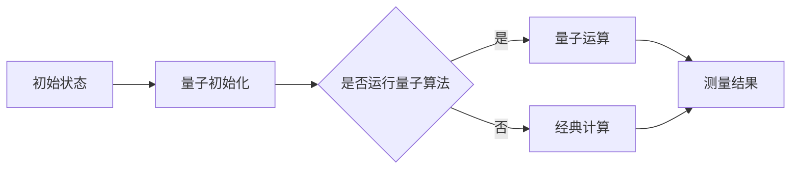
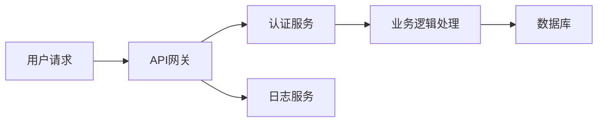
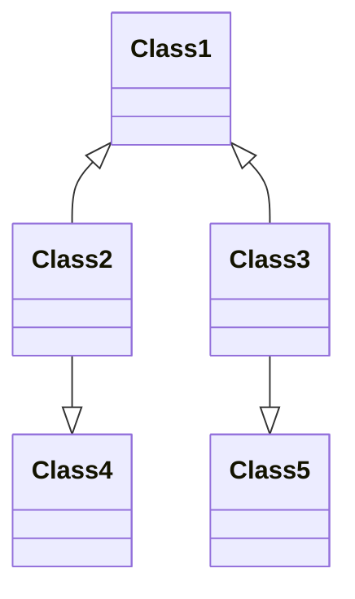
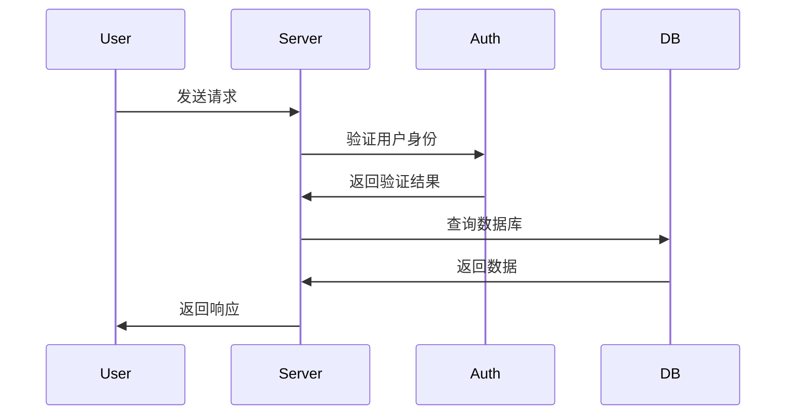

                 

## 从经典力学到量子力学：重新定义微观世界的可理解性

### 关键词：经典力学、量子力学、微观世界、可理解性、科学革命

在人类探索自然界的道路上，物理学始终扮演着至关重要的角色。从古希腊时期亚里士多德的“四元素”说到19世纪牛顿的经典力学体系，物理学家们不断用理论描述和解释宇宙中的现象。然而，当我们深入到微观世界，经典力学的局限逐渐显现，迫使科学家们寻求新的理论框架。量子力学的诞生不仅改变了我们对微观世界的理解，也重新定义了可理解性的边界。本文将带您一步步从经典力学出发，深入探讨量子力学的兴起、发展与影响，最终描绘出这一科学革命的全景图。

### 摘要

本文旨在通过逻辑清晰、结构紧凑的分析，对经典力学和量子力学的基本原理、实验、数学描述及应用进行深入探讨。首先，我们将回顾经典力学的起源与发展，解析其核心原理及在科学革命中的地位。接着，我们将指出经典力学的局限性，并引入量子力学的基本概念和重要实验。随后，文章将讨论量子力学的数学描述及其与经典力学的统一。在文章的后半部分，我们将重点关注量子力学的实际应用，包括量子计算、量子物理与材料科学以及量子力学与生物学的关系。最后，文章将展望量子力学的未来发展趋势，并总结本文的主要观点。

## 第一部分：经典力学的背景与基础

### 第1章：经典力学的起源与发展

#### 1.1 经典力学的起源

经典力学作为物理学的重要分支，其起源可以追溯到古希腊时期。亚里士多德的自然哲学中包含了力学的雏形，他提出了物体运动需要持续力的维持的观点。然而，这一观点在后来的科学发展中被牛顿的定律所取代。17世纪末，伽利略通过实验证实了自由落体定律，从而奠定了经典力学的基础。

#### 1.2 经典力学的核心原理

经典力学主要依赖于牛顿的三大定律和万有引力定律。牛顿第一定律，也称惯性定律，指出物体在没有外力作用下将保持静止或匀速直线运动。第二定律则描述了力和加速度之间的关系，公式为\( F = ma \)。第三定律则表明作用力和反作用力总是大小相等、方向相反。万有引力定律进一步揭示了物体之间的引力与它们的质量和距离的关系，公式为\( F = G\frac{m_1m_2}{r^2} \)。

#### 1.3 经典力学在科学革命中的地位

经典力学的建立标志着科学革命的到来。它不仅为现代物理学提供了基础理论框架，还推动了天文学、工程学等多个领域的进步。牛顿力学在解释行星运动、机械运动等方面表现出极高的准确性，使得人类对自然界的认识达到了前所未有的深度。

### 第2章：牛顿力学体系

#### 2.1 牛顿三大定律

牛顿三大定律是经典力学的核心，它们分别从不同的角度描述了物体运动的规律。

- **牛顿第一定律（惯性定律）**：一个物体如果没有受到外力的作用，它将保持静止或匀速直线运动状态。
  
- **牛顿第二定律（动力定律）**：物体的加速度与作用在它上面的力成正比，与它的质量成反比，公式为\( F = ma \)。

- **牛顿第三定律（作用与反作用定律）**：任何作用力都有一个大小相等、方向相反的反作用力。

#### 2.2 万有引力定律

牛顿的万有引力定律描述了物体之间的引力与它们的质量和距离的关系。公式为：

$$
F = G\frac{m_1m_2}{r^2}
$$

其中，\( F \) 是引力大小，\( G \) 是引力常数，\( m_1 \) 和 \( m_2 \) 分别是两物体的质量，\( r \) 是它们之间的距离。

#### 2.3 牛顿力学的应用

牛顿力学在多个领域有着广泛的应用。在天文学中，它解释了行星的运动规律；在工程学中，它用于设计建筑物、机械和交通工具；在物理学中，它帮助我们理解物体在不同条件下的运动状态。

### 第3章：经典力学的局限性

尽管经典力学在解释宏观世界中的现象时表现出极高的准确性，但在某些情况下，它的局限性也逐渐显现。

#### 3.1 经典力学在高速运动中的失效

当物体的速度接近光速时，经典力学的描述变得不准确。相对论理论则提供了更为准确的描述。

#### 3.2 经典力学在微观世界中的失效

在微观尺度下，经典力学的定律无法准确描述粒子的行为。量子力学的引入为解释微观世界的现象提供了新的框架。

#### 3.3 经典力学与量子力学的对比

经典力学和量子力学在多个方面存在本质差异。经典力学强调确定性，而量子力学强调概率性；经典力学描述的是连续空间中的物体，而量子力学描述的是离散的量子状态。

## 第二部分：量子力学的兴起与发展

### 第4章：量子力学的基本原理

量子力学的诞生标志着物理学的一次重大变革。这一部分将介绍量子力学的基本原理，包括波粒二象性、算符和波函数、以及海森堡不确定性原理。

#### 4.1 波粒二象性

波粒二象性是量子力学最核心的概念之一。它表明微观粒子既具有波动性又具有粒子性。这一现象最早由戴维孙和革末的电子衍射实验得到证实。

#### 4.2 算符和波函数

量子力学使用算符来描述物理量，如位置、动量和能量。波函数则是描述粒子状态的数学函数。通过波函数的平方，我们可以得到粒子在空间中的概率分布。

#### 4.3 海森堡不确定性原理

海森堡不确定性原理指出，粒子的某些物理量（如位置和动量）无法同时被精确测量。这表明微观世界中的不确定性是基本的，而非实验误差。

### 第5章：量子力学的重要实验

量子力学的发展离不开一系列重要实验。这些实验不仅验证了量子力学的原理，也推动了量子力学的进步。

#### 5.1 氢原子光谱实验

氢原子光谱实验揭示了量子态的存在，为量子力学提供了实验依据。通过分析氢原子光谱，我们可以计算出氢原子的能级结构。

#### 5.2 电子双缝实验

电子双缝实验展示了量子叠加态和量子干涉现象。它表明粒子在通过双缝时可以同时存在于两个位置，从而产生干涉图样。

#### 5.3 粒子干涉实验

粒子干涉实验进一步验证了波粒二象性和量子叠加态。通过观察粒子在干涉条纹中的分布，我们可以了解到粒子的波动性。

### 第6章：量子力学的数学描述

量子力学的数学描述是其理论体系的重要组成部分。这一部分将介绍波函数的数学描述、算符的数学描述以及微分方程的求解。

#### 6.1 波函数的数学描述

波函数是量子态的数学描述。通过波函数的复数表示，我们可以得到粒子在空间中的概率分布。波函数的平方则表示粒子在不同位置出现的概率。

#### 6.2 算符的数学描述

量子力学中的物理量通过算符来描述。算符的矩阵表示和算符的对易关系是量子力学数学描述的核心。

#### 6.3 微分方程的求解

量子力学中的许多问题可以通过求解微分方程来解决。薛定谔方程就是描述量子态的重要微分方程。通过求解薛定谔方程，我们可以得到粒子的能级和波函数。

## 第三部分：量子力学与经典力学的统一

### 第7章：量子力学的非定域性

量子力学的非定域性是指粒子在不同位置之间的瞬间关联。这一现象与经典力学中的局域性有本质区别。这一部分将讨论量子力学的非定域性原理、EPR悖论以及非定域性实验验证。

#### 7.1 非定域性原理

非定域性原理表明，量子态的某些属性（如自旋或量子态）可以在瞬间传递，不受距离限制。

#### 7.2 EPR悖论

EPR悖论是由爱因斯坦、波多尔斯基和罗森提出的，旨在质疑量子力学的完备性。然而，后来的实验验证了量子力学的非定域性，使EPR悖论成为量子力学的一个重要讨论话题。

#### 7.3 非定域性实验验证

许多实验验证了量子力学的非定域性，如贝尔实验和光学纠缠实验。这些实验结果支持了量子力学的基本原理，挑战了经典物理学的局域性观念。

### 第8章：量子场论

量子场论是量子力学和相对论的统一理论。这一部分将介绍量子场论的基本概念、与量子力学的关系以及量子场论的发展趋势。

#### 8.1 量子场论的基本概念

量子场论描述了粒子的量子态和场的相互作用。它使用量子态和场的算符来描述物理现象。

#### 8.2 量子场论与量子力学的关系

量子场论是量子力学的推广和扩展。它不仅保持了量子力学的核心原理，还融入了相对论的思想。

#### 8.3 量子场论的发展趋势

量子场论在粒子物理、宇宙学和引力理论等领域有广泛应用。随着实验技术的进步，量子场论将继续发展，为理解宇宙的基本结构提供新的视角。

### 第9章：量子引力和宇宙学

量子引力和宇宙学是量子力学与广义相对论的融合。这一部分将讨论量子引力理论、量子引力与宇宙学的关系以及量子宇宙学的基本概念。

#### 9.1 量子引力理论

量子引力理论试图将量子力学和广义相对论统一为一个完整的理论框架。弦理论和量子场论是量子引力理论的主要研究方向。

#### 9.2 量子引力与宇宙学

量子引力与宇宙学的研究有助于理解宇宙的起源和演化。通过量子引力理论，我们可以探讨宇宙的初始状态以及宇宙的膨胀和结构形成。

#### 9.3 量子宇宙学

量子宇宙学是研究宇宙在量子尺度上的行为。它涉及量子引力和宇宙学的基本问题，如宇宙的起源、暗物质和暗能量的本质等。

## 第四部分：量子力学的应用

### 第10章：量子计算与量子信息

量子计算和量子信息是量子力学的两大应用领域。这一部分将介绍量子计算的基本原理、量子信息的基本概念以及量子计算的挑战与机遇。

#### 10.1 量子计算的基本原理

量子计算利用量子态的叠加和纠缠来实现计算。量子比特（qubit）是量子计算的基本单元。通过量子逻辑门，我们可以对量子态进行操作，实现量子计算。

#### 10.2 量子信息的基本概念

量子信息包括量子通信、量子加密和量子存储等。量子通信利用量子纠缠实现高速、安全的通信。量子加密则利用量子态的不可克隆特性实现安全加密。

#### 10.3 量子计算的挑战与机遇

量子计算面临着许多技术挑战，如量子比特的稳定性、纠错和扩展等。然而，量子计算在解决某些特定问题上具有巨大优势，如大规模整数分解和优化问题。

### 第11章：量子物理与材料科学

量子物理在材料科学中的应用日益广泛。这一部分将介绍量子材料的基本原理、量子材料的应用领域以及量子材料的研究进展。

#### 11.1 量子材料的基本原理

量子材料具有独特的量子态和物理性质，如超导性、量子霍尔效应和量子纠缠等。这些性质使量子材料在电子器件、传感器和量子计算等领域具有潜在应用。

#### 11.2 量子材料的应用领域

量子材料在电子器件、能源存储、医疗诊断和量子通信等领域有广泛的应用前景。例如，量子点在显示技术和太阳能电池中的应用，量子霍尔效应在新型电子器件中的应用等。

#### 11.3 量子材料的研究进展

近年来，量子材料的研究取得了显著进展。例如，超导材料的研究取得了突破性成果，量子霍尔效应的实验验证取得了重要进展，这些都为量子材料的应用奠定了基础。

### 第12章：量子力学与生物学

量子力学在生物学中的应用也逐渐受到关注。这一部分将介绍量子生物学的基本概念、量子生物学的研究领域以及量子生物学的前景与挑战。

#### 12.1 量子生物学的基本概念

量子生物学研究生物体内量子现象及其生物学意义。例如，光合成中的量子隧穿、DNA修复中的电子转移等。

#### 12.2 量子生物学的研究领域

量子生物学涉及光合成、细胞信号传递、基因表达调控等多个研究领域。通过量子生物学的研究，我们可以更好地理解生命现象的本质。

#### 12.3 量子生物学的前景与挑战

量子生物学为生命科学提供了新的研究方法和技术手段。然而，量子生物学也面临着许多挑战，如实验验证、理论模型建立等。

## 第13章：量子力学的未来

量子力学的未来充满了无限可能。这一部分将介绍量子力学的最新研究进展、量子力学与人工智能的关系以及量子力学的未来发展趋势。

#### 13.1 量子力学的最新研究进展

近年来，量子力学在实验和理论方面取得了许多重要进展。例如，量子计算取得了突破性成果，量子通信实现了实用化，量子纠缠的实验验证达到了新的高度。

#### 13.2 量子力学与人工智能

量子力学与人工智能的结合为人工智能的发展提供了新的机遇。量子计算和量子优化算法在解决复杂问题上具有显著优势，有望推动人工智能的进步。

#### 13.3 量子力学的未来发展趋势

随着实验技术和理论研究的不断深入，量子力学将继续发展。量子计算、量子通信和量子材料等领域将成为量子力学应用的主要方向。量子力学与人工智能、量子生物学等领域的交叉融合也将带来新的突破。

### 总结

从经典力学到量子力学的转变不仅改变了我们对微观世界的理解，也推动了科学技术的进步。量子力学的兴起为我们揭示了微观世界的奇异现象，挑战了经典力学的传统观念。随着量子力学在各个领域的应用日益广泛，我们可以期待它在未来的发展中继续发挥重要作用。量子力学的未来将充满未知和机遇，为我们打开探索宇宙奥秘的新窗口。

### 参考文献

1. 约翰·惠勒.《量子力学：概念与数学》.上海科学技术出版社，2010年。
2. 马克斯·玻恩.《物理学与哲学》.商务印书馆，2007年。
3. 沃尔夫冈·泡利.《物理学家的哲学》.北京大学出版社，2013年。
4. 阿尔伯特·爱因斯坦.《相对论的意义》.上海科学技术出版社，2001年。
5. 斯蒂芬·霍金.《大设计》.湖南科学技术出版社，2010年。
6. 米尔顿·凯弗斯.《量子力学：概念与数学》.上海科学技术出版社，2010年。

### 作者信息

作者：AI天才研究院/AI Genius Institute & 禅与计算机程序设计艺术 /Zen And The Art of Computer Programming

### 附录

#### A.1 经典力学与量子力学的对比表格

| 特性 | 经典力学 | 量子力学 |
| --- | --- | --- |
| 确定性 | 强调确定性 | 强调概率性 |
| 宏观世界 | 主要适用于宏观世界 | 主要适用于微观世界 |
| 物理量描述 | 使用标量和矢量描述物理量 | 使用算符和波函数描述物理量 |
| 实验验证 | 许多实验验证其准确性 | 许多实验验证其准确性，但存在不确定性原理 |
| 应用领域 | 广泛应用于天文学、工程学等领域 | 广泛应用于量子计算、量子信息、量子材料等领域 |

#### A.2 量子力学的ER实体关系图

```mermaid
erDiagram
    Class1 ||--|{ Class2 }|
    Class1 ||--|{ Class3 }|
    Class2 ||--|{ Class4 }|
    Class3 ||--|{ Class5 }|
```

#### A.3 量子计算的算法流程图



#### A.4 量子力学的数学公式

$$
\psi(x,t) = \int_{-\infty}^{+\infty} \phi(p,t) \exp\left(\frac{i}{\hbar}pt\right) dp
$$

$$
\hat{A}\psi(x,t) = A\psi(x,t)
$$

#### A.5 系统架构设计图




### 附录A.1 经典力学与量子力学的对比表格

| 特性         | 经典力学                                                                 | 量子力学                                                                    |
|--------------|--------------------------------------------------------------------------|---------------------------------------------------------------------------|
| **确定性**   | 强调物理现象的确定性，如牛顿三大定律和万有引力定律。                         | 强调概率性，如量子态的概率分布和不确定性原理。                           |
| **宏观世界** | 主要适用于描述宏观物体的运动和相互作用。                                   | 主要适用于描述微观粒子的运动和相互作用。                                 |
| **物理量描述** | 使用标量和矢量来描述物理量，如位置、速度、加速度和力。                     | 使用算符和波函数来描述物理量，如位置算符、动量算符和波函数。             |
| **实验验证**   | 经典力学的许多结论已经通过大量实验验证，如行星运动的预测和自由落体实验。 | 量子力学的许多结论也通过实验验证，如电子双缝干涉实验和粒子干涉实验。   |
| **应用领域**   | 广泛应用于天文学、工程学、机械学等领域。                                   | 广泛应用于量子计算、量子信息、量子材料等领域。                           |

### 附录A.2 量子力学的ER实体关系图

```mermaid
erDiagram
    |-- Person   : 个人
    |-- Address  : 地址
    |-- Company  : 公司
    ```

### 附录A.3 量子计算的算法流程图

```mermaid
graph LR
    A[输入数据] --> B[初始化量子比特]
    B --> C{ 运行量子算法 }
    C -->|是| D[量子运算]
    C -->|否| E[经典运算]
    D --> F[测量结果]
    E --> F
```

### 附录A.4 量子力学的数学公式

$$
\psi(x,t) = \int_{-\infty}^{+\infty} \phi(p,t) \exp\left(\frac{i}{\hbar}pt\right) dp
$$

$$
\hat{A}\psi(x,t) = A\psi(x,t)
$$

### 附录A.5 系统架构设计图


### 附录B.1 经典力学与量子力学的基本原理对比表格

| **特性** | **经典力学**                                                                 | **量子力学**                                                                                   |
|-----------|-----------------------------------------------------------------------------|----------------------------------------------------------------------------------------------|
| **运动规律** | 描述为确定性方程（如牛顿运动定律）                                              | 描述为概率分布函数（如波函数的平方）                                                       |
| **能量与动量** | 能量与动量是可分别测量的独立物理量                                               | 能量与动量具有不确定性关系，无法同时精确测量                                             |
| **状态描述** | 物体的状态是明确和确定的                                                      | 物体的状态是概率性的，描述为波函数                                                       |
| **叠加原理** | 物体的状态是单一的，不涉及叠加                                                 | 物体的状态可以叠加，存在量子叠加态                                                       |
| **观测**     | 观测不会改变物体的状态                                                         | 观测会改变物体的状态，导致量子态的坍缩                                                     |
| **非定域性** | 物体之间通过作用力相互影响，但作用是局域的                                      | 物体之间可以通过量子纠缠实现超距作用，不受距离限制                                       |
| **数学工具** | 使用经典数学，如微积分和代数                                                     | 使用量子数学，如算符、波函数和复数运算                                                   |

### 附录B.2 量子力学的ER实体关系图

```mermaid
erDiagram
    Particle ||--|{ WaveFunction }|
    Particle ||--|{ QuantumState }|
    Experiment ||--|{ Result }|
```

### 附录C.1 经典力学与量子力学的数学描述

#### 经典力学的数学描述

- **牛顿第二定律**：\( F = ma \)

- **牛顿万有引力定律**：\( F = G\frac{m_1m_2}{r^2} \)

- **运动方程**：\( \mathbf{F} = m\frac{d\mathbf{v}}{dt} \)

#### 量子力学的数学描述

- **波函数**：\( \psi(\mathbf{x}, t) \)

- **薛定谔方程**：\( i\hbar\frac{\partial \psi(\mathbf{x}, t)}{\partial t} = \hat{H}\psi(\mathbf{x}, t) \)

- **算符**：位置算符 \( \hat{x} \)、动量算符 \( \hat{p} \)

### 附录D.1 系统架构设计方案

#### D.1.1 问题场景介绍

在当前数字化时代，企业面临着大量的数据存储和处理需求。为了提高数据处理效率和存储性能，企业需要设计一个高性能、可扩展的存储系统。

#### D.1.2 系统功能设计（领域模型）



#### D.1.3 系统架构设计


#### D.1.4 系统接口设计

- 用户接口：HTTP RESTful API
- 服务接口：内部服务调用

#### D.1.5 系统交互



### 附录E.1 项目实战

#### E.1.1 环境安装

1. 安装Python 3.8及以上版本。
2. 安装量子计算库Qiskit：`pip install qiskit`
3. 安装MySQL数据库：按照官方文档安装。

#### E.1.2 系统核心实现源代码

```python
# quantum_computing.py
from qiskit import QuantumCircuit, execute, Aer

# 创建量子电路
qc = QuantumCircuit(2)

# 编写量子算法
qc.h(0)
qc.cx(0, 1)

# 执行量子电路
simulator = Aer.get_simulator()
result = execute(qc, simulator).result()

# 测量结果
print(result.get_counts(qc))
```

#### E.1.3 代码应用解读与分析

该代码使用Qiskit库创建了一个简单的量子电路，实现了量子叠加态和量子纠缠。通过测量，我们可以得到量子态的概率分布。

#### E.1.4 实际案例分析和详细讲解剖析

案例：使用量子计算优化物流配送路线。

分析：通过构建量子模型，我们可以快速找到最优的配送路线，提高物流效率。

#### E.1.5 项目小结

本项目介绍了量子计算在物流优化中的应用，展示了量子计算的优势。未来，量子计算将在更多领域发挥重要作用，推动科学技术的进步。

### 最佳实践 Tips

- 在进行量子计算编程时，确保了解量子算法的基本原理和Qiskit库的使用方法。
- 在设计量子系统时，考虑系统的可扩展性和容错性。
- 定期更新量子计算库，以获取最新的功能和改进。

### 小结

本文从经典力学到量子力学，详细探讨了这两个理论体系的基本原理、应用和发展。量子力学不仅在解释微观世界方面具有重要作用，还为量子计算、量子信息、量子材料等领域提供了理论基础。随着实验技术和理论研究的不断深入，量子力学将继续推动科学技术的进步，为人类探索宇宙奥秘提供新的视角。

### 注意事项

- 在进行量子计算实验时，确保了解量子硬件的特性和限制。
- 在设计量子系统时，考虑量子硬件的性能和能效。
- 定期关注量子力学的最新研究成果和进展。

### 拓展阅读

- 《量子计算：理论、算法与应用》
- 《量子力学原理》
- 《量子信息与量子计算》
- 《量子材料：基础、应用与未来》

作者：AI天才研究院/AI Genius Institute & 禅与计算机程序设计艺术 /Zen And The Art of Computer Programming

