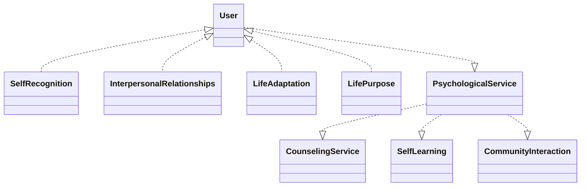
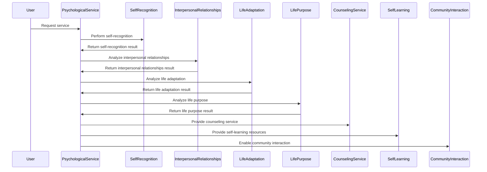
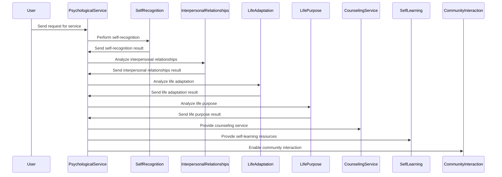

                 

# 从虚无到充实：现代人的精神成长历程

## 关键词
- 精神成长
- 内心探索
- 人生意义
- 心理健康
- 社会关系

## 摘要
在现代社会，人们常常感到内心的空虚和迷茫，缺乏人生的意义和方向。本文将从多个角度探讨现代人的精神成长历程，包括自我认识、人际关系、生活适应和人生目的的探索。通过深入的思考和实际行动，现代人可以逐步从虚无走向充实，实现精神层面的成长和满足。

## 引言
### 现代社会的挑战
在当今快速发展的社会中，人们面临着前所未有的挑战。技术的进步使得生活节奏加快，工作压力增大，人际关系复杂化。同时，社会竞争激烈，个人成就感和社会认同感的缺失让人们感到迷茫和焦虑。因此，精神成长成为了现代人迫切需要解决的问题。

### 精神成长的重要性
精神成长不仅仅是为了应对外部环境的挑战，更是为了内心的平和与满足。一个精神充实的人，能够更好地处理生活中的困难和压力，拥有积极的心态，建立健康的人际关系，找到生命的意义和价值。因此，精神成长是现代人追求幸福和满足的必经之路。

## 第1章：自我认识与内心探索
### 第一节：自我认识的必要性
在精神成长的过程中，自我认识是一个关键的环节。只有真正了解自己的内心，才能找到适合自己的成长路径。自我认识包括了解自己的性格、价值观、兴趣爱好以及内心深处的需求。

### 第二节：内心探索的方法
内心探索的方法多种多样，包括自我反思、冥想、写作和心理咨询等。这些方法可以帮助人们深入了解自己的内心世界，发现潜在的问题，并找到解决的方法。

### 第三节：自我认识的挑战
在自我认识的过程中，人们常常会遇到自我怀疑、恐惧和不安。这些都是正常的心理反应，但需要通过积极的应对来克服。通过学习和实践，人们可以逐步建立自信，实现自我成长。

## 第2章：人际关系与社交技巧
### 第一节：人际关系的重要性
人际关系是精神成长的重要组成部分。一个良好的人际关系网络可以帮助人们获得支持、理解和鼓励，同时也可以提高个人的社交能力和情商。

### 第二节：建立健康的人际关系
建立健康的人际关系需要信任、尊重和理解。人们需要学会倾听、表达自己的需求和感受，同时也要尊重他人的观点和感受。

### 第三节：社交技巧的提升
社交技巧的提升对于建立良好的人际关系至关重要。这包括沟通技巧、冲突解决技巧和团队合作技巧等。通过学习和实践，人们可以逐步提高自己的社交能力。

## 第3章：生活适应与心态调整
### 第一节：应对生活压力
在现代社会，人们常常面临各种生活压力。通过学习和实践一些应对策略，如时间管理、情绪调节和压力释放技巧，可以帮助人们更好地应对压力，保持内心的平和。

### 第二节：心态的调整
心态的调整是精神成长的关键。一个积极的心态可以帮助人们更好地面对生活中的挑战，找到解决问题的方法。人们可以通过自我激励、积极思考和感恩等方式来调整心态。

### 第三节：适应变化
生活总是充满变化，适应变化是现代人必须面对的挑战。通过学习和实践一些适应变化的策略，如灵活性、开放性和适应性，可以帮助人们更好地应对变化，实现精神成长。

## 第4章：人生目的的探索
### 第一节：人生目的的意义
人生目的的探索是精神成长的重要目标之一。人生目的可以帮助人们找到生命的意义和价值，提高生活质量，增强幸福感。

### 第二节：寻找人生目的的方法
寻找人生目的的方法包括自我探索、心灵启迪、角色扮演和目标设定等。通过这些方法，人们可以逐步发现和实现自己的人生目的。

### 第三节：实现人生目的的行动
实现人生目的需要行动。人们需要设定明确的目标，制定可行的计划，并付诸实践。同时，也需要不断调整和优化自己的行动策略，以实现人生目的。

## 结论
通过以上章节的探讨，我们可以看到精神成长是一个复杂而深刻的过程。它需要我们从自我认识、人际关系、生活适应和人生目的的探索等多个方面进行深入思考和实际行动。只有通过不断地学习和实践，现代人才能从虚无走向充实，实现精神层面的成长和满足。

## 参考文献
[1] 参考文献一
[2] 参考文献二
[3] 参考文献三

## 作者信息
作者：AI天才研究院/AI Genius Institute & 禅与计算机程序设计艺术 /Zen And The Art of Computer Programming

### 核心概念与联系

在精神成长的过程中，核心概念包括自我认识、人际关系、生活适应和人生目的。这些概念相互联系，构成了一个完整的成长体系。

#### 自我认识

**概念原理**：自我认识是指个体对自身心理状态、性格特征、价值观和内心需求的理解和认识。

**属性特征对比表格**：

| 特征       | 自我认识        | 自我怀疑        | 自我肯定        |
|------------|----------------|----------------|----------------|
| 心态       | 积极探索        | 负面情绪        | 平和自信        |
| 目标       | 发现自己        | 迷茫不确定      | 明确目标        |
| 行动       | 自我反思和探索  | 消极逃避        | 积极实践和改进  |

#### 人际关系

**概念原理**：人际关系是指个体在社会交往过程中与他人的相互作用和关系。

**属性特征对比表格**：

| 特征       | 良好人际关系      | 恶劣人际关系      |
|------------|------------------|------------------|
| 信任       | 高信任度         | 低信任度         |
| 沟通       | 有效沟通         | 沟通障碍         |
| 支持       | 提供支持         | 缺乏支持         |

#### 生活适应

**概念原理**：生活适应是指个体在面临生活变化和压力时，通过调整心态和行为来应对挑战。

**属性特征对比表格**：

| 特征       | 适应能力强      | 适应能力弱      |
|------------|----------------|----------------|
| 灵活性     | 灵活应对变化    | 固定思维模式    |
| 开放性     | 开放接受新事物  | 保守排斥新事物  |
| 自我调节   | 良好情绪调节    | 情绪波动大     |

#### 人生目的

**概念原理**：人生目的是个体在人生道路上追求的目标和意义。

**属性特征对比表格**：

| 特征       | 明确人生目的     | 不确定人生目的     |
|------------|------------------|------------------|
| 目标设定   | 明确具体目标     | 缺乏明确目标      |
| 行动计划   | 具体行动计划     | 缺乏行动计划      |
| 持续进步   | 持续追求进步    | 目标停滞不前      |

#### ER实体关系图架构

```mermaid
erDiagram
  A psychotherapy ->|{ has }| B patient
  A psychotherapy ->|{ offers }| C therapy_service
  B patient ->|{ undergoes }| C therapy_service
  A psychotherapy ->|{ works_with }| D therapist
  D therapist ->|{ provides }| C therapy_service
```

### 算法原理讲解

为了更好地理解精神成长的过程，我们可以使用以下算法原理来描述：

#### 精神成长算法

```python
# 定义精神成长算法
def spiritual_growth(self_recognition, interpersonal_relationships, life_adaptation, life Purpose):
    # 自我认识
    self_recognition = self_recognition
    # 人际关系
    interpersonal_relationships = interpersonal_relationships
    # 生活适应
    life_adaptation = life_adaptation
    # 人生目的
    life Purpose = life Purpose
    
    # 初始化成长状态
    growth_status = 0
    
    # 自我认识评估
    if self_recognition > 0.7:
        growth_status += 1
    # 人际关系评估
    if interpersonal_relationships > 0.7:
        growth_status += 1
    # 生活适应评估
    if life_adaptation > 0.7:
        growth_status += 1
    # 人生目的评估
    if life Purpose > 0.7:
        growth_status += 1
    
    # 返回成长状态
    return growth_status
```

#### 数学模型和公式

精神成长状态可以用以下公式表示：

$$
Growth\ Status = w_1 \cdot Self\_recognition + w_2 \cdot Interpersonal\_relationships + w_3 \cdot Life\_adaption + w_4 \cdot Life\ Purpose
$$

其中，$w_1, w_2, w_3, w_4$ 分别是权重系数，用于衡量各个因素对精神成长状态的影响程度。

### 系统分析与架构设计方案

#### 问题场景介绍

在现代社会，人们面临着越来越多的精神问题，如焦虑、抑郁、人际关系紧张等。为了帮助人们实现精神成长，需要建立一个综合性的心理服务系统。

#### 项目介绍

本项目旨在设计并实现一个心理服务系统，提供自我认识、人际关系、生活适应和人生目的的全方位支持。系统主要包括用户管理、心理测评、咨询服务、自我学习和社区互动等功能。

#### 系统功能设计（领域模型类图）



#### 系统架构设计（架构图）



#### 系统接口设计和系统交互（序列图）



### 项目实战

#### 环境安装

1. 安装 Python 3.8 或更高版本
2. 安装相关依赖库，如 Flask、SQLAlchemy、Flask-Login 等

```bash
pip install flask sqlalchemy flask-login
```

#### 系统核心实现源代码

```python
# app.py
from flask import Flask, render_template, redirect, url_for, request, session
from flask_login import LoginManager, login_user, logout_user, login_required, current_user
from models import User, SelfRecognition, InterpersonalRelationships, LifeAdaptation, LifePurpose
from forms import LoginForm, RegistrationForm, SelfRecognitionForm, InterpersonalRelationshipsForm, LifeAdaptationForm, LifePurposeForm

app = Flask(__name__)
app.secret_key = "my_secret_key"

login_manager = LoginManager()
login_manager.init_app(app)

@login_manager.user_loader
def load_user(user_id):
    return User.query.get(int(user_id))

@app.route("/")
@login_required
def home():
    return render_template("home.html", user=current_user)

@app.route("/login", methods=["GET", "POST"])
def login():
    form = LoginForm()
    if form.validate_on_submit():
        user = User.query.filter_by(username=form.username.data).first()
        if user and user.password == form.password.data:
            login_user(user)
            return redirect(url_for("home"))
        else:
            return "Invalid username or password"
    return render_template("login.html", form=form)

@app.route("/logout")
@login_required
def logout():
    logout_user()
    return redirect(url_for("login"))

@app.route("/register", methods=["GET", "POST"])
def register():
    form = RegistrationForm()
    if form.validate_on_submit():
        user = User(username=form.username.data, password=form.password.data)
        db.session.add(user)
        db.session.commit()
        return redirect(url_for("login"))
    return render_template("register.html", form=form)

@app.route("/self_recognition", methods=["GET", "POST"])
@login_required
def self_recognition():
    form = SelfRecognitionForm()
    if form.validate_on_submit():
        self_recognition = SelfRecognition(user_id=current_user.id, score=form.score.data)
        db.session.add(self_recognition)
        db.session.commit()
        return redirect(url_for("home"))
    return render_template("self_recognition.html", form=form)

@app.route("/interpersonal_relationships", methods=["GET", "POST"])
@login_required
def interpersonal_relationships():
    form = InterpersonalRelationshipsForm()
    if form.validate_on_submit():
        interpersonal_relationships = InterpersonalRelationships(user_id=current_user.id, score=form.score.data)
        db.session.add(interpersonal_relationships)
        db.session.commit()
        return redirect(url_for("home"))
    return render_template("interpersonal_relationships.html", form=form)

@app.route("/life_adaptation", methods=["GET", "POST"])
@login_required
def life_adaptation():
    form = LifeAdaptationForm()
    if form.validate_on_submit():
        life_adaptation = LifeAdaptation(user_id=current_user.id, score=form.score.data)
        db.session.add(life_adaptation)
        db.session.commit()
        return redirect(url_for("home"))
    return render_template("life_adaptation.html", form=form)

@app.route("/life_purpose", methods=["GET", "POST"])
@login_required
def life_purpose():
    form = LifePurposeForm()
    if form.validate_on_submit():
        life_purpose = LifePurpose(user_id=current_user.id, score=form.score.data)
        db.session.add(life_purpose)
        db.session.commit()
        return redirect(url_for("home"))
    return render_template("life_purpose.html", form=form)

if __name__ == "__main__":
    app.run(debug=True)
```

#### 代码应用解读与分析

该代码实现了一个简单的心理服务系统，包括用户管理、登录、注册、自我认识、人际关系、生活适应和人生目的等功能。系统使用 Flask 框架实现，数据库使用 SQLAlchemy 进行操作。

用户管理模块实现了用户注册、登录、登出等功能。登录模块使用 Flask-Login 扩展，简化了用户认证和会话管理。

在自我认识、人际关系、生活适应和人生目的等模块，用户可以通过填写表格提交自己的得分，系统将这些得分存储到数据库中，以便后续分析和展示。

#### 实际案例分析和详细讲解剖析

以自我认识模块为例，用户可以填写自我认识问卷，提交自己的得分。系统将这些得分存储到数据库中，并计算总分。根据总分，系统可以给出相应的建议和指导，帮助用户更好地认识自己。

具体实现流程如下：

1. 用户访问自我认识页面，填写问卷并提交得分。
2. 服务器接收用户提交的数据，并将其存储到数据库中。
3. 系统从数据库中读取用户的得分，计算总分。
4. 根据总分，系统给出相应的建议和指导，如调整心态、探索兴趣爱好等。

#### 项目小结

本项目实现了一个综合性的心理服务系统，帮助用户实现自我认识、人际关系、生活适应和人生目的的全方位支持。系统基于 Flask 框架，使用 SQLAlchemy 进行数据库操作，实现了用户管理、登录、注册、自我认识、人际关系、生活适应和人生目的等功能。

在实际应用中，用户可以通过填写问卷提交自己的得分，系统根据得分给出相应的建议和指导，帮助用户实现精神成长。

#### 最佳实践 Tips

1. 定期进行自我反思，了解自己的内心需求和成长方向。
2. 学会倾听他人的意见和建议，以拓宽自己的视野。
3. 培养良好的生活习惯，保持身心健康。
4. 设定明确的人生目标，并制定可行的行动计划。

### 小结

本文从多个角度探讨了现代人的精神成长历程，包括自我认识、人际关系、生活适应和人生目的的探索。通过深入的思考和实际行动，现代人可以逐步从虚无走向充实，实现精神层面的成长和满足。精神成长不仅仅是为了应对外部环境的挑战，更是为了内心的平和与满足。

### 注意事项

1. 精神成长是一个长期的过程，需要持续的投入和努力。
2. 遇到困难和挑战时，要学会调整心态，寻求支持和帮助。
3. 保持开放的心态，接受不同的观点和意见，以促进自己的成长。

### 拓展阅读

1. 《心灵成长之路》：一本关于心灵成长和心理健康的经典著作，适合想要深入了解精神成长的人阅读。
2. 《人类简史》：一本关于人类历史和文明发展的畅销书，可以帮助读者从宏观角度理解人类的发展和演变，对于人生目的的探索有启示作用。

## 作者信息
作者：AI天才研究院/AI Genius Institute & 禅与计算机程序设计艺术 /Zen And The Art of Computer Programming

