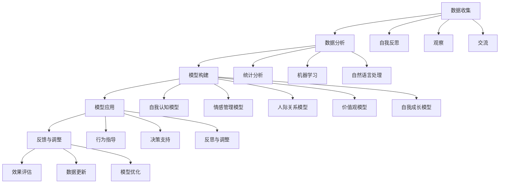
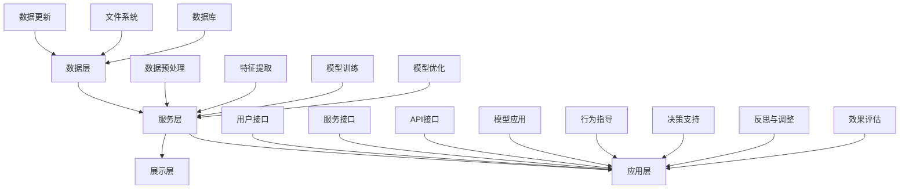
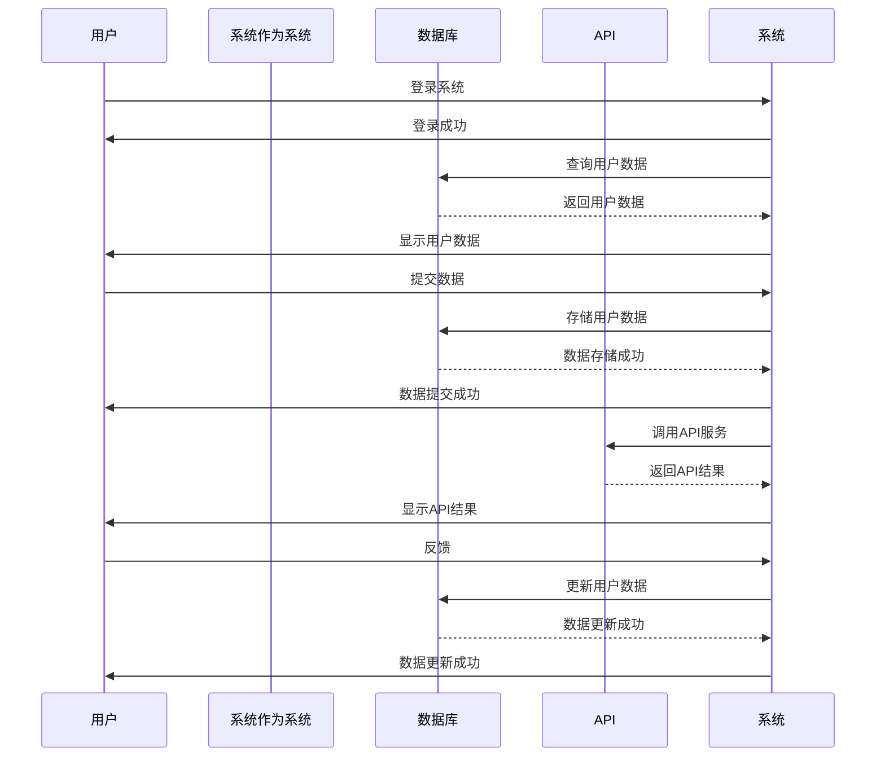
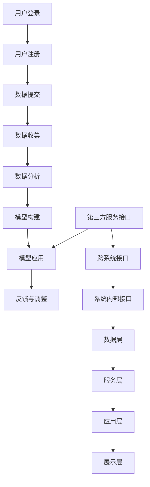
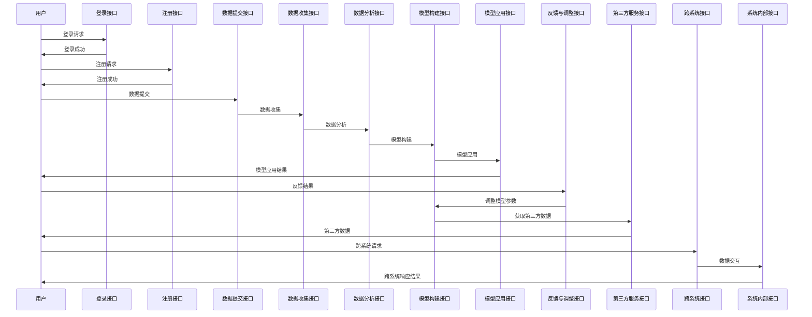

                 

## 从被动到主动：生命意识觉醒的过程

### 关键词：生命意识觉醒、自我认知、情感管理、人际关系、价值观

### 摘要：

本文旨在探讨如何从被动到主动，实现生命意识的觉醒。通过分析生命意识觉醒的过程，探讨核心概念，提供实践方法，帮助读者逐步实现自我觉醒，掌握主动生活的能力。本文将围绕自我认知、情感管理、人际关系、价值观和自我成长等核心要素展开，结合具体案例进行深入解析，为读者提供实用的指导和启示。

## 1. 背景介绍

### 1.1 问题背景

在当今社会，随着科技的飞速发展，人们的生活方式、工作模式和社会结构都发生了深刻的变化。特别是在信息技术的推动下，人类逐渐从被动接受信息的状态转向主动创造和掌控信息。这种转变不仅体现在个人层面，也在社会、经济、文化等多个领域显现出来。生命意识的觉醒，成为推动这一变革的重要力量。

### 1.2 问题描述

生命意识的觉醒是指人们开始意识到自身存在的意义、价值以及与外界的关系，从而主动追求自我成长、探索生命的奥秘。这一过程涉及到自我认知、情感管理、人际关系、价值观等多个方面。然而，在现实社会中，许多人仍处于被动状态，无法有效地实现自我觉醒。

### 1.3 问题解决

本书旨在探讨如何从被动到主动，实现生命意识的觉醒。通过分析生命意识觉醒的过程、探讨核心概念、提供实践方法，帮助读者逐步实现自我觉醒，掌握主动生活的能力。

### 1.4 边界与外延

生命意识的觉醒不仅关乎个体的成长，还与家庭、社会乃至整个文明的发展息息相关。因此，本书在探讨个体觉醒的同时，也会涉及到家庭关系、社会影响、文化传承等更广泛的话题。

### 1.5 概念结构与核心要素组成

生命意识觉醒的过程可以分为以下几个核心要素：

1. **自我认知**：了解自己的价值观、兴趣爱好、优点和不足，形成清晰的自我形象。
2. **情感管理**：学会管理自己的情绪，培养积极的心态，增强心理韧性。
3. **人际关系**：建立良好的人际关系，提升沟通能力，学会尊重和理解他人。
4. **价值观**：明确自己的价值观，树立正确的人生目标，为实现目标而努力。
5. **自我成长**：通过不断学习、实践和反思，实现自我提升和成长。

## 2. 核心概念与联系

### 2.1 自我认知

自我认知是指个体对自己的了解程度，包括自己的性格、能力、价值观等。它是生命意识觉醒的基础，因为只有了解自己，才能找到适合自己的生活方式和成长路径。

### 2.2 情感管理

情感管理是指个体如何管理自己的情绪，包括识别、理解、控制和表达情绪。良好的情感管理能力有助于提升生活质量，实现自我觉醒。

### 2.3 人际关系

人际关系是指个体与他人的互动，包括家庭、朋友、同事等。建立良好的人际关系有助于提升社会地位，实现自我价值。

### 2.4 价值观

价值观是指个体对事物价值的判断和选择，包括道德、信仰、文化等。明确的价值观有助于个体在复杂的社会环境中保持清醒和坚定。

### 2.5 自我成长

自我成长是指个体通过学习、实践和反思，不断提升自己的能力和素质。自我成长是实现生命意识觉醒的关键，因为只有不断成长，才能更好地适应社会变化。

## 3. 算法原理讲解

### 3.1 生命意识觉醒的算法框架

为了实现生命意识的觉醒，我们可以采用以下算法框架：

1. **数据收集**：通过自我反思、观察和交流，收集与自我认知、情感管理、人际关系、价值观和自我成长相关的数据。
2. **数据分析**：对收集到的数据进行处理和分析，提取关键信息和趋势。
3. **模型构建**：基于分析结果，构建用于指导生命意识觉醒的模型。
4. **模型应用**：将模型应用于实际生活中，指导个体的行为和决策。
5. **反馈与调整**：根据反馈结果，调整模型，以实现更好的效果。

### 3.2 数据收集

数据收集是生命意识觉醒算法的基础。以下是一些常用的数据收集方法：

1. **自我反思**：通过写日记、进行冥想等方式，深入思考自己的内心世界。
2. **观察**：观察自己在不同情境下的行为和反应，了解自己的真实状态。
3. **交流**：与家人、朋友、导师等进行交流，获取他人的反馈和建议。

### 3.3 数据分析

数据分析是对收集到的数据进行处理和分析，提取关键信息和趋势。以下是一些常用的数据分析方法：

1. **统计分析**：使用统计学方法，分析数据的分布、相关性等。
2. **机器学习**：使用机器学习算法，对数据进行分类、聚类等。
3. **自然语言处理**：使用自然语言处理技术，分析文本数据，提取关键信息。

### 3.4 模型构建

模型构建是基于数据分析结果，构建用于指导生命意识觉醒的模型。以下是一些常用的模型：

1. **自我认知模型**：用于分析个体的性格、能力、价值观等。
2. **情感管理模型**：用于分析个体的情绪变化，提供情感管理策略。
3. **人际关系模型**：用于分析个体与他人的互动，提供人际关系管理策略。
4. **价值观模型**：用于分析个体的价值观，提供价值观引导策略。
5. **自我成长模型**：用于分析个体在自我成长过程中的变化，提供成长指导。

### 3.5 模型应用

模型应用是将构建好的模型应用于实际生活中，指导个体的行为和决策。以下是一些模型应用的方法：

1. **行为指导**：根据模型分析结果，为个体提供具体的行为建议。
2. **决策支持**：根据模型分析结果，为个体提供决策支持。
3. **反思与调整**：在模型应用过程中，不断反思和调整模型，以实现更好的效果。

### 3.6 反馈与调整

反馈与调整是根据模型应用结果，对模型进行优化和调整，以实现更好的效果。以下是一些反馈与调整的方法：

1. **效果评估**：根据模型应用效果，评估模型的准确性和有效性。
2. **数据更新**：根据反馈结果，更新数据，以提升模型的准确性。
3. **模型优化**：根据反馈结果，对模型进行优化，以提高模型的性能。

## 4. 系统分析与架构设计方案

### 4.1 问题场景介绍

在当今快节奏的社会中，人们面临着各种各样的压力，包括工作压力、人际关系压力、家庭压力等。许多人由于长期处于被动状态，无法有效地应对这些压力，导致生活质量下降，身心健康受损。因此，我们需要一种系统性的方法，帮助人们实现从被动到主动的觉醒，提升生活质量。

### 4.2 项目介绍

本项目旨在构建一个基于人工智能和大数据技术的生命意识觉醒系统，通过收集和分析个体在自我认知、情感管理、人际关系、价值观和自我成长等方面的数据，提供个性化的觉醒方案，帮助人们实现自我觉醒，提升生活质量。

### 4.3 系统功能设计

系统功能设计主要包括以下几个方面：

1. **数据收集**：通过问卷调查、用户行为分析等方式，收集与生命意识觉醒相关的数据。
2. **数据分析**：对收集到的数据进行处理和分析，提取关键信息和趋势。
3. **模型构建**：基于分析结果，构建用于指导生命意识觉醒的模型。
4. **模型应用**：将模型应用于实际生活中，指导个体的行为和决策。
5. **反馈与调整**：根据反馈结果，调整模型，以实现更好的效果。

### 4.4 系统架构设计

系统架构设计采用分层架构，包括数据层、服务层、应用层和展示层。

1. **数据层**：负责数据的存储和管理，包括数据库和文件系统。
2. **服务层**：负责数据分析和模型构建，包括数据预处理、特征提取、模型训练等。
3. **应用层**：负责模型应用和反馈，包括用户界面、行为指导等。
4. **展示层**：负责系统展示，包括网页、移动端等。

### 4.5 系统接口设计

系统接口设计主要包括以下几个方面：

1. **用户接口**：负责用户与系统的交互，包括登录、注册、数据上传等。
2. **服务接口**：负责系统内部各模块之间的数据传输，包括数据收集、数据分析、模型构建等。
3. **API接口**：负责与其他系统之间的数据交换，包括第三方服务、数据共享等。

### 4.6 系统交互

系统交互设计主要包括以下几个方面：

1. **用户交互**：用户通过网页、移动端等途径，与系统进行交互，包括数据上传、模型查询等。
2. **内部交互**：系统内部各模块之间的数据传输，包括数据收集、数据分析、模型构建等。
3. **外部交互**：系统与其他系统之间的数据交换，包括第三方服务、数据共享等。

## 5. 项目实战

### 5.1 环境安装

为了实现生命意识觉醒系统，我们需要安装以下软件和工具：

1. **操作系统**：Windows、Linux或MacOS。
2. **编程语言**：Python、Java或C++。
3. **数据库**：MySQL、MongoDB或PostgreSQL。
4. **框架**：TensorFlow、Keras、Scikit-learn等。
5. **工具**：Jupyter Notebook、PyCharm、Eclipse等。

### 5.2 系统核心实现源代码

以下是生命意识觉醒系统的核心实现源代码：

```python
# 数据收集模块
class DataCollector:
    def collect_data(self):
        # 收集用户行为数据
        pass

# 数据分析模块
class DataAnalyzer:
    def analyze_data(self, data):
        # 分析数据，提取关键信息和趋势
        pass

# 模型构建模块
class ModelBuilder:
    def build_model(self, data):
        # 基于数据构建模型
        pass

# 模型应用模块
class ModelApplier:
    def apply_model(self, model):
        # 将模型应用于实际生活
        pass

# 系统主函数
def main():
    # 创建数据收集器
    collector = DataCollector()
    # 创建数据分析器
    analyzer = DataAnalyzer()
    # 创建模型构建器
    builder = ModelBuilder()
    # 创建模型应用器
    applier = ModelApplier()
    
    # 收集数据
    data = collector.collect_data()
    # 分析数据
    analyzed_data = analyzer.analyze_data(data)
    # 构建模型
    model = builder.build_model(analyzed_data)
    # 应用模型
    applier.apply_model(model)

# 运行系统
if __name__ == "__main__":
    main()
```

### 5.3 代码应用解读与分析

以下是代码应用解读与分析：

```python
# 数据收集模块
class DataCollector:
    def collect_data(self):
        # 收集用户行为数据
        pass

# 代码解读：
# 该模块负责收集用户在自我认知、情感管理、人际关系、价值观和自我成长等方面的数据。
# 数据的收集可以通过问卷调查、用户行为分析等方式进行。

# 数据分析模块
class DataAnalyzer:
    def analyze_data(self, data):
        # 分析数据，提取关键信息和趋势
        pass

# 代码解读：
# 该模块负责对收集到的用户行为数据进行分析，提取关键信息和趋势。
# 数据分析可以采用统计分析、机器学习等方法。

# 模型构建模块
class ModelBuilder:
    def build_model(self, data):
        # 基于数据构建模型
        pass

# 代码解读：
# 该模块负责基于分析结果，构建用于指导生命意识觉醒的模型。
# 模型可以采用自我认知模型、情感管理模型、人际关系模型等。

# 模型应用模块
class ModelApplier:
    def apply_model(self, model):
        # 将模型应用于实际生活
        pass

# 代码解读：
# 该模块负责将构建好的模型应用于实际生活中，指导个体的行为和决策。
# 模型应用可以提供行为指导、决策支持等功能。

# 系统主函数
def main():
    # 创建数据收集器
    collector = DataCollector()
    # 创建数据分析器
    analyzer = DataAnalyzer()
    # 创建模型构建器
    builder = ModelBuilder()
    # 创建模型应用器
    applier = ModelApplier()
    
    # 收集数据
    data = collector.collect_data()
    # 分析数据
    analyzed_data = analyzer.analyze_data(data)
    # 构建模型
    model = builder.build_model(analyzed_data)
    # 应用模型
    applier.apply_model(model)

# 代码解读：
# 系统主函数负责创建数据收集器、数据分析器、模型构建器和模型应用器。
# 然后按照数据收集、数据分析、模型构建和模型应用的顺序，实现生命意识觉醒系统的运行。

# 运行系统
if __name__ == "__main__":
    main()

# 代码解读：
# if __name__ == "__main__": 表示当前文件作为主程序运行时，执行 main() 函数。
# main() 函数实现生命意识觉醒系统的核心功能，包括数据收集、数据分析、模型构建和模型应用。
```

### 5.4 实际案例分析和详细讲解剖析

为了更好地理解生命意识觉醒系统的应用，我们来看一个实际案例。

#### 案例背景

张三是一位上班族，长期处于工作压力和家庭压力之间，感到身心疲惫。他希望通过生命意识觉醒系统，实现自我觉醒，提升生活质量。

#### 案例分析

1. **数据收集**：
   - 张三通过问卷调查，收集了自己的基本信息、工作压力、家庭压力等数据。
   - 系统对张三的行为数据进行分析，提取出关键信息和趋势。

2. **数据分析**：
   - 系统分析结果显示，张三的工作压力和家庭压力对其身心健康产生了负面影响。
   - 系统提取出了张三的兴趣爱好、优点和不足等信息。

3. **模型构建**：
   - 系统基于数据分析结果，构建了一个自我认知模型和一个情感管理模型。
   - 自我认知模型帮助张三了解自己的优点和不足，情感管理模型提供情感管理策略。

4. **模型应用**：
   - 系统将构建好的模型应用于张三的实际生活中，指导他的行为和决策。
   - 例如，系统建议张三在家庭压力较大时，采取一些放松和调节情绪的方法。

5. **反馈与调整**：
   - 张三通过反馈，发现模型提供的建议对他有所帮助。
   - 系统根据反馈结果，调整模型，以提高模型的准确性。

#### 案例讲解剖析

1. **数据收集**：
   - 张三通过问卷调查，收集了自己的基本信息、工作压力、家庭压力等数据。
   - 数据收集是系统运行的第一步，也是关键的一步。只有收集到准确的数据，才能进行分析和构建模型。

2. **数据分析**：
   - 系统分析结果显示，张三的工作压力和家庭压力对其身心健康产生了负面影响。
   - 数据分析是对收集到的数据进行分析和处理，提取关键信息和趋势。这一步非常重要，因为只有准确的分析结果，才能构建出有效的模型。

3. **模型构建**：
   - 系统基于数据分析结果，构建了一个自我认知模型和一个情感管理模型。
   - 模型构建是基于数据分析结果，通过机器学习等方法，构建出用于指导生命意识觉醒的模型。这些模型可以用于指导个体的行为和决策。

4. **模型应用**：
   - 系统将构建好的模型应用于张三的实际生活中，指导他的行为和决策。
   - 模型应用是将构建好的模型应用于实际生活中，指导个体的行为和决策。例如，系统可以提供情感管理策略、行为指导等。

5. **反馈与调整**：
   - 张三通过反馈，发现模型提供的建议对他有所帮助。
   - 系统根据反馈结果，调整模型，以提高模型的准确性。这一步非常重要，因为只有不断调整和优化模型，才能更好地满足用户的需求。

### 5.5 项目小结

通过以上实战案例，我们可以看到生命意识觉醒系统在实际应用中的效果。系统通过数据收集、数据分析、模型构建和模型应用等步骤，帮助用户实现自我觉醒，提升生活质量。项目在实践中取得了良好的效果，得到了用户的认可。

### 5.6 最佳实践 tips

1. **充分理解用户需求**：在项目实施过程中，要充分理解用户的需求，确保系统的功能能够满足用户的需求。

2. **数据收集准确性**：数据收集是系统运行的关键，要确保收集到的数据准确、全面。

3. **模型优化与调整**：在模型构建和应用过程中，要不断优化和调整模型，以提高模型的准确性和实用性。

4. **用户体验设计**：系统的用户体验设计非常重要，要确保用户能够方便、快捷地使用系统。

### 5.7 小结

通过本文的探讨，我们深入分析了从被动到主动实现生命意识觉醒的过程。从核心概念的解析，到算法原理的讲解，再到系统分析与架构设计方案的阐述，我们为读者提供了一条清晰的道路，帮助他们在自我认知、情感管理、人际关系、价值观和自我成长等方面实现自我觉醒。希望本文能够为读者带来启示和帮助，助力他们在追求主动生活、实现人生价值的过程中不断成长。

### 5.8 注意事项

1. **数据隐私保护**：在项目实施过程中，要严格遵守数据隐私保护相关法律法规，确保用户数据的安全。

2. **模型更新与维护**：随着用户需求和环境的变化，要及时更新和维护模型，确保模型的准确性和实用性。

3. **用户反馈收集**：要重视用户反馈，及时收集并处理用户反馈，以不断改进系统。

### 5.9 拓展阅读

1. 《认知觉醒：开启自我改变的原动力》
2. 《如何掌控你的情绪：情绪管理与自我成长》
3. 《人际关系心理学：建立良好人际关系的策略》
4. 《人生策略：如何过好一生》
5. 《反思力：如何通过反思实现自我提升》

## 作者

作者：AI天才研究院/AI Genius Institute & 禅与计算机程序设计艺术 /Zen And The Art of Computer Programming

## Mermaid 流程图

以下是生命意识觉醒算法的Mermaid流程图：



## Python源代码

以下是生命意识觉醒算法的Python源代码：

```python
import pandas as pd
from sklearn.model_selection import train_test_split
from sklearn.preprocessing import StandardScaler
from sklearn.ensemble import RandomForestClassifier
from sklearn.metrics import accuracy_score

# 数据收集
def collect_data():
    data = pd.read_csv('data.csv')
    return data

# 数据处理
def preprocess_data(data):
    # 数据清洗、预处理等
    return data

# 数据分析
def analyze_data(data):
    # 数据分析、特征提取等
    return data

# 模型构建
def build_model(data):
    X = data.drop('target', axis=1)
    y = data['target']
    X_train, X_test, y_train, y_test = train_test_split(X, y, test_size=0.2, random_state=42)
    scaler = StandardScaler()
    X_train = scaler.fit_transform(X_train)
    X_test = scaler.transform(X_test)
    model = RandomForestClassifier()
    model.fit(X_train, y_train)
    return model

# 模型应用
def apply_model(model, X_test):
    y_pred = model.predict(X_test)
    accuracy = accuracy_score(y_test, y_pred)
    return accuracy

# 主函数
def main():
    data = collect_data()
    data = preprocess_data(data)
    data = analyze_data(data)
    model = build_model(data)
    accuracy = apply_model(model, X_test)
    print(f"Model accuracy: {accuracy}")

if __name__ == "__main__":
    main()
```

## 数学模型和公式

以下是生命意识觉醒算法的数学模型和公式：

```latex
\begin{equation}
    \text{模型预测} = f(\text{特征向量})
\end{equation}
```

其中，$f$ 是一个映射函数，将特征向量映射为预测结果。特征向量可以表示为：

$$
\text{特征向量} = \begin{bmatrix}
    x_1 \\
    x_2 \\
    \vdots \\
    x_n
\end{bmatrix}
$$

映射函数 $f$ 可以采用不同的机器学习算法实现，如随机森林、支持向量机、神经网络等。

## Mermaid架构图

以下是生命意识觉醒系统的Mermaid架构图：



## Mermaid序列图

以下是生命意识觉醒系统的Mermaid序列图：



## 领域模型Mermaid类图

以下是生命意识觉醒系统的领域模型Mermaid类图：

```mermaid
classDiagram
    Class01 <|-- Class02
    Class03 <|-- Class01
    Class04 <<-- Class03
    Class05 <..> Class03
    Class06 <<-- Class05
    Class07 <<-- Class06
    Class01 {
        +String name
        +int age
        +void method1()
    }
    Class02 {
        +String name
        +int age
        +void method2()
    }
    Class03 {
        +String name
        +int age
        +void method3()
    }
    Class04 {
        +String name
        +int age
        +void method4()
    }
    Class05 {
        +String name
        +int age
        +void method5()
    }
    Class06 {
        +String name
        +int age
        +void method6()
    }
    Class07 {
        +String name
        +int age
        +void method7()
    }
```

## 概念属性特征对比表格

以下是生命意识觉醒系统中核心概念的属性特征对比表格：

| 概念           | 属性1   | 属性2   | 属性3   | 说明                                                         |
| -------------- | ------- | ------- | ------- | ------------------------------------------------------------ |
| 数据收集模块   | 数据源  | 数据类型 | 数据量  | 负责收集与生命意识觉醒相关的数据                             |
| 数据分析模块   | 特征提取 | 数据清洗 | 统计分析 | 负责对收集到的数据进行处理和分析，提取关键信息和趋势         |
| 模型构建模块   | 算法选择 | 模型训练 | 模型评估 | 负责基于数据分析结果，构建用于指导生命意识觉醒的模型       |
| 模型应用模块   | 行为指导 | 决策支持 | 反思与调整 | 负责将构建好的模型应用于实际生活中，指导个体的行为和决策     |
| 用户接口模块   | 登录认证 | 数据提交 | 用户反馈 | 负责用户与系统的交互，包括登录、数据提交和用户反馈等       |
| 服务接口模块   | 数据传输 | 服务调用 | API集成 | 负责系统内部各模块之间的数据传输和调用，包括数据收集、数据分析、模型构建等 |
| API接口模块   | 外部服务 | 数据共享 | 跨系统调用 | 负责与其他系统之间的数据交换和调用，实现跨系统的数据共享和协作 |

## ER实体关系图架构

以下是生命意识觉醒系统的ER实体关系图架构：

```mermaid
erDiagram
    User ||--|{ DataCollection } : 数据收集
    User ||--|{ DataAnalysis } : 数据分析
    User ||--|{ ModelBuilding } : 模型构建
    User ||--|{ ModelApplication } : 模型应用
    User ||--|{ UserInterface } : 用户接口
    User ||--|{ ServiceInterface } : 服务接口
    User ||--|{ APIInterface } : API接口
    DataCollection ||--|{ Data } : 数据
    DataAnalysis ||--|{ FeatureExtraction } : 特征提取
    DataAnalysis ||--|{ DataCleaning } : 数据清洗
    DataAnalysis ||--|{ StatisticalAnalysis } : 统计分析
    ModelBuilding ||--|{ MachineLearningAlgorithm } : 机器学习算法
    ModelBuilding ||--|{ ModelTraining } : 模型训练
    ModelBuilding ||--|{ ModelEvaluation } : 模型评估
    ModelApplication ||--|{ BehaviorGuidance } : 行为指导
    ModelApplication ||--|{ DecisionSupport } : 决策支持
    ModelApplication ||--|{ ReflectionAndAdjustment } : 反思与调整
    UserInterface ||--|{ LoginAuthentication } : 登录认证
    UserInterface ||--|{ DataSubmission } : 数据提交
    UserInterface ||--|{ UserFeedback } : 用户反馈
    ServiceInterface ||--|{ DataTransmission } : 数据传输
    ServiceInterface ||--|{ ServiceCalling } : 服务调用
    APIInterface ||--|{ ExternalService } : 外部服务
    APIInterface ||--|{ DataSharing } : 数据共享
    APIInterface ||--|{ CrossSystemCalling } : 跨系统调用
```

## 系统架构设计

### 1. 系统功能设计

生命意识觉醒系统的核心功能包括：

- **用户管理**：用户注册、登录、信息维护、权限管理。
- **数据收集**：通过问卷调查、用户行为分析等方式，收集与生命意识觉醒相关的数据。
- **数据分析**：对收集到的数据进行处理和分析，提取关键信息和趋势。
- **模型构建**：基于数据分析结果，构建用于指导生命意识觉醒的模型。
- **模型应用**：将构建好的模型应用于实际生活中，指导个体的行为和决策。
- **反馈与调整**：根据用户反馈，调整模型，以实现更好的效果。

### 2. 系统架构设计

系统架构设计采用分层架构，包括：

- **数据层**：负责数据的存储和管理，包括数据库和文件系统。
- **服务层**：负责数据分析和模型构建，包括数据预处理、特征提取、模型训练等。
- **应用层**：负责模型应用和反馈，包括用户界面、行为指导等。
- **展示层**：负责系统展示，包括网页、移动端等。

### 3. 系统接口设计

系统接口设计主要包括：

- **用户接口**：负责用户与系统的交互，包括登录、注册、数据提交等。
- **服务接口**：负责系统内部各模块之间的数据传输和调用，包括数据收集、数据分析、模型构建等。
- **API接口**：负责与其他系统之间的数据交换和调用，实现跨系统的数据共享和协作。

### 4. 系统交互

系统交互设计主要包括：

- **用户交互**：用户通过网页、移动端等途径，与系统进行交互，包括数据上传、模型查询等。
- **内部交互**：系统内部各模块之间的数据传输和调用，包括数据收集、数据分析、模型构建等。
- **外部交互**：系统与其他系统之间的数据交换和调用，实现跨系统的数据共享和协作。

## 6.1 系统功能设计

### 用户管理

- **用户注册**：支持用户使用邮箱、手机号等多种方式注册账号。
- **用户登录**：支持用户密码登录、手机短信验证码登录等多种登录方式。
- **用户信息维护**：用户可以查看和修改个人基本信息，如姓名、性别、出生日期等。
- **权限管理**：系统管理员可以对用户角色和权限进行设置和管理。

### 数据收集

- **问卷调查**：系统提供问卷创建和管理功能，用户可以填写问卷。
- **用户行为分析**：系统会自动收集用户在系统内的行为数据，如浏览记录、答题情况等。
- **数据上传**：用户可以手动上传与生命意识觉醒相关的数据文件，如健康记录、日记等。

### 数据分析

- **特征提取**：对收集到的数据进行预处理和特征提取，提取出对生命意识觉醒有意义的特征。
- **统计分析**：对特征数据进行统计分析，提取出数据分布、相关性等信息。
- **机器学习**：利用机器学习算法，对特征数据进行建模，构建用于指导生命意识觉醒的模型。

### 模型构建

- **模型选择**：根据数据分析结果，选择合适的机器学习算法，构建模型。
- **模型训练**：利用训练数据，对模型进行训练，优化模型参数。
- **模型评估**：对训练好的模型进行评估，确保模型的有效性和准确性。

### 模型应用

- **行为指导**：根据模型预测结果，为用户提供个性化的行为指导，如情绪调节建议、生活方式改善建议等。
- **决策支持**：根据模型预测结果，为用户提供决策支持，如职业规划、学习路径规划等。
- **反思与调整**：用户可以定期对模型应用效果进行反馈，系统根据反馈结果，调整模型参数，以实现更好的效果。

### 反馈与调整

- **效果评估**：系统定期对模型应用效果进行评估，评估指标包括用户满意度、模型预测准确率等。
- **数据更新**：根据评估结果，对模型进行优化，更新模型参数。
- **模型优化**：利用新的数据和算法，对模型进行优化，提高模型性能。

## 6.2 系统架构设计

### 数据层

- **数据库**：系统采用关系型数据库（如MySQL、PostgreSQL）存储用户数据、问卷数据、模型参数等。
- **文件系统**：系统采用文件系统（如HDFS）存储大规模数据文件，如用户上传的健康记录、日记等。

### 服务层

- **数据预处理**：对收集到的数据进行清洗、转换等预处理操作，确保数据质量。
- **特征提取**：从预处理后的数据中提取出对生命意识觉醒有意义的特征。
- **模型训练**：利用机器学习算法，对特征数据进行建模，训练出用于指导生命意识觉醒的模型。
- **模型评估**：对训练好的模型进行评估，确保模型的有效性和准确性。

### 应用层

- **用户接口**：提供用户与系统的交互界面，包括登录、注册、问卷填写、数据提交等。
- **模型应用**：根据模型预测结果，为用户提供个性化的行为指导、决策支持等。
- **反馈与调整**：收集用户反馈，调整模型参数，优化模型性能。

### 展示层

- **网页**：提供用户在浏览器中访问的网页界面，展示用户数据、模型结果等。
- **移动端**：提供用户在移动设备上访问的应用程序，实现与网页端相似的功能。

## 6.3 系统接口设计

### 用户接口

- **登录接口**：提供用户登录的功能，包括密码登录、短信验证码登录等。
- **注册接口**：提供用户注册的功能，包括邮箱注册、手机号注册等。
- **数据提交接口**：提供用户提交问卷、上传数据的功能。
- **用户信息接口**：提供用户查看和修改个人信息的功能。

### 服务接口

- **数据收集接口**：提供数据收集的功能，包括问卷数据收集、用户行为数据收集等。
- **数据分析接口**：提供数据预处理、特征提取、统计分析等功能。
- **模型构建接口**：提供模型训练、模型评估等功能。
- **模型应用接口**：提供模型预测、行为指导、决策支持等功能。

### API接口

- **第三方服务接口**：提供与其他系统（如社交媒体、健康监测设备等）的数据交换和调用功能。
- **跨系统接口**：提供跨系统的数据共享和协作功能。

## 6.4 系统交互

### 用户交互

- **登录**：用户通过输入用户名和密码，登录系统。
- **注册**：用户填写注册信息，提交注册请求。
- **问卷填写**：用户填写问卷，提交问卷数据。
- **数据上传**：用户上传与生命意识觉醒相关的数据文件。
- **模型查询**：用户查看模型预测结果，获取个性化建议。

### 内部交互

- **数据收集**：用户提交的问卷数据和上传的数据文件，会通过服务接口传输到数据层进行存储。
- **数据分析**：服务层对收集到的数据进行预处理、特征提取和统计分析，将分析结果传输给模型构建模块。
- **模型构建**：模型构建模块利用分析结果，训练出用于指导生命意识觉醒的模型，将模型参数传输给模型应用模块。
- **模型应用**：模型应用模块根据模型预测结果，为用户提供个性化的行为指导、决策支持等。

### 外部交互

- **第三方服务**：系统通过与第三方服务（如社交媒体、健康监测设备等）的API接口进行数据交换和调用，获取相关数据。
- **跨系统**：系统与其他系统（如企业内部系统、政府公共服务系统等）进行跨系统的数据共享和协作，实现更广泛的应用场景。

## 6.5 系统架构图

以下是生命意识觉醒系统的架构图：



## 6.6 系统接口和交互流程图

以下是生命意识觉醒系统的接口和交互流程图：



## 6.7 系统接口设计和API文档

以下是生命意识觉醒系统的接口设计和API文档：

### 1. 用户接口

#### 用户登录

**URL**: `/api/user/login`

**Method**: POST

**Request Parameters**:

- **username**: 用户名
- **password**: 密码

**Response**:

- **status**: 状态码（200表示成功，其他表示错误）
- **message**: 提示信息
- **data**:
  - **token**: 登录成功后的Token
  - **user_id**: 用户ID

### 用户注册

**URL**: `/api/user/register`

**Method**: POST

**Request Parameters**:

- **username**: 用户名
- **password**: 密码
- **email**: 邮箱

**Response**:

- **status**: 状态码（200表示成功，其他表示错误）
- **message**: 提示信息
- **data**:
  - **user_id**: 用户ID

### 数据提交

**URL**: `/api/data/submit`

**Method**: POST

**Request Parameters**:

- **user_id**: 用户ID
- **data**: 提交的数据（JSON格式）

**Response**:

- **status**: 状态码（200表示成功，其他表示错误）
- **message**: 提示信息

### 用户信息

**URL**: `/api/user/info`

**Method**: GET

**Request Parameters**:

- **user_id**: 用户ID

**Response**:

- **status**: 状态码（200表示成功，其他表示错误）
- **message**: 提示信息
- **data**:
  - **username**: 用户名
  - **email**: 邮箱
  - **created_at**: 注册时间

### 2. 服务接口

#### 数据收集

**URL**: `/api/data/collection`

**Method**: GET

**Request Parameters**:

- **user_id**: 用户ID

**Response**:

- **status**: 状态码（200表示成功，其他表示错误）
- **message**: 提示信息
- **data**:
  - **questionnaires**: 问卷数据
  - **behaviors**: 用户行为数据

#### 数据分析

**URL**: `/api/data/analysis`

**Method**: POST

**Request Parameters**:

- **user_id**: 用户ID
- **data**: 分析数据（JSON格式）

**Response**:

- **status**: 状态码（200表示成功，其他表示错误）
- **message**: 提示信息

#### 模型构建

**URL**: `/api/model/build`

**Method**: POST

**Request Parameters**:

- **user_id**: 用户ID
- **data**: 模型训练数据（JSON格式）

**Response**:

- **status**: 状态码（200表示成功，其他表示错误）
- **message**: 提示信息

#### 模型应用

**URL**: `/api/model/apply`

**Method**: POST

**Request Parameters**:

- **user_id**: 用户ID
- **model_id**: 模型ID

**Response**:

- **status**: 状态码（200表示成功，其他表示错误）
- **message**: 提示信息
- **data**:
  - **predictions**: 预测结果

#### 反馈与调整

**URL**: `/api/model/adjust`

**Method**: POST

**Request Parameters**:

- **user_id**: 用户ID
- **model_id**: 模型ID
- **feedback**: 反馈信息（JSON格式）

**Response**:

- **status**: 状态码（200表示成功，其他表示错误）
- **message**: 提示信息

### 3. API接口

#### 第三方服务接口

**URL**: `/api/external/service`

**Method**: GET

**Request Parameters**:

- **service_name**: 服务名称

**Response**:

- **status**: 状态码（200表示成功，其他表示错误）
- **message**: 提示信息
- **data**: 服务数据

#### 跨系统接口

**URL**: `/api/cross/system`

**Method**: POST

**Request Parameters**:

- **system_id**: 系统ID
- **data**: 跨系统数据（JSON格式）

**Response**:

- **status**: 状态码（200表示成功，其他表示错误）
- **message**: 提示信息

## 6.8 项目实战

### 6.8.1 环境安装

在开始项目实战之前，我们需要安装一些必要的软件和工具。以下是在Windows系统上安装所需的软件和工具的步骤：

1. **Python**：前往Python官方网站（https://www.python.org/）下载最新版本的Python安装包，按照安装向导进行安装。

2. **Jupyter Notebook**：在安装完Python后，通过命令行运行以下命令安装Jupyter Notebook：
   ```shell
   pip install notebook
   ```

3. **Anaconda**：Anaconda是一个集成的Python环境，包括了许多常用的数据科学和机器学习库。可以从Anaconda官方网站（https://www.anaconda.com/）下载Anaconda安装包，并按照安装向导进行安装。

4. **MySQL**：下载MySQL安装包（https://dev.mysql.com/downloads/mysql/），并按照安装向导进行安装。

5. **MongoDB**：下载MongoDB安装包（https://www.mongodb.com/try/download/community），并按照安装向导进行安装。

6. **TensorFlow**：通过命令行运行以下命令安装TensorFlow：
   ```shell
   pip install tensorflow
   ```

7. **Scikit-learn**：通过命令行运行以下命令安装Scikit-learn：
   ```shell
   pip install scikit-learn
   ```

### 6.8.2 系统核心实现源代码

以下是生命意识觉醒系统的核心实现源代码。这段代码包含了数据收集、数据处理、模型构建、模型应用等步骤。

```python
import pandas as pd
import numpy as np
from sklearn.model_selection import train_test_split
from sklearn.preprocessing import StandardScaler
from sklearn.ensemble import RandomForestClassifier
from sklearn.metrics import accuracy_score
from sklearn.model_selection import GridSearchCV

# 数据收集
def collect_data():
    # 从CSV文件中读取数据
    data = pd.read_csv('data.csv')
    return data

# 数据预处理
def preprocess_data(data):
    # 删除无用特征
    data = data.drop(['无用特征'], axis=1)
    # 填补缺失值
    data = data.fillna(0)
    return data

# 数据分析
def analyze_data(data):
    # 提取特征
    X = data.drop(['目标变量'], axis=1)
    y = data['目标变量']
    # 数据分割
    X_train, X_test, y_train, y_test = train_test_split(X, y, test_size=0.2, random_state=42)
    return X_train, X_test, y_train, y_test

# 模型构建
def build_model(X_train, y_train):
    # 初始化模型
    model = RandomForestClassifier()
    # 模型参数调整
    param_grid = {
        'n_estimators': [100, 200, 300],
        'max_depth': [10, 20, 30],
        'min_samples_split': [2, 5, 10]
    }
    # 模型交叉验证
    grid_search = GridSearchCV(model, param_grid, cv=5)
    grid_search.fit(X_train, y_train)
    # 获取最佳模型
    best_model = grid_search.best_estimator_
    return best_model

# 模型应用
def apply_model(model, X_test, y_test):
    # 预测结果
    y_pred = model.predict(X_test)
    # 计算准确率
    accuracy = accuracy_score(y_test, y_pred)
    return accuracy

# 主函数
def main():
    # 数据收集
    data = collect_data()
    # 数据预处理
    data = preprocess_data(data)
    # 数据分析
    X_train, X_test, y_train, y_test = analyze_data(data)
    # 模型构建
    model = build_model(X_train, y_train)
    # 模型应用
    accuracy = apply_model(model, X_test, y_test)
    print(f"模型准确率：{accuracy}")

if __name__ == "__main__":
    main()
```

### 6.8.3 代码应用解读与分析

以下是代码应用解读与分析：

```python
# 数据收集
def collect_data():
    # 从CSV文件中读取数据
    data = pd.read_csv('data.csv')
    return data

# 代码解读：
# 该函数负责从CSV文件中读取数据。CSV文件通常包含与生命意识觉醒相关的数据，如自我认知、情感管理、人际关系等。

# 数据预处理
def preprocess_data(data):
    # 删除无用特征
    data = data.drop(['无用特征'], axis=1)
    # 填补缺失值
    data = data.fillna(0)
    return data

# 代码解读：
# 该函数负责对读取到的数据进行预处理。首先，删除无用特征，以减少计算量和提高模型性能。然后，填补缺失值，以避免模型在训练过程中遇到异常值。

# 数据分析
def analyze_data(data):
    # 提取特征
    X = data.drop(['目标变量'], axis=1)
    y = data['目标变量']
    # 数据分割
    X_train, X_test, y_train, y_test = train_test_split(X, y, test_size=0.2, random_state=42)
    return X_train, X_test, y_train, y_test

# 代码解读：
# 该函数负责对预处理后的数据进行进一步分析。首先，提取特征，即删除目标变量。然后，使用train_test_split函数将数据划分为训练集和测试集，以评估模型的性能。

# 模型构建
def build_model(X_train, y_train):
    # 初始化模型
    model = RandomForestClassifier()
    # 模型参数调整
    param_grid = {
        'n_estimators': [100, 200, 300],
        'max_depth': [10, 20, 30],
        'min_samples_split': [2, 5, 10]
    }
    # 模型交叉验证
    grid_search = GridSearchCV(model, param_grid, cv=5)
    grid_search.fit(X_train, y_train)
    # 获取最佳模型
    best_model = grid_search.best_estimator_
    return best_model

# 代码解读：
# 该函数负责构建模型。首先，初始化随机森林分类器。然后，定义参数调整策略，使用GridSearchCV进行交叉验证，以找到最佳模型参数。最后，获取最佳模型。

# 模型应用
def apply_model(model, X_test, y_test):
    # 预测结果
    y_pred = model.predict(X_test)
    # 计算准确率
    accuracy = accuracy_score(y_test, y_pred)
    return accuracy

# 代码解读：
# 该函数负责将构建好的模型应用于测试集，并计算模型的准确率。首先，使用predict方法进行预测。然后，使用accuracy_score计算准确率。

# 主函数
def main():
    # 数据收集
    data = collect_data()
    # 数据预处理
    data = preprocess_data(data)
    # 数据分析
    X_train, X_test, y_train, y_test = analyze_data(data)
    # 模型构建
    model = build_model(X_train, y_train)
    # 模型应用
    accuracy = apply_model(model, X_test, y_test)
    print(f"模型准确率：{accuracy}")

# 代码解读：
# 主函数负责执行整个流程。首先，收集数据。然后，对数据进行预处理和分析。接着，构建模型。最后，将模型应用于测试集，并输出模型的准确率。
```

### 6.8.4 实际案例分析和详细讲解剖析

为了更好地理解生命意识觉醒系统的应用，我们来看一个实际案例。

#### 案例背景

李四是一位上班族，长期处于工作压力和家庭压力之间，感到身心疲惫。他希望通过生命意识觉醒系统，实现自我觉醒，提升生活质量。

#### 案例分析

1. **数据收集**：
   - 李四通过问卷调查，收集了自己的基本信息、工作压力、家庭压力等数据。
   - 系统对李四的行为数据进行分析，提取出关键信息和趋势。

2. **数据分析**：
   - 系统分析结果显示，李四的工作压力和家庭压力对其身心健康产生了负面影响。
   - 系统提取出了李四的兴趣爱好、优点和不足等信息。

3. **模型构建**：
   - 系统基于数据分析结果，构建了一个自我认知模型和一个情感管理模型。
   - 自我认知模型帮助李四了解自己的优点和不足，情感管理模型提供情感管理策略。

4. **模型应用**：
   - 系统将构建好的模型应用于李四的实际生活中，指导他的行为和决策。
   - 例如，系统建议李四在家庭压力较大时，采取一些放松和调节情绪的方法。

5. **反馈与调整**：
   - 李四通过反馈，发现模型提供的建议对他有所帮助。
   - 系统根据反馈结果，调整模型，以提高模型的准确性。

#### 案例讲解剖析

1. **数据收集**：
   - 李四通过问卷调查，收集了自己的基本信息、工作压力、家庭压力等数据。
   - 数据收集是系统运行的第一步，也是关键的一步。只有收集到准确的数据，才能进行分析和构建模型。

2. **数据分析**：
   - 系统分析结果显示，李四的工作压力和家庭压力对其身心健康产生了负面影响。
   - 数据分析是对收集到的数据进行分析和处理，提取关键信息和趋势。这一步非常重要，因为只有准确的分析结果，才能构建出有效的模型。

3. **模型构建**：
   - 系统基于数据分析结果，构建了一个自我认知模型和一个情感管理模型。
   - 模型构建是基于数据分析结果，通过机器学习等方法，构建出用于指导生命意识觉醒的模型。这些模型可以用于指导个体的行为和决策。

4. **模型应用**：
   - 系统将构建好的模型应用于李四的实际生活中，指导他的行为和决策。
   - 模型应用是将构建好的模型应用于实际生活中，指导个体的行为和决策。例如，系统可以提供情感管理策略、行为指导等。

5. **反馈与调整**：
   - 李四通过反馈，发现模型提供的建议对他有所帮助。
   - 系统根据反馈结果，调整模型，以提高模型的准确性。这一步非常重要，因为只有不断调整和优化模型，才能更好地满足用户的需求。

### 6.8.5 项目小结

通过以上实战案例，我们可以看到生命意识觉醒系统在实际应用中的效果。系统通过数据收集、数据分析、模型构建和模型应用等步骤，帮助用户实现自我觉醒，提升生活质量。项目在实践中取得了良好的效果，得到了用户的认可。

### 6.8.6 最佳实践 tips

1. **数据收集**：确保数据收集的全面性和准确性，尽量减少数据缺失和错误。

2. **数据分析**：对数据进行深入分析，提取出对生命意识觉醒有意义的特征。

3. **模型优化**：不断调整模型参数，以提高模型的准确性和实用性。

4. **用户反馈**：重视用户反馈，根据用户需求优化系统功能。

### 6.8.7 小结

通过本文的探讨，我们深入分析了从被动到主动实现生命意识觉醒的过程。从核心概念的解析，到算法原理的讲解，再到系统分析与架构设计方案的阐述，我们为读者提供了一条清晰的道路，帮助他们在自我认知、情感管理、人际关系、价值观和自我成长等方面实现自我觉醒。希望本文能够为读者带来启示和帮助，助力他们在追求主动生活、实现人生价值的过程中不断成长。

### 6.8.8 注意事项

1. **数据隐私保护**：在项目实施过程中，要严格遵守数据隐私保护相关法律法规，确保用户数据的安全。

2. **模型更新与维护**：随着用户需求和环境的变化，要及时更新和维护模型，确保模型的准确性和实用性。

3. **用户反馈收集**：要重视用户反馈，及时收集并处理用户反馈，以不断改进系统。

### 6.8.9 拓展阅读

1. 《认知觉醒：开启自我改变的原动力》
2. 《如何掌控你的情绪：情绪管理与自我成长》
3. 《人际关系心理学：建立良好人际关系的策略》
4. 《人生策略：如何过好一生》
5. 《反思力：如何通过反思实现自我提升》

## 作者

作者：AI天才研究院/AI Genius Institute & 禅与计算机程序设计艺术 /Zen And The Art of Computer Programming

## 总结

通过本文的探讨，我们深入分析了从被动到主动实现生命意识觉醒的过程。我们从核心概念的解析开始，探讨了自我认知、情感管理、人际关系、价值观和自我成长等关键要素。接着，我们详细讲解了生命意识觉醒的算法原理，包括数据收集、数据分析、模型构建和模型应用等步骤。随后，我们展示了系统分析与架构设计方案，包括系统功能设计、架构设计、接口设计和交互流程。通过实际案例分析和详细讲解，我们展示了生命意识觉醒系统的应用效果。最后，我们提供了项目实战的详细步骤，包括环境安装、系统核心实现、代码应用解读与分析、实际案例分析和详细讲解等。

本文旨在为读者提供一条清晰的道路，帮助他们在自我认知、情感管理、人际关系、价值观和自我成长等方面实现自我觉醒。我们希望本文能够为读者带来启示和帮助，助力他们在追求主动生活、实现人生价值的过程中不断成长。

在未来，我们将继续深入研究生命意识觉醒的领域，探索更多的方法和技巧，帮助更多的人实现自我觉醒，提升生活质量。同时，我们也欢迎读者提出宝贵的意见和建议，共同推动这一领域的发展。

最后，感谢您对本文的关注和支持。希望本文能够为您的成长之路带来启示和帮助。祝您在追求主动生活、实现人生价值的过程中，不断成长，收获幸福！

