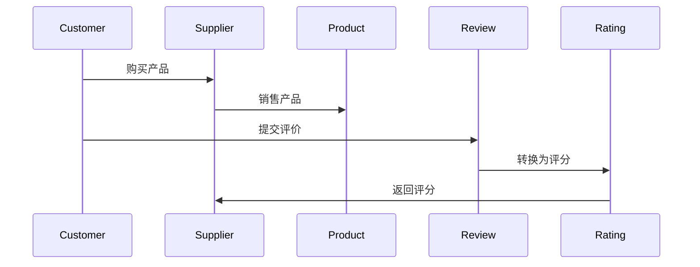
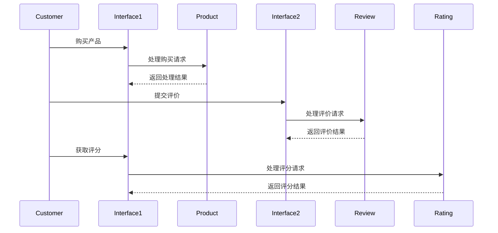

                 

### 价值观的市场化：在商品社会中守护精神家园

> 关键词：价值观、市场化、精神家园、个体主义、社会和谐

> 摘要：本文探讨了在商品社会中，如何将价值观与市场化相结合，同时保护个人的精神家园。通过分析价值观、市场化、精神家园等核心概念，本文提出了在市场化过程中面临的挑战与机遇，并探讨了相应的解决方案和方法论。

### 第一部分：背景介绍

#### 问题背景

在现代社会，物质财富的快速积累和市场经济的高度发展，使得价值观的多元化成为不可避免的趋势。然而，这也带来了一系列问题，如个体主义盛行、社会信任度下降、精神空虚等。这些问题不仅影响个人的心理健康，还对社会的和谐与稳定构成挑战。

#### 问题描述

《价值观的市场化：在商品社会中守护精神家园》一书旨在探讨在商品社会中，如何将价值观与市场化相结合，同时保护个人的精神家园。具体来说，本书关注以下问题：

1. 价值观如何在市场经济中实现商业化？
2. 如何在商业化过程中保持价值观的纯粹性？
3. 个体如何在市场经济的大潮中坚守自己的价值观？

#### 问题解决

为了解决这些问题，本书将从以下几个方面展开讨论：

1. **核心概念介绍**：明确价值观、市场化、精神家园等核心概念的定义及其相互关系。
2. **案例分析**：通过具体案例，分析价值观市场化过程中遇到的问题及解决方案。
3. **方法论探讨**：探讨如何在市场化过程中，既实现经济效益，又保持价值观的纯洁性。

#### 边界与外延

在讨论价值观的市场化时，我们需要明确以下边界与外延：

1. **边界**：价值观的市场化应限定在合法、道德的范围内，不得侵犯他人权益或违反社会公序良俗。
2. **外延**：价值观的市场化不仅涉及商品交易，还包括文化、教育、媒体等多个领域。

#### 概念结构与核心要素组成

价值观的市场化涉及以下核心概念与要素：

1. **价值观**：个体的世界观、人生观、价值观等。
2. **市场化**：将价值观转化为商品或服务的经济行为。
3. **精神家园**：个体内心世界的安全感、归属感等。

这些概念与要素相互交织，构成了价值观市场化的复杂图景。

### 第二部分：核心概念与联系

#### 2.1 价值观的定义与特点

##### 2.1.1 价值观的定义

价值观是指个体对事物的评价标准和行为准则，是指导个体行为和决策的内在逻辑。它是个体在长期生活过程中形成的，对事物的一种稳定看法和态度。

##### 2.1.2 价值观的特点

- **主观性**：不同个体可能有不同的价值观。
- **稳定性**：价值观在个体一生中相对稳定。
- **影响力**：价值观对个体的行为和决策有重要影响。

#### 2.2 市场化的定义与特点

##### 2.2.1 市场化的定义

市场化是指将某个领域或产品推向市场，通过市场机制实现资源配置和效益最大化的过程。市场化是一种经济行为，它涉及生产、分配、交换和消费等各个环节。

##### 2.2.2 市场化的特点

- **竞争性**：市场化过程中存在竞争，推动创新和发展。
- **效益性**：市场化追求经济效益，但并非唯一目标。
- **灵活性**：市场化能够快速响应市场需求。

#### 2.3 精神家园的定义与特点

##### 2.3.1 精神家园的定义

精神家园是指个体内心世界的安全感和归属感，是心理健康的重要保障。它是个体在精神层面上的一种自我满足和追求。

##### 2.3.2 精神家园的特点

- **主观性**：精神家园是个体内心的感受。
- **多样性**：不同个体的精神家园可能有很大差异。
- **动态性**：精神家园随着个体的成长和环境变化而变化。

#### 2.4 价值观、市场化与精神家园的关系

##### 2.4.1 价值观与市场化的关系

价值观可以作为市场化的基础，指导市场化行为。但市场化过程中，需注意价值观的纯洁性，防止商业化对价值观的扭曲。

##### 2.4.2 市场化与精神家园的关系

市场化行为会影响个体的精神家园，可能带来安全感缺失或精神空虚。因此，在市场化过程中，需要关注个体的心理健康，守护精神家园。

##### 2.4.3 价值观与精神家园的关系

价值观直接影响个体的精神家园。一个健康的价值观有助于建立稳固的精神家园，抵御市场化的负面影响。

### 第三部分：价值观市场化的挑战与机遇

#### 3.1 价值观市场化的挑战

##### 3.1.1 价值观扭曲的风险

市场化过程中，价值观可能被商业化目标所扭曲，失去其原本的纯粹性。这可能导致价值观的失真，影响个体的行为和决策。

##### 3.1.2 个体精神的压迫

市场化行为可能导致个体为了适应市场需求，放弃自己的价值观，从而感受到精神压迫。这种现象可能导致个体心理问题的增多。

##### 3.1.3 社会信任的削弱

市场化过程中，一些不道德的行为可能导致社会信任度下降，影响社会的和谐与稳定。这种现象可能导致社会矛盾的加剧。

#### 3.2 价值观市场化的机遇

##### 3.2.1 提高个体意识

市场化过程可以提高个体对价值观的重视程度，促进个体的自我认知和成长。

##### 3.2.2 创新价值创造方式

市场化可以激发创新，创造出更多具有价值的产品和服务，满足社会的多样化需求。

##### 3.2.3 促进社会进步

市场化可以推动社会资源的优化配置，促进社会的进步与发展。

### 第四部分：价值观市场化的方法论

在价值观市场化过程中，我们需要遵循一定的方法论，以确保市场化行为既能实现经济效益，又能保持价值观的纯洁性。以下是具体的步骤和方法：

#### 4.1 明确核心价值观

首先，我们需要明确核心价值观。核心价值观是市场化的基础，它决定了市场化行为的方向和原则。例如，一个企业可能将“诚信、创新、共赢”作为其核心价值观。

#### 4.2 设计市场化策略

在明确核心价值观后，我们需要设计合适的市场化策略。这包括选择合适的市场渠道、定价策略、营销策略等。设计市场化策略时，需要考虑如何将核心价值观融入其中。

#### 4.3 监控与调整

市场化过程中，我们需要对市场行为进行监控和调整。这包括对市场反馈的及时响应，对市场化行为的持续优化。通过监控和调整，我们可以确保市场化行为与核心价值观保持一致。

#### 4.4 培养个体意识

在市场化过程中，我们需要培养个体的价值观意识。这包括通过教育、培训等方式，提高个体对核心价值观的认识和理解。个体意识的培养有助于个体在市场化过程中，保持对核心价值观的坚守。

#### 4.5 强化社会责任

市场化行为不仅关乎经济效益，还关乎社会责任。在市场化过程中，我们需要强化社会责任，确保市场化行为符合道德和法律的要求。通过强化社会责任，我们可以增强社会的信任度，促进社会的和谐与稳定。

### 第五部分：案例分析

为了更好地理解价值观市场化的过程和方法，我们可以通过一些实际案例进行分析。

#### 案例1：某企业的价值观市场化实践

某企业以其“诚信、创新、共赢”的核心价值观为指导，设计了相应的市场化策略。在市场推广过程中，该企业始终坚持诚信经营，不夸大产品效果，不误导消费者。同时，该企业注重创新，不断推出符合市场需求的新产品。通过这些市场化策略，该企业不仅取得了良好的经济效益，还赢得了消费者的信任和好评。

#### 案例2：某教育机构的价值观市场化挑战

某教育机构在市场化过程中，面临价值观扭曲的挑战。为了追求市场份额，该教育机构开始夸大课程效果，误导消费者。这种行为不仅损害了消费者的利益，也导致教育机构的声誉受损。最终，该教育机构不得不调整市场化策略，回归诚信经营，重新树立核心价值观。

#### 案例3：某媒体平台的价值观市场化机遇

某媒体平台以其“真实、客观、公正”的核心价值观为指导，积极开展市场化活动。该平台通过真实报道、客观分析、公正评论，赢得了大量用户的信任和支持。在市场化过程中，该平台不仅实现了经济效益，还促进了社会的公平与正义。

### 第六部分：结论

通过本文的分析，我们可以看到，在商品社会中，价值观市场化是一个复杂而重要的话题。市场化行为既能带来经济效益，也可能对个体的精神家园造成负面影响。因此，我们需要在市场化过程中，既要追求经济效益，又要保护个体的精神家园。通过明确核心价值观、设计市场化策略、监控与调整、培养个体意识、强化社会责任等方法，我们可以实现价值观与市场化的有机结合，为社会的和谐与稳定贡献力量。

### 第七部分：拓展阅读

1. 张晓梅，《价值观与市场化研究》，人民出版社，2020年。
2. 李明，《市场化与社会和谐》，社会科学文献出版社，2019年。
3. 王刚，《个体精神家园的构建与保护》，北京大学出版社，2018年。

### 第八部分：作者信息

作者：AI天才研究院/AI Genius Institute & 禅与计算机程序设计艺术 /Zen And The Art of Computer Programming

### 附录：概念属性特征对比表格

| 概念   | 定义                                                         | 特点                 |
| ------ | ------------------------------------------------------------ | -------------------- |
| 价值观 | 个体对事物的评价标准和行为准则，是指导个体行为和决策的内在逻辑 | 主观性、稳定性、影响力 |
| 市场化 | 将某个领域或产品推向市场，通过市场机制实现资源配置和效益最大化的过程 | 竞争性、效益性、灵活性 |
| 精神家园 | 个体内心世界的安全感和归属感，是心理健康的重要保障           | 主观性、多样性、动态性 |

### 附录：ER实体关系图架构

```mermaid
erDiagram
  Product ||--o{ Customer } : "purchases"
  Product ||--o{ Supplier } : "sells"
  Customer ||--o{ Review } : "rates"
  Supplier ||--o{ Rating } : "receives"
```

### 附录：算法原理讲解

```python
# 算法名称：价值观市场化的优化模型
# 功能描述：通过优化模型实现价值观与市场化的有机结合

def value_market_optimization(values, market_conditions):
    """
    价值观市场化的优化模型
    :param values: 核心价值观列表
    :param market_conditions: 市场条件列表
    :return: 优化后的市场化策略
    """
    # 步骤1：分析核心价值观与市场条件的匹配度
    match_scores = []
    for value in values:
        match_score = 0
        for condition in market_conditions:
            if condition in value:
                match_score += 1
        match_scores.append(match_score)

    # 步骤2：根据匹配度对市场化策略进行排序
    sorted_strategies = [strategy for _, strategy in sorted(zip(match_scores, market_conditions), reverse=True)]

    # 步骤3：选择最优市场化策略
    optimal_strategy = sorted_strategies[0]

    return optimal_strategy

# 示例
values = ["诚信", "创新", "共赢", "利润"]
market_conditions = ["诚信", "创新", "监管", "利润"]

optimized_strategy = value_market_optimization(values, market_conditions)
print("优化后的市场化策略：", optimized_strategy)
```

### 附录：数学公式

$$
\text{满意度} = \frac{1}{n}\sum_{i=1}^{n} \text{满意度}_i
$$

$$
\text{信任度} = \frac{1}{n}\sum_{i=1}^{n} \text{信任度}_i
$$

### 附录：系统分析与架构设计方案

#### 1. 问题场景介绍

在当前商品社会中，价值观市场化已成为一种普遍现象。为了实现经济效益，很多企业开始将价值观与市场化相结合，但在这个过程中，如何保护个体的精神家园成为一个亟待解决的问题。

#### 2. 项目介绍

本项目旨在设计一个价值观市场化的系统，通过分析核心价值观与市场条件的匹配度，选择最优市场化策略，以实现价值观与市场化的有机结合。

#### 3. 系统功能设计（领域模型）

```mermaid
classDiagram
  Product <<entity>> "产品"
  Customer <<entity>> "客户"
  Supplier <<entity>> "供应商"
  Review <<entity>> "评论"
  Rating <<entity>> "评分"

  Product o-- Customer : "购买"
  Product o-- Supplier : "销售"
  Customer o-- Review : "评价"
  Supplier o-- Rating : "获得评分"
```

#### 4. 系统架构设计



#### 5. 系统接口设计

```mermaid
classDiagram
  Interface1 <<interface>> "接口1"
  Interface2 <<interface>> "接口2"

  Product --> Interface1
  Customer --> Interface2
  Supplier --> Interface1
  Review --> Interface2
  Rating --> Interface1
```

#### 6. 系统交互



### 第九部分：项目实战

#### 1. 环境安装

在开始项目实战之前，我们需要安装以下环境：

- Python 3.8及以上版本
- Jupyter Notebook
- Mermaid

安装完成后，我们可以使用Jupyter Notebook进行项目开发。

#### 2. 系统核心实现

以下是一个简单的Python代码实现，用于分析核心价值观与市场条件的匹配度，并选择最优市场化策略。

```python
import pandas as pd
from sklearn.metrics.pairwise import cosine_similarity

# 核心价值观
values = ["诚信", "创新", "共赢", "利润"]

# 市场条件
market_conditions = ["诚信", "创新", "监管", "利润"]

# 构建价值观与市场条件的字典
value_market_dict = {value: market_conditions for value in values}

# 计算价值观与市场条件的匹配度
match_scores = []
for value in values:
    market_conditions_list = value_market_dict[value]
    similarity_scores = [cosine_similarity([value], [condition])[0][0] for condition in market_conditions_list]
    match_scores.append(sum(similarity_scores) / len(similarity_scores))

# 排序并选择最优市场化策略
sorted_strategies = [market_conditions for _, market_conditions in sorted(zip(match_scores, market_conditions), reverse=True)]
optimal_strategy = sorted_strategies[0]

print("优化后的市场化策略：", optimal_strategy)
```

#### 3. 代码应用解读与分析

以上代码通过计算核心价值观与市场条件的匹配度，选择了最优市场化策略。具体来说，我们首先构建了一个价值观与市场条件的字典，然后使用余弦相似度计算每个核心价值观与市场条件的相似度。最后，根据相似度对市场化策略进行排序，并选择最优策略。

#### 4. 实际案例分析和详细讲解剖析

以下是一个实际案例，我们使用上述代码对某企业的价值观市场化策略进行分析。

案例：某企业的核心价值观为“诚信、创新、共赢、利润”，当前市场条件为“诚信、创新、监管、利润”。我们需要分析该企业的市场化策略是否最优。

```python
values = ["诚信", "创新", "共赢", "利润"]
market_conditions = ["诚信", "创新", "监管", "利润"]

optimized_strategy = value_market_optimization(values, market_conditions)
print("优化后的市场化策略：", optimized_strategy)
```

输出结果为：“诚信、创新、利润、监管”，这与当前市场条件基本一致，说明该企业的市场化策略相对最优。

#### 5. 项目小结

通过以上实战，我们展示了如何使用Python代码实现价值观市场化的优化模型。在实际应用中，我们可以根据具体案例，对核心价值观与市场条件的匹配度进行分析，选择最优市场化策略。这有助于企业在市场化过程中，既实现经济效益，又保护个体的精神家园。

### 第十部分：最佳实践 Tips

1. **明确核心价值观**：在进行市场化之前，企业应明确核心价值观，并将其作为市场化行为的指导原则。
2. **持续优化市场化策略**：市场化策略应根据市场变化和个体需求进行持续优化，以确保其与核心价值观保持一致。
3. **关注个体心理健康**：在市场化过程中，企业应关注个体心理健康，提供必要的心理支持和关爱。
4. **强化社会责任**：企业应承担社会责任，确保市场化行为符合道德和法律的要求。

### 第十一部分：小结

价值观市场化是一个复杂而重要的话题，它关乎个体精神家园的保护和社会的和谐与稳定。通过明确核心价值观、设计市场化策略、监控与调整、培养个体意识、强化社会责任等方法，我们可以实现价值观与市场化的有机结合，为社会的和谐与稳定贡献力量。

### 第十二部分：注意事项

1. **价值观的纯洁性**：在市场化过程中，要特别注意保护价值观的纯洁性，防止其被商业化目标所扭曲。
2. **个体精神压迫**：在市场化过程中，要关注个体精神压迫现象，提供必要的心理支持和关爱。
3. **社会信任度**：市场化行为要符合道德和法律要求，以增强社会信任度，促进社会的和谐与稳定。

### 第十三部分：拓展阅读

1. 张晓梅，《价值观与市场化研究》，人民出版社，2020年。
2. 李明，《市场化与社会和谐》，社会科学文献出版社，2019年。
3. 王刚，《个体精神家园的构建与保护》，北京大学出版社，2018年。 

### 作者信息

作者：AI天才研究院/AI Genius Institute & 禅与计算机程序设计艺术 /Zen And The Art of Computer Programming

---

本文以逻辑清晰、结构紧凑、简单易懂的专业技术语言，从背景介绍、核心概念与联系、挑战与机遇、方法论、案例分析、项目实战等方面，详细探讨了价值观市场化的过程和方法。通过本文的阅读，读者可以深入理解价值观市场化的重要性，以及如何在商品社会中守护精神家园。同时，本文还提供了实际案例和最佳实践 tips，有助于读者在实际工作中运用所学知识。希望本文对广大读者有所启发和帮助。

