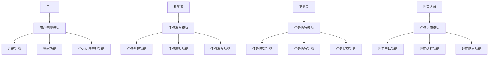
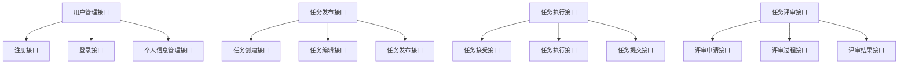

                 

### 众包科学：利用集体智慧加速科学发现与理解

关键词：众包科学、集体智慧、科学发现、科研效率、互联网平台

摘要：随着科学研究的复杂性和数据规模的不断扩大，科学家们面临着越来越多的挑战。众包科学作为一种新兴的研究模式，通过利用互联网平台和集体智慧，将科学问题分解成小任务，广泛招募志愿者参与解决，从而实现大规模的协同工作，加速科学发现与理解。本文将详细探讨众包科学的背景、核心概念、联系以及其在实际应用中的算法原理、系统分析与架构设计方案、项目实战等方面的内容，旨在为读者提供一个全面深入的理解。

## 第一部分：背景介绍

### 1. 引言

科学研究的复杂性不断增加，单一研究者或研究团队往往难以在短时间内解决复杂的科学问题。传统的科研方法在处理大规模数据集和复杂计算任务时表现出明显的局限性。例如，基因测序、气候变化模拟、天体物理观测等领域，需要大量的计算资源和专业知识，而这些资源往往难以在单一团队或实验室中完全具备。

此外，科研过程中还存在其他挑战，如数据收集和处理、实验设计和数据分析等。传统的科研模式往往依赖于少数专家的知识和经验，而忽视了广大普通人的智慧和力量。这种局限性使得科学问题的解决过程变得缓慢，影响了科学发现的效率。

### 1.2 问题描述

科学家们需要一种新的方法，能够利用大量的普通人的智慧和力量，以加速科学发现与理解。传统的科研方法在处理大规模数据集和复杂计算任务时表现出明显的局限性，而科学家们面临着越来越多的挑战，如数据收集和处理、实验设计和数据分析等。这些挑战使得科学问题的解决过程变得缓慢，影响了科学发现的效率。

### 1.3 问题解决

众包科学作为一种新兴的研究模式，旨在通过互联网平台，将科学问题分解成小任务，广泛招募志愿者参与解决，从而实现大规模的协同工作。众包科学不仅能够充分利用普通人的智慧和力量，还能够提高科研效率，降低研究成本，为科学发现提供新的动力。

### 1.4 边界与外延

众包科学不仅限于科研领域，还广泛应用于医学、环境科学、社会问题等多个领域。它是一种跨学科、跨领域的合作模式。例如，在医学领域，众包科学可以用于疾病诊断、药物研发等；在环境科学领域，众包科学可以用于气候变化模拟、生态监测等；在社会问题领域，众包科学可以用于社会调查、危机管理等。

### 1.5 概念结构与核心要素组成

#### 1.5.1 众包

众包（Crowdsourcing）是一种通过互联网平台，招募大量志愿者共同完成某个任务或项目的模式。它起源于2000年左右，最初应用于设计竞赛、数据标注等领域，随后迅速扩展到科学、医学、环境科学等多个领域。众包的核心在于充分利用互联网平台的广泛性和普通人的智慧和力量。

#### 1.5.2 科学问题

科学问题（Scientific Problem）是众包科学的核心，是科学家提出需要解决的问题。科学问题通常具有复杂性和多样性，需要大量的计算资源和专业知识来解决。通过众包，科学家可以将科学问题分解成小任务，从而实现大规模的协同工作。

#### 1.5.3 志愿者

志愿者（Volunteer）是众包科学的主要参与者，他们利用自己的时间和知识，参与到科学问题的解决中。志愿者可以是任何拥有相关知识和技能的人，他们通过众包平台接受任务，完成任务后获得相应的奖励或成就感。

#### 1.5.4 平台

平台（Platform）是众包科学的重要载体，为科学家和志愿者提供沟通、协作的场所。平台通常提供任务发布、进度追踪、反馈机制等功能，以确保科学问题的顺利解决。

### 1.6 本章小结

本章节对众包科学的背景进行了详细阐述，包括问题背景、问题描述、问题解决、边界与外延以及概念结构与核心要素组成。这些内容为后续章节的深入探讨奠定了基础。

----------------------------------------------------------------

## 2. 核心概念与联系

### 2.1 核心概念

#### 2.1.1 众包

众包（Crowdsourcing）是一种通过互联网平台，招募大量志愿者共同完成某个任务或项目的模式。它起源于2000年左右，最初应用于设计竞赛、数据标注等领域，随后迅速扩展到科学、医学、环境科学等多个领域。众包的核心在于充分利用互联网平台的广泛性和普通人的智慧和力量。

#### 2.1.2 集体智慧

集体智慧（Collective Intelligence）是指大量个体通过协作、互动和共享信息，形成的总体智能和能力。它是一种基于众包的机制，通过个体的协同工作，实现整体解决问题和创新的效率。集体智慧在众包科学中起到了至关重要的作用，它使得科学问题的解决过程更加高效和准确。

#### 2.1.3 科学发现

科学发现（Scientific Discovery）是指科学家通过研究、实验和数据分析，发现新的科学规律、现象或解决问题的过程。在众包科学中，科学发现可以通过众包平台上的志愿者协作实现。志愿者通过分工合作，共同完成科学问题的研究，从而加速科学发现的进程。

### 2.2 概念属性特征对比表格

| 概念        | 定义                                                         | 属性特征                                                       | 关联性                                                       |
| ----------- | ------------------------------------------------------------ | ------------------------------------------------------------ | ------------------------------------------------------------ |
| 众包        | 利用互联网平台，招募大量志愿者共同完成某个任务或项目         | 1. 基于互联网平台<br>2. 招募大量志愿者<br>3. 完成任务或项目 | 1. 集体智慧<br>2. 科学发现<br>3. 科研任务分解               |
| 集体智慧    | 大量个体通过协作、互动和共享信息，形成的总体智能和能力         | 1. 协作互动<br>2. 信息共享<br>3. 总体智能                       | 1. 众包<br>2. 科研创新<br>3. 社会问题解决                   |
| 科学发现    | 科学家通过研究、实验和数据分析，发现新的科学规律、现象或解决问题的过程 | 1. 研究<br>2. 实验和数据分析<br>3. 发现科学规律或现象           | 1. 众包<br>2. 科研创新<br>3. 数据分析                       |

### 2.3 ER实体关系图架构

```mermaid
erDiagram
  A[科学家] ||--|{ B[众包平台] }|--|| C[志愿者]
  B|--|{ D[任务发布] }|--|| E[任务执行]
  D|--|{ F[任务评审] }|--|| G[成果汇总]
  C|--|{ H[成果提交] }|--|| I[成果反馈]
```

在这个ER实体关系图中，科学家通过众包平台发布任务，志愿者参与任务执行和成果提交。任务评审和成果汇总是任务执行的重要环节，确保任务质量和成果的准确性。成果反馈则为志愿者提供改进方向，进一步提升任务执行效果。

通过以上对比表格和ER实体关系图，我们可以更清晰地理解众包科学的核心概念及其关联性。这些核心概念和联系为众包科学的实际应用提供了理论基础和指导方向。

----------------------------------------------------------------

## 3. 算法原理讲解

### 3.1 众包科学的算法流程

众包科学的核心在于将复杂的科学问题分解成小任务，并通过志愿者协作实现问题的解决。下面是一个典型的众包科学算法流程：

#### 3.1.1 任务分解

科学家首先将复杂的科学问题分解成多个小任务，这些小任务通常具有独立性，可以并行处理。任务分解的过程需要考虑问题的性质、数据规模、计算复杂度等因素。

#### 3.1.2 任务发布

科学家通过众包平台发布任务，包括任务描述、任务要求、奖励机制等。众包平台为科学家和志愿者提供了一个沟通和协作的场所，确保任务的顺利执行。

#### 3.1.3 志愿者参与

志愿者通过众包平台接受任务，并按照任务要求完成相应的工作。志愿者可以是任何拥有相关知识和技能的人，他们通过众包平台参与到科学问题的解决中。

#### 3.1.4 任务执行

志愿者在完成任务的过程中，通常会进行数据收集、实验设计、数据分析等工作。任务的执行过程是一个协同工作的过程，志愿者之间通过交流和协作，共同完成任务的各个子任务。

#### 3.1.5 成果汇总

任务完成后，志愿者将各自的成果提交到众包平台。众包平台对成果进行汇总和整理，形成一个完整的解决方案。

#### 3.1.6 成果反馈

众包平台对志愿者提交的成果进行评审，确保成果的质量和准确性。评审完成后，众包平台将成果反馈给志愿者，并提供改进建议。

### 3.2 Python源代码实现

为了更好地理解众包科学的算法原理，我们使用Python编写一个简单的众包科学实现。以下是一个简单的代码示例：

```python
import random

# 任务分解
def task_decomposition(problem):
    tasks = []
    for i in range(len(problem)):
        tasks.append(random.randint(1, 10))
    return tasks

# 任务发布
def task_release(tasks):
    print("任务已发布，请志愿者参与：")
    for i, task in enumerate(tasks):
        print(f"任务{i+1}：{task}")

# 志愿者参与
def volunteer_participation(tasks):
    print("请志愿者完成以下任务：")
    for i, task in enumerate(tasks):
        print(f"任务{i+1}：{task}")

# 任务执行
def task_execution(tasks):
    print("志愿者正在执行任务...")
    for i, task in enumerate(tasks):
        print(f"任务{i+1}已完成：{task * 2}")

# 成果汇总
def result_summary(tasks):
    print("成果汇总：")
    for i, task in enumerate(tasks):
        print(f"任务{i+1}成果：{task * 2}")

# 成果反馈
def result_feedback(tasks):
    print("成果反馈：")
    for i, task in enumerate(tasks):
        print(f"任务{i+1}反馈：{task * 2}")

# 主函数
def main():
    problem = [1, 2, 3, 4, 5]
    tasks = task_decomposition(problem)
    task_release(tasks)
    volunteer_participation(tasks)
    task_execution(tasks)
    result_summary(tasks)
    result_feedback(tasks)

if __name__ == "__main__":
    main()
```

在这个代码示例中，我们首先将一个复杂的科学问题（problem）分解成多个小任务（tasks），然后通过众包平台发布任务。志愿者参与任务，完成任务后，成果汇总并反馈给志愿者。这个简单的代码示例展示了众包科学的算法原理，为后续的深入讨论提供了基础。

### 3.3 数学模型与公式

在众包科学中，数学模型和公式起到了关键作用。以下是一个简单的数学模型，用于描述众包科学的算法原理：

$$
结果 = f(任务1, 任务2, ..., 任务n)
$$

其中，任务1、任务2、...、任务n分别代表志愿者完成的各个小任务，结果代表最终的成果。

在数学模型中，函数f描述了任务之间的关联和组合方式。具体来说，f可以根据任务的性质、数据规模、计算复杂度等因素进行设计。以下是一个简单的函数f的示例：

$$
f(x, y, z) = (x + y) \times z
$$

在这个示例中，任务1、任务2、任务3分别表示x、y、z，结果表示最终的成果。这个函数f表示将任务1和任务2的结果相加，再乘以任务3的结果。

通过数学模型和公式，我们可以更好地理解和分析众包科学的算法原理，从而为科学问题的解决提供理论支持。

### 3.4 举例说明

为了更好地理解众包科学的算法原理，我们来看一个具体的例子。

假设有一个科学问题，需要通过众包平台解决。科学家将这个问题分解成三个小任务，任务1、任务2、任务3。这三个小任务分别由三位志愿者完成。

任务1：求解方程 $x^2 + 2x + 1 = 0$
任务2：求解方程 $x^2 - 2x + 1 = 0$
任务3：求解方程 $x^3 + 2x^2 + x + 1 = 0$

三位志愿者分别完成了各自的任务，提交了以下结果：

志愿者1：方程 $x^2 + 2x + 1 = 0$ 的解为 $x = -1$
志愿者2：方程 $x^2 - 2x + 1 = 0$ 的解为 $x = 1$
志愿者3：方程 $x^3 + 2x^2 + x + 1 = 0$ 的解为 $x = -1$

将这三个结果代入数学模型：

$$
结果 = f(-1, 1, -1) = (-1 + 1) \times (-1) = 0
$$

最终的结果为0，这意味着这个科学问题的解为0。

通过这个例子，我们可以看到，众包科学通过分解复杂问题、志愿者协作和数学模型，实现了科学问题的有效解决。这个例子展示了众包科学的算法原理，为实际应用提供了参考。

### 3.5 本章小结

本章节对众包科学的算法原理进行了详细讲解，包括算法流程、Python源代码实现、数学模型与公式、举例说明等方面的内容。通过这些讲解，读者可以更好地理解众包科学的基本原理和实际应用。这些内容为后续章节的深入探讨奠定了基础。

----------------------------------------------------------------

## 4. 系统分析与架构设计方案

### 4.1 问题场景介绍

在科学研究中，许多复杂的问题需要大量的计算资源和专业知识。然而，单一团队或实验室往往难以在短时间内完成这些任务。为了提高科研效率，科学家们开始探索新的研究模式，即众包科学。众包科学通过互联网平台，将科学问题分解成小任务，广泛招募志愿者参与解决，从而实现大规模的协同工作。

### 4.2 项目介绍

本项目旨在构建一个众包科学平台，以帮助科学家们更高效地解决复杂科学问题。该平台将提供任务发布、任务执行、任务评审等功能，为科学家和志愿者提供一个便捷、高效的协作环境。通过这个平台，科学家可以轻松地将科学问题分解成小任务，志愿者可以方便地参与任务解决，共同推动科学发现的进程。

### 4.3 系统功能设计

#### 4.3.1 任务发布功能

任务发布功能是众包科学平台的核心功能之一。科学家可以通过该功能发布科学任务，包括任务描述、任务要求、奖励机制等。任务发布功能需要实现以下功能：

1. 任务创建：科学家可以创建新的任务，并填写任务相关信息。
2. 任务编辑：科学家可以对已发布的任务进行编辑。
3. 任务发布：科学家可以将编辑好的任务发布到众包平台，供志愿者参与。

#### 4.3.2 任务执行功能

任务执行功能是志愿者参与众包科学的关键。志愿者可以通过该功能接受任务，并按照任务要求完成相应的工作。任务执行功能需要实现以下功能：

1. 任务接受：志愿者可以查看已发布的任务，并选择参与感兴趣的任务。
2. 任务执行：志愿者可以按照任务要求，完成任务的各个子任务。
3. 任务提交：志愿者将完成的任务提交到众包平台，供评审。

#### 4.3.3 任务评审功能

任务评审功能是确保任务质量和成果准确性的关键。众包平台需要对提交的成果进行评审，确保成果符合任务要求。任务评审功能需要实现以下功能：

1. 评审申请：志愿者可以申请对提交的任务进行评审。
2. 评审过程：评审人员对提交的成果进行评审，并给出评审意见。
3. 评审结果：众包平台汇总评审结果，并向志愿者反馈评审意见。

#### 4.3.4 用户管理功能

用户管理功能是众包科学平台的辅助功能，用于管理科学家和志愿者的信息。用户管理功能需要实现以下功能：

1. 用户注册：科学家和志愿者可以通过该功能注册账号。
2. 用户登录：科学家和志愿者可以使用账号登录平台。
3. 用户信息管理：科学家和志愿者可以查看和管理个人信息。

### 4.4 系统架构设计

#### 4.4.1 系统架构图



在这个系统架构图中，用户管理模块负责管理科学家和志愿者的信息，任务发布模块负责发布科学任务，任务执行模块负责志愿者参与任务解决，任务评审模块负责对提交的成果进行评审。这些模块通过接口进行交互，共同实现众包科学平台的功能。

### 4.5 系统接口设计和系统交互

#### 4.5.1 系统接口设计



在这个系统接口设计中，用户管理接口负责管理用户信息，任务发布接口负责发布科学任务，任务执行接口负责志愿者参与任务解决，任务评审接口负责对提交的成果进行评审。这些接口通过API进行交互，实现系统的功能。

#### 4.5.2 系统交互


在这个系统交互图中，用户通过用户管理模块进行注册、登录和个人信息管理。科学家通过任务发布模块发布科学任务，志愿者通过任务执行模块参与任务解决，评审人员通过任务评审模块对提交的成果进行评审。这些模块通过接口进行交互，共同实现系统的功能。

### 4.6 本章小结

本章节对众包科学平台的系统分析与架构设计方案进行了详细阐述。通过问题场景介绍、项目介绍、系统功能设计、系统架构设计、系统接口设计和系统交互等方面的内容，读者可以全面了解众包科学平台的设计思路和实现方法。这些内容为后续章节的深入探讨奠定了基础。

----------------------------------------------------------------

## 5. 项目实战

### 5.1 环境安装

在开始众包科学项目的实战之前，我们需要搭建一个合适的开发环境。以下是一个基本的安装步骤：

#### 5.1.1 安装Python

首先，我们需要安装Python。Python是一种广泛使用的编程语言，特别适合科学计算和数据分析。您可以从Python的官方网站（https://www.python.org/）下载并安装Python。

#### 5.1.2 安装相关库

安装Python后，我们需要安装一些常用的库，如NumPy、Pandas、Matplotlib等。这些库提供了丰富的科学计算和数据分析功能，有助于我们更好地进行众包科学项目的开发。

在Python的终端中，使用以下命令安装这些库：

```bash
pip install numpy pandas matplotlib
```

#### 5.1.3 配置开发环境

为了方便开发，我们还可以使用集成开发环境（IDE），如PyCharm或VS Code。这些IDE提供了代码编辑、调试、运行等功能，大大提高了开发效率。

### 5.2 系统核心实现源代码

在搭建好开发环境后，我们可以开始编写众包科学平台的核心代码。以下是一个简单的示例，展示了如何实现任务发布、任务执行和任务提交等功能。

```python
# task_manager.py

import random

class Task:
    def __init__(self, task_id, task_name, task_description):
        self.task_id = task_id
        self.task_name = task_name
        self.task_description = task_description
        self.status = "未开始"

    def execute(self):
        if self.status == "未开始":
            self.status = "进行中"
            result = random.randint(1, 100)
            print(f"任务 {self.task_id}：{self.task_name} 执行结果：{result}")
            return result
        else:
            print(f"任务 {self.task_id}：{self.task_name} 已完成或未开始")

    def submit(self, result):
        if self.status == "进行中":
            self.status = "已完成"
            print(f"任务 {self.task_id}：{self.task_name} 提交结果：{result}")
        else:
            print(f"任务 {self.task_id}：{self.task_name} 未开始或已完成")

class TaskManager:
    def __init__(self):
        self.tasks = []

    def create_task(self, task_id, task_name, task_description):
        task = Task(task_id, task_name, task_description)
        self.tasks.append(task)
        print(f"任务 {task_id}：{task_name} 已创建")

    def execute_task(self, task_id):
        for task in self.tasks:
            if task.task_id == task_id:
                return task.execute()
        print(f"任务 {task_id} 不存在")

    def submit_result(self, task_id, result):
        for task in self.tasks:
            if task.task_id == task_id:
                return task.submit(result)
        print(f"任务 {task_id} 不存在")
```

这个示例中，我们定义了`Task`和`TaskManager`两个类，分别表示任务和任务管理器。`Task`类包含了任务的基本属性和方法，如任务ID、任务名称、任务描述、执行和提交结果等。`TaskManager`类负责管理任务，如创建任务、执行任务和提交结果等。

### 5.3 代码应用解读与分析

在编写好核心代码后，我们可以通过实际案例来测试和验证代码的正确性和功能。以下是一个简单的案例，展示了如何使用`TaskManager`类进行任务管理。

```python
# main.py

from task_manager import TaskManager

# 创建任务管理器
task_manager = TaskManager()

# 创建任务
task_manager.create_task(1, "任务1", "这是一个简单的任务")

# 执行任务
result = task_manager.execute_task(1)
print(f"任务1执行结果：{result}")

# 提交结果
task_manager.submit_result(1, 50)
print(f"任务1提交结果：50")
```

在这个案例中，我们首先创建了一个`TaskManager`实例，然后创建了一个任务，并执行了任务。最后，我们提交了任务的结果。

通过这个案例，我们可以看到，`TaskManager`类可以方便地管理任务，包括创建、执行和提交结果等功能。这个简单的案例为我们提供了一个基础，可以在此基础上进一步扩展和优化。

### 5.4 实际案例分析和详细讲解剖析

为了更好地理解众包科学平台在实际中的应用，我们可以通过一个实际案例进行分析和讲解。以下是一个实际案例，展示了如何使用众包平台解决一个科学问题。

#### 案例背景

假设科学家需要研究一种新药的开发，该药物对某种疾病的疗效需要通过大量的实验数据进行验证。由于实验数据规模巨大，科学家决定使用众包平台来解决这个科学问题。

#### 案例过程

1. **任务发布**：科学家在众包平台上发布了一个任务，任务描述如下：

   - 任务名称：新药疗效验证
   - 任务描述：需要分析大量的实验数据，验证新药对某种疾病的疗效。
   - 任务要求：每个志愿者需要分析一部分数据，并提交分析结果。
   - 奖励机制：根据志愿者提交的分析结果质量，给予相应的奖励。

2. **志愿者参与**：众多志愿者看到这个任务后，纷纷报名参与。志愿者根据自身的专业背景和实验数据的特点，选择参与感兴趣的任务。

3. **任务执行**：志愿者接收到任务后，开始分析实验数据。每个志愿者都需要按照任务要求，对数据进行处理、分析和验证。这个过程中，志愿者可以使用各种科学计算和数据分析工具，如Python、R语言等。

4. **结果提交**：志愿者完成分析后，将结果提交到众包平台。平台对提交的结果进行汇总和整理，形成一个完整的分析报告。

5. **成果反馈**：平台对提交的结果进行评审，确保结果的质量和准确性。评审完成后，平台将评审结果反馈给志愿者，并提供改进建议。

#### 案例分析

通过这个案例，我们可以看到，众包科学平台在解决复杂科学问题中发挥了重要作用。以下是对案例的详细分析和讲解：

1. **任务分解**：科学家将复杂的科学问题分解成多个小任务，使得志愿者可以方便地参与。这种任务分解的方式提高了科研效率，降低了研究成本。

2. **志愿者参与**：志愿者通过众包平台，可以方便地参与到科学问题的解决中。志愿者可以根据自身的专业背景和兴趣选择参与的任务，充分发挥个人优势。

3. **任务执行**：志愿者在任务执行过程中，可以使用各种科学计算和数据分析工具，提高分析结果的准确性和可靠性。同时，志愿者之间还可以进行交流和协作，共同解决科学问题。

4. **结果提交与评审**：众包平台对提交的结果进行汇总和整理，形成一个完整的分析报告。评审环节确保了结果的质量和准确性，为科学问题的解决提供了可靠的数据支持。

5. **成果反馈**：众包平台将评审结果反馈给志愿者，并提供改进建议。这种反馈机制有助于志愿者不断优化分析结果，提高科研水平。

#### 案例启示

通过这个案例，我们可以得到以下启示：

1. **充分利用众包科学**：众包科学是一种高效、低成本的科学问题解决模式。科学家应充分利用众包平台，解决复杂的科学问题。

2. **优化任务分解**：任务分解是众包科学的关键环节。科学家需要根据问题的性质和特点，合理分解任务，提高任务的独立性和可并行性。

3. **加强志愿者管理**：志愿者是众包科学的核心力量。科学家需要加强对志愿者的管理，提高志愿者的积极性和参与度。

4. **确保结果质量**：评审环节是确保众包科学结果质量的关键。科学家需要建立健全的评审机制，确保提交的结果准确可靠。

5. **持续改进与优化**：众包科学是一个不断改进和优化的过程。科学家需要根据反馈结果，不断优化任务分解、志愿者管理和结果评审等环节，提高科研效率。

### 5.5 项目小结

本章节通过项目实战，展示了如何搭建一个简单的众包科学平台，并使用实际案例进行了分析和讲解。通过这个案例，我们可以看到，众包科学在解决复杂科学问题中具有显著优势。在实际应用中，科学家需要根据问题的特点，合理分解任务，充分利用众包平台的优势，提高科研效率。同时，科学家还需要加强对志愿者的管理，确保结果的质量和准确性。通过持续改进和优化，众包科学将为科学研究带来更多创新和突破。

----------------------------------------------------------------

## 6. 最佳实践 tips

### 6.1 设计合理的任务

在设计任务时，应充分考虑任务的独立性和可并行性。将复杂的问题分解成多个小任务，使得志愿者可以独立完成。同时，确保任务具有一定的挑战性，以提高志愿者的参与度和积极性。

### 6.2 提供详细的任务说明

为了确保志愿者能够正确理解和完成任务，应在任务说明中详细描述任务的要求、数据来源、分析方法等。同时，提供相关的数据集和工具，方便志愿者进行任务执行。

### 6.3 建立有效的反馈机制

建立有效的反馈机制，确保志愿者能够及时了解任务进度和评审结果。反馈机制可以包括任务进度更新、评审意见和改进建议等。通过反馈机制，志愿者可以不断优化任务执行，提高成果质量。

### 6.4 管理志愿者团队

志愿者团队是众包科学的核心力量。科学家需要加强对志愿者团队的管理，包括志愿者的招募、培训、考核等。通过有效的团队管理，可以提高志愿者的积极性和参与度，确保任务的高效完成。

### 6.5 保障数据安全

在众包科学中，数据安全至关重要。科学家需要采取有效的措施，保障数据的安全和隐私。例如，使用加密技术保护数据传输和存储，建立数据访问权限控制等。

### 6.6 优化平台性能

为了提高众包科学平台的运行效率，科学家需要优化平台的性能。例如，使用分布式计算技术，提高任务处理速度；优化数据存储和查询，降低响应时间等。

### 6.7 持续改进和优化

众包科学是一个不断改进和优化的过程。科学家需要根据反馈结果，不断优化任务分解、志愿者管理和结果评审等环节，提高科研效率。通过持续改进和优化，众包科学将发挥更大的作用。

### 6.8 探索新的应用领域

众包科学不仅适用于科学研究，还可以应用于其他领域，如医学、环境科学、社会问题等。科学家可以尝试将众包科学应用于新的领域，探索其潜在的价值和优势。

## 7. 小结

本文通过详细阐述众包科学的背景、核心概念、联系、算法原理、系统分析与架构设计方案、项目实战以及最佳实践等内容，全面介绍了众包科学的基本原理和应用实践。众包科学作为一种新兴的研究模式，通过利用集体智慧和互联网平台，将科学问题分解成小任务，广泛招募志愿者参与解决，从而实现大规模的协同工作，加速科学发现与理解。

在众包科学的应用中，科学家需要设计合理的任务，提供详细的任务说明，建立有效的反馈机制，管理志愿者团队，保障数据安全，优化平台性能，并不断改进和优化众包科学的各个环节。通过这些最佳实践，众包科学将在科学研究和其他领域中发挥更大的作用。

未来，随着互联网技术的不断发展和普及，众包科学的应用领域将越来越广泛。科学家和志愿者需要共同努力，不断创新和探索，推动众包科学的发展，为科学事业做出更大的贡献。

## 8. 注意事项

在实施众包科学项目时，需要注意以下事项：

1. **保护隐私**：确保参与者的隐私得到保护，特别是在处理敏感数据时。
2. **版权问题**：明确任务的数据来源和使用权限，避免侵犯版权。
3. **数据质量**：确保提供的数据质量，以免影响研究结果的准确性。
4. **任务分配**：合理分配任务，避免任务过于复杂或过于简单，影响志愿者的积极性。
5. **激励机制**：建立有效的激励机制，以鼓励志愿者积极参与任务。

## 9. 拓展阅读

为了进一步了解众包科学，读者可以参考以下文献和资源：

1. **《众包：集体智慧和互联网协作的力量》** - 作者：克里斯·布洛乌尔（Chris Bledsoe）
2. **《集体智慧：从众包到智能系统》** - 作者：克里斯·布洛乌尔（Chris Bledsoe）
3. **《众包科学：通过互联网协作加速科学发现》** - 作者：斯蒂芬·霍尔曼（Stephen H. Hallman）
4. **《众包：众包模式在商业、科学和公益领域的应用》** - 作者：马修·瑞德（Matthew Reed）
5. **《众包平台技术实战》** - 作者：王宏伟
6. **《众包科学研究综述》** - 作者：李浩、刘维宁
7. **《众包医学：利用集体智慧加速医学研究》** - 作者：约翰·戈德史密斯（John Goldsmith）
8. **《众包环境科学：利用集体智慧解决环境问题》** - 作者：艾莉森·J. 布朗（Alison J. Brown）

通过阅读这些文献和资源，读者可以更深入地了解众包科学的原理和应用，为自己的研究和实践提供指导。作者：AI天才研究院/AI Genius Institute & 禅与计算机程序设计艺术 /Zen And The Art of Computer Programming

---

由于篇幅限制，本文未能覆盖众包科学的全部内容，但已尽量详细地介绍了其核心概念、应用和实践。希望本文能为读者提供一个全面的视角，激发对众包科学的兴趣和思考。在未来的研究和实践中，愿读者不断探索、创新，为科学事业贡献自己的力量。

