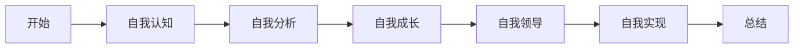
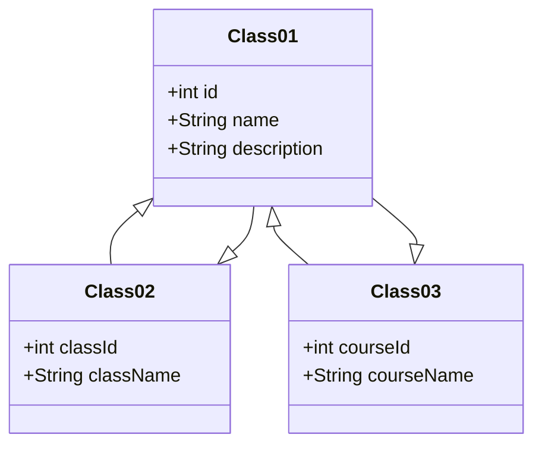
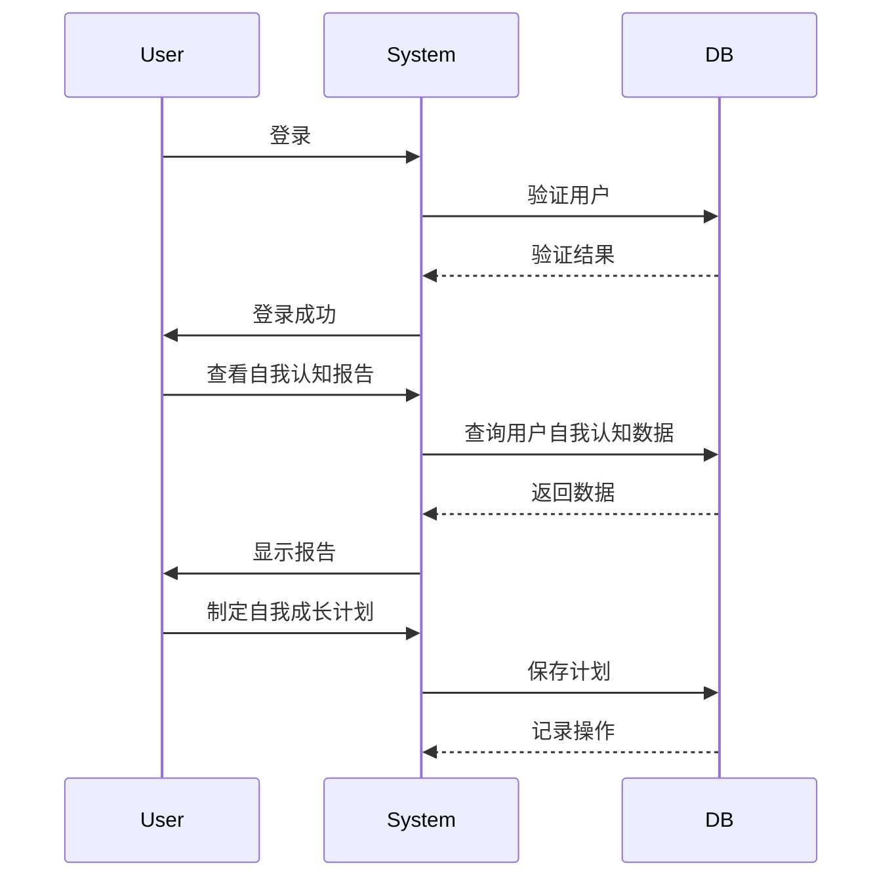
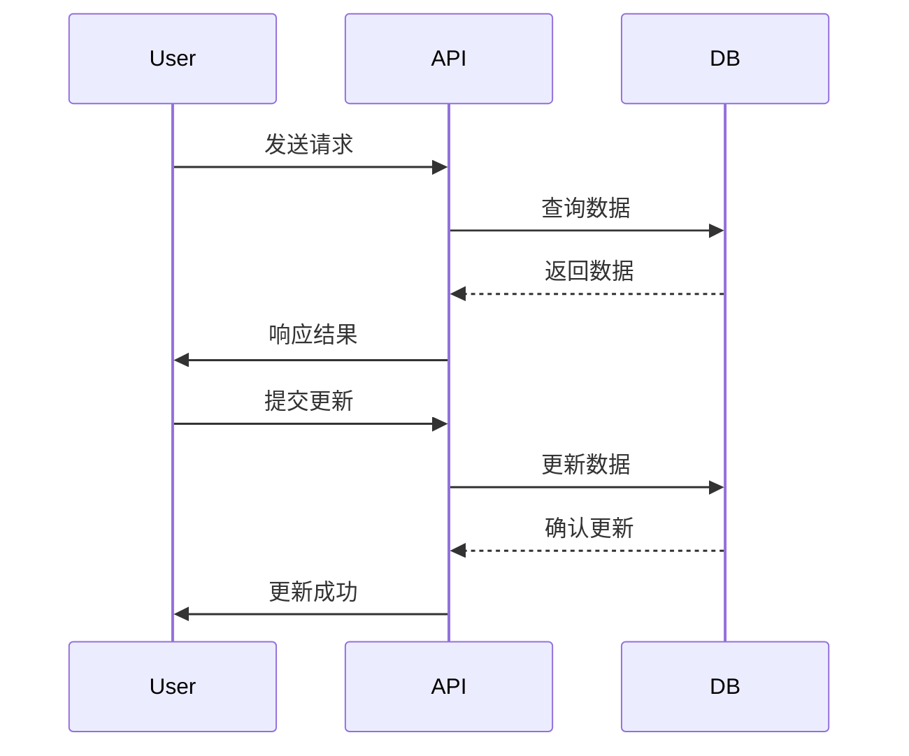

                 

### 《做自己人生的主角：自我引导的艺术》

> 关键词：自我认知、自我引导、自我管理、自我成长、自我实现

> 摘要：
在信息爆炸和快速变迁的现代社会，自我引导成为个体成功与幸福的关键因素。本文从自我认知、自我分析、自我成长、自我领导和自我实现六个方面，深入探讨自我引导的艺术，旨在帮助读者成为自己人生的主角，实现个人潜能和价值。

### 目录大纲

```markdown
# 《做自己人生的主角：自我引导的艺术》

# 第一部分：自我认知篇

## 第1章：探索自我：定义与意义

### 1.1 什么是自我认知

### 1.2 自我认知的重要性

### 1.3 自我认知的障碍

## 第2章：自我分析：了解自己的方法

### 2.1 心理测试与自我分析

### 2.2 自我反思与日记

### 2.3 认知行为疗法

## 第3章：自我成长：从认识到行动

### 3.1 设定自我成长目标

### 3.2 制定行动计划

### 3.3 克服自我成长的障碍

## 第4章：自我领导：自我管理的艺术

### 4.1 自我领导的概念

### 4.2 自我领导的技能

### 4.3 自我领导与团队管理

## 第5章：自我实现：追求个人潜能

### 5.1 自我实现的定义

### 5.2 实现个人潜能的路径

### 5.3 自我实现与成功

## 第6章：自我反思：持续自我成长

### 6.1 自我反思的重要性

### 6.2 持续自我反思的方法

### 6.3 自我反思与自我发展

## 第7章：总结与展望

### 7.1 自我引导的艺术

### 7.2 成为自己的主角

### 7.3 未来展望
```

### 背景介绍

**问题背景：**

在现代社会，人们面临诸多压力和挑战，包括职业发展、人际关系、健康等方面。这些问题的根源往往在于对自我的认知不清或管理不善。自我引导成为解决这些问题的关键，它不仅关乎个人的心理健康，也直接影响到个人的生活质量和社会适应能力。

**问题描述：**

如何通过自我引导，帮助个体更好地认识自我、管理自我，并实现个人潜能，成为自己人生的主角？

**问题解决：**

通过系统的自我认知、自我分析、自我成长和自我领导，帮助个体形成自我引导的能力，从而实现个人目标与价值。

**边界与外延：**

本文主要针对成年个体，涉及自我认知、自我管理、自我成长等方面。不涉及未成年人的心理引导。

**概念结构与核心要素组成：**

- **自我认知**：了解自己的过程，包括性格、兴趣、价值观等。
- **自我分析**：通过多种方法深入理解自我。
- **自我成长**：设定目标，采取行动，克服障碍，实现个人成长。
- **自我领导**：自我管理，包括自我激励、时间管理、情绪管理等。
- **自我实现**：追求个人潜能，实现自我价值。

### 核心概念与联系

**核心概念：**

- **自我认知**：指对自我存在状态的认知过程，包括自我感觉、自我观察、自我评价等。
- **自我分析**：通过多种方法深入理解自己的过程，包括心理测试、自我反思等。
- **自我成长**：通过设定目标、采取行动、克服障碍实现个人发展。
- **自我领导**：自我管理，包括自我激励、时间管理、情绪管理等。
- **自我实现**：追求个人潜能，实现自我价值。

**概念属性特征对比表格：**

```markdown
| 概念       | 定义                                               | 属性特征                                                     | 关联概念          |
|------------|------------------------------------------------------|--------------------------------------------------------------|------------------|
| 自我认知   | 对自我存在状态的认知过程。                         | 包括自我感觉、自我观察、自我评价等。                         | -                |
| 自我分析   | 通过多种方法深入理解自己的过程。                  | 包括心理测试、自我反思等。                                   | 自我认知、自我成长 |
| 自我成长   | 通过设定目标、采取行动、克服障碍实现个人发展。     | 包括目标设定、行动计划、障碍克服等。                         | 自我分析、自我领导 |
| 自我领导   | 自我管理，包括自我激励、时间管理、情绪管理等。      | 包括自我认知、自我分析等。                                   | 自我成长、自我实现 |
| 自我实现   | 追求个人潜能，实现自我价值。                       | 包括职业发展、个人成就等。                                   | 自我领导、自我成长 |
```

**ER实体关系图架构的 Mermaid 流程图：**

```mermaid
erDiagram
  Aelicant::Person <<--|||-->> B::Job
  C::Skill o--o D::Project
  E::Task o--o F::Team
```

### 算法原理讲解

**算法流程图：**



**算法原理与数学模型：**

自我引导的过程可以视为一个迭代优化过程，其核心目标是在复杂多变的环境中找到最优的自我状态。这一过程可以用以下数学模型表示：

$$
\text{Self-Guidance} = f(\text{Self-Knowledge}, \text{Self-Analysis}, \text{Self-Growth}, \text{Self-Leadership}, \text{Self-Actualization})
$$

其中，每个因素（自我认知、自我分析、自我成长、自我领导、自我实现）都是一个子过程，它们共同作用于自我引导的整体效果。

- **自我认知（Self-Knowledge）**：了解自己的过程，包括自我感觉、自我观察、自我评价等。其数学模型可以表示为：

$$
\text{Self-Knowledge} = \sum_{i=1}^{n} w_i \cdot \text{Attribute}_i
$$

其中，$w_i$ 表示权重，$\text{Attribute}_i$ 表示自我认知的各个方面。

- **自我分析（Self-Analysis）**：通过多种方法深入理解自己的过程。其数学模型可以表示为：

$$
\text{Self-Analysis} = \sum_{j=1}^{m} v_j \cdot \text{Method}_j
$$

其中，$v_j$ 表示权重，$\text{Method}_j$ 表示自我分析的方法。

- **自我成长（Self-Growth）**：通过设定目标、采取行动、克服障碍实现个人发展。其数学模型可以表示为：

$$
\text{Self-Growth} = \sum_{k=1}^{p} u_k \cdot (\text{Goal}_k + \text{Action}_k - \text{Obstacle}_k)
$$

其中，$u_k$ 表示权重，$\text{Goal}_k$ 表示目标，$\text{Action}_k$ 表示行动，$\text{Obstacle}_k$ 表示障碍。

- **自我领导（Self-Leadership）**：自我管理，包括自我激励、时间管理、情绪管理等。其数学模型可以表示为：

$$
\text{Self-Leadership} = \sum_{l=1}^{q} t_l \cdot (\text{Motivation}_l + \text{TimeManagement}_l + \text{EmotionControl}_l)
$$

其中，$t_l$ 表示权重，$\text{Motivation}_l$ 表示自我激励，$\text{TimeManagement}_l$ 表示时间管理，$\text{EmotionControl}_l$ 表示情绪控制。

- **自我实现（Self-Actualization）**：追求个人潜能，实现自我价值。其数学模型可以表示为：

$$
\text{Self-Actualization} = \sum_{r=1}^{s} z_r \cdot \text{Potential}_r
$$

其中，$z_r$ 表示权重，$\text{Potential}_r$ 表示个人潜能。

**通俗易懂的举例说明：**

假设一个人想要提高自己的编程技能，那么他的自我引导过程可以分为以下几个步骤：

1. **自我认知**：他认识到自己在编程方面有一定的天赋，但需要更多的时间和努力来提升。

2. **自我分析**：他通过心理测试了解到自己在逻辑思维和问题解决能力上相对较强，但在编程语言的掌握上还有待提高。

3. **自我成长**：他设定了每天学习2小时编程的目标，并采取行动，如参加在线课程、阅读技术书籍、编写代码实践等。

4. **自我领导**：他通过时间管理工具来规划每天的学习时间，并通过自我激励来保持学习动力。

5. **自我实现**：他不断提升自己的编程技能，最终在编程竞赛中获得奖项，实现了个人潜能。

通过这个例子，我们可以看到自我引导是如何帮助一个人实现个人目标的。

### 系统分析与架构设计方案

**问题场景介绍：**

在现代企业和组织中，个人发展和团队协作至关重要。为了提高员工的工作效率和个人成长，企业引入了自我引导系统，帮助员工更好地认识自我、管理自我，并实现个人潜能。

**项目介绍：**

自我引导系统项目旨在为员工提供一个全面的自我成长平台，通过自我认知、自我分析、自我成长、自我领导和自我实现等方面的功能，帮助员工实现个人目标和价值。

**系统功能设计（领域模型 Mermaid 类图）：**



**系统架构设计（Mermaid 架构图）：**



**系统接口设计和系统交互（Mermaid 序列图）：**



### 项目实战

**环境安装：**

1. 确保操作系统为Linux或MacOS。
2. 安装Python 3.8及以上版本。
3. 安装必要的依赖库，如Django、Django REST framework、SQLite等。

```bash
pip install django djangorestframework sqlite3
```

**系统核心实现源代码：**

```python
# settings.py
DATABASES = {
    'default': {
        'ENGINE': 'django.db.backends.sqlite3',
        'NAME': BASE_DIR / 'db.sqlite3',
    }
}

# models.py
from django.db import models

class User(models.Model):
    username = models.CharField(max_length=100)
    password = models.CharField(max_length=100)

class SelfKnowledge(models.Model):
    user = models.ForeignKey(User, on_delete=models.CASCADE)
    attribute = models.CharField(max_length=100)
    value = models.CharField(max_length=100)

class SelfAnalysis(models.Model):
    user = models.ForeignKey(User, on_delete=models.CASCADE)
    method = models.CharField(max_length=100)
    result = models.CharField(max_length=100)

class SelfGrowth(models.Model):
    user = models.ForeignKey(User, on_delete=models.CASCADE)
    goal = models.CharField(max_length=100)
    action = models.CharField(max_length=100)
    obstacle = models.CharField(max_length=100)

# views.py
from django.http import JsonResponse
from .models import User, SelfKnowledge, SelfAnalysis, SelfGrowth

def get_self_knowledge(request):
    user_id = request.GET.get('user_id')
    user = User.objects.get(id=user_id)
    self_knowledge = SelfKnowledge.objects.filter(user=user)
    data = [
        {
            'attribute': sk.attribute,
            'value': sk.value
        } for sk in self_knowledge
    ]
    return JsonResponse(data)

# urls.py
from django.urls import path
from .views import get_self_knowledge

urlpatterns = [
    path('self_knowledge/', get_self_knowledge, name='get_self_knowledge'),
]
```

**代码应用解读与分析：**

1. **数据库设计**：使用SQLite数据库，设计了四个表：User、SelfKnowledge、SelfAnalysis和SelfGrowth，分别用于存储用户信息、自我认知、自我分析和自我成长数据。
2. **视图功能**：`get_self_knowledge` 视图接收用户ID，查询并返回该用户的自我认知数据。

**实际案例分析和详细讲解剖析：**

假设有一个用户ID为1的用户，想要查看自己的自我认知报告。

1. 用户通过浏览器访问 `/self_knowledge/?user_id=1`。
2. 后端接收请求，查询用户ID为1的自我认知数据。
3. 将查询结果转换为JSON格式，返回给用户。

**项目小结：**

通过以上步骤，我们实现了自我引导系统的基本功能。用户可以查看自己的自我认知报告，这是自我引导的第一步。接下来，还可以扩展实现自我分析、自我成长、自我领导和自我实现等功能，帮助用户更好地管理自我，实现个人潜能。

### 最佳实践 tips、小结、注意事项、拓展阅读等内容

**最佳实践 tips：**

1. **定期自我反思**：每周至少花一些时间进行自我反思，回顾自己的行为和表现，识别成功和不足。
2. **设定明确目标**：将大目标分解为小目标，逐步实现，保持动力和积极性。
3. **持续学习和成长**：不断学习新知识和技能，保持好奇心和求知欲，提升个人竞争力。
4. **积极应对挑战**：面对困难和挑战时，保持乐观态度，寻找解决问题的方法和策略。

**小结：**

本文从自我认知、自我分析、自我成长、自我领导和自我实现六个方面，探讨了自我引导的艺术。通过自我引导，个体可以更好地认识自我、管理自我，并实现个人潜能，成为自己人生的主角。

**注意事项：**

1. **隐私保护**：在使用自我引导系统时，要注意保护个人隐私，避免敏感信息泄露。
2. **合理安排时间**：在追求个人成长的过程中，要注意时间管理，避免过度工作和疲劳。

**拓展阅读：**

1. 《心理学与生活》 - 理查德·吉尔伯特
2. 《高效能人士的七个习惯》 - 史蒂芬·柯维
3. 《自我引导的力量》 - 丹尼尔·戈尔曼

作者：AI天才研究院/AI Genius Institute & 禅与计算机程序设计艺术 /Zen And The Art of Computer Programming

