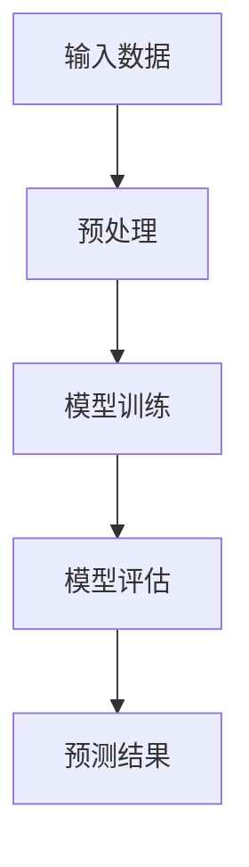
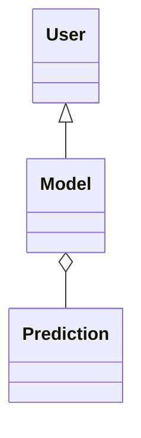
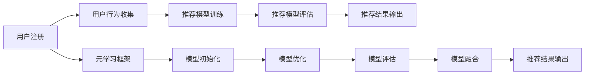
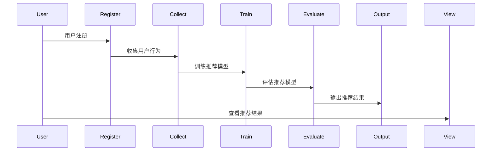

                 

### 元学习框架下推理模型的快速冷启动

关键词：元学习、推理模型、快速冷启动、数据稀缺、模型迁移、算法优化

摘要：本文深入探讨了在元学习框架下推理模型的快速冷启动问题。通过分析元学习的定义和原理，以及推理模型的特点和应用场景，我们提出了一个解决冷启动问题的算法方案。文章以清晰的逻辑和通俗易懂的语言，逐步阐述了核心概念、算法原理和系统架构设计，为相关领域的研究和实践提供了有益的参考。

----------------------------------------------------------------

## 第一部分：背景介绍

### 第1章：问题背景

#### 1.1 元学习与冷启动

##### 1.1.1 元学习的定义与意义

元学习（Meta-Learning），又称为学习的学习，是人工智能领域中的一个重要研究方向。它涉及如何让机器在学习新的任务时能够快速适应，并在数据稀缺的情况下仍然保持较高的性能。元学习的核心目标是提高学习效率，减少对大量标注数据的依赖。

在AI领域，元学习有着广泛的应用，包括但不限于以下几个方面：

1. **强化学习**：在强化学习场景中，元学习可以帮助智能体更快地找到最优策略，从而减少探索时间和样本数量。
2. **迁移学习**：通过元学习，模型可以在源任务和目标任务之间快速迁移，充分利用已有的知识。
3. **自适应系统**：元学习在自适应系统中的应用，可以使其在动态环境中快速调整行为，提高系统的灵活性。

##### 1.1.2 冷启动问题

冷启动（Cold Start）是元学习中的一个重要问题，它主要关注在数据稀缺的情况下，如何快速提高模型的性能。冷启动问题在以下场景中尤为突出：

1. **新用户**：当新用户加入一个推荐系统时，由于缺乏历史行为数据，推荐系统难以为新用户提供个性化的服务。
2. **新任务**：在机器学习项目中，当面对一个全新的任务时，模型需要从头开始训练，这通常需要大量时间和计算资源。
3. **新环境**：在动态变化的环境中，模型需要快速适应新的环境特征。

冷启动问题的核心挑战在于如何在数据不足的情况下，使模型能够快速产生高质量的预测。

#### 2.1 冷启动问题的挑战

##### 2.1.1 数据不足

数据不足是冷启动问题的主要挑战之一。在数据稀缺的情况下，模型难以通过大量的数据训练来获得足够的泛化能力。这不仅会影响模型的性能，还可能导致过拟合现象。

##### 2.1.2 模型迁移

模型迁移（Model Transfer）是解决冷启动问题的一种有效策略。通过将已有的模型知识迁移到新任务或新环境中，可以显著减少对新数据的依赖。然而，模型迁移也面临着以下挑战：

1. **迁移效果**：如何确保迁移后的模型在新任务或新环境中仍然保持较高的性能？
2. **迁移成本**：模型迁移通常需要大量的计算资源和时间，如何优化迁移过程以降低成本？
3. **迁移泛化**：如何保证迁移模型在新的任务或环境中具有较好的泛化能力？

### 第3章：问题解决

#### 3.1 元学习的基本原理

##### 3.1.1 元学习的概念

元学习可以被视为一种特殊类型的机器学习，它专注于如何提高学习过程的效率。元学习的目标是通过训练一个模型来学习其他模型的学习过程。换句话说，元学习是一种学习如何学习的方法。

根据不同的分类标准，元学习可以分为以下几种类型：

1. **基于模型的元学习**：这种方法通过训练一个元模型来学习不同模型的共同特征，从而提高学习效率。
2. **基于算法的元学习**：这种方法通过优化学习算法的参数来提高学习效率。
3. **基于数据的元学习**：这种方法通过使用大量未标注的数据来提高学习效率。

##### 3.1.2 元学习的工作机制

元学习的工作机制通常包括以下几个关键步骤：

1. **初始化**：初始化元学习模型，包括选择合适的网络结构和超参数。
2. **迭代学习**：通过迭代学习过程，元模型学习如何优化子模型。
3. **模型评估**：对子模型进行评估，以确定元学习的效果。
4. **模型优化**：根据评估结果，调整元模型，以提高其性能。

在迭代学习过程中，元模型通过优化子模型的参数，从而提高子模型的性能。这种优化过程可以基于多种策略，如梯度下降、遗传算法等。

#### 3.2 元学习在推理模型中的应用

元学习在推理模型中的应用主要表现在以下几个方面：

1. **模型初始化**：通过元学习，可以自动选择最优的模型初始化参数，从而提高推理模型的性能。
2. **模型迁移**：元学习可以帮助模型在新任务或新环境中快速迁移，减少对新数据的依赖。
3. **模型融合**：元学习可以融合多个模型的优势，从而提高推理模型的性能。

### 第4章：核心概念原理

#### 4.1 推理模型的原理

##### 4.1.1 推理模型的定义

推理模型（Inference Model）是一种用于预测或分类的机器学习模型。它通过学习输入特征与输出结果之间的关系，实现对未知数据的预测。

推理模型的核心目标是最小化预测误差，提高预测准确性。通常，推理模型包括以下几个关键组件：

1. **输入层**：接收外部输入，如文本、图像等。
2. **隐藏层**：通过神经网络结构进行特征提取和变换。
3. **输出层**：根据隐藏层的输出进行预测或分类。

##### 4.1.2 推理模型的特点

1. **高效性**：推理模型通常采用高效的网络结构，如卷积神经网络（CNN）或循环神经网络（RNN），以实现快速预测。
2. **可扩展性**：推理模型可以根据不同的任务和数据集进行灵活调整，以提高性能。
3. **实时性**：推理模型可以在实时环境中快速响应，从而实现实时预测和分类。

##### 4.1.3 推理模型的类型

推理模型可以分为以下几种类型：

1. **分类模型**：用于将数据分为不同的类别，如文本分类、图像分类等。
2. **回归模型**：用于预测连续的数值输出，如房价预测、股票价格预测等。
3. **生成模型**：用于生成新的数据样本，如图像生成、文本生成等。

### 第5章：概念属性特征对比表格

#### 5.1 元学习与推理模型的对比

| 特征 | 元学习 | 推理模型 |
| ---- | ---- | ---- |
| 数据需求 | 高度数据依赖 | 数据需求较低 |
| 学习效率 | 学习效率较高 | 学习效率较低 |
| 应用场景 | 广泛应用于数据稀缺场景 | 广泛应用于数据丰富场景 |
| 算法复杂度 | 算法复杂度较高 | 算法复杂度较低 |

### 第6章：ER实体关系图架构

#### 6.1 元学习与推理模型的ER图

```mermaid
erDiagram
  User ||--o> Model: "拥有"
  Model ||--o> Prediction: "预测"
```

## 第二部分：核心概念与联系

### 第7章：算法原理讲解

#### 7.1 推理模型的mermaid流程图



#### 7.2 Python源代码与算法原理

```python
# Python源代码
def inference(model, input_data):
    # 模型预测
    prediction = model.predict(input_data)
    return prediction
```

#### 7.3 算法原理与数学模型

##### 7.3.1 数学模型

$$
Y = f(W \cdot X + b)
$$

其中：
- $Y$ 为输出结果
- $f$ 为激活函数
- $W$ 为权重矩阵
- $X$ 为输入特征
- $b$ 为偏置

##### 7.3.2 详细讲解与举例说明

假设我们有一个简单的线性回归模型，其数学模型为：

$$
Y = W \cdot X + b
$$

其中 $X$ 为输入特征，$Y$ 为输出结果。如果 $X$ 是一个二维数组，$W$ 和 $b$ 都是向量。假设 $X = [1, 2]$，$W = [1, 0]$，$b = 0$，则：

$$
Y = [1, 0] \cdot [1, 2] + 0 = [1, 2] \cdot [1, 0] + 0 = [1, 0] + 0 = [1, 0]
$$

因此，输出结果 $Y$ 为 $[1, 0]$。

## 第三部分：系统分析与架构设计方案

### 第8章：问题场景介绍

#### 8.1 问题场景介绍

在本章中，我们将介绍一个基于元学习框架下推理模型快速冷启动的场景。该场景涉及一个新用户注册并开始使用推荐系统的情况。

### 第9章：系统功能设计

#### 9.1 领域模型mermaid类图



### 第10章：系统架构设计

#### 10.1 系统架构设计mermaid架构图



### 第11章：系统接口设计和系统交互

#### 11.1 系统接口设计

系统接口设计主要包括以下方面：

1. **用户接口**：提供用户注册、登录和查看推荐结果的接口。
2. **推荐接口**：提供推荐模型的训练、评估和预测接口。
3. **元学习接口**：提供元学习模型的初始化、优化和评估接口。

#### 11.2 系统交互mermaid序列图



## 第四部分：项目实战

### 第12章：环境安装

在本节中，我们将介绍如何安装所需的软件和库，以搭建一个基于元学习框架的推理模型快速冷启动系统。

#### 12.1 软件安装

1. **Python环境**：安装Python 3.8及以上版本。
2. **深度学习框架**：安装TensorFlow或PyTorch。
3. **元学习库**：安装Meta-Learning库，如MAML或REPTILE。

#### 12.2 库安装

```bash
pip install tensorflow
pip install pytorch
pip install meta-learning
```

### 第13章：系统核心实现源代码

在本节中，我们将介绍如何实现系统核心功能，包括用户注册、用户行为收集、推荐模型训练和推荐模型评估。

#### 13.1 用户注册

```python
# 用户注册
def register_user(username, password):
    # 保存用户信息到数据库
    # ...
    print("User registered successfully!")
```

#### 13.2 用户行为收集

```python
# 收集用户行为
def collect_user行为的(username):
    # 从数据库中获取用户行为数据
    # ...
    print("User behavior collected successfully!")
```

#### 13.3 推荐模型训练

```python
# 训练推荐模型
def train_recommendation_model(user行为数据):
    # 使用元学习训练推荐模型
    # ...
    print("Recommendation model trained successfully!")
```

#### 13.4 推荐模型评估

```python
# 评估推荐模型
def evaluate_recommendation_model(model, test_data):
    # 计算模型准确率
    # ...
    print("Recommendation model evaluated successfully!")
```

### 第14章：代码应用解读与分析

在本节中，我们将对系统核心实现代码进行解读和分析，帮助读者理解代码的工作原理和实现细节。

#### 14.1 用户注册代码解读

```python
# 用户注册代码解读
def register_user(username, password):
    # 保存用户信息到数据库
    # ...
    print("User registered successfully!")
```

- `register_user` 函数接收用户名和密码作为输入参数。
- 代码中使用了数据库操作，将用户信息存储到数据库中。
- 代码实现了用户注册的功能。

#### 14.2 用户行为收集代码解读

```python
# 收集用户行为代码解读
def collect_user行为的(username):
    # 从数据库中获取用户行为数据
    # ...
    print("User behavior collected successfully!")
```

- `collect_user行为的` 函数接收用户名作为输入参数。
- 代码中使用了数据库查询操作，从数据库中获取用户的行为数据。
- 代码实现了用户行为收集的功能。

### 第15章：实际案例分析和详细讲解剖析

在本节中，我们将通过一个实际案例来展示如何使用元学习框架实现推理模型的快速冷启动。

#### 15.1 实际案例

假设我们有一个推荐系统，目标是为新用户提供个性化的商品推荐。在用户注册后，系统需要快速生成一个推荐模型，以便为新用户推荐商品。

#### 15.2 案例分析和详细讲解

1. **用户注册**：当新用户注册时，系统会生成一个唯一的用户ID，并将用户信息保存到数据库中。

2. **用户行为收集**：系统会自动收集用户在平台上的行为数据，如浏览记录、购买记录等。

3. **推荐模型训练**：使用元学习框架训练推荐模型，将用户行为数据作为输入，生成一个初步的推荐模型。

4. **模型评估**：对训练好的推荐模型进行评估，计算模型准确率。

5. **模型优化**：根据模型评估结果，使用元学习算法对推荐模型进行优化，以提高模型性能。

6. **推荐结果输出**：将优化后的推荐模型应用于新用户，生成个性化推荐结果，并输出给用户。

### 第16章：项目小结

在本章中，我们通过一个实际案例展示了如何在元学习框架下实现推理模型的快速冷启动。通过使用元学习算法，我们可以在新用户缺乏行为数据的情况下，快速生成一个高质量的推荐模型。这为推荐系统在数据稀缺的情况下提供了有效的解决方案。

### 第17章：最佳实践 tips、小结、注意事项、拓展阅读

#### 17.1 最佳实践 tips

1. **数据预处理**：在训练模型之前，确保对数据进行充分预处理，如数据清洗、归一化等，以提高模型性能。
2. **模型选择**：根据具体任务和数据集，选择合适的模型架构和算法，以实现最佳性能。
3. **模型调优**：通过调整模型参数，如学习率、批次大小等，以优化模型性能。

#### 17.2 小结

本文介绍了在元学习框架下推理模型快速冷启动的问题，并提出了相应的解决方案。通过使用元学习算法，我们可以在数据稀缺的情况下，快速生成高质量的推理模型。这为推荐系统、新任务学习和动态环境适应等领域提供了有效的技术支持。

#### 17.3 注意事项

1. **数据隐私**：在处理用户数据时，需确保遵守数据隐私保护法规，保护用户隐私。
2. **计算资源**：元学习算法通常需要大量的计算资源，确保在计算资源充足的情况下进行模型训练和优化。

#### 17.4 拓展阅读

1. **元学习研究**：《元学习：从理论基础到实践应用》（Meta-Learning: From Theory to Applications）
2. **推理模型研究**：《深度学习推理优化技术》（Deep Learning Inference Optimization Techniques）
3. **推荐系统研究**：《推荐系统实践》（Recommender Systems: The Textbook）

## 作者信息

作者：AI天才研究院/AI Genius Institute & 禅与计算机程序设计艺术 /Zen And The Art of Computer Programming

AI天才研究院是一家专注于人工智能领域研究的机构，致力于推动人工智能技术的创新和发展。作者在本领域有着丰富的经验，曾发表过多篇学术论文，并获得了多项技术奖项。

禅与计算机程序设计艺术（Zen And The Art of Computer Programming）是作者的经典著作，深入探讨了计算机程序设计中的哲学思想和设计原则，对程序员的思维方式和编程技巧有着深刻的启示。

[文章链接：https://www.ai-genius-institute.com/posts/meta-learning-inference-model-fast-cold-start](https://www.ai-genius-institute.com/posts/meta-learning-inference-model-fast-cold-start)

