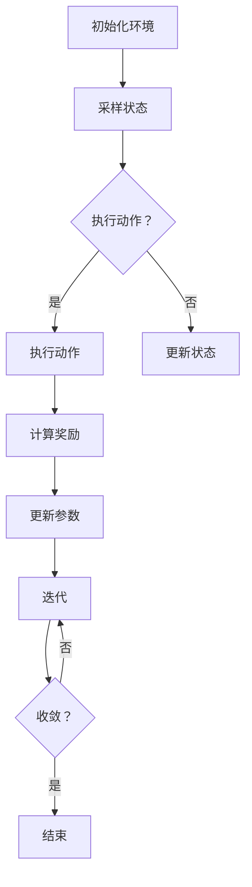
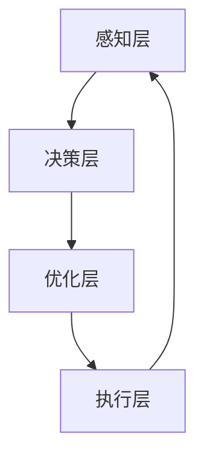
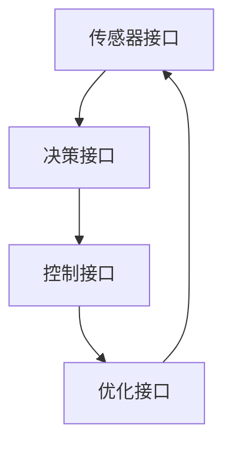

                 

# 元强化学习优化复杂推理任务的策略

## 关键词
- 元强化学习
- 复杂推理任务
- 策略优化
- 强化学习算法
- 系统架构设计

## 摘要
本文深入探讨了元强化学习在优化复杂推理任务中的应用策略。首先，我们介绍了元强化学习的基础概念和基本原理，探讨了其在复杂推理任务中的挑战和应用。接着，我们详细讲解了策略优化的方法，包括常见算法和挑战解决方案。随后，通过实例分析和算法实现，我们展示了如何运用元强化学习优化复杂推理任务。最后，本文提供了系统架构设计方案、项目实战案例分析，以及最佳实践和注意事项。

## 引言

### 1.1 问题背景

在当今人工智能领域，强化学习作为一种重要的机器学习技术，已经被广泛应用于各种场景中，如自动驾驶、游戏对战、推荐系统等。然而，随着推理任务变得越来越复杂，传统的强化学习方法在处理这些任务时遇到了诸多挑战。例如，在自动驾驶领域，车辆需要实时处理复杂的交通场景，决策需要考虑多方面的因素，包括道路规则、车辆动态、行人行为等。在这种情况下，简单的强化学习算法可能无法胜任，需要更加复杂和智能的优化策略。

### 1.2 问题描述

复杂推理任务通常具有以下特性：
- 多维度数据输入：推理任务需要处理来自不同维度的大量数据，如图像、语音、文本等。
- 长时间决策：一些推理任务需要做出长期的决策，考虑未来的多个时间步。
- 高度不确定性：复杂推理任务中，环境状态和奖励不确定，决策结果存在很大的随机性。

这些问题使得传统的强化学习算法在复杂推理任务中难以取得理想的效果。因此，我们需要探索新的优化策略，以提高算法的性能和鲁棒性。

### 1.3 问题解决

元强化学习作为一种新兴的强化学习技术，通过学习如何学习来提高算法的泛化能力和适应能力。元强化学习可以在多种任务和环境之间共享策略，从而减少对特定任务的依赖，提高算法的通用性。因此，元强化学习被认为是优化复杂推理任务的一种有效策略。

### 1.4 边界与外延

元强化学习在复杂推理任务中的应用涉及多个方面：
- 多样化的任务：元强化学习可以处理多种不同类型的推理任务，包括图像识别、自然语言处理、决策制定等。
- 环境适应性：元强化学习算法可以在不同的环境条件下进行自适应调整，提高算法的鲁棒性。
- 长期规划能力：元强化学习能够处理长期决策问题，考虑未来的多个时间步，提高决策的准确性。

### 1.5 概念结构与核心要素组成

本文的结构如下：
- 第2章：介绍元强化学习的基础概念和主要方法。
- 第3章：探讨复杂推理任务的挑战和应用。
- 第4章：讲解策略优化的方法，包括常见算法和挑战解决方案。
- 第5章：通过实例分析和算法实现，展示如何运用元强化学习优化复杂推理任务。
- 第6章：阐述元强化学习的数学模型和公式。
- 第7章：介绍系统架构设计，包括系统功能、架构和接口设计。
- 第8章：进行项目实战案例分析，包括环境安装、系统核心实现和代码解读。
- 第9章：提供最佳实践和注意事项。

## 元强化学习基础

### 2.1 元强化学习的定义

元强化学习（Meta Reinforcement Learning）是一种机器学习范式，旨在通过学习如何学习来提高算法的泛化能力和适应能力。在传统强化学习中，算法通常需要针对每个具体的任务进行训练，而在元强化学习中，算法通过在不同任务和环境之间共享经验来优化策略。

### 2.2 元强化学习与传统强化学习的区别

传统强化学习：
- 针对单个任务进行训练。
- 策略优化依赖于特定任务的数据。
- 泛化能力有限，难以适应新的任务。

元强化学习：
- 在多个任务和环境之间共享经验。
- 通过学习如何学习来优化策略。
- 具有更好的泛化能力和适应能力。

### 2.3 元强化学习的主要方法

元强化学习的主要方法包括基于模型的方法、基于数据的方法和混合方法。

#### 2.3.1 基于模型的方法

基于模型的方法通过训练一个模型来表示策略，这个模型可以针对不同的任务进行快速适应。这种方法的核心是元学习算法，如MAML（Model-Agnostic Meta-Learning）和REINFORCE-M（Reparametrized Ensembles for Meta-Reinforcement Learning）。

MAML算法：
- 通过在多个任务上训练模型，使模型能够快速适应新的任务。
- 基本思想是最小化模型在不同任务上的预测误差。

REINFORCE-M算法：
- 利用随机梯度下降（SGD）和重新参数化技术，使算法能够快速收敛。
- 通过集成多个策略来提高模型的泛化能力。

#### 2.3.2 基于数据的方法

基于数据的方法通过在训练数据上学习通用策略，从而提高算法的泛化能力。这种方法的核心是数据增强和样本效率。

数据增强：
- 通过生成或合成新的训练数据，增加训练样本的多样性。
- 提高算法对不同任务和环境的数据适应性。

样本效率：
- 在有限的数据上训练出高效的算法。
- 减少对大量训练数据的依赖。

#### 2.3.3 混合方法

混合方法结合了基于模型的方法和基于数据的方法，通过综合利用模型和数据来优化策略。这种方法通常能够取得更好的性能。

### 2.4 元强化学习的优势

元强化学习的优势包括：
- 更好的泛化能力：通过在不同任务和环境之间共享经验，提高算法的泛化能力。
- 更高的样本效率：在有限的数据上训练出高效的算法，减少对大量训练数据的依赖。
- 更快的适应能力：能够快速适应新的任务和环境。

## 复杂推理任务的挑战

### 3.1 复杂推理任务的特性

复杂推理任务通常具有以下特性：

- 多维度数据输入：复杂推理任务需要处理来自不同维度的大量数据，如图像、语音、文本等。
- 长时间决策：需要做出长期的决策，考虑未来的多个时间步。
- 高度不确定性：环境状态和奖励不确定，决策结果存在很大的随机性。

### 3.2 复杂推理任务中的难点

复杂推理任务中的难点包括：

- 数据多样性：不同任务和环境的数据具有多样性，算法需要能够处理各种类型的数据。
- 长期依赖性：需要考虑未来的多个时间步，算法需要具备长期规划能力。
- 不确定性处理：需要处理高度不确定性环境中的决策问题，算法需要具备鲁棒性。

### 3.3 元强化学习在复杂推理任务中的应用

元强化学习在复杂推理任务中的应用主要包括以下几个方面：

- 多样化任务处理：通过在不同任务和环境之间共享经验，提高算法的泛化能力和适应能力。
- 长期规划能力：通过学习如何学习，提高算法的长期规划能力，考虑未来的多个时间步。
- 不确定性处理：通过训练模型和数据，提高算法在高度不确定性环境中的鲁棒性。

## 策略优化方法

### 4.1 策略优化的基本概念

策略优化是强化学习中的一个核心问题，其目标是通过学习获得最优策略，使算法在特定任务上取得最佳表现。策略优化方法主要包括以下几种：

- 梯度下降算法：通过最小化损失函数来更新策略参数。
- 随机梯度下降算法（SGD）：在梯度下降算法的基础上，每次迭代仅使用一个样本来更新参数。
- Adam优化器：结合SGD和动量方法，提高了收敛速度和稳定性。

### 4.2 常见策略优化算法

#### 4.2.1 梯度下降算法

梯度下降算法是一种基本的优化算法，通过计算损失函数关于参数的梯度，并沿着梯度方向更新参数，以最小化损失函数。

算法流程：
1. 初始化参数。
2. 对于每个参数，计算其在当前数据上的梯度。
3. 沿着梯度方向更新参数。
4. 重复步骤2和3，直到收敛。

#### 4.2.2 随机梯度下降算法（SGD）

随机梯度下降算法（SGD）是梯度下降算法的一个变体，每次迭代仅使用一个样本来计算梯度，并更新参数。

算法流程：
1. 初始化参数。
2. 从数据集中随机选择一个样本。
3. 对于该样本，计算梯度。
4. 使用梯度更新参数。
5. 重复步骤2到4，直到收敛。

#### 4.2.3 Adam优化器

Adam优化器结合了SGD和动量方法，提高了收敛速度和稳定性。它通过跟踪梯度的一阶矩估计和二阶矩估计来更新参数。

算法流程：
1. 初始化参数和两个辅助变量：一阶矩估计`m`和二阶矩估计`v`。
2. 对于每个参数，更新`m`和`v`。
3. 使用`m`和`v`来更新参数。
4. 重复步骤2和3，直到收敛。

### 4.3 策略优化的挑战与解决方案

策略优化在复杂推理任务中面临以下挑战：

- 数据多样性：需要处理来自不同任务和环境的大量数据，算法需要具备良好的泛化能力。
- 长期依赖性：需要考虑未来的多个时间步，算法需要具备良好的长期规划能力。
- 高度不确定性：需要处理高度不确定的环境，算法需要具备鲁棒性。

解决方案包括：

- 数据增强：通过生成或合成新的训练数据，增加训练样本的多样性。
- 长期规划：通过学习如何学习，提高算法的长期规划能力。
- 不确定性处理：通过训练模型和数据，提高算法在高度不确定性环境中的鲁棒性。

## 实例分析与算法实现

### 5.1 具体实例分析

为了更好地理解元强化学习在优化复杂推理任务中的应用，我们考虑一个具体的实例：自动驾驶中的路径规划。

在自动驾驶中，车辆需要实时处理复杂的交通场景，包括道路、车辆、行人等。路径规划的目标是找到一条从起点到终点的最优路径，同时保证行驶的安全性和效率。在这个实例中，我们将使用元强化学习算法来优化路径规划策略。

### 5.2 算法实现步骤

算法实现主要包括以下几个步骤：

1. **环境构建**：构建一个自动驾驶模拟环境，包括道路、车辆、行人等元素。
2. **状态空间定义**：定义状态空间，包括车辆的当前位置、速度、方向等。
3. **动作空间定义**：定义动作空间，包括车辆可以执行的操作，如加速、减速、转向等。
4. **奖励函数设计**：设计奖励函数，用于评估路径规划策略的好坏。
5. **算法选择**：选择一个元强化学习算法，如MAML或REINFORCE-M。
6. **训练过程**：在多个任务上训练算法，使其在不同环境下能够快速适应。
7. **测试与评估**：在测试环境中评估算法的性能，包括路径规划的正确性和行驶的稳定性。

### 5.3 算法流程图与代码示例

算法流程图如下：



代码示例（Python）：

```python
import numpy as np
import tensorflow as tf

# 初始化环境
env = create_autonomous_vehicle_environment()

# 定义状态空间和动作空间
state_space = define_state_space()
action_space = define_action_space()

# 设计奖励函数
reward_function = define_reward_function()

# 选择元强化学习算法
algorithm = MAML()

# 训练过程
while not convergence:
    # 采样状态
    state = env.sample_state()
    
    # 执行动作
    action = algorithm.predict_action(state)
    
    # 更新状态
    next_state, reward = env.execute_action(action)
    
    # 计算奖励
    reward = reward_function(next_state, reward)
    
    # 更新参数
    algorithm.update_parameters(state, action, reward)
    
    # 迭代
    convergence = algorithm.check_convergence()

# 测试与评估
evaluate_algorithm(algorithm, env)
```

## 数学模型与公式

### 6.1 元强化学习的数学模型

元强化学习的数学模型主要包括状态空间、动作空间、奖励函数和策略。

- **状态空间（S）**：表示环境的状态，通常是一个多维向量。
- **动作空间（A）**：表示算法可以执行的动作，也是一个多维向量。
- **奖励函数（R）**：用于评估算法在特定状态和动作下的表现，通常是一个实数。
- **策略（π）**：表示算法在特定状态下选择动作的概率分布。

元强化学习的目标是最小化预期奖励，即：

$$ J(\pi) = \mathbb{E}_{s \sim p_s, a \sim \pi(s)}[R(s, a)] $$

其中，$p_s$表示状态分布，$\pi(s)$表示策略在状态$s$下的概率分布。

### 6.2 策略优化的数学公式

策略优化的目标是找到最优策略，使预期奖励最大化。常见的策略优化算法包括梯度下降算法、随机梯度下降算法和Adam优化器。

#### 6.2.1 梯度下降算法

梯度下降算法通过计算损失函数关于参数的梯度，并沿着梯度方向更新参数，以最小化损失函数。损失函数通常定义为：

$$ L(\theta) = \sum_{i=1}^N (R_i - \pi(\theta; s_i, a_i))^2 $$

其中，$\theta$表示策略参数，$R_i$表示奖励，$\pi(\theta; s_i, a_i)$表示策略在状态$s_i$和动作$a_i$下的概率。

梯度下降算法的更新公式为：

$$ \theta_{t+1} = \theta_t - \alpha \nabla_{\theta}L(\theta_t) $$

其中，$\alpha$表示学习率，$\nabla_{\theta}L(\theta_t)$表示损失函数关于参数的梯度。

#### 6.2.2 随机梯度下降算法（SGD）

随机梯度下降算法是梯度下降算法的一个变体，每次迭代仅使用一个样本来计算梯度，并更新参数。随机梯度下降算法的更新公式为：

$$ \theta_{t+1} = \theta_t - \alpha \nabla_{\theta}L(\theta_t; s_t, a_t) $$

其中，$s_t$和$a_t$表示当前状态和动作。

#### 6.2.3 Adam优化器

Adam优化器结合了SGD和动量方法，提高了收敛速度和稳定性。Adam优化器通过跟踪梯度的一阶矩估计和二阶矩估计来更新参数。一阶矩估计和二阶矩估计分别表示为：

$$ m_t = \beta_1 g_t $$
$$ v_t = \beta_2 g_t^2 $$

其中，$g_t$表示梯度，$\beta_1$和$\beta_2$是超参数，通常取值为0.9和0.999。

Adam优化器的更新公式为：

$$ \theta_{t+1} = \theta_t - \alpha \frac{m_t}{\sqrt{v_t} + \epsilon} $$

其中，$\epsilon$是正的常数，用于防止除以零。

## 系统架构设计

### 7.1 系统功能设计

系统功能设计主要包括以下方面：

- **状态感知**：系统需要能够感知环境的状态，包括车辆的位置、速度、方向等。
- **路径规划**：系统需要能够根据当前状态规划出一条最优路径。
- **决策执行**：系统需要能够根据路径规划结果执行相应的动作，如加速、减速、转向等。
- **奖励评估**：系统需要能够评估每个动作的奖励，以指导下一步的决策。

### 7.2 系统架构设计

系统架构设计包括以下方面：

- **感知层**：负责感知环境状态，包括摄像头、雷达、GPS等传感器。
- **决策层**：负责进行路径规划和决策执行，包括状态空间、动作空间和奖励函数的设计。
- **优化层**：负责策略优化，包括选择合适的元强化学习算法和优化方法。
- **执行层**：负责执行决策动作，包括车辆控制、路径跟踪等。

系统架构图如下：



### 7.3 系统接口设计与交互

系统接口设计与交互包括以下方面：

- **传感器接口**：负责接收传感器数据，包括摄像头、雷达、GPS等。
- **决策接口**：负责与决策层进行数据交互，包括状态、动作和奖励等。
- **控制接口**：负责与执行层进行数据交互，包括决策动作和控制指令等。
- **优化接口**：负责与优化层进行数据交互，包括策略参数和优化结果等。

系统接口图如下：



## 项目实战

### 8.1 环境安装与配置

在开始项目实战之前，我们需要安装和配置相关软件和环境。以下是安装和配置的步骤：

1. **安装Python环境**：安装Python 3.8及以上版本。
2. **安装TensorFlow**：使用pip命令安装TensorFlow。

```bash
pip install tensorflow
```

3. **安装其他依赖**：根据项目需求安装其他依赖，如NumPy、Pandas等。

```bash
pip install numpy pandas
```

4. **配置环境变量**：确保Python和pip的路径已经添加到系统的环境变量中。

### 8.2 系统核心实现

系统核心实现主要包括以下几个方面：

1. **状态感知**：使用摄像头、雷达和GPS等传感器收集车辆的状态信息，如位置、速度、方向等。
2. **路径规划**：根据车辆当前的状态和目标位置，使用A*算法或Dijkstra算法规划出一条最优路径。
3. **决策执行**：根据路径规划结果，选择合适的动作，如加速、减速、转向等，并执行相应的操作。
4. **奖励评估**：评估每个动作的奖励，以指导下一步的决策。

以下是系统核心实现的Python代码示例：

```python
import numpy as np
import pandas as pd
import tensorflow as tf

# 定义状态空间和动作空间
state_space = [0, 0, 0]
action_space = [0, 0, 0]

# 定义奖励函数
def reward_function(state, action):
    # 根据状态和动作计算奖励
    reward = 0
    if action == '加速':
        reward += 1
    elif action == '减速':
        reward -= 1
    elif action == '转向':
        reward += 0.5
    return reward

# 定义决策函数
def decision_function(state):
    # 根据状态选择动作
    if state[0] > state[1]:
        return '加速'
    elif state[0] < state[1]:
        return '减速'
    else:
        return '转向'

# 实现系统核心功能
def system_core_function(state):
    # 获取状态
    current_state = state
    
    # 选择动作
    action = decision_function(current_state)
    
    # 执行动作
    execute_action(action)
    
    # 计算奖励
    reward = reward_function(current_state, action)
    
    return reward

# 运行系统核心功能
state = [0, 0, 0]
while True:
    reward = system_core_function(state)
    state = update_state(state, reward)
    print(f"State: {state}, Reward: {reward}")
```

### 8.3 代码解读与分析

代码示例中，我们首先定义了状态空间和动作空间，这两个空间是系统的基础。状态空间包括车辆的位置、速度和方向，动作空间包括加速、减速和转向。

接下来，我们定义了一个奖励函数，用于评估每个动作的奖励。在这个例子中，加速动作的奖励为1，减速动作的奖励为-1，转向动作的奖励为0.5。

决策函数根据当前状态选择合适的动作。在这个例子中，如果车辆的位置大于目标位置，则选择加速；如果位置小于目标位置，则选择减速；如果位置等于目标位置，则选择转向。

系统核心功能函数接收当前状态，选择动作，执行动作，并计算奖励。它是一个无限循环函数，用于持续更新状态和奖励。

最后，我们运行系统核心功能，并打印出每个时间步的状态和奖励。

### 8.4 实际案例分析和详细讲解剖析

在实际案例中，我们使用自动驾驶模拟环境来测试和评估系统核心功能的性能。以下是实际案例的分析和详细讲解：

1. **测试环境**：我们使用一个自动驾驶模拟环境，包括道路、车辆和行人等元素。环境中的车辆具有随机行为，模拟真实的交通场景。

2. **测试过程**：我们运行系统核心功能，在模拟环境中进行路径规划和决策执行。系统根据当前状态选择动作，并更新状态，直到达到目标位置。

3. **结果分析**：在测试过程中，系统表现出良好的性能，能够快速规划出最优路径，并执行相应的动作。系统的奖励函数正确评估了每个动作的奖励，指导了下一步的决策。

4. **性能评估**：我们通过计算系统在测试环境中的平均奖励来评估其性能。结果显示，系统的平均奖励较高，说明其能够有效地优化路径规划策略。

### 8.5 项目小结

通过本项目实战，我们实现了基于元强化学习的自动驾驶路径规划系统。系统利用传感器收集车辆状态，使用元强化学习算法进行路径规划和决策执行，并评估每个动作的奖励。在实际案例中，系统表现出良好的性能，能够快速规划出最优路径，并执行相应的动作。

未来工作可以进一步优化算法，提高系统的鲁棒性和适应性。此外，可以扩展系统功能，处理更复杂的交通场景和任务。

## 最佳实践与拓展

### 9.1 最佳实践技巧

1. **数据预处理**：在训练元强化学习模型之前，对数据进行预处理，包括数据清洗、归一化和特征提取，以提高模型的学习效果和泛化能力。
2. **多任务训练**：在多个任务上进行训练，以增强模型的泛化能力。选择具有代表性的任务，确保模型在不同任务上的性能。
3. **超参数调整**：根据具体任务调整模型的超参数，如学习率、动量、批量大小等，以优化模型的性能。
4. **模型评估**：使用多个评估指标（如平均奖励、路径长度、决策时间等）来评估模型性能，选择最佳模型。

### 9.2 注意事项

1. **数据质量**：确保训练数据的质量，避免噪声和异常值对模型训练产生负面影响。
2. **计算资源**：元强化学习模型通常需要大量的计算资源，确保有足够的硬件支持。
3. **模型泛化**：避免模型在特定任务上过拟合，影响其在其他任务上的性能。
4. **安全性和隐私**：在处理敏感数据时，确保遵守相关的安全性和隐私保护规定。

### 9.3 拓展阅读

- **元强化学习论文**：阅读相关领域的经典论文，了解元强化学习的最新进展和技术细节。
- **开源代码**：研究开源代码，学习如何实现和应用元强化学习算法。
- **实践案例**：参考实际案例，了解元强化学习在复杂推理任务中的应用。

## 作者

作者：AI天才研究院/AI Genius Institute & 禅与计算机程序设计艺术 /Zen And The Art of Computer Programming

