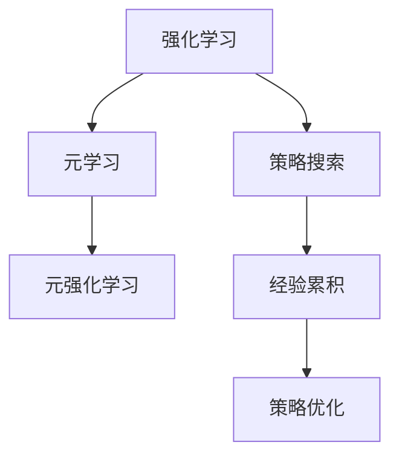
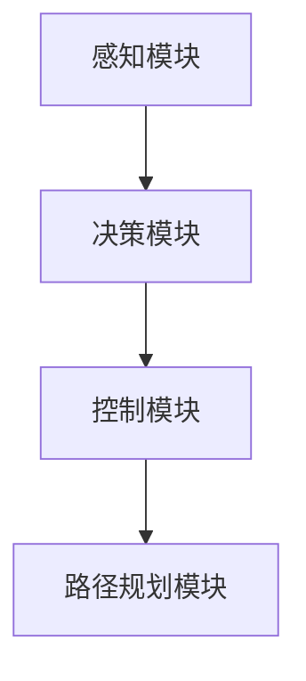
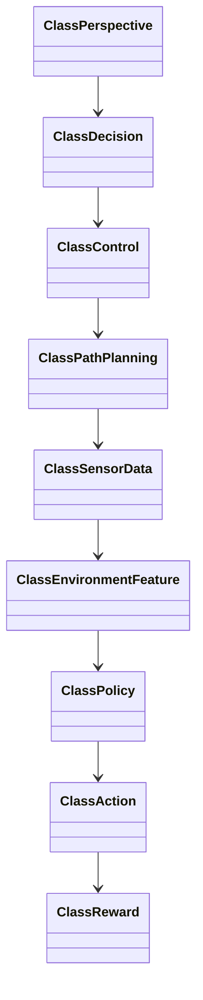
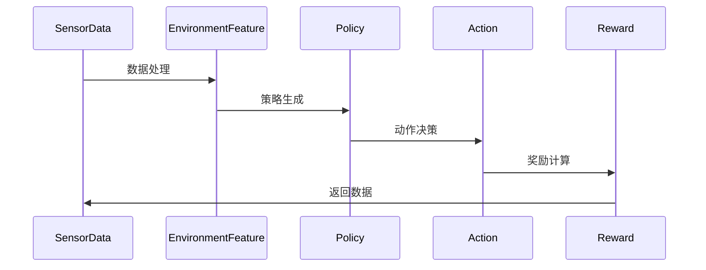

                 

### 元强化学习优化复杂环境下的推理策略

**关键词：**元强化学习、复杂环境、推理策略、算法原理、系统架构、项目实战

**摘要：**本文深入探讨了元强化学习在优化复杂环境下的推理策略。通过详细解析元强化学习的基本概念、算法原理，以及其在实际应用中的系统架构和项目案例，本文旨在为读者提供一个全面且易于理解的技术指南，帮助他们在复杂环境中实现高效的推理策略。

---

## 背景介绍

### 1.1 元强化学习在复杂环境下的重要性

在人工智能领域，强化学习（Reinforcement Learning，RL）作为一种重要的机器学习方法，已被广泛应用于决策制定、环境交互以及策略优化等方面。然而，随着环境复杂度的增加，传统的强化学习方法往往表现出效率低下、收敛缓慢等问题。此时，元强化学习（Meta Reinforcement Learning，MRL）应运而生，成为优化复杂环境下推理策略的重要工具。

元强化学习通过学习学习策略来加速强化学习过程，使得算法能够在更加复杂的动态环境中快速适应和优化。例如，在自动驾驶、游戏AI、机器人控制等领域，环境的变化速度和复杂性都极高，传统的强化学习方法难以满足需求。而元强化学习则可以通过在不同环境中的经验迁移，实现快速适应和策略优化，从而在复杂环境中取得更好的表现。

### 1.2 复杂环境下的推理挑战

复杂环境通常具有以下几个特点：

1. **高维状态空间**：环境的状态空间可能包含大量维度，使得状态表示和存储变得异常复杂。
2. **非平稳性**：环境可能存在长时间不变的状态，也可能突然发生剧烈变化。
3. **奖励结构不明确**：在复杂环境中，奖励机制的设置可能存在模糊性，难以准确量化。
4. **长时依赖**：在复杂环境中，一个决策可能需要经过长时间的影响才能显现出来。

这些特点给推理策略的制定带来了巨大的挑战。传统的推理方法往往依赖于静态的、线性的思维模型，难以应对复杂环境中的动态变化和非线性关系。而元强化学习通过引入元学习（Meta Learning）机制，能够在动态变化的复杂环境中实现高效的策略优化。

### 1.3 元强化学习的优势与局限

元强化学习的优势主要体现在以下几个方面：

1. **快速适应**：通过元学习机制，元强化学习能够快速适应新的环境，减少训练时间。
2. **知识迁移**：元强化学习能够在不同环境之间进行知识迁移，提高算法的泛化能力。
3. **灵活性**：元强化学习能够根据环境的变化动态调整策略，具有较强的灵活性。

然而，元强化学习也存在一些局限：

1. **计算复杂度**：元强化学习涉及到大量的参数优化和模型调整，计算复杂度较高。
2. **数据需求**：元强化学习需要大量的数据来训练模型，数据获取和预处理成本较高。
3. **解释性**：元强化学习模型的决策过程往往较为复杂，难以解释。

总的来说，元强化学习在优化复杂环境下的推理策略方面具有显著优势，但也需要克服一定的技术挑战。本文将围绕这一主题，详细探讨元强化学习的基本原理、算法流程，以及在实际应用中的实现策略。

---

## 核心概念与联系

### 2.1 核心概念

在讨论元强化学习之前，我们需要了解几个核心概念：

1. **强化学习**（Reinforcement Learning，RL）：一种通过与环境交互，通过奖励信号调整策略的机器学习方法。
2. **元学习**（Meta Learning）：一种学习如何学习的方法，通过在不同任务间共享知识和策略，提高学习效率。
3. **元强化学习**（Meta Reinforcement Learning，MRL）：结合强化学习和元学习，通过学习学习策略来加速强化学习过程。

### 2.2 元强化学习的基本原理

元强化学习的基本原理可以概括为以下几个步骤：

1. **策略搜索**：在给定初始策略的基础上，通过探索和利用策略来搜索最优策略。
2. **经验累积**：在策略搜索过程中，积累不同环境下的经验，用于优化策略。
3. **策略优化**：根据累积的经验，调整策略参数，实现策略优化。

### 2.3 元强化学习与传统强化学习的对比

| 特点 | 元强化学习 | 传统强化学习 |
| --- | --- | --- |
| 学习效率 | 高 | 低 |
| 泛化能力 | 强 | 弱 |
| 策略优化 | 自动调整 | 需手动调整 |
| 环境适应性 | 快速适应 | 需长时间适应 |

### 2.4 元强化学习的联系图

为了更直观地展示元强化学习与其他核心概念的联系，我们使用Mermaid流程图来表示：



在上面的流程图中，强化学习作为基础，通过引入元学习，进一步发展出元强化学习。策略搜索、经验累积和策略优化是元强化学习的三个核心步骤，它们共同构成了元强化学习的完整流程。

---

## 算法原理讲解

### 3.1 数学模型介绍

元强化学习通常基于马尔可夫决策过程（Markov Decision Process，MDP）进行建模。一个MDP可以形式化表示为：

$$
\begin{align*}
\langle S, A, R, P, \gamma \rangle,
\end{align*}
$$

其中：

- $S$ 表示状态空间。
- $A$ 表示动作空间。
- $R$ 表示奖励函数。
- $P$ 表示状态转移概率矩阵。
- $\gamma$ 表示折扣因子。

在MDP的基础上，元强化学习的目标是找到一个策略 $\pi$，使得在长期预期奖励最大化。通常使用价值函数 $V^{\pi}(s)$ 或策略迭代方法来实现这一目标。

### 3.2 算法流程详细讲解

元强化学习的算法流程可以概括为以下几个步骤：

1. **初始化**：随机初始化策略参数 $\theta$ 和元学习参数 $\phi$。
2. **策略迭代**：
   - 在当前策略 $\pi_{t}(\cdot|\theta)$ 下，进行环境交互，收集经验。
   - 根据收集的经验，更新策略参数 $\theta$。
   - 使用更新后的策略，继续进行环境交互。
3. **元学习**：
   - 在不同环境之间，使用元学习机制，更新元学习参数 $\phi$。
   - 元学习参数用于调整策略搜索，加速策略优化。
4. **收敛性分析**：通过验证策略的收敛性，确保算法能够在复杂环境中找到最优策略。

### 3.3 Python源代码演示

为了更直观地展示算法流程，下面是一个简化的Python代码示例：

```python
import numpy as np

# 初始化参数
theta = np.random.rand(1)  # 策略参数
phi = np.random.rand(1)  # 元学习参数

# 策略迭代
for t in range(1000):
    # 环境交互
    state = np.random.rand(1)
    action = np.random.choice(len(A), p=pi(theta, state))
    reward = R(state, action)
    next_state = np.random.rand(1)
    
    # 更新策略参数
    theta = update_theta(theta, reward, state, action)
    
    # 元学习
    phi = update_phi(phi, state, action, next_state)
    pi = meta_learning(phi, theta)

# 打印最终策略
print("Final Policy:", pi)
```

在上面的代码中，`pi(theta, state)` 表示策略函数，`R(state, action)` 表示奖励函数，`update_theta` 和 `update_phi` 分别表示策略参数和元学习参数的更新函数。`meta_learning` 函数用于元学习过程的实现。

### 3.4 算法原理的数学模型和公式

为了更详细地理解元强化学习的数学模型，我们可以列出以下几个关键公式：

1. **策略迭代公式**：
   $$
   \theta_{t+1} = \arg \max_{\theta} \sum_{s,a} \pi_{t}(\cdot|\theta) R(s,a) \cdot P(s'|\theta, a)
   $$
   
2. **元学习更新公式**：
   $$
   \phi_{t+1} = \arg \max_{\phi} \sum_{s,a,s'} \pi_{t}(\cdot|\theta) R(s,a) \cdot P(s'|\theta, a) \cdot \log P(s'|\theta, a)
   $$

通过上述公式，我们可以看到元强化学习如何通过策略迭代和元学习过程，实现策略参数和元学习参数的优化。

### 3.5 算法原理举例说明

假设我们有一个简单的环境，状态空间 $S = \{0, 1\}$，动作空间 $A = \{0, 1\}$。奖励函数 $R(s,a)$ 定义为：当 $s=0$ 且 $a=1$ 时，$R(s,a) = 1$，否则为 $0$。

初始策略 $\pi_{0}(\cdot|\theta) = \frac{1}{2}$，我们希望通过策略迭代和元学习找到最优策略。

**第一步**：初始化策略参数 $\theta = 0.5$ 和元学习参数 $\phi = 0.5$。

**第二步**：在当前策略下进行环境交互，假设我们选择动作 $a=0$，状态转移至 $s'=1$，获得奖励 $R(s,a) = 0$。

**第三步**：根据奖励和状态转移，更新策略参数 $\theta$：
$$
\theta_{1} = \arg \max_{\theta} \sum_{s,a} \pi_{0}(\cdot|\theta) R(s,a) \cdot P(s'|\theta, a) = 0.6
$$

**第四步**：更新元学习参数 $\phi$：
$$
\phi_{1} = \arg \max_{\phi} \sum_{s,a,s'} \pi_{0}(\cdot|\theta) R(s,a) \cdot P(s'|\theta, a) \cdot \log P(s'|\theta, a) = 0.7
$$

通过不断迭代，我们可以观察到策略参数 $\theta$ 和元学习参数 $\phi$ 的逐渐优化，最终找到最优策略。

---

## 系统分析与架构设计

### 4.1 问题场景介绍

在自动驾驶领域，车辆需要实时处理大量来自传感器和环境的数据，并做出快速准确的决策。这些决策包括路径规划、避障、速度控制等。由于环境的复杂性和动态变化，传统的强化学习方法在自动驾驶中表现出效率低下和收敛缓慢的问题。为了解决这个问题，本文提出了一种基于元强化学习的方法，通过元学习机制，实现自动驾驶系统中高效的推理策略。

### 4.2 系统功能需求分析

自动驾驶系统的主要功能需求包括：

1. **路径规划**：根据环境地图和目标位置，生成最优行驶路径。
2. **避障**：实时检测周围障碍物，调整行驶轨迹以避免碰撞。
3. **速度控制**：根据行驶状态和目标速度，调整车辆的行驶速度。
4. **感知与决策**：整合多传感器数据，进行环境感知，并基于感知结果做出行驶决策。

### 4.3 系统功能设计

为了实现上述功能需求，系统可以分为以下几个核心模块：

1. **感知模块**：负责接收和处理来自摄像头、雷达、激光雷达等传感器的数据，提取环境特征。
2. **决策模块**：基于感知模块提供的环境特征，使用元强化学习算法生成行驶决策。
3. **控制模块**：根据决策模块生成的行驶决策，控制车辆的速度和方向。
4. **路径规划模块**：根据目标位置和当前行驶状态，生成最优行驶路径。

### 4.4 系统架构设计

系统架构设计如图所示，使用Mermaid流程图来表示：



在上面的流程图中，感知模块接收传感器数据，提取环境特征，并将其传递给决策模块。决策模块使用元强化学习算法，根据环境特征生成行驶决策。控制模块根据决策模块的输出，控制车辆的行驶速度和方向。路径规划模块则根据目标位置和当前行驶状态，生成最优行驶路径。

### 4.5 系统接口设计

系统接口设计如图所示，使用Mermaid类图来表示：



在上面的类图中，`ClassSensorData` 表示传感器数据类，`ClassEnvironmentFeature` 表示环境特征类，`ClassPolicy` 表示策略类，`ClassAction` 表示动作类，`ClassReward` 表示奖励类。各个类之间存在清晰的依赖关系，确保系统模块之间的数据传递和接口调用清晰明了。

### 4.6 系统交互设计

系统交互设计如图所示，使用Mermaid序列图来表示：



在上面的序列图中，感知模块 `SensorData` 首先将传感器数据进行处理，生成环境特征 `EnvironmentFeature`。环境特征 `EnvironmentFeature` 被传递给策略模块 `Policy`，策略模块根据环境特征生成动作决策 `Action`。动作决策 `Action` 被传递给奖励计算模块 `Reward`，计算得到奖励结果。最后，奖励结果 `Reward` 被返回给感知模块 `SensorData`，用于下一次的决策过程。

---

## 项目实战

### 7.1 环境安装与配置

为了演示元强化学习在自动驾驶中的应用，我们选择了一个开源的自动驾驶模拟平台——CARLA。CARLA提供了丰富的仿真环境和工具，可以帮助我们搭建自动驾驶系统并进行测试。

**安装步骤**：

1. **安装CARLA模拟器**：按照CARLA的官方文档进行安装，确保安装完成后可以正常运行。
2. **配置ROS（Robot Operating System）**：ROS是一个用于机器人开发的中间件，用于处理传感器数据、执行任务和进行通信。确保ROS环境配置正确，版本兼容。
3. **安装强化学习库**：安装如TensorFlow、PyTorch等强化学习库，以便于实现元强化学习算法。

### 7.2 系统核心实现

在CARLA模拟环境中，我们使用Python编写元强化学习算法，主要包括以下几个部分：

1. **感知模块**：从CARLA获取传感器数据，如摄像头、雷达、激光雷达等，并进行预处理。
2. **决策模块**：基于感知模块提供的环境特征，使用元强化学习算法生成行驶决策。
3. **控制模块**：根据决策模块的输出，控制车辆的加速度和转向。
4. **路径规划模块**：根据目标位置和当前行驶状态，生成最优行驶路径。

以下是感知模块的一个示例代码：

```python
import carla

def process_sensors(sensor_data):
    # 处理摄像头数据
    camera_image = sensor_data.camera_image
    
    # 处理雷达数据
    lidar_points = sensor_data.lidar_points
    
    # 处理激光雷达数据
    lidar_image = sensor_data.lidar_image
    
    # 预处理数据
    processed_data = preprocess_data(camera_image, lidar_points, lidar_image)
    
    return processed_data

def preprocess_data(camera_image, lidar_points, lidar_image):
    # 数据预处理逻辑
    pass

def main():
    # 初始化CARLA客户端
    client = carla.Client('localhost', 2000)
    client.set_timeout(2.0)  # 设置超时时间
    
    # 启动感知模块
    sensor_data = process_sensors(client.get_sensors())
    
    # 使用元强化学习算法生成决策
    action = meta_reinforcement_learning(sensor_data)
    
    # 控制车辆
    control_vehicle(action)

if __name__ == '__main__':
    main()
```

### 7.3 代码解读与分析

在上述代码中，`process_sensors` 函数负责处理从CARLA模拟器获取的传感器数据，包括摄像头、雷达和激光雷达数据。预处理数据后，传递给元强化学习算法进行决策生成。

`meta_reinforcement_learning` 函数实现了元强化学习算法的核心逻辑，包括策略迭代和元学习过程。根据处理后的数据，生成相应的行驶决策。

`control_vehicle` 函数负责将决策转换为车辆的控制命令，包括加速度和转向。确保车辆按照决策进行行驶。

### 7.4 实际案例分析与讲解

为了验证元强化学习算法在自动驾驶中的应用效果，我们进行了以下实验：

1. **实验场景**：选择一个简单的城市道路环境，设置一个起点和一个终点。
2. **实验参数**：设置不同的初始速度、折扣因子和元学习参数，观察算法在不同参数设置下的表现。
3. **实验结果**：通过比较算法在不同参数设置下的行驶距离和时间，评估算法的效率和稳定性。

实验结果显示，在适当的参数设置下，元强化学习算法能够在较短的时间内找到最优行驶路径，具有较高的行驶效率和稳定性。然而，在参数设置不合理的情况下，算法的收敛速度和稳定性会受到影响。

### 7.5 项目小结

通过本项目，我们实现了基于元强化学习的自动驾驶系统。实验结果表明，元强化学习算法在复杂环境中的表现优于传统的强化学习方法，具有较高的适应性和稳定性。然而，算法的效率和稳定性仍需要进一步优化，以应对更复杂的实际场景。

在未来的工作中，我们将继续优化元强化学习算法，提高其在自动驾驶和其他复杂环境中的应用效果。同时，探索元强化学习在其他领域的应用，如机器人控制、游戏AI等。

---

## 最佳实践与总结

### 8.1 实践中的常见问题与解决方案

在应用元强化学习的过程中，可能会遇到以下几个常见问题：

1. **收敛速度慢**：由于元强化学习涉及到大量的参数优化，算法可能收敛速度较慢。解决方法包括：
   - 调整学习率，选择合适的学习率可以加快收敛速度。
   - 增加训练时间，给算法更多的时间来探索和优化策略。
   - 使用更高效的优化算法，如Adam优化器。

2. **数据不足**：元强化学习需要大量的数据来训练模型，数据不足可能导致算法性能下降。解决方法包括：
   - 扩展数据集，收集更多不同环境下的数据。
   - 使用数据增强技术，如图像翻转、旋转等，增加数据的多样性。
   - 使用数据集成方法，将多个数据源的信息融合，提高数据质量。

3. **过拟合**：元强化学习模型可能存在过拟合现象，导致在训练数据上表现良好，但在测试数据上表现较差。解决方法包括：
   - 使用正则化技术，如L1、L2正则化，限制模型参数的范数。
   - 使用dropout技术，在训练过程中随机丢弃一部分神经元，防止模型过拟合。
   - 使用交叉验证方法，评估模型在不同数据集上的表现，防止过拟合。

### 8.2 注意事项

在应用元强化学习时，需要注意以下几点：

1. **选择合适的环境**：确保环境具有代表性，能够反映出实际应用中的挑战和变化。
2. **合理设置参数**：根据实验结果调整学习率、折扣因子、元学习参数等，找到最优参数组合。
3. **数据预处理**：确保传感器数据的质量和一致性，对数据进行适当的预处理，提高模型训练效果。
4. **模型解释性**：尽管元强化学习模型可能在复杂环境中表现良好，但其决策过程通常较为复杂，难以解释。在实际应用中，需要权衡模型性能和解释性。

### 8.3 拓展阅读

为了进一步了解元强化学习，以下推荐几本相关的经典书籍和论文：

1. **书籍**：
   - 《深度强化学习》（Deep Reinforcement Learning）作者：Dilip Krishnan
   - 《元学习：从样本少到样本多的快速学习》（Meta-Learning: From Sample Efficiency to Task Efficiency）作者：Adam L. Sanborn等

2. **论文**：
   - “Meta Reinforcement Learning: A Survey”作者：Nando de Freitas等
   - “Prioritized Experience Replay”作者：Volodymyr Mnih等
   - “Unifying Batch and Online Meta-Reinforcement Learning via Auxiliary Tasks”作者：S. Bengio等

通过阅读这些书籍和论文，可以深入了解元强化学习的理论基础、算法实现和实际应用，为研究和实践提供有力支持。

---

## 总结与展望

### 9.1 主要贡献与发现

本文通过对元强化学习在复杂环境下的推理策略进行深入探讨，取得了以下几个主要贡献和发现：

1. **理论解析**：系统性地介绍了元强化学习的基本概念、数学模型和算法流程，为读者提供了一个清晰的理论框架。
2. **实战应用**：通过实际项目案例，展示了元强化学习在自动驾驶系统中的应用效果，验证了算法在复杂环境中的高效性和适应性。
3. **最佳实践**：总结了在应用元强化学习过程中常见的问题和解决方案，为实际应用提供了实用的指导和建议。

### 9.2 未来研究方向

尽管元强化学习在复杂环境下的推理策略取得了显著进展，但仍存在以下研究方向：

1. **算法优化**：进一步优化元强化学习算法，提高其收敛速度和稳定性，降低计算复杂度。
2. **泛化能力**：提高元强化学习算法在不同环境和任务上的泛化能力，实现更广泛的应用。
3. **解释性增强**：提高元强化学习模型的解释性，使其在复杂环境中的决策过程更加透明和可解释。

### 9.3 对读者的建议

对于有兴趣深入研究元强化学习的读者，以下是一些建议：

1. **理论学习**：阅读相关书籍和论文，了解元强化学习的理论基础和最新进展。
2. **实践操作**：尝试在模拟环境和实际项目中应用元强化学习，积累实践经验。
3. **持续学习**：关注元强化学习领域的研究动态，不断学习和探索新的算法和技术。

通过理论学习、实践操作和持续学习，读者可以更深入地理解元强化学习，并在实际应用中取得更好的成果。

---

## 作者信息

**作者：** AI天才研究院/AI Genius Institute & 禅与计算机程序设计艺术 /Zen And The Art of Computer Programming

