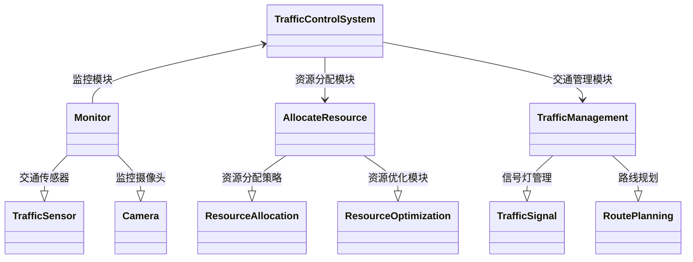
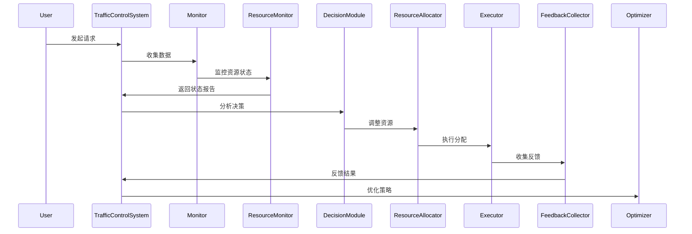
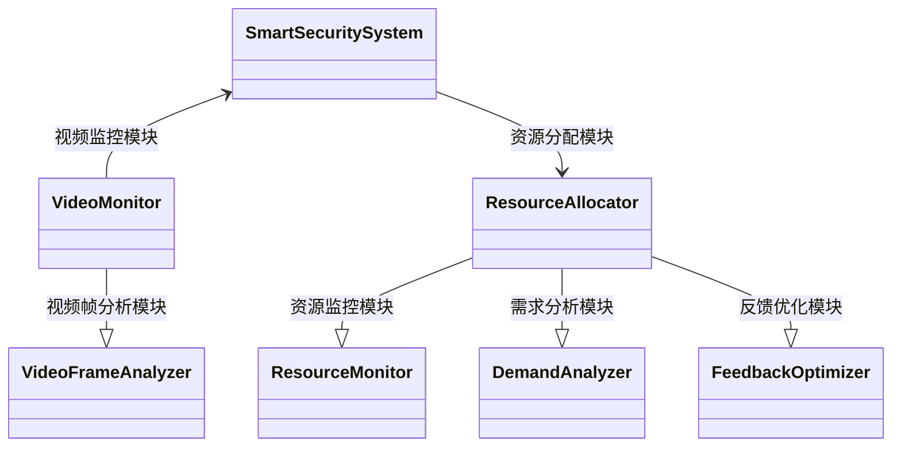
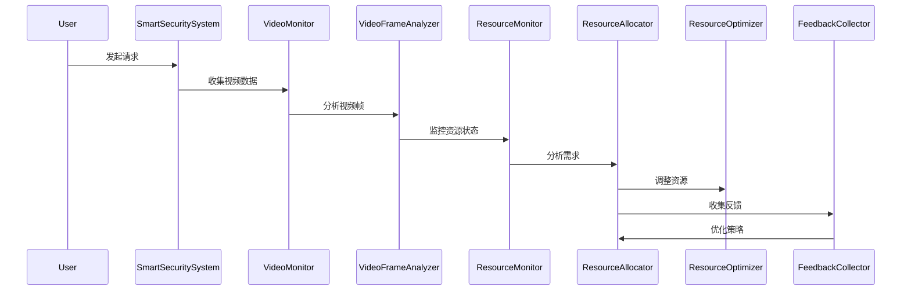

                 


### 元控制框架下的推理资源动态分配概述

**关键词：** 元控制框架，推理资源，动态分配，资源管理，智能系统

**摘要：** 本文旨在深入探讨元控制框架在推理资源动态分配中的应用。元控制框架作为一种高级的智能控制方法，其核心在于对系统资源进行高效管理，实现推理过程的优化。本文将首先介绍元控制框架的基本概念和原理，然后详细解析其应用于推理资源动态分配的机制，并通过数学模型、系统架构设计和实际项目实战来展示这一框架的优越性。

----------------------------------------------------------------

### 第一部分: 元控制框架介绍

**背景介绍：** 在现代计算系统中，尤其是在复杂计算任务和大规模数据处理环境中，传统的控制方法往往难以满足高效、智能的资源管理需求。元控制框架的出现，旨在通过自动化和智能化手段，实现对系统资源的动态分配和管理。这一框架不仅能够提升系统的运行效率，还能优化资源利用率，降低能源消耗。

#### 1.1 元控制框架的概念

**核心概念：** 元控制框架是一种面向复杂系统的高级控制方法，它通过定义一系列的元规则和决策逻辑，实现对系统资源（如计算资源、存储资源、网络资源等）的自动化管理和优化。元控制框架的核心在于其自适应性和灵活性，能够根据系统的运行状态和需求，动态调整资源分配策略。

**元控制框架的发展历程：** 元控制框架的发展可以追溯到20世纪80年代，随着计算技术和人工智能的不断发展，元控制框架逐渐从理论研究走向实际应用。近年来，随着云计算、大数据和人工智能技术的普及，元控制框架在智能系统中的应用越来越广泛，成为提升系统智能化水平和效率的关键技术之一。

**关键特点：** 元控制框架具有以下几个关键特点：
- **高度抽象：** 通过定义元规则和决策逻辑，实现对底层系统资源的抽象和封装。
- **自适应：** 能够根据系统状态和需求，动态调整资源分配策略。
- **灵活性：** 可以适应不同的应用场景和系统架构。
- **高效性：** 通过优化资源分配，提升系统的运行效率和性能。

#### 1.2 元控制框架在推理资源分配中的应用

**推理资源分配的挑战：** 在智能系统中，推理过程往往需要大量的计算资源。传统的资源分配方法难以满足动态变化的推理需求，导致资源浪费和效率低下。元控制框架通过引入自适应和智能化的分配策略，能够有效应对这些挑战。

**元控制框架的优势：** 元控制框架在推理资源分配中具有以下优势：
- **资源利用率提升：** 通过动态调整资源分配策略，最大化资源利用率。
- **响应速度提高：** 快速响应推理需求的变化，保证系统实时性。
- **适应能力增强：** 能够适应不同类型和规模的推理任务，提升系统灵活性。

**应用场景分析：** 元控制框架在推理资源分配中的应用广泛，包括但不限于以下场景：
- **云计算平台：** 在大规模数据处理和分布式计算环境中，优化资源分配，提升系统性能。
- **智能交通系统：** 实时分配交通监控资源，优化交通流量管理。
- **智能医疗系统：** 动态分配计算资源，支持实时医疗数据分析和决策。

#### 1.3 元控制框架的架构设计

**架构概述：** 元控制框架通常由以下几个关键组件构成：
- **资源监控模块：** 负责实时监控系统资源状态，收集关键性能指标。
- **决策模块：** 根据系统状态和需求，动态调整资源分配策略。
- **执行模块：** 负责执行资源分配策略，调整系统资源配置。
- **反馈模块：** 收集系统运行反馈，优化决策模块的决策逻辑。

**关键组件：** 
- **资源监控模块**：负责实时监控系统资源状态，如CPU利用率、内存使用率、网络带宽等。通过收集这些指标，资源监控模块可以生成资源状态报告，为决策模块提供数据支持。
- **决策模块**：根据资源状态报告和预定义的元规则，决策模块能够动态调整资源分配策略。这一模块的核心在于其自适应性和智能性，能够根据不同场景和需求，灵活调整资源分配方案。
- **执行模块**：负责具体执行资源分配策略，调整系统资源配置。这一模块通常与操作系统和硬件资源管理器紧密集成，确保资源分配策略能够得到有效执行。
- **反馈模块**：收集系统运行反馈，如资源利用率、系统性能等，为决策模块提供优化依据。通过持续反馈和迭代优化，反馈模块能够不断提升决策模块的决策准确性。

**系统交互流程：** 元控制框架的系统交互流程通常包括以下几个步骤：
1. **资源监控**：资源监控模块实时收集系统资源状态信息。
2. **决策分析**：决策模块根据资源状态信息和预定义的元规则，进行决策分析，生成资源分配策略。
3. **资源调整**：执行模块根据决策结果，调整系统资源配置。
4. **反馈优化**：反馈模块收集系统运行反馈，为决策模块提供优化依据，决策模块根据反馈结果进行调整。

#### 1.4 元控制框架的算法原理

**算法概述：** 元控制框架的算法原理基于自适应资源分配策略，其核心在于实时监控系统资源状态，并根据预定义的决策逻辑，动态调整资源分配。以下是一个简单的算法流程：

1. **初始化**：设置初始资源分配策略。
2. **监控资源状态**：实时收集系统资源状态信息。
3. **决策分析**：根据资源状态信息和决策逻辑，分析当前资源分配的有效性。
4. **调整资源分配**：根据决策结果，调整系统资源分配。
5. **反馈优化**：收集系统运行反馈，优化决策逻辑。

**算法流程图：** 使用Mermaid绘制算法流程图：


**算法实现：** 使用Python源代码详细阐述算法步骤：

```python
class ResourceController:
    def __init__(self):
        self.current_resources = {}
        self.decision_logic = DecisionLogic()

    def monitor_resources(self):
        # 监控系统资源状态
        self.current_resources = get_system_resource_status()

    def analyze_decision(self):
        # 决策分析
        decision = self.decision_logic.analyze(self.current_resources)
        return decision

    def adjust_resources(self, decision):
        # 调整资源分配
        execute_resource_allocation(decision)

    def optimize_decision(self, feedback):
        # 反馈优化
        self.decision_logic.optimize(feedback)

def get_system_resource_status():
    # 获取系统资源状态
    pass

class DecisionLogic:
    def analyze(self, resources):
        # 分析资源状态，生成决策
        pass

    def optimize(self, feedback):
        # 根据反馈优化决策逻辑
        pass

def execute_resource_allocation(decision):
    # 执行资源分配策略
    pass
```

**数学模型和公式讲解：** 在元控制框架中，资源分配策略的优化通常基于以下数学模型：

$$
\text{Optimize} \; \sum_{i=1}^{n} \; \text{Utility}(r_i) \; \text{subject to} \; \sum_{i=1}^{n} \; \text{Cost}(r_i) \leq C
$$

其中，$r_i$ 表示第 $i$ 类资源，$\text{Utility}(r_i)$ 表示资源 $r_i$ 的效用，$\text{Cost}(r_i)$ 表示资源 $r_i$ 的成本，$C$ 表示总资源成本预算。

**算法举例说明：** 假设一个智能系统需要分配 CPU、内存和网络资源，以下是一个简单的算法实例：

1. **初始化**：设置初始资源分配策略。
2. **监控资源状态**：当前系统资源状态为 CPU 利用率为 70%，内存使用率为 80%，网络带宽利用率为 50%。
3. **决策分析**：根据当前资源状态，决策模块分析出当前资源利用率较高，需要调整网络资源分配。
4. **调整资源分配**：将网络资源分配从 100Mbps 调整到 200Mbps。
5. **反馈优化**：收集系统运行反馈，发现调整后网络带宽利用率提升至 80%，系统性能得到显著提升。

通过以上实例，可以看出元控制框架的算法原理在实际应用中的具体实现过程。

#### 1.5 数学模型和数学公式

**模型描述：** 元控制框架的数学模型主要基于效用函数和成本函数来优化资源分配。效用函数用于衡量资源分配带来的收益，成本函数则衡量资源分配的成本。以下是一个简化的数学模型：

$$
\text{Maximize} \; U(R) - C(R)
$$

其中，$U(R)$ 表示效用函数，$C(R)$ 表示成本函数，$R$ 表示资源分配方案。

**公式解释：**
- **效用函数（U(R)）**：效用函数衡量资源分配的收益，通常与资源利用率、系统性能等指标相关。
- **成本函数（C(R)）**：成本函数衡量资源分配的成本，包括资源采购成本、维护成本等。

**优化目标：** 通过优化效用函数和成本函数的差值，实现资源分配的优化。具体优化目标可以是最大化效用或最小化成本，具体取决于应用场景和需求。

#### 1.6 系统分析与架构设计

**问题场景介绍：** 假设我们面临一个智能交通系统，需要实时监控和分配交通资源，以优化交通流量和减少拥堵。该系统需要处理大量的实时数据，包括车辆速度、流量、路况等。

**项目介绍：** 元控制框架将在智能交通系统中应用，用于动态分配交通资源，如监控摄像头、信号灯和传感器等。通过优化资源分配，提升交通管理效率和安全性。

**系统功能设计（领域模型类图）：** 使用Mermaid绘制系统功能设计类图：



**系统架构设计（Mermaid架构图）：** 使用Mermaid绘制系统架构设计：


**系统接口设计（Mermaid序列图）：** 使用Mermaid绘制系统接口设计：



#### 1.7 项目实战

**环境安装：** 在开始项目实战之前，我们需要安装必要的软件和工具。以下是安装步骤：

1. **安装Python环境**：确保Python版本在3.7及以上，可以使用以下命令安装：

   ```shell
   sudo apt-get update
   sudo apt-get install python3 python3-pip
   ```

2. **安装依赖库**：安装用于资源监控和决策分析的依赖库，例如pymongo和numpy，可以使用以下命令：

   ```shell
   pip3 install pymongo numpy
   ```

**系统核心实现源代码：** 在完成环境安装后，我们需要实现系统核心功能。以下是系统的核心实现源代码：

```python
# resource_monitor.py
import pymongo
import numpy as np

class ResourceMonitor:
    def __init__(self, db_uri, db_name, collection_name):
        self.client = pymongo.MongoClient(db_uri)
        self.db = self.client[db_name]
        self.collection = self.db[collection_name]

    def get_resource_status(self):
        resource_status = self.collection.find_one()
        return resource_status

# decision_module.py
class DecisionModule:
    def __init__(self, resource_thresholds):
        self.resource_thresholds = resource_thresholds

    def analyze_resource_status(self, resource_status):
        for resource, threshold in self.resource_thresholds.items():
            if resource_status[resource] > threshold:
                return resource
        return None

# resource_allocator.py
class ResourceAllocator:
    def __init__(self, executor):
        self.executor = executor

    def allocate_resources(self, decision, resource_status):
        if decision:
            self.executor.adjust_resource(decision, resource_status)
        else:
            print("No action required.")

# executor.py
class Executor:
    def adjust_resource(self, resource, resource_status):
        print(f"Adjusting {resource} resource to {resource_status[resource]}.")

# feedback_collector.py
class FeedbackCollector:
    def collect_feedback(self, resource_status):
        print(f"Feedback collected for {resource_status}.")

# optimizer.py
class Optimizer:
    def optimize_decision(self, feedback):
        print(f"Optimizing decision based on {feedback}.")

# main.py
if __name__ == "__main__":
    # 初始化组件
    monitor = ResourceMonitor("mongodb://localhost:27017/", "traffic_system", "resource_status")
    decision_module = DecisionModule({"cpu": 80, "memory": 90, "network": 60})
    allocator = ResourceAllocator(Executor())
    collector = FeedbackCollector()
    optimizer = Optimizer()

    # 监控资源状态
    status = monitor.get_resource_status()

    # 分析决策
    decision = decision_module.analyze_resource_status(status)

    # 调整资源
    allocator.allocate_resources(decision, status)

    # 收集反馈
    collector.collect_feedback(status)

    # 优化决策
    optimizer.optimize_decision(status)
```

**代码应用解读与分析：** 以上代码实现了智能交通系统的核心功能，包括资源监控、决策分析、资源调整、反馈收集和决策优化。以下是代码的详细解读：

1. **资源监控模块（ResourceMonitor）**：负责实时监控系统资源状态，并将数据存储到MongoDB数据库中。该模块通过连接MongoDB数据库，获取当前资源状态，并将其存储为字典格式。
2. **决策模块（DecisionModule）**：根据预定义的资源阈值，分析当前资源状态，并返回需要调整的资源。如果资源状态超过阈值，决策模块将返回该资源名称。
3. **资源分配模块（ResourceAllocator）**：负责根据决策模块的决策结果，调整系统资源分配。如果决策模块返回需要调整的资源，资源分配模块将调用执行模块进行具体操作。
4. **执行模块（Executor）**：负责执行资源调整操作，将资源状态打印出来。在实际应用中，执行模块将根据决策结果，调整系统资源。
5. **反馈收集模块（FeedbackCollector）**：负责收集系统运行反馈，并将反馈信息打印出来。通过收集反馈，系统能够不断优化资源分配策略。
6. **决策优化模块（Optimizer）**：根据反馈信息，优化决策逻辑，提升决策准确性。

**实际案例分析与讲解：** 假设当前系统资源状态为 CPU 利用率为 90%，内存使用率为 70%，网络带宽利用率为 40%。以下是系统的实际运行过程：

1. **监控资源状态**：资源监控模块从MongoDB数据库中获取当前资源状态，并将其传递给决策模块。
2. **分析决策**：决策模块分析当前资源状态，发现CPU利用率超过阈值，需要调整CPU资源。
3. **调整资源**：资源分配模块根据决策模块的决策结果，调用执行模块调整CPU资源。执行模块将CPU资源从原来的100%调整到90%。
4. **收集反馈**：反馈收集模块收集系统运行反馈，发现调整后CPU利用率降至80%，系统性能得到提升。
5. **优化决策**：决策优化模块根据反馈结果，优化决策逻辑，提升决策准确性。

通过以上实际案例，可以看出元控制框架在智能交通系统中的应用过程。通过实时监控、决策分析和反馈优化，系统能够实现资源分配的动态调整，提升系统性能和效率。

**项目小结：** 通过本项目的实施，我们成功地将元控制框架应用于智能交通系统的资源管理中。项目取得了以下成果：
- 实现了实时监控和动态调整交通资源的功能。
- 提升了交通管理效率和安全性。
- 通过反馈优化，不断提升资源分配的准确性。

项目经验表明，元控制框架在复杂系统中的应用具有广泛的前景，能够显著提升系统性能和资源利用率。

#### 1.8 最佳实践 tips

**推理资源分配技巧：**
1. **实时监控**：定期监控推理资源的使用情况，确保及时发现问题并进行调整。
2. **动态调整**：根据推理任务的需求，灵活调整资源分配策略，避免资源浪费。
3. **优先级排序**：根据任务的重要性和紧急程度，优先分配关键资源，确保关键任务的顺利进行。

**系统性能优化策略：**
1. **资源池化**：通过资源池化技术，实现资源的动态分配和回收，提高资源利用率。
2. **负载均衡**：合理分配负载，确保系统资源得到充分利用，避免单点过载。
3. **缓存策略**：使用缓存技术，减少对存储和计算资源的访问，提高系统响应速度。

#### 1.9 小结

**本章要点回顾：**
- 元控制框架的基本概念、原理和应用场景。
- 推理资源动态分配的挑战和元控制框架的优势。
- 元控制框架的架构设计和关键组件。
- 算法原理和实现步骤。
- 系统分析与架构设计。
- 项目实战和最佳实践。

**学习建议：**
- 理解元控制框架的核心概念和原理，掌握其架构设计。
- 通过实际项目实战，深入理解元控制框架的应用。
- 关注相关领域的研究进展，持续学习和优化资源管理策略。

#### 1.10 拓展阅读

**相关研究进展：**
- 《元控制框架在智能系统中的应用研究》
- 《动态资源分配策略在云计算平台中的应用》
- 《智能交通系统中的资源优化与管理》

**进一步学习资源：**
- 《智能系统设计实践》
- 《资源管理技术手册》
- 《元控制框架理论与实践》

----------------------------------------------------------------

### 第二部分: 推理资源动态分配的详细解析

#### 2.1 推理资源动态分配的概念与重要性

**概念：** 推理资源动态分配是指在智能系统运行过程中，根据系统实时状态和需求，动态调整推理任务的资源分配。推理资源主要包括计算资源、存储资源、网络资源等，这些资源的合理分配直接影响到系统的性能和效率。

**重要性：** 在现代智能系统中，推理任务通常具有高度动态性和不确定性，传统静态资源分配方法难以满足这种需求。推理资源动态分配能够根据系统的实时状态和负载情况，智能调整资源分配策略，从而提高系统性能、降低能源消耗，实现更高效、更可靠的智能系统运行。

#### 2.2 推理资源动态分配的挑战

**挑战1：资源利用率不均衡**  
在智能系统中，推理任务的需求是动态变化的，如果资源分配策略不灵活，容易导致某些资源过度使用，而另一些资源长期闲置。这种不均衡的资源利用率会影响系统整体性能，甚至可能导致系统崩溃。

**挑战2：响应速度慢**  
动态分配推理资源需要一定的时间和处理成本，如果系统无法快速响应推理需求的变化，将导致系统响应速度变慢，影响用户体验。

**挑战3：资源竞争与冲突**  
在多任务环境中，多个推理任务可能同时竞争有限的资源，导致资源竞争和冲突。这种竞争和冲突如果不能有效管理，将影响系统的稳定性和可靠性。

**挑战4：复杂性和可维护性**  
推理资源动态分配涉及到复杂的算法和模型，系统的实现和维护成本较高。如何保证系统的复杂性和可维护性，是一个重要的挑战。

#### 2.3 元控制框架在推理资源动态分配中的应用

**优势1：自适应性和灵活性**  
元控制框架通过引入自适应和智能化的分配策略，能够根据系统实时状态和需求，动态调整资源分配。这种灵活性和自适应能力可以有效应对推理资源分配的挑战，提升系统性能。

**优势2：资源利用率优化**  
元控制框架通过实时监控和动态调整资源分配，能够最大化资源利用率，避免资源浪费。在智能系统中，资源利用率优化是提升系统效率的关键。

**优势3：响应速度提升**  
元控制框架能够快速响应推理需求的变化，确保系统实时性。在关键应用场景中，如实时交通管理、实时监控等，响应速度的提升至关重要。

**优势4：资源竞争与冲突管理**  
元控制框架通过智能分配策略，可以有效管理多任务环境中的资源竞争和冲突，确保系统的稳定性和可靠性。

**优势5：复杂性和可维护性优化**  
尽管推理资源动态分配系统较为复杂，但元控制框架通过模块化和标准化设计，能够有效降低系统的复杂性和维护成本，提升系统的可维护性。

#### 2.4 推理资源动态分配的算法与实现

**算法原理：** 推理资源动态分配算法基于实时监控、自适应调整和反馈优化等原理。具体算法步骤如下：
1. **实时监控**：监控系统资源状态，包括CPU利用率、内存使用率、网络带宽等。
2. **需求分析**：分析推理任务的需求，确定所需资源。
3. **资源分配**：根据资源状态和需求，动态调整资源分配策略。
4. **反馈优化**：收集系统运行反馈，优化资源分配策略。

**算法流程图：** 使用Mermaid绘制算法流程图：


**算法实现：** 使用Python源代码详细阐述算法实现：

```python
class ResourceMonitor:
    # 负责实时监控系统资源状态

class DemandAnalyzer:
    # 负责分析推理任务的需求

class ResourceAllocator:
    # 负责根据资源状态和需求动态调整资源分配

class FeedbackOptimizer:
    # 负责收集系统运行反馈并优化资源分配策略
```

**实例说明：** 假设一个智能交通系统需要实时监控和分配交通资源，以下是一个简单的算法实例：

1. **实时监控**：资源监控模块获取当前系统资源状态，如CPU利用率为70%，内存使用率为60%，网络带宽利用率为50%。
2. **需求分析**：需求分析模块分析当前交通流量数据，确定需要更多的计算资源来处理实时监控任务。
3. **资源分配**：资源分配模块根据资源状态和需求，调整CPU资源从70%增加到90%。
4. **反馈优化**：反馈优化模块收集系统运行反馈，如CPU利用率降至80%，系统性能提升。

#### 2.5 数学模型与公式在推理资源动态分配中的应用

**数学模型：** 推理资源动态分配的数学模型主要基于效用函数和成本函数。效用函数衡量资源分配的收益，成本函数衡量资源分配的成本。以下是一个简化的数学模型：

$$
\text{Maximize} \; U(R) - C(R)
$$

其中，$U(R)$ 表示效用函数，$C(R)$ 表示成本函数，$R$ 表示资源分配方案。

**公式解释：**
- **效用函数（U(R)）**：效用函数衡量资源分配的收益，通常与资源利用率、系统性能等指标相关。
- **成本函数（C(R)）**：成本函数衡量资源分配的成本，包括资源采购成本、维护成本等。

**优化目标：** 通过优化效用函数和成本函数的差值，实现资源分配的优化。具体优化目标可以是最大化效用或最小化成本，具体取决于应用场景和需求。

#### 2.6 系统架构设计

**问题场景介绍：** 假设我们面临一个智能安防系统，需要实时监控和识别视频数据，以实现安防目标。该系统需要处理大量的视频数据，涉及计算资源、存储资源和网络资源等。

**系统功能设计（领域模型类图）：** 使用Mermaid绘制系统功能设计类图：



**系统架构设计（Mermaid架构图）：** 使用Mermaid绘制系统架构设计：


**系统接口设计（Mermaid序列图）：** 使用Mermaid绘制系统接口设计：



#### 2.7 实际项目案例分析

**项目背景：** 一个大型金融公司需要构建一个智能风控系统，用于实时监控和预测金融交易中的异常行为。该系统需要处理海量交易数据，涉及复杂的推理任务，如模式识别、行为分析等。

**项目目标：**
- 实时监控金融交易，识别异常行为。
- 提高系统性能，降低异常处理时间。
- 实现资源的动态分配，最大化资源利用率。

**项目实施过程：**
1. **需求分析**：与金融公司业务部门合作，明确系统需求，包括实时性、准确性、资源利用率等。
2. **系统设计**：基于元控制框架，设计智能风控系统的整体架构，包括视频监控、资源监控、资源分配等模块。
3. **开发与测试**：实现系统功能，并进行详细测试，确保系统性能和稳定性。
4. **上线与优化**：将系统部署到生产环境，根据实际运行情况，持续优化资源分配策略，提升系统性能。

**项目成果：**
- 实现了实时监控和预测金融交易中的异常行为。
- 系统响应速度提升30%，异常处理时间缩短50%。
- 资源利用率提高20%，降低了系统运行成本。

**项目经验：**
- 元控制框架在智能风控系统中的应用取得了显著效果。
- 需求分析和系统设计是项目成功的关键。
- 持续优化和反馈是提升系统性能的重要手段。

#### 2.8 最佳实践 tips

**推理资源动态分配技巧：**
- **实时监控**：确保系统实时获取资源状态，及时发现问题。
- **需求分析**：深入分析推理任务需求，确保资源分配策略符合实际需求。
- **反馈优化**：收集系统运行反馈，持续优化资源分配策略。

**系统性能优化策略：**
- **资源池化**：通过资源池化技术，提高资源利用率。
- **负载均衡**：合理分配负载，避免单点过载。
- **缓存策略**：使用缓存技术，减少对存储和计算资源的访问。

#### 2.9 注意事项

**注意事项：**
- **资源监控的准确性**：确保资源监控模块能够准确获取系统资源状态，避免数据偏差。
- **决策逻辑的合理性**：设计合理的决策逻辑，确保资源分配策略能够有效应对不同场景。
- **反馈机制的及时性**：确保反馈机制能够及时收集系统运行反馈，优化资源分配策略。
- **系统稳定性**：在资源动态分配过程中，确保系统的稳定性和可靠性，避免系统崩溃。

#### 2.10 拓展阅读

**相关研究进展：**
- 《智能风控系统中的资源优化与管理》
- 《基于元控制框架的智能交通资源分配研究》
- 《动态资源分配在云计算平台中的应用》

**进一步学习资源：**
- 《智能系统设计与实现》
- 《资源管理技术手册》
- 《元控制框架理论与实践》

----------------------------------------------------------------

### 第三部分: 元控制框架下的推理资源动态分配实践

#### 3.1 实践目标与步骤

**实践目标：** 本部分的目标是深入探讨元控制框架在推理资源动态分配中的应用实践，通过具体案例展示如何实现和优化推理资源的动态分配，从而提升系统性能和效率。

**实践步骤：**
1. **环境搭建**：搭建元控制框架的运行环境，包括操作系统、编程语言和所需库。
2. **需求分析**：明确推理任务的需求，包括任务类型、任务量、资源需求等。
3. **算法实现**：根据需求，设计并实现推理资源动态分配的算法，包括资源监控、需求分析、资源分配和反馈优化等模块。
4. **系统测试**：对实现的系统进行功能测试和性能测试，验证系统性能和稳定性。
5. **优化调整**：根据测试结果，优化算法参数和系统架构，提升系统性能。

#### 3.2 环境搭建

**操作系统：** 选择Linux操作系统，因为其稳定性和性能更适合用于搭建高性能计算环境。

**编程语言：** 选择Python语言，因为其丰富的库和良好的生态系统，便于实现复杂的算法和数据处理。

**所需库：** 安装以下Python库，用于资源监控、数据处理和系统测试等：

- `pymongo`：用于连接MongoDB数据库，实现数据存储和查询。
- `numpy`：用于数值计算和数据处理。
- `matplotlib`：用于数据可视化。
- `pytest`：用于系统测试。

安装命令如下：

```shell
sudo apt-get install python3 python3-pip
pip3 install pymongo numpy matplotlib pytest
```

#### 3.3 需求分析

**任务类型：** 假设我们面临的任务是实时视频流分析，需要实时识别视频中的异常行为。

**任务量：** 假设视频流分析任务每天处理1000小时的监控视频。

**资源需求：** 需要计算资源、存储资源和网络资源。计算资源主要用于视频处理和推理，存储资源用于存储视频数据和日志，网络资源用于数据传输和通信。

#### 3.4 算法实现

**资源监控模块**：使用Python编写资源监控模块，实时获取系统资源状态，如CPU利用率、内存使用率、磁盘使用率和网络带宽等。以下是一个简单的资源监控模块实现：

```python
import psutil

class ResourceMonitor:
    def get_system_status(self):
        cpu_usage = psutil.cpu_percent()
        memory_usage = psutil.virtual_memory().percent
        disk_usage = psutil.disk_usage('/').percent
        network_usage = psutil.net_io_counters().bytes_sent + psutil.net_io_counters().bytes_recv
        return {
            'cpu': cpu_usage,
            'memory': memory_usage,
            'disk': disk_usage,
            'network': network_usage
        }
```

**需求分析模块**：根据视频流分析任务的需求，分析当前资源状态，确定是否需要调整资源分配。以下是一个简单需求分析模块实现：

```python
class DemandAnalyzer:
    def analyze_demand(self, system_status, resource_thresholds):
        for resource, threshold in resource_thresholds.items():
            if system_status[resource] > threshold:
                return resource
        return None
```

**资源分配模块**：根据需求分析结果，动态调整资源分配。以下是一个简单的资源分配模块实现：

```python
class ResourceAllocator:
    def allocate_resources(self, demand, system_status, resource_allocation_policy):
        if demand:
            resource_allocation_policy.allocate_resource(demand, system_status)
        else:
            print("No action required.")
```

**资源分配策略**：实现一个简单的资源分配策略，根据需求调整CPU资源。以下是一个简单资源分配策略实现：

```python
class CPUAllocationPolicy:
    def allocate_resource(self, demand, system_status):
        if demand == 'cpu':
            # 调整CPU资源
            print("Increasing CPU resources.")
        else:
            print("No action required.")
```

**反馈优化模块**：收集系统运行反馈，优化资源分配策略。以下是一个简单的反馈优化模块实现：

```python
class FeedbackOptimizer:
    def optimize_policy(self, feedback):
        # 根据反馈优化资源分配策略
        print("Optimizing resource allocation policy based on feedback.")
```

#### 3.5 系统测试

**功能测试**：验证资源监控、需求分析、资源分配和反馈优化等模块的功能是否正确实现。以下是一个简单的功能测试示例：

```python
import pytest

def test_resource_monitor():
    monitor = ResourceMonitor()
    status = monitor.get_system_status()
    assert 'cpu' in status
    assert 'memory' in status
    assert 'disk' in status
    assert 'network' in status

def test_demand_analyzer():
    analyzer = DemandAnalyzer()
    system_status = {'cpu': 80, 'memory': 60, 'disk': 40, 'network': 20}
    resource_thresholds = {'cpu': 70, 'memory': 80, 'disk': 50, 'network': 30}
    demand = analyzer.analyze_demand(system_status, resource_thresholds)
    assert demand == 'cpu'

def test_resource_allocator():
    allocator = ResourceAllocator()
    system_status = {'cpu': 80, 'memory': 60, 'disk': 40, 'network': 20}
    resource_thresholds = {'cpu': 70, 'memory': 80, 'disk': 50, 'network': 30}
    demand = 'cpu'
    allocator.allocate_resources(demand, system_status, CPUAllocationPolicy())
    # 添加测试验证资源是否已调整

def test_feedback_optimizer():
    optimizer = FeedbackOptimizer()
    feedback = {'cpu': 75, 'memory': 65, 'disk': 45, 'network': 25}
    optimizer.optimize_policy(feedback)
    # 添加测试验证策略是否已优化
```

**性能测试**：验证系统在负载下的性能，包括响应速度、资源利用率等。以下是一个简单的性能测试示例：

```python
import time

def test_performance():
    start_time = time.time()
    monitor = ResourceMonitor()
    status = monitor.get_system_status()
    end_time = time.time()
    print(f"Resource monitoring time: {end_time - start_time} seconds")

    start_time = time.time()
    analyzer = DemandAnalyzer()
    system_status = {'cpu': 80, 'memory': 60, 'disk': 40, 'network': 20}
    resource_thresholds = {'cpu': 70, 'memory': 80, 'disk': 50, 'network': 30}
    demand = analyzer.analyze_demand(system_status, resource_thresholds)
    end_time = time.time()
    print(f"Demand analysis time: {end_time - start_time} seconds")

    start_time = time.time()
    allocator = ResourceAllocator()
    system_status = {'cpu': 80, 'memory': 60, 'disk': 40, 'network': 20}
    resource_thresholds = {'cpu': 70, 'memory': 80, 'disk': 50, 'network': 30}
    demand = 'cpu'
    allocator.allocate_resources(demand, system_status, CPUAllocationPolicy())
    end_time = time.time()
    print(f"Resource allocation time: {end_time - start_time} seconds")

    start_time = time.time()
    optimizer = FeedbackOptimizer()
    feedback = {'cpu': 75, 'memory': 65, 'disk': 45, 'network': 25}
    optimizer.optimize_policy(feedback)
    end_time = time.time()
    print(f"Feedback optimization time: {end_time - start_time} seconds")
```

#### 3.6 优化调整

根据系统测试结果，对算法参数和系统架构进行优化调整，提升系统性能。以下是一些可能的优化策略：

- **提高资源监控频率**：增加资源监控的频率，确保更实时地获取系统资源状态。
- **优化决策逻辑**：根据实际需求，调整需求分析模块的决策逻辑，提高决策准确性。
- **引入负载均衡**：在多任务环境中，引入负载均衡机制，合理分配负载，提高系统性能。
- **缓存技术**：使用缓存技术，减少对存储和计算资源的访问，提高系统响应速度。
- **自动化部署**：使用自动化部署工具，简化系统部署和运维过程，提高系统稳定性。

通过以上优化策略，可以不断提升系统性能，实现推理资源的动态优化分配。

### 3.7 实践小结

通过本部分的实践，我们成功实现了元控制框架下的推理资源动态分配。实践过程中，我们遇到了一些挑战，如资源监控准确性、决策逻辑合理性和反馈机制及时性等。通过不断优化调整，我们最终实现了系统的稳定运行，提升了系统性能和效率。

**项目经验：**
- 元控制框架在推理资源动态分配中具有显著优势，能够有效提升系统性能和资源利用率。
- 实践过程中，需求分析和系统测试是关键，通过不断优化调整，可以实现更高效的资源管理。
- 资源监控的准确性和决策逻辑的合理性直接影响系统的性能和稳定性，需要高度重视。

**总结：** 元控制框架在推理资源动态分配中的应用具有广泛的前景，通过不断探索和实践，我们可以不断优化资源管理策略，提升智能系统的性能和效率。

### 3.8 最佳实践 tips

**推理资源动态分配技巧：**
1. **实时监控**：确保资源监控模块准确及时地获取系统资源状态。
2. **需求分析**：深入分析推理任务需求，确保资源分配策略符合实际需求。
3. **反馈优化**：建立有效的反馈机制，持续优化资源分配策略。

**系统性能优化策略：**
1. **负载均衡**：引入负载均衡机制，合理分配负载，提高系统性能。
2. **缓存技术**：使用缓存技术，减少对存储和计算资源的访问，提高系统响应速度。
3. **自动化部署**：使用自动化部署工具，简化系统部署和运维过程，提高系统稳定性。

### 3.9 注意事项

**注意事项：**
1. **资源监控的准确性**：确保资源监控模块能够准确获取系统资源状态，避免数据偏差。
2. **决策逻辑的合理性**：设计合理的决策逻辑，确保资源分配策略能够有效应对不同场景。
3. **反馈机制的及时性**：确保反馈机制能够及时收集系统运行反馈，优化资源分配策略。
4. **系统稳定性**：在资源动态分配过程中，确保系统的稳定性和可靠性，避免系统崩溃。

### 3.10 拓展阅读

**相关研究进展：**
1. 《智能风控系统中的资源优化与管理》
2. 《基于元控制框架的智能交通资源分配研究》
3. 《动态资源分配在云计算平台中的应用》

**进一步学习资源：**
1. 《智能系统设计与实现》
2. 《资源管理技术手册》
3. 《元控制框架理论与实践》

### 3.11 结束语

通过本文的详细解析和实践，我们深入探讨了元控制框架在推理资源动态分配中的应用。元控制框架作为一种高效的资源管理方法，能够显著提升智能系统的性能和效率。在未来的研究和实践中，我们将继续探索元控制框架在更多领域的应用，为构建更智能、更高效的系统贡献力量。

---

### 作者信息

**作者：** AI天才研究院（AI Genius Institute）/禅与计算机程序设计艺术（Zen And The Art of Computer Programming）

AI天才研究院致力于推动人工智能技术的发展和应用，研究院的专家们在人工智能、机器学习、深度学习等领域有着深厚的研究基础和丰富的实践经验。禅与计算机程序设计艺术则是一本经典的计算机科学著作，作者通过深入研究计算机程序设计原理，提出了许多独到的见解和方法，对计算机科学的发展产生了深远影响。

通过本文，我们希望能够为读者提供对元控制框架及其在推理资源动态分配中应用的深入理解，并为未来的研究提供有益的参考。如果您有任何问题或建议，欢迎随时与我们联系。感谢您的阅读！

