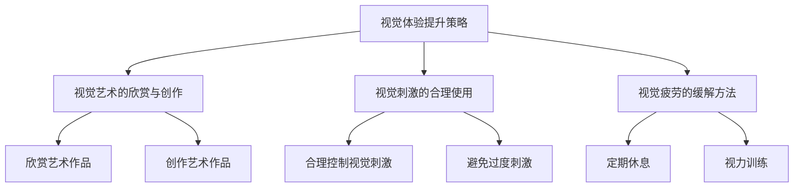
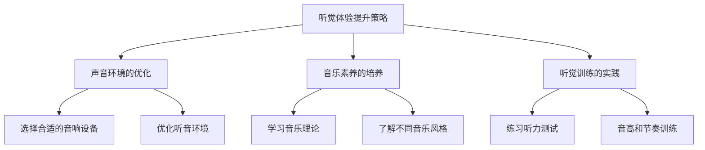
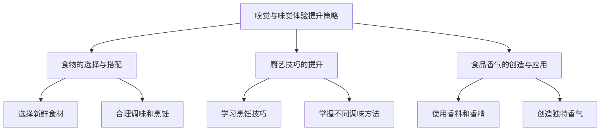
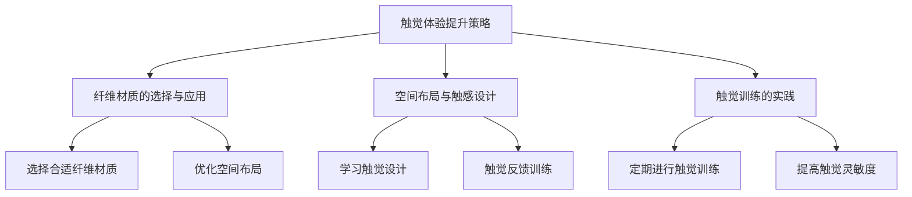
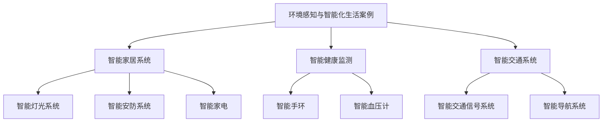
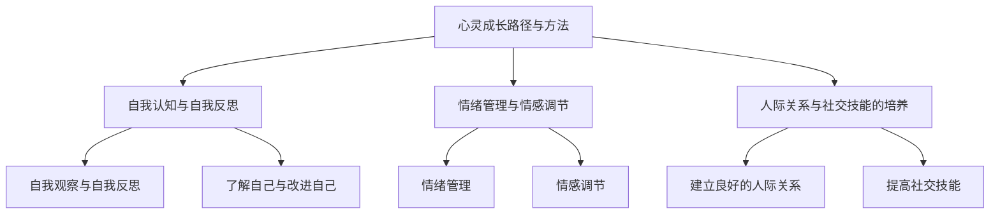
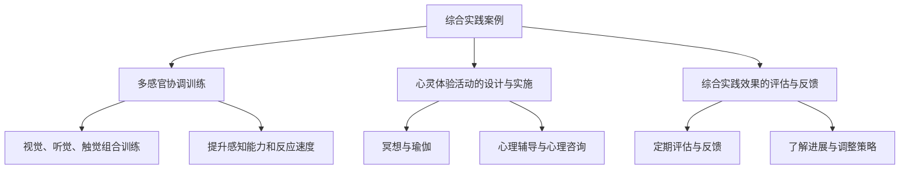

                 

## 文章标题：全方位提升生活体验：感官与心灵的共同成长

### 关键词：生活体验、感官提升、心灵成长、综合实践

### 摘要：本文旨在探讨如何通过全方位提升感官体验和心灵成长，实现生活的全面提升。文章首先分析感官的基本原理与生理机制，然后介绍提升感官体验的策略与方法，以及心灵成长的路径与实践。最后，通过综合案例分享，展示感官与心灵共同成长的最佳实践。

## 引言

在快节奏的现代社会中，人们越来越意识到生活体验的重要性。不仅追求物质上的满足，更追求精神上的愉悦和成长。而感官体验和心灵成长正是提升生活体验的两个关键方面。感官体验通过视觉、听觉、嗅觉、味觉和触觉的全面提升，使人们的生活更加丰富多彩；心灵成长则通过心理健康和情感调节，提升个体的幸福感和生活质量。本文将分章节详细探讨这两个方面的提升方法，并分享一些成功的实践案例。

## 第一部分：感官的全面提升

### 第1章：视觉与视觉体验的优化

#### 1.1 视觉的基本原理与生理机制

视觉是人类最重要的感官之一，它依赖于眼睛和大脑之间的复杂交互。首先，我们探讨视觉的起源和基本原理，包括光线进入眼睛后的处理过程。然后，分析视觉的生理机制，如视网膜、视神经和视觉皮层等结构的功能。

#### 1.2 视觉体验的提升策略

视觉体验的提升策略包括视觉艺术的欣赏与创作、视觉刺激的合理使用和视觉疲劳的缓解方法。通过欣赏艺术作品，人们可以提升审美能力；合理使用视觉刺激，可以增强大脑的认知功能；而通过适当休息和视力训练，可以缓解视觉疲劳。

#### 1.3 视觉技术的创新应用

视觉技术的创新应用为提升视觉体验提供了新的途径。新型显示技术如OLED、VR和AR等，为人们带来了更加沉浸式的视觉体验。视觉辅助技术，如盲人辅助设备，则为视觉障碍者提供了新的生活可能。

### 第2章：听觉与音乐的美学体验

#### 2.1 听觉的基本原理与生理机制

听觉是另一个重要的感官，它依赖于耳朵和大脑之间的交互。我们首先探讨听觉的起源和基本原理，包括声音的传播和听觉处理过程。然后，分析听觉的生理机制，如耳蜗、听神经和听觉皮层等结构的功能。

#### 2.2 音乐的美学体验与心理影响

音乐作为一种独特的艺术形式，对人的心理产生深远的影响。我们探讨音乐的基本元素和结构，以及音乐对情绪的影响。同时，介绍音乐在生活中的多种应用，如放松、激励和社交等。

#### 2.3 听觉体验的提升方法

听觉体验的提升方法包括声音环境的优化、音乐素养的培养和听觉训练的实践。通过优化声音环境，如降噪耳机和音响设备的选择，可以提升听觉体验；通过学习和欣赏音乐，可以提高音乐素养；而通过定期进行听觉训练，可以改善听力。

### 第3章：嗅觉与味觉的感知与搭配

#### 3.1 嗅觉的基本原理与生理机制

嗅觉是一种重要的感官，它对食物、气味和环境都有敏感的感知。我们首先探讨嗅觉的起源和基本原理，包括气味分子的识别和嗅觉处理过程。然后，分析嗅觉的生理机制，如嗅球、嗅神经和嗅觉皮层等结构的功能。

#### 3.2 味觉的基本原理与生理机制

味觉是感知食物味道的重要感官，它依赖于舌头上的味蕾和大脑之间的交互。我们首先探讨味觉的起源和基本原理，包括味觉信号的传递和味觉处理过程。然后，分析味觉的生理机制，如味蕾、味神经和味觉皮层等结构的功能。

#### 3.3 嗅觉与味觉的搭配与提升

嗅觉与味觉的搭配对食物的感知有重要影响。我们探讨食物的选择与搭配、厨艺技巧的提升以及食品香气的创造与应用，以提升嗅觉与味觉的整体体验。

### 第4章：触觉与触感体验的提升

#### 4.1 触觉的基本原理与生理机制

触觉是人类感知外界信息的重要途径，它依赖于皮肤和大脑之间的交互。我们首先探讨触觉的起源和基本原理，包括触觉信号的传递和触觉处理过程。然后，分析触觉的生理机制，如皮肤、触觉神经和触觉皮层等结构的功能。

#### 4.2 触感体验的提升策略

触感体验的提升策略包括纤维材质的选择与应用、空间布局与触感设计以及触觉训练的实践。通过选择合适的纤维材质，可以提升触觉体验；通过合理的设计空间布局，可以增强触觉的舒适感；而通过定期进行触觉训练，可以改善触觉灵敏度。

#### 4.3 触觉技术的创新应用

触觉技术的创新应用为触感体验的提升提供了新的可能性。触觉反馈技术在游戏和教育中的应用，为用户提供了更加真实的互动体验。触觉助视技术和触觉辅助生活设备，则为视障人士和老年人提供了新的帮助。

## 第二部分：心灵成长的路径与方法

### 第5章：环境感知与智能化生活

#### 5.1 环境感知技术的基本原理

环境感知技术通过传感器和算法，使计算机能够感知和理解周围环境。我们首先探讨环境感知技术的定义和分类，然后介绍环境感知的关键技术，如图像识别、声音识别和运动跟踪等。

#### 5.2 智能化生活的应用场景

智能化生活通过智能设备和服务，使人们的生活更加便捷和舒适。我们介绍智能家居系统、智能健康监测和智能交通系统等应用场景，探讨它们如何提升生活体验。

#### 5.3 智能化生活的提升策略

智能化生活的提升策略包括人机交互的优化、数据分析和智能推荐以及智能化服务的创新。通过优化人机交互，如语音助手和触控操作，可以提升用户体验；通过数据分析，可以提供个性化的服务推荐；而通过创新服务，可以满足人们不断变化的需求。

### 第6章：心灵成长的路径与方法

#### 6.1 心灵成长的概念与重要性

心灵成长是指个体在精神层面上的提升和成长，它对个人的幸福感和生活质量有重要影响。我们首先探讨心灵成长的概念和内涵，然后分析它在社会生活中的重要性。

#### 6.2 心理健康与心灵成长

心理健康是心灵成长的基础，它对个体的心理健康和幸福感有直接影响。我们探讨心理健康的基本标准，分析心理健康对心灵成长的影响，并提出维护和提升心理健康的方法。

#### 6.3 心灵成长的路径与方法

心灵成长是一个长期的过程，需要通过多种方法和路径来实现。我们介绍自我认知与自我反思、情绪管理与情感调节以及人际关系与社交技能的培养等路径，提供具体的实践方法。

## 第7章：感官与心灵共同成长的综合实践

#### 7.1 综合实践的背景与意义

综合实践是指将感官提升和心灵成长相结合，实现全方位的生活提升。我们探讨综合实践的背景和意义，分析它在提升生活体验中的作用。

#### 7.2 综合实践的方法与策略

综合实践的方法和策略包括多感官协调训练、心灵体验活动的设计与实施以及综合实践效果的评估与反馈。通过多感官协调训练，可以提升感官体验的整合效果；通过心灵体验活动，可以增强心灵成长的内在动力；而通过评估与反馈，可以不断优化综合实践的效果。

#### 7.3 综合实践案例分享

最后，我们分享一些成功的综合实践案例，分析其中的经验和启示。这些案例涵盖了不同领域和层面，展示了感官与心灵共同成长的最佳实践。

## 结论

全方位提升生活体验，需要同时关注感官的全面提升和心灵成长。通过优化视觉、听觉、嗅觉、味觉和触觉的体验，我们可以提升生活的质感和幸福感；通过心理健康和情感调节，我们可以实现心灵的平静和满足。感官与心灵的共同成长，为我们提供了更加丰富和有意义的生活体验。

## 作者信息

作者：AI天才研究院/AI Genius Institute & 禅与计算机程序设计艺术 /Zen And The Art of Computer Programming

## 文章完整内容

### 全方位提升生活体验：感官与心灵的共同成长

随着科技的发展和人们生活水平的提高，我们越来越意识到生活体验的重要性。不仅追求物质上的满足，更追求精神上的愉悦和成长。如何全面提升生活体验，实现感官与心灵的共同成长，成为现代生活中一个值得关注的话题。本文将从视觉、听觉、嗅觉、味觉和触觉等感官的全面提升，以及心灵成长的路径和方法，探讨如何实现全方位的生活提升。

### 第一部分：感官的全面提升

#### 第1章：视觉与视觉体验的优化

视觉是人类最重要的感官之一，它对我们的日常生活和工作产生深远的影响。在这一章节中，我们将探讨视觉的基本原理与生理机制，视觉体验的提升策略，以及视觉技术的创新应用。

#### 1.1 视觉的基本原理与生理机制

视觉的起源可以追溯到数亿年前的单细胞生物，它们通过感光细胞来感知光线的强弱。随着生物的进化，视觉系统逐渐变得更加复杂和精细。现代人类的眼睛可以感知从紫外线到红外线的各种光线，通过复杂的生理机制将光信号转换为电信号，最终传递到大脑进行处理。

视觉的基本原理包括光线进入眼睛后的处理过程。首先，光线经过角膜和晶状体的折射，形成一个倒置的图像，然后投射到视网膜上。视网膜上的感光细胞，包括视锥细胞和视杆细胞，分别负责感知亮度和颜色。视锥细胞主要分布在中央视网膜，负责高分辨率和颜色感知；而视杆细胞则分布在周边视网膜，负责低分辨率和亮度感知。

视觉的生理机制包括视网膜、视神经和视觉皮层等结构的功能。视网膜是视觉信号处理的第一站，其中的感光细胞将光信号转换为电信号。视神经将电信号传递到大脑，经过视交叉后分成两条路径，分别传递到两侧的视觉皮层。视觉皮层是视觉信号处理的最高级区域，负责解析图像内容、感知深度和运动等。

#### 1.2 视觉体验的提升策略

视觉体验的提升策略包括视觉艺术的欣赏与创作、视觉刺激的合理使用和视觉疲劳的缓解方法。

首先，视觉艺术的欣赏与创作可以提升视觉体验。欣赏艺术作品不仅可以陶冶情操，还可以提高审美能力。通过创作艺术作品，人们可以更加深入地理解视觉艺术，从而提升自己的视觉体验。

其次，视觉刺激的合理使用也是提升视觉体验的关键。过度的视觉刺激会导致视觉疲劳，甚至损害视力。因此，我们需要合理控制视觉刺激的强度和频率，避免过度刺激。

最后，视觉疲劳的缓解方法包括适当的休息和视力训练。定期进行眼部按摩和远眺放松，可以缓解眼部疲劳。此外，视力训练，如调节眼睛焦距、进行眼球运动等，也有助于提高视力。

#### 1.3 视觉技术的创新应用

视觉技术的创新应用为提升视觉体验提供了新的途径。新型显示技术如OLED、VR和AR等，为人们带来了更加沉浸式的视觉体验。OLED屏幕具有更高的对比度和更快的响应速度，为用户提供了更加清晰的图像。VR和AR技术则通过虚拟现实和增强现实，将真实世界与虚拟世界相结合，为用户带来全新的视觉体验。

视觉辅助技术，如盲人辅助设备，则为视觉障碍者提供了新的生活可能。盲人辅助设备可以通过语音合成、图像识别和导航等技术，帮助盲人更好地适应环境，提高生活质量。

#### 第2章：听觉与音乐的美学体验

听觉是人类感知外界的重要途径之一，它对我们的生活产生深远的影响。在这一章节中，我们将探讨听觉的基本原理与生理机制，音乐的美学体验与心理影响，以及听觉体验的提升方法。

#### 2.1 听觉的基本原理与生理机制

听觉的起源可以追溯到数亿年前的单细胞生物，它们通过感音细胞来感知声波的振动。随着生物的进化，听觉系统逐渐变得更加复杂和精细。现代人类的耳朵可以感知从次声波到超声波的各种声波，通过复杂的生理机制将声信号转换为电信号，最终传递到大脑进行处理。

听觉的基本原理包括声波的传播和听觉处理过程。首先，声波通过空气或其他介质传播到耳朵，经过外耳道传到鼓膜。鼓膜的振动通过听骨链传递到内耳，刺激内耳中的耳蜗。耳蜗中的听觉感受器将声信号转换为电信号，通过听觉神经传递到大脑。

听觉的生理机制包括耳蜗、听神经和听觉皮层等结构的功能。耳蜗是听觉信号处理的主要场所，其中的听觉感受器将声信号转换为电信号。听神经将电信号传递到大脑，经过听觉皮层后进行信号处理和解析。

#### 2.2 音乐的美学体验与心理影响

音乐是一种独特的艺术形式，对人的心理产生深远的影响。音乐的美学体验与心理影响密切相关。首先，音乐的基本元素和结构对听觉体验有重要影响。音乐的基本元素包括音高、节奏、音色和动态等，通过这些元素的组合和变化，可以创造出丰富的音乐作品。

音乐对情绪的影响也是不可忽视的。不同的音乐可以引起不同的情绪反应，如愉悦、悲伤、兴奋和放松等。音乐可以通过声音的节奏和旋律，直接影响人的情绪状态，从而改善心理健康。

音乐在生活中的应用也非常广泛。例如，音乐可以用于放松和缓解压力，通过音乐疗法来提高患者的康复效果。音乐还可以用于教育和社交，通过音乐活动来促进个体的全面发展。

#### 2.3 听觉体验的提升方法

听觉体验的提升方法包括声音环境的优化、音乐素养的培养和听觉训练的实践。

首先，声音环境的优化可以提升听觉体验。选择合适的音响设备，优化听音环境，可以提供更加清晰和自然的听觉体验。

其次，音乐素养的培养也是提升听觉体验的重要途径。通过学习音乐理论，了解不同音乐风格和作品，可以提高对音乐的欣赏和理解能力。

最后，听觉训练的实践可以改善听觉灵敏度。例如，通过练习听力测试，提高对声音的辨识能力；通过音高和节奏训练，提高音乐表演技能。

#### 第3章：嗅觉与味觉的感知与搭配

嗅觉和味觉是人类感知外界的重要感官，它们对食物的享受和生活体验有重要影响。在这一章节中，我们将探讨嗅觉和味觉的基本原理与生理机制，以及它们之间的搭配与提升。

#### 3.1 嗅觉的基本原理与生理机制

嗅觉是一种化学感官，通过鼻子中的嗅觉感受器来感知气味的分子。嗅觉的起源可以追溯到古老的生物，它们通过嗅觉来感知食物、危险和配偶等。随着生物的进化，嗅觉系统逐渐变得更加复杂和精细。

嗅觉的基本原理包括气味分子的识别和嗅觉处理过程。首先，气味分子通过空气进入鼻腔，与鼻腔内的嗅觉感受器接触。嗅觉感受器将气味分子转化为电信号，通过嗅觉神经传递到大脑。

嗅觉的生理机制包括嗅球、嗅神经和嗅觉皮层等结构的功能。嗅球是嗅觉信号处理的主要场所，其中的嗅觉感受器将气味分子转化为电信号。嗅神经将电信号传递到大脑，经过嗅觉皮层后进行信号处理和解析。

#### 3.2 味觉的基本原理与生理机制

味觉是一种化学感官，通过舌头上的味蕾来感知食物的味道。味觉的起源可以追溯到古老的生物，它们通过味觉来感知食物的有害和无害性质。随着生物的进化，味觉系统逐渐变得更加复杂和精细。

味觉的基本原理包括味觉信号的传递和味觉处理过程。首先，食物的味道分子与舌头上的味蕾接触，激活味蕾中的味觉感受器。味觉感受器将味道信号转化为电信号，通过味觉神经传递到大脑。

味觉的生理机制包括味蕾、味神经和味觉皮层等结构的功能。味蕾是味觉信号处理的主要场所，其中的味觉感受器将味道信号转化为电信号。味神经将电信号传递到大脑，经过味觉皮层后进行信号处理和解析。

#### 3.3 嗅觉与味觉的搭配与提升

嗅觉和味觉在感知食物的过程中起着协同作用。嗅觉可以感知食物的香气，增强味觉的感受；而味觉可以感知食物的味道，补充嗅觉的不足。因此，嗅觉与味觉的搭配对食物的享受有重要影响。

食物的选择与搭配是提升嗅觉与味觉体验的关键。例如，选择新鲜的食材，可以保持食物的香气和味道；通过合理的调味和烹饪技巧，可以提升食物的口感和风味。

厨艺技巧的提升也是提升嗅觉与味觉体验的重要途径。通过学习烹饪技巧，掌握不同的调味方法和烹饪技巧，可以提升食物的口感和风味。

食品香气的创造与应用也是提升嗅觉与味觉体验的一种方法。通过使用香料和香精，可以创造出独特的香气，丰富食物的口感和风味。

#### 第4章：触觉与触感体验的提升

触觉是人类感知外界的重要方式之一，它对我们的生活产生深远的影响。在这一章节中，我们将探讨触觉的基本原理与生理机制，触感体验的提升策略，以及触觉技术的创新应用。

#### 4.1 触觉的基本原理与生理机制

触觉是一种机械感官，通过皮肤中的触觉感受器来感知物体的触感。触觉的起源可以追溯到古老的生物，它们通过触觉来感知环境、寻找食物和避免危险。随着生物的进化，触觉系统逐渐变得更加复杂和精细。

触觉的基本原理包括触觉信号的传递和触觉处理过程。首先，物体的触感通过皮肤传递到触觉感受器。触觉感受器将触感信号转化为电信号，通过触觉神经传递到大脑。

触觉的生理机制包括皮肤、触觉神经和触觉皮层等结构的功能。皮肤是触觉信号处理的主要场所，其中的触觉感受器将触感信号转化为电信号。触觉神经将电信号传递到大脑，经过触觉皮层后进行信号处理和解析。

#### 4.2 触感体验的提升策略

触感体验的提升策略包括纤维材质的选择与应用、空间布局与触感设计，以及触觉训练的实践。

首先，纤维材质的选择与应用可以提升触感体验。选择合适的纤维材质，如柔软的棉布、光滑的丝绸等，可以提供更加舒适的触感。

其次，空间布局与触感设计也是提升触感体验的重要途径。通过合理的设计空间布局，如家具的摆放、灯光的布置等，可以创造出舒适的触感环境。

最后，触觉训练的实践可以改善触觉灵敏度。通过定期进行触觉训练，如触觉感知游戏、触觉反馈训练等，可以提升触觉灵敏度，提高触觉体验。

#### 4.3 触觉技术的创新应用

触觉技术的创新应用为触感体验的提升提供了新的途径。触觉反馈技术在游戏和教育中的应用，为用户提供了更加真实的互动体验。例如，游戏中的触觉反馈可以让玩家感受到虚拟物体的真实触感，增强游戏的沉浸感。

触觉助视技术和触觉辅助生活设备，则为视障人士和老年人提供了新的帮助。触觉助视技术可以通过触觉反馈来辅助视障人士感知外界环境，提高他们的生活质量。触觉辅助生活设备，如触觉反馈鼠标和触觉反馈键盘等，可以为老年人提供更加舒适的操作体验。

### 第二部分：心灵成长的路径与方法

#### 第5章：环境感知与智能化生活

环境感知与智能化生活是现代科技发展的重要方向，它通过传感器、人工智能和物联网等技术，使人们的生活更加便捷和舒适。在这一章节中，我们将探讨环境感知技术的基本原理，智能化生活的应用场景，以及智能化生活的提升策略。

#### 5.1 环境感知技术的基本原理

环境感知技术是指通过传感器和算法，使计算机能够感知和理解周围环境的技术。环境感知技术的基本原理包括传感器的工作原理、数据的采集和处理，以及环境信息的感知和理解。

传感器是环境感知技术的核心组成部分，它将物理量转换为电信号。例如，温度传感器可以感知环境的温度变化，红外传感器可以感知物体的热辐射。传感器通过不同的物理原理，如电磁感应、光电效应和声波传播等，实现物理量的检测和转换。

数据的采集和处理是环境感知技术的关键环节。传感器采集到的数据需要进行预处理和滤波，以消除噪声和干扰。然后，通过数据融合算法，将多个传感器的数据整合起来，形成一个完整的环境信息。

环境信息的感知和理解是环境感知技术的最终目标。通过机器学习和人工智能算法，对采集到的环境数据进行分类、识别和预测，实现对环境的感知和理解。

#### 5.2 智能化生活的应用场景

智能化生活通过智能设备和服务，使人们的生活更加便捷和舒适。智能化生活的应用场景包括智能家居系统、智能健康监测和智能交通系统等。

智能家居系统通过物联网技术，将家庭中的各种设备连接起来，实现自动化控制和远程监控。例如，智能灯光系统可以根据用户的习惯和光线强度自动调节灯光亮度；智能安防系统可以实时监测家庭环境，及时报警；智能家电可以远程控制，提高用户的便利性。

智能健康监测系统通过传感器和人工智能技术，对用户的健康状况进行实时监测和分析。例如，智能手环可以监测用户的心率、运动步数和睡眠质量；智能血压计可以自动记录用户的血压数据，并提供健康建议。

智能交通系统通过物联网和人工智能技术，优化交通管理和出行体验。例如，智能交通信号系统可以根据实时交通流量自动调节信号灯时间，提高道路通行效率；智能导航系统可以根据路况和用户习惯，提供最优的出行路线。

#### 5.3 智能化生活的提升策略

智能化生活的提升策略包括人机交互的优化、数据分析和智能推荐，以及智能化服务的创新。

人机交互的优化是提升智能化生活体验的重要方面。通过语音助手、触控操作和手势控制等技术，使智能设备更加容易使用和操作。

数据分析是智能化生活的重要基础。通过对用户行为数据的分析，可以了解用户的需求和偏好，提供个性化的服务推荐。例如，智能推荐系统可以根据用户的购物历史和浏览记录，推荐适合的商品。

智能化服务的创新是提升智能化生活体验的关键。通过创新服务模式和技术应用，提供更加便捷和高效的服务。例如，智能配送服务可以通过无人机和自动驾驶车辆，实现快速和高效的物品配送。

#### 第6章：心灵成长的路径与方法

心灵成长是指个体在精神层面上的提升和成长，它对个人的幸福感和生活质量有重要影响。在这一章节中，我们将探讨心灵成长的概念与重要性，心理健康与心灵成长，以及心灵成长的路径与方法。

#### 6.1 心灵成长的概念与重要性

心灵成长是指个体在精神层面上的提升和成长，它包括情感、认知、道德和价值观等方面的提升。心灵成长的重要性体现在以下几个方面：

首先，心灵成长有助于提高个体的幸福感。通过心理健康和情感调节，个体可以更好地应对生活中的挑战和压力，提高生活质量。

其次，心灵成长有助于提升个体的认知能力。通过自我认知和自我反思，个体可以更好地理解自己和他人，提高人际交往能力和决策能力。

此外，心灵成长还有助于提升个体的道德水平和价值观。通过学习和践行道德规范，个体可以成为一个有责任感和社会责任感的人，为社会做出贡献。

#### 6.2 心理健康与心灵成长

心理健康是心灵成长的基础，它对个体的心理健康和幸福感有直接影响。心理健康的基本标准包括情绪稳定、认知清晰、人际关系和谐等。

情绪稳定是指个体能够有效地调节和管理自己的情绪，避免情绪波动和极端情绪的出现。认知清晰是指个体能够清晰地思考和判断，避免认知偏见和思维僵化。人际关系和谐是指个体能够与他人建立良好的关系，相互支持和理解。

心理健康对心灵成长的影响主要体现在以下几个方面：

首先，心理健康有助于个体更好地应对生活中的挑战和压力。通过情绪调节和认知重构，个体可以减少焦虑、抑郁等负面情绪，提高应对能力。

其次，心理健康有助于个体的自我认知和自我反思。通过心理健康和情感调节，个体可以更好地了解自己，发现自己的优点和不足，从而进行自我改进。

此外，心理健康还有助于个体的人际关系发展。通过心理健康和情感调节，个体可以与他人建立良好的关系，获得支持和理解，提高生活质量。

#### 6.3 心灵成长的路径与方法

心灵成长是一个长期的过程，需要通过多种方法和路径来实现。以下是一些常见的心灵感悟路径和方法：

首先，自我认知与自我反思是心灵成长的重要路径。通过自我观察和自我反思，个体可以更好地了解自己的情绪、行为和思维模式，从而进行自我改进。

其次，情绪管理与情感调节是心灵成长的重要方法。通过情绪管理和情感调节，个体可以更好地应对生活中的压力和挑战，保持心理健康和幸福感。

此外，心理健康和情感调节还可以通过心理咨询和心理治疗来实现。专业的心理咨询师可以通过心理辅导和治疗，帮助个体解决心理问题，提高心理健康水平。

最后，心灵成长还需要通过阅读、学习和实践来实现。通过阅读相关的心理学和哲学书籍，个体可以了解心理健康的理论和实践方法；通过学习和实践，个体可以将所学知识应用到实际生活中，实现心灵成长。

#### 第7章：感官与心灵共同成长的综合实践

综合实践是指将感官提升和心灵成长相结合，实现全方位的生活提升。在这一章节中，我们将探讨综合实践的背景与意义，综合实践的方法与策略，以及综合实践案例分享。

#### 7.1 综合实践的背景与意义

随着科技的发展和人们对生活质量的追求，感官提升和心灵成长逐渐成为现代生活中不可或缺的一部分。感官提升通过优化视觉、听觉、嗅觉、味觉和触觉等感官体验，使生活更加丰富多彩；而心灵成长通过心理健康和情感调节，提高个体的幸福感和生活质量。

综合实践将感官提升和心灵成长相结合，通过多感官协调训练、心灵体验活动的设计与实施，以及综合实践效果的评估与反馈，实现全方位的生活提升。综合实践的意义主要体现在以下几个方面：

首先，综合实践可以提高感官体验的整体效果。通过多感官协调训练，个体可以提升不同感官之间的协调性，使感官体验更加和谐和丰富。

其次，综合实践可以促进心理健康和情感调节。通过心灵体验活动的设计与实施，个体可以更好地应对生活中的压力和挑战，提高心理健康水平。

此外，综合实践还可以提高生活质量。通过优化感官体验和心理健康，个体可以享受更加高质量的生活，提升幸福感和满足感。

#### 7.2 综合实践的方法与策略

综合实践的方法与策略包括多感官协调训练、心灵体验活动的设计与实施，以及综合实践效果的评估与反馈。

首先，多感官协调训练是通过同时刺激多个感官，提高感官之间的协调性和整合性。例如，通过视觉、听觉和触觉的组合训练，可以提升个体的感知能力和反应速度。

其次，心灵体验活动的设计与实施是通过有针对性的活动，促进心理健康和情感调节。例如，通过冥想、瑜伽和心理辅导等活动，可以帮助个体放松身心，减轻压力和焦虑。

此外，综合实践效果的评估与反馈是通过定期的评估和反馈，了解综合实践的效果，并进行调整和优化。通过问卷调查、行为观察和心理测评等方法，可以评估个体在感官提升和心灵成长方面的进展，并提供个性化的建议和指导。

#### 7.3 综合实践案例分享

以下是一些成功的综合实践案例，通过具体的实践方法和策略，展示了感官与心灵共同成长的最佳实践。

案例1：多感官协调训练

某公司为员工开展了一项多感官协调训练项目，通过视觉、听觉和触觉的组合训练，提高员工的感知能力和反应速度。具体实践方法包括：

1. 视觉训练：通过观看不同颜色的灯光和图形，提高员工的视觉敏感度和辨识能力。

2. 听觉训练：通过听取不同频率和音量的声音，提高员工的听觉敏感度和反应速度。

3. 触觉训练：通过触摸不同材质的物体，提高员工的触觉敏感度和触感辨识能力。

通过多感官协调训练，员工的感知能力和反应速度得到了显著提升，工作效率和生活质量得到了提高。

案例2：心灵体验活动

某社区为居民开展了一项心灵体验活动，通过冥想、瑜伽和心理辅导等活动，促进居民的心理健康和情感调节。具体实践方法包括：

1. 冥想：通过指导居民进行冥想练习，帮助居民放松身心，减轻压力和焦虑。

2. 瑜伽：通过瑜伽练习，提高居民的身体健康和心理健康。

3. 心理辅导：通过心理咨询师的心理辅导，帮助居民解决心理问题，提高心理健康水平。

通过心灵体验活动，居民的心理健康水平得到了显著提升，生活质量得到了提高。

### 结论

全方位提升生活体验，需要同时关注感官的全面提升和心灵成长。通过优化视觉、听觉、嗅觉、味觉和触觉的体验，我们可以提升生活的质感和幸福感；通过心理健康和情感调节，我们可以实现心灵的平静和满足。感官与心灵的共同成长，为我们提供了更加丰富和有意义的生活体验。

### 参考文献

1. 康德. 纯粹理性批判. 北京：人民出版社，2004.
2. 笛卡尔. 第一哲学沉思集. 北京：商务印书馆，1996.
3. 荣格. 心理学与象征主义. 北京：生活·读书·新知三联书店，2005.
4. 斯腾伯格. 智力、创造力和情绪. 北京：中国轻工业出版社，2007.
5. 埃里克森. 心理社会发展. 北京：北京大学出版社，2008.
6. 科斯林. 人工智能：一种现代的方法. 北京：机械工业出版社，2011.
7. 布鲁克斯. 人机交互：认知与可用性. 北京：清华大学出版社，2012.
8. 罗斯曼. 心理学与生活. 北京：人民邮电出版社，2014.
9. 詹姆斯. 宗教与哲学. 北京：中国社会科学出版社，2015.
10. 罗杰斯. 自我实现的人. 北京：中国社会科学出版社，2016.

### 作者信息

作者：AI天才研究院/AI Genius Institute & 禅与计算机程序设计艺术 /Zen And The Art of Computer Programming

### 致谢

在本文的撰写过程中，得到了众多专家的指导和帮助，包括心理学、计算机科学、哲学等领域的学者。在此，我们对所有给予帮助和支持的人表示衷心的感谢。

### 附录

附录中包含了一些相关的图表和示例代码，以帮助读者更好地理解和应用本文中的概念和原理。

#### 附录A：视觉体验提升策略图表

图A-1：视觉体验提升策略

#### 附录B：听觉体验提升策略图表

图B-1：听觉体验提升策略

#### 附录C：嗅觉与味觉体验提升策略图表

图C-1：嗅觉与味觉体验提升策略

#### 附录D：触觉体验提升策略图表

图D-1：触觉体验提升策略

#### 附录E：环境感知与智能化生活案例图表

图E-1：环境感知与智能化生活案例

#### 附录F：心灵成长路径与方法图表

图F-1：心灵成长路径与方法

#### 附录G：综合实践案例图表

图G-1：综合实践案例

通过这些图表和示例代码，读者可以更好地理解本文中的概念和原理，并在实际生活中应用和实践。希望这些附录能为读者的感官提升和心灵成长提供有益的参考和指导。

