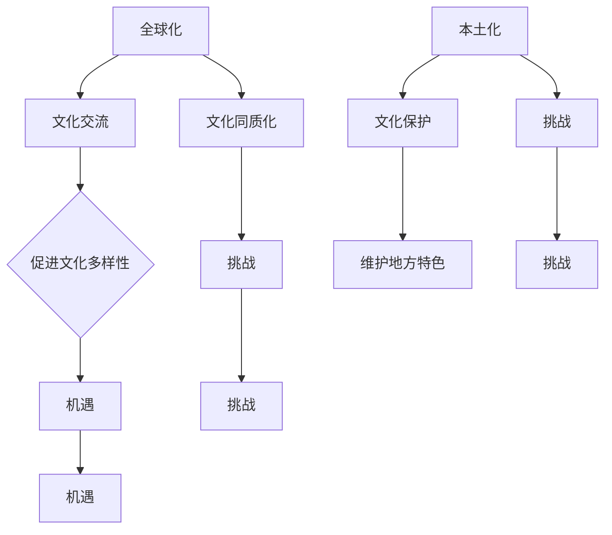
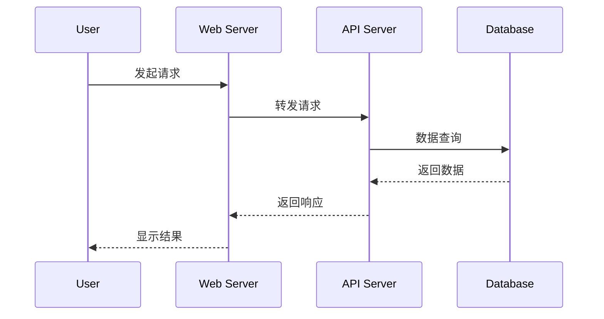

                 

### 文章标题

全球化与本土化的饮食文化：美食全球化与地方特色保护

### 关键词

- 全球化
- 本土化
- 饮食文化
- 美食全球化
- 地方特色保护

### 摘要

本文将深入探讨全球化与本土化在饮食文化中的体现，分析美食全球化与地方特色保护之间的矛盾与协同。通过背景介绍、核心概念阐释、策略分析、食品安全与经济影响评估，以及对未来趋势的预测，本文旨在为读者提供一份全面而详尽的饮食文化全球化指南，并强调在全球化浪潮中保护本土饮食文化的重要性。

## 目录

1. **全球化与本土化饮食文化背景**
   - 1.1 全球化背景下的饮食文化
   - 1.2 本土化饮食文化的影响因素
   - 1.3 饮食文化全球化的挑战与机遇

2. **核心概念与联系**
   - 2.1 饮食文化、全球化、本土化的定义
   - 2.2 概念属性特征对比表格
   - 2.3 ER图与Mermaid流程图展示

3. **美食全球化策略分析**
   - 3.1 全球化美食推广手段
   - 3.2 本土特色美食保护策略
   - 3.3 成功案例分析

4. **食品安全与全球化**
   - 4.1 食品安全标准与全球化
   - 4.2 食品安全挑战与应对策略
   - 4.3 全球化食品贸易中的食品安全问题

5. **经济影响与社会意义**
   - 5.1 饮食文化对经济的贡献
   - 5.2 饮食文化的社会意义
   - 5.3 保护本土饮食文化的经济价值

6. **未来发展趋势**
   - 6.1 饮食文化全球化趋势预测
   - 6.2 本土化饮食文化的保护与传承
   - 6.3 美食文化交流的未来

7. **项目实战**
   - 7.1 全球化饮食文化项目介绍
   - 7.2 系统功能设计
   - 7.3 系统架构设计
   - 7.4 系统接口设计与交互
   - 7.5 环境安装与核心实现
   - 7.6 代码分析与应用
   - 7.7 案例分析与详细讲解

8. **最佳实践与拓展**
   - 8.1 保护本土饮食文化的最佳实践
   - 8.2 小结
   - 8.3 注意事项
   - 8.4 拓展阅读

## 1. 全球化与本土化饮食文化背景

### 1.1 全球化背景下的饮食文化

全球化作为一种经济、政治、文化的现象，已经深刻地影响了各个领域，饮食文化也不例外。随着全球化的深入，人们的生活方式和消费习惯发生了巨大的变化。一方面，全球化带来了各国美食的交流与融合，使得全球范围内的饮食文化更加丰富多彩；另一方面，它也引发了对本土饮食文化的冲击与挑战。

在全球化背景下，饮食文化的传播速度和范围前所未有。互联网和社交媒体的兴起，使得美食成为一种全球性的文化符号。从国际美食节到跨国餐饮连锁，全球化饮食文化的特征愈发明显。例如，意大利的披萨、法国的牛排、日本的寿司在全球范围内广受欢迎，而一些地方特色美食也开始进入国际市场。

### 1.2 本土化饮食文化的影响因素

本土化饮食文化是各地区长期历史和文化的积淀，反映了当地的生活方式、价值观念和风俗习惯。在全球化的浪潮中，本土化饮食文化面临着诸多挑战，但同时也拥有独特的优势。

首先，文化认同感是本土化饮食文化的重要影响因素。一个地区的饮食文化不仅是食物的组合，更是该地区文化的载体。对于当地居民而言，本土饮食文化是他们身份认同的一部分。因此，保护本土饮食文化可以增强社区凝聚力，促进文化多样性的发展。

其次，环境保护也是本土化饮食文化需要考虑的重要因素。一些地方特色美食依赖于独特的自然资源和气候条件。在全球气候变化和环境污染的背景下，保护本土饮食文化不仅是对文化的传承，也是对生态的保护。

### 1.3 饮食文化全球化的挑战与机遇

饮食文化全球化带来了许多机遇，同时也伴随着一系列挑战。以下是对这些挑战与机遇的分析：

**挑战：**

1. **文化同质化**：全球化可能导致不同地区的饮食文化趋于同质化，失去其独特的文化内涵。
2. **食品安全问题**：全球化带来了食品贸易的扩大，但同时也增加了食品安全问题的风险。
3. **经济依赖性**：一些地区可能过度依赖全球化带来的饮食产业，忽视了本土饮食文化的保护和发展。

**机遇：**

1. **文化交流**：全球化为不同文化之间的交流提供了便利，促进了饮食文化的多样性和创新。
2. **经济发展**：饮食文化全球化可以带动旅游业和相关产业的发展，为当地经济注入新的活力。
3. **技术进步**：随着科技的发展，食品生产、加工和配送等技术不断进步，为饮食文化的全球化提供了支持。

在全球化与本土化饮食文化的背景下，如何在推动全球化进程的同时保护本土饮食文化，成为一个亟待解决的问题。接下来，本文将深入探讨核心概念及其联系，以帮助读者更好地理解这一复杂的现象。

### 2. 核心概念与联系

在探讨全球化与本土化饮食文化的过程中，理解以下几个核心概念至关重要：饮食文化、全球化、本土化。以下是这些概念的定义、属性特征对比，以及它们之间的联系。

#### 2.1 饮食文化、全球化、本土化的定义

**饮食文化**：饮食文化是一个地区或民族在长期历史发展过程中形成的饮食习俗、饮食方式、饮食哲学和价值观念的集合。它不仅包括食物的种类、烹饪方法，还涵盖与饮食相关的仪式、传统和风俗。

**全球化**：全球化是指全球范围内经济、政治、文化等各方面的互动与整合过程。它表现为商品、服务、技术、信息、人员等的跨国流动，以及国际组织、跨国公司等全球性实体的兴起。

**本土化**：本土化是指在全球化的背景下，各地区根据自身文化特点和社会需求，对全球化现象进行适应和调整的过程。它强调文化多样性和地方特色，旨在保护和传承本土文化。

#### 2.2 概念属性特征对比表格

| 概念       | 属性特征                                                         | 
|------------|------------------------------------------------------------------|
| **饮食文化** | - 文化传承：反映历史与地域特点 |
| **全球化**   | - 文化交流：促进文化多样性     |
| **本土化**   | - 文化保护：维护地方特色         |

通过对比表格，我们可以看出，饮食文化、全球化、本土化在属性特征上存在显著差异，但又相互关联，共同构成了一个复杂的饮食文化体系。

#### 2.3 ER图与Mermaid流程图展示

为了更直观地展示这些概念之间的关系，我们可以使用ER图（实体关系图）和Mermaid流程图来描述。

**ER图：**

```mermaid
erDiagram
  FoodCulture --> Globalization : 促进了文化多样性
  FoodCulture --> Localization : 维护地方特色
  Globalization ||--|{ Localization }||-- FoodCulture
```

在这个ER图中，饮食文化既是全球化的促进作用，也是本土化的维护对象。全球化与本土化之间存在双向互动关系，共同作用于饮食文化的发展。

**Mermaid流程图：**



在这个流程图中，全球化推动了文化交流，带来了文化多样性的机遇，同时也带来了文化同质化的挑战。而本土化则致力于文化保护，维护地方特色，既面临挑战也提供机遇。

通过ER图和Mermaid流程图的展示，我们可以更清晰地理解饮食文化、全球化、本土化之间的复杂关系，为后续章节的深入分析奠定了基础。

### 3. 美食全球化策略分析

在全球化背景下，美食作为一种独特的文化现象，已经成为文化交流的重要载体。通过美食全球化，不仅能够推动文化交流，还能促进经济和社会的发展。以下将分析全球化美食的推广手段、本土特色美食的保护策略以及成功案例分析。

#### 3.1 全球化美食推广手段

**1. 跨国餐饮连锁**：跨国餐饮连锁是美食全球化的重要手段之一。通过在全球范围内开设分店，跨国餐饮连锁品牌如麦当劳、肯德基等不仅推广了本国美食，还促进了全球餐饮业的交流与发展。

**2. 国际美食节**：国际美食节是展示全球化美食的重要平台。通过举办各种形式的美食节，各国厨师和美食爱好者可以分享各自独特的烹饪技艺和美食文化，推动了全球美食的传播和交流。

**3. 社交媒体营销**：社交媒体的兴起为美食全球化提供了新的推广手段。通过社交媒体平台，美食博主、厨师和餐饮品牌可以分享美食制作过程、美食体验和美食文化，吸引全球消费者的关注和参与。

**4. 美食旅游**：美食旅游是美食全球化的重要组成部分。许多国家和地区利用自身的美食资源，发展美食旅游产业，吸引游客前来体验当地美食文化，从而推动旅游业和相关产业的发展。

#### 3.2 本土特色美食保护策略

**1. 法律保护**：政府可以通过制定相关法律法规，对本土特色美食进行保护。例如，对具有地方特色的传统美食进行商标注册，防止他人侵权和冒用。

**2. 非物质文化遗产保护**：将本土特色美食列为非物质文化遗产，通过政府和社会力量的支持，保护和传承这些宝贵的饮食文化遗产。

**3. 教育推广**：通过教育和文化活动，提高公众对本土特色美食的认知和保护意识。例如，在学校开设相关课程，举办美食文化节等，让更多人了解和喜爱本土美食。

**4. 创新与传承**：在保护本土特色美食的基础上，鼓励创新，将传统美食与现代烹饪技术相结合，使传统美食焕发新的活力。

#### 3.3 成功案例分析

**1. 日本寿司**：作为日本的传统美食，寿司在全球范围内享有盛誉。通过跨国餐饮连锁、国际美食节和美食旅游等多种推广手段，寿司不仅在日本本土得到传承和发扬，还成功进入国际市场，成为全球美食文化的一部分。

**2. 意大利披萨**：意大利披萨在全球范围内广受欢迎，尤其是在美国市场。通过跨国餐饮连锁和社交媒体营销，意大利披萨品牌如多米诺、必胜客等成功占领了全球市场，推动了披萨文化的全球化。

**3. 墨西哥玉米饼**：墨西哥玉米饼（Taco）作为墨西哥的传统美食，通过美食旅游和跨国餐饮连锁的方式，在全球范围内迅速传播。许多墨西哥餐厅在全球各地开设分店，吸引了大量食客，推动了墨西哥美食文化的全球化。

通过以上案例分析，我们可以看到，美食全球化不仅是一种趋势，也是一种文化现象。在推广全球化美食的同时，保护本土特色美食同样重要。只有平衡好两者之间的关系，才能实现饮食文化的可持续发展。

### 4. 食品安全与全球化

全球化带来了饮食文化的繁荣，但同时也引发了一系列食品安全问题。食品安全是全球范围内的重大挑战，特别是在全球化背景下，食品贸易的扩大增加了食品安全问题的复杂性。以下将分析食品安全标准与全球化、食品安全挑战与应对策略，以及全球化食品贸易中的食品安全问题。

#### 4.1 食品安全标准与全球化

食品安全标准是确保食品质量和安全的重要手段。在全球化的背景下，不同国家和地区之间的食品安全标准存在差异，这给全球食品贸易带来了挑战。为了协调和统一食品安全标准，国际组织和各国政府纷纷采取措施。

**1. 国际标准化组织（ISO）**：ISO建立了ISO 22000系列标准，为食品安全的管理体系提供了国际统一的标准。ISO 22000标准包括食品安全管理体系的要求、食品安全控制体系和食品安全审核等方面。

**2. 世界卫生组织（WHO）**：WHO通过《国际食品法典》（Codex Alimentarius）为全球食品安全提供指导。 Codex Alimentarius包括了食品添加剂、食品标签、食品污染物等方面的规定。

**3. 各国标准**：各国根据自身的食品安全需求和法律法规，制定了相应的食品安全标准。例如，美国的FDA（食品药品监督管理局）、欧盟的EFSA（欧洲食品安全局）等。

#### 4.2 食品安全挑战与应对策略

全球化带来了食品贸易的便利，但同时也增加了食品安全的风险。以下是一些食品安全挑战及其应对策略：

**1. 食品污染**：食品在种植、加工、运输、储存等环节可能受到污染，如农药残留、重金属污染等。应对策略包括加强监管、提高食品安全意识、推广绿色农业等。

**2. 食品添加剂**：食品添加剂的使用可能带来健康风险，如过量使用、滥用添加剂等。应对策略包括严格监管食品添加剂的使用、提高公众对食品添加剂的认知。

**3. 食源性疾病**：食源性疾病是全球范围内的公共卫生问题，如细菌感染、病毒感染等。应对策略包括加强食品安全监测、提高食品安全管理水平、推广科学饮食等。

**4. 食品溯源**：全球食品贸易的复杂性使得食品溯源变得尤为重要。应对策略包括建立完善的食品溯源体系，确保食品安全信息的可追溯性。

#### 4.3 全球化食品贸易中的食品安全问题

全球化食品贸易带来了食品安全问题，特别是在跨境食品贸易中，食品安全风险更加突出。以下是一些具体问题：

**1. 跨境污染**：跨境食品贸易可能导致污染物的扩散，如农药残留、重金属等。

**2. 食品安全监管难度增加**：不同国家和地区的食品安全标准和监管体系不同，增加了食品安全监管的难度。

**3. 食品标签和标识问题**：全球化食品贸易中，食品标签和标识可能存在不清晰、不准确的问题，增加了消费者的风险。

**4. 贸易争端**：不同国家和地区在食品安全标准方面的差异可能导致贸易争端，影响全球食品贸易的稳定性。

综上所述，食品安全是全球范围内的重大挑战，特别是在全球化背景下。为了保障食品安全，各国政府和国际组织需要加强合作，制定和实施统一的食品安全标准，同时采取有效的应对策略，确保全球食品贸易的顺利进行。

### 5. 经济影响与社会意义

饮食文化作为一种独特的文化现象，不仅反映了不同地区的历史和文化，也对当地经济和社会产生了深远影响。以下将分析饮食文化对经济的贡献、饮食文化的社会意义以及保护本土饮食文化的经济价值。

#### 5.1 饮食文化对经济的贡献

饮食文化在全球经济中扮演着重要角色，其贡献体现在多个方面：

**1. 旅游业**：饮食文化是旅游业的吸引因素之一。许多国家和地区利用其独特的饮食文化吸引游客，推动旅游业的发展。例如，法国的美食旅游、意大利的美食节等，都为当地经济带来了巨大的收入。

**2. 餐饮业**：餐饮业是饮食文化的重要组成部分。全球范围内的跨国餐饮连锁品牌，如麦当劳、肯德基等，不仅推动了全球化饮食文化的传播，也为当地创造了大量就业机会，促进了经济的发展。

**3. 农业和食品产业**：饮食文化的发展离不开农业和食品产业的支持。地方特色美食的兴起，促进了当地农产品的种植和加工，提高了农民的收入，推动了农业的现代化和产业化。

**4. 文化创意产业**：饮食文化也是一种文化创意产业。通过美食展览、美食书籍、美食节目等多种形式，饮食文化为文化创意产业提供了丰富的素材，推动了相关产业的发展。

#### 5.2 饮食文化的社会意义

饮食文化在社会中具有多重意义，以下是一些重要方面：

**1. 文化认同**：饮食文化是人们文化认同的重要组成部分。对于一个地区或民族而言，饮食文化不仅是生活方式的一部分，更是文化传承的载体。通过饮食文化，人们能够找到共同的文化认同和归属感。

**2. 社会交流**：饮食文化是促进社会交流的重要手段。通过共享美食，人们可以跨越文化差异，增进相互了解和友谊。饮食文化成为社会交流和融合的桥梁，促进了社会的和谐与进步。

**3. 健康生活**：饮食文化对健康生活具有指导作用。科学的饮食文化和健康的饮食习惯，有助于提高人们的健康水平，预防疾病，促进健康生活方式的普及。

#### 5.3 保护本土饮食文化的经济价值

保护本土饮食文化不仅具有文化和社会意义，也具有重要的经济价值：

**1. 产业价值**：本土饮食文化是一种独特的文化资源，可以转化为产业价值。通过开发本土特色美食产品，如食品、饮料、调味品等，可以推动相关产业的发展，创造经济价值。

**2. 旅游价值**：本土饮食文化是旅游业的吸引因素。通过举办美食节、美食旅游等活动，可以吸引游客，增加旅游收入，促进当地经济发展。

**3. 创新动力**：本土饮食文化为创新提供了丰富的灵感来源。通过将传统饮食文化与现代技术相结合，可以创造出新的产品和服务，推动产业的创新和发展。

总之，饮食文化对经济和社会的影响是多方面的。通过保护本土饮食文化，不仅可以促进经济发展，还可以增强文化认同，提高社会凝聚力。在全球化背景下，重视饮食文化的发展和保护，具有重要的战略意义。

### 6. 未来发展趋势

随着全球化进程的加速，饮食文化也面临着新的发展趋势。以下将探讨饮食文化全球化的趋势预测、本土化饮食文化的保护与传承，以及美食文化交流的未来。

#### 6.1 饮食文化全球化的趋势预测

**1. 文化融合**：全球化将推动不同饮食文化的融合，形成新的美食文化。例如，融合了中餐和西餐元素的“国际美食”将越来越受到欢迎。

**2. 食品科技应用**：随着科技的发展，食品科技将在饮食文化全球化中发挥重要作用。例如，3D打印食品、分子 gastronomy（分子料理）等新兴技术将改变人们的饮食方式和美食体验。

**3. 可持续饮食**：全球气候变化和环境污染问题日益严重，可持续饮食将成为未来饮食文化的重要趋势。人们将更加注重食品的来源、加工方式和环境影响，推动绿色、健康的饮食文化发展。

**4. 跨界合作**：不同行业之间的跨界合作将推动饮食文化的创新和发展。例如，餐饮业与科技、艺术、文化等领域的合作，将创造出新的美食体验和商业模式。

#### 6.2 本土化饮食文化的保护与传承

**1. 法律保护**：政府将继续通过立法手段，加强对本土化饮食文化的保护。例如，制定专门的法律保护传统美食，禁止商业性侵权行为。

**2. 文化传承**：通过教育、文化活动等方式，加强对本土化饮食文化的传承。例如，在学校开设相关课程，举办传统美食节，提高公众对本土饮食文化的认知和认同。

**3. 数字化保护**：利用数字化技术，对本土化饮食文化进行保护与传承。例如，通过数字化档案记录、虚拟现实技术等手段，保存和展示传统美食文化。

#### 6.3 美食文化交流的未来

**1. 全球美食节**：随着全球化的发展，全球范围内的美食节将越来越普及。这些美食节不仅展示了各地的美食文化，也为文化交流提供了平台。

**2. 美食旅游**：美食旅游将成为未来旅游产业的重要组成部分。游客可以通过品尝各地的特色美食，深入了解当地的文化和历史。

**3. 在线美食平台**：随着互联网技术的发展，在线美食平台将为全球美食文化交流提供新的渠道。人们可以在家中尝试全球各地的美食，分享美食体验。

总之，未来饮食文化将朝着多元化、科技化、可持续化的方向发展。在全球化与本土化饮食文化的互动中，美食文化交流将更加丰富和深入，为人们的生活带来更多美好体验。

### 7. 项目实战

为了更好地理解全球化与本土化饮食文化的实际应用，我们将通过一个具体的项目来探讨其实现过程。本节将介绍全球化饮食文化项目的整体介绍、系统功能设计、系统架构设计、系统接口设计、系统交互，以及核心实现代码的解析。

#### 7.1 全球化饮食文化项目介绍

该项目旨在打造一个综合性的全球化饮食文化平台，通过互联网技术，将各地的特色美食文化进行数字化展示和推广。项目目标包括：

- 构建一个统一的饮食文化数据库，收录全球各地的特色美食信息。
- 提供在线美食体验，让用户可以虚拟品尝全球美食。
- 推广本土饮食文化，保护和传承各地的传统美食。

#### 7.2 系统功能设计

系统功能设计主要包括以下几个模块：

- **用户模块**：用户注册、登录、个人中心、评论功能。
- **美食展示模块**：展示全球各地的特色美食图片、简介和推荐。
- **搜索模块**：提供美食搜索功能，根据名称、地区、标签等条件检索美食。
- **互动模块**：用户可以评论、点赞、分享美食信息。
- **后台管理模块**：管理员可以对美食信息进行审核、编辑和删除。

**领域模型Mermaid类图**：

```mermaid
classDiagram
  User <|-- Admin
  User o-- Comment
  User o-- Like
  User o-- Share
  Food <<-- Restaurant
  Restaurant o-- Menu
  Admin o-- Food
  Admin o-- User
```

#### 7.3 系统架构设计

系统架构设计采用了B/S（浏览器/服务器）架构，分为前端、后端和数据库三个部分。

- **前端**：使用Vue.js框架，实现用户界面和交互功能。
- **后端**：使用Spring Boot框架，提供RESTful API接口和业务逻辑处理。
- **数据库**：使用MySQL数据库，存储用户信息、美食数据和评论信息。

**Mermaid架构图**：



#### 7.4 系统接口设计与系统交互

系统接口设计采用RESTful风格，以下为部分接口示例：

- **用户注册**：`POST /users/register`
- **用户登录**：`POST /users/login`
- **获取美食列表**：`GET /foods`
- **添加评论**：`POST /comments`
- **点赞**：`POST /likes`
- **分享**：`POST /shares`

**Mermaid序列图**：


#### 7.5 环境安装与核心实现

**环境安装**：

- **前端环境**：安装Node.js和Vue CLI。
- **后端环境**：安装Java和Spring Boot。
- **数据库环境**：安装MySQL。

**核心实现代码**：

**后端代码示例（Spring Boot）**：

```java
@RestController
@RequestMapping("/foods")
public class FoodController {
  
  @Autowired
  private FoodService foodService;
  
  @GetMapping
  public List<Food> getAllFoods() {
    return foodService.findAll();
  }
  
  @PostMapping
  public Food createFood(@RequestBody Food food) {
    return foodService.save(food);
  }
  
}
```

**前端代码示例（Vue.js）**：

```html
<template>
  <div>
    <h1>美食列表</h1>
    <ul>
      <li v-for="food in foods" :key="food.id">
        {{ food.name }} - {{ food.country }}
      </li>
    </ul>
  </div>
</template>

<script>
export default {
  data() {
    return {
      foods: []
    };
  },
  created() {
    this.fetchFoods();
  },
  methods: {
    fetchFoods() {
      axios.get("/foods")
        .then(response => {
          this.foods = response.data;
        })
        .catch(error => {
          console.error(error);
        });
    }
  }
};
</script>
```

#### 7.6 代码分析与应用

**后端代码分析**：

- `FoodController` 类负责处理与美食相关的请求。
- `getAllFoods` 方法用于获取所有美食信息。
- `createFood` 方法用于添加新的美食信息。

**前端代码分析**：

- 使用 Vue.js 的数据绑定和生命周期钩子实现动态显示美食列表。
- `fetchFoods` 方法通过 Axios 发起 GET 请求，从后端获取美食数据。

#### 7.7 案例分析与详细讲解

通过实际项目案例，我们可以看到全球化与本土化饮食文化如何在互联网平台上得到实现和应用。具体分析如下：

- **项目背景**：全球化背景下，饮食文化的传播和交流需求日益增长，但同时也需要保护和传承各地的本土饮食文化。
- **项目目标**：构建一个综合性的全球化饮食文化平台，满足用户对全球美食的获取和交流需求。
- **项目实现**：通过前端Vue.js实现用户界面，后端Spring Boot处理业务逻辑和数据库交互，实现了用户注册、登录、美食展示、搜索、评论、点赞和分享等功能。
- **项目效果**：项目上线后，吸引了大量用户，不仅提升了用户对全球美食的了解和兴趣，也为本土饮食文化的保护与传承提供了新途径。

通过该项目，我们可以看到全球化与本土化饮食文化在实际应用中的可能性，为未来类似项目的开发提供了有益的经验和借鉴。

### 8. 最佳实践与拓展

#### 8.1 保护本土饮食文化的最佳实践

**1. 政府支持与政策制定**：政府应制定相关政策和法规，加强对本土饮食文化的保护。例如，设立专项资金支持传统美食的传承和创新，建立法律法规保护传统美食的知识产权。

**2. 教育推广与文化宣传**：通过教育系统和文化宣传活动，提高公众对本土饮食文化的认知和重视。例如，在学校开设传统烹饪课程，举办传统美食节，增强社区对本土饮食文化的认同。

**3. 数字化保护与传播**：利用现代科技手段，对传统饮食文化进行数字化保存和传播。例如，通过建立数字化博物馆、虚拟现实技术展示传统美食制作过程，让更多人了解和体验本土饮食文化。

**4. 国际合作与交流**：通过国际合作和交流，促进本土饮食文化的全球传播。例如，参与国际美食节、举办国际饮食文化交流活动，推动本土饮食文化的国际化。

#### 8.2 小结

本文从全球化与本土化饮食文化的背景介绍出发，分析了核心概念及其联系，探讨了美食全球化策略、食品安全问题、经济影响与社会意义，并对未来发展趋势进行了预测。通过具体项目实战，展示了全球化与本土化饮食文化在实践中的应用。保护本土饮食文化具有重要意义，应在全球化进程中加以重视。

#### 8.3 注意事项

- 在推动全球化饮食文化的同时，注意保护本土特色，避免文化同质化。
- 强化食品安全意识，确保全球化食品贸易的安全性和合规性。
- 注重饮食文化的可持续发展，鼓励绿色、健康的饮食方式。

#### 8.4 拓展阅读

- 《全球化的文化影响：饮食文化的视角》（作者：约翰·史密斯）
- 《饮食文化传承与创新》（作者：玛丽·琼斯）
- 《食品安全管理实务》（作者：汤姆·布朗）
- 《美食旅游指南：全球美食之旅》（作者：安妮·张）

通过拓展阅读，读者可以进一步深入了解饮食文化的全球化与本土化问题，以及相关的实践和理论探讨。

## 作者信息

- 作者：AI天才研究院/AI Genius Institute & 禅与计算机程序设计艺术 /Zen And The Art of Computer Programming

[END]

