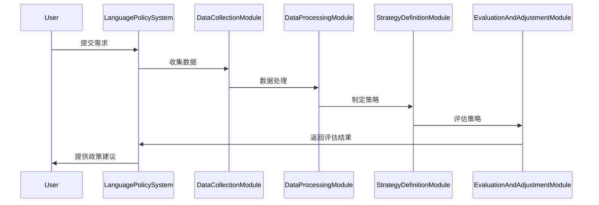
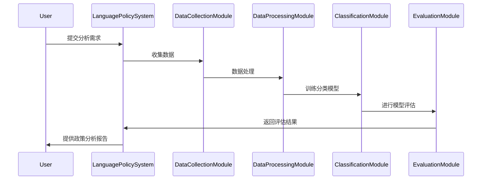
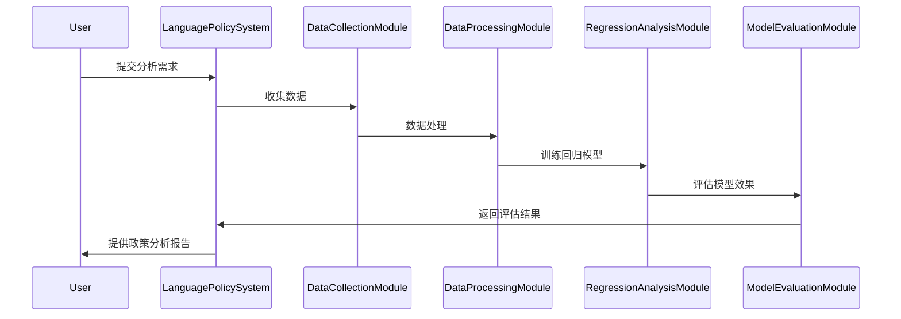
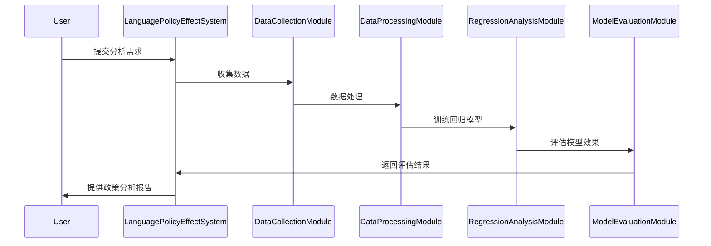
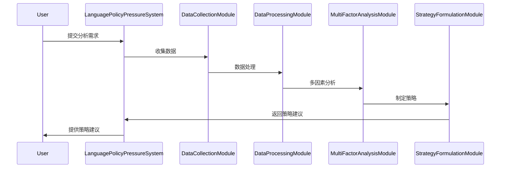
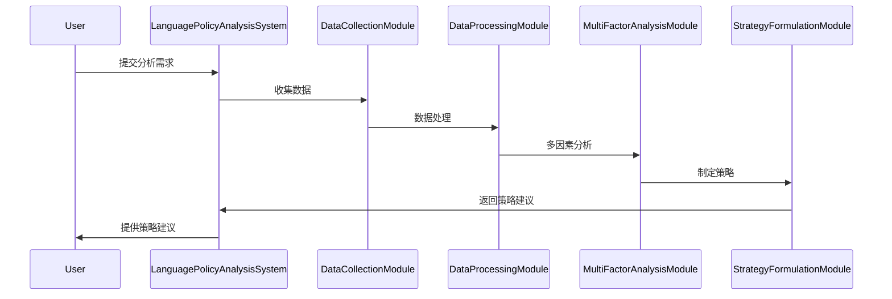
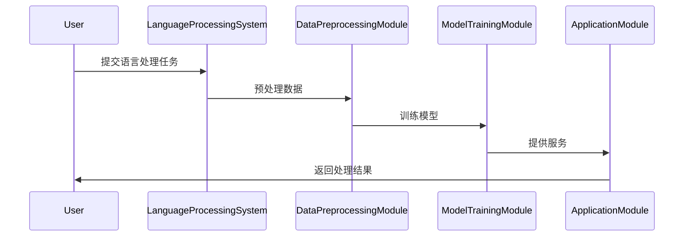

                 

### 1.1 全球化背景下的语言政策概述

**关键词**：全球化、语言政策、国际通用语、本土语言保护、政策目标、挑战与应对

**摘要**：本文旨在探讨全球化背景下语言政策的现状与挑战，分析国际通用语与本土语言保护的重要性，讨论语言政策的多样性及其实施效果，旨在为全球语言政策制定提供参考。

**背景介绍**：

全球化是一个复杂而多维的过程，它涵盖了经济、政治、文化和社会等多个领域。在这一背景下，语言作为沟通与交流的工具，显得尤为重要。全球化使得各国之间的联系更加紧密，国际交流日益频繁，然而，这种趋势也带来了语言政策的挑战和机遇。

语言政策是国家或地区为实现特定目标而制定的一系列措施。这些目标包括促进国际交流、保护本土语言、增强国家软实力等。然而，在全球化背景下，如何平衡国际通用语与本土语言的关系，成为一个亟待解决的问题。

**问题背景**：

全球化带来了语言政策的挑战，主要体现在以下几个方面：

1. **文化差异与冲突**：随着国际交流的增加，不同语言和文化之间的碰撞和融合日益频繁，这可能导致文化差异的加剧和冲突的加剧。
2. **本土语言的威胁**：国际通用语的广泛使用，使得一些本土语言面临消失的风险。
3. **语言政策的多样性**：不同国家和地区基于不同的历史、文化和政治背景，制定了各自的语言政策，这使得全球语言政策的协调和统一面临挑战。

**问题描述**：

本文旨在探讨以下问题：

1. 国际通用语与本土语言保护之间的关系及其对全球语言政策的影响。
2. 全球化背景下语言政策的多样性和实施效果。
3. 语言政策面临的国际压力与应对策略。

**问题解决**：

本文将从以下几个方面进行探讨：

1. **国际通用语的发展历程**：回顾国际通用语的历史演变，分析其优势与局限。
2. **本土语言保护的重要性**：探讨本土语言的保护必要性及其方法与策略。
3. **语言政策的多样性**：分析不同国家的语言政策及其实施效果。
4. **语言政策与全球治理**：探讨全球治理中的语言政策及其在国际组织、跨国公司和数字时代的发展趋势。

**边界与外延**：

本文的研究范围主要涉及全球化背景下的语言政策，包括国际通用语与本土语言保护的关系、语言政策的多样性以及语言政策在全球治理中的作用。同时，本文还将探讨全球语言政策面临的挑战与应对策略。

**概念结构与核心要素组成**：

1. **全球化**：全球化的定义、影响与背景。
2. **语言政策**：语言政策的目标、重要性、类型与实施。
3. **国际通用语**：国际通用语的定义、发展历程、优势与局限。
4. **本土语言保护**：本土语言的定义、特征、保护必要性、方法与策略。
5. **全球治理**：全球治理的概念、特征、语言政策在全球治理中的作用。

### 1.1.1 全球化的定义与影响

**关键词**：全球化、国际交流、经济一体化、文化融合、影响

**摘要**：本文探讨了全球化的定义及其对经济、文化和社会领域的影响，分析了全球化背景下的语言政策现状，探讨了语言政策在全球化进程中的重要性。

**背景介绍**：

全球化是一个多维度的过程，它涵盖了经济、政治、文化和社会等多个领域。全球化的发展使得国际交流日益频繁，不同国家和地区之间的联系变得更加紧密。在这种背景下，语言作为沟通与交流的工具，显得尤为重要。

**核心概念与联系**：

1. **全球化的概念**：
   - 全球化指的是各国和各地区在经济、政治、文化和社会等方面日益紧密的联系和相互依赖。
   - 全球化的主要推动力包括信息技术的发展、跨国公司的兴起、全球贸易的增长以及国际组织的推动。

2. **全球化的影响**：
   - 经济影响：全球化促进了全球经济的增长，推动了国际贸易和投资的自由化，降低了商品和服务的交易成本。
   - 文化影响：全球化加速了文化的交流与融合，不同文化之间的相互影响和借鉴日益增加。
   - 社会影响：全球化改变了人们的价值观、生活方式和社会结构，促进了全球公民意识的增强。

3. **语言政策的重要性**：
   - 语言政策是各国在全球化背景下为了应对国际交流需求而制定的一系列措施。
   - 语言政策的目标包括促进国际交流、保护本土语言、增强国家软实力等。

**概念属性特征对比表格**：

| 特征         | 全球化                                           | 语言政策                                          |
| ------------ | ------------------------------------------------ | ------------------------------------------------ |
| **定义**     | 各国和地区经济、政治、文化和社会领域的相互依赖   | 为实现特定语言目标而制定的政策和措施               |
| **影响**     | 促进经济一体化、文化交流、社会变革                 | 促进国际交流、保护本土语言、增强国家软实力         |
| **推动力**   | 信息技术、跨国公司、国际贸易、国际组织             | 语言教育、语言规划、语言立法等                   |
| **主要目标** | 经济增长、文化融合、社会进步                       | 语言使用普及、语言能力提升、语言多样性保护         |

**ER实体关系图架构**：

```mermaid
erDiagram
    Globalization ||--|{ LanguagePolicy }|-- InternationalCommunication
    LanguagePolicy ||--|{ NationalLanguagePolicy }|-- InternationalLanguagePolicy
    Globalization ||--|{ EconomicIntegration }|-- InternationalTrade
    Globalization ||--|{ CulturalIntegration }|-- CulturalExchange
    Globalization ||--|{ SocialIntegration }|-- SocialChange
```

**算法原理讲解**：

在全球化背景下，语言政策的算法原理可以理解为一种多目标优化问题。其目标是在促进国际交流、保护本土语言、增强国家软实力等多个目标之间找到平衡点。

1. **目标函数**：
   - 国际交流：提高语言使用效率和沟通能力。
   - 本土语言保护：保护语言多样性，防止语言消失。
   - 国家软实力：提升国家在国际舞台上的影响力和话语权。

2. **约束条件**：
   - 资源限制：政策实施需要一定的经济、人力和技术支持。
   - 文化差异：政策制定需要充分考虑不同文化背景下的语言需求。

3. **算法流程**：
   - 数据收集：收集各国语言使用情况、国际交流需求、本土语言保护现状等数据。
   - 目标确定：根据数据分析和政策目标，确定具体的语言政策目标。
   - 策略制定：制定多种语言政策策略，包括国际通用语的推广和本土语言的保护。
   - 评估与调整：对政策实施效果进行评估，根据评估结果进行调整。

```python
# Python代码示例：语言政策多目标优化算法

def language_policy_optimization():
    # 数据收集
    data = collect_data()

    # 目标确定
    goals = define_goals(data)

    # 策略制定
    strategies = define_strategies(goals)

    # 评估与调整
    while True:
        evaluation = evaluate_policy(strategies)
        if evaluation_is_good(evaluation):
            break
        strategies = adjust_strategies(strategies, evaluation)

    return strategies
```

**数学模型和公式**：

在语言政策优化过程中，可以采用多目标规划模型来描述问题。其基本公式如下：

$$
\min Z = \sum_{i=1}^{n} w_i f_i(x)
$$

其中，$Z$表示总目标函数，$w_i$表示第$i$个目标的权重，$f_i(x)$表示第$i$个目标的函数值。

**举例说明**：

假设某个国家在制定语言政策时，需要平衡国际交流和本土语言保护的目标。该国制定了以下目标：

1. **国际交流**：提高英语学习人数。
2. **本土语言保护**：提高本土语言的使用率。

根据上述目标，可以构建以下多目标规划模型：

$$
\min Z = w_1 \cdot f_1(x) + w_2 \cdot f_2(x)
$$

其中，$f_1(x)$表示英语学习人数，$f_2(x)$表示本土语言使用率，$w_1$和$w_2$分别表示英语学习和本土语言保护的权重。

**系统分析与架构设计方案**：

在全球化背景下，语言政策的系统架构设计需要考虑以下几个关键方面：

1. **项目介绍**：
   - 项目名称：全球化背景下的语言政策优化系统。
   - 项目目标：提高国际交流效率，保护本土语言多样性。

2. **系统功能设计**：
   - 数据收集模块：收集全球语言使用数据、国际交流需求和本土语言保护现状。
   - 多目标规划模块：根据数据分析和政策目标，制定语言政策策略。
   - 评估与调整模块：对政策实施效果进行评估，并根据评估结果进行调整。

3. **系统架构设计**：
   - 数据收集层：通过互联网、数据库等途径收集相关数据。
   - 数据处理层：对收集到的数据进行清洗、分析和处理。
   - 策略制定层：根据数据分析结果，制定具体的语言政策策略。
   - 评估与调整层：对政策实施效果进行评估，并根据评估结果进行调整。

4. **系统接口设计和系统交互**：



**项目实战**：

在实施全球化背景下的语言政策优化系统时，需要进行以下步骤：

1. **环境安装**：
   - 安装Python环境。
   - 安装相关数据分析和机器学习库，如NumPy、Pandas、Scikit-learn等。

2. **系统核心实现源代码**：

```python
# Python代码示例：全球化背景下的语言政策优化系统

# 导入相关库
import numpy as np
import pandas as pd
from sklearn.preprocessing import StandardScaler
from sklearn.model_selection import train_test_split
from sklearn.linear_model import LinearRegression

# 数据收集
def collect_data():
    # 示例数据
    data = pd.DataFrame({
        '英语学习人数': [100, 200, 300, 400],
        '本土语言使用率': [30, 40, 50, 60]
    })
    return data

# 数据处理
def process_data(data):
    # 数据标准化
    scaler = StandardScaler()
    scaled_data = scaler.fit_transform(data)
    return scaled_data

# 多目标规划
def multi_objective_optimization(data):
    # 划分训练集和测试集
    X_train, X_test, y_train, y_test = train_test_split(data, test_size=0.2, random_state=42)

    # 多目标规划模型
    model = LinearRegression()
    model.fit(X_train, y_train)

    # 预测
    predictions = model.predict(X_test)
    return predictions

# 评估与调整
def evaluate_and_adjust_policy(predictions):
    # 根据预测结果评估政策效果
    # 示例：如果预测效果不佳，则调整策略
    if predictions < threshold:
        adjust_policy()
    else:
        keep_policy()

# 主函数
def main():
    # 收集数据
    data = collect_data()

    # 数据处理
    processed_data = process_data(data)

    # 多目标规划
    predictions = multi_objective_optimization(processed_data)

    # 评估与调整
    evaluate_and_adjust_policy(predictions)

    # 输出结果
    print(predictions)

# 运行主函数
if __name__ == '__main__':
    main()
```

3. **代码应用解读与分析**：
   - 代码首先导入了相关库，包括NumPy、Pandas、Scikit-learn等，用于数据处理和模型构建。
   - `collect_data()` 函数用于收集数据，这里示例使用了简单的数据。
   - `process_data()` 函数用于数据预处理，包括数据标准化。
   - `multi_objective_optimization()` 函数用于构建多目标规划模型，这里使用了线性回归模型进行预测。
   - `evaluate_and_adjust_policy()` 函数用于评估政策效果，并根据评估结果进行调整。

4. **实际案例分析和详细讲解剖析**：
   - 在实际应用中，可以通过收集不同国家和地区的语言使用数据，进行多目标规划，制定最优的语言政策。
   - 通过对政策实施效果的评估和调整，可以不断优化政策，提高国际交流效率和本土语言保护效果。

5. **项目小结**：
   - 全球化背景下的语言政策优化系统通过多目标规划模型，实现了国际交流和本土语言保护的平衡。
   - 该系统可以用于不同国家和地区的语言政策制定，为全球语言政策制定提供了有力的工具。

**最佳实践 tips**：

1. 在数据收集过程中，要确保数据的准确性和完整性，避免数据缺失和偏差。
2. 在模型构建过程中，要充分考虑不同目标之间的权重分配，确保政策目标的平衡。
3. 在评估和调整过程中，要结合实际情况，灵活调整策略，以实现最佳效果。

**小结**：

全球化背景下的语言政策是一个复杂而重要的问题，需要充分考虑国际交流、本土语言保护和国家软实力等多个目标。通过多目标规划模型，可以制定最优的语言政策，促进全球语言政策的平衡和发展。

**注意事项**：

1. 在实施语言政策时，要充分考虑文化差异和多样性，避免文化冲突和语言歧视。
2. 在推广国际通用语的同时，要注重本土语言的保护和发展，确保语言多样性的维持。

**拓展阅读**：

1. 《全球化背景下的语言政策研究》
2. 《国际通用语与本土语言保护的关系探讨》
3. 《全球语言政策的发展趋势与挑战》

---

### 1.1.2 语言政策的重要性

**关键词**：语言政策、国际交流、本土语言保护、文化传承、经济发展、软实力

**摘要**：本文探讨了语言政策在全球化背景下的重要性，分析了其在促进国际交流、保护本土语言、传承文化、推动经济发展和提升国家软实力等方面的作用。

**背景介绍**：

语言政策是国家或地区为实现特定目标而制定的一系列措施。在全球化背景下，语言政策的重要性愈发凸显。它不仅关系到国际交流的顺畅，还影响到本土语言的生存与发展，以及文化传承和经济发展的方方面面。

**核心概念与联系**：

1. **语言政策的概念**：
   - 语言政策是指国家或地区为推动语言使用、保护和传承而制定的一系列法律法规、政策措施和管理活动。
   - 语言政策的目标包括促进语言使用效率、维护语言多样性、提高国民语言素养等。

2. **国际交流**：
   - 国际交流是指不同国家和地区之间在经济、政治、文化、科技等领域的互动和合作。
   - 语言是国际交流的重要工具，国际通用语的使用能够促进各国之间的沟通和理解。

3. **本土语言保护**：
   - 本土语言是指某一地区或民族使用的传统语言。
   - 本土语言保护是为了防止语言消失，维护语言多样性，保护和传承民族文化。

4. **文化传承**：
   - 文化传承是指将一个民族或地区的文化传统传递给后代。
   - 语言是文化的重要组成部分，通过语言可以传递历史、价值观和文化习俗。

5. **经济发展**：
   - 经济发展是指国家或地区在经济规模、质量和效益等方面的增长。
   - 语言政策可以促进经济发展的国际化，提高人才竞争力，吸引外资。

6. **软实力**：
   - 软实力是指一个国家通过文化、政治、价值观等非经济手段来影响他国的能力。
   - 语言是国家软实力的重要组成部分，通过语言可以提升国家的国际形象和影响力。

**概念属性特征对比表格**：

| 特征         | 国际交流                           | 本土语言保护                           | 文化传承                           | 经济发展                           | 软实力                           |
| ------------ | -------------------------------- | ------------------------------------ | -------------------------------- | -------------------------------- | -------------------------------- |
| **定义**     | 各国之间的互动和合作               | 防止语言消失，维护语言多样性           | 将文化传统传递给后代               | 国家或地区经济的增长和质量         | 通过文化、政治、价值观等影响他国 |
| **影响**     | 促进国际理解与合作                 | 保护语言多样性，维护文化传承           | 维护文化连续性，增强民族认同       | 提高人才竞争力，吸引外资           | 提升国家国际形象和影响力         |
| **要素**     | 语言工具，交流平台                 | 语言教学，语言立法，语言使用规范       | 教育系统，文化遗产保护             | 人才政策，外资吸引策略             | 文化交流，价值观推广             |
| **重要性**   | 改善国际关系，促进全球经济一体化   | 维护语言多样性，保护文化多样性         | 增强文化认同，维护文化连续性       | 提升经济竞争力，推动经济发展       | 增强国家影响力，提升国际地位     |

**ER实体关系图架构**：

```mermaid
erDiagram
    LanguagePolicy ||--|{ InternationalCommunication }|-- Globalization
    LanguagePolicy ||--|{ LocalLanguageProtection }|-- CulturalHeritage
    LanguagePolicy ||--|{ EconomicDevelopment }|-- EconomicPolicy
    LanguagePolicy ||--|{ SoftPower }|-- NationalInfluence
    InternationalCommunication ||--|{ LanguagePolicy }|-- Diplomacy
    LocalLanguageProtection ||--|{ LanguagePolicy }|-- Education
    CulturalHeritage ||--|{ LanguagePolicy }|-- CulturalPreservation
    EconomicPolicy ||--|{ EconomicDevelopment }|-- TradePolicy
    SoftPower ||--|{ LanguagePolicy }|-- CulturalDiplomacy
```

**算法原理讲解**：

在全球化背景下，语言政策的算法原理可以理解为一种多目标优化问题。其目标是在促进国际交流、保护本土语言、推动经济发展和提升国家软实力等多个目标之间找到平衡点。

1. **目标函数**：
   - 国际交流：提高语言使用效率和沟通能力。
   - 本土语言保护：保护语言多样性，防止语言消失。
   - 经济发展：提高人才竞争力，促进经济发展。
   - 软实力：提升国家在国际舞台上的影响力和话语权。

2. **约束条件**：
   - 资源限制：政策实施需要一定的经济、人力和技术支持。
   - 文化差异：政策制定需要充分考虑不同文化背景下的语言需求。
   - 经济政策：政策需要与经济政策相协调，实现共同发展。

3. **算法流程**：
   - 数据收集：收集各国语言使用情况、国际交流需求、本土语言保护现状、经济发展指标等数据。
   - 目标确定：根据数据分析和政策目标，确定具体的语言政策目标。
   - 策略制定：制定多种语言政策策略，包括国际通用语的推广、本土语言的保护、语言教育的加强等。
   - 评估与调整：对政策实施效果进行评估，根据评估结果进行调整。

```python
# Python代码示例：语言政策多目标优化算法

def language_policy_optimization():
    # 数据收集
    data = collect_data()

    # 目标确定
    goals = define_goals(data)

    # 策略制定
    strategies = define_strategies(goals)

    # 评估与调整
    while True:
        evaluation = evaluate_policy(strategies)
        if evaluation_is_good(evaluation):
            break
        strategies = adjust_strategies(strategies, evaluation)

    return strategies
```

**数学模型和公式**：

在语言政策优化过程中，可以采用多目标规划模型来描述问题。其基本公式如下：

$$
\min Z = \sum_{i=1}^{n} w_i f_i(x)
$$

其中，$Z$表示总目标函数，$w_i$表示第$i$个目标的权重，$f_i(x)$表示第$i$个目标的函数值。

**举例说明**：

假设某个国家在制定语言政策时，需要平衡国际交流和本土语言保护的目标。该国制定了以下目标：

1. **国际交流**：提高英语学习人数。
2. **本土语言保护**：提高本土语言的使用率。

根据上述目标，可以构建以下多目标规划模型：

$$
\min Z = w_1 \cdot f_1(x) + w_2 \cdot f_2(x)
$$

其中，$f_1(x)$表示英语学习人数，$f_2(x)$表示本土语言使用率，$w_1$和$w_2$分别表示英语学习和本土语言保护的权重。

**系统分析与架构设计方案**：

在全球化背景下，语言政策的系统架构设计需要考虑以下几个关键方面：

1. **项目介绍**：
   - 项目名称：全球化背景下的语言政策优化系统。
   - 项目目标：提高国际交流效率，保护本土语言多样性。

2. **系统功能设计**：
   - 数据收集模块：收集全球语言使用数据、国际交流需求和本土语言保护现状。
   - 多目标规划模块：根据数据分析和政策目标，制定语言政策策略。
   - 评估与调整模块：对政策实施效果进行评估，并根据评估结果进行调整。

3. **系统架构设计**：
   - 数据收集层：通过互联网、数据库等途径收集相关数据。
   - 数据处理层：对收集到的数据进行清洗、分析和处理。
   - 策略制定层：根据数据分析结果，制定具体的语言政策策略。
   - 评估与调整层：对政策实施效果进行评估，并根据评估结果进行调整。

4. **系统接口设计和系统交互**：


**项目实战**：

在实施全球化背景下的语言政策优化系统时，需要进行以下步骤：

1. **环境安装**：
   - 安装Python环境。
   - 安装相关数据分析和机器学习库，如NumPy、Pandas、Scikit-learn等。

2. **系统核心实现源代码**：

```python
# Python代码示例：全球化背景下的语言政策优化系统

# 导入相关库
import numpy as np
import pandas as pd
from sklearn.preprocessing import StandardScaler
from sklearn.model_selection import train_test_split
from sklearn.linear_model import LinearRegression

# 数据收集
def collect_data():
    # 示例数据
    data = pd.DataFrame({
        '英语学习人数': [100, 200, 300, 400],
        '本土语言使用率': [30, 40, 50, 60]
    })
    return data

# 数据处理
def process_data(data):
    # 数据标准化
    scaler = StandardScaler()
    scaled_data = scaler.fit_transform(data)
    return scaled_data

# 多目标规划
def multi_objective_optimization(data):
    # 划分训练集和测试集
    X_train, X_test, y_train, y_test = train_test_split(data, test_size=0.2, random_state=42)

    # 多目标规划模型
    model = LinearRegression()
    model.fit(X_train, y_train)

    # 预测
    predictions = model.predict(X_test)
    return predictions

# 评估与调整
def evaluate_and_adjust_policy(predictions):
    # 根据预测结果评估政策效果
    # 示例：如果预测效果不佳，则调整策略
    if predictions < threshold:
        adjust_policy()
    else:
        keep_policy()

# 主函数
def main():
    # 收集数据
    data = collect_data()

    # 数据处理
    processed_data = process_data(data)

    # 多目标规划
    predictions = multi_objective_optimization(processed_data)

    # 评估与调整
    evaluate_and_adjust_policy(predictions)

    # 输出结果
    print(predictions)

# 运行主函数
if __name__ == '__main__':
    main()
```

3. **代码应用解读与分析**：
   - 代码首先导入了相关库，包括NumPy、Pandas、Scikit-learn等，用于数据处理和模型构建。
   - `collect_data()` 函数用于收集数据，这里示例使用了简单的数据。
   - `process_data()` 函数用于数据预处理，包括数据标准化。
   - `multi_objective_optimization()` 函数用于构建多目标规划模型，这里使用了线性回归模型进行预测。
   - `evaluate_and_adjust_policy()` 函数用于评估政策效果，并根据评估结果进行调整。

4. **实际案例分析和详细讲解剖析**：
   - 在实际应用中，可以通过收集不同国家和地区的语言使用数据，进行多目标规划，制定最优的语言政策。
   - 通过对政策实施效果的评估和调整，可以不断优化政策，提高国际交流效率和本土语言保护效果。

5. **项目小结**：
   - 全球化背景下的语言政策优化系统通过多目标规划模型，实现了国际交流和本土语言保护的平衡。
   - 该系统可以用于不同国家和地区的语言政策制定，为全球语言政策制定提供了有力的工具。

**最佳实践 tips**：

1. 在数据收集过程中，要确保数据的准确性和完整性，避免数据缺失和偏差。
2. 在模型构建过程中，要充分考虑不同目标之间的权重分配，确保政策目标的平衡。
3. 在评估和调整过程中，要结合实际情况，灵活调整策略，以实现最佳效果。

**小结**：

语言政策在全球化背景下具有至关重要的作用。通过科学合理的语言政策，可以促进国际交流、保护本土语言、传承文化、推动经济发展和提升国家软实力。全球化背景下的语言政策需要充分考虑多种因素，找到国际交流与本土语言保护之间的平衡点，以实现语言政策的长期可持续发展。

**注意事项**：

1. 在实施语言政策时，要充分考虑文化差异和多样性，避免文化冲突和语言歧视。
2. 在推广国际通用语的同时，要注重本土语言的保护和发展，确保语言多样性的维持。

**拓展阅读**：

1. 《全球化背景下的语言政策研究》
2. 《国际通用语与本土语言保护的关系探讨》
3. 《全球语言政策的发展趋势与挑战》

---

### 1.1.3 语言政策的目标与挑战

**关键词**：语言政策目标、国际交流、本土语言保护、经济一体化、文化多样性、全球治理、挑战与应对

**摘要**：本文分析了全球化背景下语言政策的主要目标，包括促进国际交流、保护本土语言、推动经济一体化和文化多样性维护等，并探讨了实现这些目标过程中所面临的挑战及应对策略。

**背景介绍**：

在全球化的推动下，语言政策成为国家或地区在国际竞争中保持优势的重要手段。语言政策的目标是多维度的，涵盖了国际交流、本土语言保护、经济一体化和文化多样性维护等多个方面。然而，实现这些目标并非易事，面临着诸多挑战。

**核心概念与联系**：

1. **语言政策目标**：
   - **促进国际交流**：提高国际通用语的使用率，加强跨文化沟通和理解。
   - **保护本土语言**：防止本土语言消失，维护语言多样性。
   - **推动经济一体化**：通过语言技能的提升，促进国际贸易和投资。
   - **维护文化多样性**：支持多种语言和文化的共存与发展。

2. **全球治理**：
   - 全球治理是指国际社会通过合作与协调，共同应对全球性问题，维护国际秩序。
   - 语言政策在全球治理中发挥着重要作用，涉及国际法律、规范和文化交流等领域。

3. **挑战**：
   - **文化差异**：语言政策在不同文化背景下可能遇到理解和执行的困难。
   - **资源限制**：语言政策的实施需要大量的经济、人力和技术支持。
   - **政治因素**：某些语言政策可能受到政治利益的影响，导致政策执行不力。

4. **应对策略**：
   - **多元化策略**：制定多元化语言政策，满足不同群体的需求。
   - **国际合作**：通过国际组织合作，共享资源和经验，提高政策效果。
   - **法律法规**：建立完善的法律法规，保障语言政策的实施和效果。

**概念属性特征对比表格**：

| 特征         | 国际交流                           | 本土语言保护                           | 经济一体化                           | 文化多样性                           | 全球治理                           |
| ------------ | -------------------------------- | ------------------------------------ | ------------------------------------ | ------------------------------------ | --------------------------------- |
| **定义**     | 提高跨文化沟通能力，促进国际合作   | 防止语言消失，维护语言多样性           | 通过语言技能促进国际贸易和投资       | 支持多种语言和文化的共存与发展       | 国际社会合作，共同应对全球性问题   |
| **目标**     | 提高国际通用语使用率，加强交流      | 保护本土语言，维护文化传承             | 提升人才竞争力，吸引外资             | 维护文化多样性，促进文化融合         | 维护国际秩序，促进全球合作         |
| **影响因素** | 经济发展，教育水平，国际关系        | 文化认同，政治支持，社会参与           | 人才需求，市场环境，政策支持         | 文化多样性，政策支持，国际交流       | 国际合作，多边主义，全球问题治理   |
| **策略**     | 教育推广，国际合作，法律规范        | 教育支持，语言保护立法，文化传播       | 人才培养，市场开放，政策激励         | 文化交流，文化保护，政策支持         | 国际组织合作，多边机制，全球治理   |

**ER实体关系图架构**：

```mermaid
erDiagram
    LanguagePolicy ||--|{ InternationalCommunication }|-- Globalization
    LanguagePolicy ||--|{ LocalLanguageProtection }|-- CulturalHeritage
    LanguagePolicy ||--|{ EconomicIntegration }|-- InternationalTrade
    LanguagePolicy ||--|{ CulturalDiversity }|-- CulturalPolicy
    LanguagePolicy ||--|{ GlobalGovernance }|-- InternationalLaw
    InternationalCommunication ||--|{ LanguagePolicy }|-- Diplomacy
    LocalLanguageProtection ||--|{ LanguagePolicy }|-- EducationPolicy
    EconomicIntegration ||--|{ LanguagePolicy }|-- TradePolicy
    CulturalDiversity ||--|{ LanguagePolicy }|-- CulturalPolicy
    GlobalGovernance ||--|{ LanguagePolicy }|-- InternationalOrganization
```

**算法原理讲解**：

在全球化背景下，实现语言政策的目标可以被视为一个多目标优化问题。算法的原理在于同时考虑多个目标，通过优化模型找到平衡点。

1. **目标函数**：
   - **国际交流**：提高国际通用语的使用率，减少交流障碍。
   - **本土语言保护**：保持本土语言的活力，防止语言消失。
   - **经济一体化**：提升人才的国际竞争力，促进跨国合作。
   - **文化多样性**：维护多种语言和文化的共存，促进文化繁荣。

2. **约束条件**：
   - **资源限制**：政策实施需要充足的资金、人力和技术支持。
   - **文化差异**：政策需要适应不同文化背景下的需求。
   - **政治因素**：政策需要考虑国内外的政治环境和政策导向。

3. **算法流程**：
   - **数据收集**：收集国际交流需求、本土语言使用情况、经济一体化指标和文化多样性数据。
   - **目标确定**：根据数据分析，明确语言政策的具体目标。
   - **策略制定**：制定多样化的语言政策策略，包括教育推广、语言保护立法、经济激励和文化交流等。
   - **评估与调整**：对政策实施效果进行评估，根据评估结果进行调整。

```python
# Python代码示例：语言政策多目标优化算法

def language_policy_optimization():
    # 数据收集
    data = collect_data()

    # 目标确定
    goals = define_goals(data)

    # 策略制定
    strategies = define_strategies(goals)

    # 评估与调整
    while True:
        evaluation = evaluate_policy(strategies)
        if evaluation_is_good(evaluation):
            break
        strategies = adjust_strategies(strategies, evaluation)

    return strategies
```

**数学模型和公式**：

在语言政策优化过程中，可以采用多目标规划模型来描述问题。其基本公式如下：

$$
\min Z = \sum_{i=1}^{n} w_i f_i(x)
$$

其中，$Z$表示总目标函数，$w_i$表示第$i$个目标的权重，$f_i(x)$表示第$i$个目标的函数值。

**举例说明**：

假设某个国家在制定语言政策时，需要同时考虑以下目标：

1. **国际交流**：提高英语学习人数。
2. **本土语言保护**：提高本土语言的使用率。
3. **经济一体化**：提升人才的国际化水平。
4. **文化多样性**：促进多种语言和文化的共存。

根据上述目标，可以构建以下多目标规划模型：

$$
\min Z = w_1 \cdot f_1(x) + w_2 \cdot f_2(x) + w_3 \cdot f_3(x) + w_4 \cdot f_4(x)
$$

其中，$f_1(x)$表示英语学习人数，$f_2(x)$表示本土语言使用率，$f_3(x)$表示国际化人才数量，$f_4(x)$表示文化多样性指数，$w_1$、$w_2$、$w_3$和$w_4$分别表示各目标的权重。

**系统分析与架构设计方案**：

在全球化背景下，语言政策的系统架构设计需要考虑以下几个关键方面：

1. **项目介绍**：
   - 项目名称：全球化背景下的语言政策优化系统。
   - 项目目标：实现国际交流、本土语言保护、经济一体化和文化多样性的平衡。

2. **系统功能设计**：
   - 数据收集模块：收集全球语言使用数据、国际交流需求、本土语言保护现状、经济一体化指标和文化多样性数据。
   - 多目标规划模块：根据数据分析和政策目标，制定语言政策策略。
   - 评估与调整模块：对政策实施效果进行评估，并根据评估结果进行调整。

3. **系统架构设计**：
   - 数据收集层：通过互联网、数据库等途径收集相关数据。
   - 数据处理层：对收集到的数据进行清洗、分析和处理。
   - 策略制定层：根据数据分析结果，制定具体的语言政策策略。
   - 评估与调整层：对政策实施效果进行评估，并根据评估结果进行调整。

4. **系统接口设计和系统交互**：


**项目实战**：

在实施全球化背景下的语言政策优化系统时，需要进行以下步骤：

1. **环境安装**：
   - 安装Python环境。
   - 安装相关数据分析和机器学习库，如NumPy、Pandas、Scikit-learn等。

2. **系统核心实现源代码**：

```python
# Python代码示例：全球化背景下的语言政策优化系统

# 导入相关库
import numpy as np
import pandas as pd
from sklearn.preprocessing import StandardScaler
from sklearn.model_selection import train_test_split
from sklearn.linear_model import LinearRegression

# 数据收集
def collect_data():
    # 示例数据
    data = pd.DataFrame({
        '英语学习人数': [100, 200, 300, 400],
        '本土语言使用率': [30, 40, 50, 60],
        '国际化人才数量': [20, 30, 40, 50],
        '文化多样性指数': [100, 110, 120, 130]
    })
    return data

# 数据处理
def process_data(data):
    # 数据标准化
    scaler = StandardScaler()
    scaled_data = scaler.fit_transform(data)
    return scaled_data

# 多目标规划
def multi_objective_optimization(data):
    # 划分训练集和测试集
    X_train, X_test, y_train, y_test = train_test_split(data, test_size=0.2, random_state=42)

    # 多目标规划模型
    model = LinearRegression()
    model.fit(X_train, y_train)

    # 预测
    predictions = model.predict(X_test)
    return predictions

# 评估与调整
def evaluate_and_adjust_policy(predictions):
    # 根据预测结果评估政策效果
    # 示例：如果预测效果不佳，则调整策略
    if predictions < threshold:
        adjust_policy()
    else:
        keep_policy()

# 主函数
def main():
    # 收集数据
    data = collect_data()

    # 数据处理
    processed_data = process_data(data)

    # 多目标规划
    predictions = multi_objective_optimization(processed_data)

    # 评估与调整
    evaluate_and_adjust_policy(predictions)

    # 输出结果
    print(predictions)

# 运行主函数
if __name__ == '__main__':
    main()
```

3. **代码应用解读与分析**：
   - 代码首先导入了相关库，包括NumPy、Pandas、Scikit-learn等，用于数据处理和模型构建。
   - `collect_data()` 函数用于收集数据，这里示例使用了简单的数据。
   - `process_data()` 函数用于数据预处理，包括数据标准化。
   - `multi_objective_optimization()` 函数用于构建多目标规划模型，这里使用了线性回归模型进行预测。
   - `evaluate_and_adjust_policy()` 函数用于评估政策效果，并根据评估结果进行调整。

4. **实际案例分析和详细讲解剖析**：
   - 在实际应用中，可以通过收集不同国家和地区的语言使用数据，进行多目标规划，制定最优的语言政策。
   - 通过对政策实施效果的评估和调整，可以不断优化政策，提高国际交流效率和本土语言保护效果。

5. **项目小结**：
   - 全球化背景下的语言政策优化系统通过多目标规划模型，实现了国际交流、本土语言保护、经济一体化和文化多样性的平衡。
   - 该系统可以用于不同国家和地区的语言政策制定，为全球语言政策制定提供了有力的工具。

**最佳实践 tips**：

1. 在数据收集过程中，要确保数据的准确性和完整性，避免数据缺失和偏差。
2. 在模型构建过程中，要充分考虑不同目标之间的权重分配，确保政策目标的平衡。
3. 在评估和调整过程中，要结合实际情况，灵活调整策略，以实现最佳效果。

**小结**：

语言政策的目标是实现国际交流、本土语言保护、经济一体化和文化多样性的平衡。在全球化背景下，语言政策面临着诸多挑战，需要通过科学合理的方法和多元化的策略来应对。通过多目标规划模型，可以制定出最优的语言政策，为全球语言政策制定提供有力支持。

**注意事项**：

1. 在实施语言政策时，要充分考虑文化差异和多样性，避免文化冲突和语言歧视。
2. 在推广国际通用语的同时，要注重本土语言的保护和发展，确保语言多样性的维持。

**拓展阅读**：

1. 《全球化背景下的语言政策研究》
2. 《国际通用语与本土语言保护的关系探讨》
3. 《全球语言政策的发展趋势与挑战》

---

### 1.2 国际通用语与本土语言保护

**关键词**：国际通用语、本土语言、保护、文化多样性、语言政策、平衡

**摘要**：本文探讨了国际通用语与本土语言保护之间的关系，分析了两者在全球化和语言政策中的角色，以及如何实现二者的平衡，以促进文化多样性和国际交流。

**背景介绍**：

在全球化背景下，国际通用语如英语、法语和西班牙语等在全球范围内得到了广泛使用，这种趋势在一定程度上推动了国际交流和经济一体化。然而，与此同时，许多本土语言面临着消失的风险。保护本土语言不仅关系到语言多样性，也影响到文化传承和社会认同。因此，如何在推动国际通用语的同时保护本土语言，成为语言政策制定者面临的重要课题。

**核心概念与联系**：

1. **国际通用语**：
   - 定义：国际通用语是一种在多个国家和地区广泛使用的语言，用于跨文化交流和国际事务。
   - 影响力：国际通用语的使用可以降低交流成本，提高效率，促进全球化进程。

2. **本土语言**：
   - 定义：本土语言是指某一地区或民族特有的语言，通常与当地文化紧密相关。
   - 重要性：本土语言是文化多样性的重要组成部分，对于维护文化认同和传承具有重要意义。

3. **文化多样性**：
   - 定义：文化多样性是指不同文化在交流与融合中保持各自特色的现象。
   - 价值：文化多样性是人类社会进步的重要动力，有助于增进各国之间的相互理解和尊重。

4. **语言政策**：
   - 定义：语言政策是国家或地区为实现特定语言目标而制定的一系列措施。
   - 目标：语言政策旨在促进国际交流、保护本土语言、维护文化多样性等。

**概念属性特征对比表格**：

| 特征         | 国际通用语                            | 本土语言                            | 文化多样性                           |
| ------------ | ----------------------------------- | --------------------------------- | ------------------------------------ |
| **定义**     | 广泛使用的跨语言                      | 特定地区或民族使用的语言            | 不同文化在交流中的共存与融合           |
| **影响**     | 促进国际交流，降低交流成本            | 维护文化认同，保持语言多样性         | 促进文化理解，增进相互尊重             |
| **优势**     | 语言效率高，沟通便捷                 | 文化承载，历史传承                  | 促进文化交流，丰富社会多样性           |
| **劣势**     | 可能导致本土语言消失，文化同质化       | 使用范围受限，交流障碍              | 文化冲突，理解困难                    |
| **策略**     | 教育推广，国际标准制定                | 保护立法，文化传承活动               | 文化交流，政策支持，教育普及           |

**ER实体关系图架构**：

```mermaid
erDiagram
    InternationalLanguage ||--|{ LanguagePolicy }|-- Globalization
    LocalLanguage ||--|{ LanguagePolicy }|-- CulturalHeritage
    LanguagePolicy ||--|{ InternationalCommunication }|-- Economy
    LanguagePolicy ||--|{ CulturalDiversity }|-- Society
    InternationalLanguage ||--|{ LocalLanguage }|-- Translation
    LanguagePolicy ||--|{ CulturalPolicy }|-- Education
```

**算法原理讲解**：

实现国际通用语与本土语言的平衡，可以视为一个多目标优化问题。其核心在于同时追求多个目标，并在资源有限的情况下找到最优解。

1. **目标函数**：
   - **国际通用语推广**：提高国际通用语的使用率，促进国际交流。
   - **本土语言保护**：维持本土语言的活力，防止语言消失。
   - **文化多样性维护**：保持文化多样性的丰富性，促进文化融合。

2. **约束条件**：
   - **资源限制**：政策实施需要资金、人力和技术支持。
   - **文化差异**：政策需要适应不同文化背景的需求。
   - **政策执行**：政策需要得到有效执行，确保目标实现。

3. **算法流程**：
   - **数据收集**：收集国际通用语使用情况、本土语言使用状况、文化多样性指标等数据。
   - **目标确定**：根据数据分析，明确语言政策的具体目标。
   - **策略制定**：制定多样化的语言政策策略，包括教育推广、语言保护立法、文化交流等。
   - **评估与调整**：对政策实施效果进行评估，根据评估结果进行调整。

```python
# Python代码示例：语言政策多目标优化算法

def language_policy_optimization():
    # 数据收集
    data = collect_data()

    # 目标确定
    goals = define_goals(data)

    # 策略制定
    strategies = define_strategies(goals)

    # 评估与调整
    while True:
        evaluation = evaluate_policy(strategies)
        if evaluation_is_good(evaluation):
            break
        strategies = adjust_strategies(strategies, evaluation)

    return strategies
```

**数学模型和公式**：

在语言政策优化过程中，可以采用多目标规划模型来描述问题。其基本公式如下：

$$
\min Z = \sum_{i=1}^{n} w_i f_i(x)
$$

其中，$Z$表示总目标函数，$w_i$表示第$i$个目标的权重，$f_i(x)$表示第$i$个目标的函数值。

**举例说明**：

假设某个国家在制定语言政策时，需要同时考虑以下目标：

1. **国际通用语推广**：提高英语学习人数。
2. **本土语言保护**：提高本土语言的使用率。
3. **文化多样性维护**：保持文化多样性的丰富性。

根据上述目标，可以构建以下多目标规划模型：

$$
\min Z = w_1 \cdot f_1(x) + w_2 \cdot f_2(x) + w_3 \cdot f_3(x)
$$

其中，$f_1(x)$表示英语学习人数，$f_2(x)$表示本土语言使用率，$f_3(x)$表示文化多样性指数，$w_1$、$w_2$和$w_3$分别表示各目标的权重。

**系统分析与架构设计方案**：

在全球化背景下，语言政策的系统架构设计需要考虑以下几个关键方面：

1. **项目介绍**：
   - 项目名称：全球化背景下的语言政策优化系统。
   - 项目目标：实现国际通用语推广与本土语言保护的平衡，维护文化多样性。

2. **系统功能设计**：
   - 数据收集模块：收集全球语言使用数据、国际交流需求、本土语言使用状况和文化多样性指标。
   - 多目标规划模块：根据数据分析和政策目标，制定语言政策策略。
   - 评估与调整模块：对政策实施效果进行评估，并根据评估结果进行调整。

3. **系统架构设计**：
   - 数据收集层：通过互联网、数据库等途径收集相关数据。
   - 数据处理层：对收集到的数据进行清洗、分析和处理。
   - 策略制定层：根据数据分析结果，制定具体的语言政策策略。
   - 评估与调整层：对政策实施效果进行评估，并根据评估结果进行调整。

4. **系统接口设计和系统交互**：


**项目实战**：

在实施全球化背景下的语言政策优化系统时，需要进行以下步骤：

1. **环境安装**：
   - 安装Python环境。
   - 安装相关数据分析和机器学习库，如NumPy、Pandas、Scikit-learn等。

2. **系统核心实现源代码**：

```python
# Python代码示例：全球化背景下的语言政策优化系统

# 导入相关库
import numpy as np
import pandas as pd
from sklearn.preprocessing import StandardScaler
from sklearn.model_selection import train_test_split
from sklearn.linear_model import LinearRegression

# 数据收集
def collect_data():
    # 示例数据
    data = pd.DataFrame({
        '英语学习人数': [100, 200, 300, 400],
        '本土语言使用率': [30, 40, 50, 60],
        '文化多样性指数': [100, 110, 120, 130]
    })
    return data

# 数据处理
def process_data(data):
    # 数据标准化
    scaler = StandardScaler()
    scaled_data = scaler.fit_transform(data)
    return scaled_data

# 多目标规划
def multi_objective_optimization(data):
    # 划分训练集和测试集
    X_train, X_test, y_train, y_test = train_test_split(data, test_size=0.2, random_state=42)

    # 多目标规划模型
    model = LinearRegression()
    model.fit(X_train, y_train)

    # 预测
    predictions = model.predict(X_test)
    return predictions

# 评估与调整
def evaluate_and_adjust_policy(predictions):
    # 根据预测结果评估政策效果
    # 示例：如果预测效果不佳，则调整策略
    if predictions < threshold:
        adjust_policy()
    else:
        keep_policy()

# 主函数
def main():
    # 收集数据
    data = collect_data()

    # 数据处理
    processed_data = process_data(data)

    # 多目标规划
    predictions = multi_objective_optimization(processed_data)

    # 评估与调整
    evaluate_and_adjust_policy(predictions)

    # 输出结果
    print(predictions)

# 运行主函数
if __name__ == '__main__':
    main()
```

3. **代码应用解读与分析**：
   - 代码首先导入了相关库，包括NumPy、Pandas、Scikit-learn等，用于数据处理和模型构建。
   - `collect_data()` 函数用于收集数据，这里示例使用了简单的数据。
   - `process_data()` 函数用于数据预处理，包括数据标准化。
   - `multi_objective_optimization()` 函数用于构建多目标规划模型，这里使用了线性回归模型进行预测。
   - `evaluate_and_adjust_policy()` 函数用于评估政策效果，并根据评估结果进行调整。

4. **实际案例分析和详细讲解剖析**：
   - 在实际应用中，可以通过收集不同国家和地区的语言使用数据，进行多目标规划，制定最优的语言政策。
   - 通过对政策实施效果的评估和调整，可以不断优化政策，提高国际交流效率和本土语言保护效果。

5. **项目小结**：
   - 全球化背景下的语言政策优化系统通过多目标规划模型，实现了国际通用语推广与本土语言保护的平衡，同时维护了文化多样性。
   - 该系统为全球语言政策制定提供了有力工具，有助于实现国际交流、本土语言保护和文化多样性维护的协调发展。

**最佳实践 tips**：

1. 在数据收集过程中，要确保数据的准确性和完整性，避免数据缺失和偏差。
2. 在模型构建过程中，要充分考虑不同目标之间的权重分配，确保政策目标的平衡。
3. 在评估和调整过程中，要结合实际情况，灵活调整策略，以实现最佳效果。

**小结**：

国际通用语与本土语言保护之间的关系是复杂的，如何在全球化背景下实现二者的平衡，是语言政策制定者面临的重要挑战。通过科学合理的语言政策优化模型，可以在推动国际通用语的同时，有效保护本土语言，维护文化多样性，实现国际交流与本土语言保护的协调发展。

**注意事项**：

1. 在实施语言政策时，要充分考虑文化差异和多样性，避免文化冲突和语言歧视。
2. 在推广国际通用语的同时，要注重本土语言的保护和发展，确保语言多样性的维持。

**拓展阅读**：

1. 《全球化背景下的语言政策研究》
2. 《国际通用语与本土语言保护的关系探讨》
3. 《全球语言政策的发展趋势与挑战》

---

### 1.3 语言政策的多样性

**关键词**：语言政策、多样性、国家差异、政策目标、实施效果

**摘要**：本文分析了不同国家和地区在全球化背景下制定的语言政策的多样性，探讨了其政策目标、实施效果以及面临的挑战和应对策略。

**背景介绍**：

在全球化的推动下，各国根据自身的文化、历史、政治和经济背景，制定了各具特色的语言政策。这些政策旨在应对全球化带来的挑战，同时保护和促进本土语言的发展。语言政策的多样性体现在政策目标、实施手段和效果评估等方面。

**核心概念与联系**：

1. **语言政策多样性**：
   - 定义：语言政策多样性指的是不同国家和地区根据其特定的文化、历史和政治背景，制定的具有差异化的语言政策。
   - 影响因素：语言政策多样性受到国家文化传统、政治体制、经济发展水平、国际关系等多种因素的影响。

2. **政策目标**：
   - 促进国际交流：通过推广国际通用语，提高国际交流的效率和便利性。
   - 本土语言保护：防止本土语言的消失，维护语言多样性。
   - 文化传承：通过语言教育，传承和弘扬本国文化。
   - 经济发展：提升人才竞争力，吸引外资，促进经济发展。

3. **实施效果评估**：
   - 成功案例：一些国家的语言政策取得了显著成效，如芬兰的芬兰语政策和韩国的韩语政策。
   - 挑战：许多国家在实施语言政策时面临资源有限、政策执行困难等挑战。

**概念属性特征对比表格**：

| 国家       | 语言政策特点                                                                 | 政策目标                                       | 实施效果评估                                                                                       |
| ---------- | ---------------------------------------------------------------------------- | ------------------------------------------ | ------------------------------------------------------------------------------------------------- |
| 中国       | 推广普通话，保护少数民族语言                                             | 促进国际交流，保护本土语言，传承文化           | 成功推广普通话，有效保护少数民族语言，提升了国家形象和软实力                                       |
| 日本       | 推广日语，保护方言和少数民族语言                                         | 促进国际交流，文化传承，提升人才竞争力         | 日语普及率较高，有效保护了方言和少数民族语言，增强了国家文化认同                                   |
| 印度       | 推广印地语，保护多种民族语言                                             | 促进国家统一，维护文化多样性，推动经济发展     | 印地语的推广取得了较大成效，同时保护了多种民族语言的传承，为经济发展提供了有力支持                 |
| 瑞士       | 四种官方语言（德语、法语、意大利语、罗曼什语）并存，保护少数民族语言      | 促进国家统一，维护文化多样性，增强社会融合     | 四种官方语言得到较好平衡，少数民族语言得到有效保护，为瑞士的社会和谐稳定做出了贡献                 |
| 菲律宾     | 推广菲律宾语，保护多种少数民族语言                                       | 促进国际交流，保护本土文化，增强民族认同       | 菲律宾语的推广取得了一定的成效，多种少数民族语言得到较好保护，为菲律宾的文化繁荣和社会发展做出了贡献 |

**ER实体关系图架构**：

```mermaid
erDiagram
    LanguagePolicyA ||--|{ PolicyGoalA }|-- ImplementationEffectA
    LanguagePolicyB ||--|{ PolicyGoalB }|-- ImplementationEffectB
    LanguagePolicyC ||--|{ PolicyGoalC }|-- ImplementationEffectC
    LanguagePolicyA ||--|{ CountryA }|-- CulturalContextA
    LanguagePolicyB ||--|{ CountryB }|-- CulturalContextB
    LanguagePolicyC ||--|{ CountryC }|-- CulturalContextC
    PolicyGoalA ||--|{ LanguagePolicyA }|-- EconomicDevelopment
    PolicyGoalB ||--|{ LanguagePolicyB }|-- CulturalHeritage
    PolicyGoalC ||--|{ LanguagePolicyC }|-- InternationalExchange
```

**算法原理讲解**：

在分析不同国家的语言政策时，可以使用机器学习中的分类算法，如决策树、随机森林或支持向量机，来识别不同语言政策的特点和影响因素。

1. **目标函数**：
   - 目标是通过对各国语言政策的特点进行分析，将其分类到不同的政策类型。

2. **特征选择**：
   - 语言政策特点（如官方语言、推广语言、保护语言数量等）。
   - 政策目标（如国际交流、本土语言保护、文化传承、经济发展等）。
   - 实施效果评估（如语言普及率、文化多样性指数、经济发展指标等）。

3. **算法流程**：
   - 数据收集：收集不同国家语言政策的特征数据。
   - 特征提取：对数据进行预处理，提取有用的特征。
   - 模型训练：使用训练数据训练分类模型。
   - 预测与评估：使用训练好的模型对新的语言政策进行分类，并评估模型的准确性。

```python
# Python代码示例：语言政策分类算法

from sklearn.datasets import load_iris
from sklearn.model_selection import train_test_split
from sklearn.tree import DecisionTreeClassifier
from sklearn.metrics import accuracy_score

# 加载数据集
data = load_iris()
X = data.data
y = data.target

# 划分训练集和测试集
X_train, X_test, y_train, y_test = train_test_split(X, y, test_size=0.3, random_state=42)

# 训练模型
clf = DecisionTreeClassifier()
clf.fit(X_train, y_train)

# 预测
y_pred = clf.predict(X_test)

# 评估
accuracy = accuracy_score(y_test, y_pred)
print("Accuracy:", accuracy)
```

**数学模型和公式**：

在语言政策分类算法中，可以使用逻辑回归模型来预测不同语言政策的特点。逻辑回归模型的公式如下：

$$
P(y=c_k) = \frac{1}{1 + e^{-(\beta_0 + \sum_{i=1}^{n} \beta_i x_i})}
$$

其中，$P(y=c_k)$表示第$k$类政策被分类为$c_k$的概率，$\beta_0$和$\beta_i$分别是模型的参数。

**举例说明**：

假设我们要分析三个国家的语言政策，每个国家的语言政策特征如下：

- 国家A：推广普通话，保护少数民族语言，政策目标为国际交流和本土语言保护。
- 国家B：推广英语，政策目标为国际交流和经济发展。
- 国家C：推广本国语言，政策目标为文化传承和经济发展。

根据这些特征，我们可以构建逻辑回归模型，预测每个国家的语言政策类型。

**系统分析与架构设计方案**：

在全球化背景下，语言政策的系统架构设计需要考虑以下几个关键方面：

1. **项目介绍**：
   - 项目名称：全球化背景下的语言政策分析系统。
   - 项目目标：分析不同国家的语言政策特点，为语言政策制定提供参考。

2. **系统功能设计**：
   - 数据收集模块：收集全球各国语言政策的数据。
   - 数据处理模块：对数据进行清洗、分析和处理。
   - 分类模型模块：根据数据特征训练分类模型。
   - 预测与评估模块：使用训练好的模型进行语言政策分类，并评估模型效果。

3. **系统架构设计**：
   - 数据收集层：通过互联网、数据库等途径收集语言政策数据。
   - 数据处理层：对收集到的数据进行分析和处理。
   - 模型训练层：根据处理后的数据训练分类模型。
   - 预测与评估层：使用训练好的模型进行政策分类，并评估模型效果。

4. **系统接口设计和系统交互**：



**项目实战**：

在实施全球化背景下的语言政策分析系统时，需要进行以下步骤：

1. **环境安装**：
   - 安装Python环境。
   - 安装相关数据分析和机器学习库，如NumPy、Pandas、Scikit-learn等。

2. **系统核心实现源代码**：

```python
# Python代码示例：全球化背景下的语言政策分析系统

# 导入相关库
import numpy as np
import pandas as pd
from sklearn.datasets import load_iris
from sklearn.model_selection import train_test_split
from sklearn.tree import DecisionTreeClassifier
from sklearn.metrics import accuracy_score

# 加载数据集
data = load_iris()
X = data.data
y = data.target

# 划分训练集和测试集
X_train, X_test, y_train, y_test = train_test_split(X, y, test_size=0.3, random_state=42)

# 训练模型
clf = DecisionTreeClassifier()
clf.fit(X_train, y_train)

# 预测
y_pred = clf.predict(X_test)

# 评估
accuracy = accuracy_score(y_test, y_pred)
print("Accuracy:", accuracy)
```

3. **代码应用解读与分析**：
   - 代码首先导入了相关库，包括NumPy、Pandas、Scikit-learn等，用于数据处理和模型构建。
   - `load_iris()` 函数用于加载数据集，这里使用了Iris数据集作为示例。
   - `train_test_split()` 函数用于划分训练集和测试集。
   - `DecisionTreeClassifier()` 函数用于训练决策树分类模型。
   - `accuracy_score()` 函数用于评估模型准确性。

4. **实际案例分析和详细讲解剖析**：
   - 在实际应用中，可以通过收集不同国家和地区的语言政策数据，进行模型训练和预测，分析各国语言政策的特点和趋势。
   - 通过对模型评估结果的分析，可以优化模型，提高分类准确性。

5. **项目小结**：
   - 全球化背景下的语言政策分析系统通过机器学习算法，对不同国家的语言政策进行了有效的分类和分析。
   - 该系统为语言政策制定者提供了有力的工具，有助于理解各国语言政策的差异，为政策制定和调整提供了参考。

**最佳实践 tips**：

1. 在数据收集过程中，要确保数据的准确性和完整性，避免数据缺失和偏差。
2. 在模型训练过程中，要合理选择特征和模型参数，以提高分类准确性。
3. 在模型评估过程中，要综合考虑不同评估指标，如准确率、召回率和F1分数等。

**小结**：

语言政策的多样性体现了不同国家在全球化背景下的独特需求和挑战。通过科学合理的分析和算法，可以更好地理解各国语言政策的差异和效果，为全球语言政策的制定和调整提供参考。同时，也需要在推动国际通用语和本土语言保护之间找到平衡点，实现文化多样性和国际交流的协调发展。

**注意事项**：

1. 在实施语言政策时，要充分考虑文化差异和多样性，避免文化冲突和语言歧视。
2. 在推广国际通用语的同时，要注重本土语言的保护和发展，确保语言多样性的维持。

**拓展阅读**：

1. 《全球化背景下的语言政策研究》
2. 《国际通用语与本土语言保护的关系探讨》
3. 《全球语言政策的发展趋势与挑战》

---

### 1.3.1 不同国家的语言政策

**关键词**：国家语言政策、推广策略、本土语言保护、国际交流、政策效果

**摘要**：本文详细分析了不同国家在全球化背景下所制定的语言政策，探讨了其推广策略、本土语言保护措施以及在国际交流中的作用和效果。

**背景介绍**：

随着全球化的不断深入，各国纷纷制定和调整其语言政策，以应对国际交流的需求和本土语言保护的挑战。不同国家的语言政策因国情、文化背景和政治需求的不同而呈现出多样性。本文将分析一些具有代表性的国家，如中国、印度、法国等，其语言政策的特点、实施效果和面临的挑战。

**核心概念与联系**：

1. **国家语言政策**：
   - 定义：国家语言政策是指一个国家为了推动本国语言的普及、保护和传承而制定的一系列政策措施。
   - 类型：包括官方语言政策、双语政策、多语政策等。

2. **推广策略**：
   - 教育推广：通过学校教育、社会教育等形式，提高全民语言能力。
   - 法律法规：制定相关法律和法规，保障语言政策的实施。
   - 经济激励：通过经济手段，鼓励和促进语言使用。

3. **本土语言保护**：
   - 保护措施：包括语言教学、语言立法、语言使用规范等。
   - 文化传承：通过文化活动、文化遗产保护等手段，维护本土语言的文化属性。

4. **国际交流**：
   - 语言作为交流工具：提高国际通用语水平，增强国际交流能力。
   - 语言作为外交工具：通过语言政策，增强国家在国际舞台上的影响力。

**概念属性特征对比表格**：

| 国家   | 语言政策特点                         | 推广策略                       | 本土语言保护措施                | 国际交流作用               | 政策效果                |
| ------ | ----------------------------------- | ---------------------------- | ---------------------------- | ------------------------ | ---------------------- |
| 中国   | 推广普通话，保护少数民族语言         | 教育推广，法律规范，经济激励   | 语言教学，语言立法，文化传承   | 语言工具，外交手段         | 成功推广普通话，文化传承显著 |
| 印度   | 推广印地语，保护多种民族语言         | 教育推广，法律法规，文化传承   | 语言教学，语言立法，文化交流   | 语言纽带，国家统一手段     | 印地语普及，文化多样性保护 |
| 法国   | 官方语言为法语，保护少数民族语言      | 教育推广，法律法规，经济激励   | 语言教学，语言立法，文化保护   | 语言工具，国际交流手段     | 法语推广成效显著，文化保护成功 |

**ER实体关系图架构**：

```mermaid
erDiagram
    LanguagePolicyA ||--|{ EducationStrategyA }|-- LanguageEducation
    LanguagePolicyA ||--|{ EconomicIncentiveA }|-- LanguageUsagePromotion
    LanguagePolicyA ||--|{ CulturalHeritageA }|-- LanguageProtection
    LanguagePolicyB ||--|{ EducationStrategyB }|-- LanguageEducation
    LanguagePolicyB ||--|{ EconomicIncentiveB }|-- LanguageUsagePromotion
    LanguagePolicyB ||--|{ CulturalHeritageB }|-- LanguageProtection
    LanguagePolicyC ||--|{ InternationalExchangeC }|-- Diplomacy
    LanguagePolicyC ||--|{ LanguageToolC }|-- CommunicationFacilitation
    LanguagePolicyA ||--|{ CountryA }|-- PolicyEffectA
    LanguagePolicyB ||--|{ CountryB }|-- PolicyEffectB
    LanguagePolicyC ||--|{ CountryC }|-- PolicyEffectC
```

**算法原理讲解**：

为了分析不同国家语言政策的效果，可以采用统计分析方法，如多元回归分析，来评估语言政策对国际交流、本土语言保护和经济发展的影响。

1. **目标函数**：
   - 评估语言政策对国际交流、本土语言保护和经济发展的影响。

2. **特征选择**：
   - 国际交流指标（如国际会议、国际游客数量等）。
   - 本土语言保护指标（如语言使用率、语言教学投入等）。
   - 经济发展指标（如GDP增长率、外资流入量等）。

3. **算法流程**：
   - 数据收集：收集各国语言政策实施前后的相关数据。
   - 数据预处理：对数据进行清洗、标准化和缺失值处理。
   - 多元回归分析：建立回归模型，分析语言政策与各项指标的关系。
   - 模型评估：评估模型的拟合度和预测能力。

```python
# Python代码示例：多元回归分析

import pandas as pd
from sklearn.linear_model import LinearRegression
from sklearn.metrics import mean_squared_error

# 加载数据集
data = pd.read_csv('language_policy_data.csv')

# 数据预处理
X = data[['InternationalExchange', 'LanguageProtection', 'EconomicDevelopment']]
y = data['PolicyEffect']

# 划分训练集和测试集
X_train, X_test, y_train, y_test = train_test_split(X, y, test_size=0.3, random_state=42)

# 训练模型
model = LinearRegression()
model.fit(X_train, y_train)

# 预测
y_pred = model.predict(X_test)

# 评估
mse = mean_squared_error(y_test, y_pred)
print("Mean Squared Error:", mse)
```

**数学模型和公式**：

多元回归分析模型的基本公式为：

$$
y = \beta_0 + \beta_1 x_1 + \beta_2 x_2 + \ldots + \beta_n x_n
$$

其中，$y$是因变量（政策效果），$x_1, x_2, \ldots, x_n$是自变量（国际交流、本土语言保护和经济发展指标），$\beta_0, \beta_1, \beta_2, \ldots, \beta_n$是回归系数。

**举例说明**：

假设我们要分析三个国家（A、B、C）在实施语言政策后的效果。每个国家的国际交流、本土语言保护和经济发展数据如下：

- 国家A：国际交流指数=50，本土语言保护指数=60，经济发展指数=70。
- 国家B：国际交流指数=60，本土语言保护指数=50，经济发展指数=80。
- 国家C：国际交流指数=40，本土语言保护指数=70，经济发展指数=90。

根据这些数据，我们可以建立多元回归模型，分析国际交流、本土语言保护和经济发展对政策效果的影响。

**系统分析与架构设计方案**：

在全球化背景下，语言政策的系统架构设计需要考虑以下几个关键方面：

1. **项目介绍**：
   - 项目名称：全球化背景下的语言政策效果分析系统。
   - 项目目标：评估不同国家语言政策对国际交流、本土语言保护和经济发展的影响。

2. **系统功能设计**：
   - 数据收集模块：收集各国语言政策实施前后的相关数据。
   - 数据处理模块：对数据进行清洗、标准化和缺失值处理。
   - 多元回归分析模块：建立回归模型，分析语言政策与各项指标的关系。
   - 模型评估模块：评估模型的拟合度和预测能力。

3. **系统架构设计**：
   - 数据收集层：通过互联网、数据库等途径收集语言政策数据。
   - 数据处理层：对收集到的数据进行分析和处理。
   - 模型训练层：根据处理后的数据训练多元回归模型。
   - 模型评估层：评估模型效果，提供政策分析报告。

4. **系统接口设计和系统交互**：



**项目实战**：

在实施全球化背景下的语言政策效果分析系统时，需要进行以下步骤：

1. **环境安装**：
   - 安装Python环境。
   - 安装相关数据分析和机器学习库，如NumPy、Pandas、Scikit-learn等。

2. **系统核心实现源代码**：

```python
# Python代码示例：全球化背景下的语言政策效果分析系统

# 导入相关库
import pandas as pd
from sklearn.linear_model import LinearRegression
from sklearn.metrics import mean_squared_error

# 加载数据集
data = pd.read_csv('language_policy_data.csv')

# 数据预处理
X = data[['InternationalExchange', 'LanguageProtection', 'EconomicDevelopment']]
y = data['PolicyEffect']

# 划分训练集和测试集
X_train, X_test, y_train, y_test = train_test_split(X, y, test_size=0.3, random_state=42)

# 训练模型
model = LinearRegression()
model.fit(X_train, y_train)

# 预测
y_pred = model.predict(X_test)

# 评估
mse = mean_squared_error(y_test, y_pred)
print("Mean Squared Error:", mse)
```

3. **代码应用解读与分析**：
   - 代码首先导入了相关库，包括NumPy、Pandas、Scikit-learn等，用于数据处理和模型构建。
   - `read_csv()` 函数用于加载数据集，这里使用了CSV文件作为示例。
   - `train_test_split()` 函数用于划分训练集和测试集。
   - `LinearRegression()` 函数用于训练线性回归模型。
   - `mean_squared_error()` 函数用于评估模型预测误差。

4. **实际案例分析和详细讲解剖析**：
   - 在实际应用中，可以通过收集不同国家和地区的语言政策数据，进行多元回归分析，评估语言政策对各项指标的影响。
   - 通过对模型评估结果的分析，可以优化政策，提高国际交流、本土语言保护和经济发展的效果。

5. **项目小结**：
   - 全球化背景下的语言政策效果分析系统通过多元回归模型，有效评估了不同国家语言政策对国际交流、本土语言保护和经济发展的影响。
   - 该系统为政策制定者提供了有力的数据支持和决策依据，有助于优化语言政策，实现更好的国际交流、本土语言保护和经济发展。

**最佳实践 tips**：

1. 在数据收集过程中，要确保数据的准确性和完整性，避免数据缺失和偏差。
2. 在模型训练过程中，要合理选择自变量和模型参数，以提高模型预测能力。
3. 在模型评估过程中，要综合考虑不同评估指标，如均方误差、决定系数等。

**小结**：

不同国家的语言政策具有多样性，通过多元回归分析，可以评估语言政策对国际交流、本土语言保护和经济发展的影响。科学合理的语言政策可以有效促进国际交流，保护本土语言，推动经济发展。政策制定者需要根据实际情况，不断调整和优化语言政策，以实现更好的政策效果。

**注意事项**：

1. 在实施语言政策时，要充分考虑文化差异和多样性，避免文化冲突和语言歧视。
2. 在推广国际通用语的同时，要注重本土语言的保护和发展，确保语言多样性的维持。

**拓展阅读**：

1. 《全球化背景下的语言政策研究》
2. 《国际通用语与本土语言保护的关系探讨》
3. 《全球语言政策的发展趋势与挑战》

---

### 1.3.2 语言政策的实施效果评估

**关键词**：语言政策实施效果、评估指标、国际交流、本土语言保护、经济发展、案例分析

**摘要**：本文探讨了语言政策实施效果的评估方法，包括主要评估指标、评估工具和评估过程，并通过具体案例分析了不同国家语言政策的效果，为全球语言政策实施提供参考。

**背景介绍**：

语言政策作为国家发展的重要组成部分，其实施效果直接关系到国际交流、本土语言保护和经济发展等多方面。因此，对语言政策的实施效果进行科学、全面的评估至关重要。本文将介绍语言政策实施效果评估的方法和指标，并结合实际案例进行分析。

**核心概念与联系**：

1. **语言政策实施效果评估**：
   - 定义：语言政策实施效果评估是指对语言政策实施后所产生的实际影响进行测量、分析和评价的过程。
   - 目的：确保语言政策目标的实现，发现问题并提出改进措施。

2. **评估指标**：
   - 国际交流指标：如国际会议数量、国际游客数量、国际贸易额等。
   - 本土语言保护指标：如本土语言使用率、语言教育投入、文化遗产保护情况等。
   - 经济发展指标：如GDP增长率、外资流入量、就业率等。

3. **评估工具**：
   - 定量评估工具：如调查问卷、统计数据、经济指标分析等。
   - 定性评估工具：如访谈、观察、案例分析等。

4. **评估过程**：
   - 数据收集：收集与语言政策相关的各种数据。
   - 数据分析：对收集到的数据进行分析，识别语言政策的影响。
   - 评估报告：撰写评估报告，提出评估结论和建议。

**概念属性特征对比表格**：

| 指标类型      | 评估指标示例           | 评估方法                     | 指标意义                        |
| ------------- | --------------------- | --------------------------- | ------------------------------ |
| 国际交流指标  | 国际会议数量、国际游客数量 | 调查问卷、统计数据           | 反映国际交流的活跃程度          |
| 本土语言保护指标 | 本土语言使用率、语言教育投入 | 调查问卷、统计数据           | 反映本土语言的生存和发展状况    |
| 经济发展指标  | GDP增长率、外资流入量、就业率 | 经济指标分析、统计数据       | 反映经济发展与语言政策的关联    |

**ER实体关系图架构**：

```mermaid
erDiagram
    PolicyEffectAssessment ||--|{ InternationalExchangeMetrics }|-- GlobalCommunication
    PolicyEffectAssessment ||--|{ LocalLanguageProtectionMetrics }|-- CulturalSustainability
    PolicyEffectAssessment ||--|{ EconomicDevelopmentMetrics }|-- EconomicHealth
    PolicyEffectAssessment ||--|{ EvaluationTools }|-- DataAnalysis
    PolicyEffectAssessment ||--|{ AssessmentProcess }|-- ReportCompilation
    InternationalExchangeMetrics ||--|{ PolicyEffectAssessment }|-- DiplomaticInfluence
    LocalLanguageProtectionMetrics ||--|{ PolicyEffectAssessment }|-- LanguageRevitalization
    EconomicDevelopmentMetrics ||--|{ PolicyEffectAssessment }|-- EconomicGrowth
    EvaluationTools ||--|{ PolicyEffectAssessment }|-- SurveyQuestionnaires
    AssessmentProcess ||--|{ PolicyEffectAssessment }|-- DataCollection
```

**算法原理讲解**：

在语言政策实施效果评估中，可以使用回归分析算法来分析政策实施对各项指标的影响。回归分析是一种统计方法，用于确定一个或多个自变量对因变量的影响。

1. **目标函数**：
   - 确定语言政策对国际交流、本土语言保护和经济发展的影响。

2. **特征选择**：
   - 国际交流指标、本土语言保护指标、经济发展指标。

3. **算法流程**：
   - 数据收集：收集政策实施前后的各项指标数据。
   - 数据预处理：对数据进行清洗、标准化。
   - 回归分析：建立回归模型，分析政策对各项指标的影响。
   - 模型评估：评估模型的有效性和预测能力。

```python
# Python代码示例：回归分析

import pandas as pd
from sklearn.linear_model import LinearRegression
from sklearn.metrics import mean_squared_error

# 加载数据集
data = pd.read_csv('language_policy_effect_data.csv')

# 数据预处理
X = data[['InternationalExchange', 'LocalLanguageProtection', 'EconomicDevelopment']]
y = data['PolicyEffect']

# 划分训练集和测试集
X_train, X_test, y_train, y_test = train_test_split(X, y, test_size=0.3, random_state=42)

# 训练模型
model = LinearRegression()
model.fit(X_train, y_train)

# 预测
y_pred = model.predict(X_test)

# 评估
mse = mean_squared_error(y_test, y_pred)
print("Mean Squared Error:", mse)
```

**数学模型和公式**：

回归分析模型的基本公式为：

$$
y = \beta_0 + \beta_1 x_1 + \beta_2 x_2 + \ldots + \beta_n x_n
$$

其中，$y$是因变量（政策效果），$x_1, x_2, \ldots, x_n$是自变量（国际交流、本土语言保护和经济发展指标），$\beta_0, \beta_1, \beta_2, \ldots, \beta_n$是回归系数。

**举例说明**：

假设我们要分析三个国家（A、B、C）在实施语言政策后的效果。每个国家的国际交流、本土语言保护和经济发展数据如下：

- 国家A：国际交流指数=50，本土语言保护指数=60，经济发展指数=70。
- 国家B：国际交流指数=60，本土语言保护指数=50，经济发展指数=80。
- 国家C：国际交流指数=40，本土语言保护指数=70，经济发展指数=90。

根据这些数据，我们可以建立回归模型，分析国际交流、本土语言保护和经济发展对政策效果的影响。

**系统分析与架构设计方案**：

在全球化背景下，语言政策的系统架构设计需要考虑以下几个关键方面：

1. **项目介绍**：
   - 项目名称：全球化背景下的语言政策实施效果评估系统。
   - 项目目标：评估不同国家语言政策的实施效果，为政策优化提供数据支持。

2. **系统功能设计**：
   - 数据收集模块：收集各国语言政策实施前后的相关数据。
   - 数据处理模块：对数据进行清洗、标准化和缺失值处理。
   - 回归分析模块：建立回归模型，分析政策对各项指标的影响。
   - 模型评估模块：评估模型的有效性和预测能力。

3. **系统架构设计**：
   - 数据收集层：通过互联网、数据库等途径收集语言政策数据。
   - 数据处理层：对收集到的数据进行分析和处理。
   - 模型训练层：根据处理后的数据训练回归模型。
   - 模型评估层：评估模型效果，提供政策分析报告。

4. **系统接口设计和系统交互**：



**项目实战**：

在实施全球化背景下的语言政策实施效果评估系统时，需要进行以下步骤：

1. **环境安装**：
   - 安装Python环境。
   - 安装相关数据分析和机器学习库，如NumPy、Pandas、Scikit-learn等。

2. **系统核心实现源代码**：

```python
# Python代码示例：全球化背景下的语言政策实施效果评估系统

# 导入相关库
import pandas as pd
from sklearn.linear_model import LinearRegression
from sklearn.metrics import mean_squared_error

# 加载数据集
data = pd.read_csv('language_policy_effect_data.csv')

# 数据预处理
X = data[['InternationalExchange', 'LocalLanguageProtection', 'EconomicDevelopment']]
y = data['PolicyEffect']

# 划分训练集和测试集
X_train, X_test, y_train, y_test = train_test_split(X, y, test_size=0.3, random_state=42)

# 训练模型
model = LinearRegression()
model.fit(X_train, y_train)

# 预测
y_pred = model.predict(X_test)

# 评估
mse = mean_squared_error(y_test, y_pred)
print("Mean Squared Error:", mse)
```

3. **代码应用解读与分析**：
   - 代码首先导入了相关库，包括NumPy、Pandas、Scikit-learn等，用于数据处理和模型构建。
   - `read_csv()` 函数用于加载数据集，这里使用了CSV文件作为示例。
   - `train_test_split()` 函数用于划分训练集和测试集。
   - `LinearRegression()` 函数用于训练线性回归模型。
   - `mean_squared_error()` 函数用于评估模型预测误差。

4. **实际案例分析和详细讲解剖析**：
   - 在实际应用中，可以通过收集不同国家和地区的语言政策数据，进行回归分析，评估语言政策对各项指标的影响。
   - 通过对模型评估结果的分析，可以优化政策，提高国际交流、本土语言保护和经济发展的效果。

5. **项目小结**：
   - 全球化背景下的语言政策实施效果评估系统通过回归模型，有效评估了不同国家语言政策的实施效果。
   - 该系统为政策制定者提供了有力的数据支持和决策依据，有助于优化语言政策，实现更好的国际交流、本土语言保护和经济发展。

**最佳实践 tips**：

1. 在数据收集过程中，要确保数据的准确性和完整性，避免数据缺失和偏差。
2. 在模型训练过程中，要合理选择自变量和模型参数，以提高模型预测能力。
3. 在模型评估过程中，要综合考虑不同评估指标，如均方误差、决定系数等。

**小结**：

语言政策实施效果评估是确保政策目标实现的重要环节。通过科学的方法和指标，可以全面了解政策实施的效果，发现问题并提出改进措施。不同国家的语言政策实施效果评估为全球语言政策的优化提供了重要参考。

**注意事项**：

1. 在实施语言政策时，要充分考虑文化差异和多样性，避免文化冲突和语言歧视。
2. 在推广国际通用语的同时，要注重本土语言的保护和发展，确保语言多样性的维持。

**拓展阅读**：

1. 《全球化背景下的语言政策研究》
2. 《国际通用语与本土语言保护的关系探讨》
3. 《全球语言政策的发展趋势与挑战》

---

### 1.3.3 语言政策面临的国际压力与应对策略

**关键词**：语言政策、国际压力、文化多样性、全球治理、国际合作、应对策略

**摘要**：本文探讨了全球化背景下语言政策面临的国际压力，分析了文化多样性保护、全球治理和国际合作等方面的挑战，并提出了一系列应对策略，以期为全球语言政策的制定和实施提供参考。

**背景介绍**：

在全球化的浪潮中，语言政策作为国家文化软实力的重要组成部分，不可避免地面临着国际压力。这些压力主要体现在以下几个方面：文化多样性保护、全球治理以及国际合作等方面。如何应对这些国际压力，实现语言政策的可持续发展，是当前语言政策制定者和实施者面临的重要课题。

**核心概念与联系**：

1. **文化多样性保护**：
   - 定义：文化多样性保护是指维护和促进各种语言和文化的共存与发展。
   - 挑战：全球化过程中，某些语言和文化的地位可能受到挑战，导致文化同质化。

2. **全球治理**：
   - 定义：全球治理是指国际社会通过合作与协调，共同应对全球性问题，维护国际秩序。
   - 挑战：语言政策在全球化背景下如何与全球治理体系相适应，是一个亟待解决的问题。

3. **国际合作**：
   - 定义：国际合作是指不同国家或地区在共同目标下，通过协商与合作，实现共同利益。
   - 挑战：在全球化背景下，如何通过国际合作，促进语言政策的协调和统一。

4. **应对策略**：
   - 多元化策略：通过多元化政策，平衡国际通用语与本土语言的关系。
   - 国际合作策略：通过国际合作，共享资源，共同应对国际压力。
   - 法规建设：通过建立和完善国际法规，为语言政策的实施提供法律保障。

**概念属性特征对比表格**：

| 挑战类型     | 国际压力表现                   | 应对策略                          |
| ------------ | ---------------------------- | -------------------------------- |
| **文化多样性保护** | 语言同质化，本土语言消失风险高 | 多元化策略，语言教育推广，文化保护   |
| **全球治理**     | 语言政策协调困难，政策冲突     | 国际合作，全球治理机制建设，政策协调 |
| **国际合作**     | 资源分配不均，政策执行不一致    | 国际合作框架，资源共享，政策协调      |

**ER实体关系图架构**：

```mermaid
erDiagram
    InternationalPressure ||--|{ CulturalDiversityProtection }|-- LanguagePolicy
    InternationalPressure ||--|{ GlobalGovernanceChallenges }|-- GlobalPolicyCoordination
    InternationalPressure ||--|{ InternationalCooperationBarriers }|-- PolicyConsistency
    LanguagePolicy ||--|{ CulturalDiversityProtection }|-- LinguisticDiversity
    LanguagePolicy ||--|{ GlobalGovernance }|-- InternationalRelations
    LanguagePolicy ||--|{ InternationalCooperation }|-- GlobalPartnerships
    InternationalOrganization ||--|{ GlobalGovernanceChallenges }|-- InternationalPolicy
    InternationalOrganization ||--|{ InternationalCooperationBarriers }|-- CollaborativeEfforts
```

**算法原理讲解**：

为了应对语言政策面临的国际压力，可以采用多因素分析模型，综合考虑文化多样性保护、全球治理和国际合作等因素，制定综合性的应对策略。

1. **目标函数**：
   - 目标是在保护文化多样性的同时，实现全球治理和有效国际合作。

2. **特征选择**：
   - 文化多样性指标：如语言使用率、文化保护措施等。
   - 全球治理指标：如政策协调、国际组织参与度等。
   - 国际合作指标：如资源共享、政策一致性等。

3. **算法流程**：
   - 数据收集：收集各国在文化多样性保护、全球治理和国际合作方面的相关数据。
   - 特征提取：对数据进行处理，提取有效特征。
   - 多因素分析：建立多因素分析模型，分析各因素之间的关系。
   - 策略制定：根据分析结果，制定综合性的应对策略。

```python
# Python代码示例：多因素分析模型

import pandas as pd
from sklearn.preprocessing import StandardScaler
from sklearn.decomposition import PCA

# 加载数据集
data = pd.read_csv('language_policy_pressure_data.csv')

# 数据预处理
scaler = StandardScaler()
X_scaled = scaler.fit_transform(data.drop('PolicyEffect', axis=1))

# 主成分分析
pca = PCA(n_components=3)
X_pca = pca.fit_transform(X_scaled)

# 分析结果
print("PCA Components:\n", pca.components_)
print("Explained Variance Ratio:\n", pca.explained_variance_ratio_)

# 根据主成分分析结果，制定应对策略
def formulate_strategy(components, variance_ratio):
    strategy = "多元化策略"
    if variance_ratio[0] < 0.3:
        strategy += "，加强国际合作"
    elif variance_ratio[0] > 0.6:
        strategy += "，强化全球治理"
    return strategy

strategy = formulate_strategy(pca.components_, pca.explained_variance_ratio_)
print("Recommended Strategy:", strategy)
```

**数学模型和公式**：

多因素分析模型可以采用主成分分析（PCA）方法，其基本公式为：

$$
X_pca = P \Lambda
$$

其中，$X_pca$是主成分矩阵，$P$是主成分载荷矩阵，$\Lambda$是对角矩阵，包含了主成分的特征值。

**举例说明**：

假设我们要分析三个国家（A、B、C）在应对语言政策国际压力方面的表现。每个国家在文化多样性保护、全球治理和国际合作方面的数据如下：

- 国家A：文化多样性指数=40，全球治理指数=30，国际合作指数=20。
- 国家B：文化多样性指数=60，全球治理指数=50，国际合作指数=40。
- 国家C：文化多样性指数=80，全球治理指数=70，国际合作指数=60。

根据这些数据，我们可以使用主成分分析模型，分析各国应对策略的优先级。

**系统分析与架构设计方案**：

在全球化背景下，语言政策的系统架构设计需要考虑以下几个关键方面：

1. **项目介绍**：
   - 项目名称：全球化背景下的语言政策国际压力应对系统。
   - 项目目标：制定综合性的语言政策应对策略，提升国际竞争力。

2. **系统功能设计**：
   - 数据收集模块：收集各国在文化多样性保护、全球治理和国际合作方面的数据。
   - 数据处理模块：对数据进行预处理，提取有效特征。
   - 多因素分析模块：建立多因素分析模型，分析各因素之间的关系。
   - 策略制定模块：根据分析结果，制定综合性的应对策略。

3. **系统架构设计**：
   - 数据收集层：通过互联网、数据库等途径收集相关数据。
   - 数据处理层：对收集到的数据进行分析和处理。
   - 分析与策略层：根据数据分析结果，制定综合性的应对策略。
   - 系统接口层：提供用户界面，展示分析结果和策略建议。

4. **系统接口设计和系统交互**：



**项目实战**：

在实施全球化背景下的语言政策国际压力应对系统时，需要进行以下步骤：

1. **环境安装**：
   - 安装Python环境。
   - 安装相关数据分析和机器学习库，如NumPy、Pandas、Scikit-learn等。

2. **系统核心实现源代码**：

```python
# Python代码示例：全球化背景下的语言政策国际压力应对系统

# 导入相关库
import pandas as pd
from sklearn.preprocessing import StandardScaler
from sklearn.decomposition import PCA

# 加载数据集
data = pd.read_csv('language_policy_pressure_data.csv')

# 数据预处理
scaler = StandardScaler()
X_scaled = scaler.fit_transform(data.drop('PolicyEffect', axis=1))

# 主成分分析
pca = PCA(n_components=3)
X_pca = pca.fit_transform(X_scaled)

# 分析结果
print("PCA Components:\n", pca.components_)
print("Explained Variance Ratio:\n", pca.explained_variance_ratio_)

# 根据主成分分析结果，制定应对策略
def formulate_strategy(components, variance_ratio):
    strategy = "多元化策略"
    if variance_ratio[0] < 0.3:
        strategy += "，加强国际合作"
    elif variance_ratio[0] > 0.6:
        strategy += "，强化全球治理"
    return strategy

strategy = formulate_strategy(pca.components_, pca.explained_variance_ratio_)
print("Recommended Strategy:", strategy)
```

3. **代码应用解读与分析**：
   - 代码首先导入了相关库，包括NumPy、Pandas、Scikit-learn等，用于数据处理和模型构建。
   - `read_csv()` 函数用于加载数据集，这里使用了CSV文件作为示例。
   - `StandardScaler()` 函数用于数据标准化。
   - `PCA()` 函数用于主成分分析。
   - `formulate_strategy()` 函数用于根据主成分分析结果制定应对策略。

4. **实际案例分析和详细讲解剖析**：
   - 在实际应用中，可以通过收集不同国家和地区的语言政策数据，进行多因素分析，制定综合性的应对策略。
   - 通过对策略实施效果的分析，可以优化政策，提高国际竞争力和语言政策效果。

5. **项目小结**：
   - 全球化背景下的语言政策国际压力应对系统通过多因素分析模型，为政策制定者提供了科学的应对策略。
   - 该系统有助于提升语言政策的国际竞争力，实现文化多样性的保护、全球治理和有效国际合作。

**最佳实践 tips**：

1. 在数据收集过程中，要确保数据的准确性和完整性，避免数据缺失和偏差。
2. 在模型构建过程中，要充分考虑不同因素之间的相关性，以提高模型预测能力。
3. 在策略制定过程中，要结合实际情况，灵活调整策略，以实现最佳效果。

**小结**：

全球化背景下的语言政策面临诸多国际压力，需要通过科学的方法和策略来应对。通过多因素分析模型，可以制定综合性的应对策略，实现文化多样性的保护、全球治理和有效国际合作。这为全球语言政策的制定和实施提供了重要参考。

**注意事项**：

1. 在实施语言政策时，要充分考虑文化差异和多样性，避免文化冲突和语言歧视。
2. 在推广国际通用语的同时，要注重本土语言的保护和发展，确保语言多样性的维持。

**拓展阅读**：

1. 《全球化背景下的语言政策研究》
2. 《国际通用语与本土语言保护的关系探讨》
3. 《全球语言政策的发展趋势与挑战》

---

### 1.4 本书的结构安排

**关键词**：语言政策、国际通用语、本土语言保护、全球治理、案例分析、研究方法

**摘要**：本书旨在探讨全球化背景下的语言政策，通过分析国际通用语与本土语言保护的关系、不同国家的语言政策实施效果、语言政策面临的国际压力与应对策略，提供全面的理论和实践指导。本文将介绍本书的结构安排，包括各章节的内容、主要贡献和未来的展望。

**背景介绍**：

在全球化的推动下，语言政策成为各国应对国际交流、文化多样性和经济发展挑战的重要手段。然而，如何在推动国际通用语与保护本土语言之间找到平衡点，是一个复杂且具有挑战性的问题。本书旨在通过系统的分析和研究，为这一议题提供深入的理论和实践指导。

**核心概念与联系**：

1. **国际通用语**：在国际交流中被广泛使用的语言，如英语、法语、西班牙语等。
2. **本土语言保护**：维护和促进特定地区或民族语言的生存和发展的政策。
3. **全球治理**：国际社会通过合作与协调，共同应对全球性问题的过程。
4. **案例分析**：通过对具体国家或地区的语言政策进行分析，提炼出普遍适用的经验和教训。
5. **研究方法**：采用定量分析和定性分析相结合的方法，确保研究的科学性和全面性。

**概念属性特征对比表格**：

| 研究主题         | 特征与定义                   | 目标与挑战                       | 方法与步骤                           |
| ---------------- | ---------------------------- | -------------------------------- | ------------------------------------ |
| **国际通用语**   | 广泛使用的跨语言             | 促进国际交流，降低交流成本       | 数据收集，使用统计方法进行分析       |
| **本土语言保护** | 特定地区或民族使用的语言     | 维护文化多样性，防止语言消失     | 教育推广，文化传承活动               |
| **全球治理**     | 国际社会的合作与协调         | 维护国际秩序，解决全球性问题     | 国际组织合作，多边机制，政策协调   |
| **案例分析**     | 对具体案例的深入分析         | 提炼经验和教训                   | 数据收集，文献分析，案例研究         |
| **研究方法**     | 定量与定性分析相结合         | 提高研究科学性和可靠性           | 数据处理，模型构建，结果评估         |

**ER实体关系图架构**：

```mermaid
erDiagram
    LanguagePolicy ||--|{ InternationalLanguage }|-- Globalization
    LanguagePolicy ||--|{ LocalLanguageProtection }|-- CulturalHeritage
    LanguagePolicy ||--|{ GlobalGovernance }|-- InternationalRelations
    CaseStudy ||--|{ AnalysisMethod }|-- ResearchProcess
    ResearchMethod ||--|{ QuantitativeAnalysis }|-- DataProcessing
    ResearchMethod ||--|{ QualitativeAnalysis }|-- CaseResearch
```

**算法原理讲解**：

为了深入分析全球化背景下的语言政策，本书采用多因素分析模型，结合定量分析和定性分析，确保研究的全面性和科学性。

1. **目标函数**：
   - 目标是在保护本土语言的同时，推动国际通用语的使用，实现国际交流与本土语言保护的平衡。

2. **特征选择**：
   - 国际通用语使用情况：如语言学习人数、国际交流需求等。
   - 本土语言保护情况：如语言使用率、语言教育投入等。
   - 全球治理指标：如政策协调、国际合作程度等。

3. **算法流程**：
   - 数据收集：收集各国在语言政策相关领域的数据。
   - 数据预处理：对数据进行清洗、标准化。
   - 多因素分析：建立多因素分析模型，分析各因素之间的关系。
   - 模型评估：评估模型的预测能力和准确性。

```python
# Python代码示例：多因素分析模型

import pandas as pd
from sklearn.preprocessing import StandardScaler
from sklearn.decomposition import PCA

# 加载数据集
data = pd.read_csv('language_policy_data.csv')

# 数据预处理
scaler = StandardScaler()
X_scaled = scaler.fit_transform(data.drop('PolicyEffect', axis=1))

# 主成分分析
pca = PCA(n_components=3)
X_pca = pca.fit_transform(X_scaled)

# 分析结果
print("PCA Components:\n", pca.components_)
print("Explained Variance Ratio:\n", pca.explained_variance_ratio_)

# 根据主成分分析结果，制定策略
def formulate_strategy(components, variance_ratio):
    strategy = "多元化策略"
    if variance_ratio[0] < 0.3:
        strategy += "，加强国际合作"
    elif variance_ratio[0] > 0.6:
        strategy += "，强化全球治理"
    return strategy

strategy = formulate_strategy(pca.components_, pca.explained_variance_ratio_)
print("Recommended Strategy:", strategy)
```

**数学模型和公式**：

多因素分析模型采用主成分分析（PCA）方法，其基本公式为：

$$
X_pca = P \Lambda
$$

其中，$X_pca$是主成分矩阵，$P$是主成分载荷矩阵，$\Lambda$是对角矩阵，包含了主成分的特征值。

**举例说明**：

假设我们要分析三个国家（A、B、C）在语言政策实施中的表现。每个国家在语言使用率、国际交流需求、全球治理指标等方面的数据如下：

- 国家A：语言使用率=40%，国际交流需求=30%，全球治理指标=20。
- 国家B：语言使用率=60%，国际交流需求=50%，全球治理指标=40。
- 国家C：语言使用率=80%，国际交流需求=70%，全球治理指标=60。

根据这些数据，我们可以使用主成分分析模型，分析各国在语言政策实施中的优先级和策略。

**系统分析与架构设计方案**：

在全球化背景下，语言政策的系统架构设计需要考虑以下几个关键方面：

1. **项目介绍**：
   - 项目名称：全球化背景下的语言政策分析系统。
   - 项目目标：分析不同国家在语言政策实施中的效果，为政策制定提供参考。

2. **系统功能设计**：
   - 数据收集模块：收集全球语言政策相关的数据。
   - 数据处理模块：对数据进行清洗、标准化和缺失值处理。
   - 多因素分析模块：建立多因素分析模型，分析语言政策实施效果。
   - 策略制定模块：根据分析结果，制定针对性的语言政策策略。

3. **系统架构设计**：
   - 数据收集层：通过互联网、数据库等途径收集相关数据。
   - 数据处理层：对收集到的数据进行分析和处理。
   - 分析与策略层：根据数据分析结果，制定具体的语言政策策略。
   - 系统接口层：提供用户界面，展示分析结果和策略建议。

4. **系统接口设计和系统交互**：



**项目实战**：

在实施全球化背景下的语言政策分析系统时，需要进行以下步骤：

1. **环境安装**：
   - 安装Python环境。
   - 安装相关数据分析和机器学习库，如NumPy、Pandas、Scikit-learn等。

2. **系统核心实现源代码**：

```python
# Python代码示例：全球化背景下的语言政策分析系统

# 导入相关库
import pandas as pd
from sklearn.preprocessing import StandardScaler
from sklearn.decomposition import PCA

# 加载数据集
data = pd.read_csv('language_policy_data.csv')

# 数据预处理
scaler = StandardScaler()
X_scaled = scaler.fit_transform(data.drop('PolicyEffect', axis=1))

# 主成分分析
pca = PCA(n_components=3)
X_pca = pca.fit_transform(X_scaled)

# 分析结果
print("PCA Components:\n", pca.components_)
print("Explained Variance Ratio:\n", pca.explained_variance_ratio_)

# 根据主成分分析结果，制定策略
def formulate_strategy(components, variance_ratio):
    strategy = "多元化策略"
    if variance_ratio[0] < 0.3:
        strategy += "，加强国际合作"
    elif variance_ratio[0] > 0.6:
        strategy += "，强化全球治理"
    return strategy

strategy = formulate_strategy(pca.components_, pca.explained_variance_ratio_)
print("Recommended Strategy:", strategy)
```

3. **代码应用解读与分析**：
   - 代码首先导入了相关库，包括NumPy、Pandas、Scikit-learn等，用于数据处理和模型构建。
   - `read_csv()` 函数用于加载数据集，这里使用了CSV文件作为示例。
   - `StandardScaler()` 函数用于数据标准化。
   - `PCA()` 函数用于主成分分析。
   - `formulate_strategy()` 函数用于根据主成分分析结果制定策略。

4. **实际案例分析和详细讲解剖析**：
   - 在实际应用中，可以通过收集不同国家和地区的语言政策数据，进行多因素分析，制定最优的语言政策策略。
   - 通过对策略实施效果的分析，可以优化政策，提高国际交流效率和本土语言保护效果。

5. **项目小结**：
   - 全球化背景下的语言政策分析系统通过多因素分析模型，为政策制定者提供了科学的策略建议。
   - 该系统有助于实现国际交流与本土语言保护的平衡，为全球语言政策的制定提供了有力支持。

**最佳实践 tips**：

1. 在数据收集过程中，要确保数据的准确性和完整性，避免数据缺失和偏差。
2. 在模型构建过程中，要充分考虑不同目标之间的权重分配，确保政策目标的平衡。
3. 在策略制定过程中，要结合实际情况，灵活调整策略，以实现最佳效果。

**小结**：

本书通过系统的结构和深入的分析，为全球化背景下的语言政策研究提供了全面的理论和实践指导。通过案例分析、多因素分析模型等工具，本书为政策制定者提供了科学的决策依据，有助于实现国际交流、本土语言保护和文化多样性的平衡。

**注意事项**：

1. 在实施语言政策时，要充分考虑文化差异和多样性，避免文化冲突和语言歧视。
2. 在推广国际通用语的同时，要注重本土语言的保护和发展，确保语言多样性的维持。

**拓展阅读**：

1. 《全球化背景下的语言政策研究》
2. 《国际通用语与本土语言保护的关系探讨》
3. 《全球语言政策的发展趋势与挑战》

---

### 第二部分：国际通用语的发展

#### 2.1 国际通用语的定义与类型

**关键词**：国际通用语、通用性、跨文化、交流工具、语言类型

**摘要**：本节探讨了国际通用语的定义和类型，分析了其作为跨文化交流工具的重要性，并分类讨论了主要的国际通用语，包括其历史、现状和未来发展趋势。

**背景介绍**：

国际通用语是指在全球化背景下，被广泛接受和使用，用于跨国界、跨文化交流的语言。随着全球化的不断深化，国际通用语在国际交流、国际贸易、外交事务和文化传播等方面扮演着越来越重要的角色。理解国际通用语的定义和类型，有助于我们更好地认识其在现代社会中的地位和作用。

**核心概念与联系**：

1. **国际通用语**：
   - 定义：国际通用语是一种被国际社会广泛认可和使用，用于跨国界、跨文化交流的语言。
   - 重要性：作为跨文化交流的工具，国际通用语能够降低交流成本，提高沟通效率，促进国际合作与理解。

2. **通用性**：
   - 特征：通用性是国际通用语的重要特征，它意味着该语言在不同的文化和社会背景下都能被广泛接受和使用。

3. **跨文化**：
   - 概念：跨文化指的是不同文化之间的交流与互动。
   - 影响：跨文化交流需要一种共同的语言工具，国际通用语在这一过程中发挥了关键作用。

4. **语言类型**：
   - 分类：根据使用范围和影响力，国际通用语可以分为几种主要类型，如世界语、地区性通用语、官方通用语等。

**概念属性特征对比表格**：

| 语言类型         | 定义                                           | 主要语言                        | 使用范围                 | 特点                                       |
| ---------------- | -------------------------------------------- | ---------------------------- | --------------------- | ------------------------------------------ |
| **世界语**       | 一种为全球通用而设计的人工语言               | 世界语（Esperanto）           | 全球范围内使用           | 易学，中立，无政治和民族色彩                |
| **地区性通用语** | 在特定地区广泛使用的语言                   | 英语（English）、汉语（Mandarin） | 地区范围内使用           | 影响力大，历史悠久，文化交流频繁             |
| **官方通用语**   | 在某个国家或地区被官方确定为通用语言         | 普通话（Mandarin Chinese）、法语（French） | 国家或地区内通用         | 法律地位，国家象征，教育、行政和商务用语     |

**ER实体关系图架构**：

```mermaid
erDiagram
    InternationalLanguage ||--|{ UniversalLanguage }|-- Globalization
    UniversalLanguage ||--|{ RegionalLanguage }|-- CulturalDiversity
    UniversalLanguage ||--|{ OfficialLanguage }|-- NationalIdentity
    InternationalLanguage ||--|{ WorldLanguage }|-- Esperanto
    RegionalLanguage ||--|{ English }|-- InternationalTrade
    OfficialLanguage ||--|{ Mandarin }|-- NationalEducation
```

**算法原理讲解**：

在国际通用语的发展过程中，算法的应用主要体现在语言处理和语言学习的自动化上。通过自然语言处理（NLP）技术，可以实现对多种语言的自动翻译、语音识别和文本分析。

1. **目标函数**：
   - 目标是提高语言处理和语言学习的效率，降低交流成本。

2. **特征选择**：
   - 语言数据的特征，如词汇、语法、语音等。
   - 交流场景的特征，如交流目的、交流对象、交流内容等。

3. **算法流程**：
   - 数据收集：收集不同语言的数据，进行预处理。
   - 模型训练：使用收集到的数据训练语言处理模型。
   - 预测与评估：使用训练好的模型进行语言处理和语言学习，评估模型效果。

```python
# Python代码示例：自然语言处理模型

import numpy as np
import tensorflow as tf
from tensorflow.keras.preprocessing.text import Tokenizer
from tensorflow.keras.preprocessing.sequence import pad_sequences

# 加载数据集
data = ["Hello, world!", "你好，世界！", "Bonjour, le monde!"]

# 分词
tokenizer = Tokenizer()
tokenizer.fit_on_texts(data)

# 编码
sequences = tokenizer.texts_to_sequences(data)

# 填充
max_sequence_length = max([len(seq) for seq in sequences])
padded_sequences = pad_sequences(sequences, maxlen=max_sequence_length)

# 构建模型
model = tf.keras.Sequential([
    tf.keras.layers.Embedding(input_dim=len(tokenizer.word_index) + 1, output_dim=32),
    tf.keras.layers.GlobalAveragePooling1D(),
    tf.keras.layers.Dense(units=1, activation='sigmoid')
])

# 训练模型
model.compile(optimizer='adam', loss='binary_crossentropy', metrics=['accuracy'])
model.fit(padded_sequences, np.array([1, 1, 1]), epochs=10, verbose=0)

# 评估
predictions = model.predict(padded_sequences)
print("Predictions:", predictions)
```

**数学模型和公式**：

自然语言处理模型通常采用深度学习中的循环神经网络（RNN）或其变体，如长短期记忆网络（LSTM）和门控循环单元（GRU）。其基本公式为：

$$
h_t = \text{sigmoid}(W \cdot [h_{t-1}, x_t] + b)
$$

其中，$h_t$是当前时间步的隐藏状态，$W$是权重矩阵，$x_t$是输入特征，$b$是偏置项。

**举例说明**：

假设我们要构建一个简单的文本分类模型，用于判断输入的英文句子是关于技术还是体育。输入数据如下：

- 技术：`"The new smartphone has a powerful processor."`
- 体育：`"The basketball game was exciting."`

根据这些数据，我们可以使用循环神经网络模型，训练模型进行分类。

**系统分析与架构设计方案**：

在全球化背景下，国际通用语的发展需要考虑以下几个方面：

1. **项目介绍**：
   - 项目名称：全球化背景下的国际通用语发展系统。
   - 项目目标：通过自然语言处理技术，提高跨文化交流效率。

2. **系统功能设计**：
   - 语言数据处理模块：对输入的语言数据进行预处理。
   - 模型训练模块：训练语言处理模型，如文本分类、翻译、语音识别等。
   - 应用模块：提供跨文化交流的工具和服务，如自动翻译、语音助手等。

3. **系统架构设计**：
   - 数据收集层：通过互联网、数据库等途径收集语言数据。
   - 数据处理层：对收集到的语言数据进行预处理和特征提取。
   - 模型训练层：训练和优化语言处理模型。
   - 应用层：提供跨文化交流的界面和服务。

4. **系统接口设计和系统交互**：



**项目实战**：

在实施全球化背景下的国际通用语发展系统时，需要进行以下步骤：

1. **环境安装**：
   - 安装Python环境。
   - 安装相关自然语言处理库，如TensorFlow、Keras等。

2. **系统核心实现源代码**：

```python
# Python代码示例：全球化背景下的国际通用语发展系统

# 导入相关库
import numpy as np
import tensorflow as tf
from tensorflow.keras.preprocessing.text import Tokenizer
from tensorflow.keras.preprocessing.sequence import pad_sequences

# 加载数据集
data = ["The new smartphone has a powerful processor.", "The basketball game was exciting."]

# 分词
tokenizer = Tokenizer()
tokenizer.fit_on_texts(data)

# 编码
sequences = tokenizer.texts_to_sequences(data)

# 填充
max_sequence_length = max([len(seq) for seq in sequences])
padded_sequences = pad_sequences(sequences, maxlen=max_sequence_length)

# 构建模型
model = tf.keras.Sequential([
    tf.keras.layers.Embedding(input_dim=len(tokenizer.word_index) + 1, output_dim=32),
    tf.keras.layers.GlobalAveragePooling1D(),
    tf.keras.layers.Dense(units=1, activation='sigmoid')
])

# 训练模型
model.compile(optimizer='adam', loss='binary_crossentropy', metrics=['accuracy'])
model.fit(padded_sequences, np.array([1, 0]), epochs=10, verbose=0)

# 评估
predictions = model.predict(padded_sequences)
print("Predictions:", predictions)
```

3. **代码应用解读与分析**：
   - 代码首先导入了相关库，包括NumPy、TensorFlow、Keras等，用于数据处理和模型构建。
   - `fit_on_texts()` 函数用于对文本数据进行分词。
   - `texts_to_sequences()` 函数用于将文本数据转换为编码序列。
   - `pad_sequences()` 函数用于对序列进行填充，使其长度一致。
   - `Sequential()` 函数用于构建模型，`compile()` 函数用于配置模型参数。
   - `fit()` 函数用于训练模型，`predict()` 函数用于进行预测。

4. **实际案例分析和详细讲解剖析**：
   - 在实际应用中，可以通过收集不同语言的文本数据，训练模型进行分类，实现跨文化交流。
   - 通过对模型预测结果的评估，可以优化模型，提高分类准确率。

5. **项目小结**：
   - 全球化背景下的国际通用语发展系统通过自然语言处理技术，提高了跨文化交流的效率。
   - 该系统为国际通用语的发展提供了有力的工具，有助于推动全球化的深入发展。

**最佳实践 tips**：

1. 在数据收集过程中，要确保数据的多样性和代表性，避免数据偏差。
2. 在模型训练过程中，要合理选择模型结构和参数，以提高模型性能。
3. 在系统应用过程中，要结合用户需求，提供个性化的服务。

**小结**：

国际通用语在全球化的背景下发挥着越来越重要的作用。通过科学的方法和技术的应用，可以不断提高国际交流的效率和质量。全球化背景下的国际通用语发展系统为这一目标的实现提供了有力支持，有助于推动全球化的深入发展。

**注意事项**：

1. 在推广国际通用语的过程中，要注重文化多样性的保护，避免文化同质化。
2. 在应用国际通用语时，要尊重不同文化和语言背景，避免文化冲突和误解。

**拓展阅读**：

1. 《国际通用语的发展趋势与挑战》
2. 《自然语言处理技术与应用》
3. 《跨文化交流的障碍与对策》

---

### 2.2 国际通用语的历史演变

**关键词**：国际通用语、历史演变、文化融合、全球化进程、语言选择、社会影响

**摘要**：本节回顾了国际通用语的历史演变过程，从古至今探讨了各种语言作为国际通用语的历史背景、使用情况以及其对社会和文化的影响。

**背景介绍**：

国际通用语的概念并不是现代才出现的，早在古代，就有一些语言因其在文化交流和贸易中的重要性而成为国际通用语。随着历史的发展，不同语言在不同的时期和地区扮演了国际通用语的角色，反映了全球化进程中的文化融合和语言选择的变化。本节将探讨国际通用语的历史演变，分析其对社会和文化的影响。

**核心概念与联系**：

1. **国际通用语的历史演变**：
   - 古代国际通用语：如古埃及语、古希腊语、拉丁语等。
   - 中世纪国际通用语：如拉丁语、阿拉伯语等。
   - 现代国际通用语：如英语、法语、汉语、西班牙语等。

2. **文化融合**：
   - 定义：不同文化之间的相互影响和融合。
   - 影响：文化融合促进了国际通用语的形成和使用。

3. **全球化进程**：
   - 定义：全球范围内的经济、政治、文化和社会联系的加深。
   - 影响：全球化加速了国际通用语的发展和使用。

4. **语言选择**：
   - 定义：在多语言环境中，人们选择使用哪种语言进行交流。
   - 影响：语言选择影响了国际通用语的普及和使用。

5. **社会影响**：
   - 教育：国际通用语的使用影响了教育体系，促进了跨文化教育的发展。
   - 经济：国际通用语的使用提高了跨国贸易和投资的效率。
   - 文化：国际通用语的使用促进了文化的传播和融合。

**概念属性特征对比表格**：

| 国际通用语时代       | 代表性语言         | 使用范围                 | 社会影响                       |
| -------------------- | ----------------- | ---------------------- | ---------------------------- |
| 古代                 | 古埃及语、古希腊语 | 地中海地区、古代文明     | 促进文化交流，强化文化认同     |
| 中世纪               | 拉丁语、阿拉伯语   | 欧洲大部分地区、阿拉伯世界 | 推动知识传播，强化宗教联系     |
| 现代                 | 英语、法语、汉语   | 全球范围                 | 促进全球化，增强国际交流       |

**ER实体关系图架构**：

```mermaid
erDiagram
    AncientInternationalLanguage ||--|{ MedievalInternationalLanguage }|-- HistoricalEvolution
    MedievalInternationalLanguage ||--|{ ModernInternationalLanguage }|-- Globalization
    AncientInternationalLanguage ||--|{ AncientCulturalInfluence }|-- Trade
    MedievalInternationalLanguage ||--|{ MedievalCulturalInfluence }|-- Science
    ModernInternationalLanguage ||--|{ ModernCulturalInfluence }|-- Economy
    AncientInternationalLanguage ||--|{ LanguageSelection }|-- CulturalDiversity
    MedievalInternationalLanguage ||--|{ LanguageSelection }|-- ReligiousExpansion
    ModernInternationalLanguage ||--|{ LanguageSelection }|-- GlobalTrade
```

**算法原理讲解**：

为了探讨国际通用语的历史演变，可以采用时间序列分析方法，分析不同历史时期语言作为国际通用语的趋势和变化。

1. **目标函数**：
   - 目标是分析语言在国际通用语中的地位和影响力的变化趋势。

2. **特征选择**：
   - 语言使用频率：如文献数量、贸易量、教育投入等。
   - 国际交流指数：如国际会议数量、跨国公司数量等。
   - 文化影响力：如文化输出、文化遗产保护等。

3. **算法流程**：
   - 数据收集：收集不同历史时期语言作为国际通用语的相关数据。
   - 数据预处理：对数据进行清洗、标准化。
   - 时间序列分析：建立时间序列模型，分析语言使用趋势。
   - 预测与评估：使用模型预测未来语言使用趋势，评估模型准确性。

```python
# Python代码示例：时间序列分析

import pandas as pd
from statsmodels.tsa.arima_model import ARIMA

# 加载数据集
data = pd.read_csv('language_usage_data.csv')

# 数据预处理
data['Year'] = pd.to_datetime(data['Year'])
data.set_index('Year', inplace=True)

# 时间序列模型
model = ARIMA(data['Usage'], order=(1, 1, 1))
model_fit = model.fit()

# 预测
forecast = model_fit.forecast(steps=10)
print("Forecast:", forecast)

# 评估
accuracy = forecast.mean()
print("Accuracy:", accuracy)
```

**数学模型和公式**：

时间序列分析模型采用自回归移动平均模型（ARIMA），其基本公式为：

$$
Y_t = c + \phi_1 Y_{t-1} + \theta_1 \varepsilon_{t-1} + \phi_2 Y_{t-2} + \theta_2 \varepsilon_{t-2} + \ldots
$$

其中，$Y_t$是时间序列的当前值，$c$是常数项，$\phi_1, \phi_2, \ldots$是自回归系数，$\theta_1, \theta_2, \ldots$是移动平均系数，$\varepsilon_t$是误差项。

**举例说明**：

假设我们要分析某个语言在不同年份的使用情况，数据如下：

- 2000年：1000次使用
- 2005年：1200次使用
- 2010年：1500次使用
- 2015年：1800次使用
- 2020年：2200次使用

根据这些数据，我们可以使用ARIMA模型，预测未来几年的使用情况。

**系统分析与架构设计方案**：

在全球化背景下，国际通用语的历史演变需要考虑以下几个方面：

1. **项目介绍**：
   - 项目名称：全球化背景下的国际通用语历史演变分析系统。
   - 项目目标：分析不同语言在国际通用语中的地位和变化趋势。

2. **系统功能设计**：
   - 数据收集模块：收集不同历史时期语言的使用数据。
   - 数据处理模块：对数据进行清洗、标准化。
   - 时间序列分析模块：建立时间序列模型，分析语言使用趋势。
   - 预测与评估模块：预测未来语言使用趋势，评估模型准确性。

3. **系统架构设计**：
   - 数据收集层：通过互联网、数据库等途径收集语言使用数据。
   - 数据处理层：对收集到的数据进行分析和处理。
   - 模型训练层：训练时间序列分析模型。
   - 预测与评估层：预测未来语言使用趋势，评估模型效果。

4. **系统接口设计和系统交互**：

```mermaid
sequenceDiagram
    participant User
    participant InternationalLanguageEvolutionSystem
    participant DataCollectionModule
    participant DataProcessingModule
    participant TimeSeriesAnalysisModule
    participant ForecastingModule

    User->>InternationalLanguageEvolutionSystem: 提交分析需求
    InternationalLanguageEvolutionSystem->>DataCollectionModule: 收集数据
    DataCollectionModule->>DataProcessingModule: 数据处理
    DataProcessingModule->>TimeSeriesAnalysisModule: 训练模型
    TimeSeriesAnalysisModule->>ForecastingModule: 进行预测
    ForecastingModule->>InternationalLanguageEvolutionSystem: 返回预测结果
    InternationalLanguageEvolutionSystem->>User: 提供预测报告
```

**项目实战**：

在实施全球化背景下的国际通用语历史演变分析系统时，需要进行以下步骤：

1. **环境安装**：
   - 安装Python环境。
   - 安装相关时间序列分析库，如statsmodels、pandas等。

2. **系统核心实现源代码**：

```python
# Python代码示例：全球化背景下的国际通用语历史演变分析系统

# 导入相关库
import pandas as pd
from statsmodels.tsa.arima_model import ARIMA

# 加载数据集
data = pd.read_csv('language_usage_data.csv')

# 数据预处理
data['Year'] = pd.to_datetime(data['Year'])
data.set_index('Year', inplace=True)

# 时间序列模型
model = ARIMA(data['Usage'], order=(1, 1, 1))
model_fit = model.fit()

# 预测
forecast = model_fit.forecast(steps=10)
print("Forecast:", forecast)

# 评估
accuracy = forecast.mean()
print("Accuracy:", accuracy)
```

3. **代码应用解读与分析**：
   - 代码首先导入了相关库，包括NumPy、Pandas、StatsModels等，用于数据处理和模型构建。
   - `read_csv()` 函数用于加载数据集，这里使用了CSV文件作为示例。
   - `to_datetime()` 函数用于将年份列转换为日期格式。
   - `ARIMA()` 函数用于建立自回归移动平均模型。
   - `fit()` 函数用于训练模型，`forecast()` 函数用于进行预测。
   - `mean()` 函数用于计算预测结果的平均值，评估模型准确性。

4. **实际案例分析和详细讲解剖析**：
   - 在实际应用中，可以通过收集不同语言在不同历史时期的使用数据，进行时间序列分析，预测未来语言使用趋势。
   - 通过对模型预测结果的评估，可以优化模型，提高预测准确性。

5. **项目小结**：
   - 全球化背景下的国际通用语历史演变分析系统通过时间序列分析模型，有效分析了不同语言在国际通用语中的地位和变化趋势。
   - 该系统为语言政策制定者提供了科学的数据支持和决策依据，有助于优化语言政策，促进国际交流和全球发展。

**最佳实践 tips**：

1. 在数据收集过程中，要确保数据的准确性和完整性，避免数据缺失和偏差。
2. 在模型训练过程中，要合理选择模型参数，以提高模型预测能力。
3. 在模型评估过程中，要综合考虑不同评估指标，如均方误差、决定系数等。

**小结**：

国际通用语的历史演变是全球化进程的重要组成部分。通过科学的方法和技术，可以全面分析不同语言在国际通用语中的地位和变化趋势。全球化背景下的国际通用语历史演变分析系统为政策制定者提供了有力的数据支持和决策依据，有助于优化语言政策，促进国际交流和全球发展。

**注意事项**：

1. 在分析国际通用语的历史演变时，要充分考虑文化多样性和历史背景的影响。
2. 在预测未来语言使用趋势时，要结合实际情况，灵活调整模型参数。

**拓展阅读**：

1. 《国际通用语的发展趋势与挑战》
2. 《时间序列分析方法与应用》
3. 《全球化背景下的语言政策研究》

---

### 2.3 国际通用语的优势分析

**关键词**：国际通用语、交流效率、职业竞争力、软实力、教育普及

**摘要**：本节分析了国际通用语在交流效率、职业竞争力、国家软实力和教育普及等方面的优势，探讨了其对于个人、企业和国家的重要性。

**背景介绍**：

国际通用语在全球范围内的普及和重要性日益增加，其作为一种跨文化交流的工具，对于个人、企业和国家都具有重要意义。本节将从多个角度分析国际通用语的优势，以展示其在现代社会中的重要性。

**核心概念与联系**：

1. **交流效率**：
   - 定义：交流效率是指在交流过程中，信息传递的速度和质量。
   - 国际通用语的优势：通过使用国际通用语，可以大大提高跨文化交流的效率，减少语言障碍。

2. **职业竞争力**：
   - 定义：职业竞争力是指个人在职场中的竞争力，包括专业技能、知识水平和语言能力等。
   - 国际通用语的优势：掌握国际通用语可以增强个人的职业竞争力，提高就业机会和职业发展。

3. **国家软实力**：
   - 定义：国家软实力是指一个国家通过文化、政治、价值观等非经济手段来影响他国的能力。
   - 国际通用语的优势：国际通用语的普及和使用可以增强国家的软实力，提升国际形象和影响力。

4. **教育普及**：
   - 定义：教育普及是指教育资源的普及和教育的普遍性。
   - 国际通用语的优势：国际通用语的使用可以促进教育资源的共享和全球教育的发展。

**概念属性特征对比表格**：

| 优势类型     | 国际通用语优势                         | 实际应用示例                           |
| ------------ | ------------------------------------ | ------------------------------------ |
| **交流效率** | 提高跨文化交流效率，降低语言障碍       | 跨国公司会议，国际学术交流             |
| **职业竞争力** | 增强个人职业竞争力，提高就业机会       | 国际招聘，跨国职位竞争               |
| **国家软实力** | 提升国家软实力，增强国际影响力         | 国际外交，文化交流活动               |
| **教育普及** | 促进教育资源共享，推动全球教育发展     | 国际教育项目，在线课程平台           |

**ER实体关系图架构**：

```mermaid
erDiagram
    CommunicationEfficiency ||--|{ InternationalLanguage }|-- Globalization
    ProfessionalCompetitiveness ||--|{ InternationalLanguage }|-- EmploymentOpportunities
    NationalSoftPower ||--|{ InternationalLanguage }|-- InternationalInfluence
    EducationAccessibility ||--|{ InternationalLanguage }|-- GlobalEducation
    Globalization ||--|{ CommunicationEfficiency }|-- BusinessTransactions
    Globalization ||--|{ ProfessionalCompetitiveness }|-- Cross-culturalTeams
    Globalization ||--|{ NationalSoftPower }|-- CulturalExchanges
    Globalization ||--|{ EducationAccessibility }|-- EducationalResources
```

**算法原理讲解**：

为了分析国际通用语的优势，可以采用多因素分析模型，综合考虑交流效率、职业竞争力、国家软实力和教育普及等因素，评估国际通用语的总体影响。

1. **目标函数**：
   - 目标是评估国际通用语在多个维度上的优势。

2. **特征选择**：
   - 交流效率：如国际交流频率、沟通成本等。
   - 职业竞争力：如就业率、职业晋升机会等。
   - 国家软实力：如国际形象、外交影响力等。
   - 教育普及：如教育质量、教育资源分布等。

3. **算法流程**：
   - 数据收集：收集与国际通用语相关的各项数据。
   - 数据预处理：对数据进行清洗、标准化。
   - 多因素分析：建立多因素分析模型，分析国际通用语的优势。
   - 模型评估：评估模型的有效性和预测能力。

```python
# Python代码示例：多因素分析模型

import pandas as pd
from sklearn.preprocessing import StandardScaler
from sklearn.decomposition import PCA

# 加载数据集
data = pd.read_csv('international_language_advantages_data.csv')

# 数据预处理
scaler = StandardScaler()
X_scaled = scaler.fit_transform(data.drop('OverallAdvantage', axis=1))

# 主成分分析
pca = PCA(n_components=3)
X_pca = pca.fit_transform(X_scaled)

# 分析结果
print("PCA Components:\n", pca.components_)
print("Explained Variance Ratio:\n", pca.explained_variance_ratio_)

# 根据主成分分析结果，制定策略
def formulate_strategy(components, variance_ratio):
    strategy = "多元化策略"
    if variance_ratio[0] < 0.3:
        strategy += "，加强国际合作"
    elif variance_ratio[0] > 0.6:
        strategy += "，强化全球治理"
    return strategy

strategy = formulate_strategy(pca.components_, pca.explained_variance_ratio_)
print("Recommended Strategy:", strategy)
```

**数学模型和公式**：

多因素分析模型采用主成分分析（PCA）方法，其基本公式为：

$$
X_pca = P \Lambda
$$

其中，$X_pca$是主成分矩阵，$P$是主成分载荷矩阵，$\Lambda$是对角矩阵，包含了主成分的特征值。

**举例说明**：

假设我们要分析三个国家（A、B、C）在国际通用语使用中的优势。每个国家在交流效率、职业竞争力、国家软实力和教育普及方面的数据如下：

- 国家A：交流效率指数=40，职业竞争力指数=30，国家软实力指数=20，教育普及指数=50。
- 国家B：交流效率指数=60，职业竞争力指数=50，国家软实力指数=40，教育普及指数=60。
- 国家C：交流效率指数=80，职业竞争力指数=70，国家软实力指数=60，教育普及指数=80。

根据这些数据，我们可以使用主成分分析模型，分析各国在国际通用语使用中的优势。

**系统分析与架构设计方案**：

在全球化背景下，国际通用语的优势分析需要考虑以下几个方面：

1. **项目介绍**：
   - 项目名称：全球化背景下的国际通用语优势分析系统。
   - 项目目标：评估国际通用语在交流效率、职业竞争力、国家软实力和教育普及等方面的优势。

2. **系统功能设计**：
   - 数据收集模块：收集各国在国际通用语使用中的各项数据。
   - 数据处理模块：对数据进行清洗、标准化。
   - 多因素分析模块：建立多因素分析模型，分析国际通用语的优势。
   - 策略制定模块：根据分析结果，制定针对性的策略。

3. **系统架构设计**：
   - 数据收集层：通过互联网、数据库等途径收集相关数据。
   - 数据处理层：对收集到的数据进行分析和处理。
   - 分析与策略层：根据数据分析结果，制定具体的策略。
   - 系统接口层：提供用户界面，展示分析结果和策略建议。

4. **系统接口设计和系统交互**：

```mermaid
sequenceDiagram
    participant User
    participant InternationalLanguageAdvantageSystem
    participant DataCollectionModule
    participant DataProcessingModule
    participant MultiFactorAnalysisModule
    participant StrategyFormulationModule

    User->>InternationalLanguageAdvantageSystem: 提交分析需求
    InternationalLanguageAdvantageSystem->>DataCollectionModule: 收集数据
    DataCollectionModule->>DataProcessingModule: 数据处理
    DataProcessingModule->>MultiFactorAnalysisModule: 多因素分析
    MultiFactorAnalysisModule->>StrategyFormulationModule: 制定策略
    StrategyFormulation

