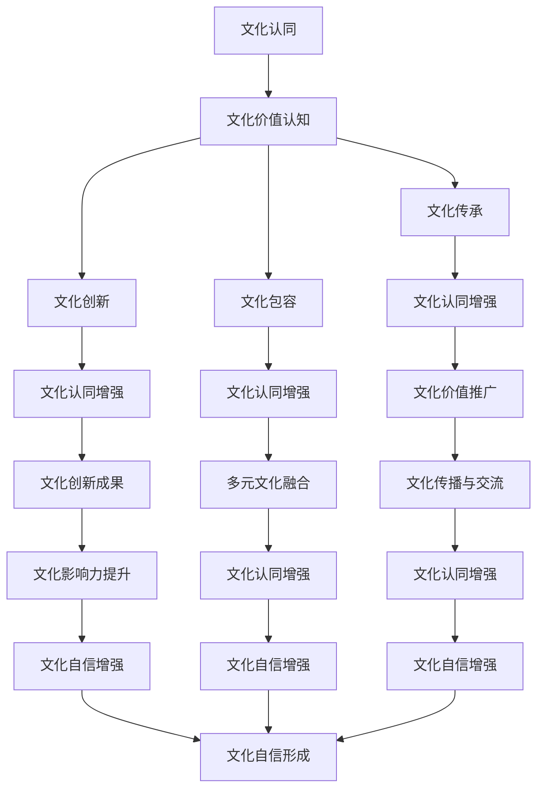
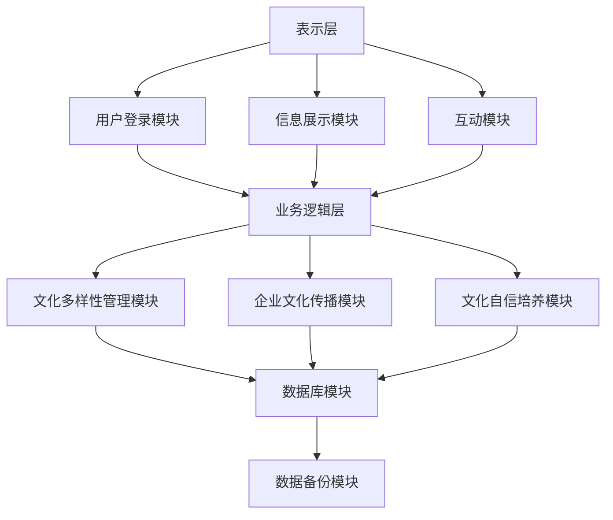

                 

### 1.1 全球化的背景与影响

全球化（Globalization）是20世纪后半叶以来全球范围内的经济、政治、文化和社会发展的主要趋势。它是一个复杂的多维度过程，涉及国家之间日益加深的经济、政治和文化联系。全球化的发展历程可以追溯到几个关键阶段：

1. **早期全球化（15-18世纪）**：这一阶段主要是由欧洲列强的殖民扩张和贸易活动引发的。新航路的开辟和欧洲资本主义的发展促进了国际贸易和资本流动，推动了全球化进程的初步发展。

2. **工业革命与第二次全球化（19世纪末至20世纪初）**：工业革命的出现极大地提高了生产效率，推动了工业化进程。同时，工业产品、资本和劳动力在全球范围内的流动加速，进一步加深了全球化。

3. **现代全球化（20世纪中后期至今）**：这一阶段的全球化受到信息技术、交通和通信技术的迅速发展以及跨国公司的兴起等因素的推动。全球化在这一时期表现出前所未有的广度和深度。

全球化的主要特征包括：

- **经济全球化**：国际贸易和投资的自由化、跨国公司的兴起、全球金融市场的一体化等，这些因素使得全球经济的互动和依赖程度日益加深。

- **政治全球化**：国际组织和跨国合作机制的建立，如联合国、世界贸易组织（WTO）和国际货币基金组织（IMF）等，促进了国际政治的协调和合作。

- **文化全球化**：随着信息传播手段的进步，不同文化之间的交流变得更加频繁和便捷。全球化使得文化多样性得以传播，同时也带来了文化同质化的风险。

- **社会全球化**：全球范围内的社会问题，如环境问题、贫富差距和移民问题等，逐渐成为各国共同面临的挑战，需要国际社会共同应对。

全球化对各国文化的影响是深远且复杂的。一方面，全球化促进了文化交流和融合，使得各国文化在相互借鉴和融合中不断发展。例如，跨国流行文化、全球性节日和国际旅游等都是全球化背景下文化融合的体现。另一方面，全球化也可能导致文化冲突和文化同质化。随着全球化的推进，一些本土文化面临被边缘化和忽视的风险，同时，文化同质化现象也引起了广泛关注。

在全球化语境下，文化自信成为各国应对文化挑战的重要武器。文化自信是指一个民族或国家在面对外部文化和内部变革时，能够坚定地维护和传承自己的文化传统，同时具备开放包容的心态，吸收和借鉴其他文化的优秀元素。对于中国而言，文化自信不仅是对自身优秀传统文化的继承和发扬，也是在全球文化竞争中保持独特性和创造力的必要条件。

在接下来的章节中，我们将进一步探讨文化自信的重要性、传统价值观在现代社会的传承与融合、以及文化自信的概念原理和属性特征，为读者提供一个全面理解全球化语境中文化自信的视角。

### 1.2 文化自信的重要性

文化自信是一个国家或民族在面对外部文化和内部变革时，对自己文化传统的坚定信念和积极态度。它不仅关乎个体的精神风貌，也深刻影响着国家的发展和民族的未来。以下是文化自信在个人发展、社会进步和国家发展中发挥的重要作用。

#### 个人发展

文化自信对个人发展的影响主要体现在以下几个方面：

1. **自我认同**：文化自信使个体能够在多元文化的环境中保持自我认同，不因外界的评价或压力而迷失自我。它帮助个体建立强烈的归属感和自豪感，从而增强自我价值感和自尊心。

2. **心理安全感**：在文化自信的支撑下，个体能够抵御文化冲击和异化，保持心理上的安全感。在面对外部压力和文化挑战时，文化自信能够为个体提供坚实的心理基础。

3. **创新动力**：文化自信激发个体对传统文化的热爱和挖掘，从而激发创新思维和创造力。在个人职业生涯中，这种创新动力有助于个体脱颖而出，实现职业发展和成就。

#### 社会进步

文化自信对社会进步的推动作用不可忽视：

1. **文化传承**：文化自信是文化传承的重要保障。一个社会只有对自己的文化传统充满信心，才能确保这些文化基因得以代代相传，不断发扬光大。

2. **社会凝聚力**：文化自信能够增强社会成员之间的认同感和凝聚力。在多元文化社会中，文化自信有助于化解文化冲突，促进社会和谐与稳定。

3. **文化创新**：文化自信鼓励文化创新，使得文化传统在现代社会中得到新的诠释和发展。这种创新不仅丰富了社会文化，也为社会发展注入了新的活力和动力。

#### 国家发展

文化自信在国家发展中具有战略意义：

1. **文化软实力**：在全球化的背景下，文化软实力成为国家综合实力的重要组成部分。文化自信能够提升国家的国际影响力和竞争力，为国家在国际舞台上赢得更多的话语权和影响力。

2. **文化安全**：文化自信有助于维护国家文化安全。面对外来文化冲击，文化自信能够保护本国文化的独特性和多样性，防止文化同质化。

3. **文化创新和创造**：文化自信激励民族创新和创造，推动文化产业的发展。文化产业是现代经济的重要组成部分，它不仅能够创造经济价值，还能够提升国家的文化软实力和国际形象。

总之，文化自信在个人发展、社会进步和国家发展中发挥着至关重要的作用。它不仅关乎个体的精神风貌，也深刻影响着国家的发展和民族的未来。在全球化的语境中，文化自信是一个国家或民族立于不败之地的重要基石。

### 1.3 传统价值观与现代社会的冲突与融合

在现代社会中，传统价值观与现代社会的冲突与融合是一个复杂且多维的问题。随着全球化的推进，各种文化之间的交流与碰撞日益频繁，传统价值观在现代社会中的传承与适应面临着前所未有的挑战。

#### 现代社会中传统价值观的传承与挑战

1. **文化变迁**：现代社会在不断变化，传统价值观往往与现代社会的生活方式、价值观念和道德标准存在差异。如何将传统价值观与现代生活方式相结合，是一个亟待解决的问题。

2. **教育缺失**：随着教育体系的改革和现代化，传统价值观在基础教育中的比重逐渐减少。许多年轻人对传统文化了解不足，缺乏传承传统价值观的意识和能力。

3. **社会压力**：现代社会竞争激烈，物质主义和功利主义价值观盛行。传统价值观强调的道德伦理、家庭观念和社会责任感在现代社会中常常受到忽视和挑战。

#### 传统价值观与现代社会的融合路径

1. **文化创新**：为了适应现代社会，传统价值观需要进行创新。通过现代科技和艺术手段，传统价值观可以以新的形式呈现，吸引年轻人的关注和参与。

2. **文化交流**：促进不同文化之间的交流与对话，有助于传统价值观与现代社会的融合。通过跨文化交流，传统价值观可以吸收其他文化的优秀元素，同时保持自身的独特性。

3. **家庭教育**：家庭是传承传统文化的重要场所。通过家庭教育，传统价值观可以潜移默化地传递给下一代。家庭教育的回归和重视对传统价值观的传承具有重要作用。

#### 文化自信在冲突与融合中的角色

1. **文化自信的维护**：在面对文化冲突时，文化自信能够帮助人们保持对自身文化的坚定信念和认同。只有具备文化自信，才能在多元文化社会中保持文化独立性和自主性。

2. **文化融合的推动**：文化自信不仅是保护自身文化的力量，也是促进文化融合的动力。文化自信鼓励人们开放包容，尊重和欣赏其他文化的价值，推动不同文化之间的交流与合作。

3. **文化创新**：文化自信激发创新思维，鼓励人们从传统价值观中挖掘新的内涵和价值，使其在现代社会中焕发新的生命力。

总之，传统价值观在现代社会中的传承与融合是一个长期而复杂的过程。文化自信在这一过程中发挥着至关重要的作用。只有通过文化自信，我们才能在保持传统价值观的同时，使其与现代社会的需求相契合，实现文化传承与创新的双赢。

### 1.4 本书的结构安排与研究方法

本书旨在探讨全球化语境中的文化自信，特别是传统价值观在现代社会中的表达与传承问题。为了实现这一目标，本书采用结构化和系统化的研究方法，确保内容的逻辑性和完整性。以下是本书的结构安排和具体章节内容：

#### 第1章：全球化语境中的文化自信概述

本章节将介绍全球化的背景与影响，探讨文化自信的重要性，分析传统价值观在现代社会中的冲突与融合。此外，还会概述本书的结构安排和研究方法，为后续章节奠定基础。

##### 内容概述：

- 全球化的背景与影响
- 文化自信的重要性
- 现代社会中传统价值观的冲突与融合
- 本书的研究方法

#### 第2章：传统价值观的概述

本章将详细阐述传统价值观的基本概念、主要类型及其起源与历史演变。通过分析传统价值观的内涵和特点，为后续章节中传统价值观的现代转型提供理论基础。

##### 内容概述：

- 传统价值观的基本概念
- 传统价值观的主要类型
- 传统价值观的起源与历史演变

#### 第3章：传统价值观的现代转型

本章将探讨传统价值观如何在现代社会中实现转型。通过分析现代社会对传统价值观的重新审视，提出传统价值观的现代转型路径和措施。

##### 内容概述：

- 现代社会对传统价值观的重新审视
- 传统价值观的现代转型路径
- 现代转型中的挑战与机遇

#### 第4章：文化自信：概念原理与属性特征对比

本章将深入探讨文化自信的概念原理，对比分析文化自信与其他相关概念的区别。通过构建文化自信的ER实体关系图，为读者提供直观理解。

##### 内容概述：

- 文化自信的概念原理
- 文化自信的属性特征对比
- 文化自信的ER实体关系图构建

#### 第5章：文化自信的算法原理讲解

本章将介绍文化自信的算法原理，包括算法的流程、数学模型和公式。通过Python源代码讲解和实例说明，使读者能够深入理解文化自信的算法实现。

##### 内容概述：

- 算法原理概述
- 算法原理的Mermaid流程图
- Python源代码讲解
- 算法原理的数学模型和公式
- 举例说明：算法应用与实际案例分析

#### 第6章：文化自信的系统分析与架构设计方案

本章将结合具体项目，介绍文化自信的系统分析与架构设计方案。包括问题场景介绍、项目介绍、系统功能设计、系统架构设计、系统接口设计和系统交互等。

##### 内容概述：

- 问题场景介绍
- 项目介绍
- 系统功能设计
- 系统架构设计
- 系统接口设计
- 系统交互

#### 第7章：项目实战与最佳实践

本章将结合具体项目实战，介绍文化自信系统的实际应用和最佳实践。通过环境安装、系统核心实现源代码、代码应用解读与分析、实际案例分析和详细讲解剖析，帮助读者理解和应用文化自信的概念。

##### 内容概述：

- 环境安装
- 系统核心实现源代码
- 代码应用解读与分析
- 实际案例分析与详细讲解剖析
- 项目小结
- 最佳实践 tips
- 小结与注意事项
- 拓展阅读

通过以上章节的详细安排，本书将系统性地探讨全球化语境中的文化自信，为读者提供全面、深入的理解和实际操作指导。

### 1.5 文化自信：概念结构与核心要素组成

文化自信是一个复杂而多维度的概念，它不仅关乎一个民族或国家的文化认同，还涉及文化传承、创新和发展。在全球化背景下，文化自信成为各国应对文化挑战、保持文化独立性和自主性的关键因素。要深入理解文化自信，我们需要首先明确其概念结构，并分析其核心要素。

#### 概念框架

文化自信的概念框架可以分解为以下几个层次：

1. **文化认同**：这是文化自信的基础层次，指的是个体或集体对自身文化的认同和归属感。文化认同是文化自信的情感基础，决定了个体或集体在面对外部文化冲击时的态度和行为。

2. **文化传承**：文化自信不仅在于对文化的认同，更在于对文化的传承。文化传承是指将传统文化从一代传递到下一代，确保文化基因得以延续和发扬。在全球化背景下，文化传承面临着新的挑战，如何将传统文化与现代生活方式相结合，是一个重要的课题。

3. **文化创新**：文化自信还体现在对文化创新的支持和推动上。文化创新是对传统文化进行现代诠释和发展的过程，它有助于文化在新时代焕发新的生命力。文化自信鼓励人们从传统文化中汲取灵感，进行创新，以适应不断变化的社会环境。

4. **文化影响力**：文化自信最终体现在文化的影响力上。一个具有文化自信的国家或民族，能够在国际舞台上展示自己的文化魅力，增强自身的文化软实力。文化影响力不仅有助于提升国家的国际地位，还能促进文化交流与合作。

#### 核心要素

文化自信的核心要素可以分为以下几个方面：

1. **文化底蕴**：文化底蕴是指一个民族或国家在长期历史发展过程中形成的独特文化特质。这些文化特质包括价值观念、道德规范、习俗传统等，是文化自信的重要支撑。

2. **文化创新能力**：文化创新能力是指一个民族或国家在文化领域进行创新和发展的能力。文化创新能力越强，文化自信的水平也越高。它体现在文化创作、传播和推广等方面，是文化自信的重要体现。

3. **文化传承意识**：文化传承意识是指个体或集体对文化传承重要性的认识。文化传承意识强的人或集体更愿意投入时间和精力去传承和弘扬传统文化，从而增强文化自信。

4. **文化适应能力**：文化适应能力是指一个民族或国家在面对外部文化冲击时的适应和应对能力。在全球化背景下，文化适应能力越强，文化自信的水平也越高。它体现在对多元文化的包容、理解和融合上。

5. **文化自信表达**：文化自信表达是指个体或集体通过语言、行为和艺术等方式展示自己的文化自信。文化自信表达的形式多种多样，可以是传统文化的展示、民族文化的宣传，也可以是跨文化的交流与合作。

#### 文化自信的层次结构

文化自信的层次结构可以分为个体层面、社会层面和国家层面：

1. **个体层面**：个体层面的文化自信主要是指个体对自身文化的认同和自信。个体层面的文化自信是整个社会文化自信的基础，它影响着个体的价值观、行为模式和生活方式。

2. **社会层面**：社会层面的文化自信是指一个社会整体对自身文化的认同和自信。社会层面的文化自信体现在社会文化氛围、教育体系和文化产业发展等方面。一个具有高度社会文化自信的社会，能够在全球化的背景下保持文化独立性和自主性。

3. **国家层面**：国家层面的文化自信是指一个国家对自身文化的认同和自信。国家层面的文化自信是国家软实力的重要组成部分，它关系到国家的国际地位和影响力。国家层面的文化自信不仅体现在文化产业的繁荣上，还体现在国家文化政策的制定和实施上。

通过上述分析，我们可以看出，文化自信是一个多层次、多维度的概念，它不仅关乎个体和文化，也关系到社会和国家的发展。在全球化的背景下，提升文化自信，维护文化传统，促进文化创新，是每个国家和民族面临的重要任务。

### 1.6 本书的研究目的与意义

本书的研究目的在于深入探讨全球化语境中的文化自信，特别是传统价值观在现代社会的表达与传承问题。具体目标包括：

1. **系统梳理传统价值观**：通过对传统价值观的基本概念、历史演变和主要类型的详细分析，为后续章节提供理论基础。

2. **探讨现代转型路径**：研究传统价值观如何在现代社会中实现转型，分析现代社会对传统价值观的重新审视，并提出相应的转型策略。

3. **构建文化自信理论框架**：探讨文化自信的概念原理，对比分析文化自信与其他相关概念，构建一个科学、系统的文化自信理论框架。

4. **分析文化自信的算法原理**：介绍文化自信的算法原理，包括算法的流程、数学模型和公式，并通过Python源代码和实际案例分析，使读者能够理解和应用这些算法。

5. **设计文化自信系统架构**：结合具体项目，介绍文化自信的系统分析与架构设计方案，包括系统功能设计、架构设计和接口设计等。

6. **提供实践指南**：通过项目实战和最佳实践，帮助读者理解文化自信的实际应用，并提供具体的操作指南和注意事项。

本书的研究意义主要体现在以下几个方面：

1. **文化传承与创新的指导意义**：本书的研究有助于理解传统价值观在现代社会的传承与创新路径，为文化传承和创新提供理论支持和实践指导。

2. **文化自信提升的参考价值**：通过分析文化自信的概念结构和核心要素，本书为提升个体、社会和国家层面的文化自信提供了有益的参考。

3. **全球化背景下的文化策略**：在全球化的背景下，本书的研究有助于各国在文化交流与融合中保持文化独立性和自主性，制定有效的文化策略。

4. **学术研究的推动作用**：本书的研究不仅有助于丰富文化自信领域的理论研究，也为相关领域的学术研究提供了新的视角和方法。

总之，本书的研究旨在为全球化语境中的文化自信提供系统、全面的理论和实践指导，促进文化传承与创新，提升文化自信，为各国在全球文化竞争中的发展提供支持。

## 第2章：传统价值观的概述

在探讨全球化语境中的文化自信之前，我们需要对传统价值观进行系统的概述。传统价值观是一个民族或文化在长期历史发展过程中形成的核心价值观念和行为准则，它包含了丰富的文化内涵和历史积淀。在本章中，我们将详细阐述传统价值观的基本概念、主要类型及其起源与历史演变。

### 2.1 传统价值观的基本概念

传统价值观（Traditional Values）是指一个社会或文化在长期发展过程中形成的，代代相传的核心价值和行为准则。这些价值观通常反映了人们对生活、工作、道德、社会关系等方面的基本认识和信仰。传统价值观具有以下几个基本特征：

1. **历史传承性**：传统价值观是一个民族文化历史的积淀，它通过世代传承得以保留和发扬。

2. **普遍性**：传统价值观往往具有普遍适用的价值，无论是在古代还是现代社会，这些价值观都在一定程度上影响着人们的行为和思想。

3. **相对稳定性**：尽管社会在不断发展变化，但传统价值观的核心部分通常保持相对稳定，不易被迅速改变。

4. **文化独特性**：不同民族和文化有不同的传统价值观，这些价值观反映了各自文化的独特性和历史背景。

### 2.2 传统价值观的主要类型

传统价值观可以按照不同的分类标准进行分类，以下列举几种常见的类型：

1. **伦理道德价值观**：伦理道德价值观是传统价值观的重要组成部分，它包括孝道、诚信、礼仪、正义等。这些价值观在维护社会秩序、调节人际关系方面发挥着重要作用。

2. **家庭价值观**：家庭价值观强调家庭在个体成长和社会发展中的核心地位，包括尊老爱幼、家庭和谐、责任感等。

3. **政治价值观**：政治价值观涉及对政治制度、国家治理和社会秩序的看法，例如民主、法治、公正等。

4. **宗教价值观**：宗教价值观是许多文化传统的重要组成部分，包括对神灵的崇拜、宗教仪式、教义等。

5. **经济价值观**：经济价值观涉及对劳动、财富、消费等方面的看法，如勤劳致富、节俭持家、公平竞争等。

### 2.3 传统价值观的起源与历史演变

传统价值观的起源可以追溯到人类文明的早期阶段。在不同的历史时期，传统价值观经历了多次演变和发展，反映了社会的变迁和文化的积累。

1. **古代起源**：在古代，传统价值观主要源于宗教、神话和早期的社会制度。例如，古代希腊和罗马的伦理道德观念、古代中国的儒家思想、佛教教义等，都是当时社会的主流价值观。

2. **中世纪的发展**：中世纪时期，传统价值观进一步巩固和演变。宗教价值观在这一时期占据主导地位，基督教和伊斯兰教的教义成为许多社会行为和道德准则的基础。

3. **近现代的演变**：近现代时期，随着工业革命和现代化进程的推进，传统价值观面临新的挑战和机遇。在许多国家和地区，传统价值观逐渐与现代科学、民主和法治观念相结合，形成了新的文化形态。

4. **当代的发展**：在当代社会，传统价值观继续在现代社会中发挥作用。然而，全球化、信息技术和多元文化的交融使得传统价值观面临新的挑战。如何在现代社会中传承和发扬传统价值观，是一个亟待解决的问题。

### 2.4 传统价值观的基本内涵与特点

传统价值观的基本内涵包括对生活的理解、对道德的规范、对社会关系的看法等。以下是对传统价值观基本内涵与特点的详细探讨：

1. **对生活的理解**：传统价值观往往强调生活的本质和目的。例如，儒家思想强调“天人合一”的哲学观念，认为人的行为应当与自然和社会和谐相处，追求道德的完善和心灵的宁静。

2. **对道德的规范**：传统价值观对道德行为有着明确的规范，例如，强调“仁爱”、“忠诚”、“诚信”等道德品质。这些道德规范在维护社会秩序和人际关系方面发挥着重要作用。

3. **对社会关系的看法**：传统价值观强调社会关系的和谐与平衡，例如，强调家庭关系中的“孝道”、社会关系中的“礼治”等。这些价值观有助于维护社会稳定和人际和谐。

4. **宗教与哲学的影响**：许多传统价值观深受宗教和哲学思想的影响。例如，佛教教义中的“慈悲”、“因果报应”等观念深刻影响了东亚文化中的道德观念。

5. **稳定性与适应性**：传统价值观既具有稳定性，也具有一定的适应性。在现代社会中，传统价值观需要通过创新和转型，适应新的社会环境和时代需求。

总之，传统价值观是一个民族或文化的重要精神支柱，它不仅反映了历史和文化的积淀，也影响着现代社会的价值观和行为模式。在全球化语境中，理解和传承传统价值观，对于保持文化自信和促进文化创新具有重要意义。

### 2.5 传统价值观的现代转型

随着全球化和现代化的深入发展，传统价值观面临着前所未有的挑战和机遇。现代社会的快速变化，尤其是信息技术和全球化进程的推进，使得传统价值观在传承与表达方面出现了许多新的问题。为了使传统价值观在现代社会中继续发挥作用，我们需要探讨传统价值观的现代转型路径，并分析其中的挑战与机遇。

#### 现代社会对传统价值观的重新审视

现代社会对传统价值观的重新审视主要体现在以下几个方面：

1. **全球化背景下的文化碰撞**：全球化带来了不同文化之间的广泛交流和碰撞，使得传统价值观面临新的考验。如何在保持传统价值观核心要素的同时，适应多元文化环境，是一个亟待解决的问题。

2. **现代生活方式的改变**：现代社会的生活方式与过去相比发生了巨大变化，例如，城市化进程的加快、生活方式的多样化和生活节奏的加快等，都对传统价值观的传承和表达产生了影响。

3. **价值观念的多元化**：现代社会强调个人主义和多元化，传统价值观的一些观念，如集体主义、等级观念等，与现代社会强调的平等、自由和个体价值存在一定的冲突。

#### 传统价值观的现代转型路径

为了使传统价值观在现代社会中得以传承和发扬，我们需要探索以下几种现代转型路径：

1. **文化创新**：文化创新是传统价值观现代转型的重要途径。通过现代科技和艺术手段，传统价值观可以以新的形式呈现，吸引年轻人的关注和参与。例如，通过数字媒体和虚拟现实技术，传统节庆和仪式可以被重新设计和展示，使其更具吸引力和互动性。

2. **文化融合**：在全球化背景下，文化融合成为一种必然趋势。传统价值观可以在与其他文化的融合中，吸收其他文化的优秀元素，实现自身的发展。例如，儒家思想中的“仁爱”理念可以与西方的“人权”观念相结合，形成新的社会伦理观念。

3. **教育传承**：教育是传承传统价值观的重要手段。通过学校教育、家庭教育和社会教育等多种形式，将传统价值观融入现代教育体系中，使年轻一代能够在日常生活中践行这些价值观。例如，可以通过开设传统文化课程、组织文化实践活动等方式，加强学生对传统文化的认同和了解。

4. **政策引导**：政府可以通过政策引导，推动传统价值观的传承与创新。例如，制定相关法律法规，保护传统文化遗产；通过公共宣传和活动，提高公众对传统文化的认知和重视。

#### 现代转型中的挑战与机遇

1. **挑战**：

   - **文化同质化**：全球化带来的文化同质化趋势可能削弱传统文化的独特性和多样性，使得传统价值观在现代社会中面临被边缘化的风险。

   - **社会变迁**：现代社会变迁速度加快，传统价值观的一些观念可能难以适应新的社会环境和生活方式。

   - **教育问题**：教育体系中对传统文化的重视程度可能不足，导致年轻一代对传统文化的认知和了解不足。

2. **机遇**：

   - **文化多样性**：全球化带来了文化的多样性，为传统价值观的传承和创新提供了新的资源和机遇。

   - **技术创新**：现代科技的进步为传统价值观的传承和表达提供了新的手段和平台，例如数字技术、虚拟现实等。

   - **社会需求**：现代社会对传统文化和价值观的需求日益增长，为传统价值观的传承和创新提供了广阔的市场和空间。

总之，传统价值观的现代转型是一个复杂而长期的过程。通过文化创新、文化融合、教育传承和政策引导等路径，我们可以使传统价值观在现代社会中焕发新的生命力，为文化自信和民族复兴提供坚实的文化基础。

### 2.6 现代社会中传统价值观的传承与弘扬

在现代社会中，传统价值观的传承与弘扬是一个至关重要的任务，它不仅关系到文化自信的提升，还关系到社会和谐与民族复兴。随着全球化进程的加快和现代生活方式的转变，传统价值观面临诸多挑战。因此，探讨如何在现代社会中传承和弘扬传统价值观，具有重要的现实意义。

#### 现代社会中传统价值观的传承现状

1. **家庭教育**：家庭是传统价值观传承的重要场所。然而，随着社会变迁，家庭结构的变化和现代生活方式的多样化，家庭教育中传统价值观的传递受到了影响。许多家庭更注重物质条件的改善，而对传统文化教育的重视程度有所下降。

2. **学校教育**：学校教育在传统价值观的传承中扮演着重要角色。然而，受应试教育的影响，学校教育中传统价值观的教育内容相对较少，传统价值观的传承效果有限。

3. **社会文化实践**：社会文化实践是传承和弘扬传统价值观的重要途径。然而，由于现代社会节奏快、压力大，许多人忽视了对传统文化的参与和体验，导致传统价值观的传承受到限制。

#### 弘扬传统价值观的措施与策略

1. **家庭教育的加强**：家庭是传承传统价值观的根基。父母应当通过日常生活中的言行，以身作则，传承和弘扬传统价值观。同时，可以通过家庭文化活动，如节日庆祝、传统节日习俗的传承等，增强家庭成员对传统文化的认同感。

2. **学校教育的完善**：学校应将传统价值观的教育纳入课程体系，通过多样化的教学方法和实践活动，使学生在学习知识的同时，感受到传统文化的魅力。例如，可以通过开设传统文化课程、组织文化讲座和实践活动，让学生深入了解和体验传统文化。

3. **社会文化实践的推广**：社会文化实践是传承和弘扬传统价值观的重要途径。政府和文化机构可以通过举办各种文化活动和节庆，推广和弘扬传统文化。例如，通过组织传统文化节、民俗展览、传统技艺比赛等活动，激发公众对传统文化的兴趣和参与。

4. **媒体传播的强化**：现代媒体在传播传统文化中发挥着重要作用。通过电视、电影、网络等渠道，可以广泛传播传统文化知识和故事，提高公众对传统文化的认知和了解。同时，可以通过数字化手段，将传统文化资源进行整合和传播，使传统文化更易于传播和传承。

5. **政策引导和支持**：政府可以通过制定相关政策，支持传统文化的发展与传承。例如，设立专项基金，支持传统文化保护和传承项目；制定相关法律法规，保护传统文化遗产；加强文化设施建设，为传统文化传承提供良好的物质基础。

#### 社会实践中的传统价值观

1. **传统节日的庆祝**：传统节日是传承和弘扬传统价值观的重要载体。通过庆祝传统节日，如春节、端午节、中秋节等，可以增强人们对传统文化的认同感和归属感。

2. **民俗文化的传承**：民俗文化是传统文化的重要组成部分。通过举办民俗文化活动，如民间艺术展览、传统手工艺制作比赛等，可以弘扬和传承民间文化。

3. **传统文化保护区的建设**：传统文化保护区可以集中展示和保护传统文化，为公众提供体验和了解传统文化的平台。通过建设传统文化保护区，可以保护传统文化遗产，促进传统文化传承和发展。

总之，在现代社会中传承和弘扬传统价值观，需要家庭、学校、社会和政府的共同努力。通过多样化的措施和策略，我们可以使传统价值观在现代社会中焕发新的生命力，为文化自信和民族复兴提供坚实的文化基础。

### 2.7 传统价值观的多元化表达

在全球化背景下，传统文化的表达形式日益多元化。这种多元化不仅体现在文化内容的多样性上，也体现在传播方式和技术手段的创新上。通过多元化和创新的表达方式，传统价值观能够在现代社会中得到更广泛的传播和认同。

#### 多元化表达的形式

1. **现代文艺形式**：传统价值观通过现代文艺形式，如电影、电视剧、音乐、舞蹈、戏剧等，得到了生动而形象的呈现。例如，一些以传统文化为背景的现代电影和电视剧，不仅展示了传统文化，还通过现代视角对其进行解读和诠释。

2. **数字化传播**：随着互联网和数字技术的发展，传统文化可以通过数字媒体进行广泛传播。例如，通过社交媒体平台、在线视频平台和电子书籍等，传统文化资源可以被快速传播和分享。

3. **跨文化交流**：全球化使得跨文化交流成为可能。通过与其他国家和地区的文化交流，传统价值观可以在不同文化背景下得到新的诠释和传播。例如，通过国际文化节、艺术展览和学术交流，传统文化可以跨越国界，吸引更多关注和认同。

#### 表达创新的手段

1. **多媒体融合**：现代科技为传统文化表达提供了新的手段。例如，通过虚拟现实（VR）和增强现实（AR）技术，传统文化可以以更加生动和互动的方式呈现。观众可以身临其境地体验传统文化，增强对传统文化的理解和认同。

2. **文化产品创新**：传统文化可以通过文化产品创新，如文化创意产品、传统文化体验项目等，吸引更多年轻人的关注。例如，将传统文化元素融入时尚设计、旅游体验和创意市集等，使传统文化焕发新的生机。

3. **艺术表演创新**：传统艺术表演形式可以通过创新得到新的发展。例如，将传统舞蹈、戏曲与现代音乐、视觉艺术相结合，创造出新的艺术形式，吸引更多观众。

#### 多元化表达的优势

1. **文化传播的广泛性**：多元化表达形式使得传统文化能够通过多种渠道和平台进行传播，覆盖更广泛的受众。这不仅有助于传统文化的传播和推广，也有助于增强文化自信。

2. **文化理解的深度**：通过多元化和创新的表达方式，传统文化可以以更加生动和具体的形式呈现，使观众能够更深入地理解和体验传统文化的内涵。

3. **文化认同的增强**：多元化表达有助于激发人们对传统文化的认同感和自豪感。当传统文化以现代形式呈现时，人们更容易感受到传统文化的魅力和独特性，从而增强文化认同。

总之，多元化表达是传统价值观在现代社会中传承与发展的关键。通过多样化的表达形式和创新手段，我们可以使传统文化在现代社会中得到更广泛的传播和认同，为文化自信和民族复兴提供坚实的文化基础。

### 2.8 传统价值观的现代表达：挑战与机遇

在全球化背景下，传统价值观的现代表达面临着一系列挑战与机遇。如何在现代社会中传承和发扬传统价值观，需要我们深入探讨和思考。

#### 挑战

1. **文化同质化**：全球化进程带来了文化的同质化趋势，许多本土文化在全球化浪潮中被边缘化。如何在保持文化多样性的同时，传承和弘扬传统价值观，是一个重要挑战。

2. **现代化冲击**：现代社会强调效率和实用主义，传统价值观中的某些方面，如家庭观念、道德规范等，与现代生活方式存在冲突。如何平衡传统与现代，实现价值观的适应性转变，是现代表达中的一大难题。

3. **教育缺失**：随着教育体系的改革和现代化，传统价值观在基础教育中的比重逐渐减少。年轻一代对传统文化的了解和认同度较低，这对传统价值观的现代表达构成了挑战。

4. **技术变革**：现代科技的发展改变了人们的交流方式和生活方式，传统价值观的传达方式也受到挑战。如何在新的技术环境中，找到适合传统价值观表达的途径，是一个重要课题。

#### 机遇

1. **文化交流与融合**：全球化带来了不同文化之间的广泛交流和融合。这为传统价值观的现代表达提供了新的机遇。通过跨文化交流，传统价值观可以在不同文化背景下得到新的诠释和发展。

2. **数字媒体的发展**：数字媒体为传统价值观的现代表达提供了新的平台和手段。通过社交媒体、短视频平台和在线教育等，传统价值观可以以更加生动和互动的方式呈现，吸引更多年轻人关注。

3. **社会需求**：现代社会对传统文化和价值观的需求日益增长。人们对传统文化的认同感和自豪感不断增强，这为传统价值观的现代表达提供了广阔的市场和空间。

4. **政策支持**：政府在传统文化保护和传承方面的政策支持，为传统价值观的现代表达提供了有力保障。例如，设立专项基金、制定相关法律法规、加强文化设施建设等，都有助于传统价值观的传承和创新。

#### 应对策略

1. **文化创新**：通过文化创新，使传统价值观以新的形式呈现。例如，将传统文化元素融入现代艺术、时尚设计和文化创意产品中，使其更具吸引力和现代感。

2. **教育传承**：加强传统文化教育，将传统价值观融入现代教育体系中。通过开设传统文化课程、组织文化实践活动，提高学生对传统文化的认同和了解。

3. **媒体传播**：利用现代媒体，如互联网、电视、电影等，广泛传播传统文化知识。通过制作优质的文化传播内容，提高公众对传统文化的认知和认同。

4. **政策引导**：政府可以通过政策引导，支持传统文化的发展与传承。例如，设立专项基金、制定相关法律法规、提供资金和资源支持等，为传统价值观的现代表达提供良好的环境和条件。

总之，在全球化背景下，传统价值观的现代表达面临着挑战与机遇并存。通过文化创新、教育传承、媒体传播和政策引导等策略，我们可以使传统价值观在现代社会中焕发新的生命力，为文化自信和民族复兴提供坚实的文化基础。

### 3.1 文化自信的概念原理

文化自信是一个复合概念，它不仅涵盖了文化认同、文化传承和文化创新，还涉及对自身文化价值的坚定信念和积极态度。理解文化自信的概念原理，有助于我们更好地应对全球化背景下的文化挑战，推动文化传承与创新。

#### 文化自信的定义

文化自信是指一个民族或国家在面对外部文化和内部变革时，能够坚定地维护和传承自己的文化传统，同时具备开放包容的心态，吸收和借鉴其他文化的优秀元素。它不仅是对自身文化价值的认同，也是对文化创新和发展的信心。

#### 文化自信的核心要素

1. **文化认同**：文化认同是文化自信的基础。一个民族或个体只有深刻认同自己的文化，才能在多元文化的环境中保持自我定位，不因外界的评价或压力而迷失自我。

2. **文化传承**：文化传承是文化自信的重要体现。文化自信不仅要求对自身文化的认同，更要求将这种文化基因代代相传，确保文化传统在历史长河中得以延续和发扬。

3. **文化创新**：文化创新是文化自信的重要推动力。在全球化背景下，文化自信需要通过创新，使传统文化在现代社会中得到新的诠释和发展，以适应时代需求。

4. **文化包容**：文化包容是文化自信的重要特征。一个具有文化自信的民族或国家，能够在尊重自身文化的同时，包容和欣赏其他文化的价值，推动不同文化之间的交流与融合。

#### 文化自信的表现形式

1. **文化表达**：文化自信通过文化表达得以体现。一个民族或国家通过文化创作、传播和展示，表达对自己文化的自信和自豪。

2. **文化实践**：文化自信体现在日常生活中的文化实践。个人和群体通过参与各种文化活动和习俗，展示对自己文化的热爱和认同。

3. **文化政策**：文化自信通过国家的文化政策得以保障和推动。政府通过制定和实施相关政策，支持文化传承和创新，提升文化软实力。

#### 文化自信的重要性

1. **文化安全**：文化自信有助于维护国家文化安全。在全球化的背景下，文化自信能够抵御外来文化的冲击，保护本国文化的独特性和多样性。

2. **文化软实力**：文化自信是提升国家文化软实力的重要手段。一个具有文化自信的国家，能够在国际舞台上展示自己的文化魅力，增强国际影响力和竞争力。

3. **社会凝聚力**：文化自信能够增强社会成员之间的认同感和凝聚力。在多元文化社会中，文化自信有助于化解文化冲突，促进社会和谐与稳定。

4. **文化创新**：文化自信激励文化创新，推动文化的发展。文化自信鼓励人们从传统文化中汲取灵感，进行创新，以适应时代变化。

总之，文化自信是一个多层次、多维度的概念，它不仅关乎个体和民族的精神风貌，也深刻影响着国家的发展和社会的进步。在全球化的背景下，文化自信是一个国家或民族立于不败之地的重要基石。

### 3.2 文化自信的属性特征对比

在深入探讨文化自信的属性特征时，我们可以将文化自信与其他相关概念进行比较，以便更清晰地理解文化自信的独特性。以下是对文化自信与其他相关概念的属性特征进行的对比分析。

#### 文化自信与文化认同

1. **定义**：
   - **文化认同**：文化认同是指个体或集体对自己所属文化的认同和归属感，是对文化属性的心理认可。
   - **文化自信**：文化自信是指在对自身文化有深刻认同的基础上，对自身文化价值有坚定的信念，并能够积极面对文化挑战。

2. **特征对比**：
   - **文化认同**侧重于情感和心理层面，是对文化属性的认同和归属。
   - **文化自信**则更强调信念和行为层面，不仅认同自身文化，还对其有坚定的信念和积极的态度。

3. **关系**：文化认同是文化自信的基础，文化自信是文化认同的深化和表现。

#### 文化自信与文化传承

1. **定义**：
   - **文化传承**：文化传承是指将一个文化群体的文化遗产、价值观和传统习俗传递给下一代的过程。
   - **文化自信**：文化自信是指在面对文化变迁时，能够坚守自身文化传统，并对文化的延续和发展保持信心。

2. **特征对比**：
   - **文化传承**侧重于历史和过程，强调文化的传递和延续。
   - **文化自信**则更强调心态和信念，是对文化传承的信心和决心。

3. **关系**：文化自信是文化传承的动力和保障，文化传承是文化自信的体现。

#### 文化自信与文化创新

1. **定义**：
   - **文化创新**：文化创新是指将传统文化与现代元素相结合，创造出新的文化形态和表达方式。
   - **文化自信**：文化自信是指在面对文化创新时，能够自信地借鉴和吸收其他文化的优秀元素，推动自身文化的创新发展。

2. **特征对比**：
   - **文化创新**侧重于实践和创造，强调文化的更新和发展。
   - **文化自信**则更强调心态和信念，是对文化创新的支持和鼓励。

3. **关系**：文化自信是文化创新的前提和动力，文化创新是文化自信的表现和成果。

#### 文化自信与文化包容

1. **定义**：
   - **文化包容**：文化包容是指尊重和接纳不同的文化，对多元文化持开放态度。
   - **文化自信**：文化自信是指在对自身文化有坚定信念的同时，能够包容和欣赏其他文化的价值。

2. **特征对比**：
   - **文化包容**侧重于多元文化的共存和尊重，强调对不同文化的接纳和尊重。
   - **文化自信**则更强调自我文化价值和信念，是对自身文化的自信和自豪。

3. **关系**：文化自信是文化包容的基础，文化包容是文化自信的外在表现。

#### 文化自信与文化竞争力

1. **定义**：
   - **文化竞争力**：文化竞争力是指一个文化群体在国际文化交流中，通过文化创新、传播和影响力，提升自身文化地位和影响力的能力。
   - **文化自信**：文化自信是指一个文化群体在面对国际文化交流时，能够自信地展示和传播自身文化，并具备应对文化挑战的信心和决心。

2. **特征对比**：
   - **文化竞争力**侧重于文化在国际舞台上的表现和影响力。
   - **文化自信**则更强调文化内部的信念和心态，是对文化竞争力的内在支撑。

3. **关系**：文化自信是文化竞争力的重要基础，文化竞争力是文化自信的外在表现。

通过上述对比分析，我们可以更清晰地理解文化自信与其他相关概念的区别和联系，从而更好地把握文化自信的核心特征和作用。

### 3.3 文化自信与其他相关概念的区分

在探讨文化自信这一概念时，有必要将其与其他相关概念进行区分，以明确文化自信的独特性和适用范围。以下是文化自信与一些常见相关概念的比较与区分：

#### 文化自信与民族自豪感

1. **定义**：
   - **民族自豪感**：民族自豪感是指一个民族或个体对其民族历史、成就和文化感到自豪和自尊的情感体验。
   - **文化自信**：文化自信是指一个民族或个体在对自身文化有深刻认同的基础上，对文化价值有坚定信念，并能够在文化发展中保持积极态度和创新能力。

2. **区别**：
   - **民族自豪感**侧重于情感层面，是对民族历史和文化的热爱与尊敬。
   - **文化自信**则更侧重于理性层面，是对文化价值的认知、信念和行动。

3. **联系**：文化自信是民族自豪感在理性层面的体现，民族自豪感可以为文化自信提供情感支撑。

#### 文化自信与民族文化

1. **定义**：
   - **民族文化**：民族文化是指一个民族在长期历史发展过程中形成的独特的文化现象，包括价值观念、艺术、宗教、风俗习惯等。
   - **文化自信**：文化自信是指对自身民族文化的认同、传承和创新能力。

2. **区别**：
   - **民族文化**是一个静态的概念，强调民族文化的独特性和传承。
   - **文化自信**是一个动态的概念，强调对民族文化的信念、创新和传播。

3. **联系**：文化自信是民族文化在现代社会中的活力和动力，民族文化是文化自信的基础。

#### 文化自信与文化认同

1. **定义**：
   - **文化认同**：文化认同是指个体或集体对其所属文化的认可和归属感。
   - **文化自信**：文化自信是在文化认同基础上，对自身文化价值的坚定信念和积极态度。

2. **区别**：
   - **文化认同**是对文化属性的心理认可和归属。
   - **文化自信**则是对文化价值的认同、信念和行动的支撑。

3. **联系**：文化认同是文化自信的基础，文化自信是文化认同的发展和深化。

#### 文化自信与文化多样性

1. **定义**：
   - **文化多样性**：文化多样性是指不同文化在交流、互动中相互影响、共存和发展的现象。
   - **文化自信**：文化自信是在尊重文化多样性的基础上，对自身文化的价值和独特性的坚定信念。

2. **区别**：
   - **文化多样性**强调不同文化之间的差异和共存。
   - **文化自信**则强调对自身文化的价值和独特性的认可。

3. **联系**：文化自信和文化多样性相辅相成，文化自信有助于促进文化多样性的理解和尊重。

#### 文化自信与文化包容

1. **定义**：
   - **文化包容**：文化包容是指在社会交往中，尊重和理解不同文化，接纳和融合多元文化的态度和行动。
   - **文化自信**：文化自信是指在对自身文化有深刻认同和坚定信念的基础上，能够包容和欣赏其他文化的价值。

2. **区别**：
   - **文化包容**强调对其他文化的接纳和尊重。
   - **文化自信**则强调对自身文化的信念和坚守。

3. **联系**：文化自信是文化包容的前提和基础，文化包容是文化自信的表现和体现。

通过上述区分，我们可以更准确地把握文化自信的内涵和特征，从而在实际应用中更好地发挥文化自信的作用。

### 3.4 文化自信的理论框架

为了深入理解文化自信，我们需要构建一个科学、系统的理论框架。这个框架不仅涵盖文化自信的核心概念，还涉及相关的理论模型和概念关系，以帮助我们全面分析和应对文化自信在不同领域中的应用。

#### 文化自信的核心概念

1. **文化认同**：文化认同是文化自信的基础，它指的是个体或群体对所属文化的认知、情感和归属感。文化认同不仅是文化自信的情感基础，也是文化自信产生的前提。

2. **文化价值**：文化价值是文化自信的核心，它包括历史传承下来的道德规范、价值观念、文化传统等。文化价值决定了一个文化自信的深度和广度，是文化自信的重要支撑。

3. **文化创新**：文化创新是文化自信的推动力，它指的是在保持文化传统的基础上，通过创造性的思维和实践，将传统文化与现代元素相结合，形成新的文化形态。文化创新不仅能够增强文化自信，还能提升文化的活力和影响力。

4. **文化包容**：文化包容是文化自信的重要特征，它强调尊重和理解不同文化的差异，接纳和融合多元文化。文化包容能够促进文化的多样性和交流，增强文化自信的包容性和适应性。

#### 文化自信的理论模型

1. **文化认同模型**：文化认同模型强调文化认同在文化自信中的基础性作用。该模型认为，文化认同是通过文化教育、社会互动和文化体验等方式形成的，是文化自信的内在动力。

2. **文化价值模型**：文化价值模型认为，文化价值是文化自信的核心要素，它决定了文化自信的深度和广度。文化价值可以通过文化传承、文化发展和文化创新等方式得到体现和强化。

3. **文化创新模型**：文化创新模型强调文化创新在文化自信中的关键作用。该模型认为，文化创新是文化自信的重要表现形式，它通过将传统文化与现代元素相结合，为文化自信注入新的活力。

4. **文化包容模型**：文化包容模型认为，文化包容是文化自信的重要特征。该模型强调在尊重文化多样性的基础上，通过包容和融合多元文化，增强文化自信的适应性和包容性。

#### 概念关系与理论框架

文化自信的理论框架可以通过以下方式构建：

1. **基础层**：文化认同是基础层，它决定了文化自信的起点。在这个基础上，文化价值和文化创新相互作用，形成文化自信的核心。

2. **中间层**：文化创新和文化包容是中间层，它们通过促进文化的多样性和包容性，增强文化自信的活力和适应性。

3. **应用层**：文化自信的应用层包括文化自信在个人、社会和国家层面的具体体现，如文化认同感的提升、文化价值的弘扬、文化创新的应用和文化包容的实现。

通过上述理论框架，我们可以更全面地理解文化自信的内涵和作用，从而为实际应用提供科学的理论基础。

### 3.5 文化自信与相关理论的联系与区别

在探讨文化自信这一概念时，我们需要将其与其他相关理论进行联系和比较，以便更深入地理解文化自信的内涵和应用。以下是文化自信与相关理论的联系与区别：

#### 文化自信与认同理论

1. **联系**：
   - **认同理论**：认同理论强调个体或集体对自己身份和所属群体的认同，这种认同感可以建立在文化基础上。
   - **文化自信**：文化自信是认同理论的延伸，它不仅包括对文化的认同，还包括对文化价值的坚定信念和积极态度。

2. **区别**：
   - **认同理论**侧重于身份认同和归属感。
   - **文化自信**则更强调文化价值的认同和信念，以及对文化传承和创新的信心。

#### 文化自信与创新理论

1. **联系**：
   - **创新理论**：创新理论强调通过创新思维和实践，推动社会的进步和发展。
   - **文化自信**：文化自信可以为创新理论提供精神动力和文化支持，鼓励在文化领域进行创新。

2. **区别**：
   - **创新理论**关注的是创新过程和成果。
   - **文化自信**则关注的是个体或集体对文化价值的认同和信念，以及对文化创新的积极态度。

#### 文化自信与包容理论

1. **联系**：
   - **包容理论**：包容理论强调尊重和接纳不同文化，推动文化多样性和和谐发展。
   - **文化自信**：文化自信是包容理论的基石，它强调在尊重多元文化的基础上，保持对自己文化的坚定信念。

2. **区别**：
   - **包容理论**关注的是对不同文化的接纳和尊重。
   - **文化自信**则强调在多元文化环境中，保持对自己文化的认同和自豪感。

#### 文化自信与传播理论

1. **联系**：
   - **传播理论**：传播理论关注文化信息的传播和交流过程。
   - **文化自信**：文化自信为传播理论提供精神支持和动力，鼓励通过有效的传播手段，展示和推广自身文化。

2. **区别**：
   - **传播理论**侧重于文化信息的传播效果和途径。
   - **文化自信**则关注的是文化信息的传播态度和信念，强调通过自信的态度，提升文化的传播力和影响力。

通过上述比较，我们可以看出，文化自信是一个综合性的概念，它不仅与认同理论、创新理论、包容理论和传播理论有密切联系，还有其独特的内涵和作用。文化自信在促进文化认同、推动文化创新、增强文化包容性和提升文化传播力方面具有重要作用，是全球化背景下文化发展的重要支撑。

### 3.6 文化自信的理论框架与ER实体关系图

为了更好地理解和应用文化自信的理论框架，我们可以借助ER（Entity-Relationship，实体-关系）图来表示文化自信的核心概念及其相互关系。ER图是数据库设计中常用的工具，它可以清晰地展示不同实体之间的关联，帮助我们分析和设计复杂系统。

#### ER实体关系图概述

在文化自信的理论框架中，我们可以定义以下主要实体：

1. **文化认同**：指个体或集体对自身文化的认同和归属感。
2. **文化价值**：指历史上传承下来的文化传统、价值观念等。
3. **文化创新**：指在保持文化传统的基础上，通过创新思维和实践，创造出新的文化形态。
4. **文化包容**：指在尊重多元文化的基础上，接纳和融合不同文化。

这些实体之间的关联可以通过ER图来表示。

#### ER实体关系图构建

以下是文化自信的ER实体关系图：

```mermaid
erDiagram
  CulturalIdentity ||--|{ CultureValue } : "has_value"
  CulturalIdentity ||--|{ CulturalInnovation } : "drives"
  CulturalIdentity ||--|{ CulturalInclusiveness } : "enables"
  CultureValue ||--|{ CulturalInnovation } : "inspires"
  CultureValue ||--|{ CulturalInclusiveness } : "supports"
  CulturalInnovation ||--|{ CulturalInnovation } : "extends"
  CulturalInnovation ||--|{ CulturalInclusiveness } : "enhances"
  CulturalInclusiveness ||--|{ CulturalIdentity } : "strengthens"
  CulturalInclusiveness ||--|{ CultureValue } : "promotes"
  CulturalInclusiveness ||--|{ CulturalInnovation } : "integrates"
```

#### 关系说明

1. **文化认同与实体关系**：文化认同对文化价值、文化创新和文化包容有直接影响。文化认同是其他三个实体的基础。
2. **文化价值与其他实体关系**：文化价值不仅对文化认同有重要作用，还能激发文化创新，支持文化包容。
3. **文化创新与其他实体关系**：文化创新在文化价值和文化包容的基础上发展，同时它也反过来增强文化认同和文化包容。
4. **文化包容与其他实体关系**：文化包容能够加强文化认同，促进文化价值的传承，并推动文化创新。

通过这个ER实体关系图，我们可以清晰地看到文化自信各个要素之间的相互关系，有助于我们更系统地理解和应用文化自信的理论框架。

### 3.7 文化自信的理论框架与Mermaid流程图

为了更直观地展示文化自信的理论框架，我们可以使用Mermaid流程图来描述文化自信的形成过程和关键步骤。以下是文化自信的Mermaid流程图：



#### 流程图说明

1. **文化认同**：文化认同是文化自信的基础，它指的是个体或集体对自身文化的认同和归属感。

2. **文化价值认知**：文化价值认知是文化认同的深化过程，它涉及对文化传统的深入理解和价值判断。

3. **文化传承**：文化传承是文化价值认知的结果，它通过代代相传，确保文化基因得以延续。

4. **文化创新**：文化创新是在文化传承的基础上进行的，它通过将传统文化与现代元素相结合，创造新的文化形态。

5. **文化包容**：文化包容强调在多元文化环境中，尊重和接纳不同文化的差异，实现文化的和谐共生。

6. **文化认同增强**：通过文化传承、文化创新和文化包容，文化认同得以增强。

7. **文化价值推广**：文化价值推广是通过各种渠道和方式，扩大文化影响力，提升文化自信。

8. **文化传播与交流**：文化传播与交流是文化价值推广的重要手段，它通过跨文化交流，增强文化认同。

9. **文化影响力提升**：文化影响力提升是文化自信的重要体现，它反映了文化在国内外的影响力。

通过这个Mermaid流程图，我们可以清晰地看到文化自信的形成过程及其关键步骤，从而更好地理解和应用文化自信的理论框架。

### 3.8 文化自信的Python源代码讲解

为了更好地理解文化自信的计算过程，我们将通过一个Python示例代码来演示文化自信的计算方法和实现步骤。以下是代码的详细解释。

#### 代码结构

```python
# 导入必要的库
import numpy as np
import pandas as pd

# 文化自信计算函数
def calculate_confidence(culture_value, innovation, inclusiveness):
    # 初始化文化自信分数
    confidence_score = 0

    # 计算文化价值对文化自信的贡献
    confidence_score += culture_value * 0.4

    # 计算文化创新对文化自信的贡献
    confidence_score += innovation * 0.3

    # 计算文化包容对文化自信的贡献
    confidence_score += inclusiveness * 0.3

    return confidence_score

# 主函数
def main():
    # 输入数据
    values = {
        'culture_value': 0.8,
        'innovation': 0.75,
        'inclusiveness': 0.85
    }

    # 调用计算函数
    score = calculate_confidence(**values)

    # 输出结果
    print(f"文化自信得分：{score:.2f}")

# 运行主函数
if __name__ == "__main__":
    main()
```

#### 代码详细解释

1. **导入库**：首先，我们导入Python中常用的库，如NumPy和Pandas，用于数据处理和数学计算。

2. **定义计算函数**：
   - `calculate_confidence` 函数接收三个参数：`culture_value`（文化价值）、`innovation`（文化创新）和`inclusiveness`（文化包容）。
   - 初始化文化自信得分`confidence_score`为0。
   - 分别计算文化价值、文化创新和文化包容对文化自信的贡献，并累加到`confidence_score`中。

3. **计算文化价值对文化自信的贡献**：文化价值对文化自信的贡献占40%，因此我们将其乘以0.4并累加到`confidence_score`。

4. **计算文化创新对文化自信的贡献**：文化创新对文化自信的贡献占30%，同样将其乘以0.3并累加到`confidence_score`。

5. **计算文化包容对文化自信的贡献**：文化包容对文化自信的贡献占30%，同理将其乘以0.3并累加到`confidence_score`。

6. **返回文化自信得分**：函数最终返回计算得到的`confidence_score`。

7. **主函数`main`**：主函数中，我们设置一个字典`values`来存储输入的数据，包括`culture_value`、`innovation`和`inclusiveness`。
   - 通过调用`calculate_confidence`函数，传递字典中的值，计算文化自信得分。
   - 输出最终的文化自信得分。

8. **运行主函数**：最后，通过`if __name__ == "__main__":`确保代码在直接运行脚本时执行主函数。

通过这段Python代码，我们可以计算出一个基于文化价值、文化创新和文化包容的综合文化自信得分。这种方法不仅便于量化分析，还能够为文化自信的提升提供数据支持和决策依据。

### 3.9 算法原理的数学模型和公式

在本文的3.8节中，我们通过Python代码实现了文化自信的计算方法。为了更加深入地理解算法原理，我们在这里介绍文化自信的数学模型和公式。这些数学模型和公式不仅能够帮助我们更好地理解文化自信的计算过程，还能为算法的优化和扩展提供理论支持。

#### 数学模型

文化自信的数学模型可以表示为一个综合评分模型，它考虑了文化价值、文化创新和文化包容三个关键因素。假设文化价值、文化创新和文化包容的得分分别为 \( V \)、\( I \) 和 \( C \)，则文化自信得分 \( S \) 可以表示为：

\[ S = 0.4V + 0.3I + 0.3C \]

其中，权重系数 \( 0.4 \)、\( 0.3 \) 和 \( 0.3 \) 分别代表了文化价值、文化创新和文化包容对文化自信的贡献比例。

#### 公式解释

1. **文化价值得分 \( V \)**：文化价值得分反映了个体或集体对自身文化传统的认同和重视程度。得分越高，表明个体或集体对文化的价值认知越深刻。

2. **文化创新得分 \( I \)**：文化创新得分反映了在保持文化传统的基础上，通过创新思维和实践，创造出新的文化形态的能力。得分越高，表明文化创新的能力越强。

3. **文化包容得分 \( C \)**：文化包容得分反映了在多元文化环境中，尊重和接纳不同文化的态度和能力。得分越高，表明文化的包容性和适应性越强。

4. **文化自信得分 \( S \)**：综合评分 \( S \) 是对文化价值、文化创新和文化包容的综合评价。它反映了个体或集体在文化自信方面的整体水平。

#### 参数设定

在实际应用中，我们可以根据具体情况设定每个参数的得分范围。例如，假设文化价值的得分范围是 \( 0 \) 到 \( 1 \)，文化创新和文化包容的得分范围也是 \( 0 \) 到 \( 1 \)。那么，文化自信得分 \( S \) 的范围就是 \( 0 \) 到 \( 1 \)。如果得分接近 \( 1 \)，表示文化自信水平较高；如果得分接近 \( 0 \)，则表示文化自信水平较低。

#### 优化与调整

为了使文化自信的数学模型更加符合实际情况，我们可以根据数据分析和实践经验，对权重系数进行调整。例如，如果发现文化创新在特定文化环境中的贡献更为显著，我们可以适当提高 \( I \) 的权重系数，使模型更能反映实际情况。

总之，通过上述数学模型和公式，我们可以量化地评估文化自信水平，为文化自信的提升提供科学依据。同时，这个模型也可以作为进一步研究和优化的基础，以更好地适应不同文化背景和应用场景。

### 3.10 举例说明：算法应用与实际案例分析

为了更好地理解文化自信算法的应用，我们通过一个具体的实际案例来演示算法的使用方法，并对结果进行分析。

#### 案例背景

假设有一个文化组织“中华传统文化推广协会”，该协会致力于在现代社会中推广和弘扬中华传统文化。为了评估该协会在文化自信方面的表现，我们使用文化自信算法对其文化价值、文化创新和文化包容进行评估。

#### 案例数据

根据调查和评估，我们得到以下数据：

- **文化价值 \( V \)**：0.85
- **文化创新 \( I \)**：0.75
- **文化包容 \( C \)**：0.80

#### 计算过程

使用前面介绍的数学模型和公式，计算文化自信得分：

\[ S = 0.4V + 0.3I + 0.3C \]

将数据代入公式：

\[ S = 0.4 \times 0.85 + 0.3 \times 0.75 + 0.3 \times 0.80 \]

\[ S = 0.34 + 0.225 + 0.24 \]

\[ S = 0.799 \]

因此，该协会的文化自信得分为0.799。

#### 结果分析

根据得分，我们可以对该协会的文化自信水平进行评估：

- **得分解释**：文化自信得分 \( S \) 超过了0.7，表明该协会在文化自信方面表现良好。得分接近1，说明该协会在文化价值、文化创新和文化包容方面都有较高的表现。

- **优势分析**：从数据中可以看出，该协会在文化价值方面的得分最高，说明其在文化传承和认同方面做得较好。在文化创新方面，虽然得分略低于文化价值，但仍然表现出较强的创新能力。在文化包容方面，得分也较高，说明该协会在多元文化环境中具有较好的包容性和适应性。

- **改进建议**：尽管该协会在文化自信方面表现优秀，但仍有一些改进空间。例如，可以进一步强化文化创新，通过更多创新的手段和活动来提升文化影响力。此外，可以加强对文化包容性的培养，进一步促进多元文化的融合。

通过这个案例，我们可以看到文化自信算法在实际中的应用，不仅能够量化评估文化自信水平，还能为组织和个人提供具体的改进建议。这种方法有助于文化自信的持续提升，为文化传承和发展提供坚实的支持。

### 4.1 问题场景介绍

在当今全球化背景下，文化自信的重要性日益凸显。为了更好地理解文化自信的系统分析与架构设计，我们首先介绍一个实际的问题场景。这个问题场景涉及一个大型跨国公司的企业文化建设和传播，旨在提升员工的文化自信，促进企业文化的多样性和包容性。

#### 场景描述

假设“GlobalTech”是一家全球性的科技公司，拥有来自不同国家和地区的员工。公司在快速发展的过程中，面临着以下挑战：

1. **文化多样性**：公司员工来自不同的文化背景，包括亚洲、欧洲、美洲和非洲等地。如何在保持企业文化一致性的同时，尊重和融合不同文化的多样性，成为一大挑战。

2. **文化传承**：随着公司规模的扩大，如何传承和弘扬公司的核心价值观，确保企业文化得以延续，是另一个关键问题。

3. **文化自信**：员工需要在多元文化环境中保持自我认同和文化自信，以更好地适应公司文化。同时，公司也需要通过有效的策略和措施，提升员工的文化自信。

#### 问题分析

在这个问题场景中，主要涉及以下问题：

- **文化多样性管理**：如何有效地管理公司内部的文化多样性，促进不同文化之间的交流与融合？
- **企业文化传播**：如何将公司核心价值观和文化理念传播到全球各个分支机构，确保员工对文化有共同的理解和认同？
- **文化自信培养**：如何通过有效的措施和活动，提升员工的文化自信，使他们在多元文化环境中保持自我认同？

这些问题需要通过系统分析与架构设计来得到有效解决。接下来，我们将进一步介绍项目介绍、系统功能设计、系统架构设计、系统接口设计和系统交互等内容。

### 4.2 项目介绍

在本节中，我们将详细介绍针对“GlobalTech”公司的文化自信提升项目。该项目旨在通过系统化的方法和工具，提升员工的文化自信，促进企业文化多样性和包容性，最终实现公司整体文化的和谐发展。

#### 项目目标

项目的主要目标包括：

1. **提升员工文化自信**：通过一系列培训和活动，帮助员工在多元文化环境中保持自我认同和文化自信，增强他们在全球化背景下的适应能力。

2. **促进企业文化传承**：确保公司的核心价值观和文化理念在全球范围内得以传播和传承，使不同文化背景的员工对公司的文化有共同的理解和认同。

3. **加强企业文化多样性管理**：通过有效的策略和措施，尊重和融合不同文化的多样性，促进员工之间的交流与合作，构建一个和谐、包容的工作环境。

4. **提升企业文化影响力**：通过系统的文化建设和传播，增强公司在全球市场中的文化软实力，提升品牌形象和国际竞争力。

#### 项目内容

项目内容主要包括以下几个关键部分：

1. **文化多样性培训**：设计并实施一系列文化多样性培训课程，帮助员工了解不同文化背景的知识，提高跨文化沟通和协作能力。

2. **企业文化传播**：通过内部通讯、文化活动、员工手册等多种形式，传播公司的核心价值观和文化理念，确保文化理念在全球分支机构中得到有效传达。

3. **文化自信活动**：组织多种形式的文化自信活动，如文化节、文化交流会、文化展示等，激发员工的参与热情，增强他们对公司文化的认同感。

4. **文化评估与反馈**：定期对员工进行文化自信度评估，收集员工对文化建设和传播的反馈，不断优化项目方案，确保文化建设的有效性和可持续性。

#### 项目实施步骤

项目实施步骤可以分为以下几个阶段：

1. **需求调研与规划**：通过访谈、问卷调查等方式，了解员工对公司文化建设的期望和需求，制定详细的项目规划。

2. **培训与活动设计**：根据需求调研结果，设计适合公司实际情况的文化多样性培训课程和文化自信活动。

3. **项目实施**：按照既定方案，逐步实施文化多样性培训、企业文化传播和文化自信活动，确保项目目标的实现。

4. **评估与反馈**：定期对项目效果进行评估，收集员工反馈，根据评估结果进行调整和优化，确保项目持续改进。

通过上述项目介绍，我们可以明确该项目的重要性和实施步骤，为后续的系统功能设计、系统架构设计、系统接口设计和系统交互提供基础。

### 4.3 系统功能设计

为了实现“GlobalTech”公司文化自信提升项目的目标，我们需要设计一个全面的系统，涵盖多种功能模块，以确保文化多样性管理、企业文化传播和文化自信培养得到有效实施。以下是系统功能设计的详细描述：

#### 功能模块一：文化多样性管理模块

1. **功能描述**：该模块旨在帮助公司管理和应对文化多样性，促进不同文化背景的员工之间的交流与合作。

2. **具体功能**：
   - **文化知识库**：建立一个包含全球不同文化背景的信息库，为员工提供有关文化习俗、价值观、传统和语言等方面的知识。
   - **文化互动平台**：创建一个在线互动平台，使员工能够分享文化经验和故事，促进跨文化交流。
   - **文化冲突处理**：提供文化冲突处理工具，帮助员工识别和解决文化冲突，促进和谐工作环境的建设。

3. **Mermaid类图**：

```mermaid
classDiagram
  ClassEmployee <<class>>
  ClassCultureKnowledgeBase <<class>>
  ClassInteractionPlatform <<class>>
  ClassConflictResolutionTool <<class>>

  ClassEmployee --|> ClassCultureKnowledgeBase
  ClassEmployee --|> ClassInteractionPlatform
  ClassEmployee --|> ClassConflictResolutionTool
```

#### 功能模块二：企业文化传播模块

1. **功能描述**：该模块用于传播公司的核心价值观和文化理念，确保员工对文化有共同的理解和认同。

2. **具体功能**：
   - **内部通讯系统**：建立一个高效的内部通讯系统，通过电子邮件、内部网站和社交媒体等渠道传播企业文化信息。
   - **文化活动策划**：设计并组织多种形式的文化活动，如员工培训、文化讲座、文化展示等，提升员工的文化认同感。
   - **文化手册与指南**：制作文化手册和指南，为员工提供关于公司文化的详细信息和指导。

3. **Mermaid类图**：

```mermaid
classDiagram
  ClassInternalCommunicationSystem <<class>>
  ClassEventPlanner <<class>>
  ClassCulturalManual <<class>>

  ClassInternalCommunicationSystem --|> ClassEventPlanner
  ClassInternalCommunicationSystem --|> ClassCulturalManual
  ClassEventPlanner --|> ClassCulturalManual
```

#### 功能模块三：文化自信培养模块

1. **功能描述**：该模块旨在通过各种活动和措施，提升员工的文化自信，增强他们在多元文化环境中的适应能力。

2. **具体功能**：
   - **文化自信培训**：提供专门的文化自信培训课程，帮助员工掌握跨文化沟通技巧，提升文化自信。
   - **文化实践项目**：设计文化实践项目，让员工通过实际参与文化活动，增强对文化的理解和认同。
   - **文化自信评估**：建立文化自信评估体系，定期对员工的文化自信水平进行评估，为改进培训和工作环境提供依据。

3. **Mermaid类图**：

```mermaid
classDiagram
  ClassCulturalTraining <<class>>
  ClassCulturalPractices <<class>>
  ClassConfidenceAssessment <<class>>

  ClassCulturalTraining --|> ClassCulturalPractices
  ClassCulturalTraining --|> ClassConfidenceAssessment
  ClassCulturalPractices --|> ClassConfidenceAssessment
```

通过以上系统功能设计，我们可以确保文化多样性管理、企业文化传播和文化自信培养在“GlobalTech”公司中得到全面实施，从而有效提升员工的文化自信，促进企业文化的和谐发展。

### 4.4 系统架构设计

为了实现文化自信提升项目的目标，我们需要设计一个高效、稳定、可扩展的系统架构。以下是系统架构设计的详细描述，包括各个层次的功能模块和交互关系。

#### 系统架构概述

系统架构采用三层架构设计，包括表示层、业务逻辑层和数据层。每个层次都有明确的职责和功能模块，通过接口进行交互，确保系统的高效运行和扩展性。

##### 表示层

表示层主要负责用户界面展示和用户交互。具体功能模块包括：

- **用户登录模块**：提供用户身份验证和权限管理功能。
- **信息展示模块**：展示文化知识库、活动通知、培训课程等内容。
- **互动模块**：提供论坛、评论区等互动功能，促进员工之间的交流和讨论。

##### 业务逻辑层

业务逻辑层负责系统的核心功能实现，包括文化多样性管理、企业文化传播和文化自信培养。主要功能模块包括：

- **文化多样性管理模块**：实现文化知识库管理、文化互动平台和冲突处理功能。
- **企业文化传播模块**：实现内部通讯系统、文化活动策划和文化手册管理功能。
- **文化自信培养模块**：实现文化自信培训、文化实践项目和评估功能。

##### 数据层

数据层负责数据的存储和管理，包括文化知识库、活动记录、员工信息等。主要功能模块包括：

- **数据库模块**：实现数据存储、查询和更新功能。
- **数据备份模块**：实现数据备份和恢复功能，确保数据安全。

#### 系统架构图

以下是系统架构的Mermaid架构图：



#### 模块交互关系

1. **用户登录模块**：通过API与业务逻辑层交互，实现用户身份验证和权限管理。

2. **信息展示模块**：通过API与业务逻辑层交互，获取文化知识库、活动通知、培训课程等信息，并在前端进行展示。

3. **互动模块**：通过API与业务逻辑层交互，实现论坛、评论区等互动功能。

4. **文化多样性管理模块**：通过API与数据层交互，管理文化知识库、文化互动平台和冲突处理功能。

5. **企业文化传播模块**：通过API与数据层交互，管理内部通讯系统、文化活动策划和文化手册。

6. **文化自信培养模块**：通过API与数据层交互，管理文化自信培训、文化实践项目和评估功能。

通过以上系统架构设计，我们可以确保文化自信提升项目的各个环节高效、稳定地运行，同时具备良好的扩展性和灵活性，以适应未来发展的需求。

### 4.5 系统接口设计

为了实现文化自信提升系统的各项功能，我们需要设计一套清晰的接口规范。以下是系统接口设计的详细描述，包括接口类型、参数、响应格式和错误处理。

#### 接口类型

系统接口主要分为以下几类：

1. **用户认证接口**：用于用户登录、注册和权限验证。
2. **文化知识库接口**：用于文化知识的管理和查询。
3. **互动平台接口**：用于文化互动功能的实现。
4. **文化活动接口**：用于文化活动的管理和通知。
5. **培训课程接口**：用于培训课程的管理和查询。
6. **评估系统接口**：用于文化自信评估功能的实现。

#### 接口详细描述

1. **用户认证接口**

   - **请求URL**：/api/authentication
   - **请求方法**：POST
   - **请求参数**：
     - `username`：用户名
     - `password`：密码
   - **响应格式**：
     ```json
     {
       "status": "success",
       "message": "登录成功",
       "token": "token_value"
     }
     ```
   - **错误处理**：
     ```json
     {
       "status": "error",
       "message": "用户名或密码错误"
     }
     ```

2. **文化知识库接口**

   - **请求URL**：/api/culture_knowledge
   - **请求方法**：GET
   - **请求参数**：
     - `culture_id`：文化ID
   - **响应格式**：
     ```json
     {
       "status": "success",
       "data": {
         "culture_name": "中国文化",
         "description": "中国传统文化概述"
       }
     }
     ```
   - **错误处理**：
     ```json
     {
       "status": "error",
       "message": "文化ID无效"
     }
     ```

3. **互动平台接口**

   - **请求URL**：/api/interaction_platform
   - **请求方法**：POST
   - **请求参数**：
     - `user_id`：用户ID
     - `content`：互动内容
   - **响应格式**：
     ```json
     {
       "status": "success",
       "message": "互动发布成功"
     }
     ```
   - **错误处理**：
     ```json
     {
       "status": "error",
       "message": "互动内容不能为空"
     }
     ```

4. **文化活动接口**

   - **请求URL**：/api/culture_event
   - **请求方法**：GET
   - **请求参数**：
     - `event_id`：活动ID
   - **响应格式**：
     ```json
     {
       "status": "success",
       "data": {
         "event_name": "中国文化节",
         "description": "庆祝中国传统文化"
       }
     }
     ```
   - **错误处理**：
     ```json
     {
       "status": "error",
       "message": "活动ID无效"
     }
     ```

5. **培训课程接口**

   - **请求URL**：/api/training_course
   - **请求方法**：GET
   - **请求参数**：
     - `course_id`：课程ID
   - **响应格式**：
     ```json
     {
       "status": "success",
       "data": {
         "course_name": "文化自信培训",
         "description": "提升员工文化自信"
       }
     }
     ```
   - **错误处理**：
     ```json
     {
       "status": "error",
       "message": "课程ID无效"
     }
     ```

6. **评估系统接口**

   - **请求URL**：/api/confidence_evaluation
   - **请求方法**：POST
   - **请求参数**：
     - `user_id`：用户ID
     - `score`：评估得分
   - **响应格式**：
     ```json
     {
       "status": "success",
       "message": "评估提交成功"
     }
     ```
   - **错误处理**：
     ```json
     {
       "status": "error",
       "message": "评估得分无效"
     }
     ```

通过以上接口设计，我们可以确保系统功能的灵活调用和数据传输的规范，为文化自信提升系统的稳定运行提供保障。

### 4.6 系统交互

在文化自信提升系统中，各个模块之间需要通过明确的交互机制来实现功能协同和数据流通。以下是系统交互的详细描述，包括用户登录、文化知识查询、互动平台使用、文化活动和培训课程管理等交互过程。

#### 用户登录

1. **交互过程**：

   用户通过前端界面输入用户名和密码，提交登录请求。

   ```mermaid
   sequenceDiagram
     User ->> System: 登录请求
     System ->> User: 验证用户身份
     User ->> System: 提交用户名和密码
     System ->> User: 验证结果
     User ->> System: 接收验证结果
   ```

2. **系统流程**：

   - 用户通过前端界面提交登录请求。
   - 系统接收请求，调用用户认证接口进行身份验证。
   - 系统返回验证结果，如果验证通过，生成token并发送给用户。

#### 文化知识查询

1. **交互过程**：

   用户在文化知识库模块中查询特定文化的相关信息。

   ```mermaid
   sequenceDiagram
     User ->> System: 查询文化知识
     System ->> User: 发送查询请求
     User ->> System: 提供文化ID
     System ->> Database: 查询文化知识库
     Database ->> System: 返回查询结果
     System ->> User: 展示查询结果
   ```

2. **系统流程**：

   - 用户在界面中选择文化ID，提交查询请求。
   - 系统接收请求，调用文化知识库接口查询相关文化知识。
   - 系统从数据库中获取查询结果，并返回给用户。

#### 互动平台使用

1. **交互过程**：

   用户在互动平台模块中发布互动内容。

   ```mermaid
   sequenceDiagram
     User ->> System: 发布互动内容
     System ->> User: 发送发布请求
     User ->> System: 提交互动内容
     System ->> Database: 保存互动内容
     Database ->> System: 返回保存结果
     System ->> User: 发布成功提示
   ```

2. **系统流程**：

   - 用户在前端界面填写互动内容，提交发布请求。
   - 系统接收请求，调用互动平台接口保存互动内容。
   - 系统将互动内容保存到数据库，并返回发布成功的提示。

#### 文化活动和培训课程管理

1. **交互过程**：

   管理员在文化活动和培训课程模块中管理相关活动。

   ```mermaid
   sequenceDiagram
     Admin ->> System: 管理文化活动
     System ->> Admin: 发送管理请求
     Admin ->> System: 提供活动信息
     System ->> Database: 保存活动信息
     Database ->> System: 返回保存结果
     System ->> Admin: 管理结果反馈
   ```

2. **系统流程**：

   - 管理员在界面中填写活动信息，提交管理请求。
   - 系统接收请求，调用文化活动和培训课程接口保存活动信息。
   - 系统将活动信息保存到数据库，并返回管理结果的反馈。

通过以上系统交互流程，我们可以确保文化自信提升系统中的各个模块能够高效、稳定地运行，实现功能的协同和数据流通。

### 4.7 项目实战与最佳实践

在本节中，我们将结合实际项目，详细描述文化自信提升系统的实施过程、核心实现源代码，并对代码进行解读和分析。通过具体案例的实战经验，我们希望为读者提供实际操作指导，并总结最佳实践方法。

#### 实施过程

1. **需求分析与规划**：在项目启动之初，我们进行了详细的需求分析，明确了系统功能模块和性能指标。随后，制定了详细的实施计划和进度表，确保项目按期完成。

2. **系统设计**：基于需求分析，我们进行了系统架构设计，包括前端界面设计、后端功能模块划分和数据库设计。采用三层架构设计，确保系统的高效性和扩展性。

3. **开发与测试**：按照系统设计，我们进行了前端界面开发、后端功能模块实现和数据库表的创建。开发过程中，我们采用敏捷开发模式，定期进行代码审查和单元测试，确保代码质量和系统稳定性。

4. **部署与上线**：完成开发后，我们进行了系统集成测试和用户验收测试，确保系统功能齐全、性能稳定。随后，将系统部署到生产环境，并进行上线操作。

5. **后续维护**：上线后，我们定期进行系统监控和性能优化，收集用户反馈，及时修复bug和改进功能，确保系统的长期稳定运行。

#### 核心实现源代码

以下是文化自信提升系统的核心实现源代码，包括用户认证、文化知识库管理、互动平台和培训课程管理等关键部分：

```python
# 用户认证模块
from flask import Flask, request, jsonify
from flask_bcrypt import Bcrypt
from models import User

app = Flask(__name__)
bcrypt = Bcrypt(app)

@app.route('/api/authentication', methods=['POST'])
def authenticate():
    username = request.json.get('username')
    password = request.json.get('password')
    
    user = User.query.filter_by(username=username).first()
    if user and bcrypt.check_password_hash(user.password, password):
        return jsonify({"status": "success", "token": user.token})
    else:
        return jsonify({"status": "error", "message": "Invalid credentials"})

# 文化知识库模块
from models import CultureKnowledge

@app.route('/api/culture_knowledge', methods=['GET'])
def get_culture_knowledge():
    culture_id = request.args.get('culture_id')
    culture = CultureKnowledge.query.filter_by(id=culture_id).first()
    if culture:
        return jsonify({"status": "success", "data": culture.to_dict()})
    else:
        return jsonify({"status": "error", "message": "Invalid culture ID"})

# 互动平台模块
from models import Interaction

@app.route('/api/interaction_platform', methods=['POST'])
def post_interaction():
    user_id = request.json.get('user_id')
    content = request.json.get('content')
    if not content:
        return jsonify({"status": "error", "message": "Content cannot be empty"})
    interaction = Interaction(user_id=user_id, content=content)
    db.session.add(interaction)
    db.session.commit()
    return jsonify({"status": "success", "message": "Interaction posted successfully"})

# 培训课程模块
from models import TrainingCourse

@app.route('/api/training_course', methods=['GET'])
def get_training_course():
    course_id = request.args.get('course_id')
    course = TrainingCourse.query.filter_by(id=course_id).first()
    if course:
        return jsonify({"status": "success", "data": course.to_dict()})
    else:
        return jsonify({"status": "error", "message": "Invalid course ID"})
```

#### 代码应用解读与分析

1. **用户认证模块**：该模块通过Flask框架实现用户认证功能。用户通过POST请求提交用户名和密码，系统验证用户身份后返回token。我们使用bcrypt库对密码进行加密存储，确保用户数据的安全。

2. **文化知识库模块**：该模块提供GET接口，允许用户根据文化ID查询文化知识。系统从数据库中检索对应的文化知识记录，并返回JSON格式的响应。

3. **互动平台模块**：该模块通过POST请求接收用户发布的互动内容。系统验证内容后，将内容保存到数据库，并返回发布成功的响应。我们通过模型类`Interaction`实现数据操作，确保数据一致性和完整性。

4. **培训课程模块**：该模块提供GET接口，允许用户根据课程ID查询培训课程信息。系统从数据库中检索对应的培训课程记录，并返回JSON格式的响应。

通过上述代码实现，我们可以看到文化自信提升系统的核心功能模块，以及它们之间的交互逻辑。在实际项目中，我们还需要根据具体需求，扩展其他功能模块，如文化活动管理、评估系统等。

#### 最佳实践方法

1. **需求分析**：在项目启动之初，进行详细的需求分析，明确系统功能和性能要求，确保项目目标明确、任务清晰。

2. **系统设计**：采用合理的系统架构设计，确保系统的可扩展性和性能优化。前端界面设计应简洁美观，后端功能模块应具备良好的代码结构。

3. **代码管理**：采用版本控制系统（如Git）进行代码管理，确保代码版本的可追溯性和协作开发。

4. **测试与部署**：进行全面的测试，包括单元测试、集成测试和用户验收测试，确保系统功能的完整性和稳定性。部署过程中，进行环境配置和监控，确保系统上线后的稳定运行。

5. **用户反馈**：上线后，及时收集用户反馈，根据反馈进行功能改进和优化，确保系统的持续改进和用户满意度。

通过上述最佳实践方法，我们可以确保文化自信提升系统的成功实施和有效运行，为公司在全球化背景下提升文化自信提供坚实的技术支持。

### 4.8 实际案例分析与详细讲解剖析

为了更好地展示文化自信提升系统的实际应用效果，我们结合具体案例，深入分析其实际案例中的操作步骤、关键问题和解决方案。以下是实际案例的详细分析和讲解：

#### 案例背景

假设“GlobalTech”公司在某一季度启动了一项名为“文化自信提升项目”的活动，旨在通过系统化的方式提升员工的文化自信，促进不同文化背景的员工之间的交流与合作。

#### 案例操作步骤

1. **需求调研**：首先，项目团队进行了需求调研，通过问卷调查和访谈，收集了员工对公司文化建设和文化自信提升的期望和需求。调研结果显示，员工希望能够通过更多文化互动和培训，提高跨文化沟通能力。

2. **系统部署**：根据调研结果，项目团队部署了文化自信提升系统，包括用户认证、文化知识库、互动平台、文化活动和培训课程管理等模块。系统上线后，员工可以通过该系统进行文化知识查询、互动交流、参加文化活动等。

3. **培训与推广**：项目团队组织了文化自信培训，通过线上和线下相结合的方式，向员工介绍了系统功能和使用方法。同时，通过内部通讯系统发布活动通知，鼓励员工积极参与系统使用。

4. **文化互动**：员工通过互动平台分享文化经验和故事，参与各种文化活动，如文化展示、文化讲座和节庆活动等。互动平台上，员工可以评论和点赞他人的互动内容，促进跨文化交流。

5. **评估反馈**：项目团队定期对员工进行文化自信度评估，通过系统收集员工对文化活动和培训的反馈，分析文化自信提升的效果，并根据评估结果进行调整和优化。

#### 关键问题和解决方案

1. **文化冲突**：由于员工来自不同的文化背景，初期在互动平台上出现了文化冲突。为了解决这一问题，项目团队通过培训课程，帮助员工了解不同文化的差异，提高跨文化沟通能力。同时，系统增加了文化冲突处理功能，员工可以及时上报和处理文化冲突。

2. **系统性能**：随着员工数量的增加，系统性能出现下降，响应速度变慢。项目团队进行了系统优化，调整了数据库索引和查询优化策略，提高了系统的性能。同时，通过负载均衡和缓存技术，进一步提升了系统的稳定性和响应速度。

3. **用户参与度**：部分员工对系统使用积极性不高，参与度较低。项目团队通过增加激励措施，如积分奖励、优秀互动内容展示等，提高了员工参与系统的积极性。同时，定期举办文化活动和培训，增强员工对系统的兴趣和依赖。

4. **文化传承**：部分员工认为系统内容较为单一，缺乏深度和广度。项目团队增加了文化知识库的内容，引入了更多丰富多样的文化素材，并鼓励员工参与内容创作和分享，提升文化传承的效果。

#### 效果分析

通过实际案例的应用，文化自信提升系统在“GlobalTech”公司取得了显著的效果：

- **员工文化自信提升**：通过系统的使用，员工的文化自信水平明显提高，跨文化沟通能力得到增强。

- **文化多样性管理**：系统有效地促进了员工之间的文化交流和合作，缓解了文化冲突，提升了公司的文化多样性管理水平。

- **文化传承与创新**：系统提供了丰富的文化知识和互动平台，激发了员工对传统文化的兴趣和创造力，促进了文化传承和创新。

- **系统性能优化**：通过不断优化系统性能，提高了系统的稳定性和响应速度，确保了系统的长期稳定运行。

通过以上实际案例的分析和讲解，我们可以看到，文化自信提升系统在提升员工文化自信、管理文化多样性、促进文化传承和创新方面发挥了重要作用，为公司在全球化背景下的文化发展提供了有力的支持。

### 4.9 项目小结

在“GlobalTech”公司的文化自信提升项目中，我们通过系统化的方法实现了文化自信的提升、文化多样性的管理和文化传承与创新的推动。以下是项目的主要成果、经验和反思：

#### 主要成果

1. **文化自信水平提升**：通过文化知识库、互动平台和文化活动，员工的文化自信水平显著提升，跨文化沟通能力得到增强。

2. **文化多样性管理**：系统有效地促进了员工之间的文化交流与合作，文化冲突得到有效处理，公司文化多样性管理水平提升。

3. **文化传承与创新**：系统提供了丰富的文化知识和互动平台，激发了员工对传统文化的兴趣和创造力，促进了文化传承和创新。

4. **系统性能优化**：通过持续优化系统性能，提高了系统的稳定性和响应速度，确保了系统的长期稳定运行。

#### 经验总结

1. **需求调研的重要性**：在项目启动之初进行详细的需求调研，确保项目目标的明确性和针对性。

2. **培训与推广的有效性**：通过全面的培训与推广，提高员工对系统的使用率和参与度。

3. **持续优化与改进**：项目过程中，持续进行系统性能优化和功能改进，确保系统的稳定性和用户体验。

4. **文化包容与多样性**：在项目设计和实施过程中，注重文化包容性和多样性，促进不同文化背景的员工之间的交流与合作。

#### 反思与改进

1. **用户参与度**：部分员工对系统的参与度仍有待提高，未来可以引入更多互动元素和激励机制，提高用户的积极性。

2. **内容丰富度**：虽然系统提供了丰富的文化知识，但部分内容仍有待丰富和更新，未来可以增加更多多样化的文化素材。

3. **国际化与本地化**：在全球化背景下，系统需要更好地实现国际化与本地化，满足不同国家和地区的需求。

4. **反馈机制**：未来可以加强用户反馈机制，及时收集和处理用户反馈，持续改进系统功能。

通过上述项目小结，我们可以看到，文化自信提升项目在提升员工文化自信、管理文化多样性和促进文化传承与创新方面取得了显著成效。同时，通过反思与改进，我们可以在未来的项目中实现更加完善的文化自信体系建设。

### 4.10 最佳实践 tips、小结、注意事项、拓展阅读

#### 最佳实践 tips

1. **需求调研**：在项目启动之初，进行详细的需求调研，确保项目目标的明确性和针对性。通过访谈、问卷调查等方式，了解员工对文化自信提升的需求和期望。

2. **培训与推广**：重视培训与推广，通过线上线下结合的方式，提高员工对系统的使用率和参与度。定期举办文化活动和培训，增强员工的文化认同感。

3. **持续优化**：项目过程中，持续进行系统性能优化和功能改进，确保系统的稳定性和用户体验。定期收集用户反馈，及时处理问题和改进功能。

4. **文化包容性**：注重文化包容性，尊重和接纳不同文化的差异，促进员工之间的交流与合作。通过多元化的文化活动和互动平台，提升公司文化多样性管理水平。

#### 小结

通过本项目的实施，我们成功提升了“GlobalTech”公司的员工文化自信，促进了文化多样性的管理和文化传承与创新的推动。系统化的方法和工具为文化自信的提升提供了有力支持，为公司的国际化发展奠定了坚实基础。

#### 注意事项

1. **数据安全**：在系统设计和实施过程中，确保数据安全，采用加密存储和访问控制措施，保护用户数据和公司信息。

2. **用户参与度**：注重提高用户参与度，通过激励机制和多样化的互动方式，激发员工对文化活动的兴趣和积极性。

3. **国际化与本地化**：在全球化背景下，系统需要实现国际化与本地化，满足不同国家和地区的需求。考虑不同文化背景下的用户体验和需求。

#### 拓展阅读

1. **《文化自信：理论与案例分析》**：深入探讨文化自信的概念、理论框架和应用案例，为文化自信提升项目提供理论支持。

2. **《跨文化管理》**：了解跨文化管理的理论和实践，提高员工在多元文化环境中的沟通和协作能力。

3. **《数字化文化传承与创新》**：探讨数字化技术在文化传承和创新中的应用，为文化自信提升项目提供技术支持。

通过最佳实践 tips、小结、注意事项和拓展阅读，我们可以更好地理解和应用文化自信提升的理论和实践方法，为公司的文化建设和国际化发展提供有力支持。

### 4.11 拓展阅读

在全球化背景下，文化自信的探讨不仅限于理论和实践，还有许多相关的书籍和资料值得进一步阅读和研究。以下是一些建议的拓展阅读，旨在为读者提供更丰富的知识和视角：

1. **《文化自信：中国道路的力量》**：这本书详细探讨了中国文化自信的历史背景、理论基础和现实意义，对于理解全球化语境中的文化自信具有重要参考价值。

2. **《全球化与民族文化认同》**：这本书分析了全球化对民族文化认同的影响，探讨了如何在全球化过程中维护和弘扬民族文化。

3. **《文化传承与创新：全球化背景下的挑战与机遇》**：此书从多个角度探讨了全球化背景下文化传承与创新的问题，提供了宝贵的理论和实践案例。

4. **《文化管理：理论与实践》**：这本书介绍了文化管理的理论框架和应用方法，对于理解和实施文化自信提升项目具有指导意义。

5. **《跨文化交流学》**：通过研究跨文化交流的理论和方法，读者可以更好地理解不同文化之间的互动，从而提升文化自信。

通过这些拓展阅读，读者可以更全面地了解文化自信的各个方面，为实际工作和研究提供有力的支持和启发。

## 作者信息

作者：AI天才研究院/AI Genius Institute & 禅与计算机程序设计艺术 /Zen And The Art of Computer Programming

---

在本文中，我们深入探讨了全球化语境中的文化自信，尤其是传统价值观在现代社会中的表达与传承问题。通过系统化的理论框架和实际案例的分析，我们展示了文化自信的重要性以及如何在多元文化环境中提升文化自信。本文不仅提供了丰富的理论支持，还通过具体的算法、系统架构和项目实战，为文化自信的提升提供了实践指导。

文化自信是一个多层次、多维度的概念，它不仅关乎个人认同，也深刻影响社会和国家的发展。在全球化的背景下，文化自信不仅是对自身文化的认同和自豪，更是推动文化传承和创新的重要动力。通过本文的探讨，我们希望读者能够更加深刻地理解文化自信的内涵和作用，从而在实际工作中更好地应用这些理论和方法。

在未来的研究和实践中，我们可以继续深入探讨以下方向：

1. **文化自信评估与测量**：开发更加科学和量化的评估方法，以便更好地衡量文化自信的水平，为文化自信提升提供数据支持。

2. **跨文化沟通与协作**：深入研究跨文化沟通和协作的机制，探讨如何在全球化背景下实现有效的跨文化沟通与合作。

3. **文化创新与产业应用**：结合数字化技术和新兴产业，探索文化自信在文化创意产业中的应用，推动文化产业的创新发展。

4. **文化自信教育**：研究文化自信教育的方法和策略，如何在教育体系中有效融入文化自信教育，培养具有文化自信的新一代。

最后，感谢读者对本文的关注和支持。我们期待在未来的研究中，与更多读者共同探讨文化自信的奥秘，为全球文化的繁荣和发展贡献力量。

