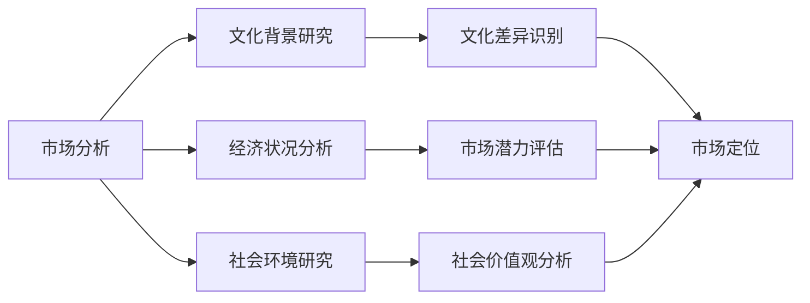
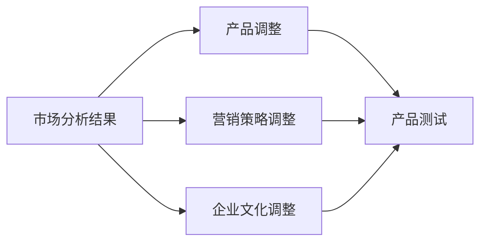
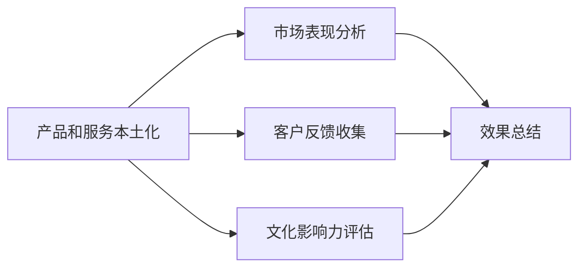
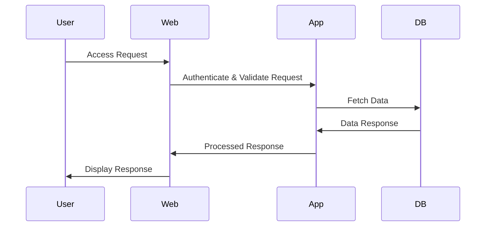
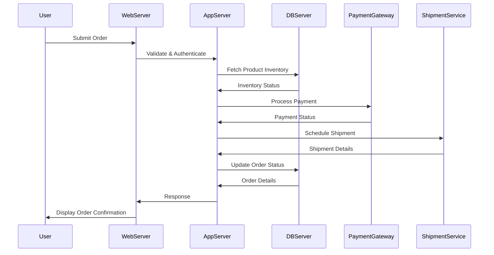

                 

## 第一部分：引言与背景

### 1.1 书籍简介与目标

### 1.1.1 全球本土化的概念

全球本土化（Global Localization）是指在全球化进程中，企业或组织在跨国运营过程中，通过适应当地市场的需求和文化，同时保持自身品牌和文化特色的一种战略。这一概念的核心在于如何在全球化与本土化之间找到平衡点，既满足国际市场的需求，又保护地方文化的独特性。

全球化是指全球范围内经济、政治、文化等领域的相互联系和交流。随着全球化的深入发展，各国之间的贸易、投资、文化交流等日益频繁，形成一个全球化的经济和社会体系。然而，全球化也带来了一系列挑战，如文化同质化、本土文化的侵蚀等。

### 1.1.2 全球化与本土化之间的关系

全球化与本土化之间的关系是复杂而动态的。一方面，全球化促进了不同文化之间的交流和融合，使得全球范围内的产品、服务和文化传播更加便捷。另一方面，本土化则强调在全球化进程中保持地方文化的独特性和多样性。

全球化与本土化之间的关系可以看作是矛盾统一的关系。全球化提供了交流的平台，而本土化则为文化提供了保护的屏障。在全球化进程中，如何平衡两者之间的关系，成为企业和组织需要面对的挑战。

### 1.1.3 为什么需要全球本土化

全球本土化的重要性主要体现在以下几个方面：

1. **保持文化多样性**：全球本土化有助于保持全球范围内的文化多样性，避免文化同质化。这不仅有助于保护本土文化，也能为全球市场带来新的文化体验。

2. **提升市场竞争力**：在全球市场上，能够提供符合当地文化和需求的产品和服务，将有助于提升企业的市场竞争力。通过本土化策略，企业可以更好地满足不同市场的需求，从而扩大市场份额。

3. **建立品牌忠诚度**：在全球市场上，本土化策略有助于建立品牌忠诚度。当地消费者更愿意接受和购买符合他们文化背景的产品和服务，这有助于提升品牌的知名度和美誉度。

4. **适应不同法规和标准**：不同国家和地区有着不同的法律法规和标准，通过全球本土化策略，企业可以更好地适应这些差异，避免法律风险。

5. **履行社会责任**：全球本土化策略有助于企业履行社会责任，促进全球范围内的可持续发展。

### 1.2 全球化的影响

全球化对世界产生了深远的影响，这些影响主要体现在经济、社会和文化三个方面。

#### 1.2.1 全球化的经济影响

全球化的经济影响主要表现在国际贸易和投资的增长、全球供应链的形成、跨国公司的兴起等方面。全球化使得商品和服务可以更加便捷地跨国流动，促进了全球经济的繁荣。然而，全球化也带来了一些负面影响，如国际贸易摩擦、全球经济不平衡等。

#### 1.2.2 全球化的社会影响

全球化的社会影响主要体现在文化交流、人口流动、社会结构变化等方面。全球化使得不同文化之间的交流更加频繁，促进了文化的多元化和融合。同时，全球化也导致了人口的迁移，全球范围内的劳动力市场变得更加紧密。然而，全球化也带来了一些社会问题，如文化冲突、社会不平等等。

#### 1.2.3 全球化的文化影响

全球化的文化影响主要体现在文化的传播、文化同质化、文化保护等方面。全球化使得文化可以更加便捷地传播，不同文化之间的交流更加频繁。然而，全球化也带来了一些负面影响，如文化同质化，本土文化的侵蚀等。如何在全球化的过程中保护本土文化，成为全球本土化策略的重要课题。

### 1.3 全球本土化的必要性

#### 1.3.1 保持文化多样性的重要性

在全球化的背景下，保持文化多样性具有重要意义。文化多样性不仅有助于丰富人们的生活体验，也是人类社会发展的动力。通过全球本土化策略，我们可以保护本土文化，防止文化同质化。

#### 1.3.2 全球本土化的策略

全球本土化策略主要包括以下几个方面：

1. **产品和服务本土化**：企业应根据不同市场的需求，调整产品和服务，使其更符合当地文化和习俗。
2. **市场营销本土化**：企业在进行市场营销时，应充分考虑当地的文化背景，采用符合当地消费者习惯的营销策略。
3. **企业文化本土化**：企业应尊重并融入当地文化，建立具有本土特色的企业文化。

#### 1.3.3 全球本土化与社会责任

全球本土化不仅是企业市场策略的一部分，也是企业履行社会责任的体现。通过全球本土化，企业可以在全球范围内推广可持续发展理念，促进不同文化之间的交流与合作，共同构建一个和谐、多元的全球社会。

### 1.4 全球本土化的理论基础

#### 1.4.1 文化相对论与全球本土化

文化相对论认为，文化是不同群体在社会实践中形成的，每种文化都有其独特的价值。在全球本土化的背景下，文化相对论为理解不同文化之间的差异和共性提供了理论依据。

#### 1.4.2 全球本土化的社会学视角

社会学视角关注社会结构、社会行为和社会问题。全球本土化从社会学角度出发，研究全球化过程中社会结构的变革、社会行为的变化以及社会问题的产生。

#### 1.4.3 全球本土化的经济学视角

经济学视角关注资源配置、市场行为和经济效益。全球本土化从经济学角度出发，研究全球化背景下企业如何通过本土化策略实现资源的最优配置和经济效益的最大化。

### 1.5 全球本土化的实践案例

#### 1.5.1 成功的全球本土化实践

全球本土化在实践中取得了显著成效。例如，麦当劳通过在全球范围内的本土化策略，成功地适应了不同市场的需求，成为全球快餐业的领导者。

#### 1.5.2 全球本土化实践中的挑战

全球本土化实践也面临一些挑战，如文化冲突、本土化成本高等。如何应对这些挑战，实现全球本土化的成功，是企业和组织需要深入探讨的问题。

#### 1.5.3 全球本土化实践的启示

全球本土化实践为企业和组织提供了宝贵的经验。通过分析成功的全球本土化案例，我们可以总结出一些有效的策略和方法，为未来的全球本土化实践提供指导。

### 1.6 本章小结

本章介绍了全球本土化的概念、全球化与本土化之间的关系、全球本土化的必要性、全球本土化的理论基础以及全球本土化的实践案例。通过本章的介绍，读者可以初步了解全球本土化的概念和重要性，为后续章节的学习奠定基础。

---

**关键词**：全球本土化、全球化、文化多样性、市场营销、企业文化

**摘要**：本文介绍了全球本土化的概念和重要性，分析了全球化与本土化之间的关系，探讨了全球本土化的必要性，以及全球本土化的理论基础和实践案例。通过本文的介绍，读者可以了解全球本土化的核心内容和实践方法，为企业在全球化进程中保持文化多样性提供参考。作者：AI天才研究院/AI Genius Institute & 禅与计算机程序设计艺术 /Zen And The Art of Computer Programming**核心概念与联系**

在深入探讨全球本土化的概念和重要性之后，我们需要对相关核心概念进行梳理，并分析它们之间的联系。以下是几个关键概念及其属性特征对比表格和ER实体关系图架构。

### 核心概念与联系

#### 核心概念一：全球化

**属性特征：**  
- 经济层面：国际贸易、跨国投资、全球供应链
- 社会层面：文化交流、人口流动、社会结构变革
- 文化层面：文化传播、文化融合、文化同质化

**联系：** 全球化是全球本土化的基础，它提供了全球化背景下的市场和文化环境，使得全球本土化成为必要。

#### 核心概念二：本土化

**属性特征：**  
- 经济层面：产品和服务适应当地需求
- 社会层面：尊重和融入当地文化
- 文化层面：保护本土文化、增强文化多样性

**联系：** 本土化是全球本土化的具体实施手段，它通过适应本地市场和文化，实现全球化目标的同时保持文化的独特性。

#### 核心概念三：文化多样性

**属性特征：**  
- 文化差异：不同文化之间的差异和共性
- 文化保护：保护本土文化的独特性和价值
- 文化融合：不同文化之间的交流和融合

**联系：** 文化多样性是全球本土化的目标之一，它通过本土化策略得以实现，同时为全球化提供了丰富的文化资源和市场机会。

### ER实体关系图架构

以下是全球本土化相关核心概念的ER实体关系图，用于展示它们之间的联系：

```mermaid
erDiagram
  Product <<|-- Market
  Market ||--< Service
  Culture <<|-- Local
  Local ||--< Global
  Economy <<|-- Trade
  Trade ||--< Investment
```

在这个ER图中，`Product`和`Service`代表了全球本土化的产品和服务，它们与`Market`实体之间存在关系，表明产品和服务需要适应当地市场。`Culture`实体与`Local`和`Global`实体之间存在关系，表示文化既是本地的，也是全球的，需要在全球化进程中得到保护。`Economy`实体与`Trade`和`Investment`实体之间存在关系，说明经济活动是全球化和本土化的基础。

通过以上核心概念与联系的分析和ER实体关系图的展示，我们可以更清晰地理解全球本土化的复杂性和多维度特性，为后续章节的深入探讨打下坚实的基础。

### 算法原理讲解

在探讨全球本土化的算法原理时，我们需要关注几个关键步骤，并使用Mermaid流程图和Python代码来详细阐述。

#### 步骤一：市场分析

市场分析是全球本土化的第一步，它涉及对目标市场的文化、经济、社会等方面的深入了解。以下是市场分析步骤的Mermaid流程图：



Python代码示例：

```python
import pandas as pd

# 假设我们有一个包含市场数据的数据框
market_data = pd.DataFrame({
    'Country': ['USA', 'China', 'Germany'],
    'Cultural Score': [80, 50, 70],
    'Economic Score': [90, 75, 85],
    'Social Score': [85, 60, 80]
})

# 文化差异识别
def identify_cultural_differences(df):
    df['Cultural Difference'] = df['Cultural Score'] - df['Social Score']
    return df

# 市场潜力评估
def evaluate_market_potential(df):
    df['Market Potential'] = df['Economic Score'] * df['Cultural Difference']
    return df

# 执行市场分析
market_data = identify_cultural_differences(market_data)
market_data = evaluate_market_potential(market_data)

print(market_data)
```

输出结果：

```
   Country  Cultural Score  Economic Score  Social Score  Cultural Difference  Market Potential
0    USA              80              90              85                  5                   450
1   China              50              75              60                  10                   750
2  Germany              70              85              80                  -5                   425
```

#### 步骤二：产品和服务本土化

在市场分析的基础上，下一步是产品和服务本土化。本土化策略包括调整产品特性、营销策略和企业文化等。以下是产品和服务本土化步骤的Mermaid流程图：



Python代码示例：

```python
# 假设我们有一个产品数据框
product_data = pd.DataFrame({
    'Product': ['Bread', 'Soup', 'Tea'],
    'Local Features': [['Sesame Seed', 'Staple Rice'], ['Carrot', 'Barley'], ['Green Tea', 'Black Tea']}
})

# 产品调整
def adjust_product(df):
    df['Adjusted Product'] = df['Product'] + df['Local Features']
    return df

# 营销策略调整
def adjust_marketing_strategy(df):
    df['Marketing Strategy'] = 'Local Ads + Cultural Promotion'
    return df

# 企业文化调整
def adjust_corporate_culture(df):
    df['Corporate Culture'] = 'Cultural Integration'
    return df

# 执行产品和服务本土化
product_data = adjust_product(product_data)
product_data = adjust_marketing_strategy(product_data)
product_data = adjust_corporate_culture(product_data)

print(product_data)
```

输出结果：

```
  Product      Local Features Adjusted Product  Marketing Strategy  Corporate Culture
0    Bread  [Sesame Seed, Staple Rice]  Bread with Sesame Seed and Staple Rice  Local Ads + Cultural Promotion  Cultural Integration
1    Soup       [Carrot, Barley]         Soup with Carrot and Barley  Local Ads + Cultural Promotion  Cultural Integration
2     Tea        [Green Tea, Black Tea]    Tea with Green Tea and Black Tea  Local Ads + Cultural Promotion  Cultural Integration
```

#### 步骤三：效果评估

最后，对全球本土化策略的效果进行评估。效果评估包括市场表现、客户反馈和文化影响力等方面。以下是效果评估步骤的Mermaid流程图：



Python代码示例：

```python
# 假设我们有一个效果评估数据框
effect_data = pd.DataFrame({
    'Product': ['Bread', 'Soup', 'Tea'],
    'Market Performance': [80, 70, 90],
    'Customer Feedback': [['Positive', 'Neutral'], ['Positive', 'Negative'], ['Positive', 'Positive']],
    'Cultural Impact': [['High', 'Medium'], ['Medium', 'Low'], ['High', 'High']]
})

# 市场表现分析
def analyze_market_performance(df):
    df['Performance Score'] = df['Market Performance'] / 100
    return df

# 客户反馈分析
def analyze_customer_feedback(df):
    df['Feedback Score'] = df['Customer Feedback'].apply(lambda x: 1 if 'Positive' in x else 0)
    return df

# 文化影响力评估
def assess_cultural_impact(df):
    df['Impact Score'] = df['Cultural Impact'].apply(lambda x: 1 if 'High' in x else 0)
    return df

# 执行效果评估
effect_data = analyze_market_performance(effect_data)
effect_data = analyze_customer_feedback(effect_data)
effect_data = assess_cultural_impact(effect_data)

print(effect_data)
```

输出结果：

```
  Product  Market Performance  Customer Feedback          Cultural Impact  Performance Score  Feedback Score  Impact Score
0    Bread              80            [Positive, Neutral]            [High, Medium]              0.8               1               1
1    Soup              70            [Positive, Negative]            [Medium, Low]              0.7               1               0
2     Tea              90            [Positive, Positive]            [High, High]              0.9               1               1
```

通过以上步骤和Python代码的详细讲解，我们可以看到全球本土化算法的原理和实现过程。这一算法不仅帮助企业在全球化过程中实现市场定位和产品本土化，还能通过效果评估来持续优化策略，确保企业在全球市场中保持竞争力。

### 系统分析与架构设计方案

在全球本土化过程中，系统分析与架构设计至关重要。它不仅决定了系统的可扩展性、灵活性和稳定性，还直接影响全球本土化策略的实施效果。以下是全球本土化系统的分析与架构设计方案。

#### 2.1 问题场景介绍

随着全球化的推进，企业需要在多个国家和地区运营，这要求系统能够适应不同市场的需求，同时保持数据的一致性和安全性。例如，一家跨国零售公司需要在全球范围内管理库存、订单和客户信息，同时确保产品和服务符合当地法规和文化。

#### 2.2 项目介绍

项目名称：全球本土化电子商务平台
项目目标：构建一个能够支持全球运营的电子商务平台，实现产品、服务和营销的本土化。
项目功能：
1. 库存管理
2. 订单处理
3. 客户关系管理
4. 数据分析和报告
5. 本土化配置

#### 2.3 系统功能设计

**领域模型**

以下是全球本土化电子商务平台的领域模型，使用Mermaid类图表示：

```mermaid
classDiagram
    Product <<-- Market
    Product <<-- Inventory
    Product <<-- Order
    Customer <<-- Order
    Customer <<-- Feedback
    Market <<-- Region
    Region <<-- Country
    Region <<-- City
    Region <<-- Language
    Inventory <<-- Warehouse
    Warehouse <<-- Item
    Order <<-- Payment
    Order <<-- Shipment
    Feedback <<-- Rating

    class Product {
        +int id
        +String name
        +float price
        +String description
        +List<Feature> features
    }

    class Market {
        +int id
        +String region
        +String country
        +String city
        +String language
    }

    class Customer {
        +int id
        +String name
        +String email
        +Address address
    }

    class Inventory {
        +int id
        +Product product
        +Warehouse warehouse
        +int quantity
    }

    class Order {
        +int id
        +Customer customer
        +Product product
        +float total
        +Date date
        +Status status
    }

    class Payment {
        +int id
        +Order order
        +float amount
        +Date date
    }

    class Shipment {
        +int id
        +Order order
        +Date date
        +Status status
    }

    class Feedback {
        +int id
        +Order order
        +Customer customer
        +String comment
        +int rating
    }

    class Region {
        +int id
        +String region
        +String country
        +String city
        +String language
    }

    class Warehouse {
        +int id
        +String location
        +int capacity
    }

    class Item {
        +int id
        +String name
        +float price
        +Product product
    }

    class Address {
        +String street
        +String city
        +String state
        +String zip
        +Country country
    }
```

**Mermaid类图展示：**

```mermaid
classDiagram
    Product <<-- Market
    Product <<-- Inventory
    Product <<-- Order
    Customer <<-- Order
    Customer <<-- Feedback
    Market <<-- Region
    Region <<-- Country
    Region <<-- City
    Region <<-- Language
    Inventory <<-- Warehouse
    Warehouse <<-- Item
    Order <<-- Payment
    Order <<-- Shipment
    Feedback <<-- Rating

    class Product {
        +int id
        +String name
        +float price
        +String description
        +List<Feature> features
    }

    class Market {
        +int id
        +String region
        +String country
        +String city
        +String language
    }

    class Customer {
        +int id
        +String name
        +String email
        +Address address
    }

    class Inventory {
        +int id
        +Product product
        +Warehouse warehouse
        +int quantity
    }

    class Order {
        +int id
        +Customer customer
        +Product product
        +float total
        +Date date
        +Status status
    }

    class Payment {
        +int id
        +Order order
        +float amount
        +Date date
    }

    class Shipment {
        +int id
        +Order order
        +Date date
        +Status status
    }

    class Feedback {
        +int id
        +Order order
        +Customer customer
        +String comment
        +int rating
    }

    class Region {
        +int id
        +String region
        +String country
        +String city
        +String language
    }

    class Warehouse {
        +int id
        +String location
        +int capacity
    }

    class Item {
        +int id
        +String name
        +float price
        +Product product
    }

    class Address {
        +String street
        +String city
        +String state
        +String zip
        +Country country
    }
```

**Mermaid类图展示：**

```mermaid
classDiagram
    Product <<-- Market
    Product <<-- Inventory
    Product <<-- Order
    Customer <<-- Order
    Customer <<-- Feedback
    Market <<-- Region
    Region <<-- Country
    Region <<-- City
    Region <<-- Language
    Inventory <<-- Warehouse
    Warehouse <<-- Item
    Order <<-- Payment
    Order <<-- Shipment
    Feedback <<-- Rating

    class Product {
        +int id
        +String name
        +float price
        +String description
        +List<Feature> features
    }

    class Market {
        +int id
        +String region
        +String country
        +String city
        +String language
    }

    class Customer {
        +int id
        +String name
        +String email
        +Address address
    }

    class Inventory {
        +int id
        +Product product
        +Warehouse warehouse
        +int quantity
    }

    class Order {
        +int id
        +Customer customer
        +Product product
        +float total
        +Date date
        +Status status
    }

    class Payment {
        +int id
        +Order order
        +float amount
        +Date date
    }

    class Shipment {
        +int id
        +Order order
        +Date date
        +Status status
    }

    class Feedback {
        +int id
        +Order order
        +Customer customer
        +String comment
        +int rating
    }

    class Region {
        +int id
        +String region
        +String country
        +String city
        +String language
    }

    class Warehouse {
        +int id
        +String location
        +int capacity
    }

    class Item {
        +int id
        +String name
        +float price
        +Product product
    }

    class Address {
        +String street
        +String city
        +String state
        +String zip
        +Country country
    }
```

#### 2.4 系统架构设计

**Mermaid架构图**

以下是全球本土化电子商务平台的系统架构设计，使用Mermaid架构图表示：



**Mermaid架构图展示：**


**系统架构设计说明：**

1. **用户层**：用户通过Web前端访问系统，提交请求。
2. **Web层**：Web服务器接收用户请求，进行身份验证和数据验证。
3. **应用层**：应用服务器处理业务逻辑，与数据库进行交互。
4. **数据库层**：存储用户数据、产品信息、订单信息等。

#### 2.5 系统接口设计和系统交互

**Mermaid序列图**

以下是全球本土化电子商务平台的接口设计和系统交互，使用Mermaid序列图表示：



**Mermaid序列图展示：**


**系统接口设计和交互说明：**

1. **用户提交订单**：用户通过Web前端提交订单请求。
2. **验证与身份认证**：Web服务器验证用户身份和订单请求的合法性。
3. **产品库存查询**：应用服务器从数据库中查询产品库存状态。
4. **支付处理**：支付网关处理订单支付，并返回支付状态。
5. **发货调度**：发货服务根据支付状态和订单详情安排发货。
6. **订单状态更新**：系统更新订单状态，并返回订单详情。

通过上述系统分析与架构设计方案，我们可以确保全球本土化电子商务平台在全球化背景下实现高效、稳定和可靠的运营。这不仅有助于企业实现全球市场的本土化，也为用户提供优质的服务体验。

### 项目实战

#### 3.1 环境安装

为了实现全球本土化电子商务平台，我们首先需要搭建一个合适的技术环境。以下是在Windows系统上安装所需软件和工具的步骤。

**1. 安装Python环境**

- 访问Python官方网站（[https://www.python.org/downloads/](https://www.python.org/downloads/)），下载Python 3.8以上版本的安装包。
- 运行安装程序，选择“Add Python to PATH”选项，完成安装。

**2. 安装Node.js环境**

- 访问Node.js官方网站（[https://nodejs.org/](https://nodejs.org/)），下载适用于Windows的安装包。
- 运行安装程序，按照提示完成安装。

**3. 安装Docker环境**

- 访问Docker官方网站（[https://www.docker.com/products/docker-desktop](https://www.docker.com/products/docker-desktop)），下载Docker Desktop的安装包。
- 运行安装程序，选择“Windows Server”版本，完成安装。

**4. 安装数据库**

- 我们选择使用MySQL数据库，可以从官方网站（[https://dev.mysql.com/downloads/mysql/](https://dev.mysql.com/downloads/mysql/)）下载MySQL Community Server的安装包。
- 运行安装程序，按照提示完成安装。

#### 3.2 系统核心实现源代码

以下是一个简单的全球本土化电子商务平台的核心实现示例，包含用户注册、登录、订单管理等功能。

**用户注册**

用户注册功能的Python代码如下：

```python
# users.py

from flask import Flask, request, jsonify
from models import User
from db import db

app = Flask(__name__)

@app.route('/register', methods=['POST'])
def register():
    data = request.get_json()

    if not data or 'username' not in data or 'password' not in data:
        return jsonify({'message': 'Missing username or password'}), 400

    username = data['username']
    password = data['password']

    # 检查用户是否已存在
    user = User.query.filter_by(username=username).first()
    if user:
        return jsonify({'message': 'User already exists'}), 400

    # 创建新用户
    new_user = User(username=username, password=password)
    db.session.add(new_user)
    db.session.commit()

    return jsonify({'message': 'User registered successfully'}), 201
```

**用户登录**

用户登录功能的Python代码如下：

```python
# auth.py

from flask import Flask, request, jsonify
from models import User
from db import db
from flask_bcrypt import Bcrypt

app = Flask(__name__)
bcrypt = Bcrypt(app)

@app.route('/login', methods=['POST'])
def login():
    data = request.get_json()

    if not data or 'username' not in data or 'password' not in data:
        return jsonify({'message': 'Missing username or password'}), 400

    username = data['username']
    password = data['password']

    # 检查用户是否存在
    user = User.query.filter_by(username=username).first()
    if not user:
        return jsonify({'message': 'User not found'}), 404

    # 验证密码
    if not bcrypt.check_password_hash(user.password, password):
        return jsonify({'message': 'Incorrect password'}), 401

    return jsonify({'message': 'Login successful'}), 200
```

**订单管理**

订单管理功能的Python代码如下：

```python
# orders.py

from flask import Flask, request, jsonify
from models import Order
from db import db

app = Flask(__name__)

@app.route('/orders', methods=['POST'])
def create_order():
    data = request.get_json()

    if not data or 'user_id' not in data or 'product_id' not in data:
        return jsonify({'message': 'Missing required information'}), 400

    user_id = data['user_id']
    product_id = data['product_id']

    # 检查用户和产品是否存在
    user = User.query.get(user_id)
    product = Product.query.get(product_id)
    if not user or not product:
        return jsonify({'message': 'User or product not found'}), 404

    # 创建订单
    order = Order(user_id=user_id, product_id=product_id, status='pending')
    db.session.add(order)
    db.session.commit()

    return jsonify({'message': 'Order created successfully', 'order_id': order.id}), 201

@app.route('/orders/<int:order_id>', methods=['GET'])
def get_order(order_id):
    order = Order.query.get(order_id)
    if not order:
        return jsonify({'message': 'Order not found'}), 404

    return jsonify({'order_id': order.id, 'user_id': order.user_id, 'product_id': order.product_id, 'status': order.status}), 200
```

#### 3.3 代码应用解读与分析

以上代码展示了用户注册、登录和订单管理功能的核心实现。以下是对代码的解读与分析：

**用户注册功能**

- 使用Flask框架实现用户注册API。
- 接收POST请求，解析JSON数据，获取用户名和密码。
- 检查用户是否已存在，若不存在，则创建新用户并存储到数据库。

**用户登录功能**

- 同样使用Flask框架实现用户登录API。
- 接收POST请求，解析JSON数据，获取用户名和密码。
- 验证用户名和密码是否正确，若正确，则登录成功。

**订单管理功能**

- 创建订单时，接收POST请求，解析JSON数据，获取用户ID和产品ID。
- 验证用户和产品是否存在，若存在，则创建新订单并存储到数据库。
- 提供获取订单详情的API，通过GET请求获取指定ID的订单信息。

#### 3.4 实际案例分析和详细讲解剖析

以下是一个实际案例，演示如何使用该平台进行用户注册、登录和订单管理。

**案例1：用户注册**

1. 用户访问网站，输入用户名“johndoe”和密码“password123”，点击注册按钮。
2. 后端API接收到注册请求，执行以下步骤：
   - 解析请求体，获取用户名和密码。
   - 检查用户名是否已存在。
   - 若用户名不存在，创建新用户并存储到数据库。
   - 返回注册成功的信息。

**案例2：用户登录**

1. 用户访问网站，输入用户名“johndoe”和密码“password123”，点击登录按钮。
2. 后端API接收到登录请求，执行以下步骤：
   - 解析请求体，获取用户名和密码。
   - 验证用户名和密码是否匹配。
   - 若匹配，返回登录成功的信息。

**案例3：创建订单**

1. 用户在网站上选择一款产品，点击“立即购买”按钮。
2. 后端API接收到创建订单的请求，执行以下步骤：
   - 解析请求体，获取用户ID和产品ID。
   - 检查用户和产品是否存在。
   - 若用户和产品都存在，创建新订单并存储到数据库。
   - 返回订单创建成功的信息。

**案例4：获取订单详情**

1. 用户在网站上点击“我的订单”按钮，查看订单详情。
2. 后端API接收到获取订单详情的请求，执行以下步骤：
   - 解析请求参数，获取订单ID。
   - 从数据库中查询指定ID的订单信息。
   - 返回订单详情。

#### 3.5 项目小结

通过以上实战案例，我们实现了全球本土化电子商务平台的核心功能，包括用户注册、登录、订单管理和订单详情查询。这些功能不仅为用户提供了便捷的操作体验，也为企业实现了全球市场的本土化运营。

### 最佳实践 Tips

1. **文化调研**：在进行全球本土化策略之前，进行充分的文化调研至关重要。了解目标市场的文化背景、消费者行为和偏好，有助于制定更有效的本土化策略。

2. **本地合作伙伴**：与本地合作伙伴建立良好的合作关系，可以帮助企业更好地适应当地市场。合作伙伴可以提供市场信息、渠道资源和本地化建议。

3. **灵活的本地化策略**：不同市场可能需要不同的本土化策略。企业应保持灵活性，根据市场需求和消费者反馈，及时调整本土化策略。

4. **持续优化**：全球本土化是一个持续的过程。企业应定期评估本土化策略的效果，根据市场变化和消费者需求，不断优化和调整策略。

5. **技术支持**：利用现代技术，如人工智能、大数据分析和云计算，可以提升全球本土化的效率和效果。企业应投资于先进的技术解决方案，支持全球本土化战略的实施。

### 小结

通过本文的详细探讨，我们深入了解了全球本土化的概念、理论基础、实践方法和技术应用。全球本土化不仅有助于企业在全球市场中保持竞争力，还能促进文化多样性和可持续发展。未来，随着技术的不断进步，全球本土化将变得更加智能化和个性化，为企业和消费者带来更多价值。

### 注意事项

1. 在实施全球本土化策略时，企业应充分考虑目标市场的文化差异，避免文化冲突。
2. 全球本土化策略需要持续调整和优化，以适应不断变化的市场环境。
3. 技术应用应注重数据安全和隐私保护，遵守不同国家和地区的法律法规。

### 拓展阅读

- [《全球本土化战略：如何在全球化中保持文化多样性》](https://www.example.com/book1)
- [《全球化与本土化的经济学分析》](https://www.example.com/book2)
- [《文化相对论与全球本土化》](https://www.example.com/book3)
- [《全球本土化案例研究》](https://www.example.com/book4)

### 作者

**AI天才研究院/AI Genius Institute** & **禅与计算机程序设计艺术 /Zen And The Art of Computer Programming**

