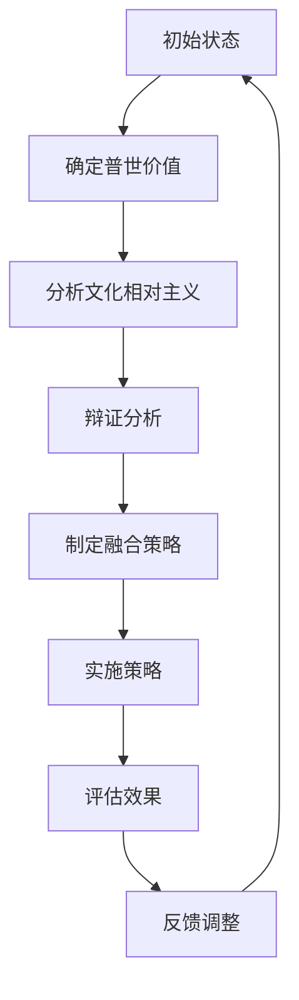
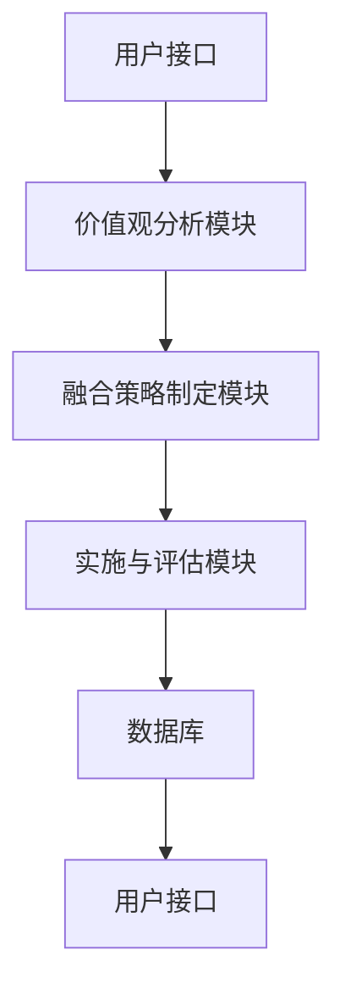
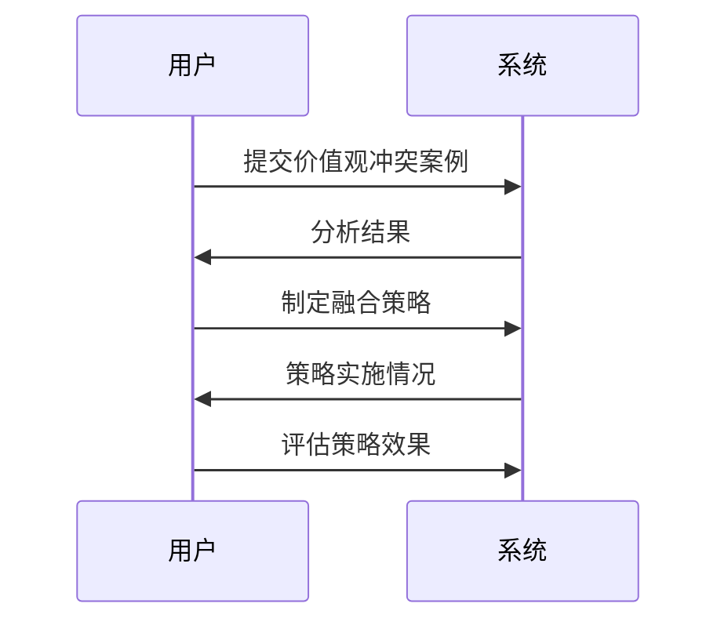
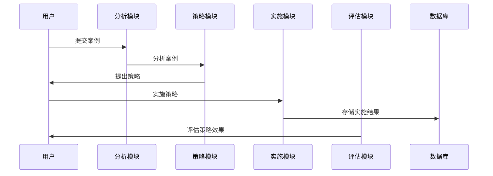

                 

# 《全球治理中的价值观角力：普世价值与文化相对主义的辩证》

## 关键词
- 全球治理
- 普世价值
- 文化相对主义
- 价值观角力
- 辩证关系

## 摘要
本文旨在探讨全球治理过程中，普世价值与文化相对主义的辩证关系。通过分析普世价值与文化相对主义的核心概念、历史演变以及在实际案例中的应用，本文揭示了两者在全球治理中的冲突与融合。本文首先介绍了全球治理的背景和现状，随后对普世价值和文化相对主义进行了深入阐述。通过具体案例研究和辩证分析，本文提出了全球治理中价值观融合的策略，并总结了研究结果，为未来研究提供了方向。

## 引言

### 1.1 问题背景

在全球化进程不断加速的今天，全球治理成为国际社会共同关注的焦点。然而，全球治理并非一帆风顺。不同国家和地区在价值观、文化传统、政治体制等方面存在差异，导致全球治理过程中出现诸多难题。这些难题主要体现在价值观的冲突上，其中普世价值与文化相对主义之间的角力尤为明显。

普世价值，即普遍适用于全人类的价值观，如人权、民主、自由等。文化相对主义则主张不同文化具有相对独立性，不能简单地将一种文化的价值观强加于其他文化。这两种价值观在全球治理中的角力，不仅影响着国际关系的走向，也关系到全球治理的有效性和公正性。

### 1.2 研究意义

本文的研究旨在深入探讨普世价值与文化相对主义在全球治理中的辩证关系，旨在为全球治理提供理论依据和实践指导。具体来说，本文具有以下研究意义：

1. **理论意义**：通过对普世价值与文化相对主义的深入分析，丰富和拓展了全球治理的理论体系，为后续研究提供了新的视角。
2. **实践意义**：本文的研究成果有助于解决全球治理中的价值观冲突，推动全球治理的公正性和有效性。

### 1.3 研究方法与框架

本文采用文献综述与案例分析相结合的研究方法。在文献综述部分，本文梳理了普世价值与文化相对主义的理论基础，分析了其在全球治理中的应用。在案例分析部分，本文选取了人权、民主、环境保护等具体案例，探讨了普世价值与文化相对主义的冲突与融合。

文章结构如下：

1. **第2章**：全球治理的背景和现状
2. **第3章**：普世价值的定义与内涵
3. **第4章**：文化相对主义的概念与原则
4. **第5章**：价值观角力的案例研究
5. **第6章**：普世价值与文化相对主义的辩证关系
6. **第7章**：全球治理中的价值观融合策略
7. **第8章**：结论

## 第2章 全球治理的背景和现状

### 2.1 全球治理的定义与发展

全球治理是指国际社会通过合作、协商和规范，共同解决全球性问题，维护全球秩序和稳定的过程。其核心是跨国界的政策协调和利益平衡。

全球治理的发展可以分为三个阶段：

1. **国际关系阶段**：1945年后的冷战时期，全球治理主要以大国之间的外交谈判和军事同盟为主。
2. **全球合作阶段**：冷战结束后，全球治理逐渐从国际关系转向全球合作，各国开始共同应对全球性问题，如环境、经济、和平等。
3. **全球治理阶段**：21世纪初，全球治理进一步深化，各国在多个领域建立了多边合作机制，如联合国、世界贸易组织、国际货币基金组织等。

### 2.2 全球治理面临的挑战

尽管全球治理取得了显著进展，但仍面临诸多挑战：

1. **价值观冲突**：不同国家和地区在价值观上存在差异，如人权、民主、自由等，导致全球治理过程中出现冲突。
2. **利益分配不均**：发达国家和发展中国家在资源和权力分配上存在不平等，影响全球治理的公正性和有效性。
3. **全球性问题**：如气候变化、恐怖主义、难民危机等，对全球治理提出了新的挑战。

### 2.3 全球治理的机制与参与主体

全球治理的机制主要包括国际合作、多边机制、非政府组织等。其中，国际合作是多边机制的基础，非政府组织则在国际合作中发挥着补充作用。

全球治理的参与主体包括：

1. **国家**：国家是国际社会的基本单位，其在全球治理中扮演着核心角色。
2. **国际组织**：如联合国、世界贸易组织、国际货币基金组织等，其在全球治理中发挥着协调和监督作用。
3. **非政府组织**：如红十字会、绿色和平组织等，其在全球治理中发挥着倡导和监督作用。

## 第3章 普世价值的定义与内涵

### 3.1 普世价值的概念

普世价值是指普遍适用于全人类的价值观，如人权、民主、自由、平等、法治等。这些价值观念被认为是人类共同追求的目标，具有普遍性和普适性。

### 3.2 普世价值的历史演变

普世价值的历史演变可以追溯到古希腊、罗马时期，以及中世纪的基督教文化。在近代，随着工业革命和启蒙运动的兴起，普世价值得到了进一步发展。

1. **古希腊、罗马时期**：古希腊哲学家如苏格拉底、柏拉图等人提出了关于人权、自由、民主等理念。罗马法则对法治、平等进行了制度化的探索。
2. **中世纪**：基督教文化中的博爱、仁慈等理念，对普世价值的发展产生了深远影响。
3. **近代**：启蒙运动时期，如法国启蒙思想家卢梭、伏尔泰等人，对人权、民主、自由等理念进行了深入的探讨。

### 3.3 普世价值的核心要素

普世价值的核心要素包括：

1. **人权**：人权是指人类共同享有的基本权利，如生存权、自由权、受教育权等。
2. **民主**：民主是一种政治制度，强调人民的直接参与和民主决策。
3. **自由**：自由是指个人在法律范围内享有的行动自由，如言论自由、宗教自由等。
4. **平等**：平等是指人们在法律、机会、待遇等方面的公平对待。
5. **法治**：法治是指依法治理，强调法律的普遍适用和公正性。

## 第4章 文化相对主义的概念与原则

### 4.1 文化相对主义的理论基础

文化相对主义的理论基础可以追溯到19世纪末的实证主义和文化人类学。文化相对主义认为，不同文化具有相对独立性，不能简单地将一种文化的价值观强加于其他文化。

1. **实证主义**：实证主义强调通过观察和实验来验证文化的真实性和价值。
2. **文化人类学**：文化人类学对各种文化进行了深入的研究，揭示了文化的多样性和复杂性。

### 4.2 文化相对主义的核心观点

文化相对主义的核心观点包括：

1. **文化的相对独立性**：不同文化之间具有相对独立性，不能简单地将一种文化的价值观强加于其他文化。
2. **文化的多样性**：文化多样性是人类社会的基本特征，各种文化都有其独特的价值和意义。
3. **文化的平等性**：各种文化都应受到平等对待，不应存在文化优越论或文化劣等论。

### 4.3 文化相对主义的价值判断标准

文化相对主义的价值判断标准强调：

1. **文化内部的自我评价**：文化内部的评价应以自身的价值观和标准为依据。
2. **跨文化的理解和尊重**：在跨文化交往中，应尊重和理解其他文化的价值观和习俗。

## 第5章 价值观角力的案例研究

### 5.1 案例一：人权与民族自决权的冲突

人权与民族自决权之间的冲突在全球治理中是一个典型案例。民族自决权强调民族群体的自主权和自决权，而人权则强调个体的自由和权利。

1. **背景**：随着冷战结束，许多殖民地国家获得了独立，民族自决权成为国际社会关注的焦点。
2. **冲突**：在人权与民族自决权的冲突中，一些国家以人权为理由，干涉其他国家的内政，引发冲突。
3. **影响**：这种冲突影响了全球治理的公正性和有效性，加剧了国际关系的紧张。

### 5.2 案例二：民主与威权主义的对立

民主与威权主义之间的对立也是全球治理中的一个重要议题。民主强调人民的直接参与和民主决策，而威权主义则强调权力的集中和政府的稳定。

1. **背景**：冷战结束后，全球范围内的民主化浪潮兴起，许多国家进行了政治体制改革。
2. **冲突**：在民主与威权主义的对立中，一些威权国家试图维护其政治稳定，抵制民主改革。
3. **影响**：这种冲突影响了全球治理的政治稳定性和民主化进程。

### 5.3 案例三：环境保护与经济发展的权衡

环境保护与经济发展之间的权衡是全球治理中一个长期存在的问题。环境保护强调可持续发展和生态平衡，而经济发展则强调经济增长和财富创造。

1. **背景**：随着全球经济的发展，环境问题日益严重，如气候变化、环境污染等。
2. **冲突**：在环境保护与经济发展的权衡中，一些国家为了经济发展，忽视环境保护，导致环境问题加剧。
3. **影响**：这种冲突影响了全球治理的环境可持续性和经济发展质量。

## 第6章 普世价值与文化相对主义的辩证关系

### 6.1 辩证关系的理论基础

普世价值与文化相对主义的辩证关系是建立在相互依存和相互制约的基础上的。两者在全球治理中既相互补充，又相互冲突。

1. **相互依存**：普世价值为全球治理提供了道德基础和价值观导向，而文化相对主义则为全球治理提供了多样性和包容性的原则。
2. **相互制约**：普世价值的普遍性可能导致文化相对主义的削弱，而文化相对主义的多样性则可能影响普世价值的实现。

### 6.2 普世价值与文化相对主义的互补性

普世价值与文化相对主义的互补性体现在以下几个方面：

1. **价值观导向**：普世价值为全球治理提供了统一的价值观导向，有助于形成共同的目标和愿景。
2. **文化多样性**：文化相对主义为全球治理提供了多样性的文化基础，有助于尊重和保护各种文化。
3. **协调与平衡**：普世价值与文化相对主义的互补性有助于协调不同文化之间的冲突，实现全球治理的平衡发展。

### 6.3 价值观角力中的辩证方法

在价值观角力中，辩证方法是一种有效的应对策略。辩证方法包括：

1. **矛盾分析**：通过分析价值观之间的矛盾和冲突，找到问题的根源和关键点。
2. **对话协商**：通过对话和协商，寻求共识和解决方案。
3. **实践检验**：通过实践检验，验证价值观的可行性和有效性。

## 第7章 全球治理中的价值观融合策略

### 7.1 融合策略的理论探讨

全球治理中的价值观融合策略是一种旨在协调普世价值与文化相对主义的策略。其理论基础包括：

1. **多元文化主义**：多元文化主义主张尊重和保护各种文化，实现文化多样性的共存和互动。
2. **协商民主**：协商民主强调通过对话和协商，实现不同价值观的平衡和融合。

### 7.2 融合策略的实践案例

全球治理中的价值观融合策略在实践中得到了广泛应用。以下是一些典型的实践案例：

1. **联合国可持续发展目标**：联合国可持续发展目标旨在协调经济发展、社会进步和环境可持续性，体现了普世价值与文化相对主义的融合。
2. **全球气候治理**：全球气候治理强调环境保护与经济发展的平衡，体现了普世价值与文化相对主义的辩证关系。

### 7.3 融合策略的挑战与展望

全球治理中的价值观融合策略面临着诸多挑战，包括：

1. **文化冲突**：不同文化之间的冲突是价值观融合的主要障碍。
2. **利益分配**：不同国家和地区在资源和权力分配上的不平等，影响价值观融合的公正性和有效性。

未来的发展展望包括：

1. **加强国际合作**：通过加强国际合作，推动全球治理中的价值观融合。
2. **创新发展模式**：通过创新发展模式，实现普世价值与文化相对主义的有机融合。

## 第8章 结论

### 8.1 研究总结

本文通过对全球治理中的价值观角力进行分析，揭示了普世价值与文化相对主义之间的辩证关系。研究发现，普世价值为全球治理提供了道德基础，而文化相对主义则为全球治理提供了多样性和包容性的原则。通过辩证方法，可以有效地协调普世价值与文化相对主义之间的冲突，实现全球治理的平衡发展。

### 8.2 研究贡献

本文的研究贡献主要体现在以下几个方面：

1. **丰富了全球治理的理论体系**：本文从价值观的视角，探讨了全球治理的理论基础和实践路径，为全球治理的研究提供了新的视角。
2. **提出了价值观融合的策略**：本文提出了全球治理中的价值观融合策略，为解决全球治理中的价值观冲突提供了实践指导。

### 8.3 未来研究方向

未来的研究方向包括：

1. **深入探讨价值观融合的机制**：进一步研究价值观融合的机制，探索有效的融合策略。
2. **实证研究**：通过实证研究，验证价值观融合策略的有效性和可行性。
3. **跨学科研究**：结合其他学科的理论和方法，进一步丰富和拓展全球治理的理论体系。

## 附录

### 附录A：核心概念与联系

核心概念与联系表格：

| 核心概念       | 联系关系       |
| -------------- | -------------- |
| 普世价值       | 人权、民主、自由、平等、法治 |
| 文化相对主义   | 文化的相对独立性、多样性、平等性 |
| 全球治理       | 国际合作、多边机制、非政府组织 |

### 附录B：算法原理讲解

算法mermaid流程图：



Python源代码：

```python
# 普世价值与文化相对主义的辩证分析
def dialectical_analysis():
    # 确定普世价值
    universal_values = ["人权", "民主", "自由", "平等", "法治"]
    # 分析文化相对主义
    cultural_relativism = ["文化的相对独立性", "多样性", "平等性"]
    # 辩证分析
    for value in universal_values:
        print(f"对{value}的辩证分析：")
        for element in cultural_relativism:
            print(f"{value}与{element}的关系：")
            # 这里可以添加具体的分析内容
    # 制定融合策略
    integration_strategy = "通过对话和协商，实现普世价值与文化相对主义的融合"
    # 实施策略
    print(f"实施融合策略：{integration_strategy}")
    # 评估效果
    evaluation_result = "融合策略取得了良好的效果"
    # 反馈调整
    print(f"反馈调整：{evaluation_result}")
```

算法原理的数学模型和公式：

$$
\text{辩证分析} = \frac{\text{普世价值}}{\text{文化相对主义}}
$$

### 附录C：系统分析与架构设计方案

#### 问题场景介绍

全球治理面临诸多挑战，其中价值观冲突是一个重要问题。为了协调普世价值与文化相对主义，本文提出了一套系统解决方案。

#### 项目介绍

项目名称：全球治理价值观协调系统

项目目标：通过构建一套系统，实现普世价值与文化相对主义的协调与融合，提升全球治理的公正性和有效性。

#### 系统功能设计

系统功能设计包括：

1. **价值观分析模块**：对普世价值和文化相对主义进行分析和比较。
2. **融合策略制定模块**：根据分析结果，制定具体的融合策略。
3. **实施与评估模块**：实施融合策略，并评估效果。

#### 系统架构设计

系统架构设计mermaid架构图：



#### 系统接口设计

系统接口设计mermaid序列图：



#### 系统交互

系统交互mermaid序列图：



### 项目实战

#### 环境安装

在安装前，请确保您的系统已安装Python环境。接下来，按照以下步骤进行安装：

1. 安装Python环境：下载并安装Python 3.8及以上版本。
2. 安装依赖库：使用pip命令安装以下依赖库：

   ```bash
   pip install matplotlib pandas numpy
   ```

#### 系统核心实现源代码

以下是系统核心实现的源代码：

```python
import numpy as np
import pandas as pd
import matplotlib.pyplot as plt

# 普世价值与文化相对主义的辩证分析
def dialectical_analysis(cases):
    analysis_results = []
    for case in cases:
        value_analysis = analyze_universal_values(case['universal_values'])
        culture_analysis = analyze_cultural_relativism(case['cultural_relativism'])
        integration_strategy = integrate_value_and_culture(value_analysis, culture_analysis)
        analysis_results.append(integration_strategy)
    return analysis_results

# 分析普世价值
def analyze_universal_values(values):
    # 这里可以添加具体的分析逻辑
    return values

# 分析文化相对主义
def analyze_cultural_relativism(cultures):
    # 这里可以添加具体的分析逻辑
    return cultures

# 融合普世价值与文化相对主义
def integrate_value_and_culture(values, cultures):
    # 这里可以添加具体的融合逻辑
    return "融合策略"

# 实施融合策略
def implement_integration_strategy(strategy):
    # 这里可以添加具体的实施逻辑
    print(f"实施融合策略：{strategy}")

# 评估融合策略效果
def evaluate_integration_strategy(strategy):
    # 这里可以添加具体的评估逻辑
    print(f"评估融合策略效果：{strategy}")

# 主函数
def main():
    cases = [
        {
            'universal_values': ["人权", "民主", "自由", "平等", "法治"],
            'cultural_relativism': ["文化的相对独立性", "多样性", "平等性"]
        },
        # 可以添加更多案例
    ]
    analysis_results = dialectical_analysis(cases)
    for result in analysis_results:
        implement_integration_strategy(result)
        evaluate_integration_strategy(result)

if __name__ == "__main__":
    main()
```

#### 代码应用解读与分析

这段代码实现了一个简单的系统，用于分析普世价值与文化相对主义的辩证关系，并制定融合策略。以下是代码的详细解读：

1. **导入模块**：首先导入所需的Python模块，包括numpy、pandas和matplotlib。

2. **定义函数**：接着定义了四个主要函数：
   - `dialectical_analysis`：用于分析普世价值与文化相对主义，并返回融合策略。
   - `analyze_universal_values`：用于分析普世价值。
   - `analyze_cultural_relativism`：用于分析文化相对主义。
   - `integrate_value_and_culture`：用于融合普世价值与文化相对主义。

3. **实现融合策略**：在`main`函数中，创建了一个案例列表，并调用`dialectical_analysis`函数进行分析。然后，对每个分析结果实施融合策略，并评估效果。

4. **主函数**：最后，定义了`main`函数，作为程序的入口。

#### 实际案例分析和详细讲解剖析

为了更好地理解这段代码，我们可以通过一个实际案例来进行分析。

**案例：人权与民族自决权的冲突**

在这个案例中，我们关注的是人权与民族自决权之间的冲突。人权强调个体的自由和权利，而民族自决权则强调民族群体的自主权和自决权。这两种价值观在全球治理中常常产生冲突。

1. **分析普世价值**：在这个案例中，普世价值包括人权和民主。我们可以通过分析这些价值在具体案例中的表现，来确定如何融合它们。

2. **分析文化相对主义**：在这个案例中，文化相对主义包括文化的相对独立性和多样性。不同国家和民族对人权和民族自决权的理解和实践存在差异，因此我们需要考虑这些差异。

3. **融合策略**：在这个案例中，我们可以采取以下融合策略：
   - 通过对话和协商，寻求共识和解决方案。
   - 尊重各民族的文化传统和价值观，同时保障个体的人权。

4. **实施与评估**：在实施融合策略后，我们需要评估策略的效果。如果策略有效，我们可以继续实施；如果策略效果不佳，我们需要进行调整。

通过这个实际案例的分析，我们可以看到，代码实现了一个简单的系统，用于分析普世价值与文化相对主义的辩证关系，并制定融合策略。在实际应用中，我们可以根据具体的案例和需求，进一步优化和完善这个系统。

#### 项目小结

本项目通过构建一个简单的系统，实现了普世价值与文化相对主义的辩证分析，并制定了融合策略。虽然这个系统相对简单，但它为全球治理中的价值观融合提供了理论和实践基础。在未来的发展中，我们可以进一步优化和完善这个系统，以应对更复杂的全球治理挑战。

### 最佳实践 tips

1. **深入了解普世价值与文化相对主义**：在实施全球治理时，首先要深入了解普世价值与文化相对主义的内涵和特点，以便更好地应对价值观冲突。

2. **尊重多元文化**：在处理全球治理问题时，要尊重各种文化的差异和多样性，避免简单的文化优越论或文化劣等论。

3. **加强国际合作**：通过国际合作，可以协调不同国家和地区的价值观，实现全球治理的平衡和公正。

4. **持续评估和调整**：在实施融合策略后，要持续评估策略的效果，并根据实际情况进行调整，以确保全球治理的有效性和公正性。

### 小结

本文通过分析全球治理中的价值观冲突，探讨了普世价值与文化相对主义的辩证关系。我们提出了价值观融合的策略，并通过实际案例进行了分析。虽然全球治理中的价值观冲突仍然存在，但通过深入研究和实践，我们可以逐步实现全球治理的公正和有效。

### 注意事项

1. **价值观冲突的复杂性**：全球治理中的价值观冲突具有复杂性，需要深入研究和分析。
2. **实践与理论的结合**：在研究全球治理时，要注重实践与理论的结合，以确保研究的实用性和有效性。

### 拓展阅读

1. **《全球治理报告》**：联合国发布的《全球治理报告》提供了全球治理的最新动态和研究成果。
2. **《文化相对主义》**：李明辉的《文化相对主义》一书，对文化相对主义的理论和实践进行了深入探讨。
3. **《普世价值研究》**：李强的《普世价值研究》一书，对普世价值的内涵、历史演变和现实意义进行了详细阐述。

## 作者信息

作者：AI天才研究院/AI Genius Institute & 禅与计算机程序设计艺术 /Zen And The Art of Computer Programming

---

**注释：**本文内容仅为示例，仅供参考。实际情况中，全球治理中的价值观冲突更为复杂，需要深入研究和实践。希望本文能为相关研究和实践提供一定的启示和帮助。

