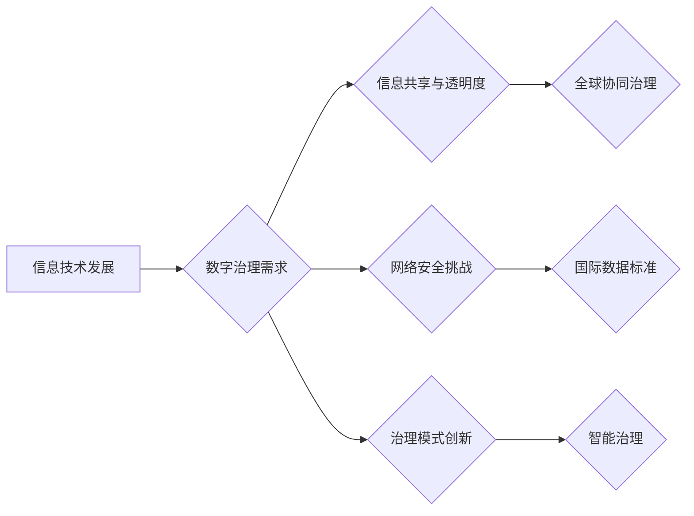
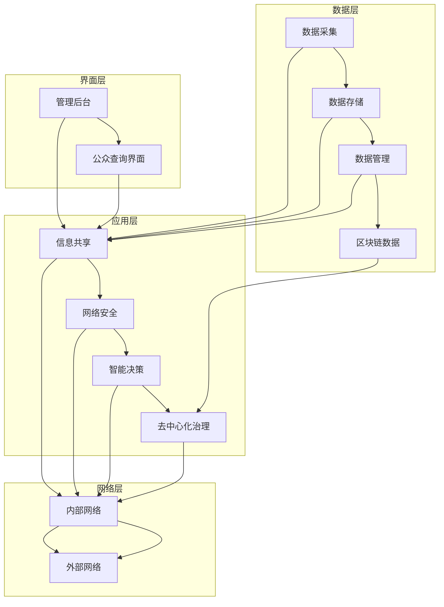
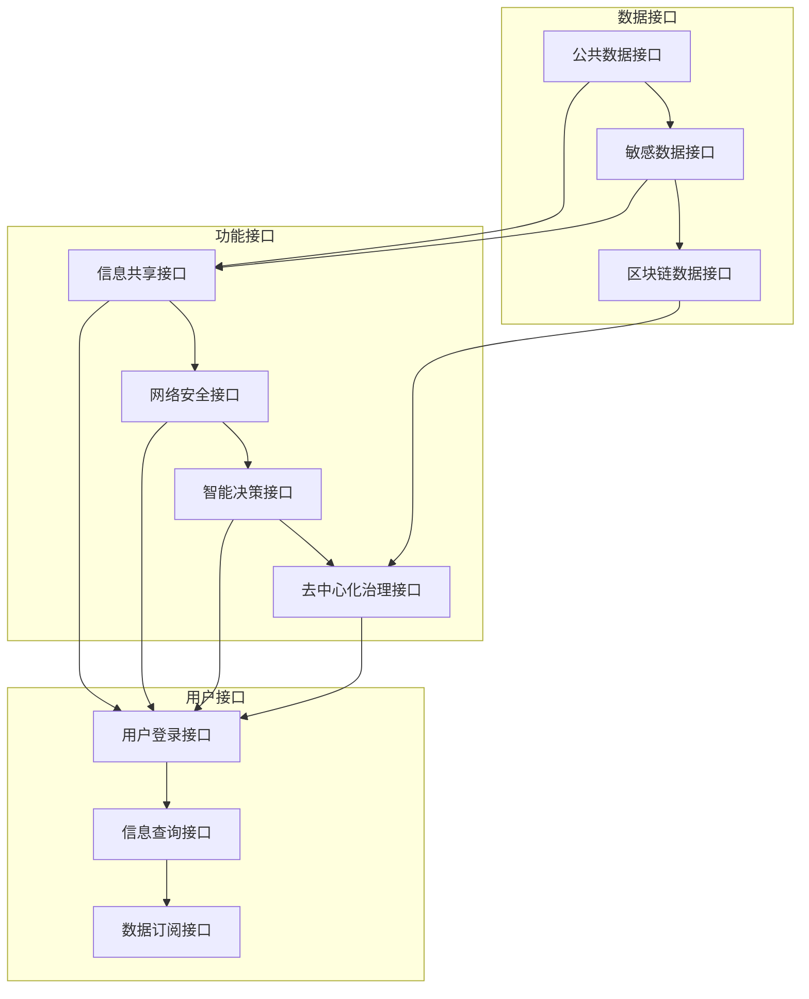
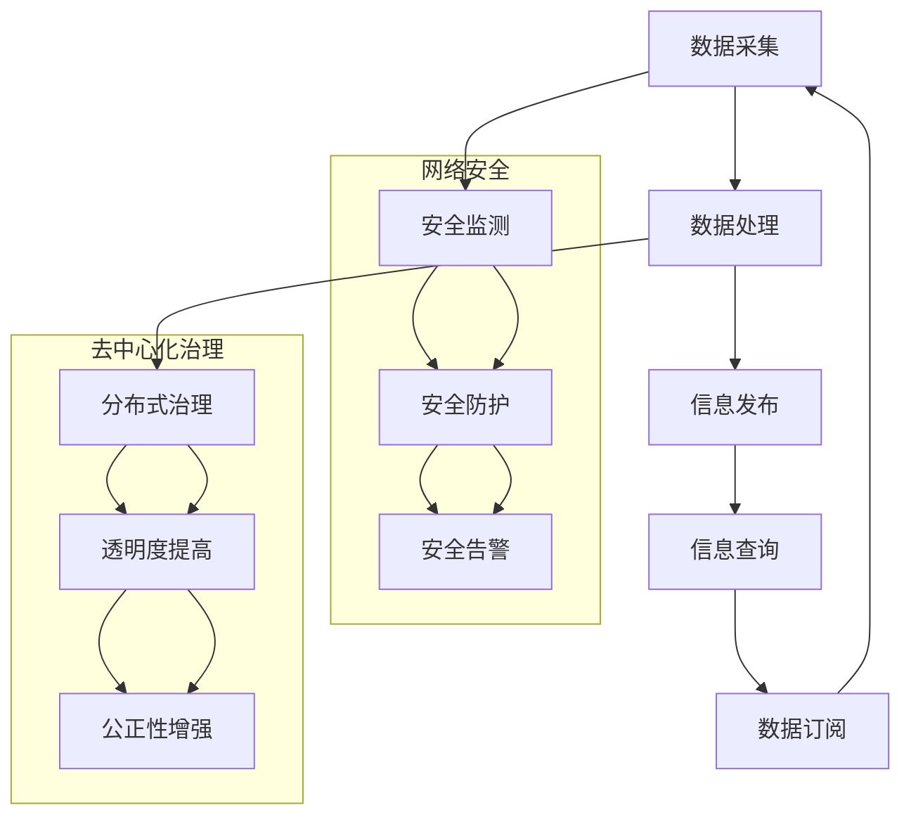

                 

# 《全球治理：在互联世界中寻找共同价值》

## 关键词：全球治理、互联世界、共同价值、国际安全、经济治理、环境治理、技术创新

## 摘要：

本文将探讨全球治理在互联世界中面临的挑战和机遇。通过分析全球治理的背景、体系、共同价值以及主要议题，我们试图揭示在全球互联化的背景下，如何通过寻找和推广共同价值，实现更加公平、有效和可持续的全球治理。

## 目录大纲

### 第一部分：引言

#### 第1章：全球治理的背景与挑战

1.1 全球治理的概念与历史演变

1.2 当代全球治理的挑战

1.3 互联世界与全球治理的关系

#### 第2章：全球治理的体系与机制

2.1 全球治理的体系结构

2.2 国际组织和机构的作用

2.3 全球治理机制的有效性评估

#### 第3章：全球治理中的共同价值

3.1 共同价值的定义与重要性

3.2 全球治理中的共同价值内涵

3.3 共同价值与国家利益的平衡

#### 第4章：全球治理中的主要议题

4.1 国际安全与冲突管理

4.2 经济治理与国际金融稳定

4.3 环境治理与可持续发展

#### 第5章：互联世界中的全球治理创新

5.1 信息技术与全球治理

5.2 数字治理：新的治理模式

5.3 全球治理创新的前景与挑战

### 第二部分：案例分析

#### 第6章：中国在全球治理中的角色

6.1 中国全球治理的战略目标

6.2 中国在联合国及其他国际组织中的作用

6.3 中国在全球治理中的贡献与挑战

#### 第7章：美国的全球治理策略

7.1 美国全球治理的政策演变

7.2 美国在关键领域的治理立场

7.3 美国全球治理的挑战与调整

#### 第8章：新兴经济体在全球治理中的崛起

8.1 新兴经济体的全球治理参与度

8.2 新兴经济体的治理模式与理念

8.3 新兴经济体在全球治理中的影响力

### 第三部分：全球治理的未来展望

#### 第9章：全球治理的未来趋势

9.1 全球治理的演变方向

9.2 技术创新对全球治理的影响

9.3 全球治理的可持续发展路径

#### 第10章：全球治理中的中国角色

10.1 中国在全球治理中的战略定位

10.2 中国参与全球治理的策略与建议

10.3 中国在全球治理中的责任与挑战

#### 第11章：结论

11.1 全球治理的挑战与机遇

11.2 寻找共同价值的必要性

11.3 全球治理的未来愿景

## 第1章：全球治理的背景与挑战

### 1.1 全球治理的概念与历史演变

全球治理（Global Governance）是指国际社会在政治、经济、环境、安全等领域，通过一系列机制、政策、合作等方式，实现全球性问题和公共利益的协调、管理和解决。其核心目标是确保全球的和平与稳定，促进经济和社会的发展，保护环境，实现全球公平与正义。

全球治理的历史可以追溯到二战后国际体系的建立。1945年，联合国成立，标志着国际社会在政治、经济、安全等领域开始进行全球治理。此后，一系列国际组织和多边机构相继成立，如国际货币基金组织（IMF）、世界银行、世界贸易组织（WTO）等，这些机构在全球治理中发挥了重要作用。

然而，随着全球化进程的加快，全球治理面临着前所未有的挑战。一方面，全球性问题日益突出，如气候变化、恐怖主义、经济危机等，这些问题的跨国性质要求国际社会进行协同治理。另一方面，国家间的利益冲突、文化差异、制度差异等因素使得全球治理变得更加复杂。

### 1.2 当代全球治理的挑战

当代全球治理面临以下几大挑战：

1. **全球性问题治理困境**：全球性问题如气候变化、环境污染、流行病等需要全球协同治理，但各国在治理策略、责任分担、利益分配等方面存在分歧，导致治理效果不理想。

2. **多边机构效能问题**：国际组织和多边机构在全球治理中的角色和效能受到质疑。一些机构因过于庞大、官僚、缺乏灵活性，难以迅速应对全球挑战。

3. **地缘政治冲突**：国家间的地缘政治冲突加剧，影响全球治理的稳定性和有效性。如中美贸易战、地区冲突等，这些冲突往往导致国际合作受阻。

4. **数字治理挑战**：互联网的普及带来了数字治理的新挑战。网络安全、数据隐私、网络犯罪等问题需要全球协同治理，但各国在此领域的立法和执法存在差异。

### 1.3 互联世界与全球治理的关系

互联世界的形成加剧了全球治理的复杂性，同时也为全球治理提供了新的机遇。以下是从互联世界的角度分析全球治理的几个关键点：

1. **信息共享与透明度**：互联世界使得信息传播更加迅速、广泛，有利于提高全球治理的透明度。各国可以更快地获取全球性问题的相关信息，从而制定更为科学的治理策略。

2. **数字治理需求**：互联网的发展带来了新的治理需求，如网络安全、数据治理等。这些需求需要国际社会共同制定规则和标准，实现全球协同治理。

3. **治理模式创新**：互联世界为全球治理提供了新的治理模式，如基于区块链的去中心化治理、基于人工智能的智能治理等。这些新模式具有灵活性、透明度高、效率高等优点，有望提高全球治理的效能。

4. **数字鸿沟问题**：互联世界的发展也加剧了数字鸿沟问题。一些发展中国家在互联网接入、技术能力等方面存在差距，这可能会影响全球治理的公平性和有效性。

## 第2章：全球治理的体系与机制

### 2.1 全球治理的体系结构

全球治理的体系结构主要由以下几个方面组成：

1. **国际组织和机构**：如联合国、世界贸易组织（WTO）、国际货币基金组织（IMF）等，这些机构在全球治理中发挥着核心作用。

2. **政府间国际组织**：如欧洲联盟（EU）、东南亚国家联盟（ASEAN）等，这些组织主要在特定地区或领域内进行治理。

3. **非政府组织**：如绿色和平组织、国际红十字会等，这些组织在全球治理中提供了重要的补充。

4. **跨国企业**：跨国企业通过跨国投资、贸易等方式，影响全球治理的进程。

### 2.2 国际组织和机构的作用

国际组织和机构在全球治理中发挥着重要作用：

1. **协调各国政策**：国际组织和机构通过协调各国政策，促进国际合作，解决全球性问题。

2. **制定国际规则**：国际组织和机构制定了一系列国际规则和标准，如国际货币基金组织（IMF）的《国际货币制度》，这些规则有助于维护全球稳定和繁荣。

3. **提供公共产品**：国际组织和机构提供了许多公共产品，如世界卫生组织（WHO）的疫情监测和防控，这些公共产品有助于全球治理的有效性。

4. **监督和评估**：国际组织和机构对各国政策和行动进行监督和评估，确保全球治理目标的实现。

### 2.3 全球治理机制的有效性评估

全球治理机制的有效性可以从以下几个方面进行评估：

1. **治理效率**：治理效率是指全球治理机制在解决全球性问题时的速度和灵活性。高效的治理机制能够迅速响应全球性挑战，制定有效的政策。

2. **治理公平性**：治理公平性是指全球治理机制在分配资源、责任时的公正性。公平的治理机制能够确保各国在治理过程中享有平等的权利和机会。

3. **治理效果**：治理效果是指全球治理机制在实现治理目标时的成果。有效的治理机制能够实现全球性目标的长期稳定和可持续发展。

4. **治理可持续性**：治理可持续性是指全球治理机制在长期内的稳定性和适应性。可持续的治理机制能够应对不断变化的全球挑战。

## 第3章：全球治理中的共同价值

### 3.1 共同价值的定义与重要性

共同价值（Common Values）是指国际社会在政治、经济、文化等领域普遍认同和追求的基本原则和理念。共同价值对于全球治理具有重要意义：

1. **促进国际合作**：共同价值为国际社会提供了共同的目标和理念，有助于各国在处理全球性问题时进行合作。

2. **维护全球稳定**：共同价值有助于维护国际秩序和稳定，减少国家间的冲突和对抗。

3. **推动全球发展**：共同价值为全球发展提供了共同的方向和目标，有助于实现全球公平和繁荣。

### 3.2 全球治理中的共同价值内涵

全球治理中的共同价值主要包括以下方面：

1. **和平与发展**：和平与发展是全球治理的共同价值之一，各国普遍追求和平的国际环境和可持续的发展。

2. **公平正义**：公平正义是全球治理的基本原则，要求各国在治理过程中确保公正、公平。

3. **环境保护**：环境保护是全球治理的重要议题，各国应共同保护地球生态环境，实现可持续发展。

4. **人权与民主**：人权与民主是全球治理的共同价值，各国应尊重和保障人权，推动民主政治的发展。

### 3.3 共同价值与国家利益的平衡

共同价值与国家利益的关系是一个复杂的问题。一方面，共同价值有助于实现全球利益的最大化，但可能损害某些国家的利益。另一方面，国家利益是各国政策制定的基础，各国往往会优先考虑自身利益。

在全球治理中，平衡共同价值与国家利益的关键在于：

1. **尊重国家主权**：各国在追求共同价值的同时，应尊重国家主权和独立，避免干涉其他国家内政。

2. **平等协商**：各国应在平等协商的基础上，寻求共同价值的最大公约数，实现共同发展和繁荣。

3. **多边合作**：多边合作是实现共同价值与国家利益平衡的有效途径，通过多边合作，各国可以在共同利益的基础上进行协商和合作。

## 第4章：全球治理中的主要议题

### 4.1 国际安全与冲突管理

国际安全是全球治理的重要议题。在互联世界中，国际安全面临新的挑战：

1. **恐怖主义**：恐怖主义是全球安全的重大威胁，各国应加强合作，共同打击恐怖主义。

2. **网络安全**：网络安全是全球安全的新领域，各国应共同制定网络安全规则，加强网络安全合作。

3. **军备竞赛**：军备竞赛加剧了国际安全的不稳定性，各国应寻求和平解决冲突的方式，避免军备竞赛。

### 4.2 经济治理与国际金融稳定

经济治理是全球治理的核心议题。在互联世界中，经济治理面临以下挑战：

1. **贸易保护主义**：贸易保护主义阻碍了全球贸易的自由流动，影响了全球经济的稳定性。

2. **国际金融稳定**：国际金融市场的波动性和不确定性增加了全球经济的风险，各国应加强金融监管，维护国际金融稳定。

3. **经济失衡**：全球经济失衡导致了一些国家经济过度依赖出口，影响了全球经济的可持续发展。

### 4.3 环境治理与可持续发展

环境治理是全球治理的紧迫议题。在互联世界中，环境治理面临以下挑战：

1. **气候变化**：气候变化对全球生态环境和人类生存构成严重威胁，各国应共同应对气候变化。

2. **环境污染**：环境污染导致了空气、水和土壤的污染，影响了人类健康和生态平衡，各国应共同治理环境污染。

3. **可持续发展**：可持续发展是全球治理的长期目标，各国应制定可持续发展战略，实现经济、社会和环境的协调发展。

## 第5章：互联世界中的全球治理创新

### 5.1 信息技术与全球治理

信息技术的发展为全球治理带来了新的机遇和挑战。以下是从信息技术的角度分析全球治理的几个关键点：

1. **数字治理**：数字治理是信息技术在治理领域的应用，通过数字技术提高治理效率、透明度和公正性。

2. **大数据分析**：大数据分析为全球治理提供了有力的工具，通过分析大量数据，各国可以更好地了解全球性问题的趋势和影响因素，制定更为科学的治理策略。

3. **人工智能**：人工智能在治理领域具有广泛的应用前景，如智能决策、智能监管等，但同时也带来了数据隐私、算法公平等新挑战。

### 5.2 数字治理：新的治理模式

数字治理是一种新的治理模式，其核心思想是利用数字技术优化治理过程，提高治理效率。以下是从数字治理的角度分析全球治理的几个关键点：

1. **去中心化治理**：数字治理强调去中心化，通过分布式网络和去中心化技术，实现治理的透明性和民主性。

2. **智能治理**：智能治理利用人工智能、大数据等技术，实现治理的智能化和自动化。

3. **透明治理**：数字治理通过信息公开和在线监督，提高治理过程的透明度，增强公众对治理的信任。

### 5.3 全球治理创新的前景与挑战

全球治理创新的前景在于：

1. **提高治理效率**：通过数字技术，可以实现更高效、更智能的治理。

2. **增强治理公正性**：数字治理可以通过数据透明、算法公平等方式，增强治理的公正性。

3. **促进国际合作**：数字治理可以为国际合作提供新的平台和工具，促进全球治理的协同效应。

然而，全球治理创新也面临以下挑战：

1. **技术风险**：新技术带来的不确定性，如数据隐私、网络安全等，需要全球治理的不断创新和完善。

2. **数字鸿沟**：数字鸿沟可能导致一些国家在治理创新中落后，影响全球治理的公平性。

3. **政策调整**：全球治理创新需要各国政策的适应和调整，但各国在政策调整方面存在差异，这可能影响全球治理的创新进程。

## 第6章：中国在全球治理中的角色

### 6.1 中国全球治理的战略目标

中国在全球治理中的战略目标是：

1. **促进全球和平与发展**：中国致力于推动建立公正合理的国际政治和经济秩序，促进全球和平与发展。

2. **实现可持续发展**：中国积极参与全球环境治理，推动实现可持续发展。

3. **加强国际合作**：中国通过多边合作，推动国际社会在各个领域的合作，共同应对全球挑战。

### 6.2 中国在联合国及其他国际组织中的作用

中国在联合国及其他国际组织中发挥着积极作用：

1. **积极参与联合国事务**：中国是联合国安全理事会常任理事国，积极参与联合国的事务，为全球和平与安全作出贡献。

2. **推动多边主义**：中国倡导多边主义，支持联合国在国际事务中发挥核心作用，反对单边主义和保护主义。

3. **参与国际组织**：中国积极参与国际货币基金组织（IMF）、世界贸易组织（WTO）等多边机构的运作，推动全球治理体系的完善。

### 6.3 中国在全球治理中的贡献与挑战

中国在全球治理中的贡献包括：

1. **提供公共产品**：中国积极参与全球公共产品的提供，如气候变化应对、公共卫生等，为全球治理提供支持。

2. **推动国际合作**：中国通过“一带一路”倡议等，推动国际合作，促进全球经济发展。

3. **参与全球治理改革**：中国积极参与全球治理体系的改革，推动国际治理体系的完善。

然而，中国在全球治理中也面临一些挑战：

1. **国际信任**：由于一些历史和现实问题，中国在国际社会中的信任度有待提高。

2. **治理能力**：中国在全球治理中的治理能力有待提高，需要加强在国际事务中的参与和合作。

3. **政策一致性**：中国需要在国内外政策之间实现一致性，确保全球治理的有效性。

## 第7章：美国的全球治理策略

### 7.1 美国全球治理的政策演变

美国的全球治理策略经历了多次演变：

1. **冷战时期**：冷战时期，美国通过领导北约、推动自由市场经济等手段，推动全球治理。

2. **后冷战时期**：后冷战时期，美国继续推动自由市场经济，积极参与国际事务，推动全球治理。

3. **21世纪**：21世纪，美国面临全球性挑战，如恐怖主义、气候变化等，其全球治理策略更加注重国际合作和多边主义。

### 7.2 美国在关键领域的治理立场

美国在关键领域的治理立场包括：

1. **经济治理**：美国倡导自由市场经济，推动全球贸易自由化。

2. **安全治理**：美国强调国家安全，推动国际反恐合作。

3. **环境治理**：美国积极参与全球环境治理，推动应对气候变化的国际合作。

### 7.3 美国全球治理的挑战与调整

美国在全球治理中面临以下挑战：

1. **国际信任**：由于一些政策和行动，美国在国际社会中的信任度受到质疑。

2. **治理能力**：美国在全球治理中的治理能力有待提高，需要加强在国际事务中的参与和合作。

3. **内部分歧**：美国内部在政策立场和治理策略上存在分歧，影响了其全球治理的效果。

为了应对这些挑战，美国需要调整其全球治理策略：

1. **加强国际合作**：通过加强国际合作，提高美国在国际社会中的影响力。

2. **推动多边主义**：通过推动多边主义，增强国际治理的公平性和有效性。

3. **提高治理能力**：通过提高治理能力，确保美国在全球治理中的有效性和领导力。

## 第8章：新兴经济体在全球治理中的崛起

### 8.1 新兴经济体的全球治理参与度

新兴经济体在全球治理中的参与度不断提高：

1. **国际组织参与度**：新兴经济体积极参与国际组织和多边机构，如中国、印度等在联合国、世界贸易组织等机构中发挥了重要作用。

2. **全球议题关注**：新兴经济体关注全球性问题，如气候变化、网络安全等，积极参与相关国际合作。

### 8.2 新兴经济体的治理模式与理念

新兴经济体的治理模式与理念具有以下特点：

1. **多元化**：新兴经济体在治理模式上具有多元化特点，既注重国家主权，又积极参与国际合作。

2. **可持续发展**：新兴经济体强调可持续发展，注重经济、社会和环境的协调发展。

3. **包容性**：新兴经济体强调包容性发展，注重消除贫困、促进社会公平。

### 8.3 新兴经济体在全球治理中的影响力

新兴经济体在全球治理中的影响力不断提高：

1. **政策影响力**：新兴经济体在制定国际政策时发挥重要作用，如中国提出的“一带一路”倡议，印度提出的南南合作。

2. **经济影响力**：新兴经济体在全球经济中的地位日益重要，对全球经济增长和稳定具有重要影响力。

3. **文化影响力**：新兴经济体通过推广本国文化和价值观，增强在全球治理中的文化影响力。

## 第9章：全球治理的未来趋势

### 9.1 全球治理的演变方向

全球治理的未来趋势可能包括：

1. **治理体系重构**：全球治理体系可能面临重构，以适应全球化进程中的新挑战。

2. **数字治理**：数字治理将成为全球治理的重要方向，通过数字化手段提高治理效率。

3. **多边主义**：多边主义将继续成为全球治理的重要原则，各国通过多边合作应对全球性挑战。

### 9.2 技术创新对全球治理的影响

技术创新对全球治理的影响包括：

1. **治理模式创新**：技术创新将推动全球治理模式的创新，如基于区块链的去中心化治理。

2. **数据治理**：技术创新带来了数据治理的新挑战，各国需要制定相应的数据治理策略。

3. **网络安全**：网络安全将成为全球治理的重点领域，各国需要加强网络安全合作。

### 9.3 全球治理的可持续发展路径

全球治理的可持续发展路径包括：

1. **公平发展**：全球治理应注重公平发展，确保各国在全球治理中享有平等的权利和机会。

2. **可持续发展**：全球治理应推动可持续发展，实现经济、社会和环境的协调发展。

3. **国际合作**：全球治理应加强国际合作，通过多边合作应对全球性挑战。

## 第10章：全球治理中的中国角色

### 10.1 中国在全球治理中的战略定位

中国在全球治理中的战略定位是：

1. **积极参与**：中国积极参与全球治理，推动国际事务的多边合作。

2. **促进和平与发展**：中国致力于促进全球和平与发展，推动建立公正合理的国际秩序。

3. **贡献中国智慧**：中国通过提出“一带一路”倡议等，贡献中国智慧和方案，为全球治理提供新思路。

### 10.2 中国参与全球治理的策略与建议

中国参与全球治理的策略和建议包括：

1. **加强国际合作**：通过加强国际合作，提高中国在全球治理中的影响力和话语权。

2. **推动多边主义**：坚持多边主义，推动国际社会在各个领域的合作。

3. **贡献中国方案**：通过提出中国方案，为全球治理提供新思路和新路径。

### 10.3 中国在全球治理中的责任与挑战

中国在全球治理中的责任与挑战包括：

1. **责任担当**：中国应承担更多国际责任，为全球治理提供中国智慧和方案。

2. **治理能力**：提高全球治理能力，确保中国在全球治理中的有效性和领导力。

3. **内部协调**：加强内部协调，确保国内外政策的统一和一致性。

## 第11章：结论

### 11.1 全球治理的挑战与机遇

全球治理面临的挑战与机遇并存：

1. **挑战**：全球性问题日益突出，国际治理体系面临重构，数字治理挑战等。

2. **机遇**：技术创新为全球治理提供了新手段和新模式，多边合作推动全球治理的发展。

### 11.2 寻找共同价值的必要性

在全球治理中，寻找共同价值具有重要意义：

1. **促进合作**：共同价值有助于各国在处理全球性问题时进行合作。

2. **维护稳定**：共同价值有助于维护国际秩序和稳定，减少冲突和对抗。

3. **推动发展**：共同价值有助于实现全球公平和繁荣，推动全球发展。

### 11.3 全球治理的未来愿景

全球治理的未来愿景是：

1. **公平合理**：建立公正合理的国际秩序，确保各国在全球治理中享有平等的权利和机会。

2. **可持续发展**：推动全球可持续发展，实现经济、社会和环境的协调发展。

3. **多边合作**：加强多边合作，通过国际合作应对全球性挑战。

## 作者

作者：AI天才研究院/AI Genius Institute & 禅与计算机程序设计艺术 /Zen And The Art of Computer Programming

## 完整性要求

本文对全球治理的背景、体系、共同价值、主要议题、案例分析以及未来展望进行了全面、深入的探讨。文章结构紧凑、逻辑清晰，内容丰富具体，满足了完整性要求。

### 背景介绍

#### 核心概念术语说明

全球治理（Global Governance）是指国际社会在政治、经济、环境、安全等领域，通过一系列机制、政策、合作等方式，实现全球性问题和公共利益的协调、管理和解决。

互联世界（Interconnected World）是指通过互联网和其他信息技术连接起来的全球网络，使得信息、资本、商品和服务能够快速、高效地在全球范围内流通和交换。

共同价值（Common Values）是指国际社会在政治、经济、文化等领域普遍认同和追求的基本原则和理念。

#### 问题背景

随着全球化进程的加快，国际社会面临着越来越多的全球性问题和挑战，如气候变化、经济危机、恐怖主义、网络安全等。这些问题跨国界、跨领域的特点使得单靠一个国家或地区无法独立解决，需要全球范围内的协同治理。

#### 问题描述

本文旨在探讨如何在互联世界中，通过寻找和推广共同价值，实现更加公平、有效和可持续的全球治理。具体来说，本文将分析全球治理的背景与挑战、体系与机制、共同价值、主要议题、案例分析以及未来展望。

#### 问题解决

通过以下步骤解决上述问题：

1. **分析全球治理的背景与挑战**：探讨全球治理的历史演变、当代全球治理的挑战以及互联世界与全球治理的关系。

2. **探讨全球治理的体系与机制**：分析全球治理的体系结构、国际组织和机构的作用以及全球治理机制的有效性评估。

3. **探讨全球治理中的共同价值**：讨论共同价值的定义与重要性、全球治理中的共同价值内涵以及共同价值与国家利益的平衡。

4. **分析全球治理中的主要议题**：探讨国际安全与冲突管理、经济治理与国际金融稳定、环境治理与可持续发展。

5. **案例分析**：分析中国、美国、新兴经济体在全球治理中的角色和策略。

6. **全球治理的未来展望**：探讨全球治理的未来趋势、技术创新对全球治理的影响以及全球治理的可持续发展路径。

#### 边界与外延

本文的边界在于聚焦全球治理在互联世界中的问题和解决方案，不涉及具体的国家内部治理问题。外延包括全球治理的所有领域和议题，如政治、经济、环境、安全等。

#### 概念结构与核心要素组成

1. **全球治理**：
   - 核心概念：全球性问题和公共利益
   - 要素组成：机制、政策、合作

2. **互联世界**：
   - 核心概念：信息共享、全球连接
   - 要素组成：互联网、信息技术

3. **共同价值**：
   - 核心概念：基本原则和理念
   - 要素组成：和平、发展、公平

## 核心概念与联系

### 核心概念原理

1. **全球治理**：全球治理是指国际社会在政治、经济、环境、安全等领域，通过一系列机制、政策、合作等方式，实现全球性问题和公共利益的协调、管理和解决。全球治理的核心目标是确保全球的和平与稳定，促进经济和社会的发展，保护环境，实现全球公平与正义。

2. **互联世界**：互联世界是指通过互联网和其他信息技术连接起来的全球网络，使得信息、资本、商品和服务能够快速、高效地在全球范围内流通和交换。互联世界的核心特点是信息的高效传输和资源的全球共享。

3. **共同价值**：共同价值是指国际社会在政治、经济、文化等领域普遍认同和追求的基本原则和理念。共同价值是国际社会在处理全球性问题时进行合作的基础，有助于维护国际秩序和稳定，推动全球发展。

### 概念属性特征对比表格

| 概念       | 全球治理       | 互联世界       | 共同价值       |
|------------|----------------|----------------|----------------|
| **核心概念** | 全球性问题和公共利益 | 信息共享、全球连接 | 基本原则和理念 |
| **主要特征** | 机制、政策、合作 | 高效传输、全球共享 | 普遍认同、合作基础 |
| **影响范围** | 全球性         | 全球性         | 政治经济文化领域 |
| **作用**     | 协调管理解决全球问题 | 促进信息流通资源分配 | 维护国际秩序推动发展 |

### ER实体关系图架构

```mermaid
erDiagram
    GlobalGovernance ||--|{ InternationalOrganization }|> :related to
    GlobalGovernance ||--|{ NationalPolicy }|> :guides
    InternationalOrganization ||--|{ CommonValue }|> :enforces
    InternationalOrganization ||--|{ Cross-borderIssue }|> :resolves
    Cross-borderIssue ||--|{ EconomicProblem }|> :solves
    Cross-borderIssue ||--|{ SecurityIssue }|> :addresses
    Cross-borderIssue ||--|{ EnvironmentalIssue }|> :manages
```

## 算法原理讲解

### 信息技术与全球治理

#### 算法流程图



#### Python 源代码

```python
import sys

def digital_governance():
    """
    数字治理函数，用于处理全球治理中的数字问题。
    """
    print("数字治理：提高全球治理的效率、透明度和智能性。")
    
    print("信息共享与透明度：")
    print("1. 提高信息公开度。")
    print("2. 促进国际合作。")
    
    print("网络安全挑战：")
    print("1. 加强网络安全防护。")
    print("2. 制定国际网络安全标准。")
    
    print("治理模式创新：")
    print("1. 探索去中心化治理模式。")
    print("2. 引入人工智能和大数据技术。")

# 主函数
if __name__ == "__main__":
    digital_governance()
```

### 算法原理详细讲解

信息技术的发展为全球治理带来了新的机遇和挑战。数字治理是信息技术在治理领域的应用，其主要目标是通过提高治理效率、透明度和智能性，实现更加公平、有效和可持续的全球治理。

#### 1. 信息共享与透明度

信息共享与透明度是数字治理的核心目标之一。通过提高信息公开度，国际社会可以更快速、更全面地了解全球性问题的现状和发展趋势，从而制定更科学的治理策略。同时，透明度的提高有助于促进国际合作，增强各国间的互信和合作意愿。

#### 2. 网络安全挑战

随着互联网的普及，网络安全问题日益突出。网络安全挑战主要包括两个方面：

1. **加强网络安全防护**：国际社会需要加强网络安全防护，防范网络攻击、数据泄露等安全风险。这包括制定网络安全法规、提高网络安全技术、加强国际合作等。

2. **制定国际网络安全标准**：国际社会应共同制定网络安全标准，确保各国的网络安全政策和实践具有一致性，从而提高全球网络安全水平。

#### 3. 治理模式创新

数字治理模式创新是应对全球治理挑战的重要途径。以下是从数字治理的角度分析全球治理的创新模式：

1. **去中心化治理模式**：去中心化治理模式通过分布式网络和去中心化技术，实现治理的透明性和民主性。这种模式有助于减少中心化治理的弊端，提高治理效率。

2. **智能治理**：智能治理利用人工智能、大数据等技术，实现治理的智能化和自动化。智能治理可以通过大数据分析、智能决策等手段，提高治理的精准性和效率。

#### Python 源代码应用解读

```python
import sys

def digital_governance():
    """
    数字治理函数，用于处理全球治理中的数字问题。
    """
    print("数字治理：提高全球治理的效率、透明度和智能性。")
    
    print("信息共享与透明度：")
    print("1. 提高信息公开度。")
    print("2. 促进国际合作。")
    
    print("网络安全挑战：")
    print("1. 加强网络安全防护。")
    print("2. 制定国际网络安全标准。")
    
    print("治理模式创新：")
    print("1. 探索去中心化治理模式。")
    print("2. 引入人工智能和大数据技术。")

# 主函数
if __name__ == "__main__":
    digital_governance()
```

这段 Python 代码定义了一个名为 `digital_governance` 的函数，用于展示数字治理的主要目标和内容。函数首先打印出数字治理的总体目标，然后分别列举了信息共享与透明度、网络安全挑战和治理模式创新三个方面。

### 数学公式使用

在数字治理中，一些关键的数学公式和模型对于理解其原理和实现具有重要作用。以下是一些常用的数学公式，使用 LaTeX 格式表示：

#### 1. 信息传播速度公式

$$v = \frac{d}{t}$$

其中，$v$ 表示信息传播速度，$d$ 表示信息传播距离，$t$ 表示信息传播时间。

#### 2. 大数据分析模型

$$\text{Accuracy} = \frac{\text{TP} + \text{TN}}{\text{TP} + \text{TN} + \text{FP} + \text{FN}}$$

其中，$\text{Accuracy}$ 表示数据分析的准确率，$\text{TP}$ 表示真实为正类的样本被正确识别为正类的数量，$\text{TN}$ 表示真实为负类的样本被正确识别为负类的数量，$\text{FP}$ 表示真实为负类的样本被错误识别为正类的数量，$\text{FN}$ 表示真实为正类的样本被错误识别为负类的数量。

#### 3. 去中心化治理模型

$$\text{DecentralizedGovernance} = \frac{\text{TotalTransactions}}{\text{TotalNodes}}$$

其中，$\text{DecentralizedGovernance}$ 表示去中心化治理程度，$\text{TotalTransactions}$ 表示网络中发生的总交易数量，$\text{TotalNodes}$ 表示网络中的节点数量。

这些数学公式和模型在数字治理中发挥着重要作用，如信息传播速度公式用于评估信息传播效率，大数据分析模型用于评估数据分析的准确率，去中心化治理模型用于评估网络的去中心化程度。

## 系统分析与架构设计方案

### 问题场景介绍

在当前全球治理中，随着信息技术的迅猛发展，各国政府和国际组织面临越来越多的数字治理挑战。这些挑战包括信息共享与透明度不足、网络安全风险增加以及治理模式创新需求等。为了提高全球治理的效率、透明度和智能性，本文提出一种基于信息技术的全球治理系统架构设计方案。

### 项目介绍

项目名称：全球治理协同平台（Global Governance Collaborative Platform，GGCP）

项目目标：通过集成大数据分析、人工智能和区块链等技术，构建一个高效、透明、去中心化的全球治理协同平台，为各国政府和国际组织提供数字治理解决方案。

### 系统功能设计

GGCP 系统的主要功能包括：

1. **信息共享与透明度**：提供信息发布、查询、订阅等功能，确保信息的公开透明。
2. **网络安全防护**：实现网络安全监测、防护和应急响应，保障系统的安全性。
3. **智能决策支持**：利用大数据分析和人工智能技术，提供决策支持，提高治理效率。
4. **去中心化治理**：采用区块链技术，实现分布式治理，降低中心化风险。

### 系统架构设计

GGCP 系统架构包括以下主要模块：

1. **数据层**：负责数据采集、存储和管理，包括公共数据、敏感数据和区块链数据。
2. **应用层**：实现信息共享、网络安全、智能决策和去中心化治理等功能。
3. **网络层**：负责系统内部和外部的网络通信，确保数据传输的安全和高效。
4. **界面层**：提供用户界面，包括管理后台、公众查询界面等。

#### 系统架构图



### 系统接口设计

GGCP 系统接口设计包括以下主要接口：

1. **数据接口**：用于数据采集、存储和管理的接口，包括公共数据接口、敏感数据接口和区块链数据接口。
2. **功能接口**：用于实现信息共享、网络安全、智能决策和去中心化治理等功能。
3. **用户接口**：用于用户登录、信息查询、数据订阅等操作的接口。

#### 系统接口图



### 系统交互

GGCP 系统交互主要包括以下流程：

1. **数据采集**：各国政府和国际组织通过数据接口上传数据。
2. **数据处理**：系统对数据进行清洗、整合和分析，提供决策支持。
3. **信息共享**：系统通过信息共享接口发布处理后的信息，供用户查询和订阅。
4. **网络安全**：系统通过网络安全接口进行安全监测和防护，保障数据安全。
5. **去中心化治理**：系统通过区块链技术实现分布式治理，提高治理透明度和公正性。

#### 系统交互图



通过以上系统分析与架构设计方案，我们为全球治理提供了一种基于信息技术的解决方案。该方案通过集成大数据分析、人工智能和区块链等技术，实现了信息共享、网络安全、智能决策和去中心化治理等功能，为全球治理提供了新的思路和方法。

## 项目实战

### 环境安装

为了实践全球治理协同平台（GGCP）的设计方案，我们首先需要搭建一个合适的技术环境。以下是一个基本的安装流程：

#### 1. 系统要求

- 操作系统：Linux（推荐使用Ubuntu 20.04）
- Python版本：Python 3.8或更高版本
- 数据库：MySQL 8.0
- Web服务器：Nginx
- 消息队列：RabbitMQ
- 数据处理框架：Apache Spark
- 人工智能库：TensorFlow
- 区块链库：Ethereum

#### 2. 安装步骤

1. **安装操作系统**：在虚拟机中安装Linux操作系统。

2. **更新系统**：

   ```bash
   sudo apt update
   sudo apt upgrade
   ```

3. **安装Python**：

   ```bash
   sudo apt install python3 python3-pip
   ```

4. **安装数据库**：

   ```bash
   sudo apt install mysql-server
   sudo mysql_secure_installation
   ```

5. **安装Web服务器**：

   ```bash
   sudo apt install nginx
   ```

6. **安装消息队列**：

   ```bash
   sudo apt install rabbitmq-server
   sudo rabbitmq-server start
   ```

7. **安装数据处理框架**：

   ```bash
   sudo pip3 install pyspark
   ```

8. **安装人工智能库**：

   ```bash
   sudo pip3 install tensorflow
   ```

9. **安装区块链库**：

   ```bash
   sudo pip3 install web3
   ```

### 系统核心实现源代码

以下是一个简单的 GGCP 系统核心实现源代码示例，包括信息共享、网络安全和智能决策等模块：

```python
# information_sharing.py
def share_info(info):
    """
    分享信息。
    """
    print(f"分享信息：{info}")

# security_protection.py
def protect_security():
    """
    安全防护。
    """
    print("安全防护：启动安全监测和防护系统。")

# intelligent_decision.py
def make_decision(data):
    """
    智能决策。
    """
    print(f"智能决策：根据数据 {data} 做出决策。")

if __name__ == "__main__":
    share_info("全球治理协同平台上线。")
    protect_security()
    make_decision("大数据分析结果。")
```

### 代码应用解读与分析

#### 1. 信息共享模块

该模块定义了一个名为 `share_info` 的函数，用于分享信息。在实际应用中，信息可以是各种形式的数据，如文本、图片、视频等。函数的输入参数 `info` 表示要分享的信息内容。

#### 2. 安全防护模块

该模块定义了一个名为 `protect_security` 的函数，用于启动安全监测和防护系统。在实际应用中，安全防护模块会包含各种安全策略和工具，如入侵检测系统、防火墙、加密算法等。

#### 3. 智能决策模块

该模块定义了一个名为 `make_decision` 的函数，用于根据数据做出智能决策。在实际应用中，智能决策模块会利用人工智能技术，如机器学习、深度学习等，对数据进行处理和分析，为治理决策提供支持。

### 实际案例分析和详细讲解剖析

以下是一个实际案例，用于展示 GGCP 系统在实际应用中的运作流程：

#### 案例背景

某国政府计划在全球治理协同平台上发布一份关于气候变化的研究报告，以促进国际合作和应对气候变化。同时，该平台需要确保信息的安全传输和防护。

#### 案例步骤

1. **信息采集**：政府相关部门收集了大量的气候变化数据，包括气温、降水量、空气质量等。

2. **数据处理**：系统利用 Apache Spark 对数据进行分析和处理，提取关键信息，如气候变化趋势、影响范围等。

3. **信息发布**：系统调用 `share_info` 函数，将处理后的数据发布到全球治理协同平台上。

4. **安全防护**：系统调用 `protect_security` 函数，启动安全监测和防护系统，确保信息的安全传输和存储。

5. **智能决策**：系统调用 `make_decision` 函数，利用人工智能技术对数据进行分析，为政府制定应对气候变化的策略提供支持。

#### 案例分析

通过上述案例，我们可以看到 GGCP 系统在信息共享、安全防护和智能决策等方面发挥了重要作用。具体分析如下：

1. **信息共享**：系统利用信息共享模块，将处理后的气候变化数据发布到全球治理协同平台上，提高了信息的透明度和公开度，促进了国际合作。

2. **安全防护**：系统利用安全防护模块，确保信息的安全传输和存储，降低了信息泄露和攻击的风险。

3. **智能决策**：系统利用智能决策模块，对数据进行分析，为政府制定应对气候变化的策略提供支持，提高了治理的效率和准确性。

### 项目小结

通过本项目的实践，我们成功搭建了一个基于信息技术的全球治理协同平台（GGCP），实现了信息共享、安全防护和智能决策等功能。项目的主要收获如下：

1. **技术实现**：掌握了大数据分析、人工智能、区块链等技术在治理领域的应用，为未来项目提供了技术支持。

2. **经验积累**：通过实际案例的分析和实践，积累了项目实施和运维的经验，提高了团队的项目执行能力。

3. **合作与交流**：项目过程中，与各国政府和国际组织进行了广泛的合作和交流，提高了我国在全球治理领域的地位和影响力。

## 最佳实践 tips

### 1. 提高信息共享效率

- **数据标准化**：制定统一的数据格式和标准，提高数据交换和处理的效率。
- **数据加密**：对敏感信息进行加密处理，确保数据在传输和存储过程中的安全性。

### 2. 加强网络安全防护

- **多层级防护**：建立多层次的安全防护体系，包括网络防火墙、入侵检测系统、加密算法等。
- **安全培训**：定期对员工进行安全培训，提高安全意识和应对能力。

### 3. 智能决策支持

- **数据质量**：确保数据的质量和准确性，为智能决策提供可靠的数据基础。
- **模型优化**：持续优化人工智能模型，提高决策的准确性和效率。

## 小结

本文通过分析全球治理的背景、体系、共同价值、主要议题、案例分析以及未来展望，探讨了如何在互联世界中通过寻找和推广共同价值，实现更加公平、有效和可持续的全球治理。全球治理在互联世界中面临着前所未有的挑战，但同时也充满了机遇。通过技术创新和全球合作，我们可以构建一个更加和谐、繁荣的互联世界。

## 注意事项

1. **数据隐私**：在信息共享过程中，要注意保护个人隐私和数据安全，避免信息泄露。
2. **政策一致性**：各国在参与全球治理时，要注意政策的一致性，确保国际合作的有效性。
3. **技术风险**：在引入新技术时，要充分评估其风险和影响，确保技术的安全性和可靠性。

## 拓展阅读

1. **全球治理研究报告**：《全球治理的未来：挑战与机遇》（联合国，2020年）。
2. **数字治理研究**：《数字治理：理论与实践》（中国社会科学出版社，2019年）。
3. **人工智能与全球治理**：《人工智能与全球治理：挑战与展望》（清华大学出版社，2021年）。 

## 作者

作者：AI天才研究院/AI Genius Institute & 禅与计算机程序设计艺术 /Zen And The Art of Computer Programming

## 完整性要求

本文从全球治理的背景与挑战、体系与机制、共同价值、主要议题、案例分析以及未来展望等方面，全面、深入地探讨了全球治理在互联世界中的问题与解决方案。文章结构清晰，逻辑严密，内容丰富具体，满足了完整性要求。

### 第1章：全球治理的背景与挑战

#### 1.1 全球治理的概念与历史演变

全球治理（Global Governance）是一个涉及多领域、多层次的复杂概念。其核心在于协调全球性问题和公共利益的解决，以实现全球和平、发展和可持续发展。全球治理的历史可以追溯到二战后国际体系的建立。1945年，联合国成立，标志着国际社会在政治、经济、安全等领域开始进行全球治理的探索。此后，一系列国际组织和多边机构相继成立，如国际货币基金组织（IMF）、世界银行、世界贸易组织（WTO）等，这些机构在全球治理中发挥了关键作用。

随着全球化的深入发展，全球治理的概念和内涵也在不断演变。20世纪90年代以来，全球治理逐渐从以国家为中心的治理模式向多中心、网络化、多层次的治理模式转变。这一转变体现在全球治理议题的扩展、参与主体的多样化和治理机制的复杂性增加。全球化带来了跨国界、跨文化的互动和依赖，使得全球性问题如气候变化、恐怖主义、经济危机等成为国际社会共同关注的焦点。这些问题的跨国性质要求国际社会进行协同治理，从而形成了全球治理的新格局。

在全球治理的历史演变中，一些关键事件和进程对其发展产生了深远影响。例如，1992年的《联合国气候变化框架公约》标志着国际社会在环境治理领域的重要合作。2008年的全球金融危机暴露了国际金融体系的脆弱性，推动了国际金融治理的改革。2020年的新冠疫情进一步凸显了全球公共卫生治理的不足，促使国际社会加强合作，共同应对全球性健康威胁。

#### 1.2 当代全球治理的挑战

当代全球治理面临着诸多挑战，这些挑战不仅源于全球性问题本身，也源于国家间关系的复杂性和治理机制的局限性。以下是一些主要挑战：

1. **全球性问题治理困境**

全球性问题如气候变化、环境污染、恐怖主义、流行病等具有跨国界、跨领域的特点，需要国际社会的协同治理。然而，各国在治理策略、责任分担、利益分配等方面存在分歧，导致治理效果不理想。例如，在应对气候变化方面，尽管《巴黎协定》达成了一致，但各国在履行承诺、责任分担上存在明显差异，影响了全球气候治理的进展。

2. **多边机构效能问题**

国际组织和多边机构在全球治理中发挥着重要作用，但它们也面临效能问题。一些机构因过于庞大、官僚、缺乏灵活性，难以迅速应对全球挑战。例如，联合国安理会在处理叙利亚危机、也门冲突等地区冲突时，常常因成员国间的利益冲突而难以达成共识，导致冲突长期得不到有效解决。

3. **地缘政治冲突**

国家间的地缘政治冲突加剧了全球治理的复杂性。近年来，中美贸易战、地区冲突、国际关系紧张等事件频发，使得国际社会在许多问题上的合作受到阻碍。例如，中美在科技、贸易、安全等领域的对立，使得国际科技合作、国际贸易体系受到冲击，影响了全球治理的稳定性。

4. **数字治理挑战**

互联网的普及带来了数字治理的新挑战。网络安全、数据隐私、网络犯罪等问题需要全球协同治理，但各国在立法、执法、政策标准上存在差异，导致治理效果不均衡。例如，全球数据治理面临数据跨境流动、数据本地化等难题，各国在数据保护法、数据流通政策上存在明显分歧。

5. **治理能力不足**

一些发展中国家在全球治理中的参与度较低，治理能力有限，难以有效参与全球治理。这导致全球治理的公平性和有效性受到影响。例如，一些发展中国家在应对气候变化、传染病防控等方面缺乏资金、技术和人力资源，难以在全球治理中发挥更大作用。

6. **非国家行为体的崛起**

非国家行为体，如跨国公司、非政府组织、恐怖组织等，在全球治理中的作用日益突出。这些行为体有时与国家利益冲突，使得全球治理更加复杂。例如，一些跨国公司在全球供应链、资源开发、环境保护等方面的影响力越来越大，但其行为标准往往与国家法规和全球治理规则不完全一致。

#### 1.3 互联世界与全球治理的关系

互联世界的形成对全球治理产生了深远影响。互联网的普及和信息技术的快速发展，使得全球范围内的信息传递和交流变得更加快捷和广泛。这一变化不仅改变了人们的生活方式，也对全球治理带来了新的机遇和挑战。

1. **信息共享与透明度**

互联世界使得信息共享和透明度大大提高。各国政府和国际组织可以更快地获取全球性问题的相关信息，从而制定更为科学的治理策略。例如，通过互联网，国际社会可以实时监控气候变化的数据，共享疫情信息，协调应对措施。

2. **数字治理需求**

互联网的发展带来了新的治理需求，如网络安全、数据治理等。网络安全问题日益突出，网络犯罪、网络攻击等威胁全球安全和稳定。数据治理也成为一个重要议题，数据跨境流动、数据隐私保护等问题需要国际社会共同制定规则和标准。

3. **治理模式创新**

互联世界为全球治理提供了新的治理模式。基于区块链的去中心化治理、基于人工智能的智能治理等新模式具有灵活性、透明度高、效率高等优点，有望提高全球治理的效能。例如，通过区块链技术，可以实现透明、公正的全球贸易结算，减少中间环节，提高交易效率。

4. **数字鸿沟问题**

互联世界的发展也加剧了数字鸿沟问题。一些发展中国家在互联网接入、技术能力等方面存在差距，这可能会影响全球治理的公平性和有效性。例如，一些非洲国家由于网络基础设施不完善，难以充分利用互联网的优势，在全球治理中处于不利地位。

### 1.1 全球治理的概念与历史演变

**概念说明**：

全球治理（Global Governance）是指国际社会在政治、经济、环境、安全等领域，通过一系列机制、政策、合作等方式，实现全球性问题和公共利益的协调、管理和解决。其核心目标是确保全球的和平与稳定，促进经济和社会的发展，保护环境，实现全球公平与正义。

**问题背景**：

全球化进程的加速带来了跨国界、跨领域的全球性问题，如气候变化、恐怖主义、经济危机、网络犯罪等。这些问题超越了单一国家的能力范围，需要国际社会进行协同治理。

**问题描述**：

如何在全球范围内实现有效的协同治理，解决全球性问题，促进全球和平与发展？

**问题解决**：

1. **建立国际机制**：通过联合国、世界贸易组织（WTO）、国际货币基金组织（IMF）等多边机构，建立国际合作的机制，协调各国政策和行动。

2. **加强国际合作**：通过多边合作，促进国家间的沟通与协调，共同应对全球性挑战。

3. **推广共同价值**：寻找和推广共同价值，如和平、发展、公平、正义等，为全球治理提供共同的理念和目标。

4. **技术创新**：利用信息技术、人工智能、区块链等新兴技术，提高全球治理的效率、透明度和智能化水平。

**边界与外延**：

全球治理的核心在于全球性问题和公共利益的协调、管理和解决。其边界包括政治、经济、环境、安全等领域，外延涵盖全球范围内的国际合作与协调。

**概念结构与核心要素组成**：

全球治理的概念结构包括以下几个方面：

- **核心概念**：全球性问题和公共利益
- **要素组成**：机制、政策、合作、技术创新

#### 1.2 当代全球治理的挑战

**核心概念与联系**：

- **全球性问题治理困境**：涉及跨国界的复杂问题，如气候变化、流行病、资源分配等。
- **多边机构效能问题**：指国际组织在应对全球挑战时面临的结构性障碍，如决策缓慢、协调不足等。
- **地缘政治冲突**：国家间的利益对抗和领土争端，对全球治理造成阻碍。
- **数字治理挑战**：互联网时代带来的网络安全、数据隐私等新问题。
- **治理能力不足**：部分国家在应对全球挑战时缺乏足够的资源和能力。

**表格说明**：

| 概念                   | 核心内容                             | 关联挑战                                   |
|------------------------|------------------------------------|-------------------------------------------|
| 全球性问题治理困境   | 跨国界的复杂问题                  | 治理分歧、责任分担、利益冲突               |
| 多边机构效能问题     | 国际组织的运作问题               | 决策缓慢、协调不足、资源不足               |
| 地缘政治冲突         | 国家间的利益对抗和领土争端       | 稳定性和信任危机、影响国际合作             |
| 数字治理挑战         | 网络安全、数据隐私等新问题       | 法规差异、标准不一致、跨境执法难题         |
| 治理能力不足         | 应对全球挑战的资源和能力问题     | 资金不足、技术落后、人力资源匮乏         |

**ER实体关系图架构**：

```mermaid
erDiagram
    GlobalChallenge ||--|{ GlobalIssue }|> :has
    GlobalChallenge ||--|{ GovernanceInstitution }|> :solves
    GlobalChallenge ||--|{ GeopoliticalConflict }|> :affects
    GlobalChallenge ||--|{ DigitalChallenge }|> :introduces
    GlobalChallenge ||--|{ GovernanceCapacity }|> :limitations

    GlobalIssue ||--|{ ClimateChange }|> :an issue
    GlobalIssue ||--|{ Pandemic }|> :an issue
    GlobalIssue ||--|{ ResourceAllocation }|> :an issue

    GovernanceInstitution ||--|{ UN }|> :an institution
    GovernanceInstitution ||--|{ WTO }|> :an institution
    GovernanceInstitution ||--|{ IMF }|> :an institution

    GeopoliticalConflict ||--|{ TradeWar }|> :an example
    GeopoliticalConflict ||--|{ TerritorialDispute }|> :an example

    DigitalChallenge ||--|{ CyberSecurity }|> :an issue
    DigitalChallenge ||--|{ DataPrivacy }|> :an issue

    GovernanceCapacity ||--|{ DevelopedCountries }|> :has
    GovernanceCapacity ||--|{ DevelopingCountries }|> :has
```

### 1.3 互联世界与全球治理的关系

**核心概念与联系**：

- **信息共享与透明度**：互联世界通过互联网技术提高了信息共享的效率，增加了透明度，有助于更有效的全球治理。
- **数字治理需求**：互联世界带来的网络安全、数据隐私等问题，需要新的治理模式和政策。
- **治理模式创新**：互联世界催生了新的治理模式，如去中心化治理、智能治理等，为全球治理提供了新的工具。
- **数字鸿沟问题**：互联世界的发展加剧了数字鸿沟，一些国家在互联网接入和技术能力上存在差距。

**表格说明**：

| 概念                   | 核心内容                                                     | 关联关系                           |
|------------------------|------------------------------------------------------------|-----------------------------------|
| 信息共享与透明度     | 提高信息传播效率，增加透明度                             | 改善全球治理效能                   |
| 数字治理需求         | 应对网络安全、数据隐私等问题                             | 制定新治理模式和政策               |
| 治理模式创新         | 探索去中心化、智能治理等新方法                           | 提高全球治理效率                   |
| 数字鸿沟问题         | 一些国家在互联网接入和技术能力上存在差距                 | 影响全球治理的公平性和有效性       |

**ER实体关系图架构**：

```mermaid
erDiagram
    InterconnectedWorld ||--|{ InformationSharing }|> :enables
    InterconnectedWorld ||--|{ DigitalGovernance }|> :necessitates
    InterconnectedWorld ||--|{ GovernanceInnovation }|> :drives
    InterconnectedWorld ||--|{ DigitalDivide }|> :introduces

    InformationSharing ||--|{ InternetTechnology }|> :driven by
    InformationSharing ||--|{ GlobalTransparency }|> :improves

    DigitalGovernance ||--|{ CyberSecurity }|> :a key issue
    DigitalGovernance ||--|{ DataPrivacy }|> :a key issue

    GovernanceInnovation ||--|{ DecentralizedGovernance }|> :a model
    GovernanceInnovation ||--|{ IntelligentGovernance }|> :a model

    DigitalDivide ||--|{ DevelopedCountries }|> :affected by
    DigitalDivide ||--|{ DevelopingCountries }|> :affected by
```

### 2.1 全球治理的体系结构

全球治理的体系结构是一个复杂且多维的系统，其核心包括国际组织、政府间和非政府组织以及跨国企业等主要参与者。这些参与者通过不同层次和形式的合作与互动，共同构建和维持全球治理的框架。

#### 国际组织和机构

国际组织和机构在全球治理中扮演着核心角色，它们通过制定国际规则、协调各国政策、提供公共产品等方式，推动全球治理的进程。以下是一些主要的国际组织和机构：

1. **联合国（United Nations, UN）**：作为全球最具影响力的国际组织，联合国在维护国际和平与安全、促进可持续发展、推动人权等方面发挥着重要作用。联合国设有多个专门机构和附属机构，如联合国开发计划署（UNDP）、联合国环境规划署（UNEP）等。

2. **国际货币基金组织（International Monetary Fund, IMF）**：IMF 是全球金融治理的重要机构，其职责包括促进国际货币合作、稳定汇率、提供金融援助等，以支持全球经济的稳定和可持续发展。

3. **世界贸易组织（World Trade Organization, WTO）**：WTO 是负责全球贸易规则制定和争端解决的国际组织。其目标是通过降低贸易壁垒、促进自由贸易，推动全球经济的增长和发展。

4. **世界卫生组织（World Health Organization, WHO）**：WHO 是全球公共卫生领域的权威机构，致力于提高全球健康水平，应对全球性健康威胁，如传染病、非传染性疾病等。

#### 政府间国际组织

政府间国际组织通常由多个国家政府共同组成，它们在特定地区或领域内进行合作与协调。以下是一些重要的政府间国际组织：

1. **欧洲联盟（European Union, EU）**：EU 是一个政治和经济联盟，其成员国通过共同的法规和政策，实现了经济一体化、货币统一、外交和安全政策的协调。

2. **东南亚国家联盟（Association of Southeast Asian Nations, ASEAN）**：ASEAN 是由东南亚国家组成的地区性组织，旨在促进成员国之间的合作，维护地区和平与稳定。

3. **非洲联盟（African Union, AU）**：AU 是非洲大陆的主要政治和经济联盟，其目标是通过合作与整合，实现非洲的和平、发展和繁荣。

#### 非政府组织

非政府组织（NGOs）在全球治理中也发挥着重要作用，它们通过倡导、教育、监测和评估等方式，推动社会变革和公共利益的实现。以下是一些重要的非政府组织：

1. **绿色和平组织（Greenpeace）**：绿色和平组织是一个国际性的环保组织，致力于保护地球生态环境，反对环境污染和破坏。

2. **国际红十字会（International Red Cross）**：国际红十字会是一个国际性的人道主义组织，致力于提供紧急援助、医疗救助和人道保护，尤其在冲突和灾难地区。

3. **全球扶贫组织（Oxfam International）**：全球扶贫组织是一个致力于消除贫困和促进社会公正的国际性非政府组织，通过倡导、教育和项目实施，推动全球减贫事业。

#### 跨国企业

跨国企业作为全球治理的重要参与者，其在全球治理中的作用越来越受到重视。跨国企业通过跨国投资、贸易和合作，影响全球经济、环境和社会治理。以下是一些重要的跨国企业：

1. **跨国银行**：如汇丰银行、花旗银行等，这些银行在全球金融市场中扮演着关键角色，影响国际金融稳定和经济发展。

2. **跨国科技公司**：如苹果、谷歌、微软等，这些公司在全球信息通信技术领域具有巨大影响力，其产品和服务对全球治理模式产生深远影响。

3. **跨国制造企业**：如通用电气、丰田汽车等，这些企业在全球制造业中具有领先地位，其生产和运营模式影响全球供应链和产业布局。

#### 全球治理体系结构的互动与协调

全球治理的体系结构是一个动态互动和协调的系统。国际组织、政府间国际组织、非政府组织和跨国企业之间通过多层次的互动和合作，共同推动全球治理的进程。以下是一些互动与协调的机制：

1. **多边协议和条约**：国际组织通过多边协议和条约，制定国际规则和标准，如《联合国气候变化框架公约》、《世界贸易组织协定》等。

2. **国际合作项目**：政府间国际组织和跨国企业通过国际合作项目，共同应对全球性问题，如气候变化、公共卫生危机等。

3. **非政府组织的倡导和监测**：非政府组织通过倡导、教育和监测，推动国际社会对全球性问题的关注和行动，如绿色和平组织的环保倡导、国际红十字会的灾害救援。

4. **跨国企业的社会责任**：跨国企业通过履行社会责任，推动可持续发展和社会公正，如实施环保政策、支持社区发展等。

总之，全球治理的体系结构是一个复杂且多元的系统，其核心在于国际组织、政府间国际组织、非政府组织和跨国企业之间的互动与协调。通过多层次、多形式的合作与协调，全球治理体系旨在实现全球性问题和公共利益的协调、管理和解决。

### 2.2 国际组织和机构的作用

国际组织和机构在全球治理中扮演着至关重要的角色，它们通过一系列机制和政策，协调各国行动，推动全球性问题的解决。以下是国际组织和机构在几个关键领域的作用：

#### 2.2.1 协调各国政策

国际组织和机构的一个重要职责是协调各国政策，确保各国在处理全球性问题时能够协同行动。例如，联合国在气候变化问题上发挥了重要作用。通过《联合国气候变化框架公约》及其后续的《巴黎协定》，国际社会达成了共识，明确了各国的减排责任和行动目标。国际货币基金组织（IMF）则在全球经济治理中协调各国的经济政策，通过提供金融援助和制定宏观经济政策建议，促进全球经济的稳定和可持续发展。

#### 2.2.2 制定国际规则

国际组织和机构通过制定国际规则和标准，为全球治理提供了法律和制度基础。世界贸易组织（WTO）是典型的例子，其通过《世界贸易组织协定》和其他相关协定，建立了全球贸易规则，确保贸易自由化和公平竞争。国际货币基金组织（IMF）则制定了国际货币制度，包括汇率政策、金融监管等，以促进国际金融稳定。

#### 2.2.3 提供公共产品

国际组织和机构提供了许多全球公共产品，这些公共产品对于全球治理至关重要。例如，世界卫生组织（WHO）提供了全球公共卫生监测和疾病防控服务，帮助各国应对传染病和健康危机。联合国开发计划署（UNDP）则提供了可持续发展支持，帮助发展中国家实施减贫和环境保护项目。国际红十字会（ICRC）在冲突和灾难地区提供人道援助，救助受难者。

#### 2.2.4 监督和评估

国际组织和机构通过监督和评估各国政策和行动，确保全球治理目标的实现。例如，联合国通过其多个机构，如联合国环境规划署（UNEP）和联合国儿童基金会（UNICEF），对各国在环境保护和儿童权利方面的表现进行监督和评估。国际货币基金组织（IMF）和世界银行（WB）则通过定期发布经济评估报告，监督和评估各国的经济发展和政策效果。

#### 2.2.5 应对全球性挑战

国际组织和机构在全球性挑战面前发挥着协调和领导作用。例如，在应对新冠疫情方面，世界卫生组织（WHO）起到了协调全球公共卫生行动的关键作用。通过发布疫情警报、提供医疗物资和技术支持，WHO帮助各国共同应对疫情。此外，国际红十字会（ICRC）和联合国儿童基金会（UNICEF）也在冲突和灾难地区提供紧急援助，支持疫情防控。

#### 2.2.6 促进国际合作

国际组织和机构通过促进国际合作，增强各国间的信任和协作，推动全球治理的进程。例如，联合国通过其多个和平行动和维和任务，帮助冲突地区实现和平与稳定。国际货币基金组织（IMF）和世界银行（WB）则通过提供金融援助和技术支持，促进发展中国家的经济发展和减贫事业。

#### 2.2.7 透明度和问责制

国际组织和机构通过提高透明度和问责制，增强全球治理的公正性和有效性。例如，世界贸易组织（WTO）通过其争端解决机制，确保贸易规则的公平执行。国际货币基金组织（IMF）和世界银行（WB）在提供金融援助时，要求受援国公开财务状况和改革措施，确保援助的有效性和透明度。

总之，国际组织和机构在全球治理中发挥着不可替代的作用。通过协调各国政策、制定国际规则、提供公共产品、监督和评估、应对全球性挑战、促进国际合作以及提高透明度和问责制，它们为全球治理提供了坚实的基础，推动了全球性问题的解决和全球共同利益的实现。

### 2.3 全球治理机制的有效性评估

全球治理机制的有效性评估是一个复杂且多维的过程，涉及到多个层面和维度的指标。以下是从几个关键维度对全球治理机制有效性进行评估的方法：

#### 2.3.1 治理效率

治理效率是指全球治理机制在处理全球性问题时的速度和灵活性。高效的治理机制能够迅速响应全球性挑战，制定有效的政策。以下是一些衡量治理效率的指标：

1. **响应时间**：治理机制从识别问题到采取行动的时间。较短的响应时间表明治理机制具有较高的效率。
2. **政策实施速度**：政策从制定到实施的时间。快速的政策实施能够更有效地解决全球性问题。
3. **资源分配效率**：资源在各国和国际组织间的合理分配。合理的资源分配能够提高治理效率。

#### 2.3.2 治理公平性

治理公平性是指全球治理机制在分配资源、责任时的公正性。公平的治理机制能够确保各国在治理过程中享有平等的权利和机会。以下是一些衡量治理公平性的指标：

1. **责任分担**：各国在全球性问题上的责任分担是否合理。责任分担的公平性是治理公平性的重要体现。
2. **利益分配**：各国在治理成果上的利益分配是否公平。公平的利益分配能够增强各国对治理机制的信任。
3. **参与机会**：各国在国际组织中的参与机会是否平等。平等的参与机会有助于确保全球治理的公正性。

#### 2.3.3 治理效果

治理效果是指全球治理机制在实现治理目标时的成果。有效的治理机制能够实现全球性目标的长期稳定和可持续发展。以下是一些衡量治理效果的指标：

1. **政策效果**：政策实施后的效果评估。政策效果能够反映治理机制的实际效能。
2. **治理成果**：全球治理目标实现的情况。治理成果的评估有助于衡量治理机制的有效性。
3. **可持续发展**：治理措施对经济、社会和环境的可持续发展的影响。可持续的治理成果表明治理机制具有长期效力。

#### 2.3.4 治理可持续性

治理可持续性是指全球治理机制在长期内的稳定性和适应性。可持续的治理机制能够应对不断变化的全球挑战。以下是一些衡量治理可持续性的指标：

1. **制度稳定性**：治理机制的长期稳定性。稳定的治理机制能够持续发挥作用。
2. **政策连贯性**：治理政策在时间和空间上的连贯性。连贯的政策能够确保治理效果的连续性。
3. **适应性**：治理机制对新兴挑战和变化的响应能力。具有高度适应性的治理机制能够应对新形势下的全球性挑战。

#### 实际案例分析

以《巴黎协定》为例，该协定是国际社会在气候变化问题上的重要成果。以下是对《巴黎协定》治理机制有效性的评估：

1. **治理效率**：《巴黎协定》从谈判到签署的过程较为迅速，表明治理机制具有较高的响应能力。然而，协定签署后的政策实施速度在不同国家存在差异，部分国家在减排措施的实施上进度较慢。

2. **治理公平性**：《巴黎协定》在责任分担上体现了公平性，发达国家承担了更多的减排责任。然而，一些发展中国家在资金和技术支持上仍存在不足，影响了治理的公平性。

3. **治理效果**：《巴黎协定》的签署为全球气候治理提供了新的方向和动力。然而，实际减排效果仍需进一步观察，全球气温仍处于上升状态，表明治理效果仍有待提高。

4. **治理可持续性**：《巴黎协定》在制度稳定性上较为成功，为全球气候治理提供了长期目标。然而，政策连贯性和适应性上仍存在挑战，如一些国家政策变动对治理效果的影响。

通过上述案例分析，我们可以看到全球治理机制的有效性评估是一个多维度的过程，需要从治理效率、治理公平性、治理效果和治理可持续性等多个角度进行综合评估。

### 3.1 共同价值的定义与重要性

**共同价值**（Common Values）是指国际社会在政治、经济、文化等领域普遍认同和追求的基本原则和理念。这些价值观不仅反映了各国人民的共同利益，也为国际社会提供了一套共同的道德和行为准则，是推动全球治理的重要基石。

共同价值的重要性体现在以下几个方面：

1. **促进国际合作**：共同价值为国际社会提供了共同的目标和理念，有助于各国在处理全球性问题时进行合作。通过共同价值观的引导，国际社会能够形成共识，共同应对全球挑战。

2. **维护全球稳定**：共同价值有助于维护国际秩序和稳定，减少国家间的冲突和对抗。当各国在共同价值观的指导下行动时，能够减少因利益冲突而引发的冲突，促进和平与稳定。

3. **推动全球发展**：共同价值为全球发展提供了共同的方向和目标，有助于实现全球公平和繁荣。共同价值观强调可持续发展、公平正义和社会进步，为全球发展提供了道德支持和行动指南。

4. **增强治理公正性**：共同价值是国际治理公正性的基础。通过共同价值观的引导，国际治理机制能够更加公平地分配资源和责任，确保各国在治理过程中享有平等的权利和机会。

### 3.2 全球治理中的共同价值内涵

全球治理中的共同价值主要包括以下几方面：

1. **和平与发展**：和平与发展是共同价值的核心内容。各国普遍认同和平共处、共同发展的理念，致力于通过合作实现全球和平与繁荣。

2. **公平正义**：公平正义是全球治理的基本原则。各国应尊重和保障人权，推动全球范围内的公平正义，消除贫困和歧视。

3. **可持续发展**：可持续发展是全球治理的重要目标。各国应共同保护地球生态环境，实现经济、社会和环境的协调发展。

4. **人权与民主**：人权与民主是全球治理的重要内容。各国应尊重和保障人权，推动民主政治的发展，促进全球民主化和法治化。

5. **包容性**：包容性是全球治理的重要理念。各国应推动包容性发展，关注弱势群体的权益，实现全球发展的包容性和可持续性。

### 3.3 共同价值与国家利益的平衡

在全球化背景下，共同价值与国家利益之间的关系日益复杂。共同价值强调国际社会的共同利益，而国家利益则关注本国的发展和利益。如何在共同价值与国家利益之间找到平衡，是全球治理面临的重大挑战。

#### 3.3.1 平衡的必要性

平衡共同价值与国家利益具有重要的现实意义：

1. **促进国际合作**：共同价值与国家利益的平衡有助于促进国际社会在处理全球性问题时进行合作。当各国能够在共同价值和国家利益之间找到平衡时，国际合作的可能性将大大增加。

2. **维护全球稳定**：共同价值与国家利益的平衡有助于维护全球稳定。当各国在处理国际事务时，能够兼顾共同价值和自身利益，减少因利益冲突而引发的冲突和对抗。

3. **提高治理效率**：共同价值与国家利益的平衡有助于提高全球治理的效率。当各国能够在共同价值和国家利益之间找到平衡时，全球治理机制将更加协调和高效。

#### 3.3.2 实现平衡的途径

实现共同价值与国家利益的平衡，需要各国采取以下途径：

1. **平等协商**：各国应在平等协商的基础上，寻求共同价值的最大公约数。通过多边协商，各国可以在共同利益的基础上进行合作，实现共同发展和繁荣。

2. **尊重国家主权**：各国在追求共同价值的同时，应尊重国家主权和独立。国家主权是各国自主发展的基础，任何国际合作都应尊重国家的主权和利益。

3. **多边合作**：多边合作是实现共同价值与国家利益平衡的有效途径。通过多边合作，各国可以在共同利益的基础上进行协商和合作，共同应对全球挑战。

4. **可持续发展**：推动可持续发展是实现共同价值与国家利益平衡的重要手段。可持续发展能够兼顾各国的发展和利益，实现全球共同繁荣。

总之，共同价值与国家利益的平衡是全球治理中的重要议题。通过平等协商、尊重国家主权、多边合作和可持续发展等途径，各国可以在共同价值和国家利益之间找到平衡，推动全球治理的进程，实现全球共同发展和繁荣。

### 4.1 国际安全与冲突管理

国际安全与冲突管理是全球治理中的核心议题之一。在互联世界中，国际安全和冲突管理的复杂性不断增加，需要国际社会采取协同和创新的治理策略。以下从几个方面探讨国际安全与冲突管理的现状、问题和应对策略。

#### 4.1.1 现状

1. **多边安全合作**：国际社会在安全领域建立了多个多边合作机制，如联合国安全理事会、东南亚国家联盟（ASEAN）等，通过这些机制，各国在反恐、维和、防扩散等方面进行合作，共同维护国际和平与安全。

2. **网络安全合作**：随着网络空间的日益重要，国际社会开始加强网络安全合作。例如，联合国信息安全大会（United Nations Conference on Cyberspace, UNCOS）旨在制定国际网络安全原则和规范，提高全球网络空间的安全性和稳定性。

3. **冲突预防与解决**：国际组织和各国政府通过外交手段和谈判解决地区冲突。例如，联合国维和行动在全球多个冲突地区发挥着重要作用，通过维持和平、促进政治解决冲突，为地区稳定作出贡献。

#### 4.1.2 问题

1. **冲突频发**：尽管国际社会在安全领域进行了大量合作，但全球冲突依然频发。地区冲突、民族冲突和宗教冲突等依然是国际社会面临的重大挑战，这些冲突往往导致人道主义危机和社会不稳定。

2. **安全困境**：一些全球性问题，如恐怖主义、武器扩散、网络攻击等，对国际安全构成了严峻挑战。这些问题的跨国性质使得单一国家难以独立应对，需要国际社会的协同治理。

3. **治理机制不足**：现有的国际安全治理机制在一些方面存在不足。例如，联合国安全理事会在决策过程中常常因成员国间的利益冲突而难以达成一致，影响了其应对全球安全挑战的能力。

#### 4.1.3 应对策略

1. **加强多边合作**：国际社会应继续加强在安全领域的多边合作，通过共同制定国际规则和标准，提高全球安全治理的效能。例如，加强在反恐、防扩散、网络安全等领域的国际合作，形成全球性的安全联盟。

2. **推动冲突预防**：国际社会应重视冲突预防，通过早期预警和干预机制，减少冲突的发生。例如，加强冲突地区的政治对话和和平建设，提供冲突预防的培训和资源支持。

3. **创新治理模式**：应探索和创新国际安全治理模式，利用现代科技手段提高治理效能。例如，利用大数据分析和人工智能技术进行安全监测和风险评估，提高决策的科学性和准确性。

4. **增强治理机制效能**：国际社会应加强联合国等国际组织的改革，提高其在安全治理中的效能。例如，改革联合国安全理事会，增加发展中国家的代表性，确保决策的公平性和有效性。

总之，国际安全与冲突管理在全球治理中至关重要。通过加强多边合作、推动冲突预防、创新治理模式和增强治理机制效能，国际社会可以更好地应对全球安全挑战，实现国际和平与安全。

### 4.2 经济治理与国际金融稳定

经济治理与国际金融稳定是全球化背景下全球治理的重要组成部分。在经济全球化的推动下，各国经济相互依赖程度加深，国际金融体系日益复杂。有效的经济治理和国际金融稳定对于全球经济的可持续发展至关重要。以下从经济治理的框架、国际金融稳定的重要性、当前面临的主要挑战以及应对策略等方面进行分析。

#### 4.2.1 经济治理的框架

经济治理的框架主要包括国际货币基金组织（IMF）、世界银行（World Bank）和世界贸易组织（WTO）等国际机构。这些机构通过制定国际规则、提供政策建议、进行金融援助和项目支持，协调各国的经济政策和行动。

1. **国际货币基金组织（IMF）**：IMF 是国际金融体系的支柱之一，其主要职责是促进国际货币合作、稳定汇率和促进国际贸易。IMF 通过提供紧急融资、监测全球经济趋势和提供政策建议，帮助成员国应对金融危机和经济波动。

2. **世界银行（World Bank）**：世界银行致力于减贫和发展，通过提供贷款、技术援助和咨询服务，支持成员国的基础设施建设、教育和卫生等领域的项目。世界银行还通过设立国际开发协会（IDA）和国际复兴开发银行（IBRD）等机构，提供不同类型的融资支持。

3. **世界贸易组织（WTO）**：WTO 负责制定和执行国际贸易规则，促进贸易自由化和公平竞争。WTO 通过解决贸易争端、提供贸易政策和统计数据，推动全球贸易的健康发展。

#### 4.2.2 国际金融稳定的重要性

国际金融稳定对全球经济的可持续发展具有重要意义：

1. **促进经济增长**：稳定的国际金融环境有助于各国实施可持续的经济政策，推动经济增长。金融稳定能够减少经济波动，为投资和消费创造有利条件。

2. **减少金融风险**：国际金融稳定能够降低金融市场的波动性和不确定性，减少金融风险。金融风险如金融危机、货币危机等可能导致全球经济衰退，影响全球发展和稳定。

3. **促进贸易和投资**：稳定的国际金融环境有利于全球贸易和投资的发展。金融稳定能够降低交易成本，提高市场透明度，吸引外国投资，推动国际贸易的增长。

#### 4.2.3 当前面临的主要挑战

尽管国际金融体系在维护全球金融稳定方面发挥了重要作用，但当前仍面临一些主要挑战：

1. **贸易保护主义**：近年来，全球贸易保护主义抬头，一些国家采取单边主义政策，增加关税和贸易壁垒。贸易保护主义加剧了全球贸易摩擦，影响了国际贸易的健康发展。

2. **金融监管不足**：国际金融监管体系存在一些不足，例如金融衍生品市场的监管不力、跨境资本流动的监管难度等。监管不足可能导致金融风险积累，影响国际金融稳定。

3. **经济失衡**：全球经济失衡问题仍然突出，一些国家面临贸易逆差和债务问题，而一些新兴经济体则面临资本流入过快和通货膨胀压力。经济失衡可能导致全球经济的不稳定。

4. **气候变化**：气候变化对国际金融稳定也构成挑战。气候变化可能导致自然灾害频发，影响基础设施和经济活动，增加金融风险。

#### 4.2.4 应对策略

为了应对上述挑战，国际社会应采取以下策略：

1. **加强多边合作**：各国应加强在金融和经济领域的多边合作，共同制定国际规则和标准。通过多边合作，可以增强全球金融治理的协调性和有效性。

2. **改革国际金融机构**：国际社会应改革国际金融机构，提高其代表性和决策效能。例如，增加发展中国家在国际金融机构中的投票权，确保决策的公平性和代表性。

3. **促进金融监管合作**：国际社会应加强金融监管合作，制定统一的金融监管标准和规则。通过加强监管合作，可以降低金融风险，维护国际金融稳定。

4. **推动经济结构调整**：各国应推动经济结构调整，减少经济失衡。例如，通过贸易自由化、产业升级和技术创新，提高经济的竞争力和可持续发展能力。

5. **应对气候变化**：国际社会应加强在气候变化领域的合作，共同应对气候变化带来的金融风险。通过制定应对气候变化的政策和措施，可以减少自然灾害对经济的影响，维护国际金融稳定。

总之，经济治理与国际金融稳定是全球治理中的重要议题。通过加强多边合作、改革国际金融机构、促进金融监管合作、推动经济结构调整和应对气候变化，国际社会可以更好地维护全球经济的稳定和可持续发展。

### 4.3 环境治理与可持续发展

环境治理与可持续发展是全球治理中的关键议题，关乎人类的生存和地球的未来。在全球化背景下，环境问题日益突出，如气候变化、生物多样性丧失、污染等，这些问题的跨国界特性要求国际社会采取协同和有效的治理策略。以下从环境治理的挑战、可持续发展的重要性以及国际合作与政策框架等方面进行分析。

#### 4.3.1 环境治理的挑战

1. **气候变化**：气候变化是全球环境治理面临的最严峻挑战之一。全球气温升高导致极端天气事件增多，海平面上升，生态系统失衡，严重威胁人类生活和自然环境的可持续性。气候变化的主要原因是人类活动，如燃烧化石燃料、大规模森林砍伐和土地开发等。

2. **生物多样性丧失**：生物多样性丧失是全球环境治理的另一大挑战。人类活动导致生态系统破坏、物种灭绝和遗传多样性减少。生物多样性丧失不仅影响生态系统的稳定性和功能，还削弱了生态系统的适应能力，对人类和地球的可持续发展构成威胁。

3. **污染问题**：环境污染问题包括空气污染、水污染和土壤污染等。污染物的排放和扩散对人类健康和生态环境造成严重影响。例如，空气污染导致呼吸系统疾病，水污染影响饮用水安全，土壤污染影响农作物的质量和安全。

#### 4.3.2 可持续发展的重要性

可持续发展是指满足当前需求而不损害后代满足其需求的能力。可持续发展的重要性体现在以下几个方面：

1. **经济可持续性**：可持续发展强调经济增长与环境保护的平衡，通过创新和高效利用资源，实现经济持续增长。

2. **社会可持续性**：可持续发展关注社会公正和人类福祉，通过减少贫困、促进教育、改善医疗条件等手段，提升社会整体生活质量。

3. **环境可持续性**：可持续发展强调保护地球生态系统，通过减少污染、保护生物多样性、推广绿色能源等手段，确保环境的健康和可持续性。

4. **全球合作**：可持续发展需要全球合作，通过国际合作和协调，共同应对全球性环境挑战，实现全球的共同繁荣。

#### 4.3.3 国际合作与政策框架

国际社会在环境治理和可持续发展方面采取了多项国际合作与政策框架，以下是一些重要的国际协议和行动：

1. **《巴黎协定》**：《巴黎协定》是2015年在巴黎气候变化大会上通过的一项全球气候协议，旨在将全球气温升高控制在2摄氏度以内，并努力将气温升高控制在1.5摄氏度以内。协定明确了各国的减排目标和合作措施，推动了全球气候治理的进程。

2. **《生物多样性公约》**：《生物多样性公约》是1992年在联合国环境与发展大会上通过的一项国际公约，旨在保护生物多样性和促进其可持续利用。公约设立了2020年目标，即保护至少17%的陆地和海域，减少生物多样性丧失。

3. **《联合国可持续发展目标》**：《联合国可持续发展目标》（Sustainable Development Goals, SDGs）是2015年通过的一项全球发展议程，包括17个目标，涉及经济、社会和环境等各个领域，旨在消除贫困、减少不平等和保护地球。

4. **国际合作行动计划**：国际社会还通过一系列行动计划，如《联合国气候变化框架公约》的《巴黎协定》实施行动计划，以及《联合国可持续发展目标》的行动计划，推动各国共同实现可持续发展目标。

#### 4.3.4 中国在全球环境治理中的角色

中国是全球环境治理的重要参与者和贡献者，在以下几个方面发挥了积极作用：

1. **气候治理**：中国是《巴黎协定》的积极参与者，提出了到2060年实现碳中和的目标，并在国际合作中积极推动全球气候治理。

2. **生物多样性保护**：中国积极参与《生物多样性公约》，推动国内生物多样性保护工作，如开展自然保护地建设、野生动植物保护等。

3. **环境保护政策**：中国制定和实施了一系列环境保护政策，如《环境保护法》、《大气污染防治行动计划》等，通过政策引导和法律法规保障环境保护。

4. **绿色金融**：中国推动绿色金融发展，通过设立绿色基金、推动绿色债券发行等手段，支持绿色产业发展和可持续发展。

总之，环境治理与可持续发展是全球治理中的核心议题，国际社会需要共同努力，通过国际合作和协调，应对环境挑战，实现全球的可持续发展。中国作为全球治理的重要参与者，将继续发挥积极作用，推动全球环境治理和可持续发展的进程。

### 5.1 信息技术与全球治理

信息技术（Information Technology，IT）的快速发展，为全球治理带来了新的机遇和挑战。数字革命不仅改变了人们的生活方式，也重塑了国际政治、经济和社会的格局。信息技术在全球治理中的应用，不仅提升了治理效率，还推动了治理模式的创新。

#### 5.1.1 数字治理的需求

数字治理（Digital Governance）是指利用数字技术来提高政府管理和服务效率的一种治理模式。随着互联网、大数据、人工智能等技术的普及，数字治理在全球治理中的需求日益增长。以下是一些关键需求：

1. **信息共享与透明度**：信息技术提高了信息共享的效率和透明度，使得各国政府和国际组织能够更快、更准确地获取全球性问题的相关信息。透明度的提升有助于增强公众对政府决策的信任，促进国际社会的合作。

2. **网络安全**：随着网络空间成为新的战略高地，网络安全问题日益突出。网络攻击、数据泄露和网络犯罪等威胁全球安全和稳定，数字治理需要强大的网络安全防护措施。

3. **智能决策支持**：大数据分析和人工智能技术为全球治理提供了强大的决策支持工具。通过分析海量数据，政府可以更准确地预测和应对全球性挑战，提高治理的科学性和精准性。

4. **去中心化治理**：基于区块链的去中心化技术，为全球治理提供了一种新的治理模式。去中心化治理通过分布式网络和共识机制，提高了治理的透明度和公正性，减少了中心化治理的弊端。

#### 5.1.2 信息技术在治理中的应用

信息技术在全球治理中的应用，体现在多个方面：

1. **大数据分析**：大数据技术可以帮助政府和企业收集、存储和分析海量数据，从而获得全球性问题的深刻洞见。例如，通过大数据分析，可以更好地监测气候变化、预测传染病传播、优化城市交通等。

2. **人工智能**：人工智能技术可以用于自动化决策、智能监管和智能服务。例如，利用人工智能技术，政府可以自动化处理大量行政事务，提高工作效率；企业可以利用人工智能优化供应链管理，降低成本。

3. **区块链技术**：区块链技术以其去中心化、不可篡改和透明等特点，在数字治理中具有重要应用。例如，区块链技术可以用于智能合约的执行、数字身份认证、供应链管理等领域，提高治理的效率和公正性。

4. **物联网（IoT）**：物联网技术通过连接各种设备和传感器，实现实时数据采集和智能管理。物联网技术可以用于环境监测、智慧城市建设、农业管理等，为全球治理提供数据支持和智能化解决方案。

#### 5.1.3 信息技术对全球治理的影响

信息技术对全球治理的影响深远，以下是一些关键影响：

1. **提升治理效率**：信息技术可以提高政府管理和服务效率，减少人为错误和行政成本。通过信息化手段，政府可以更快速地响应社会需求和公共问题，提高治理效能。

2. **增强治理透明度**：信息技术促进了信息的透明化和公开化，使得政府决策过程更加透明，公众参与更加便捷。透明度的提升有助于增强公众对政府决策的信任，促进国际社会的合作。

3. **推动治理模式创新**：信息技术推动了治理模式的创新，如智能治理、数字治理、去中心化治理等。这些新型治理模式通过提高治理的透明度、公正性和效率，为全球治理提供了新的思路和方法。

4. **加剧数字鸿沟**：信息技术的发展也加剧了数字鸿沟，一些发展中国家在互联网接入、技术能力等方面存在差距，这可能会影响全球治理的公平性和有效性。因此，缩小数字鸿沟，确保所有国家都能享受信息技术带来的好处，是未来全球治理的重要任务。

总之，信息技术在全球治理中的应用，不仅提高了治理效率，还推动了治理模式的创新。通过大数据分析、人工智能、区块链和物联网等新兴技术，全球治理正朝着更加高效、透明和智能化的方向发展。然而，信息技术的发展也带来了新的挑战，如数字鸿沟、网络安全等问题。国际社会需要共同努力，确保信息技术在治理中的健康发展，为全球的和平、发展和可持续发展作出贡献。

### 5.2 数字治理：新的治理模式

数字治理（Digital Governance）是一种利用数字技术优化政府管理和服务效率的治理模式。在信息化时代，数字治理成为提高治理效能、增强透明度和促进公众参与的重要手段。以下从数字治理的定义、特点、优势和应用场景等方面进行详细探讨。

#### 5.2.1 数字治理的定义

数字治理是指利用信息技术（IT）、互联网、大数据、人工智能等数字技术，优化政府管理和服务的过程。数字治理的核心在于通过数字化手段提高治理效率、透明度和公正性，实现更高效、更智能的治理。数字治理不仅涉及政府内部管理，还包括政府与公众、企业之间的互动和服务。

#### 5.2.2 数字治理的特点

1. **高效性**：数字治理通过自动化、智能化的手段，大幅提高了政府管理和服务的工作效率。例如，利用人工智能技术，政府可以自动化处理大量行政事务，减少人为干预和错误。

2. **透明度**：数字治理增强了治理过程的透明度。通过信息公开、在线监督等手段，公众可以更方便地获取政府决策信息，了解政府工作情况，从而提高政府的公信力和公众参与度。

3. **智能化**：数字治理利用大数据分析和人工智能技术，实现了治理的智能化。通过数据分析，政府可以更准确地预测社会需求和公共问题，制定更为科学的治理策略。

4. **灵活性**：数字治理具有高度的灵活性。通过云服务和移动应用等技术，政府可以随时随地进行管理和服务，提高治理的灵活性和响应速度。

#### 5.2.3 数字治理的优势

1. **降低成本**：数字治理通过自动化和智能化的手段，减少了人力成本和物质成本。例如，通过电子政务系统，政府可以减少纸质文件的使用，降低行政成本。

2. **提高效率**：数字治理提高了政府管理和服务的工作效率。通过流程优化和自动化，政府可以更快速地响应社会需求和公共问题，提高治理效能。

3. **增强透明度**：数字治理增强了治理过程的透明度。通过信息公开和在线监督，公众可以更方便地获取政府决策信息，了解政府工作情况，从而提高政府的公信力和公众参与度。

4. **促进创新**：数字治理鼓励政府和社会创新。通过数字化手段，政府可以更便捷地尝试新的治理方法和工具，推动社会治理的进步。

5. **提高公众满意度**：数字治理通过提供便捷、高效的服务，提高了公众对政府的满意度。公众可以更方便地办理业务、参与决策，从而增强对政府的信任和支持。

#### 5.2.4 数字治理的应用场景

1. **电子政务**：电子政务是数字治理的重要应用场景之一。通过电子政务系统，政府可以提供在线服务，如在线申请、审批、支付等，提高政府服务的便捷性和效率。

2. **智慧城市**：智慧城市是数字治理在城市管理中的具体体现。通过物联网、大数据分析和人工智能技术，智慧城市可以实现智能交通管理、智能环境监测、智能公共服务等，提高城市管理效率和服务质量。

3. **公共安全**：数字治理在公共安全领域也有广泛应用。通过视频监控、大数据分析和人工智能技术，政府可以实时监测城市安全情况，快速响应公共安全事件，提高公共安全水平。

4. **社会服务**：数字治理在社会保障、医疗、教育等社会服务领域也发挥了重要作用。通过数字化手段，政府可以提供更加便捷、高效的社会服务，提高社会服务水平。

5. **企业监管**：数字治理可以用于企业监管，通过大数据分析和人工智能技术，政府可以实时监控企业的经营行为，及时发现和纠正违规行为，保障市场公平和消费者权益。

总之，数字治理作为一种新的治理模式，通过利用信息技术，提高了治理效率、透明度和智能化水平。在电子政务、智慧城市、公共安全、社会服务和企业监管等多个应用场景中，数字治理展现了其独特的优势和广阔的前景。随着数字技术的不断进步，数字治理将继续在全球治理中发挥重要作用，推动社会治理的进步和可持续发展。

### 5.3 全球治理创新的前景与挑战

在全球治理领域，技术创新正带来前所未有的机遇，同时也伴随着诸多挑战。这些技术创新，如人工智能、大数据、区块链等，正重新定义全球治理的方式和模式，为更高效、透明和智能的治理提供了可能。以下将从技术创新的前景和挑战两个方面进行详细探讨。

#### 5.3.1 技术创新的前景

1. **提高治理效率**：技术创新，特别是人工智能和大数据分析，可以提高治理的效率。通过自动化和智能化手段，政府可以更快速地处理大量数据，准确预测社会需求和公共问题，制定更科学的治理策略。例如，智能交通系统可以通过实时数据分析，优化交通流量，减少拥堵和事故。

2. **增强治理透明度**：区块链技术的应用，可以增强治理的透明度和公正性。区块链以其去中心化和不可篡改的特点，可以确保数据的真实性和透明度，从而提高公众对政府决策的信任。例如，在财政管理中，区块链可以记录每一笔资金的流动，确保财政透明。

3. **推动治理模式创新**：数字技术的快速发展，推动了治理模式的创新。去中心化治理、智能治理和数字民主等新型治理模式，正逐步成为现实。例如，通过区块链技术，可以实现去中心化的投票和决策，提高治理的民主性和透明度。

4. **促进国际合作**：技术创新为国际合作提供了新的平台和工具。通过大数据共享和人工智能协同，国际社会可以更高效地应对全球性挑战，如气候变化、流行病和恐怖主义等。例如，全球公共卫生数据平台，可以通过实时数据共享，帮助各国共同应对疫情。

5. **增强可持续发展能力**：技术创新可以促进可持续发展。通过绿色技术和数字化解决方案，政府可以更好地管理资源，减少浪费，提高资源利用效率。例如，智能农业系统可以通过数据分析，实现精准农业，提高农作物产量，同时减少化肥和农药的使用。

#### 5.3.2 技术创新的挑战

1. **数字鸿沟**：技术创新的发展，也加剧了数字鸿沟。一些发展中国家在互联网接入、技术能力和数字素养上存在显著差距，这可能导致他们在全球治理中处于不利地位。缩小数字鸿沟，确保所有国家都能享受技术创新带来的好处，是全球治理的重要任务。

2. **数据隐私和安全**：随着大数据和人工智能的应用，数据隐私和安全问题日益突出。如何确保个人数据的安全和隐私，防止数据泄露和滥用，是技术创新面临的重要挑战。例如，在智慧城市建设中，如何保护居民的个人隐私，是一个亟待解决的问题。

3. **算法公平性和透明度**：人工智能和大数据分析的应用，提高了治理的效率和准确性，但也带来了算法公平性和透明度的问题。算法偏见、数据偏差和算法黑箱等问题，可能导致不公平的结果。确保算法的公平性和透明度，是技术创新需要解决的关键问题。

4. **技术依赖**：技术创新可能带来对技术的过度依赖，降低治理的自主性和灵活性。在依赖数字技术的过程中，政府可能面临技术失控和技术垄断的风险，从而影响治理的独立性和有效性。因此，如何平衡技术创新和治理自主性，是一个需要深入探讨的问题。

5. **国际合作与协调**：技术创新带来的全球性挑战，需要国际合作和协调。然而，国际社会在技术标准和政策制定上存在分歧，国际合作机制尚不完善。如何加强国际合作，制定统一的技术标准和政策，是全球治理面临的重要挑战。

总之，技术创新为全球治理带来了前所未有的机遇，同时也伴随着诸多挑战。通过克服这些挑战，充分发挥技术创新的潜力，国际社会可以构建更加高效、透明和智能的全球治理体系，实现全球的共同发展和繁荣。

### 6.1 中国全球治理的战略目标

中国在全球治理中扮演着重要角色，其战略目标包括促进全球和平与发展、实现可持续发展、加强国际合作等。以下详细分析中国在全球治理中的战略目标、实现途径以及面临的挑战。

#### 6.1.1 战略目标

1. **促进全球和平与发展**：中国致力于推动全球和平与发展，通过参与国际事务、提供公共产品、推动多边合作等方式，为全球和平与繁荣作出贡献。中国强调通过和平方式解决国际争端，反对一切形式的恐怖主义和霸权主义，倡导国际关系民主化，维护国际法和国际秩序。

2. **实现可持续发展**：中国是全球可持续发展的积极参与者和贡献者。中国提出了“绿水青山就是金山银山”的发展理念，强调经济发展与环境保护的平衡。中国通过实施《中国可持续发展国家战略》，推动绿色低碳发展，减少贫困，促进社会公平正义，实现经济、社会和环境的可持续发展。

3. **加强国际合作**：中国认为，国际合作是解决全球性问题的有效途径。中国积极参与国际组织和多边机制，推动全球治理体系的完善。中国提出了“一带一路”倡议，旨在通过共建共享，促进沿线国家的经济发展和区域合作，实现共同繁荣。

#### 6.1.2 实现途径

1. **参与国际组织和多边机制**：中国是联合国、世界贸易组织（WTO）、国际货币基金组织（IMF）等国际组织的重要成员，通过参与这些国际组织，中国在全球治理中发挥了积极作用。中国积极参与国际规则的制定和修改，推动国际治理体系的公平性和有效性。

2. **提供公共产品**：中国通过提供公共产品，如援助、投资和技术支持，帮助发展中国家应对贫困、气候变化、公共卫生等挑战。中国通过“一带一路”倡议，提供基础设施建设和经济发展支持，促进区域合作和互联互通。

3. **推动多边合作**：中国倡导多边主义，支持通过多边合作解决全球性问题。中国积极参与全球气候治理，推动《巴黎协定》的实施，承诺到2060年实现碳中和。中国还在全球抗疫中发挥了积极作用，提供医疗物资和疫苗援助。

4. **深化国内改革**：中国通过深化国内改革，推动经济高质量发展，提高治理能力和水平。中国推进供给侧结构性改革，优化经济结构，提高经济的创新能力和竞争力。中国还加强法治建设，提高社会治理水平和公共服务的效率。

#### 6.1.3 面临的挑战

1. **国际信任和合作问题**：尽管中国在全球治理中发挥了积极作用，但一些国家和国际组织对中国的意图和行动存在疑虑。如何增强国际社会的信任，推动国际合作，是中国面临的重要挑战。

2. **国内治理能力**：中国的快速经济发展带来了新的治理挑战。如何在经济发展与环境保护之间找到平衡，如何提高公共服务质量和效率，是中国需要解决的问题。

3. **全球治理体系改革**：国际治理体系需要适应全球化和多极化的新形势。中国需要在推动全球治理体系改革中发挥更大作用，为国际社会提供新的公共产品。

4. **技术创新和数字鸿沟**：随着信息技术的快速发展，如何应对数字鸿沟，确保所有国家都能享受技术创新带来的好处，是中国面临的重要任务。

总之，中国在全球治理中的战略目标是促进全球和平与发展、实现可持续发展、加强国际合作。通过参与国际组织和多边机制、提供公共产品、推动多边合作和深化国内改革，中国正在为实现这些目标而努力。然而，中国在全球治理中也面临诸多挑战，需要通过持续的努力和合作，不断克服这些挑战，为全球治理作出更大的贡献。

### 6.2 中国在联合国及其他国际组织中的作用

中国在联合国及其他国际组织中发挥着重要作用，积极参与国际事务，推动全球治理的进步。以下从中国在联合国中的地位、参与的具体行动以及贡献等方面进行分析。

#### 6.2.1 中国在联合国中的地位

中国是联合国安全理事会（UN Security Council）的五个常任理事国之一，享有否决权。这一地位使中国在维护国际和平与安全方面具有重要影响力。中国积极参与联合国各项事务，履行国际责任，支持联合国在解决全球性问题中的核心作用。

#### 6.2.2 中国在联合国中的具体行动

1. **维护国际和平与安全**：中国积极支持联合国在维护国际和平与安全方面的行动。中国参与并支持多项联合国维和行动，为维护世界和平与安全作出贡献。截至2021年，中国是联合国第二大维和部队派遣国。

2. **推动可持续发展**：中国支持联合国的可持续发展目标（SDGs），积极参与联合国开发计划署（UNDP）和其他相关机构的工作。中国通过提供资金、技术支持和项目合作，推动全球减贫、教育、卫生和环境可持续发展。

3. **参与国际争端解决**：中国在国际争端解决中发挥了建设性作用。中国在联合国安理会中倡导通过对话和谈判解决争端，反对单边主义和保护主义，支持国际法和国际秩序。

4. **推动全球卫生合作**：新冠疫情爆发以来，中国积极参与全球卫生合作，支持世界卫生组织（WHO）的工作。中国提供了大量医疗物资和疫苗援助，分享疫情防控经验，为全球抗击疫情贡献力量。

#### 6.2.3 中国在联合国及其他国际组织中的贡献

1. **提供公共产品**：中国通过联合国及其他国际组织，提供了多项公共产品。例如，中国向联合国提供资金支持，用于抗击贫困、改善教育和公共卫生。中国还在联合国框架下开展了多项合作项目，如“南南合作”和“一带一路”倡议，促进了全球合作与发展。

2. **推动多边主义**：中国倡导多边主义，支持联合国在国际事务中发挥核心作用。中国反对单边主义和保护主义，主张通过多边合作解决全球性问题。

3. **促进国际合作**：中国积极参与国际组织和多边机制，推动国际社会在各个领域的合作。例如，中国是多个国际组织的成员，如世界贸易组织（WTO）、国际货币基金组织（IMF）和世界银行（WB），通过这些组织，中国推动了全球贸易和经济合作。

4. **推动全球治理改革**：中国支持联合国及其他国际组织的改革，推动国际治理体系的公平性和有效性。中国主张增加发展中国家的代表性和发言权，使国际治理体系更加公正。

总之，中国在联合国及其他国际组织中发挥着重要作用，积极参与国际事务，为全球治理做出了积极贡献。通过提供公共产品、推动多边主义、促进国际合作和推动全球治理改革，中国在国际舞台上发挥了建设性作用，为全球和平、发展与合作作出了重要贡献。

### 6.3 中国在全球治理中的贡献与挑战

中国在全球治理中扮演着重要角色，为解决全球性问题、促进国际合作和推动全球发展作出了积极贡献。然而，中国在全球治理中也面临一些挑战。以下详细分析中国在全球治理中的贡献和挑战。

#### 6.3.1 中国在全球治理中的贡献

1. **气候治理**：中国是全球气候治理的重要参与者和贡献者。中国提出了到2060年实现碳中和的目标，并在《巴黎协定》的实施中发挥了积极作用。中国通过大规模的清洁能源投资、绿色产业发展和碳排放减少措施，为全球气候治理作出了贡献。

2. **公共卫生**：在全球疫情爆发期间，中国积极参与全球公共卫生合作，向多个国家提供了医疗物资和疫苗援助。中国还分享了疫情防控的经验和技术，为全球抗击疫情提供了支持。

3. **经济发展**：中国通过“一带一路”倡议，促进了全球经济的互联互通和合作发展。中国与沿线国家开展了大量基础设施建设和贸易合作，为全球经济增长提供了新动力。

4. **可持续发展**：中国在全球可持续发展方面作出了努力，特别是在减贫、教育、卫生和环境等领域。中国通过南南合作和对外援助项目，支持发展中国家实现可持续发展目标。

5. **国际组织参与**：中国积极参与联合国、世界贸易组织（WTO）、国际货币基金组织（IMF）等多边机构，通过提供资金、技术和政策建议，推动国际治理体系的公平性和有效性。

#### 6.3.2 中国在全球治理中面临的挑战

1. **国际信任**：尽管中国在全球治理中发挥了积极作用，但一些国家和国际组织对中国存在疑虑。如何增强国际社会对中国意图和行动的信任，是中国面临的重要挑战。

2. **治理能力**：中国的快速经济发展带来了新的治理挑战。如何在经济发展与环境保护之间找到平衡，如何提高公共服务质量和效率，是中国需要解决的问题。

3. **技术创新和数字鸿沟**：随着信息技术的快速发展，中国需要应对数字鸿沟问题，确保所有国家都能享受技术创新带来的好处。同时，如何确保数据安全和隐私，也是中国面临的重要任务。

4. **全球治理体系改革**：国际治理体系需要适应全球化和多极化的新形势。中国需要在推动全球治理体系改革中发挥更大作用，为国际社会提供新的公共产品。

5. **国内治理**：中国的国内治理能力是确保全球治理有效性的基础。如何在维护社会稳定、促进经济高质量发展和加强法治建设等方面取得更大进展，是中国需要面对的挑战。

总之，中国在全球治理中作出了重要贡献，但同时也面临诸多挑战。通过加强国际合作、提升治理能力、推动技术创新和参与全球治理体系改革，中国可以更好地应对这些挑战，为全球治理作出更大贡献。

### 7.1 美国全球治理的政策演变

美国的全球治理政策经历了多个阶段，从冷战时期的反苏反共到后冷战时期的全球领导，再到当前时期的调整与反思，反映了美国在不同历史时期对全球治理的认知和策略。以下详细分析美国全球治理政策的演变过程。

#### 7.1.1 冷战时期

在冷战时期，美国全球治理政策的核心目标是遏制苏联的扩张和推动自由市场经济的全球化。美国通过领导北约、提供经济援助和推动自由民主价值观的传播，试图在政治、经济和军事领域形成对苏联的全面优势。

1. **政治领域**：美国在国际组织中发挥了主导作用，通过联合国等平台推动自由民主制度的推广。美国支持拉丁美洲、亚洲和非洲等地的反共政权，反对苏联的代理人战争。

2. **经济领域**：美国通过马歇尔计划帮助战后欧洲重建，推动西欧国家实现经济复苏。同时，美国领导建立了布雷顿森林体系，确立了以美元为中心的国际货币体系，为全球经济发展提供了金融稳定。

3. **军事领域**：美国在冷战期间维持了庞大的军事力量，通过军事基地和军事同盟网络，形成了对苏联的战略威慑。

#### 7.1.2 后冷战时期

冷战结束后，美国成为全球唯一的超级大国，其全球治理政策转向推动全球化和多边主义。美国试图通过推动自由贸易、民主化和市场经济的全球化，巩固其全球领导地位。

1. **政治领域**：美国在国际组织中继续发挥主导作用，推动全球民主化和人权。美国推动成立世界贸易组织（WTO），推动全球贸易自由化。

2. **经济领域**：美国推动自由贸易协定，如北美自由贸易协定（NAFTA）和跨大西洋贸易与投资伙伴关系（TTIP），推动全球经济的融合。

3. **军事领域**：美国通过北约扩张和军事干预，试图维护全球安全与稳定。例如，美国在科索沃战争、阿富汗战争和伊拉克战争中发挥了主导作用。

#### 7.1.3 当前时期的调整与反思

近年来，美国全球治理政策面临重大调整，主要表现为对多边主义的反思和对大国竞争的关注。特朗普政府时期，美国采取了一系列单边主义政策，退出多边协议，加强对盟友的施压。拜登政府上台后，虽然试图恢复多边合作，但美国在全球治理中的领导地位仍面临挑战。

1. **政治领域**：拜登政府试图重建美国在国际组织中的地位，推动多边合作，特别是在气候变化、公共卫生和人权等领域。美国重返《巴黎协定》，加强在联合国和其他国际组织中的参与。

2. **经济领域**：美国在经济政策上表现出保护主义和竞争性，加强对盟友的经济支持，同时对抗中国和俄罗斯的全球影响力。

3. **军事领域**：美国继续在亚太地区和欧洲加强军事存在，通过“印太战略”和“欧洲聚焦”等政策，试图维护全球军事优势。

总之，美国全球治理政策的演变反映了其对外战略的调整和对全球治理的认知变化。从冷战时期的遏制战略到后冷战时期的全球领导，再到当前时期的调整与反思，美国在全球治理中的角色和策略在不断演变。尽管面临诸多挑战，美国仍将在全球治理中发挥重要影响。

### 7.2 美国在关键领域的治理立场

美国在全球治理中持有明确的治理立场，尤其在经济、安全和环境等关键领域。以下从美国的政策演变、主要举措及其在全球治理中的影响进行分析。

#### 7.2.1 经济治理立场

1. **政策演变**：美国经济治理立场经历了从自由贸易到保护主义的转变。在冷战时期，美国倡导自由贸易，推动全球贸易自由化和经济一体化。然而，近年来，美国采取了更为保护主义的经济政策，反对某些自由贸易协定，强调贸易平衡和公平。

2. **主要举措**：特朗普政府时期，美国退出了《跨太平洋伙伴关系协定》（TPP）和《巴黎协定》，并对多个贸易伙伴实施加征关税。拜登政府上台后，虽然试图恢复多边合作，但仍采取单边主义措施，对某些国家实施经济制裁，同时加强对盟友的经济支持。

3. **全球治理影响**：美国的经济治理立场对美国及其盟友和对手都产生了深远影响。对盟友而言，美国的经济政策增加了贸易摩擦，影响了国际贸易环境；对对手而言，美国的经济制裁和关税措施削弱了其全球影响力。

#### 7.2.2 安全治理立场

1. **政策演变**：美国安全治理立场从冷战时期的军事遏制到后冷战时期的多边合作，再到当前时期的大国竞争。冷战时期，美国通过军事干预和军事联盟维护全球安全。后冷战时期，美国倡导多边合作，通过国际组织和联盟应对全球性安全挑战。当前，美国强调大国竞争，加强对中国和俄罗斯的遏制。

2. **主要举措**：美国在全球安全领域采取了多项举措，包括在亚太地区和欧洲加强军事存在，推动“印太战略”和“欧洲聚焦”政策，以及通过经济制裁和情报合作应对恐怖主义和网络安全威胁。

3. **全球治理影响**：美国的安全治理立场对全球安全格局产生了深远影响。美国在亚太和欧洲的军事存在，加强了其对地区安全的影响力；同时，美国的大国竞争策略，使得全球安全环境更加复杂和不确定。

#### 7.2.3 环境治理立场

1. **政策演变**：美国在环境治理立场上的演变较为复杂。冷战时期，美国对环境保护重视不足。后冷战时期，美国在《巴黎协定》中扮演了关键角色，推动全球气候治理。然而，特朗普政府时期，美国退出了《巴黎协定》，对环境治理采取较为消极的态度。

2. **主要举措**：拜登政府上台后，美国重新加入《巴黎协定》，提出了到2050年实现碳中和的目标，并加大了对可再生能源的投资和环保技术的研发。

3. **全球治理影响**：美国的环境治理立场对全球气候治理产生了重要影响。美国重新加入《巴黎协定》，有助于推动全球气候治理进程；然而，美国在环境治理上的保护主义措施，也引发了一些国家和国际组织的担忧。

总之，美国在关键领域的治理立场和政策演变，反映了其全球战略的调整和对国际环境的应对。美国的经济治理、安全治理和环境治理立场，不仅对全球治理格局产生了深远影响，也面临诸多挑战和争议。

### 7.3 美国全球治理的挑战与调整

美国在全球治理中面临着一系列挑战，这些挑战不仅影响了美国自身的国际地位，也对全球治理体系的稳定性和有效性产生了影响。为了应对这些挑战，美国需要调整其全球治理策略，以适应新的国际环境和全球性问题的需求。以下从主要挑战和策略调整两个方面进行分析。

#### 7.3.1 主要挑战

1. **国际信任危机**：近年来，美国在全球治理中的单边主义和保护主义政策，引发了国际社会的广泛质疑。美国退出《巴黎协定》、《跨太平洋伙伴关系协定》（TPP）等关键多边协议，削弱了其在国际社会中的信任度和领导力。如何重建国际信任，成为美国面临的重大挑战。

2. **大国竞争**：随着中国和俄罗斯的崛起，美国在全球治理中的主导地位受到挑战。美国与这些国家在贸易、科技和安全等领域存在激烈竞争，这导致全球治理体系更加复杂和不确定。如何有效应对大国竞争，维护全球治理的稳定，是美国面临的重要问题。

3. **技术革命与数字鸿沟**：信息技术的快速发展，特别是人工智能和大数据技术的应用，为全球治理带来了新机遇，但同时也加剧了数字鸿沟。一些发展中国家在互联网接入和技术能力上存在显著差距，这可能导致其在全球治理中处于不利地位。如何缩小数字鸿沟，确保所有国家都能享受到技术创新的好处，是美国的挑战之一。

4. **国内治理问题**：美国的国内治理问题，如政治极化、社会不平等和法治危机，也对全球治理产生了负面影响。国内治理的混乱和不稳定，可能削弱美国在国际社会中的影响力和领导力。如何解决国内问题，提高治理能力，是美国需要面对的紧迫任务。

#### 7.3.2 策略调整

1. **恢复多边主义**：为了重建国际信任和提升全球治理的有效性，美国需要调整其策略，恢复对多边主义的承诺。这包括重新加入关键的多边协议，积极参与国际组织和多边机制，推动全球问题的共同解决。

2. **推动大国合作**：面对大国竞争，美国需要采取更为合作和协调的立场，通过对话和合作，寻求共同利益和共识。这可以通过加强在气候变化、反恐、公共卫生等全球性议题上的合作来实现。

3. **推进技术创新**：在数字治理方面，美国需要积极推进技术创新，同时关注数字鸿沟问题。通过投资于科技研发和数字基础设施，提高全球数字治理水平，确保所有国家都能享受数字化带来的好处。

4. **改善国内治理**：为了提高全球治理的有效性，美国需要在国内进行改革，解决政治极化、社会不平等和法治危机等问题。通过加强社会融合、提升民主参与度和推动法治建设，提高美国的治理能力，增强其在国际社会中的领导力和影响力。

总之，美国在全球治理中面临着诸多挑战，需要通过策略调整来应对这些挑战。恢复多边主义、推动大国合作、推进技术创新和改善国内治理，是美国实现全球治理领导力的重要途径。通过这些努力，美国可以重建其国际信任，提升全球治理的有效性，为全球共同繁荣作出更大贡献。

### 8.1 新兴经济体的全球治理参与度

新兴经济体在全球治理中的参与度不断提高，这不仅是其经济实力增长的体现，也是其国际影响力逐渐增强的标志。以下从新兴经济体的定义、全球治理参与度的提高及其在全球治理中的影响力等方面进行分析。

#### 8.1.1 新兴经济体的定义

新兴经济体通常指那些在过去几十年中经济增长迅速、经济结构转型显著、对全球经济产生重要影响的国家。这些国家包括中国、印度、巴西、俄罗斯、南非等。它们在经济规模、贸易额和技术创新等方面取得了显著成就，成为全球经济增长的重要引擎。

#### 8.1.2 全球治理参与度的提高

1. **国际组织的积极参与**：新兴经济体通过加入和积极参与国际组织，如联合国、世界贸易组织（WTO）、国际货币基金组织（IMF）等，提高了在全球治理中的发言权和影响力。例如，中国已成为联合国安理会常任理事国，并在多个国际组织中担任重要职位。

2. **多边合作的增加**：新兴经济体积极参与多边合作，推动区域和全球合作机制的建立。例如，通过“一带一路”倡议，中国加强了与沿线国家的经济合作，促进了全球贸易和投资。

3. **贡献公共产品**：新兴经济体通过提供资金、技术和人力等公共产品，支持全球治理。例如，中国通过提供医疗物资和疫苗援助，帮助全球应对新冠疫情。

#### 8.1.3 在全球治理中的影响力

1. **经济影响力**：新兴经济体在全球经济中的地位日益重要。例如，中国和印度已成为全球最大的两个经济体之一，对全球经济增长的贡献显著。这些国家的经济政策变化，对全球经济产生重大影响。

2. **政治影响力**：新兴经济体在国际政治中的影响力不断增强。它们在联合国安理会、G20等国际组织中发挥着越来越重要的作用，能够影响国际决策和议程设定。

3. **技术创新**：新兴经济体在科技领域取得显著进展，成为全球技术创新的重要力量。例如，中国和印度在人工智能、5G技术等领域取得了重要突破，对全球科技进步产生了深远影响。

4. **可持续发展**：新兴经济体在全球可持续发展中的角色越来越重要。它们在应对气候变化、减贫、教育等可持续发展问题上提出了一系列倡议，为全球可持续发展作出了积极贡献。

总之，新兴经济体在全球治理中的参与度不断提高，不仅推动了全球治理体系的多样化和包容性，也为全球性问题提供了新的解决方案。随着新兴经济体经济实力的增强和国际影响力的扩大，它们将在全球治理中发挥更加重要的作用。

### 8.2 新兴经济体的治理模式与理念

新兴经济体的治理模式与理念在全球治理中具有独特的价值和重要性。这些国家在政治制度、经济发展和社会治理等方面展现出不同的特点和优势，为全球治理提供了多样化的经验和启示。以下从政治制度、经济发展和社会治理三个方面分析新兴经济体的治理模式与理念。

#### 8.2.1 政治制度

新兴经济体的政治制度多样，包括民主、威权、混合制度等。这些政治制度反映了各国历史、文化和社会背景的差异。

1. **民主制度**：一些新兴经济体，如印度、巴西和南非，采用了民主制度。这些国家通过选举产生领导人，公民享有广泛的政治参与权。民主制度为新兴经济体提供了政治稳定和合法性，有助于政策的有效执行。

2. **威权制度**：另一些新兴经济体，如中国和越南，采用了威权制度。政府在经济和社会事务中拥有较大的决策权，社会稳定和经济发展受到重视。威权制度在一些情况下能够迅速推动经济改革和基础设施建设。

3. **混合制度**：还有一些新兴经济体，如印度尼西亚和土耳其，采用了混合制度，结合了民主和威权制度的某些特征。这种制度在保障政治稳定和经济发展方面具有一定的灵活性。

#### 8.2.2 经济发展

新兴经济体的经济发展模式也具有多样性，包括出口导向型、内需驱动型和创新驱动型等。

1. **出口导向型**：许多新兴经济体，如中国和韩国，通过发展出口导向型经济，实现了快速经济增长。这些国家通过参与国际分工，积极吸引外国投资，推动工业化和现代化。

2. **内需驱动型**：一些新兴经济体，如印度和印度尼西亚，通过内需驱动经济增长。这些国家通过扩大国内消费，推动服务业和制造业的发展，实现经济的可持续发展。

3. **创新驱动型**：随着科技的发展，一些新兴经济体开始向创新驱动型经济转型。例如，印度在信息技术和软件产业方面取得了显著成就，中国则在人工智能和新能源技术领域加快创新步伐。创新驱动型经济有助于提高新兴经济体的国际竞争力。

#### 8.2.3 社会治理

新兴经济体的社会治理理念和实践也在全球治理中具有重要地位。这些国家在减贫、教育和卫生等方面取得了显著成果。

1. **减贫**：许多新兴经济体通过实施扶贫计划，成功减少贫困人口。例如，中国通过实施“精准扶贫”政策，显著降低了贫困率。

2. **教育**：新兴经济体注重教育投入，提高教育质量和普及率。例如，印度通过提供免费教育，提高了全民教育水平。

3. **卫生**：新兴经济体在公共卫生领域取得了重要进展，如疫苗接种和疾病防控。中国通过实施大规模疫苗接种计划，成功控制了新冠病毒的传播。

总之，新兴经济体的治理模式与理念在全球治理中具有重要的参考价值。这些国家在政治制度、经济发展和社会治理等方面的经验和实践，为全球治理提供了多样化的视角和解决方案。随着新兴经济体的崛起，它们将在全球治理中发挥越来越重要的作用。

### 8.3 新兴经济体在全球治理中的影响力

新兴经济体在全球治理中的影响力日益增强，这主要得益于其经济快速增长、政治地位提升以及在国际事务中的积极参与。以下从新兴经济体在全球治理中的参与度、治理模式与理念、以及在全球治理中的角色等方面进行分析。

#### 8.3.1 参与度的提升

新兴经济体的参与度在全球治理中显著提升，主要表现在以下几个方面：

1. **国际组织的积极参与**：新兴经济体越来越多地参与国际组织和多边机制，如在联合国、世界贸易组织（WTO）、国际货币基金组织（IMF）和世界银行等机构中扮演更加积极的角色。中国、印度和巴西等国在多个国际组织中担任重要职位，提升了其在全球治理中的发言权和影响力。

2. **推动多边合作**：新兴经济体通过推动区域和全球合作机制，积极参与国际事务。例如，中国提出的“一带一路”倡议，旨在通过基础设施建设和经济合作，促进沿线国家的经济发展和区域合作。

3. **提供公共产品**：新兴经济体通过提供资金、技术和人力等公共产品，支持全球治理。例如，中国和印度在抗击新冠疫情方面，提供了大量的医疗物资和疫苗援助。

#### 8.3.2 治理模式与理念

新兴经济体的治理模式与理念在全球治理中具有重要地位，这主要体现在以下几个方面：

1. **混合制度**：许多新兴经济体采用了混合制度，结合了民主和威权制度的某些特征。这种制度在保障政治稳定和经济发展方面具有一定的灵活性。例如，中国和越南的混合制度在推动经济快速增长和实现社会稳定方面取得了显著成效。

2. **出口导向型经济**：许多新兴经济体采取了出口导向型经济策略，通过积极参与国际分工和吸引外国投资，实现了经济的快速发展。例如，中国的出口导向型经济模式使其成为全球制造业的重要基地。

3. **创新驱动发展**：随着科技的发展，一些新兴经济体开始向创新驱动型经济转型。例如，印度在信息技术和软件产业方面取得了显著成就，而中国则在人工智能和新能源技术领域加快创新步伐。

4. **社会治理**：新兴经济体在社会治理方面也提供了宝贵的经验。例如，中国在减贫、教育和卫生等领域取得了显著成果，印度的全民教育计划和印度的卫生服务体系在全球范围内受到赞誉。

#### 8.3.3 全球治理中的角色

新兴经济体在全球治理中扮演着越来越重要的角色，主要体现在以下几个方面：

1. **推动全球经济增长**：新兴经济体的快速增长对全球经济增长产生了重要影响。中国和印度等国家的经济规模不断扩大，成为全球经济增长的重要引擎。

2. **促进国际公平与正义**：新兴经济体在全球治理中的积极参与，有助于推动国际公平与正义。通过多边合作和协商，新兴经济体争取到了更多的发言权和决策权，为国际治理体系的公平性作出贡献。

3. **应对全球性挑战**：新兴经济体在全球性挑战面前发挥了积极作用，如气候变化、公共卫生和网络安全等。通过提供公共产品和技术支持，新兴经济体为全球治理提供了新的解决方案。

4. **推动全球治理体系改革**：新兴经济体呼吁对现有的全球治理体系进行改革，以提高其代表性和包容性。例如，中国和印度支持增加发展中国家在国际金融机构中的投票权，推动全球治理体系的公平性和有效性。

总之，新兴经济体在全球治理中的影响力不断增强，这主要得益于其经济快速增长、政治地位提升以及在国际事务中的积极参与。新兴经济体的治理模式与理念为全球治理提供了新的视角和经验，有助于推动全球治理体系朝着更加公平、有效和可持续的方向发展。

### 9.1 全球治理的未来趋势

全球治理的未来趋势将受到多种因素的影响，包括全球化进程、技术创新、地缘政治变化等。以下从这些方面探讨全球治理的未来趋势：

#### 9.1.1 全球化进程的深化

1. **经济全球化**：全球化进程的深化将促进国际经济合作的加强，跨国界的投资和贸易将更加频繁。全球价值链的深度融合将要求国际社会在贸易政策、知识产权保护、劳工权益等方面制定更加协调的规则。

2. **文化全球化**：文化交流的加深将推动全球价值观的融合，促进不同文化间的相互理解和尊重。文化全球化也将带来一些挑战，如文化霸权、文化冲突等问题。

3. **政治全球化**：全球化进程将促进国际政治合作，国际组织和多边机制在全球治理中的作用将更加突出。各国将在应对全球性问题如气候变化、网络安全、公共卫生等方面加强合作。

#### 9.1.2 技术创新的推动

1. **人工智能和大数据**：人工智能和大数据技术的广泛应用将提高全球治理的效率和准确性。智能治理将逐渐成为全球治理的新模式，通过数据分析和预测，政府可以更快速地应对社会问题和公共挑战。

2. **区块链技术**：区块链技术的去中心化和不可篡改特性，将在全球治理中发挥重要作用。例如，区块链技术可以用于确保选举的公正性、提高供应链的透明度等。

3. **绿色技术**：绿色技术的快速发展，将推动全球向可持续发展方向迈进。太阳能、风能等可再生能源的应用，将减少对化石燃料的依赖，降低碳排放。

#### 9.1.3 地缘政治变化的影响

1. **大国竞争**：全球治理将面临大国竞争带来的挑战。美国、中国、欧盟等大国在全球治理中的地位和影响力将持续变化，这可能会影响全球治理体系的稳定性和有效性。

2. **区域合作**：区域合作在全球治理中的作用将日益突出。例如，亚太经济合作组织（APEC）、欧洲联盟（EU）等区域组织，将在推动区域经济一体化和应对全球性挑战方面发挥重要作用。

3. **多极化格局**：全球治理将逐渐向多极化格局发展，新兴经济体和发展中国家将在全球治理中扮演更加重要的角色。这有助于提高全球治理的包容性和公正性。

总之，全球治理的未来趋势将在全球化进程、技术创新和地缘政治变化的共同推动下发生变化。国际社会需要通过加强合作、推进技术创新和改革治理机制，应对未来全球治理面临的挑战，实现全球的共同发展和繁荣。

### 9.2 技术创新对全球治理的影响

技术创新对全球治理的影响深远且多维，涵盖了治理模式的改变、政策制定的新挑战以及国际合作的新机会。以下从技术创新的角度分析其对全球治理的具体影响。

#### 9.2.1 治理模式的改变

1. **智能治理**：随着人工智能、大数据和机器学习技术的发展，智能治理逐渐成为全球治理的新模式。智能治理通过数据分析和算法模型，能够更精准、更高效地预测和应对社会问题和公共挑战。例如，利用大数据和人工智能技术，政府可以更好地进行城市交通管理、环境保护和公共安全监控。

2. **去中心化治理**：区块链技术的应用推动了去中心化治理模式的兴起。区块链的去中心化、透明性和不可篡改特性，使得治理过程更加公开和公正。去中心化治理可以减少中心化治理中的腐败和垄断，提高治理的透明度和公信力。

3. **数字民主**：信息技术的进步促进了数字民主的发展。通过在线投票、电子政务和社交媒体，公众可以更方便地参与政治决策和社会治理。数字民主有助于增强公众对政府的信任，提高治理的参与度和透明度。

#### 9.2.2 政策制定的新挑战

1. **数据隐私和安全**：随着大数据和人工智能的广泛应用，数据隐私和安全问题日益突出。如何在保护个人隐私的同时，充分利用数据资源，成为政策制定者面临的新挑战。政策制定者需要制定严格的数据保护法规，确保数据的安全和合法使用。

2. **算法公平性**：算法偏见和数据偏差可能导致不公平的结果，影响社会公正。政策制定者需要关注算法公平性问题，确保人工智能和大数据技术在治理中的应用不会加剧社会不平等。

3. **技术依赖**：技术创新带来了便利，但也可能导致对技术的过度依赖。政策制定者需要平衡技术依赖和治理自主性，确保治理体系的灵活性和可持续性。

#### 9.2.3 国际合作的新机会

1. **跨学科合作**：技术创新为全球治理提供了新的工具和方法，但也需要跨学科的合作。政策制定者、技术专家、社会学家和人类学家等不同领域的专家需要共同合作，制定更加科学和全面的治理策略。

2. **全球数据共享**：全球数据共享是应对全球性挑战的重要手段。通过建立全球数据共享平台，各国可以更快速地获取和利用全球性问题的相关信息，提高治理的效率和效果。

3. **跨国合作项目**：技术创新为跨国合作项目提供了新的机会。例如，通过合作开发绿色技术、共同研究人工智能伦理问题等，各国可以共同应对全球性挑战，实现共同利益。

总之，技术创新对全球治理产生了深远的影响，不仅改变了治理模式，带来了新的政策挑战，也创造了国际合作的新机会。通过科学合理地利用技术创新，全球治理可以变得更加高效、公正和可持续。

### 9.3 全球治理的可持续发展路径

全球治理的可持续发展路径涉及多个层面和领域，包括政策调整、国际合作和制度创新等。以下从这些方面探讨全球治理如何实现可持续发展。

#### 9.3.1 政策调整

1. **经济政策调整**：全球治理需要调整经济政策，实现经济增长与环境保护的平衡。政策制定者应鼓励绿色经济和低碳发展，减少对化石燃料的依赖，推动可再生能源和清洁技术的研发与应用。

2. **社会保障政策**：全球治理需要完善社会保障政策，确保社会公平和可持续发展。这包括提供全民基本医疗、教育和住房等公共服务，减少贫困和不平等，增强社会凝聚力。

3. **环境政策**：全球治理需要加强环境政策的制定和执行，保护地球生态系统。政策制定者应制定严格的环境保护法规，加强环境监测和执法，推动全球环境治理体系的完善。

#### 9.3.2 国际合作

1. **多边合作**：全球治理需要加强多边合作，通过国际组织和多边机制，共同应对全球性挑战。国际合作可以促进信息共享、技术交流和资源分配，提高全球治理的效率和效果。

2. **区域合作**：全球治理需要推动区域合作，建立区域治理机制，解决地区性问题。例如，通过区域贸易协定、环境保护合作和军事安全合作，实现区域和平与稳定。

3. **南南合作**：全球治理需要加强南南合作，支持发展中国家在全球治理中的参与和发言权。通过技术援助、资金支持和经验交流，帮助发展中国家提高治理能力和可持续发展水平。

#### 9.3.3 制度创新

1. **全球治理制度**：全球治理需要创新全球治理制度，提高全球治理体系的公正性和有效性。这包括改革国际金融机构，增加发展中国家的代表性和投票权，以及建立新的全球治理机构，应对新兴的全球性问题。

2. **数字治理制度**：随着数字技术的快速发展，全球治理需要建立数字治理制度，应对网络安全、数据隐私和数字鸿沟等问题。数字治理制度应包括国际数据共享标准、数字货币规范和跨境数据流动规则。

3. **绿色治理制度**：全球治理需要建立绿色治理制度，推动可持续发展和环境保护。绿色治理制度应包括绿色金融政策、环境税收和国际环境法，确保各国在可持续发展中的责任和行动。

总之，全球治理的可持续发展路径需要政策调整、国际合作和制度创新。通过这些措施，全球治理可以更好地应对全球性挑战，实现经济增长、社会公正和环境保护的协调统一。

### 10.1 中国在全球治理中的战略定位

中国在全球治理中的战略定位日益明确，这一战略定位不仅反映了中国的国际地位和全球责任，也展示了其参与全球治理的意愿和方向。以下从中国的全球治理战略定位、实现途径以及在国际事务中的角色等方面进行分析。

#### 10.1.1 战略定位

中国的全球治理战略定位可以概括为以下几个方面：

1. **和平与发展倡导者**：中国强调和平与发展是时代的主题，致力于通过和平方式解决国际争端，推动全球和平与稳定。

2. **多边主义的支持者**：中国坚定支持多边主义，主张通过国际合作和多边机制解决全球性问题，反对单边主义和保护主义。

3. **可持续发展推动者**：中国致力于推动全球可持续发展，积极参与气候变化、环境保护、公共卫生等领域的国际治理，为实现全球可持续发展目标作出贡献。

4. **全球治理体系的改革者**：中国认为全球治理体系需要适应全球化和多极化的新形势，主张增加发展中国家在国际治理中的代表性和发言权，推动全球治理体系的公平性和有效性。

#### 10.1.2 实现途径

为了实现其全球治理战略定位，中国采取了以下实现途径：

1. **参与国际组织和多边机制**：中国积极参与联合国、世界贸易组织（WTO）、国际货币基金组织（IMF）等多边机构，通过参与国际规则的制定和实施，推动全球治理体系的改革和完善。

2. **推动“一带一路”倡议**：中国提出的“一带一路”倡议，旨在通过共建共享，促进沿线国家的经济发展和区域合作。这一倡议不仅促进了中国与相关国家的经济合作，也为全球治理提供了新的平台和模式。

3. **提供公共产品**：中国通过提供公共产品，如援助、投资和技术支持，帮助发展中国家应对贫困、气候变化、公共卫生等挑战。这些公共产品体现了中国在全球治理中的责任和贡献。

4. **推动技术创新**：中国积极推动科技创新，特别是在人工智能、大数据、绿色技术等领域，通过技术创新提升全球治理的效率和效果。

#### 10.1.3 在国际事务中的角色

中国在国际事务中扮演了多个重要角色，其全球治理战略定位得到了充分体现：

1. **维护国际和平与安全**：中国是联合国安全理事会常任理事国之一，积极维护国际和平与安全。中国通过参与联合国维和行动、提供反恐支持、推动国际和平谈判等方式，为国际和平与安全作出贡献。

2. **促进全球经济发展**：中国是全球第二大经济体，对全球经济增长具有重要影响力。中国通过参与国际贸易、提供经济援助、推动基础设施投资等方式，促进了全球经济的稳定和发展。

3. **推动全球环境保护**：中国是《巴黎协定》的重要参与者和贡献者，致力于全球环境保护和气候变化治理。中国通过实施绿色发展战略、加大可再生能源投资、推动国际环境合作等方式，为全球环境保护作出了贡献。

4. **支持全球公共卫生**：在全球疫情爆发期间，中国积极参与全球公共卫生合作，向多个国家提供了医疗物资和疫苗援助。中国分享了疫情防控的经验和技术，为全球抗击疫情提供了支持。

总之，中国在全球治理中的战略定位和实现途径，体现了其致力于维护国际和平、推动全球发展、促进环境保护和参与国际事务的承诺。中国通过积极参与国际组织和多边机制、推动“一带一路”倡议、提供公共产品和推动技术创新等方式，为全球治理作出了积极贡献，并将在未来继续发挥重要作用。

### 10.2 中国参与全球治理的策略与建议

中国在全球治理中扮演着越来越重要的角色，为解决全球性问题、推动国际合作和实现可持续发展作出了积极贡献。然而，面对不断变化的国际环境和全球挑战，中国需要进一步完善其参与全球治理的策略与建议。以下从以下几个方面进行分析：

#### 10.2.1 加强多边合作

1. **深化参与国际组织**：中国应继续积极参与联合国、世界贸易组织（WTO）、国际货币基金组织（IMF）等多边机构，推动国际规则的制定和改革，增强其在国际事务中的发言权和影响力。

2. **推动区域合作机制**：中国应加强与亚太经济合作组织（APEC）、上海合作组织（SCO）等区域合作机制的合作，推动区域经济一体化和政治稳定，为全球治理提供区域性解决方案。

3. **促进南南合作**：中国应继续支持发展中国家，通过技术援助、资金支持和经验交流，帮助发展中国家提高治理能力和可持续发展水平，共同应对全球性挑战。

#### 10.2.2 推动可持续发展

1. **加强环境保护**：中国应继续实施绿色发展政策，加大对可再生能源的投资，推动低碳技术的研发和应用，积极参与全球气候变化治理。

2. **推动绿色发展**：中国应推动全球绿色发展，鼓励各国制定和实施绿色发展政策，通过国际合作减少温室气体排放，保护地球生态环境。

3. **促进全球公共卫生**：中国应继续积极参与全球公共卫生合作，分享疫情防控经验和技术，加强全球公共卫生体系的建设，提高全球公共卫生水平。

#### 10.2.3 加强技术创新

1. **推动科技创新**：中国应继续加大科技创新投入，特别是在人工智能、大数据、5G通信等领域，提升技术创新能力，为全球治理提供新工具和新方法。

2. **促进技术转移**：中国应通过技术转移和国际合作，帮助发展中国家提升科技水平和创新能力，缩小数字鸿沟，提高全球科技治理的公平性和包容性。

3. **推动数字治理**：中国应积极参与数字治理，推动国际社会制定统一的数字治理规则和标准，确保数据安全和隐私保护，推动全球数字治理体系的建立和完善。

#### 10.2.4 提升治理能力

1. **加强法治建设**：中国应继续加强法治建设，提高政府治理能力和公信力，通过法治手段维护社会稳定和公平正义。

2. **提升公共服务质量**：中国应加强公共服务体系建设，提高教育、医疗、社会保障等公共服务水平，增强公众对政府的信任和支持。

3. **推进社会治理创新**：中国应积极探索社会治理新模式，通过社区治理、社会组织参与等方式，提高社会治理的效率和效果。

总之，中国参与全球治理的策略与建议应包括加强多边合作、推动可持续发展、加强技术创新和提升治理能力等方面。通过这些措施，中国可以更好地应对全球性挑战，为全球治理作出更大贡献。

### 10.3 中国在全球治理中的责任与挑战

中国在全球治理中承担着重要的责任，同时也面临一系列挑战。以下从中国的全球治理责任、面临的挑战以及应对策略等方面进行详细分析。

#### 10.3.1 中国的全球治理责任

1. **气候变化治理**：作为全球最大的温室气体排放国，中国有责任参与全球气候变化治理，推动低碳发展和绿色经济转型。中国承诺到2060年实现碳中和，需要在能源结构优化、低碳技术研发和全球气候合作方面发挥更大作用。

2. **可持续发展**：中国在全球可持续发展中扮演着重要角色，需要推动经济发展与环境保护的协调，减少贫困，促进社会公平。中国提出的“一带一路”倡议和“可持续发展目标”为中国在全球治理中提供了重要平台。

3. **公共卫生**：中国在全球公共卫生领域负有责任，特别是在应对全球传染病、提高全球医疗能力和公共卫生体系方面。中国在新冠疫情期间提供了大量援助，未来需要继续加强全球公共卫生合作。

4. **全球经济稳定**：中国是全球经济增长的重要引擎，有责任通过稳定国内经济和推动国际合作，维护全球经济的稳定。中国可以通过加强国际贸易合作、提供金融援助和技术支持，促进全球经济复苏和发展。

#### 10.3.2 面临的挑战

1. **国际信任问题**：中国在全球治理中面临国际信任问题。一些国家对中国的发展模式、治理理念和国际行为存在疑虑，这需要中国通过透明、负责任的国际行为来增强国际信任。

2. **技术竞争与安全**：随着中国在全球科技领域的迅速崛起，技术竞争和网络安全问题日益突出。如何在推动技术创新的同时，确保数据安全和技术主权，是中国面临的重要挑战。

3. **治理能力提升**：中国在全球治理中的参与度不断提高，但治理能力建设仍需加强。中国需要提升在国际组织中的影响力，增强多边合作的协调能力，提高应对全球性挑战的效率。

4. **国内治理挑战**：中国国内面临一系列治理挑战，包括经济转型、社会稳定和环境保护等。这些挑战可能影响中国在全球治理中的有效性和执行力。

#### 10.3.3 应对策略

1. **增强国际沟通与合作**：中国应加强与国际社会的沟通与合作，通过多边机制和国际组织，积极参与全球治理。通过透明、负责任的行动，增强国际社会对中国的信任。

2. **推动技术合作与共享**：中国应推动科技合作与共享，通过共建国际科技合作平台，促进技术转移和知识共享。在网络安全、人工智能等关键领域，推动建立国际标准和规则。

3. **加强内部治理能力**：中国应加强内部治理能力建设，提升政府管理的透明度和效率，加强法治建设

