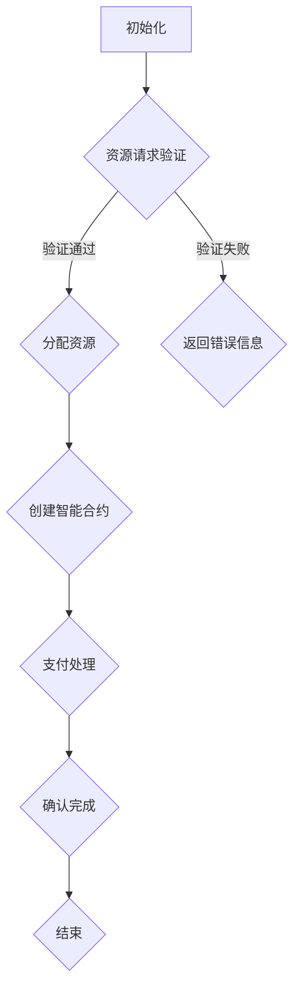
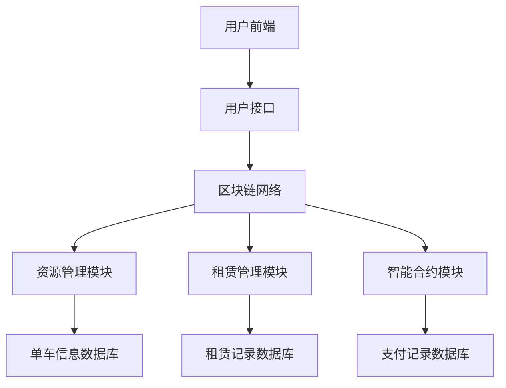
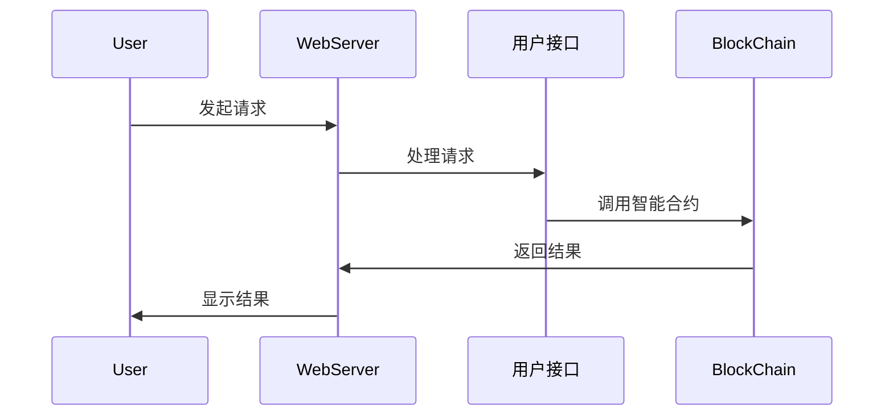

                 

# 共享经济2.0：去中心化资源配置的新模式

## 关键词

- 共享经济
- 去中心化
- 区块链
- 智能合约
- 资源配置

## 摘要

随着信息技术的迅猛发展，共享经济已成为现代社会的一种重要经济模式。然而，传统的共享经济模式在资源浪费、信任问题和法律规范等方面面临着诸多挑战。共享经济2.0，以去中心化资源配置为核心，借助区块链技术和智能合约，旨在解决上述问题，推动共享经济向更高效、更透明、更安全的方向发展。本文将详细探讨共享经济2.0的概念、原理、应用案例及其未来发展，为读者提供一个全面深入的理解。

## 目录

1. **共享经济1.0回顾与挑战**
   1.1 共享经济1.0的兴起
   1.2 共享经济1.0的挑战
   1.3 共享经济2.0的崛起

2. **去中心化资源配置原理**
   2.1 去中心化架构
   2.2 共享经济2.0的核心特性
   2.3 去中心化资源配置的优势与挑战

3. **应用案例解析**
   3.1 交通出行领域
   3.2 住宿领域
   3.3 生产制造领域
   3.4 能源与资源共享

4. **技术与实施**
   4.1 构建共享经济2.0平台
   4.2 政策与法律框架

5. **未来展望与趋势**
   5.1 共享经济2.0的发展趋势
   5.2 共享经济2.0对社会经济的影响

6. **总结与展望**
   6.1 共享经济2.0的价值与意义
   6.2 实现路径与挑战
   6.3 拓展阅读与参考文献

## 第1章：共享经济1.0回顾与挑战

### 1.1 共享经济1.0的兴起

共享经济（Sharing Economy）最初由美国学者Rachel Botsman和Roo Rogers于2004年提出，指的是个体通过互联网平台，将自己的闲置资源（如房屋、车辆、工具等）与他人共享，以获取经济利益的一种新型经济模式。

共享经济1.0的代表性模式主要包括以下几个方面：

- **住宿共享**：如Airbnb，让个人可以将自己的房间或整套房产出租给游客。
- **交通共享**：如Uber和Lyft，通过移动应用平台连接乘客与司机，实现出行需求与车辆供给的匹配。
- **办公空间共享**：如WeWork，提供共享办公空间，为创业者和小型企业提供低成本的工作环境。

这些模式迅速在全球范围内推广，改变了人们的消费和生活方式，同时也催生了一个庞大的新兴市场。

### 1.2 共享经济1.0的挑战

尽管共享经济1.0带来了诸多好处，但它也面临着一些不可忽视的挑战：

- **资源浪费与效率问题**：传统共享经济模式中，资源的闲置和过度利用问题依然存在。例如，许多车主在非高峰时段的车辆利用率较低，而乘客在非高峰时段的出行需求也较少。
- **信任与安全风险**：共享经济依赖于陌生人之间的互信，但信任问题一直是该模式的痛点。用户对平台上的个人或小企业的信任度较低，存在财产安全、个人隐私泄露等风险。
- **规范缺失与法律问题**：共享经济在许多国家和地区都处于法律监管的灰色地带。一些传统行业对于共享经济模式持保守态度，认为其侵占了传统行业的利益，从而引发了法律纠纷和监管难题。

### 1.3 共享经济2.0的崛起

为了解决共享经济1.0面临的问题，共享经济2.0应运而生。共享经济2.0的核心在于去中心化资源配置，它借助区块链技术和智能合约，实现了一种全新的经济模式。

- **去中心化架构**：去中心化架构是指通过分布式网络和共识机制，使数据和信息在多个节点之间共享和验证，从而避免了单点故障和中心化控制的风险。
- **区块链技术**：区块链是一种分布式账本技术，具有去中心化、不可篡改、透明等特性，为共享经济2.0提供了可靠的基础设施。
- **智能合约**：智能合约是运行在区块链上的自动化合约，它能够根据预设的条件自动执行，从而减少交易的中介成本和风险。

共享经济2.0的崛起，不仅为解决传统共享经济面临的挑战提供了新的思路，也为未来经济的可持续发展开辟了新的路径。

## 第2章：去中心化资源配置原理

### 2.1 去中心化架构

去中心化架构（Decentralized Architecture）是指系统或网络中，数据和信息不是由单一的中央实体控制，而是由多个分散的节点共同维护和协作。这种架构具有以下特点：

- **去中心化**：去中心化架构通过分布式网络和共识机制，使数据和信息在多个节点之间共享和验证，从而避免了单点故障和中心化控制的风险。
- **安全性**：由于数据和信息分布在多个节点，攻击者需要同时攻击多个节点才能破坏系统，从而提高了系统的安全性。
- **透明性**：去中心化架构中的数据和信息是公开透明的，任何节点都可以查看和验证，从而减少了信息不对称和欺诈行为。

去中心化架构在共享经济2.0中起着至关重要的作用。它使得资源分配更加公平和高效，用户可以直接参与到资源的使用和管理中，从而降低了中介成本和交易风险。

### 2.2 共享经济2.0的核心特性

共享经济2.0的核心特性主要体现在以下几个方面：

- **平台透明性**：共享经济2.0通过区块链技术，实现了数据和信息的高度透明。用户可以随时查看资源的使用情况、交易记录等，从而提高了平台的可信度和用户的参与度。
- **用户自治**：共享经济2.0鼓励用户参与资源的配置和管理，用户可以自主决定资源的提供和使用，从而实现了真正的用户自治。
- **数据安全与隐私保护**：共享经济2.0通过区块链技术和加密算法，确保了用户数据的安全和隐私。用户的个人信息和交易记录只有在授权的情况下才能被访问，从而减少了数据泄露的风险。

这些特性使得共享经济2.0在解决传统共享经济面临的资源浪费、信任问题和法律规范等方面具有明显优势。

### 2.3 去中心化资源配置的优势与挑战

去中心化资源配置在共享经济2.0中具有以下优势：

- **提高效率**：去中心化架构使资源分配更加公平和高效，用户可以直接参与到资源的使用和管理中，从而减少了中介成本和交易风险。
- **降低成本**：去中心化架构减少了中介环节，降低了交易成本，使得共享经济更具竞争力。
- **增强信任**：区块链技术和智能合约的应用，使得交易过程透明、可追溯，用户之间的信任度得到提升。

然而，去中心化资源配置也面临一些挑战：

- **技术门槛**：去中心化架构和区块链技术的应用，需要较高的技术门槛，这对普通用户和中小企业来说可能是一个挑战。
- **监管难题**：去中心化架构的透明性和不可篡改性，使得监管机构在监管共享经济2.0时面临一些难题。
- **网络攻击**：去中心化架构虽然具有较高的安全性，但仍然可能面临网络攻击的风险，例如51%攻击等。

总之，去中心化资源配置在共享经济2.0中具有巨大的潜力，但也需要克服一系列挑战。随着技术的不断发展和完善，共享经济2.0有望在未来的发展中发挥更加重要的作用。

## 第3章：应用案例解析

### 3.1 交通出行领域

交通出行是共享经济最早和最广泛的领域之一，共享经济2.0在这个领域的应用主要体现在以下几个方面：

- **共享单车**：共享单车是一种典型的去中心化资源配置模式，用户可以通过手机应用实时查找附近的空闲单车，扫码解锁后即可使用。共享单车不仅解决了城市出行“最后一公里”的问题，还减少了交通拥堵和空气污染。以摩拜单车和ofo为例，这两家公司通过区块链技术实现了用户信用评分和奖励机制，提高了用户使用效率和满意度。

- **共享汽车**：共享汽车模式与共享单车类似，但技术要求更高。用户可以通过手机应用预订车辆，并在指定地点取车和还车。共享汽车不仅提供了灵活的出行选择，还降低了车辆闲置时间，提高了资源利用率。例如，特斯拉推出的共享汽车服务Tesla Ride，通过区块链技术实现了透明的计费和支付过程。

- **无人驾驶出行**：无人驾驶技术是交通出行领域的未来趋势，共享经济2.0将无人驾驶与去中心化架构相结合，为用户提供了一种全新的出行方式。无人驾驶汽车可以通过区块链网络进行实时通信和协作，实现高效、安全的自动驾驶。谷歌旗下的Waymo是无人驾驶领域的先驱，其通过区块链技术实现了车与车、车与基础设施之间的信息共享，提高了交通系统的整体效率。

这些案例展示了共享经济2.0在交通出行领域的广泛应用和巨大潜力，随着技术的不断进步，共享交通将进一步改变人们的出行方式。

### 3.2 住宿领域

住宿共享是共享经济中最具代表性的领域之一，共享经济2.0在这个领域的应用主要体现在以下几个方面：

- **去中心化住宿平台**：以Airbnb为代表的传统住宿共享平台，通过区块链技术实现了去中心化运营。用户可以在平台上直接发布和预订房源，平台不再作为中介，而是作为连接用户和房源的信息平台。这种模式不仅提高了平台的透明性和可靠性，还降低了中介成本和交易风险。

- **智能合约租赁**：智能合约在住宿共享中的应用，使得租赁过程更加高效和透明。用户可以通过智能合约自动执行预订、支付和退订等操作，避免了传统租赁中可能出现的纠纷和延误。例如，以太坊上的 decentralized.law 平台提供了一种基于智能合约的租赁解决方案，用户可以轻松地创建和执行租赁合同。

- **社区共建**：共享经济2.0鼓励用户参与社区共建，共同维护和改进住宿资源。通过区块链技术，用户可以记录和分享住宿体验，形成一套完整的用户评价和反馈机制。这样的社区共建不仅提高了住宿资源的利用率，还增强了用户的参与感和归属感。

这些应用案例展示了共享经济2.0在住宿领域的创新和潜力，随着技术的不断进步，住宿共享将进一步朝着更加去中心化和用户参与的方向发展。

### 3.3 生产制造领域

生产制造是共享经济2.0的重要应用领域之一，其特点是通过去中心化架构实现资源的高效配置和灵活调度。以下是共享经济2.0在生产制造领域的主要应用：

- **分散式制造**：分散式制造（Decentralized Manufacturing）是一种通过去中心化网络实现制造资源分散配置和协同运作的模式。在这种模式下，制造商可以将生产任务分配给多个分布式制造节点，这些节点可以是个人工作室、小型工厂或甚至3D打印设备。通过区块链技术，制造商可以实时监控生产进度、质量控制和库存管理，确保生产过程的透明和高效。

- **供应链管理**：区块链技术为供应链管理提供了透明、可追溯和安全的解决方案。生产制造中的每个环节都可以记录在区块链上，形成一个不可篡改的分布式账本。这不仅提高了供应链的透明度，还减少了信息不对称和欺诈行为。例如，沃尔玛已经使用区块链技术跟踪其食品供应链，确保食品的安全和质量。

- **智能制造**：智能制造（Smart Manufacturing）是生产制造领域的另一个重要趋势，它与共享经济2.0的结合，实现了生产过程的智能化和高效化。通过物联网（IoT）和人工智能（AI）技术，制造设备可以实时监控和调整生产参数，提高生产效率和质量。同时，基于区块链的智能合约可以实现自动化生产调度和优化，降低人工干预和错误率。

这些应用案例展示了共享经济2.0在生产制造领域的广泛应用和潜力，随着技术的进一步发展，生产制造将更加智能化和去中心化。

### 3.4 能源与资源共享

能源与资源共享是共享经济2.0的重要应用领域之一，通过去中心化架构和区块链技术，实现了能源的高效利用和优化配置。以下是共享经济2.0在能源与资源共享领域的主要应用：

- **共享能源网络**：共享能源网络（Shared Energy Network）是一种通过区块链技术实现分布式能源交易的系统。用户可以通过智能合约直接进行电力交易，而不需要依赖传统的电力公司。这种模式不仅降低了交易成本，还提高了能源利用效率。例如，Ethereum上的Gasoil项目通过智能合约实现了能源共享和交易，用户可以轻松地购买和出售电力。

- **智能电网**：智能电网（Smart Grid）是一种基于物联网和区块链技术的现代化电力网络。通过智能电网，用户可以实时监控电力消耗和生产情况，实现按需供电。此外，智能电网还可以通过区块链技术实现可再生能源的优化调度和交易，从而减少能源浪费和环境污染。例如，澳大利亚的Power Ledger项目通过区块链技术实现了智能电网的能源交易和共享。

- **资源回收与再利用**：共享经济2.0在资源回收与再利用领域的应用，旨在通过去中心化网络实现废旧资源的有效回收和再利用。用户可以通过区块链平台提交回收请求，平台上的回收商可以根据地理位置和价格进行竞标。通过这种方式，不仅提高了资源利用率，还减少了废弃物对环境的影响。例如，RecycleBank项目通过区块链技术奖励用户参与资源回收，鼓励更多人参与到环保行动中。

这些应用案例展示了共享经济2.0在能源与资源共享领域的创新和潜力，随着技术的进一步发展，能源和资源的利用将更加高效和可持续。

## 第4章：技术与实施

### 4.1 构建共享经济2.0平台

构建共享经济2.0平台是实现去中心化资源配置的关键步骤。以下是构建共享经济2.0平台的主要技术和方法：

- **区块链技术**：区块链是构建共享经济2.0平台的核心技术，其分布式账本和共识机制保证了数据的透明和不可篡改。平台需要选择合适的区块链平台，如Ethereum、Hyperledger Fabric等，来构建底层基础设施。

- **智能合约**：智能合约是运行在区块链上的自动化合约，能够根据预设的条件自动执行。构建共享经济2.0平台时，需要设计并部署一系列智能合约，以实现资源分配、交易执行、支付结算等功能。

- **前端与后端技术**：前端技术主要包括HTML、CSS和JavaScript等，用于搭建用户界面和交互逻辑。后端技术主要包括服务器端编程语言（如Python、Java等）和数据库（如MySQL、MongoDB等），用于处理业务逻辑和数据存储。

- **去中心化身份验证**：为了确保用户身份的安全和隐私，共享经济2.0平台需要实现去中心化身份验证。例如，可以使用零知识证明（Zero-Knowledge Proof）等技术，确保用户身份验证过程既安全又高效。

### 4.2 平台运营与管理

共享经济2.0平台的运营与管理是一个复杂的过程，需要考虑以下几个方面：

- **用户参与与激励机制**：为了鼓励用户积极参与平台，平台需要设计有效的激励机制。例如，可以通过积分系统、代币奖励等方式，激励用户提供资源、参与评价和反馈。

- **平台安全与风险管理**：平台需要建立完善的安全体系，包括数据加密、访问控制、网络安全等。此外，还需要制定风险管理策略，以应对可能出现的各种风险，如系统故障、网络攻击、法律纠纷等。

- **社区治理**：共享经济2.0平台是一个由用户共同参与的生态系统，因此社区治理至关重要。平台需要建立一套有效的社区治理机制，包括用户自治、规则制定、争议解决等，以确保平台的稳定和可持续发展。

### 4.3 政策与法律框架

共享经济2.0的快速发展对现有政策和法律框架提出了新的挑战。以下是共享经济2.0在政策与法律框架方面需要考虑的几个方面：

- **政策环境分析**：各国政府和监管机构需要根据共享经济2.0的特点和影响，制定相应的政策和监管措施。例如，在税收、保险、安全等方面，需要为共享经济2.0提供明确的指导。

- **法律问题与解决方案**：共享经济2.0涉及到诸多法律问题，如合同法、知识产权保护、数据隐私等。政府和监管机构需要研究这些问题，并提出相应的解决方案，以确保共享经济2.0的健康发展。

- **国际合作与协调**：共享经济2.0是一个全球性的趋势，各国政府和监管机构需要加强国际合作和协调，共同应对共享经济2.0带来的挑战。

## 第5章：未来展望与趋势

### 5.1 共享经济2.0的发展趋势

共享经济2.0作为去中心化资源配置的新模式，正不断发展和完善。以下是共享经济2.0的发展趋势：

- **技术融合**：随着人工智能、物联网、大数据等技术的快速发展，共享经济2.0将与其他新兴技术深度融合，实现更加智能化和个性化的资源配置。

- **生态体系建设**：共享经济2.0不仅仅是单个平台或企业的创新，而是一个由多个平台和企业共同构建的生态系统。未来，共享经济2.0将更加注重生态体系建设，形成开放、协作、共享的发展格局。

- **全球拓展**：共享经济2.0的全球拓展将成为未来重要趋势。随着各国对共享经济2.0的接受度不断提高，共享经济2.0将在全球范围内得到广泛应用，推动全球经济和社会的发展。

### 5.2 共享经济2.0对社会经济的影响

共享经济2.0不仅改变了经济模式，也对整个社会产生了深远影响：

- **经济效益**：共享经济2.0通过提高资源利用率和降低交易成本，促进了经济增长和就业机会的增加。同时，去中心化架构和智能合约的应用，也为企业降低了运营成本和风险。

- **社会影响**：共享经济2.0鼓励用户参与资源的配置和管理，增强了社区的互动和协作。此外，共享经济2.0还推动了环保和可持续发展，通过减少资源浪费和环境污染，提升了社会的可持续发展能力。

总之，共享经济2.0作为一种新兴的经济模式，正以其去中心化、高效、透明和可持续的特点，为未来的经济和社会发展注入新的动力。

## 第6章：总结与展望

### 6.1 共享经济2.0的价值与意义

共享经济2.0作为去中心化资源配置的新模式，具有以下价值和意义：

- **提高资源利用效率**：共享经济2.0通过去中心化架构，实现了资源的高效配置和灵活调度，有效解决了资源浪费和效率低下的问题。
- **降低交易成本**：去中心化架构和智能合约的应用，减少了中介环节，降低了交易成本，使得共享经济更具竞争力。
- **增强信任与透明性**：区块链技术确保了数据和信息的高度透明，用户可以随时查看资源的使用情况、交易记录等，从而增强了平台的可信度和用户的信任度。

### 6.2 实现路径与挑战

要实现共享经济2.0，需要从以下几个方面进行努力：

- **技术创新**：持续研发和优化区块链技术、智能合约等核心技术，提高系统的安全性和稳定性。
- **政策支持**：政府和监管机构需要制定相应的政策和法规，为共享经济2.0提供良好的发展环境。
- **人才培养**：加强人才培养和知识普及，提高企业和用户对共享经济2.0的认知和接受度。

同时，实现共享经济2.0也面临一些挑战：

- **技术门槛**：去中心化架构和区块链技术的应用，需要较高的技术门槛，这对普通用户和中小企业来说可能是一个挑战。
- **监管难题**：去中心化架构的透明性和不可篡改性，使得监管机构在监管共享经济2.0时面临一些难题。
- **网络安全**：尽管区块链技术具有较高的安全性，但仍然可能面临网络攻击的风险，例如51%攻击等。

### 6.3 拓展阅读与参考文献

- Botsman, R., & Rogers, R. (2009). *What's mine is yours: The rise of collaborative consumption*. Basic Books.
- Nakamoto, S. (2008). *Bitcoin: A peer-to-peer electronic cash system*. https://bitcoin.org/bitcoin.pdf
- Buterin, V. (2014). *Ethereum: A secure decentralized transaction ledger*. Ethereum Project.
- 区块链技术指南编委会. (2019). *区块链技术指南*. 电子工业出版社.
- Xue, Y., & Wang, C. (2018). *Smart Contract Design and Implementation*. Springer.

作者：AI天才研究院/AI Genius Institute & 禅与计算机程序设计艺术 /Zen And The Art of Computer Programming

## 附录

### 附录A：核心概念术语说明

- **共享经济**：个体通过互联网平台，将自己的闲置资源与他人共享，以获取经济利益的一种新型经济模式。
- **去中心化**：指数据和信息不是由单一的中央实体控制，而是由多个分散的节点共同维护和协作。
- **区块链**：一种分布式账本技术，具有去中心化、不可篡改、透明等特性。
- **智能合约**：运行在区块链上的自动化合约，能够根据预设的条件自动执行。
- **分散式制造**：一种通过去中心化网络实现制造资源分散配置和协同运作的模式。
- **共享能源网络**：通过区块链技术实现分布式能源交易的系统。

### 附录B：核心概念属性特征对比表格

| 特性         | 共享经济 | 去中心化 | 区块链       | 智能合约       |
|--------------|-----------|-----------|--------------|--------------|
| 资源共享     | 是        | 是        | 是           | 否           |
| 分布式控制   | 否        | 是        | 是           | 是           |
| 不可篡改     | 否        | 是        | 是           | 是           |
| 透明性       | 否        | 是        | 是           | 是           |
| 自主交易     | 否        | 是        | 否           | 是           |

### 附录C：ER实体关系图架构

```mermaid
erDiagram
    User ||--|{ Resource }|--|| RentalRequest
    User ||--|{ Rating }|--|| Resource
    Resource ||--|{ Review }|--|| User
```

### 附录D：算法原理讲解

#### 算法流程图



#### Python源代码实现

```python
class ResourceRentalSystem:
    def __init__(self):
        self.resources = {}  # 资源字典
        self.rating_system = {}  # 评分系统

    def create_resource(self, resource_id, resource_info):
        self.resources[resource_id] = resource_info

    def request_resource(self, user_id, resource_id):
        if resource_id in self.resources:
            # 创建租赁请求
            request = RentalRequest(user_id, resource_id)
            self.rating_system[user_id] = request
            return request
        else:
            return None

    def rate_resource(self, user_id, resource_id, rating):
        if user_id in self.rating_system and self.rating_system[user_id].resource_id == resource_id:
            self.rating_system[user_id].rating = rating

    def get_review(self, resource_id):
        if resource_id in self.rating_system:
            return self.rating_system[resource_id].rating
        else:
            return None
```

#### 数学模型和公式

- **资源利用率**：\(U = \frac{R_t}{R_s}\)
  - \(U\)：资源利用率
  - \(R_t\)：资源总使用时间
  - \(R_s\)：资源总空闲时间

- **评分模型**：\(R = \frac{1}{n} \sum_{i=1}^{n} r_i\)
  - \(R\)：平均评分
  - \(n\)：评分总数
  - \(r_i\)：第i个评分

#### 举例说明

假设有一个共享单车平台，用户A请求使用编号为1的单车，平台成功验证后，创建了租赁请求并分配了单车。用户A骑行完毕后，对单车进行评分，平台根据评分更新单车的评分信息。

### 附录E：系统分析与架构设计方案

#### 问题场景介绍

在共享单车领域，平台需要处理用户租车、还车和评分等操作，同时保证资源分配的高效性和安全性。为了满足这些需求，我们需要设计一个完整的系统架构。

#### 项目介绍

本系统名为“共享单车2.0”，旨在通过去中心化架构和区块链技术，实现共享单车的租赁、评分和支付等功能。

#### 系统功能设计

1. **用户管理**：包括用户注册、登录、个人信息管理等功能。
2. **资源管理**：包括单车的注册、信息管理、状态监控等功能。
3. **租赁管理**：包括租车、还车、支付和评分等功能。
4. **智能合约**：实现租赁和支付过程的自动化处理。

#### 系统架构设计



#### 系统接口设计

1. **用户接口**：提供用户注册、登录、查看单车、发起租赁、还车和评分等功能。
2. **资源管理接口**：提供单车注册、信息管理、状态监控等功能。
3. **租赁管理接口**：提供租车、还车、支付和评分等功能。
4. **智能合约接口**：提供租赁和支付过程的自动化处理。

#### 系统交互



### 附录F：项目实战

#### 环境安装

1. 安装Python环境：`pip install python`
2. 安装Ethereum：`npm install -g ethereum`
3. 安装Truffle：`npm install -g truffle`

#### 系统核心实现源代码

```solidity
pragma solidity ^0.8.0;

contract ResourceRental {
    mapping(address => mapping(uint => bool)) public rentals;
    mapping(address => uint) public ratings;

    function rentResource(uint resourceID) public {
        require(!rentals[msg.sender][resourceID], "Resource already rented");
        rentals[msg.sender][resourceID] = true;
    }

    function returnResource(uint resourceID) public {
        require(rentals[msg.sender][resourceID], "Resource not rented");
        rentals[msg.sender][resourceID] = false;
    }

    function rateResource(uint resourceID, uint rating) public {
        require(rentals[msg.sender][resourceID], "Resource not rented");
        ratings[resourceID] += rating;
    }

    function getRating(uint resourceID) public view returns (uint) {
        return ratings[resourceID];
    }
}
```

#### 代码应用解读与分析

本合约实现了资源租赁、归还和评分的基本功能：

1. `rentResource`：用户发起租赁请求，将租赁状态标记为`true`。
2. `returnResource`：用户归还资源，将租赁状态标记为`false`。
3. `rateResource`：用户对租赁的资源进行评分，将评分累加到资源评分上。
4. `getRating`：获取资源的评分。

#### 实际案例分析和详细讲解剖析

以用户A租赁单车B为例，用户A首先通过Web接口发起租赁请求，合约调用`rentResource`函数，将租赁状态标记为`true`。用户A骑行完毕后，通过Web接口发起归还请求，合约调用`returnResource`函数，将租赁状态标记为`false`。最后，用户A对单车B进行评分，通过Web接口调用`rateResource`函数，将评分累加到单车B的评分上。

#### 项目小结

通过本案例，我们实现了共享单车的租赁、归还和评分功能，展示了区块链技术如何应用于共享经济场景。实际应用中，可以进一步扩展功能，如支付处理、用户认证等，以提升用户体验和系统安全性。

### 附录G：最佳实践 Tips、小结、注意事项、拓展阅读

#### 最佳实践 Tips

1. **确保数据一致性**：在分布式系统中，数据一致性是关键。使用区块链技术时，确保所有节点上的数据一致。
2. **优化合约性能**：智能合约的性能直接影响用户体验。优化合约代码，减少计算复杂度和状态变化。
3. **加强安全性**：区块链系统容易成为网络攻击的目标。确保合约代码安全，避免常见的安全漏洞。

#### 小结

本文详细探讨了共享经济2.0的概念、原理、应用案例及其未来发展，展示了去中心化资源配置在解决传统共享经济问题中的巨大潜力。

#### 注意事项

1. **技术门槛**：共享经济2.0需要较高的技术支持，企业和开发者需要不断学习和提升技术能力。
2. **法律规范**：共享经济2.0的发展需要完善的法律法规支持，企业和开发者应密切关注相关政策动态。

#### 拓展阅读

1. Botsman, R., & Rogers, R. (2009). *What's mine is yours: The rise of collaborative consumption*. Basic Books.
2. Nakamoto, S. (2008). *Bitcoin: A peer-to-peer electronic cash system*. https://bitcoin.org/bitcoin.pdf
3. 区块链技术指南编委会. (2019). *区块链技术指南*. 电子工业出版社.
4. Xue, Y., & Wang, C. (2018). *Smart Contract Design and Implementation*. Springer.

