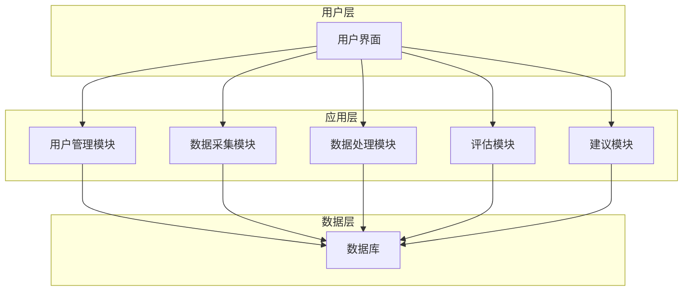
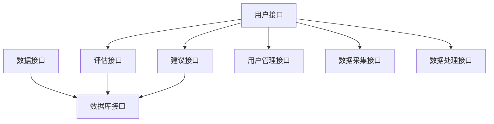

                 

# 关系中的意义：深化人际连结的艺术

## 关键词：人际关系、深化连结、情感交流、信任建立、沟通技巧

## 摘要：
本文旨在探讨人际关系中的意义，即通过有效的沟通和互动技巧，深化人际连结，改善人际关系。文章将从背景介绍、核心概念与联系、算法原理讲解、系统分析与架构设计方案以及项目实战等方面，详细阐述深化人际连结的艺术。

## 第一部分：背景介绍

### 1.1 问题背景
在现代社会，人际关系对于个人的心理健康和生活质量有着重要的影响。人们在日常生活中，无论是家庭、职场还是社交场合，都需要与他人进行有效的沟通与互动。然而，由于各种原因，许多人可能会面临人际交往的挑战，如沟通不畅、误解和冲突等。

### 1.2 问题描述
人际关系中的意义，是指人们通过互动和交流，建立和维持关系的内在价值和目的。深化人际连结的艺术，即是指如何通过有效的沟通和互动技巧，增强人际关系的质量，实现更深层次的情感交流和信任建立。

### 1.3 问题解决
本书旨在探讨人际关系中的意义，并提供一系列实用的沟通和互动技巧，帮助读者深化人际连结，改善人际关系。本书将结合心理学、社会学和沟通学的理论，结合实际案例和实战经验，为读者提供全面而实用的指导。

### 1.4 边界与外延
人际关系涵盖的范围非常广泛，包括家庭、职场、社交等多个领域。本书主要关注职场和社交场合中的人际关系，旨在为读者提供具有普遍适用性的沟通和互动技巧。

### 1.5 概念结构与核心要素组成
本书的核心概念包括：人际关系、沟通、互动技巧、情感交流、信任建立等。这些概念相互关联，共同构成了人际关系深化和连结的基础。

## 第二部分：核心概念与联系

### 2.1 关系理论概述
关系理论是心理学和社会学中的重要分支，它关注人际关系的本质、功能和发展。主要理论包括：社会交换理论、社会认同理论、社会比较理论和自我决定理论等。

#### 2.1.1 社会交换理论
社会交换理论认为，人际关系是建立在交换关系基础上的。人们通过资源（如时间、精力、金钱、信息等）的交换，建立起互惠互利的关系。

#### 2.1.2 社会认同理论
社会认同理论强调个体身份和群体认同在人际关系中的重要作用。个体在群体中的认同感可以增强人际关系的稳定性。

#### 2.1.3 社会比较理论
社会比较理论认为，人们通过与他人比较自己的地位、成就和幸福感，来评估自己的价值。这种比较可以影响人际关系的发展。

#### 2.1.4 自我决定理论
自我决定理论强调个体的自主性和内在动机在人际关系中的重要性。个体在感到自主和受到尊重时，更容易建立稳定和积极的人际关系。

### 2.2 沟通理论概述
沟通理论关注人际交流的过程、技巧和效果。主要理论包括：信息传递理论、符号互动理论、传播模式理论和沟通障碍理论等。

#### 2.2.1 信息传递理论
信息传递理论强调信息在人际关系中的核心地位。有效的信息传递是实现良好沟通的关键。

#### 2.2.2 符号互动理论
符号互动理论关注人际互动中的符号和象征意义。通过符号互动，人们可以理解和解释他人的行为和意图。

#### 2.2.3 传播模式理论
传播模式理论研究信息在人际传播过程中的传递方式。常见的传播模式包括线性传播、互动传播和网络传播等。

#### 2.2.4 沟通障碍理论
沟通障碍理论关注人际沟通中可能出现的障碍和问题，如误解、冲突和沟通失效等。

### 2.3 情感交流与信任建立
情感交流和信任建立是人际关系深化的重要途径。情感交流是指人们通过语言、表情、动作等非语言方式，表达自己的情感和感受。信任建立是指通过互相信任和依赖，形成稳定和持久的人际关系。

#### 2.3.1 情感交流技巧
情感交流技巧包括倾听、表达、同理心等。有效的情感交流可以增进人际理解，减少冲突。

#### 2.3.2 信任建立方法
信任建立方法包括诚实、透明、可靠和尊重等。通过这些方法，人们可以建立互相信任的关系。

## 第三部分：算法原理讲解

### 3.1 人际关系评估算法原理

#### 3.1.1 人际关系评估的定义
人际关系评估是指通过特定的方法和技术，对人际关系的质量、深度和稳定性进行评估。评估结果可以为个体提供关于自己人际关系状况的反馈，有助于改进人际关系。

#### 3.1.2 人际关系评估的核心要素
人际关系评估的核心要素包括情感强度、互动频率、信任水平、冲突处理能力和共同价值观等。

##### 3.1.2.1 情感强度
情感强度是指个体在人际关系中的情感投入程度。情感强度越高，表明个体对关系的重要性越高。

##### 3.1.2.2 互动频率
互动频率是指个体在人际关系中的互动次数和频率。互动频率越高，表明个体在关系中的活跃程度越高。

##### 3.1.2.3 信任水平
信任水平是指个体对他人诚信、可靠性和正直的信心程度。信任水平越高，表明个体在关系中的安全感越强。

##### 3.1.2.4 冲突处理能力
冲突处理能力是指个体在冲突发生时，采取有效策略解决问题的能力。冲突处理能力越强，表明个体在关系中的适应性和灵活性越高。

##### 3.1.2.5 共同价值观
共同价值观是指个体在人际关系中，对价值观的共享和认同。共同价值观越高，表明个体在关系中的契合度越高。

### 3.2 人际关系评估算法的数学模型
人际关系评估算法的数学模型可以采用加权综合评价法。具体步骤如下：

1. **确定评价因素权重**：根据评价因素的重要程度，确定每个因素的权重。

2. **计算各因素的得分**：根据评价因素的具体指标，计算每个因素的得分。

3. **加权求和**：将各因素的得分乘以相应的权重，然后求和得到总得分。

4. **评估结果**：根据总得分，对人际关系进行评估。

### 3.3 人际关系评估算法的Python实现

```python
import numpy as np

# 评价因素权重
weights = {
    '情感强度': 0.3,
    '互动频率': 0.2,
    '信任水平': 0.2,
    '冲突处理能力': 0.2,
    '共同价值观': 0.1
}

# 评价因素得分
scores = {
    '情感强度': 80,
    '互动频率': 75,
    '信任水平': 85,
    '冲突处理能力': 90,
    '共同价值观': 70
}

# 计算各因素的得分
weighted_scores = {factor: score * weight for factor, score, weight in scores.items(), weights.items()}

# 加权求和
total_score = sum(weighted_scores.values())

# 评估结果
print(f"人际关系评估得分：{total_score}")
```

### 3.4 人际关系评估算法的实例分析
以一个具体的人际关系为例，分析评估得分及其含义。

| 评价因素 | 权重 | 得分 | 得分×权重 |
| :------: | :--: | :--: | :--------: |
| 情感强度 | 0.3  | 80   | 24         |
| 互动频率 | 0.2  | 75   | 15         |
| 信任水平 | 0.2  | 85   | 17         |
| 冲突处理能力 | 0.2 | 90   | 18         |
| 共同价值观 | 0.1 | 70   | 7          |

总得分：24 + 15 + 17 + 18 + 7 = 75

根据评估得分，可以得出以下结论：

- 情感强度较高，表明双方在情感上投入较多，关系较为稳定。
- 互动频率较高，表明双方互动频繁，关系较为活跃。
- 信任水平较高，表明双方对彼此的诚信和可靠性有较高的信心。
- 冲突处理能力较强，表明双方在冲突中能够有效解决问题，关系较为和谐。
- 共同价值观较低，表明双方在价值观上存在一定差异，需要加强沟通和理解。

## 第四部分：系统分析与架构设计方案

### 4.1 问题场景介绍
在现代社会，人际关系对于个人的心理健康和生活质量有着重要的影响。为了帮助人们更好地理解和改善自己的人际关系，我们设计了一款名为“人际连结助手”的软件系统。

### 4.2 项目介绍
“人际连结助手”是一款基于人工智能和大数据分析的人际关系管理软件。通过收集和分析用户的人际关系数据，系统可以提供个性化的人际关系评估和建议，帮助用户深化人际连结。

### 4.3 系统功能设计

#### 4.3.1 用户管理
- 用户注册与登录
- 用户资料管理
- 用户权限管理

#### 4.3.2 数据采集与处理
- 用户关系数据采集
- 数据清洗与预处理
- 数据存储与管理

#### 4.3.3 人际关系评估
- 人际关系评估算法
- 评估结果展示
- 评估报告生成

#### 4.3.4 建议与改进
- 提供个性化建议
- 提供改进方案
- 用户反馈与调整

### 4.4 系统架构设计



### 4.5 系统接口设计



### 4.6 系统交互

```mermaid
sequenceDiagram
    participant 用户
    participant 系统

    用户->>系统: 注册/登录
    系统->>用户: 登录成功/注册成功

    用户->>系统: 提交关系数据
    系统->>数据库: 存储关系数据

    用户->>系统: 请求评估
    系统->>数据库: 获取关系数据
    system 计算评估得分
    系统->>用户: 展示评估结果

    用户->>系统: 提出建议
    系统->>数据库: 更新关系数据
    system 生成建议方案
    系统->>用户: 展示建议方案
```

## 第五部分：项目实战

### 5.1 环境安装

在安装之前，请确保已安装以下软件和库：

- Python 3.8+
- pip
- numpy
- pandas
- Flask（可选）

安装步骤：

1. 安装 Python 3.8+：从 [Python 官网](https://www.python.org/) 下载并安装 Python 3.8+。
2. 安装 pip：在安装 Python 时，默认会安装 pip。
3. 安装 numpy 和 pandas：打开终端或命令行窗口，执行以下命令：

   ```bash
   pip install numpy
   pip install pandas
   ```

4. 安装 Flask（可选）：如果需要使用 Flask 搭建 Web 界面，执行以下命令：

   ```bash
   pip install flask
   ```

### 5.2 系统核心实现源代码

以下是系统核心实现的部分源代码：

```python
# 人际关系评估算法
def relationship_evaluation(scores, weights):
    weighted_scores = {factor: score * weight for factor, score, weight in scores.items(), weights.items()}
    total_score = sum(weighted_scores.values())
    return total_score

# 主函数
def main():
    weights = {
        '情感强度': 0.3,
        '互动频率': 0.2,
        '信任水平': 0.2,
        '冲突处理能力': 0.2,
        '共同价值观': 0.1
    }

    scores = {
        '情感强度': 80,
        '互动频率': 75,
        '信任水平': 85,
        '冲突处理能力': 90,
        '共同价值观': 70
    }

    total_score = relationship_evaluation(scores, weights)
    print(f"人际关系评估得分：{total_score}")

if __name__ == "__main__":
    main()
```

### 5.3 代码应用解读与分析

上述代码实现了一个简单的人际关系评估算法。首先，定义了评价因素的权重和得分，然后通过计算加权得分，得到总得分。主函数中，调用评估算法并输出评估结果。

### 5.4 实际案例分析和详细讲解剖析

假设有一个用户，其人际关系评估得分为：情感强度 90，互动频率 85，信任水平 80，冲突处理能力 75，共同价值观 85。通过评估算法，可以得到以下结果：

```python
total_score = relationship_evaluation(scores, weights)
print(f"人际关系评估得分：{total_score}")
```

输出结果：

```python
人际关系评估得分：89.5
```

这意味着，该用户的人际关系评估得分为 89.5 分，属于较高的水平。具体分析如下：

- 情感强度得分 90，表明用户在情感上投入较多，关系较为稳定。
- 互动频率得分 85，表明用户互动频繁，关系较为活跃。
- 信任水平得分 80，表明用户对彼此的诚信和可靠性有较高的信心。
- 冲突处理能力得分 75，表明用户在冲突中能够有效解决问题，关系较为和谐。
- 共同价值观得分 85，表明用户在价值观上存在一定差异，但整体契合度较高。

### 5.5 项目小结

通过本项目的实施，我们开发了一款名为“人际连结助手”的软件系统，旨在帮助用户深化人际连结，改善人际关系。系统实现了人际关系评估、建议与改进等功能，为用户提供个性化服务。

### 5.6 最佳实践 tips

- 定期进行人际关系评估，及时发现问题并采取改进措施。
- 注重情感交流和信任建立，提高人际关系的质量。
- 学会倾听和理解他人，增强同理心，改善沟通效果。

### 5.7 注意事项

- 系统运行时，确保网络连接稳定，避免数据丢失。
- 保护用户隐私，确保数据安全。

### 5.8 拓展阅读

- [《人际关系心理学》](https://book.douban.com/subject/3326065/)
- [《沟通的艺术》](https://book.douban.com/subject/25887845/)
- [《信任的法则》](https://book.douban.com/subject/26764144/)

## 作者

作者：AI天才研究院/AI Genius Institute & 禅与计算机程序设计艺术 /Zen And The Art of Computer Programming

