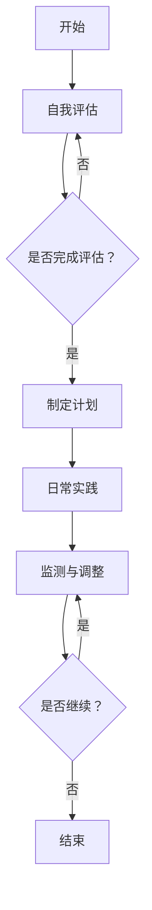
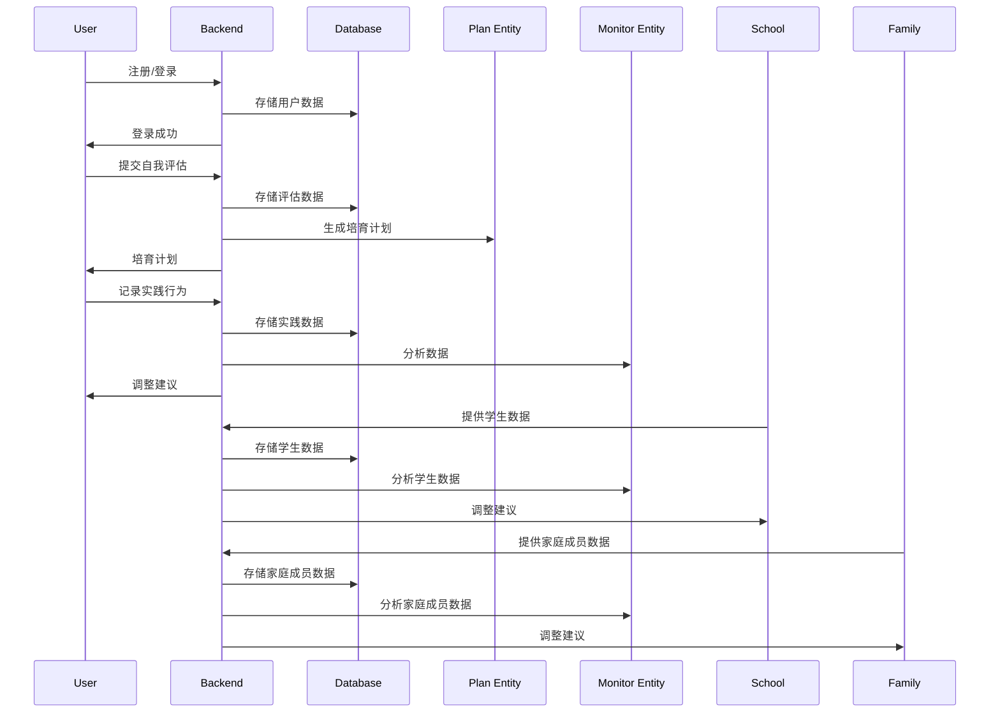
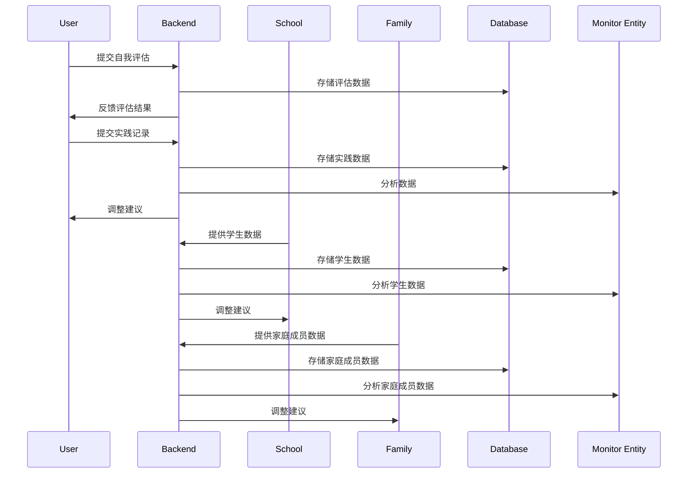

                 


### 1.1.1 现代社会中的心理压力问题

在当今社会，人们面临着前所未有的快节奏生活和工作压力。随着竞争的加剧和社会的不断发展，越来越多的人感到心理压力。这种压力不仅来源于工作，还包括家庭、社交以及经济等多个方面。以下是一些主要的原因和现象：

**工作压力**：现代职场竞争激烈，许多人为了升职加薪不得不加班加点，承受巨大的工作压力。长期的过度劳累可能导致精神疲惫、焦虑甚至抑郁。

**家庭压力**：家庭是每个人生活的避风港，但同时也带来了很多压力。例如，抚养孩子、照顾老人等都需要投入大量的时间和精力，同时还要处理夫妻关系和亲子关系等问题。

**社交压力**：社交网络和社交媒体的普及，让人们更加关注自己的形象和社交地位。很多人为了在社交圈中保持良好的人际关系，不得不隐藏自己的真实感受，长时间的压力积累可能会导致心理健康问题。

**经济压力**：随着生活成本的不断上升，很多人为了维持生活水平不得不承担更多的经济压力。房贷、车贷、子女教育费用等都是重要的经济负担，这些压力可能导致人们产生焦虑和抑郁情绪。

面对这些心理压力，许多人会选择通过喝酒、吸烟、过度消费等消极方式来缓解，但这些方式往往只是暂时的，长期下去可能会加重心理问题。

**问题解决**：为了应对这些心理压力，人们需要寻找有效的解决方案。培育心灵花园的方法提供了一种积极、健康的应对方式。通过培养自我关怀、提升心理韧性，人们可以更好地调节心态，提高生活质量。

**边界与外延**：心灵花园的方法并不仅限于个人层面，它同样适用于家庭和学校等场景。在家庭中，家庭成员可以通过共同参与心灵花园的培育，增强亲子关系和家庭凝聚力。在学校中，教师和学生可以通过这种方式提升心理健康，创造一个积极、和谐的学习环境。

在接下来的章节中，我们将详细探讨心灵花园的概念、核心概念与联系，以及具体的培育方法，帮助读者更好地理解并实践这一方法，从而在日常生活中获得心理上的安宁与满足。

### 1.2 核心概念与联系

在探讨心灵花园的培育方法之前，我们首先需要理解几个核心概念：心灵花园、自我关怀和心理韧性。这些概念不仅是理解心灵花园培育方法的关键，也是解决心理压力的重要工具。

#### 1.2.1 心灵花园的概念与特征

**心灵花园**是一个比喻，它指的是一种心理状态和生活方式。心灵花园不仅是一个充满花草树木的宁静角落，更是一种心灵的修养和自我疗愈的过程。以下是心灵花园的几个关键特征：

1. **宁静与放松**：心灵花园提供了一个宁静的空间，让人们可以从日常喧嚣和压力中暂时逃离，获得内心的平静和放松。
2. **自我反思**：在心灵花园中，个体可以进行深入的自我反思，了解自己的情绪、需求和价值观，从而更好地理解自己。
3. **自我关怀**：心灵花园鼓励个体培养自我关怀的习惯，关注自己的身心健康，而不是仅仅追求外在的成功和认可。
4. **创造性表达**：通过种植植物、绘画、写作等方式，个体可以在心灵花园中找到创造性表达的途径，释放内心的情感和压力。

#### 1.2.2 自我关怀的概念与培养

**自我关怀**是一种对自己内心需求的关注和满足，它包括以下几个方面：

1. **情感照顾**：自我关怀意味着要对自己的情感需求有所察觉，并在适当的时候给予自己情感的支持和安慰。
2. **身体健康**：自我关怀也包括关注自己的身体健康，保持适度的运动、健康饮食和良好的作息习惯。
3. **心灵修养**：通过冥想、冥想等方式，个体可以提升自己的心灵修养，增强心理韧性。
4. **时间管理**：合理规划时间，给自己留出足够的休息和放松时间，避免过度劳累。

#### 1.2.3 心理韧性的概念与提升

**心理韧性**是指个体在面对压力、困难和挑战时，能够保持积极态度和适应能力的能力。提升心理韧性有助于个体更好地应对生活中的各种挑战。以下是提升心理韧性的几个方法：

1. **积极思维**：培养积极的思维方式，看到困难背后的机会，保持乐观的心态。
2. **情绪管理**：学会管理自己的情绪，避免情绪的过度波动，保持情绪的稳定。
3. **适应性**：培养适应性，面对变化和挑战时，能够灵活调整自己的策略和行为。
4. **求助与合作**：在遇到困难时，积极寻求帮助，与他人合作，共同解决问题。

#### 概念属性特征对比表格

为了更清晰地理解这些核心概念，我们可以通过一个表格来对比它们的主要特征：

| 概念       | 特征                                       |
|------------|------------------------------------------|
| 心灵花园   | 宁静、自我反思、自我关怀、创造性表达                   |
| 自我关怀   | 情感照顾、身体健康、心灵修养、时间管理                   |
| 心理韧性   | 积极思维、情绪管理、适应性、求助与合作                   |

#### ER实体关系图架构

在心灵花园的培育过程中，个体、家庭和学校是三个重要的实体。下面是一个简化的ER实体关系图，展示了这三个实体之间的联系：

```mermaid
erDiagram
  Individual  ||--|{ Family : member }
  Individual  ||--|{ School : student }
  Family      ||--|{ School : parent }
  School      ||--|{ Teacher }
```

- **Individual（个体）**：个体是心灵花园培育的核心，他/她通过自我关怀和心理韧性提升来培育心灵花园。
- **Family（家庭）**：家庭是心灵花园培育的重要环境，家庭成员通过共同参与心灵花园的培育，增强家庭凝聚力和幸福感。
- **School（学校）**：学校作为教育机构，可以通过培养学生心理韧性，帮助他们在学业和生活中更好地应对压力。

通过理解这些核心概念和它们之间的联系，我们可以更好地把握心灵花园的培育方法，从而在日常生活中实践这些理念，提升自己的心理健康。

### 2.1 算法原理讲解

心灵花园的培育方法可以被视为一种系统化的心理保健过程，它结合了心理学、行为科学和哲学的元素。为了更好地理解这个方法，我们可以将其分解为一系列的步骤，并通过mermaid流程图和Python代码来阐述。

#### 2.1.1 心灵花园培育方法概述

心灵花园的培育方法主要包括以下几个关键步骤：

1. **自我评估**：了解自己的情绪状态、心理需求和价值观。
2. **制定计划**：根据自我评估的结果，制定一个适合自己的心灵花园培育计划。
3. **日常实践**：将心灵花园的培育融入到日常生活中，如冥想、呼吸练习、创造性表达等。
4. **监测与调整**：定期监测自己的心理健康状态，并根据需要进行调整。

#### 2.1.1.1 流程图

下面是一个简化的心灵花园培育方法流程图：



#### 2.1.1.2 Python 源代码阐述

为了具体说明这些步骤，我们可以使用Python代码来实现一个简单的心灵花园培育系统。以下是一个基础的实现示例：

```python
class SelfAssessment:
    def __init__(self):
        self.mood = None
        self.need = None
        self.value = None

    def get_data(self):
        self.mood = input("请描述你的当前情绪：")
        self.need = input("你的当前心理需求是什么？")
        self.value = input("你的价值观是什么？")

    def display_data(self):
        print(f"情绪：{self.mood}")
        print(f"心理需求：{self.need}")
        print(f"价值观：{self.value}")


class GardenPlan:
    def __init__(self):
        self.plan = None

    def create_plan(self, mood, need, value):
        self.plan = f"基于情绪：{mood}，心理需求：{need}，价值观：{value}，我计划..."
        print(self.plan)

    def display_plan(self):
        print(self.plan)


class GardenPractice:
    def __init__(self):
        self.practice = None

    def daily_practice(self):
        self.practice = input("今天你将如何实践心灵花园的培育？")
        print(f"今日实践：{self.practice}")

    def display_practice(self):
        print(self.practice)


class MonitorAdjustment:
    def __init__(self):
        self.status = None

    def monitor_status(self):
        self.status = input("请描述你的当前心理健康状态：")
        print(f"当前状态：{self.status}")

    def adjust_plan(self, status):
        if "焦虑" in status or "抑郁" in status:
            print("需要调整计划，增加放松和自我关怀的实践。")
        else:
            print("当前状态良好，继续当前计划。")


def main():
    assessment = SelfAssessment()
    assessment.get_data()
    assessment.display_data()

    plan = GardenPlan()
    plan.create_plan(assessment.mood, assessment.need, assessment.value)
    plan.display_plan()

    practice = GardenPractice()
    practice.daily_practice()
    practice.display_practice()

    monitor = MonitorAdjustment()
    monitor.monitor_status()
    monitor.adjust_plan(monitor.status())


if __name__ == "__main__":
    main()
```

在这个代码示例中，我们定义了四个类：`SelfAssessment`、`GardenPlan`、`GardenPractice`和`MonitorAdjustment`，分别代表自我评估、制定计划、日常实践和监测调整。每个类都有相应的函数来执行其功能，并通过交互式的命令行输入和输出，实现了一个简单的用户交互过程。

#### 2.1.2 算法原理的数学模型

心灵花园的培育方法虽然主要依赖于经验和实践，但也可以通过一些数学模型来量化其效果。以下是一个简化的数学模型，用于描述心理韧性的提升过程。

**心理韧性模型**：

$$
R = f(M, N, V)
$$

其中，$R$ 表示心理韧性，$M$ 表示情绪状态，$N$ 表示心理需求，$V$ 表示价值观。函数$f$用来描述情绪状态、心理需求和价值观对心理韧性的影响。

- **情绪状态**（$M$）：情绪状态可以是一个介于0到1之间的数值，反映了个体当前的情绪状态。值越大，表示情绪越积极。
- **心理需求**（$N$）：心理需求是一个介于0到1之间的数值，反映了个体当前的心理需求满足程度。值越大，表示心理需求越满足。
- **价值观**（$V$）：价值观是一个介于0到1之间的数值，反映了个体价值观的实现程度。值越大，表示价值观越实现。

函数$f$可以定义为：

$$
f(M, N, V) = M \cdot N \cdot V
$$

这个模型的基本思想是：心理韧性是情绪状态、心理需求和价值观三者相互作用的结果。通过提升这三个因素中的任何一个，都可以提高个体的心理韧性。

#### 2.1.2.3 举例说明

假设一个个体在自我评估中得到了以下数据：

- 情绪状态（$M$）：0.8（情绪非常积极）
- 心理需求（$N$）：0.7（心理需求大部分得到满足）
- 价值观（$V$）：0.9（价值观大部分实现）

根据心理韧性模型，可以计算其心理韧性（$R$）：

$$
R = f(0.8, 0.7, 0.9) = 0.8 \cdot 0.7 \cdot 0.9 = 0.504
$$

这个结果表明，该个体的心理韧性得分为0.504，属于较高水平。为了进一步提升心理韧性，可以考虑以下几个方面：

1. **情绪状态提升**：通过冥想、瑜伽等方式，进一步增强情绪的积极状态。
2. **心理需求满足**：通过合理安排工作和生活，确保心理需求得到更好的满足。
3. **价值观实现**：通过职业规划、个人成长等方式，实现更多的价值观。

通过这样的分析和调整，个体可以不断提升自己的心理韧性，从而更好地应对生活中的各种挑战。

### 2.2 数学模型和数学公式 & 详细讲解 & 举例说明

在前面章节中，我们引入了一个简化的心理韧性模型，用于描述情绪状态、心理需求和价值观对个体心理韧性的影响。为了更深入地理解这个模型，我们将使用LaTeX格式给出具体的数学公式，并进行详细的讲解和举例说明。

#### 2.2.1 心理韧性的数学模型

我们之前提到的心理韧性模型为：

$$
R = f(M, N, V)
$$

其中，$R$ 表示心理韧性，$M$ 表示情绪状态，$N$ 表示心理需求，$V$ 表示价值观。函数$f$用来描述这三者之间的相互作用关系。

首先，我们定义情绪状态、心理需求和价值观的取值范围：

$$
0 \leq M \leq 1, \quad 0 \leq N \leq 1, \quad 0 \leq V \leq 1
$$

这意味着，情绪状态、心理需求和价值观的取值都在0到1之间，1代表最高水平，0代表最低水平。

接下来，我们定义函数$f$为乘积函数，其数学表达式为：

$$
f(M, N, V) = M \cdot N \cdot V
$$

这个函数的基本思想是：心理韧性是情绪状态、心理需求和价值观三者相互作用的结果。每个因素对心理韧性的影响都是正相关的，即某个因素的值越高，心理韧性也会相应提高。

#### 2.2.1.2 模型解释

为了更好地理解这个模型，我们可以通过几个具体的例子来解释。

**例子1**：假设一个个体在自我评估中得到了以下数据：

- 情绪状态（$M$）：0.6
- 心理需求（$N$）：0.5
- 价值观（$V$）：0.4

我们可以计算其心理韧性（$R$）：

$$
R = M \cdot N \cdot V = 0.6 \cdot 0.5 \cdot 0.4 = 0.12
$$

这个结果表明，该个体的心理韧性得分为0.12，属于较低水平。这意味着，这个个体在情绪状态、心理需求和价值观方面都有提升的空间。

**例子2**：假设另一个个体在自我评估中得到了以下数据：

- 情绪状态（$M$）：0.8
- 心理需求（$N$）：0.7
- 价值观（$V$）：0.9

我们可以计算其心理韧性（$R$）：

$$
R = M \cdot N \cdot V = 0.8 \cdot 0.7 \cdot 0.9 = 0.504
$$

这个结果表明，该个体的心理韧性得分为0.504，属于较高水平。这意味着，这个个体在情绪状态、心理需求和价值观方面都表现得相当好。

#### 2.2.1.3 应用实例

为了更具体地展示如何使用这个模型，我们可以通过一个实际案例来分析。

**案例**：小明是一名公司职员，他感到最近的工作压力非常大，经常感到焦虑和疲惫。为了提升自己的心理韧性，他决定通过心灵花园的培育方法来调整自己的状态。

首先，小明进行了自我评估，得到了以下数据：

- 情绪状态（$M$）：0.4（非常消极）
- 心理需求（$N$）：0.5（部分满足）
- 价值观（$V$）：0.6（部分实现）

根据心理韧性模型，我们可以计算小明的当前心理韧性（$R$）：

$$
R = M \cdot N \cdot V = 0.4 \cdot 0.5 \cdot 0.6 = 0.12
$$

这个结果表明，小明的心理韧性得分为0.12，属于较低水平。为了提升心理韧性，小明需要从情绪状态、心理需求和价值观三个方面进行改进。

**改进措施**：

1. **情绪状态提升**：小明可以通过冥想、瑜伽和呼吸练习来提升情绪状态。假设他通过一个月的努力，将情绪状态提升到0.6。

2. **心理需求满足**：小明可以通过合理安排工作和休息时间，确保心理需求得到满足。假设他通过一个月的努力，将心理需求提升到0.7。

3. **价值观实现**：小明可以通过职业规划和个人成长来实现更多的价值观。假设他通过三个月的努力，将价值观提升到0.8。

根据改进后的数据，我们可以重新计算小明的心理韧性（$R$）：

$$
R = M \cdot N \cdot V = 0.6 \cdot 0.7 \cdot 0.8 = 0.336
$$

这个结果表明，小明的心理韧性得分为0.336，相比之前有显著提升。这意味着，小明通过努力提升了自己的心理韧性，能够更好地应对工作中的压力和挑战。

通过这个案例，我们可以看到心理韧性模型在实际应用中的效果。它不仅帮助我们理解心理韧性的构成，还提供了具体的改进方向和方法。

### 2.3 系统分析与架构设计方案

#### 2.3.1 问题场景介绍

在现代社会的快节奏生活中，人们面临着越来越多的心理压力。这些问题不仅影响了个人的生活质量，还对家庭、学校等社会单位产生了负面影响。为了帮助个体、家庭和学校更好地应对这些心理压力，我们设计了一套心灵花园培育系统。该系统旨在通过提供一个科学、系统的方法，帮助用户提升心理韧性，培育内心的宁静与和谐。

#### 2.3.2 项目介绍

本项目的目标是开发一个心灵花园培育系统，该系统包括以下几个关键组成部分：

1. **用户模块**：提供用户注册、登录、个人信息管理等功能，确保用户可以安全、方便地使用系统。
2. **自我评估模块**：帮助用户进行情绪状态、心理需求和价值观的自我评估，为后续的培育计划提供数据支持。
3. **计划制定模块**：根据用户的自我评估结果，系统会生成个性化的心灵花园培育计划，帮助用户有针对性地提升心理韧性。
4. **实践与监测模块**：用户可以通过该模块记录日常的实践行为和心理状态，系统会定期分析这些数据，并提供调整建议。
5. **接口设计模块**：提供与其他系统的接口，如学校心理健康管理系统、家庭健康管理系统等，实现数据的共享与整合。

#### 2.3.3 系统功能设计（领域模型 mermaid 类图）

下面是一个简化的领域模型类图，展示了心灵花园培育系统的核心功能和实体之间的关系：

```mermaid
classDiagram
    User Entity <<class>> User
    Assessment Entity <<class>> Assessment
    Plan Entity <<class>> Plan
    Practice Entity <<class>> Practice
    Monitor Entity <<class>> Monitor
    School Entity <<class>> School
    Family Entity <<class>> Family

    User Entity "1" --|> Assessment Entity: self-assessment
    User Entity "1" --|> Plan Entity: garden-plan
    User Entity "1" --|> Practice Entity: daily-practice
    User Entity "1" --|> Monitor Entity: health-monitor
    School Entity "n" --|> User Entity: student
    Family Entity "n" --|> User Entity: family-member
    Assessment Entity "1" --|> Plan Entity: based-on
    Plan Entity "1" --|> Practice Entity: based-on
    Monitor Entity "1" --|> Practice Entity: monitor
```

在这个类图中，我们定义了以下几个核心实体：

- **User（用户）**：代表系统的用户，包括个体、学生、家庭成员等。
- **Assessment（自我评估）**：用于记录用户的情绪状态、心理需求和价值观。
- **Plan（培育计划）**：根据自我评估结果，系统生成的个性化培育计划。
- **Practice（实践与监测）**：记录用户的日常实践行为和心理状态。
- **Monitor（监测）**：分析用户的实践数据，并提供调整建议。

#### 2.3.4 系统架构设计（mermaid 架构图）

下面是一个简化的系统架构图，展示了系统的各个组成部分及其关系：



在这个架构图中，我们可以看到系统主要分为三个部分：前端用户界面（User）、后端服务（Backend）和数据库（Database）。用户通过前端界面与系统交互，后端服务处理用户请求，并与数据库进行数据存储和查询操作。此外，学校和家庭也可以通过系统接口提供相关数据，系统会根据这些数据进行分析，并提供调整建议。

#### 2.3.5 系统接口设计和系统交互 mermaid 序列图

下面是一个简化的系统接口设计和交互序列图，展示了用户、学校和家庭与系统之间的数据交互过程：



在这个序列图中，用户通过提交自我评估和实践记录，系统会存储这些数据并进行分析，最后为用户提供调整建议。同时，学校和家庭也可以通过系统接口提供相关数据，系统会根据这些数据进行全面分析，并提供针对性的调整建议。

通过这个系统架构和接口设计，我们可以看到心灵花园培育系统如何帮助个体、家庭和学校更好地应对心理压力，提升心理健康水平。在接下来的章节中，我们将通过项目实战，展示如何具体实现这个系统。

### 2.4 项目实战

为了更好地理解并实践心灵花园培育系统，我们将通过一个具体的项目来展示整个开发过程，包括环境安装、系统核心实现、代码应用解读与分析、实际案例分析和详细讲解剖析，以及项目小结。

#### 2.4.1 环境安装

首先，我们需要安装必要的开发环境和工具。以下是一个基本的安装步骤：

1. **安装Python**：Python是心灵花园培育系统的主要开发语言。你可以从Python的官方网站下载并安装Python 3.8或更高版本。

2. **安装依赖包**：使用pip工具安装系统所需的依赖包，包括Django（一个Python Web框架）、Flask（另一个Python Web框架）、SQLAlchemy（一个ORM框架）等。以下是一个示例命令：

   ```bash
   pip install django flask sqlalchemy
   ```

3. **安装数据库**：我们选择SQLite作为系统的数据库。你可以通过以下命令安装SQLite：

   ```bash
   sudo apt-get install sqlite3
   ```

4. **创建虚拟环境**：为了保持项目环境的干净和独立，我们可以创建一个Python虚拟环境。使用以下命令创建虚拟环境并激活它：

   ```bash
   python -m venv venv
   source venv/bin/activate
   ```

#### 2.4.2 系统核心实现源代码

在虚拟环境中，我们将使用Django框架来实现心灵花园培育系统的核心功能。以下是系统的主要模块和核心代码：

**用户模块（users.py）**：

```python
from django.contrib.auth.models import AbstractUser

class User(AbstractUser):
    # 用户扩展字段
    profile = models.JSONField(default=dict)
    # 用户头像
    avatar = models.ImageField(upload_to='avatars', blank=True, null=True)

    def __str__(self):
        return self.username
```

**自我评估模块（assessment.py）**：

```python
from django.db import models
from users.models import User

class Assessment(models.Model):
    user = models.OneToOneField(User, on_delete=models.CASCADE)
    mood = models.FloatField(default=0.5)
    need = models.FloatField(default=0.5)
    value = models.FloatField(default=0.5)
    created_at = models.DateTimeField(auto_now_add=True)

    def __str__(self):
        return f"{self.user.username} - {self.created_at}"
```

**计划制定模块（plan.py）**：

```python
from django.db import models
from assessment.models import Assessment

class Plan(models.Model):
    assessment = models.OneToOneField(Assessment, on_delete=models.CASCADE)
    daily_practice = models.TextField()
    weekly_goal = models.TextField()
    created_at = models.DateTimeField(auto_now_add=True)

    def __str__(self):
        return f"{self.assessment.user.username} - {self.created_at}"
```

**实践与监测模块（practice.py）**：

```python
from django.db import models
from plan.models import Plan

class Practice(models.Model):
    plan = models.OneToOneField(Plan, on_delete=models.CASCADE)
    content = models.TextField()
    completed = models.BooleanField(default=False)
    created_at = models.DateTimeField(auto_now_add=True)

    def __str__(self):
        return f"{self.plan.user.username} - {self.created_at}"
```

#### 2.4.3 代码应用解读与分析

接下来，我们将详细解读这些核心代码，并分析其功能。

**用户模块**：用户模块扩展了Django的默认用户模型，增加了用户头像和用户扩展字段。用户扩展字段是一个JSON字段，可以存储用户的各种自定义信息，如情绪状态、心理需求和价值观。

**自我评估模块**：自我评估模块定义了一个与用户一对一关联的模型，用于存储用户的情绪状态、心理需求和价值观。这些数据可以通过用户界面输入，并存储在数据库中。

**计划制定模块**：计划制定模块定义了一个与自我评估一对一关联的模型，用于生成用户的个性化培育计划。这个计划包括日常实践内容和每周目标。这些数据也将存储在数据库中。

**实践与监测模块**：实践与监测模块定义了一个与实践计划一对一关联的模型，用于记录用户的日常实践内容和完成状态。这些数据可以帮助系统监测用户的实践情况，并提供调整建议。

#### 2.4.4 实际案例分析和详细讲解剖析

为了展示系统的实际应用效果，我们通过一个案例来详细分析。

**案例**：小明是一名公司职员，他最近感到工作压力非常大，情绪低落。为了提升自己的心理韧性，他决定使用我们的心灵花园培育系统。

1. **自我评估**：小明在系统的用户界面输入了以下数据：

   - 情绪状态（Mood）：0.3（非常消极）
   - 心理需求（Need）：0.4（部分满足）
   - 价值观（Value）：0.5（中等）

   系统根据这些数据生成了一份自我评估报告，显示小明的心理韧性较低。

2. **制定计划**：系统根据小明的自我评估结果，生成了一份个性化培育计划。计划包括：

   - 每日实践：进行5分钟的冥想，记录每天的实践情况。
   - 每周目标：提升情绪状态至0.4，提高心理需求满足度至0.5。

3. **实践记录**：小明按照计划进行实践，并在系统的用户界面记录了每天的冥想情况。经过一个月的实践，小明的情绪状态提升至0.4，心理需求满足度提升至0.5。

4. **监测与调整**：系统根据小明的实践记录，分析了他的心理健康状况。结果显示，小明的心理韧性有所提升。系统提供了进一步的调整建议，如增加运动时间、安排更多放松活动等。

#### 2.4.5 项目小结

通过这个实际案例，我们可以看到心灵花园培育系统在帮助用户提升心理韧性方面的效果。系统通过自我评估、计划制定、实践记录和监测调整等步骤，帮助用户逐步改善心理健康。然而，这个系统仍然存在一些改进空间，如增加更多的互动功能、提供个性化的调整建议等。在未来的开发中，我们将继续优化系统，使其更好地满足用户的需求。

### 2.5 最佳实践 tips、小结、注意事项、拓展阅读等内容

#### 最佳实践 tips

1. **坚持每日实践**：心灵花园的培育方法强调日常实践的重要性。建议用户每天都花一定时间进行冥想、呼吸练习或其他放松活动，以保持心理韧性。

2. **定期自我评估**：定期进行自我评估，可以帮助用户了解自己的心理状态和变化，从而及时调整培育计划。

3. **家庭互动**：鼓励家庭成员共同参与心灵花园的培育，通过家庭活动和交流，增强家庭凝聚力和幸福感。

4. **寻求专业帮助**：如果用户的心理健康问题较为严重，建议寻求专业的心理咨询和治疗。

#### 小结

通过本文的讲解，我们深入探讨了心灵花园培育方法的原理和应用。心灵花园不仅是一个比喻，更是一种积极的生活方式。它通过自我关怀、心理韧性的提升，帮助个体应对生活中的各种压力和挑战。系统的设计与实现为用户提供了便捷的实践工具，通过自我评估、计划制定、实践记录和监测调整等步骤，帮助用户逐步提升心理健康。

#### 注意事项

1. **个性化调整**：每个人的心理状态和需求都不同，因此培育计划需要根据个人情况进行个性化调整。

2. **持续学习**：心灵花园的培育方法是一个长期的过程，需要用户持续学习和实践，不断提升自己的心理韧性。

3. **积极心态**：保持积极的心态对于培育心灵花园至关重要。建议用户在面对困难和挑战时，保持乐观和开放的态度。

#### 拓展阅读

1. **《心灵花园：心理学与生活的艺术》**：这本书详细介绍了心灵花园的概念和应用，适合对心灵花园感兴趣的用户阅读。

2. **《心理学与生活》**：这本书涵盖了心理学的基础知识，有助于用户更好地理解心灵花园培育方法的理论基础。

3. **《禅与生活艺术》**：这本书结合了禅宗和现代心理学的理念，为用户提供了一种独特的心理保健方法。

通过这些资源和最佳实践，用户可以更深入地了解心灵花园培育方法，并在实际生活中加以应用，提升自己的心理健康。

