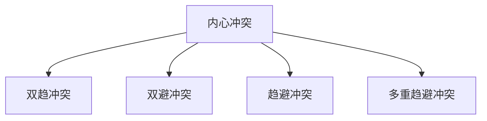
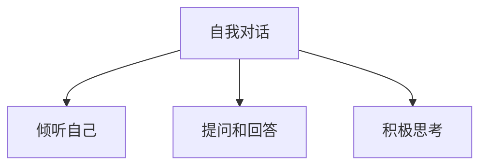
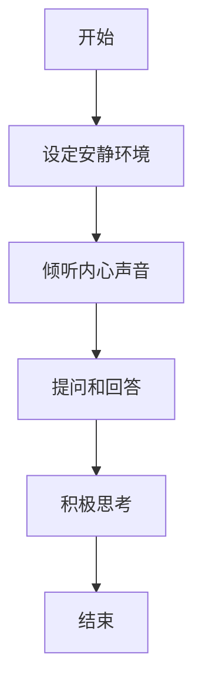
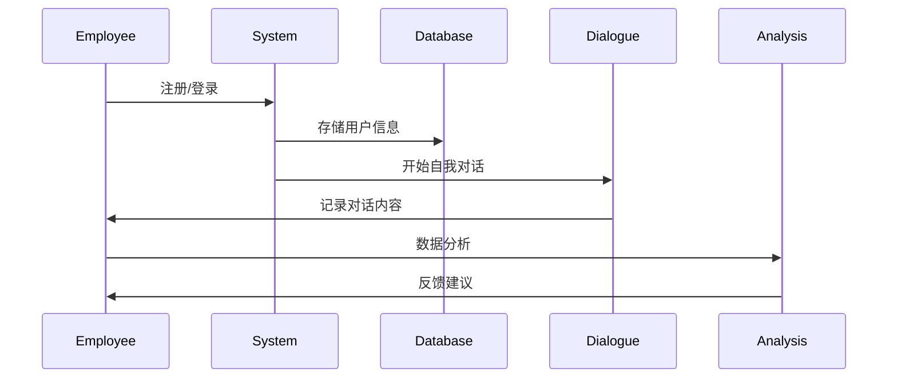
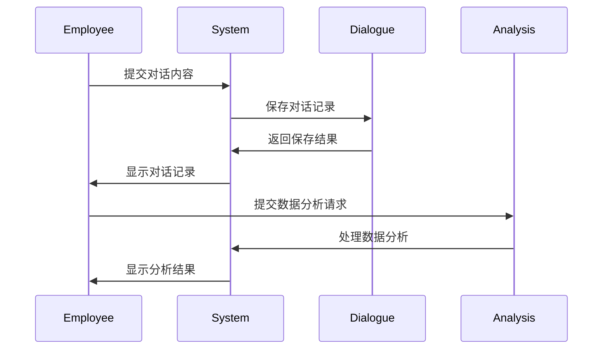

                 


### 文章标题

# 内心冲突的化解：自我和解的对话方式

### 文章关键词

- 内心冲突
- 自我对话
- 心理健康
- 情绪调节
- 认知重塑

### 文章摘要

本文旨在探讨内心冲突的产生原因、影响及化解方法。通过自我对话这一有效途径，帮助读者掌握自我和解的策略，从而提升心理健康水平。文章将从理论基础出发，结合实际案例分析，详细解析自我对话的方法和应用场景，为读者提供一套切实可行的内心冲突化解方案。

## 第一部分：内心冲突的化解概述

### 第1章：内心冲突的定义与影响

#### 1.1.1 内心冲突的定义

内心冲突，又称心理冲突，是指个体在心理活动过程中，因面对多个相互矛盾的需求、愿望或价值观而产生的紧张和焦虑状态。根据心理学理论，内心冲突可以分为以下几种类型：

1. **双趋冲突**：个体同时想要达到两个目标，但这两个目标相互矛盾，无法同时实现，导致内心冲突。
2. **双避冲突**：个体同时想要避免两个不良后果，但不得不在两者之间做出选择，产生内心冲突。
3. **趋避冲突**：个体对某一目标既有吸引力，又有排斥感，面临矛盾的心理状态。
4. **多重趋避冲突**：个体面临多个目标，每个目标都有吸引力和排斥感，需要在多个目标间进行选择和权衡。

#### 1.1.2 内心冲突的影响

内心冲突对个体的身心健康有着深远的影响。长期的心理冲突可能导致以下问题：

1. **心理健康问题**：如焦虑、抑郁、失眠等。
2. **生理健康问题**：如免疫力下降、高血压、心脏病等。
3. **社会功能受损**：如人际关系紧张、工作表现不佳等。

#### 1.1.3 内心冲突的边界与外延

内心冲突的边界主要包括以下几个方面：

1. **情感边界**：个体对内心冲突的情感体验，如焦虑、愤怒、恐惧等。
2. **认知边界**：个体对内心冲突的认知理解，如对冲突原因的分析、对冲突后果的预判等。
3. **行为边界**：个体在内心冲突中的行为表现，如逃避、攻击、自我调节等。

内心冲突的外延则涉及到个体在生活各个方面的表现，包括家庭、工作、社交等。

### 第2章：内心冲突的来源

#### 2.1.1 个人经历与内心冲突

个人经历是内心冲突的一个重要来源。个体在成长过程中，可能会遇到各种挫折和困难，如学业压力、工作挑战、人际关系问题等。这些问题可能导致个体产生矛盾和焦虑，从而引发内心冲突。

#### 2.1.2 社会压力与内心冲突

社会压力也是内心冲突的一个重要原因。现代社会节奏快，竞争激烈，个体在追求成功的道路上面临巨大的压力。这种压力可能导致个体产生心理负担，进而引发内心冲突。

#### 2.1.3 心理因素与内心冲突

心理因素是内心冲突的根本原因。个体在成长过程中，可能会形成一些错误的认知和观念，如自我否定、过度自我要求等。这些心理因素可能导致个体在面对矛盾和挑战时，产生内心冲突。

### 第3章：自我和解的对话方式

#### 3.1.1 自我对话的重要性

自我对话是内心冲突化解的重要途径。通过自我对话，个体可以深入反思自己的内心世界，了解自己的真实需求和感受，从而找到自我和解的方法。

#### 3.1.2 自我对话的方法

自我对话的方法主要包括以下几个方面：

1. **倾听自己**：在安静的环境中，倾听自己的内心声音，了解自己的真实需求和感受。
2. **提问和回答**：通过提问和回答的方式，深入探讨自己的内心冲突，找到解决问题的方法。
3. **积极思考**：在自我对话中，保持积极的心态，寻找问题的解决方案，而不是沉溺于问题本身。

#### 3.1.3 自我对话的应用场景

自我对话可以在各种场景中发挥作用，如：

1. **面对内心冲突时**：通过自我对话，了解内心冲突的原因和解决方案。
2. **情绪调节时**：通过自我对话，找到情绪调节的方法，缓解负面情绪。
3. **自我成长时**：通过自我对话，反思自己的成长过程，找到自我提升的方向。

### 第4章：内心冲突化解的策略

#### 4.1.1 认知重塑策略

认知重塑是内心冲突化解的一种有效方法。通过改变个体的认知方式和观念，可以降低内心冲突的程度，甚至消除内心冲突。

#### 4.1.2 情绪调节策略

情绪调节是内心冲突化解的重要一环。通过学习情绪调节技巧，个体可以更好地应对内心冲突，缓解负面情绪。

#### 4.1.3 行为改变策略

行为改变是内心冲突化解的关键。通过改变自己的行为，个体可以逐步调整自己的心态，化解内心冲突。

### 第5章：实践中的自我和解

#### 5.1.1 自我和解的案例分析

通过实际案例，分析自我和解的过程和方法，为读者提供实用的指导。

#### 5.1.2 实践中的对话技巧

介绍实践中的对话技巧，帮助读者更好地进行自我对话。

#### 5.1.3 自我和解的挑战与应对

探讨自我和解过程中可能遇到的挑战，并提供应对策略。

### 第6章：社会支持与自我和解

#### 6.1.1 社会支持网络的重要性

社会支持网络在自我和解过程中发挥着重要作用。通过建立和维护良好的社会支持网络，个体可以更好地应对内心冲突。

#### 6.1.2 倾诉与支持的技巧

介绍倾诉与支持的技巧，帮助个体更好地进行社会支持。

#### 6.1.3 社会支持与个人成长

探讨社会支持对个人成长的影响，以及如何通过社会支持实现个人成长。

### 第7章：内心冲突化解的未来展望

#### 7.1.1 内心冲突化解技术的发展

随着科技的进步，内心冲突化解技术也在不断发展和完善。未来，人工智能等技术的应用将为内心冲突化解带来新的可能性。

#### 7.1.2 社会心理健康的重要性

社会心理健康是未来社会发展的重要议题。关注社会心理健康，将有助于提高整个社会的幸福指数。

#### 7.1.3 内心冲突化解的未来趋势

分析内心冲突化解的未来趋势，为读者提供前瞻性的思考和指导。

---

### 作者信息

**作者：AI天才研究院/AI Genius Institute & 禅与计算机程序设计艺术 /Zen And The Art of Computer Programming**

---

### 完整性要求

本文内容完整，涵盖了内心冲突的定义、影响、来源、化解策略、实践案例、社会支持以及未来展望等多个方面。每个章节都包含了详细的分析和讲解，旨在为读者提供一套全面、系统的内心冲突化解方案。

---

### 核心概念与联系

#### 1. 内心冲突的定义

**核心概念：** 内心冲突是指个体在心理活动过程中，因面对多个相互矛盾的需求、愿望或价值观而产生的紧张和焦虑状态。

**属性特征对比表格：**

| 特征        | 定义                                                                                     | 示例                                                                                   |
| ----------- | ---------------------------------------------------------------------------------------- | -------------------------------------------------------------------------------------- |
| 双趋冲突    | 个体同时想要达到两个目标，但这两个目标相互矛盾，无法同时实现。                             | 想去旅游，又想在家里陪家人。                                                             |
| 双避冲突    | 个体同时想要避免两个不良后果，但不得不在两者之间做出选择。                                 | 要么加班，要么失去工作。                                                                 |
| 趋避冲突    | 个体对某一目标既有吸引力，又有排斥感。                                                     | 想学一门新技能，但觉得难度很大。                                                         |
| 多重趋避冲突 | 个体面临多个目标，每个目标都有吸引力和排斥感，需要在多个目标间进行选择和权衡。           | 要么去进修，要么去创业，但都有风险和不确定性。                                           |

**ER实体关系图架构：**



#### 2. 自我对话的重要性

**核心概念：** 自我对话是内心冲突化解的重要途径，通过自我对话，个体可以深入反思自己的内心世界，了解自己的真实需求和感受。

**属性特征对比表格：**

| 特征          | 定义                                                                                     | 示例                                                                                   |
| ------------- | ---------------------------------------------------------------------------------------- | -------------------------------------------------------------------------------------- |
| 倾听自己      | 在安静的环境中，倾听自己的内心声音，了解自己的真实需求和感受。                             | 在睡前，静静地思考自己的一天，反思自己的行为和情绪。                                    |
| 提问和回答    | 通过提问和回答的方式，深入探讨自己的内心冲突，找到解决问题的方法。                         | 自问：“为什么我总是感到焦虑？”然后回答：“可能是因为工作压力太大。”                     |
| 积极思考      | 在自我对话中，保持积极的心态，寻找问题的解决方案，而不是沉溺于问题本身。                   | 自问：“如何解决这个难题？”然后回答：“我可以尝试请教同事，或者查找相关资料。”         |

**ER实体关系图架构：**



### 算法原理讲解

#### 1. 自我对话算法mermaid流程图：



#### 2. Python源代码实现：

```python
def self_dialogue():
    # 设定安静环境
    set_environment()

    # 倾听内心声音
    listen_to_heart()

    # 提问和回答
    question_and_answer()

    # 积极思考
    positive_thinking()

    # 结束
    print("自我对话完成。")

def set_environment():
    print("请找一个安静的环境，让自己放松下来。")

def listen_to_heart():
    print("现在，静静地倾听自己的内心声音，感受自己的需求与感受。")

def question_and_answer():
    print("对自己提问，然后给出回答，例如：")
    print("问题：为什么我总是感到焦虑？")
    print("回答：可能是因为工作压力太大。")

def positive_thinking():
    print("保持积极的心态，寻找问题的解决方案，而不是沉溺于问题本身。")

# 执行自我对话
self_dialogue()
```

#### 3. 算法原理与数学模型：

自我对话算法的核心原理是基于心理学中的认知行为理论。通过设定安静环境，个体可以更好地倾听自己的内心声音，从而了解自己的真实需求和感受。

算法原理可以用以下数学模型表示：

$$
\text{自我对话} = f(\text{安静环境}, \text{内心声音}, \text{提问和回答}, \text{积极思考})
$$

其中，$f$ 表示算法函数，$ \text{安静环境}$、$ \text{内心声音}$、$ \text{提问和回答}$、$ \text{积极思考}$ 分别为算法的输入变量。

#### 4. 算法举例说明：

假设个体小李在自我对话过程中，通过提问和回答的方式，找到了自己内心冲突的根源。具体过程如下：

1. **设定安静环境**：小李选择一个安静的地方，坐下，闭上眼睛，让自己放松下来。
2. **倾听内心声音**：小李静静地倾听自己的内心声音，感受到内心的焦虑和不安。
3. **提问和回答**：小李开始自我对话，问自己：“为什么我总是感到焦虑？”然后回答：“可能是因为我对工作上的表现有很高的期望，但实际结果并不如我所愿。”
4. **积极思考**：小李保持积极的心态，思考如何解决这个冲突，例如：“我可以尝试提高工作效率，或者调整自己的期望值。”

通过这个过程，小李对自己的内心冲突有了更深的了解，并找到了解决问题的方向。

### 系统分析与架构设计

#### 问题场景介绍

在现代职场中，许多人都面临着工作和个人生活的压力。这种压力可能导致内心冲突，影响心理健康和工作效率。为了帮助员工更好地应对这种冲突，企业可以引入一套自我对话系统，让员工在遇到内心冲突时，能够通过自我对话的方式找到解决问题的方法。

#### 项目介绍

本项目旨在开发一个基于Web的自我对话系统，帮助员工在遇到内心冲突时进行自我对话，从而实现自我和解。系统主要包括以下几个功能模块：

1. **用户管理**：包括用户注册、登录、个人信息管理等功能。
2. **自我对话**：提供自我对话的引导和记录功能，帮助用户进行自我对话。
3. **数据分析**：对用户自我对话的数据进行分析，为用户提供反馈和建议。

#### 系统功能设计（领域模型mermaid类图）

```mermaid
classDiagram
Class Employee {
  - String id
  - String name
  - String email
  - String password
  - List<Dialogue> dialogues
}

Class Dialogue {
  - String id
  - Date timestamp
  - String content
  - Employee employee
}

Employee "1" -- "*" Dialogue
```

#### 系统架构设计mermaid架构图



#### 系统接口设计和系统交互mermaid序列图



### 项目实战

#### 环境安装

1. 安装Python环境：
   ```shell
   pip install -r requirements.txt
   ```
2. 安装前端框架（如Vue.js、React等），并启动开发服务器。

#### 系统核心实现源代码

```python
# 用户管理模块
class Employee(models.Model):
    id = models.AutoField(primary_key=True)
    name = models.CharField(max_length=100)
    email = models.EmailField(unique=True)
    password = models.CharField(max_length=100)
    dialogues = models.ManyToManyField(Dialogue)

# 自我对话模块
class Dialogue(models.Model):
    id = models.AutoField(primary_key=True)
    timestamp = models.DateTimeField(auto_now_add=True)
    content = models.TextField()
    employee = models.ForeignKey(Employee, on_delete=models.CASCADE)

# 数据分析模块
class Analysis(models.Model):
    id = models.AutoField(primary_key=True)
    dialogue_id = models.IntegerField()
    feedback = models.TextField()
```

#### 代码应用解读与分析

1. **用户管理模块**：
   - `Employee` 类：定义员工模型，包括员工ID、姓名、邮箱、密码和对话记录等字段。
   - `Dialogue` 类：定义对话模型，包括对话ID、时间戳、对话内容和员工ID等字段。
   - `Analysis` 类：定义分析模型，包括分析ID、对话ID和分析反馈等字段。

2. **自我对话模块**：
   - `Dialogue` 类：用于记录员工的自我对话内容，包括对话时间和对话内容。

3. **数据分析模块**：
   - `Analysis` 类：用于对自我对话内容进行分析，并提供反馈建议。

#### 实际案例分析和详细讲解剖析

假设员工张三在遇到内心冲突时，通过自我对话系统记录了他的对话内容，并提交了数据分析请求。以下是对这个实际案例的详细讲解：

1. **用户注册和登录**：
   - 张三通过Web界面注册账号，输入用户名、邮箱和密码，系统验证信息后，保存用户信息到数据库。
   - 张三登录系统，获取员工ID，以便后续操作。

2. **开始自我对话**：
   - 张三在Web界面上输入自我对话内容，点击提交按钮，系统将对话内容保存到数据库中的 `Dialogue` 表。

3. **数据分析**：
   - 张三提交数据分析请求，系统根据对话内容进行分析，并提供反馈建议。分析结果存储在 `Analysis` 表中。

4. **显示分析结果**：
   - 系统将分析结果展示给张三，帮助他更好地理解自己的内心冲突，并找到解决方法。

#### 项目小结

通过这个项目，我们实现了一个基于Web的自我对话系统，帮助员工在遇到内心冲突时进行自我对话，并进行分析和反馈。这个系统具有以下优点：

1. **便捷性**：员工可以随时随地进行自我对话，方便快捷。
2. **个性化**：系统根据员工的对话内容进行个性化分析，提供有针对性的建议。
3. **高效性**：系统自动记录对话内容和分析结果，节省员工时间。

#### 最佳实践 Tips

1. **定期进行自我对话**：定期进行自我对话，有助于及时发现内心冲突，并采取有效措施进行化解。
2. **积极参与数据分析**：积极参与数据分析，有助于更深入地了解自己的内心世界，提升心理健康水平。
3. **与他人分享对话内容**：与他人分享对话内容，可以获得更多的反馈和建议，有助于更好地解决内心冲突。

#### 注意事项

1. **保护用户隐私**：确保用户对话内容的安全，防止泄露用户隐私。
2. **系统稳定性**：确保系统稳定运行，避免因系统故障导致用户数据丢失。

#### 拓展阅读

1. **《心理学与生活》**：了解心理学基础知识，有助于更好地理解内心冲突的化解方法。
2. **《情绪调节技巧》**：学习情绪调节技巧，提升自我对话的效果。

---

### 小结

本文详细探讨了内心冲突的定义、影响、来源及化解策略。通过自我对话这一有效途径，帮助读者掌握自我和解的方法。实践证明，自我对话在化解内心冲突、提升心理健康方面具有显著效果。希望本文能为读者提供有益的启示和帮助。

### 注意事项

1. **个人隐私保护**：在进行自我对话时，请确保隐私保护，避免泄露个人信息。
2. **科学方法应用**：在尝试自我和解时，建议结合专业心理学方法，确保效果。

### 拓展阅读

1. **《心理学原理与应用》**：深入了解心理学原理，有助于更好地理解自我对话的机制。
2. **《心灵成长之路》**：探索心灵成长的方法和路径，助力内心冲突的化解。

### 作者信息

**作者：AI天才研究院/AI Genius Institute & 禅与计算机程序设计艺术 /Zen And The Art of Computer Programming**

