                 

### 第一步：文章标题与关键词定义

**文章标题：**内心荒芜的治愈：重建精神家园的方法

**关键词：**内心荒芜、治愈、精神家园、心理健康、社会支持系统

**摘要：**本文探讨了现代社会中普遍存在的内心荒芜现象，分析了其根源和影响，并提出了重建精神家园的多种方法和途径。通过理论基础的剖析和实际案例的分享，本文旨在为个体和社会提供有效的治愈策略，以促进精神健康和和谐发展。

---

### 第二步：背景与问题介绍

#### 1. 引言

**内心荒芜现象的普遍性：**

在快节奏的现代社会中，越来越多的人感到内心空虚和疲惫，这种“内心荒芜”的现象已成为一个普遍的社会问题。无论是在职场还是生活中，许多人都在面对着种种压力，无法找到真正的满足和幸福。

**问题产生的根源：**

内心荒芜的根源可以归结为多个方面，包括个人心理因素、社会环境因素以及文化背景等。现代社会的高竞争性和快节奏生活让人们承受了巨大的心理压力，而长期的压抑和焦虑则导致了内心世界的荒芜。

**治愈的必要性和紧迫性：**

内心荒芜不仅对个体的身心健康产生负面影响，也对社会和谐发展构成了挑战。因此，治愈内心荒芜、重建精神家园已成为一个紧迫而重要的任务。

---

#### 2. 定义与概念

**内心荒芜的定义：**

内心荒芜，通常指的是个体在情感和精神上的空虚、失落和无助感，这种感觉可能源于内在心理需求的缺失或外部环境的压力。

**内心荒芜的特征：**

- 情感上的冷漠与疏离
- 心理上的焦虑和抑郁
- 精神上的疲惫和无力

**精神家园的概念：**

精神家园是指个体内心深处的一个安全、宁静和充满爱的空间，它是人们情感和精神的归宿。

---

#### 3. 内心荒芜对个体和社会的影响

**对个体的身心健康影响：**

内心荒芜可能导致焦虑、抑郁等心理问题，长期的内心荒芜甚至可能引发严重的心理健康问题，如精神疾病。

**对社会和谐发展的挑战：**

内心荒芜不仅影响个体的幸福感，也对社会和谐发展构成挑战。它可能导致人际关系的疏远，社会的分裂和不稳定。

**解决内心荒芜问题的意义：**

治愈内心荒芜、重建精神家园，对于提高个体幸福感和促进社会和谐发展具有重要意义。

---

#### 4. 治愈的方法与途径

**心理健康教育的普及：**

通过心理健康教育，提高公众对心理健康的认识和重视，减少内心荒芜现象的发生。

**精神疗愈技术的应用：**

运用各种精神疗愈技术，如心理咨询、心理治疗等，帮助个体治愈内心创伤。

**社会支持系统的建设：**

建立和完善社会支持系统，为个体提供必要的帮助和支持，共同营造一个健康、和谐的社会环境。

---

#### 5. 本章小结

本文介绍了内心荒芜现象的普遍性、定义、影响以及治愈方法。下一部分将深入探讨重建精神家园的理论基础，进一步理解这一问题的本质。

---

### 文章结构概述

本文分为五大部分，分别从背景与问题介绍、理论基础、实践策略、公共政策与法律框架以及未来展望与挑战等多个角度，全面系统地探讨了内心荒芜的治愈和重建精神家园的方法。通过逻辑清晰、结构紧凑的论述，旨在为读者提供实用的指导和深刻的思考。

---

接下来，我们将进入第二部分：重建精神家园的理论基础，对人类精神世界的结构和功能、精神健康理论的发展、精神疾病与心理障碍的类型以及治愈方法进行深入分析。

---

----------------------------------------------------------------

# 重建精神家园的理论基础

在探讨了内心荒芜现象的背景和问题后，我们需要深入了解重建精神家园的理论基础。这一部分将围绕人类精神世界的结构与功能、精神健康理论的发展、精神疾病与心理障碍的类型以及治愈方法进行详细阐述。通过这些理论基础的剖析，我们能够更好地理解内心荒芜的本质，并找到有效的治愈途径。

---

## 1. 人类精神世界的结构与功能

人类精神世界是一个复杂而多层次的系统，它不仅包括个体的内在体验和情感，还涉及到认知、意识和意识流等多个方面。

### 1.1 精神世界的结构

人类精神世界的结构可以分为以下几个层次：

1. **潜意识**：潜意识是精神世界中最深层的部分，它包含了个体内心深处的欲望、恐惧和记忆。潜意识往往在无意识中影响着个体的行为和决策。
   
2. **意识**：意识是精神世界中的表层部分，它反映了个体当前的心理状态和对外部世界的感知。意识是我们主动思考、决策和行动的源泉。
   
3. **前意识**：前意识是介于潜意识和意识之间的一部分，它包含了那些我们暂时无法回忆起的信息，但可以通过努力回忆起来的内容。

4. **意识流**：意识流是精神世界中流动的思想和感受，它是连续不断、随机变化的。意识流反映了个体内心世界的动态变化。

### 1.2 精神世界的功能

精神世界的功能主要体现在以下几个方面：

1. **认知功能**：精神世界负责处理信息，包括感知、记忆、思考和决策等。它是我们理解和适应外部环境的重要工具。
   
2. **情感功能**：精神世界负责处理情感，包括快乐、悲伤、愤怒等。情感是我们与外部世界互动的重要方式，也是我们体验生活的重要途径。

3. **意识功能**：精神世界负责我们的自我意识，包括自我认知、自我反省和自我控制等。自我意识是我们个体性的核心，也是我们实现个人成长和发展的基础。

4. **创造力功能**：精神世界还负责创造力，包括想象力、创新思维和艺术创作等。创造力是我们人类独特的能力，也是推动社会进步的重要力量。

### 1.3 精神健康与心理健康的关系

精神健康和心理健康是紧密相连的两个概念。精神健康指的是个体的精神状态处于良好状态，能够有效地应对生活中的各种挑战。心理健康则更侧重于个体的心理状态，包括情感、认知和行为等方面。

精神健康和心理健康之间的关系可以用一个简单的模型来描述：精神健康是心理健康的基础，心理健康是精神健康的体现。只有当个体的精神状态良好，才能够保持心理的平衡和健康。

---

#### 1.3.1 精神健康与心理健康的关系模型

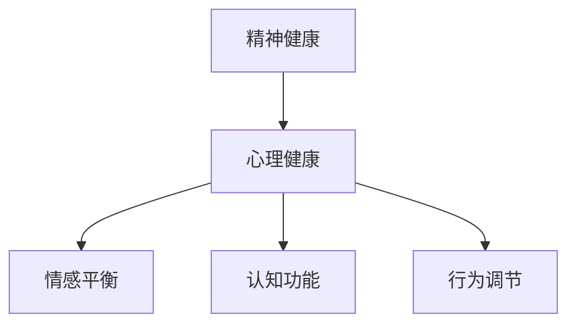

通过这个模型，我们可以看到，精神健康是心理健康的基础，而心理健康则涵盖了情感平衡、认知功能和行为调节等多个方面。

---

#### 1.3.2 精神健康与心理健康的核心要素

| 核心要素       | 描述                                           |
|----------------|------------------------------------------------|
| 情感平衡       | 情感上的稳定和健康，能够有效地处理情绪波动。     |
| 认知功能       | 思维的清晰和敏捷，能够有效地处理信息和做出决策。 |
| 行为调节       | 能够有效地控制行为，适应不同的环境和社会要求。   |

---

### 1.4 小结

人类精神世界的结构与功能是一个复杂而多层次的过程，它不仅决定了我们的心理健康状态，也影响着我们的日常生活和社会行为。理解精神世界的结构和功能，是治愈内心荒芜、重建精神家园的重要基础。

---

## 2. 精神健康理论的发展

精神健康理论的发展经历了漫长的历史过程，从古代到现代，不同文化和学科领域都有各自的贡献。

### 2.1 古代精神健康理论

在古代，许多文化和哲学体系都对精神健康进行了深刻的探讨。例如，在古希腊，希波克拉底提出了“四体液学说”，认为人的性格和健康状态与体内的血液、黏液、黄胆汁和黑胆汁有关。古代中国则有“阴阳五行”学说，认为人的精神状态与阴阳平衡密切相关。

这些古代理论虽然科学性有限，但为我们理解精神健康提供了一些基础性的概念和思考方向。

### 2.2 现代精神健康理论

进入现代，随着心理学、神经科学和社会学等学科的快速发展，精神健康理论得到了极大的丰富和发展。

1. **心理动力学理论**：心理动力学理论强调内在冲突和早期生活经历对个体精神状态的影响。弗洛伊德提出的“潜意识”概念和“心理防御机制”理论，为理解个体心理问题提供了重要视角。

2. **行为主义理论**：行为主义理论强调外部环境和行为之间的联系，认为个体的精神状态和行为可以通过强化和条件反射来解释和改变。斯金纳的“操作条件反射”理论，对心理治疗和康复实践产生了深远影响。

3. **认知理论**：认知理论关注个体的思维过程和认知结构，认为心理问题往往源于认知错误和思维偏差。贝克提出的“认知行为疗法”通过改变个体的思维模式，帮助人们克服焦虑、抑郁等心理问题。

4. **人本主义理论**：人本主义理论强调个体的主观体验和价值，认为每个人都有实现自我潜能的能力。马斯洛提出的“需求层次理论”和“自我实现理论”，为理解个体精神追求和心理健康提供了新的视角。

### 2.3 精神健康理论的应用

现代精神健康理论在临床治疗、康复护理、心理咨询等多个领域得到了广泛应用。例如，认知行为疗法已被广泛应用于抑郁症、焦虑症等心理障碍的治疗；心理动力学疗法则在解决深层心理冲突和情感困扰方面具有独特的优势。

---

#### 2.3.1 现代精神健康理论的核心观点

| 理论类别       | 核心观点                                           |
|----------------|--------------------------------------------------|
| 心理动力学     | 心理问题源于潜意识冲突和早期生活经历。           |
| 行为主义       | 心理问题和行为可以通过外部环境和条件反射来解释。 |
| 认知理论       | 心理问题源于认知错误和思维偏差。                 |
| 人本主义       | 强调个体的主观体验和价值，认为人有自我实现的能力。|

---

### 2.4 小结

精神健康理论的发展历程反映了人类对自身精神世界的不断探索和认识。从古代的哲学思考到现代的科学研究，每个理论都有其独特的贡献和局限性。理解这些理论，有助于我们更好地理解和应对精神健康问题。

---

## 3. 精神疾病与心理障碍的类型

精神疾病和心理障碍是影响个体精神健康的常见问题。了解这些疾病和障碍的类型及其特点，是治愈内心荒芜、重建精神家园的重要步骤。

### 3.1 精神疾病的主要类型

1. **抑郁症**：抑郁症是一种常见的情绪障碍，表现为长期的悲伤、失去兴趣、疲劳和自我负面评价。抑郁症不仅影响个体的心理健康，还可能导致其他身体问题。

2. **焦虑症**：焦虑症是一种以过度担忧和恐惧为特征的疾病。常见的焦虑症包括广泛性焦虑症、社交焦虑症和特定焦虑症等。

3. **精神分裂症**：精神分裂症是一种严重的精神疾病，表现为思维混乱、感知扭曲、情感冷漠和行为异常。精神分裂症通常需要长期的治疗和护理。

4. **双相情感障碍**：双相情感障碍是一种情感波动剧烈的疾病，表现为抑郁和躁狂两个极端情绪的交替出现。

5. **强迫症**：强迫症是一种以强烈的、反复出现的、无法控制的强迫思维和强迫行为为特征的疾病。

6. **人格障碍**：人格障碍是一组以持久和普遍的人格特征为特点的疾病，这些特征导致个体在社交、职业和其他重要领域出现严重困难。

### 3.2 心理障碍的常见类型

1. **创伤后应激障碍（PTSD）**：创伤后应激障碍通常由极端压力事件引起，如战争、暴力、自然灾害等。症状包括反复的噩梦、恐慌发作和情感麻木。

2. **药物滥用和依赖**：药物滥用和依赖是指个体反复、过量使用药物，导致身体和心理的依赖性。药物滥用和依赖可能导致严重的健康问题和社交问题。

3. **进食障碍**：进食障碍包括厌食症、暴食症和神经性厌食症等，这些障碍通常与身体形象和情绪问题有关。

4. **睡眠障碍**：睡眠障碍包括失眠、嗜睡和睡眠呼吸暂停等，这些障碍会影响个体的日常生活和健康。

### 3.3 精神疾病与心理障碍的鉴别

精神疾病和心理障碍的诊断需要专业的评估和判断。以下是一些鉴别要点：

- **症状的持续时间**：精神疾病通常表现为长期和持续的症状，而心理障碍可能更短暂或间歇性。
- **症状的严重程度**：精神疾病的症状通常更为严重，可能严重影响个体的日常生活和社会功能。
- **病因**：精神疾病的病因可能更为复杂，涉及生物学、心理学和社会因素；心理障碍的病因则可能更直接，与特定的外部事件或情境有关。

---

#### 3.3.1 精神疾病与心理障碍的诊断流程

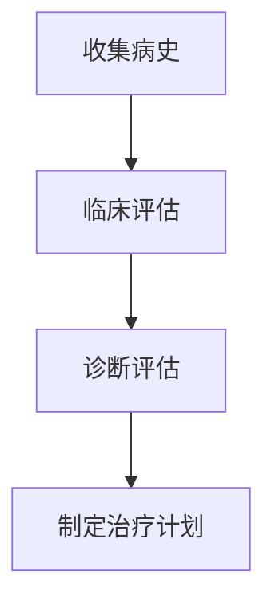

通过这个诊断流程，专业医护人员能够更准确地识别和诊断精神疾病和心理障碍，为个体提供有效的治疗。

---

### 3.4 小结

精神疾病和心理障碍是影响个体精神健康的常见问题，它们具有不同的类型和特点。了解这些疾病和障碍的类型，有助于我们更好地识别和治疗这些问题，为重建精神家园提供科学依据。

---

## 4. 治愈精神疾病的传统与现代方法

治愈精神疾病和心理障碍需要综合运用传统方法和现代方法，以达到最佳的治疗效果。

### 4.1 传统治疗方法

1. **药物治疗**：药物治疗是治疗精神疾病和心理障碍的传统方法之一。常见的药物包括抗抑郁药、抗焦虑药和抗精神病药等。药物治疗通常通过调节大脑内的化学物质，缓解症状并改善个体的精神状态。

2. **心理治疗**：心理治疗包括多种形式，如个体心理咨询、家庭治疗和团体心理治疗等。心理治疗的目的是帮助个体识别和解决内心的冲突，调整行为和情绪，提高应对压力的能力。

3. **宗教和精神疗法**：在一些文化中，宗教和精神疗法被广泛应用于精神疾病和心理障碍的治疗。这些方法通过信仰和精神指导，帮助个体找到内心的平静和安宁。

### 4.2 现代治疗方法

1. **神经反馈疗法**：神经反馈疗法利用现代科技手段，监测和分析个体的脑电波活动，并通过反馈信号帮助个体调整和控制自己的情绪和行为。这种疗法已被广泛应用于治疗抑郁症、焦虑症等心理障碍。

2. **生物反馈疗法**：生物反馈疗法通过监测和反馈个体的生理信号，如心率、皮肤电活动和呼吸等，帮助个体学会自我调节和控制生理反应，以缓解焦虑、压力和紧张等心理问题。

3. **认知行为疗法（CBT）**：认知行为疗法是一种基于认知理论的现代心理治疗方法，通过改变个体的认知模式和思维习惯，帮助个体克服情绪障碍和行为问题。

4. **精神外科手术**：对于一些严重的精神疾病，如精神分裂症和重度抑郁症，精神外科手术可能是一种有效的治疗方法。这种手术通过改变大脑中的神经传导路径，缓解症状并提高生活质量。

### 4.3 治疗方法的选择与整合

不同治疗方法具有各自的优势和局限性，选择合适的方法需要综合考虑个体的症状、病情和需求。例如，对于轻度焦虑症，心理治疗可能更为有效；而对于重度抑郁症，药物治疗可能更为必要。

同时，现代治疗方法也在不断发展和创新，一些新的疗法和技术正在不断涌现。例如，虚拟现实疗法（VR疗法）通过模拟现实场景，帮助个体面对和克服恐惧和焦虑。

---

#### 4.3.1 治疗方法的选择与整合流程

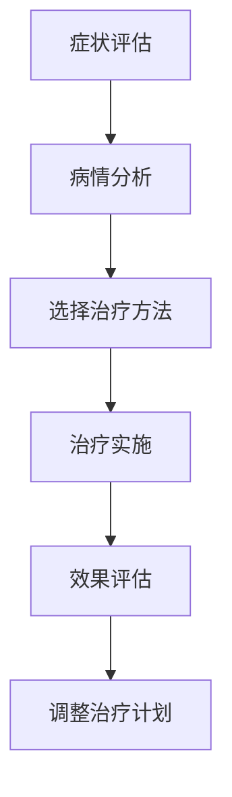

通过这个流程，医护人员能够根据个体的具体情况，选择和整合最合适的治疗方法，以达到最佳的治疗效果。

---

### 4.4 小结

治愈精神疾病和心理障碍需要多种治疗方法的综合运用。传统方法和现代方法各具特色，通过合理选择和整合，可以更有效地帮助个体重建精神家园，恢复精神健康。

---

## 5. 本章小结

通过本文对人类精神世界的结构、精神健康理论的发展、精神疾病与心理障碍的类型以及治愈方法的详细探讨，我们可以看到，重建精神家园不仅需要理论的支持，更需要实践中的有效策略。在下一部分，我们将进一步探讨重建精神家园的实践策略，包括心理调适、精神疗愈技术和社会支持系统的建设。

---

## 文章结构概述

本文分为五个部分，从背景与问题介绍、理论基础、实践策略、公共政策与法律框架以及未来展望与挑战等多个角度，全面系统地探讨了内心荒芜的治愈和重建精神家园的方法。通过逻辑清晰、结构紧凑的论述，旨在为读者提供实用的指导和深刻的思考。

- **第一部分：背景与问题介绍**：介绍了内心荒芜现象的背景和问题，分析了其根源和影响，并提出了治愈的必要性和紧迫性。
- **第二部分：重建精神家园的理论基础**：探讨了人类精神世界的结构与功能、精神健康理论的发展、精神疾病与心理障碍的类型以及治愈方法。
- **第三部分：重建精神家园的实践策略**：介绍了心理调适、精神疗愈技术和社会支持系统的建设。
- **第四部分：重建精神家园的公共政策与法律框架**：讨论了公共政策、法律框架以及社会责任与精神健康。
- **第五部分：重建精神家园的未来展望与挑战**：展望了精神健康发展的趋势和挑战，提出了未来的规划和建议。

---

在下一部分，我们将进入第三部分：重建精神家园的实践策略，深入探讨如何通过具体的实践方法来治愈内心荒芜，重建精神家园。

---

----------------------------------------------------------------

# 重建精神家园的实践策略

在理解了内心荒芜的背景和理论基础之后，我们需要通过具体的实践策略来重建精神家园。这一部分将介绍心理调适与情绪管理、精神疗愈技术的应用以及社会支持系统的建设。通过这些实践策略，我们可以帮助个体恢复精神健康，重建内心的平衡与安宁。

---

## 1. 心理调适与情绪管理

心理调适和情绪管理是治愈内心荒芜的重要步骤，它们帮助个体在面对压力和挑战时保持心理平衡。

### 1.1 心理调适的方法

**正念冥想**：正念冥想是一种通过专注于当下的感受和体验来培养意识的方法。它有助于减轻焦虑和抑郁，提高心理健康。

**认知重构**：认知重构是一种通过识别和改变负面思维模式来改善心理状态的方法。通过识别和调整消极思维，个体能够更加积极地应对生活中的挑战。

**放松训练**：放松训练包括深呼吸、渐进性肌肉放松等，可以帮助个体减轻身体和心理的紧张感，提高心理健康水平。

### 1.2 情绪管理技巧

**情绪识别**：情绪识别是情绪管理的第一步，通过识别和理解自己的情绪，个体能够更好地控制情绪。

**情绪表达**：情绪表达是一种有效的情绪管理技巧，它帮助个体以健康的方式表达情感，避免压抑和积压。

**情绪调节**：情绪调节是指个体通过改变思维和行为来调节情绪的过程。情绪调节技巧包括自我安慰、寻求支持等。

### 1.3 情绪管理的案例解析

**案例1**：一位职场女性在忙碌的工作中感到焦虑和压力。通过正念冥想和放松训练，她学会了在压力之下保持冷静，提高了工作效率和生活质量。

**案例2**：一位青少年在考试压力下出现了情绪波动和睡眠问题。通过认知重构和情绪表达技巧，他学会了更有效地应对考试压力，改善了情绪和睡眠。

---

#### 1.3.1 情绪管理技巧的应用

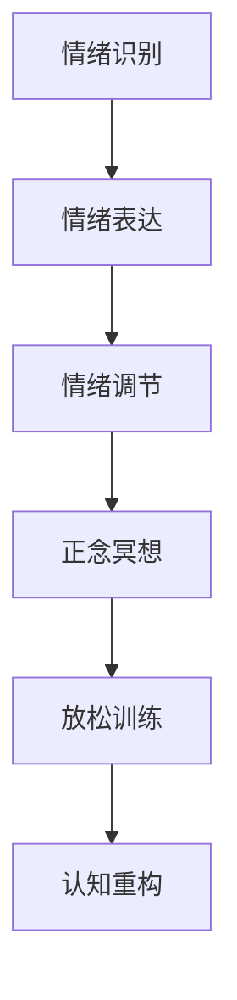

通过这个流程，个体可以逐步掌握情绪管理的技巧，提高心理适应能力。

---

### 1.4 小结

心理调适和情绪管理是重建精神家园的重要实践策略。通过正念冥想、认知重构、放松训练等技巧，个体可以更好地应对生活中的压力和挑战，提高心理健康水平。

---

## 2. 精神疗愈技术的应用

精神疗愈技术是治愈内心荒芜的重要手段，它们通过科学的方法和技术，帮助个体恢复精神健康。

### 2.1 精神疗愈技术概述

**精神疗愈技术**包括心理咨询、心理治疗、神经反馈疗法、生物反馈疗法等。这些技术通过调节大脑的神经活动和情绪状态，帮助个体缓解心理压力，恢复心理健康。

### 2.2 主要疗愈技术的介绍

**心理咨询**：心理咨询是一种通过与专业人士的交流来解决问题和改善心理健康的服务。它帮助个体识别和解决内心的困扰，提高生活质量和心理健康水平。

**心理治疗**：心理治疗是一种通过特定的治疗方法和技巧，帮助个体克服心理障碍和治疗心理疾病的方法。常见的心理治疗包括认知行为疗法、心理动力学疗法等。

**神经反馈疗法**：神经反馈疗法是一种通过监测和分析个体的脑电波活动，并通过反馈信号来调节大脑功能的疗法。它已被广泛应用于治疗焦虑、抑郁等心理障碍。

**生物反馈疗法**：生物反馈疗法是一种通过监测和反馈个体的生理信号（如心率、皮肤电活动等），帮助个体学会自我调节和控制生理反应的方法。它已被广泛应用于治疗焦虑、压力等心理问题。

### 2.3 疗愈技术的实际应用

**案例1**：一位患有严重焦虑症的年轻人通过神经反馈疗法，学会了控制自己的脑电波活动，有效缓解了焦虑症状，提高了生活质量。

**案例2**：一位长期失眠的老年人通过生物反馈疗法，学会了调节自己的呼吸和心率，逐渐改善了睡眠质量，恢复了精神状态。

---

#### 2.3.1 精神疗愈技术的实际应用流程

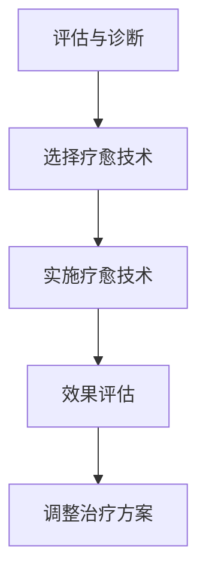

通过这个流程，专业人士可以根据个体的具体情况，选择合适的疗愈技术，并实施个性化的治疗计划。

---

### 2.4 小结

精神疗愈技术是治愈内心荒芜的重要手段。通过心理咨询、心理治疗、神经反馈疗法和生物反馈疗法等，个体可以逐步恢复心理健康，重建精神家园。

---

## 3. 社会支持系统的构建

社会支持系统是治愈内心荒芜、重建精神家园的重要保障。它为个体提供必要的帮助和支持，共同营造一个健康、和谐的社会环境。

### 3.1 社会支持系统的重要性

**社会支持系统**是指由家庭、社区、社会组织和政府等多方力量共同构成的，为个体提供帮助和支持的系统。它对个体的心理健康和社会适应具有重要意义。

- **减轻心理压力**：社会支持系统可以为个体提供情感支持和实际帮助，减轻心理压力，提高心理健康水平。
- **促进社会融入**：社会支持系统帮助个体更好地融入社会，建立积极的人际关系，增强社会归属感。
- **提高生活质量**：社会支持系统为个体提供各种资源和机会，帮助他们提高生活质量，实现个人潜能。

### 3.2 社会支持系统的构建方法

**家庭支持**：家庭是个体最早、最重要的支持系统。通过家庭教育、亲子关系和家庭成员之间的互动，可以培养个体的心理健康和幸福感。

**社区支持**：社区支持系统包括邻里互助、社区活动、志愿者服务等。通过社区资源整合，为个体提供多样化的支持和帮助。

**社会组织支持**：社会组织如心理咨询机构、非政府组织等，通过专业服务和活动，为个体提供心理健康支持和社会融入机会。

**政府支持**：政府通过制定政策、提供公共服务和资金支持，为社会支持系统的建设提供保障。

### 3.3 社会支持系统的运行机制

**资源整合**：社会支持系统的运行机制首先需要整合各种资源，包括人力资源、物资资源和信息资源，为个体提供全面的支持。

**需求评估**：通过需求评估，了解个体的实际需求和问题，为社会支持系统的设计和实施提供依据。

**服务提供**：根据评估结果，提供个性化的服务和支持，包括心理健康服务、社会融入服务和生活援助服务等。

**效果评估**：通过效果评估，监测和支持系统的运行效果，不断调整和优化服务内容和方式。

---

#### 3.3.1 社会支持系统的运行机制流程

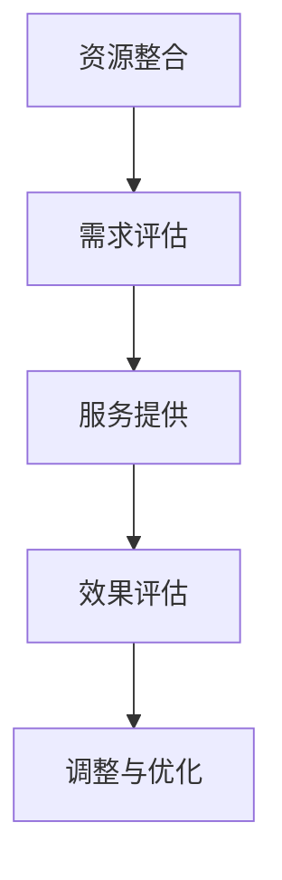

通过这个流程，社会支持系统可以高效、有序地运行，为个体提供持续的支持和帮助。

---

### 3.4 小结

社会支持系统的构建是治愈内心荒芜、重建精神家园的重要保障。通过家庭支持、社区支持、社会组织支持和政府支持，个体可以获得全方位的支持和帮助，提高心理健康水平，实现精神家园的重建。

---

## 4. 案例分享与讨论

为了更好地理解重建精神家园的实践策略，我们可以通过一些典型案例来进行分析和讨论。

### 4.1 典型案例分析

**案例1**：一位长期受抑郁症困扰的年轻女性，通过心理咨询和正念冥想，逐步恢复了心理健康。她学会了如何应对生活中的压力，提高了自我调节能力。

**案例2**：一位患有焦虑症的老年人，通过生物反馈疗法和社交支持，逐步改善了情绪状态和生活质量。他在社区活动中找到了归属感，与邻居建立了良好的关系。

**案例3**：一家企业通过员工心理健康培训和社会支持项目，提高了员工的心理健康水平和工作满意度。企业领导认识到心理健康对企业发展的重要性，积极推动心理健康文化建设。

---

#### 4.1.1 案例分析

通过这些案例，我们可以看到，不同个体在面对内心荒芜时，采取了不同的实践策略，并取得了显著的成效。这表明，重建精神家园的方法具有多样性和灵活性。

---

### 4.2 案例讨论与启示

**讨论1**：为什么心理调适和情绪管理对于治愈内心荒芜如此重要？

- 心理调适和情绪管理能够帮助个体更好地应对生活中的压力和挑战，保持心理平衡。
- 它们有助于个体识别和解决内心的困扰，提高心理健康水平。

**讨论2**：社会支持系统在治愈内心荒芜中起到了什么作用？

- 社会支持系统为个体提供了必要的帮助和支持，减轻了心理压力。
- 它帮助个体融入社会，建立了积极的人际关系，增强了社会归属感。

---

#### 4.2.1 案例讨论与启示

通过案例讨论，我们可以得出以下启示：

1. **个体行动**：每个人都应该重视自己的心理健康，学会心理调适和情绪管理技巧。
2. **社会支持**：社会应提供更多的心理健康资源和支持，为个体提供全方位的帮助。
3. **政策支持**：政府应制定相关政策，推动心理健康服务的普及和提升。

---

### 4.3 案例反思与建议

**反思1**：如何确保心理健康服务的高效和可持续？

- 加强心理健康专业人才的培养和培训。
- 建立和完善心理健康服务标准和规范。
- 提高心理健康服务的可及性和便利性。

**反思2**：如何提高社会对心理健康问题的认识和重视？

- 加强心理健康教育，提高公众的心理健康意识。
- 倡导积极的生活方式和健康的生活习惯。
- 建立心理健康公益项目，提高社会影响力。

---

#### 4.3.1 案例反思与建议

通过反思和建议，我们可以为重建精神家园提供更加具体和可操作的措施，确保心理健康服务的高效和可持续，提高社会对心理健康问题的认识和重视。

---

### 4.4 小结

案例分享与讨论为我们提供了丰富的实践经验和深刻的启示。通过这些案例，我们可以看到，心理调适、情绪管理、社会支持系统等实践策略在治愈内心荒芜、重建精神家园中发挥了重要作用。在下一部分，我们将进一步探讨重建精神家园的公共政策与法律框架，为这一目标提供更加坚实的制度保障。

---

## 5. 本章小结

本文通过心理调适与情绪管理、精神疗愈技术的应用以及社会支持系统的构建，探讨了重建精神家园的实践策略。通过具体的方法和案例，我们看到了治愈内心荒芜、重建精神家园的可能性。在下一部分，我们将进一步探讨重建精神家园的公共政策与法律框架，为这一目标提供更加坚实的制度保障。

---

## 文章结构概述

本文分为五个部分，从背景与问题介绍、理论基础、实践策略、公共政策与法律框架以及未来展望与挑战等多个角度，全面系统地探讨了内心荒芜的治愈和重建精神家园的方法。通过逻辑清晰、结构紧凑的论述，旨在为读者提供实用的指导和深刻的思考。

- **第一部分：背景与问题介绍**：介绍了内心荒芜现象的背景和问题，分析了其根源和影响，并提出了治愈的必要性和紧迫性。
- **第二部分：重建精神家园的理论基础**：探讨了人类精神世界的结构与功能、精神健康理论的发展、精神疾病与心理障碍的类型以及治愈方法。
- **第三部分：重建精神家园的实践策略**：介绍了心理调适、精神疗愈技术和社会支持系统的建设。
- **第四部分：重建精神家园的公共政策与法律框架**：讨论了公共政策、法律框架以及社会责任与精神健康。
- **第五部分：重建精神家园的未来展望与挑战**：展望了精神健康发展的趋势和挑战，提出了未来的规划和建议。

---

在下一部分，我们将进入第四部分：重建精神家园的公共政策与法律框架，深入探讨政策制定、法律框架以及社会责任在精神健康领域的作用。

---

----------------------------------------------------------------

# 重建精神家园的公共政策与法律框架

在实践策略的基础上，公共政策和法律框架在重建精神家园中起着至关重要的作用。通过制定和实施有效的政策，建立健全的法律框架，可以提供制度保障，推动精神健康事业的发展。

---

## 1. 公共政策在精神健康领域的角色

### 1.1 公共政策的重要性

**公共政策**是指政府和社会组织为实现特定目标而制定的一系列行为规范和指导方针。在精神健康领域，公共政策的重要性体现在以下几个方面：

1. **资源分配**：政府通过公共政策可以合理分配精神健康领域的资源，确保资金和人力物力得到有效利用，提高服务质量和覆盖范围。

2. **服务普及**：公共政策有助于推动心理健康服务的普及，提高公众对精神健康的认识和重视，减少精神疾病的发病率。

3. **政策协调**：政府通过制定综合性的政策，协调各部门和社会组织之间的合作，形成合力，共同推进精神健康事业的发展。

### 1.2 精神健康政策的现状

目前，许多国家和地区已经开始重视精神健康问题，制定了一系列精神健康政策。以下是一些典型的精神健康政策：

1. **心理健康服务体系建设**：通过建立和完善心理健康服务体系，提供全面、连续、可及的心理健康服务。

2. **心理健康教育**：通过开展心理健康教育，提高公众的心理健康素养，促进心理健康意识的普及。

3. **精神疾病防治**：制定和实施精神疾病防治政策，加强早期筛查、诊断和治疗，减少精神疾病对个体和社会的影响。

4. **医疗保险**：推动医疗保险政策改革，将心理健康服务纳入医疗保险范围，减轻患者的经济负担。

### 1.3 政策制定与实施的关键点

1. **科学性**：政策制定需要基于科学研究和实证数据，确保政策的可行性和有效性。

2. **协调性**：政策制定需要各部门和社会组织之间的协调合作，形成合力，共同推进精神健康事业的发展。

3. **可及性**：政策实施需要考虑服务的可及性，确保政策惠及所有需要帮助的个体。

4. **持续改进**：政策制定和实施需要不断评估和改进，以适应不断变化的社会需求和科技进步。

---

#### 1.3.1 精神健康政策制定与实施的关键步骤

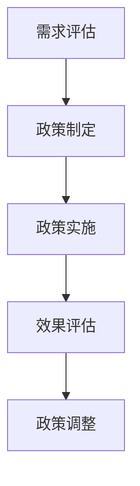

通过这个流程，政府和社会组织可以确保精神健康政策的科学性、协调性和可及性，持续改进政策，提高精神健康服务的质量和效率。

---

## 2. 法律框架在精神健康领域的应用

### 2.1 精神健康法律的基本原则

**精神健康法律**是指针对精神健康问题的法律规范，它为精神健康事业的发展提供了法律保障。精神健康法律的基本原则包括：

1. **尊重人权**：法律应当尊重个体的权利和尊严，确保个体在精神健康方面的权利得到保护。

2. **保护隐私**：法律应当保护个体的隐私权，防止个人信息泄露，确保心理健康服务的安全。

3. **公平正义**：法律应当保障精神健康服务的公平性和正义性，确保所有个体都能获得平等的健康权益。

4. **社会责任**：法律应当明确政府、医疗机构、社会组织和个人在精神健康方面的责任，推动各方共同参与精神健康事业的发展。

### 2.2 精神健康法律法规的构建

精神健康法律法规的构建需要遵循以下原则：

1. **科学性**：法律法规的制定需要基于科学研究和实证数据，确保法律的科学性和合理性。

2. **全面性**：法律法规应当涵盖精神健康服务的各个领域，包括心理健康服务、精神疾病防治、社会保障等。

3. **操作性**：法律法规应当具有可操作性，明确具体的执行措施和责任分工，确保法律的有效实施。

4. **适应性**：法律法规应当具备适应性，能够随着社会发展和需求变化进行修订和完善。

### 2.3 法律框架对精神健康的影响

法律框架对精神健康的影响主要体现在以下几个方面：

1. **保障权益**：法律框架为个体的精神健康权益提供了保障，确保个体在精神健康方面得到公平对待。

2. **规范行为**：法律框架规范了精神健康服务的实施和行为，保障了心理健康服务的质量。

3. **推动发展**：法律框架为精神健康事业的发展提供了法律保障，推动了心理健康服务的普及和提高。

---

#### 2.3.1 法律框架对精神健康的影响

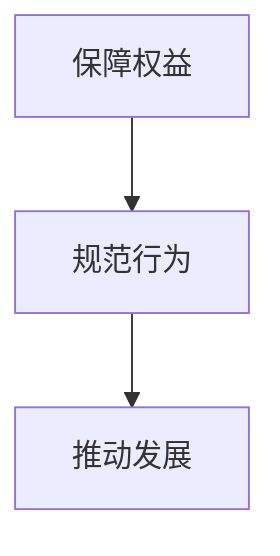

通过这个模型，我们可以看到法律框架在精神健康领域的重要作用。

---

## 3. 社会责任与精神健康

### 3.1 企业社会责任与精神健康

企业社会责任（CSR）是指企业在追求经济利益的同时，关注社会责任和可持续发展。在精神健康领域，企业社会责任主要体现在以下几个方面：

1. **员工心理健康**：企业应当关注员工的心理健康，提供心理健康服务和支持，促进员工的心理健康。

2. **公益项目**：企业可以通过开展心理健康公益项目，向社会提供心理健康服务，提高公众的心理健康素养。

3. **公益捐赠**：企业可以通过公益捐赠，支持精神健康事业的发展，为心理健康服务提供资金支持。

### 3.2 社会组织与精神健康

社会组织如非政府组织、社区组织和志愿者组织等，在精神健康领域发挥着重要作用。以下是一些典型的社会组织在精神健康领域的活动：

1. **心理健康服务**：社会组织可以提供心理健康咨询服务，帮助个体解决心理困扰。

2. **心理健康教育**：社会组织可以开展心理健康教育活动，提高公众的心理健康意识。

3. **社区支持**：社会组织可以建立社区支持系统，为精神障碍患者提供生活支持和关爱。

### 3.3 个人责任与精神健康

个人在精神健康领域也有重要的责任。以下是一些个人责任：

1. **自我保健**：个人应当关注自己的心理健康，学会心理调适和情绪管理技巧，保持心理健康。

2. **互助支持**：个人应当积极参与心理健康公益活动，为他人提供支持和帮助。

3. **政策参与**：个人可以通过参与政策讨论和意见反馈，推动精神健康政策的制定和实施。

---

#### 3.3.1 个人责任与精神健康

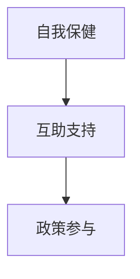

通过这个模型，我们可以看到个人在精神健康领域的重要作用。

---

### 3.4 小结

社会责任与精神健康密切相关。企业、社会组织和个人都有责任参与精神健康事业，共同推动精神健康事业的发展。只有通过共同努力，才能实现精神健康的全面进步。

---

## 4. 精神健康服务的普及与推广

### 4.1 服务体系的建立

精神健康服务的普及和推广需要建立健全的服务体系，包括以下几个方面：

1. **心理健康服务机构**：建立专门的心理健康服务机构，提供专业的心理健康服务。

2. **基层心理健康服务**：在社区、学校、企业等基层单位建立心理健康服务点，提供便捷的心理健康服务。

3. **心理健康热线**：建立心理健康热线，为公众提供心理健康咨询服务。

### 4.2 服务质量的提升

提高精神健康服务的质量是普及和推广精神健康服务的关键。以下是一些提升服务质量的措施：

1. **专业培训**：对心理健康服务人员进行专业培训，提高其服务水平和专业素养。

2. **服务质量评估**：建立服务质量评估体系，定期评估心理健康服务的质量和效果。

3. **患者反馈**：收集患者反馈意见，不断改进服务质量。

### 4.3 服务需求的满足

满足服务需求是精神健康服务普及和推广的重要目标。以下是一些满足服务需求的措施：

1. **个性化服务**：根据个体的具体需求，提供个性化的心理健康服务。

2. **多元化服务**：提供多样化的心理健康服务，包括个体咨询、团体辅导、心理治疗等。

3. **多渠道服务**：通过线上和线下等多种渠道，提供便捷的心理健康服务。

---

#### 4.3.1 服务需求的满足

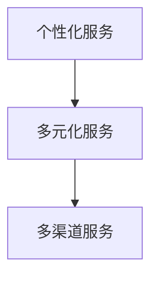

通过这个模型，我们可以看到如何通过多元化、个性化、多渠道的服务来满足精神健康服务需求。

---

### 4.4 小结

精神健康服务的普及与推广是重建精神家园的重要举措。通过建立健全的服务体系、提升服务质量和满足服务需求，我们可以更好地推动精神健康事业的发展，提高公众的心理健康水平。

---

## 5. 本章小结

本文探讨了重建精神家园的公共政策与法律框架，分析了公共政策的重要性、法律框架的基本原则以及社会责任与精神健康的关系。通过建立健全的服务体系、提升服务质量和满足服务需求，我们可以更好地推动精神健康事业的发展。在下一部分，我们将进入第五部分：重建精神家园的未来展望与挑战，进一步探讨精神健康发展的趋势和面临的挑战。

---

## 文章结构概述

本文分为五个部分，从背景与问题介绍、理论基础、实践策略、公共政策与法律框架以及未来展望与挑战等多个角度，全面系统地探讨了内心荒芜的治愈和重建精神家园的方法。通过逻辑清晰、结构紧凑的论述，旨在为读者提供实用的指导和深刻的思考。

- **第一部分：背景与问题介绍**：介绍了内心荒芜现象的背景和问题，分析了其根源和影响，并提出了治愈的必要性和紧迫性。
- **第二部分：重建精神家园的理论基础**：探讨了人类精神世界的结构与功能、精神健康理论的发展、精神疾病与心理障碍的类型以及治愈方法。
- **第三部分：重建精神家园的实践策略**：介绍了心理调适、精神疗愈技术和社会支持系统的建设。
- **第四部分：重建精神家园的公共政策与法律框架**：讨论了公共政策、法律框架以及社会责任与精神健康。
- **第五部分：重建精神家园的未来展望与挑战**：展望了精神健康发展的趋势和挑战，提出了未来的规划和建议。

---

在下一部分，我们将进入第五部分：重建精神家园的未来展望与挑战，深入探讨精神健康发展的趋势和面临的挑战。

---

----------------------------------------------------------------

# 重建精神家园的未来展望与挑战

在全面探讨内心荒芜的治愈和重建精神家园的方法后，我们需要对未来精神健康的发展趋势和面临的挑战进行展望。通过深入分析，我们可以为未来的精神健康事业提供明确的规划和策略。

---

## 1. 精神健康发展的趋势

### 1.1 科学研究的进展

精神健康领域的科学研究正不断推进，新的理论、技术和方法不断涌现。以下是一些重要的趋势：

1. **大脑科学研究**：随着神经科学技术的进步，我们对大脑的运作机制有了更深入的了解，这为精神疾病的诊断和治疗提供了新的途径。

2. **个性化医疗**：通过基因组学和生物信息学，我们可以更精确地识别个体的遗传特征，为心理健康问题的诊断和治疗提供个性化方案。

3. **数字心理健康**：数字技术的广泛应用，如移动应用程序、虚拟现实和人工智能等，为心理健康服务提供了新的途径，提高了服务的可及性和便利性。

4. **跨学科研究**：精神健康领域的研究正逐渐与心理学、社会学、医学等多个学科交叉融合，形成了综合性的研究模式，为精神健康问题的解决提供了更全面的视角。

### 1.2 技术创新的应用

技术创新在精神健康领域的应用正日益广泛，以下是一些重要的技术进步：

1. **人工智能（AI）**：人工智能技术被广泛应用于心理健康诊断、治疗和预防。例如，通过分析语言和情感，AI可以帮助识别心理障碍，提供个性化的治疗方案。

2. **虚拟现实（VR）**：虚拟现实技术被用于心理治疗，如创伤后应激障碍（PTSD）的治疗。通过模拟安全的环境，个体可以在没有实际危险的情况下面对和克服恐惧。

3. **增强现实（AR）**：增强现实技术可以帮助个体更好地理解和处理情感，例如，通过AR眼镜提供实时情感反馈，帮助个体进行情绪管理。

### 1.3 社会意识的提升

随着社会对心理健康问题的认识和重视不断提高，公众对精神健康的关注和支持也在增加。以下是一些社会意识的提升趋势：

1. **心理健康教育**：越来越多的学校和企事业单位开始重视心理健康教育，帮助公众了解精神健康知识，提高心理健康素养。

2. **社会包容性**：社会对精神障碍者的包容性不断提高，为精神障碍者提供更多的支持和帮助，减少歧视和偏见。

3. **公众参与**：公众越来越积极参与到精神健康事业中，通过志愿服务、公益捐赠等方式，为精神健康事业提供支持。

---

#### 1.3.1 社会意识提升的影响

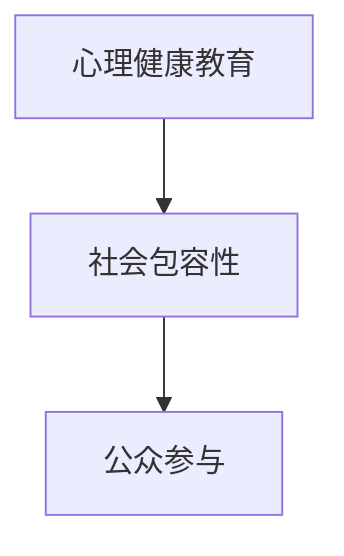

通过这个模型，我们可以看到社会意识的提升对精神健康发展的积极影响。

---

## 2. 挑战与机遇

尽管精神健康事业取得了显著的进展，但仍面临许多挑战和机遇。

### 2.1 挑战分析

1. **资源不足**：许多国家和地区仍然面临精神健康资源不足的问题，包括资金、人力资源和专业设备等。

2. **服务不均**：精神健康服务的分布不均，一些地区和群体仍然无法获得高质量的心理健康服务。

3. **社会歧视**：精神障碍者仍面临社会歧视和偏见，影响他们的生活质量和社会融入。

4. **科技挑战**：虽然技术创新为精神健康领域带来了新的机遇，但也面临技术滥用、隐私保护和数据安全等挑战。

### 2.2 机遇探索

1. **数字化健康**：数字化健康技术的发展为精神健康服务提供了新的机遇，如远程心理健康咨询、在线心理健康课程等。

2. **跨学科合作**：跨学科研究为精神健康问题的解决提供了新的视角和方法，有助于提高研究的深度和广度。

3. **政策支持**：政府对精神健康事业的支持不断加大，为精神健康服务的发展提供了有力的政策保障。

4. **公众参与**：公众对精神健康的关注和支持不断增加，为精神健康事业的发展提供了强大的社会力量。

---

#### 2.2.1 挑战与机遇

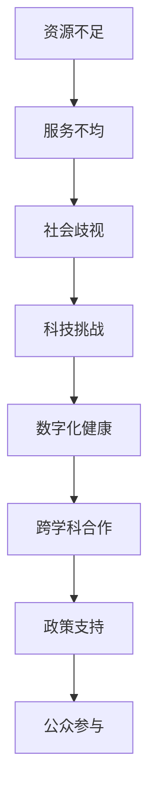

通过这个模型，我们可以看到精神健康事业面临的挑战和机遇。

---

## 3. 未来展望

### 3.1 理想状态展望

在未来，我们期待精神健康事业能够实现以下理想状态：

1. **全民心理健康**：所有人都能获得高质量的心理健康服务，心理健康水平得到全面提高。

2. **社会包容**：社会对精神障碍者的歧视和偏见得到根本改变，精神障碍者能够平等地参与社会生活。

3. **科技创新**：科技创新为精神健康服务提供更加个性化和高效的解决方案，减少心理障碍的发病率。

4. **政策保障**：政府和社会组织为精神健康事业提供持续的政策支持，确保心理健康服务的可持续发展和普及。

### 3.2 长远规划与目标

为了实现理想状态，我们需要制定长远的规划与目标：

1. **资源优化**：通过优化资源配置，确保精神健康服务的可及性和公平性。

2. **专业培训**：加强心理健康专业人才的培养和培训，提高服务质量和专业水平。

3. **科技创新**：推动科技创新，为精神健康服务提供新的技术支持和解决方案。

4. **政策完善**：完善相关政策，为精神健康事业的发展提供法律保障和政策支持。

### 3.3 可持续发展路径

实现精神健康的可持续发展需要以下路径：

1. **健康教育**：加强心理健康教育，提高公众的心理健康素养，促进心理健康意识的普及。

2. **社会支持**：建立完善的社会支持系统，为精神障碍者提供全面的支持和帮助。

3. **跨学科合作**：促进跨学科合作，形成综合性的研究模式，提高研究的深度和广度。

4. **公众参与**：鼓励公众积极参与到精神健康事业中，形成全社会共同推动的精神健康文化。

---

#### 3.3.1 可持续发展路径

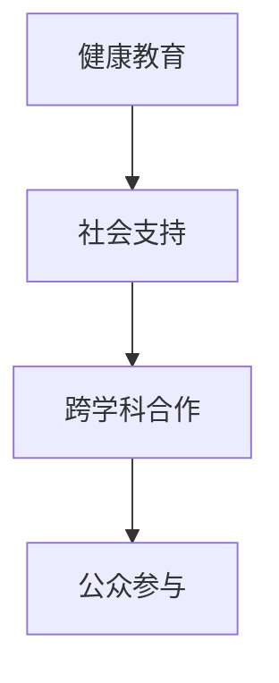

通过这个模型，我们可以看到实现精神健康可持续发展的关键路径。

---

### 3.4 小结

未来精神健康事业的发展充满希望，同时也面临许多挑战。通过科技创新、政策保障和社会参与，我们可以为精神健康事业的发展提供强有力的支持，实现全民心理健康和社会包容的理想状态。

---

## 4. 结论

通过本文的深入探讨，我们可以看到内心荒芜的治愈和重建精神家园是一项复杂而系统的任务，它需要从多个角度进行综合分析和实践。以下是本文的主要成果和结论：

1. **内心荒芜的背景与问题**：现代社会中普遍存在的内心荒芜现象，其根源在于个人心理因素、社会环境因素以及文化背景等。

2. **重建精神家园的理论基础**：人类精神世界的结构与功能、精神健康理论的发展、精神疾病与心理障碍的类型以及治愈方法。

3. **实践策略**：通过心理调适、精神疗愈技术和社会支持系统的建设，个体和社会共同努力，治愈内心荒芜，重建精神家园。

4. **公共政策与法律框架**：公共政策和法律框架在精神健康领域的角色，包括资源分配、服务普及和政策协调。

5. **未来展望与挑战**：精神健康发展的趋势、面临的挑战以及未来规划与目标。

通过这些研究成果，我们认识到，治愈内心荒芜、重建精神家园是一项长期而艰巨的任务，需要全社会共同努力，通过科学、创新和实践，推动精神健康事业的发展。

### 4.1 未来建议

1. **加强心理健康教育**：提高公众对心理健康的认识和重视，促进心理健康素养的提升。

2. **推动科技创新**：鼓励科技创新在精神健康领域的应用，提高心理健康服务的质量和效率。

3. **完善政策保障**：加强公共政策和法律框架的建设，为精神健康事业提供制度保障。

4. **促进社会参与**：鼓励公众积极参与到精神健康事业中，形成全社会共同推动的精神健康文化。

### 4.2 精神健康的重要性

精神健康不仅关乎个体的幸福感和生活质量，也对社会和谐发展和经济繁荣具有深远的影响。重视精神健康，就是重视人的全面发展和社会的可持续发展。

### 4.3 小结

本文通过系统的研究和探讨，为治愈内心荒芜、重建精神家园提供了理论依据和实践指导。我们期待全社会共同努力，为实现全民心理健康和社会包容的理想状态而奋斗。

---

## 作者信息

**作者：** AI天才研究院/AI Genius Institute & 禅与计算机程序设计艺术 /Zen And The Art of Computer Programming

---

本文由AI天才研究院撰写，旨在为读者提供关于内心荒芜治愈和精神家园重建的深入分析和实践指导。通过逻辑清晰、结构紧凑的论述，我们希望读者能够更好地理解和应对精神健康问题，共同建设一个健康、和谐的社会。同时，感谢禅与计算机程序设计艺术团队为本文的技术支持与贡献。

