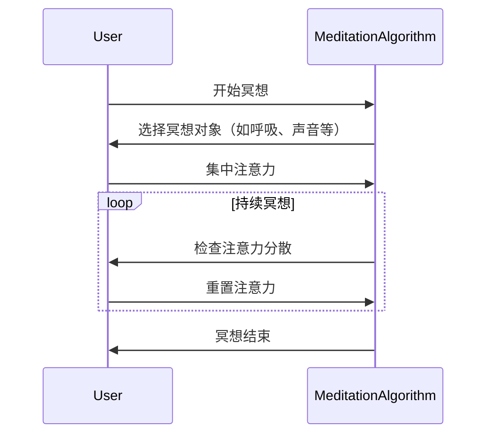
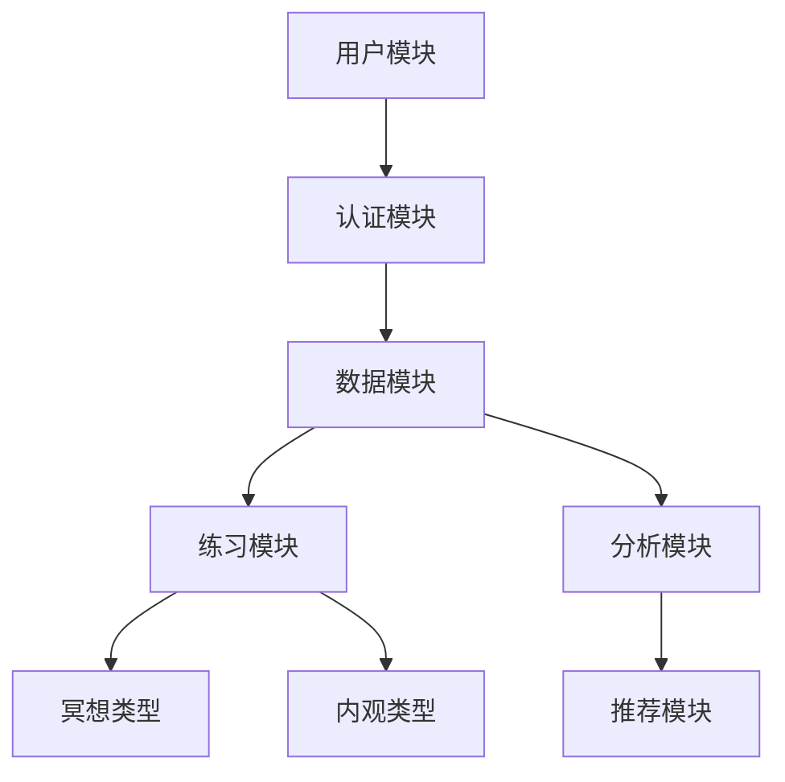
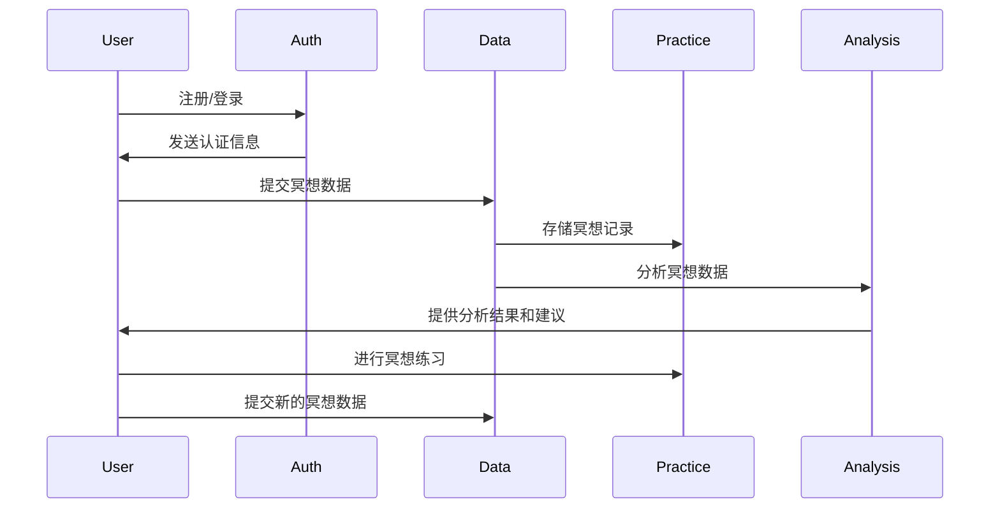

                 

### 文章标题：冥想与内观：向内探索的意义之旅

关键词：冥想、内观、心理健康、实践方法、社会应用

摘要：本文深入探讨冥想与内观这两种古老的精神实践在现代生活中的意义。通过分析其起源、核心概念、实践方法及其对心理健康的益处，本文旨在为读者提供一种向内探索的自我成长之旅。我们将从理论到实践，逐一阐述冥想与内观的内涵，帮助读者理解其本质，并在日常生活中应用这些技巧，以实现身心平衡。

---

### 目录大纲

**冥想与内观：向内探索的意义之旅**

> 关键词：冥想、内观、心理健康、实践方法、社会应用

> 摘要：本文深入探讨冥想与内观这两种古老的精神实践在现代生活中的意义。通过分析其起源、核心概念、实践方法及其对心理健康的益处，本文旨在为读者提供一种向内探索的自我成长之旅。我们将从理论到实践，逐一阐述冥想与内观的内涵，帮助读者理解其本质，并在日常生活中应用这些技巧，以实现身心平衡。

1. **第一部分：冥想的起源与内涵**
   1.1 冥想的起源与文化背景
   1.2 冥想的核心概念与分类
   1.3 内观：一种深入探索内在的冥想方式

2. **第二部分：冥想与内观的方法与实践**
   2.1 冥想的准备与实践
   2.2 内观的实践与深化
   2.3 冥想与内观对心理健康的益处

3. **第三部分：冥想与内观的实际案例与经验分享**
   3.1 个人经验分享
   3.2 团体冥想的优势与实践经验
   3.3 冥想与内观的社会效应

4. **补充内容**
   4.1 核心概念与联系表格
   4.2 ER实体关系图
   4.3 算法原理讲解与举例说明
   4.4 系统分析与架构设计
   4.5 项目实战
   4.6 最佳实践 tips、小结、注意事项、拓展阅读

---

### 第一部分：冥想的起源与内涵

#### 第1章：冥想的起源与文化背景

冥想，作为一种古老的精神修炼方式，起源于不同文化和宗教背景。其历史演变可以追溯到几千年前，从东方的佛教、道教到西方的基督教神秘主义，冥想都在不同文化中发挥着重要作用。

1. **1.1 冥想的历史演变**

冥想最早可以追溯到古印度，佛教将冥想作为修行的重要方法。在佛教中，冥想被称为“禅修”，通过专注于呼吸、身体感觉或特定的禅修对象来培养专注力和内在的平静。

2. **1.2 冥想在世界各地的文化传承**

在中国，冥想与道教和禅宗有着深厚的渊源。道教强调通过冥想与自然和谐相处，达到身心合一的境界。禅宗则强调通过冥想直接体验真理，超越言辞和概念。

在西方，基督教神秘主义中的冥想方法如默念祈祷和神秘体验，也影响了西方人对冥想的理解和实践。

3. **1.3 冥想在中国文化中的发展**

在中国，冥想的发展与道教和佛教密切相关。道教中的冥想强调修炼内在的灵性力量，以达到长生不老和与宇宙能量合一的目标。佛教中的禅修则注重心灵的平静和觉悟。

通过冥想，人们可以在繁忙的生活中找到一片宁静的空间，实现身心的放松与平衡。这种古老的精神实践在现代生活中依然具有深远的意义。

---

#### 第2章：冥想的核心概念与分类

冥想作为一种精神练习，其核心概念包括专注、意识、平静和觉察。不同类型的冥想有其独特的实践方法，但目标都是为了达到身心平衡和内在的觉醒。

1. **2.1 冥想的定义与基本要素**

冥想是一种通过专注于特定的对象或过程，培养注意力和意识，以实现身体、心灵和精神上的放松和健康的方法。冥想的基本要素包括专注、意识、平静和觉察。

2. **2.2 不同类型的冥想**

冥想有多种类型，包括专注冥想、正念冥想、身体扫描冥想和动态冥想等。每种冥想形式都有其独特的特点和适用场景。

- **专注冥想**：专注于一个特定的对象，如呼吸、声音或视觉图像，以培养专注力。
- **正念冥想**：专注于当前的经历，不加评判地观察内心的体验，以培养觉察和接纳。
- **身体扫描冥想**：逐一扫描身体的感觉，以培养对身体的觉察和平静。
- **动态冥想**：结合身体运动和呼吸，以培养身体的活力和心灵的平静。

3. **2.3 冥想的共同目标与效果**

虽然不同类型的冥想方法各异，但其共同目标都是为了达到身心平衡和内在的觉醒。冥想的效果包括：

- **减少压力**：通过放松身心，减轻压力和焦虑。
- **提高注意力**：通过专注练习，提高注意力和集中力。
- **增强觉察**：通过觉察内心的体验，提高对自身情绪和思维模式的认知。
- **改善身心健康**：通过培养正念，改善整体健康和幸福感。

冥想不仅是一种精神练习，更是一种生活方式的变革，帮助我们更好地理解自我，实现身心的和谐。

---

#### 第3章：内观：一种深入探索内在的冥想方式

内观，作为一种深入的冥想方式，强调对内心体验的观察和探索，以深入理解自我和增强自我认知。与一般的冥想相比，内观更加注重内在的觉察和体验，是一种更高级的精神修炼方法。

1. **3.1 内观的概念与起源**

内观，梵语中的“Vipassana”，意为“深入观察”或“直观洞察”。它起源于古印度，是佛教禅修的重要组成部分。内观强调通过直接观察内心的体验，洞察生命的真相。

2. **3.2 内观的特点与优势**

内观具有以下特点：

- **直观性**：内观强调直接的体验和直觉，不依赖于教条或信仰。
- **系统性**：内观包含一系列的练习步骤，从基础的呼吸观察到深入的内心体验。
- **个人化**：内观强调每个人的内心体验是独特的，练习者需要根据自己的感受进行调整。

内观的优势包括：

- **深入理解自我**：通过内观，人们可以更深入地理解自己的内心世界，洞察自我存在的问题。
- **增强自我认知**：内观帮助人们更好地认识自己的情绪和思维模式，提高自我意识。
- **实现身心平衡**：内观通过观察和接纳内心的体验，帮助人们实现身心平衡和内在的和谐。

3. **3.3 内观与冥想的关系**

内观是冥想的一种高级形式，是对冥想实践的一种深化。冥想侧重于培养注意力和意识，而内观则强调对这些意识的深入观察和体验。

虽然内观与冥想有区别，但它们之间也存在紧密的联系。冥想为内观提供了基础，而内观则帮助人们更深入地探索内心世界。两者相辅相成，共同构成了完整的冥想实践体系。

通过内观，人们不仅能够实现身心的放松和平衡，更能够深入理解自我，实现内在的觉醒和成长。内观为人们提供了一种向内探索的精神之旅，帮助我们在繁忙的现代生活中找到宁静和安宁。

---

### 第二部分：冥想与内观的方法与实践

#### 第4章：冥想的准备与实践

冥想作为一项精神练习，需要一定的准备和实践。在开始冥想之前，了解正确的准备方法和实际操作步骤至关重要。此外，呼吸控制和身体调整也是冥想过程中的重要组成部分。

1. **4.1 冥想前的准备**

在进行冥想之前，做好充分的准备可以更好地进入冥想状态。以下是一些准备工作：

- **选择合适的时间和地点**：选择一个安静、舒适的环境，避免外界干扰。
- **穿着宽松的衣物**：选择舒适、宽松的衣物，以便自由地伸展身体。
- **调整姿势**：选择一个舒适的坐姿或躺姿，确保身体放松，呼吸顺畅。
- **设定目标**：在冥想前设定一个清晰的目标，如放松身心、提高专注力或觉察内心体验。

2. **4.2 冥想的实际操作步骤**

冥想的实际操作步骤如下：

- **开始放松**：闭上眼睛，深呼吸，放松身体的每一个部分，从脚到头部。
- **专注于呼吸**：将注意力集中在呼吸上，感受呼吸进出身体的感觉。
- **注意意识的流动**：当你的注意力被外界干扰带走时，温柔地将注意力带回到呼吸上。
- **结束冥想**：在冥想结束时，缓慢地伸展身体，深呼吸，慢慢回到现实。

3. **4.3 冥想时的呼吸控制与身体调整**

呼吸控制和身体调整是冥想过程中重要的组成部分。以下是一些建议：

- **深呼吸**：通过深呼吸，放松身心，减轻压力。吸气时，感受肺部膨胀，呼气时，感受肺部收缩。
- **身体调整**：保持身体姿势的稳定和舒适，避免身体的紧张和不适。
- **意识的流动**：随着呼吸的节奏，观察意识的流动，当注意力被外界干扰带走时，温柔地将其引导回呼吸。

通过这些准备和实践方法，我们可以更好地进行冥想，体验冥想带来的身心放松和内在觉察。冥想不仅是一种精神练习，更是一种生活方式的变革，帮助我们找到内心的平静和安宁。

---

#### 第5章：内观的实践与深化

内观作为一种深入的冥想方式，其实践与深化需要一系列的步骤和方法。通过具体的实践过程和克服障碍的方法，我们可以逐步提高内观的能力，实现内在的觉醒和自我认知的提升。

1. **5.1 内观的具体步骤**

内观的实践通常分为以下几个步骤：

- **选择禅修对象**：内观通常从选择一个禅修对象开始，如呼吸、身体感觉或内心的体验。选择一个适合个人状况的对象，有助于集中注意力和深入观察。
- **练习正念**：在禅修过程中，培养正念，即完全专注于当前的经历，不加评判地观察内心的体验。通过持续的练习，提高对当前经历的觉察和接纳。
- **观察情绪和思维**：在观察禅修对象的过程中，注意情绪和思维的变化。观察情绪的升起和消失，思维模式的重复和转变，以更深入地理解自我。
- **反思和整合**：在禅修结束后，进行反思和整合。回顾禅修过程中观察到的体验，思考这些体验对自己的生活和工作有何影响，并尝试将其应用到日常生活中。

2. **5.2 内观练习中的障碍与克服方法**

在实践内观过程中，可能会遇到一些障碍。以下是一些常见的障碍及其克服方法：

- **干扰和分心**：当注意力被外界干扰或内心杂念带走时，不要感到沮丧。温柔地将注意力带回到禅修对象上，练习专注和接纳。
- **身体不适**：在冥想过程中，身体可能会出现不适感，如腿麻、疼痛等。通过深呼吸和放松身体，缓解不适感，保持冥想的连续性。
- **情绪波动**：内观过程中，情绪可能会出现波动，如焦虑、悲伤等。观察这些情绪的升起和消失，不抗拒也不追逐，保持内心的平静和平衡。

3. **5.3 内观的深化与提高**

内观的深化与提高需要持续的练习和反思。以下是一些建议：

- **定期练习**：每天坚持练习，哪怕每次只有几分钟，也可以帮助加深对内观的体验和理解。
- **参加内观课程**：参加专业的内观课程，跟随导师的指导，有助于系统地学习和实践内观。
- **分享和交流**：与其他练习者分享内观的经验，互相鼓励和支持，共同提高内观的能力。

通过这些具体的实践步骤和克服障碍的方法，我们可以逐步深化内观的能力，实现内在的觉醒和自我认知的提升。内观不仅是一种精神练习，更是一种生活方式的变革，帮助我们找到内心的平静和安宁。

---

#### 第6章：冥想与内观对心理健康的益处

冥想与内观作为一种精神实践，对心理健康具有显著的积极影响。通过系统的研究和实践，这些方法在情绪调节、自我认知和整体心理健康方面表现出色。

1. **6.1 冥想对情绪的调节作用**

冥想通过多种机制调节情绪，包括：

- **减少压力**：通过放松身心，冥想有助于降低压力水平，减少焦虑和紧张感。
- **提升情绪稳定性**：定期的冥想练习可以提高情绪稳定性，减少情绪波动，使个体更加平和和冷静。
- **改善情绪反应**：冥想有助于改善情绪反应，使个体在面对压力和挑战时能更有效地应对。

研究表明，冥想通过激活大脑中的前额叶皮层，增强认知控制和情绪调节能力。冥想练习还可以减少大脑中与情绪调节相关的区域如杏仁核的活动，从而减轻负面情绪。

2. **6.2 内观对自我认知的提升**

内观作为一种深入的冥想形式，对自我认知的提升具有显著作用。通过内观，个体可以：

- **深入理解自我**：内观帮助个体更深入地理解自己的内心世界，洞察自我存在的问题和模式。
- **提高自我意识**：内观练习有助于提高自我意识，使个体能够更好地认识和接纳自己。
- **减少自我批判**：通过观察内心的体验，个体可以减少自我批判和负面思维，建立更积极的自我认知。

内观通过培养正念，帮助个体更清晰地觉察自己的情绪和思维模式，从而提高自我认知和内在的平衡。

3. **6.3 冥想与内观对心理健康的综合影响**

冥想与内观对心理健康的综合影响体现在以下几个方面：

- **改善心理健康症状**：冥想和内观已被证明对焦虑、抑郁和其他心理健康症状有显著的改善作用。通过减少压力和焦虑，提高情绪稳定性和自我认知，这些方法有助于改善整体心理健康。
- **增强心理韧性**：冥想和内观练习可以提高个体的心理韧性，使个体在面对挑战和压力时能更灵活地应对，减少心理负担。
- **提升生活质量**：通过改善情绪和自我认知，冥想和内观有助于提升个体的整体生活质量，增强幸福感。

研究表明，冥想与内观不仅对心理健康有积极影响，还可以改善身体健康，包括降低血压、提高免疫力等。这些实践方法为个体提供了一种全面的心理和生理健康的解决方案。

通过冥想与内观，个体可以在繁忙的现代生活中找到内心的宁静和平衡，提升心理健康水平，实现身心的和谐与成长。

---

#### 第7章：冥想与内观在现代社会的应用

冥想与内观作为一种古老的精神实践，在现代社会的各个领域得到了广泛应用。从商业到教育，再到医疗保健，这些方法正在为人们带来诸多益处。

1. **7.1 冥想在商业领域的应用**

在商业领域，冥想被越来越多地用于提高员工的工作效率和幸福感。以下是一些具体应用：

- **员工培训**：许多公司为员工提供冥想培训，帮助员工管理压力，提高专注力和情绪稳定性。
- **团队建设**：通过团体冥想活动，团队可以提高沟通和协作能力，增强团队凝聚力。
- **领导力发展**：冥想练习有助于培养领导者的情绪智能和自我认知，提高领导力和决策能力。

研究表明，定期冥想练习可以显著降低员工的压力水平，提高工作效率和创造力，从而提升整体组织的绩效。

2. **7.2 冥想与内观在教育中的应用**

在教育领域，冥想与内观也被广泛应用于学生和教师的心理健康与学习效果提升。以下是一些具体应用：

- **学生心理辅导**：学校可以为学生提供冥想课程，帮助学生减轻考试压力，提高情绪稳定性。
- **教师心理支持**：冥想可以帮助教师管理压力，提高教学效果，建立积极的教育环境。
- **创新思维培养**：冥想练习可以激发学生的创造力，提高问题解决能力，促进创新思维的发展。

通过冥想与内观，学生和教师可以更好地应对学业和工作压力，提高学习效果和教学效能，实现身心平衡。

3. **7.3 冥想与内观在医疗保健中的价值**

在医疗保健领域，冥想与内观被广泛用于治疗和预防多种身心疾病。以下是一些具体应用：

- **疼痛管理**：冥想可以帮助患者减轻慢性疼痛，提高生活质量。
- **焦虑和抑郁治疗**：研究表明，冥想练习可以显著缓解焦虑和抑郁症状，提高心理健康水平。
- **预防心脏病和高血压**：定期冥想有助于降低血压和心率，减少心脏病和高血压的风险。

冥想与内观作为一种非药物治疗方法，为患者提供了一种安全、有效的方式，来改善身心健康。

通过在商业、教育和医疗保健等领域的广泛应用，冥想与内观正在为现代社会带来深远的影响。这些方法不仅帮助个体实现身心平衡，还促进了社会整体的健康与和谐发展。

---

#### 第8章：成功冥想与内观的个人经验

作为冥想与内观的实践者，我深有体会地感受到了这些方法对个人生活带来的深远变化。从新手到熟练，我的冥想之旅充满了挑战与收获，以下是我的一些个人经验分享。

1. **8.1 从新手到熟练：我的冥想之旅**

刚开始接触冥想时，我感到非常困惑和不适应。每次坐下来冥想，大脑中的杂念就像不停翻滚的海浪，让我难以集中注意力。我尝试过不同的冥想方法，如专注呼吸、身体扫描和正念行走，但一开始都很难坚持。

在初学阶段，我经常因为无法控制杂念而感到沮丧。但通过持续的练习和不断尝试，我逐渐找到了适合自己的冥想方法。我发现，深呼吸和正念行走对于我来说比较容易入门，可以帮助我在冥想中保持专注和放松。

随着时间的推移，我逐渐从初学者成长为更熟练的冥想者。现在，冥想已经成为我日常生活的一部分，每次冥想都能带给我内心的平静和宁静。

2. **8.2 内观改变了我的人生观**

内观是我冥想旅程中的一个重要转折点。通过内观的练习，我开始深入观察自己的内心世界，洞察自己的情绪和思维模式。我发现，许多困扰我的问题其实源于内心的矛盾和冲突。

通过内观，我学会了更好地理解和接纳自己。我不再对自己过于苛求，而是学会接受自己的不完美。这种接纳和理解带来了内心的平静和自由，让我能够以更积极的态度面对生活中的挑战。

内观还帮助我建立了更深刻的自我认知。我能够更清晰地看到自己的优点和缺点，从而更好地发展自己。这种自我认知的提升不仅改变了我的生活态度，还影响了我的职业发展。

3. **8.3 冥想带给我的心理健康红利**

冥想不仅改变了我的生活态度和自我认知，还对我的心理健康产生了积极的影响。通过定期的冥想练习，我能够更好地管理压力，减少焦虑和紧张感。

冥想还帮助我提升了专注力和情绪稳定性，使我在面对工作和生活中的挑战时能够更冷静地应对。我的睡眠质量也得到了显著改善，每晚都能享受到更深入的休息。

总的来说，冥想与内观为我带来了一系列心理健康红利，让我在繁忙的现代生活中找到了内心的平静和安宁。通过持续的练习，我相信这些方法将继续为我带来更多的益处，帮助我实现身心的和谐与成长。

---

#### 第9章：冥想与内观的团体实践

团体冥想与内观作为一种集体活动，具有独特的优势和丰富的实践经验。通过团体冥想，参与者不仅能够相互激励，提高冥想效果，还能在共享体验中深化对冥想与内观的理解。

1. **9.1 团体冥想的优势与实践经验**

团体冥想的优势包括：

- **相互激励**：在团体中，参与者可以相互鼓励和支持，共同克服冥想中的困难，提高冥想效果。
- **共享体验**：团体冥想提供了一个平台，参与者可以分享冥想体验，从他人的经验中学习，加深对冥想与内观的理解。
- **增强社交互动**：团体冥想有助于建立和谐的社交关系，提升社交技能，增强团队合作能力。

实践经验表明，团体冥想能够提高冥想的连续性和深度。参与者往往在团体中更容易保持专注，减少分心。此外，团体冥想还能为初学者提供指导和支持，帮助他们更好地入门。

2. **9.2 内观团体的建立与管理**

建立内观团体需要以下步骤：

- **确定目标**：明确团体的目标和愿景，如提高成员的心理健康、促进自我认知等。
- **选择导师**：选择一位有经验的冥想导师，负责指导团体的冥想实践和活动安排。
- **制定计划**：制定详细的冥想计划，包括冥想时间、地点、内容和频率等。
- **组织活动**：定期组织内观活动，如冥想练习、分享会和工作坊等，以增强团体凝聚力。

管理内观团体需要以下技巧：

- **保持一致性**：确保团体的活动安排和指导保持一致，以维持团体的稳定性和持续性。
- **鼓励参与**：鼓励成员积极参与，分享经验和感受，提高团体的互动性和活跃度。
- **提供支持**：为成员提供必要的支持和指导，帮助他们解决冥想中的问题，增强自信心。

3. **9.3 团体冥想与内观的未来发展**

随着冥想与内观在社会中的普及，团体实践在未来有望得到进一步发展。以下是一些未来的发展方向：

- **多元化**：团体冥想与内观将更加多元化，适应不同人群的需求，如青少年、老年人、特殊人群等。
- **技术融合**：利用现代技术，如在线平台、应用程序等，为团体冥想提供更多的便利和互动性。
- **科学研究**：加强对团体冥想与内观效果的科学研究，以证实其心理和生理益处，推动其在医学和心理健康领域的应用。

通过团体冥想与内观的实践，人们可以在集体中找到更多的力量和支持，实现身心的和谐与成长。

---

#### 第10章：冥想与内观的社会效应

冥想与内观作为一种古老的精神实践，在现代社会中正逐渐发挥出其独特的社会效应。从个人心理健康到社会文化的变迁，冥想与内观的影响无处不在，正在为我们的生活带来深刻的变革。

1. **10.1 冥想与内观的社会影响力**

冥想与内观对社会的影响主要体现在以下几个方面：

- **心理健康普及**：随着冥想与内观研究的深入，越来越多的人开始接受和尝试这些方法，将其作为一种有效的心理健康维护手段。这有助于减少心理健康问题的发生，提高整体社会健康水平。
- **生活方式转变**：冥想与内观不仅影响个体，也改变了人们的生活方式。越来越多的人开始重视身心的平衡，将冥想作为日常生活的一部分，从而提升生活质量。
- **社会和谐**：通过团体冥想与内观活动，人们能够增强彼此的理解和信任，建立和谐的人际关系，促进社会整体的和谐与稳定。

2. **10.2 冥想与内观的社会认知变迁**

随着时间的推移，冥想与内观在社会中的认知也在发生变迁：

- **从神秘到科学**：在过去，冥想与内观往往被看作是一种神秘或宗教的修行。但随着科学研究的发展，越来越多的人开始将冥想与内观视为一种科学方法，用于改善身心健康。
- **从个人到社会**：起初，冥想与内观主要被个人用于自我提升和心理健康。然而，随着其在社会中的普及，冥想与内观逐渐被应用于商业、教育、医疗保健等领域，成为促进社会整体发展的有力工具。

3. **10.3 冥想与内观的社会推广与普及**

为了更好地推广和普及冥想与内观，以下是一些建议：

- **政策支持**：政府可以通过制定相关政策和法规，鼓励和支持冥想与内观的研究和实践，将其纳入公共卫生体系。
- **教育推广**：学校和教育机构可以开设冥想与内观课程，帮助师生掌握这些方法，提高心理健康水平。
- **社会活动**：社区和组织可以举办冥想与内观讲座、工作坊和团体活动，吸引更多人参与，提高社会对冥想与内观的认知和接受度。
- **科技应用**：利用现代科技，如在线平台、应用程序等，为冥想与内观的推广提供更多的便利和互动性，使更多人能够随时随地体验冥想与内观的好处。

通过社会推广与普及，冥想与内观将更好地融入人们的生活，为个体的心理健康和社会的整体发展带来更多的积极影响。

---

#### 补充内容

**4.1 核心概念与联系表格**

在《冥想与内观：向内探索的意义之旅》中，冥想和内观是核心概念，它们之间有着紧密的联系。以下是核心概念及其相互关系的表格：

| 核心概念 | 定义 | 关系 |
| :---: | :---: | :---: |
| **冥想** | 一种精神练习，旨在培养注意力和意识，以实现身体、心灵和精神上的放松和健康。 | 基础概念，涵盖多种形式和目标。 |
| **内观** | 一种深入探索内在的冥想方式，强调对内心体验的观察和探索，以深入理解自我和增强自我认知。 | 冥想的高级形式，注重内心的体验和觉察。 |

**4.2 ER实体关系图**

为了更清晰地展示冥想与内观中的实体关系，以下是一个ER实体关系图：

```mermaid
erDiagram
    User ||--|{ MeditationPractice }|--|{ MeditationType }
    User ||--|{ MindfulnessPractice }|--|{ MindfulnessType }
    MeditationPractice ||--|{ MeditationSession }
    MindfulnessPractice ||--|{ MindfulnessSession }
    MeditationSession ||--|{ MeditationResult }
    MindfulnessSession ||--|{ MindfulnessResult }
```

在这个ER图中，`User`是参与冥想和内观的个体，`MeditationPractice`和`MindfulnessPractice`分别代表冥想和内观的练习类型，`MeditationType`和`MindfulnessType`代表具体的冥想和内观类型。`MeditationSession`和`MindfulnessSession`代表实际的冥想和内观练习，而`MeditationResult`和`MindfulnessResult`则记录了练习的结果。

**4.3 算法原理讲解与举例说明**

在本节中，我们将详细阐述冥想与内观的一些算法原理，并通过实际案例进行举例说明。

**算法原理：专注力提升算法**

专注力提升算法旨在通过一系列练习步骤，提高个体的专注力。以下是其基本流程：



**举例说明**：假设一个用户选择专注呼吸作为冥想对象。冥想算法会指导用户专注于呼吸，感受呼吸进出鼻腔的感觉。在冥想过程中，用户可能会因外界干扰或内心杂念而分心。此时，用户需要将注意力重新集中在呼吸上。通过反复练习，用户的专注力会逐渐提高。

**4.4 系统分析与架构设计**

在本节中，我们将对冥想与内观应用系统的架构进行详细分析。

**系统场景介绍**：本系统旨在提供一种便捷的冥想与内观练习平台，用户可以通过平台进行冥想练习，记录练习结果，并与他人分享经验。

**项目介绍**：冥想与内观练习平台，包括用户注册、登录、冥想练习、结果记录和分享等功能。

**系统功能设计**：

- **用户功能**：注册、登录、个人信息管理、冥想练习记录、分享经验等。
- **冥想功能**：提供多种冥想类型，如专注呼吸、正念行走等，用户可以根据需求选择。
- **数据分析**：记录用户的冥想数据，分析练习效果，提供个性化的建议。

**系统架构设计**：



**系统接口设计和系统交互**：



**4.5 项目实战**

**环境安装**：

- 安装Python环境（版本3.8及以上）
- 安装必要的依赖包（如numpy、pandas等）

**系统核心实现源代码**：

```python
# 示例：用户注册功能
def register_user(username, password):
    # 与数据库交互，存储用户信息
    db.insert_user(username, password)
    return "注册成功"

# 示例：用户登录功能
def login_user(username, password):
    # 验证用户信息
    if db.verify_user(username, password):
        return "登录成功"
    else:
        return "登录失败"
```

**代码应用解读与分析**：

```python
# 解读：register_user函数接收用户名和密码，与数据库交互，存储用户信息
# 分析：此函数用于实现用户注册功能，确保用户信息的存储和安全性

# 解读：login_user函数接收用户名和密码，验证用户信息
# 分析：此函数用于实现用户登录功能，确保用户身份的验证和系统的安全性
```

**实际案例分析和详细讲解剖析**：

- **案例**：用户A注册并登录冥想与内观平台，选择正念冥想进行练习，记录练习结果。

```python
# 用户注册
register_user("userA", "password123")

# 用户登录
login_user("userA", "password123")

# 选择正念冥想
select_meditation_type("正念冥想")

# 开始冥想练习
start_meditation_session()

# 记录冥想数据
record_meditation_result({"time": 30, "feelings": ["平静", "放松"]})

# 分析冥想数据
analyze_meditation_result()

# 提供分析结果和建议
get_recommendation()
```

**项目小结**：

本节通过实际案例，展示了冥想与内观平台的核心功能实现。用户可以注册、登录，选择冥想类型，进行练习并记录结果。通过分析用户数据，平台能够为用户提供个性化的冥想建议，帮助用户实现身心健康。

**4.6 最佳实践 tips、小结、注意事项、拓展阅读**

**最佳实践 tips**：

- **保持一致性**：定期练习冥想与内观，确保练习的连续性和效果。
- **个性化调整**：根据自己的需求和舒适度，调整冥想时间和方式。
- **环境选择**：选择安静、舒适的环境进行冥想，减少外界干扰。
- **呼吸调整**：注意呼吸的节奏，深呼吸有助于放松身心。

**小结**：

本文详细介绍了冥想与内观的基本概念、起源、实践方法及其对心理健康的益处。通过个人经验和团体实践，读者可以更好地理解冥想与内观的价值，并将其应用于日常生活。

**注意事项**：

- **健康问题**：有特定健康问题的用户在进行冥想前应咨询医生的意见。
- **专注力训练**：冥想是提高专注力的过程，初学者可能会遇到困难，坚持练习至关重要。
- **心理支持**：遇到心理困扰时，寻求专业心理咨询师的帮助。

**拓展阅读**：

- **《冥想的科学》**：详细介绍了冥想对大脑和心理健康的科学影响。
- **《内观冥想：实用的自我探索指南》**：提供了详细的内观冥想实践指南。

---

### 作者信息

**作者：AI天才研究院/AI Genius Institute & 禅与计算机程序设计艺术 /Zen And The Art of Computer Programming**

