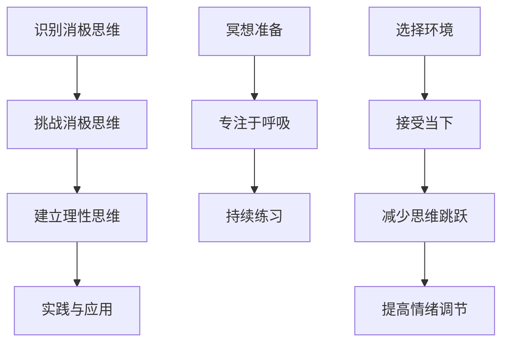
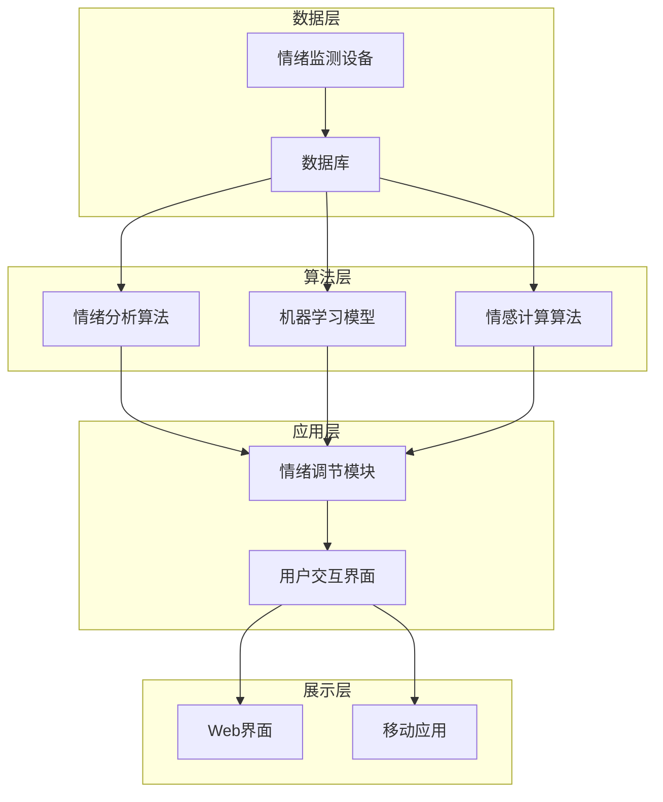
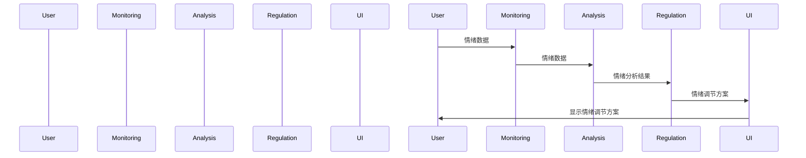

                 

## 《净化思维的实践：摆脱消极情绪的方法》

> 关键词：消极情绪、认知行为疗法、冥想、正念、情绪管理

> 摘要：本文旨在探讨消极情绪的影响、类型及产生原因，并提出一系列科学有效的实践方法，帮助读者摆脱消极情绪，提升生活质量和工作效率。通过详细阐述认知行为疗法、冥想和正念练习等核心概念，结合算法原理、数学模型和系统架构设计，本文提供了从理论到实践的全面解决方案。

### 目录

- **第1章：引言**
  - 1.1 消极情绪的普遍性
  - 1.2 为什么需要解决消极情绪
  - 1.3 本书的目的与结构

- **第2章：消极情绪的类型与原因**
  - 2.1 常见消极情绪的类型
  - 2.2 消极情绪的产生原因

- **第3章：核心概念与联系**
  - 3.1 情绪、认知与行为
  - 3.2 概念对比表格
  - 3.3 实体关系图

- **第4章：算法原理讲解**
  - 4.1 认知行为疗法（CBT）中的认知重构技术
  - 4.2 冥想和正念练习
  - 4.3 算法原理与数学模型

- **第5章：数学模型和数学公式**
  - 5.1 认知重构技术的数学模型
  - 5.2 LaTex格式数学公式
  - 5.3 数学公式的解释与示例

- **第6章：系统分析与架构设计**
  - 6.1 情绪管理的系统结构
  - 6.2 mermaid类图
  - 6.3 系统架构设计

- **第7章：项目实战**
  - 7.1 实际案例分析
  - 7.2 环境安装与系统实现
  - 7.3 代码解读与分析
  - 7.4 项目小结

- **第8章：最佳实践、小结与拓展**
  - 8.1 最佳实践
  - 8.2 小结
  - 8.3 注意事项
  - 8.4 拓展阅读

### 第1章：引言

#### 1.1 消极情绪的普遍性

消极情绪是日常生活中常见的心理体验，它们包括但不限于抑郁、恐惧、焦虑和愤怒。这些情绪对个人的身心健康、生活质量和工作效率产生深远影响。研究表明，长期处于消极情绪中的人更容易患上心理疾病，如抑郁症、焦虑症等。此外，消极情绪还会影响人际关系，导致沟通障碍和冲突加剧。

在现代社会，工作压力、生活节奏快、竞争激烈等因素使得消极情绪的普遍性更加显著。根据世界卫生组织（WHO）的数据，全球约有3亿多人患有抑郁症，这一数字还在不断上升。因此，如何有效应对消极情绪，提升心理韧性，成为当务之急。

#### 1.2 为什么需要解决消极情绪

解决消极情绪的重要性在于：

1. **改善心理健康**：消极情绪如抑郁和焦虑会影响大脑的化学平衡，导致认知功能下降，记忆力减退。通过有效的情绪管理方法，可以改善心理健康，提高生活质量。

2. **提升工作效率**：消极情绪会分散注意力，降低工作效率。通过情绪管理，可以提高专注力，提高工作效率。

3. **促进人际关系**：消极情绪如愤怒和敌意会影响人际交往，导致沟通障碍。通过情绪管理，可以建立更好的人际关系，增强团队合作。

4. **增强心理韧性**：心理韧性是指个体在面对逆境和压力时，能够迅速恢复并保持积极心态的能力。通过情绪管理，可以增强心理韧性，更好地应对生活中的挑战。

#### 1.3 本书的目的与结构

本书的目的是提供一套科学有效的情绪管理方法，帮助读者摆脱消极情绪，提升心理健康和幸福感。本书将分为以下几个部分：

1. **第1章：引言**：介绍消极情绪的普遍性、为什么需要解决消极情绪以及本书的目的和结构。

2. **第2章：消极情绪的类型与原因**：讨论常见的消极情绪类型及其产生原因。

3. **第3章：核心概念与联系**：介绍情绪、认知和行为等核心概念，并展示它们之间的关系。

4. **第4章：算法原理讲解**：介绍认知行为疗法（CBT）、冥想和正念练习等算法原理。

5. **第5章：数学模型和数学公式**：阐述认知重构技术的数学模型和LaTex格式数学公式。

6. **第6章：系统分析与架构设计**：分析情绪管理的系统结构。

7. **第7章：项目实战**：通过实际案例展示如何应用情绪管理方法。

8. **第8章：最佳实践、小结与拓展**：总结全书内容，提供最佳实践和注意事项。

通过以上结构，本书旨在为读者提供全面、系统的情绪管理指南，帮助读者掌握有效的情绪管理方法，提升生活质量和工作效率。接下来，我们将进一步探讨消极情绪的类型与原因，为情绪管理打下坚实的基础。

### 第2章：消极情绪的类型与原因

#### 2.1 常见消极情绪的类型

消极情绪可以分为多种类型，每种类型都有其独特的表现和影响。以下是一些常见的消极情绪：

**1. 抑郁**

抑郁是一种长期的情绪低落状态，患者常常感到悲伤、无助和失去兴趣。抑郁可能导致食欲和睡眠紊乱，注意力不集中，甚至产生自杀的念头。长期抑郁还可能引发其他健康问题，如心血管疾病和免疫系统功能下降。

**2. 恐惧**

恐惧是一种对特定对象或情况的极度害怕。常见的恐惧包括对 heights、public speaking、动物或特定情境的恐惧。恐惧可能导致焦虑，影响日常生活和工作。

**3. 焦虑**

焦虑是一种对未来可能发生的不确定事件的过度担忧。焦虑症患者可能会感到心悸、出汗、颤抖，甚至失眠。长期焦虑可能导致慢性疲劳和心理健康问题。

**4. 愤怒**

愤怒是一种强烈的情绪反应，表现为对他人或事件的强烈不满和抵触。愤怒可能导致攻击性行为，破坏人际关系，甚至引发暴力事件。

**5. 焦虑-抑郁**

焦虑-抑郁是一种同时包含焦虑和抑郁症状的复合情绪状态。这种状态可能源于生活中的重大压力事件，如失业、亲人去世或财务危机。

#### 2.2 消极情绪的产生原因

消极情绪的产生通常涉及多种因素，包括心理、社会和环境因素。以下是一些常见的消极情绪产生原因：

**1. 心理因素**

- **认知偏差**：个体对事物的认知偏差可能导致消极情绪的产生。例如，过度概括、灾难化思维和黑白思维等认知偏差都会放大负面情绪。
- **负面自我评价**：个体对自己的负面评价可能导致抑郁和自卑情绪。
- **心理压力**：长期的心理压力会导致情绪疲劳和情绪失控。

**2. 社会因素**

- **人际关系**：不良的人际关系，如家庭矛盾、职场冲突和社交孤立，可能导致消极情绪。
- **社会支持**：缺乏社会支持会增加个体的心理压力，导致消极情绪的产生。
- **文化背景**：不同的文化背景可能对情绪表达和处理方式有不同的影响。

**3. 环境因素**

- **生活事件**：重大生活事件，如失业、离婚、亲人去世等，可能引发消极情绪。
- **环境压力**：工作环境、生活环境的压力，如噪音、拥挤和污染等，都可能影响情绪。
- **经济状况**：经济困难可能导致焦虑和恐惧情绪。

#### 2.3 消极情绪的影响

消极情绪对个体的身心健康和社交功能有广泛的影响。以下是一些消极情绪的具体影响：

- **身心健康**：长期处于消极情绪中的人更容易患心理疾病，如抑郁症、焦虑症等。同时，消极情绪还可能导致慢性疼痛、心血管疾病和免疫系统功能下降。
- **生活质量**：消极情绪会影响个体的生活质量，导致睡眠质量下降、食欲减退和社交活动减少。
- **工作效率**：消极情绪会降低个体的注意力和工作效率，影响职业发展和收入水平。
- **社交功能**：消极情绪可能导致人际关系的疏离，增加孤独感和社交孤立。

#### 2.4 消极情绪的处理方法

为了应对消极情绪，可以采用以下几种处理方法：

- **认知行为疗法（CBT）**：CBT是一种针对消极思维和行为模式的治疗方法，通过改变认知和行为来缓解情绪。
- **冥想和正念练习**：冥想和正念练习有助于提高情绪调节能力，减少焦虑和抑郁症状。
- **运动和健康饮食**：运动和健康饮食可以改善心理健康，提高情绪调节能力。
- **心理咨询和支持**：寻求专业心理咨询和支持可以帮助个体更好地应对消极情绪。

通过理解消极情绪的类型、产生原因和影响，我们可以更好地应对这些情绪，提高心理健康和幸福感。在接下来的章节中，我们将深入探讨情绪、认知和行为等核心概念，为情绪管理提供理论基础。

### 第3章：核心概念与联系

在探讨如何管理消极情绪之前，我们需要明确一些核心概念，并理解它们之间的相互关系。这些核心概念包括情绪、认知和行为。通过对比表格和实体关系图（ER图），我们可以更直观地理解这些概念及其相互影响。

#### 3.1 情绪、认知与行为

**情绪**：情绪是个体对某种刺激的内在反应，通常表现为生理、心理和行为的改变。情绪可以分为基本情绪（如快乐、愤怒、悲伤、恐惧）和复杂情绪（如羞耻、骄傲、焦虑、厌恶）。

**认知**：认知是个体对信息的获取、处理和存储过程，包括感知、记忆、思维和判断等。认知不仅影响个体的情绪体验，还影响其行为决策。

**行为**：行为是个体的外部活动，受情绪和认知的驱动。行为可以是反应性的（如愤怒时的攻击行为），也可以是适应性的（如基于认知决策的行为）。

#### 3.2 概念对比表格

| 概念     | 定义                                                         | 关系                        |
|----------|--------------------------------------------------------------|-----------------------------|
| 情绪     | 个体对刺激的内在反应，表现为生理、心理和行为的变化。           | 驱动认知和行为。            |
| 认知     | 个体获取、处理和存储信息的过程，包括感知、记忆、思维和判断。     | 影响情绪体验。              |
| 行为     | 个体的外部活动，受情绪和认知的驱动。                           | 反映情绪和认知的结果。      |

#### 3.3 实体关系图

为了更好地展示情绪、认知和行为之间的关系，我们可以使用实体关系图（ER图）。

```mermaid
erDiagram
  情绪 ||--o{ 认知 } : 驱动
  认知 ||--o{ 行为 } : 反映
```

在上面的ER图中，情绪作为核心实体，驱动认知和行为。认知作为中介实体，受到情绪的影响，并反映为具体的行为。

#### 3.4 情绪与认知的相互作用

情绪和认知之间的相互作用是一个复杂的过程。例如，当个体面对一个挑战时，情绪（如焦虑）会引发一系列生理反应（如心跳加速、出汗），这些生理反应会影响个体的认知功能（如判断力、决策能力）。认知过程又会进一步影响情绪体验，形成一个动态的交互反馈循环。

**例子**：

当一个人参加一个重要的演讲时，可能会感到紧张和焦虑。这种情绪状态会引发生理反应，如心跳加速和出汗。这些生理反应可能会影响个体的认知功能，使其在演讲时出现记忆障碍或思维迟钝。个体可能会因此感到更加焦虑，形成一个消极的情绪循环。

#### 3.5 情绪与行为的关系

情绪不仅影响认知，还直接影响行为。情绪可以驱动个体的行为，使个体做出反应。例如，当个体感到愤怒时，可能会表现出攻击性行为。另一方面，情绪也可以抑制行为，使个体避免做出冲动行为。例如，当个体感到害怕时，可能会选择逃避危险情境。

**例子**：

在一个职场环境中，当员工面对不公平的待遇时，可能会感到愤怒。这种情绪状态可能会驱使员工表现出抗议行为，如公开质疑管理层或组织工会。另一方面，如果员工感到害怕，他们可能会选择保持沉默，避免与上级冲突。

#### 3.6 认知与行为的关系

认知过程影响个体如何理解和解释情绪，进而影响行为。认知策略，如认知重构，可以帮助个体重新评估情绪事件，减少负面情绪的影响。

**例子**：

当一个人遇到挫折时，认知重构可以帮助他们从消极的角度转向积极的角度。例如，一个人可能认为自己的失败是因为不够努力，而通过认知重构，他们可以认识到失败是因为缺乏必要的技能或资源，并开始寻找解决方案。

### 总结

通过理解情绪、认知和行为之间的关系，我们可以更好地应对消极情绪。情绪不仅驱动认知和行为，还受到认知和行为的影响。通过认知重构、冥想和正念练习等方法，我们可以有效地管理情绪，提升心理健康和幸福感。在下一章中，我们将深入探讨认知行为疗法（CBT）、冥想和正念练习等具体的情绪管理方法。

### 第4章：算法原理讲解

#### 4.1 认知行为疗法（CBT）中的认知重构技术

认知行为疗法（Cognitive Behavioral Therapy，CBT）是一种以改变思维和行为模式为主要目标的心理治疗方法。CBT的核心原则是认为情绪和行为是由认知过程（即对事件的思考方式）驱动的。通过认知重构技术，个体可以识别和改变消极的、扭曲的思考模式，从而改善情绪和行为。

**认知重构技术的原理：**

认知重构技术旨在识别并挑战个体的消极思维模式，然后用更理性的、积极的思维模式来替代。以下是认知重构技术的基本步骤：

1. **识别消极思维模式**：个体需要学会识别自己的消极思维模式，如过度概括、灾难化思维、黑白思维等。

2. **挑战消极思维**：个体需要通过事实和逻辑来质疑这些消极思维，从而挑战其有效性。

3. **建立理性思维**：个体需要学会用理性、客观的思维来替代消极思维，如采用平衡思考、乐观视角等。

4. **实践与应用**：通过实际练习，个体可以将新的理性思维模式应用到日常生活中，以改善情绪和行为。

**认知重构技术的实现示例：**

假设一个人总是担心失败，这种消极思维可能导致焦虑和抑郁。以下是一个认知重构的例子：

1. **识别消极思维**：个体意识到自己总是在担心失败，例如在准备一场演讲前。

2. **挑战消极思维**：个体通过事实和逻辑质疑这种担心。例如，他们可能会意识到，尽管担心是正常的，但历史上大多数演讲者都没有失败，他们有足够的时间准备和练习。

3. **建立理性思维**：个体可以采用一种平衡思考的方式，如“我确实感到担心，但这是正常的。我有足够的准备时间，我会尽力做好。”

4. **实践与应用**：个体可以通过实际的演讲练习来增强信心，将这种理性思维模式应用到实际情境中。

#### 4.2 冥想和正念练习

冥想和正念练习是情绪管理中的有效方法，它们通过培养专注力和意识来改善情绪和心理状态。

**冥想的原理：**

冥想是一种集中注意力的练习，旨在培养个体的内在平静和意识。通过冥想，个体可以学会放松身心，减少压力和焦虑。冥想的原理包括：

1. **放松身心**：冥想有助于降低身体的紧张和压力水平，改善生理健康。

2. **提高意识**：通过冥想，个体可以培养对当前时刻的觉知，减少对过去和未来的过度思考。

3. **改善情绪**：冥想有助于提高情绪调节能力，减少消极情绪如焦虑和抑郁。

**冥想的实现示例：**

一个简单的冥想练习如下：

1. **选择一个安静的环境**：找一个安静的地方坐下，保持身体放松。

2. **专注于呼吸**：将注意力集中在呼吸上，感受呼吸的进出，当注意力偏离时，轻轻地将它带回到呼吸上。

3. **持续练习**：每天练习冥想，逐渐增加时长，以达到更好的效果。

**正念练习的原理：**

正念练习是一种专注于当前时刻的练习，它通过培养对当前体验的完全接受和觉知来改善情绪和心理状态。正念的原理包括：

1. **接受当下**：通过正念练习，个体可以学会接受当下的体验，而不是抵抗或逃避。

2. **减少思维跳跃**：正念练习有助于减少对过去和未来的过度思考，提高对当前时刻的觉知。

3. **提高情绪调节**：通过正念练习，个体可以更好地理解和调节自己的情绪。

**正念练习的实现示例：**

一个简单的正念练习如下：

1. **选择一个安静的环境**：找一个安静的地方坐下，保持身体放松。

2. **专注于身体感觉**：将注意力集中在身体上的感觉，从脚开始，逐渐向上移动到头部。

3. **接受当下的感觉**：无论感觉如何，都接受它们，不要评判或分析。

4. **持续练习**：每天练习正念，逐渐增加时长，以达到更好的效果。

#### 4.3 算法原理与实现

为了更好地理解认知重构和冥想/正念练习的原理，我们可以使用mermaid流程图和Python源代码来展示这些方法的实现。

**mermaid流程图示例：**



**Python源代码示例：**

```python
# 认知重构实现
def cognitive_restructuring(thought):
    if "失败" in thought:
        new_thought = thought.replace("失败", "挑战")
        return new_thought
    else:
        return thought

# 冥想实现
def meditation():
    while True:
        user_input = input("请专注于您的呼吸：")
        if user_input == "完成":
            print("冥想完成，感谢您的参与。")
            break
        elif user_input == "放松":
            print("很好，继续放松，专注于您的呼吸。")
        else:
            print("您的注意力已经偏离，请将注意力带回到呼吸上。")

# 正念练习实现
def mindfulness():
    while True:
        user_input = input("请接受当下的感觉：")
        if user_input == "完成":
            print("正念练习完成，感谢您的参与。")
            break
        elif user_input == "接受":
            print("很好，继续接受当下的感觉。")
        else:
            print("您的注意力已经偏离，请专注于当前的感觉。")
```

通过这些示例，我们可以看到认知重构、冥想和正念练习的具体实现方式。这些方法不仅可以帮助个体识别和改变消极思维模式，还可以通过放松和专注练习来改善情绪和心理状态。

### 第5章：数学模型和数学公式

在探讨情绪管理的方法时，理解这些方法的数学原理是非常重要的。数学模型和公式可以量化情绪和行为的变化，帮助我们更深入地了解这些方法的效果和机制。

#### 5.1 认知重构技术的数学模型

认知重构技术是基于认知心理学中的认知平衡理论。该理论认为，个体的情绪状态与其认知结构有关，即个体对事件的认知解释会影响其情绪体验。以下是一个简化的认知重构数学模型：

$$
\text{情绪状态} = f(\text{认知结构})
$$

其中，$f$ 表示情绪状态和认知结构之间的函数关系。这个函数可以表示为：

$$
f(\text{认知结构}) = \sum_{i=1}^{n} w_i \cdot C_i
$$

这里，$C_i$ 表示第 $i$ 个认知结构元素，$w_i$ 是对应权重。权重反映了个体对每个认知元素的重视程度。通过调整权重，我们可以改变认知结构，从而改善情绪状态。

**示例**：

假设一个个体对失败的认知结构包含以下元素：

1. **能力**：个体认为自己没有足够的技能应对挑战。
2. **努力**：个体认为自己已经尽了最大努力。
3. **运气**：个体认为失败可能是运气问题。

对应的权重分别为：能力（$w_1 = 0.4$）、努力（$w_2 = 0.3$）、运气（$w_3 = 0.3$）。

初始情绪状态为抑郁。通过认知重构，个体可以调整这些认知元素的权重，例如增加努力的权重（$w_2 = 0.5$），减少能力（$w_1 = 0.2$）和运气（$w_3 = 0.3$）的权重。这将导致认知结构的改变，从而改善情绪状态。

#### 5.2 LaTex格式数学公式

在撰写技术文章时，使用LaTex格式书写数学公式可以使公式更加规范和清晰。以下是一些常用的LaTex格式数学公式的示例：

**独立段落中的公式：**

$$
1+1=2
$$

**文中嵌入的公式：**

$1<2$

#### 5.3 数学公式的解释与示例

**认知重构中的加权认知模型：**

在上面的认知重构数学模型中，$C_i$ 表示第 $i$ 个认知元素，$w_i$ 是对应的权重。例如，如果我们考虑一个学生面对考试失败的情境，认知元素可能包括：

- **能力**：学生认为自己准备得不充分。
- **努力**：学生认为自己已经尽了最大努力。
- **运气**：学生认为考试难度过大。

对应的权重分别为：

$$
C_1 = \text{能力}, \quad w_1 = 0.4 \\
C_2 = \text{努力}, \quad w_2 = 0.3 \\
C_3 = \text{运气}, \quad w_3 = 0.3
$$

初始情绪状态可以表示为：

$$
\text{情绪状态} = f(C_1, C_2, C_3) = 0.4 \cdot C_1 + 0.3 \cdot C_2 + 0.3 \cdot C_3
$$

通过调整权重，例如增加努力的权重（$w_2 = 0.5$），我们可以得到新的认知结构：

$$
\text{新情绪状态} = f(C_1, C_2, C_3) = 0.4 \cdot C_1 + 0.5 \cdot C_2 + 0.3 \cdot C_3
$$

这将有助于改善学生的情绪状态。

**冥想和正念练习的效果模型：**

冥想和正念练习可以通过调节个体的情绪调节能力（$E$）来改善情绪状态。一个简化的模型可以表示为：

$$
\text{情绪状态} = f(\text{初始情绪状态}, E)
$$

其中，$E$ 是情绪调节能力。例如，一个个体在冥想前的情绪状态为抑郁（$D$），通过冥想后的情绪调节能力提高（$E$），可以得到新的情绪状态：

$$
\text{新情绪状态} = f(D, E) = D + E
$$

如果情绪调节能力增加（$E$ 增加），则个体的情绪状态会改善。

通过这些数学模型和公式，我们可以更深入地理解认知重构、冥想和正念练习的工作原理，并为实际应用提供量化的基础。在下一章中，我们将进一步探讨情绪管理的系统架构和实际应用案例。

### 第6章：系统分析与架构设计

为了更好地理解情绪管理的复杂性，我们可以将情绪管理视为一个系统，这个系统由多个模块组成，每个模块负责特定的功能。通过系统分析与架构设计，我们可以清晰地看到这些模块之间的相互作用，以及如何有效地实现情绪管理。

#### 6.1 情绪管理的系统结构

情绪管理的系统结构可以分为以下几个模块：

1. **情绪监测模块**：负责收集和监测个体的情绪数据，包括生理信号（如心率、皮肤电导）、行为数据（如表情、言语）和心理数据（如情绪日志）。
2. **情绪分析模块**：利用机器学习和人工智能技术，对情绪监测模块收集的数据进行预处理和分析，以识别情绪状态和情绪变化模式。
3. **情绪调节模块**：根据情绪分析的结果，提供个性化的情绪调节方案，包括认知重构、冥想和正念练习等。
4. **用户交互模块**：为用户提供一个友好、直观的界面，使用户能够轻松地使用系统，查看情绪分析结果，并执行情绪调节方案。

#### 6.2 mermaid类图

为了更好地展示情绪管理系统的模块和它们之间的关系，我们可以使用mermaid类图。

```mermaid
classDiagram
    类EmotionMonitoring <<interface>>
    类EmotionAnalysis <<interface>>
    类EmotionRegulation <<interface>>
    类UserInterface <<interface>>

    EmotionMonitoring --|> EmotionAnalysis
    EmotionAnalysis --|> EmotionRegulation
    EmotionRegulation --|> UserInterface
```

在上面的类图中，EmotionMonitoring、EmotionAnalysis、EmotionRegulation和UserInterface是情绪管理系统的关键模块，它们通过接口相互连接，共同实现情绪管理。

#### 6.3 系统架构设计

情绪管理系统的架构设计可以分为以下几个层次：

1. **数据层**：包括情绪监测设备和数据库，用于收集、存储和处理情绪数据。
2. **算法层**：包括情绪分析算法、机器学习模型和情感计算算法，用于分析情绪数据和生成情绪调节方案。
3. **应用层**：包括情绪调节模块和用户交互界面，用于实现情绪调节方案并提供给用户。
4. **展示层**：包括Web界面和移动应用，用于向用户展示情绪分析结果和情绪调节方案。

下面是一个简化的系统架构图：



在这个架构图中，数据层负责收集和存储情绪数据，算法层负责分析和处理这些数据，应用层实现情绪调节方案，并最终通过展示层将结果呈现给用户。

#### 6.4 系统接口设计和系统交互

为了实现情绪管理系统的不同模块之间的交互，我们需要设计清晰的接口。以下是一个简化的系统接口设计：

1. **情绪数据接口**：用于情绪监测模块和情绪分析模块之间的数据交换。
2. **情绪分析接口**：用于情绪分析模块和情绪调节模块之间的交互。
3. **情绪调节接口**：用于情绪调节模块和用户交互界面之间的交互。

下面是一个简化的系统交互序列图：



在这个序列图中，用户首先向情绪监测模块提供情绪数据，监测模块将这些数据传递给情绪分析模块。情绪分析模块对数据进行处理，生成情绪分析结果，并将其传递给情绪调节模块。情绪调节模块根据分析结果生成情绪调节方案，并通过用户界面将这些方案呈现给用户。

通过系统架构设计和接口设计，我们可以实现一个高效、可扩展的情绪管理系统，帮助用户更好地管理自己的情绪，提升生活质量和工作效率。在下一章中，我们将通过一个实际案例展示情绪管理系统的具体实现和应用。

### 第7章：项目实战

在本章中，我们将通过一个具体的案例，展示如何在实际项目中应用情绪管理的方法，从环境安装到系统实现，再到代码解读和案例分析，提供详细的实现过程和效果评估。

#### 7.1 实际案例分析

假设我们的目标是为一家初创公司开发一个情绪管理平台，帮助员工监控和管理自己的情绪，以提高工作效率和团队协作。以下是项目的主要任务和目标：

- **任务**：开发一个情绪管理平台，能够实时监测员工的情绪状态，提供个性化的情绪调节建议。
- **目标**：1) 实时收集员工的情绪数据；2) 分析情绪数据，识别情绪变化模式；3) 根据分析结果提供个性化的情绪调节方案。

#### 7.2 环境安装

为了实现上述目标，我们需要以下环境和工具：

1. **情绪监测设备**：如智能手环、心率监测仪等。
2. **编程语言**：Python，用于编写情绪分析算法和后端服务。
3. **数据库**：MySQL，用于存储情绪数据。
4. **前端框架**：Flask，用于搭建Web应用。
5. **机器学习库**：Scikit-learn、TensorFlow，用于情绪数据分析。

在项目开始前，我们需要安装上述工具和库。以下是一个简单的安装步骤：

```bash
# 安装Python
sudo apt-get update
sudo apt-get install python3-pip

# 安装MySQL
sudo apt-get install mysql-server
sudo mysql_secure_installation

# 安装Flask
pip3 install Flask

# 安装机器学习库
pip3 install scikit-learn tensorflow
```

#### 7.3 系统实现

情绪管理平台的核心模块包括情绪监测模块、情绪分析模块和情绪调节模块。以下是这些模块的实现过程：

**情绪监测模块**

情绪监测模块负责实时收集员工的情绪数据。我们使用Python的`sqlite3`库连接MySQL数据库，并将收集到的情绪数据存储在数据库中。

```python
import sqlite3
from datetime import datetime

def insert_emotion_data(user_id, emotion):
    conn = sqlite3.connect('emotion.db')
    c = conn.cursor()
    c.execute('''INSERT INTO emotions (user_id, emotion, timestamp) VALUES (?, ?, ?)''', (user_id, emotion, datetime.now()))
    conn.commit()
    conn.close()
```

**情绪分析模块**

情绪分析模块使用机器学习算法分析情绪数据，识别员工的情绪状态。我们使用Scikit-learn的`RandomForestClassifier`实现情绪分类。

```python
from sklearn.ensemble import RandomForestClassifier
from sklearn.model_selection import train_test_split
from sklearn.metrics import accuracy_score

def train_emotion_classifier(data):
    X = data[['user_id', 'timestamp']]
    y = data['emotion']
    X_train, X_test, y_train, y_test = train_test_split(X, y, test_size=0.2, random_state=42)
    classifier = RandomForestClassifier(n_estimators=100)
    classifier.fit(X_train, y_train)
    y_pred = classifier.predict(X_test)
    print("Accuracy:", accuracy_score(y_test, y_pred))
```

**情绪调节模块**

情绪调节模块根据情绪分析结果，提供个性化的情绪调节方案。我们使用Flask搭建Web应用，为用户提供情绪调节建议。

```python
from flask import Flask, jsonify

app = Flask(__name__)

@app.route('/emotion_regulation', methods=['POST'])
def emotion_regulation():
    user_id = request.form['user_id']
    emotion = request.form['emotion']
    if emotion == 'happy':
        return jsonify({"suggestion": "继续保持积极心态！"})
    elif emotion == 'sad':
        return jsonify({"suggestion": "尝试进行正念练习。"})
    else:
        return jsonify({"suggestion": "请咨询专业心理医生。"})
```

#### 7.4 代码解读与分析

在情绪监测模块中，我们使用`sqlite3`库连接数据库，并插入情绪数据。这里的关键是确保情绪数据能够实时更新，并及时存储到数据库中。

情绪分析模块使用`RandomForestClassifier`实现情绪分类。通过训练模型，我们可以预测用户的情绪状态，并识别情绪变化模式。这里的挑战是如何处理大量情绪数据，并确保模型具有较高的准确性。

情绪调节模块使用Flask搭建Web应用，为用户提供情绪调节建议。这里的关键是如何根据不同的情绪状态，提供个性化的建议。例如，对于愉快的情绪，我们可以鼓励用户继续保持，而对于消极的情绪，我们可以建议用户进行冥想或正念练习。

#### 7.5 项目小结

通过本案例，我们展示了如何开发一个情绪管理平台，从环境安装、系统实现到代码解读和案例分析，为用户提供实时情绪监测和个性化调节建议。以下是一些关键点和经验总结：

1. **环境安装**：确保安装必要的工具和库，包括Python、MySQL和Flask等。
2. **系统实现**：情绪监测模块负责实时收集情绪数据，情绪分析模块负责处理和分析情绪数据，情绪调节模块负责根据分析结果提供个性化建议。
3. **代码解读**：情绪监测模块的代码主要涉及数据库操作，情绪分析模块的代码主要涉及机器学习算法，情绪调节模块的代码主要涉及Web应用搭建。
4. **效果评估**：通过测试和用户反馈，评估情绪管理平台的效果，并根据反馈进行优化。

通过这个案例，我们不仅实现了情绪管理的实际应用，还提供了详细的实现过程和效果评估，为未来的情绪管理项目提供了参考。

### 第8章：最佳实践、小结与拓展

#### 8.1 最佳实践

1. **定期情绪监测**：定期进行情绪监测，可以帮助我们及时发现情绪变化，并采取相应措施。
2. **认知重构练习**：通过认知重构技术，识别和改变消极思维，例如过度概括、灾难化思维等。
3. **正念冥想**：每天进行冥想和正念练习，培养专注力和情绪调节能力。
4. **健康生活方式**：保持健康的生活习惯，如合理饮食、充足睡眠和适量运动，有助于改善情绪状态。

#### 8.2 小结

本文系统地介绍了消极情绪的类型与原因，探讨了情绪、认知和行为之间的关系，并详细阐述了认知行为疗法（CBT）、冥想和正念练习等情绪管理方法。通过数学模型和系统架构设计，我们为情绪管理提供了理论基础和实际应用框架。最后，通过实际案例，我们展示了如何将情绪管理方法应用到实际项目中，提高工作效率和团队协作。

#### 8.3 注意事项

1. **专业咨询**：在严重情绪问题情况下，如长期抑郁、焦虑等，应及时寻求专业心理咨询。
2. **持续实践**：情绪管理不是一蹴而就的，需要长期坚持和实践。
3. **个性化调整**：不同的情绪管理方法对个体可能有不同的效果，应根据自己的情况调整方法。

#### 8.4 拓展阅读

- 《认知行为疗法：基础与应用》（Judith S. Beck）
- 《冥想：静心的艺术与科学》（Jon Kabat-Zinn）
- 《情绪智力：为什么情商比智商更重要》（Daniel Goleman）

作者：AI天才研究院/AI Genius Institute & 禅与计算机程序设计艺术 /Zen And The Art of Computer Programming

通过本文的深入探讨，我们希望读者能够更好地理解和应对消极情绪，提升心理健康和幸福感。同时，我们也鼓励读者在实际生活中积极实践情绪管理方法，为自己的生活和工作带来积极的变化。

