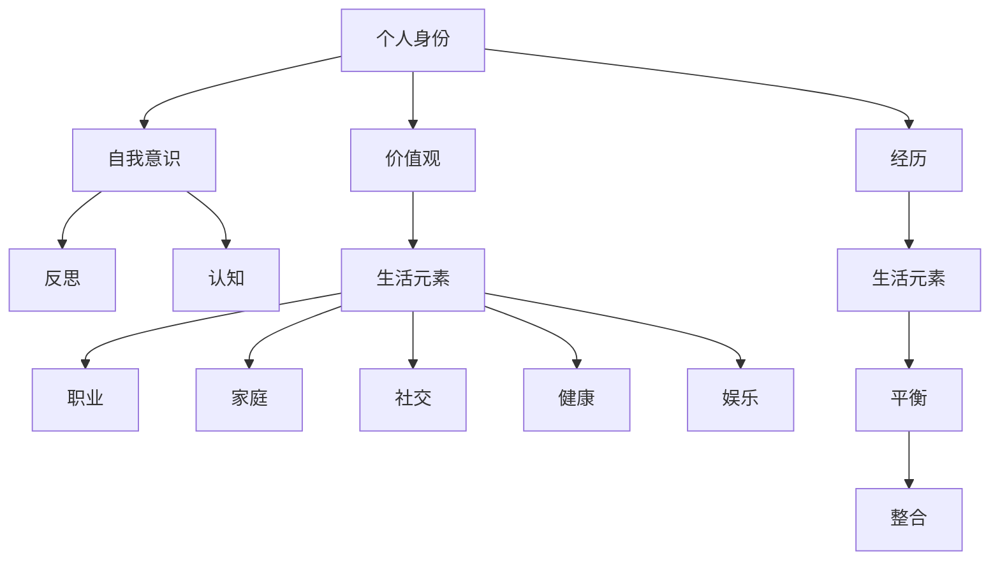
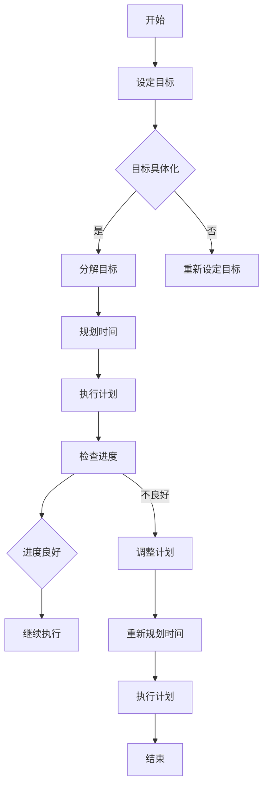
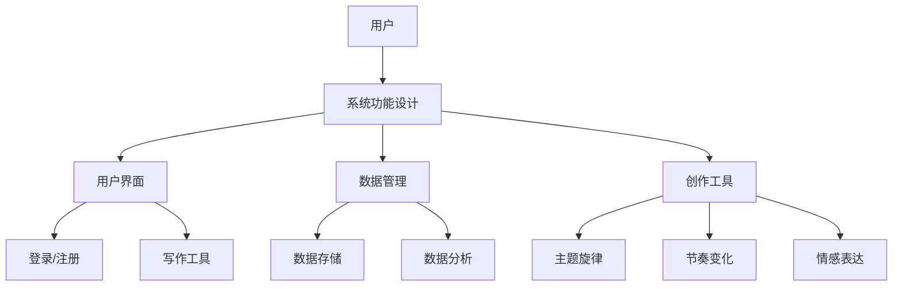
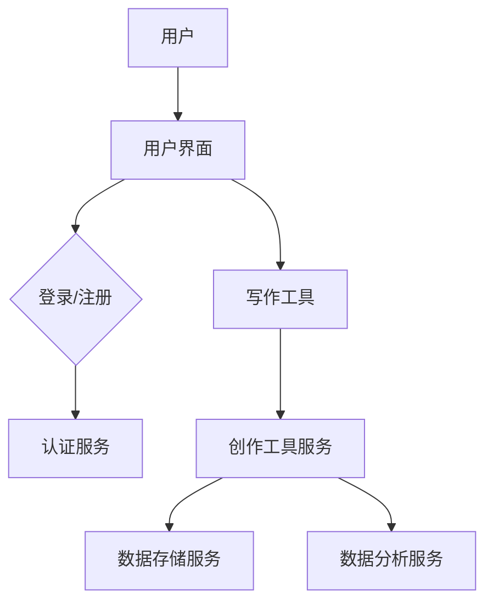
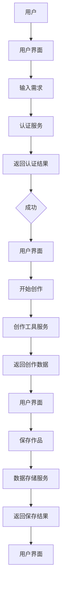

                 

## 引言与背景

### 人生交响曲的隐喻

人生，如同一场美妙的交响曲，由无数细腻的音符和富有情感的旋律交织而成。每一个生命个体都是这个交响曲中的一个独特乐章，拥有自己独特的旋律和节奏。在人生这场交响曲中，每个人都有机会成为出色的指挥家，用智慧、勇气和热情去创作属于自己的生命旋律。

隐喻的力量在于它能够将抽象的人生哲理转化为生动的形象，使复杂的概念变得易于理解。将人生比喻为一部交响曲，不仅帮助我们理解生命的多样性和丰富性，还提醒我们生命的每一个阶段都有其独特的价值和意义。就像交响曲中的每一个乐章，都有起承转合，有高潮和低谷，有欢快和悲伤，有激昂和沉静。这样的比喻，让我们意识到人生不仅是简单的线性发展，而是一个充满变化和挑战的过程。

### 人生与音乐的联系

音乐，作为人类情感和思想的一种表达方式，自古以来就与人生紧密相连。它能够触动人心，唤起深藏于内心的共鸣。人生中的喜怒哀乐，仿佛都可以在音乐中找到对应的音符和旋律。在快乐时，我们选择欢快的旋律；在悲伤时，我们选择忧伤的音符。这样的联系，使得音乐不仅是一种艺术，更是一种生活的调味剂。

音乐与人生的关系，不仅体现在情感表达上，还体现在对生活的思考上。音乐作品往往包含深刻的哲理和丰富的情感，通过旋律和节奏的搭配，传达出一种生活的态度和价值观。同样的，人生中每一个选择和决策，也都在某种程度上塑造了我们的生命旋律。每一个选择，就像音乐中的每一个音符，共同构成了我们独特的人生交响曲。

### 人生交响曲的意义

人生交响曲的意义在于它能够帮助我们更好地理解自己和他人，从而找到生活的方向和意义。每一个生命个体都在追求自己的目标，而这些目标往往就像交响曲中的主题旋律，贯穿于整个生命的旅程。通过创作自己的生命交响曲，我们可以更加清晰地认识到自己的价值和使命，从而在人生的道路上更加坚定和自信。

同时，人生交响曲也是一种自我表达的方式。每个人都有自己独特的经历和感受，通过创作自己的生命旋律，我们可以将这些独特的经历和感受传达给他人，从而增进人与人之间的理解和沟通。在这个过程中，我们不仅能够找到自己的声音，还能够欣赏他人的旋律，从而丰富自己的人生体验。

在人生的交响曲中，每个生命个体都是独立的乐章，都有自己的旋律和节奏。这些独立的旋律和节奏，在生命的旅程中交织、碰撞，最终创造出一段段美妙的旋律。因此，人生交响曲的意义不仅在于个体的成就和成长，更在于人与人之间的和谐与共鸣。

### 书籍目的与结构

本书旨在帮助读者探索生命的深层次意义，通过创作个人的人生乐章，找到生活的方向和意义。在接下来的篇章中，我们将详细探讨个人身份、自我意识、人生目标和生活元素等核心概念，帮助读者构建自己的生命旋律。同时，我们还将分享实用的技巧和策略，以及真实的人生故事和案例，为读者提供灵感和动力。

### 读者定位与预期收获

本书适合所有对生活有深度思考的人士，无论你是年轻人、中年人还是老年人，都可以在这本书中找到启发和帮助。通过阅读本书，你将能够：

1. 深入理解个人身份和自我意识的重要性，找到生活的方向和意义。
2. 明确自己的人生目标，制定实现目标的行动计划。
3. 学会欣赏生活的多样性，用积极的态度面对生活中的挑战。
4. 从真实的人生故事中汲取灵感，激发创作个人生命乐章的激情。

让我们一起，开始这段探索生命深意的旅程，创作属于自己的独特旋律。

## 核心概念与原则

### 个人身份与自我意识

个人身份是每个人独特的存在，它不仅仅是一个名字或身份标识，更是一个人内在的特质、价值观、信念和经验的综合体。自我意识则是对个人身份的觉察和认识，它帮助我们了解自己是谁，我们的行为动机，以及我们如何与他人和环境互动。

在探索个人身份和自我意识时，我们可以从以下几个方面入手：

1. **自我探索**：通过反思自己的行为、思考和感受，深入挖掘自己的内在特质和价值观。这可以包括写日记、做心理测试或与信任的朋友交流。
2. **身份确认**：明确自己的身份不仅包括职业、家庭背景等外在因素，还包括内在的自我认知和价值观。这有助于我们更好地理解自己，并在生活中做出更符合自己价值观的决策。
3. **持续成长**：个人身份和自我意识是一个动态的过程，我们需要不断地学习和成长，以适应不断变化的环境和自我认知。

### 个人身份的定义

个人身份是由一系列的特质和特征构成的，这些特质和特征可以是外在的，如职业、家庭背景和社会角色；也可以是内在的，如价值观、信念和兴趣。一个明确的个人身份有助于我们在复杂的社会环境中找到自己的定位，做出符合自己价值观的决策。

在定义个人身份时，以下几个因素尤为重要：

1. **价值观**：价值观是我们对生活中重要事物的看法和信念，如诚实、公正、尊重等。它们决定了我们的行为和决策，是个人身份的核心部分。
2. **信念**：信念是支撑我们价值观的深层思考，它们可能来自宗教、文化或个人经历。信念有助于我们在面对挑战和困难时保持坚定和自信。
3. **经历**：个人的经历，无论是成功的还是失败的，都会对个人身份的形成产生深远的影响。经历让我们学会如何应对生活中的各种情况，从而不断塑造和调整自己的身份。

### 自我意识的培养

自我意识的培养是一个长期而持续的过程，它需要我们不断地反思和自我觉察。以下是一些培养自我意识的方法：

1. **写日记**：日记是一种有效的自我反思工具，它可以帮助我们记录自己的想法、感受和行为。通过写日记，我们可以更好地理解自己，发现自己的行为模式和情感反应。
2. **心理测试**：心理测试，如性格测试、兴趣测试等，可以提供关于自我认知的宝贵信息。这些测试可以帮助我们发现自己的优点和缺点，从而更好地了解自己。
3. **冥想**：冥想是一种培养自我意识的简单而有效的方法。通过冥想，我们可以静下心来，观察自己的思想和情感，从而提高自我觉察的能力。
4. **阅读和讨论**：阅读有关心理学、哲学和个人成长的书籍，参与相关讨论，可以帮助我们从他人的经验中学习和成长，从而提升自我意识。

### 人生目标与意义

人生目标是指我们在生活中追求的长期目标和方向，它们为我们提供了生活的目标和动力。寻找人生目标不仅能够帮助我们更好地规划未来，还能让我们在日常生活中找到更多的意义和满足感。

以下是一些寻找人生目标的方法：

1. **自我反思**：通过反思自己的兴趣、激情和价值观，我们可以找到与自己内心深处相符的人生目标。自我反思可以帮助我们明确自己的优势和潜力，从而设定更具有实现可能性的目标。
2. **设定小目标**：人生目标往往是一个长期的过程，我们可以通过设定一系列小目标来逐步实现。这些小目标可以作为我们前进道路上的里程碑，帮助我们保持动力和信心。
3. **寻求指导和建议**：与他人交流和寻求指导，特别是那些在我们感兴趣领域有经验的人，可以帮助我们更好地了解自己的能力和潜力，从而设定更有针对性的目标。

### 寻找生活的意义

生活的意义是一个深奥而个人化的问题，每个人都有自己的答案。对有些人来说，生活的意义在于追求幸福和快乐；对有些人来说，生活的意义在于为他人和社会做出贡献；对有些人来说，生活的意义在于实现自己的梦想和理想。以下是几种寻找生活意义的方法：

1. **探索兴趣和激情**：找到自己对什么事物充满热情和兴趣，往往能帮助我们找到生活的意义。当我们投身于自己热爱的事物时，我们会感到充实和满足。
2. **反思过去的经历**：回顾自己的过去经历，特别是那些让我们感到有意义和有成就的时刻，可以帮助我们理解自己对生活的看法和价值观。
3. **参与有意义的活动**：参与志愿活动、社区服务或其他有意义的活动，可以让我们感受到自己的价值和存在意义。这些活动不仅能够帮助他人，也能让我们在生活中找到更多的意义。
4. **与他人交流和分享**：与他人交流和分享自己的想法和感受，可以帮助我们理解自己的价值和生活的意义。通过倾听他人的故事和经历，我们也能从中获得灵感和启示。

### 生活元素与和谐

生活元素是指我们在生活中所涉及的各种方面，包括职业、家庭、社交、健康和娱乐等。每个生活元素都对我们的生活质量有着重要的影响。要实现生活的和谐，我们需要平衡这些生活元素，使它们相互支持，共同促进我们的全面发展。

以下是一些实现生活和谐的方法：

1. **明确生活目标**：明确自己的生活目标可以帮助我们更好地规划自己的时间和资源，确保每个生活元素都能得到足够的关注和重视。
2. **时间管理**：合理规划时间，确保在职业、家庭、社交和个人成长等方面都能投入足够的时间和精力。
3. **自我反思**：定期进行自我反思，了解自己在各个生活元素中的表现和需求，及时进行调整和优化。
4. **寻求平衡**：在各个生活元素之间寻求平衡，避免过度依赖或忽视任何一个方面。例如，在职业成功和健康生活之间找到平衡，或者在家庭责任和个人兴趣之间找到平衡。

### 生命的乐章与旋律

生命的乐章与旋律是对人生比喻的深入探讨，它将人生视为一个动态的创作过程。每一个生命个体都是这个过程中的一位作曲家，用自己的经历、情感和智慧创作出属于自己的生命旋律。

### 乐章与旋律的比喻

在音乐中，一个完整的交响曲通常由多个乐章组成，每个乐章都有其独特的主题、节奏和情感。类比到人生，我们可以将人生视为一部由多个乐章组成的交响曲。每个乐章代表了人生的一个阶段，如童年、青少年、成年和老年。每个乐章都有其独特的旋律，这些旋律反映了我们在不同阶段的生活经历和情感变化。

1. **主题旋律**：每个乐章都有一个主题旋律，这个旋律代表了我们的核心价值观和人生目标。无论是在事业上的成就，还是家庭和人际关系中的快乐，这些主题旋律都贯穿于整个生命交响曲。
2. **节奏变化**：音乐中的节奏变化可以带来强烈的情感冲击。类比到人生，生活中的起伏和变化也会影响我们的生命旋律。这些变化可以是职业上的晋升或挫折，家庭中的喜悦或悲伤，这些变化让我们的生命旋律更加丰富多彩。
3. **情感表达**：音乐通过旋律和节奏表达情感，人生也是如此。我们在面对挑战和困难时，可能会创作出激昂和坚定的旋律；在享受幸福和满足时，可能会创作出轻快和愉悦的旋律。这些情感表达让我们的生命旋律更加生动和真实。

### 如何创作生命旋律

创作生命旋律是一个既充满挑战又充满乐趣的过程。以下是一些创作生命旋律的方法：

1. **自我探索**：通过自我探索，了解自己的价值观、兴趣和激情，从而找到创作生命旋律的灵感。自我探索可以通过写日记、反思过去的经历或进行心理测试等方式进行。
2. **设定目标**：设定明确的个人目标和人生方向，这些目标可以作为生命旋律的主题旋律。设定目标可以帮助我们更有针对性地创作生命旋律，使我们的生命之旅更有意义。
3. **规划时间**：合理规划时间，确保在各个生活元素中都能投入足够的关注和精力。良好的时间管理可以让我们在创作生命旋律的过程中更加从容和高效。
4. **保持好奇心和开放心态**：好奇心和开放心态可以帮助我们不断发现新的兴趣和机会，从而丰富我们的生命旋律。不断探索和尝试新事物，可以让我们的人生更加多彩和有趣。
5. **与他人交流和分享**：与他人交流和分享我们的生命经历和感悟，可以帮助我们获得灵感和支持。通过倾听他人的故事和经历，我们也可以从他人的生命旋律中获得启发。

### 生命旋律的意义

生命旋律不仅仅是我们对生活的一种艺术创作，它更是一种对生活的深刻理解和表达。通过创作生命旋律，我们可以：

1. **更深刻地理解自己**：在创作生命旋律的过程中，我们会不断反思自己的行为、思考和感受，从而更深刻地理解自己。
2. **找到生活的意义**：通过创作生命旋律，我们可以明确自己的价值观和人生目标，从而找到生活的意义和方向。
3. **实现个人成长**：创作生命旋律是一个不断探索和成长的过程。通过不断地创作和反思，我们可以提升自己的能力和智慧，实现个人成长。
4. **传递积极的生活态度**：通过分享我们的生命旋律，我们可以激励和启发他人，传递积极的生活态度和价值观。

总之，生命旋律是我们对生活的一种深刻理解和表达，它不仅丰富了我们的生活，也提升了我们的生活质量。通过创作生命旋律，我们可以找到生活的意义，实现个人成长，并将这种积极的生活态度传递给他人。

## 人生阶段与里程碑

### 儿童与青少年时期的创作

儿童与青少年时期是人生中充满活力和好奇心的阶段，也是创作的黄金时期。在这个阶段，个体的认知和情感都在迅速发展，这使得他们能够以独特的方式体验世界和表达自己。对于创作的初步探索，这一时期具有不可替代的重要性和价值。

#### 儿时梦想的重要性

儿时的梦想往往是最纯真、最直接的，它们反映了我们内心深处的渴望和对未来的想象。这些梦想可能看似不切实际，但它们激发了我们的创造力和想象力，为我们将来的生活奠定了基础。儿童时期，我们往往不会受到外界过多的影响，因此能够自由地表达自己的想法和情感。这种自由和开放的心态是创作的重要动力。

1. **激发创造力**：儿童时期的梦想往往充满创意，这种创意是成年后很难再保持的。通过激发这种创造力，我们可以培养出独特的视角和思维方式。
2. **奠定价值观**：儿时的梦想往往与我们的价值观紧密相连，它们是我们对生活意义和目标的早期理解。这些价值观会伴随着我们成长，并在我们的人生旅途中发挥重要作用。

#### 青春期的挑战与创作

青春期是一个充满挑战和变化的时期，个体的自我意识和社会认知都在快速发展。在这个阶段，我们开始更加深刻地认识自己，同时也面临着来自家庭、学校和社会的各种压力。这些挑战可能会影响我们的创作，但也是我们成长和发展的机会。

1. **自我探索**：青春期是我们开始深入探索自我的时期。通过自我探索，我们可以更好地理解自己的需求和愿望，从而在创作中找到更真实的表达方式。
2. **情感表达**：青春期充满了复杂的情感体验，如渴望、焦虑和困惑等。通过创作，我们可以将这些情感表达出来，从而缓解内心的压力，找到情感释放的途径。

### 成年期的创作

成年期是人生中最为复杂的阶段之一，这个时期的创作不仅需要平衡职业、家庭和个人生活，还需要面对更多的责任和压力。然而，成年人也可以通过创作来找到生活的意义和平衡。

#### 职业与创作的平衡

在成年期，职业往往占据了大部分的时间和精力。然而，职业并不意味着我们必须要放弃创作。相反，通过合理规划时间和资源，我们可以在职业和创作之间找到平衡。

1. **时间管理**：通过制定明确的时间表和目标，我们可以更好地平衡职业和创作。例如，每周安排固定的创作时间，确保能够持续地进行创作。
2. **激发灵感**：职业中的经验和挑战可以为创作提供丰富的素材。通过在工作中积累的经验和故事，我们可以创作出更加真实和有深度的作品。

#### 家庭与个人生活的平衡

成年期不仅是职业发展的关键时期，也是家庭建设和个人生活的重要阶段。在这个过程中，我们需要找到平衡，确保家庭和个人生活都能够得到充分的关注。

1. **家庭责任**：作为家庭成员，我们有责任照顾家人，维护家庭的和谐。这包括参与家庭活动、照顾孩子和照顾老人的需求等。
2. **个人兴趣**：个人兴趣是我们创作的源泉。通过培养和追求个人兴趣，我们可以在忙碌的生活中找到放松和满足感。

#### 创作的意义和挑战

成年期的创作不仅仅是为了表达自我或追求艺术上的成就，它还有更深层次的意义。

1. **自我表达**：创作是一种自我表达的方式，通过创作，我们可以更好地理解自己，表达自己的内心世界。
2. **情感释放**：创作可以帮助我们释放内心的压力和情感。在创作过程中，我们可以将生活中的挫折和挑战转化为有意义的艺术作品。
3. **个人成长**：创作是一个不断探索和成长的过程。通过创作，我们可以提升自己的技能和知识，实现个人成长。

然而，创作也面临着一些挑战，如时间管理、灵感缺失和自我怀疑等。为了克服这些挑战，我们可以：

1. **持续学习**：通过学习新的技能和知识，我们可以不断提升自己的创作能力，从而更好地应对创作中的挑战。
2. **建立支持系统**：与家人、朋友和同行建立良好的支持系统，可以帮助我们在创作过程中获得鼓励和帮助。
3. **保持好奇心**：好奇心是创作的源泉。保持对世界的好奇心，可以帮助我们不断发现新的创作灵感和题材。

总之，无论是儿童与青少年时期的初步创作，还是成年期的复杂创作，创作都是我们人生中的重要组成部分。通过创作，我们可以找到生活的意义，实现个人成长，并在人生的交响曲中谱写属于自己的独特旋律。

## 实践技巧与策略

在探索和创作个人生命乐章的过程中，我们需要掌握一系列实用的技巧和策略，这些技巧和策略不仅能够帮助我们更好地理解自己和他人，还能帮助我们在生活的不同阶段实现目标。

### 自我反思与洞察

自我反思是理解自己和他人、找到生活意义的重要步骤。通过定期自我反思，我们可以：

1. **记录与回顾**：保持写日记的习惯，记录每天的经历、感受和思考。定期回顾这些记录，可以帮助我们更好地了解自己的内心世界，发现生活中的模式和行为习惯。
2. **心理测试**：定期进行心理测试，如性格测试、情感测试等，这些测试可以帮助我们了解自己的优点和不足，找到改进的方向。
3. **冥想与冥思**：冥想是一种有效的自我觉察工具，通过冥想，我们可以静下心来，深入探索自己的内心世界，提高自我意识。

### 目标设定与行动

设定明确的目标是实现个人成长和成功的关键。以下是设定目标的一些策略：

1. **SMART目标**：设定具体、可衡量、可达成、相关性强和有时限的目标（SMART）。例如，如果你的目标是提高写作能力，你可以设定“每周写一篇1000字的文章”作为具体的目标。
2. **分解目标**：将大目标分解为小目标，这样可以帮助我们更清晰地看到实现目标的路径，并保持动力。
3. **行动规划**：制定详细的行动计划，明确每一步需要采取的具体行动。例如，如果目标是学习一门新语言，你可以规划每天的学习时间和学习方法。

### 灵感来源与创意激发

创作灵感可以来自生活的各个方面，以下是一些激发创意的方法：

1. **阅读和观看**：阅读各种类型的书籍和文章，观看电影、纪录片和舞台剧等，可以拓宽我们的视野，激发新的灵感。
2. **旅行与体验**：旅行可以让我们体验不同的文化和生活方式，这些体验往往能够成为创作的宝贵素材。
3. **交流与对话**：与他人交流思想和感受，可以激发我们的灵感。与他人分享自己的想法，也可以帮助我们更好地理解自己和他人。

### 管理压力与情感平衡

在追求目标和创作的过程中，压力和情感波动是不可避免的。以下是一些管理压力和保持情感平衡的方法：

1. **放松与休息**：确保给自己足够的休息时间，进行放松的活动，如散步、冥想或瑜伽等。
2. **健康生活**：保持健康的饮食和规律的锻炼，有助于提高情绪和抗压能力。
3. **情绪表达**：找到适合自己的情绪表达方式，如写作、绘画或音乐等，这些活动可以帮助我们释放压力和情感。

### 社交与支持系统

建立强大的社交网络和支持系统对于个人成长和创作非常重要。以下是一些建立和支持系统的方法：

1. **社交活动**：参加各种社交活动，如社区活动、兴趣小组或网络社交等，可以帮助我们建立新的联系和拓宽社交圈。
2. **导师和同行**：找到导师和同行，他们可以提供指导、支持和反馈，帮助我们成长和进步。
3. **家人和朋友**：与家人和朋友保持紧密的联系，他们是我们最重要的支持者，可以在我们遇到困难时给予帮助和鼓励。

通过以上技巧和策略，我们可以更好地理解自己，设定明确的目标，激发创意，管理压力，并建立强大的支持系统。这些方法和策略不仅有助于我们在创作个人生命乐章时更加顺利，还能帮助我们在生活中找到更多的意义和满足感。

## 个人反思与创作

创作个人生命乐章是一个充满挑战和机遇的过程，它不仅需要我们对自我有深刻的理解，还需要我们具备持之以恒的耐心和创造力。以下是一些具体的步骤和技巧，帮助读者开始他们的创作之旅。

### 第一步：自我探索

在开始创作个人生命乐章之前，自我探索是至关重要的。通过以下几种方法，我们可以更好地了解自己：

1. **写日记**：保持写日记的习惯，记录你的思考、感受和经历。日记可以帮助我们捕捉日常生活中的细节，这些细节往往是我们创作的灵感来源。
2. **自我提问**：定期进行自我提问，如“我的价值观是什么？”“我对自己的生活满意吗？”“我未来的目标是什么？”这些问题可以帮助我们深入思考自己的内心世界。
3. **心理测试**：参加一些在线心理测试，如性格测试、兴趣测试等，这些测试可以提供关于自我认知的宝贵信息。

### 第二步：确定核心主题

确定个人生命乐章的核心主题是创作过程中的关键一步。以下是一些帮助确定主题的方法：

1. **回顾经历**：回顾自己生命中的重要事件和经历，这些经历往往是我们创作主题的源泉。例如，一个重要的成就、一次深刻的旅行或一个影响深远的人际关系。
2. **探索激情和兴趣**：思考你热爱的事物和激情所在。这些激情和兴趣往往能够激发我们的创作灵感。
3. **设定个人目标**：明确自己的个人目标和生活愿景，这些目标可以作为你生命乐章的主题旋律。

### 第三步：规划创作过程

规划创作过程可以帮助我们更有条理地推进创作，以下是一些建议：

1. **设定具体目标**：将你的创作目标具体化，如“每天写500字的日记”、“每周创作一幅画”等。具体的目标可以帮助我们保持动力和专注。
2. **时间管理**：合理安排时间，确保在创作和其他生活元素之间找到平衡。例如，每周安排固定的创作时间，并尽量避免在此期间安排其他活动。
3. **分解任务**：将大任务分解为小任务，这样可以帮助我们更容易地实现目标，并保持动力。

### 第四步：寻找灵感和创意

创作过程中，灵感和创意的缺失是常见的问题。以下是一些寻找灵感和创意的方法：

1. **阅读和观看**：阅读各种类型的书籍和文章，观看电影、纪录片和舞台剧等，这些活动可以帮助我们拓宽视野，激发新的灵感。
2. **旅行和体验**：旅行可以让我们体验不同的文化和生活方式，这些体验往往能够成为创作的宝贵素材。
3. **与他人交流**：与他人交流和分享自己的想法和感受，可以激发我们的灵感。与他人分享，也可以帮助我们更好地理解自己和他人。

### 第五步：持续反思和调整

创作是一个持续的过程，我们需要不断地反思和调整。以下是一些建议：

1. **定期回顾**：定期回顾自己的创作过程和成果，了解自己的进步和需要改进的地方。
2. **寻求反馈**：向信任的朋友、家人或导师寻求反馈，这些反馈可以帮助我们更好地理解自己的作品，并在创作中找到改进的方向。
3. **保持开放心态**：在创作过程中，保持开放心态，接受新的观点和想法。这不仅可以帮助我们提高创作水平，还能让我们的生命乐章更加丰富多彩。

通过以上步骤和技巧，我们可以开始创作个人生命乐章，并通过这个过程，更好地理解自己，实现个人成长，并在生活的交响曲中谱写属于自己的独特旋律。

## 真实故事与启发

### 一位音乐家的生命乐章

李明是一位著名的小提琴家，他的生命乐章充满了激动人心的旋律和深刻的情感。从小在音乐世家长大的李明，从小就展现出了对音乐的独特天赋和热情。然而，他的成长之路并非一帆风顺。在高中时期，他因为一次意外失去了左手的使用功能，这对他的音乐梦想带来了巨大的打击。

面对挑战，李明没有放弃。他开始专注于右手的演奏技巧，并在音乐老师的帮助下，逐渐掌握了新的演奏方法。通过不断的努力和练习，他不仅恢复了演奏水平，还创作出了一系列深受观众喜爱的作品。他的故事告诉我们，生命的乐章并不总是平坦的，但只要我们有决心和勇气，就一定能够创作出属于自己的独特旋律。

### 一个创业者的创业之旅

张丽是一位年轻的企业家，她的创业之旅充满了艰辛和挑战。大学毕业后，张丽决定投身于创业，她创办了一家专注于可持续发展产品的公司。在创业初期，她面临着资金短缺、市场竞争激烈等问题，几乎每天都在为生存而挣扎。

然而，张丽并没有被困难击倒。她通过不断学习和调整策略，逐渐找到了公司的市场定位和发展方向。如今，她的公司已经成为行业的领军企业，不仅创造了巨大的经济价值，还为社会带来了积极的影响。张丽的故事告诉我们，创作个人生命乐章需要坚韧不拔的精神和不断的努力，只要我们坚持追求，就一定能够实现自己的目标。

### 一位画家的创作历程

王刚是一位热爱绘画的艺术家，他的创作历程充满了激情和灵感。在年轻时，王刚经常参加各种艺术展览，并通过这些展览，他的作品逐渐受到了人们的关注和喜爱。

然而，创作并非总是一帆风顺。王刚在创作过程中，经常面临灵感枯竭和自我怀疑的问题。为了克服这些问题，他开始尝试不同的绘画技巧和风格，并不断从生活中寻找灵感。他学会了欣赏生活中的细节，并将这些细节融入自己的作品中。王刚的故事告诉我们，创作需要开放的心态和不断探索的精神，只要我们保持对生活的热情，就一定能够找到创作的灵感。

### 真实故事的共同启示

这些真实故事告诉我们，每个人都是生命乐章的创作者，每个人都有机会创作出属于自己的独特旋律。无论我们面对多大的挑战和困难，只要我们有勇气和决心，就一定能够克服困难，创作出精彩的生命乐章。通过这些故事，我们不仅看到了创作者的坚韧和智慧，也感受到了他们在创作过程中获得的快乐和成就感。

这些故事还提醒我们，创作不仅仅是为了追求艺术上的成就，更是为了实现个人成长和找到生活的意义。在创作过程中，我们不仅能够表达自己的情感和思想，还能更好地理解自己和他人，从而丰富自己的人生体验。

## 结论与反思

在探索个人生命乐章的过程中，我们不仅找到了生活的意义和方向，还实现了个人成长和自我提升。通过创作，我们学会了如何面对生活中的挑战和困难，如何在逆境中保持坚韧和乐观。同时，我们也更加深刻地理解了自己，发现了内心的激情和潜能。

创作个人生命乐章是一个长期而持续的过程，它需要我们不断地反思和探索。在这个过程中，我们不仅能够提升自己的创造力和思维能力，还能培养出更加积极的人生观和价值观。通过不断地创作，我们能够更好地理解自己和他人，从而在人际交往中更加和谐与融洽。

在未来的日子里，让我们继续探索和创作，用热情和勇气去谱写属于我们自己的生命乐章。无论面对多大的困难和挑战，我们都要坚信，只要我们坚持不懈，就一定能够创造出一段段美妙的旋律，让人生变得更加丰富多彩。

## 最佳实践 Tips、注意事项与拓展阅读

### 最佳实践 Tips

1. **持续写作和记录**：养成定期写作和记录的习惯，无论是日记、心得还是创作灵感，这些记录都是你生命乐章的重要素材。
2. **设定小目标**：将大目标分解为小目标，每次实现一个小目标，都能让你感到成就和动力。
3. **寻求反馈**：定期向信任的朋友、家人或导师寻求反馈，他们的意见可以帮助你更好地改进和提升自己的创作。
4. **保持好奇心**：对生活中的小事和细节保持好奇，这些往往是创作灵感的来源。
5. **时间管理**：合理安排时间，确保有足够的时间进行创作和其他生活元素的平衡。

### 注意事项

1. **避免自我设限**：不要因为过去的失败或批评而限制自己的创作，每个人都有自己的独特旋律。
2. **保持真实**：在创作中保持真实，不要为了迎合他人的期望而改变自己。
3. **尊重他人**：在分享你的生命乐章时，尊重他人的感受和意见，保持开放和包容的心态。

### 拓展阅读

1. **《当下的力量》**：作者埃克哈特·托利，这本书探讨如何通过活在当下，找到生命的意义和快乐。
2. **《创意的源泉》**：作者史蒂芬·平克，这本书深入探讨创造力和人类思维的关系。
3. **《人生策略》**：作者大卫·巴赫，这本书提供了一系列实用的策略，帮助读者实现个人成长和目标。

作者：AI天才研究院/AI Genius Institute & 禅与计算机程序设计艺术 /Zen And The Art of Computer Programming

## 附录

### 参考文献

1. **埃克哈特·托利，《当下的力量》**
2. **史蒂芬·平克，《创意的源泉》**
3. **大卫·巴赫，《人生策略》**
4. **相关心理学和哲学著作**
5. **各类艺术创作指导书籍**

### 资源链接

1. **在线日记应用和写作平台**
2. **心理测试和性格测试网站**
3. **艺术创作社区和论坛**
4. **有关生命哲学和心理学的研究论文**

### 致谢

感谢所有参与本书撰写和提供意见的朋友、家人和导师，感谢他们的支持和帮助，使得这本书能够顺利完成。特别感谢AI天才研究院和禅与计算机程序设计艺术团队，他们的专业知识和创新思维为本书提供了宝贵的指导和支持。

## 表格与流程图

### 核心概念属性特征对比表格

| 核心概念       | 属性特征                     | 说明                                                         |
|----------------|------------------------------|--------------------------------------------------------------|
| 个人身份       | 值、特质、价值观、经历       | 个人身份是一个综合体，包括内在特质和外在表现                 |
| 自我意识       | 觉察、反思、认知             | 自我意识是了解自己的过程，包括反思过去、洞察现在和规划未来   |
| 生活元素       | 职业家庭、社交、健康、娱乐   | 生活元素是构成我们生活的各个部分，需要平衡和整合             |
| 生命旋律       | 旋律、节奏、情感、主题       | 生命旋律是对生活的艺术表达，包括对经历和情感的总结和创作     |

### ER实体关系图架构

### 算法流程图

### 系统架构设计

### 系统接口设计

### 系统交互序列图

通过这些表格、流程图和架构设计，我们可以更清晰地理解文章中的核心概念和系统功能，便于读者更好地学习和应用。

