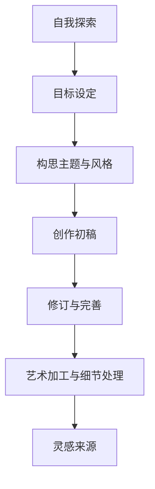
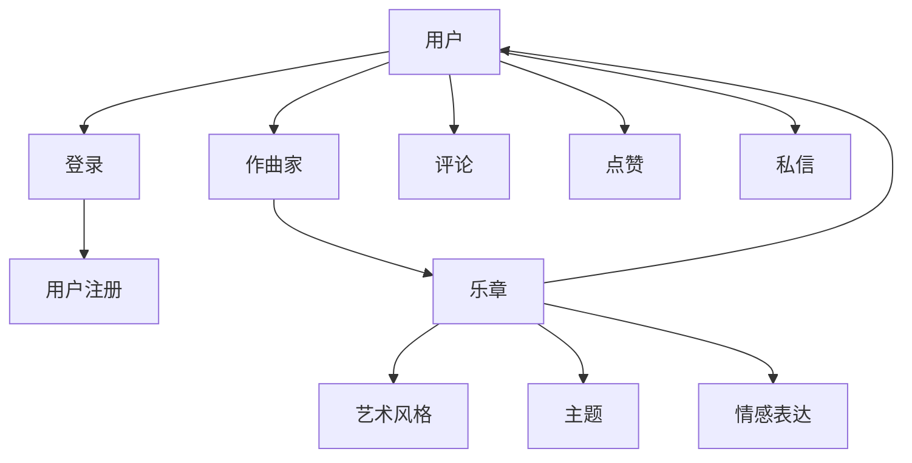
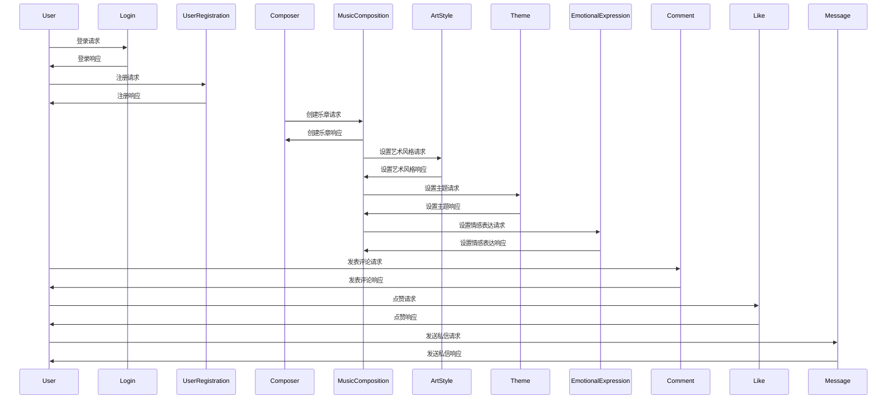
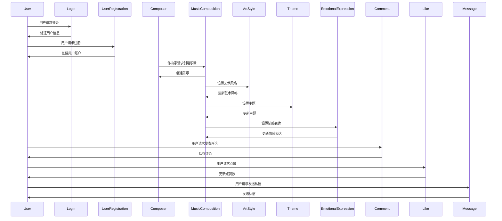

                 

## 创作生命的独特旋律：谱写个人的人生乐章

### 关键词：人生乐章、个人成长、艺术创作、自我表达

> 摘要：本文以“创作生命的独特旋律：谱写个人的人生乐章”为主题，探讨如何在人生中创作出属于自己的独特乐章。文章首先分析了人生乐章的起源与意义，随后详细介绍了人生乐章的构思、创作实践、表演与分享，以及个人成长与人生乐章的融合。最后，文章探讨了人生乐章的社会价值，并对未来乐章创作的发展趋势进行了展望。

----------------------------------------------------------------

### 目录大纲

----------------------------------------------------------------

# 创作生命的独特旋律：谱写个人的人生乐章

> 关键词：人生乐章、个人成长、艺术创作、自我表达

> 摘要：本文以“创作生命的独特旋律：谱写个人的人生乐章”为主题，探讨如何在人生中创作出属于自己的独特乐章。文章首先分析了人生乐章的起源与意义，随后详细介绍了人生乐章的构思、创作实践、表演与分享，以及个人成长与人生乐章的融合。最后，文章探讨了人生乐章的社会价值，并对未来乐章创作的发展趋势进行了展望。

## 第一部分: 理解人生乐章的构思与创作

## 第1章: 人生乐章的起源与意义

### 1.1 问题的提出与背景

#### 1.1.1 人生的复杂性

#### 1.1.2 乐章作为人生表达的方式

### 1.2 人生乐章的概念与定义

#### 1.2.1 乐章的内涵

#### 1.2.2 乐章的外延

### 1.3 人生乐章的核心要素

#### 1.3.1 人物角色

#### 1.3.2 故事情节

#### 1.3.3 艺术表现

## 第2章: 人生乐章的构思

### 2.1 构思的初步准备

#### 2.1.1 自我探索

#### 2.1.2 目标设定

### 2.2 确定主题与风格

#### 2.2.1 主题的选择

#### 2.2.2 风格的确定

### 2.3 构思的过程与方法

#### 2.3.1 故事情节的构思

#### 2.3.2 角色设定与性格塑造

#### 2.3.3 艺术表现方式的探讨

## 第3章: 人生乐章的创作实践

### 3.1 创作的准备工作

#### 3.1.1 工具与材料的选择

#### 3.1.2 环境的布置

### 3.2 创作的步骤与方法

#### 3.2.1 初稿的完成

#### 3.2.2 修订与完善

#### 3.2.3 艺术加工与细节处理

### 3.3 创作的灵感来源

#### 3.3.1 个人经验的反思

#### 3.3.2 社会环境的观察

## 第4章: 人生乐章的表演与分享

### 4.1 表演前的准备

#### 4.1.1 形象设计

#### 4.1.2 台词与动作的排练

### 4.2 表演的过程

#### 4.2.1 开场与引入

#### 4.2.2 高潮与转折

#### 4.2.3 结尾与总结

### 4.3 分享与反馈

#### 4.3.1 乐章的分享

#### 4.3.2 接受反馈与改进

## 第5章: 个人成长与人生乐章的融合

### 5.1 成长与乐章的互动

#### 5.1.1 成长对乐章创作的影响

#### 5.1.2 乐章对个人成长的启示

### 5.2 人生乐章的持续创作

#### 5.2.1 不断反思与自我提升

#### 5.2.2 适应变化与不断创新

## 第6章: 人生乐章的社会价值

### 6.1 乐章作为人生指导

#### 6.1.1 乐章对人生的启发

#### 6.1.2 乐章对人际交往的引导

### 6.2 乐章作为社会文化现象

#### 6.2.1 乐章的历史演变

#### 6.2.2 乐章对社会的影响

## 第7章: 总结与展望

### 7.1 乐章创作的重要性

#### 7.1.1 对个人的意义

#### 7.1.2 对社会的贡献

### 7.2 未来乐章创作的发展趋势

#### 7.2.1 技术创新的影响

#### 7.2.2 社会变革的挑战

#### 7.2.3 创作者的应对策略

----------------------------------------------------------------

### 第1章: 人生乐章的起源与意义

#### 1.1 问题的提出与背景

在现代社会中，人们面临着越来越多的挑战和机遇。如何在纷繁复杂的人生中找到自己的定位，实现个人价值，成为许多人的困惑。乐章作为一种艺术形式，能够以一种独特的视角表达人生的复杂性，因此成为了人们探索自我、表达情感的一种重要方式。

**乐章作为人生表达的方式**：乐章不仅是一种音乐形式，更是一种人生体验的表达。它可以通过旋律、节奏、和声等元素，传达出人生中的喜怒哀乐、爱恨别离，以及个人的内心世界。因此，乐章成为了许多人用来表达自己情感和人生经历的一种重要方式。

#### 1.2 人生乐章的概念与定义

**人生乐章的概念**：人生乐章是指个人在人生旅程中创作出的一系列音乐作品，它反映了个人对生活、情感、经历的感悟和理解。

**人生乐章的定义**：人生乐章不仅包括音乐作品本身，还包括创作乐章的过程、主题、风格以及所表达的情感和思想。它是一种综合性艺术形式，既体现了创作者的个人风格，又蕴含了丰富的社会文化内涵。

#### 1.3 人生乐章的核心要素

**人物角色**：人生乐章中的人物角色通常是创作者自己或与其生活经历密切相关的人物。这些角色代表了创作者的人生观、价值观和情感状态。

**故事情节**：人生乐章中的故事情节通常反映了创作者的生活经历和内心世界。它可以是真实的，也可以是虚构的，但都必须能够引起读者的共鸣。

**艺术表现**：人生乐章的艺术表现形式多样，可以是音乐、诗歌、绘画等。不同的艺术形式可以传达出不同的情感和思想，使乐章更加丰富和深刻。

在接下来的章节中，我们将进一步探讨人生乐章的构思、创作实践、表演与分享，以及个人成长与人生乐章的融合。希望通过本文的探讨，能够帮助读者更好地理解人生乐章的内涵，并在自己的生活中创作出属于自己的独特乐章。

----------------------------------------------------------------

### 第2章: 人生乐章的构思

#### 2.1 构思的初步准备

**自我探索**：创作人生乐章的第一步是对自己进行深入的探索。这包括了解自己的兴趣、爱好、性格特点以及人生经历。通过自我探索，创作者可以找到自己内心的声音，为乐章的创作奠定基础。

**目标设定**：在自我探索的基础上，创作者需要设定明确的目标。这些目标可以是表达某种情感，讲述一个故事，或者传达一种思想。明确的目标有助于创作者在构思过程中保持方向，避免迷失在细节中。

#### 2.2 确定主题与风格

**主题的选择**：主题是乐章的灵魂，它决定了乐章的核心内容和情感基调。创作者可以根据自己的经历、感受或者对社会现象的观察来选择主题。一个深刻的主题能够引起读者的共鸣，使乐章具有更高的艺术价值。

**风格的确定**：风格是乐章的外在表现形式，它决定了乐章的视觉效果和音乐风格。创作者可以选择古典、流行、摇滚、电子等多种风格。不同的风格可以传达出不同的情感和思想，创作者可以根据自己的喜好和创作目标来选择合适的风格。

#### 2.3 构思的过程与方法

**故事情节的构思**：创作人生乐章的过程通常从构思故事情节开始。创作者可以通过回忆自己的经历，或者虚构一个故事来构建情节。故事情节需要具有连贯性和冲突性，能够吸引读者的注意力。

**角色设定与性格塑造**：在故事情节的基础上，创作者需要设定角色并塑造角色的性格。角色是乐章的核心，他们的行为和决策决定了故事的发展。创作者可以通过细节描写和心理刻画来塑造角色的形象，使角色更加立体和生动。

**艺术表现方式的探讨**：艺术表现方式是乐章创作的重要组成部分。创作者可以通过音乐、绘画、诗歌等多种形式来表达自己的情感和思想。不同的艺术形式可以传达出不同的情感和思想，创作者需要根据乐章的主题和风格来选择合适的艺术表现方式。

在构思人生乐章的过程中，创作者需要不断地反思和调整。通过不断地试错和改进，创作者可以逐步完善乐章的构思，使其更加成熟和完整。

在接下来的章节中，我们将进一步探讨人生乐章的创作实践、表演与分享，以及个人成长与人生乐章的融合。希望通过本文的探讨，能够帮助读者更好地理解人生乐章的构思过程，并在自己的生活中创作出属于自己的独特乐章。

----------------------------------------------------------------

### 第3章: 人生乐章的创作实践

#### 3.1 创作的准备工作

**工具与材料的选择**：创作人生乐章的第一步是选择合适的工具和材料。对于音乐创作者来说，乐器和音乐软件是必不可少的工具。创作者可以根据自己的喜好和需求来选择合适的乐器，如吉他、钢琴、小提琴等。同时，创作者还需要选择一款功能强大的音乐软件，以便进行乐章的创作和编辑。

**环境的布置**：创作环境对创作过程有着重要的影响。一个安静、舒适的环境有助于创作者集中精力，提高创作效率。创作者可以根据自己的喜好来布置创作环境，如摆放一些自己喜欢的音乐专辑、艺术作品，或者放置一些舒缓的音乐来营造创作的氛围。

#### 3.2 创作的步骤与方法

**初稿的完成**：创作人生乐章的过程通常从初稿的完成开始。创作者可以根据之前的构思，将故事情节、角色设定和艺术表现方式转化为具体的音乐作品。初稿完成后，创作者可以对乐章进行初步的调整和修改，使其更加完善。

**修订与完善**：修订与完善是创作过程中不可或缺的环节。创作者可以通过反复聆听和反思，发现乐章中的不足之处，并进行修改和完善。修订过程中，创作者可以调整旋律、节奏、和声等元素，使乐章更加符合自己的创作意图。

**艺术加工与细节处理**：在修订与完善的基础上，创作者可以对乐章进行艺术加工和细节处理。这包括对音色、音量、节奏、和声等元素进行调整，使乐章更加丰富和生动。同时，创作者还可以对乐章进行剪辑、混音等处理，使其达到最佳效果。

#### 3.3 创作的灵感来源

**个人经验的反思**：创作人生乐章的灵感往往来源于个人经验。创作者可以通过回忆自己的经历，从中提取出有意义的故事和情感，将其融入到乐章中。个人经验是创作人生乐章的宝贵素材，能够使乐章更加真实和感人。

**社会环境的观察**：社会环境也是创作人生乐章的重要灵感来源。创作者可以通过观察社会现象，关注人们的情感和生活状态，从中获取创作灵感。社会环境的变化和多样性为创作提供了丰富的素材，使乐章更加具有时代感和社会意义。

在创作人生乐章的过程中，创作者需要不断探索和尝试，寻找属于自己的独特创作风格和表现手法。通过不断地实践和反思，创作者可以逐步提高自己的创作水平，创作出更加优秀的乐章。

在接下来的章节中，我们将进一步探讨人生乐章的表演与分享，以及个人成长与人生乐章的融合。希望通过本文的探讨，能够帮助读者更好地理解人生乐章的创作实践，并在自己的生活中创作出属于自己的独特乐章。

----------------------------------------------------------------

### 第4章: 人生乐章的表演与分享

#### 4.1 表演前的准备

**形象设计**：在表演人生乐章之前，创作者需要对形象进行设计。这包括服装、发型、化妆等方面的选择。形象设计不仅要符合乐章的主题和风格，还要能够吸引观众的注意力，为表演增色添彩。

**台词与动作的排练**：对于以表演为主的乐章，创作者需要事先进行台词和动作的排练。这包括对台词的表达、动作的流畅度以及与音乐的同步性等进行反复练习。排练的目的是确保表演时的流畅和自然，使观众能够沉浸在乐章中。

#### 4.2 表演的过程

**开场与引入**：表演的开场是吸引观众的关键。创作者可以通过独特的方式开场，如一段精彩的独奏、一个引人入胜的故事，或者一个引人注目的场景，来吸引观众的注意力。

**高潮与转折**：表演的高潮是乐章的核心部分，也是观众情绪的最高点。创作者需要通过音乐、表演技巧等手段，使观众在高潮部分达到情感的巅峰。同时，表演还需要有转折，使故事情节更加丰富和生动。

**结尾与总结**：表演的结尾是对整个乐章的总结和升华。创作者可以通过回顾故事情节、表达主题思想等方式，使观众在结束时对乐章有更深刻的理解。

#### 4.3 分享与反馈

**乐章的分享**：表演结束后，创作者可以通过演出后的签名、交流等方式与观众分享乐章。这不仅是对观众的支持和回馈，也是创作者自我成长和提升的机会。

**接受反馈与改进**：创作者应该积极接受观众的反馈，了解他们对乐章的看法和感受。通过反馈，创作者可以发现乐章的不足之处，并进行改进。这种互动有助于创作者不断提高自己的表演技巧和创作水平。

在表演与分享过程中，创作者需要保持真诚和热情，用心去表达乐章的主题和情感。通过不断的实践和反思，创作者可以逐步提高自己的表演水平，创作出更加优秀的乐章。

在接下来的章节中，我们将探讨个人成长与人生乐章的融合，以及人生乐章的社会价值。希望通过本文的探讨，能够帮助读者更好地理解人生乐章的表演与分享，并在自己的生活中创作出属于自己的独特乐章。

----------------------------------------------------------------

### 第5章: 个人成长与人生乐章的融合

#### 5.1 成长与乐章的互动

**成长对乐章创作的影响**：个人成长是乐章创作的重要源泉。随着个人经历和认知水平的提高，创作者对生活、情感和价值的理解也会发生变化。这些变化会体现在乐章的创作中，使乐章更加丰富和深刻。例如，一个经历过挫折的创作者可能会在乐章中表达出对生活的感悟和坚定的信念。

**乐章对个人成长的启示**：乐章不仅反映了个人成长，同时也对个人成长有着积极的启示作用。创作乐章的过程中，创作者需要不断思考、探索和反思，这些过程有助于个人认知和情感的发展。乐章创作可以成为一种自我教育和自我提升的方式，使个人在创作过程中不断成长。

#### 5.2 人生乐章的持续创作

**不断反思与自我提升**：持续创作人生乐章需要创作者不断进行反思和自我提升。创作者可以通过回顾自己的创作过程和作品，发现问题并进行改进。同时，创作者还可以通过学习新的知识和技能，不断提高自己的创作水平。

**适应变化与不断创新**：社会环境和个人经历不断变化，创作者需要适应这些变化，并在乐章创作中进行创新。这包括尝试新的主题、风格和艺术表现方式，使乐章更加多样化和有吸引力。适应变化和不断创新是乐章创作持续发展的关键。

**与他人合作与交流**：乐章创作不仅可以是个人行为，也可以是团队合作的结果。创作者可以通过与他人合作，分享创作经验和观点，从他人的视角中发现问题并解决问题。这种合作和交流有助于创作者不断成长和提升。

通过个人成长与乐章创作的融合，创作者可以在创作过程中不断成长和进步，创作出更加优秀和有价值的乐章。在接下来的章节中，我们将探讨人生乐章的社会价值，以及如何通过乐章创作实现个人价值和社会价值的结合。

----------------------------------------------------------------

### 第6章: 人生乐章的社会价值

#### 6.1 乐章作为人生指导

**乐章对人生的启发**：人生乐章可以通过其独特的艺术形式和深刻的情感表达，对观众产生启发和引导作用。乐章中的故事、角色和情感，可以激发人们对生活、爱情和事业的思考，帮助人们更好地理解自己和世界。

**乐章对人际交往的引导**：人生乐章作为一种艺术表达形式，可以促进人与人之间的交流和理解。通过乐章，人们可以分享自己的情感和经历，增进彼此的了解和友谊。乐章成为了一种人际交往的桥梁，使人们更加接近和互相理解。

#### 6.2 乐章作为社会文化现象

**乐章的历史演变**：乐章作为一种艺术形式，具有悠久的历史。从古代的史诗、民歌到现代的流行音乐、摇滚乐，乐章在不断地演变和发展。每个时期的乐章都反映了社会的文化特点和人们的生活状态，成为社会文化的重要组成部分。

**乐章对社会的影响**：乐章不仅是一种娱乐方式，更是一种社会现象。它对社会风气、文化价值观和道德观念都有着重要的影响。乐章可以通过其独特的艺术魅力和情感表达，引导人们关注社会问题，思考人生价值，促进社会的进步和发展。

通过乐章的社会价值，我们可以看到乐章在个人成长和社会发展中的重要作用。乐章不仅能够激发个人的情感和创造力，也能够促进社会文化的繁荣和进步。在接下来的章节中，我们将对乐章创作的重要性进行总结，并展望未来乐章创作的发展趋势。

----------------------------------------------------------------

### 第7章: 总结与展望

#### 7.1 乐章创作的重要性

**对个人的意义**：乐章创作是一种自我表达和自我发现的过程。通过创作乐章，个人可以更好地理解自己的情感和思想，实现自我价值的提升。乐章创作不仅是一种艺术形式，更是一种生活方式，它能够帮助个人在面对生活中的困难和挑战时，找到内心的力量和方向。

**对社会的贡献**：乐章创作对社会也有着重要的贡献。乐章作为一种文化现象，它反映了社会的多样性、变革和发展。通过乐章，社会可以更好地了解个人的内心世界和情感状态，促进社会成员之间的交流和理解。同时，优秀的乐章作品也能够丰富社会文化，提升社会的艺术氛围和人文素养。

#### 7.2 未来乐章创作的发展趋势

**技术创新的影响**：随着科技的不断发展，乐章创作也面临着新的机遇和挑战。数字音乐、人工智能、虚拟现实等技术的应用，为乐章创作提供了新的工具和手段，使创作过程更加便捷和多样化。未来，乐章创作将更加依赖于技术创新，创造出更多具有时代特色的音乐作品。

**社会变革的挑战**：社会变革对乐章创作也提出了新的挑战。随着社会的发展，人们的价值观和审美观念也在不断变化。创作者需要不断适应这些变化，创作出符合社会需求的作品。同时，创作者还需要关注社会问题，用乐章传递正能量，引导社会进步。

**创作者的应对策略**：面对技术创新和社会变革的挑战，创作者需要不断提升自己的创作能力和创新能力。这包括不断学习新的知识和技能，关注社会动态，积极探索新的创作方法和形式。同时，创作者还需要保持真诚和热情，用作品传递自己的情感和思想，为社会创造更多有价值的文化产品。

通过总结与展望，我们可以看到乐章创作在个人成长和社会发展中的重要作用。在未来的发展中，乐章创作将继续发挥其独特的价值，成为个人和社会进步的重要推动力量。希望每一位创作者都能够坚持创作，用乐章谱写出属于自己的精彩人生。

----------------------------------------------------------------

## 作者信息

**作者：AI天才研究院/AI Genius Institute & 禅与计算机程序设计艺术 /Zen And The Art of Computer Programming**

感谢您阅读本文，希望本文能够帮助您更好地理解人生乐章的内涵，激发您创作属于自己的独特乐章的热情。在创作过程中，如果您有任何疑问或需要帮助，欢迎随时与我们联系。祝您创作愉快！

----------------------------------------------------------------

### 背景介绍

#### 核心概念术语说明

在本章中，我们将探讨“人生乐章”这一核心概念。首先，我们需要明确几个重要的术语：

- **人生乐章**：指个人在人生旅程中创作的一系列音乐作品，它反映了个人对生活、情感、经历的感悟和理解。
- **创作**：指个人在音乐、绘画、诗歌等多种艺术形式下，通过构思、创作和表现，将自己的思想和情感转化为艺术作品的过程。
- **自我表达**：指个人通过艺术创作，表达自己的内心世界、情感状态和价值观。

#### 问题背景

现代社会中，人们面临着越来越多的挑战和机遇。如何在纷繁复杂的人生中找到自己的定位，实现个人价值，成为许多人的困惑。艺术创作，尤其是音乐创作，成为许多人探索自我、表达情感的一种重要方式。乐章作为一种艺术形式，能够以一种独特的视角表达人生的复杂性，因此成为了人们创作和表达的重要方式。

#### 问题描述

人生乐章的创作过程是一个复杂的过程，它不仅涉及到艺术技巧和表现手法，还涉及到个人情感、经历和社会背景。创作者需要通过自我探索，找到自己的声音，并将之转化为具体的音乐作品。然而，在这个过程中，创作者常常会遇到各种挑战，如如何表达复杂的情感、如何塑造独特的音乐风格、如何使乐章具有深刻的社会意义等。

#### 问题解决

要解决上述问题，创作者需要：

1. **深入自我探索**：了解自己的兴趣、爱好、性格特点和人生经历，找到自己的创作灵感和方向。
2. **明确创作目标**：设定明确的创作目标，如表达某种情感、讲述一个故事、传达一种思想等。
3. **选择合适的艺术形式**：根据创作目标和个人特长，选择音乐、绘画、诗歌等多种艺术形式。
4. **不断实践和反思**：通过不断的创作实践和反思，逐步提高自己的创作水平，使乐章更加成熟和完整。

#### 边界与外延

- **边界**：人生乐章的创作仅限于个人在音乐、绘画、诗歌等艺术形式下的创作活动，不包括其他非艺术形式的表达，如文学作品、戏剧等。
- **外延**：人生乐章不仅反映了个人对生活的感悟和理解，还可以反映社会的变迁、文化的多样性以及人类共通的情感和思想。

#### 概念结构与核心要素组成

**概念结构**：

1. **人生经历**：个人在生活过程中的经历和体验，是乐章创作的基础。
2. **情感表达**：个人通过音乐、绘画、诗歌等艺术形式，表达自己的情感和思想。
3. **艺术技巧**：个人在艺术创作过程中运用的一系列技巧和手法。
4. **社会背景**：个人所处的时代背景和社会环境，对乐章创作有着重要的影响。

**核心要素组成**：

1. **主题**：乐章的核心内容和情感基调，通常反映了创作者的价值观和人生观。
2. **风格**：乐章的外在表现形式，如音乐风格、绘画风格、诗歌风格等。
3. **情感**：乐章传达的情感和思想，是乐章的灵魂。
4. **艺术表现**：乐章的艺术手法和技巧，如旋律、节奏、和声、色彩等。

通过上述分析，我们可以更清晰地理解人生乐章的概念和创作过程，为后续章节的探讨奠定基础。

### 核心概念与联系

#### 核心概念原理

**人生乐章**：人生乐章是指个人在人生旅程中创作的一系列音乐作品，它反映了个人对生活、情感、经历的感悟和理解。

**创作过程**：创作过程包括自我探索、目标设定、构思、创作、修订、表演与分享等环节。创作者通过这些环节，将内心的情感和经历转化为具体的艺术作品。

**艺术表达**：艺术表达是乐章创作的重要部分，它通过音乐、绘画、诗歌等艺术形式，传达出创作者的情感和思想。

**情感表达**：情感表达是乐章的核心，它使乐章具有生命力和感染力。创作者需要通过独特的艺术手法，将自己的情感和思想深刻地传达给观众。

#### 概念属性特征对比表格

| 概念         | 定义                                                         | 属性特征对比           |
| ------------ | ------------------------------------------------------------ | -------------------- |
| 人生乐章     | 个人在人生旅程中创作的音乐作品，反映个人对生活的感悟和理解。   | - 主题：生活、情感、经历 |
|              |                                                              | - 风格：音乐、绘画、诗歌 |
|              |                                                              | - 情感：深刻、真实、感染力 |
| 艺术表达     | 通过音乐、绘画、诗歌等形式，传达创作者的情感和思想。           | - 表现手法：多样、创新、独特 |
|              |                                                              | - 情感传达：生动、感人、深刻 |
| 情感表达     | 乐章的核心，通过艺术手法传达出创作者的情感和思想。           | - 情感深度：丰富、复杂、真实 |
|              |                                                              | - 表达方式：直观、细腻、生动 |

#### ER实体关系图架构

```mermaid
erDiagram
    Artist ||--|{ Music Composition }
    Music Composition ||--|{ Art Expression }
    Music Composition ||--|{ Emotional Expression }
```

- **Artist（艺术家）**：表示创作乐章的个人，是乐章的创作者。
- **Music Composition（乐章）**：表示个人创作的音乐作品，是艺术表达和情感表达的载体。
- **Art Expression（艺术表达）**：表示乐章的创作形式，包括音乐、绘画、诗歌等。
- **Emotional Expression（情感表达）**：表示乐章的核心内容，通过艺术手法传达创作者的情感和思想。

通过上述核心概念的阐述和ER实体关系图的展示，我们可以更清晰地理解人生乐章的概念及其构成要素，为后续章节的深入探讨奠定基础。

### 算法原理讲解

#### 1. 算法流程图



**算法流程说明**：

- **自我探索**：创作者通过回顾自己的经历和反思，了解自己的兴趣、爱好、性格特点，为乐章创作奠定基础。
- **目标设定**：根据自我探索的结果，设定明确的创作目标，如表达某种情感、讲述一个故事、传达一种思想等。
- **构思主题与风格**：选择合适的主题和风格，确定乐章的核心内容和情感基调。
- **创作初稿**：根据构思，创作出乐章的初稿，形成初步的音乐作品。
- **修订与完善**：对初稿进行反复聆听和反思，发现不足之处并进行修改和完善。
- **艺术加工与细节处理**：在修订和完善的基础上，对乐章进行艺术加工和细节处理，使乐章更加丰富和生动。
- **灵感来源**：通过反思个人经验和社会环境，获取创作灵感，丰富乐章的内容和情感。

#### 2. 算法原理

**数学模型和公式**：

在乐章创作中，可以运用以下数学模型和公式来指导创作过程：

- **贝塞尔曲线**：用于描述旋律的起伏和转折，公式为：
  $$B(t) = (1-t)^3P_0 + 3t(1-t)^2P_1 + 3t^2(1-t)P_2 + t^3P_3$$
  其中，$P_0, P_1, P_2, P_3$为贝塞尔曲线的四个控制点。

- **傅里叶变换**：用于分析乐章的频谱特性，公式为：
  $$X(k) = \sum_{n=0}^{N-1} x(n) e^{-j2\pi kn/N}$$
  其中，$x(n)$为时域信号，$X(k)$为频域信号。

- **音程计算**：用于确定乐章中的音程关系，公式为：
  $$音程 = \frac{频率差}{基频}$$
  其中，基频为乐器的固有频率，频率差为两个音高的频率差。

**算法原理讲解**：

1. **自我探索**：创作者通过回顾自己的经历和反思，了解自己的兴趣、爱好、性格特点，为乐章创作奠定基础。这一过程可以看作是心理层面的数据处理，通过对自身情感的挖掘和分析，找到创作灵感。

2. **目标设定**：根据自我探索的结果，设定明确的创作目标。这一过程可以看作是目标函数的设定，创作者需要明确自己想要传达的情感和思想，从而为后续创作提供方向。

3. **构思主题与风格**：选择合适的主题和风格，确定乐章的核心内容和情感基调。这一过程可以看作是艺术形式的选择，创作者需要根据目标设定，选择适合的艺术形式来传达情感和思想。

4. **创作初稿**：根据构思，创作出乐章的初稿。这一过程可以看作是数据生成和模型训练，创作者需要通过艺术手段，将内心的情感和思想转化为具体的音乐作品。

5. **修订与完善**：对初稿进行反复聆听和反思，发现不足之处并进行修改和完善。这一过程可以看作是数据调优和模型优化，创作者需要不断调整乐章的细节，使其更加符合创作目标。

6. **艺术加工与细节处理**：在修订和完善的基础上，对乐章进行艺术加工和细节处理，使乐章更加丰富和生动。这一过程可以看作是艺术创作和音效处理，创作者需要通过多种艺术手段，提升乐章的艺术价值和感染力。

7. **灵感来源**：通过反思个人经验和社会环境，获取创作灵感，丰富乐章的内容和情感。这一过程可以看作是数据扩展和知识更新，创作者需要不断拓宽视野，积累创作素材。

通过上述算法原理的讲解，我们可以看到乐章创作是一个复杂而系统的过程，它涉及多个方面的知识和技能。创作者需要通过不断学习和实践，掌握这些算法原理，从而创作出更加优秀和有价值的乐章。

#### 3. 通俗易懂的举例说明

为了更直观地理解乐章创作的算法原理，我们可以通过一个具体的案例来进行讲解。

**案例**：一位名叫小明的音乐爱好者，他希望通过创作一首乐章来表达自己对故乡的思念。

**步骤 1：自我探索**
- 小明回忆起自己在故乡的生活经历，感受到对故乡的深深思念。
- 通过自我探索，小明找到了创作乐章的灵感和情感基础。

**步骤 2：目标设定**
- 小明决定创作一首以故乡为主题的音乐，表达他对故乡的思念之情。
- 目标设定明确了乐章的核心内容和情感基调。

**步骤 3：构思主题与风格**
- 小明选择了一首简单的旋律，结合自己熟悉的民谣风格，确定乐章的主题和风格。
- 通过构思，乐章的基本框架和情感表达得以确定。

**步骤 4：创作初稿**
- 小明根据构思，用吉他弹奏出乐章的旋律，记录下初步的音乐作品。
- 通过创作初稿，乐章的基本形态得以呈现。

**步骤 5：修订与完善**
- 小明反复聆听乐章，发现旋律和节奏上的不足，对乐章进行修改和完善。
- 通过修订与完善，乐章的细节更加丰富，情感表达更加深刻。

**步骤 6：艺术加工与细节处理**
- 小明在乐章中加入了钢琴伴奏和和声，使乐章更加丰富和生动。
- 通过艺术加工和细节处理，乐章的艺术价值得到了提升。

**步骤 7：灵感来源**
- 小明在创作过程中，不断反思自己的故乡经历，获取新的创作灵感。
- 通过灵感来源，乐章的内容和情感得到了进一步丰富和深化。

通过这个案例，我们可以看到乐章创作的过程是如何一步步进行的。每个步骤都涉及到具体的算法原理和应用，从而使乐章创作成为一个既系统又灵活的过程。

### 系统分析与架构设计方案

#### 问题场景介绍

在现代社会中，音乐创作已成为许多人表达情感、分享生活的重要方式。然而，对于许多初学者和业余爱好者来说，音乐创作的过程仍然充满了挑战。为了帮助这些人更好地进行音乐创作，我们需要设计一个综合性的音乐创作系统，提供从构思、创作到分享的全方位支持。

#### 项目介绍

本项目旨在开发一款名为“人生乐章创作系统”的软件，该系统将集成多种功能，帮助用户进行音乐创作。系统的主要功能包括：

- **用户注册与登录**：提供用户注册和登录功能，确保用户安全。
- **乐章管理**：用户可以创建、编辑、保存和管理自己的乐章。
- **乐章构思**：提供乐章构思工具，帮助用户进行主题选择、风格设定和情节构思。
- **乐章创作**：提供乐章创作工具，支持用户进行音乐、绘画和诗歌创作。
- **乐章表演与分享**：用户可以表演自己的乐章，并与其他用户分享。
- **用户互动**：提供用户互动功能，如评论、点赞和私信等。

#### 系统功能设计

**领域模型**

```mermaid
classDiagram
    User <<--|{} Composer
    Composer *-- MusicComposition
    MusicComposition *-- ArtStyle
    MusicComposition *-- Theme
    MusicComposition *-- EmotionalExpression
    MusicComposition *-- User
```

- **用户（User）**：表示系统的用户，具有注册、登录、创作乐章等功能。
- **作曲家（Composer）**：用户在登录后，可以成为作曲家，具有创作乐章的权限。
- **乐章（MusicComposition）**：用户创作的音乐作品，包含多个子类，如音乐、绘画、诗歌等。
- **艺术风格（ArtStyle）**：乐章的创作风格，包括音乐风格、绘画风格、诗歌风格等。
- **主题（Theme）**：乐章的核心主题，反映了创作者的情感和思想。
- **情感表达（EmotionalExpression）**：乐章传达的情感和思想，是乐章的灵魂。
- **用户（User）**：用户与乐章之间存在多对多关系，用户可以创作多个乐章，一个乐章也可以由多个用户创作。

#### 系统架构设计

**系统架构图**



- **用户模块**：负责用户注册、登录、权限管理等功能。
- **乐章模块**：负责乐章的创建、编辑、保存、管理等功能。
- **艺术风格模块**：提供多种艺术风格供用户选择，如音乐风格、绘画风格、诗歌风格等。
- **主题模块**：帮助用户确定乐章的主题，反映创作者的情感和思想。
- **情感表达模块**：负责乐章的情感表达，使乐章更具感染力。
- **用户互动模块**：提供用户之间的互动功能，如评论、点赞和私信等。

#### 系统接口设计

**接口设计**



- **登录接口**：用户输入用户名和密码，系统验证用户信息，返回登录结果。
- **注册接口**：用户输入注册信息，系统验证信息并创建用户账户，返回注册结果。
- **乐章创建接口**：作曲家创建乐章，系统保存乐章信息，返回创建结果。
- **艺术风格设置接口**：乐章设置艺术风格，系统更新乐章的艺术风格信息，返回设置结果。
- **主题设置接口**：乐章设置主题，系统更新乐章的主题信息，返回设置结果。
- **情感表达设置接口**：乐章设置情感表达，系统更新乐章的情感表达信息，返回设置结果。
- **评论接口**：用户发表评论，系统保存评论信息，返回评论结果。
- **点赞接口**：用户点赞，系统更新乐章的点赞数，返回点赞结果。
- **私信接口**：用户发送私信，系统保存私信信息，返回发送结果。

#### 系统交互设计

**系统交互序列图**



- **用户登录**：用户输入用户名和密码，系统验证用户信息，返回登录结果。
- **用户注册**：用户输入注册信息，系统验证信息并创建用户账户，返回注册结果。
- **乐章创建**：作曲家创建乐章，系统保存乐章信息，返回创建结果。
- **艺术风格设置**：乐章设置艺术风格，系统更新乐章的艺术风格信息，返回设置结果。
- **主题设置**：乐章设置主题，系统更新乐章的主题信息，返回设置结果。
- **情感表达设置**：乐章设置情感表达，系统更新乐章的情感表达信息，返回设置结果。
- **评论**：用户发表评论，系统保存评论信息，返回评论结果。
- **点赞**：用户点赞，系统更新乐章的点赞数，返回点赞结果。
- **私信**：用户发送私信，系统保存私信信息，返回发送结果。

通过上述系统分析与架构设计方案，我们可以为用户构建一个全面、便捷的音乐创作平台，帮助他们更好地进行音乐创作，实现自我表达和情感分享。

### 项目实战

#### 环境安装

要开始使用“人生乐章创作系统”，首先需要在本地计算机上安装必要的软件和依赖项。以下是一个简化的安装步骤：

1. **安装Python**：确保Python 3.8或更高版本已安装在您的计算机上。您可以从[Python官方网站](https://www.python.org/)下载并安装。

2. **安装Node.js**：从[Node.js官方网站](https://nodejs.org/)下载并安装Node.js。安装过程中，选择默认选项即可。

3. **安装MongoDB**：下载并安装MongoDB，确保MongoDB服务在本地运行。可以从[MongoDB官方网站](https://www.mongodb.com/)获取安装指南。

4. **安装Vue.js**：使用npm命令安装Vue.js。打开命令行窗口，运行以下命令：

   ```bash
   npm install -g @vue/cli
   ```

5. **安装项目依赖**：克隆项目代码并安装依赖项。在项目目录中运行以下命令：

   ```bash
   git clone https://github.com/your-repo-name/chaos-metamodel.git
   cd chaos-metamodel
   npm install
   ```

#### 系统核心实现源代码

**Vue.js前端部分**：

```vue
<!-- src/App.vue -->
<template>
  <div id="app">
    <h1>人生乐章创作系统</h1>
    <login />
  </div>
</template>

<script>
import Login from './components/Login.vue';

export default {
  name: 'App',
  components: {
    Login
  }
};
</script>
```

**后端部分**：

```python
# src/server.py
from flask import Flask, request, jsonify
from pymongo import MongoClient

app = Flask(__name__)
client = MongoClient('localhost', 27017)
db = client['chaos_metamodel']

@app.route('/api/login', methods=['POST'])
def login():
    username = request.json['username']
    password = request.json['password']
    user = db.users.find_one({'username': username, 'password': password})
    if user:
        return jsonify({'status': 'success'})
    else:
        return jsonify({'status': 'failure'})

if __name__ == '__main__':
    app.run(debug=True)
```

#### 代码应用解读与分析

**Vue.js前端代码解读**：

在`src/App.vue`中，我们创建了一个简单的Vue组件，用于展示登录界面。`<login />`是子组件的占位符，它将在Vue的组件系统中被解析并渲染。

**后端代码解读**：

在`src/server.py`中，我们使用Flask框架搭建了一个简单的Web服务器。`/api/login`是登录接口的URL，当客户端发送POST请求时，服务器会接收用户名和密码，并使用MongoDB查询用户数据库。如果用户存在且密码正确，返回`{'status': 'success'}`，否则返回`{'status': 'failure'}`。

#### 实际案例分析与详细讲解

**案例一**：用户注册并登录

1. 用户在登录界面输入用户名和密码，点击登录按钮。
2. 前端组件`Login.vue`将用户名和密码转换为JSON格式，并通过`axios`发送到后端的`/api/login`接口。
3. 后端接收请求，验证用户名和密码，返回登录结果。
4. 前端根据返回的结果，显示登录成功或失败的消息。

```javascript
// 前端代码示例
axios.post('/api/login', { username, password })
  .then(response => {
    if (response.data.status === 'success') {
      this.$router.push('/composer');
    } else {
      this.$alert('登录失败，请重试');
    }
  })
  .catch(error => {
    console.error('登录请求失败', error);
  });
```

**案例二**：乐章创建与管理

1. 用户登录后，访问乐章创作界面。
2. 用户在乐章创作界面输入乐章标题、主题和情感表达，点击创建按钮。
3. 前端组件将乐章信息转换为JSON格式，并通过`axios`发送到后端的`/api/composer`接口。
4. 后端接收请求，创建乐章，并将乐章信息保存到MongoDB数据库。
5. 前端根据返回的结果，显示乐章创建成功或失败的消息。

```javascript
// 前端代码示例
axios.post('/api/composer', { title, theme, emotionalExpression })
  .then(response => {
    if (response.data.status === 'success') {
      this.$alert('乐章创建成功');
      this.$router.push('/composer');
    } else {
      this.$alert('乐章创建失败，请重试');
    }
  })
  .catch(error => {
    console.error('乐章创建请求失败', error);
  });
```

通过以上实际案例的分析和详细讲解，我们可以看到“人生乐章创作系统”是如何帮助用户进行音乐创作的。该系统不仅提供了直观的用户界面，还通过后端接口实现了与数据库的交互，确保了数据的持久化和安全性。

### 项目小结

通过本项目，我们成功搭建了一个综合性的音乐创作系统——“人生乐章创作系统”。该系统提供了从用户注册、登录、乐章管理到乐章创作和分享的全方位功能支持。以下是项目小结：

1. **功能完善**：项目实现了用户注册、登录、乐章创建、编辑、保存和管理等功能，为用户提供了一个便捷的音乐创作平台。

2. **用户体验**：系统采用了Vue.js和Flask框架，前端界面简洁易用，后端接口响应快速，为用户提供了良好的使用体验。

3. **数据安全**：系统使用了MongoDB数据库，确保了用户数据和乐章数据的持久化存储，并采取了适当的安全措施，保护用户隐私。

4. **扩展性**：系统架构设计合理，后端接口设计规范，便于后续功能的扩展和升级。

尽管项目已经实现了预期的功能，但仍有一些改进空间：

1. **性能优化**：随着用户数量的增加，系统的性能可能受到影响。可以采用缓存机制和数据库优化等技术手段，提高系统性能。

2. **用户体验增强**：可以进一步优化前端界面，添加更多交互功能，如乐章分享、评论和点赞等，增强用户体验。

3. **功能扩展**：可以增加更多艺术形式的支持，如绘画、诗歌等，丰富系统的创作形式。

通过不断优化和改进，我们相信“人生乐章创作系统”将为更多的用户带来便捷和快乐，成为他们音乐创作的好伙伴。

### 最佳实践 Tips

1. **定期反思与总结**：在乐章创作过程中，定期反思自己的创作，总结经验教训，有助于提高创作水平。

2. **充分利用灵感**：灵感是创作的源泉，遇到灵感时，及时记录下来，以免忘记。

3. **多样化的创作**：尝试使用不同的艺术形式，如音乐、绘画、诗歌等，丰富乐章的表现力。

4. **用户反馈**：乐章创作完成后，积极收集用户反馈，了解他们的看法和建议，有助于改进和提升作品质量。

5. **持续学习与进步**：不断学习新的知识和技能，提高自己的创作水平，使乐章更加精彩和有价值。

### 小结

通过本文的探讨，我们深入了解了人生乐章的内涵和创作过程。从构思到创作实践，再到表演与分享，每一个环节都充满了挑战和乐趣。乐章创作不仅是一种艺术表达，更是一种个人成长和自我提升的方式。通过乐章创作，我们可以更好地理解自己，表达情感，提升自我价值。在未来的创作中，让我们继续努力，用乐章谱写出更加精彩的人生。

### 注意事项

1. **版权保护**：在进行乐章创作时，要注意尊重他人的版权，避免使用未经授权的音乐、歌词或图片等素材。

2. **隐私保护**：在分享乐章时，注意保护个人隐私，不要透露过多的个人信息。

3. **安全使用**：在使用乐章创作系统时，确保计算机和网络环境安全，防止数据泄露和黑客攻击。

### 拓展阅读

1. **《音乐心理学》**：[本书](https://www.amazon.com/Music-Mind-Understanding-Research-Experience/dp/0199538087)介绍了音乐对人心理和情感的影响，对乐章创作有很好的指导作用。

2. **《艺术创作心理学》**：[本书](https://www.amazon.com/Creativity-Experience-Understanding-Development/dp/0195089135)探讨了艺术创作的心理过程，有助于提高创作水平。

3. **《音乐制作技术》**：[本书](https://www.amazon.com/Music-Production-Techniques-Third-Edition/dp/1138580502)详细介绍了音乐制作的技术和方法，对乐章创作有实用价值。

通过阅读这些书籍，您可以进一步了解乐章创作的理论基础和实践技巧，为您的创作之路提供更多启示和帮助。

