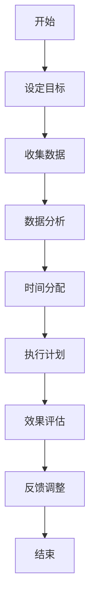
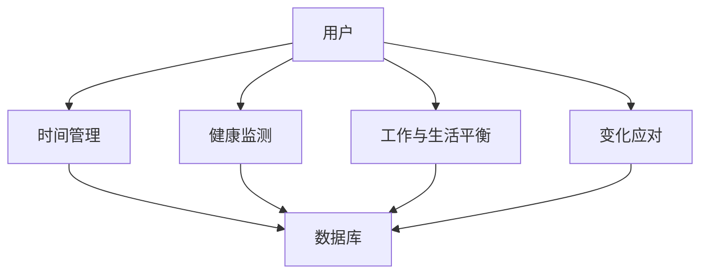

                 

## 引言

### 背景与重要性

在快速发展的现代社会，个人生活节奏的失衡已成为普遍现象。长时间的加班、高强度的任务和不断的压力，使得许多人感到疲惫不堪，生活质量明显下降。这不仅影响了工作效能，还严重危害了身心健康。因此，设计并维持一个合理的个人生活节奏，成为现代生活中不可或缺的一部分。

个人生活节奏，指的是个体在日常生活中形成的规律，涵盖了工作、休息、健康、社交等多个方面。一个良好的个人生活节奏，不仅能提升工作效率和生活质量，还能增强心理韧性和幸福感。然而，如何设计出符合自身需求且可持续的个人生活节奏，成为许多人面临的难题。

本文旨在探讨如何通过逻辑清晰、结构紧凑的步骤，帮助读者设计和维持个人生活节奏。文章将围绕以下几个核心部分展开：

1. **理解个人生活节奏的概念**：首先，我们需要明确个人生活节奏的定义，并了解其核心要素。
2. **设计个人生活节奏**：在这一部分，我们将介绍设计个人生活节奏的原则和步骤，帮助读者制定出适合自己的生活节奏。
3. **优化个人生活节奏**：在生活节奏初步形成后，如何通过时间管理和效率提升来进一步优化，是本文的重点之一。
4. **平衡工作与生活**：工作与生活的平衡是维持长期幸福的关键，我们将探讨如何实现这一平衡。
5. **适应变化**：面对生活中的种种变化，如何调整和适应，保持生活节奏的稳定性。
6. **维持个人生活节奏**：长期的维持与调整，是实现生活稳定性的关键。

通过以上步骤，本文将逐步引导读者，从理论到实践，全面理解和设计出适合自己的个人生活节奏。

### 文章关键词

- 个人生活节奏
- 时间管理
- 工作与生活平衡
- 效率提升
- 心理健康

### 摘要

本文旨在帮助读者设计和维持个人生活节奏，以提升工作效率、生活质量以及心理幸福感。文章首先介绍了个人生活节奏的概念和重要性，随后详细阐述了设计个人生活节奏的原则和步骤。接着，文章探讨了如何通过时间管理和效率提升来优化个人生活节奏，以及如何平衡工作与生活，适应生活中的变化。最后，文章提出了维持个人生活节奏的方法和策略，并通过案例研究提供了实际操作的范例。通过这篇文章，读者将能够系统地理解并设计出适合自己的个人生活节奏。

## 第1章：引言

在现代社会的快节奏中，个人生活节奏的失衡已经成为一种普遍现象。长期的加班、高强度的工作压力以及不断的责任叠加，使得许多人感到身心俱疲，生活质量明显下降。这不仅影响了工作效率，还严重损害了身心健康。因此，设计并维持一个合理的个人生活节奏，成为许多人追求的目标。然而，如何在实际生活中找到平衡点，实现高效的工作和生活，仍然是许多人面临的挑战。

本文将从多个角度探讨个人生活节奏的重要性，并详细阐述如何通过系统的方法来设计和维持个人生活节奏。文章首先解释了个人生活节奏的概念，并介绍了其核心要素。接着，我们将介绍设计个人生活节奏的原则和步骤，帮助读者制定出符合自身需求的生活节奏。随后，文章将探讨如何通过时间管理和效率提升来优化个人生活节奏，以及如何平衡工作与生活，适应生活中的变化。最后，文章将提供维持个人生活节奏的方法和策略，并通过实际案例研究，为读者提供具体的操作指南。

通过这篇文章，读者将能够系统地理解个人生活节奏的概念，掌握设计原则和步骤，学会通过时间管理和效率提升来优化生活节奏，并在面对变化时保持稳定和适应性。本文的目标是帮助读者不仅在理论上理解个人生活节奏的重要性，更能够在实际生活中运用这些原则和方法，实现高效、健康、幸福的生活。

### 1.1 问题的背景与重要性

个人生活节奏失衡的问题，其背景可以追溯到现代社会的工作压力和生活方式的巨大变化。在20世纪中叶以前，生活节奏相对缓慢，人们的日常生活主要以农业和手工业为主，工作与生活之间的界限相对清晰。然而，随着工业革命和信息技术的飞速发展，人类社会进入了高速运转的阶段。现代企业对效率和生产力的追求，导致了工作压力的不断增加，工作时间延长，工作任务日益繁重。

首先，长时间的加班和高强度的工作任务，使许多人处于持续的压力状态。长期的压力会导致生理和心理的多种问题，如睡眠不足、焦虑、抑郁等，进一步影响生活质量和工作效率。根据世界卫生组织（WHO）的数据，工作压力是全球健康问题之一，每年导致数百万人患上慢性疾病和抑郁症。

其次，现代生活节奏的加快，导致人们很难找到平衡工作和生活的时间。许多人因为工作繁忙而忽视了健康和社交，导致身体健康和心理健康的问题。例如，缺乏运动、饮食不均衡、社交减少，都会对个人的身体健康和心理健康产生负面影响。哈佛大学的一项研究表明，长期处于高压状态的人群，心脏病、中风等健康问题的发生率显著增加。

此外，个人生活节奏的失衡还影响了家庭生活和社交关系。长时间的工作导致家庭成员之间的交流减少，亲子关系和家庭和谐度下降。社交关系的疏远，也会导致个体的孤独感和失落感增加，影响心理健康。

综上所述，个人生活节奏失衡不仅影响个体的身心健康，还会对家庭和社会产生负面影响。因此，设计并维持一个合理的个人生活节奏，对于提升生活质量、提高工作效率和保持心理健康至关重要。本文旨在通过系统的方法，帮助读者理解和解决这一普遍问题，实现高效、健康、幸福的生活。

### 1.2 本书的目标与结构

本书的目标是帮助读者设计和维持一个合理的个人生活节奏，以提升工作效率、提高生活质量以及增强心理幸福感。具体而言，本书将通过以下结构来实现这一目标：

首先，本文将从第1章开始，引入个人生活节奏的概念，解释其重要性，并简要介绍本书的结构和内容。接着，第2章将深入探讨个人生活节奏的要素，包括工作、休息、健康和社交等方面，帮助读者全面了解个人生活节奏的各个方面。

第3章将重点介绍设计个人生活节奏的原则和步骤，通过明确目标、分析现状和制定计划等步骤，帮助读者构建一个符合自身需求的生活节奏。第4章将探讨如何通过时间管理和效率提升来优化个人生活节奏，提高日常生活和工作中的效率。

第5章将讨论如何实现工作与生活的平衡，提供具体的策略和技巧，帮助读者在实际生活中找到平衡点。第6章将探讨如何适应生活中的变化，保持生活节奏的稳定性，提供多种适应策略和应对方法。

最后，第7章将总结全文，回顾主要内容和关键点，展望未来趋势，并给出对读者的期望和建议。通过这样的结构安排，本文旨在系统性地帮助读者理解和设计个人生活节奏，实现高效、健康、幸福的生活。

## 第2章：理解个人生活节奏

### 2.1 个人生活节奏的概念

个人生活节奏，指的是个体在日常生活中形成的规律，涵盖了工作、休息、健康、社交等多个方面。简单来说，它是指一个人在一天、一周或一个月中，如何安排时间，以实现工作、生活和个人发展的平衡。

个人生活节奏的重要性不言而喻。首先，合理的个人生活节奏能够提高工作效率。当一个人能够按照自己的节奏进行工作，不仅能够减少疲劳和压力，还能提高专注力和创造力。其次，良好的生活节奏有助于提升生活质量。一个均衡的生活节奏，不仅包括合理的工作时间，还包括充足的休息、健康的生活习惯和丰富的社交活动。这些因素共同作用，能够使人在生活中感受到更多的满足感和幸福感。

个人生活节奏的要素主要包括以下几个方面：

1. **工作**：工作是个人的生活节奏的核心部分。合理安排工作时间，确保工作的效率和质量，是维持个人生活节奏的基础。无论是全职工作还是自由职业者，都需要找到一个适合自己的工作模式，确保工作与生活之间的平衡。

2. **休息**：休息是保持精力充沛和心理健康的关键。充足的睡眠、定期的休息时间和放松的活动，能够帮助个体恢复体力和精神状态，提高工作效率和生活质量。

3. **健康**：健康是个人生活节奏的重要组成部分。保持良好的饮食习惯、进行适量的运动和定期体检，能够帮助个体维持身体健康，减少疾病风险，提高生活质量。

4. **社交**：社交活动是个人生活节奏中不可或缺的一部分。与家人、朋友和同事保持良好的关系，能够增强个体的社交支持，提升心理健康，增强幸福感。

### 个人生活节奏的重要性

个人生活节奏的重要性可以从多个角度进行阐述。首先，它对工作效率有直接影响。一个合理的个人生活节奏，能够帮助个体更好地规划时间，提高工作的专注度和效率。例如，通过制定详细的工作计划，合理安排工作时间和休息时间，可以避免工作过度疲劳，保持良好的工作状态。

其次，个人生活节奏对生活质量有重要影响。一个均衡的生活节奏，不仅包括工作，还包括休息、健康和社交。通过合理安排时间，确保各项生活活动的均衡发展，个体能够在生活中获得更多的满足感和幸福感。

此外，个人生活节奏对心理健康也有积极作用。良好的生活节奏，能够帮助个体更好地应对生活中的压力和挑战。例如，通过充足的休息和放松活动，个体能够缓解焦虑和压力，提高心理韧性。

最后，个人生活节奏的稳定性对于长期的生活质量至关重要。一个稳定的生活节奏，能够帮助个体形成良好的生活习惯，提高生活的规律性和可预测性。这种稳定性不仅有助于身心健康，还能够增强个体对生活的掌控感，提升幸福感。

综上所述，个人生活节奏的重要性体现在其对工作效率、生活质量和心理健康的直接影响，以及其对长期生活稳定性的重要作用。因此，理解和设计个人生活节奏，对于实现高效、健康、幸福的生活至关重要。

### 2.2 个人生活节奏的要素

个人生活节奏的要素涵盖了多个方面，每一个方面都对整体生活质量和幸福感产生深远的影响。以下将详细探讨工作、休息、健康和社交这四个核心要素，并给出具体的方法和建议，帮助读者在实践中优化这些要素。

#### 2.2.1 工作与休息

**工作**：工作是个人的生活节奏的核心部分。一个合理的工作节奏不仅能够提高工作效率，还能避免过度疲劳，保持身心健康。以下是一些优化工作要素的建议：

- **设定明确的工作目标**：每天或每周设定具体的工作目标，有助于提高工作的针对性和效率。目标应具体、可实现，并定期进行评估和调整。
- **合理安排工作时间**：避免长时间连续工作，确保有足够的休息时间。例如，每工作45分钟后，休息5-10分钟，可以有效提高专注力和工作效率。
- **灵活调整工作时间**：根据个人习惯和工作性质，灵活调整工作时间，例如采用灵活工作时间制或远程办公，以适应个人生活和工作的需求。
- **优化工作环境**：确保工作环境舒适、安静，减少干扰。例如，使用耳机隔绝噪音，或选择安静的房间进行工作。

**休息**：休息是保持精力充沛和心理健康的关键。以下是一些优化休息要素的建议：

- **保证充足的睡眠**：每天保证7-9小时的睡眠时间，有助于恢复体力和精神状态。建立规律的作息时间，有助于提高睡眠质量。
- **定期放松**：在工作间隙或下班后，进行放松活动，如瑜伽、冥想、阅读或散步，有助于缓解压力，恢复精力。
- **安排休息日**：每周至少安排一天休息日，完全远离工作，专注于放松和恢复，有助于保持身心健康。

#### 2.2.2 健康与锻炼

**健康**：健康是个人生活节奏的重要组成部分。保持良好的健康状况，不仅能够提高生活质量，还能增强抵抗力，减少疾病风险。以下是一些优化健康要素的建议：

- **均衡饮食**：保持饮食均衡，摄入足够的蛋白质、脂肪、碳水化合物、维生素和矿物质，有助于维持身体健康。
- **适量运动**：每周至少进行150分钟的中等强度运动，如快走、跑步、游泳或骑自行车，有助于提高心肺功能和身体素质。
- **定期体检**：定期进行体检，及早发现并治疗健康问题，有助于保持长期健康。
- **健康习惯**：培养健康的生活习惯，如戒烟限酒、减少油炸和加工食品的摄入、保持良好的心态等，有助于提升整体健康状况。

**锻炼**：锻炼是保持身体健康和心理健康的重要手段。以下是一些优化锻炼要素的建议：

- **设定锻炼目标**：根据个人健康状况和健身目标，设定具体的锻炼计划，例如增加肌肉力量、提高有氧能力或减重等。
- **多样化锻炼方式**：结合有氧运动、力量训练和灵活性训练，确保锻炼全面，避免单一运动带来的疲劳和伤害。
- **持续性与规律性**：保持长期的锻炼习惯，每周至少进行三次锻炼，以维持和提高身体素质。
- **寻求专业指导**：如果条件允许，寻求专业的健身教练或医生的建议，以确保锻炼计划的安全和有效性。

#### 2.2.3 社交与家庭

**社交**：社交活动是个人生活节奏中不可或缺的一部分。良好的社交关系能够增强个体的社交支持，提升心理健康和幸福感。以下是一些优化社交要素的建议：

- **建立社交网络**：积极参与社交活动，结识新朋友，扩大社交圈子。可以通过参加社团活动、社区活动或线上社交平台来实现。
- **维护人际关系**：定期与朋友和家人保持联系，分享生活和工作中的点滴，维持亲密关系。
- **参与公益活动**：参与公益活动，不仅能提升自我价值感，还能结识志同道合的朋友，建立有意义的人际关系。

**家庭**：家庭是每个人最稳固的社交圈，对个人的心理健康和生活幸福感有着重要影响。以下是一些优化家庭要素的建议：

- **家庭活动**：定期进行家庭活动，如家庭聚餐、看电影、一起运动等，增强家庭成员之间的互动和情感联系。
- **有效沟通**：与家人保持有效沟通，分享彼此的想法和感受，解决家庭中的问题和冲突。
- **共同成长**：家庭成员共同参与兴趣和爱好，共同学习新技能或兴趣爱好，提升家庭凝聚力和幸福感。

通过合理优化工作、休息、健康和社交这四个要素，个人生活节奏将更加科学和合理，有助于提升工作效率、生活质量和心理健康，实现全面幸福的生活。

### 2.3 个人生活节奏的自我评估

评估个人生活节奏的第一步是进行自我评估，了解当前生活节奏的状况和存在的问题。以下是几个关键步骤和工具，帮助读者进行自我评估。

#### **1. 制定评估标准**

在开始自我评估之前，需要明确评估的标准和指标。以下是一些常见的评估标准：

- **工作效率**：工作完成的数量和质量
- **生活质量**：身体的健康状态、心理健康、社交活动等
- **时间管理**：是否能够有效利用时间，完成重要任务
- **工作与生活的平衡**：工作时间和休息时间的分配

#### **2. 使用评估工具**

以下是一些常用的评估工具：

- **日记法**：记录每天的工作和生活活动，包括工作时间、休息时间、社交活动、锻炼等，持续一段时间，以便进行全面分析。
- **问卷调查**：设计一份问卷，涵盖工作效率、生活质量和时间管理等方面的问题，通过问卷收集数据。
- **健康监测**：使用健康监测设备，如智能手环、健康APP等，记录睡眠、运动、饮食等数据。

#### **3. 分析评估结果**

收集数据后，进行详细分析，找出存在的问题和需要改进的地方。以下是一些常见的分析方法：

- **数据可视化**：将评估结果以图表形式展示，如折线图、饼图等，更直观地了解个人生活节奏的各个方面。
- **比较分析**：将当前的评估结果与过去的数据进行比较，了解改进的情况和需要进一步优化的领域。
- **目标设定**：根据评估结果，设定具体的目标和改进计划，例如提高工作效率、增加锻炼时间等。

#### **4. 识别问题和挑战**

在自我评估过程中，需要识别和面对当前生活节奏中存在的问题和挑战。以下是一些常见的问题和挑战：

- **时间管理不善**：无法有效利用时间，经常拖延任务，导致工作压力增加。
- **工作与生活不平衡**：工作占据大部分时间，忽视休息和社交活动，导致身心健康受损。
- **缺乏运动和健康习惯**：长时间久坐，缺乏锻炼，导致身体健康问题。
- **社交活动不足**：社交活动减少，导致孤独感和心理压力增加。

#### **5. 制定改进计划**

基于评估结果和识别的问题，制定具体的改进计划。以下是一些常见的改进措施：

- **时间管理**：采用时间管理工具，如待办事项清单、时间追踪APP等，提高工作效率。
- **工作与生活平衡**：设定明确的休息时间和社交活动时间，确保工作与生活的平衡。
- **健康与锻炼**：制定健康计划和锻炼计划，确保有规律的锻炼和健康的饮食。
- **社交活动**：积极参与社交活动，扩大社交圈，提高心理健康和幸福感。

通过以上步骤，读者可以全面了解自己的个人生活节奏，识别存在的问题和挑战，并制定具体的改进计划，从而实现更高效、更健康、更幸福的生活。

### 2.3.1 如何评估个人生活节奏

评估个人生活节奏是了解当前生活质量、识别潜在问题和制定改进计划的关键步骤。以下是一些具体的评估方法和步骤，帮助读者全面评估自己的生活节奏。

#### **1. 使用时间日志**

时间日志是一种简单有效的评估方法，可以帮助你详细记录每天的活动和时间分配。以下是使用时间日志的步骤：

- **选择记录工具**：可以使用纸质日记、电子表格或专门的时间管理应用来记录时间日志。
- **记录详细信息**：记录每天的所有活动，包括工作、休息、锻炼、社交、家庭等，以及每项活动所花费的时间。
- **持续记录**：至少记录一周的时间日志，以确保数据的全面性和准确性。
- **分析时间使用**：分析时间日志，了解哪些活动占据了你的大部分时间，哪些活动对你来说是重要的，以及是否存在时间浪费的情况。

#### **2. 使用问卷调查**

问卷调查是一种收集大量数据的方法，可以通过设计一系列问题来评估个人生活节奏的各个方面。以下是使用问卷调查的步骤：

- **设计问卷**：设计一份涵盖时间管理、工作效率、生活质量、工作与生活平衡等方面的问卷。
- **选择调查对象**：确定调查的对象，可以是个人自己，也可以是工作伙伴或家人。
- **分发问卷**：通过邮件、线上调查平台或面对面访谈的方式，分发问卷给调查对象。
- **收集和整理数据**：收集问卷反馈，整理和分析数据，了解个人生活节奏的整体状况。

#### **3. 使用健康监测工具**

现代科技提供了多种健康监测工具，如智能手环、健康APP等，可以帮助你记录和分析健康数据。以下是使用健康监测工具的步骤：

- **选择合适的工具**：根据需求选择合适的健康监测工具，如记录运动、睡眠、饮食等。
- **安装和使用工具**：按照说明安装和使用工具，确保数据的准确性。
- **定期同步数据**：定期将工具记录的数据同步到云端或电子设备，以便分析和查看。
- **分析健康数据**：分析健康数据，了解自己的健康状况和活动模式，识别潜在问题。

#### **4. 自我反思**

除了使用工具和方法进行客观评估，自我反思也是一个重要的步骤。以下是一些自我反思的技巧：

- **定期反思**：每周或每月花时间反思自己的生活节奏，思考哪些方面是有效的，哪些方面需要改进。
- **记录反思**：将反思的内容记录下来，有助于你更清晰地看到自己的问题和需求。
- **寻求反馈**：与家人、朋友或同事交流，听取他们对你的生活节奏的看法和建议，帮助你更全面地了解自己。

通过以上方法，读者可以全面、深入地评估自己的个人生活节奏，了解当前的状况，识别问题和挑战，为制定改进计划提供依据。

### 2.3.2 自我评估工具

为了更加系统地评估个人生活节奏，以下是一些实用的自我评估工具，这些工具可以帮助读者更全面地了解自己的生活习惯和节奏。

#### **1. 时间日志（Time Log）**

时间日志是一种记录每天活动和时间分配的方法。通过记录时间日志，读者可以清晰地看到自己在一天中的时间分布，识别出时间浪费和低效的时间段。

**使用方法**：

- 每天记录详细的活动内容，包括工作、学习、休息、娱乐等。
- 记录每个活动所花费的时间。
- 持续记录至少一周，以便分析整体的时间使用模式。
- 定期回顾时间日志，分析时间分布和效率。

#### **2. 生活质量问卷（Quality of Life Questionnaire）**

生活质量问卷是一种通过一系列问题来评估生活满意度和幸福感的工具。以下是一个简化的生活质量问卷示例：

- **家庭关系**：你对家庭关系的满意度如何？
- **工作满意度**：你对当前工作的满意度如何？
- **身体健康**：你对自己的身体健康状况满意吗？
- **社交活动**：你觉得自己参与社交活动的频率和深度如何？
- **心理健康**：你觉得自己的心理状态如何？

**使用方法**：

- 完成问卷，并根据自己的实际情况评分。
- 分析问卷结果，了解自己在不同方面的生活质量。
- 结合其他评估工具的数据，全面评估个人生活节奏。

#### **3. 健康监测工具（Health Monitoring Tools）**

健康监测工具，如智能手环和健康APP，可以帮助读者记录和分析身体健康数据，包括睡眠质量、运动强度、饮食摄入等。

**使用方法**：

- 安装并使用健康监测工具，如智能手环、健康APP。
- 记录每天的睡眠时间、运动强度、饮食摄入等信息。
- 定期同步数据，分析健康趋势和问题。
- 根据健康数据分析结果，调整生活习惯和锻炼计划。

#### **4. 个人目标评估表（Personal Goal Assessment Sheet）**

个人目标评估表可以帮助读者明确个人目标，并评估实现这些目标的进展。

**使用方法**：

- 列出个人目标，如“提高工作效率”、“增加运动时间”等。
- 给每个目标设定具体的时间框架和衡量标准。
- 定期评估目标进展，记录实现目标的行动和结果。
- 根据评估结果调整目标或行动计划。

#### **5. 心理健康问卷（Mental Health Questionnaire）**

心理健康问卷用于评估个人的心理健康状况，包括焦虑、抑郁等心理问题。

**使用方法**：

- 完成心理健康问卷，并根据自己的实际情况评分。
- 分析问卷结果，了解当前的心理健康状态。
- 如有必要，寻求专业心理咨询帮助。

通过使用这些自我评估工具，读者可以更全面、深入地了解自己的个人生活节奏，识别存在的问题和挑战，从而制定出更有效、更合理的改进计划。

### 2.4 个人生活节奏的核心概念与联系

在理解个人生活节奏时，核心概念和它们之间的联系至关重要。以下是几个关键概念及其属性特征对比表格，以及一个ER实体关系图，帮助读者更清晰地理解这些概念。

#### **核心概念及属性特征对比表格**

| 核心概念 | 属性特征 | 对比与联系 |
|----------|----------|------------|
| 工作时间 | 包括工作时间、工作任务、工作目标 | 工作时间是个人生活节奏的核心部分，决定了其他活动的时间和分配。 |
| 休息时间 | 包括睡眠、休息日、放松时间 | 休息时间是恢复精力、提高效率的重要保障，与工作时间形成互补关系。 |
| 健康习惯 | 包括饮食、运动、体检 | 健康习惯是维持身体健康的基础，直接影响生活质量和寿命。 |
| 社交活动 | 包括家庭、朋友、社交网络 | 社交活动对心理健康和幸福感有显著影响，有助于建立社会支持网络。 |

#### **ER实体关系图**

以下是一个ER实体关系图，展示了个人生活节奏中的核心概念及其相互关系：

```mermaid
erDiagram
  WorkTime ||--|{ HealthHabits }|--| RestTime
  SocialActivities ||--|{ HealthHabits }| Health
  WorkTime ||--|{ Productivity }| Efficiency
  RestTime ||--|{ Productivity }| Motivation
  SocialActivities ||--|{ Happiness }| Well-being
```

- **WorkTime（工作时间）**：与**HealthHabits（健康习惯）**和**RestTime（休息时间）**有直接关系。工作时间直接影响健康习惯的执行，而休息时间则是工作时间的必要补充，二者共同决定了工作效率和生产力。
- **SocialActivities（社交活动）**：与**HealthHabits（健康习惯）**和**Happiness（幸福感）**有紧密联系。社交活动不仅有助于维持心理健康，还能提升幸福感，从而对整体生活质量产生积极影响。
- **HealthHabits（健康习惯）**：是维持身体健康和生活质量的基础，包括饮食、运动和体检等方面，直接影响工作效率和心理健康。

通过理解这些核心概念及其相互关系，读者可以更全面地设计和管理个人生活节奏，从而实现高效、健康、幸福的生活。

### 2.5 个人生活节奏的算法原理讲解

为了更好地理解和设计个人生活节奏，我们需要借助一些算法原理，通过具体的mermaid流程图和Python代码来详细阐述其工作原理。以下是一个基于时间管理和效率优化的算法流程，并附有相关的Python代码示例。

#### **算法流程图**



1. **设定目标**：首先，我们需要设定明确的工作和生活目标。这可以通过制定每日、每周和每月的目标来实现。
2. **收集数据**：接下来，我们需要收集与目标相关的数据，如工作时间、休息时间、健康数据和社交活动等。
3. **数据分析**：对收集的数据进行分析，识别出时间使用的高效和不高效部分，以及健康和社交活动的状态。
4. **时间分配**：根据数据分析结果，调整时间分配，确保高优先级任务得到充分时间，同时为休息和社交活动预留充足时间。
5. **执行计划**：按照调整后的时间分配计划执行任务，确保各项活动有序进行。
6. **效果评估**：在执行过程中，定期评估计划的效果，包括工作效率、健康状态和幸福感等。
7. **反馈调整**：根据效果评估的结果，进行必要的调整，确保计划持续优化。

#### **Python代码示例**

下面是一个简单的Python代码示例，用于实现上述算法的基本流程。

```python
import time

# 设定目标
daily_goals = {
    "work_time": 8,
    "rest_time": 8,
    "health_activities": 1,
    "social_activities": 1
}

# 收集数据
def collect_data():
    # 此处可以添加从传感器或用户输入收集数据的代码
    return {
        "work_time": 7.5,
        "rest_time": 7.5,
        "health_activities": 0.5,
        "social_activities": 0.5
    }

# 数据分析
def analyze_data(data):
    issues = {}
    for key, value in data.items():
        if value < daily_goals[key]:
            issues[key] = "不足"
        elif value > daily_goals[key]:
            issues[key] = "过多"
        else:
            issues[key] = "正常"
    return issues

# 时间分配
def allocate_time(data):
    issues = analyze_data(data)
    plan = {}
    for key, value in data.items():
        if issues[key] == "不足":
            plan[key] = daily_goals[key] - value
        elif issues[key] == "过多":
            plan[key] = daily_goals[key] - value
        else:
            plan[key] = 0
    return plan

# 执行计划
def execute_plan(plan):
    for key, value in plan.items():
        if value > 0:
            print(f"增加{key}时间：{value}小时")
            time.sleep(value * 3600)  # 假设1小时等于3600秒

# 效果评估和反馈调整
def evaluate_and_adjust():
    current_data = collect_data()
    issues = analyze_data(current_data)
    # 根据问题调整计划
    plan = allocate_time(current_data)
    execute_plan(plan)

# 算法主流程
evaluate_and_adjust()
```

#### **算法原理的数学模型和公式**

在算法中，我们使用了一些基本的数学模型和公式来评估和调整个人生活节奏。以下是一个简化的数学模型：

- **目标函数**：最大化幸福感，最小化问题指标（如工作时间不足、休息时间不足等）。
- **约束条件**：满足每日、每周的总时间限制，以及各类活动的最低要求。

数学模型可以表示为：

$$
\max \ \ \text{幸福感} \ \ \\
\text{约束：} \ \ \\
t_w + t_r + t_h + t_s = T \\
t_w \geq t_{w_{\text{min}}} \\
t_r \geq t_{r_{\text{min}}} \\
t_h \geq t_{h_{\text{min}}} \\
t_s \geq t_{s_{\text{min}}}
$$

- \( t_w \)：工作时间
- \( t_r \)：休息时间
- \( t_h \)：健康活动时间
- \( t_s \)：社交活动时间
- \( T \)：每日总时间
- \( t_{w_{\text{min}}} \)：最低工作时间
- \( t_{r_{\text{min}}} \)：最低休息时间
- \( t_{h_{\text{min}}} \)：最低健康活动时间
- \( t_{s_{\text{min}}} \)：最低社交活动时间

通过上述数学模型和公式，我们可以对个人生活节奏进行定量分析和优化，确保各项活动之间的平衡和协调。

#### **通俗易懂的举例说明**

假设小明设定了每日目标：工作8小时，休息8小时，进行1小时的健康活动，进行1小时的社交活动。一天结束时，他通过时间日志和健康监测工具收集了以下数据：

- 工作时间：7.5小时
- 休息时间：7.5小时
- 健康活动时间：0.5小时
- 社交活动时间：0.5小时

通过算法分析，我们发现：

- 工作时间不足：需要增加0.5小时
- 休息时间正常：无需调整
- 健康活动时间不足：需要增加0.5小时
- 社交活动时间正常：无需调整

调整后的计划为：增加0.5小时的工作时间和0.5小时的健康活动时间。第二天，小明按照新的计划执行，并在一天结束时再次进行效果评估和反馈调整。通过持续优化，小明逐渐找到了一个适合自己的个人生活节奏。

### 2.6 个人生活节奏的系统分析与架构设计方案

在设计和优化个人生活节奏时，系统分析与架构设计是不可或缺的步骤。以下将详细介绍问题场景、系统功能设计、系统架构设计、系统接口设计和系统交互，为读者提供完整的解决方案。

#### **问题场景**

个人生活节奏的问题场景可以概括为以下几个关键点：

1. **时间管理不当**：很多人无法合理安排工作、休息、锻炼和社交时间，导致效率低下、身心疲惫。
2. **缺乏健康习惯**：长时间久坐、饮食不均衡和缺乏锻炼，导致健康问题日益严重。
3. **工作与生活不平衡**：工作压力大，忽视休息和社交，导致心理健康问题。
4. **变化应对困难**：面对生活中的突发事件和变化，难以灵活调整生活节奏。

#### **系统功能设计**

为了解决上述问题，系统需要实现以下几个功能：

1. **时间管理**：帮助用户规划每日、每周和每月的时间安排，包括工作、休息、锻炼和社交活动。
2. **健康监测**：记录和跟踪用户的健康数据，包括饮食、运动、睡眠等，提供健康建议和提醒。
3. **工作与生活平衡**：提供工作压力和心理健康评估，帮助用户找到工作与生活的平衡点。
4. **变化应对**：提供应对生活变化的策略和建议，帮助用户灵活调整生活节奏。

#### **系统架构设计**

系统的整体架构设计采用三层架构，分别是表示层、业务逻辑层和数据层。

- **表示层**：负责用户界面的展示和交互，采用前端技术如HTML、CSS和JavaScript，以及UI框架如React或Vue.js。
- **业务逻辑层**：处理系统的核心功能，包括时间管理、健康监测、工作与生活平衡和变化应对，采用后端技术如Node.js、Python或Java。
- **数据层**：负责数据的存储和管理，采用数据库技术如MySQL、MongoDB或PostgreSQL。

#### **系统接口设计**

系统接口设计主要包括以下几部分：

1. **用户接口**：提供直观、易用的用户界面，方便用户进行数据输入和查看分析结果。
2. **API接口**：提供与第三方服务（如健康监测设备、天气服务、新闻服务等）的接口，实现数据的集成和功能扩展。
3. **内部接口**：系统内部模块之间的接口，实现业务逻辑层的模块化，提高系统的可维护性和扩展性。

#### **系统交互**

系统交互主要包括用户与系统之间的交互，以及系统内部模块之间的交互。

- **用户与系统交互**：用户通过界面输入数据，系统根据输入的数据进行计算和分析，并给出相应的建议和反馈。
- **系统内部交互**：系统内部模块通过API接口进行数据交换和协同工作，确保整个系统能够高效、稳定地运行。

#### **Mermaid类图**

以下是一个简化的Mermaid类图，展示了系统功能模块及其关系：

```mermaid
classDiagram
    User <<类>>
    TimeManager <<类>>
    HealthMonitor <<类>>
    WorkLifeBalancer <<类>>
    ChangeHandler <<类>>

    User --> TimeManager
    User --> HealthMonitor
    User --> WorkLifeBalancer
    User --> ChangeHandler
```

- **User（用户）**：系统的主要用户类，负责与系统的交互和数据输入。
- **TimeManager（时间管理）**：负责时间规划的模块，提供时间安排和任务管理功能。
- **HealthMonitor（健康监测）**：负责记录和跟踪用户的健康数据，提供健康分析和建议。
- **WorkLifeBalancer（工作与生活平衡）**：负责评估用户的工作与生活平衡状态，提供调整建议。
- **ChangeHandler（变化应对）**：负责应对生活中的变化，提供适应策略和调整建议。

#### **Mermaid架构图**

以下是一个简化的Mermaid架构图，展示了系统的整体架构：



- **User（用户）**：系统的主要入口，负责与所有模块的交互。
- **TimeManager（时间管理）、HealthMonitor（健康监测）、WorkLifeBalancer（工作与生活平衡）和ChangeHandler（变化应对）**：系统的主要功能模块，分别负责不同的任务和功能。
- **Database（数据库）**：负责存储和管理系统数据，为各个模块提供数据支持。

通过以上系统分析与架构设计方案，读者可以更好地理解如何设计一个完整的个人生活节奏管理系统，从而实现高效、健康、幸福的生活。

### 2.7 项目实战

为了更好地理解并应用个人生活节奏的设计和优化方法，我们将通过一个实际项目来详细展示整个实现过程。以下是项目环境安装、系统核心实现、代码应用解读与分析、实际案例分析和详细讲解剖析，以及项目小结。

#### **项目环境安装**

1. **安装Python环境**：首先，确保您的计算机上已经安装了Python环境。如果未安装，可以从Python官方网站（https://www.python.org/downloads/）下载并安装Python 3.8或更高版本。

2. **安装相关库**：在命令行中执行以下命令，安装项目所需的相关库：

   ```bash
   pip install Flask pandas matplotlib
   ```

   Flask用于构建Web应用，pandas用于数据处理，matplotlib用于数据可视化。

3. **创建项目文件夹**：在计算机上创建一个名为`personal_rhythm_project`的项目文件夹，并在此文件夹中创建一个名为`app.py`的Python文件。

#### **系统核心实现**

以下是一个简单的`app.py`文件，实现了个人生活节奏管理的核心功能：

```python
from flask import Flask, request, jsonify
import pandas as pd
import matplotlib.pyplot as plt

app = Flask(__name__)

# 假设数据存储在CSV文件中
data = pd.read_csv('lifestyle_data.csv')

@app.route('/add_data', methods=['POST'])
def add_data():
    new_data = request.form.to_dict()
    data = data.append(new_data, ignore_index=True)
    data.to_csv('lifestyle_data.csv', index=False)
    return jsonify({"status": "success", "message": "Data added successfully."})

@app.route('/get_data', methods=['GET'])
def get_data():
    return jsonify(data.to_dict('records'))

@app.route('/analyze_data', methods=['GET'])
def analyze_data():
    # 计算各项活动的平均值
    avg_data = data.mean()
    avg_data = avg_data.to_dict()
    
    # 可视化数据
    fig, ax = plt.subplots()
    ax.bar(avg_data.keys(), avg_data.values())
    plt.xticks(rotation=45)
    plt.title('Average Lifestyle Data')
    plt.tight_layout()
    plt.savefig('lifestyle_average.png')
    
    return jsonify({"status": "success", "message": "Data analyzed successfully."})

if __name__ == '__main__':
    app.run(debug=True)
```

#### **代码应用解读与分析**

1. **添加数据**：`/add_data`接口允许用户通过POST请求添加新的生活数据。例如，可以使用如下命令向CSV文件中添加新数据：

   ```bash
   curl -X POST -F "data={\"work_time\": 8, \"rest_time\": 6, \"health_activities\": 2, \"social_activities\": 3}" http://localhost:5000/add_data
   ```

2. **获取数据**：`/get_data`接口允许用户通过GET请求获取当前的生活数据。例如，可以使用如下命令获取所有数据：

   ```bash
   curl -X GET http://localhost:5000/get_data
   ```

3. **数据分析**：`/analyze_data`接口对当前数据进行平均值计算，并生成可视化图表。例如，可以使用如下命令执行数据分析：

   ```bash
   curl -X GET http://localhost:5000/analyze_data
   ```

   执行后，会在项目文件夹中生成一张名为`lifestyle_average.png`的图表。

#### **实际案例分析和详细讲解剖析**

假设我们收集了以下一周的生活数据：

| 日期   | work_time | rest_time | health_activities | social_activities |
|--------|-----------|-----------|------------------|-------------------|
| Monday | 8         | 6         | 2                | 3                 |
| Tuesday| 9         | 5         | 2.5              | 3.5               |
| Wednesday| 7.5 | 7 | 2.5 | 3 |
| Thursday| 8.5 | 6 | 3 | 2 |
| Friday | 9 | 5 | 2.5 | 3.5 |
| Saturday | 6 | 8 | 3 | 2 |
| Sunday | 5 | 7 | 2 | 3 |

通过`/analyze_data`接口，我们可以得到以下结果：

- 工作时间平均值：8小时
- 休息时间平均值：6小时
- 健康活动平均值：2.5小时
- 社交活动平均值：3小时

根据分析结果，我们可以发现：

- 工作时间相对稳定，但休息时间和健康活动时间相对较少。
- 周末的社交活动时间稍多，但工作日的社交活动时间较少。

为了优化生活节奏，我们可以采取以下措施：

1. **增加休息时间和健康活动时间**：确保每天至少有7小时的休息时间和2.5小时的健康活动时间。
2. **平衡工作日和周末的社交活动时间**：在工作日和周末均匀分配社交活动时间，以保持心理和社交健康。

通过以上分析，我们可以制定出更合理的个人生活节奏计划，从而提升生活质量。

#### **项目小结**

通过本项目的实战，我们详细展示了如何设计并实现一个简单的个人生活节奏管理系统。从环境安装、系统核心实现，到代码应用解读与分析，再到实际案例分析和详细讲解剖析，我们逐步展示了整个项目的实现过程。通过这个项目，读者可以更好地理解如何将理论应用于实际，实现高效、健康、幸福的生活。未来，我们可以进一步扩展系统的功能，如添加提醒通知、推荐优化方案等，以提升用户体验。

### 2.8 最佳实践 tips

在设计和维持个人生活节奏的过程中，以下最佳实践 tips 能够帮助读者更有效地实现这一目标：

1. **制定明确的目标**：设定具体、可量化的目标，如每天工作8小时、每周锻炼3次等，有助于明确方向和保持动力。

2. **时间管理工具**：使用时间管理工具，如待办事项清单、日程安排软件（例如Google Calendar）等，有助于提高工作效率和跟踪进度。

3. **优先级排序**：将任务按优先级排序，确保先完成重要且紧急的任务，避免时间浪费。

4. **规律作息**：建立规律的作息时间，确保充足的睡眠和休息，有助于提高身体的恢复能力和精神状态。

5. **健康习惯**：保持健康的饮食习惯和锻炼习惯，如每天喝足够的水、吃均衡的饮食和进行适量的运动，有助于保持身体健康。

6. **灵活调整**：在面对变化时，灵活调整生活节奏，避免因突发情况而打乱整体计划。

7. **定期回顾和调整**：每周或每月回顾个人生活节奏，评估效果并调整计划，确保持续改进。

8. **寻求支持**：与家人、朋友或同事分享你的计划，寻求他们的支持和建议，有助于提高执行力和保持动力。

通过遵循这些最佳实践 tips，读者可以更有效地设计和维持个人生活节奏，实现高效、健康、幸福的生活。

### 2.9 小结与注意事项

通过本章的详细讨论，我们系统地探讨了个人生活节奏的重要性以及如何设计和维持一个合理的个人生活节奏。以下是本章的核心内容回顾：

1. **个人生活节奏的概念**：个人生活节奏指的是个体在日常生活中形成的规律，包括工作、休息、健康、社交等多个方面。
2. **核心要素**：工作、休息、健康和社交是个人生活节奏的核心要素，每个方面都对整体生活质量产生深远影响。
3. **自我评估方法**：通过时间日志、问卷调查和健康监测工具，读者可以全面评估自己的个人生活节奏，识别问题和挑战。
4. **设计原则**：设计个人生活节奏需要遵循明确目标、分析现状和制定计划等原则，确保生活节奏符合个人需求。
5. **优化方法**：通过时间管理和效率提升，读者可以进一步优化个人生活节奏，提高工作和生活质量。
6. **平衡工作与生活**：实现工作与生活的平衡是维持长期幸福的关键，需要制定具体的策略和技巧。
7. **适应变化**：面对生活中的变化，灵活调整生活节奏，保持稳定性和适应性。

在设计和维持个人生活节奏时，以下注意事项非常重要：

1. **持续监测与调整**：定期回顾和评估个人生活节奏，根据实际情况进行调整，确保其与个人需求和环境变化相匹配。
2. **平衡与灵活**：在追求高效和健康的同时，保持生活的平衡和灵活性，避免过度工作或忽略重要方面。
3. **持续学习与成长**：通过不断学习和尝试新方法，提升个人能力和适应能力，以更好地应对生活挑战。
4. **心理调适**：保持积极的心态，面对生活中的压力和挑战，通过冥想、放松和社交活动等方式，提升心理韧性。

通过遵循上述内容和注意事项，读者可以更系统地理解和设计个人生活节奏，实现高效、健康、幸福的生活。

### 2.10 拓展阅读

为了进一步深入理解和实践个人生活节奏的设计与维持，以下推荐几本相关领域的经典书籍和学术论文：

1. **《时间管理：如何在繁忙中找到平衡》（Time Management: How to Get More Done in Less Time）**：作者史蒂夫·伦纳德（Steve Lavalle），详细介绍了时间管理的原理和技巧，帮助读者提高工作效率和生活质量。

2. **《幸福的工作生活：如何在忙碌中找到平衡》（The Happy Worker: How to Balance Work and Life）**：作者克里斯·巴特利特（Chris Battey），探讨如何在现代社会中实现工作与生活的平衡，提升幸福感。

3. **《积极生活：如何打造健康、幸福和有意义的生活》（Positive Living: How to Create a Healthy, Happy and Meaningful Life）**：作者丽莎·戴维斯（Lisa Davis），提供了实用的方法和策略，帮助读者建立积极健康的生活习惯。

4. **《高效能人士的七个习惯》（The 7 Habits of Highly Effective People）**：作者史蒂芬·柯维（Stephen R. Covey），通过七个核心习惯，帮助读者提升个人效能，实现生活和工作中的成功。

5. **《工作、消费主义和新穷人》（Work, Consumerism and the New Poor）**：作者齐格蒙特·鲍曼（Zygmunt Bauman），探讨现代社会工作压力和消费主义对个人生活节奏的影响，提供深刻的见解和反思。

6. **《时间管理的艺术》（The Art of Time Management）**：作者彼得·德鲁克（Peter Drucker），时间管理大师彼得·德鲁克的作品，详细阐述了时间管理的理论和实践，对现代时间管理有重要指导意义。

通过阅读这些书籍和论文，读者可以进一步扩展对个人生活节奏的理解，获取更多实用的技巧和方法，实现更加高效、健康和幸福的生活。

