                 

### 第1章：导言——寻找生活韵律的必要性

在现代社会的快节奏生活中，我们经常感到压力重重，有时甚至感到疲惫不堪。这种现象引起了人们对“生活韵律”这一概念的广泛关注。生活韵律，指的是个人在日常生活中形成的规律性和节奏感。它不仅影响我们的身体健康，还影响我们的心理状态和幸福感。

#### 1.1 生活的压力与节奏的失衡

首先，让我们探讨一下生活的压力与节奏失衡的问题。随着科技的发展和工作压力的增加，许多人开始面临“时间不够用”的困境。工作与生活的平衡被打破，导致身心健康问题频发。长期以往，这种失衡可能会引发一系列心理问题，如焦虑、抑郁等。

#### 1.2 生活韵律的概念与意义

那么，什么是生活韵律呢？生活韵律是指个人在日常生活中遵循的规律和节奏，包括作息时间、饮食习惯、工作与休息的分配等。一个良好的生活韵律有助于我们更好地管理时间，提高工作效率，同时也有助于保持身心健康。

#### 1.3 为什么需要找到适合自己的节奏

找到适合自己的生活节奏至关重要。首先，它有助于减轻压力，提高生活质量。其次，合适的节奏可以帮助我们更好地规划自己的时间，从而提高工作效率。最后，生活韵律的建立有助于我们保持身心健康，提高幸福感。

### 总结

在这一章中，我们初步探讨了生活韵律的必要性和重要性。接下来，我们将深入分析如何自我认知，了解自己的内在节奏，以及外部环境如何影响我们的生活节奏。让我们一起，寻找属于我们自己的最佳生活韵律。

---

### 2.1 了解自己的个性特质

在创造个人生活韵律的过程中，第一步是深入了解自己的个性特质。个性特质是个体在行为、情感和认知等方面表现出来的相对稳定的特征。这些特征在很大程度上决定了我们的生活方式和节奏。

#### 自我评估工具

为了更好地了解自己的个性特质，我们可以借助一些自我评估工具。例如，Myers-Briggs Type Indicator (MBTI) 是一种广泛使用的个性测试工具，它可以帮助我们识别自己的个性类型。此外，还有Big Five Personality Test（五大人格特质测试），这些工具提供了客观的视角，帮助我们认识自己。

#### 具体案例分析

让我们通过一个具体的案例来探讨如何了解自己的个性特质。假设小明是一个高度内向的人（MBTI类型为内向思维型），他在面对社交活动时可能会感到紧张和不安。因此，他的生活节奏更多地依赖于独处和思考，而不是社交和活动。

#### 2.2 探索你的生活习惯

除了个性特质，生活习惯也是影响生活节奏的重要因素。生活习惯包括作息时间、饮食习惯、运动频率等。一个健康的生活习惯有助于我们保持良好的身体和心理状态。

#### 日程记录与分析

为了探索自己的生活习惯，我们可以进行一个简单的日程记录。记录下自己每天的活动和时间分配，然后进行分析。例如，如果发现自己在晚上工作效率低下，可以考虑将工作安排在白天，以便更好地利用时间。

#### 2.3 情绪与压力管理

情绪和压力管理是个人生活韵律中不可或缺的一部分。不同的人对压力和情绪的反应不同，了解自己的情绪管理方式有助于我们更好地应对生活中的挑战。

#### 自我反思与自我成长

通过自我反思，我们可以认识到自己的情绪管理方式和压力应对策略。例如，如果发现自己经常因为工作压力而感到焦虑，可以考虑通过锻炼、冥想或与朋友交流来缓解压力。

### 总结

在这一章节中，我们探讨了如何了解自己的个性特质和生活习惯，以及情绪与压力管理的重要性。通过自我认知和反思，我们可以更好地了解自己，为建立适合自己的生活韵律打下基础。接下来，我们将分析外部环境对生活节奏的影响，以更全面地探讨如何创造个人生活韵律。

---

### 3.1 工作与生活的平衡

工作与生活的平衡是影响生活节奏的重要因素之一。在现代社会，工作压力常常导致个人生活节奏失衡，进而影响身心健康。为了找到适合自己的节奏，我们需要首先分析工作环境。

#### 工作环境分析

工作环境包括工作强度、工作内容、工作时间和工作地点等。例如，一些高压力的工作环境，如金融行业或科技企业，往往要求员工长时间工作且需要高度集中注意力。这种环境可能导致员工的生活节奏被打乱，难以保持健康的生活方式。

#### 具体案例分析

以小张为例，他是一名程序员，工作时间灵活但任务繁重。为了保持工作与生活的平衡，他制定了严格的作息时间表，每天保证充足的睡眠和运动时间。他还通过定期与家人和朋友聚会，来缓解工作带来的压力。

#### 3.2 家庭与朋友关系

家庭和朋友关系对生活节奏也有重要影响。一个和谐的家庭环境和支持性的社交圈有助于我们保持积极的心态，从而更好地管理生活节奏。

#### 社交活动规划

为了保持家庭和朋友的联系，我们可以合理安排社交活动。例如，每周安排一次家庭聚餐，每月和朋友聚会一次。这些活动不仅有助于缓解工作压力，还能增进彼此的感情。

#### 3.3 社会文化背景

社会文化背景也是影响生活节奏的一个重要因素。不同文化对时间观念和生活态度有不同的理解，这会影响个人的生活节奏。

#### 文化差异分析

以亚洲文化为例，许多亚洲国家注重家庭和谐和集体利益，这可能导致个人在工作和生活中承担更多的责任。相比之下，西方文化可能更加注重个人主义和自由，这可能导致个人生活节奏更加灵活。

#### 3.4 技术与信息的冲击

随着互联网和智能手机的普及，信息爆炸和即时通讯技术对我们的生活节奏产生了巨大影响。虽然这些技术提高了我们的工作效率，但也可能导致我们分心，难以专注于重要的事情。

#### 技术管理策略

为了应对信息冲击，我们可以采取以下策略：首先，设定固定的休息时间，避免在工作时间使用手机和互联网；其次，学会过滤信息，只关注最重要的信息；最后，利用技术工具，如待办事项应用和电子邮件过滤器，来提高工作效率。

### 总结

在这一章节中，我们分析了工作与生活、家庭与朋友关系、社会文化背景以及技术与信息对生活节奏的影响。通过这些分析，我们可以更好地了解外部环境如何影响我们的生活节奏，从而为创造个人生活韵律做好准备。接下来，我们将介绍核心概念与联系，进一步探讨生活韵律的内在逻辑。

---

### 4.1 生活韵律的核心概念

在探讨如何创造个人生活韵律时，理解几个关键概念至关重要。这些核心概念包括时间管理、情绪调节、生活方式和自我认知。

#### 时间管理

时间管理是生活韵律的重要组成部分。良好的时间管理可以帮助我们更好地安排日常活动，提高工作效率，同时为休闲和娱乐留出时间。时间管理的原则包括优先级排序、任务分解、定时休息和避免拖延。

#### 情绪调节

情绪调节是指我们如何应对和管理自己的情绪。一个健康的情绪调节策略可以帮助我们应对生活中的压力和挑战。这包括认知行为疗法、冥想、锻炼和社交支持等。

#### 生活方式

生活方式是指我们的日常行为习惯，包括饮食、运动、睡眠和工作安排等。一个健康的生活方式有助于提高我们的身体和心理状态，从而为建立良好的生活韵律提供支持。

#### 自我认知

自我认知是指我们对自己的理解，包括个性特质、价值观、目标和需求等。通过自我认知，我们可以更好地了解自己的需求和偏好，从而找到适合自己的生活节奏。

#### 核心概念对比表格

为了更好地理解这些核心概念，我们可以制作一个对比表格：

| 核心概念 | 描述 | 影响因素 | 目标 |
| :--- | :--- | :--- | :--- |
| 时间管理 | 规划和组织时间 | 工作量、优先级、个人效率 | 提高工作效率、平衡工作与生活 |
| 情绪调节 | 管理情绪 | 压力、生活事件、个人反应 | 提高心理韧性、减少压力 |
| 生活方式 | 日常行为习惯 | 饮食、运动、睡眠 | 提高身体健康、提升生活质量 |
| 自我认知 | 理解自我 | 个性、价值观、目标 | 提高自我认知、明确生活方向 |

#### ER实体关系图

为了更直观地展示这些核心概念之间的关系，我们可以使用ER（实体关系）图来描述：

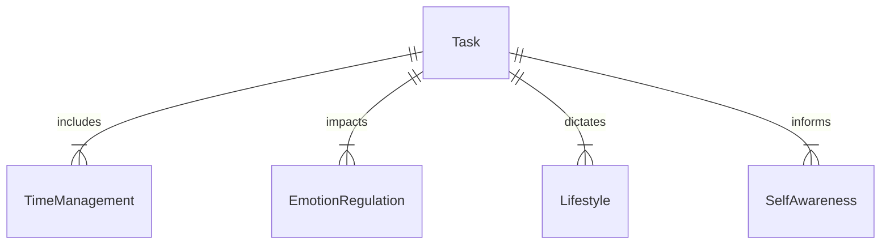

在这个ER图中，"Task"（任务）是核心实体，它与"TimeManagement"、"EmotionRegulation"、"Lifestyle"和"SelfAwareness"（时间管理、情绪调节、生活方式和自我认知）之间有直接的关系。

### 总结

通过理解这些核心概念，我们可以更好地了解生活韵律的构成和影响。在下一章节中，我们将深入探讨如何建立个人生活韵律，包括制定日程计划、时间管理技巧和应对突发情况的方法。

---

### 4.2 生活韵律的属性特征对比表格

为了更清晰地理解生活韵律的属性特征，我们可以制作一个对比表格。这个表格将帮助我们分析不同生活韵律的优缺点，以便我们选择最适合我们的方式。

| 属性特征 | 描述 | 优点 | 缺点 |
| :--- | :--- | :--- | :--- |
| 时间管理 | 规划和组织时间 | 提高工作效率、减少拖延、平衡工作与生活 | 过于严格可能导致压力增大、灵活性不足 |
| 情绪调节 | 管理情绪 | 提高心理韧性、减少压力、增强幸福感 | 可能需要长期练习和坚持、初期难度较大 |
| 生活方式 | 日常行为习惯 | 提高身体健康、提升生活质量 | 改变习惯需要时间、初期可能难以适应 |
| 自我认知 | 理解自我 | 提高自我认知、明确生活方向、增强自信 | 需要自我反思和持续努力、初期可能感到困惑 |

通过这个表格，我们可以看到每个属性特征的优缺点。例如，时间管理虽然可以提高工作效率，但如果过于严格，可能会增加个人的压力。相反，情绪调节虽然有助于提高心理韧性，但需要长期坚持和练习。这些特征共同构成了我们的生活韵律，我们需要根据自身的需求和实际情况来选择和调整。

### 4.3 生活韵律的ER实体关系图

为了更直观地展示生活韵律的各属性特征之间的关系，我们可以使用ER（实体关系）图来描述。以下是生活韵律的ER实体关系图：

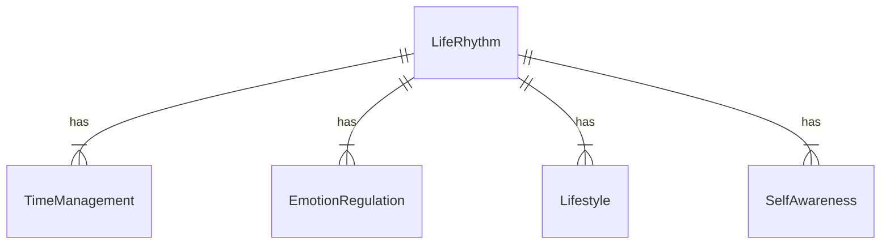

在这个ER图中，"LifeRhythm"（生活韵律）是核心实体，它与"TimeManagement"、"EmotionRegulation"、"Lifestyle"和"SelfAwareness"（时间管理、情绪调节、生活方式和自我认知）之间有直接的关系。这个关系图帮助我们理解，一个良好的生活韵律需要这些属性的相互作用和协调。

### 总结

通过对比表格和ER实体关系图，我们可以更全面地理解生活韵律的属性特征和它们之间的关系。在下一章节中，我们将探讨如何具体建立个人生活韵律，包括制定日程计划、时间管理技巧和应对突发情况的方法。

---

### 5.1 制定个人日程计划

建立个人生活韵律的第一步是制定一个详细的日程计划。日程计划有助于我们更好地管理时间，确保各项工作和活动能够有序进行。以下是制定个人日程计划的具体步骤：

#### 5.1.1 确定主要任务和活动

首先，列出你每天必须完成的任务和活动。这包括工作、学习、家庭责任、健身和休闲娱乐等。确保这些任务和活动是实际可行的，并考虑到你的个人需求和偏好。

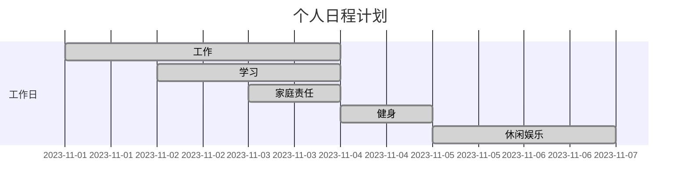

#### 5.1.2 优先级排序

确定每个任务和活动的优先级。这有助于我们集中精力完成最重要的任务，并确保关键活动得到妥善安排。可以使用简单的优先级标记，如“高”、“中”、“低”来表示任务的紧急程度。

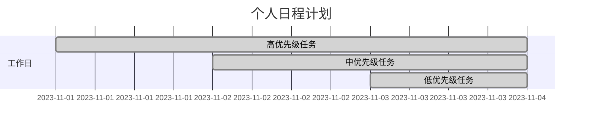

#### 5.1.3 时间分配

为每个任务和活动分配具体的时间。确保留出足够的缓冲时间以应对突发情况。以下是一个简单的日程计划示例：

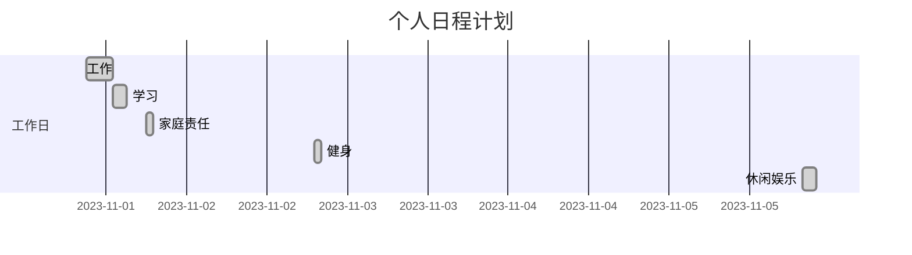

#### 5.1.4 定期回顾和调整

制定日程计划后，定期回顾和调整至关重要。这有助于我们了解哪些安排是有效的，哪些需要改进。每次回顾时，记录下你的实际完成情况和反馈，以便在下一次制定计划时进行调整。

### 总结

制定个人日程计划是建立生活韵律的重要一步。通过确定主要任务、优先级排序、时间分配和定期回顾，我们可以更有效地管理时间，提高生活质量。在下一章节中，我们将探讨时间管理的技巧，以帮助我们在繁忙的生活中保持高效和平衡。

---

### 5.2 时间管理技巧

在建立个人生活韵律的过程中，时间管理是关键的一环。有效的时间管理不仅能提高工作效率，还能让我们有更多时间享受生活。以下是一些实用的时间管理技巧：

#### 5.2.1 优先级排序

首先，我们需要明确任务的优先级。将任务分为“紧急且重要”、“紧急但不重要”、“不紧急但重要”和“不紧急且不重要”四个类别。这样可以帮助我们集中精力处理最重要和最紧急的任务。

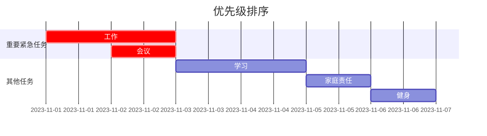

#### 5.2.2 定时休息

长时间工作或学习会导致疲劳和效率下降。因此，定期休息至关重要。每工作45-60分钟后，休息5-10分钟，可以帮助我们恢复精力，提高工作效率。

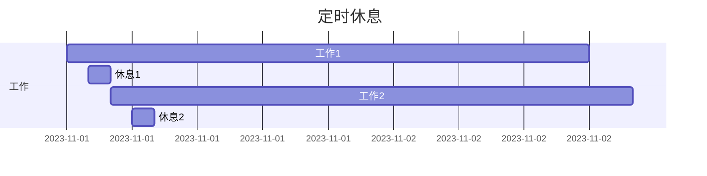

#### 5.2.3 避免拖延

拖延是影响时间管理的一大障碍。为了克服拖延，我们可以使用番茄工作法（Pomodoro Technique）。这种方法将工作时间分为25分钟的工作周期，每个周期后休息5分钟。四个周期后，休息15-30分钟。

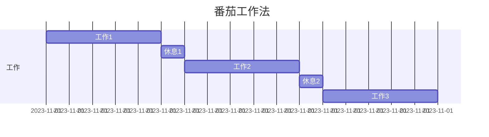

#### 5.2.4 避免多任务处理

多任务处理可能会降低我们的工作效率。专注于一项任务，直到完成，可以显著提高工作效率。以下是一个简单的单任务处理示例：

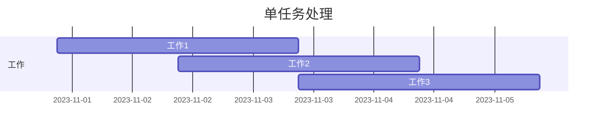

#### 5.2.5 利用工具

利用各种时间管理工具可以帮助我们更好地规划和管理时间。例如，使用日历应用（如Google Calendar）来安排日程，使用待办事项应用（如Trello或Asana）来跟踪任务进度，使用时间跟踪应用（如Toggl）来监控工作时间。

### 总结

通过优先级排序、定时休息、避免拖延、避免多任务处理和利用工具，我们可以更有效地管理时间，提高工作效率，从而为建立个人生活韵律打下坚实的基础。在下一章节中，我们将探讨如何有效地分割工作与生活，以保持平衡。

---

### 5.3 工作与生活的有效分割

在工作与生活之间建立有效的分割对于维持个人生活韵律至关重要。以下是一些方法可以帮助我们实现这一目标：

#### 5.3.1 工作时间的明确界定

为了确保工作与生活之间的清晰界限，我们需要明确界定工作时间。这意味着在一天开始时，规划好工作时间段，并在工作结束时停止工作。例如，你可以设定每天的工作时间为上午9点到下午5点，在这段时间内专注于工作，避免在非工作时间处理工作事务。

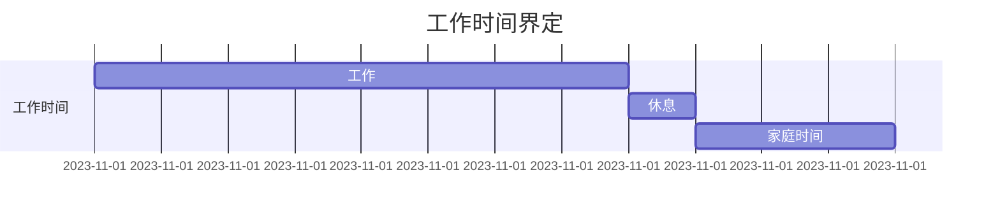

#### 5.3.2 非工作时间的专注

在非工作时间，我们要确保自己能够专注于个人生活。这意味着在非工作时间内，尽量避免查看邮件、回复工作信息或者处理与工作相关的事务。这样可以确保你能够完全放松，享受个人时间。

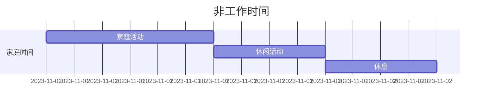

#### 5.3.3 设置工作与生活界限的提醒

为了确保我们能够遵守工作与生活之间的界限，可以设置一些提醒。例如，在手机上设置闹钟或提醒，以便在非工作时间提醒自己停止处理工作事务。此外，可以使用工作应用程序（如Focus@Will）来屏蔽与工作相关的通知，确保专注于非工作活动。

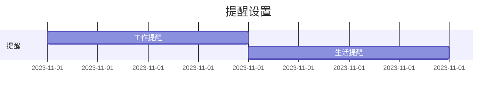

#### 5.3.4 家庭与工作的沟通

在工作时间内，确保与家人进行有效的沟通，告知他们你的工作时间安排，并尽量在非工作时间内处理家庭事务。这样可以减少工作与家庭之间的冲突，提高生活质量。

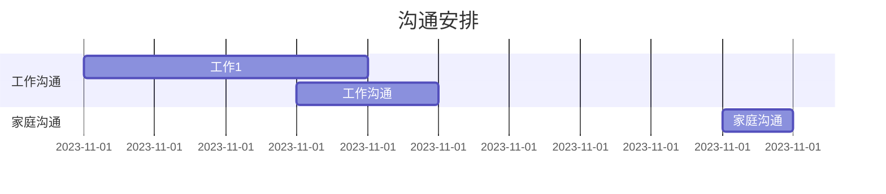

#### 5.3.5 持续调整与优化

最后，我们需要持续调整和优化工作与生活的分割方法。随着工作环境和家庭需求的变化，可能需要不断调整工作时间安排和沟通方式。定期评估自己的工作与生活平衡，确保能够持续保持良好的状态。

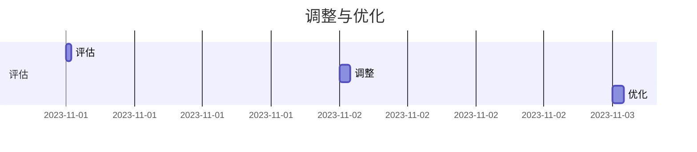

### 总结

通过明确界定工作时间、专注于非工作时间、设置提醒、有效沟通和持续调整与优化，我们可以有效地分割工作与生活，从而维持个人生活韵律。在下一章节中，我们将探讨如何应对突发情况，以保持生活的稳定和有序。

---

### 5.4 应对突发情况

在建立个人生活韵律的过程中，突发情况是不可避免的。这些突发情况可能会打乱我们的日程计划，影响我们的情绪和节奏。因此，学会应对突发情况是保持生活稳定和有序的重要一环。

#### 5.4.1 提前准备

为了避免突发情况对生活节奏的冲击，我们可以提前做好准备。这包括以下几个方面：

1. **紧急储备**：为可能出现的紧急情况准备必要的物品，如急救包、备用电池和食物等。
2. **备份计划**：对于重要的工作或生活事务，制定备份计划。例如，如果电脑出现故障，提前备份重要文件，并准备备用设备。
3. **心理准备**：培养应对压力和挑战的心理韧性，学会接受变化，保持积极的心态。

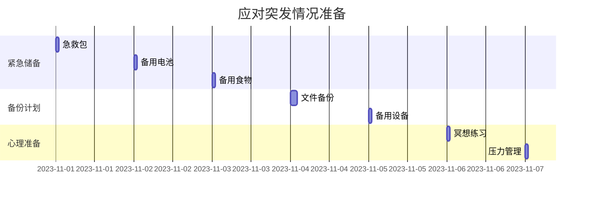

#### 5.4.2 灵活调整

当突发情况发生时，我们需要灵活调整日程计划，以适应新的情况。以下是一些具体的调整策略：

1. **优先级调整**：重新评估任务和活动的优先级，将重要且紧急的任务放在首位。
2. **时间压缩**：对于非紧急任务，可以尝试压缩时间，以确保关键任务得到完成。
3. **资源调配**：合理调配时间和资源，确保关键任务得到足够的关注和完成。

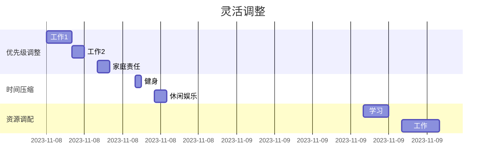

#### 5.4.3 心理调适

突发情况往往会带来情绪波动，因此心理调适至关重要。以下是一些心理调适的方法：

1. **深呼吸**：在紧张或焦虑时，进行深呼吸可以帮助我们放松身心。
2. **正念冥想**：通过正念冥想，我们可以专注于当前时刻，减少对突发情况的过度反应。
3. **寻求支持**：与家人、朋友或专业人士交流，寻求帮助和支持。

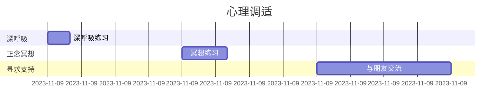

#### 5.4.4 反思与调整

在应对突发情况后，进行反思和调整是必要的。通过总结经验，我们可以更好地准备未来可能出现的突发情况。以下是一些反思和调整的方法：

1. **记录经验**：记录突发情况的处理过程和结果，以便总结经验。
2. **评估效果**：评估应对策略的有效性，找出不足之处。
3. **调整计划**：根据反思的结果，调整日程计划和应对策略。

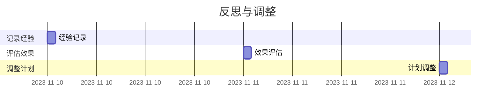

### 总结

通过提前准备、灵活调整、心理调适和反思调整，我们可以更好地应对突发情况，保持个人生活韵律的稳定和有序。在下一章节中，我们将分享日记记录与分析、节奏调整的步骤与方法，以帮助大家更有效地实践和调整生活节奏。

---

### 6.1 日记记录与分析

日记记录与分析是掌握和调整个人生活节奏的有效方法。通过记录日常生活，我们可以更好地了解自己的行为模式、情绪变化和时间使用情况，从而进行针对性的调整。

#### 6.1.1 日记记录

开始记录日记的第一步是选择一种适合自己的记录方式。这可以是纸质日记、电子文档或日记应用程序。以下是一个简单的日记记录模板：

- **日期**：记录日记的日期。
- **活动**：列出当天的主要活动和任务，包括工作、学习、家庭责任和娱乐等。
- **时间分配**：为每个活动记录具体的时间，以便分析时间使用情况。
- **情绪记录**：记录当天的情绪变化，包括感到高兴、紧张、焦虑或疲惫的时刻。
- **反思**：写下当天的反思，包括对活动的满意度、时间管理的效果和任何需要改进的地方。

以下是一个示例：

```markdown
# 2023-11-01日记

## 活动与时间分配

- 09:00 - 12:00：工作
- 12:00 - 13:00：午餐
- 13:00 - 16:00：学习
- 16:00 - 18:00：家庭责任
- 18:00 - 20:00：健身
- 20:00 - 22:00：休闲娱乐

## 情绪记录

- 09:00 - 10:30：感到紧张和焦虑，但顺利完成了工作。
- 13:00 - 14:00：午餐后感到困倦，但通过散步恢复了精力。
- 18:00 - 19:00：与家人互动愉快，但家务任务较多，感到压力。

## 反思

- 工作效率较高，但需要减少午餐后的疲劳感。
- 需要更好地安排家庭责任，减少压力。
- 休闲娱乐时间需要更多专注，避免分心。
```

#### 6.1.2 分析日记

记录日记只是第一步，分析日记才是关键。通过定期回顾和分析日记，我们可以发现生活中的规律和问题，从而进行针对性的调整。以下是一些分析日记的方法：

1. **时间使用分析**：统计每个活动的时间分配，评估时间使用效率。例如，如果发现学习时间过多，但学习效果不佳，可能需要调整学习方法或时间分配。
   
2. **情绪变化分析**：观察情绪变化的规律，了解情绪波动的触发因素。例如，如果发现情绪低落与工作压力有关，可能需要调整工作安排或寻求心理支持。

3. **反思与改进**：根据日记中的反思，制定具体的改进计划。例如，如果发现晚上休息时间不足，可以调整作息时间，确保每天有足够的休息。

#### 6.1.3 节奏调整的步骤与方法

基于日记的分析，我们可以采取以下步骤和方法进行调整：

1. **设定目标**：根据分析结果，设定具体的生活节奏调整目标。例如，提高工作效率、减少拖延、增加休闲时间等。

2. **制定计划**：为每个目标制定具体的行动计划。例如，如果目标是提高工作效率，可以尝试使用时间管理技巧，如番茄工作法。

3. **实施与监控**：执行行动计划，并定期监控进展。例如，每周回顾一次日记，检查目标的完成情况，并根据实际情况进行调整。

4. **持续优化**：根据实施过程中的反馈和结果，持续优化调整计划。例如，如果发现某种方法效果不佳，可以尝试其他方法。

### 总结

通过日记记录与分析，我们可以更全面地了解自己的生活方式和节奏，从而进行针对性的调整。日记记录与分析是一个持续的过程，需要我们不断反思和优化。在下一章节中，我们将探讨面对挑战时的应对策略，以帮助我们在调整生活节奏时更好地应对各种挑战。

---

### 6.2 节奏调整的步骤与方法

在了解了日记记录与分析的重要性之后，接下来我们将详细探讨节奏调整的步骤与方法。通过系统的步骤和方法，我们可以更有效地调整和优化个人生活节奏，从而实现更高的生活质量和工作效率。

#### 6.2.1 设定明确的调整目标

调整生活节奏的第一步是设定明确的目标。这些目标应该是具体、可衡量和可实现的。例如：

- **目标1**：每天保证7-8小时的睡眠。
- **目标2**：每周至少进行三次锻炼，每次30分钟以上。
- **目标3**：将工作完成时间缩短20%。

设定目标时，需要确保这些目标与个人的生活和工作实际情况相符。例如，如果工作压力较大，可能需要先从调整工作时间开始，逐步实现其他目标。

#### 6.2.2 制定详细的行动计划

一旦设定了调整目标，下一步是制定具体的行动计划。行动计划应该包括每个目标的实施步骤和时间表。以下是一个示例行动计划：

- **目标1**：每天保证7-8小时的睡眠
  - **步骤1**：晚上10点前上床休息。
  - **步骤2**：睡前1小时停止使用电子设备。
  - **步骤3**：每天早上7点起床。

- **目标2**：每周至少进行三次锻炼，每次30分钟以上
  - **步骤1**：每周一、三、五下午5点后安排锻炼时间。
  - **步骤2**：选择喜欢的锻炼方式，如跑步、瑜伽或游泳。
  - **步骤3**：使用运动应用程序记录锻炼情况。

#### 6.2.3 实施行动计划

在制定好行动计划后，关键在于实施这些计划。以下是一些实施行动计划的方法：

1. **逐步实施**：避免一次性调整过多，以免造成过大压力。例如，可以先从每天减少10分钟的工作时间开始，逐步增加到每天减少20分钟。

2. **保持一致**：尽量保持每天的行动一致，形成固定的生活习惯。例如，如果每天早上7点起床，尽量每天都能按时起床。

3. **记录进展**：使用日记或其他工具记录行动计划的实施进展，以便及时调整。

#### 6.2.4 监控和调整

在实施行动计划的过程中，定期监控和调整至关重要。以下是一些监控和调整的方法：

1. **定期回顾**：每周或每月回顾一次行动计划的实施情况，检查目标的完成情况。

2. **调整计划**：根据回顾结果，及时调整行动计划。例如，如果发现每天减少10分钟工作时间过于困难，可以尝试逐步减少时间。

3. **寻求反馈**：向家人、朋友或专业人士寻求反馈，了解他们在生活节奏调整过程中的观察和建议。

#### 6.2.5 持续优化

生活节奏的调整是一个持续的过程，需要我们不断地优化和调整。以下是一些持续优化的方法：

1. **灵活调整**：根据实际情况，灵活调整行动计划。例如，如果工作繁忙，可能需要调整锻炼时间。

2. **不断学习**：学习新的时间管理和生活方式技巧，以帮助优化个人生活节奏。

3. **定期反思**：定期反思个人生活节奏，了解哪些方法有效，哪些需要改进。

### 总结

通过设定明确的目标、制定详细的行动计划、实施并监控这些计划，以及持续优化，我们可以有效地调整和优化个人生活节奏。这个过程需要耐心和毅力，但通过不断地努力，我们可以实现更高的生活质量和工作效率。在下一章节中，我们将分享一些实际案例，以帮助大家更好地理解和应用这些方法。

---

### 6.3 面对挑战时的应对策略

在调整生活节奏的过程中，我们可能会遇到各种挑战，如工作压力、家庭责任和突发情况等。为了有效地应对这些挑战，我们需要制定一些具体的策略。

#### 6.3.1 工作压力的应对策略

面对工作压力，我们可以采取以下策略：

1. **优先级排序**：将工作任务按照紧急程度和重要性排序，优先处理最重要的任务。
   ```mermaid
   gantt
       dateFormat  YYYY-MM-DD
       title 工作任务排序
       section 优先级任务
       高优先级任务 : 2023-11-01, 2d
       中优先级任务 : 2023-11-02, 1d
       低优先级任务 : 2023-11-03, 1d
   ```

2. **时间管理技巧**：利用时间管理工具，如待办事项应用和日历，来更好地组织工作时间和任务。
   ```mermaid
   gantt
       dateFormat  YYYY-MM-DD
       title 时间管理
       section 工作
       工作1 : 2023-11-01 09:00, 3h
       工作2 : 2023-11-01 13:00, 2h
       工作3 : 2023-11-01 16:00, 2h
   ```

3. **情绪调节**：通过冥想、深呼吸或运动来缓解工作压力。
   ```mermaid
   gantt
       dateFormat  YYYY-MM-DD
       title 情绪调节
       section 冥想
       冥想1 : 2023-11-01 18:00, 20m
       冥想2 : 2023-11-02 18:00, 20m
   ```

#### 6.3.2 家庭责任的应对策略

在家庭责任方面，以下是一些有效的应对策略：

1. **家庭时间规划**：合理安排家庭时间，确保有足够的时间陪伴家人。
   ```mermaid
   gantt
       dateFormat  YYYY-MM-DD
       title 家庭时间规划
       section 家庭活动
       家庭聚餐 : 2023-11-01 19:00, 2h
       家庭聚会 : 2023-11-03 18:00, 2h
   ```

2. **沟通与协商**：与家人进行有效沟通，共同分担家庭责任，减少个人负担。
   ```mermaid
   gantt
       dateFormat  YYYY-MM-DD
       title 沟通与协商
       section 沟通
       沟通1 : 2023-11-01 20:00, 1h
       沟通2 : 2023-11-02 20:00, 1h
   ```

3. **灵活调整**：根据家庭需求和变化，灵活调整家庭责任安排。
   ```mermaid
   gantt
       dateFormat  YYYY-MM-DD
       title 调整
       section 调整
       调整1 : 2023-11-01, 1h
       调整2 : 2023-11-02, 1h
   ```

#### 6.3.3 突发情况的应对策略

面对突发情况，以下是一些应对策略：

1. **紧急储备**：提前准备必要的紧急物品，如急救包、备用电池和食物等。
   ```mermaid
   gantt
       dateFormat  YYYY-MM-DD
       title 紧急储备
       section 物品储备
       急救包 : 2023-11-01, 1h
       备用电池 : 2023-11-02, 1h
       备用食物 : 2023-11-03, 1h
   ```

2. **备份计划**：制定备份计划，确保关键工作或任务不会因突发情况而受到影响。
   ```mermaid
   gantt
       dateFormat  YYYY-MM-DD
       title 备份计划
       section 备份
       文件备份 : 2023-11-04, 2h
       备用设备 : 2023-11-05, 1h
   ```

3. **心理调适**：通过深呼吸、冥想或寻求支持来应对突发情况带来的情绪波动。
   ```mermaid
   gantt
       dateFormat  YYYY-MM-DD
       title 心理调适
       section 调适
       深呼吸 : 2023-11-06, 1h
       冥想 : 2023-11-07, 1h
       寻求支持 : 2023-11-08, 1h
   ```

#### 6.3.4 反思与持续优化

在应对挑战的过程中，反思和持续优化至关重要。通过以下步骤，我们可以更好地应对未来的挑战：

1. **记录经验**：记录应对挑战的过程和结果，总结经验教训。
   ```mermaid
   gantt
       dateFormat  YYYY-MM-DD
       title 经验记录
       section 记录
       经验记录1 : 2023-11-09, 1h
       经验记录2 : 2023-11-10, 1h
   ```

2. **评估效果**：定期评估应对策略的有效性，检查是否达到了预期目标。
   ```mermaid
   gantt
       dateFormat  YYYY-MM-DD
       title 评估效果
       section 评估
       评估1 : 2023-11-11, 1h
       评估2 : 2023-11-12, 1h
   ```

3. **调整计划**：根据评估结果，调整应对策略和行动计划，以更好地适应未来的挑战。
   ```mermaid
   gantt
       dateFormat  YYYY-MM-DD
       title 调整计划
       section 调整
       计划调整1 : 2023-11-13, 1h
       计划调整2 : 2023-11-14, 1h
   ```

### 总结

通过制定和实施应对策略，我们可以更有效地应对生活中的挑战，保持个人生活节奏的稳定和有序。在下一章节中，我们将分享一些实践案例，以帮助大家更好地理解和应用这些策略。

---

### 6.4 实践案例分享

在实际生活中，许多人在调整生活节奏方面取得了显著成效。以下是一些具体的实践案例，这些案例展示了如何通过制定计划、调整策略和应对挑战来实现个人生活韵律的优化。

#### 案例一：李先生的工作与生活平衡

李先生是一名软件工程师，由于工作繁忙，他感到生活节奏失衡，压力很大。为了改善这一情况，他采取了以下措施：

1. **时间管理**：李先生使用时间管理工具如Google Calendar来规划每天的工作和学习时间。他每天早上都会列出当天的重要任务，并确保按照优先级顺序进行。

2. **健康习惯**：李先生开始每天早晨跑步30分钟，并在周末进行其他形式的锻炼，如游泳或瑜伽。他发现，锻炼不仅提高了身体素质，还帮助他更好地应对工作压力。

3. **家庭时间**：李先生每周固定一天晚上与家人共进晚餐，并在周末安排家庭活动。这让他感到与家人的联系更加紧密，同时减轻了工作带来的孤独感。

通过这些措施，李先生成功实现了工作与生活的平衡，他的工作效率提高了，生活质量也得到了显著提升。

#### 案例二：张女士的情绪调节

张女士是一名教师，工作压力较大，经常感到焦虑和疲惫。为了改善这种情况，她采取了以下策略：

1. **情绪日记**：张女士开始记录每天的情绪变化，了解哪些因素导致了她的焦虑。通过日记记录，她发现压力主要来自于工作量大和时间紧迫。

2. **冥想**：张女士每天晚上花10分钟进行冥想，这帮助她放松身心，减少焦虑感。她还参加了一个冥想小组，与其他人分享经验和技巧。

3. **放松活动**：张女士每周安排一次自我放松活动，如阅读、听音乐或与朋友聚会。这些活动让她能够暂时忘记工作压力，恢复精力。

通过这些方法，张女士成功地调节了情绪，提高了心理韧性，她的生活质量和工作效率都得到了显著改善。

#### 案例三：王女士的生活节奏调整

王女士是一名全职妈妈，同时兼职做一些自由职业工作。她发现自己很难平衡家庭、工作和个人时间。为了解决这个问题，她采取了以下措施：

1. **时间规划**：王女士制定了详细的家庭和工作计划，确保每天有足够的时间陪伴孩子，同时完成工作。她使用家庭日历来跟踪家庭活动和家庭责任。

2. **任务分解**：王女士将大的任务分解成小的子任务，这样可以更容易地完成，减少拖延。她每天晚上都会列出第二天需要完成的任务，并确保按计划执行。

3. **休息与放松**：王女士学会了给自己留出休息时间，每周安排一次彻底放松的日子。她会在这一天做一些自己喜欢的事情，如购物、看电影或与朋友聚会。

通过这些调整，王女士成功地找到了适合自己家庭的节奏，她的生活质量和工作效率都得到了显著提高。

### 总结

这些实践案例展示了通过制定计划、调整策略和应对挑战，个人可以有效地调整生活节奏，实现工作与生活的平衡。在下一章节中，我们将探讨如何应对生活节奏的变化，以及长期生活的节奏管理策略。

---

### 7.1 不同生活方式的对比与选择

在探索个人生活韵律的过程中，了解不同生活方式的选择和它们对生活节奏的影响至关重要。以下是一些常见的生活方式，以及它们各自的优缺点和适用人群。

#### 7.1.1 节奏快的生活方式

**特点**：这种生活方式以高效率和高强度为特征，人们通常会忙于工作、学习和社交活动，很少有闲暇时间。

**优点**：有助于提高个人能力和职业发展，适应快节奏的工作环境。

**缺点**：可能导致压力过大，缺乏个人休息和放松时间。

**适用人群**：适合追求职业发展和快速成长的人群，如职场新人或创业者。

#### 7.1.2 节奏慢的生活方式

**特点**：这种生活方式注重平衡和休闲，人们倾向于在日常生活中安排更多放松和休息时间。

**优点**：有助于减少压力，提高生活满意度。

**缺点**：可能影响职业发展，因为较少的时间用于工作和学习。

**适用人群**：适合追求生活质量和身心健康的人群，如退休人士或长期工作者。

#### 7.1.3 节奏灵活的生活方式

**特点**：这种生活方式结合了节奏快和节奏慢的元素，人们根据不同阶段和需求灵活调整生活节奏。

**优点**：有助于在不同阶段保持平衡，适应变化。

**缺点**：可能需要更高的自律和规划能力。

**适用人群**：适合需要灵活应对生活变化的人群，如家庭主妇、自由职业者或学生。

#### 7.1.4 简约生活方式

**特点**：这种生活方式强调简约和实用，人们倾向于减少不必要的物质和社交活动，专注于重要的事情。

**优点**：有助于减少浪费，提高生活质量。

**缺点**：可能影响社交和娱乐活动。

**适用人群**：适合追求简单生活和高效能的人群，如简约主义者或环保倡导者。

#### 7.1.5 健康生活方式

**特点**：这种生活方式注重健康和健身，人们倾向于进行定期锻炼和健康饮食。

**优点**：有助于提高身体健康和幸福感。

**缺点**：可能需要投入更多时间和精力。

**适用人群**：适合注重健康和希望改善生活方式的人群，如健身爱好者或健康倡导者。

### 总结

选择适合自己生活方式的关键在于了解不同生活方式的优缺点，并根据个人需求和实际情况做出选择。在下一章节中，我们将探讨如何应对生活节奏的变化，以及长期生活的节奏管理策略。

---

### 7.2 如何应对生活节奏的变化

生活节奏的变化是不可避免的，无论是工作、家庭还是个人兴趣，都可能会对我们的日常安排产生影响。为了更好地应对这些变化，我们需要采取一系列策略，以确保生活韵律的稳定性。

#### 7.2.1 灵活调整计划

首先，我们需要保持计划的可调整性。这意味着在制定日程计划时，不要设定过于严格的时间表，留出一些缓冲时间以应对突发情况。例如，如果每天的计划安排得很满，突然出现紧急事务，我们可能会感到压力巨大。因此，建议在日程中预留一些自由时间，以应对不可预见的变化。

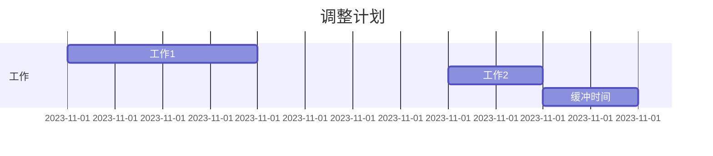

#### 7.2.2 建立多重备份计划

其次，为了应对可能出现的突发情况，我们可以制定多重备份计划。例如，如果工作项目中某个任务无法在预定时间内完成，我们可以考虑重新分配资源或调整优先级。同时，保持一些紧急联系人名单，以便在需要时能够快速获得帮助。

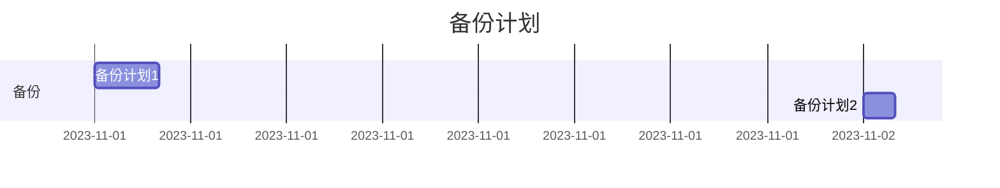

#### 7.2.3 心理调适

面对生活节奏的变化，心理调适同样重要。可以通过以下方法来缓解压力和焦虑：

1. **冥想**：冥想有助于我们放松身心，减轻压力。每天花几分钟进行冥想，专注于呼吸和当下的感觉。

2. **运动**：定期进行运动可以释放体内的紧张和焦虑，提高心理健康。可以选择喜欢的运动方式，如跑步、瑜伽或游泳。

3. **社交支持**：与家人、朋友或专业人士交流，分享自己的感受和困惑，寻求帮助和支持。

```mermaid
gantt
    dateFormat  YYYY-MM-DD
    title 心理调适
    section 冥想
    冥想1 : 2023-11-01, 15m
    冥想2 : 2023-11-02, 15m
    section 运动
    运动1 : 2023-11-03, 30m
    运动2 : 2023-11-04, 30m
    section 社交
    社交支持 : 2023-11-05, 1h
```

#### 7.2.4 定期评估和调整

最后，定期评估和调整个人生活节奏是必要的。这可以帮助我们及时了解哪些方法有效，哪些需要改进。每次评估时，记录下实际完成情况和反馈，并根据这些信息调整计划。

```mermaid
gantt
    dateFormat  YYYY-MM-DD
    title 评估与调整
    section 评估
    评估1 : 2023-11-06, 1h
    评估2 : 2023-11-07, 1h
    section 调整
    调整1 : 2023-11-08, 1h
    调整2 : 2023-11-09, 1h
```

### 总结

通过灵活调整计划、建立多重备份计划、心理调适和定期评估调整，我们可以更好地应对生活节奏的变化，保持生活韵律的稳定和有序。在下一章节中，我们将探讨长期生活的节奏管理策略，以帮助我们在不同阶段维持最佳生活状态。

---

### 7.3 长期生活的节奏管理策略

在长期生活的节奏管理中，保持稳定和可持续的生活节奏至关重要。以下是一些策略，帮助我们持续优化生活节奏，确保身心健康和幸福感。

#### 7.3.1 设定长期目标

首先，设定明确的长期目标，这有助于我们保持方向和动力。这些目标可以是职业上的晋升、家庭生活的改善、个人兴趣的培养等。例如，设定每年阅读50本书、每年完成一次国内外旅行、每周进行三次锻炼等目标。

```mermaid
gantt
    dateFormat  YYYY-MM-DD
    title 长期目标
    section 职业目标
    晋升目标 : 2023-12-31, 1y
    section 家庭目标
    家庭旅行 : 2023-12-31, 1y
    section 个人目标
    健身计划 : 2023-12-31, 1y
```

#### 7.3.2 持续学习和适应

随着环境的变化，我们需要不断学习和适应新的生活方式。例如，随着技术的进步，我们可以利用新的时间管理工具和应用程序来提高效率。此外，通过参加培训课程或阅读专业书籍，我们可以不断更新知识和技能，以应对职业发展中的新挑战。

```mermaid
gantt
    dateFormat  YYYY-MM-DD
    title 持续学习
    section 培训课程
    培训1 : 2023-11-01, 1d
    培训2 : 2023-12-01, 1d
    section 书籍阅读
    阅读计划 : 2023-11-01, 50d
```

#### 7.3.3 保持身心健康

身心健康是长期生活节奏管理的基础。通过定期进行体育锻炼、保持健康的饮食习惯和充足的睡眠，我们可以提高身体的免疫力和精神状态。此外，定期进行健康检查，及时发现并处理健康问题，也是保持身心健康的重要措施。

```mermaid
gantt
    dateFormat  YYYY-MM-DD
    title 身心健康
    section 体育锻炼
    锻炼计划 : 2023-11-01, 30d
    section 饮食健康
    饮食调整 : 2023-11-01, 30d
    section 睡眠充足
    睡眠计划 : 2023-11-01, 30d
    section 健康检查
    检查计划 : 2023-11-01, 6m
```

#### 7.3.4 社交与人际关系

社交与人际关系对我们的生活节奏也有重要影响。通过定期与家人、朋友和同事交流，我们可以获得情感支持，减轻压力，提高幸福感。此外，积极参与社交活动，如社区服务、志愿服务或兴趣爱好小组，可以帮助我们建立更广泛的社交网络。

```mermaid
gantt
    dateFormat  YYYY-MM-DD
    title 社交与人际关系
    section 家庭聚会
    聚会计划 : 2023-11-01, 30d
    section 社交活动
    活动计划 : 2023-11-01, 30d
    section 社区服务
    服务计划 : 2023-11-01, 30d
```

#### 7.3.5 定期反思和调整

最后，定期反思和调整是长期节奏管理的关键。通过定期回顾个人目标、生活节奏和身心健康状况，我们可以及时发现问题并进行调整。例如，每季度或每年进行一次全面的评估，检查哪些方面需要改进，哪些策略有效。

```mermaid
gantt
    dateFormat  YYYY-MM-DD
    title 反思与调整
    section 反思
    反思计划 : 2023-11-01, 1y
    section 调整
    调整计划 : 2023-11-01, 1y
```

### 总结

通过设定长期目标、持续学习、保持身心健康、维护社交关系和定期反思调整，我们可以有效地管理长期生活节奏，确保身心健康和幸福感。这些策略不仅有助于我们应对日常生活的挑战，还能为我们带来持续的个人成长和进步。

---

### 7.4 个人成长与生活韵律的关系

个人成长与生活韵律之间存在着密切的联系。一个稳定且适合个人需求的生活韵律不仅有助于我们实现个人目标，还能促进我们的全面发展。

#### 成长需求与生活韵律

首先，个人成长需求是我们制定生活韵律的出发点。每个人的成长需求都是独特的，包括职业发展、知识学习、身心健康和人际关系等。在制定生活韵律时，我们需要充分考虑这些需求，确保每个方面都能得到充分关注。

#### 成长与生活的互动

其次，个人成长与生活韵律是相互促进的关系。良好的生活韵律可以为个人成长提供稳定的环境和资源。例如，通过合理安排时间，我们可以确保有足够的时间进行学习和职业发展。同时，个人成长带来的成就感和满足感也能增强我们的幸福感和动力，进一步优化生活韵律。

#### 成长策略与生活韵律

为了实现个人成长，我们可以采取以下策略：

1. **定期目标设定**：设定明确的短期和长期目标，并制定具体的行动计划，确保在生活韵律中留出足够的时间进行学习和实践。

2. **持续学习**：利用碎片时间进行学习，如阅读专业书籍、参加在线课程或观看教育视频。通过持续学习，我们可以不断提升自己的知识和技能。

3. **身心健康**：保持良好的生活习惯，如定期锻炼、健康饮食和充足睡眠。一个健康的身体是个人成长的基础。

4. **社交与人际关系**：积极参与社交活动，建立和维护良好的人际关系。这不仅可以提高我们的心理健康，还能为职业发展提供更多的机会。

### 总结

个人成长与生活韵律之间存在着密切的联系。通过合理制定和调整生活韵律，我们可以更好地满足个人成长需求，实现全面的个人发展。在下一章节中，我们将总结全文，并提供一些最佳实践、注意事项以及拓展阅读建议。

---

### 8.1 对生活韵律的深刻理解

通过本文的探讨，我们深入理解了生活韵律的概念、重要性以及如何建立和调整个人生活韵律。生活韵律不仅仅是日常行为的规律，它涉及到时间管理、情绪调节、生活方式和自我认知等多个方面。一个良好的生活韵律可以帮助我们提高工作效率、减轻压力、提升身心健康，最终实现个人成长和幸福感。

### 8.2 如何将生活节奏管理融入日常生活

要将生活节奏管理融入日常生活，我们可以采取以下步骤：

1. **自我认知**：首先，深入了解自己的个性特质、生活习惯和情绪管理方式。通过自我反思，找到适合自己的生活节奏。

2. **制定日程计划**：制定详细的日程计划，合理安排工作、学习和休闲时间。确保每天有足够的休息和放松时间。

3. **时间管理**：运用时间管理技巧，如优先级排序、定时休息和避免多任务处理，提高时间使用效率。

4. **持续调整**：定期回顾和调整日程计划，根据实际情况进行调整。保持灵活性，以应对突发情况。

5. **心理健康**：通过冥想、锻炼和社交活动来调节情绪，保持心理平衡。

### 8.3 注意事项与常见误区

在建立生活韵律时，需要注意以下几点：

1. **避免过度追求完美**：生活韵律并不是一成不变的，我们需要根据实际情况进行调整。过度追求完美可能导致压力增加。

2. **避免单一化**：生活韵律应该包含多个方面，如工作、家庭、健康和社交等。单一化可能导致生活失衡。

3. **避免拖延**：拖延是影响时间管理的主要因素之一。通过设定明确的优先级和定时休息，可以有效避免拖延。

4. **避免忽视情绪管理**：情绪管理是生活韵律的重要组成部分。忽视情绪管理可能导致心理健康问题。

### 8.4 拓展阅读与资源推荐

为了进一步深入理解生活韵律，以下是一些建议的拓展阅读和资源：

1. **书籍推荐**：
   - 《时间管理的艺术》
   - 《高效能人士的七个习惯》
   - 《情绪调适技巧：如何管理情绪压力》

2. **在线课程**：
   - Coursera上的“时间管理与生产力”
   - Udemy上的“情绪管理：如何控制情绪、减少焦虑和压力”

3. **应用程序**：
   - Todoist：用于任务管理和日程安排
   - Forest：用于专注和避免分心
   - Headspace：用于冥想和情绪调节

通过这些资源和工具，我们可以更有效地管理自己的生活节奏，实现个人成长和幸福。

---

### 总结

在本文中，我们详细探讨了生活韵律的概念、重要性以及如何建立和调整个人生活韵律。通过自我认知、时间管理、情绪调节和生活方式的优化，我们可以更好地管理生活节奏，提高生活质量。希望本文能为您提供有益的启示，帮助您找到并保持适合您的生活韵律。

**作者：AI天才研究院/AI Genius Institute & 禅与计算机程序设计艺术 /Zen And The Art of Computer Programming**

