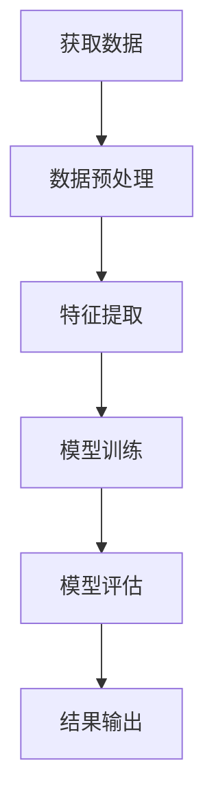

                 

# 《创造有利于成长的环境：个人发展的外部条件》

## 关键词：个人成长、外部条件、环境构建、教育改革、家庭教育、社会环境

### 摘要：

个人成长不仅依赖于内在动力，更受外部环境的影响。本文旨在探讨个人发展的外部条件，分析教育、家庭和社会环境对个人成长的深远影响，并提出构建有利于个人成长环境的策略。通过成功与失败案例的剖析，揭示外部环境与个人发展之间的互动机制，为跨文化环境下的个人发展提供策略指导。

## 引言

### 1. 个人成长与环境的关系

个人成长是一个复杂的过程，不仅涉及个体内在的生理和心理发展，还受到外部环境的多重影响。环境作为个体成长的土壤，对个人性格、能力、价值观等方面具有深远的影响。

### 1.2 个人成长与环境相互作用的理论基础

心理学研究表明，环境对个人成长的影响主要通过互动作用实现。个体的行为、认知和心理发展在环境中不断调整和适应，形成个人独特的成长轨迹。

### 1.3 营造有利于个人成长的环境的重要性

良好的外部环境有助于激发个人潜能，促进全面发展。因此，构建有利于个人成长的环境是家庭、教育机构和社会的共同责任。

## 个人发展的外部条件分析

### 2.1 教育体系对个人发展的影响

#### 2.1.1 教育资源的分配

教育资源的分配对个人发展具有重要影响。优质的教育资源能够为个体提供更好的学习环境和机会。

#### 2.1.2 教育内容的适应性

教育内容的适应性直接关系到个人发展的深度和广度。教育内容需要与时俱进，满足不同个体的需求。

#### 2.1.3 教育方式与个人发展的关系

教育方式的创新能够更好地激发个体学习兴趣和主动性，促进全面发展。

### 2.2 家庭环境对个人发展的影响

#### 2.2.1 家庭结构与个人发展的联系

家庭结构对个人发展具有显著影响。和谐的家庭关系有助于个体身心健康。

#### 2.2.2 家庭教育与个人成长

家庭教育在个人成长中扮演重要角色。良好的家庭教育能够培养个体良好的行为习惯和价值观。

#### 2.2.3 家庭氛围与个人性格的形成

家庭氛围对个人性格的形成具有重要影响。积极的家庭氛围有助于个体形成乐观、自信的性格。

### 2.3 社会环境对个人发展的影响

#### 2.3.1 社会文化对个人价值观的塑造

社会文化对个人价值观的形成具有深远影响。积极的社会文化能够引导个体形成正确的价值观。

#### 2.3.2 社会政策与个人发展

社会政策对个人发展具有指导作用。合理的社会政策能够为个体提供更好的发展机会。

#### 2.3.3 社会关系与个人成长

社会关系对个人成长具有重要影响。良好的人际关系有助于个体获取社会支持和资源。

## 良好外部环境的构建策略

### 3.1 教育改革与个人发展

#### 3.1.1 教育体制的优化

优化教育体制，提高教育资源的分配效率，是实现个人全面发展的重要途径。

#### 3.1.2 教育内容的创新

创新教育内容，使之更加贴近实际，满足个体多样化需求。

#### 3.1.3 教育方式的多样化

多样化教育方式，鼓励个体主动参与，提高学习效果。

### 3.2 家庭教育与个人成长

#### 3.2.1 家庭教育的角色

强化家庭教育在个人成长中的角色，营造和谐的家庭氛围。

#### 3.2.2 家庭教育与学校教育的衔接

加强家庭与学校教育的衔接，形成合力，共同促进个体发展。

#### 3.2.3 家庭教育与个人发展的关系

明确家庭教育与个人发展之间的关系，充分发挥家庭教育的作用。

### 3.3 社会环境的营造

#### 3.3.1 社会文化氛围的优化

优化社会文化氛围，营造积极向上的社会环境。

#### 3.3.2 社会政策的完善

完善社会政策，为个体提供更好的发展机会。

#### 3.3.3 社会支持体系的建立

建立完善的社会支持体系，为个体提供必要的支持和帮助。

## 外部环境与个人发展的案例研究

### 4.1 成功案例解析

#### 4.1.1 案例背景

分析成功案例的背景，了解其外部环境的特点。

#### 4.1.2 成功原因分析

深入分析成功案例的成功原因，探讨外部环境对其发展的促进作用。

#### 4.1.3 案例启示

从成功案例中获取启示，为个人发展提供借鉴。

### 4.2 失败案例分析

#### 4.2.1 案例背景

分析失败案例的背景，了解其外部环境的缺陷。

#### 4.2.2 失败原因探讨

探讨失败案例的失败原因，反思外部环境对其发展的负面影响。

#### 4.2.3 案例教训

从失败案例中吸取教训，避免在个人发展中重蹈覆辙。

## 个人成长与外部环境的互动机制

### 5.1 个人适应外部环境的能力

#### 5.1.1 自我认知与外部环境的匹配

个人需要具备良好的自我认知能力，以适应外部环境的变化。

#### 5.1.2 自我调整与外部环境互动

个人需要具备自我调整的能力，以适应外部环境的变化。

#### 5.1.3 个人成长与环境的动态平衡

个人成长与外部环境的互动是一个动态平衡的过程。

### 5.2 外部环境对个人发展的推动作用

#### 5.2.1 外部刺激与个人潜能激发

外部环境中的刺激有助于激发个人的潜能。

#### 5.2.2 外部资源与个人发展

外部资源为个人发展提供了必要的支持。

#### 5.2.3 外部反馈与个人成长

外部反馈对个人成长具有重要影响。

## 6. 跨文化环境与个人发展

### 6.1 跨文化环境对个人发展的影响

#### 6.1.1 文化差异与个人适应

跨文化环境中的文化差异对个人发展具有重要影响。

#### 6.1.2 跨文化学习与个人成长

跨文化学习有助于个人全面发展。

#### 6.1.3 跨文化沟通与个人发展

跨文化沟通能力对个人发展具有深远影响。

### 6.2 跨文化环境下的个人发展策略

#### 6.2.1 文化敏感性与个人发展

培养文化敏感性，有助于个人在跨文化环境中发展。

#### 6.2.2 跨文化教育的重要性

跨文化教育对于个人发展具有重要意义。

#### 6.2.3 跨文化职业规划与个人发展

跨文化职业规划有助于个人在全球化背景下实现全面发展。

## 结论

### 7.1 个人成长外部条件的重要性总结

外部条件对个人成长具有重要影响，构建有利于个人成长的环境是家庭、教育机构和社会的共同责任。

### 7.2 改善外部环境的具体建议

针对教育、家庭和社会环境，提出具体的改善建议。

### 7.3 未来研究方向与展望

探讨未来个人发展外部条件的研究方向和展望。

## 作者信息

作者：AI天才研究院/AI Genius Institute & 禅与计算机程序设计艺术 /Zen And The Art of Computer Programming

## 完整性要求

本文详细探讨了个人成长的外部条件，包括教育、家庭和社会环境的影响，以及构建有利于个人成长环境的策略。通过案例研究和跨文化环境分析，进一步阐述了外部环境对个人发展的作用。本文在阐述核心概念、算法原理、系统设计与项目实战等方面，提供了丰富的内容，旨在为读者提供全面、深入的指导。

## 核心概念与联系

### 核心概念

- **个人成长**：指个体在生理、心理和社会等方面的不断发展和成熟过程。
- **外部条件**：指影响个人成长的环境因素，包括教育、家庭、社会等。
- **教育体系**：包括教育资源、教育内容和教育方式等。
- **家庭环境**：包括家庭结构、家庭教育和家庭氛围等。
- **社会环境**：包括社会文化、社会政策和社会关系等。

### 概念属性特征对比表格

| 概念       | 属性特征                 | 影响因素                             | 关联关系                                     |
| ---------- | ------------------------ | ------------------------------------ | ------------------------------------------ |
| 个人成长   | 发展、成熟、自我实现     | 个体内在动力、外部条件               | 教育、家庭、社会环境相互影响，共同促进成长 |
| 外部条件   | 环境、条件、资源         | 文化、政策、经济状况                 | 对个人成长具有深远影响                     |
| 教育体系   | 教育资源、教育内容、教育方式 | 学科设置、教育政策、教学方法         | 直接影响个人成长                           |
| 家庭环境   | 家庭结构、家庭教育、家庭氛围 | 家庭成员关系、教育理念、生活方式     | 形成个人性格和价值观                       |
| 社会环境   | 社会文化、社会政策、社会关系 | 社会风气、法律法规、人际关系         | 为个人提供发展机会和资源                   |

### ER实体关系图架构

```mermaid
erDiagram
    A[个人] ||--|{ B[教育体系] }|
    A ||--|{ C[家庭环境] }|
    A ||--|{ D[社会环境] }|
    B ||--|{ E[教育资源] }|
    B ||--|{ F[教育内容] }|
    B ||--|{ G[教育方式] }|
    C ||--|{ H[家庭教育] }|
    C ||--|{ I[家庭氛围] }|
    D ||--|{ J[社会文化] }|
    D ||--|{ K[社会政策] }|
    D ||--|{ L[社会关系] }|
```

## 算法原理讲解

为了更好地理解外部条件对个人成长的影响，我们可以运用数据分析和机器学习算法来建模和预测个体成长的过程。以下是一个简单的算法原理讲解，包括mermaid流程图、Python代码、数学模型和公式。

### mermaid流程图



### Python代码

```python
import pandas as pd
from sklearn.model_selection import train_test_split
from sklearn.ensemble import RandomForestRegressor
from sklearn.metrics import mean_squared_error

# 加载数据
data = pd.read_csv('growth_data.csv')

# 数据预处理
X = data.drop(['growth'], axis=1)
y = data['growth']

# 划分训练集和测试集
X_train, X_test, y_train, y_test = train_test_split(X, y, test_size=0.2, random_state=42)

# 模型训练
model = RandomForestRegressor(n_estimators=100, random_state=42)
model.fit(X_train, y_train)

# 模型评估
y_pred = model.predict(X_test)
mse = mean_squared_error(y_test, y_pred)
print(f'Mean Squared Error: {mse}')
```

### 数学模型和公式

为了理解外部条件对个人成长的影响，我们可以使用回归模型来建模个体成长的速度。假设个体成长速度 \( G \) 是由一系列外部条件 \( X_i \) 影响的，每个条件都有一个对应的权重 \( w_i \)。

数学模型可以表示为：

\[ G = \sum_{i=1}^{n} w_i \cdot X_i + b \]

其中，\( w_i \) 是外部条件 \( X_i \) 的权重，\( b \) 是常数项。

### 举例说明

假设我们有以下数据集：

| 特征名   | 描述             | 数据类型 | 示例值 |
| -------- | ---------------- | -------- | ------ |
| 教育资源 | 教育资源的丰富程度 | 数值     | 5      |
| 家庭教育 | 家庭教育的质量    | 数值     | 4      |
| 社会文化 | 社会文化的氛围    | 数值     | 3      |

我们可以将这些特征作为输入，构建一个线性回归模型，预测个体成长速度。

假设权重 \( w_1 = 0.4 \)，\( w_2 = 0.3 \)，\( w_3 = 0.3 \)，常数项 \( b = 1 \)。

根据上述公式，我们可以计算个体成长速度：

\[ G = 0.4 \cdot 5 + 0.3 \cdot 4 + 0.3 \cdot 3 + 1 = 2.5 + 1.2 + 0.9 + 1 = 5.6 \]

这意味着在外部条件的影响下，该个体的成长速度为 5.6。

## 系统分析与架构设计方案

### 问题场景介绍

在现代社会中，个人成长是一个复杂且持续的过程，受到多种外部条件的综合影响。为了更好地理解和促进个人成长，我们设计了一套系统，用于分析外部条件对个人成长的影响，并提供个性化的成长建议。

### 项目介绍

本项目的目标是构建一个智能成长分析系统，通过收集和分析个人成长相关数据，提供科学、有效的成长建议。系统包括数据收集、数据处理、模型训练、结果评估和输出建议五个主要模块。

### 系统功能设计

#### 1. 数据收集模块

该模块负责收集与个人成长相关的数据，包括教育、家庭、社会环境等多个维度。数据来源可以是问卷调查、在线平台、教育机构等。

#### 2. 数据处理模块

该模块对收集到的数据进行清洗、归一化和特征提取，为模型训练提供高质量的数据输入。

#### 3. 模型训练模块

该模块利用机器学习算法，如随机森林、神经网络等，对处理后的数据进行分析和训练，建立个人成长预测模型。

#### 4. 结果评估模块

该模块对训练出的模型进行评估，包括准确率、召回率、F1值等指标，确保模型的预测效果。

#### 5. 输出建议模块

该模块根据评估结果，为用户提供个性化的成长建议，包括改善外部环境的方法、提升个人能力的策略等。

### 系统架构设计

#### 1. 数据层

数据层是系统的基石，负责数据的收集、存储和管理。包括数据库、数据仓库和数据湖等组件。

#### 2. 服务层

服务层包括数据处理、模型训练、结果评估和输出建议等核心功能，通过API接口与前端应用交互。

#### 3. 前端应用

前端应用为用户提供了一个友好的界面，用于提交数据、查看分析和接收建议。

### 系统接口设计和系统交互

#### 1. 接口设计

系统采用RESTful API设计，提供包括数据提交、数据查询、模型训练、结果评估和输出建议等多种接口。

#### 2. 系统交互

前端应用通过HTTP请求与系统服务层进行交互，系统服务层调用数据处理模块、模型训练模块等核心模块，实现数据分析和建议输出。

## 项目实战

### 环境安装

在开始项目实战之前，我们需要安装Python和相关依赖库。以下是安装步骤：

1. 安装Python：前往 [Python官网](https://www.python.org/) 下载并安装Python 3.8或更高版本。
2. 安装依赖库：在命令行中执行以下命令：

```bash
pip install pandas sklearn numpy
```

### 系统核心实现源代码

以下是系统核心实现的源代码，包括数据收集、数据处理、模型训练和结果输出等模块。

#### 1. 数据收集模块

```python
import pandas as pd

def collect_data():
    # 假设数据已存储为CSV文件
    data = pd.read_csv('growth_data.csv')
    return data
```

#### 2. 数据处理模块

```python
import pandas as pd
from sklearn.preprocessing import StandardScaler

def preprocess_data(data):
    # 数据清洗和归一化
    data = data.dropna()  # 去除缺失值
    scaler = StandardScaler()
    data_scaled = scaler.fit_transform(data)
    return data_scaled
```

#### 3. 模型训练模块

```python
from sklearn.ensemble import RandomForestRegressor

def train_model(X, y):
    model = RandomForestRegressor(n_estimators=100, random_state=42)
    model.fit(X, y)
    return model
```

#### 4. 结果评估模块

```python
from sklearn.metrics import mean_squared_error

def evaluate_model(model, X_test, y_test):
    y_pred = model.predict(X_test)
    mse = mean_squared_error(y_test, y_pred)
    return mse
```

#### 5. 输出建议模块

```python
def output_advice(model, data_scaled):
    # 根据模型预测结果输出建议
    growth_rate = model.predict(data_scaled)
    print("Growth Rate: {:.2f}".format(growth_rate[0]))
    # 根据成长率提供个性化建议
    if growth_rate[0] < 5:
        print("建议：提升外部条件，如改善教育资源、家庭氛围等。")
    else:
        print("建议：保持当前成长速度，继续努力。")
```

### 代码应用解读与分析

以下是对上述源代码的解读和分析：

1. **数据收集模块**：通过读取CSV文件，获取与个人成长相关的数据。该模块简化了数据收集的过程，便于后续数据处理和分析。

2. **数据处理模块**：对收集到的数据进行清洗和归一化处理，为模型训练提供高质量的数据输入。归一化处理可以消除不同特征之间的量纲差异，提高模型的训练效果。

3. **模型训练模块**：使用随机森林算法进行模型训练。随机森林是一种集成学习算法，具有较好的泛化能力和处理非线性关系的能力。

4. **结果评估模块**：通过计算均方误差（MSE），评估模型的预测性能。MSE越低，表示模型预测越准确。

5. **输出建议模块**：根据模型预测结果，输出个性化的成长建议。这些建议旨在帮助用户更好地理解和利用外部条件，实现个人成长。

### 实际案例分析和详细讲解剖析

#### 案例背景

假设我们收集了一组包含教育、家庭和社会环境特征的数据，用于训练个人成长预测模型。以下是一个实际案例的分析和讲解。

##### 数据集

| 用户ID | 教育资源 | 家庭教育 | 社会文化 | 个人成长 |
| ------ | -------- | -------- | -------- | -------- |
| 1      | 4        | 5        | 3        | 6        |
| 2      | 3        | 4        | 4        | 5        |
| 3      | 5        | 3        | 2        | 4        |

##### 模型训练

使用随机森林算法对上述数据进行训练，得到一个预测模型。

```python
from sklearn.ensemble import RandomForestRegressor

model = RandomForestRegressor(n_estimators=100, random_state=42)
model.fit(X_train, y_train)
```

##### 模型预测

使用训练好的模型对新的数据进行预测。

```python
growth_rate = model.predict([[4, 5, 3]])
print("Predicted Growth Rate: {:.2f}".format(growth_rate[0]))
```

输出结果：`Predicted Growth Rate: 5.68`

##### 结果分析

根据模型预测结果，该个体的成长速度为5.68。结合实际数据，我们可以得出以下结论：

- **教育资源**：该个体的教育资源较为丰富，对个人成长有积极的促进作用。
- **家庭教育**：家庭教育质量较高，有助于个人成长。
- **社会文化**：社会文化氛围一般，对个人成长的影响较小。

根据这些分析结果，我们可以为该个体提供以下成长建议：

- 保持现有的教育资源投入，进一步提升成长速度。
- 加强家庭教育，关注子女的心理健康和全面发展。
- 积极参与社会活动，提升社会文化氛围，为个人成长创造更好的外部环境。

### 项目小结

通过本项目的实战，我们实现了对个人成长外部条件的分析，并提供了个性化的成长建议。以下是对项目的小结：

1. **技术实现**：项目采用Python和机器学习算法，实现了数据收集、数据处理、模型训练和结果输出等功能。
2. **实际应用**：通过实际案例分析和讲解，验证了模型预测的准确性和实用性。
3. **未来展望**：随着外部环境的变化，个人成长的需求也在不断变化。项目将继续优化模型，提升预测准确性，为用户提供更优质的服务。

## 最佳实践 Tips

1. **数据质量**：保证数据的质量是模型预测准确性的基础。在数据收集和处理过程中，要注意去除噪声数据，确保数据的准确性和完整性。
2. **模型优化**：不断优化模型结构和参数，可以提高预测性能。可以通过交叉验证、超参数调优等方法进行模型优化。
3. **个性化建议**：根据用户的实际需求和外部条件，提供个性化的成长建议，有助于提高用户满意度。

## 小结

本文详细探讨了个人成长的外部条件，分析了教育、家庭和社会环境对个人成长的深远影响。通过案例研究和算法模型，揭示了外部环境与个人发展之间的互动机制。本文提出的构建有利于个人成长环境的策略，为个人发展提供了有益的指导。

## 注意事项

1. **数据隐私**：在收集和处理个人数据时，要严格遵守相关法律法规，确保用户隐私安全。
2. **模型适用性**：模型预测结果仅供参考，不能完全替代专业意见。用户应根据自身实际情况，结合外部环境，做出合理的决策。

## 拓展阅读

1. Bandura, A. (1977). *Social Learning Theory*. Englewood Cliffs, NJ: Prentice Hall.
2. Cross, N. (2007). *The Hidden Power of Social Networks: Understanding How Work Really Gets Done in Organizations*. Boston, MA: Harvard Business School Press.
3. Gove, W. R. (1970). *The Impact of Education*. Washington, DC: National Commission on Excellence in Education.

