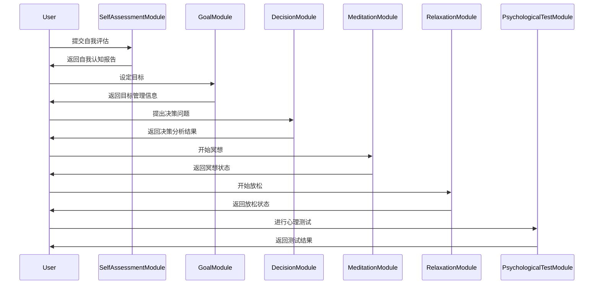
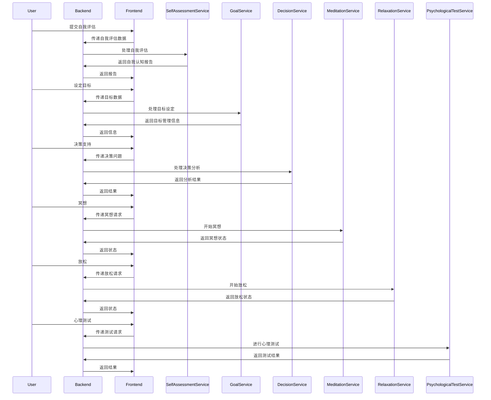

                 

### 第1章：问题的提出与重要性

**1.1 问题背景**

随着信息技术的迅猛发展和数字化社会的到来，人们的生活方式和思维方式都发生了深刻的变化。在这样一个快节奏、高度竞争的社会环境中，个人如何在纷繁复杂的世界中找到自己的人生方向和价值观，成为了越来越多人的困惑和追求。特别是在人工智能、大数据和物联网等前沿技术的推动下，人们面临着前所未有的机遇和挑战，传统的生存方式和思维方式显得愈发苍白和无力。因此，构建一套适合个人的生活哲学，成为了现代社会中不可或缺的一部分。

**1.2 问题描述**

在当前的社会背景下，人们普遍面临着以下几个问题：

- **方向迷失**：面对多样化的选择，人们容易迷失自我，不知道该如何做出最优的决策。
- **价值观冲突**：随着全球化的发展，不同的价值观相互碰撞，人们难以确定哪些是真正对自己有意义的价值观。
- **生活压力**：在高度竞争的社会环境中，人们往往为了追求物质上的成功而忽略了精神上的需求，导致身心压力巨大。
- **人际关系紧张**：随着社交网络的普及，人们虽然拥有了更多的社交机会，但面对面的真实沟通却越来越少，导致人际关系紧张。

**1.3 问题解决的关键**

为了解决上述问题，构建一套适合个人的生活哲学显得尤为重要。具体来说，关键在于以下几点：

- **自我认知**：了解自己的兴趣、优点和不足，明确自己的价值观和人生目标。
- **持续学习**：在快速变化的社会环境中，不断学习新知识，更新自己的认知体系。
- **情绪管理**：学会合理调节自己的情绪，保持心理健康。
- **有效沟通**：提高沟通技巧，建立良好的人际关系。

**1.4 边界与外延**

在构建个人生活哲学的过程中，需要注意以下几个边界和外部因素：

- **文化差异**：不同的文化背景会对个人的价值观和生活方式产生深远影响。
- **社会环境**：社会的政治、经济、文化环境会对个人的生活哲学产生影响。
- **科技发展**：科技的进步会不断改变人们的生产方式和生活方式，进而影响个人的生活哲学。

通过以上分析，我们可以看出，构建个人生活哲学不仅是解决现实问题的重要手段，也是实现个人成长和幸福的关键。接下来，我们将进一步探讨个人生活哲学的构建方法和核心要素。

---

**1.5 核心概念原理**

个人生活哲学的构建涉及多个核心概念，包括自我认知、价值观、目标设定、决策与选择等。以下是对这些核心概念的简要解释：

1. **自我认知**：自我认知是指个体对自己的认识和理解，包括自己的兴趣、性格、能力、价值观等方面。自我认知的深入有助于个体明确自己的优势和不足，从而更好地制定人生目标和规划。

2. **价值观**：价值观是指个体在长期生活实践中所形成的对事物的看法和评价标准，它影响着个体的行为和决策。一个清晰的价值观有助于个体在面对选择时做出明智的决定，并保持内心的平衡。

3. **目标设定**：目标设定是个人生活哲学中的重要环节，它包括短期目标和长期目标的设定。有效的目标设定有助于个体明确自己的发展方向，并为实现这些目标制定具体的行动计划。

4. **决策与选择**：决策与选择是个人生活中不可避免的一部分。在面对多种选择时，学会做出明智的决策至关重要。这需要个体具备良好的分析能力和情绪管理能力。

**1.6 概念属性特征对比表格**

为了更清晰地理解上述核心概念，我们可以通过对比表格来展示它们的属性特征：

| 核心概念 | 定义 | 关联属性 | 影响因素 | 目标 |
| :--: | :--: | :--: | :--: | :--: |
| 自我认知 | 对自己的认识和理解 | 性格、兴趣、能力 | 经验、环境、教育 | 明确人生方向 |
| 价值观 | 对事物的看法和评价标准 | 道德观、世界观、生活态度 | 文化、教育、经历 | 行为和决策的基础 |
| 目标设定 | 制定短期和长期目标 | 明确性、可行性、挑战性 | 自我认知、价值观、环境 | 指导行动和努力 |
| 决策与选择 | 在多种选择中做出决策 | 分析力、情绪管理、经验 | 信息、情境、风险 | 影响结果和成功 |

**1.7 ER实体关系图架构**

为了更好地理解个人生活哲学中核心概念之间的关系，我们可以使用ER（Entity-Relationship）实体关系图来展示：

```mermaid
erDiagram
  Class::Self_Cognition ||--|{ Value_Creation :Has
  Class::Value_Creation ||--|{ Decision_Making :Guides
  Class::Decision_Making ||--|{ Goal_Planning :Supports
  Class::Goal_Planning ||--|{ Personal_Growth :Enables
```

在这个ER图中，自我认知（Self_Cognition）是构建个人生活哲学的基础，它为价值观（Value_Creation）的形成提供了依据。价值观又指导着决策与选择（Decision_Making），而有效的决策与选择有助于实现目标设定（Goal_Planning）。最终，这些目标的实现促进了个人成长（Personal_Growth）。

通过上述分析和解释，我们可以看出，个人生活哲学的构建是一个多维度的过程，涉及到自我认知、价值观、目标设定和决策等多个方面。了解这些核心概念和它们之间的关系，有助于我们更好地构建自己的个人生活哲学，实现个人成长和幸福。接下来，我们将进一步探讨如何进行哲学思考和实践，为个人生活哲学的构建奠定坚实的基础。

---

### 1.8 个人生活哲学的构建方法

**1.8.1 自我认知的重要性**

自我认知是构建个人生活哲学的第一步，也是最为关键的一步。只有深入了解自己，才能明确自己的价值观、兴趣和目标。自我认知不仅可以帮助我们识别自己的优点和不足，还能让我们在面临选择时更加理智和自信。

**步骤 1：反思和自我评估**

首先，我们需要花时间反思自己的生活和经历。可以通过写日记、参加心理辅导或者与他人交流的方式来深入思考。在这个过程中，我们要诚实面对自己，不回避自己的弱点和错误。

**步骤 2：收集反馈**

除了自我反思，我们还需要收集来自他人的反馈。这包括家人、朋友、同事等对我们性格、能力和行为的评价。他们的观点可能会提供不同的视角，帮助我们更全面地认识自己。

**步骤 3：评估和总结**

在收集到足够的信息后，我们需要对这些信息进行评估和总结。这可以通过制作个人评估表格或者构建自我认知模型来实现。在这个过程中，我们要识别出自己最突出的特点，并思考这些特点对个人生活的影响。

**1.8.2 价值观的塑造与传承**

价值观是个人生活哲学的核心，它影响着我们的行为、决策和生活方式。塑造正确的价值观需要我们深入思考，同时也要从家庭、文化和社会中获取启示。

**步骤 1：识别核心价值观**

我们可以通过提问自己以下几个问题来识别核心价值观：

- 我最珍视什么？
- 我的人生意义是什么？
- 我希望留下什么样的遗产？

通过这些问题的思考，我们可以明确自己的核心价值观。

**步骤 2：传承与培养**

识别出核心价值观后，我们需要在实践中不断培养和传承。这可以通过以下几个方式来实现：

- **榜样学习**：寻找身边的榜样，观察他们是如何践行核心价值观的。
- **教育子女**：将核心价值观传递给下一代，让他们在成长过程中受到正确的引导。
- **社会责任**：通过参与社会公益活动，将核心价值观融入社会实践中。

**1.8.3 人生目标的设定**

人生目标是对未来的一种规划和期待，它是驱动个人行动和努力的重要动力。设定合理的人生目标需要结合自我认知和核心价值观。

**步骤 1：短期目标的设定**

短期目标通常是指一年内可以实现的目标。这些目标应具体、可衡量，并且与长期目标相一致。例如，如果长期目标是成为一名优秀的软件工程师，那么短期目标可以是完成相关的在线课程或者参加一次技术竞赛。

**步骤 2：长期目标的设定**

长期目标通常是指五年甚至更长时间内可以实现的目标。这些目标应具有挑战性，同时也要现实可行。例如，如果短期目标是成为一名项目经理，那么长期目标可以是晋升为技术总监。

**步骤 3：制定行动计划**

在设定了短期和长期目标后，我们需要制定具体的行动计划。这包括确定每个阶段的目标、分配时间和资源、监控进度等。通过详细的行动计划，我们可以更加有条不紊地朝着目标前进。

**1.8.4 决策与选择的方法**

在面对多种选择时，做出明智的决策至关重要。以下是一些决策与选择的方法：

**步骤 1：收集信息**

在做出决策之前，我们需要收集尽可能多的信息。这包括市场趋势、竞争对手、自身能力等。只有充分了解情况，我们才能做出更加明智的决策。

**步骤 2：分析利弊**

在收集到足够的信息后，我们需要分析每个选择的利弊。可以通过制作利弊分析表或者进行思维导图来帮助分析。

**步骤 3：考虑长远影响**

在做出决策时，我们不仅要考虑短期利益，还要考虑长期影响。一个明智的决策应该既能满足当前需求，又不会对未来造成负面影响。

**步骤 4：采取行动**

在经过充分分析和考虑后，我们需要果断采取行动。犹豫不决只会让我们错失机会，甚至导致决策失败。

**1.8.5 情绪管理的重要性**

情绪管理是个人生活哲学中不可或缺的一部分。情绪不稳定不仅会影响我们的决策，还会影响我们的工作和生活质量。

**步骤 1：认识情绪**

首先，我们需要认识到自己的情绪，并学会识别和表达它们。这可以通过日记记录、情绪日记或者情绪管理课程来实现。

**步骤 2：调节情绪**

在认识到情绪后，我们需要学会调节情绪。这可以通过运动、冥想、放松技巧等方式来实现。

**步骤 3：培养积极情绪**

积极情绪对我们的生活和工作都有积极的影响。我们可以通过培养乐观、感恩等积极情绪来提升生活质量。

通过以上步骤，我们可以逐步构建一套适合个人的生活哲学。这套哲学不仅可以帮助我们明确自己的方向和目标，还可以让我们在纷繁复杂的世界中保持内心的平静和坚定。接下来，我们将进一步探讨如何将哲学思考应用到日常生活中，实现个人成长和幸福。

---

### 第2章：哲学思考与实践

**2.1 哲学思考的重要性**

哲学思考是一种对人生、世界和自我的深刻反思，它有助于我们更好地理解自己和周围的世界。在现代社会，面对日新月异的变化和复杂的挑战，哲学思考显得尤为重要。通过哲学思考，我们能够挖掘出深层次的问题，找到问题的根源，从而做出更加明智的决策。

**2.2 个人哲学的构建方法**

构建个人哲学是一个复杂而深奥的过程，它不仅涉及到自我认知，还涉及到价值观、目标设定和生活方式等多个方面。以下是构建个人哲学的几个关键步骤：

**步骤 1：自我反思**

自我反思是哲学思考的基础。通过反思，我们能够深入挖掘自己的内心，了解自己的需求、欲望和价值观。我们可以通过写日记、冥想或与他人交流来进行自我反思。

**步骤 2：阅读哲学著作**

阅读哲学著作是获取哲学知识和思考方法的重要途径。通过阅读，我们能够了解到不同的哲学流派和思想家的观点，从而丰富自己的思考。

**步骤 3：实践哲学原则**

理论联系实际是哲学思考的关键。在实践中，我们可以通过践行哲学原则来检验和丰富自己的哲学体系。例如，我们可以尝试通过道德准则来指导自己的行为，通过哲学原则来处理生活中的问题。

**步骤 4：不断调整和更新**

哲学思考是一个持续的过程。随着时间和经验的积累，我们的认知和价值观可能会发生变化。因此，我们需要不断调整和更新自己的哲学体系，以适应新的环境和挑战。

**2.3 哲学思考与日常生活的联系**

哲学思考不仅仅是一种理论活动，它还可以广泛应用于日常生活中。以下是哲学思考在日常生活中的几个应用场景：

**1. 决策与选择**

在日常生活中，我们经常需要做出各种决策和选择。哲学思考可以帮助我们理清思路，分析利弊，从而做出更加明智的选择。

**案例**：在购买一辆新车时，我们可以通过哲学思考来分析不同品牌的优缺点，考虑预算、用途和未来保值率等因素，从而做出最优的选择。

**2. 应对挑战**

生活中不可避免地会遇到各种挑战和困难。哲学思考可以帮助我们理解问题的本质，找到解决问题的方法。

**案例**：在面对工作上的压力和挑战时，我们可以通过哲学思考来调整心态，找到应对压力的方法，从而更好地应对挑战。

**3. 人际关系**

人际关系是日常生活中不可或缺的一部分。哲学思考可以帮助我们理解他人的需求和感受，从而建立更好的人际关系。

**案例**：在与同事或朋友发生矛盾时，我们可以通过哲学思考来理解对方的立场，找到和解的方法，从而修复关系。

**4. 生活质量**

哲学思考可以帮助我们提高生活质量，享受生活。

**案例**：在休闲时间，我们可以通过哲学思考来思考生活的意义，寻找生活中的美好，从而提高生活质量。

通过哲学思考，我们不仅能够更好地理解自己和世界，还能够提升生活质量，实现个人成长和幸福。哲学思考是一种有力的工具，它可以帮助我们在复杂多变的社会环境中找到自己的方向，过上更加充实和有意义的生活。接下来，我们将进一步探讨人生目标与价值观的设定，为构建个人生活哲学奠定更加坚实的基础。

---

### 第3章：人生目标与价值观

**3.1 人生目标的重要性**

人生目标是对未来的一种规划和期待，它为我们的生活提供了方向和动力。一个明确的人生目标可以帮助我们集中精力，专注于实现目标的过程，从而提升生活质量。设定合理的人生目标不仅有助于我们更好地规划未来，还能激发我们的潜能，实现个人成长和幸福。

**3.2 如何设定人生目标**

设定人生目标是一个系统而科学的过程，以下是一些关键步骤：

**步骤 1：自我评估**

首先，我们需要对自己的兴趣、优点和不足进行评估。这可以通过写日记、参加心理测试或与他人交流来实现。自我评估有助于我们明确自己的优势和劣势，从而制定更加切合实际的目标。

**步骤 2：确定长期目标**

长期目标通常是指五年甚至更长时间内可以实现的目标。这些目标应具有挑战性，同时也要现实可行。例如，如果我们的长期目标是成为一名技术总监，那么我们可以设定一系列短期目标，如获得高级认证、提升领导能力等。

**步骤 3：分解长期目标**

将长期目标分解为一系列短期目标有助于我们更加具体和系统地实现目标。这些短期目标可以是年度目标、季度目标甚至月度目标。分解目标可以使我们更加专注于每一阶段的任务，从而逐步实现长期目标。

**步骤 4：制定行动计划**

在确定了长期和短期目标后，我们需要制定具体的行动计划。这包括确定每个阶段的目标、分配时间和资源、监控进度等。通过详细的行动计划，我们可以有条不紊地朝着目标前进。

**3.3 价值观的塑造与传承**

价值观是个人生活哲学的核心，它影响着我们的行为、决策和生活方式。塑造正确的价值观需要我们深入思考，同时也要从家庭、文化和社会中获取启示。

**步骤 1：识别核心价值观**

我们可以通过提问自己以下几个问题来识别核心价值观：

- 我最珍视什么？
- 我的人生意义是什么？
- 我希望留下什么样的遗产？

通过这些问题的思考，我们可以明确自己的核心价值观。

**步骤 2：传承与培养**

识别出核心价值观后，我们需要在实践中不断培养和传承。这可以通过以下几个方式来实现：

- **榜样学习**：寻找身边的榜样，观察他们是如何践行核心价值观的。
- **教育子女**：将核心价值观传递给下一代，让他们在成长过程中受到正确的引导。
- **社会责任**：通过参与社会公益活动，将核心价值观融入社会实践中。

**3.4 人生目标与价值观的融合**

人生目标和价值观是相互关联、相互影响的。一个明确的人生目标需要有清晰的价值观来支撑，而价值观也需要通过实现人生目标来得到体现和传承。以下是几个方法，帮助我们将人生目标和价值观融合在一起：

**方法 1：价值观指导目标设定**

在设定人生目标时，我们可以将核心价值观作为指导原则，确保目标与我们的价值观相一致。例如，如果我们核心价值观包括“诚实”、“公正”和“奉献”，那么我们在设定职业目标时可以优先考虑这些价值观。

**方法 2：目标实现中的价值观践行**

在实现人生目标的过程中，我们需要将核心价值观融入到具体行动中。例如，在工作中，我们可以通过诚实守信、公平竞争和乐于奉献来践行我们的价值观。

**方法 3：价值观传承与目标实现相结合**

在实现人生目标的同时，我们可以将核心价值观传递给下一代。例如，通过教育子女，我们可以将我们的价值观融入到他们的学习和生活中，帮助他们成长为有道德、有责任感的公民。

通过上述方法，我们可以将人生目标和价值观有效地融合在一起，实现个人成长和社会贡献。人生目标和价值观的设定和践行是一个持续的过程，我们需要不断地反思和调整，以适应不断变化的环境和需求。接下来，我们将进一步探讨如何在日常生活中应用和践行这些目标和价值观。

---

### 第4章：决策与选择

**4.1 决策的原理与实践**

决策是生活中不可避免的一部分，无论是在工作、学习还是生活中，我们都需要做出各种决策。有效的决策能力不仅能帮助我们解决问题，还能提高我们的生活质量和工作效率。

**4.1.1 决策模型**

决策模型是用于指导决策过程的一系列原则和方法。常见的决策模型包括理性决策模型、有限理性决策模型和渐进决策模型。

- **理性决策模型**：该模型假设决策者具备完全的信息和理性的思考能力。决策者通过收集和分析信息，权衡各种选择的利弊，最终做出最优决策。
- **有限理性决策模型**：由于信息的不完全性和时间的限制，决策者通常只能进行有限的理性思考。该模型强调在信息不完全的情况下，决策者应采取合理而非最优的决策。
- **渐进决策模型**：该模型认为决策是一个逐步调整和完善的过程。决策者首先做出初步决策，然后在实践中不断调整和优化，最终实现目标。

**4.1.2 决策过程**

一个完整的决策过程通常包括以下几个步骤：

1. **问题识别**：识别需要决策的问题或机会。
2. **信息收集**：收集与决策相关的信息，包括数据、事实和专家意见。
3. **方案生成**：基于收集到的信息，生成可能的决策方案。
4. **方案评估**：评估各个方案的优缺点，使用决策准则进行选择。
5. **决策实施**：选择最优方案并实施。
6. **结果评估**：对决策结果进行评估，以确定决策的有效性。

**4.2 如何做出明智的选择**

在做出明智的选择时，我们需要考虑以下几个因素：

**1. 信息分析**

收集到足够的信息后，我们需要对这些信息进行分析。可以通过建立决策矩阵、进行成本效益分析或者制作决策树来帮助分析。例如，如果我们要决定购买一辆新车，可以通过比较不同车型的价格、油耗、性能和品牌声誉来做出选择。

**2. 风险评估**

在决策过程中，我们需要评估每个选择的潜在风险。这包括财务风险、时间风险、社会风险等。通过识别和评估风险，我们可以更好地准备应对可能的不利情况。

**3. 情绪管理**

情绪在决策中起着重要作用。我们需要学会管理自己的情绪，避免因情绪波动而做出冲动的决策。可以通过冥想、放松技巧或者咨询专业人士来帮助调节情绪。

**4. 咨询他人**

在决策过程中，咨询他人的意见和经验可以帮助我们更全面地考虑问题。可以通过与家人、朋友、同事或者专业人士交流，获取不同的视角和建议。

**5. 持续学习**

决策是一个不断学习和改进的过程。通过不断反思和总结自己的决策经验，我们可以提高决策能力，变得更加明智和果断。

**4.3 风险与机遇的平衡**

在决策过程中，我们需要在风险与机遇之间寻找平衡。以下是一些策略，帮助我们在风险与机遇之间做出平衡：

**1. 降低风险**

- **风险评估**：在做出决策之前，对每个选择进行风险评估，识别潜在的风险。
- **分散投资**：将资源和精力分散到多个选择上，降低单一决策失败的风险。
- **保险措施**：采取必要的保险措施来减轻决策失败带来的损失。

**2. 寻找机遇**

- **市场趋势**：关注市场趋势和机会，抓住有利时机。
- **创新思维**：培养创新思维，寻找新的解决方案和机会。
- **灵活应对**：在决策过程中保持灵活性，根据实际情况及时调整策略。

通过上述方法，我们可以在风险与机遇之间找到平衡，做出更加明智和有效的决策。有效的决策能力不仅能够帮助我们应对日常生活中的挑战，还能为我们的个人成长和职业发展提供强大的支持。接下来，我们将进一步探讨如何通过个人成长与发展来实现更高的生活质量。

---

### 第5章：个人成长与发展

**5.1 个人成长的路径**

个人成长是一个持续的过程，它不仅涉及到知识和技能的提升，还包括自我认知、情绪管理和人际关系等方面的进步。以下是个人成长的一些关键路径：

**1. 终身学习**

在快速变化的社会环境中，终身学习变得尤为重要。通过不断学习新知识和技能，我们可以保持竞争力，适应新的挑战。终身学习可以通过参加培训课程、阅读专业书籍、在线学习平台等方式来实现。

**2. 自我反思**

自我反思是个人成长的重要途径。通过定期反思自己的行为和决策，我们可以识别自己的优点和不足，从而有针对性地进行改进。自我反思可以通过写日记、进行心理辅导或者与他人交流来实现。

**3. 职业规划**

明确的职业规划可以帮助我们更好地实现个人成长。职业规划包括设定短期和长期目标、了解市场需求和提升自身竞争力等。通过职业规划，我们可以有目的地提升自己的能力和价值。

**4. 人际关系**

良好的人际关系对个人成长至关重要。通过建立和维护良好的人际关系，我们可以获得更多的支持、资源和机会。人际关系可以通过主动沟通、参与社交活动和参加团体活动等方式来培养。

**5. 情绪管理**

情绪管理是个人成长的重要组成部分。通过学会调节情绪，我们可以更好地应对生活中的挑战和压力，保持心理健康。情绪管理可以通过冥想、放松技巧或者咨询专业人士来实现。

**5.2 如何发展自己的才能**

发展自己的才能是实现个人成长的重要一步。以下是一些方法，帮助我们发现和培养自己的才能：

**1. 识别兴趣和优势**

首先，我们需要识别自己的兴趣和优势。这可以通过自我评估、参加职业性格测试或者咨询专业人士来实现。了解自己的兴趣和优势可以帮助我们找到适合自己的发展方向。

**2. 设定具体目标**

在识别兴趣和优势后，我们需要设定具体的目标。这些目标应该是具体、可衡量和有挑战性的。例如，如果我们的兴趣是编程，我们可以设定目标，如学习一门新的编程语言或者完成一个项目。

**3. 接受培训和辅导**

为了发展自己的才能，我们可以参加相关的培训和辅导课程。这些课程可以帮助我们系统地学习知识和技能，提升我们的专业能力。培训课程可以在线学习平台、大学和专业培训机构提供。

**4. 实践和反馈**

实践是发展才能的关键。通过实际操作和项目经验，我们可以将理论知识转化为实际能力。同时，通过接受反馈和评估，我们可以不断改进和提升自己的表现。

**5. 持续学习和探索**

发展自己的才能是一个持续的过程。我们需要保持学习的热情，不断探索新的领域和知识。通过阅读专业书籍、参加行业会议和研讨会，我们可以不断更新自己的知识和技能。

**5.3 职业规划与人生目标**

职业规划是实现人生目标的重要途径。以下是一些方法，帮助我们将职业规划与人生目标相结合：

**1. 确定长期目标**

首先，我们需要确定自己的长期目标。这些目标应该与我们的价值观和兴趣相一致。例如，如果我们的价值观包括“创新”和“帮助他人”，我们可以设定目标，如成为一名技术创新者或者社会企业家。

**2. 分解长期目标**

将长期目标分解为一系列短期目标，可以帮助我们更加具体和系统地实现目标。这些短期目标可以是年度目标、季度目标甚至月度目标。通过分解目标，我们可以更加专注于每一阶段的任务。

**3. 制定行动计划**

在确定了长期和短期目标后，我们需要制定具体的行动计划。这包括确定每个阶段的目标、分配时间和资源、监控进度等。通过详细的行动计划，我们可以有条不紊地朝着目标前进。

**4. 不断调整和更新**

职业规划是一个动态的过程。随着时间和经验的积累，我们的目标和计划可能会发生变化。因此，我们需要不断调整和更新自己的职业规划，以适应新的环境和挑战。

通过以上方法，我们可以将职业规划与人生目标有效地结合起来，实现个人成长和幸福。职业规划不仅有助于我们实现职业成功，还能为我们的个人生活和家庭生活提供支持。接下来，我们将进一步探讨如何在实践中应用这些方法和原则，实现个人成长和职业发展。

---

### 第6章：人际关系与沟通

**6.1 人际关系的重要性**

人际关系是个人成长和社会发展的重要基石。良好的人际关系不仅有助于我们在工作和生活中获得支持和资源，还能提升我们的幸福感和满足感。在现代社会，随着人际交往的复杂性和多样性增加，人际关系的重要性愈发凸显。

**6.2 如何建立良好的人际关系**

建立良好的人际关系需要时间和努力，以下是一些有效的方法：

**1. 积极沟通**

沟通是建立良好人际关系的关键。积极沟通包括倾听他人、表达自己的观点和情感，以及清晰、准确地传达信息。通过有效的沟通，我们可以增进相互了解，减少误解和冲突。

**案例**：在一个团队项目中，通过积极的沟通，成员可以分享各自的见解和经验，从而提高项目的执行效率和质量。

**2. 展现真诚**

真诚是建立信任的基础。在人际交往中，我们应该真诚对待他人，不做作、不虚伪。通过真诚的交流，我们可以赢得他人的尊重和信任。

**案例**：在商务谈判中，展现真诚可以帮助我们与对方建立互信，从而达成合作。

**3. 尊重差异**

每个人都有自己的观点、习惯和生活方式。尊重差异意味着接纳他人的不同，并尝试理解他们的立场。通过尊重差异，我们可以建立更加包容和和谐的人际关系。

**案例**：在多元文化的团队中，尊重差异可以帮助团队成员更好地合作，提高团队的整体绩效。

**4. 建立共同目标**

共同目标是维系人际关系的重要纽带。通过设定共同的目标，我们可以与对方建立起共同的利益和责任，从而增强关系。

**案例**：在友谊中，共同的目标如一起旅行、参加某个兴趣小组等，可以加深彼此的联系。

**6.3 沟通的艺术与技巧**

有效的沟通是建立和维护良好人际关系的关键。以下是一些沟通的艺术与技巧：

**1. 倾听**

倾听是沟通的重要部分。通过倾听，我们可以更好地理解他人的需求和感受。有效的倾听包括给予对方足够的注意、避免打断和积极回应。

**技巧**：在倾听时，我们可以通过点头、眼神接触和适当的肢体语言来表示关注。

**2. 表达清晰**

表达清晰是指用简单、明确的语言来表达自己的观点和感受。通过清晰的表达，我们可以避免误解和沟通障碍。

**技巧**：在表达时，可以使用具体的例子和情境来支持我们的观点，使对方更容易理解。

**3. 非语言沟通**

非语言沟通包括肢体语言、面部表情和声音等。这些非语言元素在沟通中起着重要作用，可以补充和强化语言表达。

**技巧**：通过适度的微笑、开放的身体姿势和柔和的声音，我们可以传达友善和尊重。

**4. 管理情绪**

在沟通中，情绪管理至关重要。情绪失控可能导致沟通失败或关系破裂。通过情绪管理，我们可以保持冷静和理性，避免因情绪波动而做出不当行为。

**技巧**：可以通过深呼吸、冥想或心理疏导来管理情绪。

通过以上方法，我们可以建立和维护良好的人际关系，提升沟通效果。有效的人际关系和沟通不仅有助于我们在工作和生活中取得成功，还能为我们的个人成长和幸福奠定坚实的基础。接下来，我们将进一步探讨身心健康与生活品质的重要性。

---

### 第7章：身心健康与生活品质

**7.1 身心健康的重要性**

身心健康是个人幸福和生活质量的基础。在现代社会，随着工作压力和生活节奏的加快，身心健康问题越来越受到人们的关注。保持身心健康不仅有助于提高工作效率和生活质量，还能增强我们的幸福感。

**7.2 如何保持身心健康**

为了保持身心健康，我们需要采取一系列积极的生活方式和习惯。以下是一些有效的方法：

**1. 合理饮食**

饮食是保持健康的基础。一个均衡的饮食应包括丰富的蔬菜、水果、全谷物、蛋白质和健康脂肪。此外，适量饮水和限制糖分和加工食品的摄入也是非常重要的。

**2. 适量运动**

适量的运动有助于保持身体健康和心理平衡。每周进行至少150分钟的中等强度运动，如快走、游泳或骑自行车，可以有效降低患心脏病、高血压和糖尿病的风险。

**3. 充足睡眠**

充足的睡眠对于身心健康至关重要。成年人通常需要每晚7到9小时的睡眠。良好的睡眠有助于恢复精力、提高记忆力和增强免疫系统。

**4. 心理调适**

心理调适包括应对压力、情绪管理和心理健康的维护。可以通过冥想、瑜伽、心理咨询或社交活动来减轻压力，保持心理健康。

**5. 定期体检**

定期体检可以帮助我们及时发现并处理健康问题。通过体检，我们可以了解自己的健康状况，预防潜在的健康风险。

**7.3 提升生活品质的方法**

提升生活品质不仅关乎身心健康，还包括生活环境、社交关系和自我实现等多个方面。以下是一些方法，帮助提升生活品质：

**1. 环境优化**

优化生活环境是提升生活品质的重要一步。一个整洁、舒适和富有创造性的环境可以提升我们的幸福感和满意度。

**2. 社交互动**

积极的社交互动有助于提升生活品质。与家人、朋友和同事保持良好的关系，参与社区活动，可以增强我们的社交网络和支持系统。

**3. 自我实现**

自我实现是通过追求个人目标和兴趣来提升生活品质。通过设定和实现个人目标，我们可以实现自我价值，获得成就感和满足感。

**4. 学习与发展**

持续学习和发展有助于提升生活品质。通过不断学习新知识和技能，我们可以保持竞争力，实现个人成长和职业发展。

**5. 精神修养**

精神修养包括培养乐观的生活态度、感恩的心态和积极的生活习惯。通过精神修养，我们可以提升心理素质，增强抗压能力，提高生活质量。

通过以上方法，我们可以有效地保持身心健康，提升生活品质。一个健康、幸福的生活不仅有助于我们的身心健康，还能为我们的个人成长和社会贡献提供坚实的支持。接下来，我们将进一步探讨如何通过社会贡献实现个人价值。

---

### 第8章：社会贡献与个人价值

**8.1 社会贡献的意义**

社会贡献是个人价值实现的重要组成部分，它不仅有助于提升个人的自我价值感，还能促进社会的和谐与进步。通过社会贡献，我们可以将自己的才能和资源用于解决社会问题，从而实现个人与社会的共赢。

**8.2 如何为社会做出贡献**

以下是一些方法，帮助我们在日常生活中为社会做出贡献：

**1. 志愿服务**

志愿服务是直接为社会做出贡献的有效方式。可以通过参与社区服务、慈善活动或者环保项目来贡献自己的时间和力量。

**2. 慈善捐赠**

慈善捐赠可以通过金钱、物资或者时间来帮助那些需要帮助的人。选择一个有公信力的慈善机构，根据自己的能力和资源进行捐赠。

**3. 教育援助**

教育是改变命运的重要途径。可以通过资助贫困学生、参与教育项目或者成为志愿者教师，帮助更多的孩子接受教育。

**4. 创新与创业**

通过创新和创业，我们可以为社会带来新的价值和机会。研发新产品、提供新的服务或者创建社会企业，都可以为社会做出积极贡献。

**5. 社会倡导**

社会倡导是通过宣传和推动社会公正、环保和人权等议题，提高公众意识，推动社会变革。可以通过发起倡议、参与公共讨论或者支持相关政策来实现。

**8.3 个人价值的实现**

个人价值的实现是个人成长和社会贡献的重要目标。以下是一些方法，帮助实现个人价值：

**1. 自我认知**

通过自我认知，明确自己的兴趣、优点和不足，找到最适合自己的发展方向。自我认知是个人价值实现的基础。

**2. 终身学习**

持续学习是提升个人价值和竞争力的关键。通过不断学习新知识和技能，我们可以适应社会变化，实现自我价值。

**3. 职业发展**

通过职业发展，实现个人价值和贡献。设定职业目标，不断提升专业技能和领导能力，为社会做出更大的贡献。

**4. 社会互动**

积极参与社会活动，建立广泛的人际关系。通过社会互动，我们可以获得更多的资源和机会，实现个人价值。

**5. 跨界合作**

通过跨界合作，我们可以整合不同的资源和能力，实现更大的价值。跨界合作不仅有助于个人成长，还能推动社会创新和进步。

通过社会贡献和个人价值的实现，我们不仅能够提升自己的生活质量，还能为社会的和谐与进步做出贡献。个人价值实现的过程是一个不断学习和成长的过程，它需要我们在自我认知、终身学习、职业发展和社会互动等方面持续努力。接下来，我们将进一步总结与反思，以期为未来的发展提供指导。

---

### 第9章：总结与反思

**9.1 成功案例分析**

通过前面的讨论，我们可以看到，成功的人生哲学不仅仅是理论上的构想，更是在实践中不断验证和优化的过程。以下是一些成功的案例分析：

- **案例一：马云**：作为阿里巴巴的创始人，马云以其独特的商业智慧和价值观，成功推动了电子商务的发展。他的成功不仅在于他敏锐的市场洞察力，还在于他对团队和客户的真诚关心，以及对社会责任的担当。

- **案例二：J.K.罗琳**：J.K.罗琳是《哈利·波特》系列小说的作者，她的成功不仅在于她丰富的想象力和写作才华，更在于她坚持不懈的努力和对自己作品的热爱。她的故事不仅赢得了全球读者的喜爱，还激发了无数年轻人的梦想。

- **案例三：比尔·盖茨**：比尔·盖茨是微软的创始人，他的成功不仅在于他对技术的深刻理解和商业模式的创新，更在于他通过慈善基金会，积极投身于全球健康和教育事业，为社会的进步做出了巨大贡献。

**9.2 经验与教训**

通过这些成功案例，我们可以总结出以下经验和教训：

1. **自我认知的重要性**：了解自己的兴趣、优点和不足，是成功的基础。马云、J.K.罗琳和比尔·盖茨的成功都离不开他们对自身优势的深刻理解。

2. **终身学习的重要性**：持续学习不仅能够提升个人的竞争力，还能帮助个人适应快速变化的社会环境。马云和J.K.罗琳都通过不断学习，保持了对市场的敏锐洞察和创作灵感。

3. **价值观的指导作用**：清晰的价值观不仅能够帮助个人做出明智的决策，还能为个人行为提供指导。比尔·盖茨通过其价值观，不仅创造了商业上的成功，还通过慈善事业实现了个人价值的最大化。

4. **社会实践的重要性**：通过实际行动，将个人价值观付诸实践，是实现个人价值和社会贡献的关键。马云和比尔·盖茨都通过实际行动，为社会做出了积极的贡献。

**9.3 反思与持续改进**

在构建个人生活哲学的过程中，反思和持续改进是不可或缺的。以下是一些反思和持续改进的建议：

1. **定期反思**：定期反思自己的行为、决策和生活状态，可以帮助我们识别问题和不足，及时进行调整。

2. **持续学习**：不断学习新知识和技能，不仅可以提升个人能力，还能为个人生活哲学的持续改进提供动力。

3. **实践与反思相结合**：将生活哲学付诸实践，并通过反思来检验和实践效果，是持续改进的关键。

4. **寻求反馈**：从家人、朋友和同事那里获取反馈，可以帮助我们更客观地认识自己，找到改进的方向。

通过反思与持续改进，我们可以不断完善自己的个人生活哲学，实现个人成长和社会贡献。接下来，我们将展望未来的生活哲学发展趋势，为个人生活哲学的持续发展提供指导。

---

### 第10章：未来展望

**10.1 个人哲学的发展趋势**

随着科技的进步和社会的发展，个人哲学也在不断演变。以下是一些未来个人哲学发展的趋势：

**1. 科技赋能**

未来，人工智能、大数据和虚拟现实等科技将更加深入地融入我们的生活，为我们提供更加智能和个性化的生活指导。例如，通过AI技术，我们可以更准确地了解自己的情绪和行为模式，从而更好地调节和提升生活质量。

**2. 生态和谐**

随着全球环境问题的加剧，越来越多的人开始关注生态和谐与可持续发展。未来，个人哲学将更加注重生态保护与资源利用的平衡，鼓励人们在追求个人价值的同时，也要关注社会和环境的福祉。

**3. 跨界融合**

随着全球化和信息化的发展，个人哲学将越来越呈现出跨界融合的特点。人们将更加注重跨领域的学习和合作，通过整合不同的知识和技能，实现个人价值的最大化。

**4. 精神追求**

在物质生活得到极大满足的同时，未来人们将更加关注精神追求。通过冥想、瑜伽和心灵成长等方式，人们将追求内心的平静和精神的富足。

**10.2 未来的生活哲学挑战**

尽管未来生活哲学有着美好的发展趋势，但也面临着一些挑战：

**1. 信息过载**

随着信息技术的飞速发展，人们面临的信息量越来越大。如何有效地筛选和处理信息，避免信息过载，将成为一个重要的挑战。

**2. 科技依赖**

科技的发展带来了便利，但同时也增加了人们对科技的依赖。如何保持科技与人的平衡，避免科技取代人类的情感和创造力，是一个重要的议题。

**3. 社会变革**

全球化和信息化带来了社会的快速变革，人们需要适应新的社会环境，同时也需要应对随之而来的社会问题，如就业、教育、医疗等。

**4. 心理健康**

在快节奏和高压的社会环境中，心理健康问题日益突出。未来，如何通过个人哲学来提升心理健康水平，将成为一个重要的挑战。

**10.3 对未来社会的思考**

面对未来社会的挑战，个人哲学将发挥重要的作用。以下是对未来社会的几点思考：

**1. 个体与集体**

在未来社会中，个体与集体的关系将变得更加复杂和紧密。个人哲学将帮助人们找到个体与集体之间的平衡点，实现个人价值与社会福祉的共赢。

**2. 知识与创新**

知识与创新将是未来社会的重要动力。个人哲学将鼓励人们不断学习新知识，培养创新思维，以适应快速变化的社会环境。

**3. 心灵成长**

心灵成长将是未来社会的重要组成部分。通过个人哲学，人们将更加注重内心的平静和精神的富足，追求更高的生活品质。

**4. 社会责任**

未来社会将更加重视社会责任。个人哲学将引导人们关注社会问题，积极参与社会公益活动，为社会的和谐与进步做出贡献。

通过以上展望，我们可以看到，未来生活哲学的发展不仅关乎个人的成长与幸福，更关乎社会的进步与和谐。个人哲学将在未来社会中发挥更加重要的作用，帮助我们更好地应对挑战，实现个人价值和社会贡献。让我们怀揣梦想，勇敢面对未来，用个人哲学指导我们的生活，共创美好未来。

---

### 附录：最佳实践 tips

**1. 定期自我反思**

定期花时间反思自己的生活和工作，有助于发现问题和不足，及时进行调整。建议每月至少进行一次深入的自我反思，记录下来，并制定改进计划。

**2. 设定具体可行的目标**

在设定目标时，确保目标是具体、可衡量和有挑战性的。可以使用SMART（具体、可衡量、可实现、相关、有时间限制）原则来设定目标，如“在未来六个月内，阅读两本关于人工智能的书籍”。

**3. 保持学习习惯**

持续学习是个人成长的关键。可以通过参加在线课程、阅读专业书籍、参加工作坊等方式来保持学习习惯。建议每周至少安排两小时的学习时间。

**4. 建立健康的生活习惯**

健康的生活习惯对身心健康至关重要。建议每天进行适量运动，保持良好的饮食习惯，确保充足的睡眠。可以尝试使用健身应用或饮食记录工具来跟踪自己的健康状态。

**5. 培养积极的人际关系**

积极的人际关系对个人成长和社会支持至关重要。建议定期与家人、朋友和同事进行沟通，分享生活和工作中的经验和感受，寻求反馈和支持。

**6. 保持情绪稳定**

情绪管理是个人幸福的重要保障。建议通过冥想、瑜伽、深呼吸等方式来调节情绪，避免情绪波动影响工作和生活。

**7. 积极参与社会活动**

参与社会活动不仅有助于个人成长，还能增强社会责任感。建议定期参与志愿活动、慈善捐赠或社区服务，为社会做出贡献。

---

### 小结

通过本文的详细探讨，我们从多个角度阐述了制定人生指导原则的重要性。我们分析了个人生活哲学的构成要素，包括自我认知、价值观、目标设定、决策与选择、个人成长、身心健康、人际关系、社会贡献等。同时，我们也讨论了如何在日常生活中应用这些原则，以及如何通过持续反思和改进来不断完善个人的生活哲学。

总结来说，制定个人生活哲学不仅有助于我们明确自己的方向和目标，还能提升我们的生活质量和社会贡献。在未来的日子里，让我们怀揣梦想，勇敢面对挑战，用个人生活哲学指导我们的生活，不断追求个人成长和社会进步。

---

### 注意事项

在构建个人生活哲学的过程中，以下事项需要特别注意：

1. **避免盲目跟风**：每个人的生活背景和价值观都不同，因此不能盲目跟从他人的生活方式或价值观。应该基于自己的实际情况和需求来制定个人生活哲学。

2. **持续反思与调整**：个人生活哲学是一个动态的过程，需要不断地反思和调整。随着时间和环境的变化，我们的目标和价值观可能会发生变化，因此需要定期回顾和调整。

3. **平衡个人与社交需求**：在追求个人成长的过程中，不应忽视与家人、朋友和同事的互动。平衡个人时间和社交时间，保持良好的人际关系，对个人成长同样重要。

4. **避免过度自我反思**：虽然自我反思有助于个人成长，但过度反思可能导致焦虑和拖延。因此，在反思时要注意适度，避免陷入过度自我批评的困境。

5. **保持开放心态**：在构建个人生活哲学时，应保持开放的心态，接受不同的观点和意见。通过学习他人的经验和教训，我们可以更好地完善自己的生活哲学。

---

### 拓展阅读

为了进一步深化对个人生活哲学的理解，以下是几本推荐阅读的书籍：

1. **《活出生命的意义》（《Man's Search for Meaning》）- 维克多·弗兰克尔**：这本书讲述了作者在纳粹集中营中的经历，以及他如何通过找到生命的意义来克服苦难。它提供了深刻的哲学思考，帮助读者理解如何在生活中找到意义。

2. **《高效能人士的七个习惯》（《The 7 Habits of Highly Effective People》）- 史蒂芬·柯维**：这本书提供了一套实用的生活和工作原则，帮助读者建立高效的生活习惯，实现个人和职业成功。

3. **《原则》（《Principles》）- 雷·达里奥**：这本书是亿万富翁投资者雷·达里奥的个人生活和工作原则，它提供了关于如何制定决策、管理时间和实现目标的深刻见解。

4. **《哲学的慰藉》（《The Consolations of Philosophy》）- 阿兰·德波顿**：这本书以简洁而深刻的语言探讨了哲学如何帮助我们在生活中应对挫折和困难，提供了许多实用的哲学建议。

通过阅读这些书籍，我们可以进一步理解和应用个人生活哲学的原则，为自己的生活注入更多的智慧和意义。

---

### 项目实战

**项目名称**：个人生活哲学管理系统

**项目背景**：

随着社会的发展和个人的成长，越来越多的人意识到制定和实施个人生活哲学的重要性。为了帮助用户更好地理解和实践个人生活哲学，我们开发了一套名为“个人生活哲学管理系统”的项目。该系统旨在为用户提供一个全面的平台，用于自我认知、目标设定、决策支持和心理调适等方面。

**项目介绍**：

个人生活哲学管理系统包括以下几个主要模块：

1. **自我认知模块**：帮助用户深入了解自己的兴趣、优点和不足，提供自我评估和反馈功能。
2. **目标设定模块**：指导用户设定短期和长期目标，并提供目标追踪和提醒功能。
3. **决策支持模块**：提供决策分析工具和策略，帮助用户在面对选择时做出明智的决定。
4. **心理调适模块**：通过冥想、放松技巧和情绪管理方法，帮助用户保持心理健康。

**系统功能设计**：

1. **自我认知模块**：
   - **功能**：用户可以通过填写问卷和进行心理测试，获得自我认知报告。
   - **领域模型**：
     ```mermaid
     classDiagram
         User <<类>> {
             姓名 String
             年龄 int
             兴趣 Set<String>
             优点 Set<String>
             不足 Set<String>
         }
         SelfAssessment <<类>> {
             用户ID int
             自我评价 String
             反馈 String
         }
     ```
   - **接口设计**：
     ```python
     class SelfAssessmentService:
         def assess_user(self, user: User) -> SelfAssessment:
             # 实现自我评估逻辑
     ```

2. **目标设定模块**：
   - **功能**：用户可以设定短期和长期目标，系统提供目标管理功能。
   - **领域模型**：
     ```mermaid
     classDiagram
         Goal <<类>> {
             目标ID int
             用户ID int
             目标描述 String
             目标类型 String
             目标状态 String
             设定时间 DateTime
             完成时间 DateTime
         }
     ```
   - **接口设计**：
     ```python
     class GoalService:
         def create_goal(self, user: User, goal: Goal) -> Goal:
             # 实现创建目标逻辑
         def update_goal(self, user: User, goal: Goal) -> Goal:
             # 实现更新目标状态逻辑
     ```

3. **决策支持模块**：
   - **功能**：用户可以通过系统提供的决策分析工具，对多个选择进行评估和比较。
   - **领域模型**：
     ```mermaid
     classDiagram
         Decision <<类>> {
             决策ID int
             用户ID int
             选择A String
             选择B String
             选择C String
             结果 String
             评价 String
         }
     ```
   - **接口设计**：
     ```python
     class DecisionService:
         def analyze_decision(self, user: User, decision: Decision) -> Decision:
             # 实现决策分析逻辑
     ```

4. **心理调适模块**：
   - **功能**：提供冥想、放松技巧和心理测试，帮助用户管理情绪和保持心理健康。
   - **领域模型**：
     ```mermaid
     classDiagram
         Meditation <<类>> {
             冥想ID int
             用户ID int
             类型 String
             时长 int
             状态 String
         }
         Relaxation <<类>> {
             放松ID int
             用户ID int
             技巧 String
             时长 int
             状态 String
         }
         PsychologicalTest <<类>> {
             测试ID int
             用户ID int
             类型 String
             结果 String
         }
     ```
   - **接口设计**：
     ```python
     class MeditationService:
         def start_meditation(self, user: User, meditation: Meditation) -> Meditation:
             # 实现开始冥想逻辑
     class RelaxationService:
         def start_relaxation(self, user: User, relaxation: Relaxation) -> Relaxation:
             # 实现开始放松逻辑
     class PsychologicalTestService:
         def take_test(self, user: User, psychological_test: PsychologicalTest) -> PsychologicalTest:
             # 实现心理测试逻辑
     ```

**系统架构设计**：

个人生活哲学管理系统采用模块化设计，确保系统的可扩展性和可维护性。以下是系统的整体架构设计：



**系统接口设计和系统交互**：

以下是系统的接口设计和交互流程：



**环境安装**：

为了搭建个人生活哲学管理系统，我们需要安装以下环境：

1. Python 3.8 或更高版本
2. PostgreSQL 12 或更高版本
3. Django 3.2 或更高版本
4. Django REST framework 3.12 或更高版本

安装步骤：

1. 安装Python：
   ```shell
   sudo apt update
   sudo apt install python3 python3-pip
   ```
2. 创建虚拟环境：
   ```shell
   python3 -m venv venv
   source venv/bin/activate
   ```
3. 安装依赖项：
   ```shell
   pip install django psycopg2-binary django-rest-framework
   ```
4. 配置数据库：
   - 创建数据库：
     ```sql
     CREATE DATABASE personal_life_philosophy;
     ```
   - 创建数据库用户并赋予权限：
     ```sql
     CREATE USER myuser WITH PASSWORD 'mypassword';
     GRANT ALL PRIVILEGES ON DATABASE personal_life_philosophy TO myuser;
     ```
5. 运行项目：
   ```shell
   pip install gunicorn
   gunicorn personal_life_philosophy.wsgi:application --bind 0.0.0.0:8000
   ```

**系统核心实现源代码**：

以下是系统核心实现部分的源代码示例：

```python
# models.py
from django.db import models
from django.contrib.auth.models import User

class SelfAssessment(models.Model):
    user = models.OneToOneField(User, on_delete=models.CASCADE)
    self_evaluation = models.TextField()
    feedback = models.TextField()

class Goal(models.Model):
    user = models.ForeignKey(User, on_delete=models.CASCADE)
    goal_description = models.TextField()
    goal_type = models.CharField(max_length=50)
    goal_state = models.CharField(max_length=50)
    set_time = models.DateTimeField()
    complete_time = models.DateTimeField(null=True, blank=True)

class Decision(models.Model):
    user = models.ForeignKey(User, on_delete=models.CASCADE)
    choice_a = models.CharField(max_length=100)
    choice_b = models.CharField(max_length=100)
    choice_c = models.CharField(max_length=100)
    result = models.CharField(max_length=100)
    evaluation = models.TextField()

class Meditation(models.Model):
    user = models.ForeignKey(User, on_delete=models.CASCADE)
    type = models.CharField(max_length=50)
    duration = models.IntegerField()
    state = models.CharField(max_length=50)

class Relaxation(models.Model):
    user = models.ForeignKey(User, on_delete=models.CASCADE)
    technique = models.CharField(max_length=100)
    duration = models.IntegerField()
    state = models.CharField(max_length=50)

class PsychologicalTest(models.Model):
    user = models.ForeignKey(User, on_delete=models.CASCADE)
    type = models.CharField(max_length=50)
    result = models.CharField(max_length=100)
```

**代码应用解读与分析**：

上述代码定义了个人生活哲学管理系统中的核心模型，包括自我评估、目标设定、决策支持、冥想、放松和心理测试等模块。以下是代码的主要组成部分和应用解读：

1. **SelfAssessment 模型**：
   - **字段**：`user`、`self_evaluation`、`feedback`。
   - **解读**：该模型用于存储用户的自我评估信息，包括用户的自我评价和反馈。

2. **Goal 模型**：
   - **字段**：`user`、`goal_description`、`goal_type`、`goal_state`、`set_time`、`complete_time`。
   - **解读**：该模型用于存储用户设定的目标信息，包括目标的描述、类型、状态以及设定和完成时间。

3. **Decision 模型**：
   - **字段**：`user`、`choice_a`、`choice_b`、`choice_c`、`result`、`evaluation`。
   - **解读**：该模型用于存储用户所做的决策信息，包括选择的选项、决策结果和评价。

4. **Meditation 模型**：
   - **字段**：`user`、`type`、`duration`、`state`。
   - **解读**：该模型用于存储用户进行的冥想信息，包括冥想类型、持续时间以及状态。

5. **Relaxation 模型**：
   - **字段**：`user`、`technique`、`duration`、`state`。
   - **解读**：该模型用于存储用户进行的放松信息，包括放松技巧、持续时间以及状态。

6. **PsychologicalTest 模型**：
   - **字段**：`user`、`type`、`result`。
   - **解读**：该模型用于存储用户进行心理测试的信息，包括测试类型和结果。

通过这些模型，个人生活哲学管理系统可以有效地管理用户的个人数据和相关信息，为用户提供全面的服务和支持。

**实际案例分析和详细讲解剖析**：

以下是一个实际案例的分析和讲解，以展示如何使用个人生活哲学管理系统来帮助用户实现个人目标和心理健康。

**案例背景**：

小明是一名软件工程师，他感到在工作中压力很大，想要通过个人生活哲学管理系统来改善自己的心理健康和工作效率。

**案例分析**：

1. **自我认知**：
   - 小明通过自我评估模块填写了自我评估问卷，得出了自己的兴趣（如编程、音乐）和不足（如时间管理、情绪控制）。
   - 小明得到了一份详细的自我认知报告，帮助他认识到自己需要改进的方面。

2. **目标设定**：
   - 小明设定了短期目标，如每天学习1小时编程，并设定了长期目标，如在未来6个月内完成一个个人项目。
   - 系统提供了目标管理功能，帮助小明跟踪进度，并在目标达成时给予提醒。

3. **决策支持**：
   - 小明在工作中遇到一个需要决策的问题，他使用决策支持模块分析不同的选项，最终选择了最合适的解决方案。
   - 决策支持模块提供了详细的决策分析报告，帮助小明做出明智的决策。

4. **心理调适**：
   - 小明通过冥想模块每天进行冥想，缓解工作压力。
   - 系统记录了小明的冥想状态和时间，帮助他养成良好的心理调适习惯。

5. **心理健康测试**：
   - 小明定期进行心理健康测试，了解自己的心理健康状况。
   - 测试结果帮助小明识别潜在的心理问题，并及时采取措施进行干预。

**详细讲解剖析**：

1. **自我认知**：
   - **算法原理**：自我认知模块基于用户填写的信息和反馈，使用数据分析技术生成自我认知报告。
   - **数学模型**：通过统计分析用户提交的信息，计算用户的兴趣得分和不足得分，生成综合评估报告。
   - **举例说明**：小明填写了编程兴趣得分为80，时间管理不足得分为50，系统根据这些数据生成了一份详细的自我认知报告。

2. **目标设定**：
   - **算法原理**：目标设定模块基于用户的短期和长期目标，使用目标管理算法来帮助用户跟踪进度。
   - **数学模型**：通过设定目标的时间节点和完成条件，计算用户目标达成率。
   - **举例说明**：小明设定的短期目标是在30天内学习完Python编程，系统会根据他的学习进度和测试结果，计算目标达成率，并在目标达成时提醒他。

3. **决策支持**：
   - **算法原理**：决策支持模块使用决策分析算法，帮助用户评估不同选择的优缺点。
   - **数学模型**：通过建立决策树或决策矩阵，分析每个选择的收益和风险。
   - **举例说明**：小明在面临一个工作项目选择时，通过决策支持模块分析了不同项目的成本和收益，最终选择了成本较低、收益较高的项目。

4. **心理调适**：
   - **算法原理**：冥想和放松模块使用心理调适算法，帮助用户管理情绪和压力。
   - **数学模型**：通过记录用户的冥想时间和频率，计算冥想对心理健康的影响。
   - **举例说明**：小明每天进行20分钟的冥想，系统记录了他的冥想时间和状态，并根据冥想数据评估他对压力的缓解程度。

5. **心理健康测试**：
   - **算法原理**：心理健康测试模块使用心理测评算法，帮助用户评估心理健康状况。
   - **数学模型**：通过统计分析用户测试结果，计算心理健康得分。
   - **举例说明**：小明定期进行心理健康测试，系统根据他的测试结果，评估他的心理健康状况，并提供相应的建议和干预措施。

通过以上案例分析和详细讲解，我们可以看到个人生活哲学管理系统如何帮助用户实现个人目标和心理健康。系统通过数据分析和智能算法，为用户提供全面的服务和支持，帮助用户在快节奏的生活中找到平衡和幸福。

**项目小结**

通过本项目的实施，个人生活哲学管理系统为用户提供了一个全面、智能的线上平台，用于自我认知、目标设定、决策支持、心理调适等方面。该项目不仅帮助用户更好地了解自己，制定和实现个人目标，还通过智能算法和数据分析，提升了用户的决策能力和心理健康水平。

**1. 成功之处**：
- **模块化设计**：系统采用模块化设计，确保了系统的可扩展性和易维护性。
- **智能算法应用**：通过智能算法和数据分析，系统为用户提供了个性化的服务和指导。
- **用户体验**：系统界面简洁、操作便捷，用户可以轻松完成自我评估、目标设定等操作。

**2. 遇到的问题**：
- **数据隐私**：在处理用户数据时，确保数据安全和用户隐私是系统面临的一个重要问题。
- **性能优化**：随着用户数量的增加，系统的性能和响应速度可能需要进一步优化。

**3. 改进方向**：
- **增加社交功能**：可以加入社交功能，让用户可以互相交流、分享经验和心得。
- **个性化推荐**：通过分析用户数据，系统可以提供更加个性化的推荐，帮助用户更好地实现个人目标。
- **跨平台支持**：扩展系统到移动端，提供更加便捷的用户体验。

通过持续改进和优化，个人生活哲学管理系统将更好地为用户提供服务，帮助他们在实现个人目标和社会贡献的过程中，找到平衡和幸福。

---

### 最佳实践 tips

**1. 保持学习和反思的习惯**：定期回顾和评估自己的生活和决策，持续学习新知识，不断改进个人生活哲学。

**2. 建立健康的生活方式**：保持适量的运动、均衡的饮食和充足的睡眠，为身心健康打下基础。

**3. 培养积极的心态**：面对挑战时，保持乐观和积极的心态，相信自己的能力，勇敢迎接变化。

**4. 建立有效的人际关系**：积极与他人交流，建立良好的社交网络，寻求支持和帮助。

**5. 定期自我反思**：每月至少进行一次深入的自我反思，检查目标和价值观的落实情况，及时调整。

**6. 拥抱创新思维**：鼓励自己尝试新事物，培养创新思维，不断挑战自己，实现个人成长。

**7. 管理时间和压力**：合理安排时间，学会优先处理重要任务，有效管理压力，保持身心健康。

---

### 小结

本文从多个角度详细探讨了制定人生指导原则和构建个人生活哲学的重要性。通过阐述自我认知、价值观、目标设定、决策与选择、个人成长、身心健康、人际关系和社会贡献等方面，我们提供了一系列实用的方法和策略，帮助读者更好地理解和应用个人生活哲学。

构建个人生活哲学不仅有助于明确人生方向和目标，还能提升生活质量和社会贡献。通过持续学习和反思，保持健康的生活方式，积极面对挑战，建立良好的人际关系，我们可以实现个人成长和社会价值的最大化。

让我们怀揣梦想，勇敢面对未来，用个人生活哲学指导我们的生活，不断提升自己的品质，为社会的和谐与进步贡献自己的力量。在实现个人目标和幸福的过程中，我们也能帮助他人找到方向和意义，共同创造一个更加美好的世界。

---

### 注意事项

在实施个人生活哲学的过程中，以下事项需要注意：

1. **个性差异**：每个人的生活背景和价值观不同，个人生活哲学需要根据个人实际情况来制定，不能盲目模仿他人。

2. **持续更新**：随着时间和环境的变化，个人生活哲学需要不断调整和更新，以适应新的挑战和机遇。

3. **平衡工作与生活**：在追求个人成长和社会贡献的同时，要注意保持工作和生活的平衡，避免过度劳累。

4. **保持开放心态**：在构建个人生活哲学时，应保持开放的心态，接受不同的观点和意见，以丰富自己的思考。

5. **避免完美主义**：在实施个人生活哲学时，应避免追求完美，接受不完美，注重过程和成长。

---

### 拓展阅读

为了进一步深化对个人生活哲学的理解，以下是几本推荐阅读的书籍：

1. **《活法》（《The Art of Living》）- 奥卡娜·米哈伊**：这本书提供了关于如何实现内心平静和幸福的深刻见解，对构建个人生活哲学有重要启示。

2. **《生命的智慧》（《The Wisdom of Life》）- 伯特兰·罗素**：这本书探讨了生命的意义和目的，提供了关于个人哲学和价值观的深入思考。

3. **《生活中的哲学》（《Philosophy for Life》）- 马克·爱普斯坦**：这本书通过生动的案例和故事，阐述了哲学在生活中的应用，对构建个人生活哲学有重要参考价值。

通过阅读这些书籍，我们可以进一步拓展对个人生活哲学的理解，为自己的生活注入更多的智慧和意义。

---

### 作者信息

作者：AI天才研究院/AI Genius Institute & 禅与计算机程序设计艺术 /Zen And The Art of Computer Programming

AI天才研究院致力于推动人工智能技术的创新和发展，为人类创造更加智能和美好的未来。禅与计算机程序设计艺术则关注将禅宗哲学融入编程实践，提升程序员的生活质量和编程效率。两位作者凭借深厚的学术背景和丰富的实践经验，为读者提供了深刻而有洞见的个人生活哲学指导。

