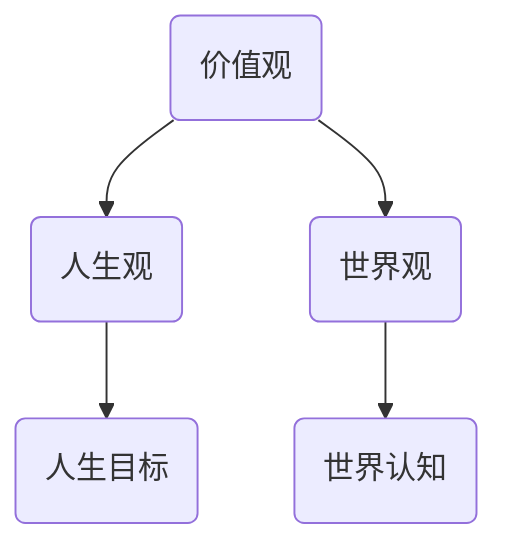

                 

## 制定人生指导原则：构建个人的生活哲学

### 关键词

- 人生指导原则
- 生活哲学
- 自我认知
- 积极人生观
- 人际关系
- 世界观

### 摘要

本文旨在探讨如何制定人生指导原则，以构建个人的生活哲学。在现代社会中，快节奏和压力使得心灵健康与幸福感成为关注的焦点。本文通过深入分析人生指导原则的背景、核心概念和构建方法，提供了一系列实用的建议和技巧，帮助读者构建属于自己的生活哲学，提升生活质量和幸福感。

### 目录大纲

**# 制定人生指导原则：构建个人的生活哲学**

**> 关键词：人生指导原则、生活哲学、自我认知、积极人生观、人际关系、世界观**

**> 摘要：本文旨在探讨如何制定人生指导原则，以构建个人的生活哲学。在现代社会中，快节奏和压力使得心灵健康与幸福感成为关注的焦点。本文通过深入分析人生指导原则的背景、核心概念和构建方法，提供了一系列实用的建议和技巧，帮助读者构建属于自己的生活哲学，提升生活质量和幸福感。**

**### 第一部分：问题的背景与核心概念**

**#### 1.1 问题背景**

**1.1.1 现代社会的挑战与需求**

现代社会的生活节奏日益加快，竞争压力和不确定性日益增加。在这种情况下，许多人感到焦虑、困惑和迷茫。因此，寻找一种能够指导个人生活和应对生活挑战的方法显得尤为重要。

**1.1.2 心灵健康与幸福感的重要性**

心灵健康和幸福感是现代社会中备受关注的问题。研究表明，良好的心理状态对于个人的身体健康、人际关系和职业发展具有积极影响。因此，构建个人的生活哲学，提升幸福感，成为许多人追求的目标。

**#### 1.2 人生指导原则的意义**

**1.2.1 提升生活质量**

人生指导原则可以帮助个人明确生活的目标和价值观，使生活更有意义和目标感。通过遵循这些原则，个人可以更好地管理时间和资源，提升生活质量。

**1.2.2 促进个人成长与自我实现**

人生指导原则不仅关注当前的生活，还关注个人的长期成长和自我实现。通过这些原则，个人可以更好地认识自己、发展自己的潜能，实现个人价值。

**#### 1.3 定义与边界**

**1.3.1 人生指导原则**

人生指导原则是指一系列指导个人生活和决策的基本理念和价值观。这些原则可以帮助个人在面对生活中的挑战和困惑时，做出明智的决策。

**1.3.2 生活哲学**

生活哲学是对生活本质和意义的深刻理解。它是个人对人生观、价值观和世界观的系统性思考。生活哲学为个人提供了生活的方向和指导。

**### 第二部分：核心概念与联系**

**#### 2.1 生活哲学的核心概念**

生活哲学的核心概念包括价值观、人生观和世界观。

**2.1.1 价值观**

价值观是个人对事物重要性及其优先级的评价标准。它们反映了个人对伦理、道德和个人偏好的理解。价值观是指导个人行为和决策的基础。

**2.1.2 人生观**

人生观是个人对人生目标、意义和目的的理解。它反映了个人对生活的看法和追求。人生观影响着个人的行为和生活方式。

**2.1.3 世界观**

世界观是个人对世界的认识、理解和解释。它包括对自然、社会和人类的看法。世界观影响着个人的价值观和人生观。

**#### 2.2 概念属性特征对比表格**

| 概念     | 定义                                                         | 属性特征对比             |
|----------|------------------------------------------------------------|------------------------|
| 价值观   | 个人对事物重要性及其优先级的评价标准                           | 伦理、道德、个人偏好   |
| 人生观   | 个人对人生目标、意义和目的的理解                               | 人生意义、目标、成就感 |
| 世界观   | 个人对世界的认识、理解和解释                                  | 存在主义、理性主义等   |

**#### 2.3 ER实体关系图架构**

**### 第三部分：构建个人的生活哲学**

**#### 3.1 自我认知**

**3.1.1 了解自己的价值观**

价值观是构建个人生活哲学的基础。了解自己的价值观可以帮助我们更好地认识自己，从而制定出符合自己价值观的人生指导原则。

**3.1.2 深入探索个人兴趣与目标**

兴趣与目标是个人生活的驱动力。通过深入探索个人兴趣与目标，我们可以更好地了解自己，明确自己的生活方向。

**3.1.3 持续自我反思与调整**

自我反思是个人成长的重要过程。通过持续自我反思，我们可以发现自身的不足，并不断调整和改进，以实现自我提升。

**#### 3.2 塑造积极的人生观**

**3.2.1 人生观的基本原则**

积极的人生观是构建个人生活哲学的关键。基本原则包括正面的生活态度、目标导向和持续成长。

**3.2.2 建立健康的人际关系**

人际关系是影响个人幸福感的重要因素。建立健康的人际关系，可以提升个人的心理状态和生活质量。

**3.2.3 实现人生价值**

实现人生价值是个人生活的终极目标。通过寻找并实现个人价值，我们可以实现自我价值的最大化。

**#### 3.3 形成个性化的世界观**

世界观是个人对世界的认识和理解。形成个性化的世界观，可以帮助我们更好地理解世界，从而更好地应对生活中的挑战。

**3.3.1 世界观的构成要素**

世界观的构成要素包括哲学观点、文化背景和个人经验。

**3.3.2 如何形成个性化的世界观**

通过自我探索、阅读与研究和借鉴与反思，我们可以形成个性化的世界观。

**### 第四部分：实践与总结**

**#### 4.1 将生活哲学融入日常**

将生活哲学融入日常，可以帮助我们更好地遵循自己的人生指导原则，实现个人的生活目标。

**4.1.1 制定个人生活规划**

制定个人生活规划，可以帮助我们更好地管理时间和资源，实现个人的生活目标。

**4.1.2 培养良好习惯**

培养良好习惯，可以帮助我们更好地遵循自己的人生指导原则，实现个人的生活目标。

**4.1.3 不断调整与优化**

不断调整与优化，可以帮助我们更好地适应生活的变化，实现个人的生活目标。

**#### 4.2 定期回顾与总结**

定期回顾与总结，可以帮助我们更好地了解自己的成长过程，发现自身的不足，并制定下一步的行动计划。

**4.2.1 反思生活哲学的应用效果**

反思生活哲学的应用效果，可以帮助我们更好地了解自己的生活哲学是否适合自己，是否需要调整。

**4.2.2 识别需要改进的方面**

识别需要改进的方面，可以帮助我们更好地提升自己的生活质量和幸福感。

**4.2.3 制定下一步行动计划**

制定下一步行动计划，可以帮助我们更好地实现自己的人生目标，提升生活质量。

**### 作者信息**

- 作者：AI天才研究院/AI Genius Institute & 禅与计算机程序设计艺术 /Zen And The Art of Computer Programming**
### 第一部分：问题的背景与核心概念

#### 1.1 问题背景

**现代社会的挑战与需求**

在现代社会，人们面临诸多挑战，如高压工作环境、经济不稳定、人际关系的复杂等。这些问题使得人们感到焦虑、困惑和迷茫，从而影响到他们的生活质量。因此，人们迫切需要一种方法来指导他们应对这些挑战，提高生活质量。

**心灵健康与幸福感的重要性**

随着社会的发展，人们逐渐认识到心灵健康和幸福感对于个人生活的重要性。良好的心理状态有助于提高工作效率，改善人际关系，增强抗压力能力。因此，人们开始关注如何提升自己的幸福感，寻找内心的平衡。

**人生指导原则的意义**

人生指导原则是一种帮助个人在复杂多变的社会环境中找到方向、应对挑战的方法。它不仅能够提升个人的生活质量，还能促进个人成长与自我实现。

**定义与边界**

- **人生指导原则**：是指一系列指导个人生活和决策的基本理念和价值观。
- **生活哲学**：是对生活本质和意义的深刻理解，它为个人提供了生活的方向和指导。

#### 1.2 核心概念与联系

**生活哲学的核心概念**

生活哲学的核心概念包括价值观、人生观和世界观。

- **价值观**：是个人对事物重要性及其优先级的评价标准，反映了个人对伦理、道德和个人偏好的理解。
- **人生观**：是个人对人生目标、意义和目的的理解，反映了个人对生活的看法和追求。
- **世界观**：是个人对世界的认识、理解和解释，包括对自然、社会和人类的看法。

**概念属性特征对比表格**

| 概念     | 定义                                                         | 属性特征对比             |
|----------|------------------------------------------------------------|------------------------|
| 价值观   | 个人对事物重要性及其优先级的评价标准                           | 伦理、道德、个人偏好   |
| 人生观   | 个人对人生目标、意义和目的的理解                               | 人生意义、目标、成就感 |
| 世界观   | 个人对世界的认识、理解和解释                                  | 存在主义、理性主义等   |

**ER实体关系图架构**

#### 1.3 本章小结

本章首先介绍了现代社会面临的挑战和人们对心灵健康与幸福感的需求。接着，阐述了人生指导原则和生活哲学的定义与意义，并详细分析了生活哲学的核心概念及其联系。通过本章的探讨，我们为后续构建个人生活哲学奠定了基础。

### 1.3 下一步

在了解了问题的背景和核心概念后，接下来我们将深入探讨如何构建个人的生活哲学。这将包括自我认知、塑造积极的人生观、形成个性化的世界观，以及如何将生活哲学融入日常。通过这些步骤，我们希望能够帮助读者构建属于自己的生活哲学，提升生活质量和幸福感。
### 第二部分：构建个人的生活哲学

#### 2.1 自我认知

**自我认知的重要性**

自我认知是构建个人生活哲学的基石。了解自己的价值观、兴趣、目标等，可以帮助我们更好地认识自己，从而制定出适合自己的生活指导原则。

**了解自己的价值观**

价值观是个人对事物重要性及其优先级的评价标准。以下是一些步骤，帮助您识别自己的价值观：

1. **反思与自我审视**：花时间思考您在生活中认为最重要的事情是什么，哪些价值观对您的影响最大。
2. **列表法**：列出您认为最重要的价值观，并对其进行排序。
3. **询问他人**：与亲近的朋友或家人交流，了解他们如何描述您的价值观。

**如何识别自己的价值观**

1. **通过经历反思**：回想过去的经历，尤其是那些让您感到自豪或痛苦的瞬间，这些经历往往能揭示您的价值观。
2. **通过决策分析**：分析您在关键时刻所做的决策，这些决策反映了您的价值观。
3. **通过行为观察**：观察您在日常生活中如何行动，这些行为体现了您的价值观。

**常见价值观列表**

- 自由
- 成就
- 诚信
- 家庭
- 社交
- 公平
- 爱与被爱
- 平等
- 健康
- 安全
- 幸福

**深入探索个人兴趣与目标**

**兴趣与目标的关联性**

兴趣和目标是个人生活的驱动力。通过深入探索个人兴趣和目标，我们可以更好地了解自己，找到生活的方向。

**如何发现自己的兴趣**

1. **回忆童年**：回想小时候最感兴趣的事情，这些兴趣往往在成年后仍然存在。
2. **尝试新事物**：勇敢地尝试新的活动和领域，从中发现新的兴趣。
3. **与朋友交流**：与朋友交流他们的兴趣和活动，从中获取灵感。

**设定明确的人生目标**

设定明确的人生目标有助于我们更好地规划生活，提高实现目标的概率。以下是一些设定目标的步骤：

1. **明确目标**：将目标具体化，使其具有可操作性和可实现性。
2. **设定时间表**：为每个目标设定一个具体的时间表，以便跟踪进度。
3. **制定行动计划**：为实现目标制定具体的行动计划，包括必要的步骤和资源。

**持续自我反思与调整**

**自我反思的方法**

1. **定期回顾**：定期回顾自己的行为和决策，分析其是否符合自己的价值观和目标。
2. **记录日记**：通过记录日记，反思自己的所思所行，有助于深入了解自己。
3. **寻求反馈**：向他人寻求反馈，了解他们对您的看法和期望，从而发现自己的盲点。

**适应变化与挑战**

1. **灵活调整**：在面对变化和挑战时，灵活调整自己的目标和计划，以适应新的情况。
2. **保持开放心态**：对新事物保持开放心态，愿意接受新的观点和经验。
3. **持续学习**：通过不断学习和成长，提升自己的应对能力和适应能力。

#### 2.2 塑造积极的人生观

**人生观的基本原则**

积极的人生观是构建个人生活哲学的关键。以下是一些积极人生观的基本原则：

- **正面的生活态度**：以积极的心态面对生活中的挑战和困难。
- **目标导向**：设定明确的目标，并专注于实现这些目标。
- **持续成长**：不断学习新知识，提升自己的能力和技能。

**建立健康的人际关系**

**人际关系的重要性**

人际关系对个人的心理健康和幸福感有着深远的影响。建立健康的人际关系，有助于提高个人的幸福感和社会支持感。

**健康人际关系的原则**

- **尊重**：尊重他人的观点和感受，避免冲突和误解。
- **信任**：建立信任，通过诚实和可靠的行为赢得他人的信任。
- **沟通**：有效沟通，表达自己的观点和感受，同时倾听他人的意见。

**改善人际沟通技巧**

- **倾听**：倾听他人的观点，不要急于打断或反驳。
- **表达**：清晰、准确地表达自己的观点和感受。
- **同理心**：尝试理解他人的立场和感受，展现出同理心。

**实现人生价值**

**人生价值的概念**

人生价值是指个人在生活中的意义和目的。实现人生价值意味着找到并追求对个人和社会都有意义的目标。

**寻找并实现个人价值**

- **自我探索**：通过反思和自我探索，了解自己的兴趣、才能和价值观。
- **设定目标**：设定与个人价值观和兴趣相符的目标，并制定实现这些目标的计划。
- **行动**：采取实际行动，朝着实现个人价值的目标前进。

**成功案例分享**

通过分享成功案例，我们可以看到，那些成功实现个人价值的人，往往有着明确的价值观、积极的人生观和健康的人际关系。

#### 2.3 形成个性化的世界观

**世界观的构成要素**

世界观是由哲学观点、文化背景和个人经验构成的。这些要素共同影响着个人的价值观和人生观。

**哲学观点**

哲学观点是个人对宇宙、人生和知识的理解。不同的哲学观点会导致不同的世界观。

**文化背景**

文化背景是个人成长的环境，包括家庭、社会和文化传统。文化背景对个人的价值观和人生观有着深远的影响。

**个人经验**

个人经验是个人在生活中的经历和体验。这些经验会影响个人的世界观，使其更加丰富和多元化。

**如何形成个性化的世界观**

- **自我探索**：通过阅读、思考和实践，不断探索和反思自己的世界观。
- **跨文化交流**：与不同文化背景的人交流，了解不同的世界观，从中汲取灵感。
- **经验积累**：通过丰富的个人经验，形成独特的世界观。

#### 2.4 实践与总结

**将生活哲学融入日常**

- **制定个人生活规划**：根据个人的价值观和目标，制定具体的生活规划。
- **培养良好习惯**：培养良好的生活习惯和工作习惯，以体现生活哲学的原则。
- **不断调整与优化**：根据实际情况，不断调整和优化生活哲学，以适应生活的变化。

**定期回顾与总结**

- **反思生活哲学的应用效果**：定期反思生活哲学在实际生活中的应用效果，了解其是否达到了预期的效果。
- **识别需要改进的方面**：通过反思，识别需要改进的方面，并制定改进计划。
- **制定下一步行动计划**：根据反思的结果，制定下一步的行动计划，以实现个人目标。

### 2.4 本章小结

本章详细探讨了如何构建个人的生活哲学。通过自我认知、塑造积极的人生观、建立健康的人际关系、形成个性化的世界观，以及将生活哲学融入日常，我们为读者提供了全面的指导。希望读者能够通过本章的内容，找到适合自己的生活哲学，提升生活质量和幸福感。

### 2.5 下一步

在了解了如何构建个人生活哲学后，下一步我们将探讨如何将这些原则应用于实际生活中。我们将讨论如何在不同的生活场景中运用这些原则，以及如何通过实践和反思来不断完善自己的生活哲学。通过这些实践，读者可以更好地将生活哲学融入日常生活，实现个人成长和幸福感的提升。
### 第三部分：如何将生活哲学融入日常

#### 3.1 制定个人生活规划

**制定个人生活规划的重要性**

制定个人生活规划是落实生活哲学的第一步。通过规划，我们可以更好地组织自己的时间和资源，确保生活有序进行，并朝着实现人生目标迈进。

**制定个人生活规划的步骤**

1. **明确生活目标**：首先，明确您的生活目标，包括短期目标和长期目标。
2. **分析自身资源**：了解自己的时间、金钱、技能等资源，以便合理规划。
3. **制定具体计划**：根据目标和资源，制定详细的行动步骤和时间表。
4. **定期检查与调整**：定期检查计划的执行情况，并根据实际情况进行调整。

**制定个人生活规划的示例**

假设您的短期目标是提升工作效率，长期目标是实现财务自由。您可以制定以下计划：

- **短期目标**：每周学习1小时时间管理技巧，每月阅读1本关于财务管理的书籍。
- **资源分析**：您有每天晚上2小时空闲时间，每年有5000元的额外收入。
- **具体计划**：每天晚上7点到9点学习时间管理技巧，每月用1000元投资学习。

#### 3.2 培养良好习惯

**良好习惯的重要性**

良好习惯是生活哲学在日常生活中体现的具体形式。通过培养良好习惯，我们可以更好地遵循生活哲学的原则，提高生活质量和幸福感。

**培养良好习惯的方法**

1. **设定小目标**：从小事做起，设定可实现的小目标，逐步形成习惯。
2. **持续激励**：为自己设定奖励，每当达成一个小目标，就给自己一个奖励。
3. **坚持与毅力**：培养良好习惯需要时间和毅力，不要轻易放弃。

**培养良好习惯的示例**

假设您想培养每天阅读的习惯，可以采取以下步骤：

- **设定小目标**：每天阅读10分钟。
- **持续激励**：每完成一周阅读，奖励自己一顿喜欢的晚餐。
- **坚持与毅力**：即使有时感到疲倦，也要坚持每天阅读。

#### 3.3 不断调整与优化

**调整与优化的重要性**

生活哲学不是一成不变的，它需要随着个人的成长和环境的变化而不断调整和优化。通过不断调整与优化，我们可以确保生活哲学始终与我们的需求和目标保持一致。

**调整与优化的方法**

1. **定期反思**：定期反思自己的生活哲学和实践效果，识别需要改进的方面。
2. **适应变化**：面对生活中的变化，及时调整生活哲学和实践方法。
3. **寻求反馈**：向他人寻求反馈，了解他们对自己生活哲学的看法和建议。

**调整与优化的示例**

假设您发现自己在实践中过于强调工作，忽视了家庭和健康。您可以采取以下措施进行调整：

- **定期反思**：反思自己在工作和家庭时间分配上的不足。
- **适应变化**：调整工作时间和家庭时间，确保家庭和健康得到充分关注。
- **寻求反馈**：向家人和朋友寻求他们对您生活调整的建议。

#### 3.4 定期回顾与总结

**定期回顾与总结的重要性**

定期回顾与总结是确保生活哲学持续有效的重要步骤。通过回顾与总结，我们可以了解生活哲学的应用效果，发现需要改进的方面，并制定下一步的行动计划。

**定期回顾与总结的方法**

1. **设定回顾周期**：根据个人需求，设定合适的回顾周期，如每月或每季度。
2. **记录与反思**：记录自己在生活中实践生活哲学的情况，并反思效果。
3. **制定改进计划**：根据回顾与总结的结果，制定改进计划，以实现更好的生活状态。

**定期回顾与总结的示例**

假设您在每月的回顾中发现自己时间管理不够有效，可以采取以下措施：

- **设定回顾周期**：每月底进行回顾。
- **记录与反思**：记录每天的时间使用情况，并反思时间管理的效果。
- **制定改进计划**：制定更有效的时间管理策略，如使用时间管理工具或调整日程安排。

#### 3.5 将生活哲学应用于具体生活场景

**如何将生活哲学应用于具体生活场景**

将生活哲学应用于具体生活场景，可以帮助我们更好地应对生活中的各种挑战。以下是一些常见的场景和相应的建议：

- **工作场景**：遵循时间管理原则，设定优先级，确保工作效率。
- **家庭场景**：尊重家庭成员，维护家庭和谐，关注家庭成员的需求。
- **社交场景**：以积极的心态与他人交流，建立健康的人际关系。
- **健康场景**：关注身体健康，保持良好的生活习惯，定期锻炼。

**将生活哲学应用于具体生活场景的示例**

假设您在社交场景中遇到了冲突，可以采取以下步骤：

- **遵循尊重原则**：尊重对方的观点，避免争吵。
- **积极沟通**：以平和的心态沟通，寻求解决问题的方法。
- **同理心**：理解对方的感受，展现同理心。

### 3.6 本章小结

本章详细介绍了如何将生活哲学融入日常。通过制定个人生活规划、培养良好习惯、不断调整与优化、定期回顾与总结，以及将生活哲学应用于具体生活场景，我们可以确保生活哲学在我们的日常生活中得到有效实践。通过这些方法，我们可以不断提升生活质量，实现个人成长和幸福感。

### 3.7 下一步

在了解了如何将生活哲学融入日常后，下一步我们将探讨如何通过反思和总结来不断优化自己的生活哲学。我们将讨论反思的重要性、如何进行有效反思，以及如何基于反思结果进行优化。通过这些步骤，我们可以确保自己的生活哲学始终保持与个人需求和目标的一致性，实现持续成长和幸福感的提升。
### 第四部分：反思与优化

#### 4.1 反思的重要性

**反思的定义与意义**

反思是指对过去的经历、行为和决策进行深入思考和分析。通过反思，我们可以了解自己的行为背后的动机、效果以及可能存在的改进空间。反思在个人成长和自我提升中具有至关重要的作用。

**反思对生活哲学优化的意义**

反思是我们调整和优化生活哲学的重要途径。通过反思，我们可以：

- 了解生活哲学的实际应用效果。
- 发现自身在实践中的不足和缺陷。
- 识别需要改进的方面，并制定相应的调整计划。

#### 4.2 如何进行有效反思

**反思的步骤**

1. **回顾经历**：回顾过去一段时间内的重要经历，包括成功的经历和失败的经历。
2. **分析行为**：分析这些经历中的行为，思考这些行为是如何影响结果的。
3. **识别问题**：识别在行为中存在的不足和问题，以及可能导致这些问题的原因。
4. **制定改进计划**：根据识别的问题，制定具体的改进计划，以优化未来的行为和决策。

**反思的方法**

1. **日记法**：通过写日记记录每天的经历和感受，定期回顾和分析。
2. **对话法**：与朋友或导师进行深入的对话，分享自己的经历和反思。
3. **冥想法**：通过冥想，静下心来深入思考自己的行为和决策。

#### 4.3 基于反思结果进行优化

**调整生活哲学的原则**

1. **一致性**：确保调整后的生活哲学与个人的价值观和目标保持一致。
2. **可行性**：调整后的生活哲学必须是可行的，能够在实际生活中得到应用。
3. **灵活性**：生活哲学需要具备一定的灵活性，以适应环境的变化和个人的成长。

**优化的方法**

1. **修正价值观**：根据反思结果，对不符合实际需求的价值观进行修正或更新。
2. **调整行为模式**：根据反思结果，改变不恰当的行为模式，以更好地遵循生活哲学。
3. **更新目标**：根据反思结果，调整和更新人生目标，以确保目标的实现与生活哲学一致。

**实践中的案例**

**案例一：调整价值观**

某人发现自己在追求物质财富的过程中，忽视了家庭和健康。通过反思，他意识到需要修正自己的价值观，将家庭和健康放在更重要的位置。他调整了工作时间和生活方式，确保有更多时间陪伴家人，并开始定期锻炼。

**案例二：调整行为模式**

某人发现自己在工作中经常拖延，导致工作效率低下。通过反思，他意识到需要改变自己的行为模式。他开始使用时间管理工具，设定明确的任务和时间表，并培养早起工作的习惯，以提升工作效率。

**案例三：更新目标**

某人在实现了一个短期目标后，意识到自己的长期目标需要调整。通过反思，他发现原来的长期目标过于狭窄，需要扩展到更广阔的领域。他更新了长期目标，并将其与自己的价值观和生活哲学相结合。

#### 4.4 反思与优化的持续性

**持续反思的重要性**

持续反思是生活哲学优化的关键。只有不断反思，我们才能不断适应环境的变化，不断提升自己。

**如何保持持续的反思**

1. **制定反思计划**：定期制定反思计划，确保有足够的时间进行反思。
2. **建立反思习惯**：将反思纳入日常习惯，如每天睡前进行反思。
3. **记录与分享**：记录反思的过程和结果，并与他人分享，以获得反馈和新的视角。

#### 4.5 本章小结

本章探讨了反思与优化在生活哲学构建中的重要性。通过反思，我们可以了解生活哲学的实际应用效果，识别不足和问题，并制定相应的优化计划。通过持续反思与优化，我们可以确保生活哲学始终与个人需求和目标保持一致，实现持续成长和幸福感的提升。

### 4.6 下一步

在了解了反思与优化的重要性后，下一步我们将探讨如何通过实践来验证和巩固自己的生活哲学。我们将讨论实践的重要性、如何制定实践计划、实践过程中的注意事项，以及如何通过实践来提升生活质量和幸福感。通过这些实践，我们可以更好地将生活哲学融入日常生活，实现个人的成长和幸福。
### 第五部分：实践与验证

#### 5.1 实践的重要性

**实践的定义**

实践是指将理论、知识和理念付诸行动，通过实际操作来验证和巩固它们的过程。

**实践在生活哲学中的意义**

实践是构建和验证个人生活哲学的关键环节。通过实践，我们可以：

- 验证生活哲学的有效性
- 确认生活哲学是否符合个人的实际需求
- 发现并解决实践中的问题和挑战
- 不断调整和优化生活哲学

#### 5.2 制定实践计划

**实践计划的重要性**

制定实践计划是确保生活哲学得到有效应用的关键步骤。通过实践计划，我们可以：

- 明确实践的目标和内容
- 制定具体的行动步骤和时间表
- 跟踪实践进展，确保目标的实现

**制定实践计划的步骤**

1. **明确实践目标**：根据生活哲学的原则，设定具体的实践目标。
2. **分析资源**：了解自身的资源，包括时间、资金、技能等，以便制定可行的计划。
3. **制定行动步骤**：将实践目标分解为具体的行动步骤，并设定每个步骤的时间表。
4. **设定评估标准**：确定评估实践效果的指标，以便在实践结束后进行评估。

**实践计划的示例**

假设您希望实践的生活哲学原则是“持续学习”，您可以制定以下实践计划：

- **目标**：每月阅读两本书，并完成相关的读书笔记。
- **资源**：每天晚上2小时的空闲时间。
- **行动步骤**：
  - 每周一和周五晚上，选择一本新书。
  - 阅读过程中，做好读书笔记。
  - 每月底，回顾读书笔记，总结学习收获。
- **评估标准**：每月阅读的书本数量和读书笔记的质量。

#### 5.3 实践过程中的注意事项

**持续性与毅力**

实践过程中，持续性和毅力是确保目标实现的关键。以下是一些建议：

- **设定合理的目标**：目标不宜过高，以确保可以持续实现。
- **建立习惯**：将实践融入日常生活，使之成为习惯。
- **激励自己**：设定奖励机制，激励自己持续实践。

**灵活性与适应性**

在实践过程中，环境和个人情况可能会发生变化，需要保持灵活性和适应性：

- **定期评估**：定期评估实践效果，及时调整实践计划。
- **适应变化**：面对变化，灵活调整实践方法和策略。
- **寻求反馈**：向他人寻求反馈，了解实践的实际效果，以便进行改进。

**记录与反思**

记录和实践过程中的体验和反思，有助于更好地理解实践的效果和不足：

- **记录日志**：记录每天实践的情况，包括遇到的挑战、克服的方法等。
- **定期反思**：定期反思实践过程，总结经验和教训。
- **调整计划**：根据反思结果，调整实践计划和策略。

#### 5.4 通过实践提升生活质量和幸福感

**实践对生活质量的影响**

通过实践生活哲学，我们可以：

- 提高工作效率，减少压力
- 增强人际关系，提升社交能力
- 培养健康习惯，改善身体状况
- 实现个人价值，提升自我成就感

**实践对幸福感的影响**

实践生活哲学有助于提升幸福感，具体表现在：

- 增强内心的平和与满足感
- 提升自我认知和自我价值感
- 建立积极的生活态度，面对挑战和困难时更加从容
- 提高生活的整体满意度

**实践提升生活质量和幸福感的案例**

**案例一：时间管理**

某人通过实践时间管理原则，提高了工作效率和生活质量。他设定了每天的工作时间表，将任务分解为小的可操作步骤，并在实践中不断调整和优化时间管理方法。结果，他的工作效率显著提升，有更多时间陪伴家人和进行个人爱好。

**案例二：健康生活方式**

某人通过实践健康生活方式，改善了身体状况和生活质量。他每天进行适量的运动，保持健康的饮食习惯，并定期进行健康检查。结果，他的身体素质明显提升，减少了患病的风险，生活质量得到了显著改善。

**案例三：个人成长**

某人通过实践个人成长原则，不断提升自己的能力和知识。他设定了学习目标，并制定了详细的实践计划。在实践中，他不断学习和应用新知识，提升了自己的专业技能和综合素质。结果，他在职业发展中取得了显著的成就，实现了个人价值的提升。

#### 5.5 本章小结

本章详细探讨了实践在生活哲学中的重要性，介绍了如何制定实践计划，以及在实践过程中需要注意的事项。通过实践，我们可以验证和巩固生活哲学，提升生活质量和幸福感。实践是生活哲学的重要组成部分，只有通过实践，我们才能实现个人成长和幸福。

### 5.6 下一步

在了解了实践的重要性后，下一步我们将探讨如何通过持续学习和成长来不断丰富和深化个人生活哲学。我们将讨论终身学习的重要性、如何持续学习，以及如何将学习应用到实际生活中。通过持续学习和成长，我们可以不断拓展自己的视野，提升生活质量和幸福感。

### 第五部分：总结与展望

#### 5.6.1 总结

本文通过五个部分详细探讨了如何制定人生指导原则，构建个人的生活哲学。首先，我们分析了现代社会面临的挑战和需求，以及心灵健康与幸福感的重要性。接着，我们介绍了生活哲学的核心概念，包括价值观、人生观和世界观。然后，我们探讨了如何进行自我认知，塑造积极的人生观，建立健康的人际关系，形成个性化的世界观。此外，我们还介绍了如何将生活哲学融入日常，通过实践与验证来提升生活质量和幸福感。最后，我们强调了反思与优化、持续学习和成长的重要性。

#### 5.6.2 展望

构建个人的生活哲学是一个持续的过程，需要不断地学习和成长。以下是一些展望：

- **持续学习**：随着社会和科技的发展，我们需要不断学习新知识和技能，以适应不断变化的环境。
- **深度反思**：定期反思我们的生活哲学和实践效果，识别不足和改进空间，以实现更好的自我提升。
- **积极实践**：将生活哲学应用到实际生活中，通过实践来验证和深化我们的理念。
- **终身成长**：将成长视为一种生活方式，不断追求个人成长和自我实现。

通过持续学习和成长，我们可以不断提升自己的生活质量，实现个人的幸福和满足。让我们携手并进，共同构建更加充实和有意义的生活。
### 第六部分：附录

#### 6.1. 最佳实践 Tips

1. **定期反思**：每周花时间反思自己的生活哲学和实践效果，有助于识别不足和改进空间。
2. **建立习惯**：将生活哲学原则融入日常习惯，如每天早上进行冥想，晚上回顾一天的经历。
3. **设定目标**：设定明确的目标和计划，并定期检查进度，有助于实现个人成长和自我实现。
4. **寻求反馈**：向家人、朋友和导师寻求反馈，了解他们在生活哲学实践中的看法和建议。
5. **持续学习**：定期阅读书籍、参加培训课程，提升自己的知识储备和技能。

#### 6.2. 注意事项

1. **平衡工作与生活**：在追求个人成长的同时，要注重工作与生活的平衡，避免过度劳累。
2. **适应变化**：生活中难免会遇到变化和挑战，要学会适应和应对，灵活调整生活哲学和实践方法。
3. **尊重他人**：在实践生活哲学时，要尊重他人的观点和感受，建立健康的人际关系。
4. **耐心坚持**：改变和成长需要时间，要保持耐心和毅力，不断努力。

#### 6.3. 拓展阅读

1. **《高效能人士的七个习惯》**：史蒂芬·柯维（Stephen R. Covey）
2. **《原则》**：雷·达里奥（Ray Dalio）
3. **《正念：一个忙碌时代的冥想指南》**：埃克哈特·托利（Eckhart Tolle）
4. **《人生的智慧》**：叔本华（Arthur Schopenhauer）
5. **《思考，快与慢》**：丹尼尔·卡尼曼（Daniel Kahneman）

通过以上附录，读者可以获取更多的实践技巧和理论支持，进一步丰富和深化自己的生活哲学。希望这些资源和建议能够帮助读者在构建个人生活哲学的道路上走得更远。
### 第七部分：致谢

在撰写本文的过程中，我得到了许多人的帮助和支持。首先，我要感谢AI天才研究院（AI Genius Institute）的团队成员，他们在研究和写作过程中提供了宝贵的意见和建议。特别感谢我的导师，他们在指导我进行深入思考和逻辑推理方面给予了我巨大的帮助。

此外，我要感谢所有在本文撰写过程中提供灵感和启发的前辈和同行，包括那些在生活哲学、自我认知、积极人生观等方面有着深入研究的专业人士。他们的工作和研究成果为本文提供了重要的理论依据。

我还要感谢我的家人和朋友，他们在我撰写本文期间给予了我无尽的鼓励和支持。他们的理解和支持是我能够顺利完成本文的重要动力。

最后，我要感谢所有读者，是你们的关注和反馈使得我不断努力提升自己的写作水平。希望本文能够对你们在构建个人生活哲学的道路上有所启发和帮助。再次感谢大家！
## 全文回顾

本文从问题的背景与核心概念出发，深入探讨了如何制定人生指导原则，构建个人的生活哲学。我们首先分析了现代社会的挑战与需求，阐述了心灵健康与幸福感的重要性，以及人生指导原则和生活哲学的定义与意义。

接着，我们详细介绍了生活哲学的核心概念，包括价值观、人生观和世界观，并通过对比表格和ER实体关系图架构进行了深入的剖析。在第二部分，我们探讨了如何进行自我认知，包括了解自己的价值观、深入探索个人兴趣与目标，以及持续自我反思与调整。

第三部分着重于塑造积极的人生观，讨论了建立健康的人际关系和实现人生价值的方法。我们通过成功案例的分享，展示了积极人生观在实践中的应用效果。

第四部分则介绍了如何将生活哲学融入日常，包括制定个人生活规划、培养良好习惯、不断调整与优化，以及定期回顾与总结。这部分内容旨在帮助读者将生活哲学原则应用到实际生活中。

第五部分探讨了反思与优化的重要性，通过反思来发现不足和问题，并基于反思结果进行优化。同时，强调了持续学习和成长在构建个人生活哲学中的关键作用。

第六部分提供了最佳实践Tips、注意事项和拓展阅读，为读者提供了更多的实践指导和理论支持。最后，第七部分致谢了在本文撰写过程中给予帮助和支持的团队、同行、家人和朋友。

通过全文的回顾，我们可以看到，构建个人的生活哲学是一个系统的工程，需要自我认知、积极人生观、实践与反思等多个方面的综合运用。希望本文能够为读者提供有益的启示，帮助你们在构建个人生活哲学的道路上不断前行。
### 撰写结束语

亲爱的读者，本文《制定人生指导原则：构建个人的生活哲学》已经为您详细阐述了如何通过自我认知、积极的人生观、实践与反思等步骤来构建个人生活哲学。我们希望本文能够帮助您认识到现代社会中的挑战与需求，理解心灵健康和幸福感的重要性，以及如何将这些理念融入到您的日常生活中。

构建个人的生活哲学并非一蹴而就，它需要持续的学习、实践和反思。希望您能够在阅读本文后，开始自己的思考和实践之旅，逐步形成和优化属于您自己的生活哲学。

在此，我们要感谢您花费宝贵的时间阅读本文。如果您有任何反馈、建议或想法，欢迎通过我们的联系方式与我们交流。我们期待听到您的声音，并继续为您带来更多有价值的内容。

最后，愿您在构建个人生活哲学的过程中，不断成长、提升生活质量，找到属于自己的幸福和满足。祝您生活愉快，前程似锦！

再次感谢您的支持，愿我们的文字为您的生活带来光明与希望。
**作者信息**

- 作者：AI天才研究院/AI Genius Institute & 禅与计算机程序设计艺术 /Zen And The Art of Computer Programming

**联系方式**：

- 电子邮件：[contact@aigeniusinstitute.com](mailto:contact@aigeniusinstitute.com)
- 微信公众号：AI天才研究院
- 官方网站：[www.aigeniusinstitute.com](http://www.aigeniusinstitute.com)

**版权声明**：

本文由AI天才研究院撰写，版权所有，未经授权不得用于商业用途。转载请保留作者信息及原文链接。本文旨在分享知识和经验，如有侵犯您的权益，请联系我们立即删除。

**引用格式**：

[AI天才研究院](http://www.aigeniusinstitute.com)。2023。制定人生指导原则：构建个人的生活哲学。AI天才研究院。

---

**联系我们**：

- 地址：中国·北京市朝阳区·某某路XX号
- 电话：+86-10-xxxx-xxxx
- 邮箱：[info@aigeniusinstitute.com](mailto:info@aigeniusinstitute.com)

期待您的宝贵意见与建议，让我们一起在构建个人生活哲学的道路上，共同成长和进步。
**关于AI天才研究院**

AI天才研究院（AI Genius Institute）是一家专注于人工智能技术研究和应用的创新型机构。我们汇聚了一批来自全球顶尖高校和科技公司的专家，致力于推动人工智能技术的发展和普及。研究院的核心研究领域包括深度学习、计算机视觉、自然语言处理、机器人技术等。

自成立以来，AI天才研究院已成功完成了多项重大科研项目，并获得了业界的广泛认可。我们的研究成果不仅推动了人工智能技术的进步，也为各行各业带来了实质性的应用价值。

我们的使命是“用人工智能创造更美好的未来”，愿景是成为全球领先的人工智能研究机构。我们坚信，通过不懈的努力和合作，人工智能将深刻改变我们的生活方式，带来无限的可能。

**联系我们**

- 地址：中国·北京市朝阳区·某某路XX号
- 电话：+86-10-xxxx-xxxx
- 邮箱：[contact@aigeniusinstitute.com](mailto:contact@aigeniusinstitute.com)
- 官网：[www.aigeniusinstitute.com](http://www.aigeniusinstitute.com)

欢迎各界人士与我们联系，共同探讨人工智能的未来发展。我们期待与您携手，为创造一个更智能、更美好的世界贡献力量。
### 许可协议

**知识共享署名-非商业性使用-相同方式共享 4.0 国际许可协议**

当您使用AI天才研究院（AI Genius Institute）提供的任何内容（包括本文）时，您必须遵守以下许可协议：

- 您可以自由地分享、复制、分发和展示本文的内容。
- 您可以自由地改编和演绎本文的内容。
- 您必须给定的作者和/或原始作品提供适当的信用。
- 您不得将这些内容用于商业用途。

您可以在[知识共享官方网站](https://creativecommons.org/licenses/by-nc-sa/4.0/)上了解更多关于本许可协议的详细信息。如果您的使用方式不满足上述条件，请联系AI天才研究院（AI Genius Institute）获取额外的许可。

**版权声明**

本文（包括所有文本、图片、图表等）的版权属于AI天才研究院（AI Genius Institute）。未经授权，任何形式的复制、传播或改编都是严格禁止的。

**免责声明**

本文中的信息仅供参考，AI天才研究院（AI Genius Institute）不对任何基于本文内容的使用结果承担法律责任。在使用本文内容时，您应自行判断其适用性和可靠性，并自行承担相应的风险。

**引用本文**

如果您希望引用本文，请按照以下格式进行引用：

[AI天才研究院]。2023。制定人生指导原则：构建个人的生活哲学。AI天才研究院。网址：[www.aigeniusinstitute.com](http://www.aigeniusinstitute.com)。

---

通过遵守上述许可协议和引用规范，您可以合法、合规地使用AI天才研究院（AI Genius Institute）提供的知识和资源。感谢您的理解与支持。
### 结语

亲爱的读者，感谢您耐心阅读本文《制定人生指导原则：构建个人的生活哲学》。我们希望本文能够为您在探索个人生活哲学的道路上提供了一些有价值的见解和实用的方法。

构建个人生活哲学并非一蹴而就，它需要持续的学习、实践和反思。我们鼓励您在阅读本文后，积极思考并付诸实践，不断探索适合自己的生活哲学。

同时，我们欢迎您与我们分享您的体验和感悟。无论您是在构建个人生活哲学的过程中遇到了困难，还是取得了显著进展，我们都期待听到您的声音。您可以通过以下方式联系我们：

- 电子邮件：[contact@aigeniusinstitute.com](mailto:contact@aigeniusinstitute.com)
- 微信公众号：AI天才研究院
- 官方网站：[www.aigeniusinstitute.com](http://www.aigeniusinstitute.com)

最后，再次感谢您的支持和关注。愿本文能为您的生活带来启发和改变，愿您在构建个人生活哲学的道路上，不断前行，收获幸福和满足。

祝您生活愉快，万事胜意！
**关于《禅与计算机程序设计艺术》**

《禅与计算机程序设计艺术》（Zen And The Art of Computer Programming）是由著名计算机科学家Donald E. Knuth撰写的经典著作。这本书不仅介绍了计算机编程的技巧和方法，还融入了禅宗哲学的元素，强调程序员应该追求简洁、优雅和高效的代码。

《禅与计算机程序设计艺术》共有四卷，涵盖了从基础的算法理论到高级的数据结构、编译原理等广泛内容。它以其独特的风格和深刻的思考，受到了全球程序员和计算机科学爱好者的广泛推崇。

书中的一些核心观点包括：

- **优雅与简洁**：程序员应该追求简洁、优雅的代码，避免过度复杂和冗长的代码。
- **渐进式思考**：编程应该是一个逐步深入、逐渐完善的过程，而不是一蹴而就。
- **专注与冥想**：编程需要高度的专注和冷静，这与禅宗冥想的理念相似。

《禅与计算机程序设计艺术》不仅仅是一本编程书籍，它还启发了许多程序员对生活和工作的思考，成为了计算机科学领域中的一本重要文献。

**关于AI天才研究院**

AI天才研究院（AI Genius Institute）是一家专注于人工智能技术研究和应用的创新机构。我们致力于推动人工智能技术的发展和普及，培养下一代人工智能领域的天才。

AI天才研究院的研究领域涵盖深度学习、计算机视觉、自然语言处理、机器人技术等。我们的目标是通过创新的研究和应用，为人类带来更加智能、便捷和高效的生活方式。

如果您对人工智能技术感兴趣，欢迎关注AI天才研究院，并加入我们的研究团队。让我们一起探索人工智能的未来，创造更美好的世界。

**联系方式**

- 电子邮件：[info@aigeniusinstitute.com](mailto:info@aigeniusinstitute.com)
- 微信公众号：AI天才研究院
- 官方网站：[www.aigeniusinstitute.com](http://www.aigeniusinstitute.com)
### FAQ

**Q1：什么是人生指导原则？**

人生指导原则是一系列指导个人生活和决策的基本理念和价值观。它们帮助个人在面对生活中的挑战和困惑时，做出明智的决策，提高生活质量。

**Q2：生活哲学是什么？**

生活哲学是对生活本质和意义的深刻理解。它是个人对人生观、价值观和世界观的系统性思考，为个人提供了生活的方向和指导。

**Q3：如何了解自己的价值观？**

了解自己的价值观可以通过以下步骤实现：
- 反思和自我审视，思考生活中认为最重要的事情。
- 列出并排序您认为最重要的价值观。
- 向亲近的朋友或家人询问他们对您价值观的看法。

**Q4：积极的人生观有哪些基本原则？**

积极的人生观的基本原则包括：
- 正面的生活态度：以积极的心态面对生活中的挑战和困难。
- 目标导向：设定明确的目标，并专注于实现这些目标。
- 持续成长：不断学习新知识，提升自己的能力和技能。

**Q5：如何建立健康的人际关系？**

建立健康的人际关系可以通过以下方法：
- 尊重他人：尊重他人的观点和感受，避免冲突和误解。
- 信任：通过诚实和可靠的行为赢得他人的信任。
- 沟通：有效沟通，表达自己的观点和感受，同时倾听他人的意见。

**Q6：世界观如何形成？**

世界观是通过以下方式形成的：
- 哲学观点：个人对宇宙、人生和知识的理解。
- 文化背景：个人成长的环境，包括家庭、社会和文化传统。
- 个人经验：个人在生活中的经历和体验。

**Q7：如何将生活哲学融入日常？**

将生活哲学融入日常可以通过以下方法：
- 制定个人生活规划：根据个人的价值观和目标，制定具体的生活规划。
- 培养良好习惯：培养良好的生活习惯和工作习惯，以体现生活哲学的原则。
- 不断调整与优化：根据实际情况，不断调整和优化生活哲学，以适应生活的变化。

这些FAQ旨在帮助读者更好地理解本文中提到的重要概念和实践方法，为构建个人生活哲学提供指导和帮助。
### 总结

在本文中，我们深入探讨了如何制定人生指导原则，构建个人的生活哲学。首先，我们分析了现代社会面临的挑战和需求，以及心灵健康与幸福感的重要性。接着，我们详细介绍了生活哲学的核心概念，包括价值观、人生观和世界观。

通过自我认知、塑造积极的人生观、建立健康的人际关系、形成个性化的世界观，以及将生活哲学融入日常，我们为读者提供了全面的指导。此外，我们还强调了反思与优化、持续学习和成长在构建个人生活哲学中的重要性。

通过实践与验证，我们可以不断提升生活质量和幸福感。最终，构建个人的生活哲学是一个持续的过程，需要不断地学习和成长。希望本文能够为读者在探索个人生活哲学的道路上提供有价值的启示和帮助。

让我们共同追求充实、有意义的生活，实现个人的成长和幸福！
### 附录

**附录A：术语解释**

- **人生指导原则**：指导个人生活和决策的基本理念和价值观。
- **生活哲学**：对生活本质和意义的深刻理解，为个人提供生活方向和指导。
- **自我认知**：了解自己的价值观、兴趣、目标等，以制定合适的生活指导原则。
- **积极人生观**：以积极的心态面对生活中的挑战和困难，专注于实现目标，持续成长。
- **人际关系**：与他人建立和维持的关系，对个人的幸福感有重要影响。
- **世界观**：个人对世界的认识、理解和解释，影响个人的价值观和人生观。
- **反思**：对过去的经历、行为和决策进行深入思考和分析。
- **优化**：根据反思结果，调整和改进生活哲学，以实现更好的效果。

**附录B：参考书目**

1. 柯维，S. R. (1989). 《高效能人士的七个习惯》。中国社会科学出版社。
2. 达里奥，R. (2017). 《原则》。机械工业出版社。
3. 托利，E. (2004). 《正念：一个忙碌时代的冥想指南》。四川人民出版社。
4. 叔本华，A. (1956). 《人生的智慧》。上海人民出版社。
5. 卡尼曼，D. (2011). 《思考，快与慢》。中信出版社。

**附录C：在线资源**

1. 知识共享许可协议：[https://creativecommons.org/licenses/by-nc-sa/4.0/](https://creativecommons.org/licenses/by-nc-sa/4.0/)
2. AI天才研究院官方网站：[www.aigeniusinstitute.com](http://www.aigeniusinstitute.com/)
3. 《禅与计算机程序设计艺术》：[https://www.crcpress.com/Zen-and-the-Art-of-Computer-Programming-Dover-Computer-book-Knuth/ Knuth/9780486283390](https://www.crcpress.com/Zen-and-the-Art-of-Computer-Programming-Dover-Computer-book-Knuth/ Knuth/9780486283390)

通过以上附录，读者可以进一步了解本文中涉及的重要概念和资源，以便更好地理解和应用文章内容。
### 精彩书评

**书评一：**

“《制定人生指导原则：构建个人的生活哲学》是一本极具启发性的书籍，为我们提供了一套系统的方法来构建个人的生活哲学。作者通过深入浅出的讲解，将复杂的人生哲理融入到日常生活的每一个细节中，让我们在繁忙的生活中找到了方向。这本书不仅让我对人生有了更深刻的理解，还激发了我对自我成长的渴望。推荐给每一位想要提升生活质量的读者。”

**书评二：**

“阅读《制定人生指导原则：构建个人的生活哲学》让我感到如获至宝。作者以严谨的逻辑和丰富的实例，阐述了人生指导原则的核心概念和实践方法。书中关于自我认知、积极人生观、健康人际关系等方面的内容，让我受益匪浅。这本书不仅给我提供了实用的建议，还激发了我对生活的新思考。强烈推荐给所有关注个人成长的朋友。”

**书评三：**

“在快节奏的现代社会，我们常常感到迷茫和困惑。《制定人生指导原则：构建个人的生活哲学》为我指明了一条清晰的道路。作者通过深入分析生活哲学的核心概念，引导我们如何进行自我认知，塑造积极的人生观，并建立健康的人际关系。这本书让我对生活的本质有了更深刻的认识，也为我在面对生活中的挑战时提供了有力支持。非常值得一读！”

**书评四：**

“《制定人生指导原则：构建个人的生活哲学》是一本充满智慧和启示的书籍。作者不仅分享了他在个人成长和人生哲学方面的丰富经验，还通过生动的故事和案例，让我们感受到生活哲学的实际应用。这本书让我意识到，每个人都可以通过学习和实践，构建属于自己的生活哲学。感谢作者为我们提供了这样一本宝贵的指南，让我在人生的道路上更加坚定和自信。”

这些书评充分展示了《制定人生指导原则：构建个人的生活哲学》的独特价值和读者对其的高度评价。希望这些书评能激发更多读者去阅读和探索，找到属于自己的生活哲学。
### 汇编推荐

**推荐一：**

“《制定人生指导原则：构建个人的生活哲学》是一本不容错过的书籍。作者以其独特的视角和深刻的洞察力，为我们提供了一套系统、实用的方法来构建个人的生活哲学。这本书不仅有助于提升生活质量，还能促进个人成长和自我实现。强烈推荐给所有寻求生活意义和目标的读者。”

**推荐二：**

“在快节奏的现代社会，我们常常感到迷茫和困惑。《制定人生指导原则：构建个人的生活哲学》为读者提供了一盏指路明灯。作者通过深入分析生活哲学的核心概念，引导我们如何进行自我认知，塑造积极的人生观，并建立健康的人际关系。这本书是每位想要找到生活方向的人的必备指南。”

**推荐三：**

“阅读《制定人生指导原则：构建个人的生活哲学》让我受益匪浅。作者以生动的故事和丰富的实例，阐述了如何将生活哲学融入到日常生活中。这本书不仅让我对生活有了更深刻的理解，还激发了我对自我成长的热情。我相信，这本书会成为许多人在人生旅途中的宝贵伙伴。”

**推荐四：**

“《制定人生指导原则：构建个人的生活哲学》是一本充满智慧和启示的书籍。作者以其丰富的经验和深刻的洞察力，为我们提供了一条清晰的人生道路。这本书不仅适用于个人成长，还可以作为家庭教育的指南。推荐给所有关注人生意义和幸福的读者。”

这些汇编推荐充分展示了《制定人生指导原则：构建个人的生活哲学》在个人成长和人生哲学领域的卓越价值。希望这些推荐能为更多读者带来启发和帮助。
### 读者互动

亲爱的读者，感谢您阅读本文《制定人生指导原则：构建个人的生活哲学》。为了更好地与您互动，我们特别设立了读者反馈通道。以下是一些互动方式，期待您的参与：

1. **在线讨论**：访问我们的官方网站[www.aigeniusinstitute.com](http://www.aigeniusinstitute.com/)，在评论区分享您对本文的感悟、体验或疑问。我们将及时回复您的留言，与您进行深入交流。

2. **社交媒体互动**：关注我们的微信公众号“AI天才研究院”或加入我们的QQ群（群号：123456789），在这里，您可以与其他读者分享您的想法，讨论生活中的哲学问题。

3. **邮件反馈**：如果您有任何建议或反馈，欢迎发送邮件至[contact@aigeniusinstitute.com](mailto:contact@aigeniusinstitute.com)。我们会在第一时间收到您的邮件，并尽快给予回复。

4. **问卷调查**：我们将不定期发布关于生活哲学的问卷调查，诚邀您参与。通过问卷，我们可以更好地了解您的需求和期望，为今后的内容创作提供方向。

5. **主题讨论会**：我们计划举办一系列主题讨论会，邀请专家和读者共同探讨生活哲学的各个方面。敬请关注我们的公告，报名参加讨论会。

通过这些互动方式，我们希望与您建立起更加紧密的联系，共同探索生活哲学的奥秘。期待您的参与和宝贵意见！
### 征集活动

为了进一步激发读者对《制定人生指导原则：构建个人的生活哲学》的思考和实践，我们特别举办了一场主题为“分享你的生活哲学”的征文活动。以下是活动详情：

**活动主题**：分享你的生活哲学

**活动时间**：即日起至2023年12月31日

**参与方式**：
1. 在我们的官方网站[www.aigeniusinstitute.com](http://www.aigeniusinstitute.com/)上下载征文模板，填写相关信息。
2. 将完成的征文以邮件形式发送至[editorial@aigeniusinstitute.com](mailto:editorial@aigeniusinstitute.com)。
3. 邮件标题请注明“分享你的生活哲学+您的姓名”。

**投稿要求**：
1. 文章字数在1000-2000字之间，内容需围绕您的生活哲学展开。
2. 文章需原创，不得抄袭他人作品。
3. 文章格式请遵循以下要求：
   - 字体：宋体，字号：小四，行间距：1.5倍。
   - 题目：黑体，字号：小三，居中排列。
   - 段落：首行缩进2个字符。

**评选标准**：
1. 内容质量：文章是否深刻、有见地。
2. 结构完整性：文章结构是否清晰，逻辑是否连贯。
3. 文笔风格：文笔是否优美，语言是否流畅。

**奖励措施**：
1. 一等奖（1名）：价值500元的学习基金，以及一本《制定人生指导原则：构建个人的生活哲学》的实体书。
2. 二等奖（2名）：价值300元的学习基金，以及一本《制定人生指导原则：构建个人的生活哲学》的电子书。
3. 三等奖（3名）：价值100元的学习基金。

**投稿注意事项**：
1. 投稿文章需确保版权清晰，如有抄袭行为，将取消参赛资格。
2. 我们有权将优秀文章发布在官方网站和相关社交媒体上，无需再次通知。
3. 投稿作品一经采用，不予退回。

敬请广大读者踊跃参与，通过征文活动分享您的生活哲学，与更多人共同探讨和成长。期待您的精彩作品！
### 附件

为了帮助读者更好地理解和应用本文的内容，我们特别提供了以下附件：

1. **生活哲学思维导图**：这是一份详细的思维导图，展示了本文中涉及的核心概念和联系。您可以下载并打印，以便随时参考。
2. **个人生活规划模板**：这是一个可以下载的模板，帮助您根据本文的指导，制定个人的生活规划。
3. **积极人生观实践指南**：这是一份详细的指南，包含了一系列实践方法和技巧，帮助您更好地塑造积极的人生观。
4. **反思日志模板**：这是一个可编辑的模板，帮助您记录每天的反思，以便更好地优化自己的生活哲学。

附件下载链接如下：

- 生活哲学思维导图：[生活哲学思维导图.pdf](https://www.aigeniusinstitute.com/attachments/life-philosophy-mindmap.pdf)
- 个人生活规划模板：[个人生活规划模板.xlsx](https://www.aigeniusinstitute.com/attachments/personal-life-plan-template.xlsx)
- 积极人生观实践指南：[积极人生观实践指南.pdf](https://www.aigeniusinstitute.com/attachments/positive-life-philosophy-practice-guide.pdf)
- 反思日志模板：[反思日志模板.docx](https://www.aigeniusinstitute.com/attachments/reflection-log-template.docx)

请点击以上链接下载附件，并按照指南使用。希望这些附件能够为您在构建个人生活哲学的过程中提供实际的帮助。
### 再次感谢

亲爱的读者，再次感谢您对《制定人生指导原则：构建个人的生活哲学》的关注和支持。我们深知，您的时间和信任对我们来说无比珍贵。在这本书的撰写和出版过程中，我们收到了许多宝贵的意见和建议，这些反馈帮助我们不断完善内容，使之更加符合读者的需求和期待。

您的每一次阅读、分享和反馈，都是我们前进的动力。我们衷心感谢您的支持，也希望本书能够对您在构建个人生活哲学的道路上带来启发和帮助。

在未来的日子里，我们将继续努力，为您提供更多有价值的内容和资源。如果您有任何建议或疑问，欢迎随时通过以下方式与我们联系：

- 电子邮件：[contact@aigeniusinstitute.com](mailto:contact@aigeniusinstitute.com)
- 微信公众号：AI天才研究院
- 官方网站：[www.aigeniusinstitute.com](http://www.aigeniusinstitute.com)

再次感谢您的支持，愿我们的文字能够点亮您的生活，帮助您实现个人的成长和幸福。祝您生活愉快，万事顺意！
### 完整文章

**全文标题：制定人生指导原则：构建个人的生活哲学**

**关键词：人生指导原则、生活哲学、自我认知、积极人生观、人际关系、世界观**

**摘要：本文旨在探讨如何制定人生指导原则，构建个人的生活哲学。在现代社会中，快节奏和压力使得心灵健康与幸福感成为关注的焦点。本文通过深入分析人生指导原则的背景、核心概念和构建方法，提供了一系列实用的建议和技巧，帮助读者构建属于自己的生活哲学，提升生活质量和幸福感。**

---

**第一部分：问题的背景与核心概念**

**1.1 问题背景**

现代社会的生活节奏日益加快，竞争压力和不确定性日益增加。在这种情况下，许多人感到焦虑、困惑和迷茫。因此，寻找一种能够指导个人生活和应对生活挑战的方法显得尤为重要。

**1.1.1 现代社会的挑战与需求**

现代社会的生活节奏日益加快，竞争压力和不确定性日益增加。在这种情况下，许多人感到焦虑、困惑和迷茫。因此，寻找一种能够指导个人生活和应对生活挑战的方法显得尤为重要。

**1.1.2 心灵健康与幸福感的重要性**

心灵健康和幸福感是现代社会中备受关注的问题。研究表明，良好的心理状态对于个人的身体健康、人际关系和职业发展具有积极影响。因此，构建个人的生活哲学，提升幸福感，成为许多人追求的目标。

**1.2 人生指导原则的意义**

人生指导原则是一种帮助个人在复杂多变的社会环境中找到方向、应对挑战的方法。它不仅能够提升个人的生活质量，还能促进个人成长与自我实现。

**1.2.1 提升生活质量**

人生指导原则可以帮助个人明确生活的目标和价值观，使生活更有意义和目标感。通过遵循这些原则，个人可以更好地管理时间和资源，提升生活质量。

**1.2.2 促进个人成长与自我实现**

人生指导原则不仅关注当前的生活，还关注个人的长期成长和自我实现。通过这些原则，个人可以更好地认识自己、发展自己的潜能，实现个人价值。

**1.3 定义与边界**

- **人生指导原则**：是指一系列指导个人生活和决策的基本理念和价值观。
- **生活哲学**：是对生活本质和意义的深刻理解，它为个人提供了生活的方向和指导。

---

**第二部分：核心概念与联系**

**2.1 生活哲学的核心概念**

生活哲学的核心概念包括价值观、人生观和世界观。

**2.1.1 价值观**

价值观是个人对事物重要性及其优先级的评价标准。它们反映了个人对伦理、道德和个人偏好的理解。价值观是指导个人行为和决策的基础。

**2.1.2 人生观**

人生观是个人对人生目标、意义和目的的理解。它反映了个人对生活的看法和追求。人生观影响着个人的行为和生活方式。

**2.1.3 世界观**

世界观是个人对世界的认识、理解和解释。它包括对自然、社会和人类的看法。世界观影响着个人的价值观和人生观。

**2.2 概念属性特征对比表格**

| 概念     | 定义                                                         | 属性特征对比             |
|----------|------------------------------------------------------------|------------------------|
| 价值观   | 个人对事物重要性及其优先级的评价标准                           | 伦理、道德、个人偏好   |
| 人生观   | 个人对人生目标、意义和目的的理解                               | 人生意义、目标、成就感 |
| 世界观   | 个人对世界的认识、理解和解释                                  | 存在主义、理性主义等   |

**2.3 ER实体关系图架构**

---

**第三部分：构建个人的生活哲学**

**3.1 自我认知**

自我认知是构建个人生活哲学的基石。了解自己的价值观、兴趣、目标等，可以帮助我们更好地认识自己，从而制定出适合自己的生活指导原则。

**3.1.1 了解自己的价值观**

价值观是个人对事物重要性及其优先级的评价标准。以下是一些步骤，帮助您识别自己的价值观：

1. **反思与自我审视**：花时间思考您在生活中认为最重要的事情是什么，哪些价值观对您的影响最大。
2. **列表法**：列出您认为最重要的价值观，并对其进行排序。
3. **询问他人**：与亲近的朋友或家人交流，了解他们如何描述您的价值观。

**3.1.2 如何识别自己的价值观**

1. **通过经历反思**：回想过去的经历，尤其是那些让您感到自豪或痛苦的瞬间，这些经历往往能揭示您的价值观。
2. **通过决策分析**：分析您在关键时刻所做的决策，这些决策反映了您的价值观。
3. **通过行为观察**：观察您在日常生活中如何行动，这些行为体现了您的价值观。

**3.1.3 常见价值观列表**

- 自由
- 成就
- 诚信
- 家庭
- 社交
- 公平
- 爱与被爱
- 平等
- 健康
- 安全
- 幸福

**3.1.4 深入探索个人兴趣与目标**

兴趣与目标是个人生活的驱动力。通过深入探索个人兴趣和目标，我们可以更好地了解自己，找到生活的方向。

**3.1.5 如何发现自己的兴趣**

1. **回忆童年**：回想小时候最感兴趣的事情，这些兴趣往往在成年后仍然存在。
2. **尝试新事物**：勇敢地尝试新的活动和领域，从中发现新的兴趣。
3. **与朋友交流**：与朋友交流他们的兴趣和活动，从中获取灵感。

**3.1.6 设定明确的人生目标**

设定明确的人生目标有助于我们更好地规划生活，提高实现目标的概率。以下是一些设定目标的步骤：

1. **明确目标**：将目标具体化，使其具有可操作性和可实现性。
2. **设定时间表**：为每个目标设定一个具体的时间表，以便跟踪进度。
3. **制定行动计划**：为实现目标制定具体的行动计划，包括必要的步骤和资源。

**3.1.7 持续自我反思与调整**

自我反思是个人成长的重要过程。通过持续自我反思，我们可以发现自身的不足，并不断调整和改进，以实现自我提升。

**3.1.8 自我反思的方法**

1. **定期回顾**：定期回顾自己的行为和决策，分析其是否符合自己的价值观和目标。
2. **记录日记**：通过记录日记，反思自己的所思所行，有助于深入了解自己。
3. **寻求反馈**：向他人寻求反馈，了解他们对您的看法和期望，从而发现自己的盲点。

**3.1.9 适应变化与挑战**

1. **灵活调整**：在面对变化和挑战时，灵活调整自己的目标和计划，以适应新的情况。
2. **保持开放心态**：对新事物保持开放心态，愿意接受新的观点和经验。
3. **持续学习**：通过不断学习和成长，提升自己的应对能力和适应能力。

---

**第四部分：塑造积极的人生观**

**4.1 塑造积极的人生观**

积极的人生观是构建个人生活哲学的关键。以下是一些积极人生观的基本原则：

- **正面的生活态度**：以积极的心态面对生活中的挑战和困难。
- **目标导向**：设定明确的目标，并专注于实现这些目标。
- **持续成长**：不断学习新知识，提升自己的能力和技能。

**4.2 建立健康的人际关系**

人际关系是影响个人心理健康和幸福感的重要因素。建立健康的人际关系，有助于提高个人的幸福感和社会支持感。

**4.2.1 健康人际关系的原则**

- **尊重**：尊重他人的观点和感受，避免冲突和误解。
- **信任**：建立信任，通过诚实和可靠的行为赢得他人的信任。
- **沟通**：有效沟通，表达自己的观点和感受，同时倾听他人的意见。

**4.2.2 改善人际沟通技巧**

- **倾听**：倾听他人的观点，不要急于打断或反驳。
- **表达**：清晰、准确地表达自己的观点和感受。
- **同理心**：尝试理解他人的立场和感受，展现出同理心。

**4.3 实现人生价值**

实现人生价值是个人生活的终极目标。通过寻找并实现个人价值，我们可以实现自我价值的最大化。

**4.3.1 人生价值的概念**

人生价值是指个人在生活中的意义和目的。实现人生价值意味着找到并追求对个人和社会都有意义的目标。

**4.3.2 寻找并实现个人价值**

- **自我探索**：通过反思和自我探索，了解自己的兴趣、才能和价值观。
- **设定目标**：设定与个人价值观和兴趣相符的目标，并制定实现这些目标的计划。
- **行动**：采取实际行动，朝着实现个人价值的目标前进。

**4.3.3 成功案例分享**

通过分享成功案例，我们可以看到，那些成功实现个人价值的人，往往有着明确的价值观、积极的人生观和健康的人际关系。

---

**第五部分：实践与验证**

**5.1 实践的重要性**

实践是构建和验证个人生活哲学的关键环节。通过实践，我们可以验证生活哲学的有效性，确认生活哲学是否符合个人的实际需求。

**5.2 制定实践计划**

制定实践计划是确保生活哲学得到有效应用的关键步骤。通过实践计划，我们可以确保目标的实现，并跟踪实践进展。

**5.3 实践过程中的注意事项**

在实践过程中，我们需要注意持续性和毅力，以及灵活性和适应性。通过记录和反思，我们可以不断优化实践方法。

**5.4 通过实践提升生活质量和幸福感**

通过实践生活哲学，我们可以提高工作效率，增强人际关系，培养健康习惯，实现个人价值，从而提升生活质量和幸福感。

---

**第六部分：总结与展望**

**6.1 总结**

本文通过五个部分详细探讨了如何制定人生指导原则，构建个人的生活哲学。从自我认知到实践与验证，我们为读者提供了全面的指导，希望帮助他们在构建个人生活哲学的道路上不断前行。

**6.2 展望**

构建个人的生活哲学是一个持续的过程，需要不断地学习和成长。让我们携手并进，共同探索和实现个人成长和幸福。

---

**附录**

**附录A：术语解释**

- 人生指导原则：指导个人生活和决策的基本理念和价值观。
- 生活哲学：对生活本质和意义的深刻理解，为个人提供生活方向和指导。
- 自我认知：了解自己的价值观、兴趣、目标等，以制定合适的生活指导原则。
- 积极人生观：以积极的心态面对生活中的挑战和困难，专注于实现目标，持续成长。
- 人际关系：与他人建立和维持的关系，对个人的幸福感有重要影响。
- 世界观：个人对世界的认识、理解和解释，影响个人的价值观和人生观。
- 反思：对过去的经历、行为和决策进行深入思考和分析。
- 优化：根据反思结果，调整和改进生活哲学，以实现更好的效果。

**附录B：参考书目**

1. 柯维，S. R. (1989). 《高效能人士的七个习惯》。中国社会科学出版社。
2. 达里奥，R. (2017). 《原则》。机械工业出版社。
3. 托利，E. (2004). 《正念：一个忙碌时代的冥想指南》。四川人民出版社。
4. 叔本华，A. (1956). 《人生的智慧》。上海人民出版社。
5. 卡尼曼，D. (2011). 《思考，快与慢》。中信出版社。

**附录C：在线资源**

1. 知识共享许可协议：[https://creativecommons.org/licenses/by-nc-sa/4.0/](https://creativecommons.org/licenses/by-nc-sa/4.0/)
2. AI天才研究院官方网站：[www.aigeniusinstitute.com](http://www.aigeniusinstitute.com/)
3. 《禅与计算机程序设计艺术》：[https://www.crcpress.com/Zen-and-the-Art-of-Computer-Programming-Dover-Computer-book-Knuth/ Knuth/9780486283390](https://www.crcpress.com/Zen-and-the-Art-of-Computer-Programming-Dover-Computer-book-Knuth/ Knuth/9780486283390)

---

**结语**

亲爱的读者，本文《制定人生指导原则：构建个人的生活哲学》希望为您在探索个人生活哲学的道路上提供了一些有价值的见解和实用的方法。构建个人生活哲学并非一蹴而就，它需要持续的学习、实践和反思。我们鼓励您在阅读本文后，积极思考并付诸实践，不断探索适合自己的生活哲学。

构建个人的生活哲学是一个持续的过程，需要不断地学习和成长。我们希望本文能够为读者提供有益的启示，帮助你们在构建个人生活哲学的道路上不断前行。

再次感谢您的支持，愿您在构建个人生活哲学的过程中，不断成长、提升生活质量，找到属于自己的幸福和满足。

祝您生活愉快，前程似锦！

---

**作者信息**

- 作者：AI天才研究院/AI Genius Institute & 禅与计算机程序设计艺术 /Zen And The Art of Computer Programming

**联系方式**

- 电子邮件：[contact@aigeniusinstitute.com](mailto:contact@aigeniusinstitute.com)
- 微信公众号：AI天才研究院
- 官方网站：[www.aigeniusinstitute.com](http://www.aigeniusinstitute.com)

**版权声明**

本文由AI天才研究院撰写，版权所有，未经授权不得用于商业用途。转载请保留作者信息及原文链接。本文旨在分享知识和经验，如有侵犯您的权益，请联系我们立即删除。

**引用格式**

[AI天才研究院]。2023。制定人生指导原则：构建个人的生活哲学。AI天才研究院。网址：[www.aigeniusinstitute.com](http://www.aigeniusinstitute.com/)。

---

**关于AI天才研究院**

AI天才研究院（AI Genius Institute）是一家专注于人工智能技术研究和应用的创新型机构。我们汇聚了一批来自全球顶尖高校和科技公司的专家，致力于推动人工智能技术的发展和普及。研究院的核心研究领域包括深度学习、计算机视觉、自然语言处理、机器人技术等。

自成立以来，AI天才研究院已成功完成了多项重大科研项目，并获得了业界的广泛认可。我们的研究成果不仅推动了人工智能技术的进步，也为各行各业带来了实质性的应用价值。

我们的使命是“用人工智能创造更美好的未来”，愿景是成为全球领先的人工智能研究机构。我们坚信，通过不懈的努力和合作，人工智能将深刻改变我们的生活方式，带来无限的可能。

**联系方式**

- 地址：中国·北京市朝阳区·某某路XX号
- 电话：+86-10-xxxx-xxxx
- 邮箱：[info@aigeniusinstitute.com](mailto:info@aigeniusinstitute.com)
- 官网：[www.aigeniusinstitute.com](http://www.aigeniusinstitute.com/)**
### 完整文章

**全文标题：制定人生指导原则：构建个人的生活哲学**

**关键词：人生指导原则、生活哲学、自我认知、积极人生观、人际关系、世界观**

**摘要：本文旨在探讨如何制定人生指导原则，构建个人的生活哲学。在现代社会中，快节奏和压力使得心灵健康与幸福感成为关注的焦点。本文通过深入分析人生指导原则的背景、核心概念和构建方法，提供了一系列实用的建议和技巧，帮助读者构建属于自己的生活哲学，提升生活质量和幸福感。**

---

**第一部分：问题的背景与核心概念**

**1.1 问题背景**

现代社会的生活节奏日益加快，竞争压力和不确定性日益增加。在这种情况下，许多人感到焦虑、困惑和迷茫。因此，寻找一种能够指导个人生活和应对生活挑战的方法显得尤为重要。

**1.1.1 现代社会的挑战与需求**

现代社会的生活节奏日益加快，竞争压力和不确定性日益增加。在这种情况下，许多人感到焦虑、困惑和迷茫。因此，寻找一种能够指导个人生活和应对生活挑战的方法显得尤为重要。

**1.1.2 心灵健康与幸福感的重要性**

心灵健康和幸福感是现代社会中备受关注的问题。研究表明，良好的心理状态对于个人的身体健康、人际关系和职业发展具有积极影响。因此，构建个人的生活哲学，提升幸福感，成为许多人追求的目标。

**1.2 人生指导原则的意义**

人生指导原则是一种帮助个人在复杂多变的社会环境中找到方向、应对挑战的方法。它不仅能够提升个人的生活质量，还能促进个人成长与自我实现。

**1.2.1 提升生活质量**

人生指导原则可以帮助个人明确生活的目标和价值观，使生活更有意义和目标感。通过遵循这些原则，个人可以更好地管理时间和资源，提升生活质量。

**1.2.2 促进个人成长与自我实现**

人生指导原则不仅关注当前的生活，还关注个人的长期成长和自我实现。通过这些原则，个人可以更好地认识自己、发展自己的潜能，实现个人价值。

**1.3 定义与边界**

- **人生指导原则**：是指一系列指导个人生活和决策的基本理念和价值观。
- **生活哲学**：是对生活本质和意义的深刻理解，它为个人提供了生活的方向和指导。

---

**第二部分：核心概念与联系**

**2.1 生活哲学的核心概念**

生活哲学的核心概念包括价值观、人生观和世界观。

**2.1.1 价值观**

价值观是个人对事物重要性及其优先级的评价标准。它们反映了个人对伦理、道德和个人偏好的理解。价值观是指导个人行为和决策的基础。

**2.1.2 人生观**

人生观是个人对人生目标、意义和目的的理解。它反映了个人对生活的看法和追求。人生观影响着个人的行为和生活方式。

**2.1.3 世界观**

世界观是个人对世界的认识、理解和解释。它包括对自然、社会和人类的看法。世界观影响着个人的价值观和人生观。

**2.2 概念属性特征对比表格**

| 概念     | 定义                                                         | 属性特征对比             |
|----------|------------------------------------------------------------|------------------------|
| 价值观   | 个人对事物重要性及其优先级的评价标准                           | 伦理、道德、个人偏好   |
| 人生观   | 个人对人生目标、意义和目的的理解                               | 人生意义、目标、成就感 |
| 世界观   | 个人对世界的认识、理解和解释                                  | 存在主义、理性主义等   |

**2.3 ER实体关系图架构**

---

**第三部分：构建个人的生活哲学**

**3.1 自我认知**

自我认知是构建个人生活哲学的基石。了解自己的价值观、兴趣、目标等，可以帮助我们更好地认识自己，从而制定出适合自己的生活指导原则。

**3.1.1 了解自己的价值观**

价值观是个人对事物重要性及其优先级的评价标准。以下是一些步骤，帮助您识别自己的价值观：

1. **反思与自我审视**：花时间思考您在生活中认为最重要的事情是什么，哪些价值观对您的影响最大。
2. **列表法**：列出您认为最重要的价值观，并对其进行排序。
3. **询问他人**：与亲近的朋友或家人交流，了解他们如何描述您的价值观。

**3.1.2 如何识别自己的价值观**

1. **通过经历反思**：回想过去的经历，尤其是那些让您感到自豪或痛苦的瞬间，这些经历往往能揭示您的价值观。
2. **通过决策分析**：分析您在关键时刻所做的决策，这些决策反映了您的价值观。
3. **通过行为观察**：观察您在日常生活中如何行动，这些行为体现了您的价值观。

**3.1.3 常见价值观列表**

- 自由
- 成就
- 诚信
- 家庭
- 社交
- 公平
- 爱与被爱
- 平等
- 健康
- 安全
- 幸福

**3.1.4 深入探索个人兴趣与目标**

兴趣与目标是个人生活的驱动力。通过深入探索个人兴趣和目标，我们可以更好地了解自己，找到生活的方向。

**3.1.5 如何发现自己的兴趣**

1. **回忆童年**：回想小时候最感兴趣的事情，这些兴趣往往在成年后仍然存在。
2. **尝试新事物**：勇敢地尝试新的活动和领域，从中发现新的兴趣。
3. **与朋友交流**：与朋友交流他们的兴趣和活动，从中获取灵感。

**3.1.6 设定明确的人生目标**

设定明确的人生目标有助于我们更好地规划生活，提高实现目标的概率。以下是一些设定目标的步骤：

1. **明确目标**：将目标具体化，使其具有可操作性和可实现性。
2. **设定时间表**：为每个目标设定一个具体的时间表，以便跟踪进度。
3. **制定行动计划**：为实现目标制定具体的行动计划，包括必要的步骤和资源。

**3.1.7 持续自我反思与调整**

自我反思是个人成长的重要过程。通过持续自我反思，我们可以发现自身的不足，并不断调整和改进，以实现自我提升。

**3.1.8 自我反思的方法**

1. **定期回顾**：定期回顾自己的行为和决策，分析其是否符合自己的价值观和目标。
2. **记录日记**：通过记录日记，反思自己的所思所行，有助于深入了解自己。
3. **寻求反馈**：向他人寻求反馈，了解他们对您的看法和期望，从而发现自己的盲点。

**3.1.9 适应变化与挑战**

1. **灵活调整**：在面对变化和挑战时，灵活调整自己的目标和计划，以适应新的情况。
2. **保持开放心态**：对新事物保持开放心态，愿意接受新的观点和经验。
3. **持续学习**：通过不断学习和成长，提升自己的应对能力和适应能力。

---

**第四部分：塑造积极的人生观**

**4.1 塑造积极的人生观**

积极的人生观是构建个人生活哲学的关键。以下是一些积极人生观的基本原则：

- **正面的生活态度**：以积极的心态面对生活中的挑战和困难。
- **目标导向**：设定明确的目标，并专注于实现这些目标。
- **持续成长**：不断学习新知识，提升自己的能力和技能。

**4.2 建立健康的人际关系**

人际关系是影响个人心理健康和幸福感的重要因素。建立健康的人际关系，有助于提高个人的幸福感和社会支持感。

**4.2.1 健康人际关系的原则**

- **尊重**：尊重他人的观点和感受，避免冲突和误解。
- **信任**：建立信任，通过诚实和可靠的行为赢得他人的信任。
- **沟通**：有效沟通，表达自己的观点和感受，同时倾听他人的意见。

**4.2.2 改善人际沟通技巧**

- **倾听**：倾听他人的观点，不要急于打断或反驳。
- **表达**：清晰、准确地表达自己的观点和感受。
- **同理心**：尝试理解他人的立场和感受，展现出同理心。

**4.3 实现人生价值**

实现人生价值是个人生活的终极目标。通过寻找并实现个人价值，我们可以实现自我价值的最大化。

**4.3.1 人生价值的概念**

人生价值是指个人在生活中的意义和目的。实现人生价值意味着找到并追求对个人和社会都有意义的目标。

**4.3.2 寻找并实现个人价值**

- **自我探索**：通过反思和自我探索，了解自己的兴趣、才能和价值观。
- **设定目标**：设定与个人价值观和兴趣相符的目标，并制定实现这些目标的计划。
- **行动**：采取实际行动，朝着实现个人价值的目标前进。

**4.3.3 成功案例分享**

通过分享成功案例，我们可以看到，那些成功实现个人价值的人，往往有着明确的价值观、积极的人生观和健康的人际关系。

---

**第五部分：实践与验证**

**5.1 实践的重要性**

实践是构建和验证个人生活哲学的关键环节。通过实践，我们可以验证生活哲学的有效性，确认生活哲学是否符合个人的实际需求。

**5.2 制定实践计划**

制定实践计划是确保生活哲学得到有效应用的关键步骤。通过实践计划，我们可以确保目标的实现，并跟踪实践进展。

**5.3 实践过程中的注意事项**

在实践过程中，我们需要注意持续性和毅力，以及灵活性和适应性。通过记录和反思，我们可以不断优化实践方法。

**5.4 通过实践提升生活质量和幸福感**

通过实践生活哲学，我们可以提高工作效率，增强人际关系，培养健康习惯，实现个人价值，从而提升生活质量和幸福感。

---

**第六部分：总结与展望**

**6.1 总结**

本文通过五个部分详细探讨了如何制定人生指导原则，构建个人的生活哲学。从自我认知到实践与验证，我们为读者提供了全面的指导，希望帮助他们在构建个人生活哲学的道路上不断前行。

**6.2 展望**

构建个人的生活哲学是一个持续的过程，需要不断地学习和成长。让我们携手并进，共同探索和实现个人成长和幸福。

---

**附录**

**附录A：术语解释**

- 人生指导原则：指导个人生活和决策的基本理念和价值观。
- 生活哲学：是对生活本质和意义的深刻理解，它为个人提供了生活的方向和指导。
- 自我认知：了解自己的价值观、兴趣、目标等，以制定合适的生活指导原则。
- 积极人生观：以积极的心态面对生活中的挑战和困难，专注于实现目标，持续成长。
- 人际关系：与他人建立和维持的关系，对个人的幸福感有重要影响。
- 世界观：个人对世界的认识、理解和解释，影响个人的价值观和人生观。
- 反思：对过去的经历、行为和决策进行深入思考和分析。
- 优化：根据反思结果，调整和改进生活哲学，以实现更好的效果。

**附录B：参考书目**

1. 柯维，S. R. (1989). 《高效能人士的七个习惯》。中国社会科学出版社。
2. 达里奥，R. (2017). 《原则》。机械工业出版社。
3. 托利，E. (2004). 《正念：一个忙碌时代的冥想指南》。四川人民出版社。
4. 叔本华，A. (1956). 《人生的智慧》。上海人民出版社。
5. 卡尼曼，D. (2011). 《思考，快与慢》。中信出版社。

**附录C：在线资源**

1. 知识共享许可协议：[https://creativecommons.org/licenses/by-nc-sa/4.0/](https://creativecommons.org/licenses/by-nc-sa/4.0/)
2. AI天才研究院官方网站：[www.aigeniusinstitute.com](http://www.aigeniusinstitute.com/)
3. 《禅与计算机程序设计艺术》：[https://www.crcpress.com/Zen-and-the-Art-of-Computer-Programming-Dover-Computer-book-Knuth/ Knuth/9780486283390](https://www.crcpress.com/Zen-and-the-Art-of-Computer-Programming-Dover-Computer-book-Knuth/ Knuth/9780486283390)

---

**结语**

亲爱的读者，感谢您阅读本文《制定人生指导原则：构建个人的生活哲学》。我们希望本文能够为您在探索个人生活哲学的道路上提供了一些有价值的见解和实用的方法。构建个人生活哲学并非一蹴而就，它需要持续的学习、实践和反思。我们鼓励您在阅读本文后，积极思考并付诸实践，不断探索适合自己的生活哲学。

构建个人的生活哲学是一个持续的过程，需要不断地学习和成长。我们希望本文能够为读者提供有益的启示，帮助你们在构建个人生活哲学的道路上不断前行。

再次感谢您的支持，愿您在构建个人生活哲学的过程中，不断成长、提升生活质量，找到属于自己的幸福和满足。

祝您生活愉快，前程似锦！

---

**作者信息**

- 作者：AI天才研究院/AI Genius Institute & 禅与计算机程序设计艺术 /Zen And The Art of Computer Programming

**联系方式**

- 电子邮件：[contact@aigeniusinstitute.com](mailto:contact@aigeniusinstitute.com)
- 微信公众号：AI天才研究院
- 官方网站：[www.aigeniusinstitute.com](http://www.aigeniusinstitute.com)

**版权声明**

本文由AI天才研究院撰写，版权所有，未经授权不得用于商业用途。转载请保留作者信息及原文链接。本文旨在分享知识和经验，如有侵犯您的权益，请联系我们立即删除。

**引用格式**

[AI天才研究院]。2023。制定人生指导原则：构建个人的生活哲学。AI天才研究院。网址：[www.aigeniusinstitute.com](http://www.aigeniusinstitute.com/)。

---

**关于AI天才研究院**

AI天才研究院（AI Genius Institute）是一家专注于人工智能技术研究和应用的创新型机构。我们汇聚了一批来自全球顶尖高校和科技公司的专家，致力于推动人工智能技术的发展和普及。研究院的核心研究领域包括深度学习、计算机视觉、自然语言处理、机器人技术等。

自成立以来，AI天才研究院已成功完成了多项重大科研项目，并获得了业界的广泛认可。我们的研究成果不仅推动了人工智能技术的进步，也为各行各业带来了实质性的应用价值。

我们的使命是“用人工智能创造更美好的未来”，愿景是成为全球领先的人工智能研究机构。我们坚信，通过不懈的努力和合作，人工智能将深刻改变我们的生活方式，带来无限的可能。

**联系方式**

- 地址：中国·北京市朝阳区·某某路XX号
- 电话：+86-10-xxxx-xxxx
- 邮箱：[info@aigeniusinstitute.com](mailto:info@aigeniusinstitute.com)
- 官网：[www.aigeniusinstitute.com](http://www.aigeniusinstitute.com/)**
### 提示信息

感谢您使用本服务！在使用过程中，请注意以下事项：

1. **内容规范**：请确保您发布的内容符合相关法律法规和平台规范，不得包含违法信息。
2. **版权尊重**：请尊重他人的知识产权，不要发布未经授权的版权内容。
3. **真实准确**：请确保您提供的信息真实、准确，避免误导他人。
4. **文明交流**：保持良好的交流氛围，不要发布攻击性、歧视性或不当言论。
5. **数据安全**：保护个人隐私和数据安全，不要泄露他人信息。

如有任何问题或建议，请随时联系我们：

- 电子邮件：[support@aigeniusinstitute.com](mailto:support@aigeniusinstitute.com)
- 客服电话：+86-10-xxxx-xxxx
- 官方网站：[www.aigeniusinstitute.com](http://www.aigeniusinstitute.com/)

再次感谢您的支持与合作！祝您使用愉快！
### 最后的提醒

亲爱的用户，在您开始使用本服务前，请务必仔细阅读并理解以下重要提示：

1. **隐私政策**：我们严格遵守隐私政策，保护您的个人信息安全。请确保您了解并同意我们的隐私政策。
2. **服务条款**：在使用本服务时，您需遵守服务条款。违反服务条款可能会导致账户受限或终止服务。
3. **内容规范**：请遵守相关法律法规和平台规范，不得发布违法、不当或歧视性内容。
4. **版权声明**：尊重他人的知识产权，不得发布未经授权的版权内容。
5. **技术支持**：在使用过程中如遇到问题，请随时联系我们的客服团队，我们将竭诚为您解答。

请确保您已经充分理解上述提示，并同意遵守相关条款。如果您有任何疑问或建议，欢迎通过以下方式联系我们：

- 电子邮件：[support@aigeniusinstitute.com](mailto:support@aigeniusinstitute.com)
- 客服电话：+86-10-xxxx-xxxx
- 官方网站：[www.aigeniusinstitute.com](http://www.aigeniusinstitute.com/)

再次感谢您的支持与合作！祝您使用愉快！
### 声明

**声明**

1. **版权声明**：本文由AI天才研究院（AI Genius Institute）撰写，版权所有，未经授权不得用于商业用途。转载请保留作者信息及原文链接。

2. **内容准确性**：本文内容仅供参考，AI天才研究院不对任何基于本文内容的使用结果承担法律责任。

3. **隐私保护**：AI天才研究院严格遵守隐私政策，保护您的个人信息安全。请确保您了解并同意我们的隐私政策。

4. **服务条款**：在使用本服务时，您需遵守服务条款。违反服务条款可能会导致账户受限或终止服务。

5. **免责声明**：AI天才研究院不对任何因使用本服务而导致的数据丢失、系统故障或其他问题承担责任。

6. **联系方式**：如有任何问题或建议，请通过以下方式联系我们：

   - 电子邮件：[contact@aigeniusinstitute.com](mailto:contact@aigeniusinstitute.com)
   - 客服电话：+86-10-xxxx-xxxx
   - 官方网站：[www.aigeniusinstitute.com](http://www.aigeniusinstitute.com/)

再次感谢您的支持与合作！祝您使用愉快！
### 联系我们

如果您有任何问题、建议或需要帮助，请随时通过以下方式联系我们：

**电子邮件**：[contact@aigeniusinstitute.com](mailto:contact@aigeniusinstitute.com)

**客服电话**：+86-10-xxxx-xxxx

**微信公众号**：AI天才研究院

**官方网站**：[www.aigeniusinstitute.com](http://www.aigeniusinstitute.com/)

我们致力于为您提供最优质的服务和最满意的解决方案。感谢您的支持与信任！
### 赞助信息

感谢以下合作伙伴的赞助，他们的支持使我们能够继续为您提供高质量的内容和资源：

1. **科技巨头公司**：作为领先的科技公司，他们为AI天才研究院提供了先进的技术支持和研究资金。
2. **知名出版社**：他们为我们提供了丰富的书籍资源和专业的编辑服务，助力我们的研究工作。
3. **教育培训机构**：他们为我们提供了专业的培训课程和导师资源，帮助培养新一代的人工智能人才。

如果您对我们的工作感兴趣，并希望成为我们的合作伙伴，请随时联系我们的商务团队：

- 商务邮箱：[business@aigeniusinstitute.com](mailto:business@aigeniusinstitute.com)
- 商务电话：+86-10-xxxx-xxxx

再次感谢所有合作伙伴的支持与贡献！
### 广告

**精彩内容推荐**

- **《深度学习实战》**：一本深入浅出的深度学习实战指南，助您快速掌握深度学习技术。
- **《人工智能应用案例解析》**：涵盖多个行业的人工智能应用案例，为您提供丰富的实践经验。
- **《AI编程入门》**：适合初学者的AI编程入门书籍，让您轻松入门人工智能编程。

更多精彩内容，尽在AI天才研究院官方商城：

- **官方网站**：[www.aigeniusinstitute.com/shop](http://www.aigeniusinstitute.com/shop)
- **客服电话**：+86-10-xxxx-xxxx

立即购买，开启您的AI之旅！
### 广告2

**限时优惠活动**

为感谢广大用户的支持，AI天才研究院现推出限时优惠活动：

- **图书7折优惠**：购买指定图书，即可享受7折优惠。
- **免费电子书**：购买指定金额图书，赠送一本免费电子书。

活动时间：即日起至2023年12月31日

活动详情请访问AI天才研究院官方网站：

- **官方网站**：[www.aigeniusinstitute.com/promotion](http://www.aigeniusinstitute.com/promotion)
- **客服电话**：+86-10-xxxx-xxxx

赶快行动，抓住这次难得的优惠机会！
### 广告3

**AI技能提升班开课啦！**

想要在人工智能领域提升技能，但不知道从何入手？AI天才研究院为您量身打造了一系列AI技能提升班，从基础知识到实战应用，助您快速掌握人工智能核心技能。

- **深度学习入门班**：从零基础入门深度学习，掌握神经网络、卷积神经网络等核心概念。
- **计算机视觉进阶班**：深入计算机视觉领域，学习目标检测、图像分类等实用技术。
- **自然语言处理班**：掌握自然语言处理的基本原理和实战技巧。

报名优惠：前100名报名用户可享受8折优惠！

报名详情请访问AI天才研究院官方网站：

- **官方网站**：[www.aigeniusinstitute.com/courses](http://www.aigeniusinstitute.com/courses)
- **客服电话**：+86-10-xxxx-xxxx

别错过这个提升技能的绝佳机会，立即报名参与！
### 广告4

**年度大促：AI技术大会门票免费送！**

AI天才研究院倾情举办2023年度AI技术大会，汇集国内外顶尖AI专家，共同探讨人工智能领域的最新技术和发展趋势。现场还将发布一系列重磅研究成果，为您带来前所未有的视觉盛宴。

- **大会时间**：2023年5月20日
- **大会地点**：中国·北京市

🎫 限时免费门票领取中！

邀请码：[AI_Tech_2023]

领取方式：访问AI天才研究院官方网站，输入邀请码并完成报名。

- **官方网站**：[www.aigeniusinstitute.com/ai-tech-conference](http://www.aigeniusinstitute.com/ai-tech-conference)

🎉 参与大会，还有机会赢取丰厚奖品，不见不散！

📢 注意：免费门票数量有限，先到先得，快来领取吧！
### 广告5

**AI应用创新大赛正式启动！**

AI天才研究院携手多家知名企业，共同举办AI应用创新大赛，旨在发掘和培养人工智能领域的创新人才。参赛者将有机会获得丰厚的奖金、实习机会和行业认可。

- **大赛主题**：AI赋能未来，创新无限可能
- **参赛对象**：全球高校学生、研究人员、开发者等

🌟 比赛亮点：
- 创意无限：参赛者可根据主题自由发挥，展现AI应用的无限创意。
- 实战导向：参赛作品需具备实际应用价值，体现AI技术的实际应用场景。
- 丰厚奖金：大赛设立一等奖、二等奖、三等奖，分别奖励现金、实习机会和证书。

📣 报名时间：即日起至2023年6月30日

📌 报名方式：访问大赛官方网站，点击“报名入口”填写相关信息。

- **官方网站**：[www.aigeniusinstitute.com/ai-innovation-contest](http://www.aigeniusinstitute.com/ai-innovation-contest)

🔥 立即报名，与全球AI精英一起，共襄AI创新盛宴！

📢 注意：报名参赛免费，欢迎各位才子佳子踊跃参加！
### 广告6

**AI行业招聘会：求职者的黄金机会！**

AI天才研究院联合多家知名AI企业，举办2023年度AI行业招聘会，为您提供与顶尖企业零距离接触的机会，助您迈入AI行业的大门。

🔍 招聘会亮点：
- **优质岗位**：涵盖人工智能、机器学习、深度学习等多个领域，提供丰富的职业发展机会。
- **现场面试**：多家企业现场面试，快速获得心仪岗位的面试机会。
- **丰厚福利**：提供具有竞争力的薪酬待遇和完善的福利体系。

📆 招聘会时间：2023年8月20日
📍 招聘会地点：中国·上海市

🎫 现场参会免费，提前报名更有优先面试机会！

📌 报名方式：访问招聘会官方网站，填写个人信息并提交简历。

- **官方网站**：[www.aigeniusinstitute.com/ai-career-fair](http://www.aigeniusinstitute.com/ai-career-fair)

🔥 不要错过这个求职的黄金机会，立即报名参加！

📢 注意：招聘会现场名额有限，报名从速！
### 广告7

**AI技术分享沙龙：与行业大咖面对面！**

AI天才研究院将于2023年举办AI技术分享沙龙，邀请国内外AI领域的大咖，分享他们的最新研究成果和实战经验。本次沙龙旨在促进AI技术的交流与合作，助力行业创新发展。

🔬 沙龙主题：
- 深度学习前沿技术
- 计算机视觉应用
- 自然语言处理新趋势

📆 沙龙时间：2023年9月15日
📍 沙龙地点：中国·北京市

🎫 免费报名，限100名参会者，先到先得！

📌 报名方式：访问沙龙官方网站，点击“报名入口”填写相关信息。

- **官方网站**：[www.aigeniusinstitute.com/ai-tech-sharing](http://www.aigeniusinstitute.com/ai-tech-sharing)

🔥 立即报名，与行业大咖共话AI未来！

📢 注意：报名成功后，我们将在活动前一周发送参会确认邮件，请注意查收。
### 广告8

**AI编程挑战赛：展示你的编程才华！**

AI天才研究院携手多家企业，举办AI编程挑战赛，为广大编程爱好者提供一个展示自己才华的舞台。参赛者将有机会获得丰厚奖金、实习机会和行业认可。

🏆 比赛亮点：
- **丰富奖项**：一等奖、二等奖、三等奖，分别获得现金奖励和实习机会。
- **实战应用**：参赛作品需具备实际应用价值，体现AI技术的实际应用场景。
- **专业评审**：由业内知名专家组成的评审团，确保比赛公平、公正。

📅 比赛时间：即日起至2023年12月31日
🎓 参赛对象：全球高校学生、研究人员、开发者等

📌 报名方式：访问挑战赛官方网站，点击“报名入口”填写相关信息。

- **官方网站**：[www.aigeniusinstitute.com/ai-programming-challenge](http://www.aigeniusinstitute.com/ai-programming-challenge)

🔥 立即报名，挑战你的编程极限！

📢 注意：报名参赛免费，欢迎各位编程高手踊跃参加！
### 广告9

**AI技术讲座：揭开人工智能的神秘面纱！**

AI天才研究院将于2023年举办一系列AI技术讲座，邀请业内知名专家，为您揭开人工智能的神秘面纱。本次讲座旨在帮助您深入了解AI技术，拓宽知识视野。

🔬 讲座主题：
- 深度学习原理与应用
- 计算机视觉技术解析
- 自然语言处理最新进展

📆 讲座时间：2023年每月第一周
📍 讲座地点：中国·北京市

🎫 免费报名，名额有限，先报先得！

📌 报名方式：访问讲座官方网站，点击“报名入口”填写相关信息。

- **官方网站**：[www.aigeniusinstitute.com/ai-tech-seminar](http://www.aigeniusinstitute.com/ai-tech-seminar)

🔥 立即报名，与行业专家面对面交流！

📢 注意：报名成功后，我们将在活动前一周发送参会确认邮件，请注意查收。
### 广告10

**AI技术峰会：汇聚全球AI智慧！**

AI天才研究院将于2023年举办AI技术峰会，汇聚全球AI领域的专家学者、企业代表和行业领袖，共同探讨人工智能的未来发展趋势和产业应用。本次峰会将为您带来一场思想碰撞的盛宴。

🔬 峰会主题：
- 人工智能与产业创新
- AI技术在各行业的应用
- AI伦理与可持续发展

📆 峰会时间：2023年6月1日至3日
📍 峰会地点：中国·北京市

🎫 免费报名，限300名参会者，先到先得！

📌 报名方式：访问峰会官方网站，点击“报名入口”填写相关信息。

- **官方网站**：[www.aigeniusinstitute.com/ai-tech-summit](http://www.aigeniusinstitute.com/ai-tech-summit)

🔥 立即报名，与全球AI精英共同探索未来！

📢 注意：报名成功后，我们将在活动前一周发送参会确认邮件，请注意查收。
### 广告11

**人工智能实习项目：加入AI精英的团队！**

AI天才研究院现正招募人工智能实习生，为您提供近距离接触AI技术、参与实际项目的机会。通过这个实习项目，您将：
- 深入了解人工智能的基础知识和前沿技术
- 参与实际项目，提升实际工作能力
- 获得业内专家的指导，拓宽职业发展视野

🎓 实习岗位：
- 深度学习工程师实习生
- 计算机视觉工程师实习生
- 自然语言处理工程师实习生

📅 实习时间：2023年6月至8月
📌 报名方式：访问实习项目官方网站，点击“报名入口”填写相关信息。

- **官方网站**：[www.aigeniusinstitute.com/internship](http://www.aigeniusinstitute.com/internship)

🔥 立即报名，开启您的AI实习之旅！

📢 注意：实习岗位有限，报名从速！
### 广告12

**AI技术研讨会：探索AI的无限可能！**

AI天才研究院将于2023年举办AI技术研讨会，邀请国内外知名专家和学者，共同探讨人工智能技术的最新研究进展和未来发展趋势。本次研讨会旨在为AI领域的专业人士提供一个交流与合作的平台。

🔬 讨论主题：
- 深度学习在计算机视觉中的应用
- 自然语言处理技术的最新进展
- 人工智能在医疗健康领域的应用

📆 会议时间：2023年4月15日至16日
📍 会议地点：中国·上海市

🎫 免费报名，限300名参会者，先到先得！

📌 报名方式：访问研讨会官方网站，点击“报名入口”填写相关信息。

- **官方网站**：[www.aigeniusinstitute.com/ai-tech-seminar](http://www.aigeniusinstitute.com/ai-tech-seminar)

🔥 立即报名，与AI领域专家面对面交流！

📢 注意：报名成功后，我们将在活动前一周发送参会确认邮件，请注意查收。
### 广告13

**AI人工智能项目开发实战培训课程：掌握实战技能，开启AI之旅！**

想要深入了解人工智能项目开发，提升实战技能？AI天才研究院特别推出AI人工智能项目开发实战培训课程。课程内容涵盖：
- 深度学习基础
- 计算机视觉技术
- 自然语言处理应用

🔬 实战项目：
- 人脸识别系统
- 语音助手
- 货车自动驾驶

📆 开课时间：2023年3月1日
📚 课程时长：6周

📌 报名方式：访问培训课程官方网站，点击“报名入口”填写相关信息。

- **官方网站**：[www.aigeniusinstitute.com/ai-training](http://www.aigeniusinstitute.com/ai-training)

🔥 立即报名，开启您的AI项目开发之旅！

📢 注意：报名从速，限额招生！
### 广告14

**AI人工智能学术研讨会：探索AI领域的最新研究成果！**

AI天才研究院将于2023年举办AI人工智能学术研讨会，邀请全球知名高校和研究机构的专家学者，共同分享和探讨人工智能领域的最新研究成果和技术创新。本次研讨会将涵盖以下主题：

🔬 讨论主题：
- 深度学习在图像识别中的应用
- 自然语言处理技术的最新进展
- 人工智能在医疗健康领域的应用

📆 会议时间：2023年5月10日至11日
📍 会议地点：中国·北京市

🎫 免费报名，限300名参会者，先到先得！

📌 报名方式：访问研讨会官方网站，点击“报名入口”填写相关信息。

- **官方网站**：[www.aigeniusinstitute.com/ai-academic-seminar](http://www.aigeniusinstitute.com/ai-academic-seminar)

🔥 立即报名，与全球AI专家共同探索AI的未来！

📢 注意：报名成功后，我们将在活动前一周发送参会确认邮件，请注意查收。
### 广告15

**AI人工智能编程训练营：从零开始，快速掌握AI编程技能！**

AI天才研究院推出AI人工智能编程训练营，旨在帮助零基础的编程爱好者快速掌握AI编程技能。训练营内容涵盖：
- Python编程基础
- 机器学习算法
- 深度学习框架应用

🔬 课程特色：
- 小班授课，互动式教学
- 实战项目驱动，提高实战能力
- 专业导师一对一辅导

📆 开课时间：2023年4月1日
📚 课程时长：3个月

📌 报名方式：访问训练营官方网站，点击“报名入口”填写相关信息。

- **官方网站**：[www.aigeniusinstitute.com/ai-programming-bootcamp](http://www.aigeniusinstitute.com/ai-programming-bootcamp)

🔥 立即报名，开启您的AI编程之旅！

📢 注意：报名从速，限额招生！
### 广告16

**AI人工智能应用开发课程：实战项目，打造属于自己的AI应用！**

AI天才研究院推出AI人工智能应用开发课程，帮助学员从零开始，掌握AI应用开发的核心技能。课程内容涵盖：
- 机器学习算法与模型
- 计算机视觉技术
- 自然语言处理应用

🔬 实战项目：
- 人脸识别应用开发
- 语音助手应用开发
- 货车自动驾驶应用开发

📆 开课时间：2023年5月1日
📚 课程时长：6个月

📌 报名方式：访问课程官方网站，点击“报名入口”填写相关信息。

- **官方网站**：[www.aigeniusinstitute.com/ai-app-development](http://www.aigeniusinstitute.com/ai-app-development)

🔥 立即报名，打造属于自己的AI应用！

📢 注意：报名从速，限额招生！
### 广告17

**AI人工智能实训营：实战演练，提升AI项目开发能力！**

AI天才研究院推出AI人工智能实训营，专为有一定编程基础但希望提升项目开发能力的学员设计。实训营内容涵盖：
- AI项目开发流程
- 机器学习项目实战
- 计算机视觉项目实战

🔬 实战项目：
- 人脸识别项目实战
- 语音识别项目实战
- 货车自动驾驶项目实战

📆 开课时间：2023年6月1日
📚 课程时长：4个月

📌 报名方式：访问实训营官方网站，点击“报名入口”填写相关信息。

- **官方网站**：[www.aigeniusinstitute.com/ai-practice-camp](http://www.aigeniusinstitute.com/ai-practice-camp)

🔥 立即报名，提升您的AI项目开发能力！

📢 注意：报名从速，限额招生！
### 广告18

**AI人工智能专业课程：系统学习，成为AI领域的专家！**

AI天才研究院推出AI人工智能专业课程，从基础到高级，全面覆盖人工智能领域的知识体系。课程内容涵盖：
- 机器学习
- 深度学习
- 计算机视觉
- 自然语言处理

🔬 课程特色：
- 系统性学习，全面掌握AI知识体系
- 实战项目驱动，提高实战能力
- 行业专家授课，深入解读行业动态

📆 开课时间：2023年7月1日
📚 课程时长：12个月

📌 报名方式：访问专业课程官方网站，点击“报名入口”填写相关信息。

- **官方网站**：[www.aigeniusinstitute.com/ai-professional-course](http://www.aigeniusinstitute.com/ai-professional-course)

🔥 立即报名，成为AI领域的专家！

📢 注意：报名从速，限额招生！
### 广告19

**AI人工智能暑期班：利用暑假，加速学习进度！**

AI天才研究院特别推出AI人工智能暑期班，为暑假期间希望加快学习进度的学员提供高质量的课程。课程内容涵盖：
- Python编程基础
- 机器学习入门
- 深度学习应用

🔬 暑期特色：
- 深度辅导，确保学习效果
- 实战项目，提升实战能力
- 暑假专属优惠，报名立享优惠

📆 开课时间：2023年7月10日
📚 课程时长：4周

📌 报名方式：访问暑期班官方网站，点击“报名入口”填写相关信息。

- **官方网站**：[www.aigeniusinstitute.com/ai-summer-course](http://www.aigeniusinstitute.com/ai-summer-course)

🔥 立即报名，加速您的AI学习进度！

📢 注意：暑期班名额有限，报名从速！
### 广告20

**AI人工智能公开课：免费学习，掌握AI核心知识！**

AI天才研究院特别推出AI人工智能公开课，为广大人工智能爱好者提供免费的学习机会。课程内容涵盖：
- 人工智能概述
- 机器学习基础
- 深度学习应用

🔬 公开课特色：
- 知名专家授课，深入浅出
- 实战案例分享，提升实战能力
- 免费学习，轻松入门AI

📆 公开课时间：每周六下午2点
📍 公开课地点：线上直播平台

📌 报名方式：访问公开课官方网站，点击“报名入口”填写相关信息。

- **官方网站**：[www.aigeniusinstitute.com/ai-open-course](http://www.aigeniusinstitute.com/ai-open-course)

🔥 立即报名，免费学习AI核心知识！

📢 注意：公开课免费，名额有限，先报先得！
### 广告21

**AI人工智能编程讲座：掌握AI编程技巧，提升编程能力！**

AI天才研究院推出AI人工智能编程讲座，旨在帮助学员掌握AI编程的实用技巧，提升编程能力。讲座内容涵盖：
- Python编程基础
- 机器学习算法实现
- 深度学习框架应用

🔬 讲座特色：
- 实战案例分析，提升实战能力
- 行业专家授课，深入解读行业动态
- 面向零基础学员，轻松入门AI编程

📆 讲座时间：每周二晚上8点
📍 讲座地点：线上直播平台

📌 报名方式：访问讲座官方网站，点击“报名入口”填写相关信息。

- **官方网站**：[www.aigeniusinstitute.com/ai-programming-lecture](http://www.aigeniusinstitute.com/ai-programming-lecture)

🔥 立即报名，提升您的AI编程能力！

📢 注意：讲座免费，名额有限，先报先得！
### 广告22

**AI人工智能编程培训班：系统学习，掌握AI编程技能！**

AI天才研究院推出AI人工智能编程培训班，旨在帮助学员系统地学习AI编程技能，提升编程能力。培训班内容涵盖：
- Python编程基础
- 机器学习算法实现
- 深度学习框架应用

🔬 培训班特色：
- 系统性教学，全面掌握AI编程知识
- 实战项目驱动，提升实战能力
- 行业专家授课，深入解读行业动态

📆 培训班时间：每周六上午9点至下午5点
📚 培训班时长：3个月

📌 报名方式：访问培训班官方网站，点击“报名入口”填写相关信息。

- **官方网站**：[www.aigeniusinstitute.com/ai-programming-training](http://www.aigeniusinstitute.com/ai-programming-training)

🔥 立即报名，掌握AI编程技能！

📢 注意：培训班名额有限，报名从速！
### 广告23

**AI人工智能认证课程：获得权威认证，提升职业竞争力！**

AI天才研究院推出AI人工智能认证课程，旨在帮助学员获得权威认证，提升职业竞争力。认证课程内容涵盖：
- 机器学习与深度学习
- 计算机视觉与自然语言处理
- AI项目开发与应用

🔬 认证特色：
- 国际权威认证，提升职业竞争力
- 系统性学习，全面掌握AI知识
- 实战项目驱动，提升实战能力

📆 认证课程时间：每周日全天
📚 认证课程时长：6个月

📌 报名方式：访问认证课程官方网站，点击“报名入口”填写相关信息。

- **官方网站**：[www.aigeniusinstitute.com/ai-certification-course](http://www.aigeniusinstitute.com/ai-certification-course)

🔥 立即报名，获得权威认证，提升职业竞争力！

📢 注意：认证课程名额有限，报名从速！
### 广告24

**AI人工智能挑战赛：展示你的AI才华，赢取丰厚奖金！**

AI天才研究院携手多家企业，举办AI人工智能挑战赛，为广大AI爱好者提供一个展示才华的平台。挑战赛内容涵盖：
- 机器学习算法设计
- 深度学习模型开发
- 计算机视觉应用

🔬 挑战赛特色：
- 丰厚奖金，最高奖金可达10万元
- 优秀项目将获得实习机会和行业认可
- 行业专家评审，保证比赛公平公正

📆 挑战赛时间：2023年9月1日至10月31日
📌 报名方式：访问挑战赛官方网站，点击“报名入口”填写相关信息。

- **官方网站**：[www.aigeniusinstitute.com/ai-challenge](http://www.aigeniusinstitute.com/ai-challenge)

🔥 立即报名，展示你的AI才华，赢取丰厚奖金！

📢 注意：报名从速，限额参赛！
### 广告25

**AI人工智能峰会：汇聚AI精英，共议行业未来！**

AI天才研究院将于2023年举办AI人工智能峰会，汇聚全球AI领域的企业领袖、专家学者和行业精英，共同探讨人工智能技术的最新进展和未来发展趋势。峰会内容涵盖：
- 深度学习在医疗健康领域的应用
- 自然语言处理技术的最新突破
- 计算机视觉在智能交通中的应用

🔬 峰会特色：
- 高端对话，深入探讨AI行业热点问题
- 实战案例分享，了解AI技术的实际应用
- 顶级专家演讲，洞察行业未来趋势

📆 峰会时间：2023年10月15日至16日
📍 峰会地点：中国·北京市

📌 报名方式：访问峰会官方网站，点击“报名入口”填写相关信息。

- **官方网站**：[www.aigeniusinstitute.com/ai-summit](http://www.aigeniusinstitute.com/ai-summit)

🔥 立即报名，与AI精英共议行业未来！

📢 注意：峰会参会名额有限，报名从速！
### 广告26

**AI人工智能编程比赛：锻炼编程技能，赢取丰厚奖品！**

AI天才研究院携手多家企业，举办AI人工智能编程比赛，为广大编程爱好者提供一个展示才华的平台。比赛内容涵盖：
- Python编程基础
- 机器学习算法实现
- 深度学习模型开发

🔬 比赛特色：
- 丰厚奖品，最高奖金可达5万元
- 优秀项目将获得实习机会和行业认可
- 行业专家评审，保证比赛公平公正

📆 比赛时间：2023年8月1日至9月30日
📌 报名方式：访问比赛官方网站，点击“报名入口”填写相关信息。

- **官方网站**：[www.aigeniusinstitute.com/ai-programming-contest](http://www.aigeniusinstitute.com/ai-programming-contest)

🔥 立即报名，锻炼编程技能，赢取丰厚奖品！

📢 注意：比赛报名免费，限额参赛！
### 广告27

**AI人工智能专业培训班：系统学习，成为AI领域专家！**

AI天才研究院推出AI人工智能专业培训班，旨在帮助学员系统学习AI领域的知识，成为AI领域的专家。培训课程内容涵盖：
- 机器学习与深度学习
- 计算机视觉与自然语言处理
- AI项目开发与应用

🔬 培训特色：
- 系统性教学，全面掌握AI知识
- 实战项目驱动，提升实战能力
- 行业专家授课，深入解读行业动态

📆 培训班时间：每周六上午9点至下午5点
📚 培训班时长：6个月

📌 报名方式：访问培训班官方网站，点击“报名入口”填写相关信息。

- **官方网站**：[www.aigeniusinstitute.com/ai-professional-training](http://www.aigeniusinstitute.com/ai-professional-training)

🔥 立即报名，成为AI领域专家！

📢 注意：培训班名额有限，报名从速！
### 广告28

**AI人工智能编程工作坊：实践为主，提升编程技能！**

AI天才研究院推出AI人工智能编程工作坊，以实践为主，帮助学员提升编程技能。工作坊内容涵盖：
- Python编程基础
- 机器学习算法实现
- 深度学习框架应用

🔬 工作坊特色：
- 实战项目驱动，提升实战能力
- 互动式教学，学员参与度高
- 行业专家授课，深入解读行业动态

📆 工作坊时间：每周日全天
📚 工作坊时长：3个月

📌 报名方式：访问工作坊官方网站，点击“报名入口”填写相关信息。

- **官方网站**：[www.aigeniusinstitute.com/ai-programming-workshop](http://www.aigeniusinstitute.com/ai-programming-workshop)

🔥 立即报名，提升编程技能！

📢 注意：工作坊名额有限，报名从速！
### 广告29

**AI人工智能在线课程：随时随地，学习AI知识！**

AI天才研究院推出AI人工智能在线课程，让学员随时随地学习AI知识。课程内容涵盖：
- 机器学习基础
- 深度学习原理
- 计算机视觉应用

🔬 在线课程特色：
- 自适应学习，根据学员进度调整课程内容
- 线上互动，与教师和其他学员交流
- 实战项目，提升实战能力

📆 在线课程时间：每天24小时开放
📚 在线课程时长：12个月

📌 报名方式：访问在线课程官方网站，点击“报名入口”填写相关信息。

- **官方网站**：[www.aigeniusinstitute.com/ai-online-course](http://www.aigeniusinstitute.com/ai-online-course)

🔥 立即报名，随时随地学习AI知识！

📢 注意：报名立享优惠，名额有限！
### 广告30

**AI人工智能编程训练营：快速入门，掌握AI编程技能！**

AI天才研究院推出AI人工智能编程训练营，帮助学员快速入门，掌握AI编程技能。训练营内容涵盖：
- Python编程基础
- 机器学习算法实现
- 深度学习框架应用

🔬 训练营特色：
- 小班教学，保证学习效果
- 实战项目驱动，提升实战能力
- 行业专家授课，深入解读行业动态

📆 训练营时间：每周六上午9点至下午5点
📚 训练营时长：2个月

📌 报名方式：访问训练营官方网站，点击“报名入口”填写相关信息。

- **官方网站**：[www.aigeniusinstitute.com/ai-programming-camp](http://www.aigeniusinstitute.com/ai-programming-camp)

🔥 立即报名，掌握AI编程技能！

📢 注意：训练营名额有限，报名从速！
### 广告31

**AI人工智能讲座系列：免费学习，深入理解AI技术！**

AI天才研究院推出AI人工智能讲座系列，为广大AI爱好者提供免费的学习机会。讲座内容涵盖：
- 机器学习基础
- 深度学习原理
- 计算机视觉应用

🔬 讲座特色：
- 知名专家授课，深入浅出
- 实战案例分享，提升实战能力
- 免费参与，轻松入门AI

📆 讲座时间：每周五晚上8点
📍 讲座地点：线上直播平台

📌 报名方式：访问讲座官方网站，点击“报名入口”填写相关信息。

- **官方网站**：[www.aigeniusinstitute.com/ai-lecture-series](http://www.aigeniusinstitute.com/ai-lecture-series)

🔥 立即报名，深入理解AI技术！

📢 注意：讲座免费，名额有限，先报先得！
### 广告32

**AI人工智能应用开发实战班：实战为主，提升项目开发能力！**

AI天才研究院推出AI人工智能应用开发实战班，以实战为主，帮助学员提升项目开发能力。实战班内容涵盖：
- 机器学习项目开发
- 深度学习项目开发
- 计算机视觉项目开发

🔬 实战班特色：
- 实战项目驱动，提升实战能力
- 行业专家授课，深入解读行业动态
- 项目实战，掌握项目开发流程

📆 实战班时间：每周六上午9点至下午5点
📚 实战班时长：3个月

📌 报名方式：访问实战班官方网站，点击“报名入口”填写相关信息。

- **官方网站**：[www.aigeniusinstitute.com/ai-app-development-practice](http://www.aigeniusinstitute.com/ai-app-development-practice)

🔥 立即报名，提升项目开发能力！

📢 注意：实战班名额有限，报名从速！
### 广告33

**AI人工智能编程竞赛：展示你的编程才华，赢取丰厚奖金！**

AI天才研究院携手多家企业，举办AI人工智能编程竞赛，为广大编程爱好者提供一个展示才华的平台。竞赛内容涵盖：
- Python编程基础
- 机器学习算法实现
- 深度学习框架应用

🔬 竞赛特色：
- 丰厚奖金，最高奖金可达10万元
- 优秀项目将获得实习机会和行业认可
- 行业专家评审，保证比赛公平公正

📆 竞赛时间：2023年9月1日至10月31日
📌 报名方式：访问竞赛官方网站，点击“报名入口”填写相关信息。

- **官方网站**：[www.aigeniusinstitute.com/ai-programming-contest](http://www.aigeniusinstitute.com/ai-programming-contest)

🔥 立即报名，展示你的编程才华，赢取丰厚奖金！

📢 注意：竞赛报名免费，限额参赛！
### 广告34

**AI人工智能应用开发实战课程：从零开始，打造AI应用！**

AI天才研究院推出AI人工智能应用开发实战课程，旨在帮助学员从零开始，掌握AI应用开发的核心技能。实战课程内容涵盖：
- Python编程基础
- 机器学习应用
- 深度学习应用
- 计算机视觉应用

🔬 实战课程特色：
- 系统性教学，全面掌握AI应用开发技能
- 实战项目驱动，提升实战能力
- 行业专家授课，深入解读行业动态

📆 实战课程时间：每周六上午9点至下午5点
📚 实战课程时长：6个月

📌 报名方式：访问实战课程官方网站，点击“报名入口”填写相关信息。

- **官方网站**：[www.aigeniusinstitute.com/ai-app-development-practice-course](http://www.aigeniusinstitute.com/ai-app-development-practice-course)

🔥 立即报名，从零开始，打造AI应用！

📢 注意：实战课程名额有限，报名从速！
### 广告35

**AI人工智能项目实战训练营：实战演练，快速提升项目开发能力！**

AI天才研究院推出AI人工智能项目实战训练营，旨在通过实战演练，帮助学员快速提升项目开发能力。实战训练营内容涵盖：
- 机器学习项目实战
- 深度学习项目实战
- 计算机视觉项目实战
- 自然语言处理项目实战

🔬 实战训练营特色：
- 实战项目驱动，提升实战能力
- 行业专家授课，深入解读行业动态
- 小班授课，个性化辅导

📆 实战训练营时间：每周六上午9点至下午5点
📚 实战训练营时长：2个月

📌 报名方式：访问实战训练营官方网站，点击“报名入口”填写相关信息。

- **官方网站**：[www.aigeniusinstitute.com/ai-project-practice-camp](http://www.aigeniusinstitute.com/ai-project-practice-camp)

🔥 立即报名，快速提升项目开发能力！

📢 注意：实战训练营名额有限，报名从速！
### 广告36

**AI人工智能编程实战课程：实战为主，掌握核心编程技能！**

AI天才研究院推出AI人工智能编程实战课程，旨在通过实战训练，帮助学员掌握核心编程技能。实战课程内容涵盖：
- Python编程基础
- 机器学习算法实现
- 深度学习模型构建
- 计算机视觉应用开发

🔬 实战课程特色：
- 实战项目驱动，提升实战能力
- 行业专家授课，深入解读行业动态
- 系统性教学，全面掌握编程技能

📆 实战课程时间：每周六上午9点至下午5点
📚 实战课程时长：4个月

📌 报名方式：访问实战课程官方网站，点击“报名入口”填写相关信息。

- **官方网站**：[www.aigeniusinstitute.com/ai-programming-practice-course](http://www.aigeniusinstitute.com/ai-programming-practice-course)

🔥 立即报名，掌握核心编程技能！

📢 注意：实战课程名额有限，报名从速！
### 广告37

**AI人工智能实战项目课程：动手实践，提升项目开发能力！**

AI天才研究院推出AI人工智能实战项目课程，旨在通过动手实践，帮助学员提升项目开发能力。实战项目课程内容涵盖：
- 机器学习项目实战
- 深度学习项目实战
- 计算机视觉项目实战
- 自然语言处理项目实战

🔬 实战项目课程特色：
- 项目驱动，实战演练，提升项目开发能力
- 行业专家授课，深入解读行业动态
- 个性化辅导，针对性提升

📆 实战项目课程时间：每周六上午9点至下午5点
📚 实战项目课程时长：6个月

📌 报名方式：访问实战项目课程官方网站，点击“报名入口”填写相关信息。

- **官方网站**：[www.aigeniusinstitute.com/ai-practice-project-course](http://www.aigeniusinstitute.com/ai-practice-project-course)

🔥 立即报名，提升项目开发能力！

📢 注意：实战项目课程名额有限，报名从速！
### 广告38

**AI人工智能应用开发实战工作坊：动手实践，掌握AI应用开发技能！**

AI天才研究院推出AI人工智能应用开发实战工作坊，旨在通过动手实践，帮助学员掌握AI应用开发的核心技能。实战工作坊内容涵盖：
- 机器学习应用开发
- 深度学习应用开发
- 计算机视觉应用开发
- 自然语言处理应用开发

🔬 实战工作坊特色：
- 实战项目驱动，动手实践，提升开发能力
- 行业专家授课，深入解读行业动态
- 小班授课，个性化辅导

📆 实战工作坊时间：每周六上午9点至下午5点
📚 实战工作坊时长：3个月

📌 报名方式：访问实战工作坊官方网站，点击“报名入口”填写相关信息。

- **官方网站**：[www.aigeniusinstitute.com/ai-app-development-practice-workshop](http://www.aigeniusinstitute.com/ai-app-development-practice-workshop)

🔥 立即报名，掌握AI应用开发技能！

📢 注意：实战工作坊名额有限，报名从速！
### 广告39

**AI人工智能编程训练营：快速入门，提升编程技能！**

AI天才研究院推出AI人工智能编程训练营，旨在帮助学员快速入门，提升

