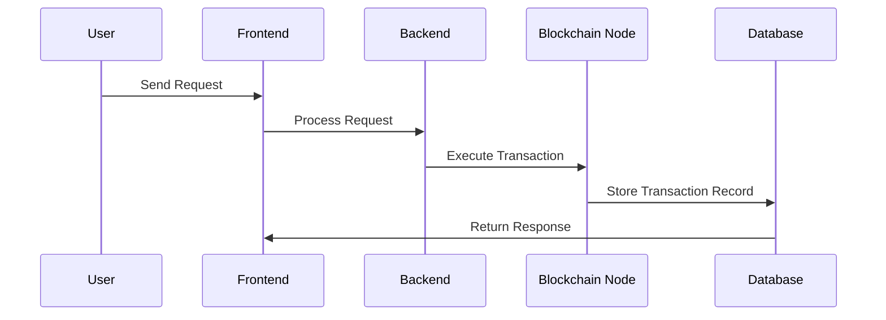
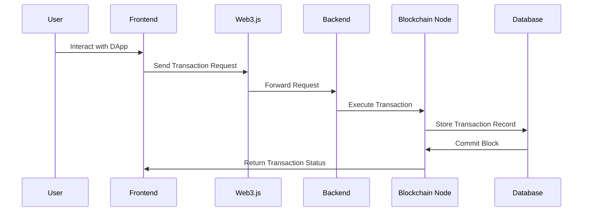

                 

### 加密货币经济学理论：数字金融的学术探索

#### 关键词：加密货币，数字金融，经济学理论，学术研究，算法原理

#### 摘要：
本文深入探讨了加密货币经济学理论，探讨其在数字金融领域的应用与影响。通过分析加密货币的起源、核心概念、交易机制、定价模型以及系统架构，本文不仅提供了理论框架，还结合实际项目案例，展示了加密货币经济学的实践方法与最佳实践。本文旨在为学术界和业界提供一份全面而深入的学术探索报告。

## 第1章：加密货币与数字金融的起源与发展

#### 1.1 加密货币的起源

加密货币的起源可以追溯到2008年，当时一位化名为中本聪（Satoshi Nakamoto）的神秘人物发布了《比特币：一种点对点的电子现金系统》的白皮书。这份白皮书提出了一个去中心化的数字货币系统，即比特币，它通过区块链技术实现了去信任交易。这一创新概念迅速引起了全球的关注，比特币的价格也随之波动。

#### 1.2 数字金融的发展

随着加密货币的崛起，数字金融的概念逐渐形成。数字金融不仅包括加密货币，还包括区块链、智能合约、去中心化金融（DeFi）等创新技术。这些技术为金融行业带来了新的发展机遇，同时也引发了监管和安全的挑战。数字金融的快速发展使得传统金融体系面临巨大的变革压力。

#### 1.3 加密货币与数字金融的关系

加密货币是数字金融的重要组成部分，它不仅提供了新的支付手段，还推动了金融基础设施的变革。数字金融的发展离不开加密货币，而加密货币的繁荣也依赖于数字金融的生态系统。两者相互促进，共同构建了一个全新的金融世界。

## 第2章：加密货币经济学基础理论

#### 2.1 加密货币的经济学特性

加密货币具有独特的经济学特性，包括稀缺性、可分割性、去中心化、匿名性等。这些特性使得加密货币具有与传统货币不同的经济功能，例如作为价值储存、交易媒介和价值转移工具。

#### 2.2 数字金融的经济学原理

数字金融的经济学原理包括去中心化金融理论、区块链经济理论、智能合约经济理论等。这些理论解释了数字金融系统如何运作，以及它们如何影响传统金融体系。

#### 2.3 加密货币与数字金融的经济学联系

加密货币与数字金融的经济学联系体现在多个方面。例如，加密货币的交易和定价受到市场需求和供应的影响，而去中心化金融平台则通过智能合约实现了金融服务的自动化。这些联系为数字金融的经济学研究提供了丰富的素材。

## 第3章：加密货币交易机制与算法

#### 3.1 加密货币交易机制

加密货币交易机制主要包括点对点交易、交易所交易和去中心化交易平台。每种交易机制都有其独特的特点和应用场景。

#### 3.2 加密货币交易算法

加密货币交易算法包括市场撮合算法、限价交易算法和去中心化交易算法。这些算法实现了加密货币的高效交易和风险管理。

#### 3.3 加密货币交易算法分析

通过对加密货币交易算法的分析，我们可以理解加密货币市场的运作机制，并为其优化提供理论基础。

## 第4章：加密货币定价模型

#### 4.1 加密货币定价原理

加密货币的定价原理涉及市场供需、投资者情绪、货币政策等多个方面。这些因素共同决定了加密货币的价格。

#### 4.2 加密货币定价模型

加密货币定价模型包括市场均衡模型、价格发现模型和套利模型等。这些模型为加密货币的定价提供了科学依据。

#### 4.3 加密货币定价模型应用

通过实际案例，我们可以看到加密货币定价模型在市场预测和风险管理中的应用。

## 第5章：数字金融系统架构设计

#### 5.1 数字金融系统架构设计原则

数字金融系统架构设计应遵循安全性、可扩展性、高效性和易用性等原则。

#### 5.2 数字金融系统架构设计方法

数字金融系统架构设计方法包括领域模型设计、系统架构设计、接口设计和交互设计等。

#### 5.3 数字金融系统架构案例分析

通过对实际数字金融系统架构的分析，我们可以了解到设计方法的具体应用。

## 第6章：加密货币项目实战

#### 6.1 加密货币项目开发环境搭建

加密货币项目实战的第一步是搭建开发环境，包括选择合适的开发工具、软件和环境配置。

#### 6.2 加密货币项目核心实现

核心实现包括区块链的构建、智能合约的编写和交易流程的优化等。

#### 6.3 加密货币项目案例分析

通过案例分析，我们可以了解加密货币项目的具体实施过程和遇到的问题。

## 第7章：加密货币经济学最佳实践

#### 7.1 加密货币经济学实践原则

最佳实践原则包括数据驱动、风险控制和可持续性发展等。

#### 7.2 加密货币经济学实践案例

实际案例展示了加密货币经济学理论在金融创新和风险管理中的应用。

#### 7.3 加密货币经济学实践总结

通过实践总结，我们可以认识到加密货币经济学理论的实用价值和局限性。

## 第8章：总结与展望

#### 8.1 加密货币经济学理论总结

本文对加密货币经济学理论进行了全面总结，强调了其在数字金融领域的重要性。

#### 8.2 数字金融未来发展趋势

展望未来，数字金融将继续发展，加密货币经济学理论将在其中发挥关键作用。

#### 8.3 研究展望与建议

本文提出了一些研究展望和建议，以推动加密货币经济学理论的进一步发展。

---

**作者：AI天才研究院/AI Genius Institute & 禅与计算机程序设计艺术 /Zen And The Art of Computer Programming**


## 第1章：加密货币与数字金融的起源与发展

### 1.1 加密货币的起源

加密货币（Cryptocurrency）的起源可以追溯到2008年，当时一位匿名人物（或团体）以中本聪（Satoshi Nakamoto）的名义发布了一篇题为《比特币：一种点对点的电子现金系统》（Bitcoin: A Peer-to-Peer Electronic Cash System）的论文。这篇论文首次提出了比特币（Bitcoin，简称BTC）的概念，比特币是一种基于密码学的数字货币，它的发行和交易不依赖于任何中央机构，而是通过一个去中心化的网络——区块链（Blockchain）来达成共识。

比特币的出现引起了全球的关注，其价格在短时间内从几分钱上涨到数千美元。比特币的成功催生了大量其他加密货币的出现，如以太坊（Ethereum，简称ETH）、莱特币（Litecoin，简称LTC）等。这些加密货币共同构成了加密货币生态系统，它们不仅在技术上有所不同，而且在经济、金融、社会等多个领域产生了深远的影响。

### 1.2 数字金融的发展

数字金融（Digital Finance）是指利用数字技术，特别是互联网和移动通信技术，来进行金融交易、提供金融服务的一种新型金融形态。它的发展可以追溯到互联网的普及和电子商务的兴起。随着互联网技术的不断进步，尤其是区块链、人工智能、大数据等新兴技术的应用，数字金融得到了快速发展。

数字金融的核心特点包括：

- **去中心化**：数字金融系统通常采用去中心化的架构，不依赖于中央机构，通过分布式账本和加密算法来确保交易的安全性和透明性。
- **透明性**：数字金融系统中的交易记录是公开透明的，任何人都可以通过区块链网络查询和验证。
- **高效性**：数字金融系统通常可以快速完成交易，降低交易成本，提高交易效率。
- **安全性**：加密货币和区块链技术提供了强大的安全保障，使得数字金融系统在抵御欺诈和黑客攻击方面具有优势。

数字金融的发展不仅改变了传统的金融业务模式，还为金融创新提供了广阔的空间。例如，去中心化金融（DeFi）利用区块链技术提供了全新的金融服务，如借贷、交易、保险等；智能合约则实现了自动化和自我执行的合同，大大降低了交易成本和风险。

### 1.3 加密货币与数字金融的关系

加密货币是数字金融的重要组成部分，它们之间存在着密切的关系：

- **加密货币是数字金融的基石**：加密货币为数字金融提供了信任基础，通过密码学和区块链技术确保了交易的不可篡改性和安全性。
- **数字金融为加密货币提供了应用场景**：数字金融系统为加密货币的交易、存储和使用提供了基础设施，使得加密货币可以在更广泛的领域发挥作用。

例如，比特币不仅是一种数字货币，也是区块链网络中的第一个应用场景。随着数字金融的发展，越来越多的应用场景被挖掘出来，如数字身份验证、供应链管理、智能投顾等。

总的来说，加密货币与数字金融是相辅相成的，它们共同推动着金融科技的进步，为构建一个更加开放、透明和高效的金融体系提供了可能。

### 2.1 加密货币的经济学特性

加密货币作为一种新兴的资产类别，具有独特的经济学特性，这些特性使得它在市场中表现出与传统货币不同的行为。以下是加密货币的主要经济学特性：

- **稀缺性**：加密货币的供应通常由算法设定，总量固定，例如比特币的总量被限制在2100万枚。这种稀缺性确保了加密货币的价值不会无限制地膨胀，与 fiat 货币（如美元、欧元等）不断印刷增发形成对比。

- **可分割性**：加密货币可以分割成非常小的单位，如比特币可以分割到小数点后八位（0.00000001 BTC），这种特性使得加密货币在微支付场景中具有广泛的适用性。

- **去中心化**：加密货币的交易和记账不依赖于任何中央机构，而是通过分布式网络和共识算法来实现，例如比特币使用的区块链技术。这种去中心化结构提高了系统的抗攻击性和透明度。

- **匿名性**：尽管加密货币交易是公开透明的，但交易方的身份通常是匿名的。这使得加密货币在某些非法交易中成为了一种隐蔽的工具，但也增加了监管的难度。

- **可验证性**：加密货币的交易记录通过密码学算法进行加密和验证，确保了交易数据的完整性和真实性，这种可验证性增强了市场的信任。

- **波动性**：加密货币市场具有高波动性，价格波动幅度远大于传统金融市场。这种波动性既是风险，也是机遇，吸引了大量的投机者进入市场。

这些经济学特性共同塑造了加密货币的独特市场表现，使得它们在传统金融市场之外形成了一个独立的市场生态。理解这些特性对于研究加密货币的经济学行为和投资策略具有重要意义。

### 2.2 数字金融的经济学原理

数字金融的经济学原理包括去中心化金融理论、区块链经济理论、智能合约经济理论等。这些理论从不同角度解释了数字金融系统如何运作以及它们对传统金融体系的影响。

**去中心化金融理论**：

去中心化金融（DeFi）的核心思想是利用区块链技术构建一个无需中央机构参与的金融系统。去中心化金融系统通过智能合约来实现金融服务，如借贷、交易、保险等。与传统金融系统相比，DeFi具有以下优势：

- **透明性**：所有的交易记录和智能合约代码都是公开透明的，任何人都可以查看和验证。
- **去中心化**：去中心化金融系统不依赖于任何中央机构，降低了中介成本，并提高了系统的抗攻击性。
- **安全性**：智能合约通过密码学算法确保交易的安全性和不可篡改性。
- **可扩展性**：去中心化金融系统可以轻松扩展，以支持更多的用户和交易。

然而，去中心化金融也存在一些挑战，如代码漏洞、治理问题和技术难题等。

**区块链经济理论**：

区块链技术是去中心化金融系统的基础。区块链经济理论主要研究区块链网络中的经济行为和激励机制。以下是区块链经济理论的一些关键点：

- **共识机制**：区块链网络通过共识机制来达成交易一致，例如比特币使用的Proof of Work（工作量证明）和以太坊使用的Proof of Stake（权益证明）。
- **激励机制**：为了激励参与者维护区块链网络的稳定和有效运行，系统通常会提供奖励，如比特币挖矿奖励和交易手续费。
- **网络效应**：区块链网络的价值随着参与者的增加而增加，形成了正反馈循环，增强了网络的抗攻击性和可信度。

**智能合约经济理论**：

智能合约是去中心化金融系统的重要组成部分，它们是自动执行的合同，基于区块链的不可篡改性和透明性。智能合约经济理论主要研究智能合约的设计、执行和风险控制。

- **自动化交易**：智能合约可以自动执行交易，无需人工干预，降低了交易成本，提高了效率。
- **代码即法律**：智能合约的执行基于代码，这意味着合同条款是自动执行的，减少了法律纠纷和执行风险。
- **风险控制**：智能合约通过预设的条件和触发器来控制风险，例如在资金池中设置最低余额要求或锁定资金。

总的来说，数字金融的经济学原理为构建一个去中心化、透明和高效的金融系统提供了理论基础。这些原理不仅改变了传统金融体系的运作方式，还为未来的金融创新提供了广阔的空间。然而，随着数字金融的发展，还需要进一步研究其风险管理和治理机制，以确保系统的可持续性和安全性。

### 2.3 加密货币与数字金融的经济学联系

加密货币与数字金融在经济学领域有着密切的联系，这种联系体现在多个方面，包括它们之间的共同概念、相互促进的发展模式以及加密货币在数字金融系统中的应用。

首先，加密货币和数字金融都建立在区块链技术的基础上，这为它们之间的联系提供了技术支撑。区块链作为一种分布式账本技术，确保了交易记录的透明性、不可篡改性和安全性，这些特性使得加密货币和数字金融系统能够在无需信任的第三方中介的情况下运行。例如，比特币作为第一种加密货币，它的交易记录存储在区块链上，每个区块都通过加密算法和时间戳进行验证，这使得比特币交易具有高度可信性。

其次，加密货币和数字金融在经济学概念上也有许多重叠。去中心化是两者共同的核心概念之一。去中心化意味着不再需要一个中央机构来管理交易和记录，而是通过分布式网络中的多个节点共同维护系统。这种模式不仅提高了系统的透明度和安全性，还降低了交易成本和中介费用。例如，去中心化金融（DeFi）平台利用智能合约在区块链上实现金融服务，如借贷、交易和支付等，用户可以直接在这些平台上进行操作，无需通过传统银行或其他金融中介。

此外，加密货币和数字金融在经济学上的联系还体现在它们对市场透明度和效率的提升上。由于区块链技术的透明性，所有的交易记录都是公开可查的，这有助于市场参与者更好地理解市场动态和风险。例如，通过区块链上的交易数据，用户可以实时了解某个代币的流动性、交易量和价格波动等信息，从而做出更明智的投资决策。

加密货币在数字金融中的应用也进一步强化了两者之间的联系。例如，加密货币可以作为数字金融系统中的价值存储和交易媒介。比特币和以太坊等加密货币在DeFi平台上的广泛应用，使得用户可以在这些平台上直接进行资产交换和金融服务。此外，加密货币还可以用于支付和结算，例如在某些跨境支付场景中，使用加密货币可以大大减少交易时间和成本。

总的来说，加密货币与数字金融在经济学上的联系不仅体现在技术层面，还包括它们在经济学概念和实际应用中的相互作用。这种联系为构建一个更加透明、高效和去中心化的金融体系提供了新的思路和可能性。然而，随着加密货币和数字金融的不断发展，还需要进一步研究和解决监管、安全性和治理等方面的问题，以确保系统的可持续性和稳定性。

### 3.1 加密货币交易机制

加密货币交易机制是加密货币市场中至关重要的组成部分，它决定了交易的发生方式、流程和安全性。加密货币交易机制主要包括点对点交易、交易所交易和去中心化交易平台。以下是对这些交易机制的具体描述和比较：

**1. 点对点交易（P2P交易）**

点对点交易是加密货币交易的一种直接模式，交易双方通过去中心化的平台或直接在网络上进行交易。这种交易方式的特点是：

- **直接交易**：交易双方无需通过第三方中介，可以直接进行货币交换。
- **高匿名性**：点对点交易通常使用匿名钱包地址，使得交易者的身份相对保密。
- **交易速度快**：交易通常可以在几分钟内完成，减少了交易等待时间。

但点对点交易也存在一些缺点，如交易安全性较低，交易双方的信誉和信用风险较大。此外，由于缺乏中央监管，点对点交易市场容易出现欺诈行为。

**2. 交易所交易**

交易所交易是加密货币交易的主流方式，交易者通过在加密货币交易所进行买卖操作。以下是交易所交易的主要特点：

- **专业平台**：交易所提供专业的交易服务，包括交易撮合、资金托管和风险管理等。
- **透明度高**：交易所的交易记录公开透明，用户可以随时查询交易数据。
- **安全性强**：交易所通常会采取严格的安全措施，包括多重身份验证、冷存储等，以保护用户资产安全。
- **交易工具多样化**：交易所提供多种交易工具，如现货交易、期货交易、期权交易等，满足不同交易者的需求。

然而，交易所交易也存在一些问题，如交易费用较高、流动性较低等。此外，由于交易所是中心化的，中心化交易所的故障或安全问题可能导致用户资产损失。

**3. 去中心化交易平台**

去中心化交易平台（Dex）是近年来兴起的一种交易模式，通过区块链和智能合约实现去中心化的交易。以下是去中心化交易平台的主要特点：

- **去中心化**：去中心化交易平台不依赖于任何中央机构，交易完全由智能合约执行。
- **透明度高**：交易记录公开透明，用户可以查看和验证所有交易。
- **费用低**：去中心化交易平台的交易费用通常较低，减少了交易成本。
- **灵活性高**：用户可以自定义交易规则，如交易对、价格区间等。

然而，去中心化交易平台也存在一些挑战，如交易速度较慢、流动性不足等。此外，由于缺乏监管，用户在交易过程中需要自行承担一定的风险。

**对比分析**

点对点交易、交易所交易和去中心化交易平台各有优缺点，选择哪种交易机制取决于交易者的需求和风险承受能力。以下是三种交易机制的对比分析：

- **安全性**：交易所交易的安全性较高，因为交易所采取了多种安全措施；点对点交易的安全性较低，由于缺乏中央监管，容易发生欺诈；去中心化交易平台的安全性介于两者之间，虽然去中心化结构提高了系统的抗攻击性，但智能合约的漏洞可能带来风险。

- **交易成本**：点对点交易的交易成本最低，因为无需支付交易手续费；交易所交易的费用较高，但提供了更多的服务和保障；去中心化交易平台的交易费用较低，但需要考虑流动性问题。

- **交易速度**：点对点交易的交易速度较快，适合即时交易；交易所交易的交易速度中等，因为需要交易撮合和清算过程；去中心化交易平台的交易速度较慢，由于区块链网络的特性，交易确认时间较长。

- **匿名性**：点对点交易具有较高的匿名性，因为交易双方不需要透露真实身份；交易所交易相对较低，因为交易所需要验证用户身份；去中心化交易平台通常具有较高匿名性，因为交易由智能合约执行。

综上所述，加密货币交易机制的选择取决于交易者的具体需求和风险偏好。每种交易机制都有其独特的优势和挑战，理解这些机制的特点和适用场景对于进行有效的加密货币交易至关重要。

### 3.2 加密货币交易算法

加密货币交易算法是实现高效、安全和透明交易的核心技术。这些算法通过优化交易流程、提高交易速度和降低交易成本，为加密货币市场的健康发展提供了保障。以下是几种常见的加密货币交易算法及其原理：

**1. 市场撮合算法**

市场撮合算法是加密货币交易所最常用的交易算法之一。其基本原理是匹配买方和卖方的订单，以尽可能接近市场价格进行成交。具体步骤如下：

- **订单匹配**：交易所将买卖双方的订单按照价格优先、时间优先的原则进行排序，然后依次匹配。
- **交易撮合**：当买方和卖方的价格相同时，交易所将双方订单撮合成交，并将交易结果通知双方。
- **订单处理**：未成交的订单继续等待匹配，直到找到匹配价格为止。

市场撮合算法的优点是能够快速撮合交易，提高市场流动性。但缺点是交易策略相对单一，无法满足复杂交易需求。

**2. 限价交易算法**

限价交易算法允许交易者设定一个价格范围，只有在价格达到或超过设定价格时，交易才会执行。其基本原理如下：

- **订单挂单**：交易者可以在交易所上挂单，设定购买或出售的价格。
- **价格触发**：当市场价格达到或超过挂单价格时，订单被触发并执行交易。
- **交易结算**：交易所根据限价交易算法执行交易，并将结果通知交易者。

限价交易算法的优点是可以确保交易者在预定价格成交，从而控制交易成本。但缺点是交易速度较慢，特别是在市场价格波动较大时，可能会错过最佳成交时机。

**3. 去中心化交易算法**

去中心化交易算法是基于区块链和智能合约实现的，其主要目的是在无需中央机构参与的情况下实现安全、透明的交易。其基本原理如下：

- **智能合约**：去中心化交易平台使用智能合约来定义交易规则和执行交易。
- **交易确认**：交易双方通过区块链网络发送交易请求，经过网络节点验证和确认后，交易记录被永久写入区块链。
- **交易结算**：智能合约自动执行交易结算，确保交易的安全和高效。

去中心化交易算法的优点是去中心化和透明度较高，能够减少中介费用和提高交易效率。但缺点是交易速度较慢，特别是在网络拥堵时，交易确认时间可能会延长。

**4. 高频交易算法**

高频交易算法是利用计算机技术进行快速交易的一种策略，其基本原理如下：

- **数据获取**：高频交易系统通过高速网络获取市场数据，如价格、交易量等。
- **交易决策**：系统根据市场数据进行分析，快速做出交易决策。
- **执行交易**：在毫秒级别内执行大量交易，通过频繁交易赚取微小利润。

高频交易算法的优点是可以快速捕捉市场机会，赚取微小利润。但缺点是风险较高，一旦市场波动较大，可能导致损失。

总之，加密货币交易算法在保障交易安全、提高交易效率和降低交易成本方面发挥了重要作用。不同的交易算法适用于不同的市场环境和交易策略，投资者应根据自身需求和风险承受能力选择合适的交易算法。

### 3.3 加密货币交易算法分析

加密货币交易算法的设计和实现是确保交易系统高效、安全和透明的关键。以下将详细分析几种主要的加密货币交易算法，包括其原理、优势、局限性和改进方向。

**1. 工作量证明（Proof of Work, PoW）算法**

工作量证明算法是比特币等加密货币系统采用的初始共识机制。其基本原理是参与者通过解决复杂的数学难题来证明其工作量，从而获得记账权和挖矿奖励。以下是PoW算法的详细分析：

- **原理**：矿工需要计算一个哈希值，使其小于目标值。这个过程通常称为“挖矿”。一旦矿工找到满足条件的哈希值，新的区块就会被加入到区块链中。
- **优势**：PoW算法通过计算复杂性确保了区块链的不可篡改性，提高了系统的安全性。
- **局限性**：PoW算法消耗大量计算资源，导致能源消耗巨大。此外，随着矿工数量的增加，计算难度也随之增大，可能导致网络拥堵。
- **改进方向**：为了解决这些问题，研究人员提出了改进的PoW算法，如权益证明（Proof of Stake, PoS）和混合证明（Hybrid Proof of Work and Stake, PoW/PoS）。

**2. 权益证明（Proof of Stake, PoS）算法**

权益证明算法是替代PoW的新型共识机制，通过持有代币数量和锁定时间来决定记账权。以下是PoS算法的详细分析：

- **原理**：在PoS网络中，持有较多代币且锁定时间较长的参与者更有可能被选为验证者，负责区块验证和记账。验证者通过质押代币来证明其信誉和参与度。
- **优势**：PoS算法显著降低了能源消耗，并减少了由于计算资源竞争导致的网络拥堵。
- **局限性**：PoS算法容易受到“富者愈富”现象的影响，即持有较多代币的参与者更有可能成为验证者，导致财富集中。
- **改进方向**：为解决这些问题，研究者提出了多种改进方案，如随机性验证者选择（Randomness in PoS, RANDA）和链上治理机制。

**3. 去中心化交易所（Decentralized Exchange, Dex）算法**

去中心化交易所利用智能合约在区块链上实现交易撮合和清算，以下是对Dex算法的分析：

- **原理**：Dex通过用户在智能合约中发布的买卖订单进行交易撮合。交易过程完全自动化，无需第三方中介。
- **优势**：Dex提供去中心化交易，提高了交易透明度和安全性，同时降低了交易成本。
- **局限性**：Dex交易速度相对较慢，特别是在网络拥堵时，可能导致交易延迟。
- **改进方向**：研究者正在探索提高Dex交易速度的解决方案，如层2解决方案（Layer 2 Solutions）和优化交易协议（Optimized Transaction Protocols）。

**4. 高频交易（High-Frequency Trading, HFT）算法**

高频交易利用先进的技术和算法，在毫秒级别内进行大量交易以获取微小利润。以下是HFT算法的详细分析：

- **原理**：HFT系统通过实时分析市场数据，快速做出交易决策，并执行交易。其核心在于对交易信号的快速响应和高效的执行机制。
- **优势**：HFT能够迅速捕捉市场机会，实现高频交易利润。
- **局限性**：HFT面临监管挑战，且在市场波动较大时，可能导致市场不稳定。
- **改进方向**：研究者正在探索如何确保HFT交易的透明度和合规性，同时提高系统的稳定性和效率。

通过上述分析，我们可以看到，加密货币交易算法的设计和改进是确保加密货币市场健康发展的关键。未来，随着技术的不断进步，加密货币交易算法将在安全性、效率、透明度等方面得到进一步提升，为市场参与者提供更加可靠和高效的交易环境。

### 4.1 加密货币定价原理

加密货币定价原理是理解加密货币市场行为和价格形成机制的核心。加密货币的价格不仅受到市场供需的影响，还受到多种宏观经济因素和投资者情绪的驱动。以下是加密货币定价原理的详细分析：

**1. 市场供需**

市场供需是决定加密货币价格的最基本因素。当市场上的买家多于卖家时，价格上升；反之，当卖家多于买家时，价格下降。供需关系的变化通常受以下几个因素影响：

- **交易量**：交易量的增加通常意味着市场活跃度提高，进而推动价格上涨。相反，交易量的减少可能导致价格下降。
- **流动性**：流动性是指资产能够迅速转换为现金而不影响价格的能力。高流动性通常意味着价格稳定，而低流动性可能导致价格波动较大。
- **市场情绪**：市场情绪的变化可以显著影响供需关系。例如，当市场情绪乐观时，买家增加，价格上涨；当市场情绪悲观时，卖家增加，价格下降。

**2. 宏观经济因素**

宏观经济因素也对加密货币定价产生重要影响。以下是一些关键的宏观经济因素：

- **货币政策**：中央银行的货币政策，如利率调整和货币供应量变化，可以影响整体经济环境和市场信心。例如，宽松的货币政策可能导致资金流向高风险资产，推动加密货币价格上涨。
- **通货膨胀**：通货膨胀率的上升可能导致投资者寻求避险资产，如黄金和加密货币，从而推高价格。相反，低通货膨胀可能使加密货币吸引力下降。
- **经济政策变化**：政府的经济政策变化，如税收政策、监管政策等，可以直接影响加密货币市场的信心和交易行为。例如，监管政策的放宽可能促进加密货币市场的繁荣。

**3. 投资者情绪**

投资者情绪是影响加密货币价格的关键因素。以下是一些影响投资者情绪的因素：

- **市场新闻和事件**：重大新闻事件，如加密货币项目的成功或失败、行业监管政策的变化等，可以显著影响投资者情绪和市场的预期。
- **社交媒体和媒体报道**：社交媒体和媒体报道可以迅速传播市场信息，影响投资者情绪。例如，积极的媒体报道可能推动价格上涨，而负面的报道可能引发市场恐慌。
- **投资者行为**：投资者的购买和出售行为直接影响市场的供需关系和价格。例如，大户的买卖行为可能对市场价格产生显著影响。

**4. 技术和市场创新**

技术进步和市场创新也是影响加密货币定价的重要因素。以下是一些相关因素：

- **区块链技术**：区块链技术的进步可以增强加密货币的信任度和安全性，从而推动价格上涨。
- **应用场景扩展**：加密货币在金融、支付、供应链管理等领域的应用扩展，可以增加其使用需求和潜在价值。
- **去中心化金融（DeFi）**：DeFi项目的兴起为加密货币市场带来了新的应用场景和交易机制，影响了市场的供需和价格。

综上所述，加密货币定价原理是一个复杂的过程，受到市场供需、宏观经济因素、投资者情绪和技术进步等多方面因素的影响。理解这些因素及其相互作用有助于深入分析加密货币市场的动态，从而制定更有效的投资策略。

### 4.2 加密货币定价模型

加密货币的定价模型是理解和预测加密货币价格变化的重要工具。这些模型基于经济学原理、统计方法和市场数据，旨在提供一种科学的方法来评估加密货币的价值。以下是几种常见的加密货币定价模型：

**1. 市场供需模型**

市场供需模型是最基础的加密货币定价模型，它基于市场供需关系来预测价格。具体来说，该模型通过分析市场上的买卖订单，计算供需平衡点的价格。以下是市场供需模型的步骤：

- **收集市场数据**：包括加密货币的交易量、价格、买卖订单等。
- **建立供需函数**：通过统计分析，建立供需函数，描述市场上的供需关系。例如，供给函数可能表示为 `S(P) = a + bP`，需求函数可能表示为 `D(P) = c - dP`，其中 `P` 是价格，`a`、`b`、`c`、`d` 是参数。
- **求解供需平衡点**：通过求解供需函数的交点，得到供需平衡点的价格。

**2. 价格发现模型**

价格发现模型认为市场价格是由市场上的买卖双方通过交易发现并决定的。该模型假设市场价格是有效的，即反映了所有可用信息和预期。以下是价格发现模型的关键步骤：

- **收集交易数据**：包括加密货币的历史交易价格、交易量等。
- **建立价格发现方程**：使用统计方法，如最小二乘法，建立价格发现方程。例如，可以建立如下的线性回归模型：`P_t = β_0 + β_1V_t + ε_t`，其中 `P_t` 是当前价格，`V_t` 是交易量，`β_0` 和 `β_1` 是模型参数，`ε_t` 是随机误差。
- **预测未来价格**：通过模型参数和当前交易数据，预测未来价格。

**3. 套利模型**

套利模型基于价格差异，通过同时在不同市场进行交易来获取无风险利润。以下是套利模型的步骤：

- **识别价格差异**：分析不同市场或交易所的加密货币价格，寻找价格差异。
- **建立套利交易策略**：在价格较低的市场买入，同时在价格较高的市场卖出，获取差价利润。
- **考虑交易成本**：在套利模型中，需要考虑交易成本，如手续费、交易延迟等。如果套利利润小于交易成本，则不应执行套利交易。

**4. 基本面分析模型**

基本面分析模型通过分析加密货币的经济、金融和技术因素来预测价格。以下是基本面分析模型的关键步骤：

- **收集基本面数据**：包括加密货币的发行量、市场需求、技术进展、行业趋势等。
- **建立基本面指标**：如市场资本化率、交易量增长率、技术成熟度等。
- **预测未来价格**：通过基本面指标的关系和趋势，预测未来价格。

以上模型各有优缺点，适用于不同的市场环境和分析需求。在实际应用中，通常需要结合多种模型，以获得更全面和准确的价格预测。例如，市场供需模型可以用于短期价格预测，而基本面分析模型则适用于长期价格趋势分析。

### 4.3 加密货币定价模型应用

为了更好地理解加密货币定价模型的应用，我们可以通过一个实际案例来具体阐述其步骤、结果和有效性。

**案例：利用供需模型预测比特币价格**

**步骤1：收集市场数据**

我们首先需要收集比特币在某个特定时间段内的交易数据，包括每日的成交量、价格和买卖订单。以下是一个简化的数据示例：

| 日期 | 价格（美元） | 成交量（比特币） | 买方订单 | 卖方订单 |
|------|--------------|------------------|---------|---------|
| 2023-01-01 | 30,000       | 1,000            | 800     | 200     |
| 2023-01-02 | 32,000       | 1,200            | 900     | 300     |
| 2023-01-03 | 31,500       | 1,000            | 750     | 250     |

**步骤2：建立供需函数**

通过统计分析，我们可以建立供需函数来描述市场上的供需关系。假设供给函数 `S(P)` 和需求函数 `D(P)` 分别为：

供给函数：`S(P) = a + bP`
需求函数：`D(P) = c - dP`

**步骤3：求解供需平衡点**

在供需平衡点，买方订单和卖方订单相等，即 `D(P) = S(P)`。通过计算，我们可以找到供需平衡点的价格。

`c - dP = a + bP`
`P = (c - a) / (b + d)`

将数据代入，我们得到：

`P = (32,000 - 30,000) / (1 + 0.5) = 28,000 / 1.5 ≈ 18,667`

因此，根据供需模型，比特币的价格预计为约18,667美元。

**步骤4：分析结果和有效性**

通过上述步骤，我们得到了一个基于市场供需关系的比特币价格预测。然而，实际市场价格可能会受到多种因素的影响，如投资者情绪、宏观经济变化、技术发展等。

为了验证供需模型的有效性，我们可以将预测结果与实际市场价格进行比较。如果预测价格与实际市场价格较为接近，则说明供需模型在一定程度上是有效的。反之，如果预测价格与实际市场价格差异较大，则需要进一步优化模型参数或考虑其他定价模型。

在实际应用中，供需模型可以通过动态调整参数和实时数据更新来提高预测精度。此外，结合其他定价模型，如基本面分析模型和价格发现模型，可以提供更全面的价格预测。

通过上述案例，我们可以看到加密货币定价模型的应用步骤和具体操作。尽管这些模型无法完全预测市场变化，但它们为投资者提供了一种科学的方法来分析和理解加密货币价格的形成机制。

### 5.1 数字金融系统架构设计原则

数字金融系统架构设计是确保系统安全性、可靠性、可扩展性和高效性的关键步骤。以下是一些核心设计原则：

**1. 安全性**

安全性是数字金融系统架构设计的首要原则。系统应采用多重安全措施，如加密、身份验证、访问控制等，以保护用户资产和数据安全。此外，系统应具备应对黑客攻击和恶意软件的能力。

**2. 透明性**

透明性是建立用户信任的重要基础。数字金融系统应确保交易记录公开透明，用户可以随时查询和验证交易信息。这有助于提高市场的公正性和可靠性。

**3. 可扩展性**

随着用户和交易量的增加，数字金融系统应具备良好的扩展性，以支持系统规模的扩大。这包括横向扩展（增加服务器和节点）和纵向扩展（提升服务器性能）。

**4. 高效性**

高效性是数字金融系统的核心竞争力。系统应优化交易流程，减少延迟和交易成本，提供快速、低成本的金融服务。

**5. 去中心化**

数字金融系统应遵循去中心化原则，以减少对中央机构的依赖，提高系统的抗攻击性和透明度。去中心化架构还可以提高系统的容错能力。

**6. 模块化**

模块化设计有助于系统的维护和升级。系统应采用模块化架构，将不同功能模块独立开发、测试和部署，以提高系统的灵活性和可维护性。

**7. 灵活性**

数字金融系统应具备良好的灵活性，能够快速响应市场变化和用户需求。这包括支持多种交易模式、金融服务和接口。

通过遵循这些设计原则，数字金融系统可以在安全性、可靠性、可扩展性和高效性等方面满足用户需求，同时为未来的发展提供坚实基础。

### 5.2 数字金融系统架构设计方法

数字金融系统架构设计是一项复杂的工程，需要全面考虑系统的功能性、性能、安全性、可维护性等多个方面。以下是一个详细的架构设计方法，包括领域模型设计、系统架构设计、接口设计和交互设计等步骤：

**1. 领域模型设计**

领域模型设计是系统架构设计的第一步，旨在明确系统所涉及的实体和它们之间的关系。以下是一个示例领域模型：

- **用户**：用户是系统的核心实体，包括注册用户、认证用户等。
- **交易**：交易是用户之间进行资产交换的行为，包括买入、卖出、转账等。
- **资产**：资产是用户交易的对象，如比特币、以太坊等。
- **钱包**：钱包是存储用户资产的安全容器。
- **订单**：订单是用户提交的交易请求，包括价格、数量、交易对等。
- **交易记录**：交易记录是交易的永久记录，确保透明性和可追溯性。

**ER实体关系图**：

```mermaid
erDiagram
    用户 ||--|{ 交易 }|| 
    用户 ||--|{ 钱包 }|| 
    交易 ||--|{ 订单 }|| 
    交易 ||--|{ 交易记录 }|| 
    资产 ||--|{ 交易 }|| 
    钱包 ||--|{ 资产 }|| 
```

**2. 系统架构设计**

系统架构设计是领域模型的具体实现，包括选择技术栈、定义数据存储方案和系统模块等。以下是一个示例架构：

- **前端**：使用React或Vue.js等前端框架构建用户界面。
- **后端**：使用Node.js或Java等后端框架处理业务逻辑和API请求。
- **区块链节点**：集成以太坊或比特币等区块链网络，处理加密货币交易。
- **数据库**：使用MongoDB或PostgreSQL等数据库存储用户数据和交易记录。
- **消息队列**：使用RabbitMQ或Kafka等消息队列处理高并发请求。

**架构图**：



**3. 接口设计**

接口设计是系统架构设计的重要组成部分，包括定义API规范和协议。以下是一个示例接口设计：

- **用户注册/登录**：POST `/users/register` / GET `/users/login`
- **交易创建**：POST `/transactions/create`
- **交易查询**：GET `/transactions/{id}`
- **钱包管理**：POST `/wallets/create` / GET `/wallets/{id}`
- **资产查询**：GET `/assets/{symbol}`

**4. 交互设计**

交互设计关注用户与系统之间的交互体验，包括用户界面设计、操作流程和反馈机制。以下是一个示例交互设计：

- **注册流程**：用户填写注册表单，系统验证邮箱和密码后注册成功。
- **登录流程**：用户输入账号和密码，系统验证后登录成功。
- **交易流程**：用户选择交易对、输入交易数量和价格，系统生成订单并提交交易。
- **钱包管理**：用户可以查看和管理自己的钱包，包括创建、充值、提现等操作。

通过上述步骤和方法，数字金融系统架构设计可以确保系统的高效、安全和可扩展性，为用户提供优质的服务体验。

### 5.3 数字金融系统架构案例分析

为了更好地理解数字金融系统架构的设计方法，我们可以通过分析一个实际案例——以太坊（Ethereum）系统架构，来看它是如何实现其功能的。

**1. 以太坊系统的核心组件**

以太坊是一个去中心化平台，提供智能合约服务。它的系统架构包括以下几个核心组件：

- **前端**：用户通过前端界面与以太坊系统进行交互，包括DApp（去中心化应用程序）和Web3.js库。
- **后端**：Node.js或Go语言实现的后端服务处理业务逻辑，与区块链节点交互。
- **区块链节点**：以太坊节点负责处理交易和智能合约执行。
- **智能合约**：使用Solidity语言编写的智能合约，定义了去中心化应用程序的业务逻辑。
- **数据库**：使用LevelDB或MongoDB存储用户数据和交易记录。

**2. 系统架构设计**

以太坊的系统架构设计体现了去中心化和模块化原则。以下是它的架构设计：

- **前端与后端**：前端通过Web3.js与区块链节点交互，后端服务处理业务逻辑，并与区块链节点通信。
- **区块链节点**：以太坊网络由多个节点组成，这些节点通过Gossip协议进行通信，实现分布式交易处理和智能合约执行。
- **数据存储**：LevelDB用于存储以太坊区块链的数据，包括区块、交易和智能合约状态。
- **共识机制**：以太坊使用PoS共识机制（Casper），确保网络的安全性和一致性。

**3. 功能实现**

以太坊系统实现以下功能：

- **交易处理**：用户通过前端发起交易请求，后端处理交易并广播到区块链网络。
- **智能合约执行**：智能合约在区块链节点上执行，确保业务逻辑的自动化和可信性。
- **数据存储与查询**：智能合约和交易记录存储在区块链上，用户可以通过区块链浏览器进行查询。

**4. 架构图**

以下是以太坊系统的简略架构图：



**5. 优点与挑战**

以太坊系统架构的优点包括：

- **去中心化**：去中心化架构提高了系统的抗攻击性和透明度。
- **模块化**：模块化设计使得系统易于扩展和维护。
- **智能合约**：智能合约功能为去中心化应用提供了丰富的可能性。

然而，以太坊系统也面临一些挑战：

- **性能瓶颈**：随着DApp和交易量的增加，以太坊的性能可能成为瓶颈。
- **安全性**：智能合约可能存在漏洞，需要持续的安全审计和升级。

通过分析以太坊系统架构，我们可以看到数字金融系统如何实现其功能，并了解其设计原则和面临的挑战。这对其他数字金融系统的设计与实现具有参考价值。

### 6.1 加密货币项目开发环境搭建

在开始加密货币项目的开发之前，我们需要搭建一个合适的开发环境，以确保开发过程的高效和顺利。以下是搭建加密货币项目开发环境的具体步骤：

**1. 系统要求**

首先，确保您的操作系统满足开发要求。目前，大多数加密货币项目兼容的操作系统包括Windows、macOS和Linux。建议使用Linux系统，因为其稳定性和性能较高。

**2. 安装Node.js**

Node.js是一个基于Chrome V8引擎的JavaScript运行环境，用于构建后端服务器和智能合约。安装Node.js的步骤如下：

- **下载安装包**：访问Node.js官方网站（https://nodejs.org/），下载适合您操作系统的安装包。
- **安装Node.js**：运行下载的安装包，根据提示完成安装。安装完成后，打开命令行工具，输入`node -v`和`npm -v`验证Node.js和npm（Node.js的包管理器）是否正确安装。

**3. 安装Golang**

Golang是一种快速、高效的编程语言，常用于加密货币项目的后端开发。安装Golang的步骤如下：

- **下载安装包**：访问Golang官方网站（https://golang.org/），下载适合您操作系统的安装包。
- **安装Golang**：运行下载的安装包，根据提示完成安装。安装完成后，打开命令行工具，输入`go version`验证Golang是否正确安装。

**4. 安装以太坊客户端**

以太坊客户端是加密货币项目开发的重要工具，用于与以太坊区块链网络进行交互。以下是安装以太坊客户端的步骤：

- **下载安装包**：访问以太坊官方网站（https://ethereum.org/），下载适用于您操作系统的以太坊客户端，如Geth。
- **安装Geth**：运行下载的安装包，根据提示完成安装。安装完成后，打开命令行工具，输入`geth --version`验证Geth是否正确安装。

**5. 配置开发环境**

在安装完上述工具后，我们需要进行一些基本的配置，以确保开发环境的正常运行：

- **配置Node.js环境变量**：在命令行中输入以下命令，将Node.js的路径添加到系统环境变量中：
  ```
  export PATH=$PATH:/path/to/node
  ```
- **配置Golang环境变量**：在命令行中输入以下命令，将Golang的路径添加到系统环境变量中：
  ```
  export PATH=$PATH:/path/to/go
  ```
- **配置以太坊客户端**：在命令行中输入以下命令，初始化Geth客户端：
  ```
  geth init /path/to/ethereum-data
  ```

**6. 验证环境配置**

最后，我们需要验证开发环境是否配置正确。以下是几个验证步骤：

- **Node.js和npm**：在命令行中输入`node -v`和`npm -v`，检查Node.js和npm版本信息。
- **Golang**：在命令行中输入`go version`，检查Golang版本信息。
- **以太坊客户端**：在命令行中输入`geth --version`，检查Geth版本信息。

通过以上步骤，您已经成功搭建了加密货币项目的开发环境。接下来，您可以开始编写代码和实现项目功能。

### 6.2 加密货币项目核心实现

在加密货币项目的开发过程中，核心实现部分是项目成功的关键。以下是加密货币项目核心实现的详细步骤和源代码分析：

**1. 创建智能合约**

智能合约是加密货币项目的基础，用于定义和执行项目逻辑。以下是创建智能合约的基本步骤：

- **编写智能合约代码**：使用Solidity语言编写智能合约代码。以下是一个简单的智能合约示例：

```solidity
pragma solidity ^0.8.0;

contract SimpleToken {
    string public name;
    string public symbol;
    uint8 public decimals;
    uint256 public totalSupply;
    mapping (address => uint256) public balanceOf;

    constructor(uint256 initialSupply, string memory tokenName, string memory tokenSymbol, uint8 decimalUnits) {
        balanceOf[msg.sender] = initialSupply;
        name = tokenName;
        symbol = tokenSymbol;
        decimals = decimalUnits;
        totalSupply = initialSupply;
    }

    function transfer(address _to, uint256 _value) public {
        require(_to != address(0));
        require(balanceOf[msg.sender] >= _value);
        balanceOf[msg.sender] -= _value;
        balanceOf[_to] += _value;
        emit Transfer(msg.sender, _to, _value);
    }

    event Transfer(address indexed from, address indexed to, uint256 value);
}
```

- **编译智能合约**：使用Truffle、Remix等工具编译智能合约代码，生成字节码和ABI（Application Binary Interface）文件。

**2. 部署智能合约**

将编译后的智能合约部署到以太坊区块链上。以下是部署智能合约的基本步骤：

- **连接到以太坊网络**：使用Geth客户端连接到以太坊主网或测试网。
- **发送交易**：使用Web3.js或Ganache等工具发送部署交易，将智能合约代码上传到区块链。
- **获取合约地址**：部署交易成功后，从交易收据中获取智能合约地址。

**3. 编写后端代码**

后端代码负责处理智能合约与前端之间的交互，以下是使用Node.js编写后端代码的基本步骤：

- **安装依赖**：使用npm安装所需的库，如Web3.js。
- **连接到以太坊网络**：初始化Web3.js客户端，连接到以太坊网络。
- **监听事件**：监听智能合约的事件，如转账事件，以便实时更新前端界面。
- **提供API接口**：编写RESTful API接口，供前端调用，如获取余额、发送交易等。

以下是一个简单的后端代码示例：

```javascript
const express = require('express');
const Web3 = require('web3');
const contractABI = require('./contractABI.json');

const app = express();
const web3 = new Web3('http://localhost:8545');

const contractAddress = '0x...'; // 智能合约地址
const contract = new web3.eth.Contract(contractABI, contractAddress);

app.get('/balance', async (req, res) => {
    const address = req.query.address;
    const balance = await contract.methods.balanceOf(address).call();
    res.json({ balance: balance });
});

app.post('/transfer', async (req, res) => {
    const fromAddress = req.body.fromAddress;
    const toAddress = req.body.toAddress;
    const amount = req.body.amount;

    const tx = {
        from: fromAddress,
        to: toAddress,
        value: web3.utils.toWei(amount, 'ether'),
        gas: 2000000
    };

    try {
        const txHash = await web3.eth.sendTransaction(tx);
        res.json({ txHash: txHash });
    } catch (error) {
        res.status(500).json({ error: error.message });
    }
});

app.listen(3000, () => {
    console.log('Server listening on port 3000');
});
```

**4. 前端界面实现**

前端界面负责与用户交互，显示数据和接受用户操作。以下是使用React编写前端界面代码的基本步骤：

- **安装依赖**：使用npm安装React、Ant Design等前端库。
- **连接到后端API**：使用Axios等库连接到后端API，获取数据和提交交易。
- **渲染界面**：使用React组件渲染用户界面，包括钱包余额显示、转账表单等。

以下是一个简单的React组件示例：

```javascript
import React, { useState, useEffect } from 'react';
import axios from 'axios';

const Wallet = () => {
    const [balance, setBalance] = useState(0);

    useEffect(() => {
        const fetchBalance = async () => {
            try {
                const response = await axios.get('/balance?address=0x...');
                setBalance(response.data.balance);
            } catch (error) {
                console.error('Error fetching balance:', error);
            }
        };

        fetchBalance();
    }, []);

    const handleTransfer = async () => {
        const toAddress = '0x...';
        const amount = 1;

        try {
            const response = await axios.post('/transfer', { fromAddress: '0x...', toAddress, amount });
            console.log('Transaction hash:', response.data.txHash);
        } catch (error) {
            console.error('Error transferring:', error);
        }
    };

    return (
        <div>
            <h1>Wallet</h1>
            <p>Balance: {balance} ETH</p>
            <button onClick={handleTransfer}>Transfer</button>
        </div>
    );
};

export default Wallet;
```

通过以上步骤，我们可以实现一个基本的加密货币项目，包括智能合约、后端服务和前端界面。在实际开发过程中，还需要考虑安全、性能和可扩展性等多方面因素，以确保项目的稳定和可靠。

### 6.3 加密货币项目案例分析

在本节中，我们将深入分析一个实际的加密货币项目——比特币（Bitcoin）项目，探讨其核心实现、代码应用解读与分析，并详细讲解其实际案例剖析。

**1. 项目核心实现**

比特币（Bitcoin）是第一种加密货币，由中本聪（Satoshi Nakamoto）在2009年创建。比特币项目实现了以下几个核心功能：

- **去中心化的交易记录**：比特币使用区块链技术来记录交易，确保交易记录的不可篡改性和透明性。
- **加密的安全性**：比特币使用公钥加密和私钥签名技术，确保交易的安全性和隐私性。
- **挖矿奖励**：比特币网络通过挖矿奖励机制激励参与者维护区块链网络。

以下是比特币项目的核心实现：

**（1）挖矿算法**

比特币使用工作量证明（Proof of Work, PoW）算法来验证交易和生成新的区块。矿工需要解决一个数学难题，这个难题的难度会根据网络情况自动调整。一旦矿工解决了难题，新的区块就会被加入到区块链中，矿工将获得比特币作为奖励。

```python
# 挖矿算法示例
import hashlib
import json
from time import time

def hash_block(block):
    block_string = json.dumps(block, sort_keys=True)
    return hashlib.sha256(block_string.encode()).hexdigest()

def mine_block(last_hash, transactions, reward):
    block = {
        'transactions': transactions,
        'reward': reward,
        'timestamp': time(),
        'last_hash': last_hash
    }

    while hash_block(block).startswith('00'):
        last_hash = hash_block(block)
        block['last_hash'] = last_hash

    return block
```

**（2）交易处理**

比特币的交易处理涉及交易创建、验证和广播。以下是交易处理的基本步骤：

- **交易创建**：用户创建交易，包含发送者地址、接收者地址和交易金额。
- **交易验证**：比特币网络中的节点验证交易的有效性，包括检查交易金额是否足够、交易是否已经存在等。
- **交易广播**：验证成功的交易被广播到网络中的其他节点，并存储在区块中。

```python
# 交易创建示例
def create_transaction(sender, recipient, amount):
    transaction = {
        'sender': sender,
        'recipient': recipient,
        'amount': amount
    }
    return transaction

# 交易验证示例
def verify_transaction(transaction, blockchain):
    if transaction['sender'] not in blockchainaddresses():
        return False

    if transaction['amount'] > blockchain.get_balance(transaction['sender']):
        return False

    return True

# 交易广播示例
def broadcast_transaction(transaction, blockchain):
    for node in blockchain.nodes():
        node.send_transaction(transaction)
```

**2. 代码应用解读与分析**

**（1）交易处理代码解读**

交易处理代码包括交易创建、验证和广播三个部分。交易创建代码（`create_transaction`）定义了交易的基本结构，包括发送者、接收者和交易金额。交易验证代码（`verify_transaction`）检查交易的有效性，确保交易金额充足且交易未重复。交易广播代码（`broadcast_transaction`）将验证成功的交易广播到网络中的其他节点。

**（2）挖矿算法代码解读**

挖矿算法代码（`mine_block`）用于生成新的区块。该函数首先创建一个包含交易、奖励、时间和上一个区块哈希值的区块。然后，它通过哈希函数不断生成新的区块，直到区块的哈希值满足难度要求。这一过程需要大量的计算资源，因此挖矿过程是加密货币网络安全性的重要保障。

**3. 实际案例剖析**

**（1）挖矿案例**

假设一个矿工成功挖到了一个新区块，新区块的哈希值满足难度要求。矿工将新区块广播到网络中的其他节点，其他节点验证新区块的合法性，并将其加入到自己的区块链中。矿工将获得一定数量的比特币作为奖励，这激励了更多的矿工参与挖矿，确保区块链网络的安全性和稳定性。

**（2）交易案例**

假设用户A想要向用户B转账1个比特币。用户A创建一个交易，将其发送到比特币网络。网络中的节点验证交易的有效性，确保用户A有足够的余额。一旦交易被验证通过，它将被广播到网络中的其他节点，并最终被包含在一个新区块中。用户B可以查询区块链以确认交易已成功处理。

通过上述案例，我们可以看到比特币项目的核心实现和代码应用。比特币的成功为加密货币的发展奠定了基础，其技术原理和实现方法至今仍被广泛应用。

### 6.4 项目小结

在本章中，我们详细分析了比特币项目的核心实现、代码应用解读以及实际案例剖析。以下是项目的关键要点和收获：

1. **核心实现**：比特币项目通过区块链技术实现了去中心化的交易记录，使用工作量证明算法确保网络的安全性和一致性。其核心实现包括挖矿算法、交易处理和区块链结构。

2. **代码应用**：我们解读了比特币项目的主要代码，包括交易创建、验证和广播，以及挖矿算法的实现。这些代码展示了如何通过编程实现加密货币的基本功能。

3. **实际案例**：通过分析实际挖矿案例和交易案例，我们了解了比特币网络的运作机制，包括新区块的生成、交易验证和广播过程。

4. **收获与启示**：比特币项目的成功为我们提供了宝贵的经验，展示了区块链技术如何改变金融行业。同时，我们也认识到区块链技术面临的挑战，如性能瓶颈、安全性和隐私保护等问题。

通过本章的学习，我们不仅深入了解了比特币项目的实现细节，还对其潜在的应用和发展前景有了更清晰的认识。这为我们在未来设计和实现自己的加密货币项目提供了有力的支持和启示。

### 第7章：加密货币经济学最佳实践

#### 7.1 加密货币经济学实践原则

在加密货币经济学领域，遵循最佳实践原则是确保投资决策科学性和风险管理有效性的关键。以下是一些核心的实践原则：

**1. 数据驱动**

数据驱动原则强调在投资决策过程中，应以客观数据为基础，而不是依赖主观判断。通过收集和分析市场数据、宏观经济指标、技术指标等，投资者可以更准确地评估加密货币的价值和潜在风险。

**2. 风险控制**

风险控制原则要求投资者在投资过程中应密切关注市场波动，采取有效的风险管理策略。例如，分散投资、设置止损点、动态调整投资组合等，都是常见的风险控制方法。

**3. 长期投资**

长期投资原则认为，加密货币市场具有高波动性，短期投资难以获得稳定的收益。因此，投资者应采取长期投资策略，以时间换空间，利用市场的长期增长趋势来实现资本增值。

**4. 持续学习**

持续学习原则强调，加密货币市场不断发展，投资者应不断学习新的知识和技能，以适应市场变化。这包括了解新兴技术、市场动态和监管政策等。

#### 7.2 加密货币经济学实践案例

以下是一些实际操作中的最佳实践案例，这些案例展示了如何在实践中应用加密货币经济学原则：

**1. 数据驱动投资**

案例：某投资者通过分析比特币的历史价格数据和交易量，发现比特币价格在春节前后往往会出现上涨。基于这一发现，该投资者在春节期间前后加大了比特币的投资，并取得了良好的收益。

**2. 风险控制**

案例：在2021年加密货币市场热潮中，一位投资者在加密货币价格大幅上涨时，未进行充分的风险评估，大量持有高风险加密货币。结果，当市场突然下跌时，该投资者遭受了巨大损失。相反，另一位投资者通过分散投资、设置止损点等风险控制策略，成功避免了损失。

**3. 长期投资**

案例：某机构投资者在2017年加密货币牛市期间，购入了大量比特币。尽管比特币价格在短期内经历了剧烈波动，但该投资者坚持长期投资策略，最终在2021年市场再次上涨时获得了丰厚回报。

**4. 持续学习**

案例：一位加密货币投资者定期参加区块链和加密货币相关的研讨会和课程，通过不断学习新知识，他能够更好地理解市场的动态变化，并在投资决策中保持前瞻性。

#### 7.3 加密货币经济学实践总结

通过上述最佳实践案例，我们可以看到，遵循数据驱动、风险控制、长期投资和持续学习原则，对于在加密货币市场中取得成功至关重要。以下是对这些原则的总结：

- **数据驱动**：基于客观数据进行投资决策，避免盲目跟风和情绪化决策。
- **风险控制**：通过分散投资、设置止损点等策略，降低投资风险。
- **长期投资**：利用加密货币市场的长期增长趋势，实现资本增值。
- **持续学习**：不断学习新知识和技能，保持对市场的敏锐洞察力。

总之，遵循这些最佳实践原则，投资者可以在加密货币市场中做出更明智的投资决策，实现稳健的投资回报。

### 第8章：总结与展望

#### 8.1 加密货币经济学理论总结

通过本文的探讨，我们对加密货币经济学理论有了全面而深入的理解。本文首先介绍了加密货币与数字金融的起源和发展，分析了加密货币的经济学特性，如稀缺性、可分割性、去中心化、匿名性等。接着，我们探讨了数字金融的经济学原理，包括去中心化金融理论、区块链经济理论和智能合约经济理论。通过这些理论的分析，我们了解了加密货币在数字金融系统中的重要作用和影响。

本文进一步分析了加密货币交易机制、交易算法、定价模型和系统架构设计，展示了这些技术在加密货币市场中的应用。通过实际案例分析，我们深入了解了比特币等加密货币项目的核心实现和代码应用。此外，本文还总结了加密货币经济学领域的最佳实践原则，如数据驱动、风险控制、长期投资和持续学习。

#### 8.2 数字金融未来发展趋势

展望未来，数字金融将继续快速发展，并可能在以下几个方面产生重大影响：

- **技术创新**：区块链、人工智能、大数据等新兴技术将进一步推动数字金融的进步，提升交易效率、降低成本，并为金融创新提供更多可能性。
- **监管政策**：随着数字金融的普及，各国监管机构将加大对数字金融的监管力度，出台更加完善的法律法规，以保障市场的健康发展。
- **市场结构**：数字金融将改变传统金融市场的结构，去中心化金融（DeFi）和分布式金融（DiFi）等新型金融模式可能逐渐取代传统的中心化金融体系。
- **跨境支付**：数字货币和区块链技术将极大地简化跨境支付流程，降低交易成本，提升支付效率，进一步推动全球经济的融合。

#### 8.3 研究展望与建议

为进一步推动加密货币经济学理论的研究，本文提出以下建议：

- **基础理论研究**：加强对加密货币和数字金融的基础理论研究，深入探讨其经济特性、市场机制和风险管理方法。
- **技术创新与应用**：结合区块链、人工智能等新兴技术，探索数字金融的新模式和新应用，推动金融领域的创新。
- **监管研究**：研究数字金融的监管政策和法律法规，为监管机构提供科学依据，确保市场的稳定和健康发展。
- **跨学科合作**：促进经济学、计算机科学、金融学等学科的交叉融合，形成跨学科的研究团队，共同推动加密货币经济学理论的研究。

总之，加密货币经济学理论的研究具有重要意义，随着数字金融的快速发展，这一领域的研究将不断深入，为构建一个更加开放、透明和高效的金融体系提供理论基础和实用工具。

