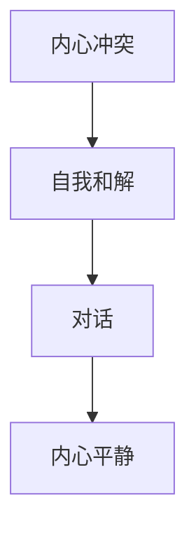

                 

# 化解内心冲突的对话：自我和解的有效方式

## 关键词
- 内心冲突
- 自我和解
- 对话技术
- 心理健康
- 人际关系

## 摘要
本文深入探讨了内心冲突及其对心理健康的影响，并介绍了自我和解的概念和重要性。通过剖析对话技术在自我和解中的应用，本文提出了具体的方法和技巧，帮助读者掌握有效的自我和解策略，提升心理素质和人际关系质量。

## 第一部分：引言

### 1. 引言

#### 1.1 问题背景

内心冲突是人类普遍存在的心理现象。无论是个人生活还是职业发展，内心冲突都可能对我们的情绪和行为产生负面影响。例如，职场压力、人际关系矛盾、自我认知冲突等都可能导致内心焦虑、抑郁等心理问题。

#### 1.1.1 内心冲突的普遍性

内心冲突并不是个例，而是广泛存在于各个年龄层、社会阶层和职业领域。根据心理学研究，大约80%的人在其一生中都会经历某种形式的内心冲突。

#### 1.1.2 心理健康的重要性

心理健康不仅影响个体的生活质量，还与整体社会和谐密切相关。维护心理健康，提高心理素质，是实现个人全面发展和社会进步的必要条件。

#### 1.1.3 内心冲突的负面后果

内心冲突如果得不到有效解决，可能会导致以下负面后果：
- 情绪困扰：焦虑、抑郁、愤怒等情绪问题。
- 行为偏差：逃避、冲动、攻击等行为问题。
- 身体健康：长期的心理压力可能导致身体疾病。

#### 1.2 问题描述

内心冲突的表现形式多种多样，可能包括：
- 自我矛盾：对自己的期望与现实之间的冲突。
- 人际关系冲突：与他人的价值观、利益、沟通方式等方面的冲突。
- 职业发展冲突：职业目标与实际工作条件、职业发展路径之间的冲突。

内心冲突的影响范围广泛，不仅限于个人层面，还可能对家庭、团队、组织乃至整个社会产生深远影响。

#### 1.3 问题解决

面对内心冲突，我们需要采取有效的解决策略。自我和解是其中一种重要的方式，它旨在通过对话技术来化解内心的矛盾和冲突。

#### 1.3.1 自我和解的定义

自我和解是指个体通过自我反思、自我对话和自我调整等过程，实现内心的和谐与平衡，从而化解内心的冲突。

#### 1.3.2 自我和解的目标

自我和解的目标是：
- 提高心理健康水平，减少心理压力。
- 增强自我认知和自我接纳能力。
- 提升人际交往能力和团队合作效果。
- 促进职业发展和个人成长。

#### 1.3.3 自我和解的方法

自我和解的方法包括：
- 自我对话：通过内在的思考和对话，理解自己的感受、需求和期望。
- 自我反思：回顾自己的行为和决策，分析其背后的动机和影响。
- 自我调整：根据自我反思的结果，调整自己的行为和态度，以达到内心的和解。

#### 1.4 边界与外延

自我和解有其特定的边界和适用范围，它主要关注个体内心的和解，但也可以扩展到人际关系的调解和团队内部的冲突解决。

### 2. 核心概念

#### 2.1 核心概念1：内心冲突

##### 2.1.1 概念定义

内心冲突是指个体内在的矛盾和对抗，通常表现为情绪上的焦虑、不安和痛苦。

##### 2.1.2 属性特征对比表格

| 特征           | 描述                                                         |
| -------------- | ------------------------------------------------------------ |
| 类型           | 包括自我矛盾、人际关系冲突、职业发展冲突等。                   |
| 表现形式       | 情绪困扰、行为偏差、身体健康问题等。                         |
| 产生原因       | 职场压力、人际关系矛盾、自我认知冲突等。                     |
| 影响           | 对心理健康、人际关系、职业发展产生负面影响。                 |

#### 2.2 核心概念2：自我和解

##### 2.2.1 概念定义

自我和解是指个体通过自我反思、自我对话和自我调整等过程，实现内心的和谐与平衡，从而化解内心的冲突。

##### 2.2.2 属性特征对比表格

| 特征           | 描述                                                         |
| -------------- | ------------------------------------------------------------ |
| 类型           | 自我对话、自我反思、自我调整等。                             |
| 目标           | 提高心理健康、增强自我认知、提升人际交往能力、促进职业发展。 |
| 原理           | 心理学、社会学理论为基础。                                  |
| 适用范围       | 个体内心冲突的化解，也可以扩展到人际关系的调解和团队内部的冲突解决。 |

### 2.3 ER实体关系图架构

## 第二部分：对话技术基础

### 3. 对话技术概述

#### 3.1 对话技术的定义与类型

##### 3.1.1 对话技术的定义

对话技术是指通过语言、文字、表情、动作等方式进行沟通交流的一系列方法和技术。

##### 3.1.2 对话技术的类型

对话技术可以分为以下几种类型：
- 语言对话：包括口头对话和书面对话。
- 非语言对话：包括肢体语言、表情、眼神等。
- 数字对话：通过电子设备进行的对话，如邮件、即时通讯、社交媒体等。

#### 3.2 对话技术原理

##### 3.2.1 对话原理

对话原理主要包括以下几个方面：
- 信息传递：通过对话传递信息，实现信息的交流和理解。
- 沟通协调：通过对话协调各方利益，达成共识。
- 情感表达：通过对话表达情感，增进情感交流。
- 思维碰撞：通过对话激发思维，产生新的创意和见解。

##### 3.2.2 对话流程

对话流程通常包括以下几个阶段：
1. 开场：打招呼、引入话题。
2. 表达观点：各抒己见，阐述观点。
3. 倾听理解：认真倾听，理解对方的观点。
4. 沟通协调：讨论、辩论，寻求共识。
5. 结束：总结发言，表达感谢。

#### 3.3 对话技术特点

##### 3.3.1 互动性

对话技术强调双方的互动和交流，注重信息的双向传递和理解。

##### 3.3.2 实时性

对话技术强调实时沟通，可以快速传递信息和反馈。

##### 3.3.3 个性化

对话技术可以根据不同的对话对象和情境，灵活调整沟通方式和内容。

## 4. 自我和解的理论基础

### 4.1 自我和解的概念与意义

##### 4.1.1 概念定义

自我和解是指个体通过自我反思、自我对话和自我调整等过程，实现内心的和谐与平衡，从而化解内心的冲突。

##### 4.1.2 意义分析

自我和解具有重要的心理和社会意义，具体包括：
- 提高心理健康水平，减少心理压力。
- 增强自我认知和自我接纳能力。
- 提升人际交往能力和团队合作效果。
- 促进职业发展和个人成长。

### 4.2 自我和解的理论模型

自我和解的理论模型可以从心理学和社会学两个角度进行分析。

##### 4.2.1 心理学理论模型

心理学理论模型强调个体内心的和解过程，包括自我反思、自我对话、自我调整等步骤。这一过程可以帮助个体理解自己的内心冲突，找到解决问题的方法。

##### 4.2.2 社会学理论模型

社会学理论模型强调个体在社会环境中的互动和调整。个体通过与社会环境的互动，调整自己的行为和态度，实现自我和解。

##### 4.2.3 心理学与社会学理论结合

心理学与社会学理论结合的自我和解模型认为，个体的内心冲突不仅与自身有关，也与社会环境有关。通过自我反思、自我对话和自我调整，个体可以更好地适应社会环境，实现内心的和解。

## 5. 对话在自我和解中的应用

### 5.1 对话在自我和解中的作用

##### 5.1.1 对话的作用

对话在自我和解中具有重要的作用，具体包括：
- 帮助个体理解自己的内心冲突。
- 促进个体自我反思和自我调整。
- 提供一种有效的沟通方式，帮助个体与他人和解。

##### 5.1.2 对话在自我和解中的重要性

对话在自我和解中具有重要意义，具体包括：
- 提供一个安全的环境，让个体自由表达自己的感受和想法。
- 促进个体与他人建立良好的关系，获得支持和理解。
- 帮助个体实现自我成长和自我实现。

### 5.2 不同类型的对话方式

##### 5.2.1 自我对话

自我对话是指个体与自己进行的对话，通过自我反思、自我提问和自我回答等方式，了解自己的内心冲突和需求。

##### 5.2.2 与他人的对话

与他人的对话是指个体与他人进行的对话，通过沟通、协调和理解，实现内心的和解。

##### 5.2.3 团体对话

团体对话是指个体在团体中进行的对话，通过团体成员的互动和交流，实现内心的和解。

## 6. 实践中的对话技巧

### 6.1 对话前的准备

##### 6.1.1 心态调整

在进行对话前，个体需要调整好自己的心态，保持平静和开放。

##### 6.1.2 对话主题确定

确定对话的主题，明确对话的目标和内容。

##### 6.1.3 对话环境选择

选择一个合适的对话环境，确保对话的顺利进行。

### 6.2 对话中的沟通技巧

##### 6.2.1 倾听技巧

倾听对方的观点，理解对方的需求和感受。

##### 6.2.2 表达技巧

清晰、准确地表达自己的观点和感受。

##### 6.2.3 提问技巧

提出恰当的问题，引导对话深入。

### 6.3 对话后的反思

##### 6.3.1 对话效果的评估

评估对话的效果，了解对话是否达到了预期目标。

##### 6.3.2 对话中的收获与不足

总结对话中的收获和不足，为下次对话做好准备。

##### 6.3.3 对话后的行动

根据对话的结果，采取相应的行动，实现内心的和解。

## 7. 成功案例分享

### 7.1 案例一：个人内心冲突的化解

##### 7.1.1 案例背景

某位职场人士在职业发展和个人成长方面存在内心冲突，感到迷茫和焦虑。

##### 7.1.2 案例过程

通过自我对话和与他人对话，该人士反思自己的职业目标和价值观，调整自己的行为和态度，实现了内心的和解。

##### 7.1.3 案例结果

该人士在职业发展和个人成长方面取得了显著进步，心理压力明显减轻。

### 7.2 案例二：团队内部冲突的解决

##### 7.2.1 案例背景

某团队内部存在严重的冲突，影响团队协作和工作效率。

##### 7.2.2 案例过程

通过团体对话，团队成员坦诚交流，理解彼此的需求和立场，找到了解决冲突的方法。

##### 7.2.3 案例结果

团队内部的冲突得到有效解决，团队协作和氛围明显改善。

## 8. 结论与展望

### 8.1 主要结论

- 对话技术在自我和解中具有重要作用，可以帮助个体理解内心冲突，实现自我和解。
- 实践中的对话技巧可以帮助个体在对话中更加有效地沟通和表达。
- 成功案例表明，自我和解和对话技术在个人和团队中都有显著的积极影响。

### 8.2 展望未来

- 对话技术的发展趋势将更加注重个性化、智能化和情境适应性。
- 自我和解的实践意义将更加凸显，有助于提高心理健康水平和社会和谐度。
- 对话技术在更多领域（如教育、医疗、法律等）中的应用前景广阔。

作者：AI天才研究院/AI Genius Institute & 禅与计算机程序设计艺术 /Zen And The Art of Computer Programming

