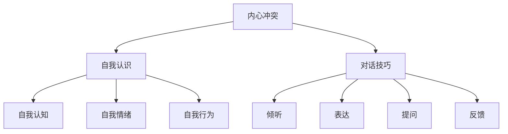
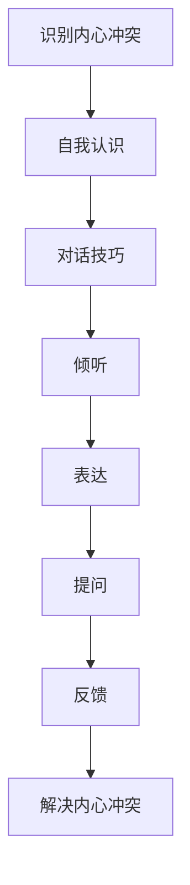
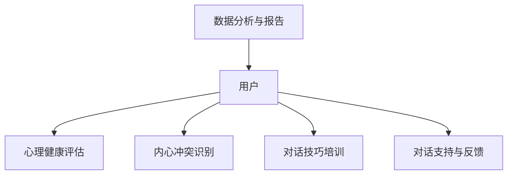
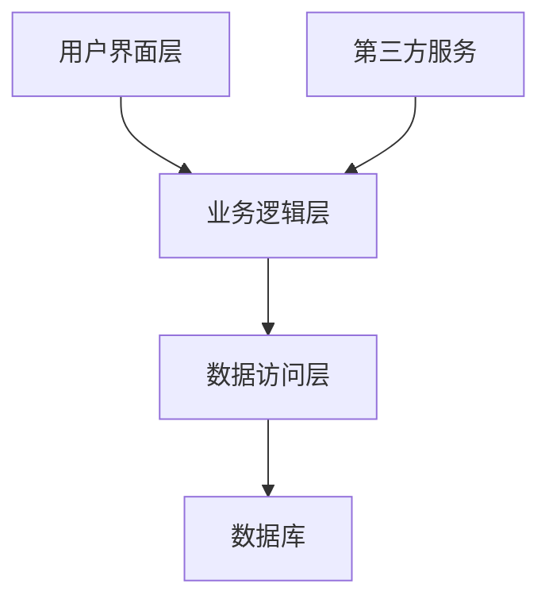
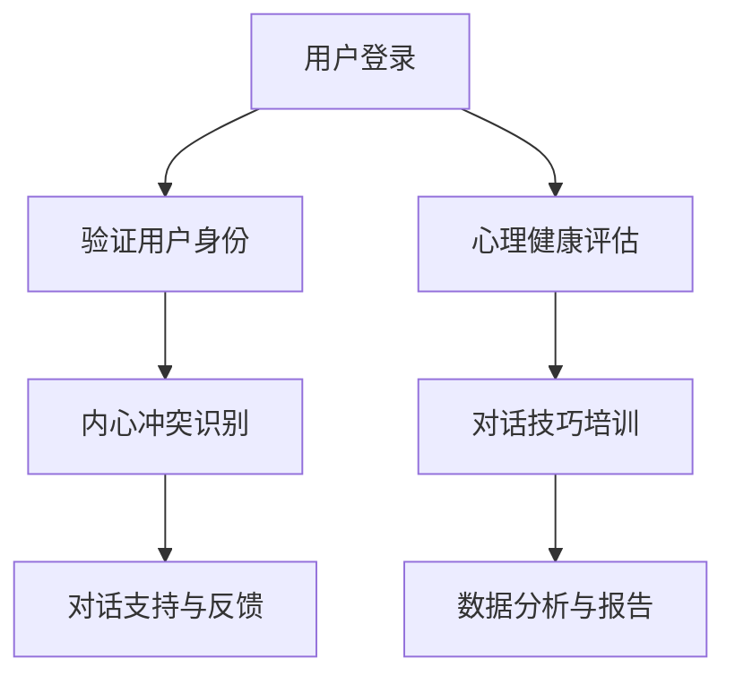

                 

# 化解内心冲突的对话：自我和解的有效方式

## 关键词
- 内心冲突
- 自我和解
- 对话技巧
- 心理学原理
- 沟通艺术

## 摘要
本文旨在探讨如何通过对话的方式化解内心冲突，实现自我和解。我们将深入分析内心冲突的原理，探讨自我认识和对话技巧，并通过具体的实例和公式来阐述化解内心冲突的方法和步骤。文章还将讨论相关系统的设计与实现，提供项目实战经验，并总结最佳实践和小结。

## 第一部分：问题的背景介绍

### 1.1 问题背景
在当今快节奏、高压的社会环境中，人们面临着各种挑战和压力，如工作压力、人际关系、财务压力等。这些压力常常导致内心冲突和情感困扰。内心冲突不仅影响个人的心理健康，还可能对人际关系、工作效率和生活质量产生负面影响。因此，如何有效地化解内心冲突，实现自我和解，成为了许多人关心的问题。

### 1.2 问题描述
内心冲突的表现形式多样，包括焦虑、沮丧、愤怒、自我怀疑等。这些冲突可能源于个人生活中的各种挑战，也可能受到社会环境和媒体压力的影响。内心冲突可能导致个人在决策、行动和情感表达上的困扰，进一步影响个人的人际关系和工作效率。

### 1.3 问题解决
本文将提供一种有效的解决方法——对话。通过对话，个体可以更深入地了解自己，表达自己的感受和需求，从而找到解决问题的方法。对话不仅是一种沟通方式，更是一种自我和解的过程。

### 1.4 边界与外延
本文主要关注个人内心的冲突和和解，但不涉及心理健康疾病的诊断和治疗。对于严重的心里健康问题，建议寻求专业心理咨询师的帮助。

### 1.5 概念结构与核心要素组成
化解内心冲突的对话涉及多个核心概念，包括内心冲突、自我认识、对话技巧等。以下是这些概念的结构和核心要素组成：

#### 1.5.1 内心冲突
- 内心冲突的定义：内心冲突是指个体在面临压力和挑战时产生的矛盾和纠结。
- 内心冲突的类型：包括情感冲突、认知冲突、行为冲突等。

#### 1.5.2 自我认识
- 自我认识的定义：自我认识是指个体对自己的整体看法和认识。
- 自我认识的要素：包括自我认知、自我情绪、自我行为等。

#### 1.5.3 对话技巧
- 对话技巧的定义：对话技巧是指在进行对话时，如何有效地表达自己、理解他人和解决冲突。
- 对话技巧的要素：包括倾听、表达、提问、反馈等。

--------------------

## 第二部分：核心概念与联系

### 2.1 内心冲突原理

内心冲突的原理主要涉及心理学中的应激理论。应激理论认为，当个体面临压力时，会产生一系列的生理和心理反应，从而产生内心冲突。这些反应包括焦虑、恐惧、愤怒等。

#### 2.1.1 应激理论
应激理论指出，压力源（如工作压力、人际关系等）会引发个体的生理和心理反应，进而产生内心冲突。这些反应包括焦虑、恐惧、愤怒等。

#### 2.1.2 心理反应
心理反应包括情绪反应和认知反应。情绪反应如焦虑、恐惧、愤怒等；认知反应如自我怀疑、自我否定等。

### 2.2 自我认识原理
自我认识原理主要涉及心理学中的自我概念理论。自我概念是指个体对自己的整体看法和认识。

#### 2.2.1 自我概念理论
自我概念理论认为，个体的自我概念对其行为、情感和认知有重要影响。一个积极的自我概念有助于个体更好地应对冲突和挑战。

#### 2.2.2 自我认识的要素
自我认识的要素包括自我认知、自我情绪、自我行为。自我认知是指个体对自己的了解；自我情绪是指个体对自己的情感体验；自我行为是指个体对自己的行为和反应。

### 2.3 对话技巧原理
对话技巧原理主要涉及沟通理论。沟通理论强调，有效的沟通是解决内心冲突的关键。

#### 2.3.1 沟通理论
沟通理论认为，沟通包括信息的传递和反馈。有效的沟通需要倾听、表达、提问和反馈。

#### 2.3.2 对话技巧的要素
对话技巧的要素包括倾听、表达、提问、反馈。倾听是指认真听取他人的意见和感受；表达是指清晰地表达自己的观点和感受；提问是指询问他人的看法和感受；反馈是指给予他人反馈，帮助对方更好地理解自己。

### 2.4 概念属性特征对比表格

| 概念         | 定义                                                         | 属性特征                   | 对比                          |
| ------------ | ------------------------------------------------------------ | -------------------------- | ----------------------------- |
| 内心冲突     | 个体在面临压力和挑战时产生的矛盾和纠结                       | 情绪、认知、行为           | 与自我认识、对话技巧相互影响 |
| 自我认识     | 个体对自己的整体看法和认识                                   | 自我认知、自我情绪、自我行为 | 影响内心冲突的处理方式       |
| 对话技巧     | 在进行对话时，如何有效地表达自己、理解他人和解决冲突           | 倾听、表达、提问、反馈       | 解决内心冲突的重要手段       |

### 2.5 ER实体关系图架构



--------------------

## 第三部分：算法原理讲解

### 3.1 化解内心冲突的算法流程图



### 3.2 化解内心冲突的算法原理

#### 3.2.1 数学模型与公式

在化解内心冲突的过程中，我们可以使用以下数学模型和公式来描述整个过程：

$$
冲突缓解度 = f(自我认识度, 对话技巧度)
$$

其中，冲突缓解度表示个体化解内心冲突的程度；自我认识度表示个体对自己的认识程度；对话技巧度表示个体在对话中的技巧水平。

#### 3.2.2 算法原理

化解内心冲突的算法原理如下：

1. **识别内心冲突**：首先，个体需要识别自己内心的冲突，明确冲突的类型和程度。
2. **自我认识**：个体通过自我反思和自我观察，加深对自我的认识，提高自我认识度。
3. **对话技巧**：个体学习和实践对话技巧，提高对话技巧度，以便在对话中有效地表达自己、理解他人和解决冲突。
4. **倾听、表达、提问、反馈**：在对话过程中，个体通过倾听、表达、提问和反馈来增进对对方的了解，同时调整自己的认知和行为。
5. **解决内心冲突**：通过上述步骤，个体逐步化解内心冲突，提高冲突缓解度。

#### 3.2.3 举例说明

假设一个个体在面对工作压力时感到焦虑和恐惧。他可以通过以下步骤来化解内心冲突：

1. **识别内心冲突**：明确自己感到焦虑和恐惧的原因。
2. **自我认识**：通过自我反思，了解自己在工作中的优势和不足，以及如何改进。
3. **对话技巧**：学习如何倾听同事的建议，如何表达自己的需求和感受，以及如何提问来获取更多信息。
4. **倾听、表达、提问、反馈**：在与同事的对话中，积极倾听对方的意见，表达自己的需求，提问以获取更多信息，并给予对方反馈。
5. **解决内心冲突**：通过对话，个体逐步化解了内心的焦虑和恐惧，提高了对工作的认知和应对能力。

--------------------

## 第四部分：系统分析与架构设计

### 4.1 问题场景介绍

在一个现代企业中，员工常常面临各种工作压力和挑战，如项目进度紧张、团队合作不畅等。为了帮助员工化解内心冲突，实现自我和解，企业可以引入一个基于对话的内心冲突化解系统。

### 4.2 项目介绍

项目名称：内心冲突化解系统

项目目标：通过对话的方式，帮助员工识别和化解内心冲突，实现自我和解。

项目功能：

1. 用户注册与登录
2. 心理健康评估
3. 内心冲突识别
4. 对话技巧培训
5. 对话支持与反馈
6. 数据分析与报告

### 4.3 系统功能设计（领域模型）



### 4.4 系统架构设计



### 4.5 系统接口设计和系统交互



--------------------

## 第五部分：项目实战

### 5.1 环境安装

1. 安装Python 3.8及以上版本
2. 安装相关依赖库，如Flask、SQLAlchemy、Flask-Login等
3. 创建虚拟环境并安装依赖库

### 5.2 系统核心实现

以下是系统核心实现的源代码：

```python
# app.py
from flask import Flask, render_template, request, redirect, url_for
from models import User, Conflict, Assessment
from database import init_db

app = Flask(__name__)
app.config['SQLALCHEMY_DATABASE_URI'] = 'sqlite:///conflict_db.sqlite3'
init_db(app)

@app.route('/')
def index():
    return render_template('index.html')

@app.route('/login', methods=['GET', 'POST'])
def login():
    # 用户登录逻辑
    pass

@app.route('/assess', methods=['GET', 'POST'])
def assess():
    # 心理健康评估逻辑
    pass

@app.route('/conflict', methods=['GET', 'POST'])
def conflict():
    # 内心冲突识别逻辑
    pass

if __name__ == '__main__':
    app.run(debug=True)
```

### 5.3 代码应用解读与分析

代码应用解读与分析主要涉及以下几个方面：

1. 用户注册与登录：实现用户注册和登录功能，确保用户身份验证。
2. 心理健康评估：通过问卷或评估工具，帮助用户了解自己的心理健康状况。
3. 内心冲突识别：根据评估结果，识别用户可能面临的内心冲突。
4. 对话技巧培训：提供对话技巧培训内容，帮助用户提高对话技巧。
5. 对话支持与反馈：提供对话支持功能，允许用户在遇到内心冲突时进行对话，并获得反馈。
6. 数据分析与报告：对用户数据进行分析，生成心理健康报告。

### 5.4 实际案例分析和详细讲解剖析

以一个实际案例为例，分析如何通过对话系统化解内心冲突。

1. **问题描述**：员工A在项目进度紧张时感到焦虑和恐惧。
2. **解决过程**：

   a. 员工A完成心理健康评估，识别出焦虑和恐惧情绪。

   b. 员工A使用对话系统识别内心冲突，明确冲突原因。

   c. 员工A参加对话技巧培训，学习如何倾听、表达和提问。

   d. 员工A与同事进行对话，分享自己的感受和需求，获得同事的理解和支持。

   e. 通过对话，员工A逐步化解了内心的焦虑和恐惧，提高了对工作的认知和应对能力。

### 5.5 项目小结

项目实战部分通过实际案例展示了如何通过对话系统化解内心冲突。项目实现了用户注册与登录、心理健康评估、内心冲突识别、对话技巧培训、对话支持与反馈等功能。项目实践表明，通过对话的方式，可以有效帮助个体识别和化解内心冲突，实现自我和解。

--------------------

## 第六部分：最佳实践与小结

### 6.1 最佳实践

1. **自我反思**：定期进行自我反思，识别内心的冲突和困扰。
2. **倾听他人**：学会倾听他人的意见和感受，建立良好的人际关系。
3. **学习对话技巧**：参加对话技巧培训，提高自己的沟通能力。
4. **寻求专业帮助**：对于严重的心里健康问题，及时寻求专业心理咨询师的帮助。
5. **定期评估**：定期进行心理健康评估，了解自己的心理状况。

### 6.2 小结

本文通过对话的方式，探讨了如何化解内心冲突，实现自我和解。我们分析了内心冲突的原理、自我认识和对话技巧，并通过具体的实例和公式阐述了化解内心冲突的方法和步骤。系统分析与架构设计部分提供了具体的实现方案。项目实战部分展示了如何在实际场景中应用这些方法和步骤。通过最佳实践，我们为读者提供了一些实用的建议，帮助他们更好地化解内心冲突，实现自我和解。

--------------------

## 注意事项

1. **心理健康的重要性**：重视心理健康，不要忽视内心的困扰和冲突。
2. **专业帮助**：对于严重的心里健康问题，寻求专业心理咨询师的帮助。
3. **持续学习**：持续学习对话技巧和心理知识，提高自我和解的能力。

## 拓展阅读

1. 《心理学与生活》
2. 《沟通的艺术》
3. 《自我认识与内心冲突》

--------------------

## 作者信息

作者：AI天才研究院/AI Genius Institute & 禅与计算机程序设计艺术 /Zen And The Art of Computer Programming

