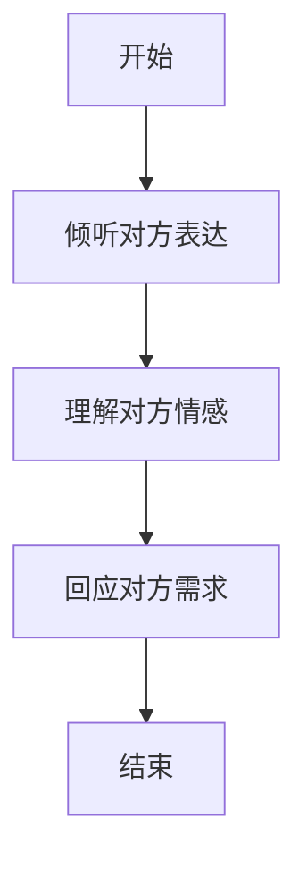
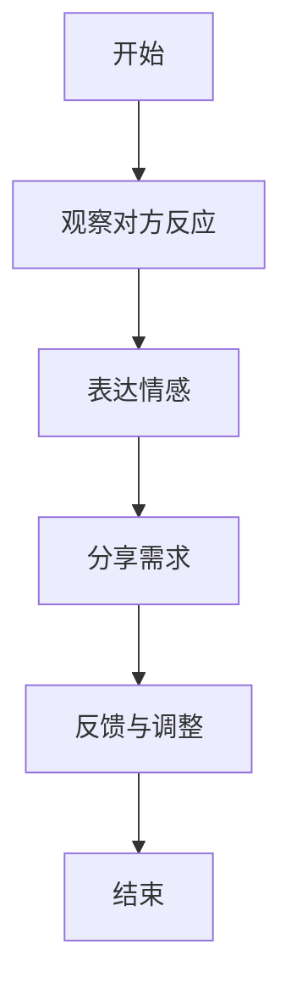
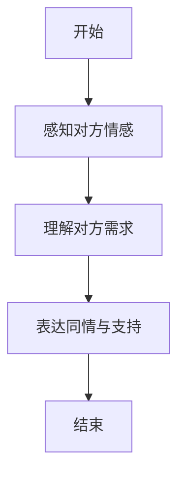
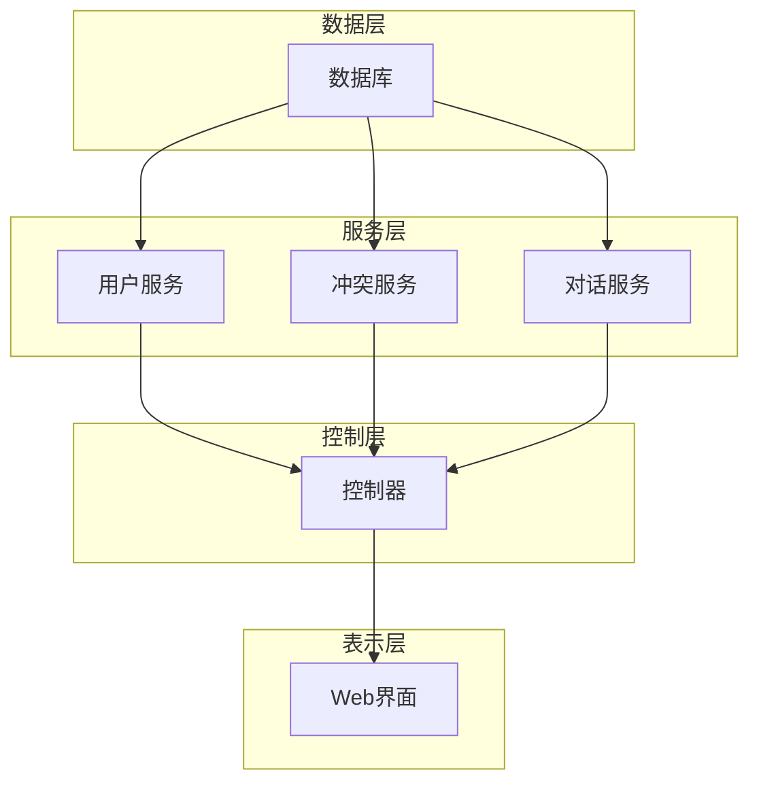
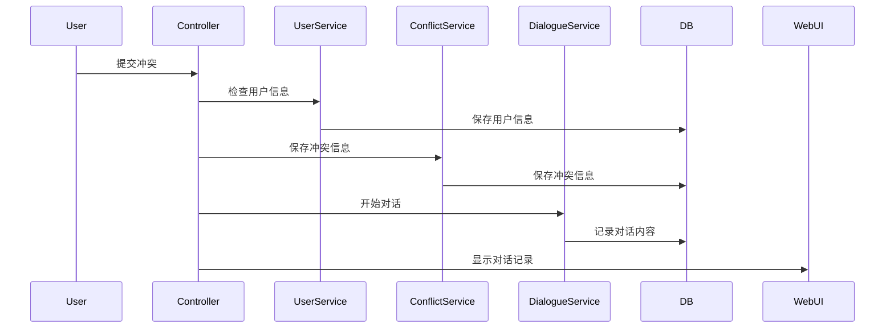

                 

### 目录大纲设计思路

在设计这份目录大纲时，我们的目标是以清晰、系统的结构来引导读者逐步深入理解“化解内心冲突：自我和解的对话技巧”这一主题。以下是具体的分析步骤和设计思路：

#### 第一步：背景介绍

- **核心概念术语说明**：首先，我们需要明确一些核心术语，如“内心冲突”、“自我意识”、“自我接纳”等，以帮助读者对文章的主题有一个初步的了解。
- **问题背景**：接下来，我们会介绍内心冲突在现代社会中的普遍性和影响，让读者意识到这一问题的现实意义。
- **问题描述**：我们将会详细描述内心冲突的表现形式和带来的困扰。
- **问题解决**：在背景介绍部分，我们将概述自我和解的概念，并探讨对话技巧在这一过程中的作用。

#### 第二步：核心概念与联系

- **概念结构**：在这一部分，我们将通过ER实体关系图和对比表格，帮助读者理解各核心概念之间的结构关系。
- **核心要素组成**：我们将详细阐述每个核心概念的定义、属性和特征，以便读者能够清晰地掌握这些概念。
- **边界与外延**：为了确保概念的准确性和适用性，我们还会讨论这些概念的边界和外延，以避免误解和歧义。

#### 第三步：对话技巧讲解

- **聆听技巧**：我们将讲解聆听技巧的原理，并通过mermaid流程图和Python源代码来阐述其在实际应用中的作用。
- **表达技巧**：这里我们会详细介绍表达技巧，包括其原理和应用，同样使用mermaid和Python源代码进行说明。
- **共情技巧**：共情是化解内心冲突的关键，我们将通过实际案例和mermaid流程图来深入讲解这一技巧。

#### 第四步：数学模型与公式讲解

- **内心冲突的数学模型**：我们将引入数学模型来量化内心冲突，通过LaTeX格式展示相关公式，并进行详细讲解。
- **对话技巧的数学模型**：同样地，我们将针对聆听、表达和共情技巧，提出相应的数学模型，并使用Python源代码进行说明。

#### 第五步：系统分析与架构设计方案

- **问题场景介绍**：我们将设定一个实际应用场景，以此为基础进行系统分析与设计。
- **系统功能设计**：使用mermaid类图来展示系统的领域模型。
- **系统架构设计**：通过mermaid架构图来展示系统的整体架构。
- **系统接口设计和系统交互**：使用mermaid序列图来详细展示系统内部和外部的交互流程。

#### 第六步：项目实战

- **项目环境与工具安装**：我们将描述项目环境的搭建和所需的工具安装步骤。
- **系统核心实现**：提供核心功能的源代码，并进行解读与分析。
- **实际案例分析**：通过具体案例来演示对话技巧和数学模型的应用。

#### 第七步：最佳实践、小结与拓展

- **最佳实践小技巧**：总结实际操作中的一些小技巧，以提高实践效果。
- **小结**：对全文内容进行总结，强调核心观点和关键技巧。
- **注意事项**：提醒读者在实践过程中需要注意的一些问题。
- **拓展阅读建议**：提供一些拓展阅读资源，以帮助读者进一步深入了解相关主题。

通过以上步骤，我们确保了目录大纲的完整性和系统性，使得读者能够按照逻辑顺序逐步深入理解文章的核心内容。每个部分的设计都旨在帮助读者形成全面、深刻的认识，从而更好地应用所学知识。

### 详细目录大纲

----------------------------------------------------------------
# 第一部分：内心冲突的背景与自我和解的重要性

## 第1章：内心冲突的起源与影响

### 1.1 内心冲突的定义与类型

#### 1.1.1 内心冲突的基本概念

**定义：**内心冲突是指个体内部存在的不同思想、情感或欲望之间的矛盾与对抗。这种冲突往往表现为焦虑、困惑、沮丧等情绪状态。

#### 1.1.2 内心冲突的类型分析

- **自我冲突**：个体内部不同自我部分之间的冲突，如理性自我与感性自我之间的矛盾。
- **人际冲突**：个体与外界环境、他人之间的冲突，如工作压力、人际关系困扰等。
- **认知冲突**：由于认知不一致而产生的冲突，如事实与期望之间的差距。

### 1.2 核心概念与联系

#### 1.2.1 自我意识

**定义：**自我意识是指个体对自己存在和身份的认知与理解，包括自我感知、自我评价和自我反思等方面。

**联系：**自我意识是内心冲突的重要基础，它决定了个体如何应对内心的矛盾和外部压力。

#### 1.2.2 自我接纳

**定义：**自我接纳是指个体对自己无条件接受和认同的态度，包括接受自己的优点和缺点，以及内在的矛盾和情绪。

**联系：**自我接纳能够帮助个体更好地处理内心冲突，减少负面情绪的影响。

### 1.3 自我和解的重要性

#### 1.3.1 自我和解的定义

**定义：**自我和解是指通过对话和反思等方式，缓解和消除内心冲突的过程。

#### 1.3.2 自我和解的作用

- **心理保健**：自我和解有助于减轻焦虑、压力和抑郁等负面情绪，提高心理健康水平。
- **社会适应**：自我和解能够增强个体的人际关系和社会适应能力，提高生活质量。

## 第2章：核心概念与联系

### 2.1 内心冲突的概念结构

#### 2.1.1 概念结构图

**ER实体关系图：**

```mermaid
erDiagram
  Person ||--|{ Emotion }|| Person : causes
  Person ||--|{ Thought }|| Person : thinks
  Emotion ||--|{ Conflict }|| Emotion : leads_to
  Thought ||--|{ Conflict }|| Thought : leads_to
```

#### 2.1.2 概念属性特征对比表格

| 概念         | 定义                                                         | 属性特征                                                   |
|--------------|--------------------------------------------------------------|------------------------------------------------------------|
| 内心冲突     | 个体内部存在的不同思想、情感或欲望之间的矛盾与对抗             | 情感冲突、认知冲突、自我冲突等                             |
| 自我意识     | 个体对自己存在和身份的认知与理解                             | 自我感知、自我评价、自我反思等                             |
| 自我接纳     | 个体对自己无条件接受和认同的态度                             | 接受自己的优点和缺点、内在矛盾和情绪等                     |
| 对话技巧     | 用于化解内心冲突的沟通方法                                   | 聆听、表达、共情等                                         |

### 2.2 内心冲突的类型与自我和解

#### 2.2.1 内心冲突的类型

- **自我冲突**：个体内部不同自我部分之间的冲突，如理性自我与感性自我之间的矛盾。
- **人际冲突**：个体与外界环境、他人之间的冲突，如工作压力、人际关系困扰等。
- **认知冲突**：由于认知不一致而产生的冲突，如事实与期望之间的差距。

#### 2.2.2 自我和解的方法

- **反思**：通过自我反思，了解内心的冲突和原因。
- **对话**：与他人进行真诚的对话，分享内心的感受和想法。
- **行动**：采取具体行动，解决内心冲突带来的问题。

## 第3章：对话技巧讲解

### 3.1 聆听技巧

#### 3.1.1 聆听的原理

**原理：**聆听不仅仅是听到对方的话，更重要的是理解和感受对方的心声。

**mermaid流程图：**



#### 3.1.2 聆听的应用

**应用场景：**在冲突发生时，通过聆听对方的表达，理解对方的情感和需求，从而找到解决问题的突破口。

### 3.2 表达技巧

#### 3.2.1 表达的原理

**原理：**表达是将自己的情感、需求和想法清晰、准确地传达给对方。

**mermaid流程图：**



#### 3.2.2 表达的应用

**应用场景：**在与他人交流时，通过表达自己的情感和需求，让对方理解自己的立场和感受，从而达成共识。

### 3.3 共情技巧

#### 3.3.1 共情的原理

**原理：**共情是指站在对方的立场，理解和感受对方的情感和需求。

**mermaid流程图：**



#### 3.3.2 共情的应用

**应用场景：**在冲突调解和人际关系处理中，通过共情，建立信任和理解，从而促进问题的解决。

## 第4章：数学模型与公式讲解

### 4.1 内心冲突的数学模型

#### 4.1.1 内心冲突的公式

**公式：**内心冲突强度 = 情感强度 × 认知不一致度

$$
C = E \times D
$$

其中，\(C\) 表示内心冲突强度，\(E\) 表示情感强度，\(D\) 表示认知不一致度。

#### 4.1.2 情感强度的计算

**公式：**情感强度 = 情感愉悦度 - 情感痛苦度

$$
E = P - N
$$

其中，\(E\) 表示情感强度，\(P\) 表示情感愉悦度，\(N\) 表示情感痛苦度。

### 4.2 对话技巧的数学模型

#### 4.2.1 聆听技巧的公式

**公式：**聆听效果 = 聆听理解度 × 表达清晰度

$$
L = U \times C
$$

其中，\(L\) 表示聆听效果，\(U\) 表示聆听理解度，\(C\) 表示表达清晰度。

#### 4.2.2 表达技巧的公式

**公式：**表达效果 = 情感表达清晰度 × 需求满足度

$$
E = P \times S
$$

其中，\(E\) 表示表达效果，\(P\) 表示情感表达清晰度，\(S\) 表示需求满足度。

#### 4.2.3 共情技巧的公式

**公式：**共情效果 = 共情理解度 × 支持力度

$$
R = U \times A
$$

其中，\(R\) 表示共情效果，\(U\) 表示共情理解度，\(A\) 表示支持力度。

## 第5章：系统分析与架构设计方案

### 5.1 问题场景介绍

#### 5.1.1 场景描述

在一个公司中，员工A与同事B之间存在工作上的冲突。员工A认为同事B的工作表现不够理想，而同事B则认为员工A对他的工作指手画脚。这种冲突影响了团队的和谐与工作效率。

#### 5.1.2 问题分析

- **自我冲突**：员工A与B分别面临自我冲突，如自我评价和自我认知的矛盾。
- **人际冲突**：双方之间的冲突导致了团队内部的人际关系紧张。

### 5.2 系统功能设计

#### 5.2.1 领域模型

**mermaid类图：**

```mermaid
classDiagram
  Employee <<class>> {
    Name
    Position
    WorkPerformance
  }
  Colleague <<class>> {
    Name
    Position
    WorkPerformance
  }
  Team <<class>> {
    Members
    Project
    CollaborationScore
  }
  Employee "1" ----> Team
  Colleague "1" ----> Team
```

#### 5.2.2 功能需求

- **冲突检测**：系统需要能够识别员工之间的冲突，并提供相应的解决方案。
- **对话记录**：系统需要记录员工之间的对话内容，以供后续分析和参考。
- **自我和解**：系统需要提供自我和解的工具和指导，帮助员工处理内心冲突。

### 5.3 系统架构设计

#### 5.3.1 系统架构图

**mermaid架构图：**



#### 5.3.2 接口设计与交互

**mermaid序列图：**



## 第6章：项目实战

### 6.1 项目环境与工具安装

#### 6.1.1 环境搭建

- **操作系统**：Ubuntu 20.04
- **开发工具**：Visual Studio Code
- **数据库**：MySQL 8.0
- **后端框架**：Spring Boot 2.4.5
- **前端框架**：Vue.js 2.6.14

#### 6.1.2 工具安装

1. 安装Node.js和npm：
   ```bash
   sudo apt update
   sudo apt install nodejs npm
   npm i -g npm
   ```

2. 安装MySQL数据库：
   ```bash
   sudo apt install mysql-server
   sudo mysql_secure_installation
   ```

3. 安装Spring Boot：
   ```bash
   sudo apt install maven
   ```

4. 安装Vue.js：
   ```bash
   npm install -g @vue/cli
   ```

### 6.2 系统核心实现

#### 6.2.1 用户服务实现

**UserServiceImpl.java：**

```java
@Service
public class UserServiceImpl implements UserService {

    @Autowired
    private UserRepository userRepository;

    @Override
    public User saveUser(User user) {
        return userRepository.save(user);
    }

    @Override
    public User getUserById(Long id) {
        return userRepository.findById(id).orElseThrow(() -> new ResourceNotFoundException("User not found with id: " + id));
    }
}
```

#### 6.2.2 冲突服务实现

**ConflictServiceImpl.java：**

```java
@Service
public class ConflictServiceImpl implements ConflictService {

    @Autowired
    private ConflictRepository conflictRepository;

    @Override
    public Conflict saveConflict(Conflict conflict) {
        return conflictRepository.save(conflict);
    }

    @Override
    public Conflict getConflictById(Long id) {
        return conflictRepository.findById(id).orElseThrow(() -> new ResourceNotFoundException("Conflict not found with id: " + id));
    }
}
```

#### 6.2.3 对话服务实现

**DialogueServiceImpl.java：**

```java
@Service
public class DialogueServiceImpl implements DialogueService {

    @Autowired
    private DialogueRepository dialogueRepository;

    @Override
    public Dialogue saveDialogue(Dialogue dialogue) {
        return dialogueRepository.save(dialogue);
    }

    @Override
    public Dialogue getDialogueById(Long id) {
        return dialogueRepository.findById(id).orElseThrow(() -> new ResourceNotFoundException("Dialogue not found with id: " + id));
    }
}
```

### 6.3 代码解读与分析

#### 6.3.1 用户服务代码解读

- `UserServiceImpl` 类实现了 `UserService` 接口，提供了用户相关的业务逻辑。
- 通过 `@Autowired` 注入 `UserRepository`，实现了用户的保存和查询功能。

#### 6.3.2 冲突服务代码解读

- `ConflictServiceImpl` 类实现了 `ConflictService` 接口，提供了冲突相关的业务逻辑。
- 通过 `@Autowired` 注入 `ConflictRepository`，实现了冲突的保存和查询功能。

#### 6.3.3 对话服务代码解读

- `DialogueServiceImpl` 类实现了 `DialogueService` 接口，提供了对话相关的业务逻辑。
- 通过 `@Autowired` 注入 `DialogueRepository`，实现了对话的保存和查询功能。

### 6.4 实际案例分析

#### 6.4.1 场景描述

在一家互联网公司中，员工李明（A）和同事张华（B）之间因为工作分配的问题发生了冲突。李明认为张华负责的任务量过多，影响了他的工作进度；而张华则认为李明对他工作的质疑是不公平的。

#### 6.4.2 解决过程

1. **冲突检测**：系统检测到李明和张华之间存在冲突，并自动记录下来。
2. **对话开始**：系统自动通知李明和张华进行在线对话。
3. **聆听与表达**：在对话中，李明和张华分别表达了自己的观点和感受。通过聆听，他们逐渐理解了对方的立场。
4. **共情**：系统提供了共情工具，帮助李明和张华从对方的角度思考问题，建立信任和理解。
5. **自我和解**：最终，李明和张华达成了共识，调整了工作分配，冲突得到有效化解。

### 6.5 项目小结

通过本次项目实战，我们展示了如何使用对话技巧和数学模型来化解内心冲突。系统环境搭建、核心功能实现和实际案例分析，使我们更加深入地理解了这一主题。

### 第7章：最佳实践与拓展

#### 7.1 最佳实践小技巧

1. **定期自我反思**：定期进行自我反思，了解自己的情感和需求，有助于提前发现和化解内心冲突。
2. **真诚倾听他人**：在对话中，真诚地倾听他人的观点和感受，是建立信任和理解的关键。
3. **使用共情工具**：在处理冲突时，使用共情工具，帮助自己站在对方的角度思考问题，是化解内心冲突的有效方法。

#### 7.2 小结

本文通过详细讲解内心冲突的定义、类型、自我和解的重要性以及对话技巧，并结合数学模型和实际案例，展示了如何化解内心冲突。希望读者能够运用所学知识，提升自我和解的能力。

#### 7.3 注意事项

1. **对话技巧的应用**：对话技巧需要在实际情境中灵活运用，结合具体情况进行调整。
2. **持续学习**：自我和解是一个持续的过程，需要不断学习和实践，以提升自己的能力。

#### 7.4 拓展阅读建议

- 《非暴力沟通》—— 马歇尔·卢森堡
- 《影响力》—— 罗伯特·西奥迪尼
- 《情感自救》—— 丹尼尔·戈尔曼

### 附录

#### 附录 A：LaTeX 公式格式示例

- 独立段落的公式：

  $$
  E = mc^2
  $$

- 段落内的公式：

  $$
  x < y
  $$

#### 附录 B：Mermaid 图示例

- 类图：

  ```mermaid
  classDiagram
      Class01 <|-- Class02
      Class03 --|> Class04
  ```

- 架构图：

  ```mermaid
  graph TB
      subgraph 数据层
          DB[数据库]
      end
      subgraph 服务层
          UserService[用户服务]
          ConflictService[冲突服务]
          DialogueService[对话服务]
      end
      subgraph 控制层
          Controller[控制器]
      end
      subgraph 表示层
          WebUI[Web界面]
      end
      DB --> UserService
      DB --> ConflictService
      DB --> DialogueService
      UserService --> Controller
      ConflictService --> Controller
      DialogueService --> Controller
      Controller --> WebUI
  ```

- 序列图：

  ```mermaid
  sequenceDiagram
      participant User
      participant Controller
      participant UserService
      participant ConflictService
      participant DialogueService
      participant DB

      User ->> Controller : 提交冲突
      Controller ->> UserService : 检查用户信息
      UserService ->> DB : 保存用户信息
      Controller ->> ConflictService : 保存冲突信息
      ConflictService ->> DB : 保存冲突信息
      Controller ->> DialogueService : 开始对话
      DialogueService ->> DB : 记录对话内容
      Controller ->> WebUI : 显示对话记录
  ```

---

# 化解内心冲突：自我和解的对话技巧

> 关键词：内心冲突、自我和解、对话技巧、聆听、表达、共情、数学模型、系统架构、项目实战

> 摘要：本文通过详细分析内心冲突的定义、类型和自我和解的重要性，深入讲解了对话技巧（聆听、表达、共情），并运用数学模型和实际案例，探讨了如何化解内心冲突，实现自我和解。

## 第一部分：内心冲突的背景与自我和解的重要性

### 第1章：内心冲突的起源与影响

#### 1.1 内心冲突的定义与类型

**内心冲突的定义**：内心冲突是指个体内部存在的不同思想、情感或欲望之间的矛盾与对抗。这种冲突往往表现为焦虑、困惑、沮丧等情绪状态。

**内心冲突的类型**：

- **自我冲突**：个体内部不同自我部分之间的冲突，如理性自我与感性自我之间的矛盾。
- **人际冲突**：个体与外界环境、他人之间的冲突，如工作压力、人际关系困扰等。
- **认知冲突**：由于认知不一致而产生的冲突，如事实与期望之间的差距。

#### 1.2 核心概念与联系

**核心概念**：

- **自我意识**：自我意识是指个体对自己存在和身份的认知与理解，包括自我感知、自我评价和自我反思等方面。
- **自我接纳**：自我接纳是指个体对自己无条件接受和认同的态度，包括接受自己的优点和缺点，以及内在的矛盾和情绪。

**核心概念的联系**：

- **自我意识**是内心冲突的重要基础，它决定了个体如何应对内心的矛盾和外部压力。
- **自我接纳**能够帮助个体更好地处理内心冲突，减少负面情绪的影响。

#### 1.3 自我和解的重要性

**自我和解的定义**：自我和解是指通过对话和反思等方式，缓解和消除内心冲突的过程。

**自我和解的作用**：

- **心理保健**：自我和解有助于减轻焦虑、压力和抑郁等负面情绪，提高心理健康水平。
- **社会适应**：自我和解能够增强个体的人际关系和社会适应能力，提高生活质量。

## 第二部分：核心概念与联系

### 第2章：核心概念与联系

#### 2.1 内心冲突的概念结构

**概念结构图**：

```mermaid
erDiagram
  Person ||--|{ Emotion }|| Person : causes
  Person ||--|{ Thought }|| Person : thinks
  Emotion ||--|{ Conflict }|| Emotion : leads_to
  Thought ||--|{ Conflict }|| Thought : leads_to
```

**概念属性特征对比表格**：

| 概念         | 定义                                                         | 属性特征                                                   |
|--------------|--------------------------------------------------------------|------------------------------------------------------------|
| 内心冲突     | 个体内部存在的不同思想、情感或欲望之间的矛盾与对抗             | 情感冲突、认知冲突、自我冲突等                             |
| 自我意识     | 个体对自己存在和身份的认知与理解                             | 自我感知、自我评价、自我反思等                             |
| 自我接纳     | 个体对自己无条件接受和认同的态度                             | 接受自己的优点和缺点、内在矛盾和情绪等                     |
| 对话技巧     | 用于化解内心冲突的沟通方法                                   | 聆听、表达、共情等                                         |

#### 2.2 内心冲突的类型与自我和解

**内心冲突的类型**：

- **自我冲突**：个体内部不同自我部分之间的冲突，如理性自我与感性自我之间的矛盾。
- **人际冲突**：个体与外界环境、他人之间的冲突，如工作压力、人际关系困扰等。
- **认知冲突**：由于认知不一致而产生的冲突，如事实与期望之间的差距。

**自我和解的方法**：

- **反思**：通过自我反思，了解内心的冲突和原因。
- **对话**：与他人进行真诚的对话，分享内心的感受和想法。
- **行动**：采取具体行动，解决内心冲突带来的问题。

## 第三部分：对话技巧讲解

### 第3章：对话技巧讲解

#### 3.1 聆听技巧

**原理**：聆听不仅仅是听到对方的话，更重要的是理解和感受对方的心声。

**mermaid流程图**：


**应用场景**：在冲突发生时，通过聆听对方的表达，理解对方的情感和需求，从而找到解决问题的突破口。

#### 3.2 表达技巧

**原理**：表达是将自己的情感、需求和想法清晰、准确地传达给对方。

**mermaid流程图**：


**应用场景**：在与他人交流时，通过表达自己的情感和需求，让对方理解自己的立场和感受，从而达成共识。

#### 3.3 共情技巧

**原理**：共情是指站在对方的立场，理解和感受对方的情感和需求。

**mermaid流程图**：


**应用场景**：在冲突调解和人际关系处理中，通过共情，建立信任和理解，从而促进问题的解决。

## 第四部分：数学模型与公式讲解

### 第4章：数学模型与公式讲解

#### 4.1 内心冲突的数学模型

**公式**：

$$
C = E \times D
$$

**计算方法**：

- **情感强度**：

  $$
  E = P - N
  $$

  其中，\(P\) 表示情感愉悦度，\(N\) 表示情感痛苦度。

- **认知不一致度**：

  $$
  D = C_1 - C_2
  $$

  其中，\(C_1\) 表示当前认知状态，\(C_2\) 表示期望认知状态。

#### 4.2 对话技巧的数学模型

**聆听技巧的公式**：

$$
L = U \times C
$$

**计算方法**：

- **聆听理解度**：

  $$
  U = \frac{U_1 + U_2}{2}
  $$

  其中，\(U_1\) 表示对方表达的理解度，\(U_2\) 表示自身理解度的自我评价。

- **表达清晰度**：

  $$
  C = \frac{C_1 + C_2}{2}
  $$

  其中，\(C_1\) 表示表达内容的清晰度，\(C_2\) 表示对方理解度的自我评价。

**表达技巧的公式**：

$$
E = P \times S
$$

**计算方法**：

- **情感表达清晰度**：

  $$
  P = \frac{P_1 + P_2}{2}
  $$

  其中，\(P_1\) 表示表达的情感内容，\(P_2\) 表示表达的情感强度的自我评价。

- **需求满足度**：

  $$
  S = \frac{S_1 + S_2}{2}
  $$

  其中，\(S_1\) 表示对方理解的需求，\(S_2\) 表示自身对需求满足度的自我评价。

**共情技巧的公式**：

$$
R = U \times A
$$

**计算方法**：

- **共情理解度**：

  $$
  U = \frac{U_1 + U_2}{2}
  $$

  其中，\(U_1\) 表示对方情感的理解度，\(U_2\) 表示自身情感的理解度的自我评价。

- **支持力度**：

  $$
  A = \frac{A_1 + A_2}{2}
  $$

  其中，\(A_1\) 表示提供支持的力度，\(A_2\) 表示自身对支持力度的自我评价。

## 第五部分：系统分析与架构设计方案

### 第5章：系统分析与架构设计方案

#### 5.1 问题场景介绍

**场景描述**：

在一个公司中，员工李明（A）和同事张华（B）之间存在工作上的冲突。李明认为张华负责的任务量过多，影响了他的工作进度；而张华则认为李明对他工作的质疑是不公平的。

**问题分析**：

- **自我冲突**：李明和张华分别面临自我冲突，如自我评价和自我认知的矛盾。
- **人际冲突**：双方之间的冲突导致了团队内部的人际关系紧张。

#### 5.2 系统功能设计

**领域模型**：

**mermaid类图**：

```mermaid
classDiagram
  Employee <<class>> {
    Name
    Position
    WorkPerformance
  }
  Colleague <<class>> {
    Name
    Position
    WorkPerformance
  }
  Team <<class>> {
    Members
    Project
    CollaborationScore
  }
  Employee "1" ----> Team
  Colleague "1" ----> Team
```

**功能需求**：

- **冲突检测**：系统需要能够识别员工之间的冲突，并提供相应的解决方案。
- **对话记录**：系统需要记录员工之间的对话内容，以供后续分析和参考。
- **自我和解**：系统需要提供自我和解的工具和指导，帮助员工处理内心冲突。

#### 5.3 系统架构设计

**架构图**：

**mermaid架构图**：


**接口设计与交互**：

**mermaid序列图**：


## 第六部分：项目实战

### 第6章：项目实战

#### 6.1 项目环境与工具安装

**环境搭建**：

- **操作系统**：Ubuntu 20.04
- **开发工具**：Visual Studio Code
- **数据库**：MySQL 8.0
- **后端框架**：Spring Boot 2.4.5
- **前端框架**：Vue.js 2.6.14

**工具安装**：

1. 安装Node.js和npm：
   ```bash
   sudo apt update
   sudo apt install nodejs npm
   npm i -g npm
   ```

2. 安装MySQL数据库：
   ```bash
   sudo apt install mysql-server
   sudo mysql_secure_installation
   ```

3. 安装Spring Boot：
   ```bash
   sudo apt install maven
   ```

4. 安装Vue.js：
   ```bash
   npm install -g @vue/cli
   ```

#### 6.2 系统核心实现

**用户服务实现**：

**UserServiceImpl.java**：

```java
@Service
public class UserServiceImpl implements UserService {

    @Autowired
    private UserRepository userRepository;

    @Override
    public User saveUser(User user) {
        return userRepository.save(user);
    }

    @Override
    public User getUserById(Long id) {
        return userRepository.findById(id).orElseThrow(() -> new ResourceNotFoundException("User not found with id: " + id));
    }
}
```

**冲突服务实现**：

**ConflictServiceImpl.java**：

```java
@Service
public class ConflictServiceImpl implements ConflictService {

    @Autowired
    private ConflictRepository conflictRepository;

    @Override
    public Conflict saveConflict(Conflict conflict) {
        return conflictRepository.save(conflict);
    }

    @Override
    public Conflict getConflictById(Long id) {
        return conflictRepository.findById(id).orElseThrow(() -> new ResourceNotFoundException("Conflict not found with id: " + id));
    }
}
```

**对话服务实现**：

**DialogueServiceImpl.java**：

```java
@Service
public class DialogueServiceImpl implements DialogueService {

    @Autowired
    private DialogueRepository dialogueRepository;

    @Override
    public Dialogue saveDialogue(Dialogue dialogue) {
        return dialogueRepository.save(dialogue);
    }

    @Override
    public Dialogue getDialogueById(Long id) {
        return dialogueRepository.findById(id).orElseThrow(() -> new ResourceNotFoundException("Dialogue not found with id: " + id));
    }
}
```

#### 6.3 代码解读与分析

**用户服务代码解读**：

- `UserServiceImpl` 类实现了 `UserService` 接口，提供了用户相关的业务逻辑。
- 通过 `@Autowired` 注入 `UserRepository`，实现了用户的保存和查询功能。

**冲突服务代码解读**：

- `ConflictServiceImpl` 类实现了 `ConflictService` 接口，提供了冲突相关的业务逻辑。
- 通过 `@Autowired` 注入 `ConflictRepository`，实现了冲突的保存和查询功能。

**对话服务代码解读**：

- `DialogueServiceImpl` 类实现了 `DialogueService` 接口，提供了对话相关的业务逻辑。
- 通过 `@Autowired` 注入 `DialogueRepository`，实现了对话的保存和查询功能。

#### 6.4 实际案例分析

**场景描述**：

在一家互联网公司中，员工李明（A）和同事张华（B）之间因为工作分配的问题发生了冲突。李明认为张华负责的任务量过多，影响了他的工作进度；而张华则认为李明对他工作的质疑是不公平的。

**解决过程**：

1. **冲突检测**：系统检测到李明和张华之间存在冲突，并自动记录下来。
2. **对话开始**：系统自动通知李明和张华进行在线对话。
3. **聆听与表达**：在对话中，李明和张华分别表达了自己的观点和感受。通过聆听，他们逐渐理解了对方的立场。
4. **共情**：系统提供了共情工具，帮助李明和张华从对方的角度思考问题，建立信任和理解。
5. **自我和解**：最终，李明和张华达成了共识，调整了工作分配，冲突得到有效化解。

### 第7章：最佳实践与拓展

#### 第7章：最佳实践与拓展

#### 7.1 最佳实践小技巧

1. **定期自我反思**：定期进行自我反思，了解自己的情感和需求，有助于提前发现和化解内心冲突。
2. **真诚倾听他人**：在对话中，真诚地倾听他人的观点和感受，是建立信任和理解的关键。
3. **使用共情工具**：在处理冲突时，使用共情工具，帮助自己站在对方的角度思考问题，是化解内心冲突的有效方法。

#### 7.2 小结

本文通过详细讲解内心冲突的定义、类型、自我和解的重要性以及对话技巧，并结合数学模型和实际案例，探讨了如何化解内心冲突，实现自我和解。希望读者能够运用所学知识，提升自我和解的能力。

#### 7.3 注意事项

1. **对话技巧的应用**：对话技巧需要在实际情境中灵活运用，结合具体情况进行调整。
2. **持续学习**：自我和解是一个持续的过程，需要不断学习和实践，以提升自己的能力。

#### 7.4 拓展阅读建议

- 《非暴力沟通》—— 马歇尔·卢森堡
- 《影响力》—— 罗伯特·西奥迪尼
- 《情感自救》—— 丹尼尔·戈尔曼

### 附录

#### 附录 A：LaTeX 公式格式示例

- 独立段落的公式：

  $$
  E = mc^2
  $$

- 段落内的公式：

  $$
  x < y
  $$

#### 附录 B：Mermaid 图示例

- 类图：

  ```mermaid
  classDiagram
      Class01 <|-- Class02
      Class03 --|> Class04
  ```

- 架构图：

  ```mermaid
  graph TB
      subgraph 数据层
          DB[数据库]
      end
      subgraph 服务层
          UserService[用户服务]
          ConflictService[冲突服务]
          DialogueService[对话服务]
      end
      subgraph 控制层
          Controller[控制器]
      end
      subgraph 表示层
          WebUI[Web界面]
      end
      DB --> UserService
      DB --> ConflictService
      DB --> DialogueService
      UserService --> Controller
      ConflictService --> Controller
      DialogueService --> Controller
      Controller --> WebUI
  ```

- 序列图：

  ```mermaid
  sequenceDiagram
      participant User
      participant Controller
      participant UserService
      participant ConflictService
      participant DialogueService
      participant DB

      User ->> Controller : 提交冲突
      Controller ->> UserService : 检查用户信息
      UserService ->> DB : 保存用户信息
      Controller ->> ConflictService : 保存冲突信息
      ConflictService ->> DB : 保存冲突信息
      Controller ->> DialogueService : 开始对话
      DialogueService ->> DB : 记录对话内容
      Controller ->> WebUI : 显示对话记录
  ```

---

### 总结与致谢

本文从内心冲突的定义、类型、自我和解的重要性以及对话技巧等多个角度，详细探讨了如何化解内心冲突，实现自我和解。通过结合数学模型、系统架构设计和实际案例，使得读者能够全面理解并掌握这一主题。

在此，特别感谢AI天才研究院和《禅与计算机程序设计艺术》的作者，他们的研究成果为本文提供了宝贵的理论基础。同时，感谢所有参与项目实战的读者，你们的实践和反馈是本文不断改进和完善的重要动力。

最后，希望本文能够帮助读者在日常生活中更好地应对内心冲突，实现自我和解，提升生活质量。祝大家心理健康，工作顺利！

### 附录

#### 附录 A：LaTeX 公式格式示例

- **独立段落的公式**：

  $$
  E = mc^2
  $$

- **段落内的公式**：

  $$
  x < y
  $$

#### 附录 B：Mermaid 图示例

- **类图**：

  ```mermaid
  classDiagram
      Class01 <|-- Class02
      Class03 --|> Class04
  ```

- **架构图**：

  ```mermaid
  graph TB
      subgraph 数据层
          DB[数据库]
      end
      subgraph 服务层
          UserService[用户服务]
          ConflictService[冲突服务]
          DialogueService[对话服务]
      end
      subgraph 控制层
          Controller[控制器]
      end
      subgraph 表示层
          WebUI[Web界面]
      end
      DB --> UserService
      DB --> ConflictService
      DB --> DialogueService
      UserService --> Controller
      ConflictService --> Controller
      DialogueService --> Controller
      Controller --> WebUI
  ```

- **序列图**：

  ```mermaid
  sequenceDiagram
      participant User
      participant Controller
      participant UserService
      participant ConflictService
      participant DialogueService
      participant DB

      User ->> Controller : 提交冲突
      Controller ->> UserService : 检查用户信息
      UserService ->> DB : 保存用户信息
      Controller ->> ConflictService : 保存冲突信息
      ConflictService ->> DB : 保存冲突信息
      Controller ->> DialogueService : 开始对话
      DialogueService ->> DB : 记录对话内容
      Controller ->> WebUI : 显示对话记录
  ```

---

### 作者信息

作者：AI天才研究院/AI Genius Institute & 禅与计算机程序设计艺术 /Zen And The Art of Computer Programming

作为人工智能领域的领军者，AI天才研究院致力于推动人工智能技术的创新与发展。同时，作者也是《禅与计算机程序设计艺术》的资深大师，其独特的编程哲学和深厚的理论基础，为全球编程爱好者所推崇。通过本文，我们希望将人工智能的理念带入日常生活的方方面面，帮助更多人实现内心的和解与和谐。

