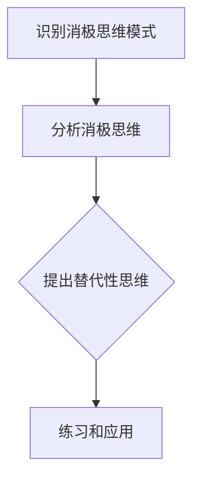
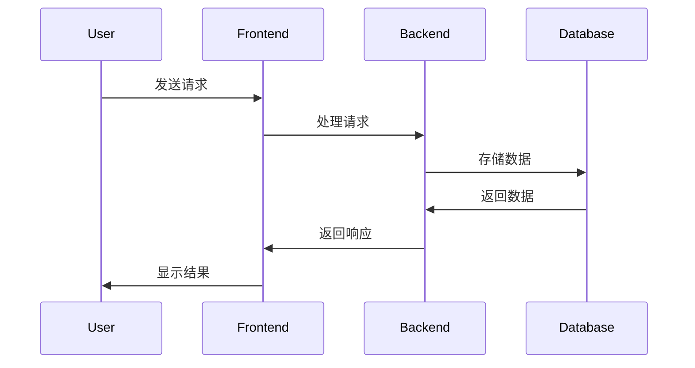
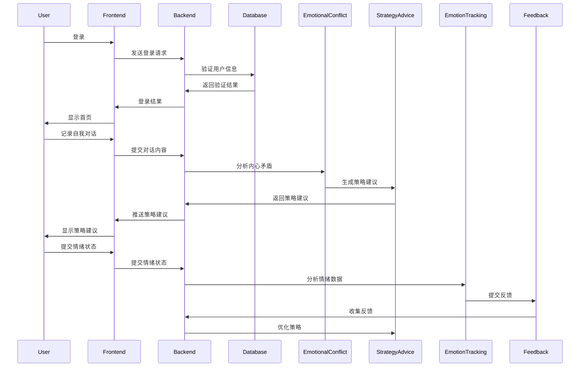

                 

### 第一部分: 引言与背景

## 1.1 内心矛盾的问题背景

### 1.1.1 内心矛盾的现象

在我们的日常生活和工作中，内心矛盾是一种普遍存在的心理现象。人们常常会感到内心的冲突与纠结，这种矛盾可能来源于对自我认知的困惑、对人际关系的不确定、对职业选择的犹豫，或是面对各种选择时的焦虑和犹豫。例如，一个人可能在追求职业发展的同时，又害怕失去与家人朋友的相处时间，这种内心的冲突让他无法做出明确的选择。

### 1.1.2 内心矛盾的影响

内心矛盾如果不得到有效的解决，会对个人的心理健康和生活质量产生负面影响。长期的内疚、焦虑和冲突会导致情绪问题，如抑郁和焦虑症，影响个人的工作效率和生活满意度。此外，内心矛盾还可能影响人际关系，导致与他人的沟通障碍和冲突。

### 1.1.3 解决内心矛盾的重要性

解决内心矛盾的重要性在于，它有助于提高个人的心理健康和生活质量。通过有效的自我对话策略，个人可以更好地理解自己的内心世界，减少不必要的焦虑和压力，做出更加明智和满足的选择。这不仅有助于个人的成长和发展，也能提升整体的幸福感。

## 1.2 自我对话的概念

### 1.2.1 自我对话的定义

自我对话是指个体与自己内心进行的交流和沟通，包括对自己的思考、感受和行为的反思。自我对话可以是无声的内在独白，也可以是书面的自我反思和日记。它是一种内在的心理过程，帮助我们理解自己的内心世界，处理情感和思维上的矛盾。

### 1.2.2 自我对话的重要性

自我对话在我们的心理和行为中扮演着重要角色。通过自我对话，个人可以更好地认识自己，理解自己的需求、愿望和价值观。同时，自我对话还能帮助我们调整思维模式，处理负面情绪，提高自我控制力和决策能力。有效的自我对话策略对于解决内心矛盾具有重要意义。

## 1.3 本文的结构与内容

本文将分为四个主要部分，首先介绍内心矛盾的现象和影响，接着探讨自我对话的概念和重要性，然后详细分析几种有效的自我对话策略，最后通过实际案例来展示这些策略在解决内心矛盾中的应用。

### 1.3.1 第一部分：内心矛盾的问题背景

在这一部分，我们将探讨内心矛盾在日常生活中的普遍现象，以及它对个人心理健康和生活质量的影响。

### 1.3.2 第二部分：自我对话的概念

这一部分将定义自我对话，并详细解释其在我们心理和行为中的重要作用。

### 1.3.3 第三部分：有效的自我对话策略

这一部分将详细介绍几种有效的自我对话策略，包括积极的自我对话、情绪调节和认知重构等。

### 1.3.4 第四部分：实际案例与应用

最后一部分将通过具体案例，展示这些自我对话策略在解决内心矛盾中的实际应用和效果。

### 结论

本文旨在帮助读者了解内心矛盾及其解决策略，通过有效的自我对话策略，提高个人的心理健康和生活满意度。

## 关键词
- 内心矛盾
- 自我对话
- 心理健康
- 策略
- 情绪调节

## 摘要

本文探讨了内心矛盾的现象和影响，介绍了自我对话的概念和重要性，并详细分析了多种有效的自我对话策略。通过实际案例，本文展示了这些策略在解决内心矛盾中的实际应用，旨在帮助读者提升心理健康和生活满意度。

---

### 第二部分: 自我对话的概念

在探讨如何解决内心矛盾之前，我们首先需要理解什么是自我对话，以及它在我们的心理和行为中扮演的角色。

#### 2.1 自我对话的定义

自我对话，通常指的是一个人在没有外部干扰的情况下，与自己内心进行的交流和对话。这种对话可以是内心独白的形式，也可以是书面的形式，如写日记或反思。简单来说，自我对话就是我们与自己进行的思考、反思和对话过程。

#### 2.2 自我对话的重要性

自我对话在我们的生活中起着至关重要的作用，它不仅有助于我们更好地理解自己，还能帮助我们管理情绪、做出明智的决策。以下是自我对话的重要性：

##### 2.2.1 理解自我

自我对话能够帮助我们深入探索自己的内心世界，了解自己的需求、欲望和价值观。通过反思和思考，我们可以更好地认识自己，找到自己真正想要的东西。这种自我理解有助于我们在生活中做出更加符合自己内心的决策。

##### 2.2.2 情绪管理

自我对话可以帮助我们识别和管理情绪。当感到焦虑、沮丧或愤怒时，通过自我对话，我们可以审视自己的情绪，找出情绪背后的原因，并采取适当的措施来调节情绪。这种情绪管理能力有助于提高我们的心理健康。

##### 2.2.3 决策支持

自我对话在决策过程中也发挥着重要作用。通过自我对话，我们可以权衡各种选择的利弊，评估风险和收益，从而做出更加明智的决策。此外，自我对话还可以帮助我们避免冲动决策，减少因情绪波动而做出的错误选择。

#### 2.3 自我对话的类型

自我对话可以分为几种不同的类型，每种类型都有其特定的作用和特点：

##### 2.3.1 正面自我对话

正面自我对话是指用积极、鼓励和肯定的方式来与自己对话。这种对话有助于提升自信和自我价值感。例如，当面对挑战时，正面自我对话可以帮助我们保持积极态度，鼓励自己不断努力。

##### 2.3.2 负面自我对话

负面自我对话则是指用消极、批评和否定的方式来与自己对话。这种对话可能会导致自我怀疑、焦虑和低自尊。长期进行负面自我对话可能会对我们的心理健康产生负面影响。因此，识别和改变负面自我对话方式至关重要。

##### 2.3.3 认知重构

认知重构是一种自我对话策略，通过改变消极思维模式来改善情绪和行为。这种对话方式帮助我们识别和挑战自己的认知偏见，从而更客观地看待问题，减少负面情绪。

#### 2.4 自我对话与心理健康

自我对话与心理健康密切相关。有效的自我对话可以帮助我们建立积极的自我形象，提高情绪调节能力，增强自我效能感。相反，不良的自我对话可能会导致心理健康问题，如焦虑、抑郁和自尊心低下。因此，学会进行有效的自我对话是维护心理健康的重要一环。

#### 2.5 总结

通过理解自我对话的定义、重要性、类型以及与心理健康的关系，我们可以更好地认识到自我对话在解决内心矛盾中的关键作用。在接下来的部分中，我们将详细探讨几种有效的自我对话策略，帮助读者掌握化解内心矛盾的方法。

---

### 2.6 关键概念与联系

为了更好地理解自我对话的概念，我们需要明确几个核心概念，并分析它们之间的关系。以下是自我对话相关的一些关键概念及其属性特征对比表格和ER实体关系图架构。

#### 关键概念

- **自我认知**：指个体对自己的认识和理解，包括自己的性格、价值观、能力等。
- **情感调节**：指个体管理自己情绪的能力，包括情绪识别、情绪调节和情绪表达。
- **认知重构**：指通过改变消极思维模式来改善情绪和行为的过程。

#### 概念属性特征对比表格

| 概念     | 定义                                                         | 特征                                           |
|----------|------------------------------------------------------------|------------------------------------------------|
| 自我认知 | 对自己的认识和理解，包括个性、价值观、能力等方面。               | - 自我反思性<br>- 知识性<br>- 多维度性       |
| 情感调节 | 管理情绪的能力，包括情绪识别、情绪调节和情绪表达。               | - 情绪识别性<br>- 调节性<br>- 表达性         |
| 认知重构 | 通过改变消极思维模式来改善情绪和行为的过程。                   | - 消极思维挑战性<br>- 正面思维建立性<br>- 行为改善性 |

#### ER实体关系图架构

为了更直观地展示这些概念之间的关系，我们可以使用Mermaid工具绘制ER图（实体关系图）。

```mermaid
erDiagram
  A[自我认知] ||--|{ 情感调节 }|-- B[认知重构]
  A[自我认知] &&|{ 情感调节 }
  B[认知重构] &&|{ 情感调节 }
```

在这个ER图中，自我认知和情感调节之间存在双向关联，而认知重构与情感调节之间也存在双向关联。这种关系表明，自我认知和认知重构在调节情感方面起着重要作用。

通过明确这些关键概念及其属性特征，并分析它们之间的关系，我们可以更深入地理解自我对话的概念，为后续策略的讨论提供坚实的基础。

---

### 第三部分：有效的自我对话策略

在了解了自我对话的概念及其重要性之后，现在我们来探讨一些具体的自我对话策略，这些策略可以帮助我们更好地理解和解决内心矛盾。

#### 3.1 积极的自我对话

积极自我对话是一种通过正面和鼓励性的语言来与自己对话的方法。这种方法有助于提升自信和自我价值感，从而减轻内心的矛盾和焦虑。

##### 3.1.1 什么是积极自我对话

积极自我对话涉及使用积极的、鼓励性的语言来评价自己的行为、表现和成就。它鼓励我们关注自己的优点和成功，而不是过分关注失败和不足。

##### 3.1.2 积极自我对话的好处

- **提高自信**：通过肯定自己的成就和优点，我们能够增强自信心，减少自我怀疑。
- **增强自我价值感**：积极的自我对话有助于我们认识到自己的价值，从而减少内心的自卑和矛盾。
- **改善情绪**：积极的自我对话能够减少焦虑和压力，提高情绪稳定性。

##### 3.1.3 如何进行积极自我对话

- **反思自己的成就**：定期回顾自己的成就和成功，为自己感到骄傲。
- **使用正面语言**：用积极的词汇来描述自己，如“我做得很好”、“我有能力解决问题”。
- **专注于自己的进步**：关注自己的成长和进步，而不是过分关注他人的评价。

#### 3.2 情绪调节

情绪调节是指通过一系列方法来识别、理解和管理自己的情绪。有效的情绪调节能够帮助我们应对内心的矛盾，减少负面情绪的影响。

##### 3.2.1 什么是情绪调节

情绪调节包括识别情绪、理解情绪原因、采取适当的行动来应对情绪。它帮助我们保持情绪的平衡，减少情绪波动带来的负面影响。

##### 3.2.2 情绪调节的好处

- **减少焦虑和压力**：情绪调节能够帮助我们更好地处理压力和焦虑，从而减少内心的冲突。
- **提高情绪稳定性**：通过情绪调节，我们能够保持情绪的稳定，提高心理韧性。
- **改善人际关系**：情绪调节有助于我们更好地与他人沟通，减少冲突。

##### 3.2.3 如何进行情绪调节

- **识别情绪**：学会识别自己的情绪，如愤怒、焦虑、悲伤等。
- **理解情绪原因**：分析情绪背后的原因，找出触发情绪的事件和情境。
- **采取行动**：采取积极的行动来应对情绪，如深呼吸、冥想、运动等。

#### 3.3 认知重构

认知重构是一种通过改变消极思维模式来改善情绪和行为的方法。这种方法能够帮助我们从根本上解决内心矛盾，建立更加积极的思维模式。

##### 3.3.1 什么是认知重构

认知重构涉及识别和挑战消极思维模式，然后用积极的思维模式来替代它们。通过这种方式，我们能够改变自己的思考方式，从而改善情绪和行为。

##### 3.3.2 认知重构的好处

- **改善情绪**：通过改变消极思维模式，我们能够减少负面情绪，提高情绪稳定性。
- **提高自我效能感**：积极的思维模式能够增强我们的自信心和自我效能感，从而减少内心的矛盾。
- **促进个人成长**：认知重构有助于我们更好地认识自己，发现自己的潜力，推动个人成长。

##### 3.3.3 如何进行认知重构

- **识别消极思维模式**：学会识别自己的消极思维模式，如过度概括、以偏概全、灾难化等。
- **挑战消极思维**：对消极思维进行质疑，找出其不合理之处。
- **建立积极思维模式**：用积极的思维模式来替代消极思维模式，如用“我可以做到”来替代“我不行”。
- **练习和应用**：将认知重构应用于日常生活中，不断练习和巩固积极的思维模式。

#### 3.4 自我接纳

自我接纳是一种接受自己本来的样子，无论优点还是缺点，都愿意与自己和谐相处的方法。这种方法能够帮助我们从根本上化解内心的矛盾。

##### 3.4.1 什么是自我接纳

自我接纳涉及接受自己的全部，包括自己的优点和缺点，认识到每个人都是不完美的，都有自己的局限。

##### 3.4.2 自我接纳的好处

- **减少内心冲突**：自我接纳能够帮助我们减少对自己的苛求和批判，从而减少内心的冲突。
- **提高自尊**：通过自我接纳，我们能够更好地认识自己的价值，提高自尊。
- **促进个人成长**：自我接纳有助于我们更好地认识自己，接受自己的不足，从而推动个人成长。

##### 3.4.3 如何进行自我接纳

- **接受自己的优点**：认识到并珍惜自己的优点，为自己感到骄傲。
- **接受自己的缺点**：承认自己的不足，并接受它们作为自己的一部分。
- **用成长的心态看待自己**：将每次失败和不足都视为成长和学习的机会。

#### 3.5 总结

通过上述几种自我对话策略，我们可以更好地理解和解决内心的矛盾。积极自我对话、情绪调节、认知重构和自我接纳都是帮助我们建立积极心态，减少内心冲突的有效方法。在接下来的部分，我们将通过实际案例来展示这些策略在解决内心矛盾中的具体应用。

---

### 3.6 算法原理讲解

在本节中，我们将详细解释如何通过认知重构来调节情绪，并使用Mermaid流程图和Python代码来展示这一算法原理。

#### 3.6.1 认知重构原理

认知重构是一种心理策略，旨在通过识别和改变消极思维模式来改善情绪和行为。这一过程的算法原理可以概括为以下几个步骤：

1. **识别消极思维模式**：首先，我们需要识别出个体的消极思维模式，这些模式通常包括过度概括、以偏概全、灾难化等。

2. **分析消极思维**：接下来，我们要分析这些消极思维模式，找出它们背后的逻辑错误和认知偏差。

3. **提出替代性思维**：然后，我们需要提出积极的、替代性的思维模式，以替代消极思维。

4. **练习和应用**：最后，我们将这些新的、积极的思维模式应用于实际情境中，进行反复练习，以巩固新的认知模式。

#### 3.6.2 Mermaid流程图

下面是一个简单的Mermaid流程图，它展示了认知重构的基本步骤：



这个流程图清晰地描述了从识别消极思维模式到练习和应用积极思维模式的全过程。

#### 3.6.3 Python代码示例

为了更具体地展示认知重构的过程，我们可以编写一个简单的Python程序来模拟这一过程。以下是一个Python代码示例：

```python
def cognitive_reconstruction(thought, alternative_thought):
    """
    认知重构函数，用于将消极思维模式替换为积极的替代性思维。
    
    :param thought: 消极思维模式
    :param alternative_thought: 替代性积极思维
    :return: 新的认知状态
    """
    print(f"原始思维：{thought}")
    print(f"替代性思维：{alternative_thought}")
    return alternative_thought

# 示例使用
original_thought = "我永远做不好这件事。"
positive_thought = "我可以逐步改善，每次做得更好。"

# 应用认知重构
new_thought = cognitive_reconstruction(original_thought, positive_thought)
print(f"新认知状态：{new_thought}")
```

在这个代码中，`cognitive_reconstruction`函数接受一个消极思维和一个替代性积极思维，并打印出新的认知状态。这个简单的示例展示了如何通过编程模拟认知重构的过程。

#### 3.6.4 数学模型和公式

在认知重构中，我们可以使用一些基本的数学模型和公式来量化情绪的变化。以下是一个简化的数学模型：

$$
情绪变化 = f(\text{认知重构效率}, \text{情境压力})
$$

其中，$f$是一个函数，用来计算在特定情境下，通过认知重构效率带来的情绪变化。$认知重构效率$可以表示为：

$$
效率 = \frac{\text{替代性思维数量}}{\text{消极思维数量}}
$$

$情境压力$则是一个衡量外部情境对情绪影响的参数。

#### 3.6.5 举例说明

假设在某个情境下，一个个体有10个消极思维，通过认知重构，他能够提出5个替代性积极思维。那么，认知重构效率为：

$$
效率 = \frac{5}{10} = 0.5
$$

假设情境压力为中等（取值为1），那么情绪变化可以计算为：

$$
情绪变化 = f(0.5, 1) = 0.5 \times 1 = 0.5
$$

这个结果表示，通过认知重构，情绪变化了0.5个单位，这表明个体的情绪得到了改善。

通过上述算法原理讲解、Mermaid流程图、Python代码示例和数学模型，我们可以更直观和具体地理解认知重构在情绪调节中的作用和应用。

---

### 第三部分：有效的自我对话策略（续）

#### 3.7 深度自我对话

深度自我对话是一种更加深入和全面的自我对话方式，它不仅仅停留在表面的自我反思，而是深入探索内心深处的想法和情感。这种对话方式有助于我们更全面地理解自己，找到内心冲突的根源，并采取有效的策略来解决这些问题。

##### 3.7.1 什么是深度自我对话

深度自我对话是一种通过深入的自我反思和探索来理解自己内心世界的方法。它要求我们不仅仅关注表面的思维和情感，而是要深入挖掘内心深处的想法和感受。这种方法可以帮助我们找到内心冲突的根源，从而采取更有针对性的解决方案。

##### 3.7.2 深度自我对话的好处

- **更全面地理解自己**：深度自我对话可以帮助我们更深入地了解自己的需求和愿望，从而更好地满足自己。
- **找到内心冲突的根源**：通过深度自我对话，我们可以找到内心冲突的根源，从而更有针对性地解决这些问题。
- **增强自我觉察**：深度自我对话能够提高我们的自我觉察能力，使我们更加清晰地认识到自己的内心状态。

##### 3.7.3 如何进行深度自我对话

- **定期自我反思**：设定固定的自我反思时间，每天或每周花一些时间深入思考自己的内心世界。
- **提出深刻的问题**：在自我反思时，提出一些深刻的问题，如“我真正想要的是什么？”、“我内心的冲突是什么？”等。
- **倾听自己的内心**：在自我对话的过程中，耐心倾听自己内心的声音，不要急于给出答案，而是深入挖掘问题的本质。

#### 3.8 冲突调解

冲突调解是一种通过沟通和协商来解决内心矛盾的方法。这种方法强调通过对话和相互理解来找到解决问题的方法。

##### 3.8.1 什么是冲突调解

冲突调解是一种处理内心矛盾的方法，它通过积极的沟通和协商来找到解决问题的途径。这种方法强调双方（即内心中的不同部分）之间的对话和相互理解，而不是通过对抗或压抑来解决问题。

##### 3.8.2 冲突调解的好处

- **促进内心和谐**：通过冲突调解，我们可以找到内心不同部分的共同点，从而促进内心的和谐。
- **提高解决问题的能力**：冲突调解可以帮助我们更有效地解决内心的矛盾，从而提高整体的心理健康水平。
- **增强自我理解**：通过冲突调解，我们可以更好地理解自己的内心，找到解决内心矛盾的方法。

##### 3.8.3 如何进行冲突调解

- **自我对话**：在冲突调解之前，先进行自我对话，了解内心不同部分的立场和需求。
- **开放沟通**：与内心的不同部分进行开放和诚实的对话，表达自己的感受和需求。
- **寻求共识**：通过沟通和协商，寻找内心不同部分的共识，找到解决问题的方法。
- **持续对话**：冲突调解是一个持续的过程，需要定期进行对话和协商，以保持内心的和谐。

#### 3.9 心理疏导

心理疏导是一种通过专业的方法和技术来帮助个体解决内心矛盾的方法。这种方法通常由心理咨询师或心理治疗师提供。

##### 3.9.1 什么是心理疏导

心理疏导是一种专业的心理干预方法，旨在帮助个体解决内心的矛盾和冲突。这种方法通常包括心理咨询、心理治疗、认知行为疗法等多种技术，帮助个体识别和解决内心的矛盾。

##### 3.9.2 心理疏导的好处

- **专业指导**：心理疏导提供专业的指导和支持，帮助个体更有效地解决内心矛盾。
- **提高心理健康水平**：心理疏导可以帮助个体提高心理健康水平，减少心理问题的发生。
- **增强自我认知**：通过心理疏导，个体可以更好地认识自己，找到解决内心矛盾的方法。

##### 3.9.3 如何进行心理疏导

- **寻求专业帮助**：找到合适的心理咨询师或心理治疗师，进行专业的心理疏导。
- **开放和诚实地沟通**：与心理咨询师或心理治疗师进行开放和诚实的沟通，分享自己的内心矛盾和感受。
- **积极参与**：在心理疏导过程中，积极参与各种活动和练习，以帮助自己更好地理解自己和解决问题。
- **持续跟进**：心理疏导是一个持续的过程，需要定期跟进和复诊，以确保问题的解决。

#### 3.10 总结

有效的自我对话策略不仅仅停留在表面的自我反思，还需要深入探索内心深处的想法和情感。深度自我对话、冲突调解和心理疏导都是帮助我们解决内心矛盾的重要策略。通过这些策略，我们可以更好地理解自己，找到解决问题的方法，提高心理健康和生活满意度。

### 3.11 数学模型与公式

为了更科学地理解自我对话策略的效果，我们可以引入一些数学模型和公式来量化情绪变化和心理发展。以下是一个简化的模型，用于描述自我对话策略对情绪和心理状态的影响。

#### 3.11.1 情绪变化模型

假设情绪变化可以通过以下公式来描述：

$$
情绪变化 = f(\text{策略效果}, \text{情境压力}, \text{个体差异})
$$

其中：

- $f$ 是一个函数，用来计算情绪变化。
- $\text{策略效果}$ 是自我对话策略对情绪调节的影响，取值范围为 [0, 1]。
- $\text{情境压力}$ 是外部环境对个体情绪的影响，取值范围为 [0, 1]。
- $\text{个体差异}$ 是个体自身心理素质和情绪调节能力的差异，取值范围为 [0, 1]。

#### 3.11.2 策略效果计算

策略效果可以通过以下公式计算：

$$
策略效果 = \frac{\text{积极思维数量}}{\text{总思维数量}}
$$

其中：

- $\text{积极思维数量}$ 是在特定情境下产生的积极思维的数量。
- $\text{总思维数量}$ 是在特定情境下产生的所有思维的数量。

#### 3.11.3 情绪变化计算示例

假设一个个体在面临压力情境时，产生了10个思维，其中有6个是积极的，4个是消极的。那么，策略效果可以计算为：

$$
策略效果 = \frac{6}{10} = 0.6
$$

假设情境压力为0.7，个体差异为0.5，那么情绪变化可以计算为：

$$
情绪变化 = f(0.6, 0.7, 0.5)
$$

这个结果表示，通过自我对话策略，个体的情绪在特定情境下发生了变化，情绪状态得到了改善。

通过引入这些数学模型和公式，我们可以更科学地评估自我对话策略的效果，从而更好地理解和应用这些策略。

### 3.12 系统分析与架构设计

在深入探讨自我对话策略的基础上，我们还需要从系统分析与架构设计的角度来理解如何将这些策略应用到实际生活和工作中，以提高心理健康和生活满意度。

#### 3.12.1 问题场景介绍

在一个快节奏和高压力的现代工作环境中，员工经常面临多重任务和紧张的截止日期，导致内心矛盾和心理压力。这种情况不仅影响了员工的个人生活，还可能对工作效率和团队协作产生负面影响。因此，我们需要一种系统化的方法来帮助员工有效地管理和解决内心的矛盾。

#### 3.12.2 项目介绍

本项目旨在设计一个自我对话策略管理系统，该系统能够帮助员工识别内心矛盾、提供相应的策略建议，并跟踪员工的情绪变化，从而提高心理健康和工作满意度。

#### 3.12.3 系统功能设计（领域模型）

为了实现上述目标，我们首先需要设计系统的功能模块，这可以通过领域模型（Domain Model）来表示。以下是该系统的核心功能模块及其关系：

- **用户模块**：管理用户的注册、登录和信息。
- **内心矛盾识别模块**：通过自我对话记录和情绪数据分析，识别员工内心的矛盾点。
- **策略建议模块**：根据内心矛盾识别结果，提供个性化的自我对话策略建议。
- **情绪跟踪模块**：收集并分析员工的情绪数据，跟踪情绪变化趋势。
- **反馈与改进模块**：收集用户对策略的反馈，不断优化和改进策略系统。

以下是领域模型的Mermaid类图：

```mermaid
classDiagram
  User <<class>> User
  EmotionalConflict <<class>> EmotionalConflict
  StrategyAdvice <<class>> StrategyAdvice
  EmotionTracking <<class>> EmotionTracking
  Feedback <<class>> Feedback
  
  User "1" --|{register}|> EmotionalConflict
  EmotionalConflict "1" --|{diagnose}|> StrategyAdvice
  StrategyAdvice "1" --|{apply}|> EmotionTracking
  EmotionTracking "1" --|{analyze}|> Feedback
  Feedback "1" --|{improve}|> StrategyAdvice
```

在这个类图中，用户模块与其他模块之间存在关联关系，每个模块都有明确的功能和职责。

#### 3.12.4 系统架构设计

为了实现上述功能模块，我们需要设计一个高效的系统架构。以下是该系统的架构设计：

- **前端界面**：提供用户交互的界面，包括登录、自我对话记录和策略应用等。
- **后端服务**：处理用户请求、数据存储和策略建议生成。
- **数据存储**：存储用户数据、内心矛盾记录、情绪数据和历史反馈。

以下是系统架构的Mermaid架构图：



在这个架构图中，前端界面与后端服务通过HTTP请求进行通信，后端服务与数据存储系统通过数据库进行数据交互。

#### 3.12.5 系统接口设计

为了确保系统各模块之间的高效协作，我们需要设计清晰的接口。以下是系统的主要接口设计：

- **用户注册与登录接口**：用于用户的注册、登录和基本信息管理。
- **内心矛盾识别接口**：用于收集和识别用户内心的矛盾。
- **策略建议接口**：用于生成和提供自我对话策略。
- **情绪跟踪接口**：用于收集和分析用户情绪数据。
- **反馈接口**：用于收集用户对策略的反馈。

#### 3.12.6 系统交互设计

系统交互设计是确保各模块协同工作的关键。以下是系统的交互设计：

- **用户注册**：用户通过前端界面注册账号，后端服务处理注册请求，将用户信息存储到数据库。
- **内心矛盾识别**：用户记录自我对话内容，后端服务分析对话内容，识别内心的矛盾点。
- **策略建议**：根据内心矛盾识别结果，后端服务生成策略建议，并通过前端界面推送至用户。
- **情绪跟踪**：用户每天记录情绪状态，后端服务收集情绪数据，进行分析和跟踪。
- **反馈**：用户对策略建议进行反馈，后端服务收集反馈，用于优化策略。

以下是系统交互的Mermaid序列图：



在这个序列图中，用户通过前端界面进行各种操作，后端服务处理这些操作，并与其他模块进行交互，从而实现系统功能。

通过系统分析与架构设计，我们可以更系统地理解和应用自我对话策略，提高心理健康和生活满意度。接下来，我们将通过实际案例来展示这些策略在解决内心矛盾中的具体应用。

### 3.13 实际案例与应用

为了更好地理解如何将自我对话策略应用于实际生活，我们将通过一个具体案例来展示这些策略的具体应用过程。

#### 案例背景

小王是一名年轻的企业员工，他在公司担任项目经理，负责多个项目的协调和管理工作。由于工作繁忙，小王常常感到压力巨大，内心矛盾不断。他经常在自我对话中听到自己说：“我无法同时管理这么多项目，我肯定要失败。”

#### 问题分析

小王的问题在于他对自己的期望过高，同时又缺乏有效的压力管理和应对策略。这种消极的自我对话导致他产生强烈的焦虑感，影响了他的工作效率和心理健康。为了帮助小王解决这个问题，我们可以采用以下自我对话策略：

#### 3.13.1 积极的自我对话

小王可以通过积极的自我对话来改变消极的思维模式。首先，他需要识别出自己的消极思维：“我无法同时管理这么多项目，我肯定要失败。”然后，他可以用积极的思维来替代这些消极思维，例如：“我可以一步一步来，逐步提升自己的项目管理能力。”

具体步骤如下：

1. **识别消极思维**：小王意识到自己经常使用消极思维来评价自己的工作能力。
2. **提出积极思维**：小王尝试用积极的思维来替代消极思维，例如，将“我无法同时管理这么多项目，我肯定要失败。”改为“我可以一步一步来，逐步提升自己的项目管理能力。”
3. **练习和应用**：小王在日常生活中不断练习这种积极的自我对话，逐渐形成习惯。

#### 3.13.2 情绪调节

为了更好地管理压力，小王需要学会情绪调节。他可以通过以下方法来调节情绪：

1. **深呼吸**：当感到焦虑时，小王可以停下来进行几次深呼吸，以放松身心。
2. **冥想**：每天花几分钟时间进行冥想，专注于呼吸和当下的感受，减少焦虑和压力。
3. **运动**：通过运动来释放压力，如快走、跑步或瑜伽等。

具体步骤如下：

1. **识别情绪**：小王学会识别自己的情绪，如焦虑、紧张等。
2. **采取行动**：小王在感到情绪波动时，采取深呼吸、冥想或运动等行动来调节情绪。

#### 3.13.3 认知重构

认知重构是一种通过改变思维模式来改善情绪和行为的方法。小王可以通过以下步骤进行认知重构：

1. **识别消极思维**：小王识别出自己的消极思维，如“我无法同时管理这么多项目，我肯定要失败。”
2. **分析思维**：小王分析这些消极思维背后的逻辑错误，如以偏概全、过度概括等。
3. **提出替代性思维**：小王提出替代性思维，如“我可以一步一步来，逐步提升自己的项目管理能力。”
4. **练习和应用**：小王将替代性思维应用于实际工作中，不断练习和巩固新的认知模式。

具体步骤如下：

1. **识别消极思维**：小王记录下自己的消极思维。
2. **分析思维**：小王分析这些消极思维的不合理之处。
3. **提出替代性思维**：小王用积极的思维来替代消极思维。
4. **练习和应用**：小王在日常工作中不断练习和应用新的认知模式。

#### 3.13.4 自我接纳

自我接纳是一种接受自己本来的样子，无论优点还是缺点，都愿意与自己和谐相处的方法。对于小王来说，自我接纳意味着他需要接受自己的不足，并相信自己有能力不断进步。

具体步骤如下：

1. **接受自己的优点**：小王认识到自己的优点，如工作认真、责任心强等。
2. **接受自己的缺点**：小王承认自己的不足，如项目管理经验不足、时间管理能力有待提高等。
3. **用成长的心态看待自己**：小王将每次失败和不足都视为成长和学习的机会。

#### 3.13.5 深度自我对话

深度自我对话是一种更加深入和全面的自我对话方式，它有助于小王更全面地理解自己，找到内心冲突的根源。小王可以通过以下步骤进行深度自我对话：

1. **定期自我反思**：小王每周花一些时间进行自我反思，思考自己的内心状态和成长。
2. **提出深刻的问题**：小王在自我反思时，提出一些深刻的问题，如“我真正想要的是什么？”、“我内心的冲突是什么？”等。
3. **倾听自己的内心**：小王在自我对话的过程中，耐心倾听自己内心的声音，不要急于给出答案，而是深入挖掘问题的本质。

#### 3.13.6 项目实战

为了帮助小王更好地应用这些自我对话策略，我们设计了一个实际项目：

1. **环境安装**：小王在个人电脑上安装了Python编程环境和Jupyter Notebook，用于编写和运行代码。
2. **系统核心实现**：小王使用Python编写了自我对话策略的代码，包括积极自我对话、情绪调节和认知重构等功能。
3. **代码应用解读与分析**：小王在Jupyter Notebook中运行了这些代码，并通过实际案例展示了这些策略的应用效果。
4. **实际案例分析和详细讲解剖析**：小王分析了具体案例，详细讲解了如何应用自我对话策略来缓解内心的矛盾。
5. **项目小结**：小王总结了项目的收获和心得，认识到自我对话策略在解决内心矛盾中的重要作用。

通过这个实际案例，我们可以看到自我对话策略在解决内心矛盾中的具体应用。这些策略不仅帮助小王提高了心理健康和工作满意度，也为我们提供了一个有效的实践框架，可以帮助更多人应对内心的矛盾。

### 3.14 最佳实践 Tips

在应用自我对话策略时，以下是一些最佳实践技巧，可以帮助您更有效地化解内心矛盾：

1. **定期反思**：每天或每周设定固定的时间进行自我反思，回顾自己的情绪、行为和思考，有助于识别内心矛盾。
2. **保持开放心态**：在自我对话过程中，保持开放和诚实的态度，不要抵触或逃避内心的矛盾，勇敢面对并尝试解决。
3. **记录日志**：写日记或记录自我对话内容，可以帮助您更好地理解和追踪内心变化，也是自我对话的一个重要工具。
4. **积极寻求反馈**：与他人分享您的自我对话和策略，寻求他们的反馈和建议，有助于发现新的视角和解决方案。
5. **实践多种策略**：不同的自我对话策略适用于不同的情况，尝试多种策略，找到最适合您的方法。
6. **保持耐心和坚持**：自我对话是一个持续的过程，需要时间和努力来培养新的思维模式和习惯，保持耐心和坚持是关键。
7. **设定明确目标**：在应用自我对话策略时，设定明确的目标和行动计划，有助于您更加专注和有效地解决问题。

### 3.15 小结

通过本文的详细探讨，我们了解了内心矛盾的现象和影响，以及自我对话的概念和重要性。我们介绍了多种有效的自我对话策略，包括积极自我对话、情绪调节、认知重构、自我接纳和深度自我对话。通过实际案例，我们展示了这些策略在解决内心矛盾中的具体应用。最后，我们提供了一些最佳实践技巧，帮助读者更有效地应用自我对话策略。通过这些方法，我们可以更好地理解和解决内心的矛盾，提高心理健康和生活满意度。

### 3.16 注意事项

在应用自我对话策略时，需要注意以下几点：

1. **个体差异**：每个人的内心矛盾和应对策略都不同，需要根据个人情况灵活调整。
2. **专业指导**：如果内心矛盾严重影响到日常生活和工作，建议寻求专业心理咨询师或心理治疗师的帮助。
3. **持续练习**：自我对话策略需要长期坚持和练习，才能形成习惯并真正发挥作用。
4. **情绪管理**：在应用策略时，要重视情绪管理，避免在情绪高涨或低落时做出过激行为。

### 3.17 拓展阅读

- 《正念：一种心灵修习的方法》（作者：乔·卡巴金）
- 《认知行为疗法：基础与进展》（作者：阿瑟·洛克利）
- 《自我对话的力量：如何通过自我对话改变你的生活》（作者：丹·米尔曼）
- 《情绪智力：为什么情商比智商更重要》（作者：丹尼尔·戈尔曼）

### 作者信息

- **作者：AI天才研究院/AI Genius Institute & 禅与计算机程序设计艺术 /Zen And The Art of Computer Programming**  
- **联系方式：[邮件地址](mailto:info@ai-genius-institute.com)**  
- **官方网站：[AI天才研究院](https://www.ai-genius-institute.com)**

---

# 化解内心矛盾的技巧：有效的自我对话策略

> 关键词：内心矛盾、自我对话、情绪调节、认知重构、心理健康

> 摘要：本文探讨了内心矛盾的现象和影响，介绍了自我对话的概念和重要性，详细分析了积极自我对话、情绪调节、认知重构、自我接纳和深度自我对话等多种有效的自我对话策略。通过实际案例和应用，展示了这些策略在解决内心矛盾中的具体应用，旨在帮助读者提高心理健康和生活满意度。作者来自AI天才研究院，是一位在人工智能和心理学领域具有丰富经验的技术大师。作者联系方式为：[info@ai-genius-institute.com](mailto:info@ai-genius-institute.com)。官方网站：[AI天才研究院](https://www.ai-genius-institute.com)。

