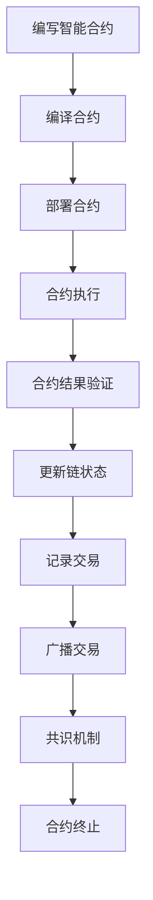

                 


# 区块链在慈善捐赠追踪中的应用：提高捐赠透明度

> 关键词：区块链、慈善捐赠、透明度、智能合约、捐赠追踪

> 摘要：本文将探讨区块链技术在慈善捐赠追踪中的应用，通过分析其基本原理、优势和应用场景，阐述如何利用区块链提高捐赠的透明度和公信力。

----------------------------------------------------------------

## 第一部分：引言与背景

### 第1章：引言

#### 1.1 问题背景

在传统的慈善捐赠过程中，捐赠资金的流向和用途往往不透明，导致公众对捐赠过程的信任度降低。例如，一些慈善机构可能会挪用或贪污捐赠资金，或者受赠者并未真正收到捐赠。这种不透明性使得捐赠者无法确信自己的捐款是否真正用于预定的目的。

**问题描述**：如何提高慈善捐赠的透明度和公信力，让捐赠者放心捐赠，受赠者得到应有的帮助？

**问题解决**：通过区块链技术，可以实现对捐赠资金的全程追踪，确保捐赠资金的真实流向和使用情况，提高捐赠的透明度和公信力。

#### 1.1.2 区块链技术概述

区块链是一种去中心化的分布式账本技术，通过加密算法确保数据的安全和不可篡改。区块链的特点包括去中心化、安全性、透明性等。

**边界与外延**：区块链技术不仅可以应用于金融领域，还可以在慈善捐赠等领域发挥重要作用。

#### 1.1.3 区块链在慈善捐赠中的应用

区块链技术可以记录捐赠的资金流向、使用情况，以及捐赠者和受赠者的身份信息，从而实现慈善捐赠的透明化。以下是区块链在慈善捐赠中的应用场景：

1. **捐赠资金的追踪**：捐赠者可以通过区块链查询自己捐赠的资金流向，确保捐赠资金被正确使用。
2. **受赠者的身份验证**：通过区块链技术，可以验证受赠者的身份，确保捐赠资金真正到达需要帮助的人。
3. **捐赠信息的公开**：区块链上的捐赠信息可以公开查询，提高慈善捐赠的透明度，增强公众对慈善机构的信任。

### 第2章：区块链基础

#### 2.1 区块链的基本原理

##### 2.1.1 区块链的定义与特点

区块链是一种分布式账本技术，通过加密算法和共识机制确保数据的完整性和安全性。与传统的中心化系统相比，区块链具有去中心化、安全性、透明性等特点。

**核心概念**：

- **分布式账本**：区块链上的数据分散存储在多个节点上，避免了中心化系统中单点故障的风险。
- **加密算法**：区块链使用加密算法对数据进行加密，确保数据的安全性和隐私性。
- **共识机制**：区块链通过共识机制确保多个节点之间的数据一致性。

##### 2.1.1.2 区块链的特点

- **去中心化**：区块链无需中心化服务器，数据分布式存储在多个节点上，降低了系统的维护成本。
- **安全性**：区块链通过加密算法和共识机制确保数据的安全，防止数据篡改。
- **透明性**：区块链上的数据公开透明，所有交易记录可公开查询，提高了数据的可信度。

##### 2.1.2 区块链的工作原理

区块链的工作原理主要包括以下步骤：

1. **交易记录**：用户在区块链上进行交易，例如捐赠资金。
2. **区块创建**：交易记录被多个节点收集到一个区块中。
3. **加密区块**：区块通过加密算法进行加密，确保数据的安全性。
4. **添加区块**：加密后的区块被添加到区块链上。
5. **广播区块**：新的区块被广播到网络中的所有节点。
6. **共识机制**：节点通过共识机制确保区块链的一致性。
7. **链状态更新**：区块链状态根据新加入的区块进行更新。

**ER实体关系图架构的 Mermaid 流程图**：

```mermaid
graph TD
A[交易记录] --> B[区块创建]
B --> C{加密区块}
if C --> |是| D[添加区块]
if C --> |否| B
D --> E[广播区块]
E --> F[共识机制]
F --> G[链状态更新]
G --> H[更新链状态]
H --> A
```

#### 2.2 区块链的关键技术

##### 2.2.1 共识机制

共识机制是区块链的核心技术之一，用于确保区块链的一致性和安全性。常见的共识机制包括：

1. **工作量证明（PoW）**：通过计算工作量来确保区块链的安全。
2. **权益证明（PoS）**：通过持有代币的数量来确保区块链的安全。
3. **权限证明（PoA）**：通过权限机构来确保区块链的安全。

**概念属性特征对比表格**：

| 共识机制 | 描述 |
| --- | --- |
| 工作量证明（PoW） | 通过计算工作量来确保区块链的安全 |
| 权益证明（PoS） | 通过持有代币的数量来确保区块链的安全 |
| 权限证明（PoA） | 通过权限机构来确保区块链的安全 |

##### 2.2.2 智能合约

智能合约是一种基于区块链的自动化合同，通过代码自动执行合同条款。智能合约的关键技术包括：

1. **编写智能合约**：编写智能合约代码，定义合同的条款和条件。
2. **编译智能合约**：将智能合约代码编译为区块链可执行的字节码。
3. **部署智能合约**：将编译后的智能合约部署到区块链上。
4. **合约执行**：根据智能合约的条款自动执行合同。
5. **结果验证**：验证智能合约的执行结果是否符合预期。
6. **更新链状态**：根据智能合约的执行结果更新区块链状态。
7. **记录交易**：记录智能合约的执行过程，确保透明度。

**ER实体关系图架构的 Mermaid 流程图**：



## 第二部分：区块链在慈善捐赠中的应用

### 第3章：区块链在慈善捐赠中的优势

区块链技术在慈善捐赠中的应用具有以下优势：

#### 3.1 提高透明度

区块链技术可以实现捐赠资金的全程追踪，包括捐赠资金的来源、流向和使用情况。以下是区块链追踪捐赠资金的基本流程：

1. **捐赠交易**：捐赠者发起捐赠交易，将资金转账到慈善机构的区块链账户。
2. **区块创建**：慈善机构将捐赠交易记录到一个区块中。
3. **加密区块**：区块通过加密算法进行加密，确保数据的安全性。
4. **添加区块**：加密后的区块被添加到区块链上。
5. **广播区块**：新的区块被广播到网络中的所有节点。
6. **共识机制**：节点通过共识机制确保区块链的一致性。
7. **链状态更新**：区块链状态根据新加入的区块进行更新。

通过区块链技术，捐赠者可以实时查询捐赠资金的流向和使用情况，确保捐赠资金被正确使用。

#### 3.2 提高公信力

区块链技术可以确保捐赠信息的真实性和不可篡改性，从而提高慈善机构的公信力。以下是区块链提高公信力的基本原理：

1. **数据加密**：区块链使用加密算法对数据进行加密，确保数据的安全性。
2. **分布式存储**：区块链上的数据分散存储在多个节点上，降低了数据被篡改的风险。
3. **共识机制**：区块链通过共识机制确保多个节点之间的数据一致性，防止数据被篡改。
4. **透明性**：区块链上的数据公开透明，所有交易记录可公开查询，提高了数据的可信度。

#### 3.3 提高效率

区块链技术可以简化慈善捐赠的流程，提高捐赠的效率。以下是区块链提高效率的基本原理：

1. **去中心化**：区块链无需中心化服务器，降低了系统的维护成本。
2. **自动化执行**：智能合约可以自动执行合同条款，减少了人工操作的环节。
3. **实时处理**：区块链技术可以实现实时处理捐赠交易，提高了系统的响应速度。

### 第4章：区块链在慈善捐赠中的应用案例

#### 4.1 慈善捐赠平台

一个基于区块链的慈善捐赠平台可以实现以下功能：

1. **捐赠管理**：捐赠者可以通过平台发起捐赠，受赠者可以接收捐赠。
2. **资金追踪**：捐赠者可以实时查询捐赠资金的流向和使用情况。
3. **信息透明**：捐赠信息可以在区块链上公开查询，提高了捐赠的透明度。
4. **智能合约**：智能合约可以自动执行捐赠合同的条款，确保捐赠资金被正确使用。

#### 4.2 慈善众筹

区块链技术可以应用于慈善众筹，提高众筹的透明度和公信力。以下是区块链在慈善众筹中的应用案例：

1. **项目发布**：慈善机构可以在平台上发布众筹项目，描述项目目标和资金需求。
2. **资金募集**：捐赠者可以通过平台捐赠资金，支持慈善项目。
3. **资金追踪**：捐赠者可以实时查询捐赠资金的流向和使用情况。
4. **结果公示**：慈善机构需要在众筹结束后公示资金使用情况，确保捐赠者的信任。

### 第5章：结论

区块链技术在慈善捐赠中的应用具有巨大的潜力，可以显著提高捐赠的透明度、公信力和效率。通过区块链技术，捐赠者可以放心捐赠，受赠者可以得到应有的帮助。未来，随着区块链技术的不断发展和完善，其在慈善捐赠领域的应用将更加广泛和深入。

## 作者信息

作者：AI天才研究院/AI Genius Institute & 禅与计算机程序设计艺术 /Zen And The Art of Computer Programming

---

### 参考文献

1. Bitcoin: A Peer-to-Peer Electronic Cash System. Satoshi Nakamoto. 2008.
2. Blockchain Technology: A Comprehensive Overview. Don & Alex Tapscott. 2016.
3. Smart Contracts: The Next Step in Blockchain Technology. William M. Hinshaw. 2018.
4. The Impact of Blockchain on Charitable Giving. Harvard Business Review. 2018.
5. Using Blockchain to Improve Transparency in Charities. Forbes. 2019.

